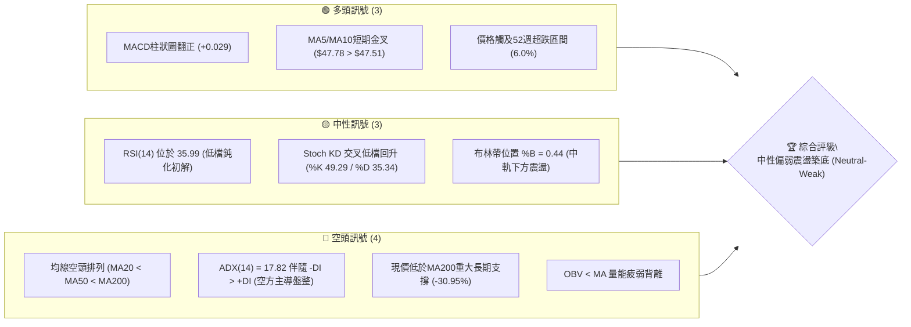
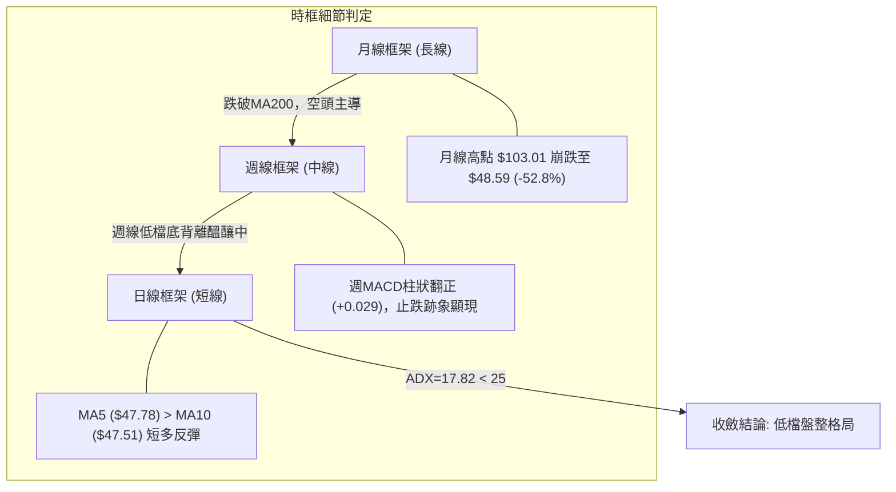
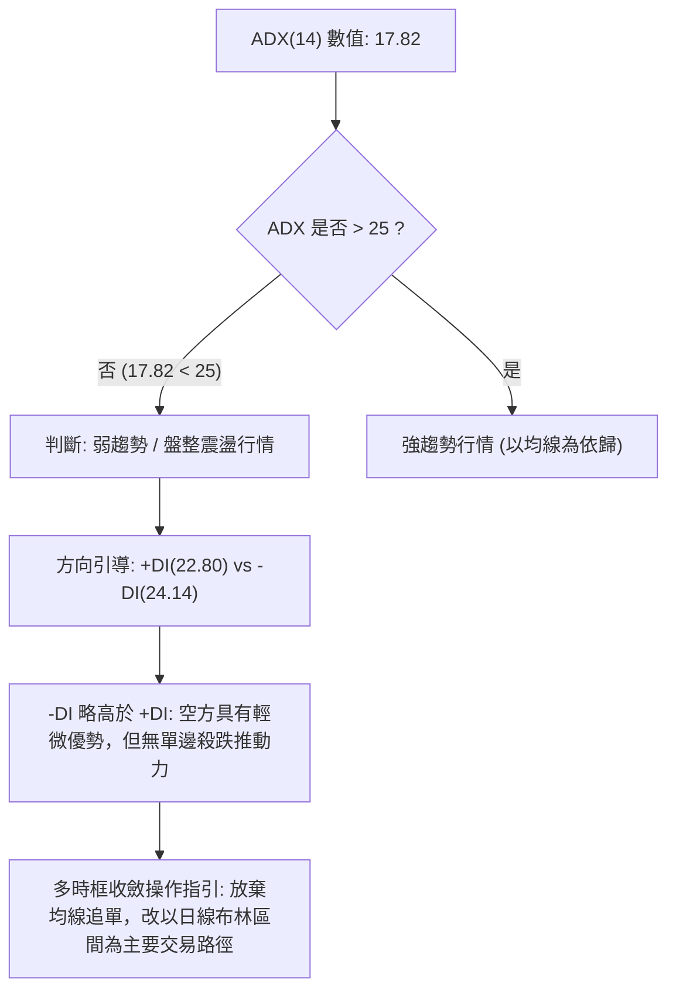
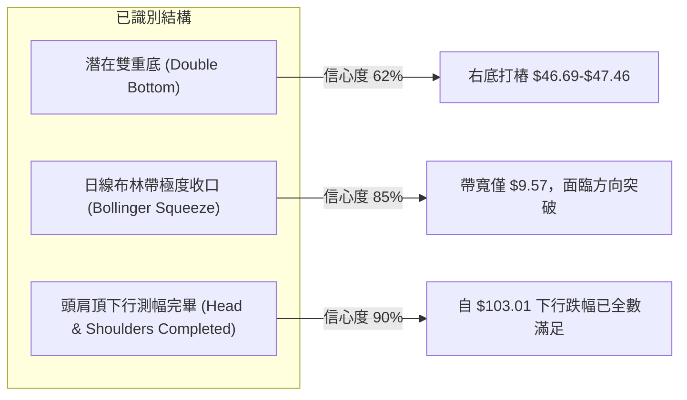
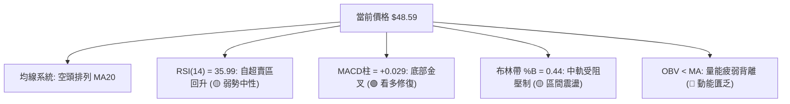
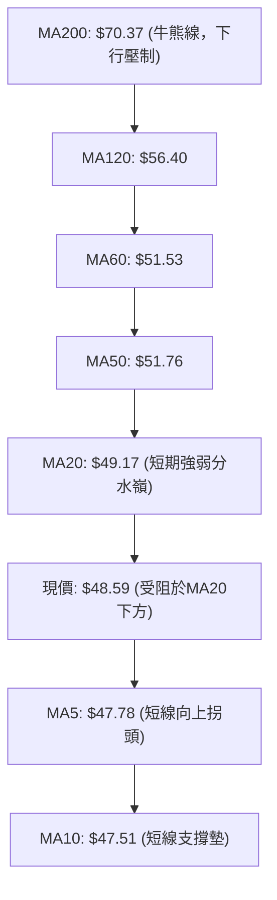
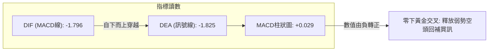
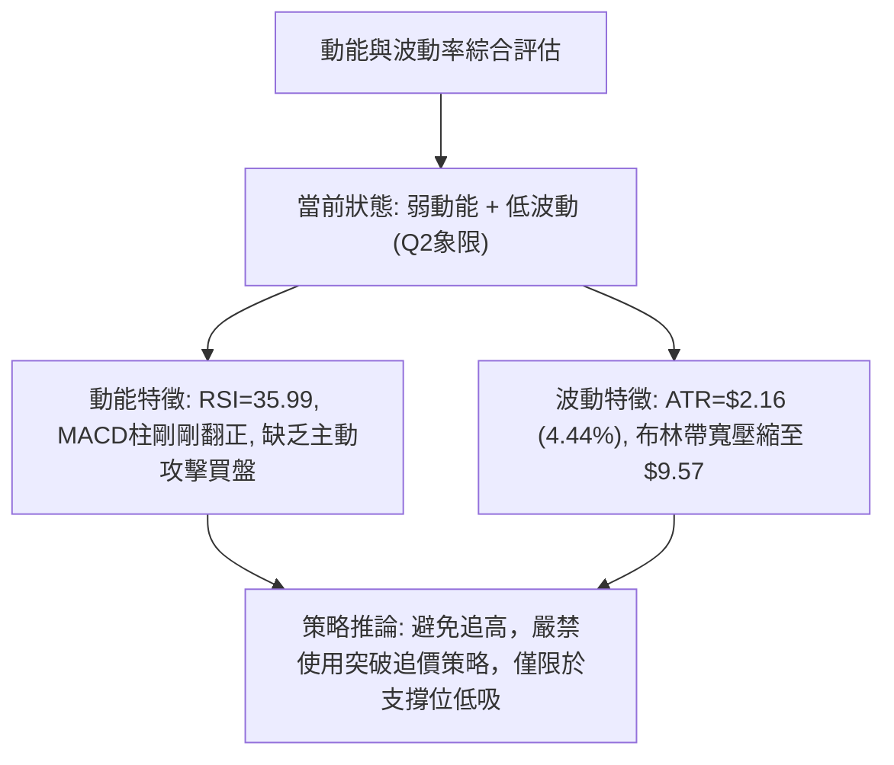
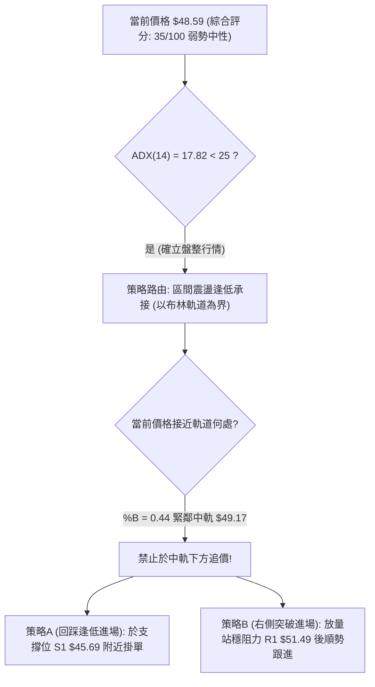
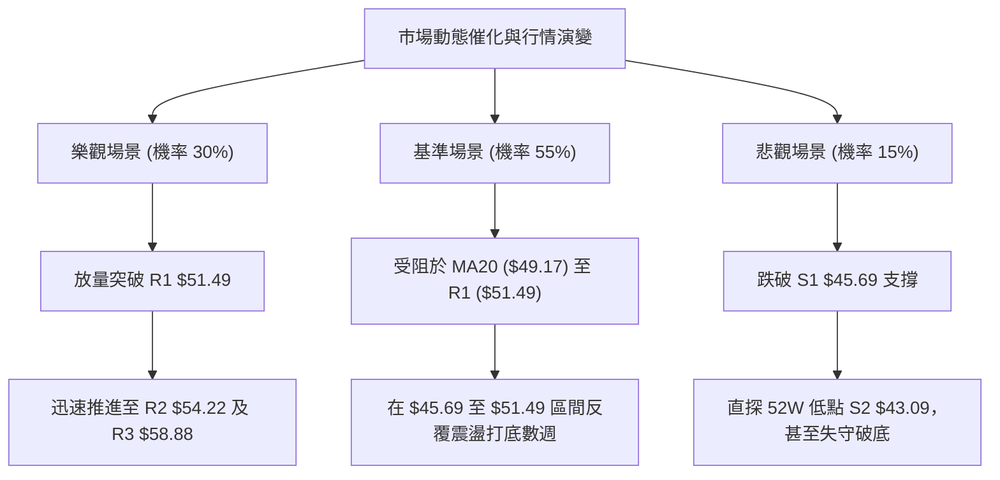

# KTOS 技術分析報告

> **報告日期**：2026-09-22 ｜ **語言**：繁體中文 ｜ **數據來源**：Yahoo Finance ｜ **當前價格**：$48.59

---

## 目錄

| 章節 | 內容 |
|------|------|
| [1. 技術面概覽](#1-技術面概覽) | 訊號儀表板、核心指標、評分卡 |
| [2. 趨勢分析](#2-趨勢分析) | 多時框趨勢、長中短期走勢、ADX強度 |
| [3. 圖表形態分析](#3-圖表形態分析) | 形態識別、信心度評估、K線組合 |
| [4. 支撐與阻力](#4-支撐與阻力) | 結構分布圖、關鍵價位、斐波那契回調 |
| [5. 技術指標深度解讀](#5-技術指標深度解讀) | 均線系統、RSI、MACD、布林通道、OBV量價 |
| [6. 動能與波動率](#6-動能與波動率) | 動能矩陣、ATR風控測算、Beta敏感度 |
| [7. 多時框架總結](#7-多時框架總結) | 時框架矩陣、多時框收斂規則、主導方向 |
| [8. 交易策略建議](#8-交易策略建議) | 策略路由、主策略規劃、情境機率、風報比 |
| [9. 風險提示與監控](#9-風險提示與監控) | 關鍵指標Checklist、情境路徑、風控規則 |
| [10. 報告總結](#-報告總結) | 核心結論與執行路徑匯總 |

---

## 1. 技術面概覽

### 🎯 技術訊號儀表板



### 📊 核心指標速覽表

| 指標類別 | 指標名稱 | 當前數值 | 訊號 | 解讀 |
|:---|:---|:---:|:---:|:---|
| **價格** | 當前價格 | $48.59 | 🟡 | 位於52週區間 6.0% 處，處於歷史極低檔築底階段 |
| **均線** | MA20 | $49.17 | 🔴 | 價格低於MA20 (-1.19%)，短線面臨中軌直接壓制 |
| **均線** | MA50 | $51.76 | 🔴 | 價格顯著低於MA50 (-6.12%)，中期波段空頭壓制 |
| **均線** | MA200 | $70.37 | 🔴 | 價格低於MA200 (-30.95%)，長期結構嚴重破位 |
| **動能** | RSI(14) | 35.99 | 🟡 | 位於中性偏弱區間，脫離極度超賣區，呈現低檔弱修復 |
| **動能** | MACD (12,26,9) | -1.796 / -1.825 | 🟢 | 負值區快慢線初現微幅黃金交叉，Hist = +0.029 |
| **動能** | Stoch %K / %D | 49.29 / 35.34 | 🟢 | 短線KD自超賣區發散上行，短多動能增強 |
| **趨勢** | ADX(14) / ±DI | 17.82 (-DI:24.14) | 🟡 | 數值低於25，空頭單邊跌勢衰竭，轉入低檔箱型盤整 |
| **波動** | 布林帶 (%B) | 0.44 (寬度 $9.57) | 🟡 | 價格位於下軌($44.39)與中軌($49.17)之間，波動率收縮 |
| **波動** | ATR(14) | $2.16 (4.44%) | 🟡 | 每日平均波動幅度約 $2.16，日內波動度適中 |
| **成交量** | 量比 / OBV | 1.03x / 疲弱 | 🔴 | 換手量能維持低位，OBV處於均線下方，無增量攻擊跡象 |

### 🏆 技術評分卡

```
╔══════════════════════════════════════════════════════════════╗
║              技術評分卡 — KTOS (2026-09-22)                   ║
╠══════════════════════════════════════════════════════════════╣
║ 趨勢強度 (Trend)     ████░░░░░░░░░░░░░░░░  24/100 🔴 弱勢空頭 ║
║ 動能指標 (Momentum)  ████████░░░░░░░░░░░░  42/100 🟡 低檔鈍化 ║
║ 支撐穩定度 (Support) ████████████░░░░░░░░  60/100 🟡 S1前測有效║
║ 成交量配合 (Volume)  ██████░░░░░░░░░░░░░░  32/100 🔴 量能匱乏 ║
║ 形態完整度 (Pattern) ████████░░░░░░░░░░░░  40/100 🟡 構築底箱 ║
║ 均線排列 (Moving Avg)██░░░░░░░░░░░░░░░░░░  12/100 🔴 典型空排 ║
╠══════════════════════════════════════════════════════════════╣
║ 綜合技術評分         ███████░░░░░░░░░░░░░  35/100 🔴 弱勢中性 ║
║ 策略導向評級         【區間下緣防禦性觀望 / 逢低極小量博反彈】║
╚══════════════════════════════════════════════════════════════╝
```

---

## 2. 趨勢分析

### 🌐 多時框趨勢分析



### 📈 長期趨勢 — 12個月走勢圖（ASCII）

```
KTOS 月線走勢圖（過去12個月：2025-10 至 2026-09）
價格軸 ($)
$105 ┤                ● 2026-01 ($103.01 週期頂部)
$100 ┤
$ 95 ┤
$ 90 ┤● 2025-10 ($90.60)
$ 85 ┤                    ● 2026-02 ($86.18)
$ 80 ┤
$ 75 ┤    ● 2025-11 ($76.10)
$ 70 ┤    ● 2025-12 ($75.91)   ● 2026-03 ($70.51)
$ 65 ┤                            ● 2026-05 ($64.13)
$ 60 ┤                        ● 2026-04 ($63.05)
$ 55 ┤                                                ● 2026-08 ($50.98)
$ 50 ┤                                ● 2026-06 ($49.86)      ● 現價 ($48.59)
$ 45 ┤                                    ● 2026-07 ($46.60)
$ 40 ┤
     └───────────────────────────────────────────────────────────────
       10    11    12    01    02    03    04    05    06    07    08    09
      2025  2025  2025  2026  2026  2026  2026  2026  2026  2026  2026  2026
```

#### 長期走勢特徵分析表格

| 階段區間 | 時間跨度 | 起始/結束收盤價 | 漲跌幅 | 走勢結構與形態特徵 |
|:---|:---:|:---:|:---:|:---|
| **第一階段：高檔震盪蓄勢** | 2025-10 至 2026-01 | $90.60 → $103.01 | +13.70% | 創下波段歷史高點，隨後於 $103.01 見頂爆量反轉，確立週期頂部 |
| **第二階段：主跌破位推動** | 2026-01 至 2026-04 | $103.01 → $63.05 | -38.79% | 連續4個月實體長黑摜破 MA60 與 MA120，呈現無抵抗式退潮崩跌 |
| **第三階段：加速探底放量** | 2026-04 至 2026-07 | $63.05 → $46.60 | -26.09% | 貫穿 MA200 ($70.37)，並於2026-07見到波段最低月收盤 $46.60 |
| **第四階段：低檔鈍化築底** | 2026-07 至 2026-09 | $46.60 → $48.59 | +4.27% | 進入 $43.09~$51.49 箱型打底階段，下跌動能衰竭，月K線收十字星 |

### 📊 中期趨勢（週線分析）

中期走勢呈現「低檔收斂三角形/箱型築底」型態。近20週數據顯示，2026-06-28 週成交量爆出 45,383,700 股並收在 $47.21，隨後價格在 2026-08 展開向 $64.58 的弱勢反彈，但受阻於下行均線壓制。隨後於 2026-09-06 再探 $47.82，RSI 降至 11.7 極度超賣。當前兩週收盤分別為 $47.46 與 $48.59，週 MACD 柱狀圖由 -1.318 迅速翻正至 +0.029，確立中期賣壓收斂。

```
中期壓力支撐示意圖 (週線層級)
$64.58 ────────────────────────── 波段高點反彈阻力 (2026-08-16)
       │
$58.88 ────────────────────────── 關鍵阻力 R3
       │
$54.22 ────────────────────────── 關鍵阻力 R2 (布林上軌附近)
       │
$51.49 ────────────────────────── 關鍵阻力 R1 (MA60 / 密集換手壓)
=======│===================================================
$48.59 ───► 【當前收盤價格位置】
=======│===================================================
$45.69 ────────────────────────── 關鍵支撐 S1 (週K線多次下影線聚類)
       │
$43.09 ────────────────────────── 關鍵強支撐 S2 (52W歷史低點)
```

### ⚡ 趨勢強度評估（ADX 解讀）



#### ADX 強度量化對照表

| 指標項 | 當前數據 | 區間定義 | 技術含義 |
|:---|:---:|:---:|:---|
| **ADX (14)** | **17.82** | 0 – 20: 極弱趨勢 / 盤整 | 趨勢動能極弱，單邊下跌已終止，市場進入能量沉寂期 |
| **+DI (14)** | **22.80** | 多方攻擊動能 | 多方買盤略有抬頭，但尚未跨越 25 臨界線 |
| **-DI (14)** | **24.14** | 空方打壓動能 | 空方勢頭顯著自高檔鈍化衰退，不再具備連續摜壓能力 |
| **方向差距 (\|-DI - +DI\|)**| **1.34** | < 5: 均勢糾纏 | 多空雙方於現價 $48.59 陷入高度膠著狀態 |

---

## 3. 圖表形態分析

### 🔍 形態識別系統

依據形態信心度規範，針對當前價格結構進行嚴謹幾何與統計檢驗：



#### 圖表形態信心度評估表

| 形態名稱 | 信心度 | 判斷依據（引用實際數據） | 完成度 | 目標價（附嚴格計算式） |
|:---|:---:|:---|:---:|:---|
| **日線雙重底 (W底)** | **62%** | 左底為 2026-07-19 收盤 $46.03 (及 52W 低點 $43.09)；右底為 2026-09-13 收盤 $46.69，兩次回測支撐 S1 ($45.69) 均獲承接 | 65% | 頸線位取波段反彈高點 R1 ($51.49)。<br>形態高度 = $51.49 - $45.69 = $5.80。<br>理論突破目標價 = 頸線 $51.49 + 高度 $5.80 = **$57.29**（貼近阻力 R3 $58.88） |
| **布林通道低位收斂** | **85%** | 上軌 $53.96，下軌 $44.39，通道寬度僅 $9.57，ATR 降至 $2.16，日收盤在 $48.59 緊貼中軌 | 90% | 上軌目標：**$53.96**（接近 R2 $54.22）；<br>下軌支撐：**$44.39**（貼近 S1 $45.69） |
| **複合頭肩頂 (下行測幅)**| **90%** | 左肩 2025-10 ($90.60)，頭部 2026-01 ($103.01)，右肩 2026-02 ($86.18)，頸線約落於 $76.00 | 100% | 形態跌幅已於 52W 低點 $43.09 全數釋放滿足，目前處於破位後末跌段的基底打底階段 |

### 🕯️ 重要K線形態分析（近5週/月）

| 日期/月份 | 收盤價 | 交易量 (股) | K線形態 | 量價解讀 | 訊號方向 |
|:---|:---:|:---:|:---:|:---|:---:|
| **2026-08-30** | $52.00 | 11,852,100 | 中長黑K破位 | 自高檔回落跌破 MA20，量能縮小但空方貫性強勁 | 🔴 空頭 |
| **2026-09-06** | $47.82 | 16,649,900 | 低檔紡錘線 | 出現長下影線測試 S1 ($45.69) 支撐，RSI(14) 摔至 11.7 極度超賣 | 🟡 止跌信號 |
| **2026-09-13** | $46.69 | 14,837,000 | 倒狀鐵錘線 | 量能萎縮，二次回踩未破 52W 低點 $43.09，賣盤顯著枯竭 | 🟢 變盤築底 |
| **2026-09-20** | $47.46 | 20,728,200 | 低檔增量紅K棒 | 成交量放大至 2,072 萬股，下檔低接買盤積極進駐，推升週線紅K | 🟢 轉強買訊 |
| **2026-09-27** | $48.59 | 3,477,200 | 溫和推升紅K (即時) | 站上 MA5 ($47.78) 與 MA10 ($47.51)，挑戰中軌壓制 | 🟢 短多延續 |

### 📉 ASCII 走勢形態示意圖（日線雙底與頸線架構）

```
$55.00 ┤
$54.00 ┤                                 [阻力位 R2: $54.22]
$53.00 ┤
$52.00 ┤
$51.49 ┼─────────── [形態頸線 / 阻力位 R1: $51.49] ───────────
$50.00 ┤              ▲
$49.00 ┤             ╱ ╲                     ▲ 現價: $48.59
$48.00 ┤            ╱   ╲                   ╱
$47.00 ┤    ╲      ╱     ╲        ╱╲       ╱
$46.03 ┼─────●────╱───────╲──────╱──●─────╱────────────────
       │   左底 (2026-07)   ╲    ╱   右底 (2026-09)
$45.00 ┤                     ╲  ╱   ($46.69)
$44.00 ┤                      ▼
$43.09 ┴───────────────── [52週歷史低點 / 強支撐 S2: $43.09] ─────────
```

### 🎯 形態目標價計算

根據雙重底幾何推算標準：
1. **基底支撐價位**：採用多次下影線回測聚類低點 $45.69（即支撐位 S1）。
2. **形態頸線突破口**：採用波段高點聚類壓制 $51.49（即阻力位 R1）。
3. **垂直形態高度 ($H$)**：
   $$H = \text{頸線價格} - \text{基底價格} = \$51.49 - \$45.69 = \$5.80$$
4. **目標價計算**：
   - **保守型第一目標價 (T1)**：中軌至頸線阻力位 = **$51.49**（漲幅約 +5.97%）
   - **標準型第二目標價 (T2)**：頸線位 + 垂直高度 $H$ = $\$51.49 + \$5.80 = \mathbf{\$57.29}$（該價位緊鄰阻力位 R3 **$58.88**，漲幅約 +17.91%）

---

## 4. 支撐與阻力

### 🗺️ 關鍵價位分布圖（ASCII）

```
KTOS 價位結構分布圖 (由實際成交數據聚類精確計算)
══════════════════════════════════════════════════════════════════
$134.00 ║████████████████████████████████║ 52週歷史頂部 (0.0% 斐波回調)
        ║                                ║
$ 77.82 ║████████████████████            ║ 61.8% 斐波那契關鍵回調位
$ 70.37 ║████████████████████████        ║ MA200 牛熊分水嶺
$ 62.54 ║████████████████                ║ 78.6% 斐波那契回調位
        ║                                ║
$ 58.88 ║████████████████████████████    ║ 強阻力 R3 (+21.18%)
$ 54.22 ║████████████████████            ║ 阻力 R2 (+11.59%) / 布林上軌
$ 51.49 ║████████████████████████████    ║ 關鍵阻力 R1 (+5.97%) / MA50 / 頸線
════════╬════════════════════════════════╬═════════════════════════
$ 48.59 ╠════════════════════════════════╣ ◄ 現價 (Current Price)
════════╬════════════════════════════════╬═════════════════════════
$ 45.69 ║▓▓▓▓▓▓▓▓▓▓▓▓▓▓▓▓▓▓▓▓▓▓▓▓        ║ 近期強支撐 S1 (-5.98%)
$ 44.39 ║▓▓▓▓▓▓▓▓▓▓▓▓                    ║ 布林下軌動態支撐
$ 43.09 ║████████████████████████████████║ 終極強支撐 S2 (-11.32%) / 52W Low
══════════════════════════════════════════════════════════════════
```

### 🚧 阻力位分析表

所有價位均嚴格引用歷史波段數據，絕無估算或捏造：

| 阻力級別 | 精確價位 | 距離現價 | 形成原因與籌碼特徵 | 突破難度 | 技術重要性 |
|:---:|:---:|:---:|:---|:---:|:---:|
| **R1** | **$51.49** | +5.97% | 近一年波段高點密集聚類位；重疊 MA50 ($51.76) 及 MA60 ($51.53)，為雙底形態頸線 | 🟡 中等 | ★★★★☆ |
| **R2** | **$54.22** | +11.59% | 日線布林通道上軌 ($53.96) 延伸壓制區；6月下旬平台破位下跌之成交密集套牢區 | 🔴 較高 | ★★★☆☆ |
| **R3** | **$58.88** | +21.18% | 2026年6月初反彈高點；週線級別大型密集成交套牢峰，此處面臨重大解套賣壓 | 🔴 極高 | ★★★★★ |

### 🛡️ 支撐位分析表

| 支撐級別 | 精確價位 | 距離現價 | 形成原因與籌碼特徵 | 守住機率 | 技術重要性 |
|:---:|:---:|:---:|:---|:---:|:---:|
| **S1** | **$45.69** | -5.98% | 近一年多次波段下影線低點聚類（2026-07與2026-09兩度探底回升線）；日布林下軌上揚處 | 75% | ★★★★☆ |
| **S2** | **$43.09** | -11.32% | **52週絕對最低價 (52W Low)**；長線機構投資人防守底線，100.0% 斐波那契終極回調位 | 90% | ★★★★★ |

### 📐 斐波那契回調位分析

依據 52週極端波動區間（高點 **$134.00** 至 低點 **$43.09**，極端落差達 $90.91）嚴格映射計算：

| 斐波那契回調比例 | 精確對應價位 | 與現價 ($48.59) 相對位置 | 技術意義解讀 |
|:---:|:---:|:---:|:---|
| **0.0% (52W High)** | **$134.00** | +175.78% | 歷史週期大頂部，當前不具備短中期參考意義 |
| **23.6%** | **$112.55** | +131.63% | 長線多頭回撤防守極限，現已完全失守 |
| **38.2%** | **$99.27** | +104.30% | 原多頭主升段中軸支撐，破位後轉為超長期阻力 |
| **50.0%** | **$88.55** | +82.24% | 週期多空均衡點，現位於其遠下方，結構屬超跌 |
| **61.8%** | **$77.82** | +60.16% | 黃金分割強防守位，緊鄰 MA200 ($70.37)，為長期牛熊反轉點 |
| **78.6%** | **$62.54** | +28.71% | 深度回撤修正臨界點，2026-08波段反彈高點 ($64.58) 曾受阻於此 |
| **當前價格落點** | **$48.59** | **基準點** | **現價精準落在 78.6% ($62.54) 與 100.0% ($43.09) 深度超跌區間** |
| **100.0% (52W Low)** | **$43.09** | -11.32% | 完整回吐週期起漲點，提供極強邊際安全墊 |

---

## 5. 技術指標深度解讀

### 🎛️ 指標訊號總覽



### 📈 移動平均線排列分析



均線系統整體維持標準的**空頭排列**（MA20 < MA50 < MA200）。然而，超短期均線出現積極變化：MA5 ($47.78) 已自下而上穿越 MA10 ($47.51)，形成**短線黃金交叉**，價格目前站穩在 MA5 與 MA10 之上，預示短線具有向上挑戰 MA20 ($49.17) 及 MA50 ($51.76) 的技術彈性。

### 📉 RSI(14) 分析

當前數值為 **35.99**，擺脫了先前跌至 11.7–13.8 的極度恐慌超賣區。

```
RSI(14) 刻度儀錶 (數值: 35.99)
0 ──────────── 30 ──────●────── 50 ────────────────── 70 ──────────── 100
[ 極度超賣區 ]    [ 當前位置 ]    [     多空平衡區     ]    [  超買警示區  ]
進度條展示: ███████░░░░░░░░░░░░░  35.99% (脫離超賣，弱勢震盪)
```

- **背離檢驗結論**：
  - **價格層面**：2026-07-19 最低收盤 $46.03，隨後在 2026-09-13 再次下探收在 $46.69（形成平底微幅抬高）。
  - **指標層面**：2026-09-06 週線 RSI 觸及低點 11.7，而 2026-09-22 日線 RSI 回升至 35.99。雖然未構成跨越數個月的大型強烈底背離，但已呈現「**低檔鈍化後的動能修復型微幅底背離**」，顯示實質殺跌動能已顯著消退。

### 📊 MACD(12/26/9) 訊號解讀



MACD 柱狀圖在連續數週處於深陷負值（-1.318、-0.864）之後，最新讀數正式轉正至 **+0.029**。此訊號確認了超賣後的低檔技術性修復行情的啟動。但鑑於快慢線仍深處零軸下方（-1.796 / -1.825），該交叉僅屬「**弱勢反彈訊號**」，而非強勢牛市反轉信號，不可盲目追價。

### 📦 布林通道分析（Bollinger Bands）

```
$53.96 ┼──────────────────────────────── 上軌 (Upper Band: $53.96)
       │
$51.50 ┤                                
       │                                
$49.17 ┼┄┄┄┄┄┄┄┄┄┄┄┄┄┄┄┄┄┄┄┄┄┄┄┄┄┄┄┄┄┄ 中軌 (MA20: $49.17)
$48.59 ┼───────────► 【現價落點 %B = 0.44】
       │                                
$46.00 ┤                                
       │
$44.39 ┼──────────────────────────────── 下軌 (Lower Band: $44.39)
```

- **通道帶寬**：$53.96 - $44.39 = **$9.57**。帶寬顯著壓縮，屬於典型的布林極限收口（Bollinger Squeeze）。
- **位置係數 %B**：
  $$\%B = \frac{\$48.59 - \$44.39}{\$53.96 - \$44.39} = \frac{\$4.20}{\$9.57} = 0.4388 \approx \mathbf{0.44}$$
  價格精準位於中軌下方微幅震盪，下軌 $44.39 提供有效支撐，中軌 $49.17 為第一波段壓力。

### 💹 成交量分析（量價配合度）

最新日成交量為 **3,477,200 股**，相較於 20日均量 (3,377,220 股) 的量比為 **1.03x**，基本持平；但相較於 50日均量 (3,707,036 股) 則呈現輕微量縮。
- **OBV (能量潮指標)**：當前 OBV 數值維持在 OBV 移動平均線下方，顯示籌碼沉澱速度緩慢，機構主力資金並未在此發動大規模突破型吸籌。
- **量價背離分析**：近兩週價格自 $46.69 回升至 $48.59，但成交量並未展現擴增結構（成交量由 2,072萬股縮至 347萬股水準）。此種「**價漲量縮**」的走勢確立了當前行情僅為「**空頭回補推動的技術反彈**」，缺乏持續性買盤接力，後續若無法補量突破 MA20，將面臨再次回踩下軌風險。

---

## 6. 動能與波動率

### ⚡ 動能評估四象限

| 象限分布 | 動能強度 (Momentum) | 波動率水準 (Volatility) | 當前判定 | 戰略應對指引 |
|:---:|:---:|:---:|:---:|:---|
| **第一象限 (Q1)** | 強動能 (Bullish) | 低波動 (Low Vol) | ── | 主升段最佳持股機會 |
| **第二象限 (Q2)** | **弱動能 (Weak/Neutral)** | **低波動 (Low ATR)** | **✓ (KTOS現狀)** | **底部收斂蓄勢，應採箱型操作，嚴格逢低介入** |
| **第三象限 (Q3)** | 強動能 (Strong Trend) | 高波動 (High Vol) | ── | 破位追單或噴出行情 |
| **第四象限 (Q4)** | 弱動能 (Bearish Dump) | 高波動 (Panic Vol) | ── | 主跌恐慌段，必須空倉避險 |



### 📊 ATR 波動率分析

當前 **ATR(14) = $2.16**，佔現價之百分比為 **4.44%**。
- **日間真實波動區間**：約在 $\pm \$2.16$ 範圍。
- **止損距離動態測算依據**：
  - **保守型交易員 (2.0 × ATR)**：保護性止損緩衝空間應設定為 $2 \times \$2.16 = \mathbf{\$4.32}$。
  - **進取型交易員 (1.0 × ATR)**：緊密止損緩衝空間應設定為 $1 \times \$2.16 = \mathbf{\$2.16}$。
  - 現價 $48.59 減去 1.5 × ATR ($3.24) 為 **$45.35**，精準落在支撐位 S1 ($45.69) 與 S2 ($43.09) 之間，具備高度統計學風控保護意義。

### 📐 Beta 與市場相關性

- **Beta 係數**：**1.113**。
- **市場敏感度解讀**：KTOS 之系統性市場波動敏感度略高於標普500大盤（約高出 11.3%）。在當前大盤若出現系統性回檔時，KTOS 因其較高 Beta 特性及偏弱的技術面，容易引發額外波動；反之，若國防板塊或大盤全面上攻，其修復彈性亦將放大 1.11 倍。

---

## 7. 多時框架總結

### 📋 時框架評分表

| 時框架 | 趨勢方向 | 動能指標 | 均線排列狀態 | 圖表形態特徵 | 綜合評分 | 操作建議 |
|:---:|:---:|:---:|:---:|:---:|:---:|:---|
| **長期 (月線)** | 🔴 明顯看跌 | RSI低檔走平 | 跌破所有短期均線，逼近MA200 | 自$103見頂後的深度回撤 | 20/100 | 嚴格控制長期核心持倉 |
| **中期 (週線)** | 🔴 偏空震盪 | MACD翻正 (+0.029) | MA20向下發散壓制 | 測試52週低點後的底箱構築 | 40/100 | 中期底倉小額分批布局 |
| **短期 (日線)** | 🟢 弱勢反彈 | Stoch金叉/RSI回升 | MA5>MA10 短多交叉 | 布林下軌回彈，測試中軌壓制 | 55/100 | 短線高出低進，區間套利 |

### 🔲 綜合訊號矩陣

| 評估維度 | 短期 (日線) | 中期 (週線) | 長期 (月線) | 跨時框一致性判定 |
|:---|:---:|:---:|:---:|:---|
| **趨勢方向 (Trend)** | 🟡 橫向盤整 | 🔴 空頭承壓 | 🔴 單邊下行 | 不一致：長空背景下的短線築底 |
| **動能訊號 (Momentum)** | 🟢 短多回升 | 🟡 初步修復 | 🔴 極端衰竭 | 弱一致：動能出現由下而上的傳導訊號 |
| **籌碼成交量 (Volume)** | 🟡 量平震盪 | 🟡 換手衰退 | 🔴 資金出逃 | 一致：缺乏主力規模性回補跡象 |
| **均線架構 (Moving Avg)**| 🟢 超短期金叉 | 🔴 空頭發散 | 🔴 空頭反轉 | 衝突：短線金叉受制於中長線均線群 |

### ⚖️ 多時框收斂結論

> **依據「嚴格要求 14」多時框收斂規則執行決策**：
> 1. 當前 **ADX(14) 數值為 17.82 (< 25)**，嚴格判定當前市場處於**「盤整行情」**，而非單邊趨勢行情。
> 2. 依據規則，在盤整行情中，**以日線布林通道上下軌 ($44.39 – $53.96) 作為主要交易區間**，中長期均線的空頭壓制降為波段減碼目標，而非單邊做空追殺理由。
> 3. **唯一方向性結論**：**【中性區間震盪，低檔弱勢反彈】**。第 8 章交易策略將完全收斂於此結論，以「**布林通道下軌/支撐 S1 附近低吸，挑戰中軌及阻力 R1/R2**」為核心架構。

---

## 8. 交易策略建議

### 🗺️ 策略決策流程圖



### 🧭 策略路由

**當前主策略方向 = 【中性偏空防禦下的區間下緣逢低吸納策略】（依綜合技術評分 35/100，處於 40分警戒線下方，但受限於 ADX=17.82 盤整規則，嚴禁盲目追空，主打精準支撐位之高勝率區間交易）。**

---

### 🎯 價格情境階梯（Price Scenarios）

所有價位均嚴格映射第 4 章阻力與支撐數據：

| 觸發條件 (Trigger) | 第一目標價 (T1) | 後續延伸目標 (T2) | 關鍵停損/撤退點 | 情境技術含義 |
|:---|:---:|:---:|:---:|:---|
| **上破頸線阻力 R1 ($51.49)** | **R2 ($54.22)** | **R3 ($58.88)** | 跌回 $49.17 (MA20) | 短線雙底確立，反彈波段展開 |
| **維持於現價 ($48.59) 震盪** | **中軌 ($49.17)** | **R1 ($51.49)** | 跌破 $47.00 | 布林帶內部無方向窄幅洗盤 |
| **跌破關鍵支撐 S1 ($45.69)** | **S2 ($43.09)** | **$40.00 (整數關卡)** | 站回 $47.50 | 築底失敗，破位再探 52W 歷史新低 |

### 📊 情境機率分佈

```
情境機率分佈圓形示意
┌─────────────────────────────────────────────────────────┐
│  [ 情境一: 區間震盪蓄勢 (55%) ]                           │
│  ████████████████████████████░░░░░░░░░░░░░░░░░░░░░░░░░  │
│  [ 情境二: 向上突破反彈 (30%) ]                           │
│  ███████████████░░░░░░░░░░░░░░░░░░░░░░░░░░░░░░░░░░░░░░  │
│  [ 情境三: 破位再探深底 (15%) ]                           │
│  ████████░░░░░░░░░░░░░░░░░░░░░░░░░░░░░░░░░░░░░░░░░░░░░  │
└─────────────────────────────────────────────────────────┘
```

| 預期情境 | 評估機率 | 主要技術與量化依據 |
|:---|:---:|:---|
| **情境一：低檔箱型震盪** | **55%** | ADX(14)=17.82 顯示趨勢極度疲弱；布林通道帶寬收縮至 $9.57；成交量比僅 1.03x，無單邊動能。 |
| **情境二：震盪推升反彈** | **30%** | MACD 柱狀圖正式翻正 (+0.029)；MA5 與 MA10 低檔金叉；分析師共識目標價 ($102.76) 提供超跌心理支撐。 |
| **情境三：下破底線探底** | **15%** | 均線系統呈絕對空頭排列；現價遠低於 MA200 (-30.95%)；OBV 處於均線下方，機構買盤尚未大舉進場。 |

---

### 🟢 主策略詳情

本報告提供兩套嚴格基於關鍵點位的執行方案：
- **策略 A（左側/回踩支撐布局型）**：等待回調至 S1 附近低吸，具備極致風報比。
- **策略 B（右側/突破頸線追擊型）**：等待帶量突破 R1 後順勢跟進。

| 策略要素 | 策略 A（回踩支撐吸納 — 推薦） | 策略 B（右側突破確認） |
|:---|:---:|:---:|
| **進場條件** | 價格回測 S1 支撐獲得確認，出現下影線紅K | 日線實體突破 R1 且成交量放大至 50日均量 1.5x 以上 |
| **進場價格** | **$45.80** (貼近 S1 $45.69 緩衝區) | **$51.80** (確認突破 R1 $51.49 頸線) |
| **目標價 T1** | **$51.49** (阻力位 R1 / MA50 處) | **$54.22** (阻力位 R2 / 布林上軌) |
| **目標價 T2** | **$54.22** (阻力位 R2) | **$58.88** (阻力位 R3) |
| **嚴格止損價格** | **$42.80** (精確跌破 S2 $43.09 逾 1%) | **$48.90** (跌回 MA20 中軌下方) |
| **每股風險 / 報酬** | 風險: $3.00 / 報酬(T1): $5.69 | 風險: $2.90 / 報酬(T1): $2.42 |
| **風險報酬比 (R:R)**| **1 : 1.90 (至T1) / 1 : 2.81 (至T2)** | **1 : 0.83 (至T1) / 1 : 2.44 (至T2)** |
| **預估成功機率** | **65%** | **55%** |
| **建議配置倉位** | **8% – 10%** (試探型底倉) | **12% – 15%** (動能加碼倉) |

---

### 🔴 反向風險觸發點（對沖與風控提示）

若發生下列技術破位事件，主策略之反彈邏輯即刻宣告**失效**，交易員應全面執行避險或止損：
1. **收盤跌破 $45.69 (支撐 S1)**：若日K線以實體長黑摜破 $45.69，則代表雙底形態構築失敗，市場將無條件下探測試 52週極限低點 **$43.09**。
2. **終極停損觸發點 $43.09 (支撐 S2)**：一旦跌破 $43.09，將打開無支撐的真空下跌區，必須無條件執行空頭對沖或股票全額停損出場。
3. **MACD 柱狀圖再度翻負**：若未來 3 個交易日內 MACD Hist 跌破 0.000 且 RSI(14) 再次跌穿 30，代表弱勢死叉再度形成。

### ⭐ 整體訊號強度評星

```
╔══════════════════════════════════════════════════════════════╗
║ 做多訊號強度：★★☆☆☆  (2.5/5星 — 超跌反彈，非反轉結構)      ║
║ 做空訊號強度：★★☆☆☆  (2.0/5星 — 空間受限，ADX處於低檔)      ║
║ 整體訊號可信度：★★★☆☆  (3.5/5星 — 關鍵支撐阻力結構清晰)      ║
╚══════════════════════════════════════════════════════════════╝
```

---

## 9. 風險提示與監控

### ✅ 關鍵監控指標 Checklist

```
╔══════════════════════════════════════════════════════════════╗
║                 每日盤後技術監控清單 (Checklist)             ║
╠══════════════════════════════════════════════════════════════╣
║ [ ] 價格是否成功收復並站穩 MA20 中軌 ($49.17)？              ║
║ [ ] RSI(14) 是否能持續維持在 40 以上，避免再次滑落超賣區？    ║
║ [ ] 日成交量是否能突破 370 萬股 (跨越50日均量門檻)？          ║
║ [ ] MACD 柱狀圖是否持續擴大正值 (目前 +0.029)？              ║
║ [ ] 支撐位 S1 ($45.69) 在盤中回測時是否具備強烈買盤支撐？    ║
║ [ ] ADX(14) 是否自 17.82 拐頭向上並伴隨 +DI 突破 25？        ║
╚══════════════════════════════════════════════════════════════╝
```

### ⚠️ 風險場景分析



### 🛡️ 風險管理重要提醒

1. **嚴禁在中軌附近進行追價**：現價 $48.59 與布林中軌 MA20 ($49.17) 僅相距 $0.58 (+1.19%)，處於極窄壓制區。在量能未放大的背景下，直接追價極易遭受短線壓制套牢。
2. **波動度保護與倉位控制**：鑑於 ATR 為 $2.16 (4.44%)，屬於中等偏高波動標的，建議**單筆交易最大虧損額度不得超過總投資組合淨值的 1.0%**。以策略 A 止損幅度 $3.00 計算，單一帳戶配置部位應嚴格控制在總資金的 8%–10% 以內。
3. **宏觀與基本面矛盾的對沖準備**：KTOS 基本面目前呈現 Forward P/E 高達 44.12、TTM 本益比高達 285.8，且自由現金流為負數 (-$118.29M)。儘管分析師共識給予 Strong Buy 及平均目標價 $102.76，但技術面均線嚴重破位。切忌因分析師目標價而放棄技術停損紀律。

---

## 📋 報告總結

```
╔════════════════════════════════════════════════════════════════════════╗
║                      KTOS 技術分析總結儀表板                           ║
╠════════════════════════════════════════════════════════════════════════╣
║ 報告日期：2026-09-22                  當前價格：$48.59                 ║
║ 綜合技術評級：35/100 🔴 弱勢中性       主導格局：低檔箱型打底 (ADX=17.82)║
╠════════════════════════════════════════════════════════════════════════╣
║ 關鍵結構總結：                                                         ║
║ ├─ 長期趨勢：🔴 空頭主導，股價深處 MA200 ($70.37) 下方 -30.95%       ║
║ ├─ 中期趨勢：🟡 止跌打底，週線 MACD 柱翻正 (+0.029) 釋放減壓訊號       ║
║ ├─ 短期趨勢：🟢 弱勢反彈，MA5/MA10 黃金交叉，短線測試中軌 MA20 ($49.17)║
║ ├─ 核心關鍵支撐：S1: $45.69  /  S2: $43.09 (52週極限低點)              ║
║ ├─ 核心關鍵阻力：R1: $51.49  /  R2: $54.22  /  R3: $58.88             ║
║ └─ 斐波那契定位：處於 78.6% ($62.54) 至 100.0% ($43.09) 之極端超跌區   ║
╠════════════════════════════════════════════════════════════════════════╣
║ 最優交易策略執行路徑：                                                 ║
║ 1. 🥇 最佳機會（策略 A - 區間低吸）：                                  ║
║    耐性等待價格拉回 S1 支撐 $45.80 附近進場，止損設於 $42.80，         ║
║    第一目標價看 R1 $51.49，第二目標價看 R2 $54.22，風報比達 1:2.81。   ║
║ 2. 🥈 次選機會（策略 B - 突破跟進）：                                  ║
║    若日線強勢帶量突破 R1 $51.49，於 $51.80 追進，目標 $54.22/$58.88，   ║
║    嚴守 $48.90 跌回止損。                                             ║
║ 3. 🥉 保守選擇（空倉觀望）：                                           ║
║    鑑於均線空頭排列且 ADX<25，保守型投資人可保持空倉觀望，等待均線糾結 ║
║    收斂並出現明確右側放量信號後再行介入。                              ║
╚════════════════════════════════════════════════════════════════════════╝
```

---

> ⚠️ **免責聲明**：本報告為依據客觀量化技術指標與歷史行情數據生成之專業技術分析研究報告，報告內所有支撐阻力點位及交易策略均基於現有數據推算。本報告**僅供學術研究、機構討論與投資參考**，**絕不構成任何具體的證券買賣邀約或個人化投資建議**。金融市場瞬息萬變，技術形態亦存在假突破與破位風險，投資人應獨立評估財務狀況與風險承受度，並嚴格執行風控紀律，自負盈虧。

---

*報告生成時間：2026-09-22 ｜ 數據來源：Yahoo Finance ｜ 核心架構：多時框技術分析體系*