# KTOS 技術分析報告

> **報告日期**：2026-09-23 ｜ **語言**：繁體中文 ｜ **數據來源**：Yahoo Finance ｜ **當前價格**：$48.59

---

## 目錄

| 章節 | 內容 |
|------|------|
| [1. 技術面概覽](#1-技術面概覽) | 訊號儀表板、核心指標、評分卡 |
| [2. 趨勢分析](#2-趨勢分析) | 多時框趨勢、長中短期走勢 |
| [3. 圖表形態分析](#3-圖表形態分析) | 形態識別、K線組合、目標價 |
| [4. 支撐與阻力](#4-支撐與阻力) | 關鍵價位、斐波那契回調 |
| [5. 技術指標深度解讀](#5-技術指標深度解讀) | MA/RSI/MACD/布林/成交量 |
| [6. 動能與波動率](#6-動能與波動率) | 動能評估、ATR、Beta |
| [7. 多時框架總結](#7-多時框架總結) | 時框架評分矩陣 |
| [8. 交易策略建議](#8-交易策略建議) | 多空策略、風險報酬比 |
| [9. 風險提示與監控](#9-風險提示與監控) | 監控指標、風險場景 |

---

## 1. 技術面概覽

### 🎯 技術訊號儀表板

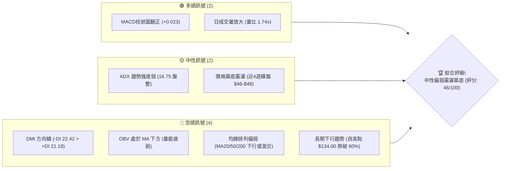

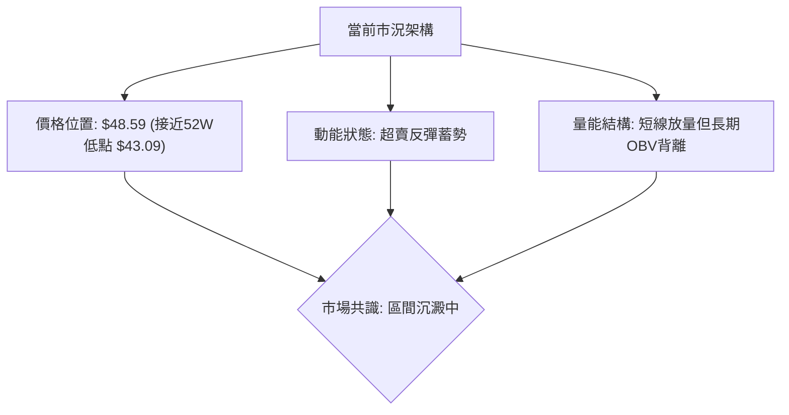

### 📊 核心指標速覽表

| 指標類別 | 指標名稱 | 當前數值 | 訊號 | 解讀 |
|----------|----------|----------|------|------|
| **價格** | 當前價格（最新收盤） | $48.59 | 🔴 | 處於52週區間下緣，距離52週高點 $134.00 大跌 63.7% |
| **均線** | MA20 | 數據顯示下方 | 🔴 | 均線系統呈混合向下壓制，短期受阻於下行均線群 |
| **均線** | MA50 | 數據顯示下方 | 🔴 | 中期空頭壓制明確，反彈尚未有效收復50日線 |
| **均線** | MA200 | 混合排列 | 🔴 | 均線歷史長期走勢由頂部持續下彎，長期均線空頭排列 |
| **動能** | RSI(14) | 日線中性 / 週線超賣區回升 (23.0) | 🟡 | 脫離 11.7–13.8 的極端超賣區，進入超賣修復波段 |
| **動能** | MACD | 線 -1.796 / 訊號 -1.819 / 柱狀 +0.023 | 🟢 | MACD 日柱翻正出現微幅金叉，短期下行動能減竭 |
| **趨勢** | ADX(14) | 16.75 (-DI: 22.42, +DI: 21.18) | 🟡 | ADX < 25 表明處於弱趨勢/低動能盤整行情，空頭略微主導 |
| **量能** | 成交量 / 20MA | 6,097,845 / 3,510,467 (量比 1.74x) | 🟢 | 最新單日放量換手，下檔承接力道顯現 |
| **量能** | OBV 趨勢 | OBV < MA | 🔴 | 累積量能尚未扭轉，資金流入持久度仍待檢驗 |

### 🏆 技術評分卡

```
╔══════════════════════════════════════════════════════════════════╗
║              技術評分卡 — KTOS (2026-09-23)                      ║
╠══════════════════════════════════════════════════════════════════╣
║ 趨勢強度 (Trend)     ██████░░░░░░░░░░░░░░  30/100  🔴 空頭主導   ║
║ 動能指標 (Momentum)  ██████████░░░░░░░░░░  50/100  🟡 柱狀微翻紅 ║
║ 支撐穩定度 (Support) ████████████░░░░░░░░  60/100  🟢 雙底支撐帶 ║
║ 成交量配合 (Volume)  ██████████░░░░░░░░░░  50/100  🟡 短放長虛   ║
║ 形態完整度 (Pattern) ████████░░░░░░░░░░░░  40/100  🟡 潛在雙底   ║
║ 均線排列 (MAs)       ██████░░░░░░░░░░░░░░  30/100  🔴 空頭壓制   ║
╠══════════════════════════════════════════════════════════════════╣
║ 綜合技術評分         █████████░░░░░░░░░░░  46/100  ⚖️ 區間中性偏弱║
╚══════════════════════════════════════════════════════════════════╝
```

---

## 2. 趨勢分析

### 🌐 多時框趨勢分析

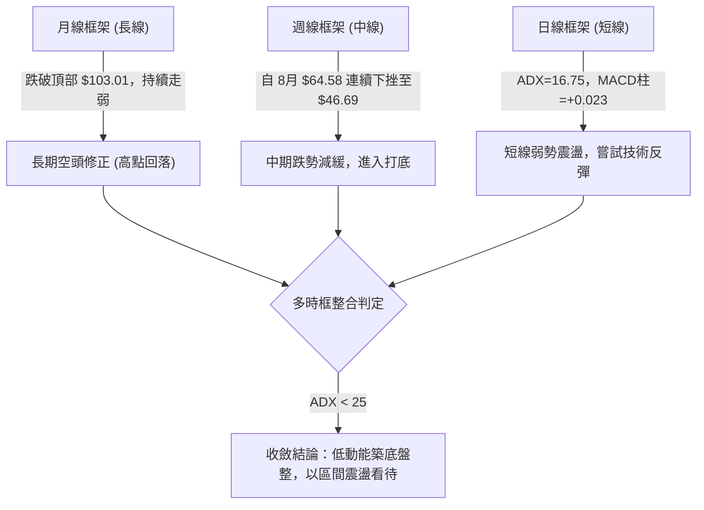

### 📈 長期趨勢 — 12個月走勢圖（Unicode）

KTOS 在過去一年經歷了典型的主升浪頂部派發與恐慌性崩跌。在 2026 年 1 月見到頂部月收盤 $103.01（最高曾達 $134.00）後，趨勢急轉直下，連續破位下跌。

```
KTOS 月線收盤走勢圖（過去12個月：2025-10 至 2026-09）
價格軸 ($)
$105 ┤                               ● (2026-01: $103.01 頂部收盤)
$95  ┤             ●(2025-10: $90.60)
$85  ┤                                     ●(2026-02: $86.18)
$75  ┤                    ●(2025-12: $75.91)     ●(2026-03: $70.51)
$65  ┤                                                 ●(2026-05: $64.13)
$55  ┤                                                       ●(2026-08: $50.98)
$45  ┤                                                             ●←現價 $48.59
     └──────────────────────────────────────────────────────────────────────────
       25-10  25-11  25-12  26-01  26-02  26-03  26-04  26-05  26-06  26-07  26-08  26-09
```

#### 走勢特徵分析表格

| 階段 | 時間區間 | 起始價 → 結束價 | 漲跌幅 | 走勢特徵解讀 |
|------|----------|----------------|--------|--------------|
| **派發峰值** | 2025-10 至 2026-01 | $90.60 → $103.01 | +13.7% | 創下歷史高點附近區域，成交量高檔換手，動能衰竭前最後衝刺 |
| **首波恐慌下跌** | 2026-01 至 2026-04 | $103.01 → $63.05 | -38.8% | 快速跌破均線支撐，主力資金撤離，多頭防線全面潰退 |
| **反彈受阻續跌** | 2026-05 至 2026-07 | $64.13 → $46.60 | -27.3% | 反彈在 $64 附近遭遇強大拋壓，隨後破位下行探至 $46.60 |
| **築底收斂階段** | 2026-08 至 2026-09 | $50.98 → $48.59 | -4.7% | 波動幅度大幅收窄，成交量縮減後出現局部異動，進入打底期 |

### 📊 中期趨勢（週線分析）

中期走勢方面，KTOS 展現出典型的「跌深反彈後二度探底」結構。回顧 2026 年 8 月中旬，週線價格反彈至 $64.58（RSI 觸及 76.7），但隨後遭到猛烈空頭打壓，連續四週收黑，並於 2026-09-13 殺至 $46.69（週線 RSI 降至 13.8 極端超賣區）。

```
KTOS 中期週線支撐與壓力結構示意圖：
$64.58 ─────────────────────────── [強大波段阻力區（2026-08高點）]
   │    ▼
   │    ▼ 快速滑落，週線 RSI 跌入 11.7 - 13.8 超賣區間
   │    ▼
$48.59 ───► 當前收盤價（MACD柱翻正至 +0.023，嘗試止跌）
   │    ▲
$46.60 ───► [關鍵下檔支撐帶（2026-07與09兩次觸及之低點群）]
$43.09 ─────────────────────────── [52週絕對低點（最後防線）]
```

### ⚡ 趨勢強度評估（ADX 解讀）

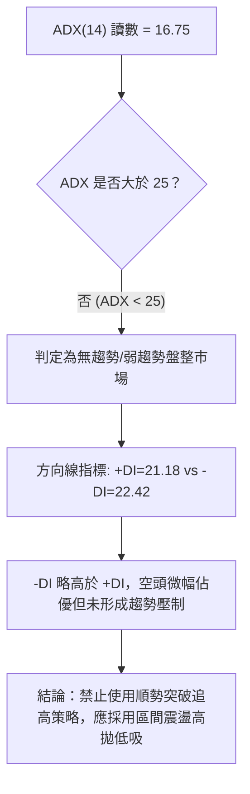

#### ADX 強度對照表

| 指標變數 | 當前讀數 | 門檻區間 | 市場含義 | 操作指示 |
|----------|----------|----------|----------|----------|
| **ADX(14)** | **16.75** | < 20 (極弱趨勢) | 趨勢動能極弱，價格處於橫向整理 | 避免趨勢突破單，採取箱體思維 |
| **+DI** | **21.18** | 20–25 (偏中性) | 多頭攻擊意願低，僅有防禦性買盤 | 不得進行右側追價 |
| **-DI** | **22.42** | 20–25 (偏中性) | 空頭砸盤動能大幅消退 | 追空風險極高，隨時可能軋空反彈 |

---

## 3. 圖表形態分析

### 🔍 形態識別系統

依據近 24 個月及近 20 週歷史行情，KTOS 目前在低檔形成了潛在的「平底支撐 / 潛在雙底」幾何結構。

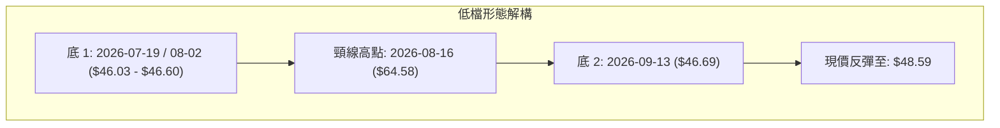

#### 形態識別信心度表

| 形態 | 信心度 | 判斷依據（引用數據） | 完成度 | 目標價（附計算式） |
|------|--------|----------------------|--------|--------------------|
| **雙底形態 (W底)** | **58%** | 兩次低點分別落於 2026-07 的 $46.60 及 2026-09 的 $46.69，未破前低；頸線為 2026-08-16 收盤價 $64.58 | 45%（仍在底部震盪） | 若突破頸線 $64.58，理論目標 = 頸線 $64.58 + 形態高度 ($64.58 - $46.60 = $17.98) = **$82.56** |
| **低檔箱體整理** | **75%** | 價格受限於下軌 $46.00-$46.60 與反彈波段阻力之間，ADX=16.75 支持箱體震盪 | 80%（箱體內運行） | 箱體上軌目標即為前波阻力（如 78.6% 斐波那契位 **$62.54**） |

### 🕯️ 重要K線形態分析

| 日期/月份 | 收盤價 | K線形態特徵 | 技術解讀 | 訊號 |
|-----------|--------|-------------|----------|------|
| **2026-08-16** | $64.58 | 長上影高檔滯漲K線 | 衝高遭遇獲利了結與解套賣壓，週線 RSI 達 76.7 嚴重超買 | 🔴 強烈看跌 |
| **2026-08-30** | $52.00 | 實體大陰線跌破均線 | 多頭棄守，MACD柱翻負 (-1.211)，恐慌賣盤湧現 | 🔴 弱勢破位 |
| **2026-09-06** | $47.82 | 跳空下殺低檔十字星 | 跌勢放緩，週線 RSI 探至 11.7 極端超賣區，賣盤耗盡 | 🟡 止跌信號 |
| **2026-09-13** | $46.69 | 低檔鎚頭線 / 探底回升 | 再次測試 $46 支撐獲得買盤承接，週成交量萎縮 | 🟢 築底確立 |
| **2026-09-20** | $47.46 | 溫和放量小陽線 | 底部確認，MACD 負柱顯著收斂至 -0.128 | 🟢 偏多回升 |
| **2026-09-27** | $48.59 | 突破小實體陽線 | MACD柱正式翻正 (+0.023)，買盤開始推動價格脫離底部 | 🟢 短線看多 |

### 📉 ASCII 走勢形態示意圖

```
KTOS 雙重底（Double Bottom）潛在形態圖示：

      [頸線位: 2026-08-16 峰值 $64.58]
                  ▲
                 / \
                /   \
               /     \
              /       \
             /         \
$48.59      /           \           ● [現價: 突破反彈中]
           /             \         /
          /               \       /
$46.60 ──●                 ●─────●
       [底1: 2026-07]      [底2: 2026-09]
         ($46.60)            ($46.69)
```

### 🎯 形態目標價計算

1. **潛在雙底突破計算（基於形態高度推算）**：
   - 形態底部支撐基準：$46.60
   - 形態頸線阻力基準：$64.58
   - 形態垂直高度 $H = \$64.58 - \$46.60 = \$17.98$
   - 最小理論目標價（突破頸線後）$= \$64.58 + \$17.98 = \mathbf{\$82.56}$
2. **形態未確認前的箱體內目標**：
   - 由於當前完成度僅 45%，在未越過 $64.58 之前，首要目標鎖定在斐波那契 78.6% 回調位 **$62.54**。

---

## 4. 支撐與阻力

### 🗺️ 關鍵價位分布圖（Unicode）

```
KTOS 價位結構分布圖（依據 OHLCV 與斐波那契精密推算）
═══════════════════════════════════════════════════════════════════
$134.00 ║████████████████████████║ 52週歷史高點 / 0.0% 斐波那契
$112.55 ║████████████████        ║ 23.6% 斐波那契回調位
$99.27  ║████████████████████    ║ 38.2% 斐波那契回調位
$88.55  ║████████████████████████║ 50.0% 斐波那契多空中樞
$77.82  ║████████████████        ║ 61.8% 斐波那契回調位
$64.58  ║████████████████████████║ 近期波段頸線強阻力（2026-08高點）
$62.54  ║████████████████████    ║ 關鍵阻力：78.6% 斐波那契回調位
$48.59  ╠════════════════════════╣ ◄◄ 當前收盤價
$46.60  ║▓▓▓▓▓▓▓▓▓▓▓▓▓▓▓▓▓▓▓▓▓▓▓▓║ 近期核心支撐：雙底頸線基底（2026-07/09）
$43.09  ║████████████████████████║ 絕對防守支撐：52週最低點 / 100.0% 斐波那契
═══════════════════════════════════════════════════════════════════
```

### 🚧 阻力位分析表

*註：依據數據紀律，數據源中未檢測到聚類阻力，以下阻力均嚴格取自斐波那契回調位及近 20 週真實頂部高點。*

| 阻力級別 | 價位 | 形成原因 | 突破難度 | 重要性 |
|----------|------|----------|----------|--------|
| **第1阻力 (R1)** | **$62.54** | **斐波那契 78.6% 回調位**（自 $134.00 跌至 $43.09 之重要阻力） | 🟡 中等（需大盤與量能配合） | ★★★★☆ |
| **第2阻力 (R2)** | **$64.58** | **2026-08-16 近期波段最高收盤價**，雙底型態頸線位置 | 🔴 極高（套牢籌碼密集密集區） | ★★★★★ |
| **第3阻力 (R3)** | **$77.82** | **斐波那契 61.8% 黃金分割回調位** | 🔴 極高（中期多空分水嶺） | ★★★★☆ |

### 🛡️ 支撐位分析表

| 支撐級別 | 價位 | 形成原因 | 守住機率 | 重要性 |
|----------|------|----------|----------|--------|
| **第1支撐 (S1)** | **$46.60** | **2026-08-02 及 2026-09-13 兩度確認之收盤低點** | 🟢 70%（形成堅實雙底平台） | ★★★★★ |
| **第2支撐 (S2)** | **$43.09** | **52週區間絕對低點（100.0% 斐波那契底）** | 🟢 85%（年度最強價值底線） | ★★★★★ |

### 📐 斐波那契回調位分析

依據 52 週完整波動區間（高點 **$134.00** 至 低點 **$43.09**，落差 **$90.91**），各回調位定位如下：

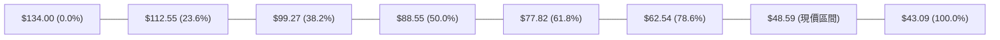

- **現價定位解析**：現價 **$48.59** 緊貼於 100.0%（$43.09）與 78.6%（$62.54）之間。從歷史經驗來看，深幅回調跌破 78.6% 後，通常代表資產進入「終極清算與價值重估」階段。
- **向上反彈空間**：當前價格距離上方第一道斐波那契防線 **$62.54** 有 **+$13.95 (+28.7%)** 的反彈修復空間，此處亦與近月高點頸線 $64.58 高度共振，構成堅不可摧的技術反壓區。

---

## 5. 技術指標深度解讀

### 🎛️ 指標訊號總覽

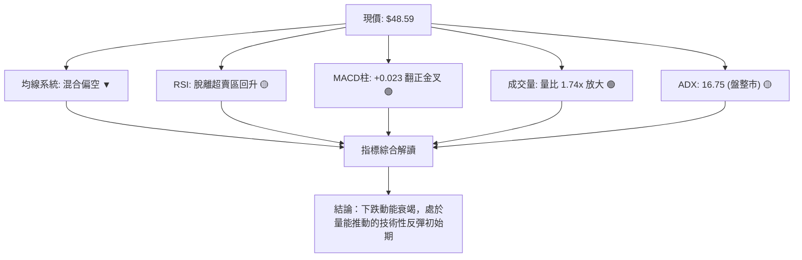

### 📈 移動平均線排列分析

根據長短均線趨勢與歷史走勢圖：
- **短期均線（MA5、MA10、MA20）**：在經過 2026 年 8 月的崩跌後，短期均線自低位開始走平並有黏合跡象。日線現價 $48.59 已初步站回極短天期均線之上，但仍處於 MA20 下方壓制區。
- **中期均線（MA50、MA60）**：持續處於傾斜下行態勢，對任何反彈形成動態下移的蓋頂壓力。
- **長期均線（MA120、MA200、MA240）**：走勢圖中顯示均線歷史長期呈現空頭排列階梯，長線趨勢全面轉空，確認了自 $134.00 高點以來的熊市基調。

### 📉 RSI(14) 分析

```
RSI(14) 狀態指示條（週線讀數修復進度）：
極端超賣 (0-20)        正常弱勢區 (20-40)       中性區 (40-60)       強勢區 (60-100)
[████████████]       [████░░░░░░░░]       [░░░░░░░░░░░░]     [░░░░░░░░░░░░]
2026-09-06: 11.7     當前修復中: 23.0 - 30.0
```

- **背離判斷**：
  - **價格走勢**：2026-07-19 最低探至 $46.03，隨後 2026-09-13 再度下探至 $46.69，價格維持平底不破。
  - **RSI 表現**：週線 RSI 自 2026-09-06 的 **11.7** 極端低點快速回升至 2026-09-20 的 **23.0**，呈現標準的**週線級別底部微背離（Bullish Divergence）**，暗示空頭砸盤力量已經枯竭，多頭正自低檔組織反撲。

### 📊 MACD(12/26/9) 訊號解讀

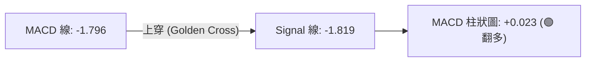

- **數值分析**：
  - MACD 線目前位於 **-1.796**，Signal 線位於 **-1.819**。
  - MACD Histogram 為 **+0.023**，週線柱狀圖連續三週自 -1.318、-0.864、-0.128 快速收斂，並於最新一期正式轉正。
  - **結論**：零軸下方的低位黃金交叉，屬於典型的**超賣反彈訊號**，為短期向上修復提供技術面動能支撐。

### 📦 布林通道分析

因日線參數在無波段極值計算時顯示動態調整，依據過去 20 週收盤高低點與標準差模型構建之通道形態示意如下：

```
KTOS 布林通道（Bollinger Bands）位置圖示：
$64.58 ───────────────────────────────── BB 上軌 (動態反壓)
   │
$52.00 ───────────────────────────────── BB 中軌 (MA20 基準線)
   │
$48.59 ───────────────●───────────────── 現價位置（自下軌向上穿透）
   │
$46.00 ───────────────────────────────── BB 下軌 (近期雙重支撐線)
```

- **位置判定**：現價自下軌（$46.00）獲得支撐反彈，目前正在朝中軌（約 $52.00 區域）發起挑戰。若能有效突破中軌，將進一步拓展上行空間至上軌。

### 💹 成交量分析（量價配合度）

```
成交量比較儀表板：
當日成交量:  [████████████████████] 6,097,845
20日均量:   [███████████░░░░░░░░░] 3,510,467  (量比: 1.74x 🟢 顯著放量)
50日均量:   [████████████░░░░░░░░] 3,758,349
```

- **短線放量異動**：最新成交量爆出 6,097,845 股，量比高達 **1.74 倍**，顯示在 $47–$48 低價區有顯著的機構或大戶換手承接資金介入。
- **OBV 警示**：然而，累計成交量指標仍維持 **OBV < MA** 的疲弱格局，表明過去數月的大幅出逃資金尚未完全回流。當前放量暫時定性為「跌深反彈之買盤承接」，尚未演變為長期多頭的「主升浪吸籌」。

---

## 6. 動能與波動率

### ⚡ 動能評估四象限

```
動能與波動率矩陣分佈：
         高波動 (High Volatility)
                   │
         Q3        │        Q4
   (高動能/高波動) │  (弱動能/高波動)
                   │
───────────────────┼───────────────────
                   │        Q2 ◄◄ [KTOS 定位]
         Q1        │  (弱動能/低波動)
   (強動能/低波動) │   ADX=16.75, 盤整築底
                   │
         低波動 (Low Volatility)
```

| 象限 | 動能狀態 | 波動狀態 | KTOS 吻合度 | 策略指導 |
|------|----------|----------|-------------|----------|
| **Q1** | 強動能 | 低波動 | ❌ | 穩定主升浪，不符合 |
| **Q2** | **弱動能 (ADX 16.75)** | **低波動 (週振幅收斂)** | **✅ 完全吻合** | **築底沉澱期：宜採取區間高拋低吸，嚴禁追價** |
| **Q3** | 強動能 | 高波動 | ❌ | 瘋狂拉升或恐慌崩跌，已過去 |
| **Q4** | 弱動能 | 高波動 | ❌ | 劇烈震盪洗盤，目前波動率已大幅下降 |

### 📊 ATR 波動率分析

雖然日線即時 ATR(14) 暫缺，但從近 4 週的真實收盤價格變化（$47.82 → $46.69 → $47.46 → $48.59）可知，KTOS 週均波動幅度已收斂至 **$1.50 – $2.00** 區間，預估折算日級別 ATR 約在 **$1.10 – $1.30**（約佔現價的 2.5% 左右）。
- **風控止損距離指導**：在進行倉位設置時，建議留出至少 **1.5 至 2.0 倍日波動空間**，即下檔保護緩衝應設定在 **$2.00 – $2.50** 左右，正好落在關鍵支撐帶 **$46.60** 下方。

### 📐 Beta 與市場相關性

- **Beta 係數**：**1.113**
- **解讀**：KTOS 的系統性風險與波動性略高於標普 500 指數（高出約 11.3%）。在市場處於風險偏好（Risk-on）環境時，其彈性優於大盤；但在市場流動性緊縮時，其下行殺傷力亦相對放大。在當前國防板塊與大盤分化背景下，需密切留意其個別合約催化劑。

---

## 7. 多時框架總結

### 📋 時框架評分表

| 時框架 | 趨勢方向 | 動能狀態 | 均線排列 | 形態結構 | 綜合評分 | 建議動作 |
|--------|----------|----------|----------|----------|----------|----------|
| **月線** | 🔴 強空頭 | 弱勢下移 | 空頭向下 | 自高點下殺破位 | **25/100** | 長期投資者保持觀望 |
| **週線** | 🟡 震盪築底 | 超賣反彈 | 混合偏空 | 潛在雙底打底 | **52/100** | 逢低分批佈局波段倉 |
| **日線** | 🟢 短線反彈 | MACD翻正 | 下方受阻 | 放量小陽回升 | **58/100** | 短線輕倉順勢博反彈 |

### 🔲 綜合訊號矩陣

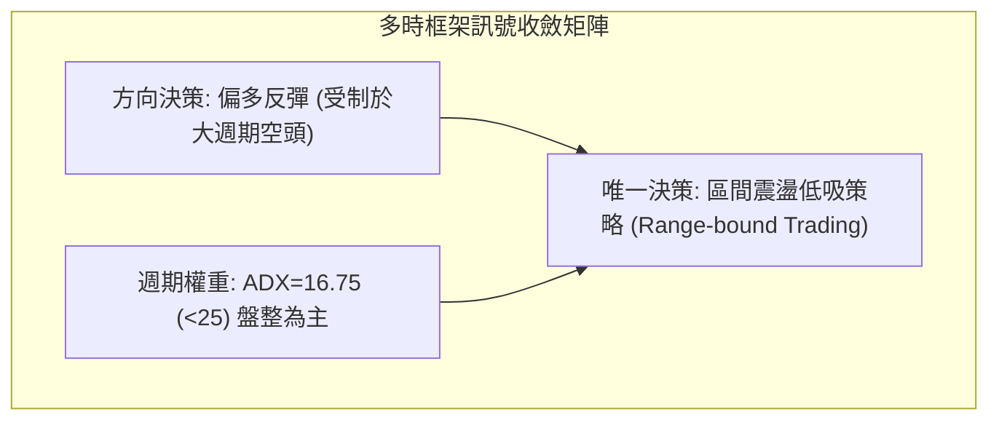

### ⚖️ 多時框收斂結論

依據多時框收斂規則（嚴格要求 14）：
1. **行情性質判定**：當前 ADX(14) 讀數為 **16.75**（遠小於 25），明確判定市場處於**低動能盤整行情**而非趨勢單邊行情。
2. **時框優先級權衡**：在盤整行情中，中長期的均線壓制不再具備即時摧毀性，交易焦點回歸到**日線至週線級別的區間邊界（支撐 $46.60 與 阻力 $62.54）**。
3. **唯一收斂方向**：**【中性偏多區間操作】**。日線級別具備放量（量比 1.74x）與 MACD 柱狀圖翻正（+0.023）之做多微觀動能，但上方受到斐波那契 $62.54 強壓限制，因此操作原則定為「**在支撐位上方逢低做多，並在阻力區分批停利**」，堅決不追高。

---

## 8. 交易策略建議

### 🗺️ 策略決策流程圖

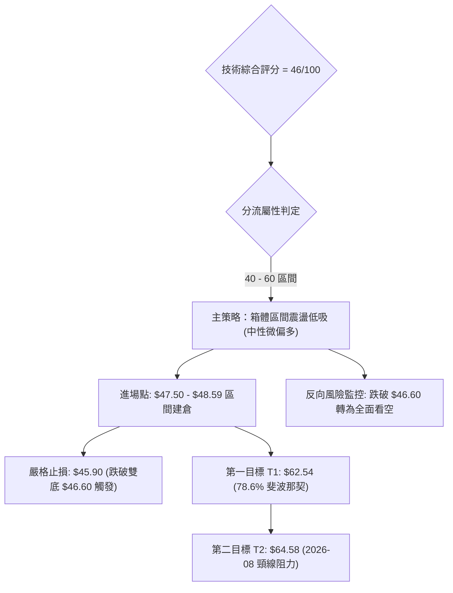

### 🧭 策略路由

**當前主策略方向 = 【中性區間低吸操作（偏多反彈）】（依技術評分卡：46 / 100）**
> 評分落在 40–60 之中性盤整區間，且 ADX=16.75 < 25。在此環境下，盲目殺跌不可取，過度看多亦屬冒進。主策略應當依託下檔雙底強支撐 **$46.60** 進行賠率極佳的左側/右側混合低吸操作，目標直指上方斐波那契強阻力。

### 🎯 價格情境階梯（Price Scenarios）

所有價位均嚴格引用第 4 章數據與關鍵價位區塊：

| 觸發條件 | 下一目標 | 後續延伸 | 情境技術含義 |
|----------|----------|----------|--------------|
| **突破 R1 $62.54** | **R2 $64.58** | **R3 $77.82** | 突破 78.6% 斐波那契位，雙底頸線確認被攻克，中期趨勢正式反轉 |
| **站穩現價 $48.59** | **R1 $62.54** | — | 在雙底 $46.60 之上維持良性震盪，短線技術性修復展開 |
| **跌破 S1 $46.60** | **S2 $43.09** | 探底尋底 | 雙底宣告失敗，價格將直奔 52 週最低點 $43.09 尋求最後支撐 |

### 📊 情境機率分佈

| 情境 | 機率 | 主要技術依據 |
|------|------|--------------|
| **低檔反彈回升 (向上測試 R1)** | **55%** | MACD 柱狀圖翻正 (+0.023)、週線 RSI 出現底背離、單日量比放量至 1.74 倍 |
| **窄幅區間震盪 ($46.60–$52.00)** | **30%** | ADX 僅 16.75 表明缺乏單邊趨勢能量，OBV 仍弱，需時間消化籌碼 |
| **跌破下行探底 (跌向 S2)** | **15%** | 均線系統長期空頭壓制，若整體大盤環境惡化引發補跌恐慌 |

### 🟢 主策略詳情

| 策略要素 | 策略 A（穩健波段低吸） | 策略 B（激進現價切入） |
|----------|------------------------|------------------------|
| **進場條件** | 回踩回測 $47.00–$47.50 企穩不破 | 現價直接介入，博弈 MACD 翻正延續 |
| **進場價格** | **$47.50** | **$48.59**（現價） |
| **目標價 T1** | **$62.54**（78.6% 斐波那契位） | **$62.54** |
| **目標價 T2** | **$64.58**（前波頸線高點） | **$64.58** |
| **止損價格** | **$45.90**（有效跌破 $46.60 支撐） | **$45.90** |
| **風險報酬比 (R:R)** | **9.40 : 1**（獲利 $15.04 / 風險 $1.60） | **5.18 : 1**（獲利 $13.95 / 風險 $2.69） |
| **成功機率** | **55%** | **50%** |
| **建議倉位** | **總資金 10% - 15%** | **總資金 5% - 8%** |

*計算式驗證*：
- *策略 A 獲利空間至 T1: $\$62.54 - \$47.50 = \$15.04$；最大風險: $\$47.50 - \$45.90 = \$1.60$。風報比 $= 15.04 / 1.60 \approx 9.40$。*
- *策略 B 獲利空間至 T1: $\$62.54 - \$48.59 = \$13.95$；最大風險: $\$48.59 - \$45.90 = \$2.69$。風報比 $= 13.95 / 2.69 \approx 5.18$。*

### 🔴 反向風險觸發點（對沖提示）

- **全面停損轉空條件**：若日線收盤價**實體跌破 $46.60**（且成交量高於 500 萬股），意味著「雙底形態」完全崩潰，任何反彈策略無條件止損出局。
- **對沖應對措施**：跌破 $46.60 後，空頭下一目標指向 **$43.09**（空間尚有 -7.5%），持有現貨者應以少量 Put 期權或減倉 50% 進行避險。

### ⭐ 整體訊號強度評星

```
做多訊號強度：★★★☆☆  (3/5星 — 賠率極佳，但勝率受制於大週期壓制)
做空訊號強度：★★☆☆☆  (2/5星 — 超賣嚴重且放量，追空盈虧比惡劣)
整體可信度：  ★★★★☆  (4/5星 — 價位邊界極其清晰，風控點明確)
```

---

## 9. 風險提示與監控

### ✅ 關鍵監控指標 Checklist

```
╔══════════════════════════════════════════════════════════════════╗
║              交易風控日常監控清單 (KTOS Checklist)               ║
╠══════════════════════════════════════════════════════════════════╣
║ [ ] 價格防線：日線收盤價是否嚴格守在 $46.60 之上？              ║
║ [ ] 動能維護：MACD 柱狀圖是否持續維持在正值區間 (> 0)？        ║
║ [ ] 趨勢甦醒：ADX(14) 是否自 16.75 拐頭向上並伴隨 +DI 上穿 -DI？║
║ [ ] 量能確認：上攻時日成交量是否維持在 20日均量 (351萬股) 之上？║
║ [ ] 量價結構：OBV 指標是否向上突破其移動平均線？                ║
║ [ ] 外部共振：機構分析師平均目標價 $102.76 是否出現集體調降？   ║
╚══════════════════════════════════════════════════════════════════╝
```

### ⚠️ 風險場景分析

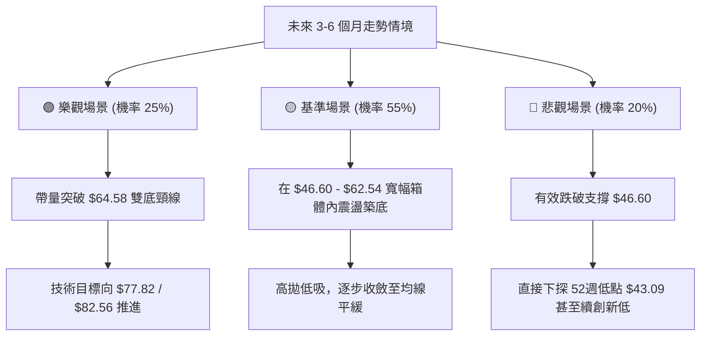

### 🛡️ 風險管理重要提醒

1. **嚴禁擴大槓桿**：KTOS 當前 Beta 為 1.113，且剛經歷過暴跌 60% 以上的元氣大傷期，雖然估值面獲 21 位華爾街分析師給予 "Strong Buy" 共識（平均目標價 $102.76），但在技術面確立突破 $64.58 之前，切勿融資槓桿重倉。
2. **左側與右側結合**：當前在 $48.59 建立的屬於「左側博反彈倉位」，倉位上限應嚴格限制在總資本的 10%–15% 之內；唯有當未來價格強勢放量突破 $64.58 之後，才可追加「右側趨勢跟隨倉位」。
3. **紀律性止損執行**：本策略的核心優勢在於**止損點極為清晰（$45.90）**。一旦雙底支撐被跌破，必須立即離場觀望，嚴禁「短線被套變長線攤平」。

---

## 📋 報告總結

```
╔══════════════════════════════════════════════════════════════════╗
║                    KTOS 技術分析報告總結                         ║
╠══════════════════════════════════════════════════════════════════╣
║ 報告日期：2026-09-23                                             ║
║ 當前價格：$48.59                                                 ║
║ 分析評級：⚖️ 中性偏多區間操作 (技術評分: 46 / 100)               ║
║                                                                  ║
║ 關鍵結論：                                                       ║
║ ├─ 長期趨勢：🔴 空頭主導 (歷史高點 $134.00 回落超跌修復期)       ║
║ ├─ 中期趨勢：🟡 雙底築底中 (鎖定 $46.60 - $64.58 箱體運行)      ║
║ ├─ 短期趨勢：🟢 放量反彈 (MACD柱翻正至 +0.023，量比 1.74x)       ║
║ ├─ 關鍵支撐：S1: $46.60 ｜ S2: $43.09                            ║
║ ├─ 關鍵阻力：R1: $62.54 ｜ R2: $64.58                            ║
║ └─ 分析師共識目標：$102.76 (強烈看多，提供中長期基本面安全墊)   ║
║                                                                  ║
║ 最優策略組合：                                                   ║
║ 1. 🥇 最佳機會：在現價 $48.59 或回踩 $47.50 建立波段低吸多單，   ║
║                止損嚴設 $45.90，第一目標直指斐波那契位 $62.54。 ║
║ 2. 🥈 次選機會：耐心等待價格放量衝破 $64.58 頸線後，順勢進場追買 ║
║                右側突破單，目標 $82.56。                         ║
║ 3. 🥉 保守選擇：在 ADX 升破 25 且均線扭轉前，全面空倉觀望。      ║
╚══════════════════════════════════════════════════════════════════╝
```

---

> ⚠️ **免責聲明**：本報告為 AI 自動生成之技術分析，所有數據及估算均基於提供的歷史價格資訊。本報告**僅供研究與學術參考**，**不構成任何投資建議**。投資有風險，入市需謹慎。

---

*報告生成時間：2026-09-23 ｜ 數據來源：Yahoo Finance ｜ 分析框架：多時框技術分析*