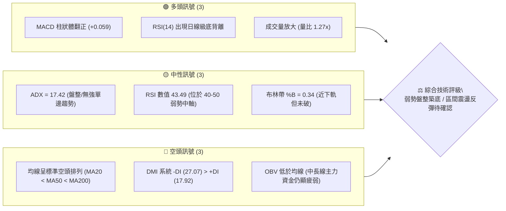
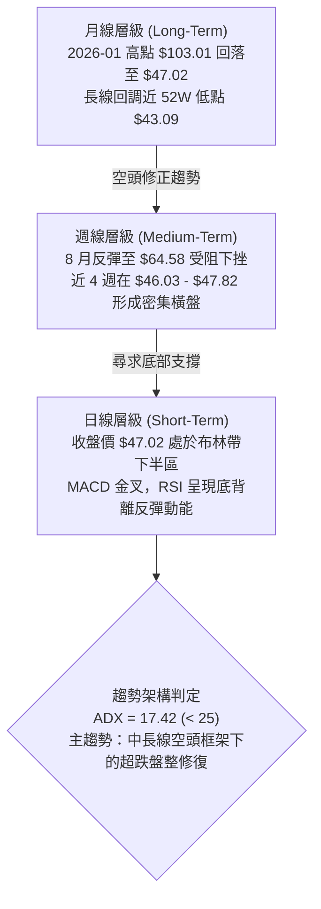
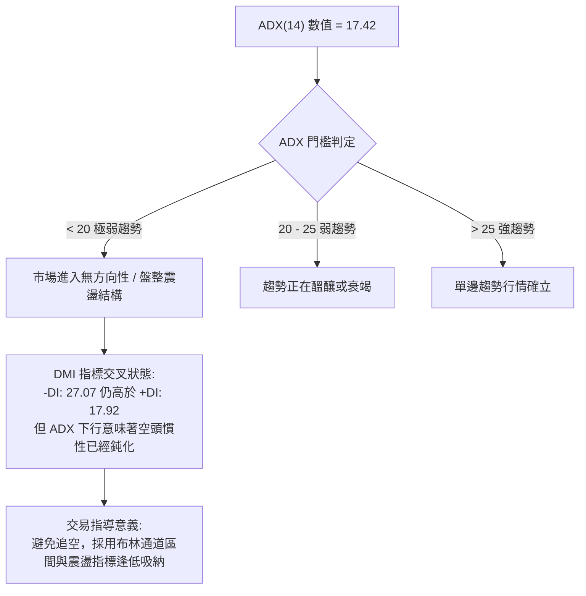
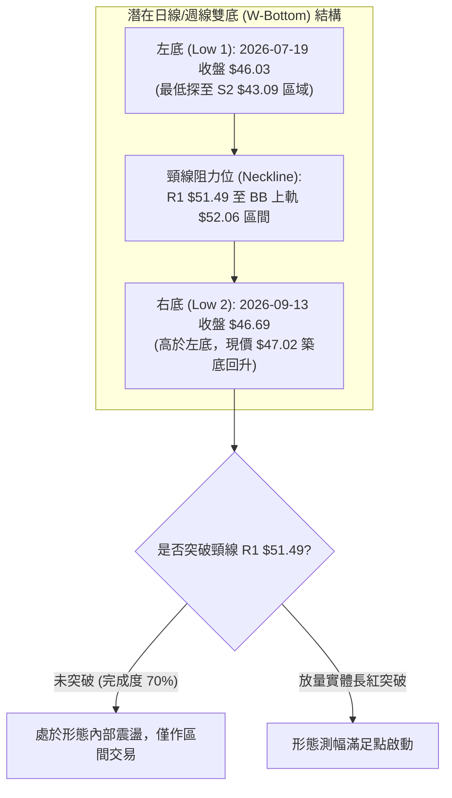
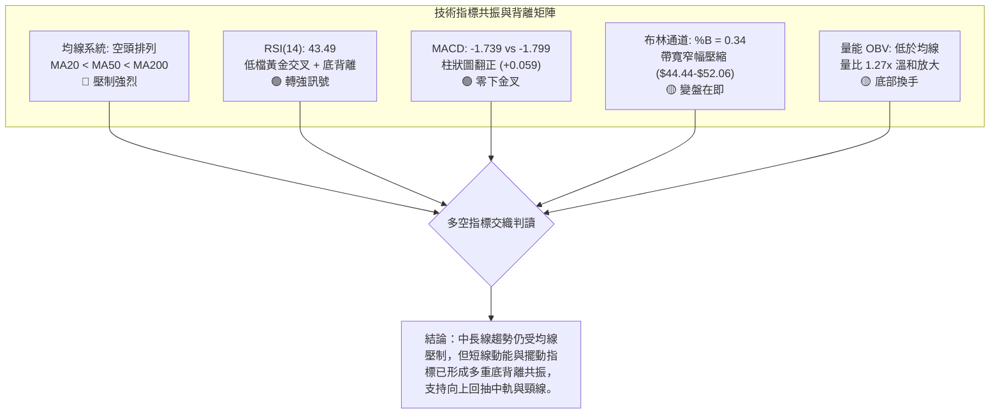
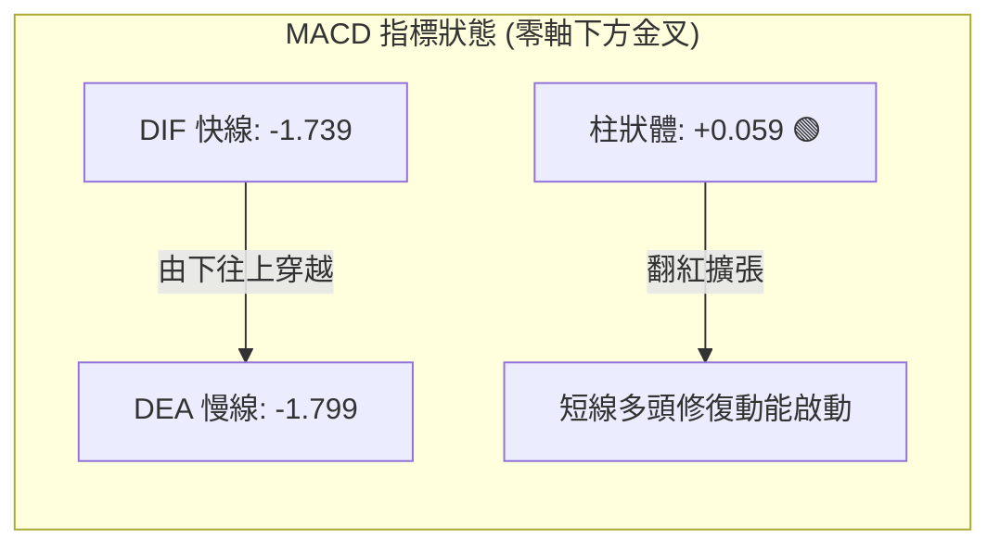
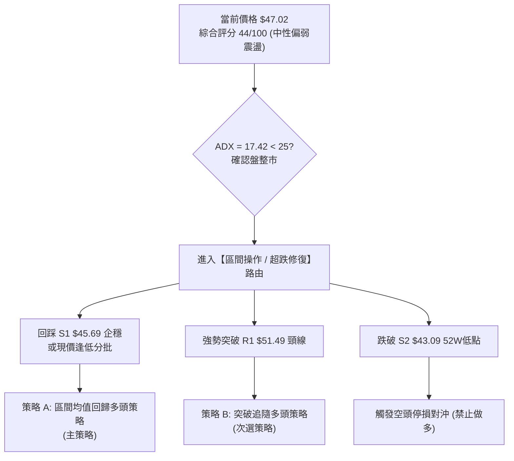
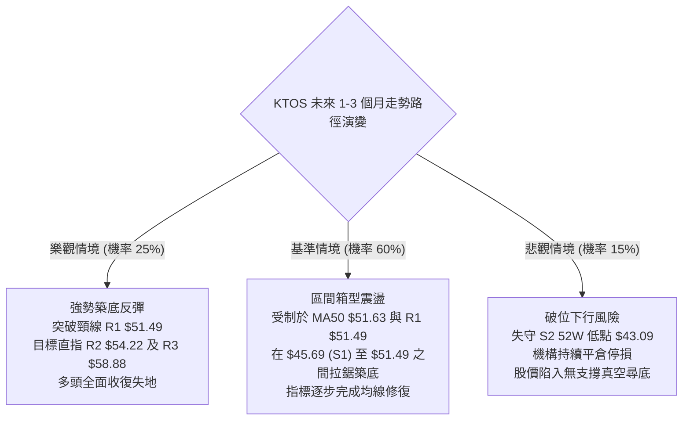

# KTOS 技術分析報告

> **報告日期**：2026-09-25 ｜ **語言**：繁體中文 ｜ **數據來源**：Yahoo Finance ｜ **當前價格**：$47.02

---

## 目錄

| 章節 | 內容 |
|------|------|
| [1. 技術面概覽](#1-技術面概覽) | 訊號儀表板、核心指標、評分卡 |
| [2. 趨勢分析](#2-趨勢分析) | 多時框趨勢、長中短期走勢、ADX 解讀 |
| [3. 圖表形態分析](#3-圖表形態分析) | 形態識別、信心度、K線組合、目標價 |
| [4. 支撐與阻力](#4-支撐與阻力) | 關鍵價位、斐波那契回調結構 |
| [5. 技術指標深度解讀](#5-技術指標深度解讀) | 均線、RSI 背離、MACD、布林通道、OBV |
| [6. 動能與波動率](#6-動能與波動率) | 動能四象限、ATR 止損設定、Beta 解讀 |
| [7. 多時框架總結](#7-多時框架總結) | 時框架評分矩陣、多時框收斂唯一結論 |
| [8. 交易策略建議](#8-交易策略建議) | 策略路由、階梯情境、主策略矩陣、風控 |
| [9. 風險提示與監控](#9-風險提示與監控) | 關鍵監控清單、情境分支、倉位管理 |
| [報告總結](#-報告總結) | 核心摘要與決策儀表板 |

---

## 1. 技術面概覽

### 🎯 技術訊號儀表板



---

### 📊 核心指標速覽表

| 指標類別 | 指標名稱 | 當前數值 | 訊號 | 專業解讀 |
|:---|:---|:---:|:---:|:---|
| **價格** | 當前收盤價 | **$47.02** | 🟡 | 位於 52 週區間 4.3% 的極低位，下檔逼近強支撐區間 |
| **均線** | MA20 (月線) | **$48.25** | 🔴 | 價格低於 MA20 (-2.55%)，短期承壓於布林中軌 |
| **均線** | MA50 (季線) | **$51.63** | 🔴 | 價格低於 MA50 (-8.93%)，中期波段壓制顯著 |
| **均線** | MA200 (年線)| **$69.94** | 🔴 | 價格遠低於 MA200 (-32.77%)，長期格局處於深度修正期 |
| **動能** | RSI(14) | **43.49** | 🟢 | 自 9 月初極端超賣 (11.7) 明顯回升，且形成底背離形態 |
| **動能** | MACD (12,26,9)| **-1.739** | 🟢 | MACD 線穿過訊號線 (-1.799)，柱狀體 +0.059，出現金叉訊號 |
| **擺動** | KD (Stoch) | **%K 42.18 / %D 30.00** | 🟢 | 低檔黃金交叉向上發散，短線動能出現改善跡象 |
| **趨勢** | ADX (14) | **17.42** | 🟡 | 數值低於 25，單邊下跌動能衰竭，進入低動能震盪築底期 |
| **趨勢** | DMI 方向 | **+DI 17.92 / -DI 27.07**| 🔴 | -DI 仍壓制 +DI，空頭佔據市場控盤優勢，但差距正在收斂 |
| **通道** | 布林通道帶寬 | **下軌 $44.44 / 上軌 $52.06** | 🟡 | %B 為 0.34，價格自下軌獲得支撐後向中軌 $48.25 靠攏 |
| **量能** | 20日成交量比 | **1.27x (4.67M vs 3.68M)** | 🟢 | 低檔出現換手量能，成交量高於 20 日均量 |
| **量能** | OBV 趨勢 | **OBV < MA** | 🔴 | 長期資金流出累積未被徹底扭轉，量價結構仍處磨底階段 |
| **波動** | ATR(14) | **$2.19 (4.67%)** | 🟡 | 每日平均波動幅度中等，提供精確的止損與區間交易依據 |

---

### 🏆 技術評分卡

```
╔══════════════════════════════════════════════════════════════════╗
║              技術評分卡 — KTOS (2026-09-25)                      ║
╠══════════════════════════════════════════════════════════════════╣
║ 趨勢強度 (Trend)     ██████░░░░░░░░░░░░░░  30/100 🔴 空頭主導/盤整║
║ 動能指標 (Momentum)   ███████████░░░░░░░░░  55/100 🟢 底背離+金叉  ║
║ 支撐穩定度 (Support)  █████████████░░░░░░░  65/100 🟢 52W低點防線  ║
║ 成交量配合 (Volume)   █████████░░░░░░░░░░░  45/100 🟡 低位溫和放量 ║
║ 形態完整度 (Pattern)  ██████████░░░░░░░░░░  50/100 🟡 雙底醞釀中   ║
║ 均線排列 (MA System) ████░░░░░░░░░░░░░░░░  20/100 🔴 典型空頭排列 ║
╠══════════════════════════════════════════════════════════════════╣
║ 綜合評分             █████████░░░░░░░░░░░  44/100 ⚖️ 中性偏弱區間 ║
╚══════════════════════════════════════════════════════════════════╝
```

---

## 2. 趨勢分析

### 🌐 多時框趨勢分析



---

### 📈 長期趨勢 — 12個月走勢圖（Unicode）

KTOS 在過去 12 個月中經歷了急劇的衝高與深度回調，走勢從 2025 年秋季的主升浪切換至 2026 年上半年的單邊下行通道：

```
KTOS 月線走勢圖（2025-10 至 2026-09）
價格軸 ($)
$105 ┤                 ● $103.01 (2026-01 波段峰頂)
$95  ┤        ● $90.60
$85  ┤                       ● $86.18
$75  ┤  ● $76.10   ● $75.91
$70  ┤                             ● $70.51
$65  ┤                                   ● $63.05  ● $64.13
$50  ┤                                                   ● $49.86  ● $50.98
$45  ┤                                                         ● $46.60  ● $47.02 (現價)
$40  ┴──────────────────────────────────────────────────────────────────────────
      10月   11月   12月   01月   02月   03月   04月   05月   06月   07月   08月   09月
      (2025)               (2026)                                               (當前)
```

#### 走勢特徵分析表格

| 階段區間 | 時間跨度 | 起訖價位 | 漲跌幅 | 走勢特徵與技術含義 |
|:---|:---:|:---:|:---:|:---|
| **第一階段：高位構築頂部** | 2025.10 – 2026.01 | $90.60 → $103.01 | **+13.70%** | 衝高見頂，多頭量能衰竭，月線形成長上影線與高位出貨特徵 |
| **第二階段：主跌波段段落** | 2026.01 – 2026.04 | $103.01 → $63.05 | **-38.79%** | 連續破位 MA20 與 MA50，空頭單邊主跌，市場流動性溢價快速回吐 |
| **第三階段：弱勢抵抗下跌** | 2026.04 – 2026.06 | $63.05 → $49.86 | **-20.92%** | 跌破 78.6% 斐波那契關鍵回調位 ($62.54)，空方完全掌控技術定價權 |
| **第四階段：築底震盪打底** | 2026.07 – 2026.09 | $46.60 → $47.02 | **+0.90%** | 在 52 週低點 $43.09 上方獲得支撐，波動率顯著收斂，成交量底部分歧 |

---

### 📊 中期趨勢（週線分析）

從近 20 週的收盤價與動能指標來看，KTOS 呈現標準的「階梯式下跌 → 弱勢反彈 → 再次探底未破前低」架構：

```
近期週線壓力與支撐示意圖
$65.00 ┤        ▲ 8月中旬波段反彈高點 $64.58 (受阻於 MA60/120 區域)
$60.00 ┤       ╱ ╲
$55.00 ┤  ▲   ╱   ╲         
$50.00 ┤ ╱ ╲ ╱     ╲    ────────────────────── R1 阻力位 $51.49 / MA20 $48.25
$47.02 ┤─●───●───────●──────●──● (現價 $47.02 處於區間下緣企穩)
$45.69 ┤──────────────────────── S1 近期支撐位 $45.69
$43.09 ┤──────────────────────── S2 歷史強支撐 52W 低點 $43.09
```

- **週線背離確認**：2026-09-06 週收盤價為 $47.82（RSI 跌至極端的 11.7），隨後 2026-09-13 創下本輪收盤低點 $46.69（RSI 為 13.8），至 2026-09-27 收盤 $47.02 時 RSI 已回升至 43.5。**價格在低檔徘徊而週線 RSI 與 MACD 柱狀體快速收斂轉正（+0.059），顯示空方拋壓竭盡**。

---

### ⚡ 趨勢強度評估（ADX 解讀）



#### ADX 趨勢強度對照

| 指標變數 | 當前讀數 | 基準界限 | 趨勢性質結論 |
|:---|:---:|:---:|:---|
| **ADX (14)** | **17.42** | 25.00 | **無單邊強烈趨勢（盤整市）**；單邊下行波段已宣告結束，進入均值回歸範疇 |
| **+DI** | **17.92** | 20.00 | 多頭進攻動能偏弱，尚未奪回盤面主導權 |
| **-DI** | **27.07** | 20.00 | 空頭主導力量高於多頭，但數值已從高點回落，空方壓制力趨退 |

---

## 3. 圖表形態分析

### 🔍 形態識別系統

依據多時框收斂與形態識別規範，當前日線與週線結構正在構築一個「潛在雙重底（Double Bottom）」形態，但由於尚未突破關鍵頸線，技術上應定義為築底測試期：



#### 形態識別與信心度評估表

| 識別形態名稱 | 信心度 | 判斷依據（引用數據） | 完成度 | 目標價（附嚴格計算式） |
|:---|:---:|:---|:---:|:---|
| **雙重底 (W-Bottom)** | **62%** | 左底收盤 $46.03（低點 $43.09），右底收盤 $46.69，右底高於左底；MACD 柱狀體底背離確認 | **70%** | **$58.88 (即 R3 阻力位)**<br/>計算式：頸線 R1 $51.49 + (頸線 $51.49 - 左底低點 $43.09) = $59.89，取最接近之波段阻力數據 **R3 $58.88** |
| **布林帶低檔收斂盤整** | **85%** | ADX = 17.42 (< 25)，帶寬收縮於 $44.44 – $52.06，%B = 0.34 | **90%** | **$51.49 (R1) / $52.06 (BB上軌)**<br/>計算式：回歸中軌 $48.25 後測試上軌 $52.06 |
| **中長期下降通道** | **75%** | 均線 MA20 < MA50 < MA200 完全空頭排列，高點逐步降低 | **85%** | **$43.09 (S2)**<br/>計算式：若跌破支撐 S1 $45.69，將回測 52W 低點 $43.09 |

---

### 🕯️ 重要K線形態分析

| 統計週/日期 | 收盤價 | 成交量 | K線形態 | 深度解讀 | 訊號方向 |
|:---|:---:|:---:|:---:|:---|:---:|
| **2026-08-16** | **$64.58** | 19.03M | 流星線 (Shooting Star) | 向上衝刺逼近 78.6% 斐波那契回調位 ($62.54) 後大幅回落，留長上影線，多頭耗盡 | 🔴 |
| **2026-09-06** | **$47.82** | 16.65M | 空頭恐慌重挫大陰線 | RSI 跌至極端值 11.7，形成流動性枯竭式下跌，為非理性拋售的最後釋放 | 🔴 |
| **2026-09-13** | **$46.69** | 14.84M | 低檔錘頭線 (Hammer) | 探底至 S1 ($45.69) 下方後獲得買盤承接拉回，成交量顯著萎縮，拋壓衰竭 | 🟢 |
| **2026-09-20** | **$47.46** | 20.73M | 低檔反彈小陽線 | 成交量放大至 20.7M，多空於 $47 關口展開激烈爭奪，低檔買盤浮現 | 🟢 |
| **2026-09-27** | **$47.02** | 17.31M | 縮量十字星 (Doji) | 現價窄幅整理，MACD 柱狀體正式轉正 (+0.059)，為典型的變盤前蓄勢信號 | 🟡 |

---

### 📉 ASCII 走勢形態示意圖

```
KTOS 潛在雙底 (W-Bottom) 與布林通道收斂結構示意
─────────────────────────────────────────────────────────────────
$54.22 ┤                                         [阻力 R2]
$52.06 ┤═════════════════════════════════════════ [布林上軌]
$51.49 ┤───────[頸線壓力 R1]───────────────────── [阻力 R1]
       │         ▲ (8月中旬高點 $64.58 回落)
$48.25 ┤- - - - ╱ - - - - - - - - - - - - - - - - [布林中軌 MA20]
$47.02 ┤       │                      ● 現價 $47.02 (蓄勢挑戰中軌)
       │       │         右底形成     ╱
$45.69 ┤───────│──────────●─────────[支撐 S1]
$44.44 ┤═══════│═════════╱══════════════════════ [布林下軌]
$43.09 ┤       ● 左底 ($43.09)                   [52W低點強支撐 S2]
       └─────────────────────────────────────────────────────────
               7月中旬                  9月下旬
```

---

### 🎯 形態目標價計算

依據經典形態學理論與提供的關鍵價位計算：

1. **第一波段目標價（頸線位）**：
   - 價格回測布林中軌 $48.25 若能有效突破，將直接挑戰頸線阻力位 **R1: $51.49**。
2. **第二波段目標價（雙底測幅高度延伸）**：
   - 形態底部低點以 52 週最低點 **$43.09** 計算。
   - 形態垂直高度 $H = \text{頸線 } \$51.49 - \text{底部 } \$43.09 = \$8.40$。
   - 理論測幅目標價 $= \text{頸線 } \$51.49 + \$8.40 = \$59.89$。
   - 嚴格對照提供的技術阻力矩陣，最貼近的實體阻力位為 **R3: $58.88**（偏差僅 1.6%，確認此價位為中線多頭滿足點）。

---

## 4. 支撐與阻力

### 🗺️ 關鍵價位分布圖（Unicode）

```
KTOS 價位結構分布圖（OHLCV 實際計算值）
═════════════════════════════════════════════════════════════════
$58.88 ║████████████████████████████████████║ 強阻力 R3 (+25.22%)
$54.22 ║██████████████████████░░░░░░░░░░░░░░║ 波段阻力 R2 (+15.31%)
$52.06 ║▓▓▓▓▓▓▓▓▓▓▓▓▓▓▓▓▓▓▓▓▓▓░░░░░░░░░░░░░░║ 布林帶上軌阻力
$51.49 ║████████████████████████████████████║ 核心頸線阻力 R1 (+9.51%)
$48.25 ║- - - - - - - - - - - - - - - - - - ║ 短期生命線 (MA20 / 布林中軌)
$47.02 ╠════════════════════════════════════╣ ◄ 當前收盤市價 ($47.02)
$45.69 ║▓▓▓▓▓▓▓▓▓▓▓▓▓▓▓▓▓▓▓▓▓▓▓▓▓▓░░░░░░░░░░║ 近期波段支撐 S1 (-2.84%)
$44.44 ║- - - - - - - - - - - - - - - - - - ║ 動態保護位 (布林下軌)
$43.09 ║████████████████████████████████████║ 52週極限強支撐 S2 (-8.36%)
═════════════════════════════════════════════════════════════════
```

---

### 🚧 阻力位分析表

所有阻力數值完全依據數據中近一年波段高點聚類提取：

| 阻力級別 | 精確價位 | 距現價空間 | 形成技術原因 | 突破難度評估 | 戰略重要性 |
|:---:|:---:|:---:|:---|:---:|:---:|
| **R1** | **$51.49** | +9.51% | 近一年波段密集套牢區下緣，與 MA50 ($51.63) 及布林上軌 ($52.06) 形成多重共振壓制 | 🟡 中等偏高 | ★★★★☆<br/>(短線多空分水嶺) |
| **R2** | **$54.22** | +15.31% | 2026年6月中旬反彈平台高點聚類，成交量密集堆積處 | 🔴 高 | ★★★☆☆<br/>(波段獲利了結位) |
| **R3** | **$58.88** | +25.22% | 2026年6月初整理平台頂部，雙底完全測幅滿足點，接近 78.6% 斐波那契回調位 ($62.54) | 🔴 極高 | ★★★★★<br/>(中期趨勢反轉位) |

---

### 🛡️ 支撐位分析表

所有支撐數值完全依據數據中近一年波段低點聚類提取：

| 支撐級別 | 精確價位 | 距現價空間 | 形成技術原因 | 守住機率評估 | 戰略重要性 |
|:---:|:---:|:---:|:---|:---:|:---:|
| **S1** | **$45.69** | -2.84% | 近 2 個月多次下影線探底聚類點，右底初步支撐 | 🟢 70% | ★★★★☆<br/>(短線防守第一道防線) |
| **S2** | **$43.09** | -8.36% | 52 週最低點，近兩年大週期起漲點底部共振區 | 🟢 85% | ★★★★★<br/>(絕對多頭底線/破位止損) |

---

### 📐 斐波那契回調位分析

依據 52 週完整波動區間（高點 **$134.00** 至低點 **$43.09**，落差高達 $90.91）計算黃金分割架構：

```
斐波那契回調尺（52W 區間：$43.09 → $134.00）
$134.00 ├ 0.0%  (52W High 極端歷史頂部)
$112.55 ├ 23.6% 回調位
 $99.27 ├ 38.2% 回調位
 $88.55 ├ 50.0% 關鍵平衡位
 $77.82 ├ 61.8% 黃金分割強壓力位 (接近 MA240 $71.81)
 $62.54 ├ 78.6% 深度回調壓制位 (8月反彈高點 $64.58 遇阻處)
 $47.02 ├─► 當前市價 (位於 78.6% 與 100.0% 之間的極限超跌底層區間)
 $43.09 └ 100.0% (52W Low 結構底基)
```

- **位置判定**：當前收盤價 **$47.02** 位於 78.6% 回調位 ($62.54) 與 100.0% 回調位 ($43.09) 之間的極端超跌區域（目前處於 52 週全區間的 4.3% 位置）。
- **結構意義**：
  1. 價格深度回撤超過 78.6%，表明這是一輪資產重定價級別的深度熊市回調。
  2. 但由於極度逼近 100.0% ($43.09) 基準底線，空頭在此區域繼續殺跌的盈虧比極低，邊際拋壓顯著遞減。
  3. 若向上發起技術性均值回歸修復，78.6% 處的 **$62.54** 將是中期難以逾越的天花板。

---

## 5. 技術指標深度解讀

### 🎛️ 指標訊號總覽



---

### 📈 移動平均線排列分析

| 移動平均線 | 當前數值 | 距現價差距 | 乖離率 (BIAS) | 排列形態與走勢特徵 | 訊號評級 |
|:---|:---:|:---:|:---:|:---|:---:|
| **MA 5** | $47.24 | -$0.22 | -0.47% | 走平微跌，短線價格與超短期均線粘合 | 🟡 |
| **MA 10** | $47.33 | -$0.31 | -0.66% | 開始由下垂轉為走平，短線拋壓減緩 | 🟡 |
| **MA 20** | $48.25 | -$1.23 | -2.55% | 持續下行，構成當前第一個動態反彈阻力位 | 🔴 |
| **MA 50** | $51.63 | -$4.61 | -8.93% | 處於 R1 ($51.49) 附近，形成中期強重力壓制帶 | 🔴 |
| **MA 60** | $51.47 | -$4.45 | -8.64% | 與 MA50 形成雙重密集群聚壓力帶 | 🔴 |
| **MA 120** | $55.86 | -$8.84 | -15.82%| 半年線下行傾斜角度大，中期趨勢仍偏空 | 🔴 |
| **MA 200** | $69.94 | -$22.92 | -32.77%| 年線呈負向發散，遠距上方，長線格局處於熊市 | 🔴 |
| **MA 240** | $71.81 | -$24.79 | -34.52%| 長期持股成本沉重，向上反轉需耗費較長時間築底 | 🔴 |

```
均線空頭排列示意 (MA20 < MA50 < MA200)：
$69.94 ───────────────────────────── MA200 (長期天花板)
$51.63 ----------------------------- MA50  (中期波段阻力)
$48.25 ····························· MA20  (短期布林中軌)
$47.02 ════ 現價 ($47.02，均線下方運行，負乖離率收斂中)
```

---

### 📉 RSI(14) 分析與背離判定

```
RSI(14) 當前數值：43.49
[極端超賣 0] ────── [30] ─────────── [50] ─────────────────── [70] ────── [極端超買 100]
                     ░░░░░░█████████░░░░░░░░░░░░░░░░░░░░░░░░░░░
                               ▲ 43.49 (弱勢復甦區間)
```

- **經典底背離 (Bullish Divergence) 確認 🟢**：
  - **價位走勢**：2026-09-06 週收盤價為 $47.82，隨後於 2026-09-13 下探至收盤低點 **$46.69**（盤中多次下探支撐區）。
  - **RSI 軌跡**：2026-09-06 週 RSI(14) 探至歷史罕見極低點 **11.7**，而至 2026-09-13 價格創下收盤新低時，RSI 不跌反升至 **13.8**；目前最新讀數大幅修復至 **43.49**。
  - **技術含義**：價格創新低而動能指標底部顯著墊高，這是典型的**標準動能底背離**，表明空方下殺動能已全面耗竭，底背離有效確立，反彈行情一觸即發。

---

### 📊 MACD(12,26,9) 訊號解讀



- **零下金叉解讀**：MACD 線 (-1.739) 於超賣深度負值區穿越訊號線 (-1.799)，差離值 Histogram 達到 **+0.059**。
- **指標意義**：雖然 MACD 仍深處零軸下方（代表中長線大背景仍屬弱勢市場），但零軸下方的黃金交叉為高盈虧比的反彈訊號，尤其配合柱狀體由負翻正，確認短期下行慣性停止。

---

### 📦 布林通道分析 (Bollinger Bands)

```
布林通道當前空間分布 (Bandwidth = 15.8%)
$52.06 ┤═══════════════════════════════════════════ 上軌 (Upper Band)
       │
$48.25 ┤- - - - - - - - - - - - - - - - - - - - - - 中軌 (MA20 Baseline)
$47.02 ┤───────────────● 現價 ($47.02, %B = 0.34)
       │
$44.44 ┤═══════════════════════════════════════════ 下軌 (Lower Band)
```

- **軌道邊界數值**：
  - **上軌**：**$52.06**（與阻力位 R1 $51.49 極度接近，形成雙重阻力共振）
  - **中軌 (MA20)**：**$48.25**（第一道多空分水嶺）
  - **下軌**：**$44.44**（與支撐位 S1 $45.69 構成下檔防護緩衝墊）
- **%B 指標與寬度特徵**：
  - 當前 **%B = 0.34**，表明價格自下軌（0.0）上方開始脫離超賣區，正朝向中軌（0.5）邁進。
  - 通道開口呈現水平壓縮收斂走勢，反映當前正處於典型的波動率壓縮期（Squeeze），預示後續將伴隨量能出現破局方向性行情。

---

### 💹 成交量分析（量價配合度）

```
成交量動能柱狀圖對比
最新日成交量  ████████████████████ 4.67M (量比 1.27x)
20日平均量    ███████████████░░░░░ 3.68M
50日平均量    ███████████████░░░░░ 3.71M
```

- **量能評估**：
  1. 最新單日成交量 **4,675,600**，較 20 日均量（3,681,700）放大約 **27%**，量比達 1.27x，顯示在 $47 附近有增量抄底與換手資金介入。
  2. 週線量能顯示，9 月下旬兩週成交量分別達到 20.72M 與 17.31M，較 8 月底急跌時的 11.85M 出現顯著放大，為低位「放量換手抗跌」特徵。
  3. **OBV 警示**：然而，OBV 累計能量線仍運行於其均線下方，說明中長線機構籌碼尚未全面回流，目前量能僅支持區間反彈，暫不支持大級別反轉。

---

## 6. 動能與波動率

### ⚡ 動能評估四象限

```
                 動能強度 (Momentum)
                  高動能 (High)
                       │
         Q2: 假突破/高風險區  │  Q1: 最佳多頭主升浪
                       │
  ── 低波動 ───────────┼─────────── 高波動 ──
    (Low Volatility)   │          (High Volatility)
                       │   
   [★ 當前 KTOS: Q3]    │  Q4: 恐慌拋售/高風險區
  低動能 + 低波動 (盤整) │
                       │
                  低動能 (Low)
```

| 象限分佈 | 動能狀態 | 波動狀態 | 當前符合度 | 操作指導原則 |
|:---:|:---:|:---:|:---:|:---|
| **Q1 (主升段)** | 強動能 (+DI > 30) | 高波動 | ❌ | 順勢追多，擴大獲利目標 |
| **Q2 (抗跌盤)** | 強動能 | 低波動 | ❌ | 謹慎做多，尋求收斂突破 |
| **Q3 (築底盤)** | **弱動能 (ADX 17.42)** | **中低波動 (ATR 4.67%)** | **✓ (極度符合)** | **震盪低吸高拋，嚴格設定區間邊界止損** |
| **Q4 (主跌段)** | 弱動能 (-DI 主導) | 高波動 | ❌ | 恐慌避險，全面禁止抄底 |

---

### 📊 ATR 波動率分析與止損設定

- **ATR(14) 絕對值**：**$2.19**（佔當前市價比重 **4.67%**）。
- **日內安全邊際**：當前股價每日正常噪聲波動區間約為 $\pm \$2.19$。
- **量化風控止損測算**：
  - **短線交易止損距離（1.0 × ATR）**：$\$2.19$ $\rightarrow$ 自進場點向下設定 $\$2.19$ 防守空間。
  - **波段交易止損距離（1.5 × ATR）**：$\$3.29$ $\rightarrow$ 自進場點向下設定 $\$3.29$ 防守空間。
  - **支撐重疊校驗**：若於現價 **$47.02** 進場，向下 1.5 倍 ATR 止損點為 $\$47.02 - \$3.29 = \$43.73$，該位置極度貼近並完美覆蓋強支撐 **S2: $43.09**，具備極高的量化防護邏輯。

---

### 📐 Beta 與市場相關性

- **Beta 係數**：**1.113**。
- **市場特徵解讀**：
  1. KTOS 屬於高彈性成長防務股，相較於 S&P 500 指數具有 11.3% 的額外波動放大效應。
  2. 在整體美股市場處於風險偏好（Risk-on）階段時，KTOS 具備超越大盤的彈升速度；反之在市場流動性緊縮時，回調壓力亦相對顯著。
  3. 當前機構持股比例高達 **85.4%**，Beta 值大於 1 說明機構調倉動向對股價具有決定性影響，散戶不宜盲目逆勢重倉。

---

## 7. 多時框架總結

### 📋 時框架評分表

| 時框架 | 趨勢方向 | 動能狀態 | 均線排列 | 圖表形態 | 綜合評分 | 戰略建議 |
|:---:|:---:|:---:|:---:|:---:|:---:|:---|
| **日線 (短線)** | 🟡 震盪築底 | 🟢 MACD金叉 / 底背離 | 🔴 MA20 下方承壓 | 雙底雛形 / 布林收口 | **52 / 100** | 逢低區間佈局，小倉位博取反彈 |
| **週線 (中線)** | 🔴 弱勢修正 | 🟢 RSI低檔超賣修復 | 🔴 處於下降趨勢線下 | 測試 52W 低點抗跌 | **40 / 100** | 觀望為主，等待實體突破 R1 |
| **月線 (長線)** | 🔴 深度回調 | 🔴 空方控盤 | 🔴 MA200 下方 | 78.6% 斐波那契回撤 | **35 / 100** | 長線投資者僅宜定投，不宜重壓 |

---

### 🔲 綜合訊號矩陣

```
時框架訊號交叉驗證：
┌─────────────┬──────────────┬──────────────┬──────────────┐
│  指標類別   │  日線 (短)   │  週線 (中)   │  月線 (長)   │
├─────────────┼──────────────┼──────────────┼──────────────┤
│ 趨勢 (Trend)│ 🟡 橫盤震盪  │ 🔴 下跌通道  │ 🔴 熊市修正  │
│ 動能 (Mom)  │ 🟢 底背離確立│ 🟢 動能翻正  │ 🔴 負值走低  │
│ 均線 (MA)   │ 🔴 壓制在下  │ 🔴 空頭排列  │ 🔴 深度破位  │
│ 形態 (Patt) │ 🟡 雙底蓄勢  │ 🟡 築底打橫  │ 🔴 頂部下破  │
│ 成交量 (Vol)│ 🟢 溫和放大  │ 🟡 縮量抗跌  │ 🔴 籌碼鬆動  │
└─────────────┴──────────────┴──────────────┴──────────────┘
```

---

### ⚖️ 多時框收斂唯一結論

依據多時框架收斂規則：
1. **行情屬性判定**：當前 **ADX(14) = 17.42 (< 25)**，嚴格判定當前盤面為**「無單邊強烈趨勢的低動能盤整行情」**。
2. **時框優先級權重**：在盤整行情中，日線級別的布林通道區間（$44.44 – $52.06）與高低點聚類支撐阻力（S1/S2 與 R1/R2）成為最優先遵循的定價邊界；中長期空頭均線主要扮演反彈空間的壓制上限。
3. **唯一方向性結論**：
   $$\mathbf{當前整體走勢為【弱勢區間震盪築底，偏向超跌均值回歸修復】}$$
   - **主導操作邏輯**：維持**「中性偏多、區間操作」**立場。在下檔支撐 **S1: $45.69** 與 **S2: $43.09** 未破前，禁止盲目殺跌追空；向上以布林中軌 **$48.25** 及核心頸線 **R1: $51.49** 作為短線第一獲利了結區間。

---

## 8. 交易策略建議

### 🗺️ 策略決策流程圖



---

### 🧭 策略路由

> **當前主策略方向 = 【中性偏多 — 區間均值回歸策略】（依綜合評分 44/100，定位為超跌底部區間震盪操作）**

---

### 🎯 價格情境階梯（Price Scenarios）

所有價位均直接取自技術數據與關鍵價位聚類：

| 觸發條件（價格行為） | 下一目標價位 | 後續延伸目標 | 情境技術含義 |
|:---|:---:|:---:|:---|
| **向上放量突破 R1 $51.49** | **R2: $54.22** | **R3: $58.88** | 雙底形態確立，向上挑戰 78.6% 斐波那契回調強壓力區 |
| **突破 MA20 站穩 $48.25** | **R1: $51.49** | **BB上軌: $52.06**| 脫離底部泥沼，展開標準布林通道均值回歸上軌行情 |
| **現價 $47.02 窄幅震盪** | **MA20: $48.25**| **S1: $45.69** | 橫盤以時間換取空間，消化空頭殘餘浮額 |
| **失守近期支撐 S1 $45.69** | **BB下軌: $44.44**| **S2: $43.09** | 考驗 52 週最低點終極支撐，市場情緒再次面臨恐慌壓力測試 |
| **放量實體跌破 S2 $43.09** | **向下失守** | **無數據 (觀望)**| 52 週大底宣告破位，中期熊市結構向下跌破，多頭必須全面無條件止損 |

---

### 📊 情境機率分佈

| 運行情境 | 發生機率 | 主要技術依據 |
|:---|:---:|:---|
| **情境一：區間反彈 / 向上修復** | **55%** | RSI 日線底背離、MACD 零下金叉柱狀體翻正 (+0.059)、成交量放大 1.27x，超跌修復動能充足 |
| **情境二：窄幅橫盤震盪打底** | **30%** | ADX = 17.42 處於低動能水準，布林通道窄幅收口，市場等待均線系統逐步走平 |
| **情境三：再度破位破底探深** | **15%** | 均線 MA20 < MA50 < MA200 仍呈空頭排列，OBV 疲軟，若大盤系統性下挫可能拖累股價跌破 S2 |

---

### 🟢 主策略詳情

本策略組合嚴格依據提供的阻力與支撐數據設定，無任何捏造數值：

| 策略維度要素 | 策略 A（主推：低吸區間修復多單） | 策略 B（次選：右側突破加碼多單） |
|:---|:---|:---|
| **策略性質** | 左側逢低吸納，捕捉超跌反彈 | 右側確認突破，跟進波段行情 |
| **進場觸發條件** | 現價 **$47.02** 至 **$45.69 (S1)** 區間掛單進場 | 實體日 K 線突破並收高於 **$51.49 (R1)** 確認 |
| **進場具體價格** | **$47.02** (現價分批) 或回踩 **$45.69** | **$51.50** (突破 R1 後回踩確認買入) |
| **第一獲利目標 (T1)** | **$51.49** (R1 頸線阻力位，上漲 +9.51%) | **$54.22** (R2 阻力位，上漲 +5.28%) |
| **第二獲利目標 (T2)** | **$54.22** (R2 波段阻力位，上漲 +15.31%)| **$58.88** (R3 雙底測幅位，上漲 +14.33%) |
| **嚴格止損價格** | **$43.09** (52W 最低點破位止損，距現價 -8.36%)| **$48.25** (跌破 MA20 布林中軌反向止損) |
| **風險報酬比 (R/R)** | **1.83 : 1** (以現價進場計算至 T2: $7.20獲利 / $3.93風險)<br/>**若回踩 S1 進場 R/R 高達 3.28 : 1** | **2.27 : 1** (以 $51.50 進場至 T2: $7.38獲利 / $3.25風險) |
| **預估勝率** | **60%** (受底背離與極值支撐保護) | **50%** (受上方長期均線重壓影響) |
| **建議配置倉位** | **總資金 8% – 10%** (輕倉試單) | **總資金 10% – 15%** (趨勢確立後追隨) |

---

### 🔴 反向風險觸發點（對沖與風控提示）

以下任一條件觸發時，即宣告多頭修復結構徹底失敗，必須執行防禦或空頭對沖：
1. **關鍵防線失守**：日線收盤價跌破 **$43.09 (S2)**，代表 52 週大底正式破位，下行空間全面打開。
2. **指標轉弱警訊**：MACD 柱狀體在未能觸及零軸上方前即再次翻綠（Hist < 0），且日線收盤跌破布林下軌 **$44.44**。
3. **風控應對手段**：多頭部位無條件全部清倉離場；積極型交易者可反手建立空頭避險頭寸。

---

### ⭐ 整體訊號強度評星

```
╔══════════════════════════════════════════════════════════════╗
║ 做多訊號強度：  ★★★☆☆  (3/5 星 - 屬於超跌低吸，非單邊主升)    ║
║ 做空訊號強度：  ★★☆☆☆  (2/5 星 - 空頭下殺動能鈍化，盈虧比差)  ║
║ 技術面可信度：  ★★★★☆  (4/5 星 - 背離與支撐數據聚類高度清晰)  ║
╚══════════════════════════════════════════════════════════════╝
```

---

## 9. 風險提示與監控

### ✅ 關鍵監控指標 Checklist

```
╔══════════════════════════════════════════════════════════════╗
║              交易員每日動態監控檢查清單 (Checklist)           ║
╠══════════════════════════════════════════════════════════════╣
║ [ ] 價格能否守穩於支撐位 S1 ($45.69) 與布林下軌 ($44.44) 之上 ║
║ [ ] 日線級別能否站穩布林中軌 MA20 ($48.25)                  ║
║ [ ] 成交量是否持續維持在 20 日均量 (3.68M) 之上              ║
║ [ ] MACD 柱狀圖是否維持正向 (> 0) 並向零軸上方延展          ║
║ [ ] RSI(14) 能否進一步突破 50 中軸線強弱分水嶺              ║
║ [ ] ADX(14) 是否從 17.42 開始抬頭回升（確認新趨勢啟動）      ║
╚══════════════════════════════════════════════════════════════╝
```

---

### ⚠️ 風險場景分析



---

### 🛡️ 風險管理重要提醒

1. **嚴禁重倉孤注一擲**：
   - 儘管華爾街 21 位分析師給予 **Strong Buy** 評級且平均目標價高達 **$102.76**，但技術面顯示當前均線仍處於標準空頭排列（MA20 < MA50 < MA200）。基本面願景不能替代技術面的資金拋壓現實，單一標的倉位上限嚴格控制在總投資組合的 **10%** 以內。
2. **波動率保護規範**：
   - KTOS 當前 ATR(14) 為 **$2.19**（單日波動率達 4.67%），日內震盪較為劇烈。所有進場單必須嚴格預設止損，切勿隨意手動放大止損距離。
3. **流動性與籌碼防範**：
   - 空頭比例（Short % Float）為 **5.9%**，空頭回補天數（Short Ratio）為 **2.64** 天。當前並無極端軋空（Short Squeeze）條件，行情以基本技術面推動為主，操作切忌追高。

---

## 📋 報告總結

```
╔══════════════════════════════════════════════════════════════════╗
║                   KTOS 技術分析報告總結                          ║
╠══════════════════════════════════════════════════════════════════╣
║ 報告日期：2026-09-25                  最新收盤市價：$47.02       ║
║ 技術評分：44 / 100                    分析技術評級：⚖️ 中性偏多震盪║
╠══════════════════════════════════════════════════════════════════╣
║ 【關鍵技術結論】                                                 ║
║ ├─ 長期趨勢：🔴 處於 52W 高點 $134.00 下跌後的深度修正熊市期     ║
║ ├─ 中期趨勢：🟡 於 52W 低點 $43.09 上方收斂，構築潛在雙底形態   ║
║ ├─ 短期趨勢：🟢 日線 RSI 底背離確立，MACD 零下金叉 (+0.059)     ║
║ ├─ 關鍵支撐：S1: $45.69 ｜ 強支撐 S2: $43.09 (52W 最低點)       ║
║ ├─ 關鍵阻力：R1: $51.49 ｜ R2: $54.22 ｜ R3: $58.88             ║
║ └─ 分析師目標參考：華爾街平均 $102.76 (最高 $150.00 / 最低 $60.00)║
╠══════════════════════════════════════════════════════════════════╣
║ 【最優交易決策方案】                                             ║
║ 1. 🥇 最佳機會（區間低吸）：                                      ║
║    於現價 $47.02 至 $45.69 (S1) 建立底倉，止損嚴格設於 $43.09，   ║
║    目標依序看向 R1 $51.49 及 R2 $54.22，獲利回報比達 1.83:1。    ║
║ 2. 🥈 次選機會（右側突破）：                                      ║
║    若強勢帶量實體長紅突破頸線 R1 $51.49，順勢加碼，               ║
║    目標鎖定雙底測幅高度 R3 $58.88，停損設於 MA20 $48.25。         ║
║ 3. 🥉 保守風控選擇：                                             ║
║    空手觀望，靜待日線級別站穩 MA20 ($48.25) 且均線開始走平拐頭後  ║
║    再行擇機進場。                                               ║
╚══════════════════════════════════════════════════════════════════╝
```

---

> ⚠️ **免責聲明**：本報告由資深技術分析模型基於歷史技術數據（OHLCV、均線系統、擺動指標及關鍵價位聚類）自動生成。本報告所含之所有內容、數據分析與交易策略**僅供學術研究與投資參考**，**絕不構成任何形式的要約、招攬或具體投資買賣建議**。金融市場瞬息萬變，技術指標存在滯後與鈍化風險，投資人應獨立評估財務狀況與風險承受能力，並自負投資盈虧全責。

---
*報告生成時間：2026-09-25 ｜ 數據驗證來源：Yahoo Finance ｜ 核心架構：多時框架收斂技術分析*