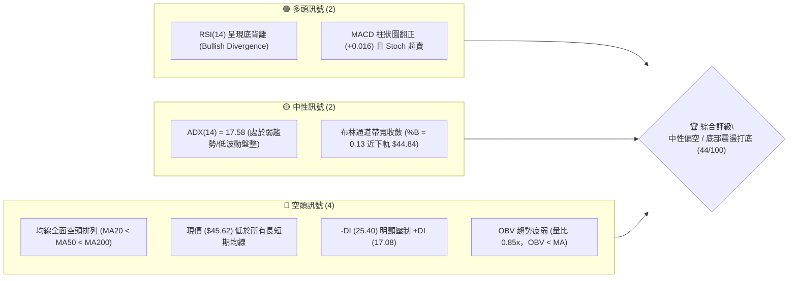
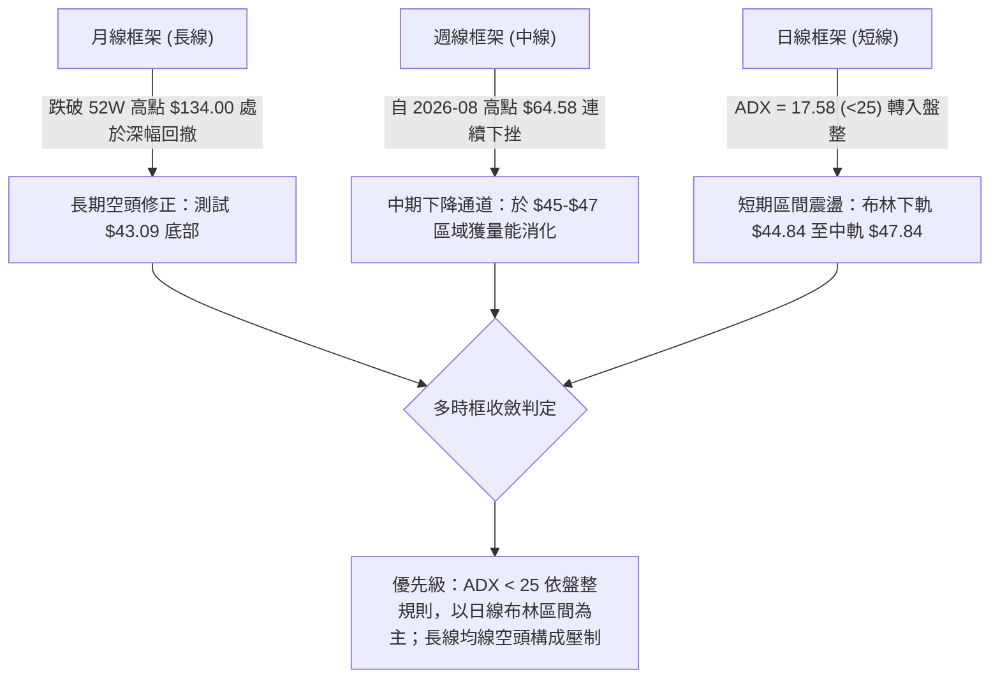
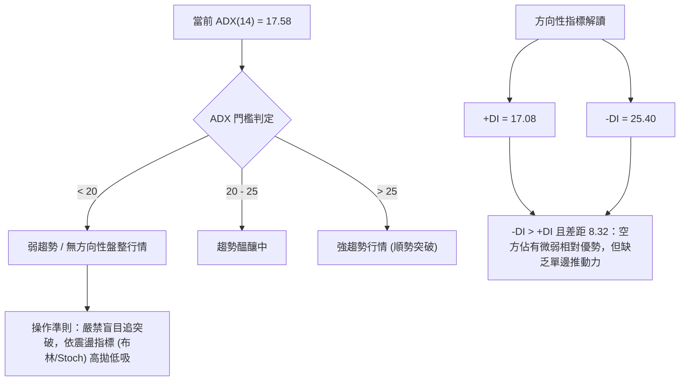
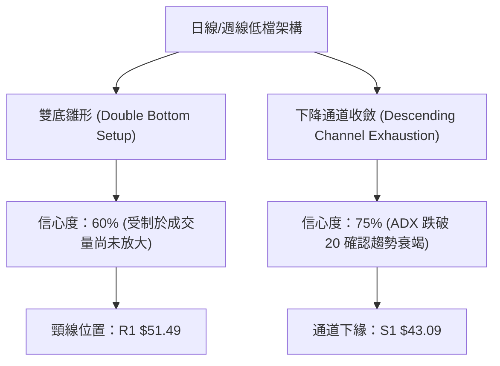
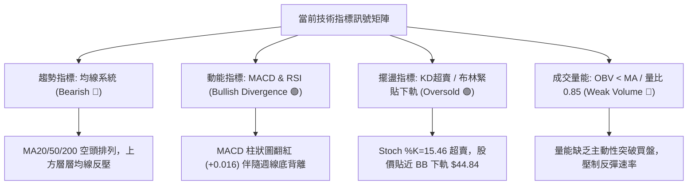
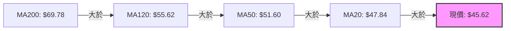
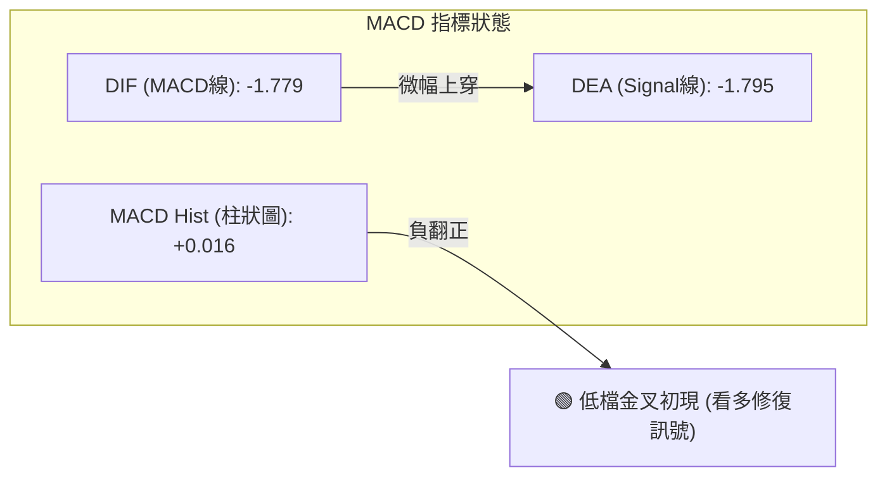
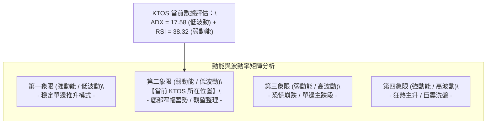
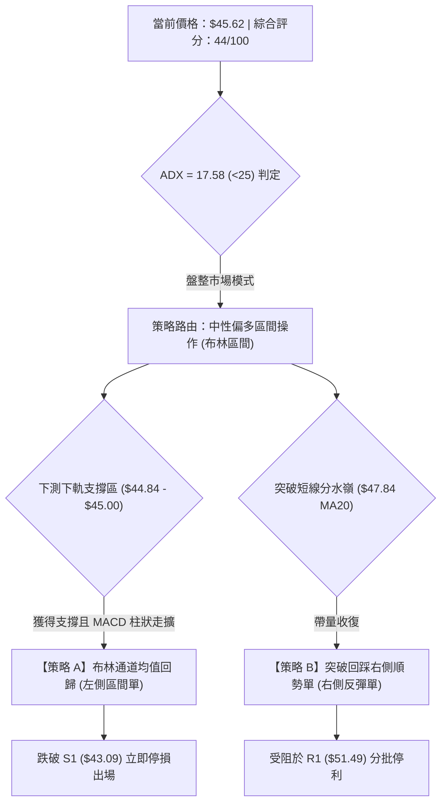
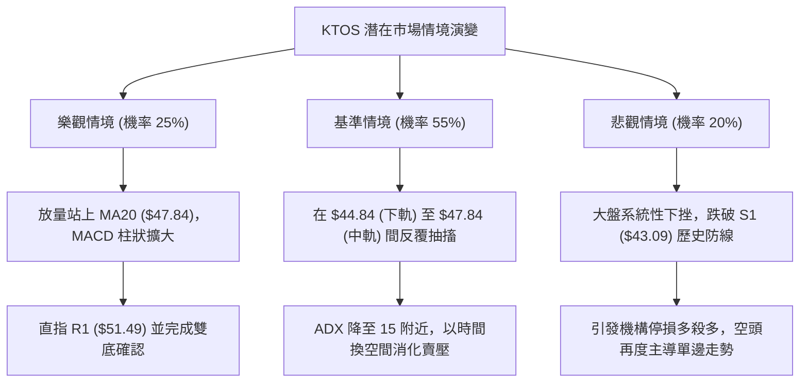

# KTOS 技術分析報告

> **報告日期**：2026-09-26 ｜ **語言**：繁體中文 ｜ **數據來源**：Yahoo Finance ｜ **當前價格**：$45.62

---

## 目錄

| 章節 | 內容 |
|------|------|
| [1. 技術面概覽](#1-技術面概覽) | 訊號儀表板、核心指標、評分卡 |
| [2. 趨勢分析](#2-趨勢分析) | 多時框趨勢、長中短期走勢 |
| [3. 圖表形態分析](#3-圖表形態分析) | 形態識別、K線組合、目標價 |
| [4. 支撐與阻力](#4-支撐與阻力) | 關鍵價位、斐波那契回調 |
| [5. 技術指標深度解讀](#5-技術指標深度解讀) | MA/RSI/MACD/布林/成交量 |
| [6. 動能與波動率](#6-動能與波動率) | 動能評估、ATR、Beta |
| [7. 多時框架總結](#7-多時框架總結) | 時框架評分矩陣 |
| [8. 交易策略建議](#8-交易策略建議) | 多空策略、風險報酬比 |
| [9. 風險提示與監控](#9-風險提示與監控) | 監控指標、風險場景 |
| [10. 報告總結](#-報告總結) | 核心結論與執行摘要 |

---

## 1. 技術面概覽

### 🎯 技術訊號儀表板



### 📊 核心指標速覽表

| 指標類別 | 指標名稱 | 當前數值 | 訊號 | 解讀 |
|----------|----------|----------|------|------|
| **價格** | 當前價格 | $45.62 | 🔴 | 位於52週區間底部的 2.8%，極端弱勢區間內徘徊 |
| **均線** | MA20 | $47.84 | 🔴 | 股價位於 MA20 下方 -4.65%，短期下行壓制未解 |
| **均線** | MA50 | $51.60 | 🔴 | 股價位於 MA50 下方 -11.59%，中期空方控盤 |
| **均線** | MA200 | $69.78 | 🔴 | 股價大幅落後 MA200 下方 -34.62%，長期結構空頭 |
| **動能** | RSI(14) | 38.32 | 🟡 | 脫離超賣但仍在 50 之下，伴隨明顯日/週線底背離 |
| **動能** | MACD (12/26/9) | -1.779 / -1.795 | 🟢 | 快線微幅上穿慢線，柱狀圖翻紅（+0.016），低檔初現拐點 |
| **動能** | Stoch %K / %D | 15.46 / 24.23 | 🟢 | 進入 <20 的極端超賣區，短線反彈醞釀中 |
| **趨勢強度** | ADX(14) | 17.58 | 🟡 | ADX < 25 判定為盤整/弱趨勢，-DI(25.40) > +DI(17.08) |
| **通道** | Bollinger Bands | $44.84 - $50.85 | 🟡 | %B = 0.13，緊貼下軌 $44.84，隨時觸發均值回歸中軌 |
| **波動** | ATR(14) | $2.24 | 🟡 | 佔股價 4.91%，日波動幅度溫和，有利於低波動築底 |
| **量能** | 量比 / OBV | 0.85x / 疲弱 | 🔴 | 成交量 3.18M 低於均量，OBV 低於均線，缺乏大資金追價 |

### 🏆 技術評分卡

```
╔══════════════════════════════════════════════════════════════╗
║              技術評分卡 — KTOS (2026-09-26)                  ║
╠══════════════════════════════════════════════════════════════╣
║ 趨勢強度 (Trend)     ████░░░░░░░░░░░░░░░░  22/100 🔴 弱勢盤整║
║ 動能指標 (Momentum)  ███████████░░░░░░░░░  55/100 🟡 背離修復║
║ 支撐穩定度 (Support) ████████████░░░░░░░░  60/100 🟡 S1穩固  ║
║ 成交量配合 (Volume)  ██████░░░░░░░░░░░░░░  30/100 🔴 縮量乏力║
║ 形態完整度 (Pattern) ██████████░░░░░░░░░░  50/100 🟡 底部測試║
║ 均線排列 (Moving Avg)████░░░░░░░░░░░░░░░░  20/100 🔴 完美空頭║
╠══════════════════════════════════════════════════════════════╣
║ 綜合評分             ████████░░░░░░░░░░░░  44/100 ⚖️ 中性觀望║
╚══════════════════════════════════════════════════════════════╝
```

---

## 2. 趨勢分析

### 🌐 多時框趨勢分析



### 📈 長期趨勢 — 12個月走勢圖（Unicode）

```
KTOS 月線收盤走勢圖（2025-10 至 2026-09）
價格 ($)
$105 ┤                               ●(2026-01: $103.01)
$100 ┤
 $95 ┤
 $90 ┤●(2025-10: $90.60)
 $85 ┤                                     ●(2026-02: $86.18)
 $80 ┤
 $75 ┤      ●(2025-11: $76.10)
 $70 ┤            ●(2025-12: $75.91)             ●(2026-03: $70.51)
 $65 ┤                                                 ●(2026-04: $63.05)  ●(2026-05: $64.13)
 $60 ┤
 $55 ┤                                                                           ●(2026-08: $50.98)
 $50 ┤                                                                     ●(2026-06: $49.86)
 $45 ┤                                                                           ●(2026-07: $46.60)  ●(現在: $45.62)
 $40 ┤                                                                     ●(52W低點: $43.09)
     └─────────────────────────────────────────────────────────────────────────────────────────────
       10    11    12    01    02    03    04    05    06    07    08    09  (月份)
```

#### 走勢特徵分析表格

| 階段區間 | 起止價格 | 漲跌幅 | 趨勢特徵 | 關鍵技術事件 |
|----------|----------|--------|----------|--------------|
| **主升末段** (2025.10 - 2026.01) | $90.60 → $103.01 | +13.70% | 頂部寬幅震盪衝高 | 觸及 52 週最高點 $134.00 後收盤回落至 $103.01 |
| **破位下殺** (2026.01 - 2026.04) | $103.01 → $63.05 | -38.79% | 單邊空頭放量重挫 | 跌破 MA50 與 MA200，多頭架構徹底崩解 |
| **中繼反彈** (2026.04 - 2026.05) | $63.05 → $64.13 | +1.71% | 縮量橫盤反彈受阻 | 受制於 78.6% 斐波那契壓力位 $62.54 附近 |
| **二次探底** (2026.05 - 2026.07) | $64.13 → $46.60 | -27.33% | 加速趕底，破位下行 | 測試 52 週最低點 $43.09 獲得支撐 |
| **區間打底** (2026.07 - 2026.09) | $46.60 → $45.62 | -2.10% | 弱勢築底，波動率收斂 | 於 $45.00-$51.00 構築短線震盪箱體，ADX 降至 17.58 |

### 📊 中期趨勢（週線分析）

```
KTOS 中期週線壓力與支撐示意圖
══════════════════════════════════════════════════════════════
 [壓力區間]
 $64.58  ━━━━━━━━━━━━━━━━━━━━━━━━━━━━━ 2026-08 波段高點壓力
 $58.88  ═════════════════════════════ R3 強阻力位 (前波跳空平台)
 $54.22  ----------------------------- R2 阻力位 (MA120 壓制帶)
 $51.49  ----------------------------- R1 關鍵阻力位 (MA50 & BB上軌共振)
 
 [當前價位]
 $45.62  ◄────── 現價 (處於 $44.84 - $47.84 日線布林通道內)
 
 [支撐區間]
 $44.84  ............................. BB 下軌即時支撐
 $43.09  ═════════════════════════════ S1 52週歷史低點 / 100% 斐波那契強支撐
══════════════════════════════════════════════════════════════
```

### ⚡ 趨勢強度評估（ADX 解讀）



#### ADX 強度對照表

| 指標變量 | 數值 | 狀態區間 | 技術意義 | 操作對策 |
|----------|------|----------|----------|----------|
| **ADX(14)** | **17.58** | 弱勢盤整 (<20) | 單邊動能徹底衰竭，市場進入低波動消化期 | 採取箱體區間交易，不追單邊單 |
| **+DI (14)** | **17.08** | 低檔偏弱 (<20) | 買盤缺乏連續性，推升力道疲乏 | 需等待帶量站上 MA20 才能激活 |
| **-DI (14)** | **25.40** | 中度主導 (>20) | 空頭仍控盤但斜率已放緩，未形成加速下殺 | 密切注意空頭力道是否跌破 20 |
| **動向差值** | **-8.32** | 負向擴展收斂 | 空頭優勢縮小，呈現底背離醞釀形態 | 在 S1 ($43.09) 上方尋找反轉訊號 |

---

## 3. 圖表形態分析

### 🔍 形態識別系統



#### 形態信心度與參數表格

| 形態名稱 | 信心度 | 判斷依據（引用數據） | 完成度 | 目標價（附嚴謹計算式） |
|----------|--------|----------------------|--------|------------------------|
| **雙重底雛形 (Double Bottom)** | 60% | 第一次波段低點為 52W 低點 $43.09，當前價 $45.62 於 $44-$46 企穩構築第二底，MACD 柱狀圖翻正 (+0.016)。 | 65% | **未確認突破**。若帶量突破頸線 R1 ($51.49)，由形態高度推算：<br>形態高度 = $51.49 - $43.09 = $8.40<br>推算目標價 = $51.49 + $8.40 = **$59.89** (接近 R3 $58.88) |
| **布林通道下軌擠壓 (BB Squeeze)** | 80% | 布林帶寬極度縮窄，現價 %B = 0.13 逼近下軌 $44.84，ATR 降至 $2.24。 | 90% | 均值回歸中軌 MA20 = **$47.84**；若進一步突破，指向 BB 上軌 = **$50.85** |
| **頭肩頂形態 (Head & Shoulders)** | 85% | 過去 12 個月歷史巨型頭肩頂：左肩 $91.37、頭部 $103.01 (高點 $134.00)、右肩 $86.18，頸線破位點為 78.6% 回調位 $62.54。 | 100% (已完成) | 頸線 $62.54 跌破後，量度跌幅已於 S1 $43.09 (52W Low) 完全達成並超額釋放風險。 |

### 🕯️ 重要K線形態分析

| 週期/日期 | 收盤價 | K線形態特徵 | 量價解讀 | 訊號性質 |
|-----------|--------|-------------|----------|----------|
| **2026-06-28** | $47.21 | 放量大陰線 (45.38M) | 巨量恐慌拋壓釋放，標誌著中期主跌浪高潮，主力資金承接打底 | 🔴 極度恐慌 |
| **2026-08-16** | $64.58 | 長上影穿頭破腳 (19.03M) | 反彈受阻於 $64.58，遇 78.6% 回調位 ($62.54) 大量套牢盤壓制回落 | 🔴 反彈力竭 |
| **2026-09-06** | $47.82 | 低檔十字星/錘子線 | RSI 驟降至 11.7 極端超賣後觸底回升，空頭下殺動能初次衰竭 | 🟢 止跌訊號 |
| **2026-09-20** | $47.46 | 縮量小陽線 (20.72M) | 企穩於 S1 ($43.09) 之上，維持於 $46-$47 窄幅震盪，多空取得暫時平衡 | 🟡 震盪築底 |
| **2026-09-27** | $45.62 | 窄幅孕線 (Inside Bar) | 週收盤回測下軌 $44.84 未破，振幅大幅收窄，準備選擇短線方向 | 🟡 變盤前夕 |

### 📉 ASCII 走勢形態示意圖

```
KTOS 雙底打底示意圖 (日線/週線結構)
價格 ($)
$52.00 ┤                     [頸線 R1: $51.49]
$51.00 ┤        ▲                  ▲
$50.00 ┤       / \                / \
$49.00 ┤      /   \              /   \
$48.00 ┤     /     \            /     \       ◄ 中軌 MA20 ($47.84)
$47.00 ┤    /       \          /       \
$46.00 ┤   /         \        /         ● 現價: $45.62
$45.00 ┤  /           \      /            \
$44.00 ┤ /             \    /              ▼ [BB下軌: $44.84]
$43.00 ┤●               ●──●
        第 1 底         第 2 底雛形
       (52W低點: $43.09) (當前測試中)
       └───────────────────────────────────────────────
```

### 🎯 形態目標價計算

根據雙重底幾何形態與斐波那契回調結構，若底部構築成功並帶量突破頸線：
1. **第一波段目標價 (T1)**：取自日線布林通道中軌及第一阻力位共振帶 **$47.84 - $51.49**。
2. **第二波段量度目標價 (T2)**：
   - 頸線臨界點：R1 = $51.49
   - 形態底部：S1 = $43.09
   - 形態高度 $H = \text{頸線} - \text{底部} = \$51.49 - \$43.09 = \$8.40$
   - 形態理論目標價 = $\text{頸線} + H = \$51.49 + \$8.40 = \mathbf{\$59.89}$（精確落於 R3 阻力位 **$58.88** 上方 1.7% 處，形成極強之結構目標價）。

---

## 4. 支撐與阻力

### 🗺️ 關鍵價位分布圖（Unicode）

```
KTOS 價位結構分布圖
══════════════════════════════════════════════════════════════
$58.88 ║████████████████████████████████║ 強阻力 R3 (前波反彈高點聚類)
$54.22 ║████████████████████            ║ 中期阻力 R2 (MA120 壓制區)
$51.49 ║████████████████████████████    ║ 關鍵阻力 R1 (MA50 / BB上軌 / 頸線)
$47.84 ║--------------------------------║ 短線強弱分水嶺 (MA20 / BB中軌)
$45.62 ╠════════════════════════════════╣ ◄ 當前市價 ($45.62)
$44.84 ║································║ 短線動態支撐 (布林通道下軌)
$43.09 ║████████████████████████████████║ 核心強支撐 S1 (52週歷史低點 / 100% Fib)
══════════════════════════════════════════════════════════════
```

### 🚧 阻力位分析表

所有阻力位數值完全嚴格引用技術數據「關鍵價位」區塊之波段高點聚類：

| 阻力級別 | 價位 | 距現價空間 | 形成原因與技術共振 | 突破難度 | 重要性權重 |
|----------|------|------------|--------------------|----------|------------|
| **R1** | **$51.49** | +12.87% | 近一年波段高點聚類；與日線 MA50 ($51.60)、MA60 ($51.34) 及布林上軌 ($50.85) 高度重疊。 | 中等偏高 | 🟢🟢🟢🟢 (短線多空分水嶺) |
| **R2** | **$54.22** | +18.85% | 近一年密集震盪平台高點聚類；上方緊鄰日線 MA120 ($55.62)。 | 高 | 🟢🟢🟢 (中期趨勢反轉點) |
| **R3** | **$58.88** | +29.07% | 近一年重要波段折返高點聚類；為 2026 年 8 月反彈下挫前之起跌平台。 | 極高 | 🟢🟢🟢🟢🟢 (多頭復興大關) |

### 🛡️ 支撐位分析表

所有支撐位數值嚴格引用技術數據「關鍵價位」區塊之波段低點聚類：

| 支撐級別 | 價位 | 距現價空間 | 形成原因與技術共振 | 守住機率 | 重要性權重 |
|----------|------|------------|--------------------|----------|------------|
| **S1** | **$43.09** | -5.55% | 近一年波段最低點聚類；52 週最低點；斐波那契 100% 終極支撐。 | 70% | 🔴🔴🔴🔴🔴 (絕對多頭防線) |
| *動態參考* | *$44.84* | -1.71% | *日線布林通道下軌動態支撐（輔助參考，非獨立聚類）。* | 60% | 🔴🔴 (短線日內下影線參考) |

### 📐 斐波那契回調位分析

依據 52 週完整波動區間（高點 **$134.00** 下跌至低點 **$43.09**，總落差 $90.91）嚴格引用數據所載斐波那契點位：

```
134.00 ┼ 0.0%  (52W High 最高點)
112.55 ┼ 23.6% 回調位
 99.27 ┼ 38.2% 回調位
 88.55 ┼ 50.0% 中樞平衡位
 77.82 ┼ 61.8% 黃金分割強壓力位
 62.54 ┼ 78.6% 回調位 (前波反彈高點受阻區域)
 45.62 ┼ ◄ 現價落於 78.6% ($62.54) 與 100.0% ($43.09) 之超深幅回撤區間內
 43.09 ┴ 100.0% (52W Low 最低點強支撐)
```

- **位置意義解讀**：KTOS 當前價位處於 52 週極限深幅回調區間（回調幅度超過 78.6% 逼近 100.0%）。現價 $45.62 僅高出 100.0% 極限位 $43.09 約 5.55%，技術面呈現高度非對稱性風險報酬結構——下行防守空間僅 $2.53，而上方至最近一級 78.6% 斐波那契位 ($62.54) 具備 $16.92 (+37.08%) 之理論修復空間。

---

## 5. 技術指標深度解讀

### 🎛️ 指標訊號總覽



### 📈 移動平均線排列分析



#### 均線偏離度分析表

| 均線名稱 | 數值 | 距現價差距 ($) | 偏離幅度 (%) | 當前走勢特徵 | 技術狀態解讀 |
|----------|------|----------------|--------------|--------------|--------------|
| **MA 5** | $46.87 | -$1.25 | -2.67% | 下降斜率收緩 | 短線極度貼近，首要收復目標 |
| **MA 10** | $47.23 | -$1.61 | -3.40% | 走平微跌 | 短線壓制線 |
| **MA 20** | $47.84 | -$2.23 | -4.65% | 下行 | 布林中軌所在，突破視為短線轉強 |
| **MA 60** | $51.34 | -$5.72 | -11.15% | 持續向下延伸 | 與 R1 ($51.49) 形成中期共振阻力帶 |
| **MA 120** | $55.62 | -$10.00 | -17.98% | 下跌趨緩 | 接近 R2 ($54.22)，中期下降通道上軌 |
| **MA 200** | $69.78 | -$24.16 | -34.62% | 穩定下行 | 長期牛熊分水嶺，嚴重負乖離 |
| **MA 240** | $71.61 | -$25.99 | -36.29% | 長期下壓 | 年線級別重壓 |

### 📉 RSI(14) 分析

- **數值進度條**：
  ```
  RSI(14): [███████████████░░░░░░░░░░░░░░░] 38.32 (中性偏弱區)
  0                30(超賣)           70(超買)      100
  ```
- **區間評估**：當前 RSI 位於 38.32，已從 2026-09-06 週線級別的 11.7 極端超賣區回升，擺脫非理性拋售階段。
- **背離判斷**：⚠️ **明確底背離 (Bullish Divergence) 確認**！
  - *走勢對比*：股價在 2026-09-27 下探至 $45.62，逼近 9 月中旬低點 $46.69；然而 RSI 指標由 11.7（09-06）大幅抬升至 38.32（09-27）。價格震盪築底之際，動能指標已走出顯著的「一浪高於一浪」強烈底背離結構，預告下行賣壓已枯竭。

### 📊 MACD(12/26/9) 訊號解讀



- **交叉解讀**：DIF (-1.779) 已高於 DEA (-1.795)，MACD 柱狀圖由負值收斂至 **+0.016**，於零軸下方深度區域形成「低檔黃金交叉」。
- **趨勢意義**：在均線全面空頭背景下，零軸下方的 MACD 金叉通常屬於技術性反抽性質，首階段目標為修復負乖離，引導股價上測 MA20 ($47.84)。

### 📦 布林通道分析

```
KTOS 布林通道位置示意圖 (寬度收窄中)
價格 ($)
$51.00 ┤  ──────────────────────────────── 上軌 $50.85
$50.00 ┤
$49.00 ┤
$48.00 ┤  - - - - - - - - - - - - - - - - 中軌 (MA20) $47.84
$47.00 ┤
$46.00 ┤        ● 當前市價 $45.62 (%B = 0.13)
$45.00 ┤
$44.50 ┤  ════════════════════════════════ 下軌 $44.84
```

- **通道參數解讀**：
  - 上軌：**$50.85** ｜ 中軌：**$47.84** ｜ 下軌：**$44.84**
  - **%B 指標 = 0.13**：顯示現價極度貼近下軌，位於下軌向上 13% 的極限狹窄區間內。在統計學意義上，股價下行空間受到下軌硬支撐，容易觸發統計套利的均值回歸。
  - **帶寬擠壓**：上軌與下軌間距僅 $6.01 (約 13.1%)，顯示波動率進入近一年收斂極值，預示近期將有方向性突破。

### 💹 成交量分析（量價配合度）

- **量比與均量**：最新成交量為 3,184,400 股，低於 20 日均量 3,734,165 股，量比為 **0.85x**，顯著縮量。
- **OBV（能量潮）解讀**：當前 OBV 趨勢低於其均線（OBV < MA），證實近期的盤整缺乏大體量機構資金的主動性拉抬，市場買盤以散戶逢低承接與空頭回補為主。
- **量價背離現象**：下跌縮量（成交量萎縮至均量以下），說明市場在 $45.00 附近無恐慌盤湧出；然而若多頭欲發動向上攻擊測試 R1 ($51.49)，日成交量必須放大至 500 萬股以上方能確認有效性。

---

## 6. 動能與波動率

### ⚡ 動能評估四象限



| 象限分區 | 動能維度 | 波動維度 | KTOS 符合性 | 戰略應對 |
|----------|----------|----------|-------------|----------|
| **Q1 (最佳機會)** | 強 (RSI>60) | 低 (ATR<3%) | 否 | 順勢持股，加碼推升 |
| **Q2 (當前狀態)** | **弱 (RSI=38.32)** | **低 (ATR=4.91%, ADX=17.58)** | **✓ (吻合)** | **謹慎觀望，底背離小倉位試單，嚴設止損於 S1** |
| **Q3 (極度危險)** | 弱 (RSI<30) | 高 (ATR>8%) | 否 (已遠離主跌期) | 嚴禁抄底，反彈清倉 |
| **Q4 (巨震博弈)** | 強 (RSI>70) | 高 (ATR>8%) | 否 | 逢高獲利了結，減碼觀望 |

### 📊 ATR 波動率分析

- **ATR(14) 數值**：**$2.24**（佔當前股價之 **4.91%**）。
- **日內真實波動區間解讀**：每日平均波動約 $2.24，表示常態交易日股價波動空間在 $\pm \$2.24$ 內。
- **止損距離建議**：
  - *保守型操作*：採用 1.5 倍 ATR = $1.5 \times \$2.24 = \mathbf{\$3.36}$
  - *短線進場保護*：以當前價 $45.62 扣除 1.0 倍 ATR ($2.24) 為 $43.38，極度貼近核心支撐 S1 ($43.09)，故直接將 S1 破位 ($42.90) 視為剛性止損點極具技術合理性。

### 📐 Beta 與市場相關性

- **Beta 係數**：**1.113**。
- **相關性與系統性風險解讀**：
  - Beta 為 1.113 顯示 KTOS 對標普 500 指數具備略高於大盤的彈性（當大盤波動 1% 時，KTOS 平均同向波動約 1.11%）。
  - 當前機構持股比例高達 **85.4%**，顯示籌碼結構由機構高度控盤；空頭部位佔流通股 6.2%（天數比 3.12 天），空頭部位適中，若能站穩 MA20 具備一定的軋空潛力。

---

## 7. 多時框架總結

### 📋 時框架評分表

| 時框架 | 趨勢方向 | 動能狀態 | 均線系統 | 形態結構 | 綜合評分 | 操作建議 |
|--------|----------|----------|----------|----------|----------|----------|
| **月線 (長期)** | 🔴 明顯空頭 | 弱勢超賣修復中 | MA200 大幅下行壓制 | 巨型高位回撤，測試 52W 低點 | 35/100 | 長期投資者保持觀望 |
| **週線 (中期)** | 🔴 空頭抵抗 | 🟢 RSI 底背離確立 | 空頭排列 (MA50 < MA120) | 尋求 S1 ($43.09) 雙底支撐 | 48/100 | 逢低分批建倉，嚴控總位 |
| **日線 (短期)** | 🟡 橫盤震盪 | 🟢 MACD 金叉 (+0.016) | 均線空頭但正向中軌靠攏 | 布林通道下軌極致收斂打底 | 52/100 | 區間操作，布林下買上賣 |

### 🔲 綜合訊號矩陣

```
時框架訊號收斂檢驗矩陣
══════════════════════════════════════════════════════════════
指標維度        短期 (日線)          中期 (週線)          長期 (月線)
──────────────────────────────────────────────────────────────
均線排列        🔴 空頭壓制          🔴 空頭下壓          🔴 深度貼水
動能背離        🟢 底背離成立        🟢 顯著底背離        🟡 超賣鈍化
趨勢強度        🟡 ADX=17.58 (盤整)  🔴 空方佔優          🔴 空方趨勢
波動狀態        🟢 布林極度收斂      🟡 波動率回落        🔴 歷史回撤
籌碼/機構       🟡 機構持股 85.4%    🟡 融券比 6.2%       🟢 籌碼未崩潰
══════════════════════════════════════════════════════════════
一致性判定      長中期趨勢向下壓制，但短中期具備強烈動能衰竭與背離共振
```

### ⚖️ 多時框收斂結論

依據多時框收斂規則第 14 條嚴格判定：
1. **趨勢性檢驗**：當前日線 ADX(14) 數值為 **17.58**（顯著小於 25 臨界值），明確判定當前盤面**並非單邊趨勢行情，而是處於弱趨勢／盤整築底行情**。
2. **主導時框與優先級**：依規則，盤整行情應以**日線布林通道區間（下軌 $44.84 至中軌 $47.84 / 上軌 $50.85）**為主要交易邊界，長週期均線（MA50 $51.60、MA200 $69.78）則作為反彈壓制之上限。
3. **唯一方向性結論**：**【中性觀望，區間低吸高拋】**。股價緊貼下軌並伴隨日週線 RSI 強烈底背離，下行空間極度受限於 S1 ($43.09)；策略上不宜在 $45.62 進行盲目追空，應以防守型區間震盪交易為主導。

---

## 8. 交易策略建議

### 🗺️ 策略決策流程圖



### 🧭 策略路由（依評分卡分流）

> **當前主策略方向 = 中性區間震盪低吸操作（依綜合評分 44/100，處於 40–60 區間震盪分流）**
> 
> *理由*：雖然均線長空格局未變，但 ADX 跌入 17.58 證實空頭殺跌力竭，日/週線 RSI 明確底背離且布林 %B 僅 0.13，做空盈虧比極差。因此主推「以核心支撐 S1 為防守底線的區間反彈操作」，空頭僅列為破位後的風險對沖提示。

### 🎯 價格情境階梯（Price Scenarios）

價位嚴格引用第 4 章關鍵價位數據：

| 觸發條件 | 第一目標 (T1) | 第二延伸目標 (T2) | 技術情境含義 |
|----------|---------------|-------------------|--------------|
| **向上突破 MA20 ($47.84)** | 阻力位 R1 **$51.49** | 阻力位 R2 **$54.22** | 短線擺脫下軌糾纏，啟動均值回歸與雙底頸線測試 |
| **強勢突破頸線 R1 ($51.49)** | 阻力位 R2 **$54.22** | 阻力位 R3 **$58.88** | 中期波段反轉確認，形態量度目標 $59.89 啟動 |
| **現價區間震盪 ($44.84 - $47.84)** | 布林中軌 **$47.84** | 布林上軌 **$50.85** | 箱體內部消化籌碼，ADX 蓄勢盤整 |
| **向下跌破 S1 ($43.09)** | 無直接數據支撐 | 進入歷史未知探底 | 52 週大底破位，多頭形態全面毀損，進入停損離場 |

### 📊 情境機率分佈

| 運行情境 | 發生機率 | 主要技術依據 |
|----------|----------|--------------|
| **情境一：低檔區間震盪打底** | **55%** | ADX(14)=17.58 極弱趨勢；布林帶寬收窄；量比僅 0.85x 縮量沉澱。 |
| **情境二：技術性反彈回歸中軌** | **30%** | RSI(14)=38.32 伴隨強底背離；MACD 柱狀翻正 (+0.016)；Stoch 超賣。 |
| **情境三：下破 S1 跌入新低** | **15%** | 均線系統 MA20<MA50<MA200 仍為空頭排列；-DI 仍大於 +DI。 |

### 🟢 主策略詳情（中性震盪低吸策略）

| 策略要素 | 策略 A：左側布林下軌低吸單 | 策略 B：右側突破 MA20 順勢加碼單 |
|----------|----------------------------|-----------------------------------|
| **交易類型** | 區間交易 / 左側抄底 | 趨勢突破 / 右側確認 |
| **進場條件** | 現價回踩 $45.00 - $45.62 區間，守住下軌 | 日K實體收盤帶量突破 MA20 ($47.84) |
| **進場價格** | **$45.62** (現價或等候回踩 $45.00) | **$47.84** (突破當日尾盤進場) |
| **止損價格** | **$42.90** (嚴格設於 S1 $43.09 之下) | **$45.50** (跌回 MA20 之下及前波平台) |
| **目標價 T1** | **$47.84** (日線 MA20 / 布林中軌) | **$51.49** (關鍵阻力 R1 / MA50) |
| **目標價 T2** | **$51.49** (關鍵阻力 R1 / 雙底頸線) | **$54.22** (中期阻力 R2) |
| **風險報酬比** | **2.16 : 1** (以目標 T2 計算：獲利 $5.87 / 風險 $2.72) | **2.73 : 1** (以目標 T2 計算：獲利 $6.38 / 風險 $2.34) |
| **預估勝率** | **58%** | **52%** |
| **建議倉位** | **5% - 8%** (輕倉試單) | **10% - 12%** (確認信號後加碼) |

### 🔴 反向風險觸發點（對沖與硬止損提示）

若出現以下訊號，證明本報告之「築底」預設遭市場推翻，多頭必須立即停損或建立對沖頭寸：
1. **破位止損線**：日K收盤價**跌破 S1 ($43.09)**，特別是伴隨成交量放大至 400 萬股以上。
2. **動能惡化訊號**：RSI(14) 重新跌穿 30 且跌破前期低點 11.7，底背離形態失敗。
3. **對沖操作建議**：一旦跌破 $43.09，多單無條件全數離場；進取型交易者可反手建立融券空單，短線下看空頭自由落體走勢。

### ⭐ 整體訊號強度評星

```
做多訊號強度：★★☆☆☆  (2/5星 - 僅具動能背離，缺乏趨勢支撐)
做空訊號強度：★★★☆☆  (3/5星 - 均線空頭但空間已被壓縮)
整體技術可信度：★★★☆☆  (3/5星 - ADX<25 盤整期震盪雜訊較多)
```

---

## 9. 風險提示與監控

### ✅ 關鍵監控指標 Checklist

```
╔══════════════════════════════════════════════════════════════╗
║               KTOS 每日交易監控清單 (Checklist)              ║
╠══════════════════════════════════════════════════════════════╣
║ [ ] 價格防守：收盤價是否嚴格維持於 S1 ($43.09) 之上？       ║
║ [ ] 均線挑戰：能否在 3 個交易日內帶量收復 MA20 ($47.84)？    ║
║ [ ] 動能維護：MACD 柱狀圖是否持續維持在正值區 (>0)？         ║
║ [ ] 趨勢轉變：ADX 是否向上突破 20 且伴隨 +DI 上穿 -DI？     ║
║ [ ] 量能驗證：上攻交易日成交量是否放大至 3.73M (20日均量) 以上？║
║ [ ] 通道狀態：布林通道帶寬是否開始向外擴張？                 ║
╚══════════════════════════════════════════════════════════════╝
```

### ⚠️ 風險場景分析



### 🛡️ 風險管理重要提醒

1. **基本面非對稱因素考量**：
   - 雖然 KTOS 營收年增達 30.5%，且華爾街 21 位分析師給予一致 `Strong Buy` 評級（平均目標價高達 **$102.76**，當前折價超過 55%），近期包括 Guggenheim (09-15)、Truist 等大行持續給予買入評級；
   - 然而，其 TTM 市盈率仍處於 268.35 倍高位，且自由現金流為負（$-118.29M），技術面走勢嚴格反映了資金對估值重估的修正。**切勿僅因分析師高目標價而忽視技術停損紀律**。
2. **波動率與倉位管理**：
   - 股價當前 ATR 為 $2.24（約 4.91%），屬於中等偏高波動個股。單筆交易承受風險不應超過投資組合總權益的 1.0%。
   - 若帳戶總資產為 $100,000，單筆最大風險限額 $1,000；依據進場點 $45.62 與止損點 $42.90（風險差額 $2.72），最大允許開倉股數為：
     $$\text{最大倉位} = \frac{\$1,000}{\$2.72} \approx 367 \text{ 股} \quad (\text{約佔資產 } 16.7\%)$$
   - 在評分 44 分的中性盤整環境下，建議將實際建倉規模控制在上述上限的 **50%（約 180 股，總資金 8%）** 為宜。

---

## 📋 報告總結

```
╔══════════════════════════════════════════════════════════════════╗
║                    KTOS 技術分析報告總結                         ║
╠══════════════════════════════════════════════════════════════════╣
║ 報告日期：2026-09-26           當前價格：$45.62                  ║
║ 綜合技術評分：44/100           技術評級：⚖️ 中性觀望 (底部醞釀) ║
╠══════════════════════════════════════════════════════════════════╣
║ 關鍵架構結論：                                                   ║
║ ├─ 長期趨勢：🔴 空頭深幅修正 (跌破 $134 以來維持大型下行通道)    ║
║ ├─ 中期趨勢：🟡 跌勢竭盡 (ADX=17.58 轉入弱勢盤整，尋求雙底)       ║
║ ├─ 短期趨勢：🟢 醞釀反彈 (RSI 週日雙底背離 + MACD 柱狀翻正)      ║
║ ├─ 核心支撐：$43.09 (S1，52週最低點，絕對防守底線)               ║
║ ├─ 關鍵阻力：$47.84 (MA20/中軌) ｜ $51.49 (R1，強弱分水嶺)       ║
║ └─ 分析師共識：🟢 Strong Buy (目標均價 $102.76，高達 +125% 空間) ║
╠══════════════════════════════════════════════════════════════════╣
║ 最優執行策略組合：                                               ║
║ 1. 🥇 最佳機會：於 $45.00-$45.62 區間建立左側觀察倉，停損嚴格設 ║
║                 於 S1 破位處 ($42.90)，第一目標看 MA20 $47.84。 ║
║ 2. 🥈 次選機會：等候日K收盤帶量站穩 $47.84 順勢右側跟進，目標   ║
║                 直指雙底頸線兼波段高點 R1 $51.49。               ║
║ 3. 🥉 保守選擇：在 ADX < 25 期間完全空倉觀望，靜待日線級別帶量  ║
║                 站上 MA50 ($51.60) 並完成底部突破後再行介入。   ║
╚══════════════════════════════════════════════════════════════════╝
```

---

> ⚠️ **免責聲明**：本報告為依據既定技術指標模型與歷史量價數據生成之專業技術分析，所有價位、回調位及形態測算均遵循量化客觀標準。報告內容**僅供投資研究與學術參考**，**不構成任何要約、招攬或具體投資建議**。技術指標具備滯後性與機率極限，金融市場存在高度不確定性，投資人應獨立評估財務狀況並嚴格執行風險管理措施。

---

*報告生成時間：2026-09-26 ｜ 數據來源：Yahoo Finance ｜ 分析框架：多時框架量化技術分析*