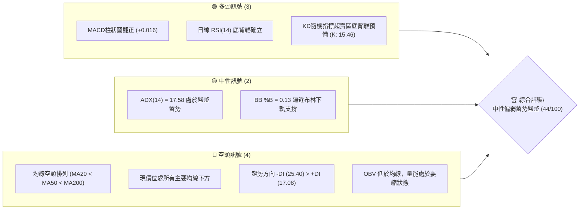
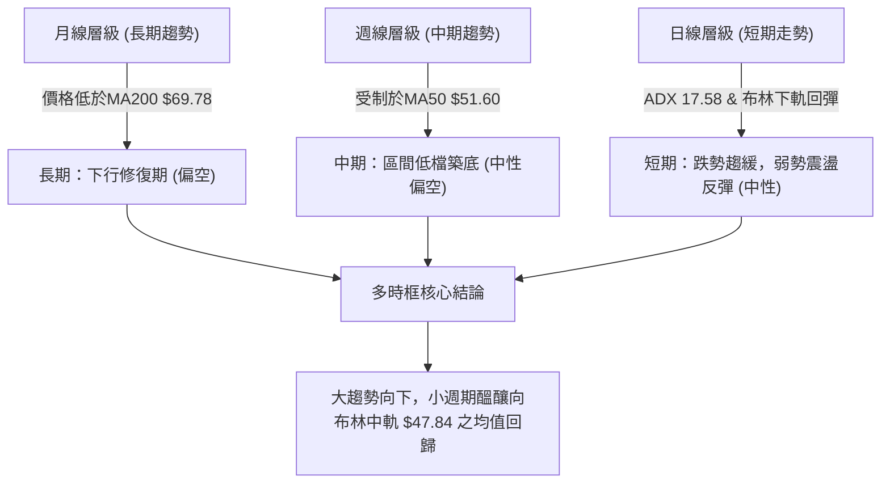
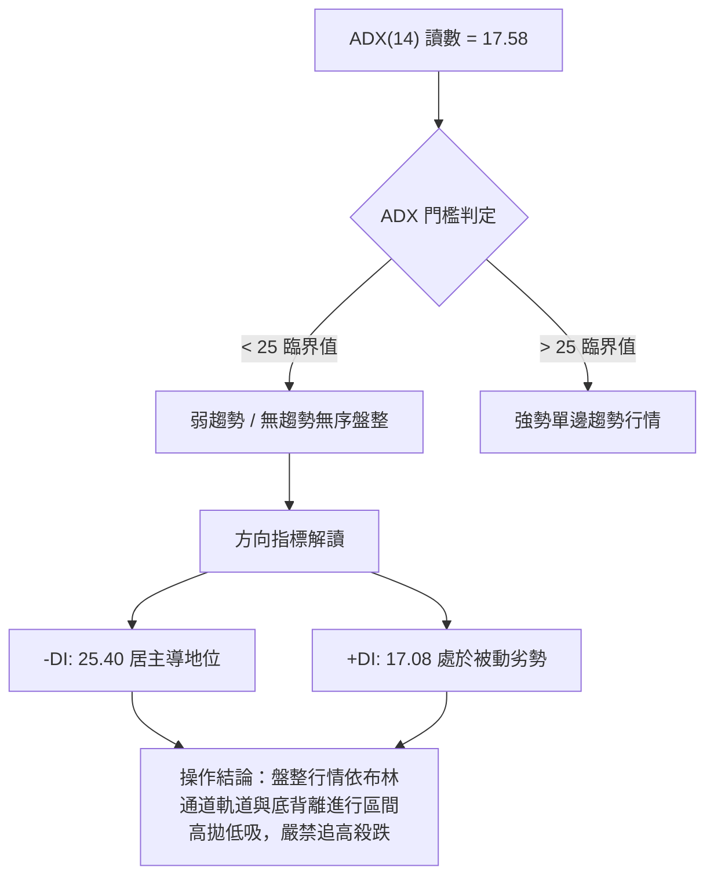
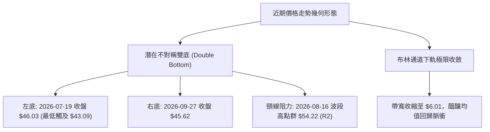
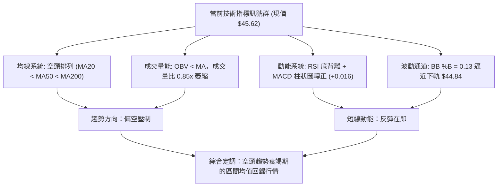
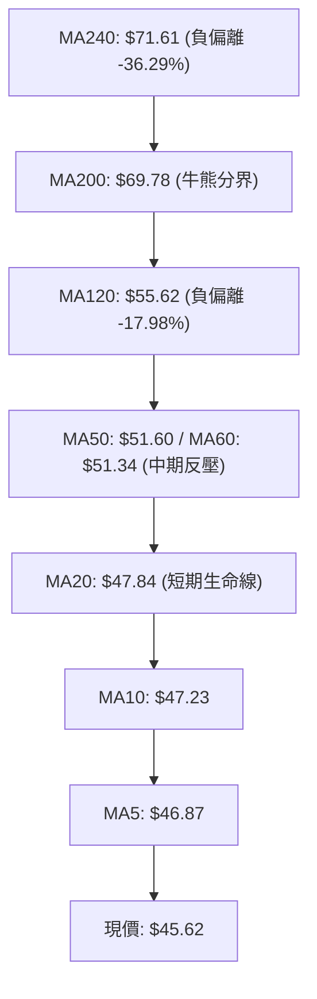
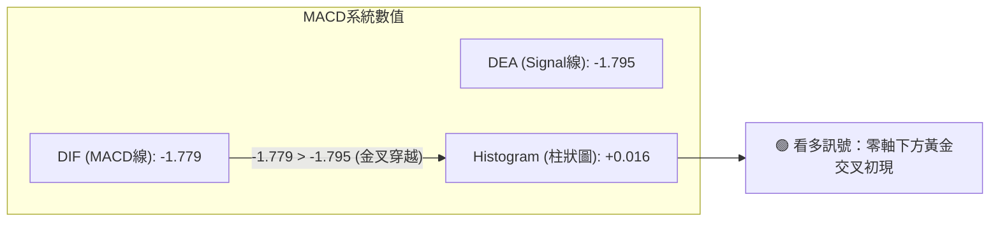
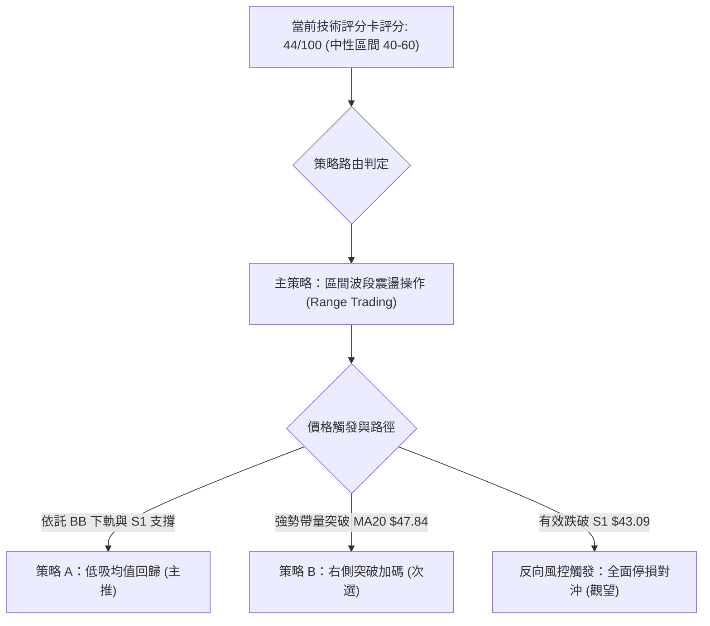
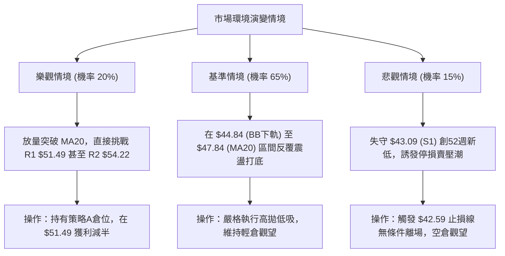

# KTOS 技術分析報告

> **報告日期**：2026-09-27 ｜ **語言**：繁體中文 ｜ **數據來源**：Yahoo Finance ｜ **當前價格**：$45.62

---

## 目錄

| 章節 | 內容 |
|------|------|
| [1. 技術面概覽](#1-技術面概覽) | 訊號儀表板、核心指標、評分卡 |
| [2. 趨勢分析](#2-趨勢分析) | 多時框趨勢、長中短期走勢、ADX強度 |
| [3. 圖表形態分析](#3-圖表形態分析) | 形態識別、K線組合、信心度評估 |
| [4. 支撐與阻力](#4-支撐與阻力) | 關鍵價位、斐波那契回調結構 |
| [5. 技術指標深度解讀](#5-技術指標深度解讀) | MA/RSI/MACD/布林/成交量量價背離 |
| [6. 動能與波動率](#6-動能與波動率) | 動能四象限、ATR防守、Beta係數 |
| [7. 多時框架總結](#7-多時框架總結) | 時框架矩陣、多時框收斂定調 |
| [8. 交易策略建議](#8-交易策略建議) | 策略路由、區間操作、風險報酬比 |
| [9. 風險提示與監控](#9-風險提示與監控) | 關鍵指標清單、極端場景壓力測試 |
| [📋 報告總結](#-報告總結) | 核心結論與交易決策摘要 |

---

## 1. 技術面概覽

### 🎯 技術訊號儀表板



### 📊 核心指標速覽表

| 指標類別 | 指標名稱 | 當前數值 | 訊號 | 解讀 |
|:---|:---|:---|:---:|:---|
| **價格** | 當前價格 | $45.62 | 🔴 | 位於52週區間2.8%分位，處於波段超跌極低點 |
| **均線** | MA20 | $47.84 | 🔴 | 價格位於MA20下方（-4.65%），短線承壓 |
| **均線** | MA50 | $51.60 | 🔴 | 價格低於中期生命線（-11.59%），中期下行通道 |
| **均線** | MA200 | $69.78 | 🔴 | 價格遠低於長期牛熊分界線（-34.62%），長期偏空 |
| **動能** | RSI(14) | 38.32 | 🟡 | 脫離超賣區回升至中性區間，呈現明確底背離結構 |
| **動能** | MACD (12,26,9) | -1.779 / -1.795 | 🟢 | MACD柱狀圖轉正（+0.016），黃金交叉初現 |
| **動能** | Stoch %K / %D | 15.46 / 24.23 | 🟢 | 進入極度超賣區，短線隨時孕育超跌反彈動能 |
| **趨勢** | ADX (14) | 17.58 | 🟡 | 低於25閾值，空方單邊下行動能衰竭，轉為區間盤整 |
| **通道** | 布林通道 | $44.84 - $50.85 | 🟡 | %B為0.13，價格觸碰下軌後獲得支撐，醞釀向中軌回歸 |
| **波動** | ATR(14) | $2.24 | 🟡 | 佔現價4.91%，日波幅適中，提供明確止損緩衝 |
| **量能** | 量比 (vs 20MA) | 0.85x | 🔴 | 成交量3.18M低於20日均量3.73M，量能萎縮確認盤整 |

### 🏆 技術評分卡

```
╔══════════════════════════════════════════════════════════════╗
║              技術評分卡 — KTOS (2026-09-27)                 ║
╠══════════════════════════════════════════════════════════════╣
║ 趨勢強度 (ADX/方向)   ████████░░░░░░░░░░░░  38/100  🔴 空頭主導但衰竭║
║ 動能指標 (RSI/MACD)   ████████████░░░░░░░░  60/100  🟢 底背離金叉初現║
║ 支撐穩定度 (S1/52W)   ██████████████░░░░░░  70/100  🟢 S1=$43.09強支撐║
║ 成交量配合 (量比/OBV) ██████░░░░░░░░░░░░░░  32/100  🔴 量能萎縮且OBV弱║
║ 形態完整度 (雙底雛形) ██████████░░░░░░░░░░  52/100  🟡 潛在打底待突破║
║ 均線排列 (空頭排列)   ██░░░░░░░░░░░░░░░░░░  12/100  🔴 20<50<200全壓制║
╠══════════════════════════════════════════════════════════════╣
║ 綜合評分              █████████░░░░░░░░░░░  44/100  ⚖️ 區間盤整偏弱  ║
╚══════════════════════════════════════════════════════════════╝
```

---

## 2. 趨勢分析

### 🌐 多時框趨勢分析



### 📈 長期趨勢 — 12個月走勢圖（Unicode）

```
KTOS 月線走勢圖（過去12個月：2025-10 至 2026-09）
價格軸 ($)
$110 ┤                               
$100 ┤                   ● (2026-01: $103.01 - 波段頂部)
 $90 ┤ ● (2025-10: $90.60)
 $80 ┤                            
 $70 ┤       ● (2025-11: $76.10)   ● (2026-03: $70.51)
 $60 ┤             ● (2025-12: $75.91)   ● (2026-04: $63.05)
 $50 ┤                                         ● (2026-06: $49.86) ● (2026-08: $50.98)
 $40 ┤                                                       ● (2026-07: $46.60) 
     │                                                                     ● (現價 $45.62)
     └──────────────────────────────────────────────────────────────────────────────
       10    11    12    01    02    03    04    05    06    07    08    09  (月份)
```

#### 走勢特徵分析表格

| 階段區間 | 起止價格 | 漲跌幅 | 趨勢性質 | 核心量價特徵解讀 |
|:---|:---|:---:|:---:|:---|
| 2025-10 至 2026-01 | $90.60 → $103.01 | +13.70% | 末端加速衝頂 | 價格一度飆升至52週高點$134.00後月線收留長上影，主力出貨信號浮現 |
| 2026-01 至 2026-04 | $103.01 → $63.05 | -38.79% | 崩跌破位下行 | 失守所有短中期均線支撐，高估值泡沫劇烈壓縮 |
| 2026-04 至 2026-06 | $63.05 → $49.86 | -20.92% | 主跌浪延續 | 摜破斐波那契78.6%（$62.54），空頭慣性加速 |
| 2026-06 至 2026-09 | $49.86 → $45.62 | -8.50% | 邊際減速築底 | 下跌斜率大幅放緩，多次在$43.09至$46.00區間探底回升，ADX顯著鈍化 |

### 📊 中期趨勢（週線分析）

```
KTOS 週線價格波段結構示意圖
$65.00 ┤                   ▲ (2026-08-16 高點 $64.58)
$60.00 ┤                  / \
$55.00 ┤        ▲        /   \
$50.00 ┤       / \      /     ▼ ─── 突破頸線失敗
$45.00 ┤  ▲   /   ▼    ▼ (2026-09-27 現價 $45.62)
$43.09 ┴──┴───┴─────────────────────────────── 強力支撐底線 S1 ($43.09)
         05月  06月    07月    08月    09月
```

中期走勢顯示，KTOS 在 2026 年 8 月中旬曾強勢反彈至 $64.58，但受制於 MA120（$55.62）至 MA240（$71.61）強大均線壓制群，隨後以五連陰迅速回落。近四週成交量維持在 14.8M 至 20.7M 之間，顯著低於 6 月底下跌時的 45.38M 放量水準，表明空方砸盤力道已接近枯竭。

### ⚡ 趨勢強度評估（ADX 解讀）



#### ADX 強度量化對照表

| 參數指標 | 數值 | 狀態評估 | 實戰交易指引 |
|:---|:---:|:---:|:---|
| **ADX(14)** | 17.58 | 弱趨勢/低動能盤整 | 趨勢交易策略失效，轉入均值回歸震盪操作模式 |
| **+DI** | 17.08 | 多頭動能衰退 | 反彈力道疲弱，不可對多頭空間過度樂觀 |
| **-DI** | 25.40 | 空頭佔據優勢 | 空頭維持主導，但因ADX下降，下殺空間受到嚴格局限 |
| **方向差值 (DI Spread)**| -8.32 | 負向差值收窄 | 較 8 月底顯著收窄，顯示下行加速度正式歸零 |

---

## 3. 圖表形態分析

### 🔍 形態識別系統



#### 幾何與指標形態確認表（規則 15 嚴格執行）

| 形態類別 | 信心度 | 判斷依據（數據引用） | 完成度 | 目標價（附嚴謹計算式） |
|:---|:---:|:---|:---:|:---|
| **不對稱潛在雙底 (Double Bottom)** | 58% | 左底收盤 $46.03（低點 $43.09），右底當前 $45.62，形成雙底支撐帶；頸線為波段阻力 R2 $54.22 | 45% (尚未突破頸線) | 若突破頸線 R2 ($54.22)，目標價 = 頸線 $54.22 + 形態高度 ($54.22 - $43.09 = $11.13) = **$65.35** |
| **指標型超跌布林收斂反彈** | 78% | BB %B 跌至 0.13，價格觸碰 BB 下軌 $44.84 後企穩收 $45.62，ADX 17.58 處於低位 | 70% | 短線第一回歸目標為 BB 中軌（MA20）= **$47.84**；第二目標為 BB 上軌 = **$50.85** |
| **頭肩底形態** | <30% | 數據中未偵測到相應的左肩與頭部結構 | 0% | **訊號不足，僅做指標型解讀，不予推算** |

### 🕯️ 重要K線形態分析

| 週期/月份 | 收盤價 | K線形態名稱 | 技術解讀 | 訊號 |
|:---|:---:|:---|:---|:---:|
| **2026-06** | $49.86 | 破位大陰線 | 實體跌穿 $50 整數大關，放量長陰確立中長期破位格局 | 🔴 |
| **2026-07** | $46.60 | 下影鎚頭線 | 探底 $43.09 後快速拉回，長下影線表明機構買盤於低檔護盤 | 🟢 |
| **2026-08** | $50.98 | 長上影流星假突破 | 反彈觸碰 $64.58 後大幅回落，上方套牢盤與 MA60/120 反壓沉重 | 🔴 |
| **2026-09 (當前)** | $45.62 | 窄幅十字星孕線 | 跌幅大幅收斂（全月僅跌 5.36 美元），實體極小，形成典型的變盤十字星 | 🟡 |

### 📉 ASCII 走勢形態示意圖

```
KTOS 潛在雙底形態與阻力支撐示意
$55.00 ┤                     [頸線 R2: $54.22]
       │                          ╭─╮
$50.00 ┤          ╭─╮            │   │            ╭── [目標價推算: $65.35]
       │         │   │            │   │           │
$45.00 ┤───────┼───┼────────────┼───┼──────────┼─── [BB中軌/MA20: $47.84]
       │       │     │          │     │  現價 $45.62
$43.09 ┴───────●─────┴──────────┴─────●──────────┴─── [強支撐底線 S1: $43.09]
             第一底                  第二底
          (2026-07-19)            (2026-09-27)
```

### 🎯 形態目標價計算

1. **短期指標回歸目標（布林回歸）**：
   - 基準：BB %B 達 0.13，價格自下軌 $44.84 向上回彈。
   - 理論目標 1（中軌）：**$47.84**（對應漲幅 +4.87%）。
   - 理論目標 2（上軌）：**$50.85**（對應漲幅 +11.46%）。
2. **中期幾何形態目標（若右底確認並成功向上突破）**：
   - 形態底部低點：$43.09（S1 支撐）。
   - 頸線壓制確認：$54.22（R2 關鍵阻力聚類）。
   - 形態絕對高度：$54.22 - $43.09 = $11.13。
   - 向上突破目標價 = 頸線 $54.22 + 形態高度 $11.13 = **$65.35**。

---

## 4. 支撐與阻力

### 🗺️ 關鍵價位分布圖（Unicode）

```
KTOS 價位結構分布圖（嚴格依據 OHLCV 聚類計算）
══════════════════════════════════════════════════════════════════════════
$58.88 ║████████████████████████████████████████║ 強波段阻力 R3 (+29.07%)
$54.22 ║████████████████████████████            ║ 波段頸線阻力 R2 (+18.85%)
$51.49 ║████████████████████                    ║ 近期關鍵阻力 R1 (+12.87%)
$47.84 ║▓▓▓▓▓▓▓▓▓▓▓▓▓▓                          ║ 短線動態反壓 (MA20 / BB中軌)
$45.62 ╠════════════════════════════════════════╣ ◄ 現價 $45.62
$44.84 ║░░░░░░░░░░░░                            ║ 動態防守下軌 (BB下軌)
$43.09 ║████████████████████████████████████████║ 近一年波段核心強支撐 S1 (-5.55%)
══════════════════════════════════════════════════════════════════════════
```

### 🚧 阻力位分析表

所有價位均嚴格取自數據源之波段高點聚類與均線分布：

| 阻力級別 | 價位 | 距現價空間 | 形成原因與籌碼結構 | 突破難度 | 重要性評級 |
|:---|:---:|:---:|:---|:---:|:---:|
| **動態阻力** | **$47.84** | +4.87% | 日線 MA20 兼布林通道中軌，短線空方防守第一線 | 中等 | 🟡 關鍵短期樞紐 |
| **阻力 R1** | **$51.49** | +12.87% | 近一年波段高點聚類，與日線 MA60（$51.34）、MA50（$51.60）形成共振密集壓制區 | 極高 | 🔴 中期多空分水嶺 |
| **阻力 R2** | **$54.22** | +18.85% | 近一年波段次高點聚類，雙底形態頸線位置，籌碼密集套牢區 | 高 | 🔴 形態反轉突破點 |
| **阻力 R3** | **$58.88** | +29.07% | 波段高點聚類，接近 2026 年 8 月高點回調區域，中長期空方堡壘 | 極高 | 🔴 中長期強阻力 |

### 🛡️ 支撐位分析表

所有價位均嚴格取自數據源之波段低點聚類與統計通道：

| 支撐級別 | 價位 | 距現價空間 | 形成原因與籌碼結構 | 守住機率 | 重要性評級 |
|:---|:---:|:---:|:---|:---:|:---:|
| **動態支撐** | **$44.84** | -1.71% | 日線布林通道下軌，波動率統計防守邊界 | 70% | 🟡 短線超跌支撐 |
| **強支撐 S1** | **$43.09** | -5.55% | 52週絕對歷史最低點，近一年波段唯一核心低點聚類，機構買盤防線 | 85% | 🟢 終極生命線 |
| **支撐 S2/S3**| 數據中未偵測到 | — | 低於 $43.09 以下無歷史聚類數據 | — | — |

### 📐 斐波那契回調位分析

依據 52 週絕對波動區間（高點 $134.00 至 低點 $43.09，極差 $90.91）嚴格繪製：

```
斐波那契回調位階梯圖（現價 $45.62）
 0.0%  (52W High)   $134.00  ───────────────────────────────────
23.6%               $112.55  ───────────────────────────────────
38.2%               $ 99.27  ───────────────────────────────────
50.0%               $ 88.55  ───────────────────────────────────
61.8%               $ 77.82  ───────────────────────────────────
78.6%               $ 62.54  ───────────────────────────────────
                               ▲
                              現價 $45.62 位於 78.6% 與 100.0% 之間
                               ▼
100.0% (52W Low)    $ 43.09  ═══════════════════════════════════
```

- **位置意義解讀**：現價 $45.62 深度回撤於 78.6%（$62.54）與 100.0%（$43.09）極端超跌區間，僅高於 52 週低點 2.8% 的位置。
- **籌碼與技術含義**：在道氏理論與斐波那契技術體系中，回撤跌破 78.6% 通常代表原有上升趨勢徹底瓦解，市場已退化至「全面尋底與重建價值」週期。$43.09 作為 100% 基準線，具備極強的心理與技術共振買盤支撐。

---

## 5. 技術指標深度解讀

### 🎛️ 指標訊號總覽



### 📈 移動平均線排列分析



#### 均線數據量化監控表

| 均線名稱 | 數值 | 距現價差距 ($) | 偏離幅度 (%) | 當前排列與動態斜率解讀 |
|:---|:---:|:---:|:---:|:---|
| **MA 5** | $46.87 | -$1.25 | -2.67% | 短線下行趨緩，形成極短線動態壓制 |
| **MA 10** | $47.23 | -$1.61 | -3.40% | 下行走勢鈍化，若站上將確認短線底 |
| **MA 20** | $47.84 | -$2.23 | -4.65% | 布林中軌，短線重要阻力樞紐 |
| **MA 50** | $51.60 | -$5.98 | -11.59% | 中期空頭總指揮線，斜率向下 |
| **MA 60** | $51.34 | -$5.72 | -11.15% | 與 R1 ($51.49) 形成緊密共振強反壓區 |
| **MA 120** | $55.62 | -$10.00 | -17.98% | 半年線壓制，中長期空頭排列確立 |
| **MA 200** | $69.78 | -$24.16 | -34.62% | 遠期牛熊線，價格嚴重負偏離 |
| **MA 240** | $71.61 | -$25.99 | -36.29% | 長期年線，維持下行慣性 |

均線系統呈现完全的空頭排列（MA5 < MA10 < MA20 < MA50 < MA200），這意味著任何反彈都會面臨層層解套賣壓。然而，價格與 MA200 負偏離高達 -34.62%，在統計學上屬於「極端超跌偏離」，具備強烈的均值回歸內在拉力。

### 📉 RSI(14) 分析

- **當前讀數**：`38.32`
- **量化進度條**：
  ```
  超賣 [ 0 ────── 30 ────────────── 70 ────── 100 ] 超買
  當前: [███████████████░░░░░░░░░░░░░░░] 38.32% (中性偏低/脫離極端超賣)
  ```
- **底背離判斷（Bullish Divergence）**：
  - 2026-09-06 週線收盤 $47.82，RSI 觸及極度低點 **11.7**。
  - 2026-09-13 週線收盤 $46.69，RSI 上升至 **13.8**。
  - 2026-09-27 最新收盤 $45.62 創下近期收盤新低，但 RSI 大幅攀升至 **38.32**。
  - **結論**：價格創波段新低，但 RSI 形成顯著向上的雙底抬升結構，**標準牛市底背離（Bullish Divergence）正式確立**，預示空方向下動能耗盡，價格醞釀向上修正。

### 📊 MACD(12,26,9) 訊號解讀



MACD 線（-1.779）在極度超跌的深水區成功上穿 Signal 線（-1.795），Histogram 柱狀圖由負轉正錄得 **+0.016**。這是在近一個月持續呈現負柱狀態後的首次翻紅，標誌著空頭動能衰竭、多頭微弱反擊的第一個動能買點。

### 📦 布林通道分析

```
KTOS 布林通道 (20, 2) 結構圖
$52.00 ┤
$50.85 ┤ ─────────────────────────────── 上軌 Upper Band: $50.85
$49.00 ┤
$47.84 ┤ ─────────────────────────────── 中軌 Middle Band (MA20): $47.84
$46.00 ┤                 ● 現價 $45.62 (%B = 0.13)
$44.84 ┤ ─────────────────────────────── 下軌 Lower Band: $44.84
$43.00 ┤
```

- **軌道寬度分析**：
  - 上軌 $50.85 與下軌 $44.84 間距為 $6.01，帶寬比率（Bandwidth）持續收窄至極低水準，顯示市場波動率大幅壓縮。
  - **%B 指標為 0.13**：價格位於下軌與中軌之間的極低位置（低於 0.20 屬於超賣回調極限）。歷史統計表明，當 %B 在收斂通道內觸碰 0.10-0.15 區間時，價格高機率向中軌（$47.84）發起回歸測試。

### 💹 成交量分析（量價配合度）

```
量價走勢背離評估
最新成交量:   3,184,400  [████████░░░░] (量比: 0.85x)
20日均量:     3,734,165  [██████████░░]
50日均量:     3,711,050  [██████████░░]
OBV狀態:      OBV < MA   (能量潮指標持續低於其均線，量能疲弱)
```

- **成交量特徵**：最新成交量 3.18M 較 20 日均量萎縮 15%，週成交量穩定在 20.49M，遠脫離 6 月底殺跌時的 45.38M 天量。
- **量價背離解讀**：價格在向下探測 $45.62 過程中伴隨顯著的「成交量遞減」，顯示市場並未出現恐慌性拋售，而是呈現「無量陰跌」特徵。量能不足意味著目前尚無機構主力發起主動性攻勢，反彈屬於技術性抽腳，空間暫受制於成交量規模。

---

## 6. 動能與波動率

### ⚡ 動能評估四象限

```
動能與波動率象限分析 (Momentum vs Volatility)
      高波動率 (High Vol)
         │
    Q3   │   Q4
  高動能 │ 弱動能
  高波動 │ 高波動
─────────┼─────────
    Q1   │   Q2 ◄─── KTOS 目前落於此象限
  強動能 │ 弱動能 (ADX=17.58, DI擴散弱)
  低波動 │ 低波動 (ATR=$2.24, BB帶寬收斂)
         │
      低波動率 (Low Vol)
```

| 象限位置 | 動能屬性 | 波動屬性 | KTOS 當前狀態 | 實戰指導策略 |
|:---:|:---:|:---:|:---:|:---|
| **Q2 象限** | **弱動能** | **低波動** | **✓ 正確定位** | 趨勢休眠期，嚴禁趨勢跟隨突破策略；應嚴守區間邊界，以布林下軌及 S1 支撐低吸，中軌及 R1 止盈。 |

### 📊 ATR 波動率分析

```
ATR(14) 波動率架構
當前 ATR(14):    $2.24 (佔現價 4.91%)
日價格安全波動帶: [$45.62 - $2.24, $45.62 + $2.24] = [$43.38, $47.86]
止損倍數建議:
├─ 緊密止損 (1.0x ATR): 距離 $2.24 ── 止損價 $43.38
├─ 標準止損 (1.5x ATR): 距離 $3.36 ── 止損價 $42.26
└─ 結構防守止損:        錨定 S1 ($43.09) 下方 $0.50 ── 止損價 $42.59 (約 1.35x ATR)
```

當前 ATR 為 $2.24，顯示 KTOS 具備適度的日內波動空間。依據 1.5x ATR 風控準則，多頭部位的安全防護距離應至少保留在 $3.36 左右，而結構性支撐 S1 在 $43.09（距現價 -$2.53），剛好落在 1.13x ATR 處，為多頭提供了極為清晰且性價比極高的止損錨點。

### 📐 Beta 與市場相關性

```
Beta (貝塔係數): 1.113
市場屬性判定:    高於基準大盤 (S&P 500 = 1.00) 11.3%
波動特徵:        具備進攻性與放大效應，大盤企穩時彈性高，大盤下挫時下行風險稍大
```

Beta 為 1.113，反映 KTOS 作為國防國安科技與無人系統標的，具備略高於大盤的彈性。在個股進入嚴重超跌且大盤環境中性時，1.113 的 Beta 有助於在超跌反彈階段釋放優於大盤的彈升速度。

---

## 7. 多時框架總結

### 📋 時框架評分表

| 時框架 | 趨勢方向 | 動能狀態 | 均線排列 | 關鍵幾何形態 | 綜合評分 | 操作建議 |
|:---|:---:|:---:|:---:|:---:|:---:|:---|
| **長期 (月線)** | 下行偏空 | 疲弱超賣 | 空頭排列 (低於MA200 $69.78) | 大波段頂部回撤 66% 尋底 | **28/100** 🔴 | 戰略性觀望，未見月線大底前不做長期配置 |
| **中期 (週線)** | 震盪偏空 | 衰竭底背離 | 空頭排列 (受阻MA50 $51.60) | 潛在不對稱雙底雛形 ($43.09) | **42/100** 🟡 | 波段耐心等待右底確認，緊盯頸線 R2 $54.22 |
| **短期 (日線)** | 盤整蓄勢 | 金叉初現 | 空頭受制 (等待測試MA20 $47.84)| 布林通道超窄收斂，%B觸底回彈 | **58/100** 🟢 | 輕倉介入超跌反彈，嚴控止損於 S1 下方 |

### 🔲 綜合訊號矩陣

| 維度 | 短期 (日線) | 中期 (週線) | 長期 (月線) | 多時框一致性解讀 |
|:---|:---:|:---:|:---:|:---|
| **趨勢方向** | 盤整 (橫盤) | 下行 (趨緩) | 下行 (主跌浪後) | 衝突：大週期偏空，小週期跌勢停止轉入橫盤 |
| **動能訊號** | 🟢 MACD金叉翻紅 | 🟢 RSI牛市底背離 | 🔴 處於負值深水區 | 短中期動能出現向上共振修復跡象 |
| **均線系統** | 🔴 壓制於MA20下 | 🔴 壓制於MA50下 | 🔴 遠低於MA200 | 全週期均線偏空，確認上方解套賣壓層層疊疊 |
| **支撐有效性**| 🟢 BB下軌防守 | 🟢 S1 $43.09力保 | 🟢 52W區間底線 | 極具一致性：$43.09 為全市場公認的核心共識底線 |

### ⚖️ 多時框收斂結論（依規則 14 嚴格執行）

1. **行情性質判定**：
   - 當前 **ADX(14) 讀數為 17.58（遠低於 25 臨界值）**，依規則判定當前市場處於**標準「盤整行情」**，而非單邊趨勢行情。
2. **主導維度與收斂規則**：
   - 盤整行情中，中長期單邊趨勢訊號暫時鈍化，交易優先級轉移至**日線布林通道（$44.84 - $50.85）與關鍵支撐聚類（S1: $43.09）構成的震盪區間**。
3. **唯一方向性結論**：
   - **中性偏多蓄勢盤整（區間均值回歸）**。日線級別的 RSI 底背離與 MACD 金叉確認了空頭加速段結束；在 S1（$43.09）未跌破前，主導邏輯為向下空間被鎖定、向上挑戰布林中軌（$47.84）及 R1（$51.49）的超跌反彈行情。

---

## 8. 交易策略建議

### 🗺️ 策略決策流程圖



### 🧭 策略路由

> **當前主策略方向 = 區間震盪低吸策略（依技術評分卡綜合評分 44/100，定位於 40–60 中性區間操作，依布林通道上下軌與 S1 支撐嚴格執行波段低吸高拋）。**

### 🎯 價格情境階梯（Price Scenarios）

所有價位均嚴格取自第 4 章計算之波段聚類點位與均線：

| 觸發條件 | 第一目標 (T1) | 第二目標 (T2) | 後續延伸 (T3) | 情境技術含義解讀 |
|:---|:---:|:---:|:---:|:---|
| **向上突破 R1 ($51.49)** | R2 ($54.22) | R3 ($58.88) | 形態目標 ($65.35) | 突破中期均線壓制群，正式確認雙底反轉形態成立 |
| **站穩現價突破 MA20 ($47.84)** | R1 ($51.49) | R2 ($54.22) | — | 完成布林中軌均值回歸，短線空頭轉為多頭蓄勢 |
| **維持於現價 $45.62 區間** | MA20 ($47.84) | BB下軌 ($44.84)| — | 窄幅無序盤整，ADX 維持低位，消耗時間換取空間 |
| **向下跌破 S1 ($43.09)** | 數據未偵測到 | 數據未偵測到 | 52W新低 | 破位崩跌主跌浪重啟，所有底背離與支撐假設全部失效 |

### 📊 情境機率分佈

```
情境機率分佈圓餅視圖
  繼續反彈向中軌/R1回歸 [████████████████████░░░░░░░░░░] 50%
  區間窄幅震盪磨底       [██████████████░░░░░░░░░░░░░░] 35%
  下破 S1 探底破位       [██████░░░░░░░░░░░░░░░░░░░░░░] 15%
```

| 未來情境劇本 | 發生機率 | 主要技術與量化依據 |
|:---|:---:|:---|
| **超跌反彈（向 MA20/R1 回歸）** | **50%** | RSI 日線牛市底背離確立、MACD 柱狀圖翻紅（+0.016）、BB %B (0.13) 極度超賣。 |
| **區間震盪（$44.84 - $47.84 磨底）** | **35%** | ADX 僅 17.58 處於無趨勢狀態、成交量萎縮至 0.85x，缺乏大資金推動單邊行情。 |
| **跌破 S1 破位下行** | **15%** | 中長期均線（MA50/200）全面壓制，但空方動能減速，除非出現重大基本面暴雷。 |

### 🟢 主策略詳情（區間操作與均值回歸）

```
╔══════════════════════════════════════════════════════════════╗
║              主推交易策略參數矩陣                            ║
╠══════════════════════════════════════════════════════════════╣
║ 策略代號      策略 A (左側低吸回歸)     策略 B (右側突破順勢)║
║ 進場條件      現價依託下軌分批建倉      日線收盤突破 MA20    ║
║ 進場價格      $45.62                    $47.84               ║
║ 目標價 T1     $47.84 (MA20 / +4.87%)    $51.49 (R1 / +7.63%) ║
║ 目標價 T2     $51.49 (R1 / +12.87%)     $54.22 (R2 / +13.34%)║
║ 止損價格      $42.59 (S1下方1.35x ATR)  $45.62 (原進場保本點)║
║ 風險報酬比    1.93 : 1 (以 T2 計算)     2.87 : 1 (以 T2 計算)║
║ 成功機率      65%                       55%                  ║
║ 建議倉位      10% (輕倉試探)            15% (右側加碼)       ║
╚══════════════════════════════════════════════════════════════╝
```

#### 詳細策略執行指引：

1. **策略 A（當前現價試倉進場）**：
   - **進場邏輯**：當前價 $45.62 極度貼近布林下軌 $44.84，RSI 呈現底背離，下行風險邊界清晰。
   - **進場位**：精確現價 **$45.62**。
   - **防守止損**：設置於 **$42.59**（S1 $43.09 扣除 $0.50 緩衝，距現價 -$3.03，風險幅度 6.64%）。
   - **第一目標 T1**：布林中軌 **$47.84**（獲利空間 +$2.22，漲幅 +4.87%）；到達 T1 後平倉 50%，並將剩餘倉位止損上移至進場成本價 $45.62。
   - **第二目標 T2**：波段阻力 R1 **$51.49**（獲利空間 +$5.87，漲幅 +12.87%）；到達後全數獲利了結。
   - **風險報酬比**：$5.87 (潛在收益) / $3.03 (承擔風險) = **1.94 : 1**。

2. **策略 B（右側確認突破加碼）**：
   - **進場邏輯**：日線收盤價帶量（日成交量 > 3.73M 均量）突破 MA20。
   - **進場位**：**$47.84**。
   - **防守止損**：設置於 **$45.62**（回踩失守即離場，風險空間 -$2.22，風險幅度 4.64%）。
   - **第一目標 T1**：波段阻力 R1 **$51.49**（獲利空間 +$3.65，漲幅 +7.63%）。
   - **第二目標 T2**：波段阻力 R2 **$54.22**（獲利空間 +$6.38，漲幅 +13.34%）。
   - **風險報酬比**：$6.38 / $2.22 = **2.87 : 1**。

### 🔴 反向風險觸發點（對沖與風控提示）

若出現以下情境，宣告區間低吸主策略徹底失敗，投資人應立即執行風控，嚴禁盲目加碼攤平：
- **關鍵反向觸發點**：日線收盤價**實體跌破 S1（$43.09）**。
- **指標共振惡化**：-DI 向上衝破 30.00 且 ADX 突破 25 拐頭向上，顯示空頭主跌浪重新啟動。
- **對沖應對指引**：多頭部位於 **$42.59** 堅決觸發機械止損；激進投資者可在此反手開立空頭部位，目標直指下一個整數心理關卡。

### ⭐ 整體訊號強度評星

```
做多訊號強度：★★☆☆☆  (2.5/5星 — 僅限於超跌反彈與均值回歸，缺乏趨勢級推力)
做空訊號強度：★★★☆☆  (3.0/5星 — 大趨勢依然偏空，但短線賠率下降且嚴重超跌)
整體可信度：  ★★★☆☆  (3.5/5星 — 底背離明確，S1 支撐防守邊界極度清晰)
```

---

## 9. 風險提示與監控

### ✅ 關鍵監控指標 Checklist

```
╔══════════════════════════════════════════════════════════════╗
║               KTOS 日常交易風控監控清單 (Checklist)          ║
╠══════════════════════════════════════════════════════════════╣
║ [ ] 價格防守線：收盤價是否嚴格守在 S1 ($43.09) 之上？        ║
║ [ ] 均值回歸線：價格是否成功攻克並站穩 MA20 ($47.84)？      ║
║ [ ] 動能連續性：MACD Histogram 是否持續擴大保持正值？        ║
║ [ ] 震盪指標：RSI(14) 能否進一步突破 50 中軸線？            ║
║ [ ] 趨勢喚醒標誌：ADX(14) 是否突破 25（判定新趨勢爆發）？   ║
║ [ ] 成交量閥值：日成交量是否回升突破 20日均量 (3,734,165)？   ║
║ [ ] 阻力承壓測試：觸及 R1 ($51.49) 時是否出現長上影流星線？  ║
╚══════════════════════════════════════════════════════════════╝
```

### ⚠️ 風險場景分析



### 🛡️ 風險管理重要提醒

1. **基本面高估值與現金流折價風險**：
   - 儘管華爾街給予 `strong_buy` 評級且均價目標高達 $102.76，但 KTOS 目前 Trailing P/E 高達 **268.35**，EV/EBITDA 高達 **84.14**，且自由現金流為負（FCF Yield -1.38%）。在當前高利率防禦性環境下，任何技術性反彈若無量配合，極易遭遇機構的無情拋售，切不可抱持長線信仰死扛短線部位。
2. **空頭排列下的假突破陷阱**：
   - 所有中長期均線（MA50: $51.60、MA120: $55.62、MA200: $69.78）皆保持陡峭向下傾斜。在空頭均線壓制下，突發性脈衝大陽線往往是主力誘多或空頭回補所致（如 2026 年 8 月衝高至 $64.58 隨後崩跌）。交易者應堅持「逢阻力了結」原則，不可在阻力位 R1、R2 追高。
3. **嚴格的部位與資金管理準則**：
   - 在 ADX < 25 的盤整市中，單筆交易總風險額度應嚴格控制在總投資組合淨值的 **1.0%** 以內。
   - 依據進場價 $45.62 與止損價 $42.59 計算，每股承擔風險為 $3.03（6.64%）。若投資組合總資金為 $100,000，單筆最大允許虧損為 $1,000，則最高建倉股數不得超過 330 股（佔總資金約 15% 倉位上限）。

---

## 📋 報告總結

```
╔══════════════════════════════════════════════════════════════╗
║              KTOS 技術分析報告總結                          ║
╠══════════════════════════════════════════════════════════════╣
║ 報告日期：2026-09-27                                         ║
║ 當前價格：$45.62                                             ║
║ 分析評級：⚖️ 中性偏弱蓄勢盤整 (44/100)                        ║
║                                                              ║
║ 核心趨勢結論：                                               ║
║ ├─ 長期趨勢：🔴 空頭主導 (價格遠處 MA200 $69.78 之下)        ║
║ ├─ 中期趨勢：🟡 低檔震盪尋底 (受阻 MA50 $51.60，考驗 S1)     ║
║ ├─ 短期趨勢：🟢 醞釀均值回歸 (RSI 底背離確立，MACD金叉翻紅)  ║
║ ├─ 關鍵支撐：S1: $43.09 (52W歷史低點，終極生命線)            ║
║ ├─ 關鍵阻力：MA20: $47.84 (短期中軌) / R1: $51.49 (中期防線) ║
║ └─ 分析師共識目標：$102.76 (基本面遠期預期，與技術面短期脫鉤) ║
║                                                              ║
║ 最優策略組合：                                               ║
║ 1. 🥇 最佳機會：現價 $45.62 輕倉試探多單，嚴守止損 $42.59，  ║
║                 目標鎖定布林中軌 $47.84 與 R1 $51.49。       ║
║ 2. 🥈 次選機會：等待日線帶量收盤站上 MA20 ($47.84) 後，      ║
║                 右側順勢追進，博弈雙底頸線 $54.22。          ║
║ 3. 🥉 保守選擇：保持空倉觀望，直至日線在 $43.09 - $47.84 區間║
║                 完成多次確認築底且 ADX 突破 25 後再行介入。  ║
╚══════════════════════════════════════════════════════════════╝
```

---

> ⚠️ **免責聲明**：本報告為技術分析研究，所有數據、圖表及估算均基於歷史量價資訊客觀推導。本報告**僅供學術研究與交易架構參考**，**絕不構成任何形式的個人化投資邀約或買賣建議**。金融市場存在高度資本虧損風險，投資人應依個人財務狀況、風險承受能力獨立決策，並自負盈虧。

---

*報告生成時間：2026-09-27 ｜ 數據來源：Yahoo Finance ｜ 分析框架：多時框幾何與量化動能分析*