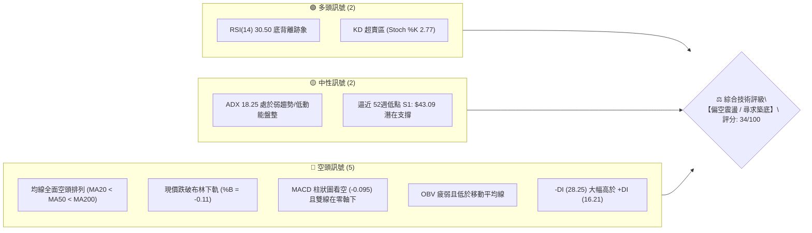
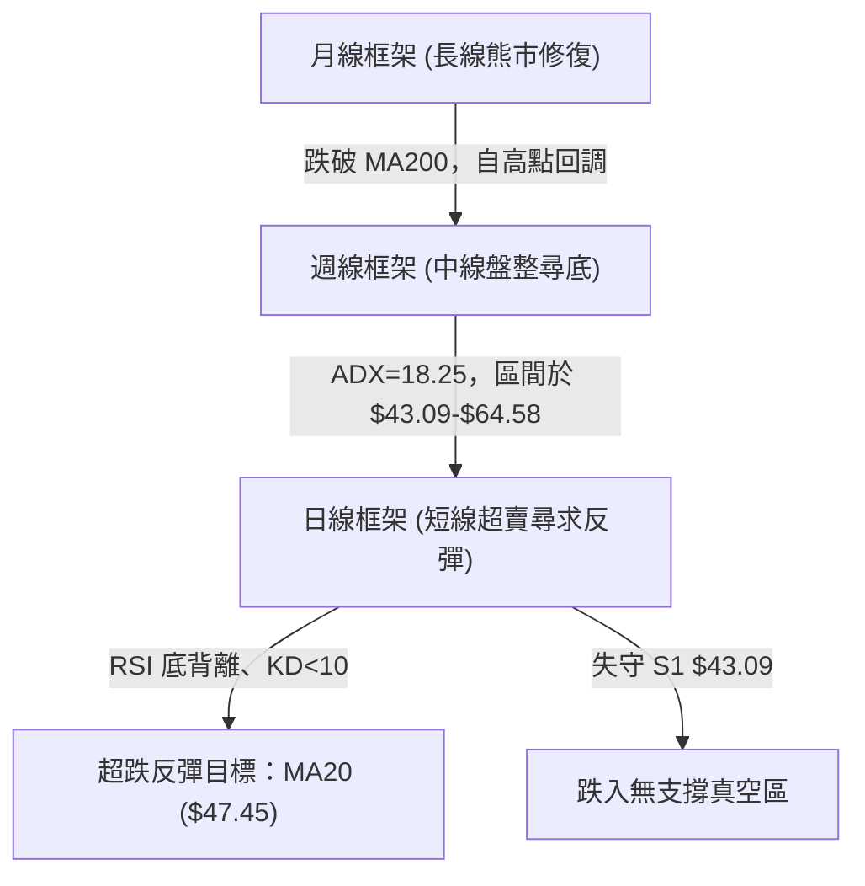
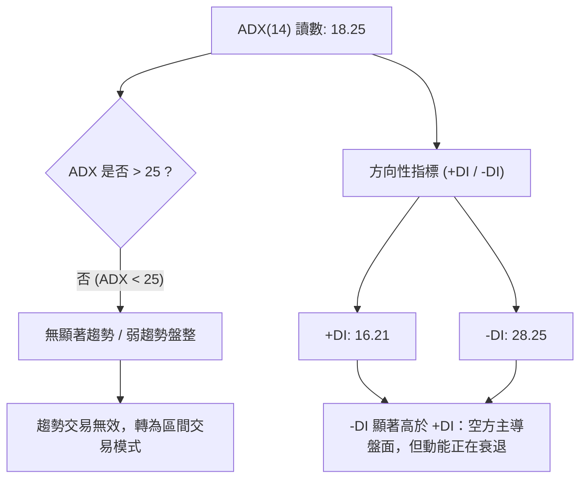
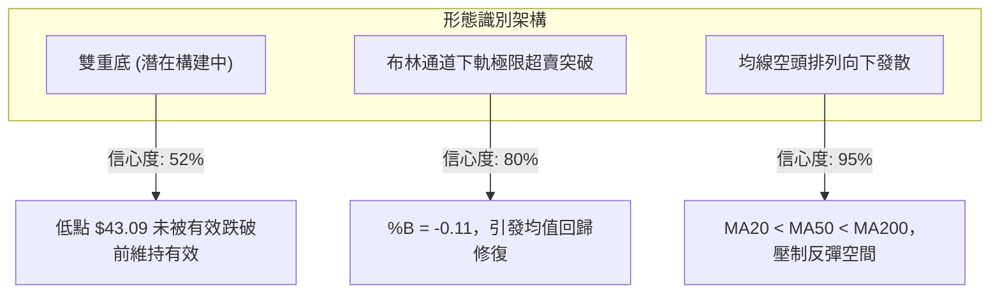
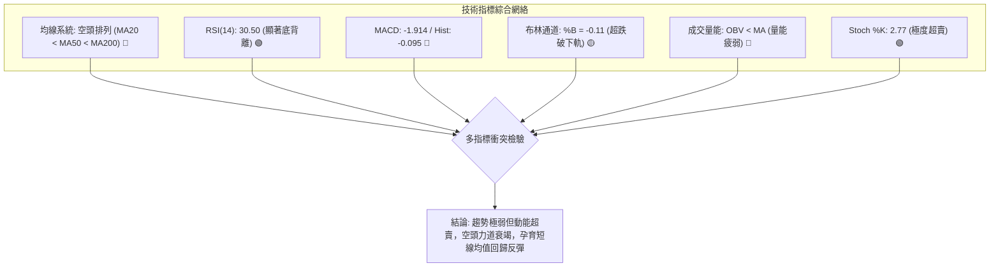
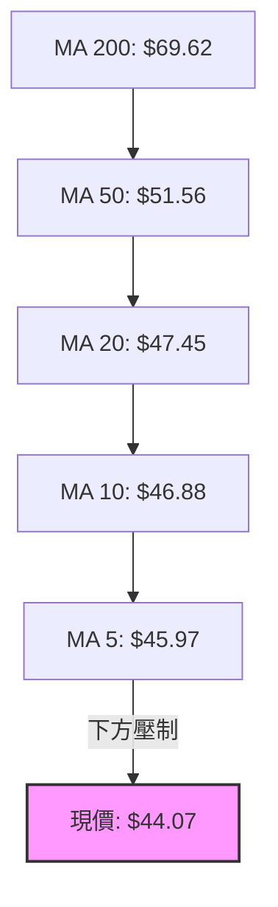
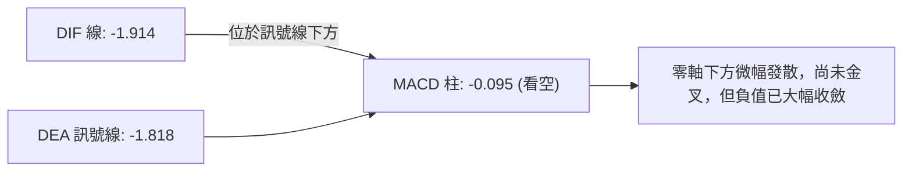
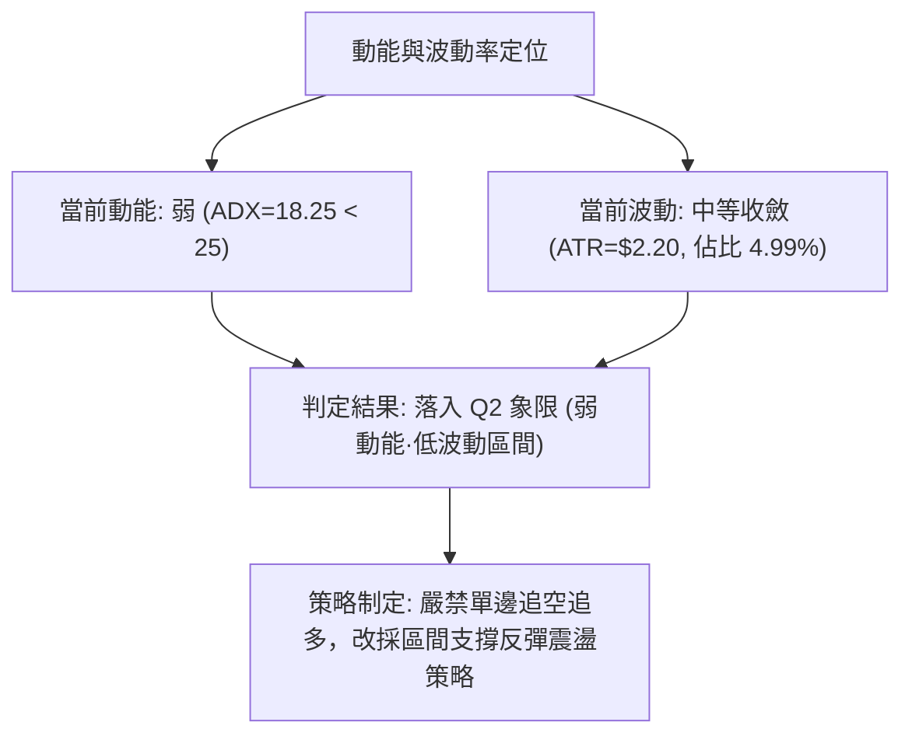
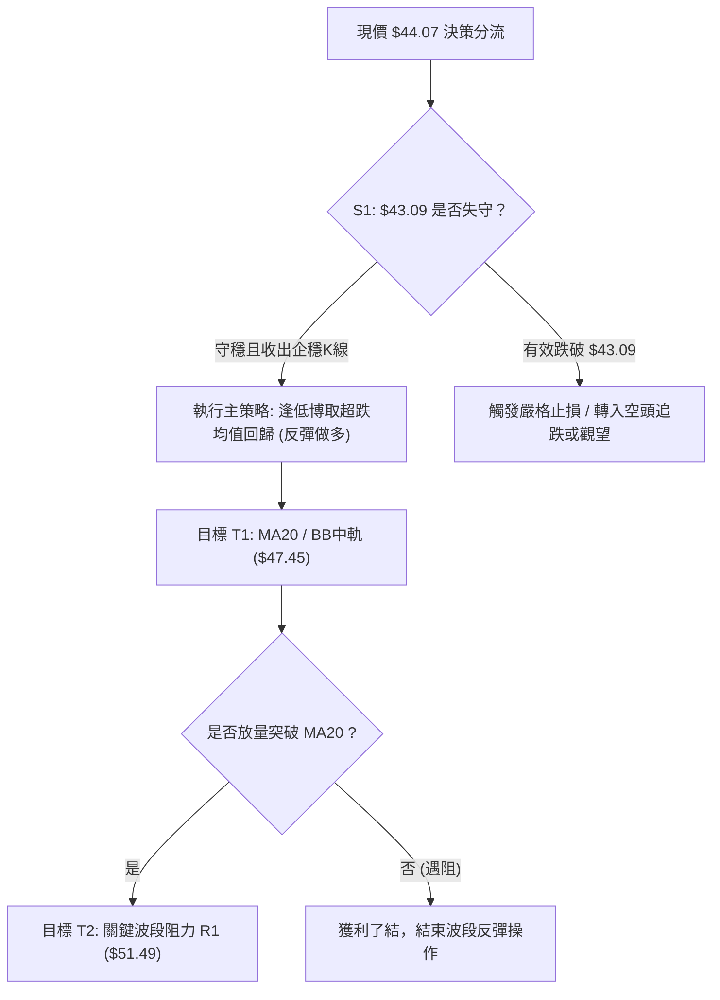
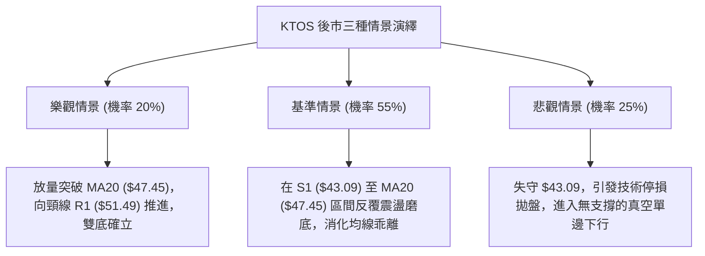

# KTOS 技術分析報告

> **報告日期**：2026-09-29 ｜ **語言**：繁體中文 ｜ **數據來源**：Yahoo Finance ｜ **當前價格**：$44.07

---

## 目錄

| 章節 | 內容 |
|------|------|
| [1. 技術面概覽](#1-技術面概覽) | 訊號儀表板、核心指標、評分卡 |
| [2. 趨勢分析](#2-趨勢分析) | 多時框趨勢、長中短期走勢 |
| [3. 圖表形態分析](#3-圖表形態分析) | 形態識別、K線組合、目標價 |
| [4. 支撐與阻力](#4-支撐與阻力) | 關鍵價位、斐波那契回調 |
| [5. 技術指標深度解讀](#5-技術指標深度解讀) | MA/RSI/MACD/布林/成交量 |
| [6. 動能與波動率](#6-動能與波動率) | 動能評估、ATR、Beta |
| [7. 多時框架總結](#7-多時框架總結) | 時框架評分矩陣與收斂 |
| [8. 交易策略建議](#8-交易策略建議) | 多空策略、風險報酬比 |
| [9. 風險提示與監控](#9-風險提示與監控) | 監控指標、風險場景 |

---

## 1. 技術面概覽

### 🎯 技術訊號儀表板



### 📊 核心指標速覽表

| 指標類別 | 指標名稱 | 當前數值 | 訊號 | 解讀 |
|----------|----------|----------|------|------|
| **價格** | 當前價格 | $44.07 | 🔴 空頭 | 位於 52週區間的 1.1%，逼近波段新低 $43.09 |
| **均線** | MA20 | $47.45 | 🔴 空頭 | 現價落後 MA20 達 -7.12%，短期承壓下行 |
| **均線** | MA50 | $51.56 | 🔴 空頭 | 現價低於中期生命線，中期結構維持下行波段 |
| **均線** | MA200 | $69.62 | 🔴 空頭 | 距離長期牛熊線差距 -36.70%，長期趨勢處於熊市修復期 |
| **動能** | RSI(14) | 30.50 | 🟡 轉多 | 處於超賣臨界值，數據顯示出現明確「底背離」訊號 |
| **動能** | MACD | -1.914 | 🔴 空頭 | 訊號線為 -1.818，Hist 為 -0.095，仍在零軸下方死叉發散 |
| **動能** | KD指標 | K: 2.77 / D: 20.14 | 🟢 多頭 | 處於深度超賣區（K < 10），具備強烈技術性反彈動能 |
| **趨勢** | ADX(14) | 18.25 | 🟡 中性 | ADX < 25，表明單邊趨勢動能減弱，進入無序盤整區間 |
| **通道** | 布林帶 | 上$50.23 / 下$44.66 | 🔴 空頭 | %B 為 -0.11，已向下跌破布林下軌，短線有超跌均值回歸修復需求 |
| **波動** | ATR(14) | $2.20 | 🟡 中性 | 每日波幅為 4.99%，屬於中等偏高波動率 |
| **量能** | 20日成交量 | 4,548,200 | 🔴 空頭 | 量比 1.18x，下跌放量且 OBV 趨勢低於 MA，資金承接力道有限 |

### 🏆 技術評分卡

```
╔══════════════════════════════════════════════════════════════╗
║                技術評分卡 — KTOS (2026-09-29)                ║
╠══════════════════════════════════════════════════════════════╣
║ 趨勢強度 (ADX=18.25)     ██████░░░░░░░░░░░░░░  30/100 🔴 空頭主導 ║
║ 動能指標 (RSI/KD/MACD)   ████████░░░░░░░░░░░░  40/100 🟡 背離醞釀 ║
║ 支撐穩定度 (S1=$43.09)   ████████░░░░░░░░░░░░  40/100 🟡 邊界考驗 ║
║ 成交量配合 (OBV<MA)      ██████░░░░░░░░░░░░░░  30/100 🔴 量能疲弱 ║
║ 形態完整度 (尋求雙底)    ████████░░░░░░░░░░░░  40/100 🟡 形態未決 ║
║ 均線排列 (空頭排列)      ████░░░░░░░░░░░░░░░░  20/100 🔴 極度承壓 ║
╠══════════════════════════════════════════════════════════════╣
║ 綜合評分                 ███████░░░░░░░░░░░░░  34/100 🔴 偏空震盪 ║
╚══════════════════════════════════════════════════════════════╝
```

---

## 2. 趨勢分析

### 🌐 多時框趨勢分析



### 📈 長期趨勢 — 12個月走勢圖（Unicode）

KTOS 在過去一年內經歷了戲劇性的沖高回落。在 2026 年 1 月衝擊歷史高位後，遭遇強烈拋壓，隨後各月收盤價連續階梯式下移。

```
KTOS 月線走勢圖（2025-10 至 2026-09）
價格軸 ($)
$105 ┤                               ●(01月: 103.01)
$95  ┤ ●(10月: 90.60)
$85  ┤                                     ●(02月: 86.18)
$75  ┤       ●(11月: 76.10)  ●(12月: 75.91)
$70  ┤                                           ●(03月: 70.51)
$60  ┤                                                 ●(04月: 63.05)  ●(05月: 64.13)
$50  ┤                                                                       ●(08月: 50.98)
$45  ┤                                                                 ●(06月: 49.86)  ●(07月: 46.60)  ●(09月: 44.07)◄現價
$40  ┤                                                                                                 
     └─────────────────────────────────────────────────────────────────────────────────────────────
       10月    11月    12月    01月    02月    03月    04月    05月    06月    07月    08月    09月
```

#### 長期走勢特徵分析表格

| 階段區間 | 起止月份 | 價格變化 | 漲跌幅 | 走勢特徵與結構意涵 |
|----------|----------|----------|--------|--------------------|
| **高位派發** | 2025-10 至 2026-01 | $90.60 ➔ $103.01 | +13.70% | 創下波段高點（52W高點 $134.00），高位巨震派發，籌碼鬆動 |
| **主跌推動** | 2026-01 至 2026-04 | $103.01 ➔ $63.05 | -38.79% | 跌破所有中短期均線，呈現階梯式長陰單邊暴跌 |
| **中繼整理** | 2026-04 至 2026-05 | $63.05 ➔ $64.13 | +1.71%  | 出現短暫弱勢反彈，受阻於 MA60/MA120 壓力帶 |
| **陰跌築底** | 2026-05 至 2026-09 | $64.13 ➔ $44.07 | -31.28% | 陰跌下行並逼近 52週低點 $43.09，月線成交量萎縮，空頭釋放末期 |

### 📊 中期趨勢（週線分析）

從近 20 週的收盤價與指標走勢可以看出，KTOS 自 2026 年 8 月中旬反彈至高點 $64.58（RSI 曾達 76.7）後，隨即快速下挫。當前週線出現連續 6 週的陰線下跌，週收盤價由 $64.58 降至 $44.07。

```
KTOS 近期週線壓力與支撐示意圖
══════════════════════════════════════════════════════════════
  $64.58 ───┤ 08-16 中期反彈高點 (RSI: 76.7 超買回落)
            │   ╲
  $58.88 ───┼────╲──────── R3 阻力位
  $54.22 ───┼─────╲─────── R2 阻力位
  $51.49 ───┼──────╲────── R1 阻力位 / MA50 ($51.56)
  $47.45 ───┼───────╲───── MA20 / 布林中軌
  $44.07 ───┼────────●──── 現價 (跌破布林下軌 $44.66)
  $43.09 ───┴───────────── S1 (52週最低點支撐)
══════════════════════════════════════════════════════════════
```

### ⚡ 趨勢強度評估（ADX 解讀）



#### ADX 強度對照表

| 指標項目 | 數值 | 臨界標準 | 狀態解讀 | 交易指引 |
|----------|------|----------|----------|----------|
| **ADX(14)** | 18.25 | < 20 (極弱/無趨勢) | 弱趨勢或震盪格局，空頭殺跌動能已明顯收斂 | 嚴禁追空；適合在極限邊界尋求反彈 |
| **+DI** | 16.21 | 基準多方力量 | 多頭力量極度疲弱，尚未形成進攻陣列 | 缺乏持續推升能力，反彈空間受限 |
| **-DI** | 28.25 | 基準空方力量 | 空頭佔據主導，但較高位已有鈍化回落 | 下跌主推浪已過，進入磨底階段 |

---

## 3. 圖表形態分析

### 🔍 形態識別系統



#### 形態識別與信心度評估表

| 形態類別 | 信心度 | 判斷依據（引用數據） | 完成度 | 目標價（附計算式） |
|----------|--------|----------------------|--------|--------------------|
| **潛在雙重底 (Double Bottom)** | 52% | 第一底為 52週低點 S1: $43.09，現價 $44.07 逼近該位置並出現 RSI 底背離，尚未確認跌破 | 45% (右底構建中) | 頸線為 R1 $51.49。<br>形態高度 = $51.49 - $43.09 = $8.40。<br>突破目標價 = $51.49 + $8.40 = **$59.89**（接近 R3 $58.88） |
| **布林通道下軌超賣外擴** | 80% | 現價 $44.07 跌破 BB下軌 $44.66，%B 達到 -0.11，出現統計學上的偏離常態分佈 | 90% | 均值回歸中軌目標價 = **$47.45**（BB中軌 / MA20） |
| **均線空頭排列壓制** | 95% | MA5 ($45.97) < MA10 ($46.88) < MA20 ($47.45) < MA50 ($51.56) < MA200 ($69.62) | 100% | 空頭主導下行，反彈首要防守目標為 MA20 **$47.45**，強阻力為 MA50 **$51.56** |

### 🕯️ 重要K線形態分析

| 週/月份 | 收盤價 | K線形態特徵 | 技術意涵解讀 | 訊號方向 |
|---------|--------|-------------|--------------|----------|
| **2026-08-16 週** | $64.58 | 長上影流星線 (RSI: 76.7) | 觸及波段高點後多頭無力承接，高位獲利了結盤湧出 | 🔴 強烈看空 |
| **2026-09-06 週** | $47.82 | 大陰線加速下挫 (RSI: 11.7) | 動能指標極度恐慌，放量下殺形成空頭衰竭缺口跡象 | 🟡 恐慌拋售 |
| **2026-09-20 週** | $47.46 | 縮量十字星小陽線 | 價格在 $46-$47 區域暫時獲得多空平衡，空頭動能放緩 | 🟢 止跌企穩 |
| **2026-10-04 當週** | $44.07 | 測試波段新低下影陰線 | 測試 52週低點 $43.09 支撐，形成指標底背離架構 | 🟡 邊界測試 |

### 📉 ASCII 走勢形態示意圖

```
KTOS 雙重底潛在構建示意圖
══════════════════════════════════════════════════════════════════
  $51.49 ─────── 頸線位置 (R1 阻力 / MA50 區域) ───────────────
                  ▲                     ▲
                 ╱ ╲                   ╱ ╲
                ╱   ╲                 ╱   ╲
  $47.45 ──────╱─────╲─── MA20 ──────╱─────╲────────────────────
              ╱       ╲             ╱       ╲ (反彈進行中)
  $44.07 ────╱─────────╲───────────● (現價 $44.07)
            ●           ╲         ╱
  $43.09 ───┴────────────●───────┴──────────────────────────────
           左底 (52W Low)       右底測試 (RSI 底背離成立)
══════════════════════════════════════════════════════════════════
```

### 🎯 形態目標價計算

依據形態理論，若潛在雙重底在 S1: $43.09 獲得支撐並向上突破頸線 R1: $51.49，其計算方式如下：
1. **基底支撐價位**：以 52週最低點 $43.09 為支撐基礎。
2. **形態頸線位**：取近一年波段高點聚類形成的關鍵阻力 R1: $51.49。
3. **形態垂直高度**：$51.49 - $43.09 = $8.40。
4. **理論突破目標價**：
   - 第一目標價（均值回歸）：MA20 = **$47.45**
   - 第二目標價（頸線測試）：R1 = **$51.49**
   - 形態等幅測量目標（突破確認）：$51.49 + $8.40 = **$59.89**（該位置緊鄰阻力位 R3: $58.88）。

---

## 4. 支撐與阻力

### 🗺️ 關鍵價位分布圖（Unicode）

```
KTOS 價位結構分布圖
══════════════════════════════════════════════════════════════════
$134.00 ║██████████████████████████████║ 52週最高點 (Fib 0.0%)
$112.55 ║████████████████████          ║ Fib 23.6% 回調位
$99.27  ║██████████████████            ║ Fib 38.2% 回調位
$88.55  ║████████████████              ║ Fib 50.0% 中樞強分水嶺
$77.82  ║██████████████                ║ Fib 61.8% 黃金分割位
$69.62  ║████████████                  ║ 長期牛熊分界 MA200
$62.54  ║██████████                    ║ Fib 78.6% 回調位
$58.88  ║████████████████████████      ║ 強阻力位 R3
$54.22  ║████████████████              ║ 中期阻力位 R2
$51.49  ║████████████████████████      ║ 關鍵波段頸線阻力 R1 / MA50 ($51.56)
$47.45  ║████████████                  ║ 短期均線阻力 MA20 / BB中軌
$44.07  ╠══════════════════════════════╣ ◄ 現價 (跌破布林下軌 $44.66)
$43.09  ║▓▓▓▓▓▓▓▓▓▓▓▓▓▓▓▓▓▓▓▓▓▓▓▓▓▓▓▓▓▓║ 52週歷史支撐 S1 (Fib 100.0%)
══════════════════════════════════════════════════════════════════
```

### 🚧 阻力位分析表

價位數據嚴格引用自關鍵價位與均線體系：

| 阻力級別 | 價位 | 距現價幅幅 | 形成原因與籌碼結構 | 突破難度 | 重要性 |
|----------|------|------------|--------------------|----------|--------|
| **R1** | $51.49 | +16.84% | 近一年波段高點聚類處，與 MA50 ($51.56) 高度重疊，為中期趨勢生命線 | ★★★★☆ 高 | 極高（站穩確立反轉） |
| **R2** | $54.22 | +23.03% | 歷史密集成交震盪平台下沿，此處堆積大量解套拋壓 | ★★★☆☆ 中 | 中等（中繼反彈阻力） |
| **R3** | $58.88 | +33.61% | 近一年顯著波段頂部聚類區，接近潛在雙底形態的測量目標 | ★★★★★ 極高 | 高（波段目標上限） |

### 🛡️ 支撐位分析表

價位數據嚴格引用自關鍵價位區塊：

| 支撐級別 | 價位 | 距現價幅幅 | 形成原因與籌碼結構 | 守住機率 | 重要性 |
|----------|------|------------|--------------------|----------|--------|
| **S1** | $43.09 | -2.22% | 52週最低點聚類，斐波那契 100.0% 極限支撐位，多頭最後防線 | 55% | 極高（跌破將引發踩踏） |
| **S2 (推算)** | 數據中未偵測到 | — | 原生數據中近一年未偵測到更低低點聚類，若失守 S1 將進入無籌碼支撐真空區 | — | — |

### 📐 斐波那契回調位分析

依據 52週波動區間（高點 $134.00 ➔ 低點 $43.09，垂直振幅 $90.91）計算之斐波那契回調體系：

| 斐波那契分位 | 價位 | 當前價位關係 | 結構意涵解讀 |
|--------------|------|--------------|--------------|
| **0.0% (52W High)** | $134.00 | 現價遠在下方 (-67.11%) | 歷史多頭頂部極限，牛市終點 |
| **23.6%** | $112.55 | 現價遠在下方 | 長期強阻力位 |
| **38.2%** | $99.27 | 現價遠在下方 | 多空深層修正轉換區 |
| **50.0%** | $88.55 | 現價遠在下方 | 牛熊多空平衡中樞 |
| **61.8%** | $77.82 | 現價遠在下方 | 黃金分割強壓力位，多頭防禦崩潰點 |
| **78.6%** | $62.54 | 現價下方偏遠 | 深度回調防線，前期反彈高點 $64.58 曾受阻於此 |
| **100.0% (52W Low)** | $43.09 | 現價緊鄰上方 (+2.27%) | **極限支撐點**。現價 $44.07 位於 78.6% ($62.54) 與 100.0% ($43.09) 之間，極度貼近 100% 支撐底線，處於 52週價格區間的 1.1% 臨界區域，存在強烈的向下耗竭與超跌反撲動能。 |

---

## 5. 技術指標深度解讀

### 🎛️ 指標訊號總覽



### 📈 移動平均線排列分析



均線系統呈現完美的標準空頭發散排列：
- **短期均線**：MA5 ($45.97) 及 MA10 ($46.88) 呈陡峭下行態勢，現價距 MA5 為 -4.13%，距 MA20 為 -7.12%。短線均線對價格形成逐級下壓。
- **中期生命線**：MA50 ($51.56) 呈穩定向下傾斜，與 R1 ($51.49) 高度共振，構成中級反彈難以逾越的天花板。
- **長期年線**：MA200 ($69.62) 遠高於現價 +58.0%，表明中長期趨勢完全被空方主導。空頭排列的單邊慣性壓制了反轉可能，任何反彈均應先視為技術性抽腳修復。

### 📉 RSI(14) 分析與背離判斷

- **RSI 當前數值**：30.50
- **區間評估**：處於超賣臨界點（30 附近）。

```
RSI(14) 強度儀表：30.50
[超賣 0] ══════════════●[30]────────────────────[70]══════════════ [100 超買]
進度條：██████░░░░░░░░░░░░░░ 30.5% (極度接近超賣區)
```

- **⚠️ 核心亮點 — 底背離 (Bullish Divergence) 成立**：
  - **價格層面**：9月27日收盤價為 $45.62，最新收盤價跌至 $44.07，價格刷新近 3 週波段新低。
  - **指標層面**：9月06日價格為 $47.82 時 RSI 創下 11.7 的極端低點；9月13日價格 $46.69 時 RSI 為 13.8；而當前價格跌至更低的 $44.07 時，RSI 反而抬升至 **30.50**。
  - **結論**：指標在價格跌出新低之際持續墊高，出現標準的**動能底背離**。這意味著空頭賣壓正在耗盡，反轉或強烈技術反彈一觸即發。

### 📊 MACD(12/26/9) 訊號解讀

- **MACD DIF 線**：-1.914
- **MACD DEA 訊號線**：-1.818
- **MACD Histogram 柱狀圖**：-0.095



解讀：MACD 目前仍保持在零軸之下的死叉狀態，柱狀圖負值為 -0.095，維持技術看空。然而對比 9月06日週期的 -1.318 與 8月30日的 -1.211，MACD 負向動能柱已經大幅萎縮，呈現貼近訊號線的微幅黏合狀態，表明下行動能大幅衰退，具備隨時在零下低位形成「黃金交叉」的技術潛質。

### 📦 布林通道分析

布林帶寬度為 $50.23 - $44.66 = $5.57。當前價格打破通道常態：

```
KTOS 布林通道截面狀態
══════════════════════════════════════════════════════════════
  $50.23 ─── 上軌 (Upper Band)
            │
  $47.45 ─── 中軌 (MA20 / Middle Band)
            │
  $44.66 ─── 下軌 (Lower Band) ─────────
  $44.07 ─── 現價 (%B = -0.11，已跌破下軌) ◄ 嚴重超賣脫軌
══════════════════════════════════════════════════════════════
```

- **%B 指標解析**：%B 數值為 **-0.11**。在正態分佈中，%B < 0 代表價格已超出統計學波動下限（即跌破布林下軌）。歷史經驗顯示，當股價連續運行於布林下軌外部時，通常會引發強烈的「回歸中軌」均值拉力，第一波修復目標指向布林中軌 **$47.45**。

### 💹 成交量分析（量價配合度）

- **最新成交量**：4,548,200 股
- **20日均量**：3,863,120 股（量比：1.18x，略有放量）
- **50日均量**：3,689,780 股
- **OBV 能量潮**：OBV < MA，能量潮處於向下萎縮階段。
- **量價背離解讀**：股價創波段新低，但量能僅微幅放大至 1.18x，未見機構恐慌性拋售盤（如 6月28日週成交 4,538 萬股的巨量砸盤），顯示市場已進入「無量陰跌」階段。OBV 疲軟說明目前場外主動買盤仍在觀望，尚未形成大規模右側吸籌，量能未確認反轉，僅支援超跌反彈。

---

## 6. 動能與波動率

### ⚡ 動能評估四象限

| 象限代號 | 動能狀態 | 波動率狀態 | 標的當前位置 | 特徵與操作意涵 |
|----------|----------|------------|--------------|----------------|
| **Q1 (高動能·低波動)** | 強多頭 | 低 (擠壓) | — | 趨勢穩健爆發，持股續抱 |
| **Q2 (弱動能·低波動)** | 弱勢/鈍化 | 低 (收縮) | **✓ 當前狀態 (KTOS)** | **ADX=18.25 (弱趨勢)，ATR 佔比 4.99% 收斂。盤整尋底，以區間邊界操作為主** |
| **Q3 (強動能·高波動)** | 單邊爆發 | 高 (擴張) | — | 單邊趨勢狂飆或暴跌，順勢操作 |
| **Q4 (弱動能·高波動)** | 震盪失序 | 高 (混亂) | — | 震盪劇烈洗盤，宜空倉觀望 |



### 📊 ATR 波動率分析

- **ATR(14) 絕對值**：**$2.20**
- **價格波動率佔比**：$2.20 ÷ $44.07 = **4.99%**
- **風控止損與持倉解讀**：
  - KTOS 單日平均振幅達 $2.20，屬於典型的高彈性標的。
  - **合理止損距離**：短線進場若給予 1.0 倍 ATR ($2.20) 防守，極易被隨機噪音掃出場。針對目前的震盪築底行情，建議採用 **0.5 ~ 0.8 倍 ATR** 作為結構性止損，或直接以波段低點 S1: $43.09 下方外加固定緩衝墊作為嚴格止損點。

### 📐 Beta 與市場相關性

- **Beta 係數**：**1.113**
- **解讀**：KTOS 的系統性風險與大盤 (S&P 500) 具備同向較高彈性（高出大盤 11.3% 的波動）。在當前個股技術面極度超賣、基本面處於空頭壓制的情境下，大盤若出現回調，KTOS 容易承壓下探測試 S1；反之，若大盤企穩，該股高 Beta 屬性將有助於推動超跌修復彈升。

---

## 7. 多時框架總結

### 📋 時框架評分表

| 時框架 | 趨勢方向 | 動能狀態 | 均線排列 | 圖表形態 | 綜合評分 | 交易建議 |
|--------|----------|----------|----------|----------|----------|----------|
| **月線 (長期)** | 🔴 空頭修復 | 弱勢下探 | 跌破 MA200 | 階梯式高位派發回調 | 25/100 | 長期基本面估值過高，不宜長線建倉 |
| **週線 (中期)** | 🔴 偏空震盪 | 負動能收斂 | 空頭向下發散 | $43.09 邊界防禦 | 35/100 | 關注 S1 能否守穩以構建中期底部 |
| **日線 (短期)** | 🟡 超賣反彈 | RSI 底背離 | 空頭發散 (破下軌) | 潛在雙重底右底 | 42/100 | 短線博取均值回歸反彈至 MA20 |

### 🔲 綜合訊號矩陣

| 維度 | 短期 (日線) | 中期 (週線) | 長期 (月線) | 矩陣一致性檢驗 |
|------|-------------|-------------|-------------|----------------|
| **趨勢方向** | 空頭末端 | 空頭主導 | 空頭回調 | 三時框趨勢方向總體維持偏空 |
| **指標動能** | 超賣金叉醞釀 | 負向柱收斂 | 偏弱衰退 | 短期與中長線動能產生「底背離矛盾」 |
| **量價配合** | 低位縮量 | 縮量下跌 | 高位放量下跌 | 無明顯主力追殺盤，但缺乏增量資金 |
| **關鍵阻礙** | MA20 ($47.45) | MA50 ($51.56) | MA200 ($69.62) | 上方重重均線壓制，反彈非反轉 |

### ⚖️ 多時框收斂結論

依據多時框收斂規則（嚴格要求 14）：
1. **行情性質判定**：當前 ADX(14) 讀數為 **18.25**，明確處於 **< 25 的盤整/弱趨勢行情**。這意味著前期強烈的單邊暴跌推動浪已告一段落，目前市場無法支撐單邊延續下跌，進入無序震盪築底階段。
2. **主導維度收斂**：在盤整行情中，不可追逐破位單邊單，而應以**日線布林通道上下軌及波段關鍵水平位為主要交易區間**。
3. **最終收斂方向**：**【中性偏空，短線尋求極限超賣反彈】**。
   - **主導邏輯**：整體大結構受制於 MA200 和空頭排列，但短線在 $43.09 處於極端邊界，配合 RSI 底背離與布林帶超跌 (%B = -0.11)。因此，主策略不建議在現價 $44.07 追空，而應採取以 S1 為緊密防守的「超跌反彈博弈策略」；若 S1 跌破，則徹底轉為空頭觀望。

---

## 8. 交易策略建議

### 🗺️ 策略決策流程圖



### 🧭 策略路由

**當前主策略方向 = 【區間邊界超跌反彈多頭操作】（依技術評分卡 34/100 偏空，但在 ADX=18.25 盤整環境中，現價逼近 52週支撐 S1: $43.09，多項指標底背離，下行空間受限，採取極致盈虧比的反彈右側/左側防禦型操作）。**

### 🎯 價格情境階梯（Price Scenarios）

價位數據嚴格引用自關鍵價位與均線數據庫：

| 觸發條件 | 下一目標 | 後續延伸 | 情境含義與操作對策 |
|----------|----------|----------|--------------------|
| **守穩 S1 並收復 MA20** | MA20: $47.45 | R1: $51.49 | 短線超賣修復成功，底背離動能釋放 |
| **維持在 $43.09 - $47.45 震盪** | BB中軌: $47.45 | BB下軌: $44.66 | 低位築底洗盤，以布林軌道高拋低吸 |
| **放量突破 R1 ($51.49)** | R2: $54.22 | R3: $58.88 | 中期底部成型，雙重底正式確立爆發 |
| **收盤有效跌破 S1 ($43.09)** | 無歷史支撐 | 自由落體尋底 | 多頭防禦崩潰，嚴格止損，切勿抄底 |

### 📊 情境機率分佈

| 價格情境 | 發生機率 | 主要技術依據 |
|----------|----------|--------------|
| **情境一：超跌反彈修復** | **50%** | RSI 底背離確立、KD 極度超賣 (K=2.77)、布林帶 %B (-0.11) 存在強烈回歸中軌拉力 |
| **情境二：區間磨底震盪** | **30%** | ADX=18.25 呈現無趨勢特徵，成交量萎縮，市場在 $43.09 - $47.45 間沉澱籌碼 |
| **情境三：跌破 S1 續創新低** | **20%** | 全均線呈空頭排列，OBV 疲軟未見主力增量搶籌，大盤系統性風險引發補跌 |

### 🟢 主策略詳情（反彈多頭交易）

本策略建立在極限邊界 S1: $43.09 之上，依託高盈虧比進行反彈博弈：

| 策略要素 | 策略 A（激進型：現價左側博反彈） | 策略 B（穩健型：回踩確認右側介入） |
|----------|----------------------------------|------------------------------------|
| **進場條件** | 現價跌破布林下軌，KD/RSI 深度超賣 | 價格再度回踩 S1 ($43.09) 獲得支撐不破，日線收陽 |
| **進場價格** | **$44.07**（當前市價） | **$43.50**（回測 S1 附近） |
| **目標價 T1** | **$47.45**（MA20 / 布林中軌） | **$47.45**（MA20 / 布林中軌） |
| **目標價 T2** | **$51.49**（頸線阻力 R1 / MA50 區域） | **$51.49**（頸線阻力 R1 / MA50 區域） |
| **止損價格** | **$42.45**（跌破 S1 $43.09 達 1.5% 止損） | **$42.45**（跌破 S1 $43.09 外加緩衝墊） |
| **風險額度 (每股)** | $44.07 - $42.45 = $1.62 | $43.50 - $42.45 = $1.05 |
| **潛在利潤 (每股T1)** | $47.45 - $44.07 = $3.38 | $47.45 - $43.50 = $3.95 |
| **潛在利潤 (每股T2)** | $51.49 - $44.07 = $7.42 | $51.49 - $43.50 = $7.99 |
| **風險報酬比 (至T1)** | **1 : 2.09** | **1 : 3.76** |
| **風險報酬比 (至T2)** | **1 : 4.58** | **1 : 7.61** |
| **預估勝率** | 50% | 55% |
| **建議倉位** | **5% - 8%**（輕倉試單） | **8% - 10%**（底背離確認加碼） |

### 🔴 反向風險觸發點（對沖與風控提示）

若出現以下情況，主策略假設立即失效，應停止多頭操作並果斷止損：
1. **關鍵防線被擊穿**：日線收盤價跌破 **$43.09 (S1)**，代表 52週支撐位失效，底背離演變為指標鈍化。
2. **反彈受阻於第一均線**：若股價反彈至 MA5 ($45.97) 或 MA10 ($46.88) 即再度出現大陰線回落，且成交量萎縮，說明多頭力量耗盡，應提早保本離場。
3. **空頭對沖操作點位**：若有效跌破 $43.09，激進型交易者可順勢以 $43.00 建立破位空單，止損設於 $44.07，目標順勢下看。

### ⭐ 整體訊號強度評星

```
做多訊號強度：★★☆☆☆  (2/5星 — 僅屬超跌反彈，非右側趨勢行情)
做空訊號強度：★★★☆☆  (3/5星 — 均線壓制，但指標嚴重超賣限制空間)
整體可信度：  ★★★★☆  (4/5星 — 價格緊貼 52週邊界，點位精確明確)
```

---

## 9. 風險提示與監控

### ✅ 關鍵監控指標 Checklist

```
╔══════════════════════════════════════════════════════════════╗
║                   每日收盤技術監控 Checklist                 ║
╠══════════════════════════════════════════════════════════════╣
║ [ ] 價格防禦：收盤價是否守在 S1: $43.09 之上？                ║
║ [ ] 動能確認：RSI(14) 是否成功站穩 30 並向 40 拓展？          ║
║ [ ] 均線挑戰：是否成功突破並站穩 MA5 ($45.97) 與 MA20 ($47.45)？║
║ [ ] MACD 轉折：零下柱狀圖負值是否持續收斂，DIF 與 DEA 是否金叉？ ║
║ [ ] 量能異動：單日成交量是否放大至 500 萬股以上（量比 > 1.3）？  ║
║ [ ] 軌道回歸：收盤價是否重新站回布林下軌 $44.66 之內？        ║
╚══════════════════════════════════════════════════════════════╝
```

### ⚠️ 風險場景分析



### 🛡️ 風險管理重要提醒

1. **基本面估值背離風險**：
   - 儘管分析師共識目標價平均達 $102.76，且評級多為 Buy，但 KTOS 當前 Trailing P/E 高達 **259.24**，EV/EBITDA 高達 **80.79**，自由現金流為負（$-118.29M）。在美股流動性環境波動時，高估值防禦股極易遭受估值修正。技術面未確立反轉前，切忌以「基本面被低估」為由盲目重倉長持。
2. **右側確認 vs 左側摸底**：
   - 空頭排列市場中「底背離」可能出現多次鈍化。左側進場必須設定**硬性止損點（$42.45）**，不可抱持「加碼攤平」心態。
3. **倉位嚴格管控**：
   - 單筆反彈交易佔總投資組合資金不得超過 **10%**，最大虧損額度控制在總資產的 **1% 以內**。

---

## 📋 報告總結

```
╔══════════════════════════════════════════════════════════════╗
║                   KTOS 技術分析報告總結                      ║
╠══════════════════════════════════════════════════════════════╣
║ 報告日期：2026-09-29                                         ║
║ 當前價格：$44.07                                             ║
║ 綜合技術評級：⚖️ 偏空震盪 / 尋求極端支撐超賣反彈 (評分: 34/100)║
╠══════════════════════════════════════════════════════════════╣
║ 關鍵結論：                                                   ║
║ ├─ 長期趨勢：🔴 空頭主導（現價遠低於 MA200: $69.62，年內重挫）║
║ ├─ 中期趨勢：🔴 弱勢尋底（ADX=18.25 弱趨勢，動能衰退轉盤整） ║
║ ├─ 短期趨勢：🟢 醞釀超跌反彈（RSI=30.5 底背離，破布林下軌）  ║
║ ├─ 關鍵支撐：S1: $43.09 (52週最低點聚類，極限防線)           ║
║ ├─ 短期阻力：MA20: $47.45 (均值回歸第一目標)                 ║
║ ├─ 強阻力位：R1: $51.49 (波段高點聚類 / MA50 頸線區)         ║
║ └─ 分析師目標：均價 $102.76（與當前技術盤面嚴重割裂）         ║
╠══════════════════════════════════════════════════════════════╣
║ 最優交易策略組合：                                           ║
║ 1. 🥇 最佳機會（勝率與盈虧兼備）：在 $43.50 附近回測不破進場  ║
║    止損設於 $42.45，目標指向 T1: $47.45 (盈虧比 1 : 3.76)    ║
║ 2. 🥈 次選機會（激進超跌參與）：現價 $44.07 建立底倉，        ║
║    止損設於 $42.45，目標 T1: $47.45 / T2: $51.49             ║
║ 3. 🥉 保守選擇（右側確定性）：保持空倉觀望，耐心等待日線放量 ║
║    突破並站上 MA20 ($47.45) 後，再擇機進場順勢操作          ║
╚══════════════════════════════════════════════════════════════╝
```

---

> ⚠️ **免責聲明**：本報告為技術分析研究成果，所有價位、圖表及推算均嚴格基於歷史與即時技術數據。本報告**僅供研究與學術參考**，**不構成任何要約、招攬或具體投資建議**。市場具有高度不確定性，交易者應獨立評估風險，嚴格執行資金管理與止損紀律。

---

*報告生成時間：2026-09-29 ｜ 數據來源：Yahoo Finance ｜ 分析框架：資深多時框技術分析模型*