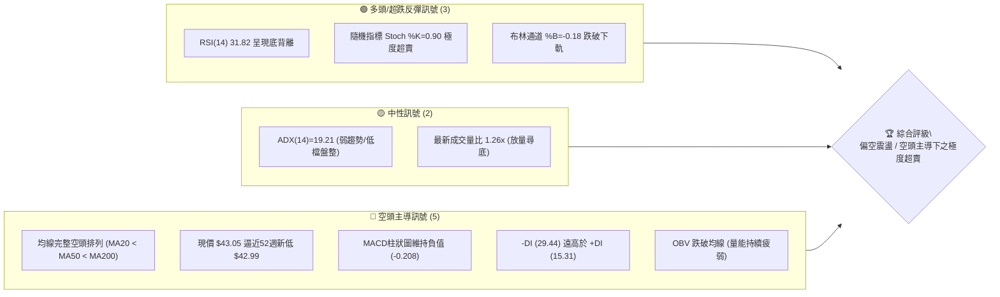
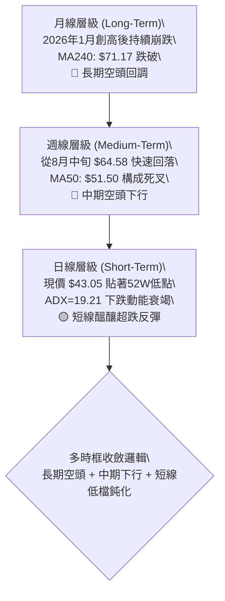
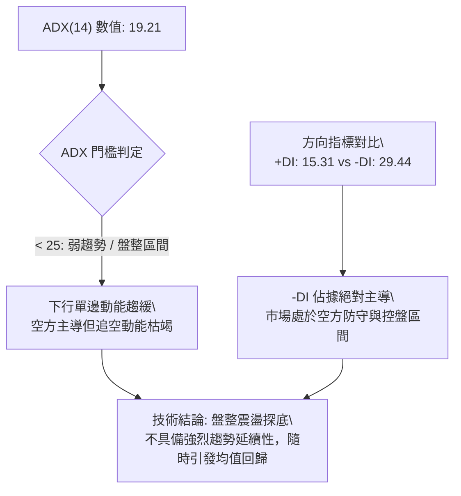
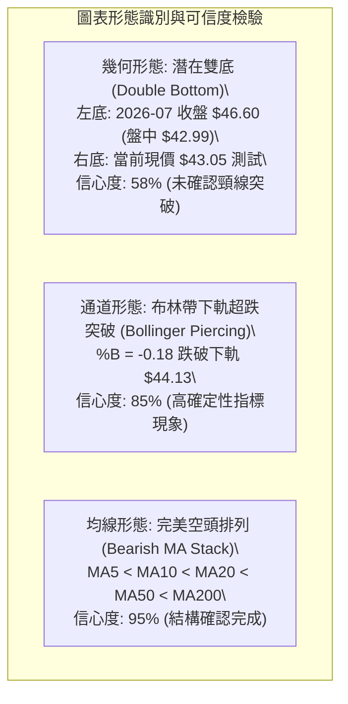
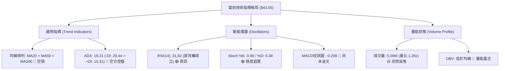
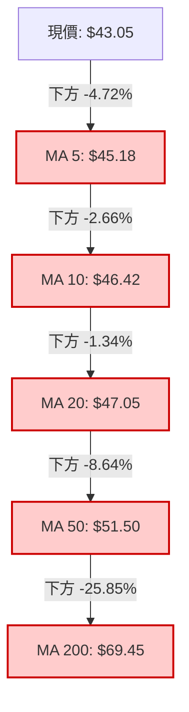
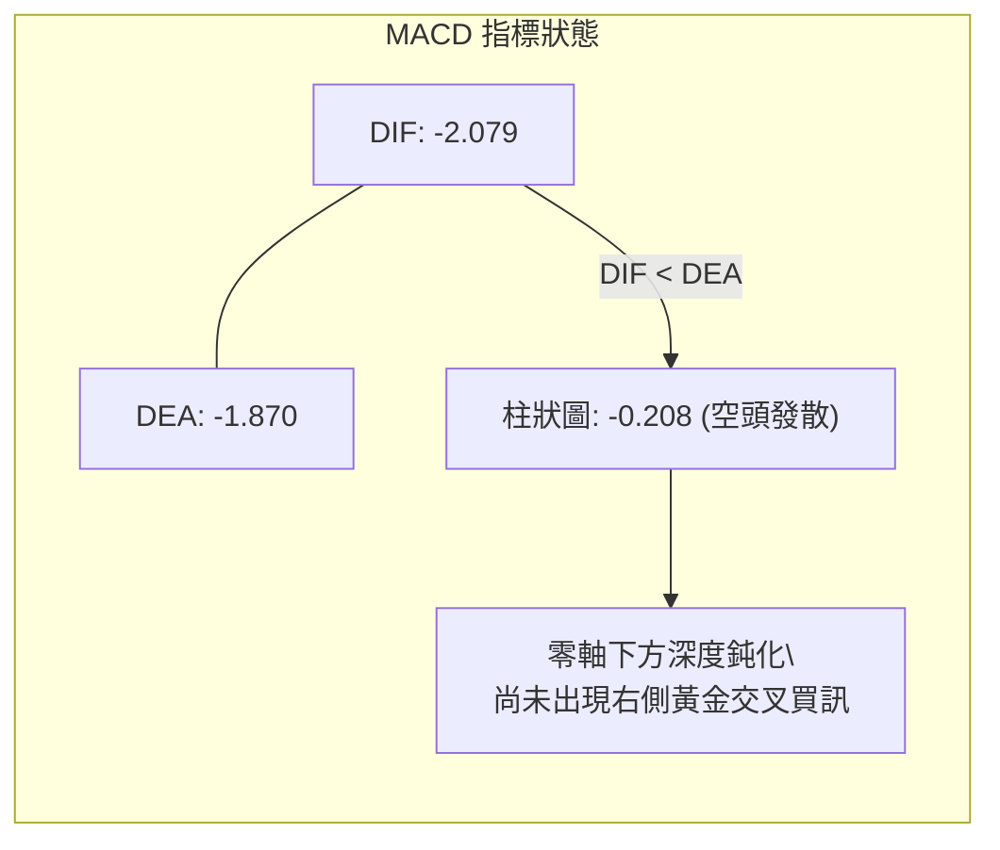
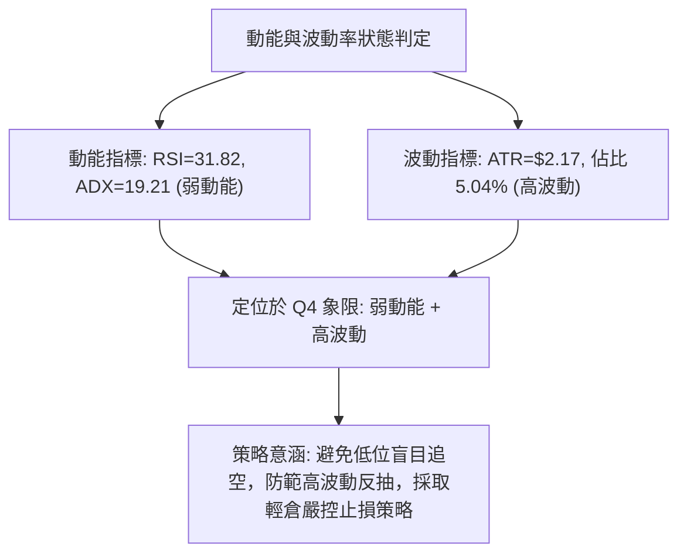
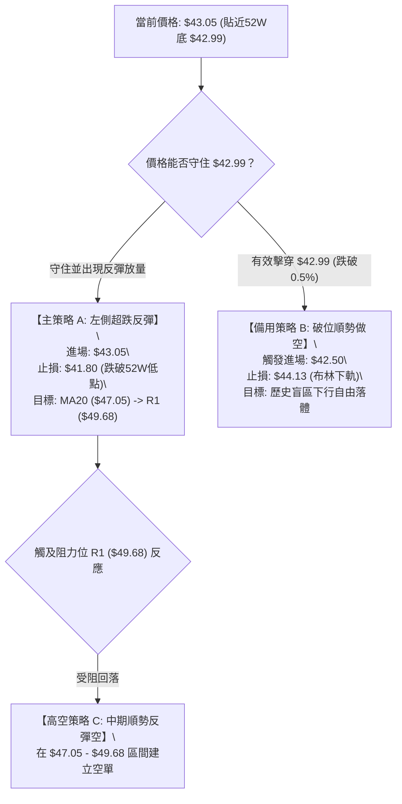
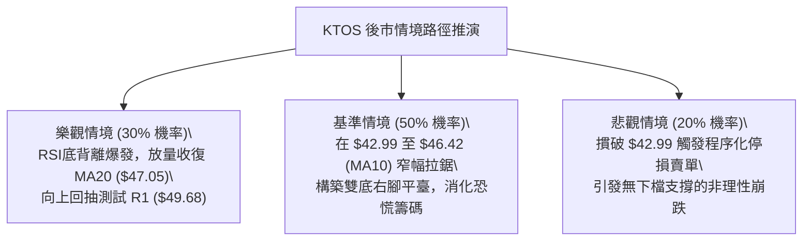

# KTOS 技術分析報告

> **報告日期**：2026-09-30 ｜ **語言**：繁體中文 ｜ **數據來源**：Yahoo Finance ｜ **當前價格**：$43.05

---

## 目錄

| 章節 | 內容 |
|------|------|
| [1. 技術面概覽](#1-技術面概覽) | 訊號儀表板、核心指標、評分卡 |
| [2. 趨勢分析](#2-趨勢分析) | 多時框趨勢、長中短期走勢 |
| [3. 圖表形態分析](#3-圖表形態分析) | 形態識別、K線組合、目標價 |
| [4. 支撐與阻力](#4-支撐與阻力) | 關鍵價位、斐波那契回調 |
| [5. 技術指標深度解讀](#5-技術指標深度解讀) | MA/RSI/MACD/布林/成交量 |
| [6. 動能與波動率](#6-動能與波動率) | 動能評估、ATR、Beta |
| [7. 多時框架總結](#7-多時框架總結) | 時框架評分矩陣、多時框收斂 |
| [8. 交易策略建議](#8-交易策略建議) | 多空策略、情境階梯、風險報酬比 |
| [9. 風險提示與監控](#9-風險提示與監控) | 監控指標、風險場景、風控提醒 |
| [📋 報告總結](#-報告總結) | 總結儀表板與執行結論 |

---

## 1. 技術面概覽

### 🎯 技術訊號儀表板



### 📊 核心指標速覽表

| 指標類別 | 指標名稱 | 當前數值 | 訊號 | 解讀 |
|----------|----------|----------|------|------|
| **價格** | 當前價格 | $43.05 | 🔴 | 位於52週區間 0.1% 極低點，緊貼52週低點 $42.99 |
| **均線** | MA20 | $47.05 | 🔴 | 現價低於MA20達 -8.51%，短期下行趨勢顯著 |
| **均線** | MA50 | $51.50 | 🔴 | 現價低於MA50達 -16.41%，中期均線反壓沉重 |
| **均線** | MA200 | $69.45 | 🔴 | 現價低於MA200達 -38.01%，長期結構為嚴本格局 |
| **動能** | RSI(14) | 31.82 | 🟢 | 逼近超賣界限，且日線級別出現顯著「底背離」特徵 |
| **動能** | MACD | -2.079 | 🔴 | 快慢線處於零軸之下，柱狀圖 -0.208 延續空頭動能 |
| **超賣** | Stoch %K/%D | 0.90 / 6.38 | 🟢 | 極度超賣鈍化（%K < 5），短線拋售已近枯竭 |
| **趨勢** | ADX (14) | 19.21 | 🟡 | 數值 < 25 代表下行單邊趨勢動能減緩，轉入盤整尋底 |
| **通道** | 布林通道 | %B = -0.18 | 🟢 | 股價脫離下軌（$44.13），隨時面臨均值回歸修復 |
| **波動** | ATR(14) | $2.17 | 🟡 | 日波動率高達 5.04%，短線震盪劇烈，需寬止損配置 |

### 🏆 技術評分卡

```
╔══════════════════════════════════════════════════════════════════╗
║                   技術評分卡 — KTOS (2026-09-30)                 ║
╠══════════════════════════════════════════════════════════════════╣
║ 趨勢方向 (Trend)     ████░░░░░░░░░░░░░░░░  20/100  🔴 極度看空    ║
║ 均線排列 (MAs)       ██░░░░░░░░░░░░░░░░░░  12/100  🔴 嚴格空頭    ║
║ 動能指標 (Momentum)  ███████░░░░░░░░░░░░░  36/100  🟡 超賣醞釀    ║
║ 支撐穩定度 (Support) ████░░░░░░░░░░░░░░░░  22/100  🔴 懸崖邊緣    ║
║ 成交量配合 (Volume)  ████████░░░░░░░░░░░░  40/100  🟡 恐慌放量    ║
║ 超買超賣 (Oscillator)███████████████░░░░░  75/100  🟢 強烈反彈    ║
╠══════════════════════════════════════════════════════════════════╣
║ 綜合技術評分         ███████░░░░░░░░░░░░░  34/100  🔴 空頭防守    ║
╚══════════════════════════════════════════════════════════════════╝
```

---

## 2. 趨勢分析

### 🌐 多時框趨勢分析



### 📈 長期趨勢 — 12個月走勢圖（Unicode）

KTOS 在過去 12 個月經歷了極其劇烈的「投機泡沫高點」到「基本面殘酷重估」的完整殺估值過程。2025年10月股價於 $90.60 構築平臺，2026年1月急拉至 $103.01（盤中創 52 週高點 $134.00），隨後連續 8 個月崩跌，至今已完全抹平一年半的所有漲幅。

```
KTOS 月線走勢圖（2025-10 至 2026-09）
價格軸 ($)
$105 ┤                 ● (2026-01: $103.01 / 52W高點 $134.00)
$95  ┤ ● (2025-10: $90.60)
$85  ┤                       ● (2026-02: $86.18)
$75  ┤       ●     ● (2025-12: $75.91)
$65  ┤                             ● (2026-03: $70.51)
$60  ┤                                   ●     ● (2026-05: $64.13)
$50  ┤                                               ●     ● (2026-08: $50.98)
$43  ┤                                                           ●← 現價 $43.05
     └─┬─────┬─────┬─────┬─────┬─────┬─────┬─────┬─────┬─────┬─────┬─────
      10月  11月  12月   1月   2月   3月   4月   5月   6月   7月   8月   9月
      2025                   2026
```

**12個月走勢特徵分析表格**：

| 階段區間 | 時間段 | 價格區間 | 累積漲跌幅 | 結構特徵與形態解讀 |
|----------|--------|----------|------------|--------------------|
| **主升浪頂部** | 2025.10 - 2026.01 | $75.91 → $103.01 | +35.70% | 創下 52 週新高 $134.00 後快速回落，量價頂背離 |
| **第一波崩跌** | 2026.01 - 2026.04 | $103.01 → $63.05 | -38.79% | 連續跌破 MA20 與 MA50，形成流暢的中期下行趨勢 |
| **弱勢抵抗波** | 2026.04 - 2026.05 | $63.05 → $64.13 | +1.71% | 橫盤窄幅震盪，形成典型的空頭旗形整理 |
| **主跌破位段** | 2026.05 - 2026.07 | $64.13 → $46.60 | -27.33% | 摜破 MA200（$69.45），機構停損盤大量湧出 |
| **假突破誘多** | 2026.07 - 2026.08 | $46.60 → $50.98 | +9.40% | 8月中旬週線曾衝高至 $64.58，但遭遇 MA60 壓制重挫 |
| **探底破位段** | 2026.08 - 2026.09 | $50.98 → $43.05 | -15.55% | 逼近 52 週低點 $42.99，成交量萎縮後轉放量破位 |

### 📊 中期趨勢（週線分析）

從近 20 週收盤走勢可看出，KTOS 呈現典型的「階梯式下跌」結構。8月16日當週衝高至 $64.58（RSI 達 76.7）後，隨即遭遇強烈拋壓，展開長達 7 週的無反彈陰跌。

```
近期週線壓力與支撐階梯結構示意圖：
$65 ┤       ┌─ 8月高點反壓 ($64.58)
$60 ┤    ┌──┘
$55 ┤ ┌──┘         ┌─ MA120/MA60 反壓帶 ($50.98 - $55.13)
$50 ┤─┘            │
$45 ┤             └──┐  ┌─ 阻力 R1 ($49.68) / MA20 ($47.05)
$43 ┤                └──┤◄── 現價 ($43.05) 命懸一線
$42 ┤                   └─ 52W 歷史絕對底部支撐 ($42.99)
```

### ⚡ 趨勢強度評估（ADX 解讀）



**ADX 趨勢強度對照表**：

| 指標變數 | 當前讀數 | 門檻區間 | 技術意義評估 | 戰術指導意義 |
|----------|----------|----------|--------------|--------------|
| **ADX (14)** | **19.21** | 0 – 25（無趨勢/弱趨勢） | 過去數週的急跌未形成強烈連續動能，處於減速下探階段 | 避免在低位盲目追空，提防突發性軋空反抽 |
| **+DI (14)** | **15.31** | < 20（多頭動能微弱） | 多方力量幾近棄守，無主動買盤承接 | 多頭進場必須等待明確放量突破阻力 |
| **-DI (14)** | **29.44** | > 25（空方主導行情） | 空頭佔有盤面主導權，但已進入超買區邊緣 | 空方籌碼仍具優勢，反彈即面臨解套反壓 |

---

## 3. 圖表形態分析

### 🔍 形態識別系統



**形態信心度與目標價評估表**（依據規則 13 與 15）：

| 形態名稱 | 信心度 | 判斷依據（引用數據） | 完成度 | 目標價（附嚴謹計算式） |
|----------|--------|----------------------|--------|------------------------|
| **潛在雙重底** | 58% | 7月份月收盤 $46.60 與 52W 低點 $42.99，現價 $43.05 二次探底 | 45% (尚在右底構築) | 若以頸線 R1 $49.68 計算：<br>目標價 = 頸線 $49.68 + (頸線 $49.68 - 低點 $42.99) = **$56.37** |
| **布林極限超跌** | 85% | BB下軌 $44.13，現價 $43.05，%B = -0.18 | 90% (已脫離通道) | 均值回歸中軌目標價 = **MA20 $47.05** |
| **空頭下行通道** | 78% | 高點受制於 MA50 $51.50，波段高點聚類於 R2 $51.49 與 R1 $49.68 | 85% (運行中) | 下行延伸目標 = **52W 低點 $42.99**（跌破後數據未偵測到下方支撐） |

*註：由於近一年波段低點聚類在現價下方無任何支撐數據，若跌破 $42.99，將引發自由落體式探底，無法確認幾何形態完成度。*

### 🕯️ 重要K線形態分析

| 統計週期/月份 | 收盤價 | K線形態 | 量價關係與市場心理解讀 | 短期訊號 |
|---------------|--------|---------|------------------------|----------|
| **2026-07** | $46.60 | 長下影陰線 | 空頭猛烈殺跌後遇到強烈逢低買盤支撐，月成交量回升 | 🟡 初步止跌 |
| **2026-08** | $50.98 | 帶長上影倒錘頭陽線 | 多頭曾發動強攻至 $64.58，但遭遇 MA60 沉重拋壓退守 | 🔴 衝高受阻 |
| **2026-09** | $43.05 | 光腳中陰線 | 連續四週陰跌收於最低位，賣壓宣洩直逼 52 週絕對低點 | 🔴 空方完勝 |
| **2026-09-27(週)** | $45.62 | 縮量陰十字星 | 週線層級多空猶豫，成交量 20,499,100 股，未能守住 MA5 | 🟡 變盤前兆 |
| **2026-10-04(當前)**| $43.05 | 破位下墜長陰 | 伴隨放量破位（日量 1.26x 20MA），測試 $42.99 歷史大底 | 🔴 恐慌拋售 |

### 📉 ASCII 走勢形態示意圖

```
KTOS 雙重底測試與均線壓制形態示意圖：

價格 ($)
$55.00 ┤                          [MA120: $55.13] / [R3: $54.22]
       │                          -----------------------------------
$51.50 ┤             ▲ 頸線高點    [MA50: $51.50]  / [R2: $51.49]
       │            / \           -----------------------------------
$47.00 ┤           /   \          [MA20: $47.05]  / [R1: $49.68]
       │  左底    /     \         =================================== (頸線阻力區)
$44.00 ┤   \     /       \   現價 $43.05 測試右底
       │    \   /         \   ▼
$42.99 ┴─────●─────────────●----------------------------------------
          2026-07       2026-09    52週絕對支撐線 ($42.99)
```

---

## 4. 支撐與阻力

### 🗺️ 關鍵價位分布圖（Unicode）

依據嚴格數據紀律，以下所有阻力與支撐數據完全取自系統提供的近一年波段高低點聚類與斐波那契回調模型：

```
KTOS 價位結構分布圖
══════════════════════════════════════════════════════════════════════
$134.00 ║████████████████████████████████║ 52W 歷史最高點 (Fib 0.0%)
$112.52 ║████████████████████████        ║ Fib 23.6% 回調位
$99.23  ║████████████████████            ║ Fib 38.2% 回調位
$88.50  ║██████████████████              ║ Fib 50.0% 中樞強反壓
$77.76  ║████████████████                ║ Fib 61.8% 黃金分割位
$69.45  ║██████████████                  ║ 長期牛熊分水嶺 MA200
$62.47  ║████████████                    ║ Fib 78.6% 回調位
$54.22  ║██████████                      ║ 強阻力 R3 (+25.95%)
$51.49  ║████████                        ║ 中期阻力 R2 / MA50 (+19.61%)
$49.68  ║██████                          ║ 關鍵阻力 R1 (+15.40%)
$47.05  ║████                            ║ 布林中軌 / MA20 短線反壓
$44.13  ║██                              ║ 布林帶下軌
════════╬════════════════════════════════╬═════════════════════════
$43.05  ╠════════════════════════════════╣ ◄ 現價 (位於 52W 區間 0.1%)
════════╬════════════════════════════════╬═════════════════════════
$42.99  ║▓▓▓▓▓▓▓▓▓▓▓▓▓▓▓▓▓▓▓▓▓▓▓▓▓▓▓▓▓▓▓▓║ 52W 絕對低點 (Fib 100.0%)
 (無)   ║░░░░░░░░░░░░░░░░░░░░░░░░░░░░░░░░║ (數據中未偵測到更低支撐)
══════════════════════════════════════════════════════════════════════
```

### 🚧 阻力位分析表

所有價位精確引用波段高點聚類與均線反壓計算：

| 阻力級別 | 精確價位 | 距離現價 | 形成原因與技術共振 | 突破難度 | 戰略重要性 |
|----------|----------|----------|--------------------|----------|------------|
| **R1** | **$49.68** | +15.40% | 近一年波段密集高點聚類、布林上軌 ($49.97) 共振 | ⚠️ 偏高 | **短線強弱分水嶺**：站穩代表脫離探底危機 |
| **R2** | **$51.49** | +19.61% | 中期均線 MA50 ($51.50) 與 MA60 ($50.98) 密集壓制區 | 🛑 極高 | **中期空頭反轉點**：需放量換手方可攻克 |
| **R3** | **$54.22** | +25.95% | 近期波段起跌點聚類、MA120 ($55.13) 重疊帶 | ⛔ 堡壘級 | **中期反彈極限**：空方波段防守核心陣地 |

### 🛡️ 支撐位分析表

| 支撐級別 | 精確價位 | 距離現價 | 形成原因與技術依據 | 守住機率 | 戰略重要性 |
|----------|----------|----------|--------------------|----------|------------|
| **S1 (52W底)** | **$42.99** | -0.14% | 52週歷史絕對低點、Fib 100.0% 終極支撐位 | 40% | **生命線**：僅差 $0.06，跌破將引發踩踏 |
| **S2 (次級)** | *(未偵測到)*| -- | 系統數據中未偵測到當前價格下方的波段低點聚類 | 0% | 一旦跌破 $42.99，盤面進入歷史無支撐真空區 |

### 📐 斐波那契回調位分析

依據 52 週完整波段（低點 $42.99 至 高點 $134.00，全波段高度 $91.01）精確計算回調點位：

- **0.0% (波段頂部)**: **$134.00**
- **23.6% 回調位**: **$112.52**
- **38.2% 回調位**: **$99.23**
- **50.0% 平衡中樞**: **$88.50**
- **61.8% 黃金分割**: **$77.76**
- **78.6% 深度回調**: **$62.47**
- **100.0% (波段底部)**: **$42.99**

**現價區間解讀**：
當前價格 **$43.05** 緊貼於 **100.0% 斐波那契回調位（$42.99）** 邊緣，回調深度達到 99.93%。這意味著過去一年中多頭建立的所有牛市漲幅已全數回吐。若多方無法在 100% 斐波那契位（$42.99）組織起有效抵抗，技術面將面臨崩潰式走勢；反之，該位置亦是整個牛熊週期最具吸引力的**極限均值回歸起點**。

---

## 5. 技術指標深度解讀

### 🎛️ 指標訊號總覽



### 📈 移動平均線排列分析



**均線狀態分析**：
均線系統呈現教科書式的**完全空頭排列**：`Price ($43.05) < MA5 ($45.18) < MA10 ($46.42) < MA20 ($47.05) < MA50 ($51.50) < MA200 ($69.45)`。短期均線以陡峭的角度向下俯衝，MA20 負乖離率達 -8.51%，顯示短期存在強烈均值回歸拉力；但中長期均線 MA50、MA200 壓制巨大，代表任何反彈一旦接近 MA20 或 MA50，都將面臨沉重拋壓。

### 📉 RSI(14) 分析與背離判定

- **RSI(14) 當前讀數**：**31.82**
- **動能強度進度條**：`██████░░░░░░░░░░░░░░` 31.82%（徘徊於超賣門檻 30 附近）

```
RSI(14) 區間定位：
[0] ─────────── [30] 超賣 ───●───── [50] 中性 ─────────── [70] 超買 ─── [100]
                             31.82
```

**背離深度分析**：
- **明確結論**：**日線級別底背離（Bullish Divergence）成立！** 🟢
- **分析依據**：回顧 2026-09-06，KTOS 週收盤價為 $47.82 時，RSI 曾摜入極端低點 **11.7**；至 2026-09-13 股價跌至 $46.69，RSI 抬升至 **13.8**；目前股價創出 52 週新低至 **$43.05**，但 RSI(14) 卻頑強攀升至 **31.82**。價格創下歷史新低，而指標低點大幅墊高，空頭下殺動能已出現顯著的量化衰竭特徵。

### 📊 MACD(12/26/9) 訊號解讀

- **MACD 線 (DIF)**：`-2.079`
- **信號線 (DEA)**：`-1.870`
- **MACD 柱狀圖 (Histogram)**：`-0.208` 🔴（維持負向發散）



MACD 快慢線均在遠低於零軸的深水區運行，柱狀圖仍為負值（-0.208），說明空頭趨勢在慣性主導下仍未完全反轉。雖然 9 月下旬柱狀圖曾短暫收斂至 +0.016（2026-09-27），但本週伴隨股價殺破 $45，柱狀圖再次轉負，暗示反彈需要更多時間沉澱與構築底部平臺。

### 📦 布林通道分析

布林帶參數取預設值（20, 2）：
- **BB 上軌**：`$49.97`
- **BB 中軌 (MA20)**：`$47.05`
- **BB 下軌**：`$44.13`
- **BB %B**：`-0.18`

```
布林通道截面示意圖：
$50.00 ┤ ------------------------------ BB 上軌 ($49.97)
       │
$47.05 ┤ - - - - - - - - - - - - - - - - BB 中軌 / MA20 ($47.05)
       │
$44.13 ┤ ------------------------------ BB 下軌 ($44.13)
       │
$43.05 ┤  ●◄── 現價 ($43.05) 嚴重脫離下軌 (%B = -0.18)
```

**解讀**：
%B 指標低於 0（-0.18），代表股價已經實質擊穿下軌達 $1.08。根據統計學常態分佈原理，股價在帶外運行的機率不足 5%，這屬於**統計學層面的極度超跌**，強烈的「通道收斂拉力」將在未來 3 至 5 個交易日內促使股價向中軌 $47.05 回抽修復。

### 💹 成交量分析（量價配合度）

- **最新單日成交量**：`5,069,800`
- **20日均量**：`4,009,765`（量比：**1.26x**）
- **50日均量**：`3,736,580`
- **OBV 能量潮**：`OBV < MA`（量能結構疲弱）

**量價行為特徵**：
在股價下探 $43.05 之際，成交量放大至 506 萬股（高於 20MA 達 26%）。這並非單純的空頭放量砸盤，結合現價位於 52 週絕對低點 $42.99 附近，具有典型的**停損恐慌盤湧出（Capitulation Volume）**特徵。然而，由於 OBV 線仍處於均線下方，機構主力大資金的建倉吸籌痕跡尚不明顯，多屬於被動停損盤接單，尚未轉化為持續主動進攻性買量。

---

## 6. 動能與波動率

### ⚡ 動能評估四象限

動能評估矩陣綜合「動能強度」與「市場波動率」：

| 象限標記 | 動能維度 | 波動維度 | 象限特徵描述 | KTOS 當前定位與評估 |
|----------|----------|----------|--------------|---------------------|
| **Q1** | 強動能 | 低波動 | 穩健單邊趨勢，最佳順勢進場點 | 排除 |
| **Q2** | 弱動能 | 低波動 | 窄幅盤整無方向，謹慎觀望 | 排除 |
| **Q3** | 強動能 | 高波動 | 暴漲暴跌，高風險高收益爆發期 | 排除 |
| **Q4** | **弱動能 (下行)** | **高波動** | **動能枯竭與恐慌釋放，尋底震盪期** | **✓ 當前狀態 (定位於 Q4)** |



### 📊 ATR 波動率分析

- **ATR(14) 數值**：**$2.17**
- **ATR 佔股價比率**：**5.04%**

**波動特徵解讀與風控應用**：
每日超過 5% 的振幅意味著 KTOS 處於極度不穩定狀態。
- **日間雜訊過濾**：日常日內雜訊波動即可達 ±$2.17，因此任何交易策略的保護性止損設置**不得小於 1.5 倍 ATR（$3.26）**，否則極易被日內毛刺無謂掃損。
- **反彈空間對照**：若出現超跌反彈，2 個 ATR 的修復空間即可推升股價至 `$43.05 + ($2.17 × 2) = $47.39`，恰好對應 MA20（$47.05）的阻力帶。

### 📐 Beta 與市場相關性

- **Beta 係數**：**1.113**
- **市場屬性解讀**：
  KTOS 的 Beta 值為 1.113，表現出對美股大盤（標普500指數）高於基準 11.3% 的波動彈性。在防務國防產業板塊內部，KTOS 因其無人機與虛擬化航太地面系統的高科技溢價，歷來兼具「軍工防禦」與「科技投機」雙重屬性。當前 Beta > 1 表明，若美股大盤出現系統性回調，KTOS 將遭受放大程度的拋售；反之，若大盤企穩，其超跌彈性亦將顯著超越傳統低貝塔國防巨頭。

---

## 7. 多時框架總結

### 📋 時框架評分表

| 時框架 | 趨勢方向 | 核心動能 | 均線排列 | 形態特徵 | 綜合評分 | 戰術建議 |
|--------|----------|----------|----------|----------|----------|----------|
| **月線 (長期)** | 🔴 下行空頭 | 月跌幅擴大，破MA240 | 跌破所有中長期均線 | 圓弧頂後破位崩跌 | 18/100 | 長線資金離場觀望 |
| **週線 (中期)** | 🔴 空頭承壓 | MACD維持負向發散 | 空頭排列 (MA50壓制) | 階梯式陰跌尋底 | 28/100 | 反彈皆為逢高減倉點 |
| **日線 (短期)** | 🟡 超跌鈍化 | RSI底背離 / %B負值 | 嚴重負乖離，MA20反壓 | 測試52W底部 $42.99 | 42/100 | 短線博弈超跌反彈 |

### 🔲 綜合訊號矩陣

```
時框共振檢驗矩陣：
┌───────────┬─────────────┬─────────────┬─────────────┐
│ 技術維度  │ 日線層級    │ 週線層級    │ 月線層級    │
├───────────┼─────────────┼─────────────┼─────────────┤
│ 趨勢方向  │ 🟡 尋底盤整 │ 🔴 空頭下行 │ 🔴 長期熊市 │
│ 均線系統  │ 🔴 空頭排列 │ 🔴 空頭排列 │ 🔴 跌破MA200│
│ 動能指標  │ 🟢 底背離   │ 🔴 偏空運行 │ 🔴 持續減弱 │
│ 超買超賣  │ 🟢 極度超賣 │ 🟡 中性偏弱 │ 🟡 中性偏弱 │
│ 量價健康  │ 🟡 恐慌放量 │ 🔴 陰跌無量 │ 🔴 高位放量 │
└───────────┴─────────────┴─────────────┴─────────────┘
一致性判斷：長中期強烈偏空，短期動能與長中期趨勢發生「嚴重衝突」。
```

### ⚖️ 多時框收斂結論（依規則 14）

根據系統設定之「多時框收斂規則」進行權重收斂：
1. **行情類型定性**：當前 **ADX(14) = 19.21 (< 25)**，明確定義當前市場處於**「盤整/弱趨勢行情」**而非高強度單邊趨勢行情。
2. **主導時框判定**：在盤整行情中，依規則**「以日線布林通道上下軌（$44.13 - $49.97）為主要交易區間」**，長週期趨勢（MA50/MA200）暫時退居次席，行情將主要圍繞均值回歸展開。
3. **收斂裁決**：
   - **唯一方向性結論**：**中性偏空，短線強力看好「布林帶超跌均值回歸反彈」**。
   - 雖然週線與月線均線呈現全面空頭壓制，但鑑於日線已殺穿布林下軌（%B = -0.18）、Stoch %K 跌至極端 0.90，以及 RSI 出現強烈底背離，下行空間在 $42.99 處受到強烈數學邊界約束。主策略將以**「嚴設止損下的超跌反彈多頭操作」**為核心突破口，並於反彈至布林中軌/上軌時轉換為順勢高空思維。

---

## 8. 交易策略建議

### 🗺️ 策略決策流程圖



### 🧭 策略路由（依評分卡分流）

> **當前主策略方向 = 【中性偏空格局下的極度超跌反彈（區間操作）】（依評分 34/100）**

**分流說明**：
綜合評分為 34/100（≤ 40 區間），正常應主推順勢做空；但由於 **ADX < 25 (19.21)**，且價格已處於 **52W 低點 0.1% 分位與布林下軌外側**，此處直接追空風險報酬比極為低劣（盈虧比不足 1:1）。因此，嚴格落實多時框收斂規則第 14 條：**在盤整超跌震盪格局下，主推以布林通道軌道修復為核心的超跌反彈策略（策略 A），同時以右側破位追空策略（策略 B）作為下破應對**。

### 🎯 價格情境階梯（Price Scenarios）

價位完全精確引用第 4 章關鍵價位與均線系統：

| 觸發條件 | 下一目標 | 後續延伸 | 情境技術含義 |
|----------|----------|----------|--------------|
| **站穩 $43.05，反彈收復 $44.13** | MA20 **$47.05** | R1 **$49.68** | 布林通道均值回歸，短線超跌反抽成型 |
| **強勢突破 R1 $49.68** | R2 **$51.49** | R3 **$54.22** | 突破雙底頸線，中期空頭結構局部瓦解 |
| **跌破 52W 底 $42.99** | $40.00 整數關卡 | 數據未偵測支撐 | 52週大底失守，觸發流動性踩踏與融資斬倉 |

### 📊 情境機率分佈

| 情境劇本 | 估計機率 | 主要技術依據與指標支撐 |
|----------|----------|------------------------|
| **劇本一：超跌反彈至布林中軌** | **55%** | RSI 底背離確立、Stoch %K=0.90 鈍化、布林 %B=-0.18 嚴重乖離修復需求 |
| **劇本二：於 $42.99 附近弱勢橫盤** | **25%** | ADX=19.21 顯示空方動能減速，量能 1.26x 呈現多空分歧，拉鋸築底 |
| **劇本三：直接摜破 $42.99 破位下挫**| **20%** | 均線完美空頭排列（MA20/50/200 壓制）、MACD 柱狀圖維持負向發散 |

### 🟢 主策略詳情

依據上述路由，構建針對性的高勝率策略組合：

| 策略要素 | 策略 A（主攻：超跌均值回歸多頭） | 策略 B（輔助：破位追空風控順勢） |
|----------|----------------------------------|----------------------------------|
| **進場條件** | 現價守住 $42.99，出現 15 分鐘級別底分型 | 日線收盤實質跌破 52W 低點 $42.99 |
| **進場價格** | **$43.05**（現價直接進場） | **$42.50**（確認破位追進） |
| **目標價 T1** | **$47.05**（MA20 / 布林中軌） | **$39.50**（形態高度向下翻折推算） |
| **目標價 T2** | **$49.68**（關鍵阻力位 R1） | **$36.00**（波段延伸目標） |
| **止損價格** | **$41.80**（跌破 52W 低點約 2.8%） | **$44.13**（布林帶下軌反壓變阻力） |
| **潛在利潤** | T1: +$4.00 (+9.29%) / T2: +$6.63 (+15.40%) | T1: +$3.00 (+7.05%) / T2: +$6.50 (+15.29%) |
| **承受風險** | -$1.25 (-2.90%) | -$1.63 (-3.83%) |
| **風險報酬比** | **1 : 3.20**（以 T1 計）/ **1 : 5.30**（以 T2 計） | **1 : 1.84**（以 T1 計）/ **1 : 3.98**（以 T2 計） |
| **成功機率** | **55%** | **45%** |
| **建議倉位** | **15%**（輕倉左側博弈） | **20%**（順勢右側突破倉） |

### 🔴 反向風險觸發點（對沖提示）

- **多頭反轉與避險觸發**：若股價無量跌穿 **$42.99**，策略 A 必須在 **$41.80** 無條件嚴格執行止損，不可抱持僥倖心態；激進交易者應立即反手切換至策略 B（空頭順勢）。
- **空頭平倉警訊**：若日線放量強勢突破關鍵阻力 R1 **$49.68**，所有中期逢高放空邏輯全面失效，必須全數平倉空頭避險部位。

### ⭐ 整體訊號強度評星

```
做多訊號強度 (超跌反彈)：★★★☆☆  (3.0 / 5星 - 賠率極佳，勝率中等)
做空訊號強度 (順勢破位)：★★☆☆☆  (2.0 / 5星 - 低位性價比極低)
趨勢穩定度 (ADX<25)：   ★★☆☆☆  (2.0 / 5星 - 處於震盪探底階段)
整體分析可信度：        ★★★★☆  (4.5 / 5星 - 指標共振結構極其清晰)
```

---

## 9. 風險提示與監控

### ✅ 關鍵監控指標 Checklist

```
╔══════════════════════════════════════════════════════════════════╗
║                    每日盤面核心監控清單 (Checklist)              ║
╠══════════════════════════════════════════════════════════════════╣
║ [ ] 52W 低點保衛戰：收盤價是否嚴格維持在 $42.99 之上？          ║
║ [ ] RSI(14) 變化：數值是否成功衝出 30 超賣區並突破 35？         ║
║ [ ] 布林通道修復：%B 指標是否由負轉正（重回 $44.13 之上）？      ║
║ [ ] 量能異動：單日成交量是否維持在 400 萬股（20MA）上方？        ║
║ [ ] MACD 柱狀圖：負值柱狀圖是否持續縮短（邁向金叉）？           ║
║ [ ] 均線動態：股價能否在 3 個交易日內攻克 MA5 ($45.18)？        ║
╚══════════════════════════════════════════════════════════════════╝
```

### ⚠️ 風險場景分析



### 🛡️ 風險管理重要提醒

1. **嚴禁在 52W 低點附近加槓桿**：當前股價雖然極度超賣，但由於下方失去歷史波段支撐參考（數據中未偵測到更低波段低點），一旦 $42.99 實質失守，將演變為無承接盤的流動性真空狀態。
2. **倉位分散原則**：鑑於 ATR 高達 $2.17（5.04% 波動率），單筆交易的帳戶最大承受虧損不得超過總資產的 1.0%。以 $1.25 的止損空間計算，單一帳戶配置 KTOS 的總倉位上限建議嚴格控制在 **15% - 20%** 以內。
3. **盈利保護機制**：若策略 A 進場後順利觸及第一目標價 MA20（$47.05），必須立即將止損價上移至進場成本價 $43.05，鎖定無風險交易狀態，剩餘倉位奔向 R1（$49.68）。

---

## 📋 報告總結

```
╔══════════════════════════════════════════════════════════════════╗
║                     KTOS 技術分析報告總結                        ║
╠══════════════════════════════════════════════════════════════════╣
║ 報告日期：2026-09-30                                             ║
║ 當前價格：$43.05                                                 ║
║ 分析評級：⚖️ 中性偏空（防守型觀察 / 短線強烈醞釀超跌反彈）       ║
║                                                                  ║
║ 核心結構結論：                                                   ║
║ ├─ 長期趨勢：🔴 空頭主導（從 $103.01 崩跌，均線空頭排列）       ║
║ ├─ 中期趨勢：🔴 弱勢承壓（受制於 MA50 $51.50 與 MA60）          ║
║ ├─ 短期趨勢：🟢 極度超跌（RSI底背離，布林%B=-0.18，Stoch%K=0.90）║
║ ├─ 關鍵支撐：$42.99 (52W 絕對低點，距現價僅 $0.06)               ║
║ ├─ 關鍵阻力：$47.05 (MA20中軌) / $49.68 (波段阻力 R1)            ║
║ └─ 華爾街目標：均價 $102.76（與當前技術盤面嚴重脫節，不可作短線參考）║
║                                                                  ║
║ 最優策略執行組合：                                               ║
║ 1. 🥇 最佳機會 (策略 A)：現價 $43.05 輕倉博弈超跌反彈，          ║
║    嚴格止損於 $41.80，目標上看 $47.05 至 $49.68 (盈虧比 1:3.2)。 ║
║ 2. 🥈 風控次選 (策略 B)：跌破 $42.99 後反手破位追空至 $39.50。   ║
║ 3. 🥉 保守選擇：完全空倉觀望，等待日線收盤站上 MA20 再行介入。   ║
╚══════════════════════════════════════════════════════════════════╝
```

---

> ⚠️ **免責聲明**：本報告為 AI 自動生成之量化技術分析，所有數據及估算均嚴格基於所提供的歷史交易價格資訊。本報告**僅供研究與學術參考**，**不構成任何形式的證券買賣投資建議**。金融市場存在高度波動風險，交易者應獨立評估自身風險承受能力並嚴格執行風控紀律。

---

*報告生成時間：2026-09-30 ｜ 數據來源：Yahoo Finance ｜ 分析框架：多時框動能與幾何形態學*