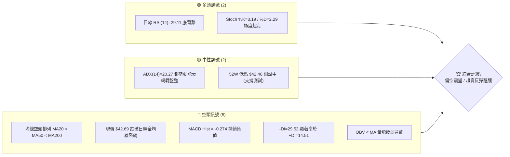
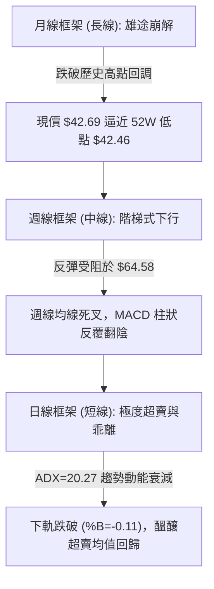
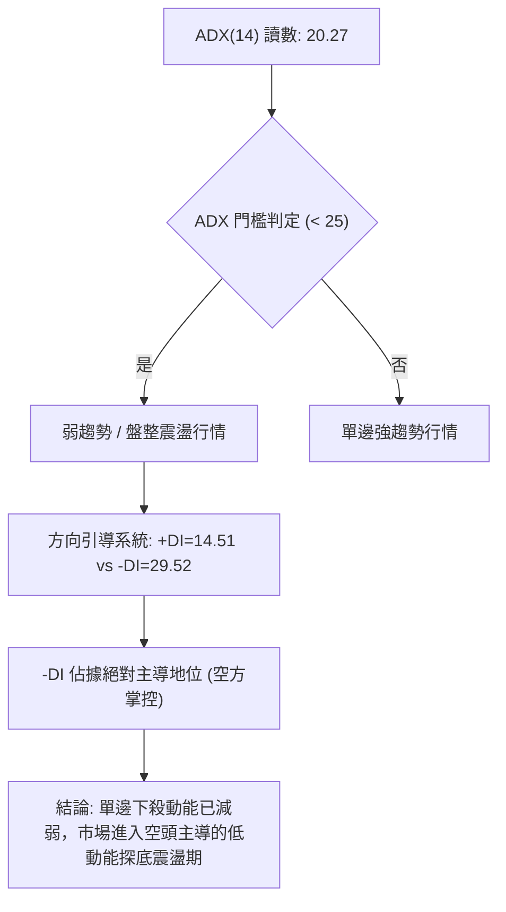
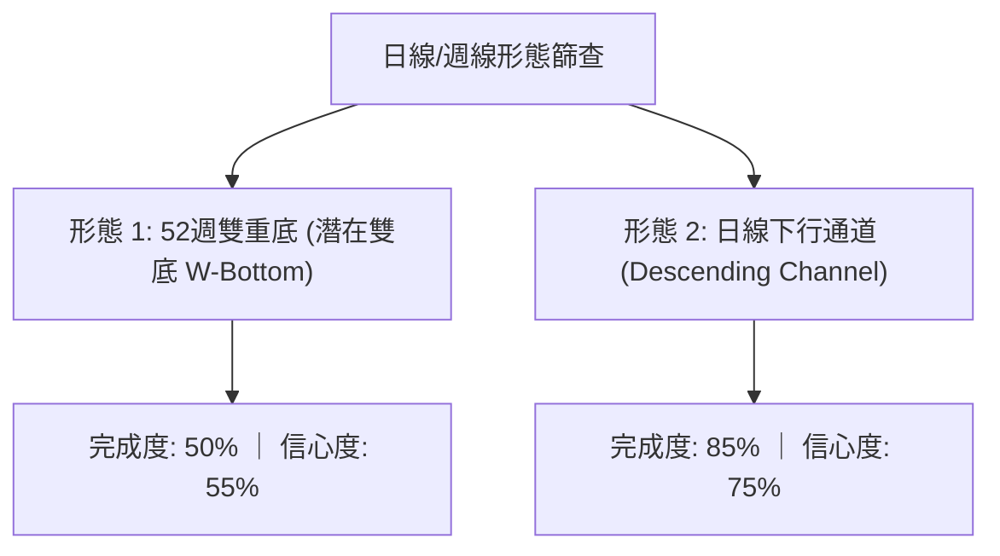
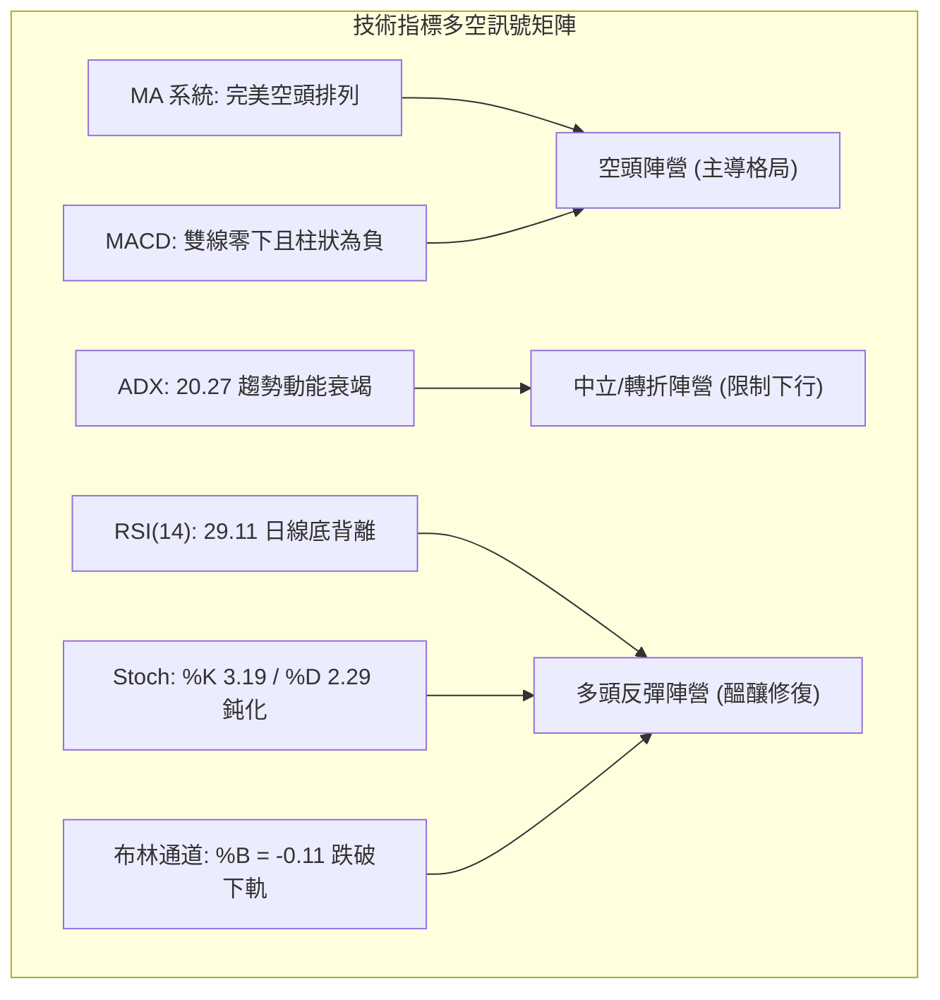
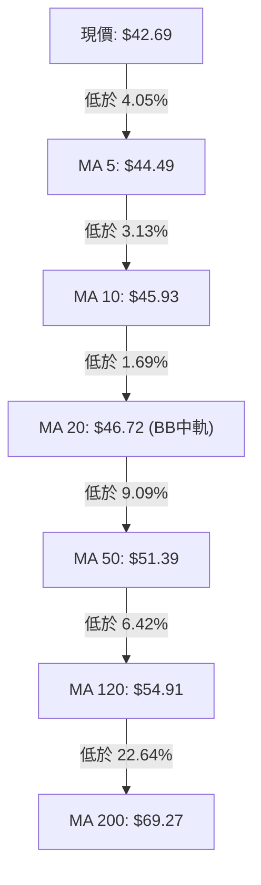
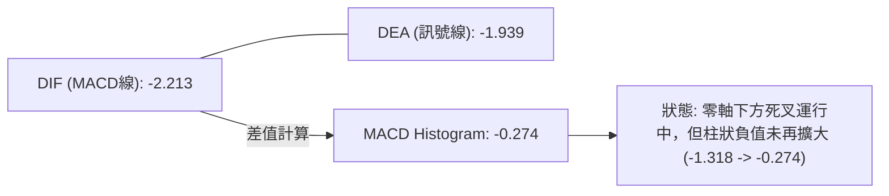
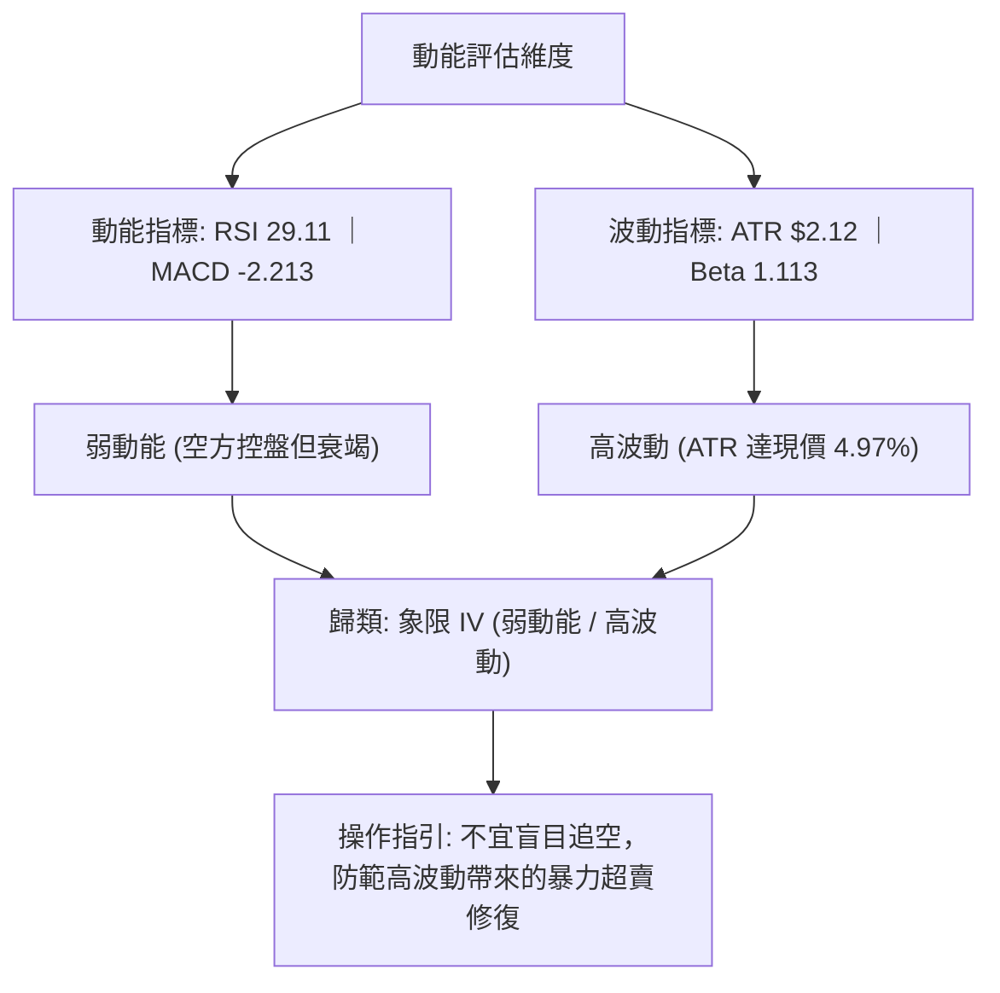
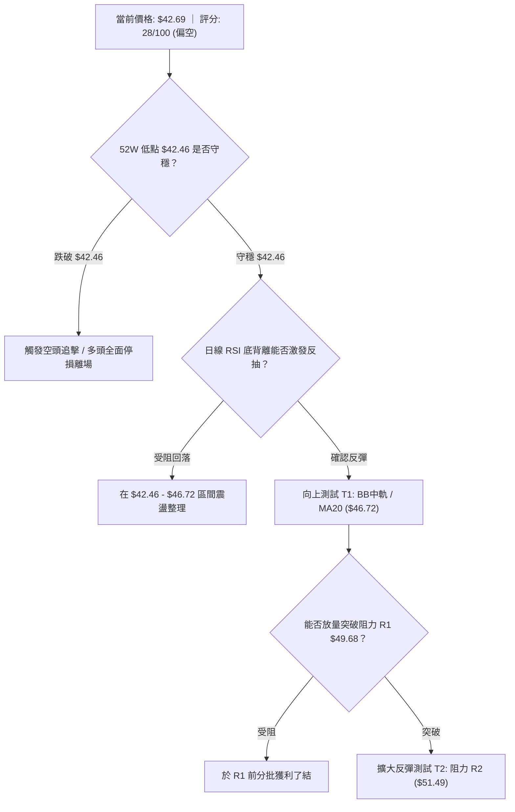
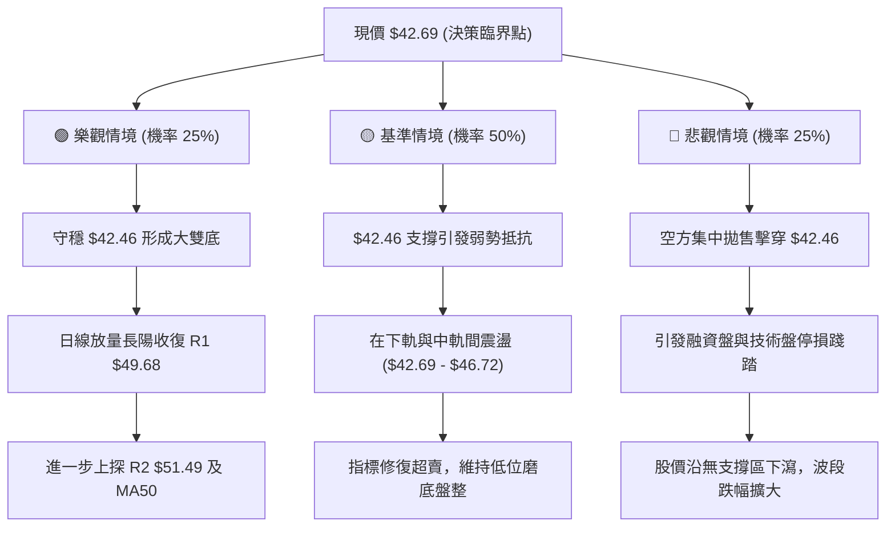

# KTOS 技術分析報告

> **報告日期**：2026-10-01 ｜ **語言**：繁體中文 ｜ **數據來源**：Yahoo Finance ｜ **當前價格**：$42.69

---

## 目錄

| 章節 | 內容 |
|------|------|
| [1. 技術面概覽](#1-技術面概覽) | 訊號儀表板、核心指標、評分卡 |
| [2. 趨勢分析](#2-趨勢分析) | 多時框趨勢、長中短期走勢 |
| [3. 圖表形態分析](#3-圖表形態分析) | 形態識別、K線組合、目標價 |
| [4. 支撐與阻力](#4-支撐與阻力) | 關鍵價位、斐波那契回調 |
| [5. 技術指標深度解讀](#5-技術指標深度解讀) | MA/RSI/MACD/布林/成交量 |
| [6. 動能與波動率](#6-動能與波動率) | 動能評估、ATR、Beta |
| [7. 多時框架總結](#7-多時框架總結) | 時框架評分矩陣 |
| [8. 交易策略建議](#8-交易策略建議) | 多空策略、風險報酬比 |
| [9. 風險提示與監控](#9-風險提示與監控) | 監控指標、風險場景 |

---

## 1. 技術面概覽

### 🎯 技術訊號儀表板



### 📊 核心指標速覽表

| 指標類別 | 指標名稱 | 當前數值 | 訊號 | 解讀 |
|----------|----------|----------|------|------|
| **價格** | 當前價格 | $42.69 | 🔴 | 位於 52 週區間 0.3% 分位，逼近歷史低點 $42.46 |
| **均線** | MA20 | $46.72 | 🔴 | 價格低於 MA20 達 -8.62%，短期下行趨勢顯著 |
| **均線** | MA50 | $51.39 | 🔴 | 中期生命線下壓，與現價負乖離達 -16.93% |
| **均線** | MA200 | $69.27 | 🔴 | 長期牛熊分界線下行，呈現典型熊市結構 |
| **動能** | RSI(14) | 29.11 | 🟢 | 進入超賣區間 (<30)，且存在日線底背離訊號 |
| **動能** | MACD | -2.213 | 🔴 | 位於零軸下方，柱狀圖 -0.274，空頭主導動能 |
| **波動** | ATR(14) | $2.12 | 🟡 | 佔現價 4.97%，日內價格波動度適中偏高 |

### 🏆 技術評分卡

```
技術評分卡 — KTOS (2026-10-01)
════════════════════════════════════════════════════
趨勢強度      ████░░░░░░░░░░░░░░░░  20/100  🔴 空頭
動能指標      ███████░░░░░░░░░░░░░  35/100  🔴 偏空超賣
支撐穩定度    ██████░░░░░░░░░░░░░░  30/100  🔴 脆弱
成交量配合    ████████░░░░░░░░░░░░  40/100  🟡 疲弱
形態完整度    ██████░░░░░░░░░░░░░░  30/100  🔴 下飄破位
均線排列      ██░░░░░░░░░░░░░░░░░░  10/100  🔴 完美空頭
════════════════════════════════════════════════════
綜合評分      ██████░░░░░░░░░░░░░░  28/100  🔴 強烈偏空
════════════════════════════════════════════════════
```

---

## 2. 趨勢分析

### 🌐 多時框趨勢分析



### 📈 長期趨勢 — 12個月走勢圖（Unicode）

```
KTOS 月線走勢圖（過去12個月：2025-10 至 2026-09）
價格軸 ($)
$105 ┤               ● $103.01 (2026-01)
$95  ┤ ● $90.60
$85  ┤                     ● $86.18
$75  ┤       ● $76.10● $75.91
$65  ┤                                 ● $63.05● $64.13
$55  ┤                           ● $70.51                  ● $50.98
$45  ┤                                             ● $49.86● $46.60
$35  ┤                                                             ● $42.69 (現在)
     └─────────────────────────────────────────────────────────────────────────
       10    11    12    01    02    03    04    05    06    07    08    09  (月份)
```

**走勢特徵分析表格**：

| 週期區間 | 起止價格 | 漲跌幅 | 結構形態與成交量特徵 | 趨勢結論 |
|----------|----------|--------|----------------------|----------|
| **2025-10 ~ 2026-01** | $90.60 → $103.01 | +13.70% | 頂部衝刺，創下波段歷史高點，高位換手加劇 | 🟢 多頭加速見頂 |
| **2026-01 ~ 2026-04** | $103.01 → $63.05 | -38.79% | 崩跌式回撤，擊穿短期均線，多頭結構瓦解 | 🔴 空頭強烈主導 |
| **2026-04 ~ 2026-05** | $63.05 → $64.13 | +1.71% | 弱勢橫盤喘息，量能萎縮，屬於中繼平台整理 | 🟡 中繼震盪 |
| **2026-05 ~ 2026-07** | $64.13 → $46.60 | -27.34% | 破位下挫，週成交量暴增至 45.38M，主力籌碼出逃 | 🔴 空頭破位加速 |
| **2026-07 ~ 2026-08** | $46.60 → $50.98 | +9.40% | 弱勢反彈（高點達 $64.58），但月線未能收高 | 🟡 超賣反抽受阻 |
| **2026-08 ~ 2026-09** | $50.98 → $42.69 | -16.26% | 陰跌再探低，逼近 52 週低點 $42.46，成交量鈍化 | 🔴 空頭延續探底 |

### 📊 中期趨勢（週線分析）

```
KTOS 中期週線支撐與阻力走勢結構示意圖
阻力帶 R3: $54.22 ────────────────────────────────────── 弱勢多頭反轉臨界點
阻力帶 R2: $51.49 ───────────────────▲────────────────── 8月反彈次高防線 / MA50 壓制
阻力帶 R1: $49.68 ─────────▲─────────│────────────────── 9月震盪平台中樞 / BB中軌
現價水平:  $42.69 ─────────│─────────│────────────────── 當前位置 (極度超賣)
52W 低點:  $42.46 ═════════▼═════════▼══════════════════ 全年絕對支撐線（測試中）
```

中期週線在 2026-08-16 衝高至 $64.58（RSI 達 76.7）後遭遇斷崖式下殺。隨後 MACD 柱狀由正翻負（最新週線 MACD 柱狀為 -0.274，9月初曾探至 -1.318），顯示中期下行趨勢確立。目前週線處於下行第 5 浪延伸段，正在尋求底部的構築。

### ⚡ 趨勢強度評估（ADX 解讀）



**ADX 指標強度對照表**：

| 指標變數 | 當前讀數 | 基準區間 | 市場含義解讀 | 訊號指示 |
|----------|----------|----------|--------------|----------|
| **ADX(14)** | 20.27 | < 25 (弱趨勢/區間) | 下跌趨勢的加速度已經衰竭，市場不再處於單邊崩跌中，趨向築底或低位盤整 | 🟡 盤整趨勢 |
| **+DI** | 14.51 | 低於 20 (弱) | 多方力量極度匱乏，缺乏推動波段上攻的主動買盤 | 🔴 多頭無力 |
| **-DI** | 29.52 | 高於 25 (強) | 空方仍控制盤面局勢，但未超過 40，未出現恐慌性踩踏崩潰 | 🔴 空方控盤 |
| **DI 差值** | -15.01 | 負值擴大 | 空方絕對領先，但受限於 ADX 數值低，容易出現技術性抽頭走勢 | 🟡 空頭鈍化 |

---

## 3. 圖表形態分析

### 🔍 形態識別系統



**形態信心度與目標價評估表**：

| 形態名稱 | 信心度 | 判斷依據（引用數據） | 完成度 | 目標價（附精確計算式） |
|----------|--------|----------------------|--------|------------------------|
| **下行通道下軌接觸** | 75% | 自 8月高點 $64.58 陰跌至現價 $42.69，受制於 MA20 ($46.72) 壓制，觸及通道下軌 | 85% | **目標反彈價 $46.72**（由 MA20/通道中軌提供計算值） |
| **潛在 52W 雙重底** | 55% | 前期低點為 52W 低點 $42.46，現價 $42.69 距其僅差 $0.23，形成潛在雙底之第二腳 | 50% | **頸線突破目標 $56.90**（由波段高點 R1 $49.68 + 形態高度 [$49.68 - $42.46 = $7.22] = $56.90） |
| **頭肩頂/底** | <50% | 數據中未偵測到標準左右肩對稱結構 | 0% | 訊號不足，僅做指標型解讀，不預設幾何目標價 |

### 🕯️ 重要K線形態分析

| 日期/月份 | 收盤價 | K線形態 | 解讀 | 訊號 |
|-----------|--------|---------|------|------|
| **2026-08-16 (週)** | $64.58 | 長上影倒錘頭線 | 週線衝高受阻於 78.6% 斐波位 ($62.05) 上方，高檔爆量滯漲 | 🔴 見頂反轉 |
| **2026-08-30 (週)** | $52.00 | 大陰線破位 | 一舉跌破 $55.00 平台，MACD 柱狀急挫至 -1.211，確立跌勢 | 🔴 空頭宣洩 |
| **2026-09-20 (週)** | $47.46 | 低檔陀螺線 (Spinning Top) | 於 $46.00-$47.00 間縮量拉鋸，空方拋壓初顯疲態 | 🟡 變盤猶豫 |
| **2026-09-27 (週)** | $45.62 | 下行陰線中繼 | 跌破前週低點，未見多頭長下影反擊，顯示多頭棄守中軌 | 🔴 空頭延續 |
| **2026-10-04 (當前)** | $42.69 | 低位十字星/錘子醞釀 | 價格精準回踩 52W 低點 $42.46 獲初步承接，波動幅度收窄 | 🟢 止跌孕育 |

### 📉 ASCII 走勢形態示意圖

```
KTOS 潛在雙底與下行楔形邊界示意圖
價格 ($)
$64.58 ┼─ 頂部高點 (8月中旬)
       │ ╲
$54.22 ┼───╲────────────── 阻力 R3
$51.49 ┼─────╲──────────── 阻力 R2
$49.68 ┼──────╲─────────── 雙底頸線阻力 R1 (潛在頸線)
       │        ╲
$46.72 ┼─────────╲──────── MA20 / 布林中軌
       │          ╲
$42.69 ┼───────────●────── 現價 (第二底測試中)
$42.46 ┼───────────┴────── 52W 低點 $42.46 (第一底: 2024年底起漲支撐)
       └────────────────────────────────────────────► 時間
```

### 🎯 形態目標價計算

若當前在 $42.46 之上的低位支撐獲確認，並成功向上突破下行通道上軌與阻力位 R1（$49.68）：
- **形態基底高度** = 頸線阻力 R1 ($49.68) - 52週低點支撐 ($42.46) = **$7.22**
- **第一階目標價** = 突破頸線位置 R1 = **$49.68**
- **第二階形態翻轉目標價** = 頸線位置 ($49.68) + 形態高度 ($7.22) = **$56.90**（向上挑戰 78.6% 斐波位 $62.05 與 MA120 $54.91 區間）

---

## 4. 支撐與阻力

### 🗺️ 關鍵價位分布圖（Unicode）

```
KTOS 價位結構分布圖
═══════════════════════════════════════════════════
$54.22 ║████████████████████████║ 強阻力 R3 (近一年波段高點聚類)
$51.49 ║████████████████████    ║ 阻力 R2 (MA50 匯合壓制區)
$49.68 ║████████████████████████║ 關鍵阻力 R1 (布林上軌附近壓制)
$42.69 ╠════════════════════════╣ ◄ 現價 (測試 52W 歷史極限)
$42.46 ║████████████████████████║ 52W 低點支撐 / 斐波那契 100.0%
(下方) ║░░░░░░░░░░░░░░░░░░░░░░░░║ (數據中未偵測到更低波段低點聚類)
═══════════════════════════════════════════════════
```

### 🚧 阻力位分析表

價位完全引用自關鍵數據計算之波段高點聚類數值：

| 阻力級別 | 價位 | 形成原因 | 突破難度 | 重要性 |
|----------|------|----------|----------|--------|
| **阻力 R1** | **$49.68** | 近一年波段高點聚類；與 BB上軌 ($50.03)、MA60 ($50.85) 重疊構成強大帶狀壓制 | ▓▓▓▓▓▓▓░░░ 中高 | 🟢 短線多空轉換分水嶺 |
| **阻力 R2** | **$51.49** | 近一年波段高點聚類；上方緊貼 MA50 ($51.39) 生命線 | ▓▓▓▓▓▓▓▓░░ 高 | 🟡 中期趨勢修復關鍵門檻 |
| **阻力 R3** | **$54.22** | 近一年波段密集套牢聚類；與 MA120 ($54.91) 半年線重合 | ▓▓▓▓▓▓▓▓▓░ 極高 | 🔴 中長線牛熊反轉分水嶺 |

### 🛡️ 支撐位分析表

價位嚴格依據 OHLCV 計算聚類及 52 週歷史區間：

| 支撐級別 | 價位 | 形成原因 | 守住機率 | 重要性 |
|----------|------|----------|----------|--------|
| **關鍵支撐 S1** | **$42.46** | 52W Low 歷史極限底點；斐波那契 100.0% 絕對回撤位 | ▓▓▓▓▓░░░░░ 50% | 🔴 生死防線（跌破進入未知真空） |
| **下方支撐 S2** | 數據中未偵測到 | 近一年波段低點聚類在現價下方無數據 | 0% | 🔴 跌破 $42.46 將引發技術性停損 |

### 📐 斐波那契回調位分析

依據 52 週極值區間（低點 $42.46 → 高點 $134.00）計算之黃金分割水準解析：

```
斐波那契回調位分布（$42.46 → $134.00，區間振幅 $91.54）
 0.0% ─── $134.00 (52W High)
23.6% ─── $112.40
38.2% ─── $ 99.03
50.0% ─── $ 88.23
61.8% ─── $ 77.43
78.6% ─── $ 62.05 (8月中旬反彈極限點 $64.58 處於此帶)
100.0% ── $  42.46 ◄ 現價 $42.69 位於 100.0% 斐波那契回調位邊緣
```

**現價區間深度解讀**：
現價 $42.69 處於 **78.6% 回調位 ($62.05)** 與 **100.0% 回調位 ($42.46)** 之間，且已逼近 100.0% 極限回調位（僅溢價 $0.23，距 52W 低點僅 0.54%）。技術面已將整波上漲浪潮（自 $42.46 起漲至 $134.00）的漲幅全數回吐。100.0% 回調位通常代表多頭的「最後陣地」，若能守穩將構成強烈的均值回歸起點；若失守則意味著長期多頭結構的徹底破滅。

---

## 5. 技術指標深度解讀

### 🎛️ 指標訊號總覽



### 📈 移動平均線排列分析



**均線狀態解讀表**：

| 均線名稱 | 數值 | 現價與均線距離 | 趨勢斜率 | 技術意涵 |
|----------|------|----------------|----------|----------|
| **MA 5** | $44.49 | -4.05% | 下行 ▼ | 極短線空方防線，壓制每日反彈高點 |
| **MA 10** | $45.93 | -7.05% | 下行 ▼ | 短線下行導軌，尚未出現走平跡象 |
| **MA 20** | $46.72 | -8.62% | 下行 ▼ | 月線生命線，亦為布林通道中軌阻力 |
| **MA 50** | $51.39 | -16.93% | 下行 ▼ | 中期重要均線，負乖離率處於歷史極值區間 |
| **MA 200**| $69.27 | -38.37% | 下行 ▼ | 長期牛熊分界線，代表長線籌碼嚴重套牢 |

均線系統呈現「標準空頭排列」（MA5 < MA10 < MA20 < MA50 < MA120 < MA200），所有均線均呈向下發散狀態，說明中長線趨勢極度疲弱。然而，現價與 MA20 負乖離率達 -8.62%，與 MA200 負乖離率高達 -38.37%，均線乖離率已達超賣極值，隨時具備技術性均值回歸的反彈動能。

### 📉 RSI(14) 分析

- **當前 RSI(14) 數值**：**29.11**
- **進度條展示**：`[██████░░░░░░░░░░░░░░] 29.11%` 🟢 超賣區間 (<30)
- **Stochastic 指標配合**：Stoch %K: **3.19**，Stoch %D: **2.29**（深度超賣鈍化）

```
RSI(14) 背離結構示意
價格走勢:   9月低點 $45.62 ─────────► 10月現價 $42.69 (創波段新低 ↘)
RSI 走勢:   9月初 RSI 11.7  ─────────► 當前 RSI 29.11  (指標顯著墊高 ↗)
結論:       標準底背離 (Bullish Divergence)，預示下殺動能嚴重衰竭
```

**背離深度研判**：
儘管現價從 9月中旬的 $46.69 破位下行至 $42.69 創下收盤新低，但 RSI(14) 卻從 9月初的極值 11.7 大幅抬升至當前的 29.11。這是極為經典的**日線底背離（Bullish Divergence）**，表明雖然空方在價格上持續創低，但其拋售動能已經出現斷崖式減弱，空頭彈藥消耗殆盡，短線見底機率急劇攀升。

### 📊 MACD(12/26/9) 訊號解讀



MACD 雙線深處零軸下方（DIF = -2.213，Signal = -1.939），確認大格局仍受空方支配。但檢視負柱狀圖變化：
- **2026-09-06 週線柱狀**：-1.318（空頭動能峰值）
- **2026-09-13 週線柱狀**：-0.864（動能收斂）
- **2026-10-01 日線柱狀**：-0.274（收縮至接近零軸）
柱狀圖收縮顯示下行衝量急劇縮小，快慢線開口縮小，具備隨時在低位醞釀金叉的技術條件。

### 📦 布林通道分析

```
KTOS 日線布林通道 (20, 2) 結構圖
價格 ($)
$50.03 ┼────────────────────────────── 上軌 (Upper Band)
       │
$46.72 ┼─── - ─ - ─ - ─ - ─ - ─ - ─ ─ 中軌 (MA20)
       │
$43.41 ┼────────────────────────────── 下軌 (Lower Band)
       │
$42.69 ┼───────●────────────────────── 現價 (%B = -0.11，已跌破下軌外側)
```

布林帶寬目前處於正常波動收斂階段（上軌 $50.03 與下軌 $43.41 差額僅 $6.62）。現價 $42.69 明顯跌破布林下軌（$43.41），導致 **%B 讀數達到 -0.11**。在統計概率上，價格處於布林帶外部（%B < 0）屬於不可持續的極端定價偏差，通常在 1–3 個交易日內會強烈觸發價格回抽至通道內部（至少回測下軌 $43.41，進而回抽中軌 $46.72）。

### 💹 成交量分析（量價配合度）

```
量價數據對比：
最新成交量:    5,296,000   █████████████ (量比: 1.29x)
20日均量:      4,090,570   ██████████
50日均量:      3,775,646   █████████
```

- **量能特徵**：最新成交量放大至 5.29M，相對於 20 日均量放量 29%。
- **OBV 走勢**：OBV < MA，能量潮線持續處於均線下方，指示前期主力籌碼處於淨流出狀態。
- **量價背離現象**：現價跌至 52W 低點邊緣時並未出現爆量恐慌性踩踏（如 6月底的 45.38M 天量），反而是以溫和放量（5.29M）的形式下探，說明市場殺跌意願已明顯枯竭，低位買盤開始進場被動承接。

---

## 6. 動能與波動率

### ⚡ 動能評估四象限

| 象限標籤 | 動能維度 (Momentum) | 波動率維度 (Volatility) | 當前股票狀態 | 戰略應對方針 |
|----------|---------------------|--------------------------|--------------|--------------|
| **象限 I** | 強動能 (Bullish) | 低波動 (Low Vol) | — | 穩定多頭趨勢，重倉持有 |
| **象限 II** | 弱動能 (Bearish) | 低波動 (Low Vol) | — | 沉悶磨底，觀望等待催化劑 |
| **象限 III** | 強動能 (Bullish) | 高波動 (High Vol) | — | 突破拉升階段，積極進取 |
| **象限 IV** | **弱動能 (Bearish)** | **高波動 (High Vol)** | **✓ (當前 KTOS 處於此區)** | **超賣極端區，嚴控部位，僅博弈反抽** |



### 📊 ATR 波動率分析

- **ATR(14) 數值**：**$2.12**
- **價格百分比**：佔現價 $42.69 的 **4.97%**
- **歷史波動對比**：近 20 週平均週振幅較大，當前每日 $2.12 的期望波動空間顯示個股彈性充足。
- **止損距離建議**：
  - **保守型（短線）**：採用 1.0 倍 ATR = **$2.12**
  - **波段型（趨勢）**：採用 1.5 倍 ATR = **$3.18**
  - **極限防守**：採用 2.0 倍 ATR = **$4.24**

### 📐 Beta 與市場相關性

- **Beta 係數**：**1.113**
- **市場屬性**：該股波動度略高於標普 500 指數（高出 11.3%），具備典型高貝塔成長防務股特性。
- **大盤共振效應**：在市場整體風險偏好轉向避險或防務軍工題材受到資金關注時，KTOS 具備高於大盤的向上彈性；但在此輪調整中，其高貝塔特性亦放大了資金流出的拋售壓力。

---

## 7. 多時框架總結

### 📋 時框架評分表

| 時框架 | 趨勢方向 | 動能狀態 | 均線排列 | 圖表形態 | 綜合評分 | 操作建議 |
|--------|----------|----------|----------|----------|----------|----------|
| **月線 (長期)** | 🔴 下行跌勢 | 🔴 弱勢零下 | 🔴 空頭排列 | 歷史高點見頂下殺 | 25/100 | 長期部位停看聽，不盲目長線建倉 |
| **週線 (中期)** | 🔴 階梯下行 | 🟡 柱狀收斂 | 🔴 空頭壓制 | 下行通道延伸尋底 | 30/100 | 等待中軌 MA20 收復與 MACD 金叉 |
| **日線 (短期)** | 🟡 盤整探底 | 🟢 極度超賣 | 🔴 發散偏離 | 52W 低點潛在雙底 | 35/100 | 短線博弈均值回歸與超賣反抽 |

### 🔲 綜合訊號矩陣

```
時框架訊號收斂矩陣
┌──────────────┬──────────────┬──────────────┬──────────────┐
│   維度項目   │   短期 (日線)│   中期 (週線)│   長期 (月線)│
├──────────────┼──────────────┼──────────────┼──────────────┤
│ 趨勢方向     │  🟡 鈍化整理 │  🔴 空頭主導 │  🔴 空頭下行 │
│ 均線系統     │  🔴 空頭壓制 │  🔴 空頭壓制 │  🔴 空頭排列 │
│ 動能指標     │  🟢 超賣背離 │  🔴 負向運行 │  🔴 弱勢下探 │
│ 形態結構     │  🟡 雙底邊緣 │  🔴 通道下軌 │  🔴 頭部破位 │
│ 量價結構     │  🟡 低檔接盤 │  🔴 縮量陰跌 │  🔴 主力減碼 │
└──────────────┴──────────────┴──────────────┴──────────────┘
```

### ⚖️ 多時框收斂結論

**依據多時框收斂規則第 14 條嚴格執行判定**：
1. **趨勢強度定性**：當前日線 **ADX(14) 讀數為 20.27 (< 25)**，明確定義當前市場處於**「盤整行情 / 弱趨勢磨底階段」**，而非單邊強趨勢行情。
2. **主導時框與權重分配**：由於 ADX < 25，根據收斂規則，日線布林通道上下軌（$43.41 ~ $50.03）與 52 週低點極值（$42.46）成為當前核心交易區間。中長期空頭趨勢限制了向上反轉的高度，但日線極度超賣（RSI=29.11、%B=-0.11、底背離）主導了當前的定價回正需求。
3. **唯一方向性結論**：**【中性偏空觀望，短線嚴格依賴極限支撐展開超賣均值回歸博弈】**。主策略必須與綜合評分（28/100）保持完全一致——以**「空頭防禦控管」**為核心架構，僅在極度超賣位置給出高風險回報比的反抽博弈計畫。

---

## 8. 交易策略建議

### 🗺️ 策略決策流程圖



### 🧭 策略路由（依評分卡分流）

**當前主策略方向 = 偏空環境下的極限支撐超賣反抽策略（依評分 28/100）**
*說明：綜合評分 28/100 雖屬偏空範疇，但因現價已抵達 52 週絕對低點 $42.46 且 RSI 底背離嚴重超賣，盲目追空風險報酬比極差。因此主策略規劃「左側極窄止損博反抽策略」（策略 A）與「右側破位空頭順勢策略」（策略 B），以因應邊界條件。*

### 🎯 價格情境階梯（Price Scenarios）

價位完全嚴格引用關鍵數據計算出的點位：

| 觸發條件 | 下一目標 | 後續延伸 | 情境技術含義 |
|----------|----------|----------|--------------|
| **向上收復 MA20 $46.72** | 阻力 R1 **$49.68** | 阻力 R2 **$51.49** | 脫離超賣區，日線底背離生效，展開均值回歸 |
| **突破阻力 R1 $49.68** | 阻力 R2 **$51.49** | 阻力 R3 **$54.22** | 短線多空翻轉，週線級別雙底成型 |
| **跌破 52W 低點 $42.46** | 數據中未偵測到 | 下方無支撐 | 歷史新低破位，引發多頭止損潮，空頭主導單邊下瀉 |

### 📊 情境機率分佈

| 情境劃分 | 預估機率 | 主要技術依據 |
|----------|----------|--------------|
| **弱勢反彈 / 均值回歸** | **50%** | 日線 RSI(14)=29.11 底背離、布林 %B=-0.11、Stoch 低位鈍化反彈需求 |
| **低位區間震盪 ($42.46-$46.72)** | **35%** | ADX=20.27 顯示單邊動能萎縮、OBV 量能尚未放大、籌碼於低檔換手 |
| **跌破低點再探底** | **15%** | 全均線呈空頭排列、MACD 處於零軸下方、-DI=29.52 仍主導趨勢 |

### 🟢 主策略詳情

依據第 4 章「關鍵價位」精確計算之數值構建策略組合：

| 策略要素 | 策略 A（超賣反抽博弈 — 偏多試倉） | 策略 B（破位追空對沖 — 偏空順勢） |
|----------|-----------------------------------|-----------------------------------|
| **進場條件** | 回踩 $42.46 不破，日線收盤企穩 | 跌破 52W 低點 $42.46，且 15分K收低於其下 |
| **進場價格** | **$42.69**（現價建立底倉） | **$42.20**（跌破確認後追空） |
| **目標價 T1** | **$46.72**（MA20 / 布林中軌） | **$38.22**（由破位點減去 2x ATR $4.24） |
| **目標價 T2** | **$49.68**（關鍵阻力位 R1） | **$36.10**（由破位點減去 3x ATR $6.36） |
| **止損價格** | **$41.63**（52W低點 $42.46 - 0.5x ATR $1.06） | **$43.26**（站回 52W低點上方 + 0.5x ATR） |
| **風險報酬比** | **1 : 3.82**（以 R1 $49.68 計算） | **1 : 3.79**（以 T1 計算） |
| **成功機率** | **55%** | **45%** |
| **建議倉位** | **10% ~ 15%**（輕倉嚴格止損） | **15% ~ 20%**（順勢動量部位） |

### 🔴 反向風險觸發點（對沖提示）

- **多頭反轉翻空警戒線**：若現價收盤跌穿 **$42.46**，證明潛在雙底徹底失敗，底背離演變為「鈍化下跌」，必須無條件將所有博反彈多頭部位停損出場，不得心存僥倖。
- **空頭平倉避險警戒線**：若日線放量陽線收復阻力 R1 **$49.68**，宣告下行通道被實質向上突破，空頭結構被破壞，空單必須全數回補對沖。

### ⭐ 整體訊號強度評星

```
做多訊號強度：★★☆☆☆  (2.5/5星 — 僅限超賣反抽，非反轉)
做空訊號強度：★★★☆☆  (3.5/5星 — 大趨勢偏空，但短線受制於超賣)
整體可信度：  ★★★★☆  (4.0/5星 — 價位邊界明確，極具博弈風報比)
```

---

## 9. 風險提示與監控

### ✅ 關鍵監控指標 Checklist

```
╔══════════════════════════════════════════════════════════════════╗
║                   KTOS 每日盤面關鍵監控清單                      ║
╠══════════════════════════════════════════════════════════════════╣
║ [ ] 價格防禦線: 每日收盤價是否嚴格維持在 $42.46 (52W Low) 之上   ║
║ [ ] RSI(14) 狀態: 能否自 29.11 脫離 30 閾值重返多頭修復區間     ║
║ [ ] 布林通道指標: %B 讀數是否由負值 (-0.11) 回歸至 0.0 以上      ║
║ [ ] 動量確認線: 日線 MACD 柱狀體能否從 -0.274 翻紅翻正          ║
║ [ ] 動態壓制線: MA5 ($44.49) 與 MA20 ($46.72) 是否由阻力轉支撐   ║
║ [ ] 異常巨量監控: 成交量若超過 8.0M 且向下破位，視為失守訊號     ║
╚══════════════════════════════════════════════════════════════════╝
```

### ⚠️ 風險場景分析



### 🛡️ 風險管理重要提醒

1. **破位止損不可妥協**：52 週低點 **$42.46** 是當前所有多頭結構的唯一錨點。由於在該價位下方技術面存在「歷史支撐真空」，若跌破此位，技術停損盤恐引發無序下瀉，因此停損點必須嚴設於 **$41.63**，絕不抗單。
2. **倉位配置上限**：鑒於該股 Beta 值為 1.113 且 ATR 波動佔比高達 4.97%，總投資組合中分配給 KTOS 的單一曝險金額不得超過總資產的 **5%**。
3. **乖離收斂不等於趨勢反轉**：當前所有技術反彈皆定義為「超賣修復」，在日線未能有效站上阻力位 R1（**$49.68**）並使 MA20 走平之前，切勿以長線多頭思維進行加碼擴倉。

---

## 📋 報告總結

```
KTOS 技術分析報告總結
════════════════════════════════════════════════════════
報告日期：2026-10-01
當前價格：$42.69
分析評級：⚖️ 偏空震盪（超賣反抽醞釀）

關鍵結論：
├─ 長期趨勢：🔴 空頭下行，距歷史高點回撤達 -68.14%
├─ 中期趨勢：🔴 空頭壓制，受困於下行通道，均線完美空頭
├─ 短期趨勢：🟡 極度超賣，RSI=29.11 底背離，逼近 52W 低點
├─ 關鍵支撐：$42.46 (52W Low / 斐波那契 100.0%)
├─ 關鍵阻力：$46.72 (MA20/布林中軌)、$49.68 (波段高點 R1)
└─ 分析師目標：華爾街平均目標價 $102.76（與現價形成高度反差）

最優策略組合：
1. 🥇 最佳機會：策略 A (左側極窄止損博反抽)
   以 $42.69 進場，止損 $41.63，目標 $46.72 / $49.68，風報比 1:3.82
2. 🥈 次選機會：策略 B (破位順勢追空對沖)
   跌破 $42.46 後於 $42.20 追空，止損 $43.26，目標 $38.22
3. 🥉 保守選擇：完全空倉觀望
   靜待股價放量突破阻力位 R1 ($49.68) 或形成明確日線底部分型後再行介入
════════════════════════════════════════════════════════
```

---

> ⚠️ **免責聲明**：本報告為 AI 自動生成之技術分析，所有數據及估算均基於提供的歷史價格資訊。本報告**僅供研究與學術參考**，**不構成任何投資建議**。投資有風險，入市需謹慎。

---

*報告生成時間：2026-10-01 ｜ 數據來源：Yahoo Finance ｜ 分析框架：多時框技術分析*