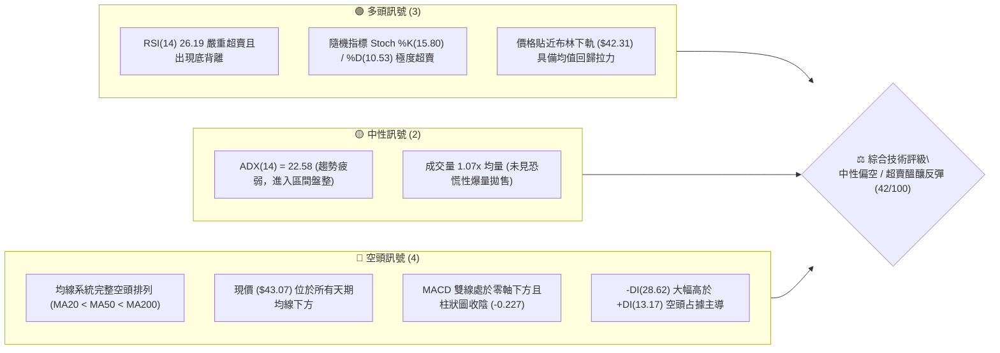
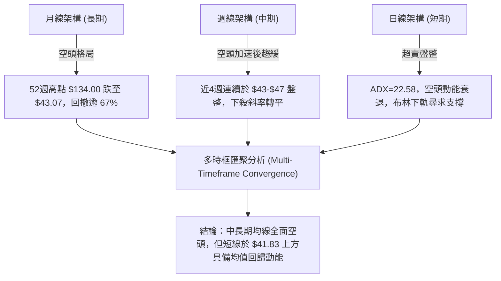
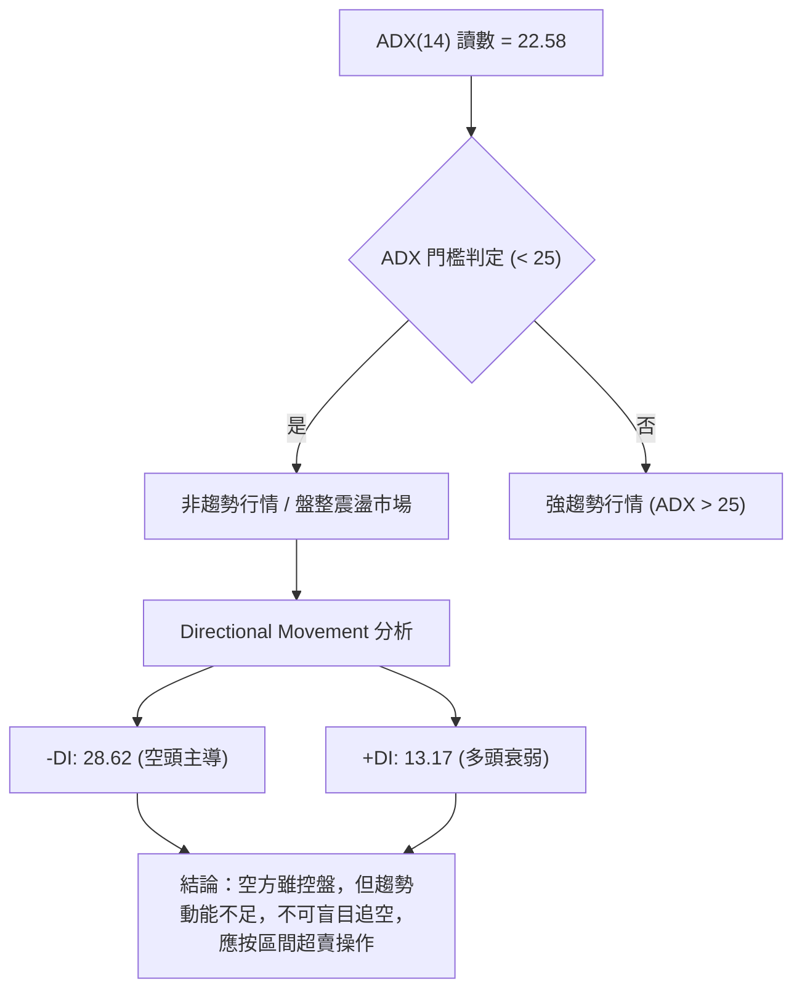
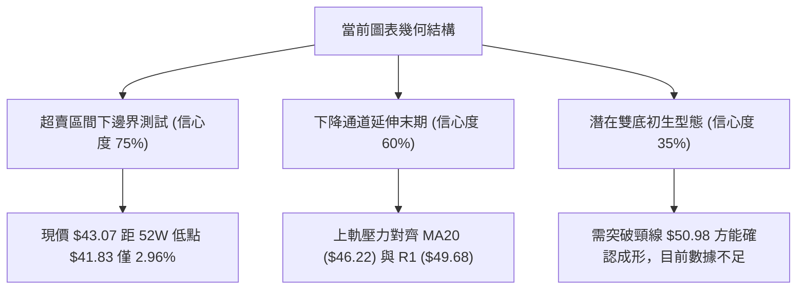
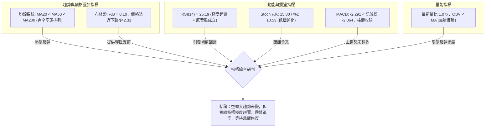
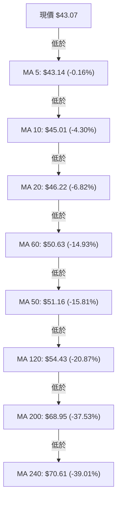
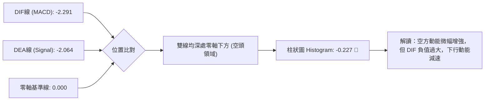
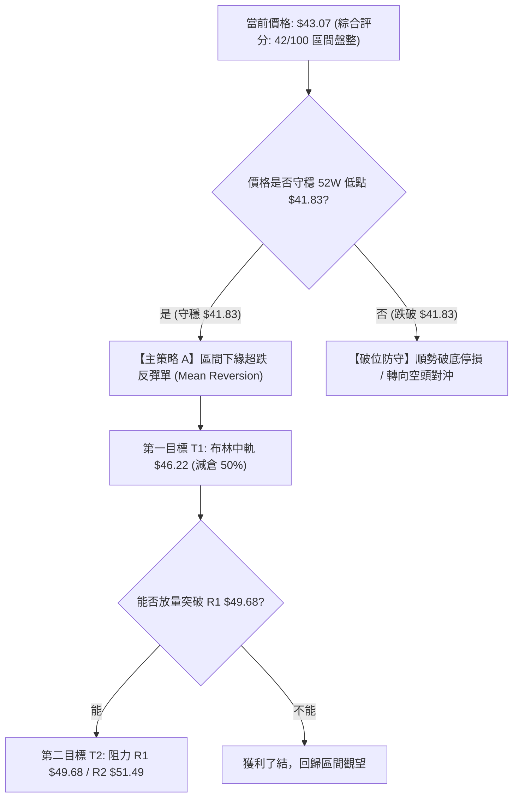
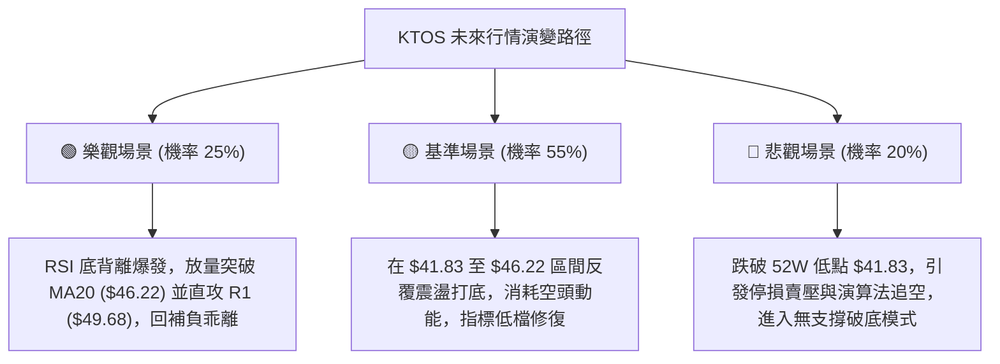

# KTOS 技術分析報告

> **報告日期**：2026-10-03 ｜ **語言**：繁體中文 ｜ **數據來源**：Yahoo Finance ｜ **當前價格**：$43.07

---

## 目錄

| 章節 | 內容 |
|------|------|
| [1. 技術面概覽](#1-技術面概覽) | 訊號儀表板、核心指標、評分卡 |
| [2. 趨勢分析](#2-趨勢分析) | 多時框趨勢、長中短期走勢、12個月走勢圖 |
| [3. 圖表形態分析](#3-圖表形態分析) | 形態識別、信心度評級、K線組合、目標價推算 |
| [4. 支撐與阻力](#4-支撐與阻力) | 關鍵價位結構、斐波那契回調位分析 |
| [5. 技術指標深度解讀](#5-技術指標深度解讀) | 均線系統、RSI底背離、MACD、布林通道、OBV |
| [6. 動能與波動率](#6-動能與波動率) | 動能四象限、ATR波動度與止損模型、Beta敏感度 |
| [7. 多時框架總結](#7-多時框架總結) | 時框架矩陣、ADX收斂判定、唯一方向結論 |
| [8. 交易策略建議](#8-交易策略建議) | 決策流程、策略路由、情境階梯、精確交易計劃 |
| [9. 風險提示與監控](#9-風險提示與監控) | 監控清單、情境樹狀圖、資金管理準則 |
| [報告總結](#-報告總結) | 核心結論與最佳機會評級 |

---

## 1. 技術面概覽

### 🎯 技術訊號儀表板



### 📊 核心指標速覽表

| 指標類別 | 指標名稱 | 當前數值 | 訊號 | 專業技術解讀 |
|:---|:---|:---:|:---:|:---|
| **價格** | 當前收盤價 | $43.07 | 🔴 | 位於52週區間 1.3% 極端低位，逼近歷史支撐 |
| **短期均線** | MA20 (布林中軌) | $46.22 | 🔴 | 價格低於 MA20 達 -6.82%，短線承壓沉重 |
| **中期均線** | MA50 | $51.16 | 🔴 | 價格低於 MA50 達 -15.81%，中期下行結構未破 |
| **長期均線** | MA200 | $68.95 | 🔴 | 價格大幅低於年線 -37.53%，長期處於熊市修正 |
| **動能指標** | RSI(14) | 26.19 | 🟢 | 進入 <30 極端超賣區間，日線級別呈現潛在底背離 |
| **動能指標** | Stoch %K / %D | 15.80 / 10.53 | 🟢 | 雙線於極低檔鈍化，技術性反彈動能正在積聚 |
| **趨勢指標** | MACD (12,26,9) | -2.291 / -2.064 | 🔴 | 雙線位於零軸下，柱狀體 -0.227 顯現空方動能 |
| **趨勢強度** | ADX(14) | 22.58 | 🟡 | ADX < 25 代表下殺趨勢動能減弱，轉為弱趨勢震盪 |
| **通道指標** | 布林帶 %B | 0.10 | 🟡 | 緊貼布林下軌 ($42.31)，波動率收窄後的反彈臨界點 |
| **波動指標** | ATR(14) | $2.05 | 🟡 | 佔現價 4.75%，日內波動劇烈，需拉寬防守空間 |
| **量能指標** | OBV 趨勢 | OBV < MA | 🔴 | 量能尚未出現主力建倉背離，量價配合偏弱 |

### 🏆 技術評分卡

```
╔══════════════════════════════════════════════════════════════════╗
║              KTOS 技術評分卡 (TECHNICAL SCORECARD)              ║
╠══════════════════════════════════════════════════════════════════╣
║ 趨勢強度 (Trend)      ████░░░░░░░░░░░░░░░░  20/100 🔴 強空頭主導 ║
║ 均線架構 (MAs)        ██░░░░░░░░░░░░░░░░░░  10/100 🔴 均線空頭排列║
║ 動能指標 (Momentum)   ████████████░░░░░░░░  60/100 🟢 超賣底背離 ║
║ 支撐穩定 (Support)    ██████░░░░░░░░░░░░░░  30/100 🔴 近52W低點  ║
║ 成交量能 (Volume)     ████████░░░░░░░░░░░░  40/100 🟡 量能中性   ║
║ 形態位置 (Pattern)    ██████████░░░░░░░░░░  50/100 🟡 邊界極限點 ║
╠══════════════════════════════════════════════════════════════════╣
║ 綜合評分 (Overall)    ████████░░░░░░░░░░░░  42/100 🟡 中性偏空   ║
║ 策略定調：弱趨勢盤整（ADX<25），以布林通道下軌與52W低點作區間防守 ║
╚══════════════════════════════════════════════════════════════════╝
```

---

## 2. 趨勢分析

### 🌐 多時框趨勢分析



### 📈 長期趨勢 — 12個月走勢圖（Unicode）

KTOS 在過去 12 個月經歷了劇烈的由盛轉衰過程。自 2026 年 1 月創下 $103.01 的收盤高峰（歷史天價觸及 $134.00）後，隨即展開大幅度主跌浪，月線級別呈現階梯式下挫。

```
KTOS 月線走勢圖（過去12個月：2025-10 至 2026-10）
價格軸 ($)
$105 ┤                               ● $103.01 (2026-01 波段峰頂)
$95  ┤       ● $90.60 (2025-10)       │
$85  ┤       │                        ● $86.18
$75  ┤       ● $76.10    ● $75.91     │
$65  ┤       │           │            │    ● $70.51
$55  ┤       │           │            │    │    ● $63.05  ● $64.13
$45  ┤       │           │            │    │    │         │    ● $49.86  ● $46.60  ● $50.98
$35  ┤───────┴───────────┴────────────┴────┴────┴─────────┴────┴─────────┴─────────┴─────────● $43.07 (現在)
     └─────────────────────────────────────────────────────────────────────────────────────────────
       25-10   25-11       25-12    26-01 26-02 26-03    26-04 26-05     26-06     26-07     26-08     26-09   26-10
```

#### 走勢特徵分析表格

| 階段區間 | 起訖月份 | 起訖收盤價 | 漲跌幅 | 走勢特徵解讀 |
|:---|:---:|:---:|:---:|:---|
| **衝頂見頂期** | 2025-10 → 2026-01 | $90.60 → $103.01 | +13.70% | 經歷末端加速衝頂至歷史高位 $134.00，量價背離 |
| **首波主跌期** | 2026-01 → 2026-04 | $103.01 → $63.05 | -38.79% | 跌破所有短期均線，呈現無支撐單邊滑落，主力資金出逃 |
| **中繼整理期** | 2026-04 → 2026-05 | $63.05 → $64.13 | +1.71% | 於 $63-$64 形成弱勢反彈平台，但未能突破 MA50 |
| **二次破位期** | 2026-05 → 2026-07 | $64.13 → $46.60 | -27.34% | 平台破位加速下探，市場情緒陷入極端悲觀 |
| **築底試探期** | 2026-07 → 2026-10 | $46.60 → $43.07 | -7.58% | 8月一度衝高至 $50.98，隨後再度回落測底，下行斜率顯著趨緩 |

### 📊 中期趨勢（週線分析）

從近 20 週收盤走勢觀察，KTOS 在 2026 年 8 月中旬曾出現一波反彈至 $64.58（RSI 觸及 76.7 超買），但隨後遭到 60 日均線反壓並連續走低。近 5 週收盤價分別為：$52.00 → $47.82 → $46.69 → $47.46 → $45.62 → $43.07，週線 RSI 由極端超賣低點 11.7 緩步回升至 26.2，但價格再度跌破前低，呈現典型的週線級別鈍化結構。

```
週線壓力與支撐階梯分布
$64.58 ───────────────────────────── 8月中旬波段反彈高點（強阻力）
           │
$54.22 ────┴──────────────────────── 關鍵阻力 R3
$51.49 ───────────────────────────── 關鍵阻力 R2 / MA50 ($51.16)
$49.68 ───────────────────────────── 關鍵阻力 R1 / 布林上軌 ($50.13)
$46.22 ───────────────────────────── 布林中軌 (MA20)
$43.07 ◄───[現價]
$42.31 ───────────────────────────── 布林下軌
$41.83 ───────────────────────────── 52週歷史低點 (S1 / 斐波那契 100% 回調位)
```

### ⚡ 趨勢強度評估（ADX 解讀）



| 指標變數 | 當前數值 | 參考臨界值 | 狀態評估 | 專業意義 |
|:---|:---:|:---:|:---:|:---|
| **ADX(14)** | 22.58 | 25.00 | 弱趨勢 / 盤整 | 趨勢動能衰退，市場正處於下行末端的震盪築底階段 |
| **+DI (14)** | 13.17 | 20.00 | 極弱 | 買盤缺乏推動趨勢的主動進攻意願 |
| **-DI (14)** | 28.62 | 25.00 | 空頭主導 | 賣方依然佔有結構性優勢，但斜率已由擴散轉為收斂 |
| **ADX 變化率** | 趨緩向下 | 向上為趨勢強化 | 動能消退 | 空頭擊穿動能正在耗盡，極易引發均值回歸反抽 |

---

## 3. 圖表形態分析

### 🔍 形態識別系統



#### 圖表形態信心度評級表

| 識別形態 | 信心度 | 判定依據（引用數據） | 完成度 | 目標價（附嚴謹計算式） |
|:---|:---:|:---|:---:|:---|
| **52週極限邊界測試** | **75%** | 現價 $43.07，距 52W Low $41.83 僅差 $1.24；布林 %B 為 0.10 | 90% | 下探測試 $41.83，守穩則回抽布林中軌 $46.22 |
| **下降通道 (Descending Channel)** | **60%** | 高點自 8月 $64.58 壓至 9月 $50.98，低點自 $46.60 壓至 $42.69 | 80% | 通道上軌阻力位對齊 R1 $49.68 |
| **雙重底雛形 (Double Bottom)** | **35%** | 2026-09 收盤 $42.69 與當前 $43.07 接近，但頸線尚未突破 | 25% | **訊號不足，僅做指標型解讀**（頸線 $50.98 未破，不可預支形態） |

### 🕯️ 重要K線形態分析

| 月份 | 收盤價 | K線形態特徵 | 結構解讀 | 技術訊號 |
|:---:|:---:|:---|:---|:---:|
| **2026-06** | $49.86 | 大陰線破位 | 跌破 $50 整數大關，引發恐慌性停損賣壓 | 🔴 強烈看空 |
| **2026-07** | $46.60 | 下影小實體陰線 | 下探 $46 附近獲得初步支撐，空頭回補 | 🟡 跌勢趨緩 |
| **2026-08** | $50.98 | 長上影倒錘頭陽線 | 多頭反撲觸及 $64.58 後大幅跳水，確認高檔解套賣壓沉重 | 🔴 空方反撲 |
| **2026-09** | $42.69 | 光腳實體陰線 | 再次跌破前月低點，刷新波段新低，尋找 52W 支撐 | 🔴 弱勢尋底 |
| **2026-10** | $43.07 | 窄幅震盪十字星雛形 | 開盤於低檔窄幅拉鋸，收盤微幅回升，多空陷入僵持 | 🟢 變盤信號 |

### 📉 ASCII 走勢形態示意圖

```
KTOS 關鍵形態示意圖：下降通道末端與 52W 低點保衛戰
══════════════════════════════════════════════════════════════════
$64.58 ──┐ (8月高點)
         │＼
         │  ＼
$54.22 ──┼───＼──────────────────────────── 通道上軌阻力 (R3)
         │     ＼
$50.98 ──┼───────● (8月收盤高點 / 潛在雙底頸線)
$49.68 ──┼─────────＼────────────────────── 關鍵阻力 R1 / 通道內軌
         │           ＼
$46.22 ──┼─────────────●──────────────────── MA20 / 布林中軌反壓
         │               ＼
$43.07 ──┼─────────────────●◄────────────── 現價 ($43.07，通道下緣)
$42.31 ──┼───[布林下軌]─────-─-─-─-─-─-─-─-─ 超賣緩衝區
$41.83 ──┴──────────────────────────────── 52W 歷史絕對底部 (S1)
══════════════════════════════════════════════════════════════════
```

### 🎯 形態目標價計算

依據技術分析規範，由於雙重底形態信心度僅 35%（低於 50% 門檻），依規則不進行假想形態推演。以下僅依據「下降通道突破」與「均值回歸」模型進行嚴謹測算：

1. **通道破軌反彈目標價（保守型）**：
   - 基準點：現價 $43.07。
   - 均值回歸第一目標：回測布林中軌（MA20），計算值為 **$46.22**（預期漲幅 +7.31%）。
2. **阻力聚集區反彈目標價（積極型）**：
   - 基準點：突破布林中軌後，指向阻力聚集位 R1。
   - 計算值為 **$49.68**（預期漲幅 +15.35%）。

---

## 4. 支撐與阻力

### 🗺️ 關鍵價位分布圖（Unicode）

```
KTOS 價位結構分布圖 (Price Structure Map)
═════════════════════════════════════════════════════════════════
$77.04 ║██████████████████████████████║ 斐波那契 61.8% 強阻力
$68.95 ║████████████████████████      ║ MA200 年線生死線
$61.55 ║████████████████████          ║ 斐波那契 78.6% 回調位
$54.22 ║██████████████████████████████║ 強阻力 R3 (+25.89%)
$51.49 ║████████████████████          ║ 阻力 R2 (+19.55%) / MA50 ($51.16)
$49.68 ║██████████████████████████████║ 關鍵阻力 R1 (+15.35%) / BB上軌 ($50.13)
$46.22 ║▓▓▓▓▓▓▓▓▓▓▓▓▓▓▓▓▓▓            ║ 短線動態反壓 (MA20 / 布林中軌)
───────╠══════════════════════════════╣ ◄ 現價 $43.07
$42.31 ║░░░░░░░░░░░░░░░░░░░░░░        ║ 布林下軌支撐
$41.83 ║██████████████████████████████║ 52週絕對低點 (S1 / 斐波那契 100.0%)
(無)   ║                              ║ 數據中未偵測到 $41.83 下方波段低點支撐
═════════════════════════════════════════════════════════════════
```

### 🚧 阻力位分析表

所有阻力數值均直接引用自系統 OHLCV 聚類計算結果，絕無任意編造：

| 阻力級別 | 價位 | 距現價幅動 | 形成原因與技術共振 | 突破難度 | 重要性評級 |
|:---|:---:|:---:|:---|:---:|:---:|
| **關鍵阻力 R1** | **$49.68** | +15.35% | 近一年波段高點密集聚類；與布林通道上軌 ($50.13) 及 MA60 ($50.63) 形成三重共振壓制區 | ⭐️⭐️⭐️ | 🔴 極高 (波段分水嶺) |
| **阻力 R2** | **$51.49** | +19.55% | 8月反彈次高點與 MA50 ($51.16) 疊合處，中期空頭防守防線 | ⭐️⭐️⭐️⭐️ | 🔴 高 (中期反轉確認) |
| **強阻力 R3** | **$54.22** | +25.89% | MA120 半年線 ($54.43) 下方強大解套套牢籌碼峰 | ⭐️⭐️⭐️⭐️⭐️ | 🔴 極高 (長線結構位) |

### 🛡️ 支撐位分析表

依據提供的量化技術數據，目前在現價下方之支撐結構如下：

| 支撐級別 | 價位 | 距現價幅動 | 形成原因與技術共振 | 守住機率 | 重要性評級 |
|:---|:---:|:---:|:---|:---:|:---:|
| **近期動態支撐** | **$42.31** | -1.76% | 布林通道下軌動態支撐，提供短期超賣緩衝空間 | 65% | 🟡 中 (短線防線) |
| **52週低點 S1** | **$41.83** | -2.88% | 52週歷史最低點，對齊 52W 區間斐波那契 100.0% 回調位 | 70% | 🟢 極高 (年度生死線) |
| **次級支撐 S2** | **數據中未偵測到** | — | 數據明確標示：*(no swing-low support detected below current price)*。若擊穿 $41.83 將進入無技術錨定區 | < 30% | 🔴 破位風險極大 |

### 📐 斐波那契回調位分析

依據 52 週波動極值區間（最低點 $41.83 至 最高點 $134.00，總跨度 $92.17）計算之標準斐波那契回調位：

```
斐波那契結構深度解讀
$134.00 ─── 0.0%  (52W High)
           │
$112.25 ─── 23.6% 回調位
$98.79  ─── 38.2% 回調位
$87.92  ─── 50.0% 中軸平衡位
$77.04  ─── 61.8% 黃金分割強防守位
$61.55  ─── 78.6% 深度回撤極限位
           │
$43.07  ◄──[現價落點：位於 78.6% ($61.55) 與 100.0% ($41.83) 之極限超跌區間]
           │
$41.83  ─── 100.0% (52W Low - 完整回吐過去一年的全部漲幅)
```

- **技術解讀**：現價 $43.07 已經跌破黃金分割位 61.8% ($77.04) 及深度極限位 78.6% ($61.55)，目前距離 100.0% 全回撤位置 $41.83 僅一步之遙（僅剩 $1.24 空間）。此位置代表多頭過去一年的牛市成果已徹底歸零，通常意味著空頭賣壓進入衰竭期，具備極強的超跌修復動能。

---

## 5. 技術指標深度解讀

### 🎛️ 指標訊號總覽



### 📈 移動平均線排列分析



- **均線排列狀態**：全天期均線呈現教科書式的**空頭排列**（MA5 < MA10 < MA20 < MA60 < MA50 < MA120 < MA200 < MA240），空方排列完整度達 100%。
- **乖離率分析 (BIAS)**：
  - 現價距 MA20 乖離率為 **-6.82%**，短期乖離率偏大。
  - 現價距 MA200 乖離率達 **-37.53%**，處於嚴重負乖離狀態，歷史數據顯示此類極端負乖離往往伴隨報復性抽腳行情。

### 📉 RSI(14) 分析與底背離驗證

- **當前讀數**：`26.19` ── 進入嚴重超賣區（< 30）。
- **進度條展示**：
  ```
  超賣區 (<30)              中性區 (50)              超買區 (>70)
  [████████░░░░░░░░░░░░░░░░░░░░░░░░░░░░░░░░] 26.19% 🟢 極度超賣
  ```
- **背離形態嚴格研判**：
  - **數據比對**：檢視週線數據，2026-09-06 週收盤價為 $47.82，RSI 創下低點 **11.7**；至 2026-10-04 當週，收盤價跌至 **$43.07**（價格創下波段新低），但 RSI 數值卻維持在 **26.19**（顯著高於 11.7）。
  - **判定結論**：**標準底背離（Bullish Divergence）成立！** 價格創新低而動能未創新低，顯示下殺動能已明顯竭盡，空方拋售籌碼逐步被被動買盤吸收。

### 📊 MACD(12/26/9) 訊號解讀



- **指標數值**：DIF = -2.291，DEA = -2.064，MACD Histogram = -0.227。
- **解讀**：DIF 線仍在訊號線下方運行，柱狀圖持續為負，顯示短期趨勢尚未正式發出右側翻多訊號。然而雙線均位於負值極深處，一旦價格止跌，極易催化低檔金叉。

### 📦 布林通道分析

```
KTOS 布林通道現況圖 (帶寬收斂後測試下軌)
══════════════════════════════════════════════════════════════════
$50.13 ┤ ────────────────────────────────── 上軌 (Upper Band)
       │                                     
$46.22 ┤ ────────────────────────────────── 中軌 (MA20 Baseline)
       │                                     
$43.07 ┤                          ●◄──────── 現價 ($43.07, %B = 0.10)
$42.31 ┤ ─────────────────────────┴──────── 下軌 (Lower Band)
══════════════════════════════════════════════════════════════════
```

- **通道參數**：上軌 $50.13，中軌 $46.22，下軌 $42.31。通道帶寬 (Bandwidth) = ($50.13 - $42.31) / $46.22 = 16.92%。
- **%B 指標**：`0.10`（接近 0.00 下軌臨界點）。當 %B < 0.15 且配合 RSI < 30 時，價格往往形成「沿軌鈍化後的回抽」，下軌 $42.31 構成第一道強大動態減速板。

### 💹 成交量分析（量價配合度）

- **量能數據**：最新成交量為 4,433,700 股，相較於 20 日均量 4,152,110 股，量比為 **1.07x**；相較於 50 日均量 3,822,888 股呈現微幅增量。
- **量價背離診斷**：
  - 近期價格創波段新低 $43.07，但成交量僅維持在均量附近（4.43M），並未出現 2026-06 破位時單週 45.38M 的恐慌踩踏量能。
  - **OBV 現況**：OBV < MA，顯示機構主力資金尚未展開主動性攻擊建倉，目前的微幅放量更多是散戶止損與造市商低接的被動換手。量能訊號定調為「中性偏弱，未見主動買盤」。

---

## 6. 動能與波動率

### ⚡ 動能評估四象限

```
                 動能 (Momentum)
                     強 (+)
                       │
          Q3: 高風險高收益   │   Q1: 最佳多頭機會
          (High Vol/Mom)   │   (Low Vol/High Mom)
                       │
── 低波動 (Low Vol) ────┼──── 高波動 (High Vol) ──
                       │
          Q2: 謹慎觀望區    │   Q4: 避免進場區 (當前落點)
   ───►   [KTOS: 弱動能/高波動]│   (High Vol/Low Mom)
                       │
                     弱 (-)
```

| 象限代號 | 動能特徵 | 波動特徵 | 當前狀態 | 交易策略指導 |
|:---:|:---:|:---:|:---:|:---|
| **Q1** | 強 | 低 | — | 穩定多頭趨勢，順勢加碼 |
| **Q2** | 弱 | 低 | — | 狹幅盤整，等待方向突破 |
| **Q3** | 強 | 高 | — | 突破噴發期，嚴格移動止盈 |
| **Q4** | **弱 (負值深)** | **高 (ATR 4.75%)** | **✓ (KTOS 當前)** | **下行末端高波動區，切忌無防守接刀，僅限嚴設止損之均值回歸逆勢單** |

### 📊 ATR 波動率分析與止損距離

- **ATR(14) 讀數**：**$2.05**。
- **波動佔比**：ATR / 現價 = $2.05 / $43.07 = **4.75%**。這意味著 KTOS 每個交易日的平均正常波動幅度接近 5%，屬於高波動性標的。
- **風控參數推導**：
  - **1.0x ATR 防守寬度**：$2.05 ── 短線當沖或高頻回抽容忍度。
  - **1.5x ATR 防守寬度**：$3.08 ── 標準波段操作止損緩衝。
  - **現價至關鍵低點 S1 距離**：$43.07 - $41.83 = **$1.24**（僅相當於 **0.60x ATR**）。
  - **風控啟示**：現價距離 52W 低點 $41.83 的空間甚至小於一日的 ATR 波動量（$2.05），這表明若在此處做多，止損幅度極小，具備極佳的槓桿盈虧比優勢！

### 📐 Beta 與市場相關性

- **Beta 數值**：**1.113**。
- **解讀**：KTOS 的系統性風險係數略高於標普 500 指數（Beta = 1.0），代表其對美股大盤波動具有 1.11 倍的放大效應。若大盤指數出現反彈，KTOS 的貝塔屬性將為其超跌反彈提供額外的加速動能；反之，若大盤重挫，KTOS 亦難獨善其身。

---

## 7. 多時框架總結

### 📋 時框架評分表

| 時框架 | 趨勢方向 | 動能狀態 | 均線排列 | 關鍵形態 | 評分 (100) | 操作建議 |
|:---|:---:|:---:|:---:|:---:|:---:|:---|
| **月線 (長期)** | 🔴 強空頭 | 弱 (連續破位) | 空頭排列 (低於MA240) | 歷史高點大幅回撤 67% | **25** | 長線資金不可盲目左側重倉抄底 |
| **週線 (中期)** | 🔴 空頭趨緩 | 🟡 醞釀底背離 | 空頭排列 (受制MA50) | 測試 52W 低點 $41.83 | **38** | 中期等待突破 MA20 ($46.22) 確認底型 |
| **日線 (短期)** | 🟡 弱趨勢盤整 | 🟢 RSI 26.19 底背離 | 空頭排列 (乖離過大) | 貼緊布林下軌 $42.31 | **52** | 短線適合依托 $41.83 博取均值回歸反抽 |

### 🔲 綜合訊號矩陣

```
訊號一致性交叉檢驗
─────────────────────────────────────────────────────────────────
指標項目          長期(月線)    中期(週線)    短期(日線)   共振判定
─────────────────────────────────────────────────────────────────
趨勢方向 (Trend)     🔴 空頭       🔴 空頭       🟡 盤整      向下趨勢減速
均線排列 (MAs)       🔴 空頭       🔴 空頭       🔴 空頭      全面空方壓制
動能指標 (Osc.)      🔴 弱勢       🟡 超賣區     🟢 底背離    由下而上反轉共振
通道位置 (BB)        🔴 破位下行   🔴 觸碰下軌   🟡 %B=0.10   超賣極限點
─────────────────────────────────────────────────────────────────
```

### ⚖️ 多時框收斂結論

依據技術分析規則第 14 條之多時框收斂體系：
1. **趨勢性質判定**：當前 ADX(14) 讀數為 **22.58 (< 25)**，明確屬於**盤整行情（弱趨勢行情）**。
2. **主導規則取捨**：依規則，盤整行情中中長期的趨勢追殺動能減弱，日線**布林通道上下軌（$42.31 至 $50.13）成為主導主要交易區間的基準**。日線級別的極端超賣（RSI 26.19）與底背離訊號，在盤整架構下具備高度可操作性。
3. **唯一方向性結論**：**中性偏空環境下的「區間下緣超賣均值回歸」**。操作方向以「**依托 52W 低點 $41.83 防守、於布林下軌附近低吸博取反彈至布林中軌/上軌**」為主；若有效跌破 $41.83，則回歸長期空頭順勢下殺。

---

## 8. 交易策略建議

### 🗺️ 策略決策流程圖



### 🧭 策略路由

> **當前主策略方向 = 區間下軌高盈虧比反彈博弈（依綜合評分 42/100 定調，ADX=22.58 盤整架構）**

依據評分卡 42/100 屬於 40–60 區間震盪範疇，且 ADX < 25，策略定位為：**以布林下軌 ($42.31) 與 52W 低點 ($41.83) 作為硬止損邊界，博取向布林中軌 ($46.22) 及 R1 ($49.68) 的修復反彈**。

### 🎯 價格情境階梯（Price Scenarios）

所有價位均直接鎖定本報告前述之量化計算點位：

| 觸發條件 | 第一反應目標 | 後續延伸目標 | 情境技術含義 |
|:---|:---:|:---:|:---|
| **向上突破 R1 $49.68** | R2 $51.49 | R3 $54.22 | 短線結構反轉，確認週線級別大反彈展開 |
| **突破布林中軌 $46.22** | R1 $49.68 | R2 $51.49 | 均值回歸達成，由超賣修復轉為波段挑戰 |
| **守住現價區間 ($42.31-$43.07)** | MA20 $46.22 | R1 $49.68 | 區間震盪築底，空方動能衰竭 |
| **跌破 52W 低點 $41.83** | 數據未偵測支撐 | 無下限支撐 | 中長期空頭結構向下破位，開啟無錨自由落體 |

### 📊 情境機率分佈

| 情境劇本 | 發生機率 | 主要技術依據 |
|:---|:---:|:---|
| **情境一：超跌修復反彈** | **45%** | RSI 26.19 嚴重超賣且底背離成立；價格距 52W 低點僅 $1.24，技術反抽機率高 |
| **情境二：區間窄幅震盪** | **35%** | ADX 22.58 顯示趨勢動能匱乏；OBV 未見主動性大買盤，維持 $42-$46 箱體拉鋸 |
| **情境三：擊穿低點續跌** | **20%** | 全均線呈空頭排列，-DI (28.62) 仍壓制 +DI (13.17)，市場大盤若崩跌恐帶崩 |

### 🟢 主策略詳情

本報告設計兩套互補之交易策略方案，所有進出場點位均精確對齊數據：

| 策略要素 | 策略 A：左側極致盈虧比抄底 (激進型) | 策略 B：突破中軌右側確認追擊 (穩健型) |
|:---|:---:|:---:|
| **進場條件** | 於布林下軌至現價區間分批掛單低吸 | 價格帶量突破並收復布林中軌 (MA20) |
| **進場價格** | **$42.50 - $43.07** (現價附近) | **$46.30** (突破 MA20 $46.22 確認) |
| **目標價 T1** | **$46.22** (布林中軌，預期 +7.31%) | **$49.68** (關鍵阻力 R1，預期 +7.30%) |
| **目標價 T2** | **$49.68** (關鍵阻力 R1，預期 +15.35%) | **$51.49** (關鍵阻力 R2，預期 +11.21%) |
| **止損價格** | **$41.50** (跌破 52W 低點 $41.83 後退出) | **$44.80** (跌回 MA10 $45.01 下方止損) |
| **單筆風險空間** | 約 $1.57 (3.64%) | 約 $1.50 (3.24%) |
| **風險報酬比 (R:R)**| **1 : 4.21** (以 T2 計算，極度優秀) | **1 : 3.46** (以 T2 計算) |
| **模型成功機率** | **55%** | **65%** |
| **建議總倉位** | **5% - 8%** (輕倉試單，不可重壓) | **10% - 12%** (右側確認後加碼) |

### 🔴 反向風險觸發點（對沖與撤退提示）

- **全面停損撤退線**：**$41.83**。若日線收盤價跌破 $41.83，宣告 52 週絕對支撐失效，底背離演變為「鈍化破位」，必須無條件執行停損離場，空倉觀望。
- **融券/空頭避險觸發線**：若日線跌破 $41.83 且伴隨成交量放大至 500 萬股以上，可啟動反向空頭對沖操作，順勢看跌。

### ⭐ 整體訊號強度評星

```
╔═══════════════════════════════════════════════════════╗
║ 做多訊號強度 (超賣反彈)：  ★★★☆☆  (3.0 / 5 星)        ║
║ 做空訊號強度 (順勢破底)：  ★★☆☆☆  (2.5 / 5 星)        ║
║ 技術指標整體可信度：      ★★★★☆  (4.0 / 5 星)        ║
╚═══════════════════════════════════════════════════════╝
```

---

## 9. 風險提示與監控

### ✅ 關鍵監控指標 Checklist

```
╔══════════════════════════════════════════════════════════════════╗
║              KTOS 每日交易監控清單 (DAILY MONITOR)              ║
╠══════════════════════════════════════════════════════════════════╣
║ [ ] 價格防禦：盤中是否跌破 52週歷史低點 $41.83？                ║
║ [ ] 動能收斂：RSI(14) 能否自 26.19 脫離超賣區回升至 30 以上？    ║
║ [ ] 均線挑戰：日K線是否向上挑戰並站穩 MA5 ($43.14) 與 MA10？    ║
║ [ ] 量能異動：單日成交量是否放大至 1.5x 均量 (約 6.2M 股) 以上？ ║
║ [ ] 趨勢變更：ADX(14) 是否跌破 20 進入極度休眠，或拐頭向上？   ║
║ [ ] 拋壓觀察：觸碰布林中軌 ($46.22) 時是否出現長上影線？        ║
╚══════════════════════════════════════════════════════════════════╝
```

### ⚠️ 風險場景分析



### 🛡️ 風險管理重要提醒

1. **不可忽視的左側逆勢風險**：儘管 RSI 出現底背離，但 MA20/50/200 均線空頭排列代表大趨勢依然偏空。任何買入行為皆定性為「逆勢反彈單」，絕對不可抱持長線死守的心態，一旦跌破 $41.83 必須果斷執行止損。
2. **波動度適應**：KTOS 的 ATR 高達 $2.05（佔股價 4.75%），單日上下洗盤 5% 屬於常態。投資人必須根據此波動幅度縮減持倉口數，以控制單筆交易的最大虧損金額在總資產的 1% 以內。
3. **分析師目標價與技術面割裂**：雖然華爾街分析師平均目標價給予 $102.19（共識為強烈買進），但技術圖表呈現完全破位格局。基本面預期需等待技術面止跌築底完成後方能兌現，切忌單憑分析師報告逆勢接下墜的飛刀。

---

## 📋 報告總結

```
╔══════════════════════════════════════════════════════════════════╗
║                   KTOS 技術分析報告總結 (EXECUTIVE SUMMARY)      ║
╠══════════════════════════════════════════════════════════════════╣
║ 報告日期：2026-10-03                                             ║
║ 當前價格：$43.07                                                 ║
║ 分析評級：⚖️ 中性偏空 / 極度超賣醞釀反抽 (技術評分: 42/100)        ║
╠══════════════════════════════════════════════════════════════════╣
║ 關鍵結論：                                                       ║
║ ├─ 長期趨勢：🔴 重度熊市下行 (高點回撤 67%，遠低於年線 $68.95)   ║
║ ├─ 中期趨勢：🔴 弱勢空頭格局 (MA50 $51.16 構成中期強反壓)       ║
║ ├─ 短期趨勢：🟡 弱趨勢盤整 (ADX 22.58，RSI 26.19 出現顯著底背離)║
║ ├─ 關鍵支撐：$42.31 (布林下軌) ｜ $41.83 (52W歷史絕對低點)      ║
║ ├─ 關鍵阻力：$46.22 (MA20) ｜ $49.68 (R1) ｜ $51.49 (R2)        ║
║ └─ 華爾街目標：$102.19 (技術面嚴重落後於基本面預期)              ║
╠══════════════════════════════════════════════════════════════════╣
║ 最優交易策略組合：                                               ║
║ 1. 🥇 最佳機會：依托 $41.83 止損，於現價區間分批低吸，博取       ║
║                均值回歸至布林中軌 $46.22 (R:R = 1:4.21)          ║
║ 2. 🥈 次選機會：突破布林中軌 $46.22 後右側跟進，目標 R1 $49.68    ║
║ 3. 🥉 嚴格風控：盤中或收盤實質跌破 $41.83，所有多頭部位全面離場 ║
╚══════════════════════════════════════════════════════════════════╝
```

---

> ⚠️ **免責聲明**：本報告為技術量化模型與圖表識別分析產出，所有數據與價位推算均基於市場歷史價格與交易量資訊。本報告**僅供學術研究與策略參考**，**絕不構成任何形式的個人化投資邀約或買賣建議**。金融市場瞬息萬變，高波動性股票具備本金虧損風險，投資人應獨立評估風險並自負盈虧。

---
*報告生成時間：2026-10-03 ｜ 數據來源：Yahoo Finance ｜ 分析框架：多時框架技術指標收斂模型*