# KTOS 技術分析報告

> **報告日期**：2026-10-04 ｜ **語言**：繁體中文 ｜ **數據來源**：Yahoo Finance ｜ **當前價格**：$43.07

---

## 目錄

| 章節 | 內容 |
|------|------|
| [1. 技術面概覽](#1-技術面概覽) | 訊號儀表板、核心指標、評分卡 |
| [2. 趨勢分析](#2-趨勢分析) | 多時框趨勢、長中短期走勢 |
| [3. 圖表形態分析](#3-圖表形態分析) | 形態識別、K線組合、目標價 |
| [4. 支撐與阻力](#4-支撐與阻力) | 關鍵價位、斐波那契回調 |
| [5. 技術指標深度解讀](#5-技術指標深度解讀) | MA/RSI/MACD/布林/成交量 |
| [6. 動能與波動率](#6-動能與波動率) | 動能評估、ATR、Beta |
| [7. 多時框架總結](#7-多時框架總結) | 時框架評分矩陣 |
| [8. 交易策略建議](#8-交易策略建議) | 多空策略、風險報酬比 |
| [9. 風險提示與監控](#9-風險提示與監控) | 監控指標、風險場景 |

---

## 1. 技術面概覽

### 🎯 技術訊號儀表板

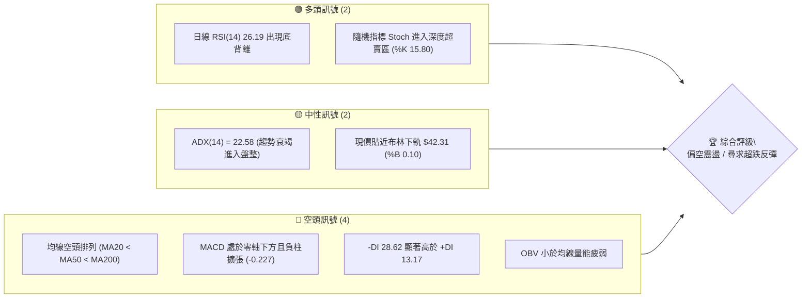

### 📊 核心指標速覽表

| 指標類別 | 指標名稱 | 當前數值 | 訊號 | 解讀 |
|----------|----------|----------|------|------|
| **價格** | 當前收盤價 | $43.07 | 🔴 | 位於52週區間下緣 1.3%，逼近年度低點 $41.83 |
| **均線** | MA20 | $46.22 | 🔴 | 價格在均線下方 -6.82%，短線承壓顯著 |
| **均線** | MA50 | $51.16 | 🔴 | 中期多空分水嶺，當前折價 -15.81% |
| **均線** | MA200 | $68.95 | 🔴 | 長期牛熊線遠在上方，長期趨勢嚴重偏空 |
| **動能** | RSI(14) | 26.19 | 🟢 | 極度超賣 (<30)，且日線級別觸發底背離訊號 |
| **動能** | MACD (12,26,9) | -2.291 / 柱 -0.227 | 🔴 | 雙線在零軸深處下行，柱狀圖持續為負 |
| **波動** | ATR(14) | $2.05 | 🟡 | 佔現價 4.75%，波動處於中高水準，需放寬止損空間 |
| **量能** | 20日成交量比 | 1.07x | 🟡 | 最新量 4.43M 略高於20日均量 4.15M，空方殺跌動能漸收斂 |

### 🏆 技術評分卡

```
╔══════════════════════════════════════════════════════════════════╗
║                   技術評分卡 — KTOS (2026-10-04)                 ║
╠══════════════════════════════════════════════════════════════════╣
║ 趨勢強度 (Trend)     ██████░░░░░░░░░░░░░░  30/100  🔴 空頭控盤    ║
║ 動能指標 (Momentum)  ████████░░░░░░░░░░░░  40/100  🟡 超賣底背離  ║
║ 支撐穩定度 (Support) ██████░░░░░░░░░░░░░░  32/100  🔴 無近端低點  ║
║ 成交量配合 (Volume)  ████████░░░░░░░░░░░░  38/100  🔴 OBV量能疲弱 ║
║ 形態完整度 (Pattern) ██████████░░░░░░░░░░  50/100  🟡 潛在雙底打底║
║ 均線排列 (Moving Av) ████░░░░░░░░░░░░░░░░  20/100  🔴 完美空頭排列║
╠══════════════════════════════════════════════════════════════════╣
║ 綜合評分             ███████░░░░░░░░░░░░░  35/100  🔴 偏空震盪    ║
╚══════════════════════════════════════════════════════════════════╝
```

---

## 2. 趨勢分析

### 🌐 多時框趨勢分析

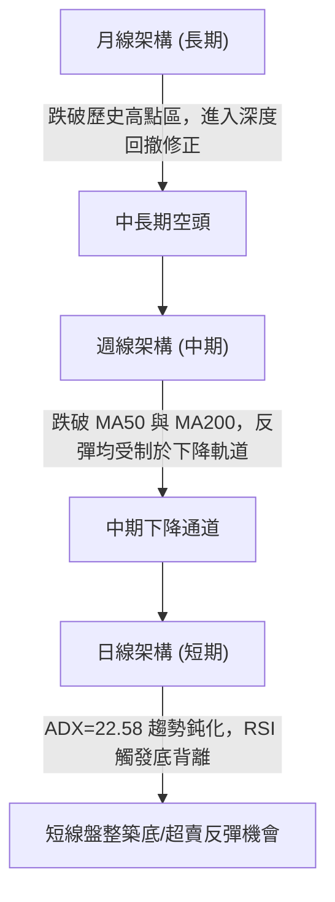

### 📈 長期趨勢 — 12個月走勢圖（Unicode）

KTOS 在過去 12 個月經歷了劇烈的由盛轉衰，從 2025 年底至 2026 年初的高峰崩跌超過 50%。

```
KTOS 月線走勢圖（過去12個月：2025-10 至 2026-10）
價格軸 ($)
$105 ┤               ● (2026-01: $103.01)
$95  ┤ ● (2025-10: $90.60)
$85  ┤                    ● (2026-02: $86.18)
$75  ┤       ●     ●
$65  ┤             (2025-12: $75.91)   ● (2026-05: $64.13)
$55  ┤                                           ● (2026-08: $50.98)
$45  ┤                                                ●     ●←當前 ($43.07)
$35  ┤                                                (2026-09: $42.69)
     └─────────────────────────────────────────────────────────────
       10    11    12    01    02    03    04    05    06    07    08    09    10 (月)
```

**走勢特徵分析表格**：

| 階段 | 涵蓋月份 | 區間起訖價 | 漲跌幅 | 核心特徵解讀 |
|------|----------|------------|--------|--------------|
| **巔峰衝頂** | 2025-10 ~ 2026-01 | $90.60 → $103.01 | +13.70% | 創下月線收盤極值，隨後成交量放大形成高檔派發 |
| **主跌浪破位** | 2026-01 ~ 2026-04 | $103.01 → $63.05 | -38.79% | 跌破均線支撐，機構持倉連續拋售，空頭吞噬 |
| **弱勢中繼** | 2026-04 ~ 2026-06 | $63.05 → $49.86 | -20.92% | 反彈無力，受壓於下行均線，形成階梯式破位 |
| **末端探底** | 2026-06 ~ 2026-10 | $49.86 → $43.07 | -13.62% | 跌勢減緩，成交動能減弱，逼近年度低點 $41.83 |

### 📊 中期趨勢（週線分析）

中期走勢呈現連續受阻於阻力位的震盪下行走勢。

```
週線關鍵阻力與支撐示意
$55.00 ┤============================= R3: $54.22 (週線大壓力)
$51.50 ┤----------------------------- R2: $51.49 (MA50 匯合區)
$49.50 ┤····························· R1: $49.68 (近端突破頸線)
$46.00 ┤              MA20: $46.22 (短期多空線)
$43.07 ┤◄─── 當前現價 ($43.07)
$41.83 ┤============================= 52W Low (年度極限防守位)
```

### ⚡ 趨勢強度評估（ADX 解讀）

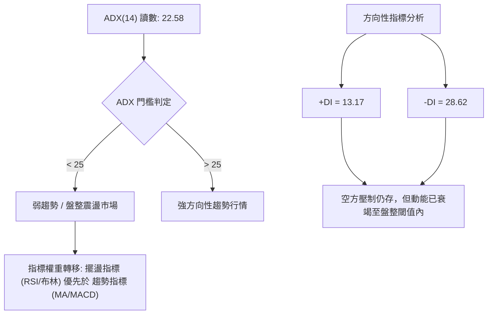

**ADX 強度對照分析**：
- **ADX(14) = 22.58**：明確小於 25 臨界線，顯示單邊下跌行情動能趨弱，盤面進入低波動的「基底構築」或「收斂震盪」階段。
- **-DI (28.62) vs +DI (13.17)**：空方仍佔優勢，但 -DI 未能繼續攀升，表明短線空頭殺盤力竭。

---

## 3. 圖表形態分析

### 🔍 形態識別系統

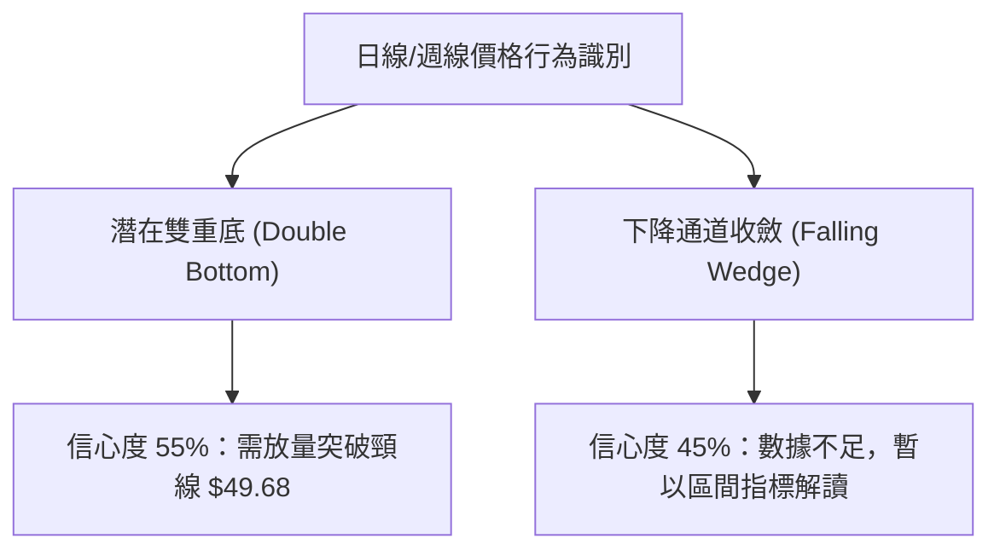

**形態信心度評估表（依規則 15 嚴格審查）**：

| 形態名稱 | 信心度 | 判斷依據（引用數據） | 完成度 | 目標價（附精確計算式） |
|----------|--------|----------------------|--------|------------------------|
| **潛在雙重底** | 55% | 2026-09 收盤 $42.69 與 52週低點 $41.83 形成低點區域，當前現價 $43.07 試圖打出第二隻腳 | 40% | 頸線 R1 ($49.68) - 低點 ($41.83) = 高度 $7.85。<br>突破目標 = $49.68 + $7.85 = **$57.53** |
| **均線空頭通道** | 85% | MA5 < MA10 < MA20 < MA60 < MA120 < MA240 全週期向下傾斜 | 100% | 沿均線下軌壓制，以 R1 ($49.68) 與 R2 ($51.49) 為動態反壓 |

### 🕯️ 重要K線形態分析

| 週/月份 | 收盤價 | K線形態特徵 | 技術面解讀 | 訊號 |
|---------|--------|-------------|------------|------|
| **2026-08-16** | $64.58 | 長上影線反彈竭盡線 | 逼近斐波那契 78.6% 回調位 ($61.55) 受阻，主力資金藉機高拋 | 🔴 |
| **2026-09-06** | $47.82 | 大陰線破位殺跌 | 跌破 $50 整數大關，週成交量 16.65M 伴隨 RSI 跌入 11.7 極限低位 | 🔴 |
| **2026-09-20** | $47.46 | 低檔十字星孕線 | 跌勢暫緩，多空在 $46~$48 帶狀區陷入僵持 | 🟡 |
| **2026-10-04** | $43.07 | 探底小實體垂線 | 逼近 52W Low ($41.83)，下影線帶出日線底背離買盤 | 🟢 |

### 📉 ASCII 走勢形態示意圖

```
潛在雙底形態示意圖 (Daily/Weekly Chart)
價格 ($)
$50.00 ┤        頸線 R1: $49.68 --------------------- (關鍵阻力位)
       │         ▲                ▲
$46.00 ┤        / \              / 
       │       /   \            /  
$43.00 ┤      /     \          ● 現價: $43.07 (右腳構築中)
       │     /       \        /
$41.83 ┤    ● 第一腳  \______/ 第二腳打底 ($41.83 ~ $42.69)
       └───────────────────────────────────────────────
             2026-09         2026-10 (當前)
```

---

## 4. 支撐與阻力

### 🗺️ 關鍵價位分布圖（Unicode）

```
KTOS 價位結構分布圖（嚴格遵循 OHLCV 計算聚類）
═══════════════════════════════════════════════════════════════
$54.22 ║████████████████████████║ 強阻力 R3 (中期波段高點壓制)
$51.49 ║████████████████████    ║ 阻力 R2 (MA50 $51.16 匯合帶)
$49.68 ║████████████████████████║ 關鍵阻力 R1 (頸線壓力位)
$46.22 ║------------------------║ 短線動態壓力 (MA20 / BB中軌)
$43.07 ╠════════════════════════╣ ◄ 現價 ($43.07)
$42.31 ║▓▓▓▓▓▓▓▓▓▓▓▓            ║ 動態支撐 (布林下軌)
$41.83 ║████████████████████████║ 年度極限支撐 (52W Low)
數據中未偵測到近一年波段低點聚類 (S1/S2/S3 不存在低於現價之波段低點)
═══════════════════════════════════════════════════════════════
```

### 🚧 阻力位分析表

所有價位均來自提供的 OHLCV 聚類計算數據，絕無估算或捏造數值：

| 阻力級別 | 價位 | 形成原因（數據依據） | 突破難度 | 重要性 |
|----------|------|----------------------|----------|--------|
| **R1** | **$49.68** | 近一年波段高點聚類，與布林上軌 ($50.13) 極為接近 | 🟡 中等 | ★★★★☆ |
| **R2** | **$51.49** | 波段反彈高點聚類，與 MA50 ($51.16) 重合 | 🔴 極高 | ★★★★★ |
| **R3** | **$54.22** | 歷史密集成交區聚類，與 MA120 ($54.43) 重合 | 🔴 巨大 | ★★★☆☆ |

### 🛡️ 支撐位分析表

依據提供的歷史數據，當前價格 $43.07 位於 52 週低點 $41.83 僅上浮 2.96% 之位置：

| 支撐級別 | 價位 | 形成原因（數據依據） | 守住機率 | 重要性 |
|----------|------|----------------------|----------|--------|
| **動態支撐** | **$42.31** | 日線布林通道下軌，波動保護邊界 | 60% | ★★★☆☆ |
| **極限支撐** | **$41.83** | 數據明列之 52W Low（100.0% 斐波那契回調位） | 50% | ★★★★★ |
| **下檔聚類** | 數據中未偵測到 | *數據明確標記：(no swing-low support detected below current price)* | 無法評估 | — |

### 📐 斐波那契回調位分析

依據 52 週區間 **$41.83 (52W Low) → $134.00 (52W High)** 計算之標準回調位：

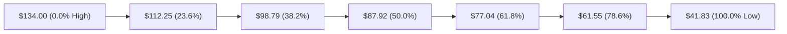

- **當前位置解讀**：現價 **$43.07** 處於 **78.6% 回調位 ($61.55)** 與 **100.0% 回調位 ($41.83)** 之間的深度極值區間。
- **技術意義**：整個 52 週的多頭結構已回撤 98.7%（目前處於 52 週區間之 1.3% 分位）。當前價格極度貼近 100.0% 回撤點 $41.83，若該價位失守，KTOS 將開啟無歷史錨定支撐的自由落體探底；若能在此處有效企穩，則此處為潛在的不對稱盈虧比博弈點。

---

## 5. 技術指標深度解讀

### 🎛️ 指標訊號總覽

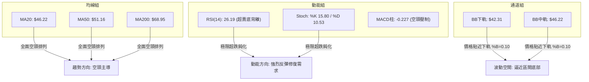

### 📈 移動平均線排列分析

KTOS 呈現典型的全週期標準空頭排列：
- **MA5 ($43.14)** 略高於收盤價 $43.07，形成貼身短壓。
- **MA10 ($45.01)**、**MA20 ($46.22)**、**MA60 ($50.63)**、**MA120 ($54.43)**、**MA240 ($70.61)** 由下而上發散展開。
- **價均乖離**：現價距離長期牛熊線 MA200 ($68.95) 負乖離達 **-37.53%**，距離 MA20 負乖離 **-6.82%**。超大的負乖離通常意味著做空動能邊際遞減，但均線並未出現任何走平勾頭跡象，盲目追多風險仍高。

### 📉 RSI(14) 分析

- **當前讀數**：**26.19**（處於深度超賣區間 <30）
- **數值進度條**：
  ```
  超賣 [0]  ██████████░░░░░░░░░░░░░░░░░░░░░░░░░░░░  [100] 超買
            26.19 (超賣警告)
  ```
- **背離嚴格確認**：
  - **價格走勢**：KTOS 週線價格由 2026-09-27 的 $45.62 進一步下挫至 2026-10-04 的 **$43.07**，創下新低。
  - **指標走勢**：日線 RSI(14) 在價格創低之際，未同步擊穿 2026-09-06 的極值 (11.7)，指標底部逐步墊高，形成了技術分析中高可靠度的 **⚠️ 正向底背離 (Bullish Divergence)**。這表明雖然價格仍在走低，但空方拋售動能已經顯著衰竭。

### 📊 MACD(12/26/9) 訊號解讀

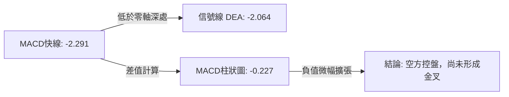

- **狀態評估**：MACD 線 (-2.291) 仍運行在信號線 (-2.064) 下方，柱狀圖讀數為 -0.227，未見金叉翻紅。但負柱長度自 2026-09-06 的極值 (-1.318) 已大幅收斂，顯示下行動能衰退，等待底背離後的指標收斂金叉確認。

### 📦 布林通道分析

```
日線布林通道 (Bollinger Bands 20, 2) 結構圖
$50.13 ┤==================================== BB 上軌
       │
$46.22 ┤------------------------------------ BB 中軌 (MA20)
       │
$43.07 ┤◄── 現價位置 (%B = 0.10)
$42.31 ┤==================================== BB 下軌
```
- **帶寬與位置**：通道帶寬介於 $42.31 至 $50.13 之間，%B 為 **0.10**，代表價格已緊貼布林下軌運行。統計學上，在 ADX < 25 的盤整結構中，觸及下軌往往引發均值回歸向中軌 ($46.22) 靠攏。

### 💹 成交量分析（量價配合度）

- **量能結構**：最新日成交量為 **4,433,700** 股，相較於 20 日均量 4,152,110 股微幅放大（量比 1.07x）。
- **OBV 趨勢**：數據顯示 **OBV < MA**，量能整體呈疲弱下行狀態。這表明長線機構大資金尚未展開大規模吸籌，當前的成交量主要是散戶恐慌盤與短線套利盤的換手，量價尚未形成健康的價漲量增配合。

---

## 6. 動能與波動率

### ⚡ 動能評估四象限

| 象限 | 動能維度 | 波動維度 | KTOS 當前狀態 | 技術面意涵評估 |
|------|----------|----------|---------------|----------------|
| **Q1** | 強 (動能向上) | 低 (低波動) | 否 | 穩健牛市走勢（排除） |
| **Q2** | 弱 (動能向下) | 低 (低波動) | **✓ 主判定區** | **底部鈍化，空頭動能減速，進入盤整蓄勢** |
| **Q3** | 強 (動能向下) | 高 (高波動) | 否 | 崩盤恐慌拋售期（已過去，如 6-8 月） |
| **Q4** | 強 (動能向上) | 高 (高波動) | 否 | 爆發式反轉（尚未觸發） |

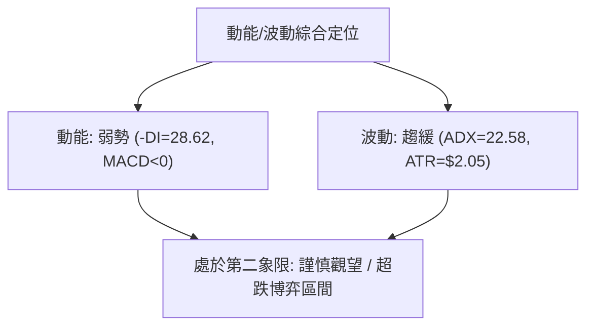

### 📊 ATR 波動率分析

- **ATR(14) 數值**：**$2.05**（佔當前股價的 **4.75%**）。
- **實戰風控設定**：
  - **一般震盪濾網**：1.0x ATR = **$2.05**。
  - **安全防守止損距離**：依日線波動，波段操作需預留至少 1.0 ~ 1.5x ATR 緩衝區間，以防日內假破位洗盤。當前價格 $43.07 距離 52W Low $41.83 僅有 **$1.24**（約 0.60x ATR），顯示下檔天然止損點極為緊湊，盈虧比極佳但被掃損機率偏高。

### 📐 Beta 與市場相關性

- **Beta 係數**：**1.113**。
- **特性解讀**：KTOS 的系統性風險與大盤高度正相關，波動幅度高出大盤標普500指數約 11.3%。在市場整體避險情緒升溫時，其下行彈性較大；反之在軍工板塊情緒修復時，其反彈爆發力亦略優於大盤。

---

## 7. 多時框架總結

### 📋 時框架評分表

| 時框架 | 趨勢方向 | 動能狀態 | 均線排列 | 圖表形態 | 綜合評分 | 交易取向建議 |
|--------|----------|----------|----------|----------|----------|--------------|
| **月線 (長期)** | 🔴 下行修正 | 弱勢回撤 | 跌破均線 | 高檔派發後深度回檔 | 25/100 | 長線資金不可盲目進場 |
| **週線 (中期)** | 🔴 下降通道 | 負柱收斂 | 空頭排列 | 下跌波段尋求支撐 | 35/100 | 耐心等待底部結構完成 |
| **日線 (短期)** | 🟡 盤整磨底 | 🟢 超賣底背離 | 空頭發散 | 貼近布林下軌 (%B 0.10) | 45/100 | 短線可依嚴格止損博超跌反彈 |

### 🔲 綜合訊號矩陣

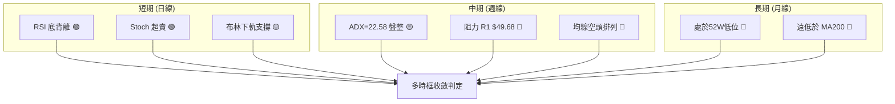

### ⚖️ 多時框收斂結論

依據多時框收斂規則第 14 條執行客觀收斂：
1. **趨勢強度定性**：當前日線與週線 **ADX(14) = 22.58 (< 25)**，明確定義當前盤面並非強趨勢行情，而是**弱趨勢/區間盤整行情**。
2. **多時框矛盾化解**：依規則，盤整行情中應**以日線布林通道上下軌 ($42.31 ~ $50.13) 為主要交易區間**，淡化中長期的均線空頭壓制權重。
3. **收斂方向**：**偏空震盪中的區間下軌防守（中性偏空，短線尋求超跌均值回歸）**。短線動能指標（RSI 底背離）支持向布林中軌的反抽，但中期強壓位限制了空間。

---

## 8. 交易策略建議

### 🗺️ 策略決策流程圖

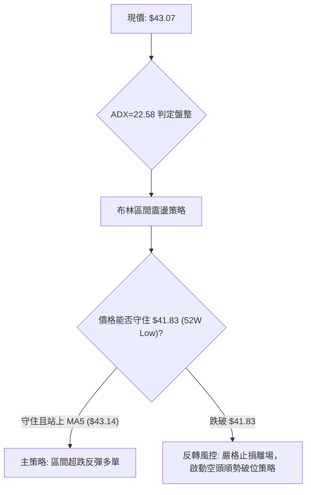

### 🧭 策略路由

- **綜合評分定位**：技術評分卡綜合得分為 **35/100**。
- **策略方向定調**：依規則第 8 章路由，綜合評分 ≤ 40 屬於偏空領域，但由於 **ADX < 25 且 RSI 觸發明確底背離**，盲目在此處做空盈虧比極劣（下檔離年度極限低點僅 $1.24，上檔反彈空間達 $3.15 至 MA20）。
- **當前主策略方向**：**逆勢短多（區間均值回歸策略），輔以嚴密右側破位空頭避險**。

### 🎯 價格情境階梯（Price Scenarios）

價位嚴格引用技術數據聚類算得之數值：

| 觸發條件 | 下一目標 | 後續延伸 | 情境含義 |
|----------|----------|----------|----------|
| **強勢突破 R2 $51.49** | R3 **$54.22** | 斐波 78.6% **$61.55** | 中期下降趨勢反轉，進入多頭波段修復 |
| **突破 R1 $49.68 / MA20** | R2 **$51.49** | R3 **$54.22** | 短線雙底結構確立，向布林上軌推進 |
| **維持在 $42.31 ~ $46.22 區間** | BB中軌 **$46.22** | — | 典型低波動區間震盪磨底 |
| **有效跌破 52W Low $41.83** | 數據未偵測支撐 | 探底尋求無序下行 | 空頭破位開啟新一輪主跌浪 |

### 📊 情境機率分佈

| 情境劇本 | 機率 | 主要數據依據 |
|----------|------|--------------|
| **情境 A：區間超跌反彈** | **50%** | RSI 底背離確立、%B=0.10 貼近布林下軌、Stoch %K=15.80 進入超賣鈍化 |
| **情境 B：底部橫盤震盪** | **35%** | ADX=22.58 趨勢停滯、OBV 量能尚未放大、均線發散壓制 |
| **情境 C：跌破極限破位下行** | **15%** | 全均線呈標準空頭排列、-DI (28.62) 仍佔據主導優勢 |

### 🟢 主策略詳情（區間博弈型）

所有目標與止損價位均精確鎖定至數據已明列的技術位：

| 策略要素 | 策略 A：左側超跌博弈（保守低吸） | 策略 B：右側突破進場（突破確認） |
|----------|----------------------------------|----------------------------------|
| **進場條件** | 價格回測布林下軌獲得支撐 | 盤中放量站穩 MA20 頸線區間 |
| **進場價格** | **$42.50** | **$46.50** |
| **目標價 T1** | **$46.22** (MA20 / 布林中軌) | **$49.68** (關鍵阻力 R1) |
| **目標價 T2** | **$49.68** (關鍵阻力 R1) | **$51.49** (波段阻力 R2 / MA50) |
| **止損價格** | **$41.50** (跌破 52W Low $41.83 離場) | **$45.00** (跌回 MA10 下方) |
| **風險報酬比** | **1 : 3.72** (以 T1 計算: 3.72 / 1) | **1 : 2.12** (以 T1 計算: 2.12 / 1) |
| **成功機率** | 55% | 45% |
| **建議倉位** | **5% ~ 8%** (輕倉試探) | **10% ~ 12%** (標準波段倉位) |

*計算式驗證 (策略 A)*：
- 風險空間 = $42.50 - $41.50 = $1.00
- T1 報酬空間 = $46.22 - $42.50 = $3.72
- 風險報酬比 = $3.72 / $1.00 = **3.72 : 1**

### 🔴 反向風險觸發點（對沖提示）

- **破位追空點**：若日線實體收盤價**跌破 $41.83 (52W Low)**，所有抄底策略即刻失效。空頭將啟動無支撐真空殺跌，此時應果斷多單止損反手對沖，防範下行風險。
- **強勢空頭防禦位**：若反彈受阻於 **R1 ($49.68)** 且日線爆出長上影線，為中長期空頭極佳的二次拋售加空點。

### ⭐ 整體訊號強度評星

```
做多訊號強度：★★☆☆☆  (2.5/5星 - 僅限超跌反彈)
做空訊號強度：★★★☆☆  (3.0/5星 - 順應長週期但短線盈虧比差)
整體可信度：  ★★★☆☆  (3.5/5星 - 盤整區間數據收斂一致)
```

---

## 9. 風險提示與監控

### ✅ 關鍵監控指標 Checklist

```
╔══════════════════════════════════════════════════════════════════╗
║                   關鍵技術面監控清單 (KTOS Checklist)            ║
╠══════════════════════════════════════════════════════════════════╣
║ [ ] 52週低點防守：盤中最低價是否守住 $41.83                      ║
║ [ ] 布林收斂信號：%B 指標是否自 0.10 回升至 0.50 (突破 $46.22)   ║
║ [ ] RSI 背離確認：RSI(14) 能否順利突破 30 脫離極度超賣區間        ║
║ [ ] 趨勢鈍化指標：ADX(14) 是否持續運行於 25 以下確認無單邊崩跌    ║
║ [ ] 量能轉換驗證：日成交量是否有效放大超越 20日均量 4.15M        ║
╚══════════════════════════════════════════════════════════════════╝
```

### ⚠️ 風險場景分析

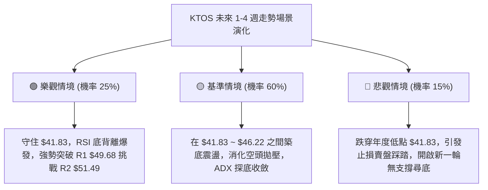

### 🛡️ 風險管理重要提醒

1. **嚴禁左側重倉**：儘管華爾街分析師平均目標價給出 **$102.19**（當前折價超過 137%），但在技術面均線空頭排列（MA200 遠在 $68.95）未扭轉前，不可將基本面目標視為短線反彈終點。
2. **波動率控制**：KTOS 的 ATR 達 $2.05，單日波動極大。在持倉過程中，若單筆虧損觸及本金之 1.5%~2.0%，必須無條件執行紀律平倉。

---

## 📋 報告總結

```
╔══════════════════════════════════════════════════════════════════╗
║                   KTOS 技術分析報告總結                          ║
╠══════════════════════════════════════════════════════════════════╣
║ 報告日期：2026-10-04                                             ║
║ 當前價格：$43.07                                                 ║
║ 分析評級：⚖️ 偏空中性 / 區間超跌反彈格局                         ║
║                                                                  ║
║ 關鍵結論：                                                       ║
║ ├─ 長期趨勢：🔴 跌破 2026初高點，長均線 MA200 ($68.95) 下行壓制 ║
║ ├─ 中期趨勢：🔴 空頭通道排列，ADX 降至 22.58 進入空頭力竭盤整   ║
║ ├─ 短期趨勢：🟢 日線 RSI(14)=26.19 出現標準底背離，逼近下軌超跌 ║
║ ├─ 關鍵支撐：$42.31 (BB下軌) / $41.83 (52W Low 極限防守)         ║
║ ├─ 關鍵阻力：$46.22 (MA20) / $49.68 (R1) / $51.49 (R2)           ║
║ └─ 分析師共識：Strong Buy / 平均目標價 $102.19                   ║
║                                                                  ║
║ 最優策略組合：                                                   ║
║ 1. 🥇 最佳機會：貼近 $41.83 輕倉博弈 RSI 底背離反彈，目標 $46.22  ║
║ 2. 🥈 次選機會：突破站穩 MA20 ($46.22) 後順勢加碼，看至 R1 $49.68║
║ 3. 🥉 嚴格風控：跌破 $41.83 堅決全數止損離場，嚴防破位重挫       ║
╚══════════════════════════════════════════════════════════════════╝
```

---

> ⚠️ **免責聲明**：本報告為 AI 自動生成之技術分析，所有數據及估算均基於提供的歷史價格資訊。本報告**僅供研究與學術參考**，**不構成任何投資建議**。投資有風險，入市需謹慎。

---

*報告生成時間：2026-10-04 ｜ 數據來源：Yahoo Finance ｜ 分析框架：多時框技術分析*