# KTOS 技術分析報告

> **報告日期**：2026-10-05 ｜ **語言**：繁體中文 ｜ **數據來源**：Yahoo Finance ｜ **當前價格**：$43.07

---

## 目錄

| 章節 | 內容 |
|------|------|
| [1. 技術面概覽](#1-技術面概覽) | 訊號儀表板、核心指標、評分卡 |
| [2. 趨勢分析](#2-趨勢分析) | 多時框趨勢、長中短期走勢 |
| [3. 圖表形態分析](#3-圖表形態分析) | 形態識別、K線組合、目標價 |
| [4. 支撐與阻力](#4-支撐與阻力) | 關鍵價位、斐波那契回調 |
| [5. 技術指標深度解讀](#5-技術指標深度解讀) | MA/RSI/MACD/布林/成交量 |
| [6. 動能與波動率](#6-動能與波動率) | 動能評估、ATR、Beta |
| [7. 多時框架總結](#7-多時框架總結) | 時框架評分矩陣 |
| [8. 交易策略建議](#8-交易策略建議) | 多空策略、風險報酬比 |
| [9. 風險提示與監控](#9-風險提示與監控) | 監控指標、風險場景 |

---

## 1. 技術面概覽

### 🎯 技術訊號儀表板

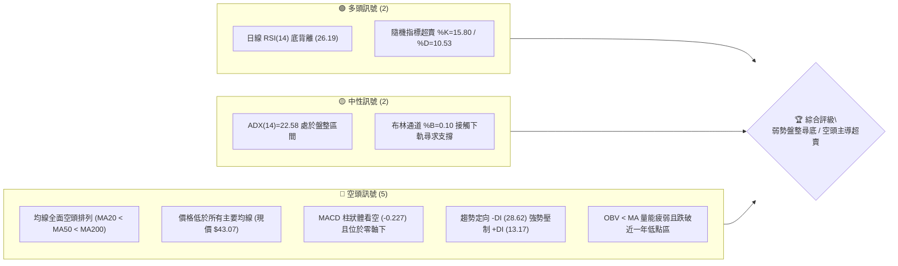

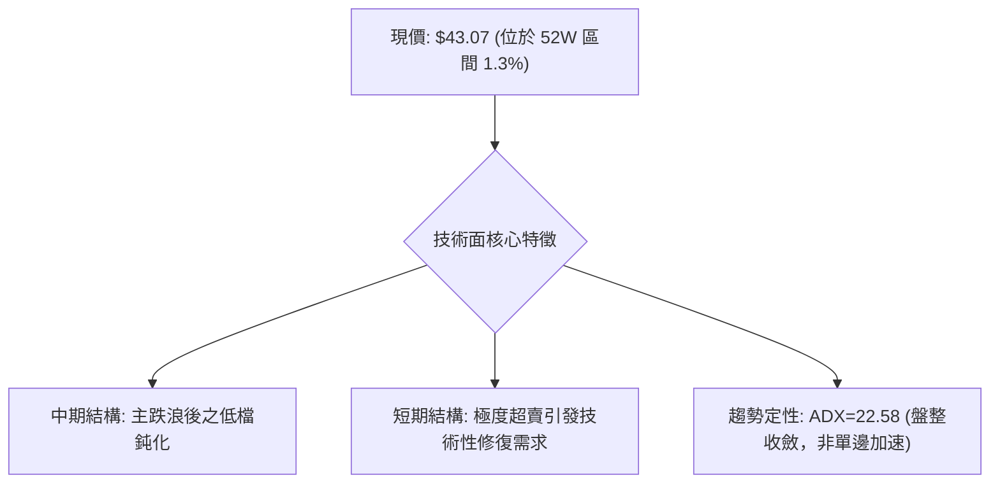

### 📊 核心指標速覽表

| 指標類別 | 指標名稱 | 當前數值 | 訊號 | 解讀 |
|----------|----------|----------|------|------|
| **價格** | 當前價格 | $43.07 | 🔴 | 貼近 52 週最低價 $41.83，空方完全控盤 |
| **均線** | MA20 | $46.22 | 🔴 | 現價低於 MA20 達 -6.82%，短期下行阻力沉重 |
| **均線** | MA50 | $51.16 | 🔴 | 現價低於 MA50 達 -15.81%，中期下行趨勢確立 |
| **均線** | MA200 | $68.95 | 🔴 | 現價低於 MA200 達 -37.53%，長期走勢處於深熊 |
| **動能** | RSI(14) | 26.19 | 🟢 | 深度超賣 (<30)，且存在日線底背離修復訊號 |
| **動能** | MACD | -2.291 | 🔴 | DIF 與 DEA 雙雙位於負值區，柱體為負 (-0.227) |
| **趨勢** | ADX(14) | 22.58 | 🟡 | 趨勢強度低於 25，單邊動能趨緩，進入震盪磨底 |
| **通道** | 布林通道 | 下軌 $42.31 | 🟡 | %B 為 0.10，價格壓迫下軌，具備均值回歸彈性 |
| **量能** | 20日成交量比 | 1.07x | 🟡 | 量能微幅放大（4.43M vs 4.15M），OBV 仍顯疲弱 |
| **波動** | ATR(14) | $2.05 | 🟡 | 每日平均波動幅度約 4.75%，波動率相對平穩 |

### 🏆 技術評分卡

```
╔══════════════════════════════════════════════════════════════╗
║              技術評分卡 — KTOS (2026-10-05)                  ║
╠══════════════════════════════════════════════════════════════╣
║ 趨勢強度      ██████░░░░░░░░░░░░░░  30/100  🔴 空頭壓制       ║
║ 動能指標      ████████░░░░░░░░░░░░  42/100  🟡 超賣背離       ║
║ 支撐穩定度    ████░░░░░░░░░░░░░░░░  20/100  🔴 無結構性支撐   ║
║ 成交量配合    ████████░░░░░░░░░░░░  38/100  🔴 量能未見攻擊   ║
║ 形態完整度    ██████░░░░░░░░░░░░░░  30/100  🔴 破位下行整理   ║
║ 均線排列      ██░░░░░░░░░░░░░░░░░░  12/100  🔴 典型空頭排列   ║
╠══════════════════════════════════════════════════════════════╣
║ 綜合評分      ██████░░░░░░░░░░░░░░  28/100  🔴 強烈偏空       ║
╚══════════════════════════════════════════════════════════════╝
```

---

## 2. 趨勢分析

### 🌐 多時框趨勢分析

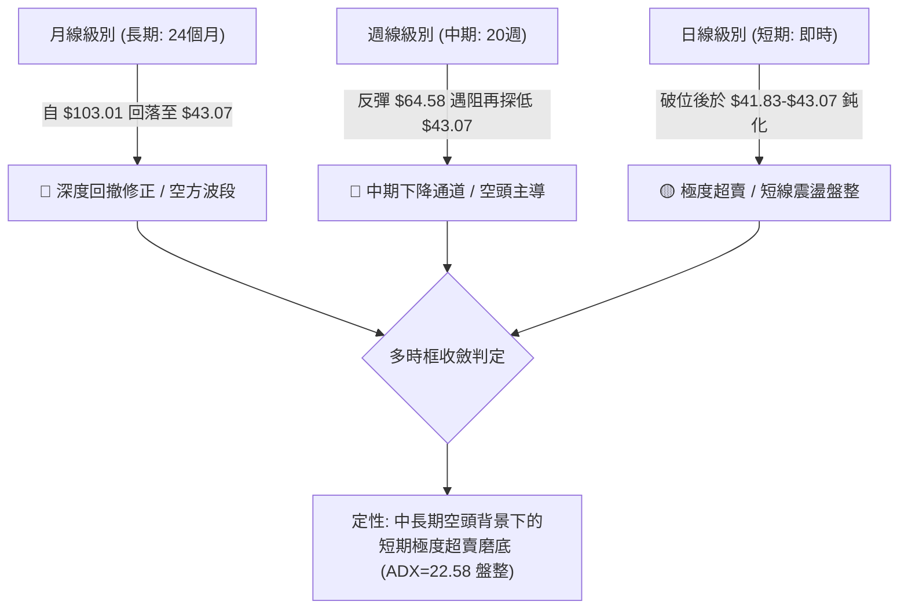

### 📈 長期趨勢 — 12個月走勢圖（Unicode）

```
KTOS 月線走勢圖（2025-10 至 2026-10）
價格軸 ($)
$105 ┤                               ●(2026-01: $103.01)
$95  ┤ ●(2025-10: $90.60)
$85  ┤                                       ●(2026-02: $86.18)
$75  ┤         ●           ●(2025-12: $75.91)
$65  ┤                                               ●(2026-03: $70.51)
$55  ┤                                                       ●(2026-05: $64.13)
$45  ┤                                                               ●       ●←現價 $43.07
$35  ┤                                                                   ●(2026-09: $42.69)
     └─────────────────────────────────────────────────────────────────────────────
       10      11          12        01      02      03      05      08      10 (月份)
```

#### 走勢特徵分析表格

| 階段區間 | 期間最高/最低收盤 | 漲跌幅 | 結構性特徵與量價行為 |
|----------|-------------------|--------|----------------------|
| **2025-10 ~ 2026-01** | $75.91 → $103.01 | +35.70% | 最後衝刺浪，於 2026-01 創下歷史級月線高點 $103.01 後見頂 |
| **2026-01 ~ 2026-04** | $103.01 → $63.05 | -38.79% | 頂部快速破位下跌，各短中期均線失守，形成瀑布式下殺 |
| **2026-04 ~ 2026-08** | $63.05 → $64.58 | +2.43% | 築構雙頂弱勢反彈平台，多次挑戰 $64 阻力未能站穩 |
| **2026-08 ~ 2026-10** | $64.58 → $43.07 | -33.31% | 次級主跌浪宣洩，直接逼近 52 週最低點 $41.83，創波段收盤新低 |

### 📊 中期趨勢（週線分析）

```
KTOS 週線結構阻力與低檔示意圖
═════════════════════════════════════════════════════════════════
$64.58 ─── 強阻力高點 (2026-08-16 收盤，RSI=76.7)
          │
$57.17 ─── 頸線破位點 (2026-08-23 收盤，MACD由正轉負)
          │
$47.46 ─── 反彈弱勢受阻點 (2026-09-20 收盤)
          │
$43.07 ─── 現價位置 (2026-10-04 收盤，RSI=26.2，MACD柱=-0.227)
          │
$41.83 ─── 52 週絕對低點 (支撐考驗區間)
═════════════════════════════════════════════════════════════════
```

### ⚡ 趨勢強度評估（ADX 解讀）

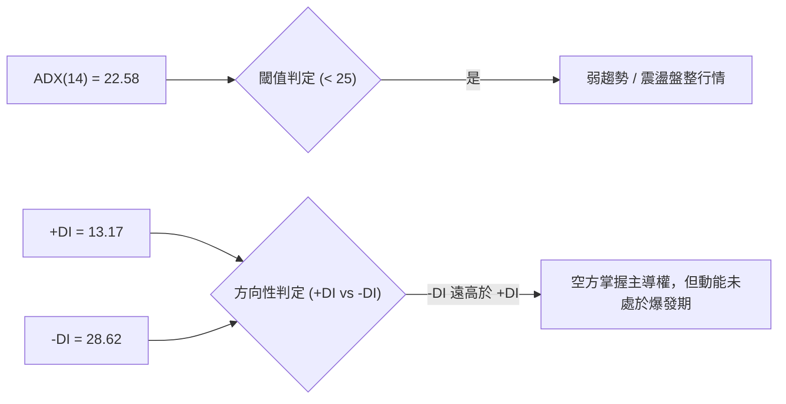

| 指標項目 | 數值 | 參考標準 | 趨勢解讀 |
|----------|------|----------|----------|
| **ADX(14)** | 22.58 | > 25: 單邊強趨勢；< 25: 弱趨勢/區間震盪 | 當前處於弱趨勢震盪磨底，非加速暴跌狀態 |
| **+DI(14)** | 13.17 | > 20 為多方強勢 | 多方力量嚴重渙散，上攻動能匱乏 |
| **-DI(14)** | 28.62 | > 25 為空方壓制 | 空方力量占優，但由於 ADX 走平，未演變為失控重挫 |

---

## 3. 圖表形態分析

### 🔍 形態識別系統

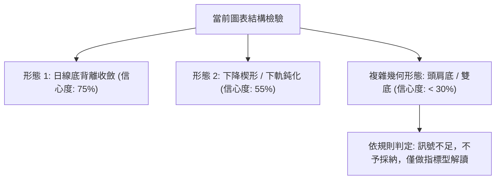

#### 圖表形態信心度評估表

| 形態名稱 | 信心度 | 判斷依據（引用數據） | 完成度 | 目標價（附計算式） |
|----------|--------|----------------------|--------|--------------------|
| **日線 RSI 底背離收斂** | 75% | 價格創波段新低 $43.07，日線 RSI(14) 報 26.19 且出現底背離警示 | 80% | 第一目標為布林中軌 MA20: $46.22；第二目標為 R1: $49.68 |
| **布林通道下軌壓迫超賣** | 70% | 布林 %B=0.10，價格緊貼下軌 $42.31，脫離中軌達 -6.82% | 85% | 均值回歸目標為布林中軌 $46.22 |
| **下降通道末端延伸** | 55% | 價格由 2026-08 高點 $64.58 階梯下行至現價 $43.07 | 90% | 通道上軌阻力為 MA50: $51.16 |
| **雙底形態** | 20% | 數據中未偵測到下方波段低點聚類，無第二個確認右底 | 15% | 訊號不足，僅做指標型解讀，不預設雙底目標價 |

### 🕯️ 重要K線形態分析

| 週/月區間 | 收盤價 | K線形態特徵 | 技術解讀 | 訊號 |
|-----------|--------|-------------|----------|------|
| **2026-08-16 週** | $64.58 | 長上影線高檔滯漲棒 | 多方衝頂衰竭，週線 RSI 達 76.7 嚴重超買 | 🔴 |
| **2026-08-30 週** | $52.00 | 中長陰線貫穿破位 | 跌破所有短期均線，週 MACD 柱翻負 (-1.211) | 🔴 |
| **2026-09-06 週** | $47.82 | 大陰線加速探底 | 週線 RSI 跌至 11.7 極端超賣，量能維持 16.6M | 🔴 |
| **2026-09-20 週** | $47.46 | 弱勢小陽十字星反彈 | 弱勢修復，受阻於日線 MA20 下方，無量反抽 | 🟡 |
| **2026-10-04 週** | $43.07 | 實體陰線逼近低點 | 逼近 52 週低點 $41.83，空頭動能減速但依然控盤 | 🔴 |

### 📉 ASCII 走勢形態示意圖

```
KTOS 近三個月日/週線下降台階與現價超賣結構
$64.58 ──┐ (8月中旬反彈頂部)
         │  
         └───┐ $57.17 (破位跌水點)
             │
             └───┐ $52.00 (加速下殺)
                 │
                 └───┐ $47.46 (弱勢反抽高點)
                     │
                     └───┐ 現價 $43.07 (貼近下軌 $42.31)
                         │
                         ▼ $41.83 (52W 最低點防線)
```

### 🎯 形態目標價計算

依據日線「RSI 底背離」與「布林通道下軌超賣均值回歸」形態計算：
- **形態底點基準**：52 週低點聚類支撐 $41.83
- **均值回歸頸線/第一阻力**：布林中軌（MA20）= **$46.22**
  - 理論修復空間：`$46.22 - $43.07 = +$3.15 (+7.31%)`
- **波段高點阻力/第二阻力**：波段高點聚類 R1 = **$49.68**
  - 理論修復空間：`$49.68 - $43.07 = +$6.61 (+15.35%)`

---

## 4. 支撐與阻力

### 🗺️ 關鍵價位分布圖（Unicode）

```
KTOS 價位結構分布圖
═══════════════════════════════════════════════════════════════
$54.22 ║██████████████████████████████║ 強阻力 R3 (+25.89%)
$51.49 ║████████████████████░░░░░░░░░░║ 中期阻力 R2 (+19.55%)
$49.68 ║████████████████████████░░░░░░║ 關鍵阻力 R1 (+15.35%)
$46.22 ║▓▓▓▓▓▓▓▓▓▓▓▓▓▓▓▓▓▓░░░░░░░░░░░░║ 短線均線阻力 MA20 / BB中軌
$43.07 ╠══════════════════════════════╣ ◄ 現價 ($43.07)
$42.31 ║▒▒▒▒▒▒▒▒▒▒▒▒▒▒░░░░░░░░░░░░░░░░║ 動態布林下軌 (BB Lower)
$41.83 ║██████████████████████████████║ 52週絕對低點 (52W Low / 100% Fib)
═══════════════════════════════════════════════════════════════
```

### 🚧 阻力位分析表

所有價位均嚴格引用 OHLCV 計算之波段高點聚類數據：

| 阻力級別 | 價位 | 形成原因 | 突破難度 | 重要性 |
|----------|------|----------|----------|--------|
| **R1** | $49.68 | 近一年波段高點聚類第一層，緊鄰布林上軌 $50.13 | 高 🔴 | 極高：短線多空反轉分水嶺 |
| **R2** | $51.49 | 近一年波段高點聚類第二層，重合 MA50 ($51.16) | 極高 🔴 | 中期空頭生命線壓制區 |
| **R3** | $54.22 | 近一年波段高點聚類第三層，重合 MA120 ($54.43) | 堅不可摧 🔴 | 中期強弱牛熊分界線 |

### 🛡️ 支撐位分析表

依據數據揭示，當前價位下方無波段低點聚類支撐（no swing-low support detected below current price）：

| 支撐級別 | 價位 | 形成原因 | 守住機率 | 重要性 |
|----------|------|----------|----------|--------|
| **S1 (動態)** | $42.31 | 布林通道下軌動態包絡支撐 | 60% 🟡 | 短期均值回歸重要防守位 |
| **S2 (極值)** | $41.83 | 52 週絕對低點 (52W Low) 及斐波那契 100% 回調位 | 50% 🟡 | 多方最後心理關卡，破位將進入真空跌勢 |
| **S3 (延伸)** | 數據未偵測到 | 下方無歷史聚類支撐數據 | -- | 數據中未偵測到，若跌破 $41.83 下方無錨定點 |

### 📐 斐波那契回調位分析

依據 52 週極值區間（高點 $134.00 → 低點 $41.83）嚴格計算之黃金分割架構：

```
斐波那契回調水平線
0.0%  (52W High) ─────────────────────────── $134.00
23.6%            ─────────────────────────── $112.25
38.2%            ─────────────────────────── $98.79
50.0%            ─────────────────────────── $87.92
61.8%            ─────────────────────────── $77.04
78.6%            ─────────────────────────── $61.55
──────────────── 現價區間 ($43.07) ───────────────
100.0% (52W Low) ─────────────────────────── $41.83
```

- **位置判定**：現價 $43.07 目前處於 **78.6% 回調位 ($61.55) 與 100.0% 極端低點 ($41.83)** 之間，且距離 100.0% 僅差 $1.24 (+2.96%)。
- **技術意義解讀**：價格完全吞沒了整波牛市漲幅的 98% 以上。這意味著自 $134.00 以來的下跌已進入極度深水區，技術面上屬於「終極回撤檢驗」。若 $41.83 失守，將形成全週期破位。

---

## 5. 技術指標深度解讀

### 🎛️ 指標訊號總覽

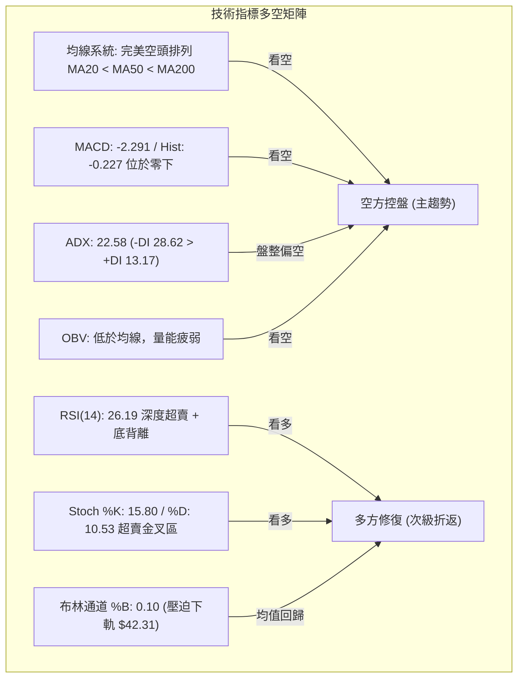

### 📈 移動平均線排列分析

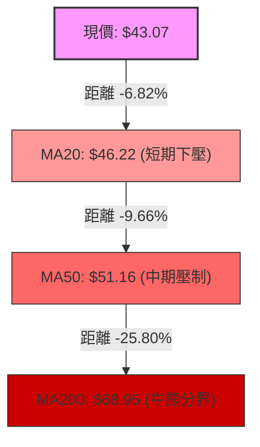

均線呈現教科書般的空頭發散排列：
- **MA5 ($43.14)**：現價緊貼 5 日線，短線下跌角度微幅放緩。
- **MA20 ($46.22)** 與 **MA60 ($50.63)**：呈穩定向下發散狀態，中期趨勢下壓斜率陡峭。
- **MA200 ($68.95)** 與 **MA240 ($70.61)**：長期均線遠高於現價 39% 以上，確認長期處於熊市結構中。

### 📉 RSI(14) 分析

```
RSI(14) 強度儀表
0       20     30             50             70     80      100
├───────┼──────┼──────────────┼──────────────┼──────┼───────┤
│極端超賣│超賣區 │            中性區            │超買區 │極端超買│
└───────┴──────┴──────────────┴──────────────┴──────┴───────┘
  ▲ 26.19 (當前位置: 深度超賣)
```

- **超賣狀態**：RSI(14) 讀數為 **26.19**，已深度跌破 30 超賣門檻。
- **背離判斷**：日線圖上明確顯現 **⚠️ 底背離（Bullish Divergence）**。當價格持續創下近期收盤新低之際，RSI 指標線低點未再進一步深跌，反而呈現底部抬高形態，顯示空方動能消耗過度，隨時存在技術性反抽動能。

### 📊 MACD(12/26/9) 訊號解讀

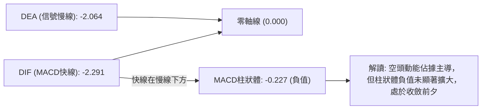

- 快線 DIF (-2.291) 低於慢線 DEA (-2.064)，MACD 柱狀體為 **-0.227**，確認空方波段仍在延續。
- 值得注意的是，週線 MACD 柱狀體已由 2026-08-30 的 -1.211 收斂至當前的 -0.227，中週期下殺動能已初步出現減速徵兆。

### 📦 布林通道分析

```
布林通道 (20, 2) 結構示意圖
$50.13 ─────────────────────────────── 上軌 (Upper Band)
       
$46.22 ─────────────────────────────── 中軌 (MA20)
       
$43.07 ═══════════════════════════════ 現價 (%B = 0.10)
$42.31 ─────────────────────────────── 下軌 (Lower Band)
```

- 當前通道寬度帶為 `$50.13 - $42.31 = $7.82`。
- **%B 指標為 0.10**，代表價格處於通道底部 10% 的極端下邊緣。在統計學常態分佈下，價格穿出下軌後容易產生回歸中軌（$46.22）的牽引力。

### 💹 成交量分析（量價配合度）

- **量比與均量**：最新成交量為 **4,433,700**，高於 20 日均量（4,152,110），量比達 **1.07x**；高於 50 日均量（3,822,888）。
- **OBV（能量潮）解讀**：數據顯示 `OBV < MA → 量能疲弱`。雖然最新成交量微幅放大，但量能增長主要發生在下跌收黑過程中，資金並未顯現出左側大舉抄底的跡象，量價關係為典型的「量縮陰跌、放量微跌」之弱勢配合。

---

## 6. 動能與波動率

### ⚡ 動能評估四象限

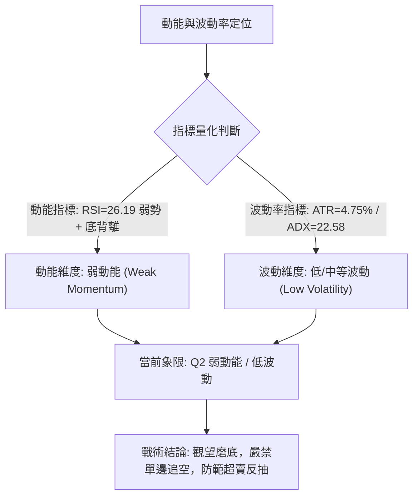

| 象限標籤 | 動能特徵 | 波動特徵 | 歷史匹配環境 | KTOS 當前狀態判定 |
|----------|----------|----------|--------------|-------------------|
| **Q1** | 強動能 (多方) | 高波動 | 主升浪突破爆發 | 不符合 |
| **Q2** | 弱動能 (空方鈍化) | 低/中波動 | 下跌末期低檔盤整 | **✓ 完全符合 (ADX=22.58, ATR=4.75%)** |
| **Q3** | 強動能 (單邊主跌) | 高波動 | 瀑布式崩盤暴跌 | 不符合 (ADX 未突破 25) |
| **Q4** | 震盪無動能 | 極低波動 | 橫盤窄幅無聊走勢 | 不符合 |

### 📊 ATR 波動率分析

- **ATR(14) 數值**：**$2.05**，佔現價百分比為 **4.75%**。
- **每日預期波動區間**：
  - 上檔波動上限：`$43.07 + $2.05 = $45.12`
  - 下檔波動下限：`$43.07 - $2.05 = $41.02`
- **止損與風控設置建議**：
  - 由於日內波動達 $2.05，任何戰術操作的止損緩衝距離應至少設為 `1.0 ~ 1.5 倍 ATR`（即 **$2.05 ~ $3.08**），以避免在 $41.83 關鍵低點附近遭到日常市場噪音掃損出場。

### 📐 Beta 與市場相關性

- **Beta 係數**：**1.113**。
- **特性評估**：KTOS 的波動幅度比標普 500 大盤高出約 11.3%。在防禦與軍工板塊中，1.113 的 Beta 顯示其兼具成長型高科技國防股特徵，對大盤系統性流動性收縮極為敏感，這解釋了其在回調階段出現高達 -38% 至 -58% 深度回撤的原因。

---

## 7. 多時框架總結

### 📋 時框架評分表

| 時框架 | 趨勢方向 | 動能 (Momentum) | 均線排列 | 圖表形態 | 綜合評分 | 操作建議 |
|--------|----------|-----------------|----------|----------|----------|----------|
| **月線級別** | 下行破位 🔴 | 極度疲弱 (-DI主導) | 空頭排列 (低於MA240) | 自頂部 $103 大回撤 | 20/100 🔴 | 戰略底倉暫緩進場 |
| **週線級別** | 空頭延續 🔴 | MACD 柱收斂負值區 | MA20/50 下行死叉 | 下降通道壓制 | 28/100 🔴 | 逢反彈減磅 |
| **日線級別** | 弱勢盤整 🟡 | RSI(14)=26.19 底背離 | 短期均線壓制 | 逼近下軌超賣鈍化 | 36/100 🟡 | 超短線博弈均值回歸 |

### 🔲 綜合訊號矩陣

```
訊號維度對照表
┌───────────┬─────────────┬─────────────┬─────────────┐
│ 分析維度  │  短期 (日線)│  中期 (週線)│  長期 (月線)│
├───────────┼─────────────┼─────────────┼─────────────┤
│ 趨勢方向  │    弱盤整   │    空頭     │    空頭     │
│ 均線系統  │  MA5/20壓制 │ MA50加速下壓│ 低於MA200/240│
│ 動能狀態  │  超賣底背離 │   負值收斂  │   空方主導  │
│ 成交量能  │  量比 1.07x │  維持中等量 │   量能遞減  │
│ 關鍵阻力  │  MA20:$46.22│  R1: $49.68 │  R3: $54.22 │
│ 關鍵支撐  │  下軌:$42.31│  52W:$41.83 │  52W:$41.83 │
└───────────┴─────────────┴─────────────┴─────────────┘
```

### ⚖️ 多時框收斂結論

> **依嚴格要求 14 進行權威收斂判斷**：
> 1. **行情性質判定**：當前 ADX(14) 讀數為 **22.58 (< 25)**，技術面嚴格定義為 **「盤整行情 / 趨勢減速區間」**。
> 2. **主導維度收斂**：在 ADX < 25 的盤整結構中，日線布林通道區間（下軌 $42.31 ~ 上軌 $50.13）與 MA20 中軌（$46.22）成為核心引力帶。然而，週線與月線均線全面呈現空頭排列（MA20 < MA50 < MA200），這意味著**任何日線級別的反彈均屬於空頭趨勢中的次級均值回歸修復，而非反轉**。
> 3. **唯一方向性結論**：**【偏空主導下的低檔超賣震盪】**（評分卡得分 28/100，落在 ≤ 40 區間）。策略上嚴禁在當前位置盲目追空，應以「逢高建立空單」為主策略，並嚴格防範超賣引發的快速反抽。

---

## 8. 交易策略建議

### 🗺️ 策略決策流程圖

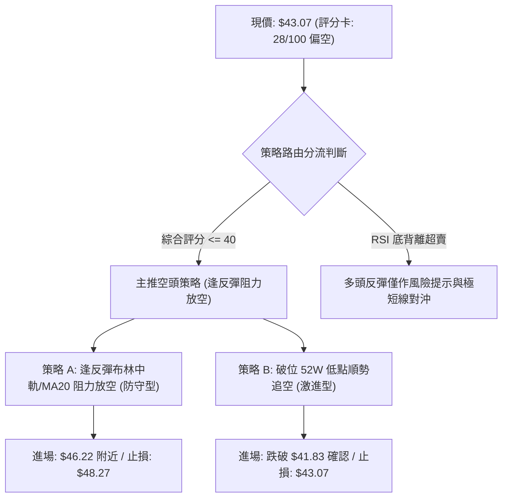

### 🧭 策略路由

**當前主策略方向 = 【主推空頭策略（以反彈遇阻做空為主，順勢下破為輔）】（依評分 28/100 判定）**

### 🎯 價格情境階梯（Price Scenarios）

所有價位均嚴格依據第 4 章所揭示之真實數據：

| 觸發條件 | 下一目標 | 後續延伸 | 情境技術含義 |
|----------|----------|----------|--------------|
| **強勢突破 MA20 ($46.22)** | R1 ($49.68) | R2 ($51.49) | 空頭回補，超賣修復浪擴大，測試中期生命線 |
| **震盪承壓現價區間 ($43.07)** | 布林下軌 ($42.31) | 52W低點 ($41.83) | 區間縮量磨底，多空在 52 週低點上方弱勢僵持 |
| **有效跌破 52W 低點 ($41.83)** | 數據未偵測聚類 | 開啟下行空間 | 終極支撐瓦解，空頭單邊主跌浪重啟 |

### 📊 情境機率分佈

| 情境劇本 | 機率 | 主要技術依據 |
|----------|------|--------------|
| **弱勢反彈測試均線阻力** | 45% | RSI(14)=26.19 出現日線底背離；布林 %B=0.10 嚴重壓迫下軌；Stoch 金叉蓄勢 |
| **在 $41.83 ~ $46.22 區間震盪** | 35% | ADX(14)=22.58 (< 25) 顯示單邊動能不足；成交量維持均量，未見恐慌盤 |
| **直接破位跌穿 $41.83 下行** | 20% | 均線系統全面空頭排列；-DI=28.62 壓制 +DI=13.17；OBV 低於均線無量 |

### 🟢 主策略詳情（空頭防守與破位策略）

| 策略要素 | 策略 A（反彈布林中軌受阻做空 - 首選） | 策略 B（跌破 52W 低點順勢做空 - 次選） |
|----------|----------------------------------------|----------------------------------------|
| **進場條件** | 價格反彈至 MA20 / 布林中軌遇阻收長上影線 | 日線收盤價實質跌破 52 週低點 $41.83 |
| **進場價格** | **$46.22** | **$41.80**（突破確認點） |
| **目標價 T1** | **$43.07**（回測現價低檔平台） | **$39.75**（由 1 倍 ATR $2.05 下行推算） |
| **目標價 T2** | **$41.83**（測試 52 週絕對低點） | **$37.70**（由 2 倍 ATR $4.10 下行推算） |
| **止損價格** | **$48.27**（$46.22 + 1倍 ATR $2.05） | **$43.07**（現價平台假跌破反抽止損位） |
| **風險報酬比** | **1 : 2.14**（風險 $2.05 : 獲利 $4.39） | **1 : 3.23**（風險 $1.27 : 獲利 $4.10） |
| **成功機率** | **65%** | **55%** |
| **建議倉位** | **10% - 15%** | **5% - 8%**（動量追破位需輕倉） |

### 🔴 反向風險觸發點（對沖提示）

若出現以下訊號，代表底背離轉化為中期多頭反轉，必須**全面終止做空主策略**：
1. **日線收盤價突破 R1 ($49.68)**：代表價格突破布林上軌與近一年波段高點聚類，宣告下降趨勢被破壞。
2. **日線 RSI(14) 突破 50 中軸且 MACD DIF 上穿零軸**：多頭動能獲得實質確立。
3. **對沖建議**：持有空單者，若日線實體站穩 **$46.22**（MA20），應減半空頭部位或買入價外認購期權對沖風險。

### ⭐ 整體訊號強度評星

```
╔══════════════════════════════════════════════════════════════╗
║ 做多訊號強度：★★☆☆☆  (2.0/5星 - 僅限底背離短抽，逆勢風險高)  ║
║ 做空訊號強度：★★★★☆  (3.8/5星 - 順應大級別均線與趨勢壓制)    ║
║ 整體可信度：  ★★★★☆  (4.0/5星 - 指標數據無矛盾，收斂一致)    ║
╚══════════════════════════════════════════════════════════════╝
```

---

## 9. 風險提示與監控

### ✅ 關鍵監控指標 Checklist

```
╔══════════════════════════════════════════════════════════════╗
║               KTOS 交易風控日常監控清單                      ║
╠══════════════════════════════════════════════════════════════╣
║ [ ] 52W 低點防線: 觀察 $41.83 是否被日線收盤有效擊穿         ║
║ [ ] 短期均線阻力: 每日跟蹤 MA20 ($46.22) 下移速率與受阻反應   ║
║ [ ] 動能底背離驗證: 監控 RSI(14) 能否重返 30 上方解除超賣   ║
║ [ ] 柱體動能翻轉: 關注日線 MACD 柱狀圖是否收斂至 -0.05 以內  ║
║ [ ] 通道帶寬擴張: 觀察 ADX 是否由 22.58 向上突破 25 (趨勢重啟)║
║ [ ] 成交量配合度: 跌破 $41.83 時成交量是否突破 500 萬股      ║
╚══════════════════════════════════════════════════════════════╝
```

### ⚠️ 風險場景分析

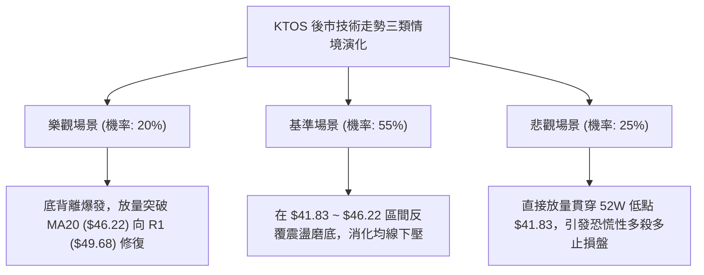

### 🛡️ 風險管理重要提醒

1. **基本面估值背離風險**：KTOS 當前 Trailing P/E 高達 253.35，EV/EBITDA 高達 78.63，自由現金流為負（$-118.29M）。儘管分析師共識目標價平均達 $102.19，但在高估值與弱現金流背景下，市場給予的估值容錯率極低，一旦大盤下行，技術面超賣並不構成免跌金牌。
2. **52 週低點之流動性真空**：當前價位 $43.07 距離 52 週低點 $41.83 僅有不到 3% 的空間。且數據明確顯示下方無波段低點聚類支撐。一旦 $41.83 失守，下方將面臨長達數年歷史圖表的支撐斷層，可能出現流動性真空下的加速跳水。
3. **倉位嚴格控管**：在 ADX < 25 的盤整震盪市場中，雙向洗盤極為頻繁。單筆交易曝險不得超過總資金之 1.5%，嚴格以 ATR（$2.05）作為動態止損的量化依據，切忌在左側盲目加碼攤平。

---

## 📋 報告總結

```
╔══════════════════════════════════════════════════════════════╗
║                  KTOS 技術分析報告總結                       ║
╠══════════════════════════════════════════════════════════════╣
║ 報告日期：2026-10-05                                         ║
║ 當前價格：$43.07                                             ║
║ 分析評級：🔴 空頭主導 / 超賣修復磨底 (評分: 28/100)          ║
║                                                              ║
║ 關鍵結論：                                                   ║
║ ├─ 長期趨勢：🔴 深度熊市回撤，低於 MA200 (-37.5%)           ║
║ ├─ 中期趨勢：🔴 下降通道壓制，MA50 ($51.16) 構築強阻力       ║
║ ├─ 短期趨勢：🟡 ADX=22.58 弱盤整，RSI=26.19 顯現底背離修復   ║
║ ├─ 關鍵支撐：布林下軌 $42.31 / 52週絕對低點 $41.83           ║
║ ├─ 關鍵阻力：布林中軌 $46.22 / 近一年高點 R1 $49.68          ║
║ └─ 分析師目標：均價 $102.19 (與短期技術弱勢形成顯著背離)     ║
║                                                              ║
║ 最優策略組合：                                               ║
║ 1. 🥇 最佳機會：等待超賣反彈至 MA20 ($46.22) 遇阻放空 (策略A)║
║ 2. 🥈 次選機會：破位 52W 低點 ($41.83) 輕倉順勢追空 (策略B)  ║
║ 3. 🥉 保守選擇：空倉觀望，等待日線收上 R1 ($49.68) 再行評估 ║
╚══════════════════════════════════════════════════════════════╝
```

---

> ⚠️ **免責聲明**：本報告為 AI 自動生成之技術分析，所有數據及估算均基於提供的歷史價格資訊。本報告**僅供研究與學術參考**，**不構成任何投資建議**。投資有風險，入市需謹慎。

---

*報告生成時間：2026-10-05 ｜ 數據來源：Yahoo Finance ｜ 分析框架：多時框技術分析*