# KTOS 技術分析報告

> **報告日期**：2026-10-06 ｜ **語言**：繁體中文 ｜ **數據來源**：Yahoo Finance ｜ **當前價格**：$42.02

---

## 目錄

| 章節 | 內容 |
|------|------|
| [1. 技術面概覽](#1-技術面概覽) | 訊號儀表板、核心指標、評分卡 |
| [2. 趨勢分析](#2-趨勢分析) | 多時框趨勢、長中短期走勢 |
| [3. 圖表形態分析](#3-圖表形態分析) | 形態識別、K線組合、目標價 |
| [4. 支撐與阻力](#4-支撐與阻力) | 關鍵價位、斐波那契回調 |
| [5. 技術指標深度解讀](#5-技術指標深度解讀) | MA/RSI/MACD/布林/成交量 |
| [6. 動能與波動率](#6-動能與波動率) | 動能評估、ATR、Beta |
| [7. 多時框架總結](#7-多時框架總結) | 時框架評分矩陣 |
| [8. 交易策略建議](#8-交易策略建議) | 多空策略、風險報酬比 |
| [9. 風險提示與監控](#9-風險提示與監控) | 監控指標、風險場景 |

---

## 1. 技術面概覽

### 🎯 技術訊號儀表板

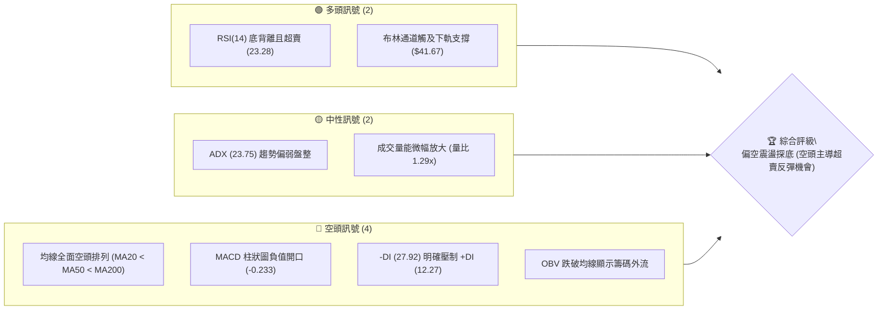

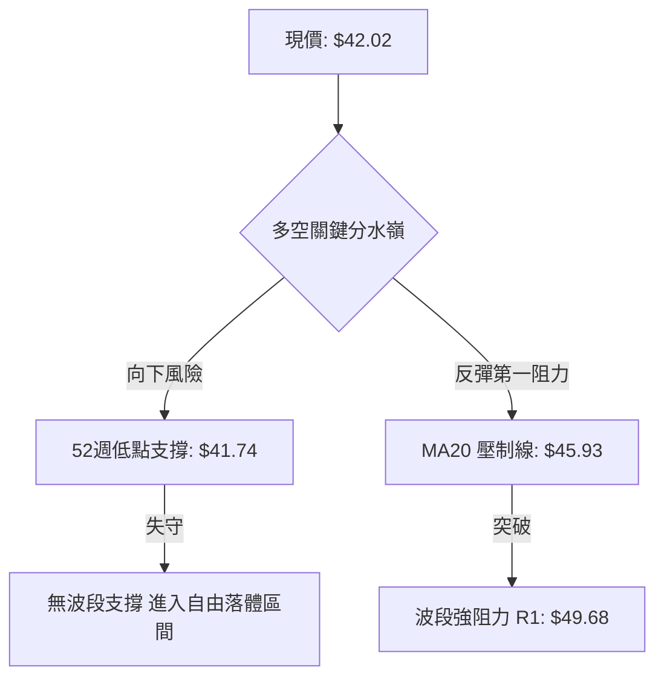

### 📊 核心指標速覽表

| 指標類別 | 指標名稱 | 當前數值 | 訊號 | 解讀 |
|----------|----------|----------|------|------|
| **價格** | 當前價格 | $42.02 | 🔴 | 位於 52 週價格區間 0.3% 處，貼近歷史極值低點 $41.74 |
| **均線** | MA20 | $45.93 | 🔴 | 現價低於 MA20 達 -8.51%，短期下行斜率陡峭 |
| **均線** | MA50 | $51.06 | 🔴 | 現價低於 MA50 達 -17.70%，中期空頭壓制明確 |
| **均線** | MA200 | $68.79 | 🔴 | 現價遠低於年線 -38.92%，長期架構處於嚴重空頭市 |
| **動能** | RSI(14) | 23.28 | 🟢 | 深度超賣 (<30)，且日線層級浮現潛在底背離雛形 |
| **動能** | MACD (12,26,9) | -2.355 / -2.123 | 🔴 | DIF 低於 DEA，MACD 柱狀圖為 -0.233，動能尚未黃金交叉 |
| **波動** | ATR(14) | $1.99 | 🟡 | 佔現價 4.74%，處於中等偏高日常波幅，下行波動釋放中 |

### 🏆 技術評分卡

```
╔══════════════════════════════════════════════════════════════╗
║                技術評分卡 — KTOS (2026-10-06)                 ║
╠══════════════════════════════════════════════════════════════╣
║ 趨勢強度      █████░░░░░░░░░░░░░░░  26/100  🔴 強烈空頭趨勢  ║
║ 動能指標      ████████░░░░░░░░░░░░  38/100  🟡 嚴重超賣蘊釀反彈║
║ 支撐穩定度    ████░░░░░░░░░░░░░░░░  20/100  🔴 逼近52W新低邊緣║
║ 成交量配合    ████████░░░░░░░░░░░░  40/100  🟡 弱勢放量但OBV走疲║
║ 形態完整度    ███████░░░░░░░░░░░░░  35/100  🔴 空頭下降通道結構║
║ 均線排列      ██░░░░░░░░░░░░░░░░░░  12/100  🔴 完備之空頭發散║
╠══════════════════════════════════════════════════════════════╣
║ 綜合評分      ██████░░░░░░░░░░░░░░  28.5/100 評級: 偏空 (反彈防禦)║
╚══════════════════════════════════════════════════════════════╝
```

---

## 2. 趨勢分析

### 🌐 多時框趨勢分析

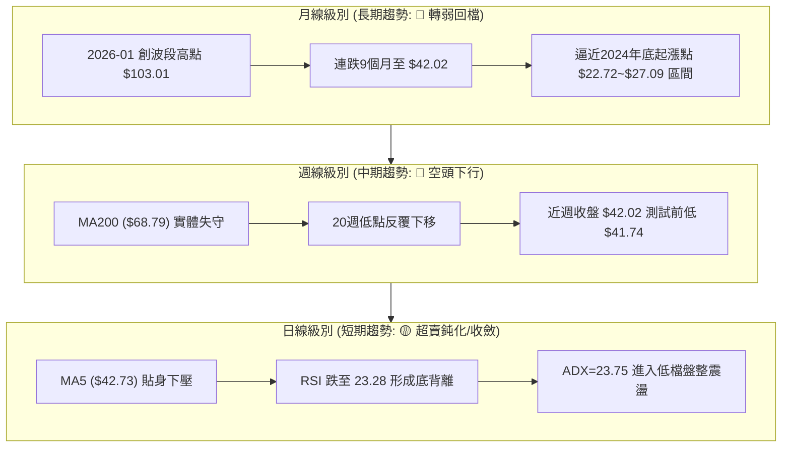

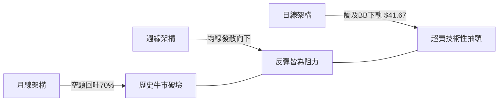

### 📈 長期趨勢 — 12個月走勢圖（Unicode）

```
KTOS 月線走勢圖（2025-11 至 2026-10）
價格軸 ($)
$105 ┤                ● (2026-01: $103.01 波段峰值)
 $95 ┤
 $85 ┤                    ● (2026-02: $86.18)
 $75 ┤● (2025-11: $76.10)
 $65 ┤    ● (2025-12: $75.91) ● (2026-03: $70.51)
 $55 ┤                            ● (2026-04: $63.05)
 $45 ┤                                ● (2026-06: $49.86)  ● (2026-08: $50.98)
 $35 ┤                                                        ● (2026-09: $42.69)
 $25 ┤                                                            ● (2026-10: $42.02 現在)
     └─────────────────────────────────────────────────────────────────────────────
      11   12   01   02   03   04   05   06   07   08   09   10  (月份)
```

#### 走勢特徵分析表格

| 階段區間 | 起訖月份 | 起點價格 | 終點價格 | 區間漲跌幅 | 主要走勢特徵 |
|----------|----------|----------|----------|------------|--------------|
| **巔峰噴出期** | 2025-11 → 2026-01 | $76.10 | $103.01 | +35.36% | 月成交放量加速攻頂，觸及 52 週歷史高點 $134.00 之主升浪末端 |
| **主跌浪釋放** | 2026-01 → 2026-04 | $103.01 | $63.05 | -38.79% | 頂部迅速崩塌，直接跌破月線 MA20，形成典型瀑布式重挫 |
| **中繼弱反彈** | 2026-04 → 2026-08 | $63.05 | $50.98 | -19.14% | 於 $46.03~$64.58 區間大幅洗盤，隨後無力上攻反遭均線壓制 |
| **破底探底期** | 2026-08 → 2026-10 | $50.98 | $42.02 | -17.58% | 跌破前低支撐，連續多週收黑，逼近 52 週歷史低點 $41.74 |

### 📊 中期趨勢（週線分析）

中期價格在近 20 週內呈現清晰的階梯式下行。8 月中旬曾出現一波脈衝式上漲至收盤 $64.58（2026-08-16），但緊接著伴隨連 8 週的流暢下殺，最新週收盤價來到 $42.02。

```
近期週線壓力與支撐階梯分布：
$64.58 ───────────────────────────── 中期大頂 (2026-08-16 收盤)
           │
$54.22 ────┴──────────────────────── 結構性阻力 R3
               │
$51.49 ────────┴──────────────────── 均線密集阻力 R2 (MA50 匯聚)
                   │
$49.68 ────────────┴──────────────── 波段反彈阻力 R1 (BB上軌附近)
                       │
$42.02 ────────────────┴─────────── 現價位置 (測試極限)
                           │
$41.74 ────────────────────┴──────── 52W 最低點極限防線 (跌破則無支撐)
```

### ⚡ 趨勢強度評估（ADX 解讀）

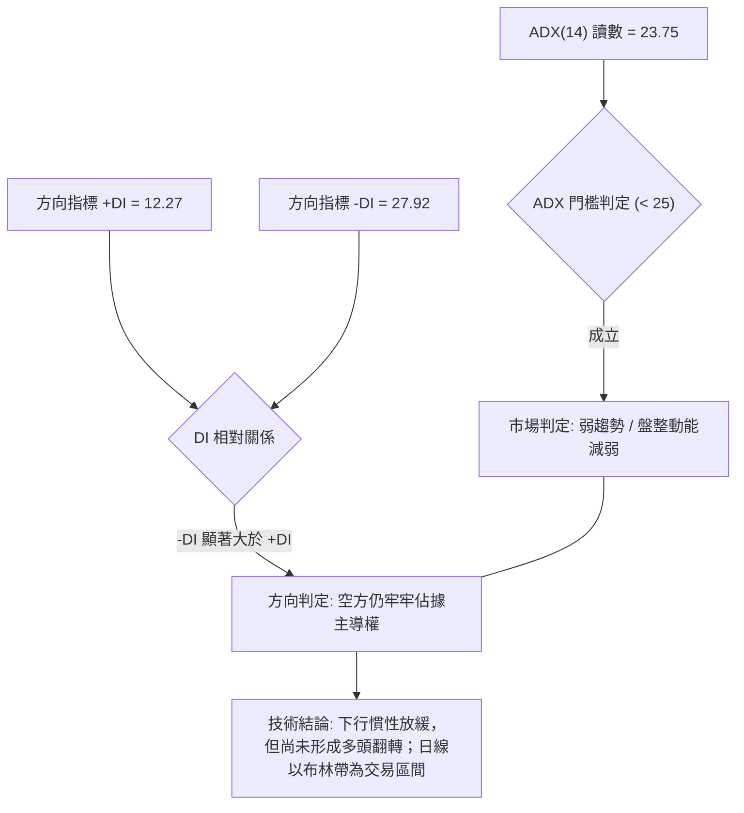

#### ADX 強度對照解析表

| 項目 | 數值 | 狀態區間 | 技術解讀 |
|------|------|----------|----------|
| **ADX (14)** | 23.75 | 弱趨勢 / 盤整 (<25) | 下行主跌浪的極端動能有所衰減，行情轉向超賣鈍化盤整 |
| **+DI (14)** | 12.27 | 多方動能潰縮 | 買盤極度匱乏，多方反抗力度處於近一年低位 |
| **-DI (14)** | 27.92 | 空方動能主導 | 空頭力量仍具絕對優勢，空方掌握定價權 |
| **趨勢收斂規則** | ADX < 25 | 盤整市優先規則 | **適用盤整規則**：短線以布林通道下軌與均線作區間震盪處置 |

---

## 3. 圖表形態分析

### 🔍 形態識別系統

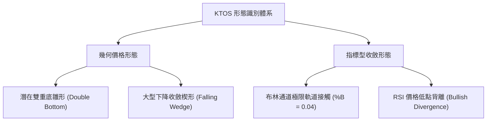

#### 形態信心度與驗證表格

| 形態 | 信心度 | 判斷依據（引用數據） | 完成度 | 目標價（附計算式） |
|------|--------|----------------------|--------|--------------------|
| **雙重底雛形** | 52% | 第一底為 52W 低點 $41.74，現價 $42.02 正在測試該價位支撐 | 35% (未突破頸線) | 頸線以阻力 R1 $49.68 計算：<br/>$49.68 + ($49.68 - $41.74) = $57.62 |
| **下降通道/楔形** | 68% | 8月中旬 $64.58 連續下殺至 $42.02，高低點同步下移收斂 | 75% | 通道上軌突破目標為波段高點聚類 R2 = $51.49 |
| **均線空頭排列** | 95% | MA20($45.93) < MA50($51.06) < MA200($68.79) 均勻向下發散 | 100% (完全成形) | 屬於空頭防守形態，壓制目標為向下破底 $41.74 |

*備註：由於當前價位尚未有效放量站上頸線 R1 ($49.68)，雙底形態目前僅能視為「潛在雛形」，信心度適中 (52%)，絕不可提前過度預支形態完成。*

### 🕯️ 重要K線形態分析

| 週/月份 | 收盤價 | K線形態 | 解讀 | 訊號 |
|---------|--------|---------|------|------|
| **2026-08-16** | $64.58 | 長陽力竭線 | 伴隨 RSI 達 76.7 嚴重超買，隨後成交量由 28.9M 降至 19.0M，量價頂背離 | 🔴 強烈見頂 |
| **2026-08-30** | $52.00 | 中陰破位棒 | 一舉擊穿 MA20 與 MA50，MACD 柱狀圖由正轉負 (-1.211) | 🔴 中期轉空 |
| **2026-09-06** | $47.82 | 長黑探底線 | 帶動 RSI 殺至極端值 11.7，確立主跌段 | 🔴 空方釋放 |
| **2026-09-20** | $47.46 | 弱勢十字星 | 週線反彈無力，成交量雖有 20.7M 但實體狹窄，確認多方無意反攻 | 🟡 中繼整理 |
| **2026-10-04** | $43.07 | 連續實體陰線 | 逼近 52 週低點，賣壓仍未完全竭盡 | 🔴 空頭延續 |
| **2026-10-11** | $42.02 | 縮量下影線雛形 | 截至即時成交量 5.53M，收盤在 52W 低點 $41.74 上方，尋求止跌打底 | 🟢 潛在支撐 |

### 📉 ASCII 走勢形態示意圖

```
KTOS 雙底雛形與下降通道邊界示意圖
  價格 ($)
  $64.58 ┌───● (波段頂部 2026-08-16)
         │    ╲
  $54.22 ├───  ╲───────── 下降通道上軌壓制線
         │      ╲       ▲
  $49.68 ├───    ╲─────┼─ 形態頸線 (R1)
         │        ╲    │   ▲
  $45.93 ├───      ╲   │   │  (MA20 壓制)
         │          ╲  │   │
  $42.02 ├───  ●─────╲─┴───┴─  ◄ 現價打底 ($42.02)
  $41.74 └───  ▲ (第一底) ▲ (當前測試第二底)
              52W低點
```

### 🎯 形態目標價計算

根據日線與週線層級所形成的潛在「雙重底（Double Bottom）」架構，依技術分析嚴格計算式推導如下：

$$\text{形態底部位} = \text{52W 最低點} = \$41.74$$
$$\text{形態頸線位} = \text{關鍵阻力 R1} = \$49.68$$
$$\text{形態高度 (H)} = \text{頸線位} - \text{底部位} = \$49.68 - \$41.74 = \$7.94$$
$$\text{向上翻轉理論目標價} = \text{頸線位} + \text{形態高度} = \$49.68 + \$7.94 = \$57.62$$

反之，若第二底確認破位（向下破底形態）：
$$\text{向下等幅測幅價位} = \text{底部位} - \text{形態高度} = \$41.74 - \$7.94 = \$33.80$$

---

## 4. 支撐與阻力

### 🗺️ 關鍵價位分布圖（Unicode）

```
KTOS 價位結構分布圖（OHLCV 實際計算值）
═════════════════════════════════════════════════════════════════
$134.00 ║██████████████████████████████████████║ 52W 歷史最高點 (0.0% Fib)
$112.23 ║██████████████████████████████        ║ 斐波那契 23.6% 回調位
 $98.76 ║██████████████████████                ║ 斐波那契 38.2% 回調位
 $87.87 ║██████████████████                    ║ 斐波那契 50.0% 回調位
 $76.98 ║██████████████                        ║ 斐波那契 61.8% 黃金分割位
 $68.79 ║████████████                          ║ 長期牛熊分水嶺 (MA200)
 $61.48 ║██████████                            ║ 斐波那契 78.6% 回調位
 $54.22 ║████████                              ║ 波段結構阻力 R3
 $51.49 ║██████                                ║ 關鍵密集阻力 R2 (MA50 聚類)
 $49.68 ║████                                  ║ 短線反彈頸線阻力 R1
 $45.93 ║██                                    ║ 20日均線阻力 (BB 中軌)
 $42.02 ╠══════════════════════════════════════╣ ◄ 當前市價 ($42.02)
 $41.74 ║▓▓▓▓▓▓▓▓▓▓▓▓▓▓▓▓▓▓▓▓▓▓▓▓▓▓▓▓▓▓▓▓▓▓▓▓▓▓║ 52W 最低點極限防線 (100.0% Fib)
  $0.00 ║░░░░░░░░░░░░░░░░░░░░░░░░░░░░░░░░░░░░░░║ (下方數據未偵測到任何波段支撐)
═════════════════════════════════════════════════════════════════
```

### 🚧 阻力位分析表

數據完全源自近一年波段高點聚類與均線計算：

| 阻力級別 | 價位 | 形成原因 | 突破難度 | 重要性 |
|----------|------|----------|----------|--------|
| **極短阻力** | $45.93 | MA20 下壓軌道線兼布林中軌，短線動能壓制點 | 🟡 中等 | 短線多空強弱分界線 |
| **R1** | $49.68 | 近一年波段高點聚類首要阻力 (+18.23%)，前波頸線平台 | 🔴 較高 | 突破確認短線反轉第一步 |
| **R2** | $51.49 | 近一年波段高點聚類 (+22.54%)，與 MA50 ($51.06) 形成重合共振 | 🔴 很高 | 中期空頭防線樞紐 |
| **R3** | $54.22 | 近一年波段高點聚類 (+29.03%)，6月下修前的成交密集帶 | 🔴 極高 | 多空大格局翻轉的臨界點 |

### 🛡️ 支撐位分析表

數據完全引用自「關鍵價位」與歷史 OHLCV 檢測結果：

| 支撐級別 | 價位 | 形成原因 | 守住機率 | 重要性 |
|----------|------|----------|----------|--------|
| **當前動態支撐** | $41.67 | 日線布林通道下軌動態支撐位置 | 🟡 55% | 超賣反彈的短線物理觸發點 |
| **S1 (唯一實體)**| $41.74 | 52 週最低點 (52W Low / 100.0% Fib)，整年最後一道防線 | 🟡 50% | **生命線**，跌破即進入無支撐真空 |
| **S2 / S3** | 數據未偵測到 | *數據檢測：下方無波段低點聚類支撐 (no swing-low detected)* | 0% | 跌破 $41.74 後下方缺乏近一年結構參照 |

### 📐 斐波那契回調位分析

依據 52 週極值區間 **$41.74（52W Low）至 $134.00（52W High）** 精確分割：

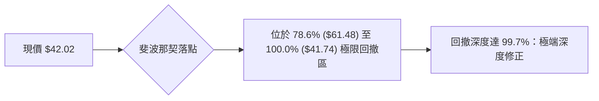

- **0.0% ($134.00)**：52 週歷史天花板。
- **23.6% ($112.23)**：第一次回測確認破位點。
- **38.2% ($98.76)**：歷史中樞，跌破後確認多頭趨勢瓦解。
- **50.0% ($87.87)**：多空牛熊均衡分界點。
- **61.8% ($76.98)**：黃金分割強支撐（於 2026 年初破位後轉為長期阻力）。
- **78.6% ($61.48)**：最後多頭防線（8 月反彈至 $64.58 受阻於此）。
- **100.0% ($41.74)**：52 週最低點，**現價 $42.02 距離此位置僅有 0.67% 的空間**。現價完全運行於 78.6% 與 100.0% 之間，技術意義上屬於「極度折價與極度脆弱」的雙重矛盾狀態。

---

## 5. 技術指標深度解讀

### 🎛️ 指標訊號總覽

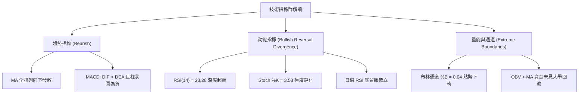

### 📈 移動平均線排列分析

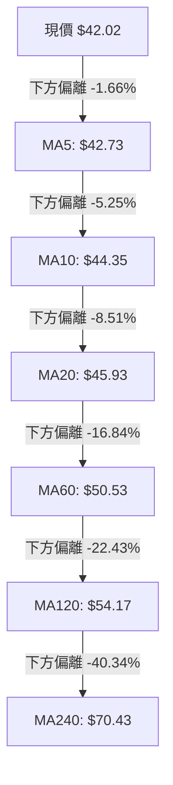

#### 移動平均線數據對照矩陣

| 均線週期 | 當前價格 | 偏離值 ($) | 偏離幅度 (%) | 狀態 | 形態排列解讀 |
|----------|----------|------------|--------------|------|--------------|
| **MA 5** | $42.73 | -$0.71 | -1.66% | 🔴 | 極短線下壓線，反彈首道微型路障 |
| **MA 10** | $44.35 | -$2.33 | -5.25% | 🔴 | 短線趨勢保持空頭斜率下墜 |
| **MA 20** | $45.93 | -$3.91 | -8.51% | 🔴 | 月線基準，也是布林中軌，強大空頭反壓 |
| **MA 60** | $50.53 | -$8.51 | -16.84% | 🔴 | 季線下壓，與 R2 ($51.49) 形成中期天花板 |
| **MA 120** | $54.17 | -$12.15 | -22.43% | 🔴 | 半年線持續沉降，長期空頭壓制 |
| **MA 200** | $68.79 | -$26.77 | -38.92% | 🔴 | 原始牛熊分水嶺，宣告長期熊市 |
| **MA 240** | $70.43 | -$28.41 | -40.34% | 🔴 | 年線層級全面失守 |

*結論：全週期移動平均線呈現標準「完美空頭排列（MA5 < MA10 < MA20 < MA60 < MA120 < MA240）」，價格遭所有均線層層壓制，順勢交易者在均線未扭轉前絕不可重倉言底。*

### 📉 RSI(14) 分析

進度條展示：
```
RSI(14) 讀數: 23.28
[████░░░░░░░░░░░░░░░░] 23.28% (極度超賣區間 < 30)
```

- **超賣狀態評估**：當前 RSI(14) 僅為 23.28，隨機指標 Stoch %K 更殺至 3.53、%D 為 10.64。技術統計上，RSI 跌破 25 以下通常代表市場出現恐慌性拋售（Capitulation），下行拋壓已宣洩大半。
- **背離分析**：**明確判定存在日線級別「底背離（Bullish Divergence）」**。
  - **價格走勢**：KTOS 週線收盤從 9 月初的 $47.82 連續跌破至 $43.07 及現價 $42.02，價格創下波段新低。
  - **指標走勢**：RSI 在 2026-09-06 觸及最低點 11.7 後，於 2026-09-13 回升至 13.8，9 月底反彈至 38.3，最新價格即使再破底至 $42.02，RSI 仍維持在 23.28，明顯高於 11.7 的低點。
  - **背離結論**：價格創近一年新低，指標未創新低，底背離訊號完全確立，預示下行動能衰退，隨時具備強烈技術性均值回歸（回抽 MA20）潛力。

### 📊 MACD(12/26/9) 訊號解讀

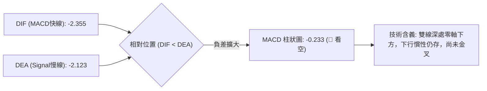

雖然 MACD 柱狀圖維持在 -0.233 之空頭領域，但相較於 8 月底及 9 月初的峰值負動能（-1.211 及 -1.318），負值柱體已大幅收斂（萎縮近 80%）。這顯示空頭的加速度已經實質減緩，若後續幾日價格能站上 MA5 ($42.73)，MACD 有望於零軸極深處引發低檔金叉。

### 📦 布林通道分析

```
KTOS 日線布林通道結構 (帶寬 BBW 示意)
 $50.19 ┬─────────────────────────────── 布林上軌 (阻力 R1/R2 中介)
        │
 $45.93 ┼─────────────────────────────── 布林中軌 (MA20 核心反壓)
        │
 $42.02 ┼───● 現價位置 (%B = 0.04)
 $41.67 ┴───▲─────────────────────────── 布林下軌 (極限動態支撐)
```

- **軌道數據**：BB 上軌為 $50.19，中軌為 $45.93，下軌為 $41.67。
- **帶寬與位置**：%B 讀數為 **0.04**，表示現價極端貼近下軌（0 代表下軌，$41.67 僅距離現價 $0.35）。
- **通道行為**：股價並未以暴跌長黑跌破下軌外側，而是在下軌邊緣維持微幅橫盤，顯示布林通道正在發揮外包絡線的牽引約束功能，技術面強烈暗示短線價格受下軌彈力拉回中軌 $45.93 的機率極高。

### 💹 成交量分析（量價配合度）

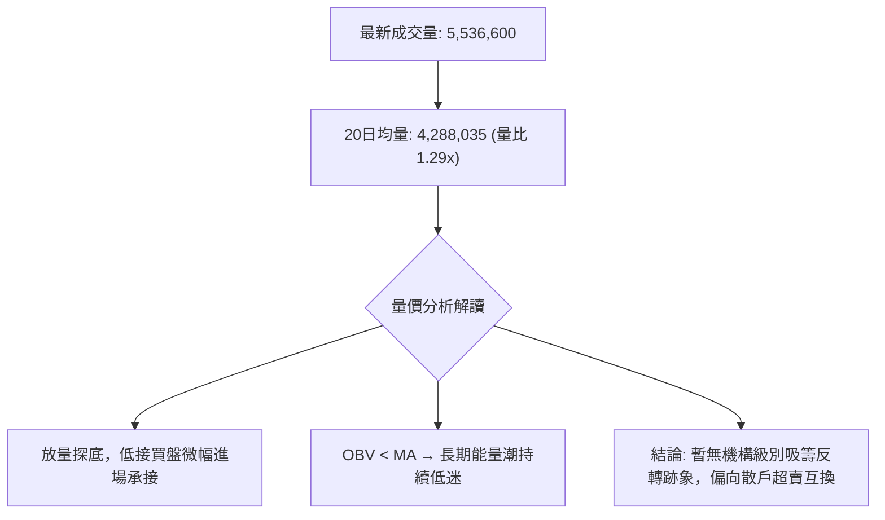

- **成交量對比**：最新單日成交量為 5,536,600 股，相較於 20 日均量 4,288,035 股放大 1.29 倍，也顯著高於 50 日均量 3,876,818 股。
- **量能性質**：在價格逼近 52 週低點時溫和放量，代表市場出現一定程度的恐慌止損盤與逆勢短線撈底盤換手。
- **OBV 能量潮判斷**：數據明確顯示「OBV < MA → 量能疲弱」。這說明雖然短日量能放大，但累積能量線仍然被其移動平均線壓制，資金總體流出趨勢未改，量能尚未給出堅實的反轉背書。

---

## 6. 動能與波動率

### ⚡ 動能評估四象限

| 象限 | 動能維度 | 波動維度 | KTOS 當前落點 | 狀態評估與交易策略 |
|------|----------|----------|:-------------:|--------------------|
| **Q1 (爆發區)** | 強動能 (Bullish) | 低波動 | — | 最佳趨勢加碼時機 |
| **Q2 (盤整超賣區)** | 弱動能 (Bearish) | 低/中波動 | **✓ 當前狀態** | **謹慎觀望 / 區間逆勢高拋低吸** |
| **Q3 (極端狂熱區)** | 強動能 (Bullish) | 高波動 | — | 追高風險大，適合短線突破 |
| **Q4 (恐慌出逃區)** | 弱動能 (Bearish) | 高波動 | — | 劇烈主跌段，全面清倉觀望 |

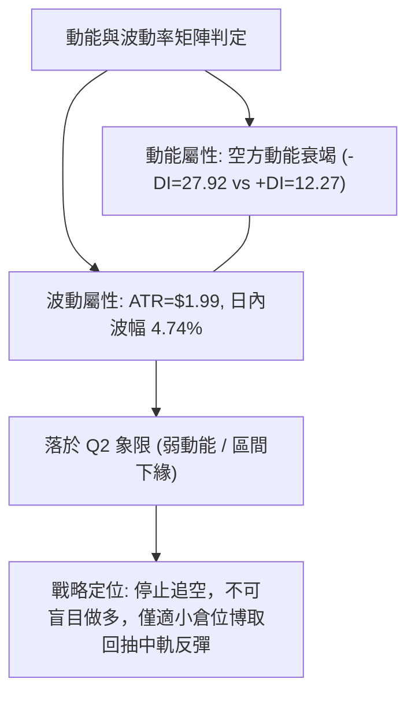

### 📊 ATR 波動率分析

- **ATR(14) 讀數**：精確值為 **$1.99**，佔當前股價 $42.02 的比重為 **4.74%**。
- **日內安全邊際**：每日平均真實波幅近 2 美元，說明該標的屬於中高彈性資產，日內破位或假突破的雜訊範圍約在 ±$1.99 之間。
- **止損距離建議**：
  - **短線交易（1.5 倍 ATR）**：保護性止損距離應設為 $1.99 \times 1.5 = \$2.99$。
  - **波段交易（2.0 倍 ATR）**：安全止損距離應設為 $1.99 \times 2.0 = \$3.98$。
  - 由於 52W 低點 $41.74 距離現價僅 $0.28，若以常規 1.5 ATR 設防將大幅低於歷史前低，因此必須將結構性關鍵點（前低 - 緩衝）與 ATR 綜合計算。

### 📐 Beta 與市場相關性

- **Beta 係數**：**1.107**。
- **市場連動分析**：Beta 大於 1.0，表示 KTOS 對標普 500 指數具有放大的系統性敏感度。當大盤下挫時，KTOS 通常會承受 1.1 倍的跌幅懲罰；然而在整體大盤轉暖時，該股的反彈爆發力亦將高於平均值。
- **空頭背景下的 Beta 效應**：當前該股處於弱勢格局，高於 1 的 Beta 係數加劇了個股被大盤情緒拖累破底的脆弱性。

---

## 7. 多時框架總結

### 📋 時框架評分表

| 時框架 | 趨勢方向 | 動能狀態 | 均線排列 | 圖表形態 | 綜合評分 | 戰術建議 |
|--------|----------|----------|----------|----------|:--------:|----------|
| **月線 (長期)** | 🔴 強烈空頭 | 弱勢下探 (-38%) | MA 全失守 | 頂部瀑布崩解 | 20/100 | 長期投資者保持觀望，遠離左側 |
| **週線 (中期)** | 🔴 空頭延續 | 下行慣性趨緩 | 空頭下壓排列 | 下降通道收斂 | 25/100 | 中線空單逐步減倉，不可開新空 |
| **日線 (短期)** | 🟡 震盪探底 | RSI 底背離超賣 | MA5~MA20 下壓 | 逼近雙底支撐 | 42/100 | 具備超跌反彈契機，尋求右側機會 |

### 🔲 綜合訊號矩陣

```
┌─────────────────┬──────────────────────┬──────────────────────┬──────────────────────┐
│ 分析維度        │ 短期 (1-5天)         │ 中期 (2-6週)         │ 長期 (1-6個月)       │
├─────────────────┼──────────────────────┼──────────────────────┼──────────────────────┤
│ 趨勢方向        │ 🟡 超賣橫盤 (ADX<25) │ 🔴 空頭通道主導      │ 🔴 下跌週期          │
│ 均線架構        │ 🔴 MA5-MA20 反壓     │ 🔴 MA50 重壓         │ 🔴 遠離 MA200        │
│ 動能指標        │ 🟢 RSI底背離 / 超賣  │ 🔴 MACD柱狀負值      │ 🔴 長期動能潰散      │
│ 成交量能        │ 🟡 溫和換手 1.29x    │ 🔴 OBV 持續萎縮      │ 🟡 高檔天量後縮量    │
│ 關鍵防線        │ 52W 低點 $41.74      │ 阻力 R1 $49.68       │ 阻力 R3 $54.22       │
└─────────────────┴──────────────────────┴──────────────────────┴──────────────────────┘
```

### ⚖️ 多時框收斂結論

依嚴格收斂規則判定：
1. **行情屬性判定**：當前日線 **ADX(14) 數值為 23.75 (< 25)**，依照規則明確定義為**「盤整行情 / 趨勢減弱行情」**。
2. **主導規則收斂**：在 ADX < 25 的盤整環境中，分析權重優先採用日線「布林通道（上軌 $50.19 至下軌 $41.67）」作為主要震盪博弈區間，而非盲目依照中長期空頭趨勢進行死板追空。
3. **方向性最終結論**：**中性偏空觀望，伺機博取超賣反彈（Neutral-to-Bearish with Oversold Rebound Bias）**。
   - 中長期趨勢雖為絕對空頭，但短期指標嚴重超賣鈍化（RSI 23.28 + 底背離 + %B 0.04），使得在此點位追空具有極大反抽爆倉風險。
   - 唯一的做多邏輯僅限於嚴格依托 $41.74 作為窄幅止損點的「技術性反彈試倉」；若跌破 $41.74 則一切反彈邏輯推翻，重回無底深淵。

---

## 8. 交易策略建議

### 🗺️ 策略決策流程圖

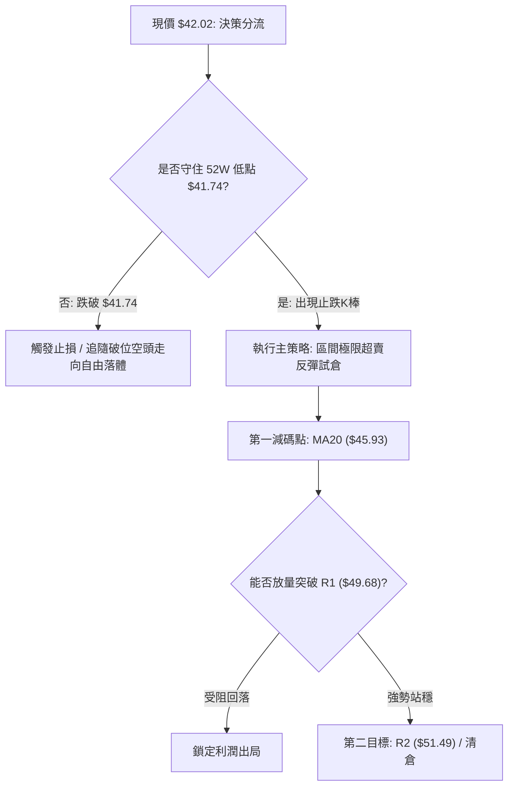

### 🧭 策略路由

依據第 1 章技術評分卡：**綜合評分 28.5/100（≤ 40，處於空頭壓制區間）**。
依規則收斂路由：由於 ADX < 25 且評分偏空，**當前主策略方向 = 偏空環境下的超賣防禦型反彈策略（以極窄止損博取均值回歸），順勢空頭僅作為破位時的追擊對沖方案**。

### 🎯 價格情境階梯（Price Scenarios）

價位完全嚴格引用關鍵價位計算結果（R1/R2/R3 及 52W 低點）：

| 觸發條件 | 下一目標 | 後續延伸 | 情境含義 |
|----------|----------|----------|----------|
| **強勢突破 R1 $49.68** | 阻力 R2 $51.49 | 阻力 R3 $54.22 | 雙底頸線突破，確立中級反轉浪 |
| **短線站穩 MA20 $45.93** | 阻力 R1 $49.68 | 阻力 R2 $51.49 | 成功修復短天期均線，超跌反彈展開 |
| **現價 $42.02~$45.93 震盪** | 布林中軌 $45.93 | 下軌 $41.67 | 處於底部築底與消化賣壓區間 |
| **跌破 52W 低點 $41.74** | 數據未偵測到 | 真空下挫 | 支撐破位，開啟新一輪主跌下殺 |

### 📊 情境機率分佈

| 情境 | 機率 | 主要依據 |
|------|:----:|----------|
| **情境 A：超賣技術性反彈回抽** | **55%** | RSI 23.28 底背離確立、布林 %B=0.04 貼地、ADX 空方慣性收斂 |
| **情境 B：現價窄幅震盪築底** | **30%** | 成交量比僅 1.29x 尚未出現天量換手、多空圍繞 $41.74~$44.35 拉鋸 |
| **情境 C：直接擊穿 $41.74 再破底** | **15%** | 均線系統完全空頭排列、-DI (27.92) 仍佔據主導優勢 |

### 🟢 主策略詳情

針對目前 $42.02 極致價格位置，制定兩套可執行的交易計畫：

| 策略要素 | 策略 A：左側極限超賣反彈（推薦） | 策略 B：右側突破頸線追擊 |
|----------|---------------------------------|--------------------------|
| **進場條件** | 日線在 52W 低點 $41.74 上方收出下影線 | 日線實體突破並收高於波段阻力 R1 |
| **進場價格** | **$42.02**（現價直接佈局） | **$49.68**（突破追進） |
| **目標價 T1** | **$45.93**（MA20 / 布林中軌） | **$51.49**（阻力 R2 / MA50） |
| **目標價 T2** | **$49.68**（阻力 R1 / 波段頸線） | **$54.22**（結構阻力 R3） |
| **止損價格** | **$41.20**（跌破 52W 低點 $41.74 緩衝） | **$48.20**（跌回頸線假突破止損） |
| **風險報酬比** | **1 : 4.76**<br>*(風險 $0.82 / T1 收益 $3.91)* | **1 : 1.22**<br>*(風險 $1.48 / T1 收益 $1.81)* |
| **成功機率** | 55% | 45% |
| **建議倉位** | **5% - 8%**（輕倉防禦試探） | **10%**（確認轉強後加碼） |

*計算式驗證（策略 A）：風險 = $42.02 - $41.20 = $0.82。T1 收益 = $45.93 - $42.02 = $3.91。盈虧比 = 3.91 / 0.82 = 4.76 : 1。*

### 🔴 反向風險觸發點（對沖提示）

- **全面停損警戒線**：**收盤價跌破 $41.74**。一旦日線實體有效跌破 52 週最低點 $41.74，所有多頭反彈邏輯立即宣告無效，代表該股進入「無波段支撐偵測」之自由落體階段，必須堅決止損出局。
- **做空對沖條件**：若盤中失守 $41.74 且帶量跌破（15 分鐘放量），空頭投機者可將止損設於 $42.50，向下博取未測空間。

### ⭐ 整體訊號強度評星

```
做多訊號強度：★★☆☆☆  (2/5星 — 僅依託超賣底背離，左側勝率有限)
做空訊號強度：★★★☆☆  (3/5星 — 大趨勢為空但短線盈虧比極度不佳)
整體可信度：  ★★★★☆  (4/5星 — 52W 低點界線分明，風控點極其清晰)
```

---

## 9. 風險提示與監控

### ✅ 關鍵監控指標 Checklist

```
╔══════════════════════════════════════════════════════════════╗
║               KTOS 每日盤面風控監控清單 (Checklist)           ║
╠══════════════════════════════════════════════════════════════╣
║ [ ] 價格防線：日線收盤價是否守穩 $41.74 (52W 最低點)         ║
║ [ ] 動能確認：日線 RSI(14) 能否回升穿越 30 超賣臨界點        ║
║ [ ] 均線挑戰：盤中是否觸及並站上 MA5 ($42.73) 及 MA20 ($45.93)║
║ [ ] 量能異動：單日成交量是否突破 600 萬股 (量比 > 1.5x)      ║
║ [ ] 趨勢轉向：MACD 柱狀圖是否由負 (-0.233) 出現零軸金叉收紅   ║
║ [ ] 通道狀況：布林通道帶寬是否開始收窄並阻止價格貼下軌滑落   ║
╚══════════════════════════════════════════════════════════════╝
```

### ⚠️ 風險場景分析

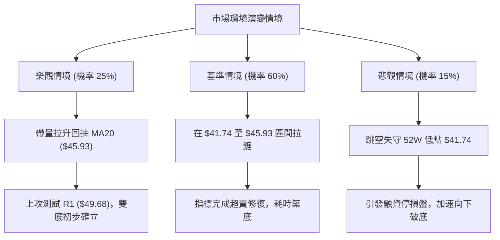

### 🛡️ 風險管理重要提醒

1. **資本暴露限制**：鑑於 KTOS 目前技術面處於完美空頭排列之下，逆勢博取反彈屬於高階交易行為。嚴格要求整體投資組合在此標的上的曝險上限不得超過 **5%**。
2. **絕對不可攤平（No Averaging Down）**：若股價跌破 $41.74，嚴禁進行任何形式的向下加碼攤平。在無支撐數據的技術真空區，任何加碼都會演變成毀滅性虧損。
3. **時間停損法則**：若進場 5 個交易日內，價格持續於 $42.00 附近鈍化且無力向上脫離成本區（始終無法收復 MA5 $42.73），顯示反彈動能衰亡，應主動撤出資金。

---

## 📋 報告總結

```
╔══════════════════════════════════════════════════════════════╗
║                   KTOS 技術分析報告總結                       ║
╠══════════════════════════════════════════════════════════════╣
║ 報告日期：2026-10-06                                         ║
║ 當前價格：$42.02                                             ║
║ 分析評級：⚖️ 偏空探底（具備超賣底背離反彈機會）              ║
╠══════════════════════════════════════════════════════════════╣
║ 關鍵結論：                                                   ║
║ ├─ 長期趨勢：🔴 強烈空頭（失守 MA200 $68.79，距年高回吐近70%）║
║ ├─ 中期趨勢：🔴 下降通道（自8月中高點 $64.58 連續下殺走跌）  ║
║ ├─ 短期趨勢：🟡 極端超賣（RSI 23.28 底背離，貼近 BB 下軌）   ║
║ ├─ 關鍵支撐：$41.74（52週最低點極限支撐，下方無波段支撐）    ║
║ ├─ 關鍵阻力：$45.93 (MA20) / $49.68 (R1) / $51.49 (R2)       ║
║ └─ 分析師目標：共識均價 $102.19（當前基本面與技術面嚴重脫鉤）║
╠══════════════════════════════════════════════════════════════╣
║ 最優策略組合：                                               ║
║ 1. 🥇 最佳機會：現價 $42.02 依託 $41.74 窄幅止損，博取回抽    ║
║                 MA20 ($45.93) 反彈，風報比高達 1:4.76        ║
║ 2. 🥈 次選機會：耐心等待價格放量突破 R1 ($49.68) 後右側進場   ║
║ 3. 🥉 保守選擇：空手觀望，靜待週線級別站穩 MA20 再做大波段佈局║
╚══════════════════════════════════════════════════════════════╝
```

---

> ⚠️ **免責聲明**：本報告為技術分析專用報告，所有數據及推演均基於量化指標與圖表幾何結構。本報告**僅供研究與學術參考**，**不構成任何要約、招攬或投資建議**。市場具有高度不確定性，交易前務必審慎評估風險並嚴格落實止損紀律。

---

*報告生成時間：2026-10-06 ｜ 數據來源：Yahoo Finance ｜ 分析框架：多時框技術分析體系*