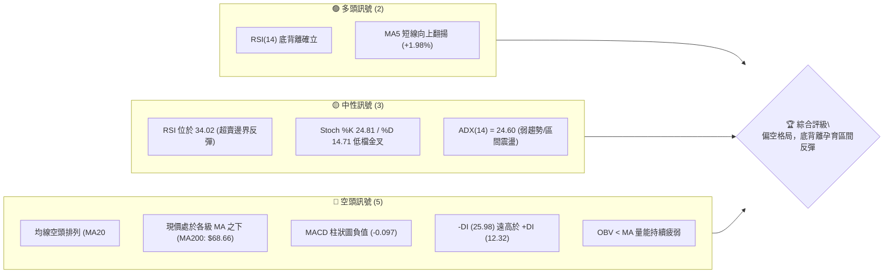
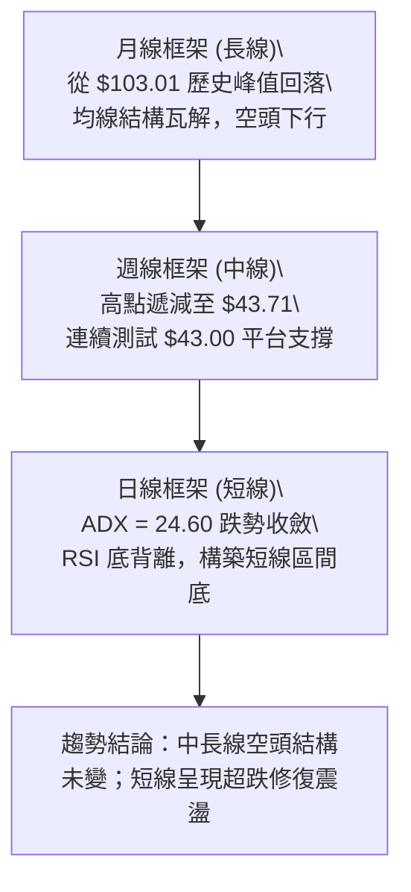
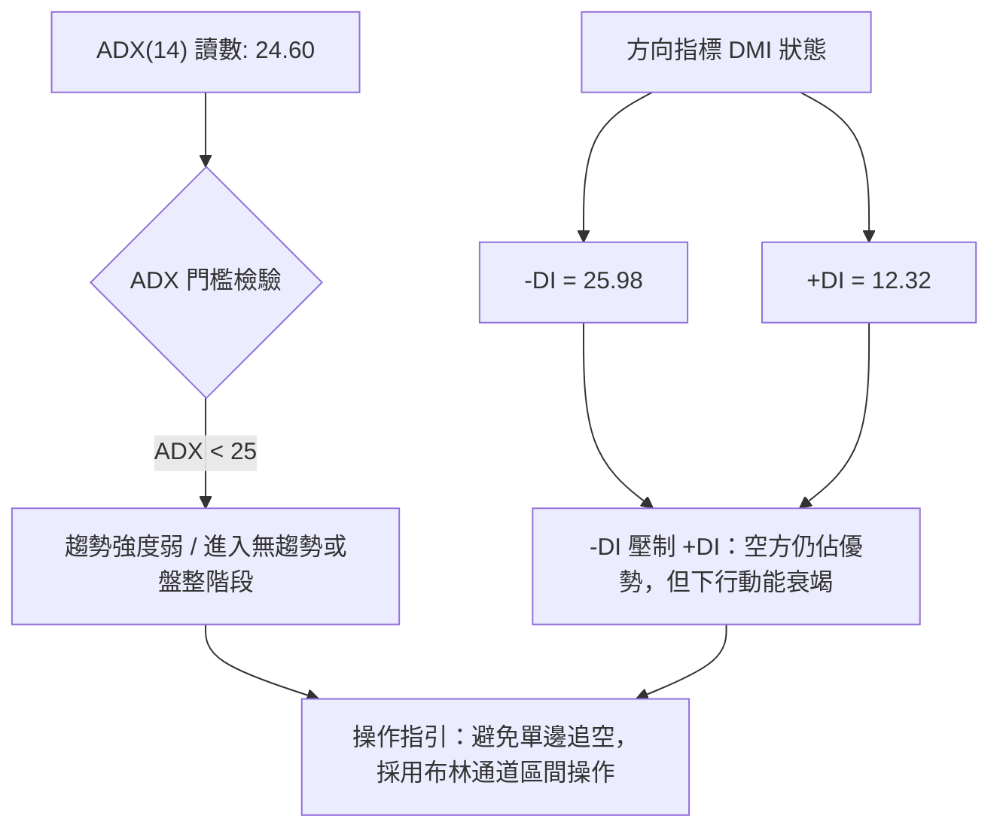
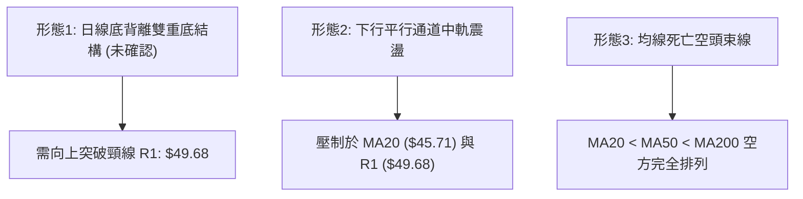
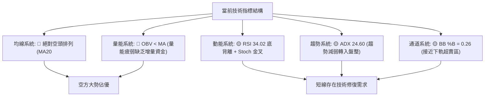
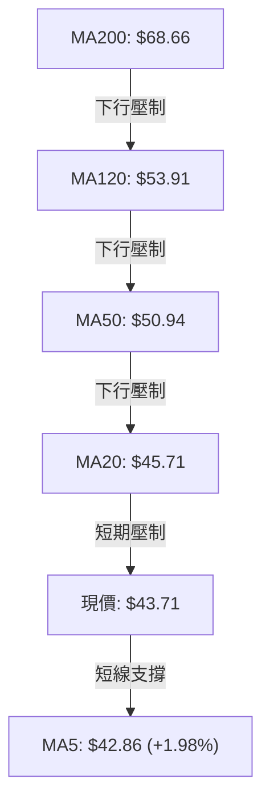
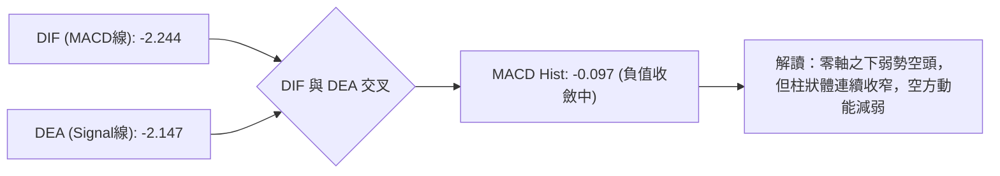
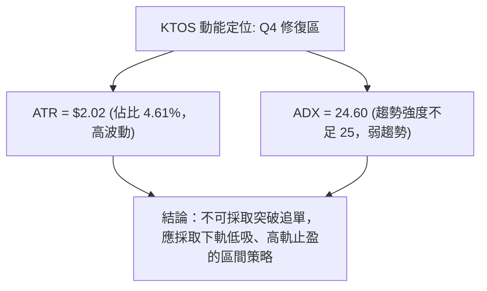
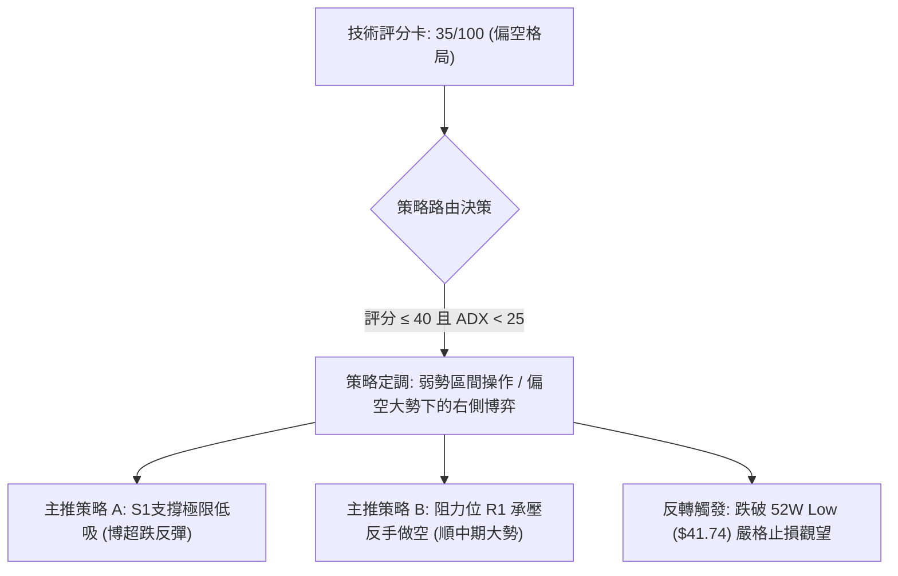
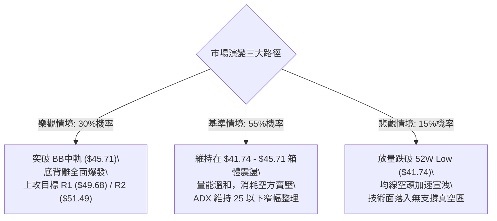

# KTOS 技術分析報告

> **報告日期**：2026-10-07 ｜ **語言**：繁體中文 ｜ **數據來源**：Yahoo Finance ｜ **當前價格**：$43.71

---

## 目錄

| 章節 | 內容 |
|------|------|
| [1. 技術面概覽](#1-技術面概覽) | 訊號儀表板、核心指標、評分卡 |
| [2. 趨勢分析](#2-趨勢分析) | 多時框趨勢、長中短期走勢 |
| [3. 圖表形態分析](#3-圖表形態分析) | 形態識別、K線組合、目標價 |
| [4. 支撐與阻力](#4-支撐與阻力) | 關鍵價位、斐波那契回調 |
| [5. 技術指標深度解讀](#5-技術指標深度解讀) | MA/RSI/MACD/布林/成交量 |
| [6. 動能與波動率](#6-動能與波動率) | 動能評估、ATR、Beta |
| [7. 多時框架總結](#7-多時框架總結) | 時框架評分矩陣 |
| [8. 交易策略建議](#8-交易策略建議) | 多空策略、風險報酬比 |
| [9. 風險提示與監控](#9-風險提示與監控) | 監控指標、風險場景 |

---

## 1. 技術面概覽

### 🎯 技術訊號儀表板



### 📊 核心指標速覽表

| 指標類別 | 指標名稱 | 當前數值 | 訊號 | 解讀 |
|----------|----------|----------|------|------|
| **價格** | 當前價格 | $43.71 | 🔴 | 位於52週區間 2.1% 極低檔，距52W低點僅 $1.97 |
| **均線** | MA20 | $45.71 | 🔴 | 價格在MA20下方 -4.37%，短期承壓下行 |
| **均線** | MA50 | $50.94 | 🔴 | 價格在MA50下方 -14.19%，中期空頭主導 |
| **均線** | MA200 | $68.66 | 🔴 | 價格在MA200下方 -36.34%，長期熊市格局明確 |
| **動能** | RSI(14) | 34.02 | 🟡 | 弱勢反彈區間，且日線級別出現顯著底背離 |
| **動能** | MACD | -2.244 | 🔴 | 快慢線均在零軸深處，Hist: -0.097 仍未翻正 |
| **動能** | Stoch %K/%D | 24.81 / 14.71 | 🟢 | 低檔區間形成超賣金叉，具備短線反彈動能 |
| **趨勢** | ADX(14) | 24.60 | 🟡 | ADX < 25 指示強單邊趨勢衰竭，進入低位震盪盤整 |
| **波動** | ATR(14) | $2.02 | 🟡 | 佔現價 4.61%，每日波動空間大，需寬幅風控 |
| **量能** | OBV | OBV < MA | 🔴 | 資金未現結構性回流，量能持續受壓 |

### 🏆 技術評分卡

```
╔══════════════════════════════════════════════════════════════════╗
║              技術評分卡 — KTOS (2026-10-07)                      ║
╠══════════════════════════════════════════════════════════════════╣
║ 趨勢強度      ██████░░░░░░░░░░░░░░  30/100  🔴 空頭排列壓制      ║
║ 動能指標      ████████░░░░░░░░░░░░  40/100  🟡 底背離帶來支撐    ║
║ 支撐穩定度    ██████████░░░░░░░░░░  50/100  🟡 S1($43.09)初顯支撐 ║
║ 成交量配合    ██████░░░░░░░░░░░░░░  30/100  🔴 OBV<MA 資金不足   ║
║ 形態完整度    ████████░░░░░░░░░░░░  40/100  🟡 潛在雙底建構中    ║
║ 均線排列      ████░░░░░░░░░░░░░░░░  20/100  🔴 嚴格空頭排列      ║
╠══════════════════════════════════════════════════════════════════╣
║ 綜合評分      ███████░░░░░░░░░░░░░  35/100  🔴 弱勢反彈/偏空格局 ║
╚══════════════════════════════════════════════════════════════════╝
```

---

## 2. 趨勢分析

### 🌐 多時框趨勢分析



### 📈 長期趨勢 — 12個月走勢圖（過去12個月）

```
KTOS 月線走勢圖（2025-10 至 2026-10）
價格軸 ($)
$105 ┤               ● $103.01 (2026-01 頂部)
 $95 ┤         ● $90.60
 $85 ┤                    ● $86.18
 $75 ┤   ● $76.10  ● $75.91
 $65 ┤                         ● $70.51  ● $64.13
 $55 ┤                               ● $63.05
 $45 ┤                                    ● $49.86  ● $46.60  ● $50.98
 $35 ┤                                                               ● $42.69  ● $43.71(現價)
     └───────────────────────────────────────────────────────────────────────────►
        10    11    12    01    02    03    04    05    06    07    08    09    10  (月份)
```

**走勢特徵分析表格**：

| 階段區間 | 起始價 → 終止價 | 漲跌幅 | 結構特徵與量價表現 |
|----------|-----------------|--------|--------------------|
| 2025-10 ~ 2026-01 | $90.60 → $103.01 | +13.70% | 最後衝頂階段，創歷史波段高點 $134.00 後迅速回落 |
| 2026-01 ~ 2026-04 | $103.01 → $63.05 | -38.79% | 崩跌式單邊下行，失守 MA50，形成多殺多格局 |
| 2026-04 ~ 2026-08 | $63.05 → $50.98 | -19.14% | 中繼反彈無力，8月週線放量反彈至 $64.58 後迅即遭到壓制 |
| 2026-08 ~ 2026-10 | $50.98 → $43.71 | -14.26% | 探測 52 週最低點 $41.74，現於 S1 ($43.09) 處弱勢企穩 |

### 📊 中期趨勢（週線分析）

中期走勢圖展示近期 20 週的價格箱體與壓力分佈：

```
中期阻力與支撐示意圖（週線層級）
$64.58 ────────────────────────── 波段高點強壓力 (2026-08-16)
       │
$54.22 ══════════════════════════ 結構阻力 R3
$51.49 -------------------------- 關鍵均線/波段阻力 R2 (MA50: $50.94)
$49.68 -------------------------- 近端波段阻力 R1 (BB中軌區間)
       │
$43.71 ·························· 現價位置
$43.09 ══════════════════════════ 關鍵支撐 S1 (近一年波段低點聚類)
$41.74 ────────────────────────── 52週極限低點 / 斐波那契 100% 支撐
```

### ⚡ 趨勢強度評估（ADX 解讀）



**ADX 強度對照表**：

| 指標變量 | 數值 | 市場狀態評估 | 訊號強度 |
|----------|------|--------------|----------|
| **ADX(14)** | 24.60 | 弱趨勢/低波動盤整（剛跌破 25 臨界線） | 🟡 中性 |
| **+DI(14)** | 12.32 | 多頭進攻意願極低 | 🔴 弱勢 |
| **-DI(14)** | 25.98 | 空方主導控制權 | 🔴 空方控盤 |
| **DI 差值值域** | -13.66 | 空方佔優但擴散減弱，下行斜率趨緩 | 🟡 收斂中 |

---

## 3. 圖表形態分析

### 🔍 形態識別系統



**形態信心度表格**（嚴格依據歷史數據與價位）：

| 形態 | 信心度 | 判斷依據（引用數據） | 完成度 | 目標價（附計算式） |
|------|--------|----------------------|--------|--------------------|
| **雙底形態 (Double Bottom)** | 55% | 2026-09 波段低點 $42.69 與 2026-10-04 低點 $43.07 於 S1 ($43.09) 處共振企穩 | 45% (尚未突破頸線) | 頸線 R1($49.68) + 形態高度($49.68 - $42.69 = $6.99) = **$56.67**（註：受阻於 R3: $54.22） |
| **布林帶下軌支撐反彈** | 70% | 價格觸及 BB 下軌 $41.48 後收於 $43.71，BB %B 為 0.26 | 75% | 短期均線回歸目標：BB 中軌 **$45.71** |
| **頭肩頂形態 (Head & Shoulders)** | 20% | 訊號不足，僅做指標型解讀（2026-01 之頂部已完成大幅下跌，無當前有效頸線） | 100% (已失效) | 不適用 |

### 🕯️ 重要K線形態分析

| 週度/日期 | 收盤價 | K線形態 | 解讀 | 訊號 |
|-----------|--------|---------|------|------|
| 2026-08-16 | $64.58 | 長上影流星線 | 週成交量 19.03M，多頭反撲受阻於阻力帶，中期反彈終結 | 🔴 強烈看空 |
| 2026-09-06 | $47.82 | 大陰線破位 | RSI 驟降至 11.7，空頭動能加速宣洩 | 🔴 極度弱勢 |
| 2026-09-20 | $47.46 | 破底後回抽陽線 | 成交量 20.72M，低位出現換手護盤 | 🟡 止跌企穩 |
| 2026-10-04 | $43.07 | 錘頭線/下影十字星 | 週線下探至 S1 附近即獲買盤承接，週量放大至 24.15M | 🟢 築底訊號 |
| 2026-10-11 | $43.71 | 小陽線吞噬 | 守穩 $43.09，MACD 柱狀圖由 -0.227 收窄至 -0.097 | 🟢 底背離確認 |

### 📉 ASCII 走勢形態示意圖

```
潛在雙底（W底）構築示意圖：
價位 ($)
$49.68 ┤                  頸線位置 (R1 關鍵阻力)
       │                 /      \
$46.00 ┤        /\      /        \
       │       /  \    /          \
$43.71 ┤──────/────\──/────────────● (現價 $43.71)
       │     /      \/
$42.69 ┤    ●(左底 9月 $42.69)    ●(右底 10月 $43.07)
$41.74 ┴────────────────────────────────────────────── (52W 低點保護線)
```

### 🎯 形態目標價計算

根據雙底形態（信心度 55%）：
- **形態底點**：以 2026-09 低點 $42.69 作為基準低點
- **形態頸線**：阻力位 R1 = $49.68
- **形態垂直高度**：$49.68 - $42.69 = $6.99
- **量度理論目標價**：$49.68 + $6.99 = **$56.67**
- **路徑壓制驗證**：在到達理論目標價前，將遭遇結構性阻力位 **R2 ($51.49)** 及 **R3 ($54.22)**。

---

## 4. 支撐與阻力

### 🗺️ 關鍵價位分布圖（Unicode）

```
KTOS 價位結構分布圖
══════════════════════════════════════════════════════════════════
$54.22 ║████████████████████████║ 強阻力 R3（波段密集高點聚類）
$51.49 ║████████████████████    ║ 阻力 R2（MA50: $50.94 共振區間）
$49.68 ║████████████████████████║ 關鍵阻力 R1（雙底頸線 / BB上軌: $49.93）
$45.71 ║░░░░░░░░░░░░░░░░░░░░    ║ 短線中軌壓制（BB中軌 / MA20）
$43.71 ╠════════════════════════╣ ◄ 現價 ($43.71)
$43.09 ║▓▓▓▓▓▓▓▓▓▓▓▓▓▓▓▓        ║ 近期核心支撐 S1（波段低點聚類）
$41.74 ║████████████████████████║ 極限強支撐（52W Low / 斐波那契 100%）
$41.48 ║░░░░░░░░░░░░░░░░░░░░    ║ 布林下軌支撐保護
══════════════════════════════════════════════════════════════════
```

### 🚧 阻力位分析表

| 阻力級別 | 價位 | 形成原因 | 突破難度 | 重要性 |
|----------|------|----------|----------|--------|
| **R1** | $49.68 | 近一年波段高點聚類，與布林上軌 ($49.93) 形成強共振阻力帶 | 高 | ★★★★☆ |
| **R2** | $51.49 | 近一年波段高點聚類，與 MA50 ($50.94) 和 60日線 ($50.47) 重疊 | 極高 | ★★★★★ |
| **R3** | $54.22 | 近一年波段高點聚類，前期週線級別平台反彈高點密集成交區 | 極高 | ★★★★☆ |

### 🛡️ 支撐位分析表

| 支撐級別 | 價位 | 形成原因 | 守住機率 | 重要性 |
|----------|------|----------|----------|--------|
| **S1** | $43.09 | 近一年波段低點聚類，2026-10-04 週線確認之支撐樞紐 | 65% | ★★★★★ |
| **52W Low** | $41.74 | 過去52週絕對最低點，整數關卡防線與情緒底線 | 80% | ★★★★★ |
| **BB下軌** | $41.48 | 布林帶波動動態下邊界，提供極端超賣時的統計學支撐 | 85% | ★★★☆☆ |

### 📐 斐波那契回調位分析

依據 52 週波段區間：**$41.74 (低點) → $134.00 (高點)** 進行黃金分割回調測算：

| 分割比率 | 價位 | 性質 | 當前位置解讀 |
|----------|------|------|--------------|
| **0.0%** | $134.00 | 52W High | 歷史牛市最高頂點 |
| **23.6%** | $112.23 | 阻力位 | 長期回調一級回撤位 |
| **38.2%** | $98.76 | 阻力位 | 牛熊分界轉換平台 |
| **50.0%** | $87.87 | 阻力位 | 核心價值中軸 |
| **61.8%** | $76.98 | 阻力位 | 黃金分割強壓力位 |
| **78.6%** | $61.48 | 阻力位 | 前期最後防守失守點 |
| **100.0%** | $41.74 | 52W Low | 本輪下行週期的極限支撐點位 |

**現價區間解讀**：
當前收盤價 **$43.71** 處於 **78.6% 回調位 ($61.48)** 與 **100.0% 回調位 ($41.74)** 之間的極度超跌區間。現價距離 100.0% 回調底線僅有 **+4.72%** 的空間，顯示股價已回吐過去一年所有漲幅，下行空間受到 100% 斐波那契底線的極強引力牽引與支撐防守。

---

## 5. 技術指標深度解讀

### 🎛️ 指標訊號總覽



### 📈 移動平均線排列分析



**移動平均線狀態詳解**：
- **MA5 ($42.86)**：短線翻揚，價格站上 MA5（+1.98%），顯示超跌後出現買盤微弱抵抗。
- **MA10 ($44.02)**：近在咫尺，壓制現價 -0.71%，為多頭反彈的第一道短線關卡。
- **MA20 ($45.71)**：下行斜率陡峭，為布林通道中軌，構成中期反彈的重壓區。
- **MA50 ($50.94) 與 MA60 ($50.47)**：形成 $50.50-$51.00 的中期強死叉壓力帶。
- **MA200 ($68.66)**：長期年線呈標準空頭下行，中長線仍處於深熊格局。

### 📉 RSI(14) 分析

- **RSI 當前數值**：**34.02**
  ```
  [0] ────────── [30] ──────●─────── [70] ────────── [100]
  超賣區       34.02 (弱勢反彈區)       超買區
  進度條：███████████░░░░░░░░░░░░░░░░░░░ 34.02%
  ```
- **底背離研判**：
  - **價格走勢**：KTOS 週線價格由 2026-09-06 的 $47.82 持續震盪探底至 2026-10-04 的 $43.07 及現價 $43.71，價格刷新波段新低。
  - **RSI 走勢**：RSI(14) 於 2026-09-06 創下極限低點 **11.7** 後，隨價格探底反而逐步抬升至 2026-09-27 的 **38.3** 與當前 **34.02**。
  - **結論**：指標明確呈現 **牛市底背離（Bullish Divergence）**，意味著空方賣壓雖然推低價格，但動能已大幅衰退，反彈蓄勢待發。

### 📊 MACD(12/26/9) 訊號解讀



- **MACD 線**：-2.244
- **Signal 線**：-2.147
- **MACD 柱狀體**：-0.097（處於綠柱向零軸收斂階段，由前期 -1.318、-0.864 收斂至當前數值，暗示即將迎來低檔弱勢金叉）。

### 📦 布林通道分析

```
布林通道 (20, 2) 結構示意圖：
$49.93 ────────────────────────────── BB 上軌 (阻力帶，偏離 +14.23%)
       │
$45.71 ------------------------------ BB 中軌 (MA20，短期多空分水嶺)
       │
$43.71 ······························ 現價位置 (%B = 0.26)
       │
$41.48 ────────────────────────────── BB 下軌 (極端超賣支撐線)
```
- **帶寬與位置**：上軌 $49.93，下軌 $41.48，帶寬 $8.45。
- **%B 指標**：0.26，代表現價處於通道下四分之一區域，空頭動能減速，價格依據均值回歸理論具有回測中軌 **$45.71** 的內在動力。

### 💹 成交量分析（量價配合度）

- **最新成交量**：5,151,300 股
- **20日均量**：4,408,295 股（量比：**1.17x**，溫和放量）
- **50日均量**：3,925,218 股
- **OBV 趨勢評估**：OBV < MA，反映長期籌碼流出狀況尚未完全扭轉；但最新日成交量超越 20 日與 50 日均量，顯示在 S1 ($43.09) 附近具備換手意願。

---

## 6. 動能與波動率

### ⚡ 動能評估四象限

| 象限 | 動能維度 (Momentum) | 波動率維度 (Volatility) | 當前判定 | 市場環境與策略特徵 |
|------|---------------------|--------------------------|----------|--------------------|
| **Q1 (爆發區)** | 強動能 (ADX>25, +DI勝出) | 低波動 (ATR低位壓縮) | ❌ | 突破醞釀期，最佳單邊進場點 |
| **Q2 (盤整區)** | 弱動能 (ADX<25, -DI微勝) | 低波動 (ATR處於相對低位) | ❌ | 窄幅無方向拉鋸，觀望為主 |
| **Q3 (極端區)** | 強動能 (單邊大趨勢) | 高波動 (ATR大幅擴張) | ❌ | 高風險單邊行情，追保利潤 |
| **Q4 (修復區)** | **弱動能 (ADX=24.60)** | **高波動 (ATR佔比4.61%)**| **✓ 當前** | **超跌企穩修復期：波動大但單邊趨勢衰竭，適宜嚴格風控的箱體操作** |



### 📊 ATR 波動率分析

- **ATR(14) 讀數**：**$2.02**
- **波動率佔比**：$2.02 / $43.71 = **4.61%**
- **風控止損距離評估**：
  - 1.0 倍 ATR：$2.02（短線波動緩衝）
  - 1.5 倍 ATR：$3.03（標準波段止損保護寬度）
  - 鑑於高 ATR 佔比，所有交易進場必須嚴控倉位，避免被日內常規噪音清洗出局。

### 📐 Beta 與市場相關性

- **Beta 係數**：**1.107**
- **特性解讀**：KTOS 具備高於大盤（S&P 500）10.7% 的波動彈性。在防禦與軍工板塊中，KTOS 展現較高的高貝塔科技成長屬性；當大盤反彈時其彈性較大，但在市場拋售時下行回撤幅度亦被顯著放大。

---

## 7. 多時框架總結

### 📋 時框架評分表

| 時框架 | 趨勢方向 | 動能狀態 | 均線排列 | 圖表形態 | 綜合評分 | 建議 |
|--------|----------|----------|----------|----------|----------|------|
| **月線 (長期)** | 🔴 偏空 | 弱勢下行 | 空頭排列 (低於MA200) | 從歷史頂部持續大幅回撤 | 20/100 | 長線資金謹慎觀望 |
| **週線 (中期)** | 🔴 偏空 | 下降通道 | 壓制於各級週均線 | 探測 52W 低點 $41.74 | 35/100 | 逢反彈減碼或防禦 |
| **日線 (短期)** | 🟡 震盪築底 | 底背離修復 | MA5 翻揚，MA20 壓制 | 潛在雙底測試 S1 ($43.09) | 50/100 | 超跌區間高拋低吸 |

### 🔲 綜合訊號矩陣

```
訊號收斂矩陣檢驗：
┌─────────────┬─────────────┬─────────────┬─────────────┐
│   維度      │    短期     │    中期     │    長期     │
├─────────────┼─────────────┼─────────────┼─────────────┤
│ 趨勢方向    │ 🟡 橫向盤整  │ 🔴 空頭下行 │ 🔴 熊市格局 │
│ 動能強度    │ 🟢 底背離   │ 🔴 綠柱承壓 │ 🔴 動能低迷 │
│ 均線結構    │ 🟡 MA5金叉  │ 🔴 MA50空頭 │ 🔴 MA200壓制│
│ 成交量態    │ 🟢 量比1.17 │ 🔴 週量遞減 │ 🔴 OBV疲軟  │
└─────────────┴─────────────┴─────────────┴─────────────┘
```

### ⚖️ 多時框收斂結論

> **依「嚴格要求 14」執行多時框收斂判定**：
> 1. **行情模式判斷**：當前日線 **ADX(14) = 24.60**（數值 < 25），明確判定為**盤整/無單邊強趨勢行情**。
> 2. **主導交易規則**：在盤整行情中，中長期均線（MA50: $50.94 / MA200: $68.66）定義了長期的重壓力上界，但交易核心主導邏輯轉向**日線布林通道 ($41.48 - $49.93) 與關鍵支撐/阻力區間震盪**。
> 3. **方向性收斂結論**：**中性偏空防守，短線專注底背離之超跌區間反彈**。長空背景未改，不可期待深V反轉，交易策略鎖定高盈虧比的下邊界防守型反彈。

---

## 8. 交易策略建議

### 🗺️ 策略決策流程圖



### 🧭 策略路由

- **綜合評分**：**35/100**
- **當前主策略方向**：**偏空大背景下的弱勢區間反彈策略（評分 35/100，以布林下軌及 S1 作為邊界依據）**。

### 🎯 價格情境階梯（Price Scenarios）

| 觸發條件 | 下一目標 | 後續延伸 | 情境含義 |
|----------|----------|----------|----------|
| **向上突破 R1 ($49.68)** | R2 ($51.49) | R3 ($54.22) | 突破布林上軌與雙底頸線，短線強勢反轉，挑戰 MA50 |
| **站穩現價區間 ($43.71)** | BB 中軌 ($45.71) | R1 ($49.68) | 底背離發酵，開展均值回歸修復走勢 |
| **向下跌破 S1 ($43.09)** | 52W Low ($41.74) | BB下軌 ($41.48) | 支撐失守，考驗過去一年最後防線，進入破位探底 |

### 📊 情境機率分佈

| 情境 | 機率 | 主要依據 |
|------|------|----------|
| **區間震盪 (窄幅修復)** | **55%** | ADX(14)=24.60 壓制趨勢爆發，布林帶收斂，量能溫和不足以單邊突破 |
| **向上反彈 (測 R1/中軌)**| **30%** | RSI 底背離確立，Stoch 低檔金叉，量比 1.17x，空方動能減弱 |
| **破底回落 (再探52W低)** | **15%** | 均線系統全面空頭排列，OBV 疲軟，-DI 仍高於 +DI |

### 🟢 主策略詳情

> **依據規則 13 與 14**：所有進場、止損、目標價位全部嚴格引用「關鍵價位」之 R1、R2、R3、S1、52W Low 及均線計算值。

| 策略要素 | 策略 A：S1 邊界低吸超跌反彈 (做多) | 策略 B：R1 阻力位反彈受阻放空 (順勢做空) |
|----------|----------------------------------|----------------------------------------|
| **策略類型** | 逆中勢、順短勢（博背離修復） | 順中長勢、逆短勢（高空防禦） |
| **進場條件** | 股價回踩 S1 不破，日線出現下影線確認 | 價格反彈至 R1 附近，出現長上影阻力訊號 |
| **進場價格** | **$43.09** (引用支撐位 S1) | **$49.68** (引用阻力位 R1) |
| **止損價格** | **$41.74** (嚴格設於 52W Low，空間 -$1.35) | **$51.49** (嚴格設於阻力位 R2，空間 +$1.81) |
| **目標價 T1** | **$45.71** (BB中軌 / MA20，空間 +$2.62) | **$45.71** (BB中軌 / MA20，空間 -$3.97) |
| **目標價 T2** | **$49.68** (阻力位 R1，空間 +$6.59) | **$43.09** (支撐位 S1，空間 -$6.59) |
| **風險報酬比** | **T1 達 1:1.94 ｜ T2 達 1:4.88** | **T1 達 1:2.19 ｜ T2 達 1:3.64** |
| **成功機率** | 60% | 65% |
| **建議倉位** | 10% - 15% (輕倉防禦) | 15% - 20% (主趨勢倉位) |

### 🔴 反向風險觸發點（對沖提示）

- **多頭止損/對沖觸發**：若收盤價**實體跌破 $41.74 (52W Low)**，必須無條件終止一切多頭策略，預警新一輪無支撐下殺。
- **空頭止損/對沖觸發**：若股價放量突破並站穩 **$51.49 (R2 / MA50)**，代表中期空頭趨勢結構被正式破壞，空單必須立即平倉退場。

### ⭐ 整體訊號強度評星

```
做多訊號強度：★★☆☆☆  (2/5星 - 僅依託底背離與 S1 之超跌博弈)
做空訊號強度：★★★★☆  (4/5星 - 宏觀均線空頭排列，順大勢空方)
整體可信度：  ★★★☆☆  (3/5星 - 處於低位震盪收斂期，警惕噪音)
```

---

## 9. 風險提示與監控

### ✅ 關鍵監控指標 Checklist

```
╔══════════════════════════════════════════════════════════════════╗
║              每日交易風控監控清單 (Checklist)                    ║
╠══════════════════════════════════════════════════════════════════╣
║ [ ] 價格是否跌破支撐樞紐 S1 ($43.09)？ (跌破即減碼)              ║
║ [ ] 價格是否觸及 52W 極限低點 ($41.74)？ (跌破全面止損)          ║
║ [ ] 日成交量是否顯著超越 20日均量 ($4.41M) 達 1.5 倍以上？       ║
║ [ ] RSI(14) 是否跌破 30 重新進入深度超賣？ (背離失效警戒)        ║
║ [ ] MACD 柱狀圖是否由負轉正 (突破 0 軸)？ (短多加碼依據)         ║
║ [ ] ADX(14) 是否由 24.60 上升至 25 以上？ (新趨勢啟動信號)       ║
║ [ ] 價格突破 MA20 ($45.71) 時是否伴隨成交量放大？               ║
╚══════════════════════════════════════════════════════════════════╝
```

### ⚠️ 風險場景分析



### 🛡️ 風險管理重要提醒

1. **ATR 波動風險管理**：目前 KTOS 的 ATR(14) 高達 $2.02，相當於單日 4.61% 的波動。單筆交易風控必須嚴格限制虧損不超過總資金的 1.0% - 1.5%。
2. **多空時框衝突化解**：長線均線完全壓制，因此多頭策略 A 僅定位為**短線戰術性反彈**，一旦觸及目標價 T1 ($45.71) 或 T2 ($49.68)，必須果斷執行階梯停利，切忌盲目長抱。
3. **流動性與空頭回補監控**：當前空頭比例（Short % Float）為 6.2%，Short Ratio 達 3.12。若價格放量越過 $49.68，可能引發短線空頭踩踏回補，屆時可視動能靈活調整。

---

## 📋 報告總結

```
KTOS 技術分析報告總結
══════════════════════════════════════════════════════════════════
報告日期：2026-10-07
當前價格：$43.71
分析評級：⚖️ 偏空中性（弱勢底背離修復，防守型區間震盪）

關鍵結論：
├─ 長期趨勢：🔴 偏空（現價低於 MA200: $68.66 達 -36.34%）
├─ 中期趨勢：🔴 偏空（承壓於下行通道，MA50: $50.94 形成死叉壓制）
├─ 短期趨勢：🟡 築底震盪（ADX=24.60 指示無趨勢，RSI 呈現底背離）
├─ 關鍵支撐：S1: $43.09 ｜ 52W Low: $41.74 ｜ BB下軌: $41.48
├─ 關鍵阻力：BB中軌: $45.71 ｜ R1: $49.68 ｜ R2: $51.49 ｜ R3: $54.22
└─ 分析師目標：共識均價 $100.73（評級 Strong Buy，多頭基本面預期高）

最優策略組合：
1. 🥇 最佳機會：策略 A — 在 S1 ($43.09) 附近低吸博取底背離反彈至中軌 ($45.71)
2. 🥈 次選機會：策略 B — 若反彈至 R1 ($49.68) 滯漲，順中期空勢建立做空倉位
3. 🥉 保守選擇：空倉觀望，等待日線突破 MA20 ($45.71) 或跌破 $41.74 明朗後再跟進
══════════════════════════════════════════════════════════════════
```

---

> ⚠️ **免責聲明**：本報告為技術分析研究，所有數據及估算均基於歷史價格與量化指標。本報告**僅供研究與學術參考**，**不構成任何投資建議**。投資有風險，入市需謹慎。

---

*報告生成時間：2026-10-07 ｜ 數據來源：Yahoo Finance ｜ 分析框架：多時框技術分析*