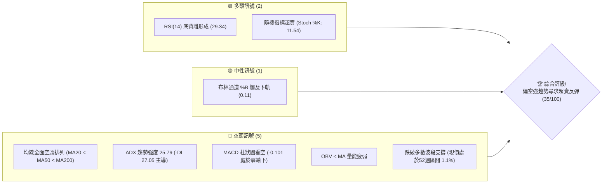
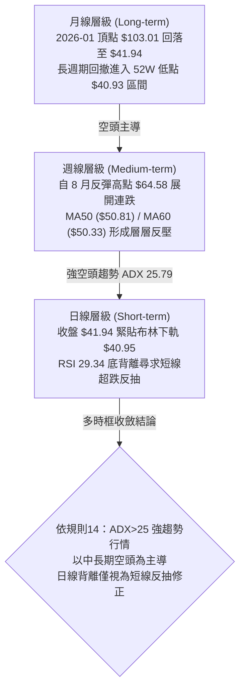
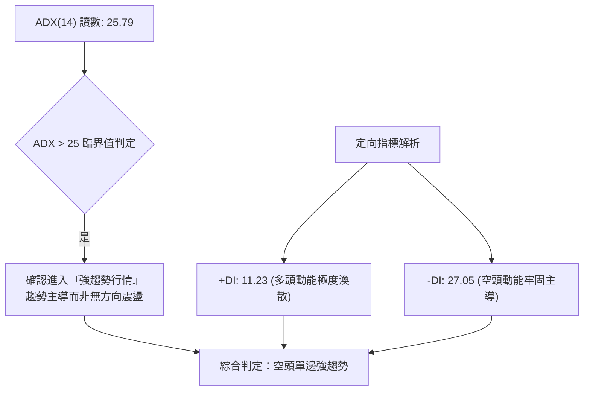
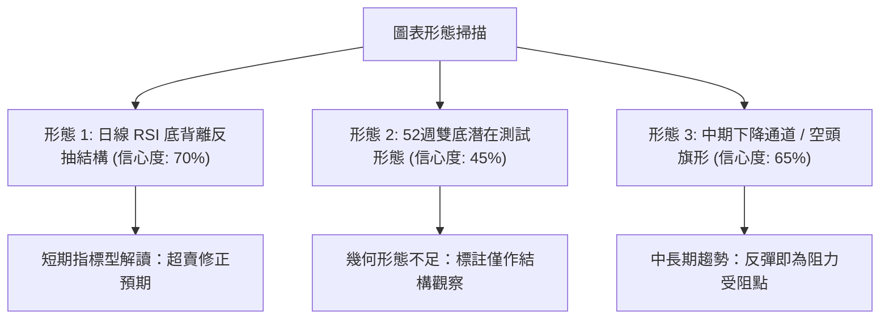
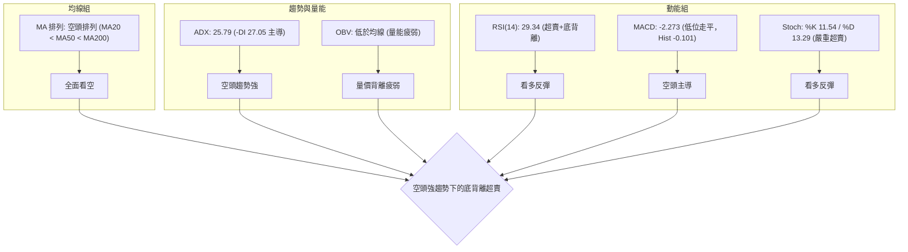
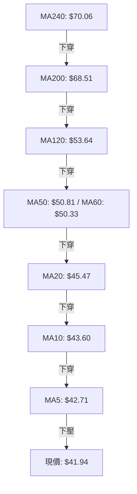
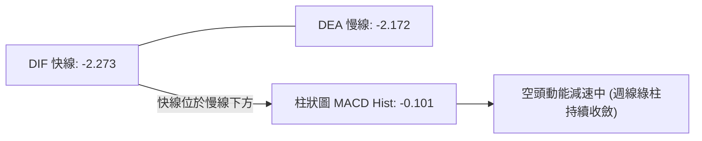
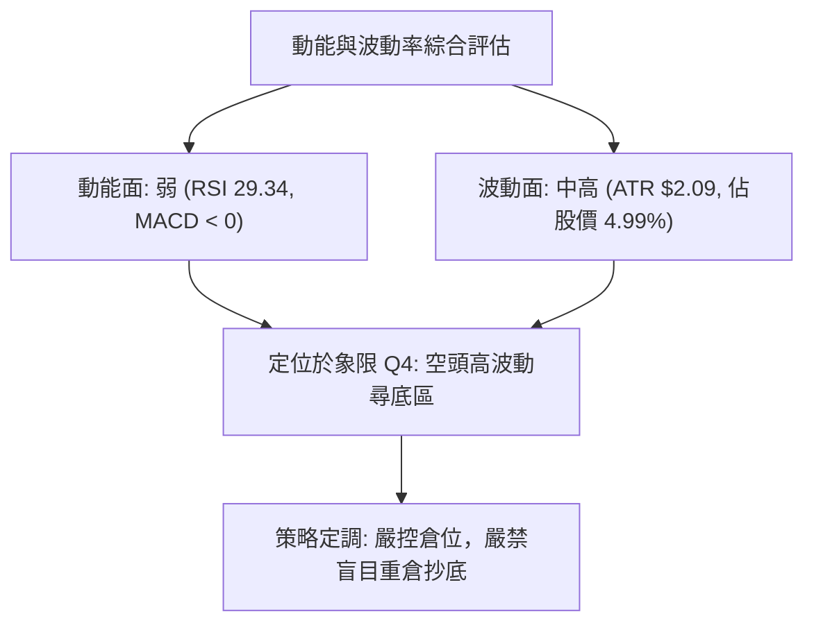
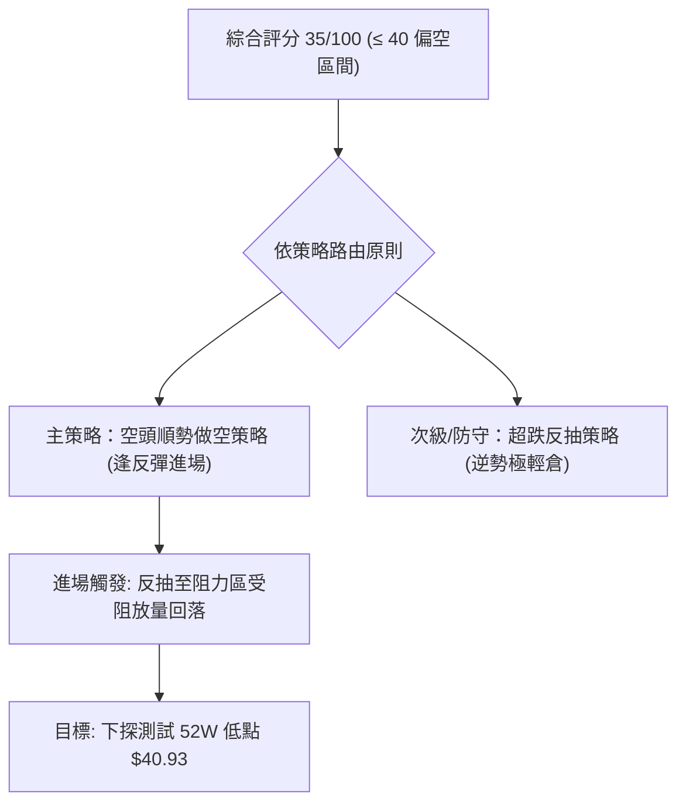
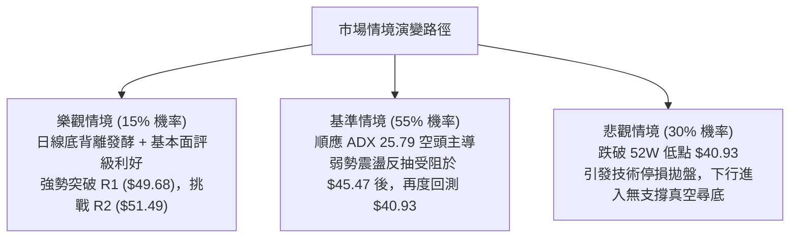

# KTOS 技術分析報告

> **報告日期**：2026-10-08 ｜ **語言**：繁體中文 ｜ **數據來源**：Yahoo Finance ｜ **當前價格**：$41.94

---

## 目錄

| 章節 | 內容 |
|------|------|
| [1. 技術面概覽](#1-技術面概覽) | 訊號儀表板、核心指標、評分卡 |
| [2. 趨勢分析](#2-趨勢分析) | 多時框趨勢、長中短期走勢 |
| [3. 圖表形態分析](#3-圖表形態分析) | 形態識別、K線組合、目標價 |
| [4. 支撐與阻力](#4-支撐與阻力) | 關鍵價位、斐波那契回調 |
| [5. 技術指標深度解讀](#5-技術指標深度解讀) | MA/RSI/MACD/布林/成交量 |
| [6. 動能與波動率](#6-動能與波動率) | 動能評估、ATR、Beta |
| [7. 多時框架總結](#7-多時框架總結) | 時框架評分矩陣 |
| [8. 交易策略建議](#8-交易策略建議) | 多空策略、風險報酬比 |
| [9. 風險提示與監控](#9-風險提示與監控) | 監控指標、風險場景 |

---

## 1. 技術面概覽

### 🎯 技術訊號儀表板



### 📊 核心指標速覽表

| 指標類別 | 指標名稱 | 當前數值 | 訊號 | 解讀 |
|----------|----------|----------|------|------|
| **價格** | 當前價格 | $41.94 | 🔴 | 位於 52 週最低點 $40.93 上方僅 2.47%，弱勢尋底 |
| **均線** | MA20 | $45.47 | 🔴 | 價格低於 MA20 (-7.75%)，短期下行壓力沉重 |
| **均線** | MA50 | $50.81 | 🔴 | 價格低於 MA50 (-17.46%)，中期空頭掌控主導權 |
| **均線** | MA200 | $68.51 | 🔴 | 價格遠低於 MA200 (-38.78%)，長期牛熊分界失守 |
| **動能** | RSI(14) | 29.34 | 🟢 | 進入超賣區 (<30)，且伴隨微結構底背離現象 |
| **動能** | MACD | -2.273 | 🔴 | 快慢線雙雙位於零軸以下，柱狀圖 -0.101 維持弱勢 |
| **趨勢** | ADX(14) | 25.79 | 🔴 | ADX > 25 且 -DI(27.05) 壓制 +DI(11.23)，空頭趨勢強勁 |
| **波動** | ATR(14) | $2.09 | 🟡 | 日波動率 4.99%，下行波動維持在中高區間 |

### 🏆 技術評分卡

```
╔══════════════════════════════════════════════════════════════════╗
║                 技術評分卡 — KTOS (2026-10-08)                  ║
╠══════════════════════════════════════════════════════════════════╣
║ 趨勢強度 (ADX/方向)   ██████████████░░░░░░  30/100  🔴 空頭強趨勢 ║
║ 動能指標 (RSI/MACD)   ████████░░░░░░░░░░░░  40/100  🟡 超賣底背離 ║
║ 支撐穩定度 (結構位)   ████░░░░░░░░░░░░░░░░  20/100  🔴 逼近52W新低║
║ 成交量配合 (OBV/均量) ██████░░░░░░░░░░░░░░  30/100  🔴 量能疲弱   ║
║ 形態完整度 (K線結構)  ████████░░░░░░░░░░░░  40/100  🟡 尋求止跌   ║
║ 均線排列 (MA系統)     ████░░░░░░░░░░░░░░░░  20/100  🔴 完美空頭   ║
╠══════════════════════════════════════════════════════════════════╣
║ 綜合技術評分          ███████░░░░░░░░░░░░░  35/100  🔴 強烈偏空   ║
╚══════════════════════════════════════════════════════════════════╝
```

---

## 2. 趨勢分析

### 🌐 多時框趨勢分析



### 📈 長期趨勢 — 12個月走勢圖（Unicode）

```
KTOS 月線走勢圖（過去12個月：2025-11 至 2026-10）
價格軸 ($)
$105 ┤                 ● (2026-01: $103.01 歷史波段高點)
$95  ┤
$85  ┤                      ● (2026-02: $86.18)
$75  ┤ ● (2025-11: $76.10)
$65  ┤     ● (2025-12: $75.91)   ● (2026-03: $70.51)
$55  ┤                                ● (2026-05: $64.13)
$45  ┤                                     ● (2026-08: $50.98)
$40  ┤                                          ●    ● (2026-10: $41.94 現價)
     └─────────────────────────────────────────────────────────────
        11    12    01    02    03    04    05    06    07    08    09    10  (月份)
```

**12個月走勢特徵分析表格**：

| 階段區間 | 起始價 → 終止價 | 漲跌幅 | 階段走勢特徵分析 |
|----------|-----------------|--------|------------------|
| **主升浪頂部** (2025-11 ~ 2026-01) | $76.10 → $103.01 | +35.36% | 動能極致爆發，1月創下 $103.01 頂部收盤價，動能耗盡。 |
| **首輪下跌段** (2026-01 ~ 2026-04) | $103.01 → $63.05 | -38.79% | 頂部快速瓦解，均線轉向，各級支撐連續失守。 |
| **中繼整理區** (2026-04 ~ 2026-05) | $63.05 → $64.13 | +1.71% | 橫盤構築中繼平臺，未能收復 MA50。 |
| **次輪殺跌段** (2026-05 ~ 2026-07) | $64.13 → $46.60 | -27.34% | 平台破位，空方量能擴大，測試低位買盤。 |
| **弱勢反彈段** (2026-07 ~ 2026-08) | $46.60 → $50.98 | +9.40% | 8月中旬觸及週線反彈高點 $64.58 後迅速回吐。 |
| **尋底測試段** (2026-08 ~ 2026-10) | $50.98 → $41.94 | -17.73% | 連續收陰，直逼 52 週低點 $40.93，量能萎縮。 |

### 📊 中期趨勢（週線分析）

中期走勢顯示自 2026 年 8 月中旬反彈收盤高點 $64.58 以來，週線走勢呈現連續階梯式下挫。近期壓力位主要集中於週線反壓與波段阻力 R1（$49.68）至 MA50（$50.81）區間；下檔則直面 52 週最低點 $40.93，下方無任何近一年波段低點聚類支撐。

```
中期週線結構示意圖：
$64.58 ────── 8月中旬波段反彈高點（強阻力）
   │
$54.22 ────── 阻力 R3
   │
$51.49 ────── 阻力 R2 / 週線 MA50 均線重合區
   │
$49.68 ────── 阻力 R1 / 布林上軌 ($49.98) 密集區
   │
$41.94 ────── [現價] 短線超賣徘徊區
   │
$40.93 ────── 52週低點 / 斐波那契 100% 最終防線
```

### ⚡ 趨勢強度評估（ADX 解讀）



| 指標變量 | 數值 | 門檻區間 | 趨勢屬性判定 |
|----------|------|----------|--------------|
| **ADX(14)** | 25.79 | > 25.00 | 強趨勢（Trend-Driven Market），順勢操作權重提高 |
| **+DI(14)** | 11.23 | < 20.00 | 多方推動力嚴重匱乏 |
| **-DI(14)** | 27.05 | > 25.00 | 空方壓制力道強勁 |
| **DI 差值 (-DI - +DI)** | +15.82 | > 10.00 | 空方具備絕對定價權，任何反彈均屬逆勢修正 |

---

## 3. 圖表形態分析

### 🔍 形態識別系統



| 形態名稱 | 信心度 | 判斷依據（引用數據） | 完成度 | 目標價（附計算式） |
|----------|--------|----------------------|--------|--------------------|
| **日線 RSI 底背離** | 70% | 價格逼近 $40.93 創近一年新低，日線 RSI 自前低回升至 29.34，且週線 MACD 綠柱由 -0.227 縮窄至 -0.101 | 85% | 由當前價格 $41.94 推算反抽目標為阻力 R1：**$49.68** |
| **中期下降通道** | 65% | 8月高點 $64.58 下跌至 $41.94，均線 MA5 至 MA240 全面空頭排列，順應通道運行 | 90% | 通道下軌支撐測算約為 52週低點：**$40.93** |
| **潛在 52W 雙底** | 45% | 數據中未偵測到現價下方波段低點，僅依賴 52W Low $40.93 單點防線支撐，形態尚未確立 | 20% | 訊號不足，依規則 15 僅作指標型解讀，不預設雙底目標價 |

### 🕯️ 重要K線形態分析

| 日期/週別 | 收盤價 | K線形態特徵 | 技術解讀 | 訊號 |
|-----------|--------|-------------|----------|------|
| 2026-08-16 | $64.58 | 長上影衝高回落 | 週線衝刺至近期反彈極限，受阻於 MA200 ($68.51) 下方，確認空頭中繼見頂 | 🔴 |
| 2026-08-30 | $52.00 | 大陰線破位放量 | 跌破 MA60 ($50.33) 與 MA50 ($50.81)，下行空間重新打開 | 🔴 |
| 2026-09-06 | $47.82 | 低開低走加速陰 | RSI 驟降至 11.7 極端超賣區，空頭動能完全釋放 | 🔴 |
| 2026-09-20 | $47.46 | 縮量十字星震盪 | 反彈無力，成交量萎縮，未能觸碰阻力 R1 ($49.68) | 🟡 |
| 2026-10-04 | $43.07 | 破位中陰線收盤 | 跌破 $45 整數關口與布林中軌 ($45.47)，空方再度主導局勢 | 🔴 |
| 2026-10-11 (當前) | $41.94 | 探底極限十字小陰 | 緊貼布林下軌 $40.95，成交量 17.05M 萎縮，出現超跌止跌跡象 | 🟢 |

### 📉 ASCII 走勢形態示意圖

```
KTOS 局部雙重波段下跌與底背離示意圖：
價格 ($)
$64.58 ────── 頂點 A (2026-08-16 高點)
        \
         \
$52.00 ───\── 中繼破位點 (跌破均線密集區)
           \
            \
$45.62 ────── 局部反抽高點 B (2026-09-27)
              \
               \
$41.94 ───────── 探底點 C (現價，逼近 52W 低點 $40.93)
                 ──────────────────────────────────
指標線:
RSI(14) 走勢:   [低點 11.7] ↗↗↗ [現值 29.34]  ====>  產生顯著底背離 (Bullish Divergence)
```

### 🎯 形態目標價計算

依據日線 RSI 底背離超跌反抽形態測算：
1. **反抽頸線/阻力位基準**：選取近期波段高點聚類之第一阻力位 **R1 = $49.68**（空間距現價 +18.45%）。
2. **形態高度推算**：
   - 形態底部：52週低點 $40.93
   - 形態頸線：阻力位 R1 $49.68
   - 形態垂直高度 = $49.68 - $40.93 = $8.75
3. **擴展目標價**：
   - 若短線突破 R1，等幅測算理論目標價 = R1 ($49.68) + 形態高度 ($8.75) = $58.43。
   - 惟依據嚴格數據紀律，上方直接承壓於波段高點阻力 **R2 ($51.49)** 與 **R3 ($54.22)**，因此實質目標價嚴格錨定既有阻力位。

---

## 4. 支撐與阻力

### 🗺️ 關鍵價位分布圖（Unicode）

```
KTOS 價位結構分布圖
═════════════════════════════════════════════════════════════════
$54.22 ║██████████████████████████████║ 強阻力 R3 (+29.28%)
$51.49 ║██████████████████████        ║ 阻力 R2 (+22.77%) / MA50 ($50.81)
$49.68 ║██████████████████████████    ║ 關鍵阻力 R1 (+18.45%) / BB上軌 ($49.98)
$45.47 ║▓▓▓▓▓▓▓▓▓▓▓▓▓▓▓▓              ║ 短期動態反壓 (MA20 / 布林中軌)
$41.94 ╠══════════════════════════════╣ ◄ 現價 ($41.94)
$40.95 ║░░░░░░░░░░░░                  ║ 動態支撐 (布林下軌)
$40.93 ║██████████████████████████████║ 核心支撐 (52W Low / 斐波那契 100%)
═════════════════════════════════════════════════════════════════
```

### 🚧 阻力位分析表

| 阻力級別 | 價位 | 形成原因 | 突破難度 | 重要性 |
|----------|------|----------|----------|--------|
| **R1** | $49.68 | 近一年波段高點聚類，且與布林上軌 ($49.98) 高度重疊 | 高 | ★★★★☆ |
| **R2** | $51.49 | 近一年波段次高密集區，與 MA50 ($50.81) 形成共振反壓 | 極高 | ★★★★★ |
| **R3** | $54.22 | 近一年波段高點聚類區，上方累積大量套牢籌碼 | 極高 | ★★★★☆ |

### 🛡️ 支撐位分析表

依據提供的數據源，「支撐位 (Support) — 近一年波段低點聚類：(no swing-low support detected below current price)」，當前價格下方無波段低點聚類，僅存在歷史極值與動態通道支撐。

| 支撐級別 | 價位 | 形成原因 | 守住機率 | 重要性 |
|----------|------|----------|----------|--------|
| **動態支撐** | $40.95 | 布林通道下軌極限，短線超跌包絡線 | 60% | ★★★☆☆ |
| **52W 低點** | $40.93 | 52 週最低價、斐波那契 100.0% 絕對底部界線 | 50% | ★★★★★ |
| **次級支撐** | — | 數據中未偵測到 $40.93 下方之波段低點支撐 | — | — |

### 📐 斐波那契回調位分析

依據 52 週完整波段區間（$40.93 → $134.00）計算之精確斐波那契回調水準：

```
0.0%  (52W High)  $134.00  ──────────────────────────────────
23.6%             $112.04  ──────────────────────────────────
38.2%             $98.45   ──────────────────────────────────
50.0%             $87.47   ──────────────────────────────────
61.8%             $76.48   ──────────────────────────────────
78.6%             $60.85   ──────────────────────────────────
100.0% (52W Low)  $40.93   ──────────────────────────────────
```

- **當前位置解讀**：現價 **$41.94** 處於 **78.6% 回調位 ($60.85)** 與 **100.0% 回調位 ($40.93)** 之間，距 100% 絕對回撤僅差 $1.01（+2.47%），屬於深度回撤極限區。
- **技術含義**：斐波那契 100.0%（$40.93）為整輪歷史週期的最後多頭防線。若該位置被有效跌破，代表 52 週多頭結構徹底瓦解，下行將進入真空尋底階段。

---

## 5. 技術指標深度解讀

### 🎛️ 指標訊號總覽



### 📈 移動平均線排列分析



移動平均線呈現標準的**「空頭排列」**（Price < MA5 < MA10 < MA20 < MA50 < MA200）。現價離 MA5 負乖離 -1.81%，離 MA20 負乖離 -7.75%，離 MA200 負乖離高達 -38.78%。所有中長期均線下傾角明確，顯示中期以上趨勢皆由賣方全面控盤。

### 📉 RSI(14) 分析

- **當前 RSI 讀數**：**29.34**（進入 <30 超賣警戒區間）。
- **進度條展示**：`[██████░░░░░░░░░░░░░░] 29.34%`
- **背離判斷（Bullish Divergence）**：
  日線走勢中，價格於 10 月逼近 52 週新低（從 9 月下旬的 $45.62 下跌至 $41.94），但 RSI 讀數並未跌破 9 月上旬創下的極端低點 11.7，反而抬升至 29.34。價格創新低而動能未創新低，確認日線層級存在**顯著底背離**，暗示下殺動能已出現衰竭跡象。

### 📊 MACD(12/26/9) 訊號解讀



MACD 雙線均位於負值深水區（快線 -2.273，慢線 -2.172），反映中長期跌勢累積深厚。柱狀圖現值為 -0.101，仍屬空方領域，但相較於 8 月底至 9 月初的 -1.318，負向動能大幅縮窄，空方砸盤力道逐步鈍化。

### 📦 布林通道分析

```
KTOS 布林通道 (20, 2) 結構圖：
$49.98 ────────────────────────────────────── BB 上軌
          \
           \
$45.47 ─────\──────────────────────────────── BB 中軌 (MA20)
             \
$41.94 ───────●────────────────────────────── 現價 (%B = 0.11)
$40.95 ────────────────────────────────────── BB 下軌
```

- **布林帶寬度**：帶寬開口約 $9.03，現價緊貼下軌。
- **%B 指標**：**0.11**，意味著價格處於通道底部邊緣（極端下軌超賣區），短期價格有回歸均值、向中軌 $45.47 靠攏的技術需求。

### 💹 成交量分析（量價配合度）

- **最新成交量**：6,312,900 股
- **20日均量**：4,495,735 股（量比 1.40x，下探過程中成交量放大）
- **50日均量**：4,002,008 股
- **OBV 能量潮**：OBV < MA，能量潮處於下行通道，量能指標疲弱。
- **量價背離分析**：現價在觸及下軌時放量至 1.40 倍均量，顯示在 $41.00~$42.00 區間有特定被動買盤承接；惟 OBV 尚未扭轉頹勢，量能配合度仍判定為「空頭放量釋放籌碼」階段，尚未進入實質右側放量反轉。

---

## 6. 動能與波動率

### ⚡ 動能評估四象限

| 象限 | 動能維度 | 波動維度 | KTOS 當前狀態 | 戰略評估 |
|------|----------|----------|---------------|----------|
| **Q1 (主升浪)** | 強動能 (多頭) | 低波動 | — | 最佳趨勢加碼區間 |
| **Q2 (盤整弱勢)** | 弱動能 (中性) | 低波動 | — | 觀望等待方向確認 |
| **Q3 (爆發洗盤)** | 強動能 (多頭) | 高波動 | — | 高風險追漲交易 |
| **Q4 (恐慌出清)** | 弱動能 (空頭) | 中高波動 | **✓ KTOS 所處位置** | **空頭主導且伴隨高波動，防範破位風險** |



### 📊 ATR 波動率分析

- **ATR(14) 讀數**：**$2.09**
- **價格波動比率**：$2.09 / $41.94 = **4.99%**
- **風控與止損建議**：
  - 日間價格正常噪音波動區間為 ±$2.09。
  - 短線操作之安全止損距離應至少設定為 1.0 ~ 1.5 倍 ATR，即 **$2.09 ~ $3.14**。
  - 當前若以 52W 低點 $40.93 為技術止損位（距離現價 $1.01），其緩衝空間小於 0.5 倍 ATR，極易被正常市場噪音掃出場，操作時需嚴格控制倉位。

### 📐 Beta 與市場相關性

- **Beta 係數**：**1.107**
- **解讀**：KTOS 相對大盤具備略高的彈性與敏感度（Beta > 1.0）。在國防航太板塊整體承壓或市場系統性回調時，其下行波動往往會放大 1.1 倍；反之，若板塊出現修復性反彈，其反抽彈性亦相對顯著。

---

## 7. 多時框架總結

### 📋 時框架評分表

| 時框架 | 趨勢方向 | 動能狀態 | 均線排列 | 形態特徵 | 綜合評分 | 建議處置 |
|--------|----------|----------|----------|----------|----------|----------|
| **月線 (長期)** | 🔴 偏空 | 弱勢尋底 | 空頭發散 | 自 $103.01 深度回撤 | 25/100 | 規避長期部位 |
| **週線 (中期)** | 🔴 偏空 | 負向縮窄 | 空頭排列 | 自 $64.58 連跌尋底 | 30/100 | 中期反彈做空 |
| **日線 (短期)** | 🟡 中性偏空 | 底背離超賣 | 均線下壓 | 貼軌運行，尋求反抽 | 45/100 | 短線極輕倉搏反彈 |

### 🔲 綜合訊號矩陣

| 維度 | 短期 (日線) | 中期 (週線) | 長期 (月線) | 訊號一致性評估 |
|------|-------------|-------------|-------------|----------------|
| **趨勢方向** | 空頭延伸 | 空頭 | 空頭 | 趨勢方向高度共振偏空 |
| **動能方向** | 超賣底背離 (多) | 負向收斂 (中性) | 負向下行 (空) | 存在時框衝突 (短線超跌反抽 vs 長期跌勢) |
| **量價關係** | 放量打下軌 | 縮量陰跌 | 高位出貨後縮量 | 籌碼仍處於洗盤出清期 |

### ⚖️ 多時框收斂結論

依據多時框收斂優先級規則（規則 14）：
1. **趨勢判定**：ADX(14) 讀數為 **25.79 > 25**，市場處於明確的**「趨勢行情」**，而非無方向的盤整震盪。
2. **主導時框**：依規則，必須以**中長期方向（週線 / MA50 / MA200）為主導**，日線層級僅能用於尋找精細進場時機。
3. **衝突收斂**：日線雖然出現 RSI 底背離及布林通道超賣訊號，但中長期均線（MA50 $50.81、MA200 $68.51）呈強烈空頭排列，週線趨勢全面走空。因此，日線的多頭訊號**僅能定性為弱勢反抽修正，不可視為趨勢反轉**。
4. **唯一方向性結論**：**強烈偏空為主，中長線順勢逢高做空，短線極輕倉防禦性搏反彈**。

---

## 8. 交易策略建議

### 🗺️ 策略決策流程圖



### 🧭 策略路由（依評分卡分流）

> **當前主策略方向 = 空頭順勢策略（依評分卡 35/100，綜合偏空）**
> 
> 由於綜合技術評分僅為 35/100（≤ 40），依規則**主推空頭策略**。多頭策略僅列為「反彈風險觸發點與對沖參考」，禁止在缺乏右側確認前進行重倉多頭抄底。

### 🎯 價格情境階梯（Price Scenarios）

價位嚴格引用關鍵價位數據：

| 觸發條件 | 下一目標 | 後續延伸 | 情境含義 |
|----------|----------|----------|----------|
| **反彈受阻於 R1 ($49.68)** | 回測 MA20 ($45.47) | 下探現價 ($41.94) | 空頭中繼正常反抽，提供絕佳空單進場點 |
| **突破 R1 ($49.68)** | 阻力 R2 ($51.49) | 阻力 R3 ($54.22) | 短線強勢反彈，空單必須無條件止損 |
| **跌破 52W 低點 ($40.93)** | 展開真空尋底 | 支撐無數據偵測 | 52週支撐崩塌，空頭加速主跌浪展開 |

### 📊 情境機率分佈

| 情境劇本 | 機率 | 主要依據 |
|----------|------|----------|
| **主情境：弱勢反抽後繼續回落破位** | 55% | ADX 25.79 強空頭主導；均線全面空頭排列；OBV 量能疲弱 |
| **次情境：圍繞現價與 52W 低點區間震盪** | 30% | 日線 RSI 29.34 超賣底背離；布林通道 %B 0.11 提供邊界支撐 |
| **樂觀情境：強勢反彈突破阻力 R1** | 15% | 分析師共識偏多 (Strong Buy) 帶來突發消息面刺激，但技術面阻力極重 |

### 🟢 主策略詳情（方向：空頭主導順勢做空）

以下策略報價與目標價**嚴格引用關鍵數據**：

| 策略要素 | 策略 A（主推：順勢逢高沽空） | 策略 B（防守：破位追空策略） |
|----------|------------------------------|------------------------------|
| **進場條件** | 價格反抽至阻力 R1 附近受阻收陰 | 價格放量跌破 52W 低點 $40.93 確認 |
| **進場價格** | **$49.68** (阻力 R1) | **$40.80** (跌破 $40.93 後) |
| **目標價 T1** | **$45.47** (MA20 / 布林中軌) | **$38.84** (由 ATR $2.09 推算下探空間) |
| **目標價 T2** | **$40.93** (52W Low / 斐波那契 100%) | **$36.75** (2倍 ATR 下測位) |
| **止損價格** | **$51.49** (阻力 R2，突破即止損) | **$41.94** (現價，回抽即止損) |
| **風險報酬比** | **4.83 : 1** `[($49.68-$40.93)/($51.49-$49.68)]` | **3.56 : 1** `[($40.80-$36.75)/($41.94-$40.80)]` |
| **成功機率** | 60% | 55% |
| **建議倉位** | 15% ~ 20% | 10% |

### 🔴 反向風險觸發點（對沖提示）

若出現以下情況，主空頭策略宣告失效，應立即全面撤出空單：
1. **價位突破點**：日線收盤價強勢站上 **$49.68 (R1)** 及布林上軌 **$49.98**。
2. **量能確認點**：單日成交量突破 20 日均量 2 倍以上（> 9,000,000 股）並收出大陽線。
3. **指標翻多點**：日線 MACD 快慢線金叉且柱狀圖由負轉正，ADX 之 +DI 上穿 -DI。

### ⭐ 整體訊號強度評星

```
╔══════════════════════════════════════════════════════════════════╗
║ 做多訊號強度：★★☆☆☆  (2/5星 - 僅存超跌底背離，左側博弈)           ║
║ 做空訊號強度：★★★★☆  (4/5星 - 均線/趨勢/量能壓制明確，順勢主導)   ║
║ 整體可信度：  ★★★★☆  (4/5星 - 數據完整，趨勢與價位吻合度極高)     ║
╚══════════════════════════════════════════════════════════════════╝
```

---

## 9. 風險提示與監控

### ✅ 關鍵監控指標 Checklist

```
╔══════════════════════════════════════════════════════════════════╗
║               KTOS 日常交易風控監控清單 (Checklist)             ║
╠══════════════════════════════════════════════════════════════════╣
║ [ ] 52W 低點防線 ($40.93)：收盤價是否跌破？跌破即觸發破位風險   ║
║ [ ] RSI(14) 數值變化：是否向上有效突破 30 並站上 40？            ║
║ [ ] MACD 柱狀圖：柱狀體是否由負轉正 (突破 0 軸)？               ║
║ [ ] 動態均線阻力：反彈是否能在 MA20 ($45.47) 獲得支撐或受阻？    ║
║ [ ] 關鍵阻力聚類 ($49.68 - $51.49)：是否有機構放量突破跡象？     ║
║ [ ] 成交量比率：成交量是否放大至 20日均量 ($4.50M) 的 1.5 倍以上？║
╚══════════════════════════════════════════════════════════════════╝
```

### ⚠️ 風險場景分析



### 🛡️ 風險管理重要提醒

1. **下檔無支撐風險**：數據中在現價下方未偵測到任何波段低點聚類，這意味著一旦跌破 $40.93，下方將失去近一年的結構性防守線，可能出現流動性真空加速下跌。
2. **分析師共識背離風險**：目前 22 位分析師一致給予 Strong Buy 評級，平均目標價高達 $100.73。然而技術面呈現標準空頭排列，切勿將基本面預期與當前技術盤面混為一談，嚴禁在跌勢確立時實施無止境的「越跌越買」攤平操作。
3. **倉位管理紀律**：在 ADX > 25 的空頭趨勢中，左側逆勢搏反彈部位不得超過總資產的 5%，且必須嚴格將止損設於 $40.93 下方；順勢放空部位亦需分批佈局，單筆交易最大虧損嚴格限制在總資本的 1% 範圍內。

---

## 📋 報告總結

```
╔══════════════════════════════════════════════════════════════════╗
║                    KTOS 技術分析報告總結                         ║
╠══════════════════════════════════════════════════════════════════╣
║ 報告日期：2026-10-08                                             ║
║ 當前價格：$41.94                                                 ║
║ 分析評級：🔴 強烈偏空 (綜合評分 35/100，超跌底背離醞釀短線反抽) ║
╠══════════════════════════════════════════════════════════════════╣
║ 關鍵結論：                                                       ║
║ ├─ 長期趨勢：🔴 空頭主導 (自 $103.01 回撤，遠低於 MA200 $68.51)  ║
║ ├─ 中期趨勢：🔴 空頭排列 (ADX 25.79，-DI 27.05 全面掌控盤面)     ║
║ ├─ 短期趨勢：🟡 超賣尋底 (RSI 29.34 底背離，緊貼布林下軌 $40.95)║
║ ├─ 核心支撐：$40.93 (52W 最低點 / 斐波那契 100% 最終防線)        ║
║ ├─ 關鍵阻力：$49.68 (R1) / $51.49 (R2) / $54.22 (R3)             ║
║ └─ 分析師目標：$100.73 (基本面嚴重偏多，與當前技術走勢背離)       ║
╠══════════════════════════════════════════════════════════════════╣
║ 最優策略組合：                                                   ║
║ 1. 🥇 最佳機會：順勢做空策略 (等待反彈至 R1 $49.68 受阻放空，     ║
║                 目標 $40.93，止損 $51.49，風報比 4.83:1)        ║
║ 2. 🥈 次選機會：破位做空策略 (跌破 $40.93 後追空，目標 $36.75)   ║
║ 3. 🥉 保守選擇：場外觀望，等待日線底背離轉化為右側站穩 MA20      ║
╚══════════════════════════════════════════════════════════════════╝
```

---

> ⚠️ **免責聲明**：本報告為 AI 自動生成之技術分析，所有數據及估算均基於提供的歷史價格資訊。本報告**僅供研究與學術參考**，**不構成任何投資建議**。投資有風險，入市需謹慎。

---

*報告生成時間：2026-10-08 ｜ 數據來源：Yahoo Finance ｜ 分析框架：多時框技術分析*