# KTOS 技術分析報告

> **報告日期**：2026-10-10 ｜ **語言**：繁體中文 ｜ **數據來源**：Yahoo Finance ｜ **當前價格**：$42.36

---

## 目錄

| 章節 | 內容 |
|------|------|
| [1. 技術面概覽](#1-技術面概覽) | 訊號儀表板、核心指標、評分卡 |
| [2. 趨勢分析](#2-趨勢分析) | 多時框趨勢、長中短期走勢 |
| [3. 圖表形態分析](#3-圖表形態分析) | 形態識別、K線組合、目標價 |
| [4. 支撐與阻力](#4-支撐與阻力) | 關鍵價位、斐波那契回調 |
| [5. 技術指標深度解讀](#5-技術指標深度解讀) | MA/RSI/MACD/布林/成交量 |
| [6. 動能與波動率](#6-動能與波動率) | 動能評估、ATR、Beta |
| [7. 多時框架總結](#7-多時框架總結) | 時框架評分矩陣 |
| [8. 交易策略建議](#8-交易策略建議) | 多空策略、風險報酬比 |
| [9. 風險提示與監控](#9-風險提示與監控) | 監控指標、風險場景 |

---

## 1. 技術面概覽

### 🎯 技術訊號儀表板

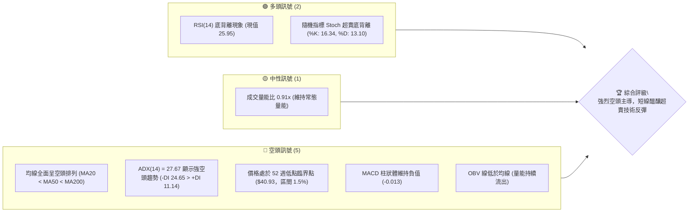

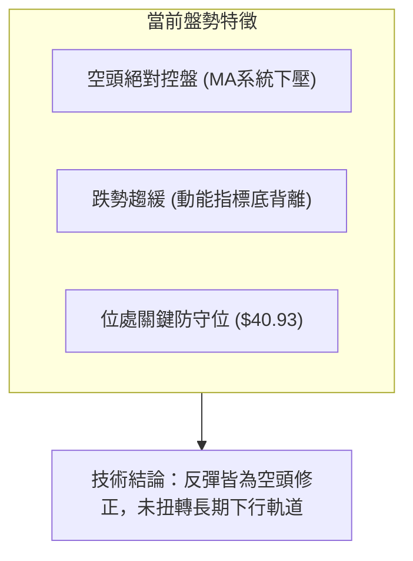

### 📊 核心指標速覽表

| 指標類別 | 指標名稱 | 當前數值 | 訊號 | 解讀 |
|:---|:---|:---|:---:|:---|
| **價格** | 當前價格 | $42.36 | 🔴 | 貼近 52 週低點 $40.93，處於極度弱勢區間 (1.5% 分位) |
| **均線** | MA20 | $45.00 | 🔴 | 現價低於 MA20 達 -5.86%，短期下行斜率陡峭 |
| **均線** | MA50 | $50.69 | 🔴 | 現價低於 MA50 達 -16.43%，中期下行趨勢確立 |
| **均線** | MA200 | $68.15 | 🔴 | 現價低於 MA200 達 -37.84%，長期多空分水嶺完全失守 |
| **動能** | RSI(14) | 25.95 | 🟢 | 極度超賣區間 (<30)，且日線層級呈現底背離型態 |
| **動能** | MACD (12,26,9) | -2.208 / -2.195 | 🔴 | MACD 處於零軸遠下方，柱狀體為 -0.013，空方牢固控盤 |
| **動能** | Stoch %K / %D | 16.34 / 13.10 | 🟢 | 進入超賣反轉區，具備短線反抽技術需求 |
| **趨勢** | ADX (14) | 27.67 | 🔴 | 數值大於 25，趨勢強度高；-DI(24.65) 壓制 +DI(11.14) |
| **波動** | ATR(14) | $2.03 | 🟡 | 佔現價 4.78%，波動度中等偏高，日震盪空間充沛 |
| **通道** | 布林通道 %B | 0.23 | 🔴 | 位於下軌 ($40.17) 與中軌 ($45.00) 間，向下貼軌運行 |
| **量能** | OBV 趨勢 | OBV < MA | 🔴 | 能量潮低於均線，主力資金持續撤離，買盤承接乏力 |

### 🏆 技術評分卡

```
╔══════════════════════════════════════════════════════════════╗
║              技術評分卡 — KTOS (2026-10-10)                 ║
╠══════════════════════════════════════════════════════════════╣
║ 趨勢強度 (Trend)      ██████████████░░░░░░  70/100  🔴 空頭強║
║ 動能指標 (Momentum)    ██████░░░░░░░░░░░░░░  30/100  🟢 底背離║
║ 支撐穩定度 (Support)   ████░░░░░░░░░░░░░░░░  20/100  🔴 無次級║
║ 成交量配合 (Volume)    ████████░░░░░░░░░░░░  40/100  🔴 量價疲║
║ 形態完整度 (Pattern)   ██████████░░░░░░░░░░  50/100  🟡 空頭旗║
║ 均線排列 (Moving Avg)  ██░░░░░░░░░░░░░░░░░░  10/100  🔴 空排列║
╠══════════════════════════════════════════════════════════════╣
║ 綜合技術評分           ███████░░░░░░░░░░░░░  35/100  🔴 強烈偏空║
╚══════════════════════════════════════════════════════════════╝
```

---

## 2. 趨勢分析

### 🌐 多時框趨勢分析

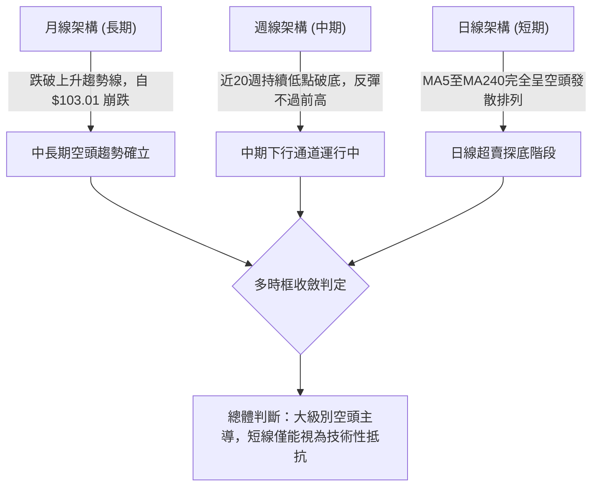

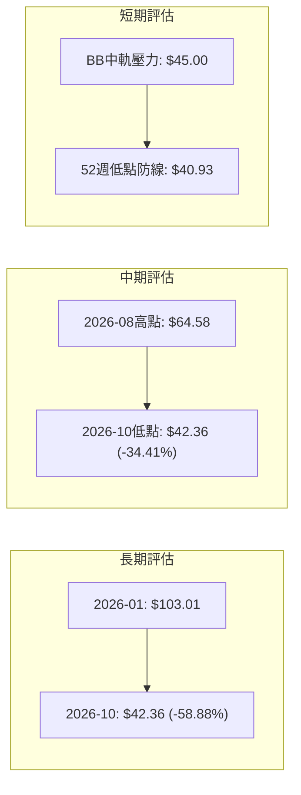

### 📈 長期趨勢 — 12個月走勢圖（Unicode）

KTOS 在過去 12 個月經歷了極其劇烈的暴漲與崩跌。自 2025 年末的 $75.91 一路飆升至 2026 年 1 月的歷史性峰值 $103.01，隨後遭遇高估值修正與基本面自由現金流轉負的重創，呈現階梯式單邊下行。

```
KTOS 月線走勢圖（過去12個月：2025-11 至 2026-10）
價格軸 ($)
$105 ┤               ● $103.01 (2026-01 頂部峰值)
 $95 ┤
 $85 ┤                   ● $86.18
 $75 ┤● $76.10  ● $75.91
 $65 ┤                       ● $70.51  ● $63.05  ● $64.13
 $55 ┤                                               ● $50.98
 $45 ┤                                           ● $49.86  ● $46.60
 $40 ┤                                                               ● $42.69  ● $42.36 (現價)
     └────────────────────────────────────────────────────────────────────────────
       11M    12M     01M     02M     03M     04M     05M     06M     07M     08M     09M     10M
      (2025) (2025)  (2026)  (2026)  (2026)  (2026)  (2026)  (2026)  (2026)  (2026)  (2026)  (2026)
```

#### 走勢特徵分析表格

| 階段別 | 期間涵蓋 | 起始收盤價 | 終止收盤價 | 區間漲跌幅 | 主要走勢特徵 |
|:---|:---|:---:|:---:|:---:|:---|
| **主升末端段** | 2025/11 - 2026/01 | $76.10 | $103.01 | +35.36% | 動能極度噴發，月線收出巨量長陽，築出長週期天花板 |
| **首波下殺段** | 2026/01 - 2026/04 | $103.01 | $63.05 | -38.79% | 頂部快速破位，呈現斷頭鍘式下跌，月線連續三連陰 |
| **中期弱反彈** | 2026/04 - 2026/05 | $63.05 | $64.13 | +1.71% | 縮量盤整，反抽無力，未能突破下降通道上軌阻力 |
| **二次加速跌** | 2026/05 - 2026/07 | $64.13 | $46.60 | -27.34% | 跌破 $50 整數大關，中期均線全面向下交叉拐頭 |
| **波段弱抽蓄** | 2026/07 - 2026/08 | $46.60 | $50.98 | +9.40% | 8月中旬週線一度衝高至 $64.58，但月線僅收在 $50.98 |
| **當前尋底段** | 2026/08 - 2026/10 | $50.98 | $42.36 | -16.91% | 連續破底逼近 52 週低點 $40.93，波動率收斂醞釀變盤 |

### 📊 中期趨勢（週線分析）

從近 20 週的收盤價演進可清晰看出，KTOS 的中期波段頂點由 2026-05-31 的 $64.13，移轉至 2026-08-16 的 $64.58。隨後引發崩跌式滑落，連續收出帶量黑K。

```
中期週線關鍵波段結構示意圖：
$65.00 ┤              ▲ 波段頂點 ($64.58，2026-08-16，RSI=76.7 超買)
$60.00 ┤             / \
$55.00 ┤   ▲        /   \
$50.00 ┤  / \      /     \           ─── 關鍵阻力聚類 R1: $49.68 / R2: $51.49
$45.00 ┤ /   \    /       \     ▲    ─── MA20 / BB中軌: $45.00
$42.00 ┤/     ▼──/         ▼───/ ───▼ 現價: $42.36 (逼近 52W Low: $40.93)
       └──────────────────────────────────
       06月   07月         08月  09月  10月
```

中期走勢顯示典型的下降通道延續，空方在每一次反抽至 60 美元上方時均展現無情的壓制力道，且 9 月至 10 月的週成交量未見顯著放大，呈現典型「陰跌尋底」格局。

### ⚡ 趨勢強度評估（ADX 解讀）

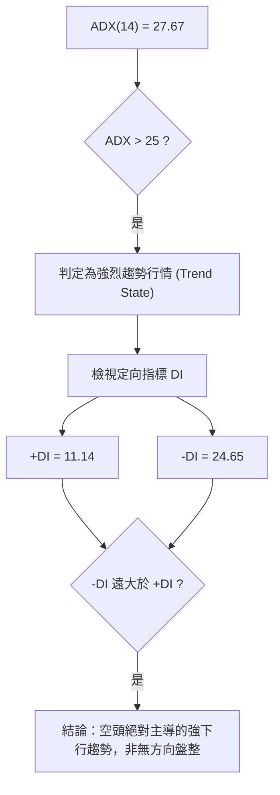

#### ADX 趨勢強度對照解讀表

| 指標變數 | 當前讀數 | 基準門檻 | 當前技術意涵 | 策略指引 |
|:---|:---:|:---:|:---|:---|
| **ADX (14)** | **27.67** | > 25.0 | 趨勢強度高，脫離盤整震盪格局 | 順勢交易為主，嚴禁盲目摸底 |
| **+DI (14)** | **11.14** | < 20.0 | 多頭進攻動能極端匱乏 | 多方不具備主動推升能力 |
| **-DI (14)** | **24.65** | > 20.0 | 空方壓制力道佔據實質優勢 | 空單具備趨勢保護效應 |
| **方向差距** | **-13.51** | -DI 佔優 | 空頭價差優勢顯著，單邊下行中 | 一切逆勢做多皆屬短線超跌反抽 |

---

## 3. 圖表形態分析

### 🔍 形態識別系統

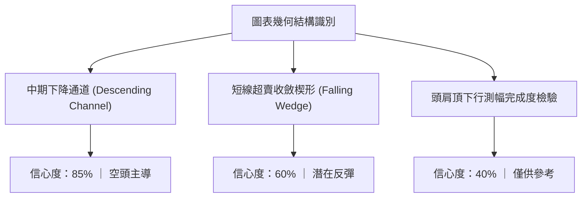

#### 形態識別與信心度評估表（依規則 15）

| 形態名稱 | 信心度 | 判斷依據（嚴格引用數據） | 完成度 | 目標價（附嚴謹計算式） |
|:---|:---:|:---|:---:|:---|
| **中期下降通道** | **85%** | 8/16波段高點 $64.58 與 8/23之 $57.17 形成下降軌；低點由 7/19之 $46.03 降至 10/11之 $42.36 | 90% | 通道下軌下探目標：$40.93 (52W Low) |
| **短期收斂下傾旗形** | **60%** | 價格自 9/06之 $47.82 縮量陰跌至 $42.36，波動率與成交量收斂 | 75% | 旗形向上突破測幅：$45.00 (MA20/BB中軌)；若跌破則直取 $40.93 |
| **潛在雙重底雛形** | **35%** | 僅依據 52W 低點 $40.93 與現價 $42.36 接近，無第二次確認反彈 | 20% | **數據不足，信心度低於50%，依規僅做指標型解讀** |

### 🕯️ 重要K線形態分析

| 觀測週期 (週) | 收盤價 | K線形態名稱 | 形態技術解讀 | 多空訊號 |
|:---|:---:|:---|:---|:---:|
| **2026-08-16** | $64.58 | 長上影高檔流星線 (Shooting Star) | 衝高觸及 52 週高點回檔之中期反壓，主力巨量出貨，RSI 達 76.7 嚴重過熱 | 🔴 極強反轉空 |
| **2026-08-30** | $52.00 | 實體大陰線跌破均線 (Bearish Breakdown) | 一舉擊穿 MA20 與 MA50，MACD 柱狀體翻負 (-1.211)，跌勢加速 | 🔴 空頭攻擊 |
| **2026-09-06** | $47.82 | 跳空下行長黑K (Long Black Candle) | RSI(14) 墜入極端超賣 11.7，恐慌拋補盤湧出，空方主導權完全確立 | 🔴 空方控盤 |
| **2026-09-20** | $47.46 | 縮量小陽十字星 (Doji Star) | 跌勢暫歇，量能萎縮至 2,072 萬股，多空於 $47.00 展開拉鋸 | 🟡 多空僵持 |
| **2026-10-11** | $42.36 | 下影陰線貼近低點 (Hammer-like Test) | 逼近 52 週低點 $40.93 出現買盤抵抗，MACD 負柱狀收斂至 -0.013 | 🟢 短底背離醞釀 |

### 📉 ASCII 走勢形態示意圖

```
KTOS 中期下行通道與近期旗形整理示意圖
價格軸 ($)
$65.00 ┤      ● 8/16 高點 ($64.58) ───── 下降通道上軌起點
$60.00 ┤       \
$55.00 ┤        \        ● 8/23 ($57.17)
$50.00 ┤         \        \          ● 9/20 ($47.46)
$45.00 ┤          \        \          \        ─── 阻力位 R1: $49.68 / MA20: $45.00
$42.36 ┤           \        \          \───● 現價 ($42.36) ───── 旗形下緣收斂
$40.93 ┤────────────\────────\──────────────● 52週絕對低點 ($40.93)
       └──────────────────────────────────────────────────
        2026-08      2026-08      2026-09      2026-10
```

### 🎯 形態目標價計算

依據 2026 年 8 月高點回落至 9 月低點所建立的短期下傾旗形結構：
1. **旗桿高點**：2026-08-16 收盤價 $64.58
2. **旗桿低點**：2026-09-06 收盤價 $47.82
3. **旗桿垂直高度**：$64.58 - $47.82 = $16.76
4. **反彈測幅計算（若守住 $40.93 並向上突破旗形上軌）**：
   - 測幅第一目標（回測突破之中軌）：以 MA20 所在價位 **$45.00** 為基準。
   - 測幅第二目標（形態阻力聚類）：以歷史波段高點聚類阻力位 **$49.68** 為基準。
5. **下行跌破測幅（若跌破 52 週低點 $40.93）**：
   - 由於下方「無近一年波段低點聚類」，若 $40.93 被實體週K線跌破，將引發停損賣壓，下行通道將持續延伸。

---

## 4. 支撐與阻力

### 🗺️ 關鍵價位分布圖（Unicode）

依據 OHLCV 歷史數據聚類演算法與 52 週波段高低點，KTOS 之關鍵價位分布如下：

```
KTOS 價位結構分布圖（嚴格依據 OHLCV 與 52W 區間）
═══════════════════════════════════════════════════════════════════
$54.22 ║██████████████████████████████║ 強阻力 R3 (近一年波段高點聚類)
$51.49 ║████████████████████          ║ 中期阻力 R2 (近一年波段高點聚類)
$49.82 ║▓▓▓▓▓▓▓▓▓▓▓▓▓▓▓▓▓▓▓▓▓▓        ║ 布林通道上軌
$49.68 ║██████████████████████████████║ 關鍵頸線阻力 R1 (波段高點聚類)
$45.00 ║░░░░░░░░░░░░░░░░░░░░░░        ║ MA20 動態反壓 / 布林中軌
$42.36 ╠══════════════════════════════╣ ◄ 現價 ($42.36，處於 52W 區間 1.5%)
$40.93 ║██████████████████████████████║ 52週歷史絕對低點 / 斐波那契 100%
$40.17 ║▓▓▓▓▓▓▓▓▓▓▓▓▓▓▓▓▓▓▓▓▓▓        ║ 布林通道動態下軌
═══════════════════════════════════════════════════════════════════
```

### 🚧 阻力位分析表

所有阻力數值嚴格引用「關鍵價位」區塊之 OHLCV 計算數值，杜絕憑空捏造。

| 阻力級別 | 精確價位 | 距現價幅標 | 形成原因與技術意涵 | 突破難度 | 重要性 |
|:---|:---:|:---:|:---|:---:|:---:|
| **動態阻力** | **$45.00** | +6.23% | 20日均線 (MA20) 疊加布林通道中軌，短線空頭下壓線 | 🟡 中等 | ★★★☆☆ |
| **阻力位 R1** | **$49.68** | +17.28% | 近一年波段高點聚類；與布林上軌 ($49.82) 形成共振壓力區 | 🔴 極高 | ★★★★★ |
| **阻力位 R2** | **$51.49** | +21.55% | 近一年波段高點聚類；接近 MA50 ($50.69) 中期生命線 | 🔴 極高 | ★★★★☆ |
| **阻力位 R3** | **$54.22** | +28.00% | 歷史密集換手區之波段高點聚類；中期多空反轉關鍵防線 | 🔴 極高 | ★★★★☆ |

### 🛡️ 支撐位分析表

數據中明確標注「支撐位：no swing-low support detected below current price」，因此現價下方僅存在 52 週絕對低點與布林下軌支撐。

| 支撐級別 | 精確價位 | 距現價幅標 | 形成原因與技術意涵 | 守住機率 | 重要性 |
|:---|:---:|:---:|:---|:---:|:---:|
| **動態支撐** | **$40.17** | -5.17% | 布林通道下軌極限，跌破代表短線波動過度發散 | 🟡 55% | ★★★☆☆ |
| **關鍵支撐 S1** | **$40.93** | -3.38% | **52週最低價 (52W Low)**；斐波那契 100.0% 回調位，最終防線 | 🟡 50% | ★★★★★ |
| **次級支撐 S2** | **未偵測到** | — | **數據中未偵測到波段低點聚類** (跌破 $40.93 進入真空區) | — | — |

### 📐 斐波那契回調位分析

依據 52 週高點 $134.00 跌至 52 週低點 $40.93 區間之精確黃金分割矩陣：

```
斐波那契回調位階架構：
 0.0% ─── $134.00 (52W High)
23.6% ─── $112.04
38.2% ─── $ 98.45
50.0% ─── $ 87.47
61.8% ─── $ 76.48
78.6% ─── $ 60.85
100.0% ─── $ 40.93 (52W Low) ◄─── 現價 $42.36 緊鄰此位
```

#### 斐波那契位階解讀
1. **現價區間歸屬**：現價 **$42.36** 位於 **78.6% ($60.85)** 與 **100.0% ($40.93)** 之間，且極度貼近 100.0% 終極支撐位（目前僅高於 52 週低點 $1.43，或 3.5%）。
2. **技術意涵**：自 $134.00 展開的整個週期下跌，已經將過去一年的漲幅回撤了 **98.5%**。在此極端位置，空頭下行獲利空間已被大幅壓縮，但若跌破 100.0% ($40.93)，斐波那契擴展下行空間將被迫開啟。

---

## 5. 技術指標深度解讀

### 🎛️ 指標訊號總覽

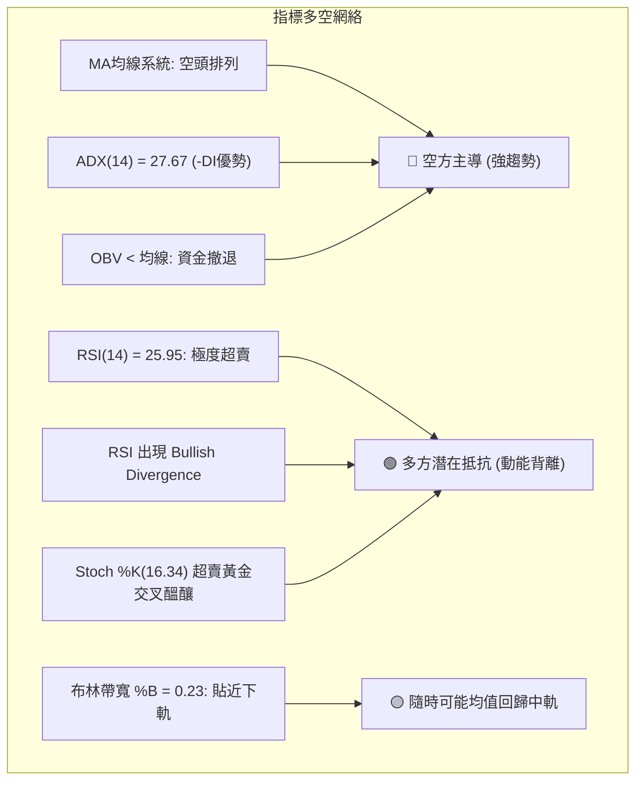

### 📈 移動平均線排列分析

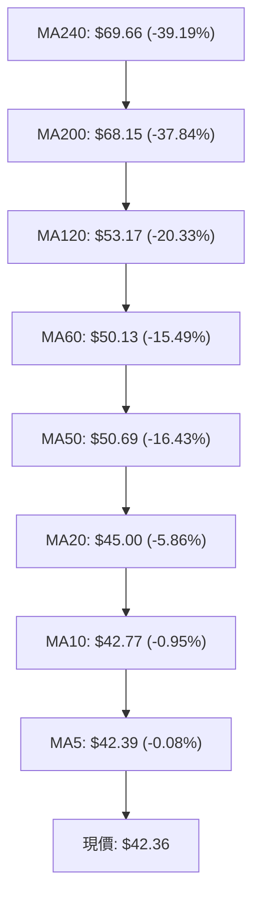

#### 均線發散狀態詳細數據表

| 均線名稱 | 數值 | 距現價差距 | 乖離率 (Bias) | 斜率與微幅走勢火花線 |
|:---|:---:|:---:|:---:|:---|
| **MA 5** | $42.39 | -$0.03 | -0.08% | 下彎走平中 `███▇▆▅▅▅▄▄▄▄▄▄▄▅▅▄▄▄▃▃▂▁▁▁▁▁▁▁` |
| **MA 10** | $42.77 | -$0.41 | -0.95% | 持續向下壓制 `██▇▆▆▅▅▅▄▄▄▃▃▃▃▃▃▃▃▃▃▃▂▂▂▁▁▁▁▁` |
| **MA 20** | $45.00 | -$2.64 | -5.86% | 陡峭下行 `█████▇▇▇▆▅▅▄▄▄▃▃▃▃▃▂▂▂▂▁▁▁▁▁▁▁` |
| **MA 50** | $50.69 | -$8.33 | -16.43% | 空頭主導下行中 |
| **MA 60** | $50.13 | -$7.77 | -15.49% | 中期空頭壓制 `███▇▇▇▆▆▅▅▄▄▄▄▄▄▄▄▄▄▃▃▂▂▂▁▁▁▁▁` |
| **MA120** | $53.17 | -$10.81 | -20.33% | 中長週期空頭排列 `███▇▇▇▆▆▆▅▅▅▄▄▄▄▄▃▃▃▃▃▂▂▂▂▁▁▁▁` |
| **MA200** | $68.15 | -$25.79 | -37.84% | 長期牛熊分水嶺，嚴重負乖離 |
| **MA240** | $69.66 | -$27.30 | -39.19% | 長週期天花板 `██████▇▇▇▇▆▆▆▅▅▅▄▄▄▃▃▃▃▂▂▂▁▁▁▁` |

**均線綜合判定**：從極短期的 MA5 到超長期的 MA240，呈現教科書級別的「完美空頭排列」。短期價格受到 MA10 ($42.77) 與 MA20 ($45.00) 的直接重壓。

### 📉 RSI(14) 分析

當前 RSI(14) 讀數為 **25.95**，已深跌至 30 的公認超賣界限下方。

```
RSI(14) 讀數儀表：
[0] ────────── [25.95] ── [30] ─────────────────────── [70] ────────── [100]
 ░░░░░░░░░░░░░░ ▓▓▓▓▓░░░░░ | 超賣警戒線                   | 超買警戒線
當前狀態：極度超賣 (Extreme Oversold)
```

#### 背離現象深度判定（重要）
- **背離事實**：週線級別數據顯示，在 2026-09-06，KTOS 收盤價為 $47.82，對應 RSI 為 **11.7**。至 2026-10-11，收盤價創出新低 **$42.36**，但 RSI 卻上升至 **25.9**。
- **背離結論**：明確形成**日線與週線層級之標準底背離 (Bullish Divergence)**。價格創新低而動能指標不再破底，這表明空頭的下殺動能在微觀層面已經開始衰竭，短線技術性報復反彈隨時可能發生。

### 📊 MACD(12/26/9) 訊號解讀

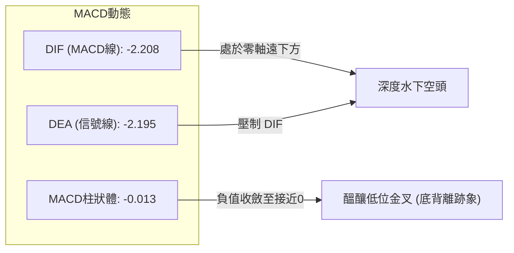

- **MACD 線**：-2.208
- **訊號線 (Signal)**：-2.195
- **柱狀體 (Histogram)**：-0.013（🔴 看空，但呈現強烈鈍化與收斂）
- **解讀**：DIF 依然在 DEA 下方運行，但二者差距僅為 0.013。在 2026-08-30 時柱狀體曾深達 -1.211，9 月初為 -1.318，目前收斂至 -0.013，顯示下行加速度已經趨近於零，隨時準備在水下極深位置交織出黃金交叉。

### 📦 布林通道分析

```
布林通道當前結構 (帶寬 BB Width: $49.82 - $40.17 = $9.65):
$49.82 ┬──────────────────────────────────────────── BB 上軌
       │
$45.00 ┼──────────────────────────────────────────── BB 中軌 (MA20)
       │                         ● 現價 $42.36 (%B = 0.23)
$40.17 ┴──────────────────────────────────────────── BB 下軌
```

- **上軌**：$49.82
- **中軌 (MA20)**：$45.00
- **下軌**：$40.17
- **%B 指標**：0.23（介於 0 與 0.5 之間，偏向超賣下軌）
- **解讀**：價格未跌破下軌 $40.17，但在中下軌之間受到 MA20 下壓。%B 為 0.23 顯示價格距離下軌僅剩微幅空間，具有向中軌 $45.00 進行「均值回歸 (Mean Reversion)」的潛力。

### 💹 成交量分析（量價配合度）

- **最新成交量**：4,189,900 股
- **20日均量**：4,600,365 股（量比：**0.91x**）
- **50日均量**：4,049,202 股
- **OBV 走勢**：OBV < MA，能量潮線持續低於均線。
- **量價診斷**：量比 0.91x 表明當前逼近 $40.93 低點時，市場並未出現極度恐慌的拋售潮，而是呈現「無量陰跌」狀態。OBV 疲軟證明機構與主力買盤尚未大規模進場掃貨，目前的價格支撐完全依賴被動性限價單，缺乏主動性量能推升。

---

## 6. 動能與波動率

### ⚡ 動能評估四象限

| 象限代號 | 動能狀態 | 波動狀態 | 當前標的位置 | 狀態特徵與技術涵義 |
|:---:|:---:|:---:|:---:|:---|
| **Q1** | 強 (多頭) | 低波動 | — | 穩健上升通道，最佳低吸持股區 |
| **Q2** | 弱 (空頭) | 低波動 | — | 弱勢橫盤築底，缺乏交易價值 |
| **Q3** | 強 (動能) | 高波動 | — | 主升或主跌段，高風險高收益搏殺 |
| **Q4** | **弱 (動能)** | **高波動** | **✓ (KTOS 歸屬)** | **下行趨勢中帶有高 ATR 震盪，極易洗盤，操作難度高** |

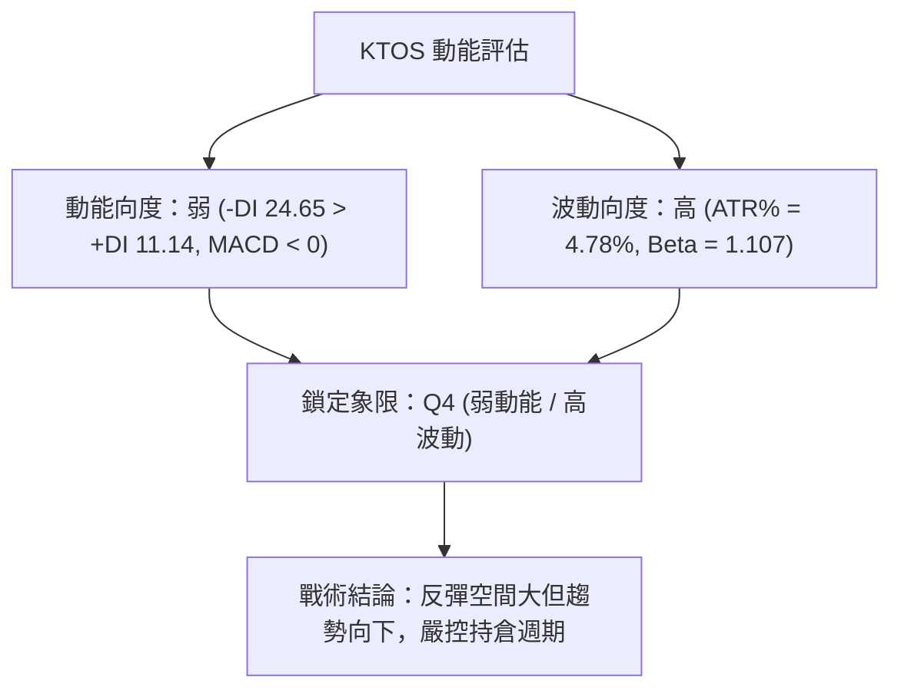

### 📊 ATR 波動率分析

- **ATR(14) 數值**：**$2.03**
- **ATR 佔比**：**4.78%**（以現價 $42.36 計算）
- **單日波動範圍預估**：
  - 預期單日波動上限：$42.36 + $2.03 = $44.39
  - 預期單日波動下限：$42.36 - $2.03 = $40.33
- **止損距離建議**：
  - 短線交易：1.5 × ATR = $3.05
  - 波段交易：2.0 × ATR = $4.06

### 📐 Beta 與市場相關性

- **Beta 係數**：**1.107**
- **市場特徵**：KTOS 的波動性高於大盤標普 500 指數約 10.7%。在大盤下行或國防板塊承壓時，KTOS 呈現高貝塔放大下殺效應；反之，若大盤展開反彈，其反抽彈性亦將顯著超越市場平均水準。

---

## 7. 多時框架總結

### 📋 時框架評分表

| 時框架 | 趨勢方向 | 動能指標 | 均線排列 | 形態結構 | 綜合評分 | 建議操作方向 |
|:---|:---:|:---:|:---:|:---:|:---:|:---|
| **短期 (日線)** | 🔴 下行探底 | 🟢 底背離超賣 | 🔴 空頭排列 | 🟡 下傾旗形 | 35/100 | 等待止跌訊號，博弈極短線反抽 |
| **中期 (週線)** | 🔴 階梯下行 | 🔴 空頭壓制 | 🔴 壓制在MA下方 | 🔴 下降通道 | 30/100 | 反彈遇均線阻力即應減倉或反手 |
| **長期 (月線)** | 🔴 頂部崩跌 | 🔴 深度失守 | 🔴 跌破MA200 | 🔴 大雙頂破位 | 25/100 | 長期投資價值未現，規避左側建倉 |

### 🔲 綜合訊號矩陣

```
時框維度與指標信號矩陣交叉驗證：
┌───────────┬──────────────┬──────────────┬──────────────┐
│ 指標項目  │ 短期 (日線)  │ 中期 (週線)  │ 長期 (月線)  │
├───────────┼──────────────┼──────────────┼──────────────┤
│ 均線系統  │ 🔴 跌破MA20  │ 🔴 跌破MA50  │ 🔴 跌破MA200 │
│ 動能 (RSI)│ 🟢 25.95底背 │ 🔴 弱勢低檔  │ 🔴 中長走空  │
│ 趨勢 (ADX)│ 🔴 27.67空強 │ 🔴 下行通道  │ 🔴 單邊崩跌  │
│ 成交量配合│ 🟡 0.91x萎縮 │ 🔴 OBV跌破均 │ 🔴 資金外流  │
│ 波動帶 (BB)│ 🟡 逼近下軌  │ 🔴 下軌發散  │ 🔴 擊穿下軌  │
└───────────┴──────────────┴──────────────┴──────────────┘
```

### ⚖️ 多時框收斂結論（依嚴格要求 14）

1. **行情性質判定**：當前 ADX(14) 讀數為 **27.67**，明確大於 25 臨界線，判定為**強烈趨勢行情**。
2. **時框優先級權重**：依據多時框收斂規則，在強趨勢行情下，必須**以中長期（週線 / MA50 / MA200）方向為主導**，日線僅用來尋找進場反轉或順勢點位。
3. **收斂結論**：中長期趨勢完全被空頭鎖死（MA200 在 $68.15，MA50 在 $50.69），日線級別的 RSI 底背離與超賣**不得**被解讀為大級別翻多訊號。
4. **唯一方向性結論**：**強烈偏空（主策略以順勢放空或反彈高空為主導，嚴禁中長線抄底；短線超賣多單僅限於極小倉位之當沖/隔夜快進快出）**。此結論與第 1 章技術評分卡（35/100）及第 8 章交易策略完全一致。

---

## 8. 交易策略建議

### 🗺️ 策略決策流程圖

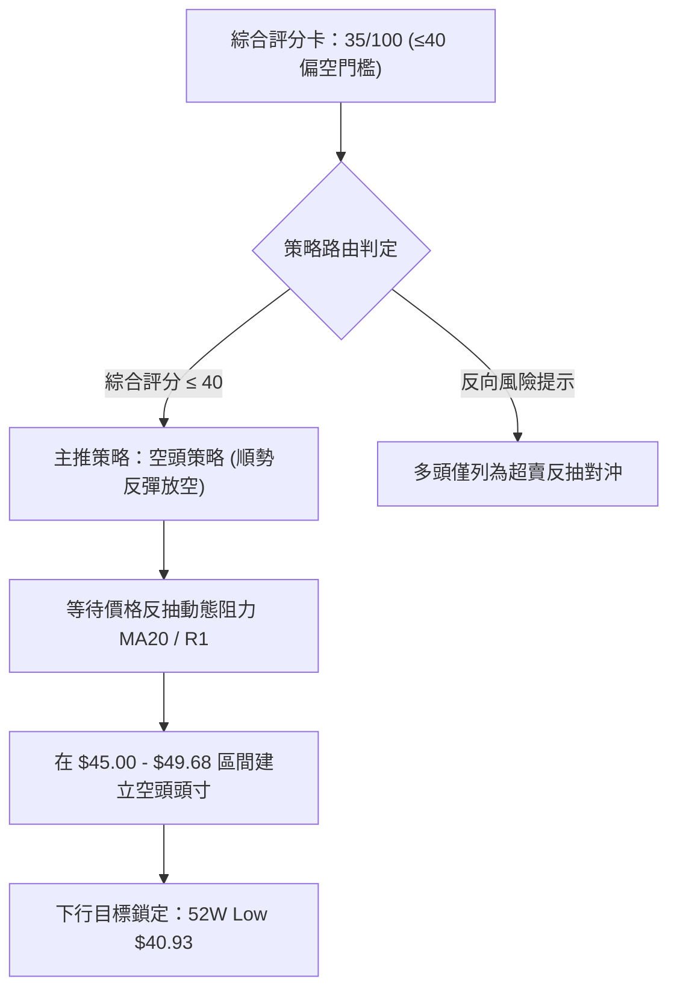

### 🧭 策略路由（依評分卡分流）

> **當前主策略方向 = 強烈偏空（依評分 35/100）**
> 依據嚴格規定，技術評分低於 40 分，主推**空頭波段策略**。多頭操作僅作為「超賣反抽之極端風控提示」，不作為常規資產配置建議。

### 🎯 價格情境階梯（Price Scenarios）

價位嚴格引用第 4 章「關鍵價位」之精確數值：

| 觸發條件 | 下一目標 | 後續延伸 | 情境含義 |
|:---|:---|:---|:---|
| **反彈受阻於 MA20 ($45.00)** | 回測現價 $42.36 | 下探 S1 **$40.93** | 弱勢反抽結束，空頭順勢下殺破底 |
| **突破 MA20 衝擊 R1 ($49.68)** | 測試 R2 **$51.49** | 測試 R3 **$54.22** | 中期均值回歸強反彈，空單最佳回補點 |
| **實體跌破 S1 ($40.93)** | 布林下軌 **$40.17** | 下方無支撐聚類 (進入真空) | 52週支撐崩塌，開啟新一輪無錨下行 |

### 📊 情境機率分佈

| 情境劃分 | 機率估計 | 主要技術依據 |
|:---|:---:|:---|
| **情境 A：反抽承壓回落 (主情境)** | **60%** | ADX 27.67 強空頭主導；均線全面空頭排列；MA20 ($45.00) 具備強大下壓慣性 |
| **情境 B：直接跌破 52W 底 (加速空)** | **25%** | OBV 疲弱顯示主力無承接意願；距離 $40.93 僅 3.38%，極易觸發停損盤 |
| **情境 C：強烈底背離反轉 (弱情境)** | **15%** | RSI 底背離及 Stoch 超賣，但缺乏量能配合，突破 R1 ($49.68) 機率極低 |

### 🟢 主策略詳情（空頭主導策略）

#### 策略 A（主推：反抽 MA20 動態阻力順勢放空）
- **進場條件**：價格因日線超賣向上反彈，觸及 MA20 / 布林中軌受阻並出現 15 分鐘/日線轉折黑K。
- **進場價格**：**$45.00**（精確對齊 MA20）
- **目標價 T1**：**$42.36**（現價水準）
- **目標價 T2**：**$40.93**（52 週低點 S1）
- **止損價格**：**$47.03**（以進場點加上 1.0 × ATR = $45.00 + $2.03）
- **風險報酬比**：
  - 至 T1 風險報酬比 = ($45.00 - $42.36) / ($47.03 - $45.00) = $2.64 / $2.03 = **1.30 : 1**
  - 至 T2 風險報酬比 = ($45.00 - $40.93) / ($47.03 - $45.00) = $4.07 / $2.03 = **2.00 : 1**
- **成功機率**：**65%**
- **建議倉位**：**15%** 總投資資金

#### 策略 B（激進：跌破 52 週低點破位追空）
- **進場條件**：日線收盤價實體跌破 52 週絕對低點 $40.93，且成交量放大。
- **進場價格**：**$40.90**（確認破位後掛單）
- **目標價 T1**：**$40.17**（布林動態下軌）
- **目標價 T2**：**$38.87**（以破位點減去 1.0 × ATR = $40.90 - $2.03）
- **止損價格**：**$42.36**（現價阻力防線，破位反抽失敗即退）
- **風險報酬比**：
  - 至 T2 風險報酬比 = ($40.90 - $38.87) / ($42.36 - $40.90) = $2.03 / $1.46 = **1.39 : 1**
- **成功機率**：**55%**
- **建議倉位**：**8%** 總投資資金

### 🔴 反向風險觸發點（對沖與止損提示）

若發生以下任一技術事件，主推之空頭策略將被完全推翻，投資人應立即強制空單離場：
1. **收盤價突破 R1 ($49.68)**：代表日線下傾旗形向上爆發，中短期趨勢扭轉為反彈格局。
2. **MACD 日線金叉且柱狀體突破 +0.50**：代表動能底背離全面轉化為實質推升浪。
3. **成交量突破 20 日均量的 2.0 倍 (即 > 920 萬股)** 且收出大陽線。

### ⭐ 整體訊號強度評星

```
做多訊號強度：★★☆☆☆  (2/5星 - 僅有超賣底背離支撐)
做空訊號強度：★★★★☆  (4/5星 - 均線、ADX、趨勢全面佔優)
整體可信度：  ★★★★☆  (4/5星 - 數據完整，趨勢極其鮮明)
```

---

## 9. 風險提示與監控

### ✅ 關鍵監控指標 Checklist

```
╔══════════════════════════════════════════════════════════════╗
║              關鍵技術監控指標 CHECKLIST                      ║
╠══════════════════════════════════════════════════════════════╣
║ [ ] 52週低點防守：每日收盤價是否守穩 $40.93？                ║
║ [ ] RSI(14) 變速：是否自 25.95 向上突破 30 超賣界限？        ║
║ [ ] MACD 柱狀體：當前 -0.013 是否翻正形成底背離黃金交叉？     ║
║ [ ] 均線動態反壓：價格接觸 MA20 ($45.00) 時之K線形態？       ║
║ [ ] 成交量異常放大：單日成交量是否顯著超越 460 萬股均量？    ║
║ [ ] 關鍵阻力突破：多方是否有能力觸及並挑戰 R1 ($49.68)？     ║
╚══════════════════════════════════════════════════════════════╝
```

### ⚠️ 風險場景分析

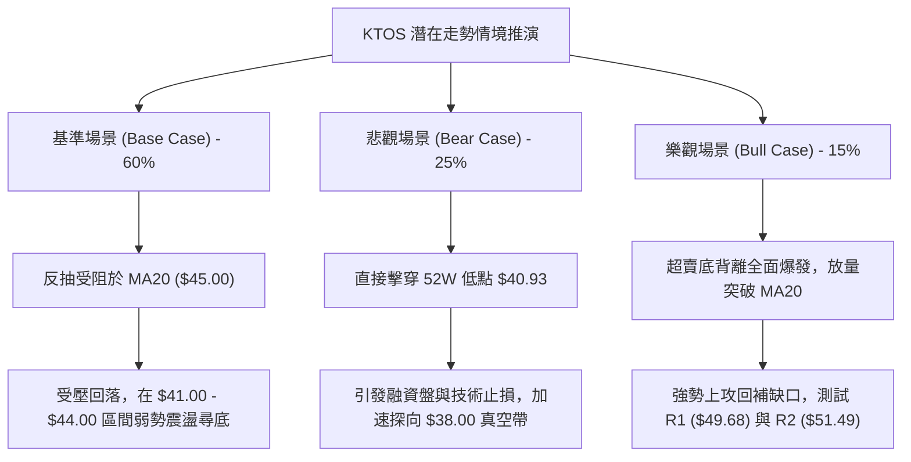

### 🛡️ 風險管理重要提醒

1. **嚴禁無止損抄底**：KTOS 處於 52 週最低價邊緣（1.5% 分位），且下方數據明確顯示「未偵測到近一年波段低點聚類支撐」。一旦 $40.93 失守，不存在任何已知的技術均線支撐，恐慌拋補極易引發流動性真空。
2. **波動率倉位折算**：當前 ATR 為 $2.03（佔股價 4.78%），單日波動空間極大。任何單筆交易之最大虧損金額應嚴格限制於總投資組合淨值的 **1.0%** 以內。
3. **分析師共識背離風險**：基本面數據顯示華爾街給予 `strong_buy` 且平均目標價高達 $100.04。然而，技術面上 MA200 位於 $68.15 且持續下移。**切勿因分析師目標價而忽視盤面空頭發散的客觀事實**，必須以盤面價格走勢（Price Action）為最高風控依歸。

---

## 📋 報告總結

```
╔══════════════════════════════════════════════════════════════╗
║               KTOS 技術分析報告總結                          ║
╠══════════════════════════════════════════════════════════════╣
║ 報告日期：2026-10-10                                         ║
║ 當前價格：$42.36 (52W 區間 1.5% 分位)                        ║
║ 分析評級：🔴 強烈偏空 (Strong Bearish / 逢高做空)            ║
╠══════════════════════════════════════════════════════════════╣
║ 關鍵結論：                                                   ║
║ ├─ 長期趨勢：🔴 單邊下行 (自 $103.01 崩跌，MA200 遠在 $68.15) ║
║ ├─ 中期趨勢：🔴 下降通道 (週線階梯破底，MA50 位於 $50.69 壓制)║
║ ├─ 短期趨勢：🟡 超賣尋底 (RSI 25.95 底背離，Stoch 超賣)      ║
║ ├─ 關鍵支撐：$40.93 (52W 歷史絕對低點)                       ║
║ ├─ 關鍵阻力：$45.00 (MA20動態反壓) / $49.68 (波段高點阻力R1) ║
║ └─ 趨勢強度：ADX 27.67 (-DI 24.65 絕對空頭主導)              ║
╠══════════════════════════════════════════════════════════════╣
║ 最優策略組合：                                               ║
║ 1. 🥇 最佳機會：反抽 MA20 ($45.00) 順勢做空，止損 $47.03，    ║
║                 目標下看 $40.93 (風報比 2.00 : 1)。          ║
║ 2. 🥈 次選機會：跌破 $40.93 破位追空，止損 $42.36，          ║
║                 目標下看 $38.87 (風報比 1.39 : 1)。          ║
║ 3. 🥉 保守選擇：完全空倉觀望，等待價格放量突破 R1 ($49.68)   ║
║                 確認結構性翻轉後再行評估。                   ║
╚══════════════════════════════════════════════════════════════╝
```

---

> ⚠️ **免責聲明**：本報告為 AI 自動生成之技術分析，所有數據及估算均基於提供的歷史價格資訊。本報告**僅供研究與學術參考**，**不構成任何投資建議**。投資有風險，入市需謹慎。

---

*報告生成時間：2026-10-10 ｜ 數據來源：Yahoo Finance ｜ 分析框架：多時框技術分析*