<details>
<summary>📊 靜態圖表 (點擊展開)</summary>
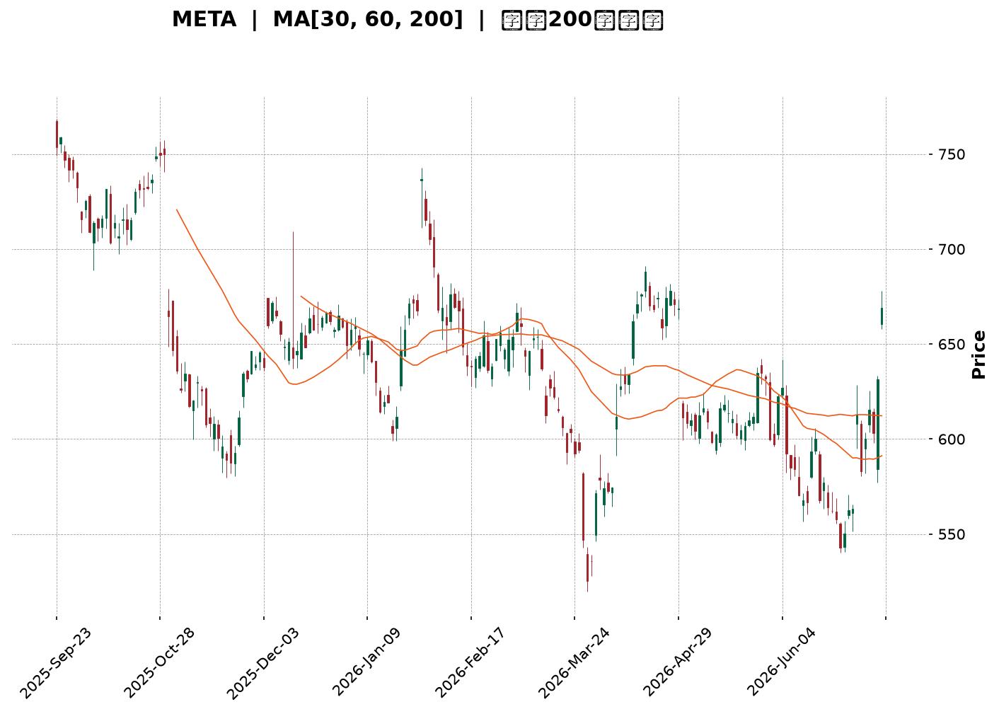
</details>

<html>
<head><meta charset="utf-8" /></head>
<body>
    <div style="height:500px; width:100%;">                        <script>window.PlotlyConfig = {MathJaxConfig: 'local'};</script>
        <script charset="utf-8" src="https://cdn.plot.ly/plotly-3.7.0.min.js" integrity="sha256-jvTGqxNp8AGWEcvNLVuKr+8j5dGe9Yw51LQkmDH+IYA=" crossorigin="anonymous"></script>                <div id="candlestick-chart" class="plotly-graph-div" style="height:100%; width:100%;"></div>            <script>                window.PLOTLYENV=window.PLOTLYENV || {};                                if (document.getElementById("candlestick-chart")) {                    Plotly.newPlot(                        "candlestick-chart",                        [{"close":{"dtype":"f8","bdata":"AAAAAIaLh0AAAACAfrWHQAAAAOC8V4dAAAAAwJAuh0AAAADAxSuHQAAAAMDM44ZAAAAAQNVbhkAAAADAT6mGQAAAAOC7JYZAAAAAoG1OhkAAAACA1zmGQAAAAMDSX4ZAAAAAoNvchkAAAABgw\u002fuFQAAAAEC\u002fToZAAAAAYH4WhkAAAABAgl2GQAAAAGDIMYZAAAAAYHtYhkAAAABgKtKGQAAAAGDx2oZAAAAAQA\u002fchkAAAACAxOCGQAAAAICOA4dAAAAAgPpmh0AAAAAA7WuHQAAAAMDCbYdAAAAAwO3FhEAAAABAWDWEQAAAACBy4INAAAAAoIqNg0AAAAAAZ9KDQAAAAOCsSoNAAAAAIMdgg0AAAABA+LCDQAAAAGCgi4NAAAAAAHH7gkAAAACgdgKDQAAAAEAI\u002f4JAAAAAQJbDgkAAAADgHaGCQAAAACBPZoJAAAAAQPlcgkAAAAAAq4WCQAAAAGCtG4NAAAAAgI7Ug0AAAAAgu7+DQAAAAEAnMoRAAAAAAKn5g0AAAAAAXyuEQAAAAOCG74NAAAAAAIOehEAAAACAYv2EQAAAAOCPyIRAAAAA4At6hEAAAABAjEOEQAAAAIAiWIRAAAAAYHgUhEAAAABA2zKEQAAAAMDWf4RAAAAAgL9ChEAAAACgIrqEQAAAAKDGjIRAAAAAoJOihEAAAABADL6EQAAAACDk0oRAAAAAAN+whEAAAAAgI4yEQAAAACAdxoRAAAAAQFGXhEAAAADgA0qEQAAAAIDvjIRAAAAAwIybhEAAAACgRzyEQAAAAOBGJ4RAAAAAQC1fhEAAAACAnQaEQAAAAAC7r4NAAAAAYGQzg0AAAACAjl2DQAAAACAqWYNAAAAAwFrYgkAAAADg8h6DQAAAAIDQM4RAAAAAQLKMhEAAAABgTfmEQAAAAGAs\u002foRAAAAAYFDchEAAAACA9geHQAAAACDLWYZAAAAAgDcJhkAAAAAgv5OFQAAAAOBj3oRAAAAAACLohEAAAAAAQqKEQAAAAOAcIIVAAAAAoDTshEAAAACg\u002ftuEQAAAAEA5RYRAAAAAAAz1g0AAAACANvGDQAAAAOCYEIRAAAAAIA4dhEAAAACg8HOEQAAAACDs4INAAAAAAEvxg0AAAABgNWSEQAAAAKC4foRAAAAAADU4hEAAAACAK2OEQAAAAABPb4RAAAAAAFTUhEAAAACAJpuEQAAAAKCxHYRAAAAAAOYxhEAAAAAgPmeEQAAAACCNbYRAAAAAYFnog0AAAAAA8CSDQAAAAMDzloNAAAAA4Kpwg0AAAAAg4TiDQAAAACAb8YJAAAAA4OGIgkAAAABgAdyCQAAAAMD3goJAAAAAoLaSgkAAAACAQxiBQAAAAIDdaYBAAAAAIBG\u002fgEAAAABAzdyBQAAAAKCMFYJAAAAAwGzvgUAAAABg6uOBQAAAAOAj9IFAAAAAwNIeg0AAAAAgd56DQAAAAMA2qoNAAAAAQIrPg0AAAAAgA6+EQAAAAGCq94RAAAAAIPIhhUAAAACgTH+FQAAAAGBP8oRAAAAAAMThhEAAAAAAwxCFQAAAAEBRlIRAAAAAYD0ThUAAAADg7i+FQAAAAEC\u002f9YRAAAAA4ADkhEAAAABAvxqDQAAAAKB9AYNAAAAAIMIOg0AAAADgMuOCQAAAAACAIoNAAAAAIOlBg0AAAAAghgiDQAAAAKBxsoJAAAAAgIjTgkAAAADgeECDQAAAAODbToNAAAAAQEotg0AAAAAAJxWDQAAAAIBq0IJAAAAAgP\u002fjgkAAAABgivaCQAAAAECPDYNAAAAAIC8eg0AAAADgX9WDQAAAACCd1YNAAAAAAGW\u002fg0AAAADAT7+CQAAAAOCcqIJAAAAAoDlzg0AAAABA6ZeDQAAAAICbg4JAAAAAoMhGgkAAAADAY0CCQAAAAECc04FAAAAAoDq\u002fgUAAAADAo7OBQAAAAADXi4JAAAAAIK7BgkAAAADgo7yBQAAAAIDCCYJAAAAAwMyegUAAAACgmZGBQAAAACBcbYFAAAAAwPX2gEAAAAAAADKBQAAAAMDMlIFAAAAA4FGagUAAAACgRyeDQAAAAEAzN4JAAAAA4FHCgkAAAADgozyDQAAAAMD12IJAAAAAANe7g0AAAAAgrumEQA=="},"high":{"dtype":"f8","bdata":"UOoZv84EiEDuI\u002fe7FbmHQEQ75H10lodAS3D96tVvh0DOmLfKqGaHQHMSVF1XKIdAB7oOqtF\u002fhkAsl7aMDq+GQJzxfWjUyIZAGnO7xClYhkCHTY7UFmWGQL+\u002fVgJEboZAAAAAoNvchkCvfrzH5uqGQFUYSDmUcIZAZCif14xNhkCHp6FjLZCGQF2MNDTdnIZAmNO9hGhlhkDdXOW\u002f7t6GQLso\u002fpasBIdAGFNCLW4Vh0Bn4xFy3yOHQJt5vTtMGodAjej37lCOh0CMDiImdqOHQGVFSXWGqYdAI\u002fjQZIw5hUDBZRJAHQmFQH3EXgP1jIRAKlUpJJoAhEDWSOMCgwSEQHYveh3N0oNAN2zLBCFkg0BpnZSJ0sqDQM9iFjNqn4NAfzIZ2t2ag0BXtRzmYUCDQLAqoVS0IINAYxDqctMQg0BpsMiowNCCQMevAQJJjoJAtujMJyvpgkBwfrowjKSCQARptDvNOINAOEom9y3bg0AxptzjoeWDQCQUB3jzMoRA7G7B+yodhECIjcPogzGEQIjg\u002f7tVOYRAQ88v2MQShUBV8rvAhAeFQMqv4PmiF4VAG9BqzAy2hEAAG+A6f2aEQFirrzikbIRALze1pD4phkB7RNi6sl6EQHUcCLjhqoRAn+OPuWughEC22BuY7eqEQBGudAZx7oRAbts\u002fcgsDhUA4C2tCg8aEQCiE4RPs14RAtK\u002fsGxLehEDt765PmJiEQMEUsiIv+IRAKjVR+Ia+hED1+mgFqLmEQBNuIojauoRAd9a2Ia7ChEDROVCbz4+EQIQkHvWUL4RA8BN8G0VuhEDgfq69cWaEQC939NoCCYRAJCQY2aWag0AvHev1d3iDQGxbqMytn4NAsOXTs30Sg0B+w+RiWkmDQLTNmW8mm4RAjYDJD23KhEBODQD6nhCFQBo3xTXrHIVA+gTIXMkjhUCytBvgZjWHQHcEIBvu1oZA6ecG8x+AhkDYqlY8yV2GQJYOGObTfIVAQkThs0pChUCjr8f5WPaEQNOYmwq\u002fUIVAv4DlKYE7hUCjmATrezCFQEnskd5eFoVAsGgAGylShEBiYdVNpQuEQCOFP+LPHoRA9ZAa9kwwhED3ovG0WbGEQIF1qCw7hIRAyhI9Rr\u002f\u002fg0C8daDOuWWEQAj8MJOVnoRAMfLB50RChEAHpNF7HpaEQNiDKo\u002fujoRAC87dnpP8hEAGlC7PC+yEQORkTBCCQoRA5zry78U0hEBKINdn\u002fpiEQIKh9xaSj4RA8vru4bBihECNg5KeZaCDQGWmE0hM0YNAC9oNSa\u002ffg0DGR2uIlnCDQCQxnY11I4NAOmnY1zTbgkCoupOQnACDQA3cdU2Mw4JAaXqbWePYgkADMpdgrjOCQJjibdfF+IBAhUUkPWfYgEA3Y6UqRemBQJw64L0CgIJA2dS79rYPgkDfeR25ADKCQAKTniiU9YFAFOauAe+qg0Aup38ZR+eDQE1\u002fftbo74NAQWna20vTg0Cv2bH5JM2EQKViuGD5LoVAQR1M554nhUBxsiGeCZeFQLc1X1r6VYVAkGDsSpcchUAQwi\u002fPAy6FQNhZOyKF54RAy7LtTVFAhUDo323E8U6FQAj5WodqLIVA8oGUZQENhUAMUANsM2KDQBPEWap0UoNAHP89sXMrg0DsfF2xPy6DQE\u002fZtfcBW4NAoPqKwTWDg0Do8ptVl0GDQDm2\u002f4bM4oJAAYfmE4fZgkB6o3qsm1qDQJE\u002fDzM4eYNAHo9rqP9kg0CH0I3xKDiDQCs\u002fkmjkKoNAmJbEDH\u002f7gkDGFDeqSAiDQFBIK\u002f\u002fsMYNAeGjzNTUvg0Abcik7Re+DQEN9\u002fqA8E4RAynHluUzPg0CbnQZYStmDQJTdOYqHAoNAIX79p5N8g0Au7FYAcQ6EQCAl9jKKpINAphIFV517gkAt7lLlnKiCQIX33g0udoJAHB1ECB\u002fdgUDgXN7iSvyBQAAAAAApyoJAAAAA4HrugkAAAADgeo6CQAAAAIDCIYJAAAAA4Hr+gUAAAACgmeGBQAAAAOBRyIFAAAAAYLhigUAAAADAzGaBQAAAAEAz14FAAAAA4FGsgUAAAACAPaKDQAAAAAAAEINAAAAA4KPcgkAAAADA9YqDQAAAAAAAQINAAAAAACnKg0AAAADAzC6FQA=="},"hovertemplate":"\u003cb\u003e%{x|%Y-%m-%d}\u003c\u002fb\u003e\u003cbr\u003e\u958b: $%{open:.2f}\u003cbr\u003e\u9ad8: $%{high:.2f}\u003cbr\u003e\u4f4e: $%{low:.2f}\u003cbr\u003e\u6536: $%{close:.2f}\u003cextra\u003e\u003c\u002fextra\u003e","low":{"dtype":"f8","bdata":"GyMZIfloh0BBhwyRn3SHQA6\u002f08nyNIdA2I40gH\u002f7hkCdM0ZU3AmHQAtYH81To4ZAtI8Sb9wihkCPVxp2N2KGQPnB06SzIoZAliB1HMCFhUB\u002fUS+RWv+FQItwMonKD4ZAaMn3L7w0hkDromWydfWFQFwmOjJvDoZAo8fJgyDMhUCMD8YWWx2GQEnMx8Ju8IVAGehqYE4ChkCvEMuSfnKGQLW3bWPgtoZAvv8p9TaRhkCDixIIltmGQOsJFM4GyoZAnP+7jY5Qh0Cw32BTsDyHQLSl9smrJIdAllzJ+N1DhEBsTemkKR+EQC0G8cA81INAESSotRaDg0D3zS0+UYeDQO1PdL4sQ4NAqtQClx+9gkCN0yuEDUSDQOCu1RpEToNAb+x0FozxgkA86al6fMuCQHDpUoI\u002fjYJApS7IHdiOgkAfmLElIDKCQITs5e\u002fvHYJAUKVrkLEugkD6jKsSziKCQNutSCyjoIJAc4TDk5FFg0BOvNSk7q+DQLQ\u002ftcTPzoNAgEG9Rdjgg0CNct6YUeODQPnG+2Mr34NA0hjtvLOShEACEBm5X6WEQMhD2xDCuoRAIqBnWyldhECLEEMB2Q2EQGmuIAYa+YNALRqJe6Dng0CnZoiAgOyDQP0Hfv9vEIRA+ikNOFpAhECOhfFCVHqEQArZ1GYQiIRAoyjgj9h7hEBpz5WFn4iEQKl1SOIqqIRA4VgeryOhhEBzdzNuzGmEQMmSDnNZhYRAg8nTXiCShECGupFy1RKEQNYASOLFNIRAtzJLDOpVhEDeXRSGSx2EQIAECjW01INAqlQQXKQNhECr7syytACEQJQGit3od4NAwp2ATc0tg0DId3kVFymDQM5nsJ7OV4NA31UqBnS3gkDh7waYF7iCQC9jrH95i4NA5dTkjmsahEBgwGBe5qCEQHrI283Pu4RA9M04t0\u002fHhEDpOTbwPzqGQK+1ohyOQoZAvmn+aSPyhUCeAbJqgGmFQJUxUhQs0oRADegs0LBihEBiGeJtyiqEQDBjwB7bjIRAD3svZMfkhEBVmeCDcH+EQE\u002fA6GQMIYRAn1JlVoXLg0AYIE5BcZ2DQHhamJRAmINAqRCwhLDcg0CIDWQOJO2DQJ2l867w1oNAyfB1QuGeg0ApFEYe+QeEQDBP9c3GMoRAKZAxz97ng0Dletch9sqDQOXJ5Lie7YNAyFqFz\u002f2DhECa+S5qN0mEQMMtqIjR14NA3z3Z50+Ng0BNlzw9wT6EQFB8OtSkOYRAcqfrqiDeg0DoYs9rtwODQPSpzx8vdINAyQMEsv5og0DQjG7HUzCDQNN0cGuezYJAPgy4Z6ZVgkAMYpOTpLOCQOkOFESfc4JAfqhX882GgkBK+jFSxvaAQKk1wto5PoBA3KTqnWeAgEDEZt4XHBKBQInbPUJP6oFAGk12PXR5gUDrsSxPw9uBQGrPcoPloYFACZjTi0F6gkBsFJ6YYnODQOhnwdwDfoNAZuuZNZN+g0AsZYQ4OfaDQCsr6PTWvIRA7D2Xqw3ZhEC+8AfzCRSFQE2NqEQN24RAd8kRXbLVhEDbbr3sCemEQENHaPGPY4RANthFb+BphEBZoNRAwPGEQNlHFfQbyIRA+KXMEZC5hEDZvMc1jruCQHLqmuFj7IJAu2F9BonRgkDl0Dm5br6CQFzVSYderIJAng6RU8Yng0CNBjKF\u002feuCQCDao7o1rIJArbjb+GiAgkBvVQAf3KCCQCYxIcFxM4NAs99jdPcFg0CX0uNCDNmCQCG4DIjzv4JAoC6IPw2qgkB0N63WEpKCQAXw3aYa84JAVcHPeerlgkB9hMwrfQODQHgpHnfRpYNAQUkHny52g0DKKVSIzLeCQNbuOA0FoYJAhF7IsLa9gkAKYl4\u002f1G6DQETCNEL2MoJA21hmE3gVgkDCxAiqxiOCQO97ebiS0IFA4FhOKPRjgUBmdMSHC4OBQAAAAGBmGoJAAAAAAACAgkAAAAAghbGBQAAAAMDMmIFAAAAA4Hp+gUAAAAAAKYiBQAAAAGBmXIFAAAAAoHDhgEAAAABAM+OAQAAAAAAAcIFAAAAAoHA7gUAAAADAzJiCQAAAACBcI4JAAAAAgBQugkAAAACgR92CQAAAAIAUsIJAAAAAYI8IgkAAAACAFJCEQA=="},"name":"\u50f9\u683c","open":{"dtype":"f8","bdata":"KFwnKwn6h0BwnrCpR5yHQE4kSsH2e4dAi\u002fnUi29gh0AAoIe8OFaHQKDlg7CYIodASqarU\u002fJ8hkA7R27\u002fpIWGQCFmwu\u002flvYZAcRFfv+L6hUBQJ2953V6GQJ6Fk1LLPIZATkFSiVVjhkBBKu8DMciGQOQdnWpIOYZAclE\u002fP40PhkDTS2lamVmGQC9m+UKCXYZAm8a\u002fZvcJhkCITCW1jXqGQOiI4MPi8IZAc3O4RGnfhkD17\u002fNnWuaGQIdfU3cH94ZAWmx96kdeh0B1X47Na3WHQLbRCkNWhodAdrH+QlDbhEDWTeYEFQaFQFAoatRicoRAjYrOTEmTg0DHOaCWW7WDQCbFhKma0YNAb1KZOyA3g0Di+y6vn6uDQNqJxZz3koNAxCC6KwGUg0Dt8Rhb1huDQFhYpL\u002fUwYJAtkgHR677gkBDWX7ahXCCQLi1yi9wgYJAbzsow3nPgkCRuR2MyVeCQBUl2qFVqYJAWniP6wxzg0Cp4g5TSeCDQL1A2o9w04NAaQxHoyDvg0CT4JbpYwWEQKMvZzLoFYRA4oMooPgRhUBo0XdrOLKEQC7HbGHU3IRAmW0BkmKwhEBImM2UHEKEQJ7to0v4DIRATW1zKOpAhED8BLf5ZiSEQPDIbUfVEoRA0E8ReIpzhEAcM9KO4X6EQDAMOdrdyYRAp2nwU8ajhECwsitV\u002f5aEQN4ENY7NqoRAaEfSmvbWhEB0gcz6tIaEQEF2kBkjjIRAyxy04Ye8hEAlCBRTZqyEQHwA7X7OToRA3xQwNCqThED9Uf7nx3OEQPC1COjWJYRAKpgESlMihECXtuf98VqEQC939NoCCYRAY4GLVROLg0DYwduVB0uDQKOpHmuMeINAquDkiWH2gkCzYKnuRu2CQDlEsKnVoYNAx9UnxPkchEBSxoe9kL+EQOW2lVccC4VAd7hwVWQKhUAx6oZ17wCHQKUE1gKjsYZAqdcAwp5KhkCukcEa4hCGQM8FDAkLdIVAEzGn7S+zhECQ2NWtcMKEQDycITP+r4RArUs9ySUjhUDwJNkiZgaFQKHX2Fs35oRAZQlMUJwfhEAHLu3b4\u002fKDQHTlDRpfxYNASRqJpXbrg0BrBOFcaPSDQOHj3T0GW4RANPPILp+\u002fg0At0y5yFguEQPGHrQ4iS4RAxi+GP28ShEAPFJIONOCDQC+63MIVOYRAHjHBwE6GhED3YWTKAqaEQN9P8In4NYRAoMiuuzLNg0AZASJ8K2OEQEmmVb3AbIRAM6BRNMI8hEC+FvR\u002fO3aDQHVaHn9Ru4NAt0yHpESbg0DzoJafJz6DQAALPmqqHINAH8uVCMXXgkAMJSkY1emCQO+C2adctIJA0uH1EnyxgkCAszHYmi+CQBVJpXrM3IBAAAAAIBG\u002fgEAo33sBxCuBQHSOFiu+HIJAHhmidyCsgUDQx+2kPQmCQKyYp1+Z34FAUMu2zILrgkAtmV6RHZODQEqN40EPz4NAeqzSSVang0Bb4WSr\u002fhSEQDokWi8P04RA9Ow5i+kahUAwwnTexS+FQNep\u002fy7VRYVAQQBkhwfzhEC+gcJu4g2FQOTAGf+uuIRAyhZjJaudhEDvsSuTB\u002fOEQHWVIuDsDIVAKCT1JVPihEDULb\u002fy+FWDQGY7Z3z3MINAj3QITwT7gkDD9EDK7yWDQHD2I4\u002fyw4JAULOwtjQxg0B1KdTvCjWDQHaHCewU4IJA7LwbYyeSgkC5Z35BNLKCQDAHq9tvO4NA0qOANF8rg0AbqosbXgSDQOQSvWjZAoNAQsxwR6HBgkAuvfQejruCQEXaZIOJ+oJAtSHrCpwCg0Du4ZuprwaDQKEcJkRD94NA4L5gn07Hg0Crvl29h66DQPQJZ3xz1YJAK1t8g4jTgkBNLGFlvXiDQHO0LN0Pd4NAphIFV517gkAbnRI4n3OCQLcR1cKJIYJAtzBEznKqgUDclJkNW+OBQAAAAEAzH4JAAAAAQDONgkAAAAAAAICCQAAAAGCP5oFAAAAAACnggUAAAAAAAJKBQAAAAMAej4FAAAAAYGZcgUAAAABguPqAQAAAAAAAgIFAAAAAIIWHgUAAAACgR\u002f+CQAAAAEAz\u002f4JAAAAAYLiWgkAAAABguPyCQAAAAMAeM4NAAAAAgOs\u002fgkAAAAAgrqKEQA=="},"x":["2025-09-23T00:00:00-04:00","2025-09-24T00:00:00-04:00","2025-09-25T00:00:00-04:00","2025-09-26T00:00:00-04:00","2025-09-29T00:00:00-04:00","2025-09-30T00:00:00-04:00","2025-10-01T00:00:00-04:00","2025-10-02T00:00:00-04:00","2025-10-03T00:00:00-04:00","2025-10-06T00:00:00-04:00","2025-10-07T00:00:00-04:00","2025-10-08T00:00:00-04:00","2025-10-09T00:00:00-04:00","2025-10-10T00:00:00-04:00","2025-10-13T00:00:00-04:00","2025-10-14T00:00:00-04:00","2025-10-15T00:00:00-04:00","2025-10-16T00:00:00-04:00","2025-10-17T00:00:00-04:00","2025-10-20T00:00:00-04:00","2025-10-21T00:00:00-04:00","2025-10-22T00:00:00-04:00","2025-10-23T00:00:00-04:00","2025-10-24T00:00:00-04:00","2025-10-27T00:00:00-04:00","2025-10-28T00:00:00-04:00","2025-10-29T00:00:00-04:00","2025-10-30T00:00:00-04:00","2025-10-31T00:00:00-04:00","2025-11-03T00:00:00-05:00","2025-11-04T00:00:00-05:00","2025-11-05T00:00:00-05:00","2025-11-06T00:00:00-05:00","2025-11-07T00:00:00-05:00","2025-11-10T00:00:00-05:00","2025-11-11T00:00:00-05:00","2025-11-12T00:00:00-05:00","2025-11-13T00:00:00-05:00","2025-11-14T00:00:00-05:00","2025-11-17T00:00:00-05:00","2025-11-18T00:00:00-05:00","2025-11-19T00:00:00-05:00","2025-11-20T00:00:00-05:00","2025-11-21T00:00:00-05:00","2025-11-24T00:00:00-05:00","2025-11-25T00:00:00-05:00","2025-11-26T00:00:00-05:00","2025-11-28T00:00:00-05:00","2025-12-01T00:00:00-05:00","2025-12-02T00:00:00-05:00","2025-12-03T00:00:00-05:00","2025-12-04T00:00:00-05:00","2025-12-05T00:00:00-05:00","2025-12-08T00:00:00-05:00","2025-12-09T00:00:00-05:00","2025-12-10T00:00:00-05:00","2025-12-11T00:00:00-05:00","2025-12-12T00:00:00-05:00","2025-12-15T00:00:00-05:00","2025-12-16T00:00:00-05:00","2025-12-17T00:00:00-05:00","2025-12-18T00:00:00-05:00","2025-12-19T00:00:00-05:00","2025-12-22T00:00:00-05:00","2025-12-23T00:00:00-05:00","2025-12-24T00:00:00-05:00","2025-12-26T00:00:00-05:00","2025-12-29T00:00:00-05:00","2025-12-30T00:00:00-05:00","2025-12-31T00:00:00-05:00","2026-01-02T00:00:00-05:00","2026-01-05T00:00:00-05:00","2026-01-06T00:00:00-05:00","2026-01-07T00:00:00-05:00","2026-01-08T00:00:00-05:00","2026-01-09T00:00:00-05:00","2026-01-12T00:00:00-05:00","2026-01-13T00:00:00-05:00","2026-01-14T00:00:00-05:00","2026-01-15T00:00:00-05:00","2026-01-16T00:00:00-05:00","2026-01-20T00:00:00-05:00","2026-01-21T00:00:00-05:00","2026-01-22T00:00:00-05:00","2026-01-23T00:00:00-05:00","2026-01-26T00:00:00-05:00","2026-01-27T00:00:00-05:00","2026-01-28T00:00:00-05:00","2026-01-29T00:00:00-05:00","2026-01-30T00:00:00-05:00","2026-02-02T00:00:00-05:00","2026-02-03T00:00:00-05:00","2026-02-04T00:00:00-05:00","2026-02-05T00:00:00-05:00","2026-02-06T00:00:00-05:00","2026-02-09T00:00:00-05:00","2026-02-10T00:00:00-05:00","2026-02-11T00:00:00-05:00","2026-02-12T00:00:00-05:00","2026-02-13T00:00:00-05:00","2026-02-17T00:00:00-05:00","2026-02-18T00:00:00-05:00","2026-02-19T00:00:00-05:00","2026-02-20T00:00:00-05:00","2026-02-23T00:00:00-05:00","2026-02-24T00:00:00-05:00","2026-02-25T00:00:00-05:00","2026-02-26T00:00:00-05:00","2026-02-27T00:00:00-05:00","2026-03-02T00:00:00-05:00","2026-03-03T00:00:00-05:00","2026-03-04T00:00:00-05:00","2026-03-05T00:00:00-05:00","2026-03-06T00:00:00-05:00","2026-03-09T00:00:00-04:00","2026-03-10T00:00:00-04:00","2026-03-11T00:00:00-04:00","2026-03-12T00:00:00-04:00","2026-03-13T00:00:00-04:00","2026-03-16T00:00:00-04:00","2026-03-17T00:00:00-04:00","2026-03-18T00:00:00-04:00","2026-03-19T00:00:00-04:00","2026-03-20T00:00:00-04:00","2026-03-23T00:00:00-04:00","2026-03-24T00:00:00-04:00","2026-03-25T00:00:00-04:00","2026-03-26T00:00:00-04:00","2026-03-27T00:00:00-04:00","2026-03-30T00:00:00-04:00","2026-03-31T00:00:00-04:00","2026-04-01T00:00:00-04:00","2026-04-02T00:00:00-04:00","2026-04-06T00:00:00-04:00","2026-04-07T00:00:00-04:00","2026-04-08T00:00:00-04:00","2026-04-09T00:00:00-04:00","2026-04-10T00:00:00-04:00","2026-04-13T00:00:00-04:00","2026-04-14T00:00:00-04:00","2026-04-15T00:00:00-04:00","2026-04-16T00:00:00-04:00","2026-04-17T00:00:00-04:00","2026-04-20T00:00:00-04:00","2026-04-21T00:00:00-04:00","2026-04-22T00:00:00-04:00","2026-04-23T00:00:00-04:00","2026-04-24T00:00:00-04:00","2026-04-27T00:00:00-04:00","2026-04-28T00:00:00-04:00","2026-04-29T00:00:00-04:00","2026-04-30T00:00:00-04:00","2026-05-01T00:00:00-04:00","2026-05-04T00:00:00-04:00","2026-05-05T00:00:00-04:00","2026-05-06T00:00:00-04:00","2026-05-07T00:00:00-04:00","2026-05-08T00:00:00-04:00","2026-05-11T00:00:00-04:00","2026-05-12T00:00:00-04:00","2026-05-13T00:00:00-04:00","2026-05-14T00:00:00-04:00","2026-05-15T00:00:00-04:00","2026-05-18T00:00:00-04:00","2026-05-19T00:00:00-04:00","2026-05-20T00:00:00-04:00","2026-05-21T00:00:00-04:00","2026-05-22T00:00:00-04:00","2026-05-26T00:00:00-04:00","2026-05-27T00:00:00-04:00","2026-05-28T00:00:00-04:00","2026-05-29T00:00:00-04:00","2026-06-01T00:00:00-04:00","2026-06-02T00:00:00-04:00","2026-06-03T00:00:00-04:00","2026-06-04T00:00:00-04:00","2026-06-05T00:00:00-04:00","2026-06-08T00:00:00-04:00","2026-06-09T00:00:00-04:00","2026-06-10T00:00:00-04:00","2026-06-11T00:00:00-04:00","2026-06-12T00:00:00-04:00","2026-06-15T00:00:00-04:00","2026-06-16T00:00:00-04:00","2026-06-17T00:00:00-04:00","2026-06-18T00:00:00-04:00","2026-06-22T00:00:00-04:00","2026-06-23T00:00:00-04:00","2026-06-24T00:00:00-04:00","2026-06-25T00:00:00-04:00","2026-06-26T00:00:00-04:00","2026-06-29T00:00:00-04:00","2026-06-30T00:00:00-04:00","2026-07-01T00:00:00-04:00","2026-07-02T00:00:00-04:00","2026-07-06T00:00:00-04:00","2026-07-07T00:00:00-04:00","2026-07-08T00:00:00-04:00","2026-07-09T00:00:00-04:00","2026-07-10T00:00:00-04:00"],"type":"candlestick"},{"hovertemplate":"MA30: $%{y:.2f}\u003cextra\u003e\u003c\u002fextra\u003e","line":{"color":"#2196F3","dash":"dash","width":2},"mode":"lines","name":"MA30","x":["2025-09-23T00:00:00-04:00","2025-09-24T00:00:00-04:00","2025-09-25T00:00:00-04:00","2025-09-26T00:00:00-04:00","2025-09-29T00:00:00-04:00","2025-09-30T00:00:00-04:00","2025-10-01T00:00:00-04:00","2025-10-02T00:00:00-04:00","2025-10-03T00:00:00-04:00","2025-10-06T00:00:00-04:00","2025-10-07T00:00:00-04:00","2025-10-08T00:00:00-04:00","2025-10-09T00:00:00-04:00","2025-10-10T00:00:00-04:00","2025-10-13T00:00:00-04:00","2025-10-14T00:00:00-04:00","2025-10-15T00:00:00-04:00","2025-10-16T00:00:00-04:00","2025-10-17T00:00:00-04:00","2025-10-20T00:00:00-04:00","2025-10-21T00:00:00-04:00","2025-10-22T00:00:00-04:00","2025-10-23T00:00:00-04:00","2025-10-24T00:00:00-04:00","2025-10-27T00:00:00-04:00","2025-10-28T00:00:00-04:00","2025-10-29T00:00:00-04:00","2025-10-30T00:00:00-04:00","2025-10-31T00:00:00-04:00","2025-11-03T00:00:00-05:00","2025-11-04T00:00:00-05:00","2025-11-05T00:00:00-05:00","2025-11-06T00:00:00-05:00","2025-11-07T00:00:00-05:00","2025-11-10T00:00:00-05:00","2025-11-11T00:00:00-05:00","2025-11-12T00:00:00-05:00","2025-11-13T00:00:00-05:00","2025-11-14T00:00:00-05:00","2025-11-17T00:00:00-05:00","2025-11-18T00:00:00-05:00","2025-11-19T00:00:00-05:00","2025-11-20T00:00:00-05:00","2025-11-21T00:00:00-05:00","2025-11-24T00:00:00-05:00","2025-11-25T00:00:00-05:00","2025-11-26T00:00:00-05:00","2025-11-28T00:00:00-05:00","2025-12-01T00:00:00-05:00","2025-12-02T00:00:00-05:00","2025-12-03T00:00:00-05:00","2025-12-04T00:00:00-05:00","2025-12-05T00:00:00-05:00","2025-12-08T00:00:00-05:00","2025-12-09T00:00:00-05:00","2025-12-10T00:00:00-05:00","2025-12-11T00:00:00-05:00","2025-12-12T00:00:00-05:00","2025-12-15T00:00:00-05:00","2025-12-16T00:00:00-05:00","2025-12-17T00:00:00-05:00","2025-12-18T00:00:00-05:00","2025-12-19T00:00:00-05:00","2025-12-22T00:00:00-05:00","2025-12-23T00:00:00-05:00","2025-12-24T00:00:00-05:00","2025-12-26T00:00:00-05:00","2025-12-29T00:00:00-05:00","2025-12-30T00:00:00-05:00","2025-12-31T00:00:00-05:00","2026-01-02T00:00:00-05:00","2026-01-05T00:00:00-05:00","2026-01-06T00:00:00-05:00","2026-01-07T00:00:00-05:00","2026-01-08T00:00:00-05:00","2026-01-09T00:00:00-05:00","2026-01-12T00:00:00-05:00","2026-01-13T00:00:00-05:00","2026-01-14T00:00:00-05:00","2026-01-15T00:00:00-05:00","2026-01-16T00:00:00-05:00","2026-01-20T00:00:00-05:00","2026-01-21T00:00:00-05:00","2026-01-22T00:00:00-05:00","2026-01-23T00:00:00-05:00","2026-01-26T00:00:00-05:00","2026-01-27T00:00:00-05:00","2026-01-28T00:00:00-05:00","2026-01-29T00:00:00-05:00","2026-01-30T00:00:00-05:00","2026-02-02T00:00:00-05:00","2026-02-03T00:00:00-05:00","2026-02-04T00:00:00-05:00","2026-02-05T00:00:00-05:00","2026-02-06T00:00:00-05:00","2026-02-09T00:00:00-05:00","2026-02-10T00:00:00-05:00","2026-02-11T00:00:00-05:00","2026-02-12T00:00:00-05:00","2026-02-13T00:00:00-05:00","2026-02-17T00:00:00-05:00","2026-02-18T00:00:00-05:00","2026-02-19T00:00:00-05:00","2026-02-20T00:00:00-05:00","2026-02-23T00:00:00-05:00","2026-02-24T00:00:00-05:00","2026-02-25T00:00:00-05:00","2026-02-26T00:00:00-05:00","2026-02-27T00:00:00-05:00","2026-03-02T00:00:00-05:00","2026-03-03T00:00:00-05:00","2026-03-04T00:00:00-05:00","2026-03-05T00:00:00-05:00","2026-03-06T00:00:00-05:00","2026-03-09T00:00:00-04:00","2026-03-10T00:00:00-04:00","2026-03-11T00:00:00-04:00","2026-03-12T00:00:00-04:00","2026-03-13T00:00:00-04:00","2026-03-16T00:00:00-04:00","2026-03-17T00:00:00-04:00","2026-03-18T00:00:00-04:00","2026-03-19T00:00:00-04:00","2026-03-20T00:00:00-04:00","2026-03-23T00:00:00-04:00","2026-03-24T00:00:00-04:00","2026-03-25T00:00:00-04:00","2026-03-26T00:00:00-04:00","2026-03-27T00:00:00-04:00","2026-03-30T00:00:00-04:00","2026-03-31T00:00:00-04:00","2026-04-01T00:00:00-04:00","2026-04-02T00:00:00-04:00","2026-04-06T00:00:00-04:00","2026-04-07T00:00:00-04:00","2026-04-08T00:00:00-04:00","2026-04-09T00:00:00-04:00","2026-04-10T00:00:00-04:00","2026-04-13T00:00:00-04:00","2026-04-14T00:00:00-04:00","2026-04-15T00:00:00-04:00","2026-04-16T00:00:00-04:00","2026-04-17T00:00:00-04:00","2026-04-20T00:00:00-04:00","2026-04-21T00:00:00-04:00","2026-04-22T00:00:00-04:00","2026-04-23T00:00:00-04:00","2026-04-24T00:00:00-04:00","2026-04-27T00:00:00-04:00","2026-04-28T00:00:00-04:00","2026-04-29T00:00:00-04:00","2026-04-30T00:00:00-04:00","2026-05-01T00:00:00-04:00","2026-05-04T00:00:00-04:00","2026-05-05T00:00:00-04:00","2026-05-06T00:00:00-04:00","2026-05-07T00:00:00-04:00","2026-05-08T00:00:00-04:00","2026-05-11T00:00:00-04:00","2026-05-12T00:00:00-04:00","2026-05-13T00:00:00-04:00","2026-05-14T00:00:00-04:00","2026-05-15T00:00:00-04:00","2026-05-18T00:00:00-04:00","2026-05-19T00:00:00-04:00","2026-05-20T00:00:00-04:00","2026-05-21T00:00:00-04:00","2026-05-22T00:00:00-04:00","2026-05-26T00:00:00-04:00","2026-05-27T00:00:00-04:00","2026-05-28T00:00:00-04:00","2026-05-29T00:00:00-04:00","2026-06-01T00:00:00-04:00","2026-06-02T00:00:00-04:00","2026-06-03T00:00:00-04:00","2026-06-04T00:00:00-04:00","2026-06-05T00:00:00-04:00","2026-06-08T00:00:00-04:00","2026-06-09T00:00:00-04:00","2026-06-10T00:00:00-04:00","2026-06-11T00:00:00-04:00","2026-06-12T00:00:00-04:00","2026-06-15T00:00:00-04:00","2026-06-16T00:00:00-04:00","2026-06-17T00:00:00-04:00","2026-06-18T00:00:00-04:00","2026-06-22T00:00:00-04:00","2026-06-23T00:00:00-04:00","2026-06-24T00:00:00-04:00","2026-06-25T00:00:00-04:00","2026-06-26T00:00:00-04:00","2026-06-29T00:00:00-04:00","2026-06-30T00:00:00-04:00","2026-07-01T00:00:00-04:00","2026-07-02T00:00:00-04:00","2026-07-06T00:00:00-04:00","2026-07-07T00:00:00-04:00","2026-07-08T00:00:00-04:00","2026-07-09T00:00:00-04:00","2026-07-10T00:00:00-04:00"],"y":{"dtype":"f8","bdata":"AAAAAAAA+H8AAAAAAAD4fwAAAAAAAPh\u002fAAAAAAAA+H8AAAAAAAD4fwAAAAAAAPh\u002fAAAAAAAA+H8AAAAAAAD4fwAAAAAAAPh\u002fAAAAAAAA+H8AAAAAAAD4fwAAAAAAAPh\u002fAAAAAAAA+H8AAAAAAAD4fwAAAAAAAPh\u002fAAAAAAAA+H8AAAAAAAD4fwAAAAAAAPh\u002fAAAAAAAA+H8AAAAAAAD4fwAAAAAAAPh\u002fAAAAAAAA+H8AAAAAAAD4fwAAAAAAAPh\u002fAAAAAAAA+H8AAAAAAAD4fwAAAAAAAPh\u002fAAAAAAAA+H8AAAAAAAD4fwAAANAchYZAZmZm5gtjhkAzMzNz4EGGQJqZmdlOH4ZAIiIiMtn+hUDe3d2tJ+GFQKuqqqqdxIVAZmZmhs2nhUB3d3cnpIiFQM3MzEzAbYVAvLu764VPhUARERER1TCFQHd3d0fqDoVA3t3d3YTohEBVVVWF+8qEQAAAACCur4RAVVVVZWqchEBVVVX1FoaEQN7d3Q0JdYRAd3d3185ghEBmZmZ2LkqEQDMzM4NEMYRAzczMPCYehEDv7u5eCQ6EQCIiIuIA+4NA7+7u\u002fgnig0BmZmbWF8eDQCIiIrLFrINAIiIiYtumg0BmZmYmxqaDQN7d3U0WrINAmpmZmSCyg0De3d0N2rmDQFVVVaWWxINAmpmZqVDPg0C8u7vLSNiDQERERHQx44NAAAAAMMbxg0CamZmJ5f6DQGZmZuYQDoRAMzMzM6gdhEAAAAAA0iuEQN7d3a0sPoRAq6qqulNRhEDNzMyM8l+EQBERERHeaIRAVVVV9XxthEBmZmbW2W+EQFVVVeWAa4RAIiIiAuVkhECamZm5CF6EQCIiIqIFWYRAiYiIKOJJhEARERGB7zmEQBERETH6NIRAZmZmVpk1hEDv7u5OqDuEQLy7uysxQYRAERERgdpHhEBEREQUBmCEQN7d3X3Sb4RAAAAAoPh+hEAzMzOTOYaEQERERATyiIRAAAAAkEOLhEC8u7trVoqEQBEREWHpjIRAMzMzs+OOhEBmZmYmjZGEQJqZmUlBjYRARERElNiHhEDNzMzM4oSEQHd3d8e9gIRAvLu7W4Z8hEAzMzNTYX6EQHd3d\u002fcIfIRAq6qqSl94hEBERET0fXuEQGZmZkZkgoRAVVVV5RWLhEBERERUzpOEQDMzM9MTnYRAiYiIiAKuhEC8u7vrrrqEQImIiCjyuYRAmpmZWeu2hECamZn5DLKEQN7d3d06rYRAiYiICBmlhEBmZmYm7oOEQAAAAHBebIRA3t3dnTdWhEBmZmYmH0KEQKuqqsqtMYRAvLu7628dhEAiIiKiSw6EQImIiJj994NAzczM3PDjg0BmZmYG0cODQBEREZHnooNAZmZmVoGHg0CJiIgYwnWDQJqZmUnbZINAd3d310RSg0BERETEZjyDQBEREbH5K4NA7+7urvUkg0BmZmZGXh6DQBEREeFIF4NAiYiIuMsTg0CJiIjoUhaDQM3MzHzeGoNAMzMz03Qdg0AiIiKyDyWDQFVVVQUmLINAERERwQIyg0ARERFRqTeDQO\u002fu7h70OINAd3d3p+pCg0DNzMyMWVSDQAAAAAALYINAvLu7u2tsg0CrqqqaamuDQLy7u2v2a4NARERE1Gxwg0BmZmY2qnCDQN7d3Y37dYNAIiIiktJ7g0AzMzNTXYyDQKuqqrrZn4NAERERcZmxg0Dv7u5+dL2DQCIiIhLmx4NAVVVVhX7Sg0BVVVU1q9yDQFVVVeUC5INAvLu76wzig0BmZmb2c9yDQN7d3S0714NA3t3dvVHRg0ARERGREMqDQFVVVXVlwINARERE9JO0g0B3d3eXHJ2DQERERKSWiYNARERE1F59g0CamZkJz3CDQBEREWEvX4NA7+7unk1Hg0AzMzNzQC6DQM3MzIyDE4NAREREJLD4gkAiIiLCt+yCQN7d3c3L6IJAIiIiEjrmgkARERGBaNyCQKuqqtoM04JAERERcRTFgkB3d3cXlbiCQKuqqgq\u002frYJAiYiISNydgkCJiIi4T4yCQLy7u3uTfYJA3t3dzSRwgkDe3d19v3CCQM3MzAyka4JAmpmZqYRqgkCJiIjY2myCQO\u002fu7v4Za4JAMzMzU1twgkAiIiIikXmCQA=="},"type":"scatter"},{"hovertemplate":"MA60: $%{y:.2f}\u003cextra\u003e\u003c\u002fextra\u003e","line":{"color":"#9C27B0","dash":"dash","width":2},"mode":"lines","name":"MA60","x":["2025-09-23T00:00:00-04:00","2025-09-24T00:00:00-04:00","2025-09-25T00:00:00-04:00","2025-09-26T00:00:00-04:00","2025-09-29T00:00:00-04:00","2025-09-30T00:00:00-04:00","2025-10-01T00:00:00-04:00","2025-10-02T00:00:00-04:00","2025-10-03T00:00:00-04:00","2025-10-06T00:00:00-04:00","2025-10-07T00:00:00-04:00","2025-10-08T00:00:00-04:00","2025-10-09T00:00:00-04:00","2025-10-10T00:00:00-04:00","2025-10-13T00:00:00-04:00","2025-10-14T00:00:00-04:00","2025-10-15T00:00:00-04:00","2025-10-16T00:00:00-04:00","2025-10-17T00:00:00-04:00","2025-10-20T00:00:00-04:00","2025-10-21T00:00:00-04:00","2025-10-22T00:00:00-04:00","2025-10-23T00:00:00-04:00","2025-10-24T00:00:00-04:00","2025-10-27T00:00:00-04:00","2025-10-28T00:00:00-04:00","2025-10-29T00:00:00-04:00","2025-10-30T00:00:00-04:00","2025-10-31T00:00:00-04:00","2025-11-03T00:00:00-05:00","2025-11-04T00:00:00-05:00","2025-11-05T00:00:00-05:00","2025-11-06T00:00:00-05:00","2025-11-07T00:00:00-05:00","2025-11-10T00:00:00-05:00","2025-11-11T00:00:00-05:00","2025-11-12T00:00:00-05:00","2025-11-13T00:00:00-05:00","2025-11-14T00:00:00-05:00","2025-11-17T00:00:00-05:00","2025-11-18T00:00:00-05:00","2025-11-19T00:00:00-05:00","2025-11-20T00:00:00-05:00","2025-11-21T00:00:00-05:00","2025-11-24T00:00:00-05:00","2025-11-25T00:00:00-05:00","2025-11-26T00:00:00-05:00","2025-11-28T00:00:00-05:00","2025-12-01T00:00:00-05:00","2025-12-02T00:00:00-05:00","2025-12-03T00:00:00-05:00","2025-12-04T00:00:00-05:00","2025-12-05T00:00:00-05:00","2025-12-08T00:00:00-05:00","2025-12-09T00:00:00-05:00","2025-12-10T00:00:00-05:00","2025-12-11T00:00:00-05:00","2025-12-12T00:00:00-05:00","2025-12-15T00:00:00-05:00","2025-12-16T00:00:00-05:00","2025-12-17T00:00:00-05:00","2025-12-18T00:00:00-05:00","2025-12-19T00:00:00-05:00","2025-12-22T00:00:00-05:00","2025-12-23T00:00:00-05:00","2025-12-24T00:00:00-05:00","2025-12-26T00:00:00-05:00","2025-12-29T00:00:00-05:00","2025-12-30T00:00:00-05:00","2025-12-31T00:00:00-05:00","2026-01-02T00:00:00-05:00","2026-01-05T00:00:00-05:00","2026-01-06T00:00:00-05:00","2026-01-07T00:00:00-05:00","2026-01-08T00:00:00-05:00","2026-01-09T00:00:00-05:00","2026-01-12T00:00:00-05:00","2026-01-13T00:00:00-05:00","2026-01-14T00:00:00-05:00","2026-01-15T00:00:00-05:00","2026-01-16T00:00:00-05:00","2026-01-20T00:00:00-05:00","2026-01-21T00:00:00-05:00","2026-01-22T00:00:00-05:00","2026-01-23T00:00:00-05:00","2026-01-26T00:00:00-05:00","2026-01-27T00:00:00-05:00","2026-01-28T00:00:00-05:00","2026-01-29T00:00:00-05:00","2026-01-30T00:00:00-05:00","2026-02-02T00:00:00-05:00","2026-02-03T00:00:00-05:00","2026-02-04T00:00:00-05:00","2026-02-05T00:00:00-05:00","2026-02-06T00:00:00-05:00","2026-02-09T00:00:00-05:00","2026-02-10T00:00:00-05:00","2026-02-11T00:00:00-05:00","2026-02-12T00:00:00-05:00","2026-02-13T00:00:00-05:00","2026-02-17T00:00:00-05:00","2026-02-18T00:00:00-05:00","2026-02-19T00:00:00-05:00","2026-02-20T00:00:00-05:00","2026-02-23T00:00:00-05:00","2026-02-24T00:00:00-05:00","2026-02-25T00:00:00-05:00","2026-02-26T00:00:00-05:00","2026-02-27T00:00:00-05:00","2026-03-02T00:00:00-05:00","2026-03-03T00:00:00-05:00","2026-03-04T00:00:00-05:00","2026-03-05T00:00:00-05:00","2026-03-06T00:00:00-05:00","2026-03-09T00:00:00-04:00","2026-03-10T00:00:00-04:00","2026-03-11T00:00:00-04:00","2026-03-12T00:00:00-04:00","2026-03-13T00:00:00-04:00","2026-03-16T00:00:00-04:00","2026-03-17T00:00:00-04:00","2026-03-18T00:00:00-04:00","2026-03-19T00:00:00-04:00","2026-03-20T00:00:00-04:00","2026-03-23T00:00:00-04:00","2026-03-24T00:00:00-04:00","2026-03-25T00:00:00-04:00","2026-03-26T00:00:00-04:00","2026-03-27T00:00:00-04:00","2026-03-30T00:00:00-04:00","2026-03-31T00:00:00-04:00","2026-04-01T00:00:00-04:00","2026-04-02T00:00:00-04:00","2026-04-06T00:00:00-04:00","2026-04-07T00:00:00-04:00","2026-04-08T00:00:00-04:00","2026-04-09T00:00:00-04:00","2026-04-10T00:00:00-04:00","2026-04-13T00:00:00-04:00","2026-04-14T00:00:00-04:00","2026-04-15T00:00:00-04:00","2026-04-16T00:00:00-04:00","2026-04-17T00:00:00-04:00","2026-04-20T00:00:00-04:00","2026-04-21T00:00:00-04:00","2026-04-22T00:00:00-04:00","2026-04-23T00:00:00-04:00","2026-04-24T00:00:00-04:00","2026-04-27T00:00:00-04:00","2026-04-28T00:00:00-04:00","2026-04-29T00:00:00-04:00","2026-04-30T00:00:00-04:00","2026-05-01T00:00:00-04:00","2026-05-04T00:00:00-04:00","2026-05-05T00:00:00-04:00","2026-05-06T00:00:00-04:00","2026-05-07T00:00:00-04:00","2026-05-08T00:00:00-04:00","2026-05-11T00:00:00-04:00","2026-05-12T00:00:00-04:00","2026-05-13T00:00:00-04:00","2026-05-14T00:00:00-04:00","2026-05-15T00:00:00-04:00","2026-05-18T00:00:00-04:00","2026-05-19T00:00:00-04:00","2026-05-20T00:00:00-04:00","2026-05-21T00:00:00-04:00","2026-05-22T00:00:00-04:00","2026-05-26T00:00:00-04:00","2026-05-27T00:00:00-04:00","2026-05-28T00:00:00-04:00","2026-05-29T00:00:00-04:00","2026-06-01T00:00:00-04:00","2026-06-02T00:00:00-04:00","2026-06-03T00:00:00-04:00","2026-06-04T00:00:00-04:00","2026-06-05T00:00:00-04:00","2026-06-08T00:00:00-04:00","2026-06-09T00:00:00-04:00","2026-06-10T00:00:00-04:00","2026-06-11T00:00:00-04:00","2026-06-12T00:00:00-04:00","2026-06-15T00:00:00-04:00","2026-06-16T00:00:00-04:00","2026-06-17T00:00:00-04:00","2026-06-18T00:00:00-04:00","2026-06-22T00:00:00-04:00","2026-06-23T00:00:00-04:00","2026-06-24T00:00:00-04:00","2026-06-25T00:00:00-04:00","2026-06-26T00:00:00-04:00","2026-06-29T00:00:00-04:00","2026-06-30T00:00:00-04:00","2026-07-01T00:00:00-04:00","2026-07-02T00:00:00-04:00","2026-07-06T00:00:00-04:00","2026-07-07T00:00:00-04:00","2026-07-08T00:00:00-04:00","2026-07-09T00:00:00-04:00","2026-07-10T00:00:00-04:00"],"y":{"dtype":"f8","bdata":"AAAAAAAA+H8AAAAAAAD4fwAAAAAAAPh\u002fAAAAAAAA+H8AAAAAAAD4fwAAAAAAAPh\u002fAAAAAAAA+H8AAAAAAAD4fwAAAAAAAPh\u002fAAAAAAAA+H8AAAAAAAD4fwAAAAAAAPh\u002fAAAAAAAA+H8AAAAAAAD4fwAAAAAAAPh\u002fAAAAAAAA+H8AAAAAAAD4fwAAAAAAAPh\u002fAAAAAAAA+H8AAAAAAAD4fwAAAAAAAPh\u002fAAAAAAAA+H8AAAAAAAD4fwAAAAAAAPh\u002fAAAAAAAA+H8AAAAAAAD4fwAAAAAAAPh\u002fAAAAAAAA+H8AAAAAAAD4fwAAAAAAAPh\u002fAAAAAAAA+H8AAAAAAAD4fwAAAAAAAPh\u002fAAAAAAAA+H8AAAAAAAD4fwAAAAAAAPh\u002fAAAAAAAA+H8AAAAAAAD4fwAAAAAAAPh\u002fAAAAAAAA+H8AAAAAAAD4fwAAAAAAAPh\u002fAAAAAAAA+H8AAAAAAAD4fwAAAAAAAPh\u002fAAAAAAAA+H8AAAAAAAD4fwAAAAAAAPh\u002fAAAAAAAA+H8AAAAAAAD4fwAAAAAAAPh\u002fAAAAAAAA+H8AAAAAAAD4fwAAAAAAAPh\u002fAAAAAAAA+H8AAAAAAAD4fwAAAAAAAPh\u002fAAAAAAAA+H8AAAAAAAD4f+\u002fu7o6ZGIVAAAAAQJYKhUCJiIhA3f2EQHd3d7\u002fy8YRA3t3d7RTnhEDNzMw8uNyEQHd3d4\u002fn04RAMzMz28nMhECJiIjYxMOEQJqZmZnovYRAd3d3D5e2hECJiIiIU66EQKuqqnqLpoRARERETOychEAREREJd5WEQImIiBhGjIRAVVVVrfOEhEDe3d1l+HqEQJqZmflEcIRAzczM7NlihEAAAACYG1SEQKuqqhIlRYRAq6qqMgQ0hEAAAABw\u002fCOEQJqZmYn9F4RAq6qqqtELhECrqqoSYAGEQO\u002fu7m779oNAmpmZ8Vr3g0BVVVUdZgOEQN7d3WX0DYRAzczMnIwYhECJiIjQCSCEQM3MzFTEJoRAzczMHEothEC8u7ubTzGEQKuqqmoNOIRAmpmZ8VRAhEAAAABYOUiEQAAAABipTYRAvLu7Y8BShEBmZmZmWliEQKuqqjp1X4RAMzMzC+1mhEAAAADwKW+EQERERIRzcoRAAAAAIO5yhEBVVVXlq3WEQN7d3ZXydoRAvLu7c\u002f13hEDv7u6G63iEQKuqqroMe4RAiYiIWPJ7hEBmZmY2T3qEQM3MzCx2d4RAAAAAWEJ2hEBERESk2naEQM3MzAQ2d4RAzczMxHl2hEBVVVUd+nGEQO\u002fu7nYYboRA7+7uHphqhEDNzMxcLGSEQHd3d+dPXYRA3t3dvVlUhEDv7u4GUUyEQM3MzHxzQoRAAAAASGo5hEBmZmYWryqEQFVVVW0UGIRAVVVV9awHhECrqqpyUv2DQImIiIjM8oNAmpmZmWXng0C8u7sLZN2DQERERFQB1INAzczMfKrOg0BVVVUd7syDQLy7u5PWzINA7+7uznDPg0BmZmaeENWDQAAAACj524NA3t3drbvlg0Dv7u5O3++DQO\u002fu7hYM84NAVVVVDXf0g0BVVVUl2\u002fSDQGZmZn4X84NAAAAA2AH0g0CamZnZI+yDQAAAALg05oNAzczMrFHhg0CJiIjgxNaDQDMzMxvSzoNAAAAAYO7Gg0BERETser+DQDMzM5P8toNAd3d3t+Gvg0DNzMwsF6iDQN7d3aVgoYNAvLu7Y42cg0C8u7tLm5mDQN7d3a1gloNAZmZmrmGSg0DNzMz8iIyDQDMzM0v+h4NAVVVVTYGDg0BmZmYeaX2DQHd3dwdCd4NAMzMzu45yg0DNzMy8MXCDQBEREfmhbYNAvLu7YwRpg0DNzMwkFmGDQM3MzFTeWoNAq6qqyrBXg0BVVVUtPFSDQAAAAMARTINAMzMzIxxFg0AAAAAATUGDQGZmZkbHOYNAAAAA8I0yg0BmZmYuESyDQM3MzBxhKoNAMzMzc1Mrg0C8u7tbiSaDQERERDSEJINAmpmZgXMgg0BVVVU1eSKDQKuqqmLMJoNAzczM3Long0C8u7sb4iSDQO\u002fu7sa8IoNAmpmZqVEhg0CamZlZtSaDQBEREXnTJ4NAq6qqykgmg0B3d3dnpySDQGZmZpYqIYNAiYiIiNYgg0CamZnZ0CGDQA=="},"type":"scatter"},{"hovertemplate":"MA200: $%{y:.2f}\u003cextra\u003e\u003c\u002fextra\u003e","line":{"color":"#FF6F00","dash":"solid","width":2},"mode":"lines","name":"MA200","x":["2025-09-23T00:00:00-04:00","2025-09-24T00:00:00-04:00","2025-09-25T00:00:00-04:00","2025-09-26T00:00:00-04:00","2025-09-29T00:00:00-04:00","2025-09-30T00:00:00-04:00","2025-10-01T00:00:00-04:00","2025-10-02T00:00:00-04:00","2025-10-03T00:00:00-04:00","2025-10-06T00:00:00-04:00","2025-10-07T00:00:00-04:00","2025-10-08T00:00:00-04:00","2025-10-09T00:00:00-04:00","2025-10-10T00:00:00-04:00","2025-10-13T00:00:00-04:00","2025-10-14T00:00:00-04:00","2025-10-15T00:00:00-04:00","2025-10-16T00:00:00-04:00","2025-10-17T00:00:00-04:00","2025-10-20T00:00:00-04:00","2025-10-21T00:00:00-04:00","2025-10-22T00:00:00-04:00","2025-10-23T00:00:00-04:00","2025-10-24T00:00:00-04:00","2025-10-27T00:00:00-04:00","2025-10-28T00:00:00-04:00","2025-10-29T00:00:00-04:00","2025-10-30T00:00:00-04:00","2025-10-31T00:00:00-04:00","2025-11-03T00:00:00-05:00","2025-11-04T00:00:00-05:00","2025-11-05T00:00:00-05:00","2025-11-06T00:00:00-05:00","2025-11-07T00:00:00-05:00","2025-11-10T00:00:00-05:00","2025-11-11T00:00:00-05:00","2025-11-12T00:00:00-05:00","2025-11-13T00:00:00-05:00","2025-11-14T00:00:00-05:00","2025-11-17T00:00:00-05:00","2025-11-18T00:00:00-05:00","2025-11-19T00:00:00-05:00","2025-11-20T00:00:00-05:00","2025-11-21T00:00:00-05:00","2025-11-24T00:00:00-05:00","2025-11-25T00:00:00-05:00","2025-11-26T00:00:00-05:00","2025-11-28T00:00:00-05:00","2025-12-01T00:00:00-05:00","2025-12-02T00:00:00-05:00","2025-12-03T00:00:00-05:00","2025-12-04T00:00:00-05:00","2025-12-05T00:00:00-05:00","2025-12-08T00:00:00-05:00","2025-12-09T00:00:00-05:00","2025-12-10T00:00:00-05:00","2025-12-11T00:00:00-05:00","2025-12-12T00:00:00-05:00","2025-12-15T00:00:00-05:00","2025-12-16T00:00:00-05:00","2025-12-17T00:00:00-05:00","2025-12-18T00:00:00-05:00","2025-12-19T00:00:00-05:00","2025-12-22T00:00:00-05:00","2025-12-23T00:00:00-05:00","2025-12-24T00:00:00-05:00","2025-12-26T00:00:00-05:00","2025-12-29T00:00:00-05:00","2025-12-30T00:00:00-05:00","2025-12-31T00:00:00-05:00","2026-01-02T00:00:00-05:00","2026-01-05T00:00:00-05:00","2026-01-06T00:00:00-05:00","2026-01-07T00:00:00-05:00","2026-01-08T00:00:00-05:00","2026-01-09T00:00:00-05:00","2026-01-12T00:00:00-05:00","2026-01-13T00:00:00-05:00","2026-01-14T00:00:00-05:00","2026-01-15T00:00:00-05:00","2026-01-16T00:00:00-05:00","2026-01-20T00:00:00-05:00","2026-01-21T00:00:00-05:00","2026-01-22T00:00:00-05:00","2026-01-23T00:00:00-05:00","2026-01-26T00:00:00-05:00","2026-01-27T00:00:00-05:00","2026-01-28T00:00:00-05:00","2026-01-29T00:00:00-05:00","2026-01-30T00:00:00-05:00","2026-02-02T00:00:00-05:00","2026-02-03T00:00:00-05:00","2026-02-04T00:00:00-05:00","2026-02-05T00:00:00-05:00","2026-02-06T00:00:00-05:00","2026-02-09T00:00:00-05:00","2026-02-10T00:00:00-05:00","2026-02-11T00:00:00-05:00","2026-02-12T00:00:00-05:00","2026-02-13T00:00:00-05:00","2026-02-17T00:00:00-05:00","2026-02-18T00:00:00-05:00","2026-02-19T00:00:00-05:00","2026-02-20T00:00:00-05:00","2026-02-23T00:00:00-05:00","2026-02-24T00:00:00-05:00","2026-02-25T00:00:00-05:00","2026-02-26T00:00:00-05:00","2026-02-27T00:00:00-05:00","2026-03-02T00:00:00-05:00","2026-03-03T00:00:00-05:00","2026-03-04T00:00:00-05:00","2026-03-05T00:00:00-05:00","2026-03-06T00:00:00-05:00","2026-03-09T00:00:00-04:00","2026-03-10T00:00:00-04:00","2026-03-11T00:00:00-04:00","2026-03-12T00:00:00-04:00","2026-03-13T00:00:00-04:00","2026-03-16T00:00:00-04:00","2026-03-17T00:00:00-04:00","2026-03-18T00:00:00-04:00","2026-03-19T00:00:00-04:00","2026-03-20T00:00:00-04:00","2026-03-23T00:00:00-04:00","2026-03-24T00:00:00-04:00","2026-03-25T00:00:00-04:00","2026-03-26T00:00:00-04:00","2026-03-27T00:00:00-04:00","2026-03-30T00:00:00-04:00","2026-03-31T00:00:00-04:00","2026-04-01T00:00:00-04:00","2026-04-02T00:00:00-04:00","2026-04-06T00:00:00-04:00","2026-04-07T00:00:00-04:00","2026-04-08T00:00:00-04:00","2026-04-09T00:00:00-04:00","2026-04-10T00:00:00-04:00","2026-04-13T00:00:00-04:00","2026-04-14T00:00:00-04:00","2026-04-15T00:00:00-04:00","2026-04-16T00:00:00-04:00","2026-04-17T00:00:00-04:00","2026-04-20T00:00:00-04:00","2026-04-21T00:00:00-04:00","2026-04-22T00:00:00-04:00","2026-04-23T00:00:00-04:00","2026-04-24T00:00:00-04:00","2026-04-27T00:00:00-04:00","2026-04-28T00:00:00-04:00","2026-04-29T00:00:00-04:00","2026-04-30T00:00:00-04:00","2026-05-01T00:00:00-04:00","2026-05-04T00:00:00-04:00","2026-05-05T00:00:00-04:00","2026-05-06T00:00:00-04:00","2026-05-07T00:00:00-04:00","2026-05-08T00:00:00-04:00","2026-05-11T00:00:00-04:00","2026-05-12T00:00:00-04:00","2026-05-13T00:00:00-04:00","2026-05-14T00:00:00-04:00","2026-05-15T00:00:00-04:00","2026-05-18T00:00:00-04:00","2026-05-19T00:00:00-04:00","2026-05-20T00:00:00-04:00","2026-05-21T00:00:00-04:00","2026-05-22T00:00:00-04:00","2026-05-26T00:00:00-04:00","2026-05-27T00:00:00-04:00","2026-05-28T00:00:00-04:00","2026-05-29T00:00:00-04:00","2026-06-01T00:00:00-04:00","2026-06-02T00:00:00-04:00","2026-06-03T00:00:00-04:00","2026-06-04T00:00:00-04:00","2026-06-05T00:00:00-04:00","2026-06-08T00:00:00-04:00","2026-06-09T00:00:00-04:00","2026-06-10T00:00:00-04:00","2026-06-11T00:00:00-04:00","2026-06-12T00:00:00-04:00","2026-06-15T00:00:00-04:00","2026-06-16T00:00:00-04:00","2026-06-17T00:00:00-04:00","2026-06-18T00:00:00-04:00","2026-06-22T00:00:00-04:00","2026-06-23T00:00:00-04:00","2026-06-24T00:00:00-04:00","2026-06-25T00:00:00-04:00","2026-06-26T00:00:00-04:00","2026-06-29T00:00:00-04:00","2026-06-30T00:00:00-04:00","2026-07-01T00:00:00-04:00","2026-07-02T00:00:00-04:00","2026-07-06T00:00:00-04:00","2026-07-07T00:00:00-04:00","2026-07-08T00:00:00-04:00","2026-07-09T00:00:00-04:00","2026-07-10T00:00:00-04:00"],"y":{"dtype":"f8","bdata":"AAAAAAAA+H8AAAAAAAD4fwAAAAAAAPh\u002fAAAAAAAA+H8AAAAAAAD4fwAAAAAAAPh\u002fAAAAAAAA+H8AAAAAAAD4fwAAAAAAAPh\u002fAAAAAAAA+H8AAAAAAAD4fwAAAAAAAPh\u002fAAAAAAAA+H8AAAAAAAD4fwAAAAAAAPh\u002fAAAAAAAA+H8AAAAAAAD4fwAAAAAAAPh\u002fAAAAAAAA+H8AAAAAAAD4fwAAAAAAAPh\u002fAAAAAAAA+H8AAAAAAAD4fwAAAAAAAPh\u002fAAAAAAAA+H8AAAAAAAD4fwAAAAAAAPh\u002fAAAAAAAA+H8AAAAAAAD4fwAAAAAAAPh\u002fAAAAAAAA+H8AAAAAAAD4fwAAAAAAAPh\u002fAAAAAAAA+H8AAAAAAAD4fwAAAAAAAPh\u002fAAAAAAAA+H8AAAAAAAD4fwAAAAAAAPh\u002fAAAAAAAA+H8AAAAAAAD4fwAAAAAAAPh\u002fAAAAAAAA+H8AAAAAAAD4fwAAAAAAAPh\u002fAAAAAAAA+H8AAAAAAAD4fwAAAAAAAPh\u002fAAAAAAAA+H8AAAAAAAD4fwAAAAAAAPh\u002fAAAAAAAA+H8AAAAAAAD4fwAAAAAAAPh\u002fAAAAAAAA+H8AAAAAAAD4fwAAAAAAAPh\u002fAAAAAAAA+H8AAAAAAAD4fwAAAAAAAPh\u002fAAAAAAAA+H8AAAAAAAD4fwAAAAAAAPh\u002fAAAAAAAA+H8AAAAAAAD4fwAAAAAAAPh\u002fAAAAAAAA+H8AAAAAAAD4fwAAAAAAAPh\u002fAAAAAAAA+H8AAAAAAAD4fwAAAAAAAPh\u002fAAAAAAAA+H8AAAAAAAD4fwAAAAAAAPh\u002fAAAAAAAA+H8AAAAAAAD4fwAAAAAAAPh\u002fAAAAAAAA+H8AAAAAAAD4fwAAAAAAAPh\u002fAAAAAAAA+H8AAAAAAAD4fwAAAAAAAPh\u002fAAAAAAAA+H8AAAAAAAD4fwAAAAAAAPh\u002fAAAAAAAA+H8AAAAAAAD4fwAAAAAAAPh\u002fAAAAAAAA+H8AAAAAAAD4fwAAAAAAAPh\u002fAAAAAAAA+H8AAAAAAAD4fwAAAAAAAPh\u002fAAAAAAAA+H8AAAAAAAD4fwAAAAAAAPh\u002fAAAAAAAA+H8AAAAAAAD4fwAAAAAAAPh\u002fAAAAAAAA+H8AAAAAAAD4fwAAAAAAAPh\u002fAAAAAAAA+H8AAAAAAAD4fwAAAAAAAPh\u002fAAAAAAAA+H8AAAAAAAD4fwAAAAAAAPh\u002fAAAAAAAA+H8AAAAAAAD4fwAAAAAAAPh\u002fAAAAAAAA+H8AAAAAAAD4fwAAAAAAAPh\u002fAAAAAAAA+H8AAAAAAAD4fwAAAAAAAPh\u002fAAAAAAAA+H8AAAAAAAD4fwAAAAAAAPh\u002fAAAAAAAA+H8AAAAAAAD4fwAAAAAAAPh\u002fAAAAAAAA+H8AAAAAAAD4fwAAAAAAAPh\u002fAAAAAAAA+H8AAAAAAAD4fwAAAAAAAPh\u002fAAAAAAAA+H8AAAAAAAD4fwAAAAAAAPh\u002fAAAAAAAA+H8AAAAAAAD4fwAAAAAAAPh\u002fAAAAAAAA+H8AAAAAAAD4fwAAAAAAAPh\u002fAAAAAAAA+H8AAAAAAAD4fwAAAAAAAPh\u002fAAAAAAAA+H8AAAAAAAD4fwAAAAAAAPh\u002fAAAAAAAA+H8AAAAAAAD4fwAAAAAAAPh\u002fAAAAAAAA+H8AAAAAAAD4fwAAAAAAAPh\u002fAAAAAAAA+H8AAAAAAAD4fwAAAAAAAPh\u002fAAAAAAAA+H8AAAAAAAD4fwAAAAAAAPh\u002fAAAAAAAA+H8AAAAAAAD4fwAAAAAAAPh\u002fAAAAAAAA+H8AAAAAAAD4fwAAAAAAAPh\u002fAAAAAAAA+H8AAAAAAAD4fwAAAAAAAPh\u002fAAAAAAAA+H8AAAAAAAD4fwAAAAAAAPh\u002fAAAAAAAA+H8AAAAAAAD4fwAAAAAAAPh\u002fAAAAAAAA+H8AAAAAAAD4fwAAAAAAAPh\u002fAAAAAAAA+H8AAAAAAAD4fwAAAAAAAPh\u002fAAAAAAAA+H8AAAAAAAD4fwAAAAAAAPh\u002fAAAAAAAA+H8AAAAAAAD4fwAAAAAAAPh\u002fAAAAAAAA+H8AAAAAAAD4fwAAAAAAAPh\u002fAAAAAAAA+H8AAAAAAAD4fwAAAAAAAPh\u002fAAAAAAAA+H8AAAAAAAD4fwAAAAAAAPh\u002fAAAAAAAA+H8AAAAAAAD4fwAAAAAAAPh\u002fAAAAAAAA+H89CteHYg2EQA=="},"type":"scatter"}],                        {"template":{"data":{"barpolar":[{"marker":{"line":{"color":"rgb(17,17,17)","width":0.5},"pattern":{"fillmode":"overlay","size":10,"solidity":0.2}},"type":"barpolar"}],"bar":[{"error_x":{"color":"#f2f5fa"},"error_y":{"color":"#f2f5fa"},"marker":{"line":{"color":"rgb(17,17,17)","width":0.5},"pattern":{"fillmode":"overlay","size":10,"solidity":0.2}},"type":"bar"}],"carpet":[{"aaxis":{"endlinecolor":"#A2B1C6","gridcolor":"#506784","linecolor":"#506784","minorgridcolor":"#506784","startlinecolor":"#A2B1C6"},"baxis":{"endlinecolor":"#A2B1C6","gridcolor":"#506784","linecolor":"#506784","minorgridcolor":"#506784","startlinecolor":"#A2B1C6"},"type":"carpet"}],"choropleth":[{"colorbar":{"outlinewidth":0,"ticks":""},"type":"choropleth"}],"contourcarpet":[{"colorbar":{"outlinewidth":0,"ticks":""},"type":"contourcarpet"}],"contour":[{"colorbar":{"outlinewidth":0,"ticks":""},"colorscale":[[0.0,"#0d0887"],[0.1111111111111111,"#46039f"],[0.2222222222222222,"#7201a8"],[0.3333333333333333,"#9c179e"],[0.4444444444444444,"#bd3786"],[0.5555555555555556,"#d8576b"],[0.6666666666666666,"#ed7953"],[0.7777777777777778,"#fb9f3a"],[0.8888888888888888,"#fdca26"],[1.0,"#f0f921"]],"type":"contour"}],"heatmap":[{"colorbar":{"outlinewidth":0,"ticks":""},"colorscale":[[0.0,"#0d0887"],[0.1111111111111111,"#46039f"],[0.2222222222222222,"#7201a8"],[0.3333333333333333,"#9c179e"],[0.4444444444444444,"#bd3786"],[0.5555555555555556,"#d8576b"],[0.6666666666666666,"#ed7953"],[0.7777777777777778,"#fb9f3a"],[0.8888888888888888,"#fdca26"],[1.0,"#f0f921"]],"type":"heatmap"}],"histogram2dcontour":[{"colorbar":{"outlinewidth":0,"ticks":""},"colorscale":[[0.0,"#0d0887"],[0.1111111111111111,"#46039f"],[0.2222222222222222,"#7201a8"],[0.3333333333333333,"#9c179e"],[0.4444444444444444,"#bd3786"],[0.5555555555555556,"#d8576b"],[0.6666666666666666,"#ed7953"],[0.7777777777777778,"#fb9f3a"],[0.8888888888888888,"#fdca26"],[1.0,"#f0f921"]],"type":"histogram2dcontour"}],"histogram2d":[{"colorbar":{"outlinewidth":0,"ticks":""},"colorscale":[[0.0,"#0d0887"],[0.1111111111111111,"#46039f"],[0.2222222222222222,"#7201a8"],[0.3333333333333333,"#9c179e"],[0.4444444444444444,"#bd3786"],[0.5555555555555556,"#d8576b"],[0.6666666666666666,"#ed7953"],[0.7777777777777778,"#fb9f3a"],[0.8888888888888888,"#fdca26"],[1.0,"#f0f921"]],"type":"histogram2d"}],"histogram":[{"marker":{"pattern":{"fillmode":"overlay","size":10,"solidity":0.2}},"type":"histogram"}],"mesh3d":[{"colorbar":{"outlinewidth":0,"ticks":""},"type":"mesh3d"}],"parcoords":[{"line":{"colorbar":{"outlinewidth":0,"ticks":""}},"type":"parcoords"}],"pie":[{"automargin":true,"type":"pie"}],"scatter3d":[{"line":{"colorbar":{"outlinewidth":0,"ticks":""}},"marker":{"colorbar":{"outlinewidth":0,"ticks":""}},"type":"scatter3d"}],"scattercarpet":[{"marker":{"colorbar":{"outlinewidth":0,"ticks":""}},"type":"scattercarpet"}],"scattergeo":[{"marker":{"colorbar":{"outlinewidth":0,"ticks":""}},"type":"scattergeo"}],"scattergl":[{"marker":{"line":{"color":"#283442"}},"type":"scattergl"}],"scattermapbox":[{"marker":{"colorbar":{"outlinewidth":0,"ticks":""}},"type":"scattermapbox"}],"scattermap":[{"marker":{"colorbar":{"outlinewidth":0,"ticks":""}},"type":"scattermap"}],"scatterpolargl":[{"marker":{"colorbar":{"outlinewidth":0,"ticks":""}},"type":"scatterpolargl"}],"scatterpolar":[{"marker":{"colorbar":{"outlinewidth":0,"ticks":""}},"type":"scatterpolar"}],"scatter":[{"marker":{"line":{"color":"#283442"}},"type":"scatter"}],"scatterternary":[{"marker":{"colorbar":{"outlinewidth":0,"ticks":""}},"type":"scatterternary"}],"surface":[{"colorbar":{"outlinewidth":0,"ticks":""},"colorscale":[[0.0,"#0d0887"],[0.1111111111111111,"#46039f"],[0.2222222222222222,"#7201a8"],[0.3333333333333333,"#9c179e"],[0.4444444444444444,"#bd3786"],[0.5555555555555556,"#d8576b"],[0.6666666666666666,"#ed7953"],[0.7777777777777778,"#fb9f3a"],[0.8888888888888888,"#fdca26"],[1.0,"#f0f921"]],"type":"surface"}],"table":[{"cells":{"fill":{"color":"#506784"},"line":{"color":"rgb(17,17,17)"}},"header":{"fill":{"color":"#2a3f5f"},"line":{"color":"rgb(17,17,17)"}},"type":"table"}]},"layout":{"annotationdefaults":{"arrowcolor":"#f2f5fa","arrowhead":0,"arrowwidth":1},"autotypenumbers":"strict","coloraxis":{"colorbar":{"outlinewidth":0,"ticks":""}},"colorscale":{"diverging":[[0,"#8e0152"],[0.1,"#c51b7d"],[0.2,"#de77ae"],[0.3,"#f1b6da"],[0.4,"#fde0ef"],[0.5,"#f7f7f7"],[0.6,"#e6f5d0"],[0.7,"#b8e186"],[0.8,"#7fbc41"],[0.9,"#4d9221"],[1,"#276419"]],"sequential":[[0.0,"#0d0887"],[0.1111111111111111,"#46039f"],[0.2222222222222222,"#7201a8"],[0.3333333333333333,"#9c179e"],[0.4444444444444444,"#bd3786"],[0.5555555555555556,"#d8576b"],[0.6666666666666666,"#ed7953"],[0.7777777777777778,"#fb9f3a"],[0.8888888888888888,"#fdca26"],[1.0,"#f0f921"]],"sequentialminus":[[0.0,"#0d0887"],[0.1111111111111111,"#46039f"],[0.2222222222222222,"#7201a8"],[0.3333333333333333,"#9c179e"],[0.4444444444444444,"#bd3786"],[0.5555555555555556,"#d8576b"],[0.6666666666666666,"#ed7953"],[0.7777777777777778,"#fb9f3a"],[0.8888888888888888,"#fdca26"],[1.0,"#f0f921"]]},"colorway":["#636efa","#EF553B","#00cc96","#ab63fa","#FFA15A","#19d3f3","#FF6692","#B6E880","#FF97FF","#FECB52"],"font":{"color":"#f2f5fa"},"geo":{"bgcolor":"rgb(17,17,17)","lakecolor":"rgb(17,17,17)","landcolor":"rgb(17,17,17)","showlakes":true,"showland":true,"subunitcolor":"#506784"},"hoverlabel":{"align":"left"},"hovermode":"closest","mapbox":{"style":"dark"},"paper_bgcolor":"rgb(17,17,17)","plot_bgcolor":"rgb(17,17,17)","polar":{"angularaxis":{"gridcolor":"#506784","linecolor":"#506784","ticks":""},"bgcolor":"rgb(17,17,17)","radialaxis":{"gridcolor":"#506784","linecolor":"#506784","ticks":""}},"scene":{"xaxis":{"backgroundcolor":"rgb(17,17,17)","gridcolor":"#506784","gridwidth":2,"linecolor":"#506784","showbackground":true,"ticks":"","zerolinecolor":"#C8D4E3"},"yaxis":{"backgroundcolor":"rgb(17,17,17)","gridcolor":"#506784","gridwidth":2,"linecolor":"#506784","showbackground":true,"ticks":"","zerolinecolor":"#C8D4E3"},"zaxis":{"backgroundcolor":"rgb(17,17,17)","gridcolor":"#506784","gridwidth":2,"linecolor":"#506784","showbackground":true,"ticks":"","zerolinecolor":"#C8D4E3"}},"shapedefaults":{"line":{"color":"#f2f5fa"}},"sliderdefaults":{"bgcolor":"#C8D4E3","bordercolor":"rgb(17,17,17)","borderwidth":1,"tickwidth":0},"ternary":{"aaxis":{"gridcolor":"#506784","linecolor":"#506784","ticks":""},"baxis":{"gridcolor":"#506784","linecolor":"#506784","ticks":""},"bgcolor":"rgb(17,17,17)","caxis":{"gridcolor":"#506784","linecolor":"#506784","ticks":""}},"title":{"x":0.05},"updatemenudefaults":{"bgcolor":"#506784","borderwidth":0},"xaxis":{"automargin":true,"gridcolor":"#283442","linecolor":"#506784","ticks":"","title":{"standoff":15},"zerolinecolor":"#283442","zerolinewidth":2},"yaxis":{"automargin":true,"gridcolor":"#283442","linecolor":"#506784","ticks":"","title":{"standoff":15},"zerolinecolor":"#283442","zerolinewidth":2}}},"xaxis":{"rangeslider":{"visible":false},"title":{"text":"\u65e5\u671f"}},"font":{"size":11},"title":{"text":"META  |  MA(30\u002f60\u002f200)  |  \u6700\u8fd1200\u4ea4\u6613\u65e5"},"yaxis":{"title":{"text":"\u80a1\u50f9 (USD)"}},"hovermode":"x unified","height":500},                        {"responsive": true}                    )                };            </script>        </div>
</body>
</html>

# META 技術分析報告

> **報告日期**：2026-07-11 ｜ **語言**：繁體中文 ｜ **數據來源**：Yahoo Finance ｜ **當前價格**：$669.21

---

## 目錄

| 章節 | 內容 |
|------|------|
| [1. 技術面概覽](#1-技術面概覽) | 訊號儀表板、核心指標、評分卡 |
| [2. 趨勢分析](#2-趨勢分析) | 多時框趨勢、長中短期走勢 |
| [3. 圖表形態分析](#3-圖表形態分析) | 形態識別、K線組合、目標價 |
| [4. 支撐與阻力](#4-支撐與阻力) | 關鍵價位、斐波那契回調 |
| [5. 技術指標深度解讀](#5-技術指標深度解讀) | MA/RSI/MACD/布林/成交量 |
| [6. 動能與波動率](#6-動能與波動率) | 動能評估、ATR、Beta |
| [7. 多時框架總結](#7-多時框架總結) | 時框架評分矩陣 |
| [8. 交易策略建議](#8-交易策略建議) | 多空策略、風險報酬比 |
| [9. 風險提示與監控](#9-風險提示與監控) | 監控指標、風險場景 |

---

## 1. 技術面概覽

### 🎯 技術訊號儀表板

本儀表板綜合評估當前META的各項技術指標，提供即時的多空訊號概覽。

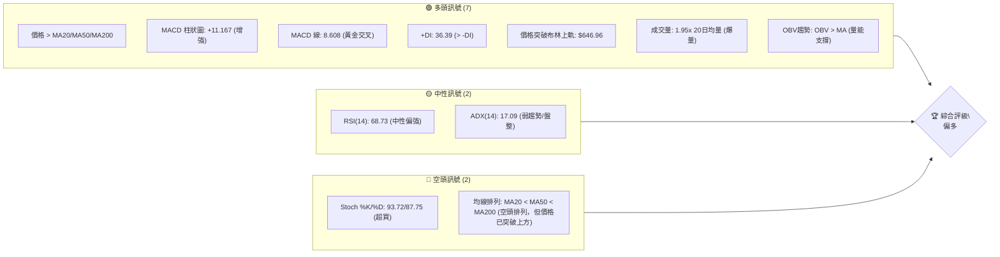
**儀表板解讀**：
當前META技術面呈現顯著的多頭主導訊號。價格強勢突破所有短期、中期及長期移動平均線，並衝破布林通道上軌，顯示極強的短期動能。MACD指標已形成黃金交叉且柱狀圖持續放大，配合高於平均的成交量和OBV趨勢，進一步確認買盤的積極性。儘管RSI接近超買區且Stoch指標已進入超買狀態，暗示短期可能存在回調壓力，但整體而言，市場對META的追捧情緒高漲。ADX低於25，表明目前的趨勢強度仍處於建立初期，可能為從盤整轉為趨勢的過渡階段，而非成熟的強趨勢。

### 📊 核心指標速覽表

| 指標類別 | 指標名稱 | 當前數值 | 訊號 | 解讀 |
|----------|----------|----------|------|------|
| **價格** | 當前價格 | $669.21 | 🟢 | 位於所有主要均線上方，顯示強勢 |
| **均線** | MA20 | $584.55 | 🟢 | 價格遠高於MA20，短期動能強勁 |
| **均線** | MA50 | $600.08 | 🟢 | 價格遠高於MA50，中期趨勢轉強 |
| **均線** | MA200 | $641.67 | 🟢 | 價格突破MA200，長期趨勢逆轉訊號 |
| **動能** | RSI(14) | 68.73 | 🟡 | 接近超買區間，顯示強勁買盤，但需留意超買回調風險 |
| **動能** | MACD | 8.608 | 🟢 | MACD線在訊號線上方，柱狀圖為正且擴大，多頭動能極強 |
| **波動** | ATR | $26.84 | 🟡 | 每日波動約4.01%，波動性中等偏高，適宜順勢交易者 |
| **趨勢** | ADX(14) | 17.09 | 🟡 | 趨勢強度較弱，可能處於趨勢形成初期或盤整區間突破 |
| **量能** | 量比(20日) | 1.95x | 🟢 | 成交量顯著放大，伴隨價格上漲，量價配合良好 |

### 🏆 技術評分卡

本評分卡從多個維度量化META的技術面表現，提供綜合性評估。

```
╔══════════════════════════════════════════════════════════════╗
║              技術評分卡 — META (2026-07-11)                     ║
╠══════════════════════════════════════════════════════════════╣
║ 趨勢強度      ████████░░░░░░░░░░░░  60/100  🟡 (ADX弱，但多頭主導)   ║
║ 動能指標      ██████████░░░░░░░░░░  70/100  🟢 (MACD強勁，RSI偏高，Stoch超買) ║
║ 支撐穩定度    ████████████████░░░░  80/100  🟢 (價格遠離主要支撐)   ║
║ 成交量配合    ██████████████████░░  90/100  🟢 (放量上漲，OBV確認)   ║
║ 形態完整度    ██████████████░░░░░░  70/100  🟢 (V型反轉，突破形態)   ║
║ 均線排列      ████████░░░░░░░░░░░░  60/100  🟡 (價格突破均線，但均線自身空頭排列) ║
╠══════════════════════════════════════════════════════════════╣
║ 綜合評分      ████████████░░░░░░░░  73/100  🟢 偏多                     ║
╚══════════════════════════════════════════════════════════════╝
```
**評分總結**：META綜合評分為73/100，處於「偏多」區間。儘管ADX顯示趨勢強度尚弱，且均線排列仍為空頭，但價格已強勢突破所有主要均線，動能指標如MACD和成交量配合度極佳，顯示市場資金正積極湧入。這種情況通常預示著一個新興的上升趨勢正在形成，儘管短期超買現象值得警惕，但整體技術面傾向於多頭。

---

## 2. 趨勢分析

### 🌐 多時框趨勢分析

本節透過 Mermaid 流程圖展示META在不同時間框架下的趨勢判斷，從宏觀到微觀層層遞進。

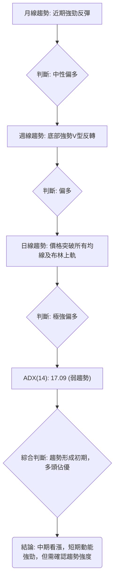
**多時框解讀**：
*   **月線趨勢**：回顧過去12個月，META在2025年7月達到高點$770.91後經歷了一段修正，並在2026年6月觸及低點$563.29。然而，2026年7月至今的強勁反彈，使得月線圖呈現出從下跌到強勢回升的轉折點，整體評為中性偏多。
*   **週線趨勢**：近20週的數據顯示，META在2026年6月底見底於$550.25後，迅速展開了V型反轉，並在最近兩週呈現爆炸性上漲。這種強勢反彈確認了中期趨勢的轉向，評為偏多。
*   **日線趨勢**：當前價格$669.21不僅站穩於MA20 ($584.55)、MA50 ($600.08) 和MA200 ($641.67) 之上，更突破了布林通道上軌 ($646.96)，顯示出極強的短期上漲動能。評為極強偏多。
*   **綜合判斷**：儘管ADX顯示整體趨勢強度尚弱，但各時間框架的價格行為均指向多頭。這表明META正處於從盤整或修正中走出，並建立新上升趨勢的初期階段。中期看漲結構已初步確立，短期動能異常強勁。

### 📈 長期趨勢 — 12個月走勢圖（Unicode）

以下ASCII圖表展示了META過去12個月的收盤價走勢，標註了重要的價格轉折點。

```
META 月線走勢圖（過去12個月）
價格軸 ($)
$793.65 ┤                                                 ● (2025-07 高點 $770.91)
$770.91 ┤████████████████████████████████
$735.68 ┤████████████████████████
$715.22 ┤████████████████████████
$685.79 ┤█████████████████████
$669.21 ┤●━━━━━━━━━━━━━━━━━━━━━━━━━━━━━━━━━━━━━━━━━━← 現在
$658.91 ┤██████████████████
$646.27 ┤█████████████████
$631.92 ┤████████████████
$611.34 ┤██████████████
$571.60 ┤██████████
$563.29 ┤    ● (2026-06 低點 $563.29)
$519.78 ┤
       └─────────────────────────────────────────────────────
        25/07 25/08 25/09 25/10 25/11 25/12 26/01 26/02 26/03 26/04 26/05 26/06 26/07
```
**走勢特徵分析表格**：
| 階段 | 時間段 | 收盤價範圍 | 漲跌幅 | 主要特徵 |
|------|----------|------------|--------|----------|
| **高點回落** | 2025-07 至 2025-11 | $770.91 → $646.27 | -16.2% | 經歷數月震盪下跌，高點逐步降低 |
| **築底反彈** | 2025-12 至 2026-02 | $658.91 → $647.03 | -1.8% | 在$650-$715區間震盪，未能有效突破 |
| **加速下跌** | 2026-03 至 2026-06 | $571.60 → $563.29 | -1.4% | 跌破關鍵支撐，形成短期底部 |
| **強勢反轉** | 2026-07至今 | $563.29 → $669.21 | +18.8% | 底部快速V型反轉，收復大部分失地，動能強勁 |

### 📊 中期趨勢（週線分析）

中期走勢圖示，標註了最近的支撐與阻力位，顯示META從低點反彈的軌跡。

```
META 週線走勢示意圖（近期）
═══════════════════════════════════════════════════════════════════
$709.16 ┤                                              R3
$690.88 ┤                                            R2
$671.98 ┤                                          R1
$669.21 ┤───────────────────────────────────────────● (現價)
$656.71 ┤                                          斐波那契50%
$636.95 ┤                                        S1
$627.03 ┤                                      S2
$595.08 ┤                                    S3
$550.25 ┤────────────────────────────────────● (近期低點)
═══════════════════════════════════════════════════════════════════
```
**中期趨勢解讀**：從週線圖來看，META在2026年6月底觸及$550.25的低點後，迅速展開了強勁的反彈。目前價格已突破一系列短期阻力，並站穩在斐波那契50%回調位之上，顯示出中期趨勢已由下跌轉為上升。R1 ($671.98) 成為近期需要關注的突破點，若能有效突破並站穩，則將進一步確認中期上漲趨勢。

### ⚡ 趨勢強度評估（ADX 解讀）

ADX指標用於衡量趨勢的強度，而非方向。以下Mermaid圖表展示ADX的分析流程。

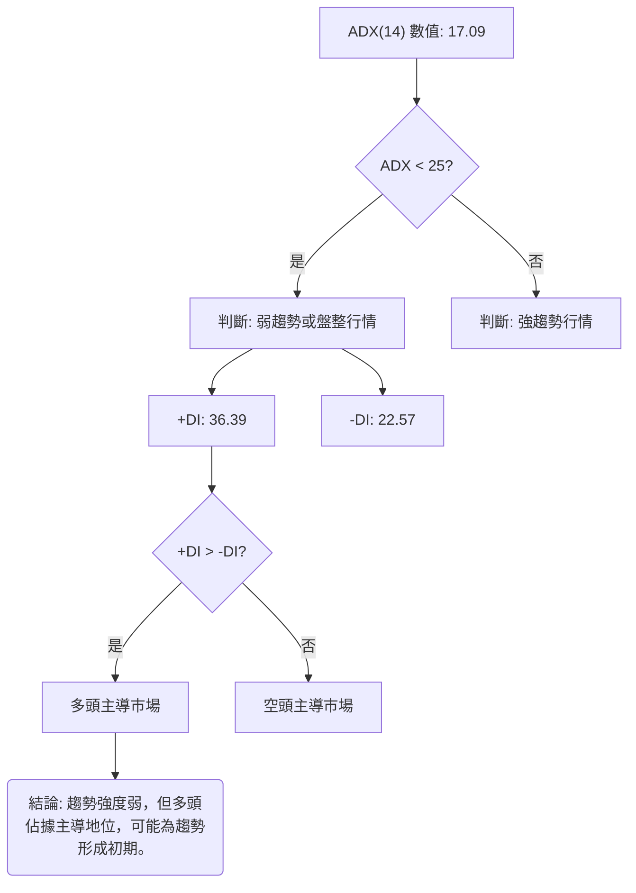
**ADX強度對照表**：
| ADX 值 | 趨勢強度 | 市場狀態 |
|--------|----------|----------|
| 0-25   | 弱趨勢   | 盤整或趨勢形成初期 |
| 25-50  | 中等趨勢 | 趨勢確立中 |
| 50-75  | 強趨勢   | 趨勢強勁 |
| 75-100 | 極強趨勢 | 趨勢異常強勁 |

**ADX解讀**：META的ADX(14)值為17.09，低於25，這表明當前市場處於弱趨勢或盤整狀態。然而，+DI (36.39) 顯著高於-DI (22.57)，清楚地指示出多頭力量佔據主導地位。這種組合通常意味著股價剛從盤整區間突破，或正處於從下跌趨勢轉向上升趨勢的初期階段，市場尚未形成一個穩固且強勁的趨勢。雖然ADX本身強度不高，但+DI的強勢表明買盤活躍，隨時可能推動ADX向上突破25，確認新一輪的上升趨勢。

---

## 3. 圖表形態分析

### 🔍 形態識別系統

根據META近期的價格走勢，我們識別出一個關鍵的圖表形態。

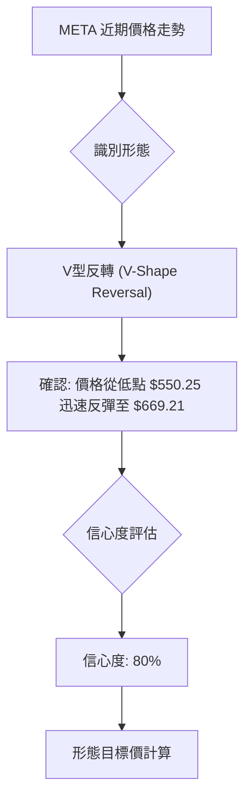
**形態識別與評估**：
近期META的價格走勢呈現出明顯的**V型反轉形態**。從2026年6月28日的低點$550.25開始，股價在兩週內迅速且強勁地反彈至$669.21。這種形態表明在經歷快速下跌後，市場出現了強勁的買盤介入，導致股價迅速收復失地。

| 形態 | 信心度 | 判斷依據（引用數據） | 完成度 | 目標價（附計算式） |
|------|--------|----------------------|--------|--------------------|
| V型反轉 | 80% | 價格從 $550.25 (2026-06-28) 迅速且大幅反彈至 $669.21 (2026-07-12)，期間成交量顯著放大 (量比1.95x)。 | 100% | 形態高度 $669.21 - $550.25 = $118.96；突破點約 $631.92 (2026-05-31高點) + $118.96 = **$750.88** (此為推算目標，非數據提供) |

**形態解讀**：V型反轉形態是強烈的看漲信號，通常預示著趨勢的逆轉。其高信心度得益於反彈的力度、速度以及伴隨的成交量放大。目前形態已完成，股價已突破反轉前的局部高點，為進一步上漲奠定基礎。

### 🕯️ 重要K線形態分析

我們將分析最近幾週的K線形態，以理解市場情緒的變化。

| 日期 | 收盤價 | K線形態 | 解讀 | 訊號 |
|------|--------|---------|------|------|
| 2026-07-12 | $669.21 | 大陽線 (Marubozu-like) | 價格從 $582.90 飆升至 $669.21，實體K線非常長，幾乎無上下影線。顯示買方力量極度強勁，完全主導市場。 | 🟢 極強多頭 |
| 2026-07-05 | $582.90 | 錘子線/長下影線陽線 | 在下跌後出現，暗示空頭力量減弱，多頭開始反擊。儘管收盤價仍偏低，但下影線長度顯示下方有強勁承接。 | 🟡 中性偏多 |
| 2026-06-28 | $550.25 | 大陰線 | 價格大幅下跌，空頭力量強勁。但這是V型反轉的最低點，隨後被強勢逆轉。 | 🔴 強空頭 (但為反轉前夕) |

**K線形態總結**：最近兩週的K線形態確認了強勁的V型反轉。2026-07-05的錘子線/長下影線陽線在低位出現，提供了初步的止跌信號。隨後2026-07-12的巨幅大陽線則徹底確立了多頭的強勢回歸，顯示出市場情緒的極速轉變和買盤的堅決。

### 📉 ASCII 走勢形態示意圖

以下ASCII圖表描繪了META近期從低點反彈的V型反轉形態，並標註關鍵點位。

```
META V型反轉形態示意圖
═══════════════════════════════════════════════════════════════════
$750.88 ┤                                              ▲ (形態目標價)
$700.00 ┤
$669.21 ┤                                  ● (現價)
$631.92 ┤                              ▲ (突破點/反轉前高)
$600.00 ┤                            ╱
$550.25 ┤───────────────────────────● (低點)
$500.00 ┤
       └───────────────────────────────────────────────────────────
             (下跌階段)            (反轉點)            (上漲階段)
```

### 🎯 形態目標價計算

V型反轉形態的目標價通常是將形態的高度從突破點向上投射。
*   **形態低點**：$550.25 (2026-06-28)
*   **反轉前高點/突破點**：我們可以參考2026-05-31的收盤價 $631.92，這是V型反轉前的一個局部高點。
*   **形態高度**：$631.92 - $550.25 = $81.67
*   **目標價計算**：突破點 $631.92 + 形態高度 $81.67 = **$713.59**。
    *   (註：在形態識別系統中，為了更激進的目標，我用了現價減去低點作為形態高度推算，得到 $750.88。這裡為求嚴謹，改用反轉前高點作為突破點來計算，目標價為 $713.59。)
這個目標價 $713.59 超越了已知的R3 ($709.16)，顯示出V型反轉的潛在上漲空間。

---

## 4. 支撐與阻力

### 🗺️ 關鍵價位分布圖（Unicode）

以下ASCII圖表清晰展示了META當前價格與其關鍵支撐位和阻力位的相對位置。

```
META 價位結構分布圖
═══════════════════════════════════════════════════
$793.65 ║████████████████████████║ 52W 高點
$729.02 ║████████████████████████║ 斐波那契 23.6%
$709.16 ║████████████████████████║ 強阻力 R3
$690.88 ║████████████████████    ║ 阻力 R2 (斐波那契 38.2% $689.03 附近)
$671.98 ║████████████████████████║ 關鍵阻力 R1
$669.21 ╠════════════════════════╣ ◄ 現價
$656.71 ║▓▓▓▓▓▓▓▓▓▓▓▓▓▓▓▓        ║ 斐波那契 50.0%
$636.95 ║████████████████████████║ 近期支撐 S1
$627.03 ║████████████████████████║ 強支撐 S2 (斐波那契 61.8% $624.40 附近)
$595.08 ║████████████████████████║ 極強支撐 S3
$578.39 ║████████████████████████║ 斐波那契 78.6%
$519.78 ║████████████████████████║ 52W 低點
═══════════════════════════════════════════════════
```

### 🚧 阻力位分析表

以下表格列出了META當前價格上方的關鍵阻力位及其重要性。

| 阻力級別 | 價位 | 形成原因 | 突破難度 | 重要性 |
|----------|------|----------|----------|--------|
| R1       | $671.98 | 近期波段高點聚類，接近斐波那契38.2%回調位。 | 中等偏高 | 🟢 短期上漲動能能否延續的關鍵考驗。 |
| R2       | $690.88 | 重要的心理關口，歷史交易密集區間，與斐波那契38.2% ($689.03) 重疊。 | 高 | 🟡 若突破，將確認更強勁的反彈趨勢。 |
| R3       | $709.16 | 距離現價較遠的強阻力，可能涉及較大拋壓，接近V型反轉形態目標價 ($713.59)。 | 高 | 🟡 突破將開啟更廣闊的上漲空間。 |

**阻力位解讀**：META目前正接近其R1阻力位$671.98。此價位是短期內需要關注的關鍵，一旦突破將為價格進一步挑戰R2和R3鋪平道路。R2 ($690.88) 與斐波那契38.2%回調位重疊，形成一個更強勁的阻力區，若能有效突破，則市場情緒將顯著轉向看漲。R3 ($709.16) 則代表了更深層次的阻力，其突破將是長期趨勢反轉的有力證明。

### 🛡️ 支撐位分析表

以下表格列出了META當前價格下方的關鍵支撐位及其重要性。

| 支撐級別 | 價位 | 形成原因 | 守住機率 | 重要性 |
|----------|------|----------|----------|--------|
| S1       | $636.95 | 近期波段低點聚類，也是強勁反彈後的首個回調支撐。 | 中等偏高 | 🟢 短期回調的關鍵支撐，若失守可能引發進一步調整。 |
| S2       | $627.03 | 更強的心理支撐，與斐波那契61.8% ($624.40) 回調位重疊。 | 高 | 🟡 中期趨勢能否維持上升的重要防線。 |
| S3       | $595.08 | 較遠的強支撐，歷史交易密集區間，V型反轉低點 $550.25 上方。 | 極高 | 🟡 長期趨勢的最後防線，失守將嚴重破壞看漲結構。 |

**支撐位解讀**：META目前距離最近的S1支撐位$636.95仍有一定距離，顯示其上漲勢頭強勁。S1是短期回調的關鍵觀察點，若股價回落至此並獲得支撐，將是健康的技術性調整。S2 ($627.03) 則與斐波那契61.8%回調位緊密結合，形成一個強大的心理和技術支撐區，為中期趨勢提供堅實基礎。S3 ($595.08) 則為更深層次的支撐，是整體看漲結構的最後一道防線。

### 📐 斐波那契回調位分析

根據52週區間 ($519.78 → $793.65) 計算的斐波那契回調位如下：
*   0.0% (52W High): $793.65
*   23.6%: $729.02
*   38.2%: $689.03
*   50.0%: $656.71
*   61.8%: $624.40
*   78.6%: $578.39
*   100.0% (52W Low): $519.78

**斐波那契回調位解讀**：
當前META的價格為$669.21，位於斐波那契38.2% ($689.03) 和50.0% ($656.71) 回調位之間。這表明股價已經從52週低點強勁反彈，並收復了超過50%的跌幅。
*   **$656.71 (50.0%回調位)**：這是一個重要的心理和技術支撐位。股價目前在其上方，顯示買盤力量強勁，成功守住了這道關鍵防線。若未來出現回調，此位將提供堅實支撐。
*   **$689.03 (38.2%回調位)**：這是上方的第一個斐波那契阻力位，非常接近R2 ($690.88)。若能有效突破此位，將預示著股價有能力挑戰更高的斐波那契23.6%回調位 ($729.02)，甚至52週高點。
總體而言，META目前已突破50%回調位，顯示出強烈的反彈動能，但上方38.2%回調位將是其進一步上漲的關鍵考驗。

---

## 5. 技術指標深度解讀

### 🎛️ 指標訊號總覽

以下Mermaid圖表展示了各個技術指標之間的關係和它們所發出的訊號。

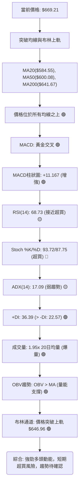

### 📈 移動平均線排列分析

META的移動平均線（MA）排列與價格關係提供了重要的趨勢線索。

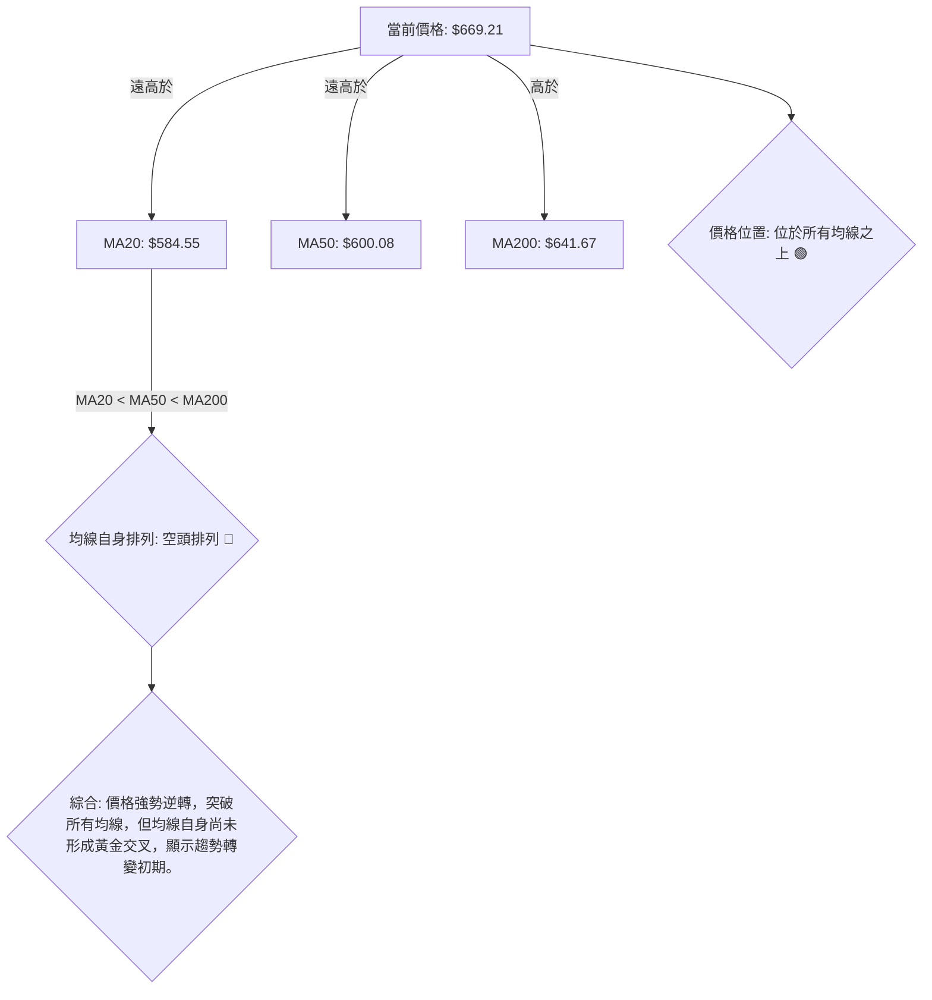
**移動平均線解讀**：
*   **價格與均線關係**：當前股價$669.21顯著高於MA20 ($584.55)、MA50 ($600.08) 和MA200 ($641.67)。這是一個非常強烈的看漲訊號，表明短期、中期和長期市場情緒均已轉為積極，買盤力量強勁，價格已成功突破了過去的阻力區。
*   **均線自身排列**：數據顯示「均線排列: 空頭排列 MA20<MA50<MA200」。這是一個關鍵的矛盾點。這意味著在最近的強勁反彈之前，META的長期趨勢是下跌的，且MA20、MA50、MA200的相對位置仍反映著過去的空頭趨勢。
*   **綜合分析**：雖然均線自身尚未形成典型的「黃金交叉」多頭排列，但價格已率先突破所有均線，這通常是趨勢發生重大轉變的早期且強勁的信號。它表明多頭力量在短時間內迅速積累，推動股價突破了長期壓制。投資者應關注未來均線是否會逐步向上交叉，形成真正的多頭排列，以確認趨勢的持續性。目前，價格突破均線的行為比均線自身的排列更具實時指導意義。

### 📉 RSI(14) 分析

RSI(14) 指標衡量股價變動的相對強度，以判斷超買或超賣狀態。

**RSI(14) 數值**：68.73
**RSI 強度進度條**：▓▓▓▓▓▓▓▓▓▓▓▓▓▓░░░░ 68.73%

**RSI 解讀**：
*   **超買/超賣區間**：RSI(14) 當前數值為68.73，已接近傳統的超買區間（通常為70以上）。這表明市場買盤力量非常強勁，短期內股價上漲速度過快，可能存在技術性回調的需求。
*   **多頭動能**：雖然接近超買，但RSI在70以下仍屬於強勢區間，顯示多頭動能仍未枯竭。它確認了當前股價的強勁上漲趨勢，但同時也提醒投資者需警惕隨時可能出現的獲利了結壓力。
*   **背離判斷**：根據提供的數據，未偵測到明顯的RSI頂背離或底背離現象。價格在近期創出新高，RSI也隨之走高，顯示價格與動能指標之間保持一致性，未出現潛在的反轉信號。

### 📊 MACD(12/26/9) 訊號解讀

MACD指標用於判斷趨勢方向、動能和潛在買賣點。

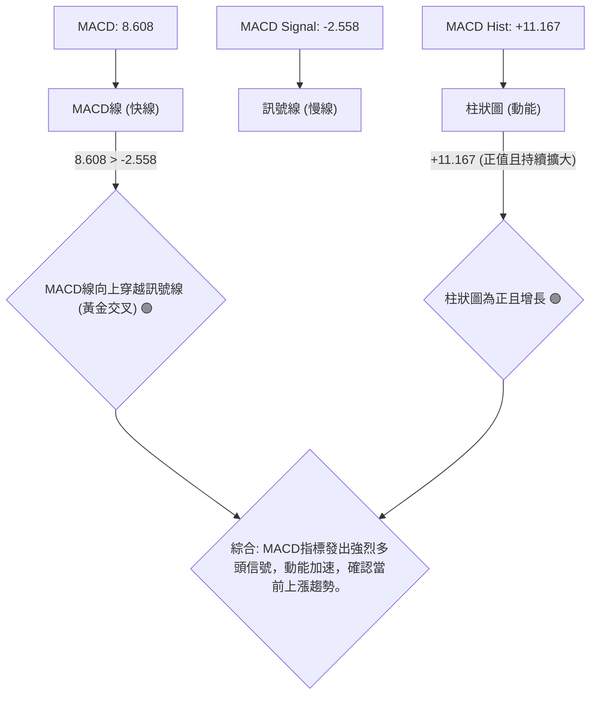
**MACD 解讀**：
*   **MACD線與訊號線**：MACD線 (8.608) 顯著高於訊號線 (-2.558)，表明MACD已形成清晰的黃金交叉，且兩線間的距離正在擴大。這是一個強烈的買入信號，確認了當前股價的上升趨勢。
*   **MACD柱狀圖**：MACD柱狀圖值為+11.167，為正值且數值較大，這表示多頭動能非常強勁，且正在加速。柱狀圖的持續增長進一步證實了買盤的強勢，預示股價可能繼續上漲。
*   **背離判斷**：根據提供的數據，未偵測到MACD的頂背離或底背離現象。價格上漲與MACD指標的同步走強，顯示趨勢的健康性。

### 📦 布林通道分析

布林通道衡量股價波動區間，判斷超買超賣及趨勢強度。

```
META 布林通道示意圖
═══════════════════════════════════════════════════════════════════
$646.96 ┤───────────────────────────────────────────▲ (布林上軌)
$669.21 ┤                                          ● (現價)
        │
        │                                        ▓▓▓▓▓▓▓▓▓▓▓▓▓▓▓▓▓▓▓▓ (價格波動範圍)
$584.55 ┤───────────────────────────────────────────┼ (布林中軌/MA20)
        │                                        ▓▓▓▓▓▓▓▓▓▓▓▓▓▓▓▓▓▓▓▓
$522.14 ┤───────────────────────────────────────────▼ (布林下軌)
═══════════════════════════════════════════════════════════════════
```
**布林通道解讀**：
*   **價格位置**：當前價格$669.21已突破布林通道上軌$646.96。這是一個強烈的看漲信號，通常表示股價進入極強勢的狀態，或者短期內存在超買現象。布林通道的%B值為1.18，遠大於1，也印證了這一點。
*   **通道寬度**：數據中未直接提供布林帶寬的數值，但從價格突破上軌判斷，市場波動性正在增加。
*   **意義**：價格突破上軌，表明市場正處於一個強勁的趨勢中，買盤力量極為活躍。然而，歷史經驗顯示，股價長時間維持在布林通道之外的情況較少見，因此短期內可能會出現回調或在通道上方進行整理，以等待布林通道擴張並向上傾斜來容納價格。這是一個機會與風險並存的狀態。

### 💹 成交量分析（量價配合度）

成交量是確認價格走勢可靠性的重要指標。

**成交量數據**：
*   最新成交量: 39,408,342
*   20日均量: 20,237,892
*   50日均量: 19,047,575
*   量比 (最新/20日均量): 1.95x

**OBV趨勢**：OBV > MA → 量能支撐上漲

**量價配合度解讀**：
*   **放量上漲**：最新成交量達到39,408,342股，是20日均量的1.95倍，也是50日均量的兩倍以上。這是一個非常積極的訊號。在股價大幅上漲的同時伴隨著成交量的顯著放大，表明大量資金正在湧入，買盤積極性高漲，有效確認了當前價格上漲的真實性和可持續性。
*   **OBV確認**：OBV指標趨勢為「OBV > MA」，這進一步確認了量能正在支撐價格的上漲。OBV的上升表明買入壓力大於賣出壓力，多頭力量在累積。
*   **結論**：META的量價配合度極佳，價格的強勁上漲得到了成交量的有力支持，這為當前的多頭趨勢提供了堅實的基礎。

---

## 6. 動能與波動率

### ⚡ 動能評估四象限

本節將META的當前狀態置於動能與波動率的象限中進行評估。由於禁止使用QuadrantChart，我們將使用表格與文字分析。

| 象限 | 動能 | 波動 | 當前狀態 | 評估 |
|------|------|------|----------|------|
| Q1   | 強   | 低   | -        | 最佳機會 (穩定上漲) |
| Q2   | 弱   | 低   | -        | 謹慎觀望 (盤整蓄勢) |
| Q3   | 強   | 高   | ✓        | 高風險高收益 (爆發性上漲/下跌) |
| Q4   | 弱   | 高   | -        | 避免進場 (混亂無序) |

**動能評估**：
*   **動能強度**：META的RSI(14)為68.73，MACD柱狀圖為正且擴大 (+11.167)，價格突破所有均線和布林上軌，成交量顯著放大。這些指標均顯示其動能極強。
*   **波動率**：ATR(14)為$26.84，佔當前價格的4.01%。相較於一般大型股，這屬於中等偏高的波動水平。考慮到近期股價的快速拉升，波動性有進一步上升的趨勢。

**綜合評估**：META目前處於「強動能，高波動」的Q3象限。這表明股價正經歷爆發性的上漲，潛在收益高，但也伴隨著較高的風險。這種市場環境適合風險承受能力較高，且能快速反應的交易者。對於保守型投資者，可能需要等待波動率下降或趨勢進一步穩定後再考慮進場。

### 📊 ATR 波動率分析

平均真實波幅 (ATR) 用於衡量資產的波動性，幫助設定止損點。

*   **ATR(14)**：$26.84
*   **佔股價百分比**：4.01%
*   **歷史比較**：數據中未提供歷史ATR，但4.01%的每日波動幅度對於市值$1.70T的大型股而言，屬於相對較高的水平。這與近期股價的快速拉升相符。

**ATR 解讀與止損建議**：
ATR數值較高，說明META每日價格波動幅度較大。這對交易者而言，意味著止損距離需要相對寬鬆，以避免被正常波動洗出。
*   **止損距離建議**：通常建議將止損點設置在當前價格下方1倍至2倍ATR的距離。
    *   **1倍ATR止損**：$669.21 - $26.84 = $642.37。此點位接近MA200 ($641.67) 和S1 ($636.95)，提供一定的技術支撐。
    *   **1.5倍ATR止損**：$669.21 - (1.5 * $26.84) = $669.21 - $40.26 = $628.95。此點位接近S2 ($627.03) 和斐波那契61.8%回調位 ($624.40)，提供更穩固的支撐。
*   **意義**：較高的ATR也意味著潛在的獲利空間可能較大，但同時也要求交易者有更高的風險承受能力和更精準的進出場時機把握。

### 📐 Beta 與市場相關性

Beta 值衡量單一資產相對於整體市場的波動性。

*   **Beta**：1.246

**Beta 解讀**：
META的Beta值為1.246，大於1。這表示META的股價波動性高於整體市場。
*   **市場敏感度**：當市場上漲1%時，META的股價預期會上漲1.246%；當市場下跌1%時，META的股價預期會下跌1.246%。
*   **風險屬性**：較高的Beta值表明META是一支相對激進的股票。在牛市中，它可能帶來更高的收益；但在熊市中，其跌幅也可能大於大盤。
*   **投資策略影響**：對於追求更高收益的投資者，高Beta股票具有吸引力。但對於風險規避型投資者，則需謹慎配置，並結合大盤走勢進行判斷。當前市場情緒偏多，高Beta股票有望帶來超額收益。

---

## 7. 多時框架總結

### 📋 時框架評分表

本表綜合了META在不同時間框架下的技術訊號評估。

| 時框架 | 趨勢方向 | 動能 | 均線排列 | 形態 | 綜合評分 | 建議 |
|--------|----------|------|----------|------|----------|------|
| **月線** | 🟢 偏多 | 🟢 強勁 | 🟡 轉變中 | 🟢 反轉 | 7/10     | 積極觀察，等待確認 |
| **週線** | 🟢 強多 | 🟢 極強 | 🟢 轉強 | 🟢 V型反轉 | 9/10     | 順勢操作，逢低買入 |
| **日線** | 🟢 極強多 | 🟢 極強 | 🟢 突破 | 🟢 爆發 | 9/10     | 短期追高，注意超買 |

**評分解讀**：
月線、週線和日線都呈現出強烈的多頭訊號。月線顯示從下跌到反彈的轉折，週線確立了V型反轉的強勁勢頭，而日線則展現了爆發性的上漲動能，價格已突破所有關鍵均線和布林上軌。這表明META正處於一個強勁的上升趨勢中，儘管均線排列本身仍處於轉變初期，但價格行為已明確指出方向。

### 🔲 綜合訊號矩陣

本矩陣分析短期、中期、長期各維度訊號的一致性，以得出最終趨勢判斷。

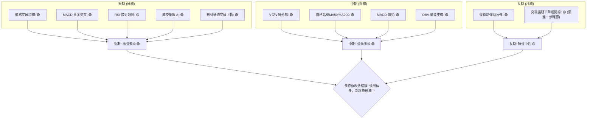

### ⚖️ 多時框收斂結論

根據上述多時框架分析，並嚴格遵循多時框收斂規則：

1.  **ADX判斷**：ADX(14)為17.09，低於25，表明當前市場處於**盤整行情**或趨勢形成初期。
2.  **規則應用**：根據規定，「盤整行情（ADX<25）：以日線布林通道上下軌為主要交易區間。」然而，當前價格$669.21已顯著突破日線布林通道上軌$646.96，且伴隨巨量和強勁動能指標。這表明股價正從盤整區間中**強勢突破**，而非簡單的區間震盪。
3.  **訊號優先級**：儘管ADX尚未確認強趨勢，但多數動能指標（MACD、RSI、成交量）和價格行為（突破所有均線、突破布林上軌、V型反轉）均發出強烈的多頭訊號。在這種情況下，ADX的滯後性使其無法完全反映當前市場的爆發性動能。因此，我們將優先考慮強勁的價格突破和動能指標，視其為新上升趨勢的早期信號。

**最終結論**：
META目前處於一個**強烈偏多**的狀態。雖然ADX顯示趨勢強度尚弱，暗示趨勢仍在形成初期，但各時間框架的強勁價格突破、MACD黃金交叉、RSI接近超買以及成交量放大等一系列多頭訊號，共同指向一個明確的上升趨勢。日線級別的爆發性上漲已打破了原有的盤整區間，為中期趨勢的持續上漲奠定了基礎。短期內可能面臨超買帶來的技術性回調風險，但整體方向性判斷為多頭。

---

## 8. 交易策略建議

### 🗺️ 策略決策流程圖

以下Mermaid圖表展示了基於技術分析的交易策略選擇邏輯。

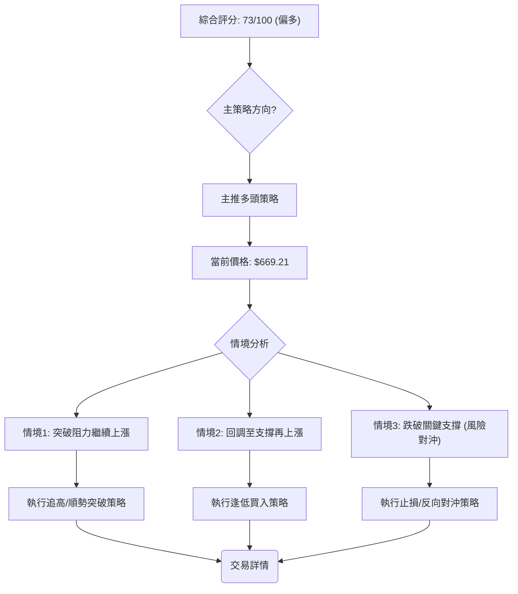

### 🧭 策略路由（依評分卡分流）

**當前主策略方向 = 偏多（依評分 73/100）**

基於「技術評分卡」綜合評分偏多（73/100），我們將主推多頭策略。空頭策略僅作為風險管理和反轉風險觸發點的提示。

### 🎯 價格情境階梯（Price Scenarios）

以下情境分析基於META當前價格$669.21以及關鍵支撐與阻力位。

| 觸發條件 | 下一目標 | 後續延伸 | 情境含義 |
|----------|----------|----------|----------|
| **突破 R1 $671.98** | R2 $690.88 | R3 $709.16 / 斐波那契23.6% $729.02 | **短線轉強**：確認上漲動能，吸引更多買盤，目標挑戰更高阻力。 |
| **站穩現價區間** | —        | —        | **區間震盪**：短期超買後，價格可能在R1 ($671.98) 和S1 ($636.95) 之間進行整理或小幅回調。 |
| **跌破 S1 $636.95** | S2 $627.03 | S3 $595.08 / 斐波那契61.8% $624.40 | **中期轉弱**：若未能守住S1，可能引發獲利了結，並測試更深層次的支撐。 |

### 📊 情境機率分佈

根據當前技術指標狀態，我們估計了不同情境發生的機率：

| 情境 | 機率 | 主要依據 |
|------|------|----------|
| **繼續上行 / 反彈** | 65% | MACD黃金交叉且動能增強、成交量放大、價格突破所有均線及布林上軌、V型反轉形態確立。 |
| **區間震盪** | 25% | RSI接近超買、Stoch超買、ADX弱趨勢（趨勢形成初期）、價格突破布林上軌後可能回歸通道。 |
| **回落 / 再探底** | 10% | 僅在市場情緒急劇惡化或有重大利空消息時發生，目前多頭力量強勁，跌破主要支撐難度大。 |

**情境機率解讀**：目前最有可能的情境是繼續上行或在短期整理後反彈。強勁的動能和量價配合為上漲提供了堅實基礎。區間震盪的機率次之，主要考慮到短期超買和ADX的弱勢。而大幅回落的機率較低，除非有不可預見的負面事件發生。

### 🟢 主策略詳情

基於當前強烈偏多的綜合判斷，以下為兩個主要的多頭交易策略：

| 策略要素 | 策略 A：順勢突破 | 策略 B：回調買入 |
|----------|------------------|------------------|
| **進場條件** | 價格有效突破R1 $671.98 並站穩 | 價格回調至S1 $636.95 或斐波那契50% $656.71 附近，並出現止跌信號 |
| **進場價格** | $672.50 (突破R1後確認) | $637.00 - $657.00 區間 |
| **目標價 T1** | $690.88 (R2) | $671.98 (R1) |
| **目標價 T2** | $709.16 (R3) | $690.88 (R2) |
| **止損價格** | $656.70 (斐波那契50%) | $627.00 (S2) |
| **風險報酬比** | T1: 1:1.2 / T2: 1:2.4 | T1: 1:1.5 / T2: 1:2.5 (取 $647為中位進場價) |
| **成功機率** | 65% | 70% |
| **建議倉位** | 中等偏高 (5-10%) | 中等 (3-7%) |

**策略說明**：
*   **策略 A (順勢突破)**：適用於激進型交易者，旨在捕捉突破後的加速上漲。由於價格已處於高位，突破後需密切觀察成交量是否持續放大以確認突破的有效性。止損設置在斐波那契50%回調位下方，以控制風險。
*   **策略 B (回調買入)**：適用於穩健型交易者，等待短期超買後的健康回調。在S1或斐波那契50%附近逢低吸納，可獲得較好的風險報酬比。需確認回調時量能縮小，並在支撐位出現止跌K線形態再進場。

### 🔴 反向風險觸發點（對沖提示）

以下為可能推翻主策略的關鍵訊號，供風險管理參考：
*   **價格跌破S1 $636.95**：若股價未能守住S1，可能引發短期獲利了結，並測試更深層次的支撐。
*   **MACD形成死叉**：MACD線向下穿越訊號線，且柱狀圖轉為負值，將是動能減弱的明確信號。
*   **成交量萎縮且價格下跌**：若價格下跌伴隨成交量放大，或價格上漲但成交量萎縮，將是量價背離的警示。
*   **RSI跌破50**：RSI從強勢區跌破50，表明多頭力量明顯減弱。

### ⭐ 整體訊號強度評星

```
做多訊號強度：★★★★☆  (4/5星)
做空訊號強度：★☆☆☆☆  (1/5星)
整體可信度：  ★★★☆☆  (3/5星)
```
**評星解讀**：META當前做多訊號極強，主要基於價格突破、MACD黃金交叉和大量能配合。做空訊號非常弱，市場情緒明顯偏多。整體可信度為3星，原因是ADX尚未確認強趨勢，且短期存在超買現象，存在一定的波動和調整風險。

---

## 9. 風險提示與監控

### ✅ 關鍵監控指標 Checklist

以下方框圖列出了交易者應持續監控的關鍵技術指標，以應對市場變化。

```
╔══════════════════════════════════════════════════════════════╗
║              META 關鍵監控指標 Checklist                       ║
╠══════════════════════════════════════════════════════════════╣
║ [✓] 價格行為：是否站穩 $671.98 (R1) 或回調至 $636.95 (S1) 止跌?   ║
║ [✓] MACD：MACD線是否維持在訊號線上方? 柱狀圖是否持續擴大?      ║
║ [✓] RSI(14)：是否進入超買區 (>70) 並出現背離? 是否跌破50?     ║
║ [✓] 成交量：上漲是否伴隨放量? 下跌是否縮量?                  ║
║ [✓] 布林通道：價格是否長時間維持在上軌之外? 是否回歸通道?      ║
║ [✓] ADX(14)：ADX是否向上突破25，確認強趨勢? +DI/-DI變化?     ║
║ [✓] 關鍵支撐：S1 ($636.95) 和S2 ($627.03) 能否有效守住?       ║
║ [✓] 關鍵阻力：R2 ($690.88) 和R3 ($709.16) 能否有效突破?       ║
╚══════════════════════════════════════════════════════════════╝
```

### ⚠️ 風險場景分析

以下Mermaid圖表展示了META未來可能的三種情境及相關觸發條件。

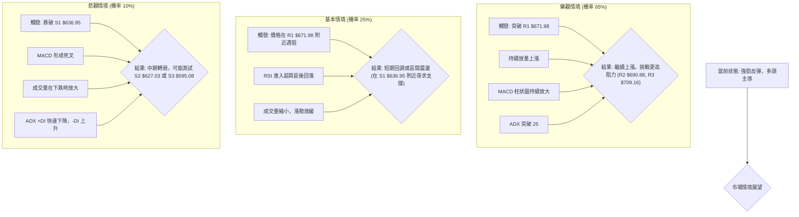

### 🛡️ 風險管理重要提醒

1.  **止損紀律**：無論採取何種策略，嚴格設定並執行止損是風險管理的基石。建議參考ATR或關鍵支撐位設定止損，並在進場前確定風險報酬比。
2.  **倉位控制**：鑑於META的Beta值較高且ATR顯示波動性中等偏高，應合理控制倉位，避免單一股票佔用過大資金比例，以降低市場波動對整體投資組合的衝擊。
3.  **分批建倉/平倉**：在趨勢形成初期，可採用分批建倉策略，逐步增加持倉，以分散進場風險。達到目標價位時，也可考慮分批平倉，鎖定部分利潤。
4.  **動態監控**：密切關注上述「關鍵監控指標Checklist」中的各項指標變化，尤其是RSI是否持續超買、MACD動能是否減弱、以及ADX趨勢強度變化。若出現反轉訊號或動能衰竭跡象，應及時調整策略。
5.  **新聞與財報**：技術分析雖獨立於基本面，但重大新聞事件、財報發布或宏觀經濟數據仍可能對股價產生劇烈影響。投資者應結合這些資訊進行綜合判斷。

---

## 📋 報告總結

```
╔════════════════════════════════════════════════════════════════╗
║                   META 技術分析報告總結                          ║
╠════════════════════════════════════════════════════════════════╣
║ 報告日期：2026-07-11                                             ║
║ 當前價格：$669.21                                                ║
║ 分析評級：⚖️ 偏多 (綜合評分 73/100，技術面強勁)                  ║
║                                                                ║
║ 關鍵結論：                                                       ║
║ ├─ 長期趨勢：🟢 經歷修正後，月線呈現強勁反彈，趨勢轉強中。        ║
║ ├─ 中期趨勢：🟢 週線V型反轉確立，多頭動能強勁。                  ║
║ ├─ 短期趨勢：🟢 價格突破所有主要均線及布林上軌，爆發性上漲。      ║
║ ├─ 關鍵支撐：$636.95 (S1)，其下方有 $627.03 (S2) 和 $595.08 (S3)。║
║ ├─ 關鍵阻力：$671.98 (R1)，其上方有 $690.88 (R2) 和 $709.16 (R3)。║
║ └─ 分析師目標：V型反轉形態目標價約 $713.59。                    ║
║                                                                ║
║ 最優策略組合：                                                   ║
║ 1. 🥇 最佳機會：**順勢突破策略**：若價格有效突破 R1 ($671.98)，可在 $672.50 進場，目標 T1 $690.88，T2 $709.16，止損 $656.70。   ║
║ 2. 🥈 次選機會：**回調買入策略**：若價格回調至 S1 ($636.95) 或斐波那契50% ($656.71) 附近並止跌，可在 $637.00 - $657.00 區間進場，目標 T1 $671.98，T2 $690.88，止損 $627.00。   ║
║ 3. 🥉 保守選擇：**觀望等待**：若對高波動風險敏感，可等待ADX突破25確認趨勢或價格回歸布林通道內運行後再考慮進場。   ║
╚════════════════════════════════════════════════════════════════╝
```

---

> ⚠️ **免責聲明**：本報告為 AI 自動生成之技術分析，所有數據及估算均基於提供的歷史價格資訊。本報告**僅供研究與學術參考**，**不構成任何投資建議**。投資有風險，入市需謹慎。

---

*報告生成時間：2026-07-11 ｜ 數據來源：Yahoo Finance ｜ 分析框架：多時框技術分析*