<details>
<summary>📊 靜態圖表 (點擊展開)</summary>
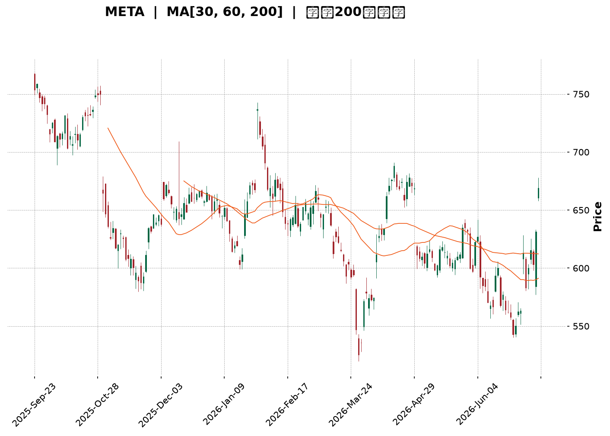
</details>

<html>
<head><meta charset="utf-8" /></head>
<body>
    <div style="height:500px; width:100%;">                        <script>window.PlotlyConfig = {MathJaxConfig: 'local'};</script>
        <script charset="utf-8" src="https://cdn.plot.ly/plotly-3.7.0.min.js" integrity="sha256-jvTGqxNp8AGWEcvNLVuKr+8j5dGe9Yw51LQkmDH+IYA=" crossorigin="anonymous"></script>                <div id="candlestick-chart" class="plotly-graph-div" style="height:100%; width:100%;"></div>            <script>                window.PLOTLYENV=window.PLOTLYENV || {};                                if (document.getElementById("candlestick-chart")) {                    Plotly.newPlot(                        "candlestick-chart",                        [{"close":{"dtype":"f8","bdata":"AAAAIIaLh0AAAACAfrWHQAAAAOC8V4dAAAAAoJAuh0AAAADgxSuHQAAAAKDM44ZAAAAAYNVbhkAAAADAT6mGQAAAAOC7JYZAAAAAoG1OhkAAAACA1zmGQAAAAMDSX4ZAAAAAoNvchkAAAABgw\u002fuFQAAAAEC\u002fToZAAAAAgH4WhkAAAABAgl2GQAAAAGDIMYZAAAAAYHtYhkAAAABgKtKGQAAAAGDx2oZAAAAAQA\u002fchkAAAACAxOCGQAAAAICOA4dAAAAAgPpmh0AAAAAA7WuHQAAAAODCbYdAAAAAwO3FhEAAAABAWDWEQAAAAEBy4INAAAAAoIqNg0AAAAAAZ9KDQAAAAOCsSoNAAAAAIMdgg0AAAAAg+LCDQAAAAICgi4NAAAAAAHH7gkAAAACgdgKDQAAAAEAI\u002f4JAAAAAIJbDgkAAAADgHaGCQAAAACBPZoJAAAAAYPlcgkAAAAAAq4WCQAAAAICtG4NAAAAAgI7Ug0AAAABAu7+DQAAAAEAnMoRAAAAAIKn5g0AAAADgXiuEQAAAAOCG74NAAAAAAIOehEAAAACAYv2EQAAAAOCPyIRAAAAA4At6hEAAAABAjEOEQAAAAIAiWIRAAAAAgHgUhEAAAABA2zKEQAAAAODWf4RAAAAAgL9ChEAAAACAIrqEQAAAAKDGjIRAAAAAwJOihEAAAABADL6EQAAAAADk0oRAAAAAIN+whEAAAAAgI4yEQAAAACAdxoRAAAAAIFGXhEAAAADAA0qEQAAAAIDvjIRAAAAAoIybhEAAAACARzyEQAAAAOBGJ4RAAAAAYC1fhEAAAABgnQaEQAAAAAC7r4NAAAAAYGQzg0AAAACAjl2DQAAAACAqWYNAAAAAwFrYgkAAAADg8h6DQAAAAIDQM4RAAAAAQLKMhEAAAABATfmEQAAAAGAs\u002foRAAAAAQFDchEAAAACA9geHQAAAACDLWYZAAAAAgDcJhkAAAAAgv5OFQAAAAABk3oRAAAAAICLohEAAAAAAQqKEQAAAAOAcIIVAAAAAgDTshEAAAACg\u002ftuEQAAAAEA5RYRAAAAA4Av1g0AAAACgNvGDQAAAAOCYEIRAAAAAIA4dhEAAAADA8HOEQAAAAEDs4INAAAAAIEvxg0AAAABANWSEQAAAAKC4foRAAAAA4DQ4hEAAAACAK2OEQAAAAABPb4RAAAAAAFTUhEAAAACAJpuEQAAAAKCxHYRAAAAA4OUxhEAAAABAPmeEQAAAAECNbYRAAAAAgFnog0AAAAAA8CSDQAAAAMDzloNAAAAA4Kpwg0AAAAAg4TiDQAAAACAb8YJAAAAA4OGIgkAAAABgAdyCQAAAAMD3goJAAAAAoLaSgkAAAACAQxiBQAAAAIDdaYBAAAAAIBG\u002fgEAAAABAzdyBQAAAAKCMFYJAAAAAwGzvgUAAAABg6uOBQAAAAOAj9IFAAAAAwNIeg0AAAAAgd56DQAAAAMA2qoNAAAAAQIrPg0AAAAAgA6+EQAAAAGCq94RAAAAAIPIhhUAAAACgTH+FQAAAAGBP8oRAAAAAAMThhEAAAAAAwxCFQAAAAEBRlIRAAAAAYD0ThUAAAADg7i+FQAAAAEC\u002f9YRAAAAA4ADkhEAAAABAvxqDQAAAAKB9AYNAAAAAIMIOg0AAAADgMuOCQAAAAACAIoNAAAAAIOlBg0AAAAAghgiDQAAAAKBxsoJAAAAAgIjTgkAAAADgeECDQAAAAODbToNAAAAAQEotg0AAAAAAJxWDQAAAAIBq0IJAAAAAgP\u002fjgkAAAABgivaCQAAAAECPDYNAAAAAIC8eg0AAAADgX9WDQAAAACCd1YNAAAAAAGW\u002fg0AAAADAT7+CQAAAAOCcqIJAAAAAoDlzg0AAAABA6ZeDQAAAAICbg4JAAAAAoMhGgkAAAADAY0CCQAAAAECc04FAAAAAoDq\u002fgUAAAADAo7OBQAAAAADXi4JAAAAAIK7BgkAAAADgo7yBQAAAAIDCCYJAAAAAwMyegUAAAACgmZGBQAAAACBcbYFAAAAAwPX2gEAAAAAAADKBQAAAAMDMlIFAAAAA4FGagUAAAACgRyeDQAAAAEAzN4JAAAAA4FHCgkAAAADgozyDQAAAAMD12IJAAAAAANe7g0AAAAAgrumEQA=="},"high":{"dtype":"f8","bdata":"ocC+384EiEDuI\u002fe7FbmHQEQ75H10lodALFejytVvh0AB7AjrqGaHQEhA9DxXKIdA6jpCytF\u002fhkAsl7aMDq+GQJzxfWjUyIZAGnO7xClYhkCHTY7UFmWGQL+\u002fVgJEboZAAAAAoNvchkCvfrzH5uqGQFUYSDmUcIZA4evu94xNhkCHp6FjLZCGQF2MNDTdnIZAmNO9hGhlhkDdXOW\u002f7t6GQLso\u002fpasBIdAGFNCLW4Vh0Bn4xFy3yOHQJt5vTtMGodAjej37lCOh0CMDiImdqOHQGbmmpWGqYdAI\u002fjQZIw5hUDBZRJAHQmFQEl\u002fdCT1jIRAKlUpJJoAhEDWSOMCgwSEQHYveh3N0oNAN2zLBCFkg0Aimmpp0sqDQKTINlNqn4NAfzIZ2t2ag0BXtRzmYUCDQLAqoVS0IINAU1dmUtMQg0BpsMiowNCCQMevAQJJjoJAGTfBSCvpgkBwfrowjKSCQDQv5VvNOINAOEom9y3bg0D3DxoEouWDQCQUB3jzMoRA7VD6GysdhEAEzrnIgzGEQIjg\u002f7tVOYRAQ88v2MQShUBV8rvAhAeFQMqv4PmiF4VAG9BqzAy2hEAAG+A6f2aEQFirrzikbIRAnEIGyD4phkB7RNi6sl6EQFRNS9jhqoRAn+OPuWughEA9hNB37eqEQBGudAZx7oRArnTVkgsDhUA4C2tCg8aEQPXI2fPr14RARZcyPBLehEDt765PmJiEQMEUsiIv+IRA1kUU2Ia+hEBa5rjkp7mEQBNuIojauoRAPRN6Aa7ChECUIcx6z4+EQIQkHvWUL4RASMmTO0VuhEDwXRWdcWaEQC939NoCCYRAJCQY2aWag0AvHev1d3iDQGxbqMytn4NAsOXTs30Sg0B+w+RiWkmDQLTNmW8mm4RAjYDJD23KhEBsedzZnhCFQBo3xTXrHIVAi2FaPMkjhUCytBvgZjWHQHcEIBvu1oZA6ecG8x+AhkDYqlY8yV2GQCsBCwfUfIVAsUNr1EpChUCjr8f5WPaEQNOYmwq\u002fUIVARThsCYE7hUCjmATrezCFQEnskd5eFoVAjRtr+ihShEChy\u002f9tpQuEQCOFP+LPHoRA9ZAa9kwwhEC3t1HVWbGEQElZr007hIRASERUZr\u002f\u002fg0AsFJ6uuWWEQAj8MJOVnoRAfwWyx0RChEAHpNF7HpaEQNiDKo\u002fujoRAC87dnpP8hEAGlC7PC+yEQORkTBCCQoRAxaztz8U0hECLJyWI\u002fpiEQPPrLDeSj4RAtqKzArFihECNg5KeZaCDQGWmE0hM0YNAC9oNSa\u002ffg0DGR2uIlnCDQCQxnY11I4NAOmnY1zTbgkCoupOQnACDQA3cdU2Mw4JAaXqbWePYgkADMpdgrjOCQJjibdfF+IBAhUUkPWfYgEA3Y6UqRemBQJw64L0CgIJA2dS79rYPgkDfeR25ADKCQAKTniiU9YFAFOauAe+qg0Aup38ZR+eDQE1\u002fftbo74NAQWna20vTg0Cv2bH5JM2EQKViuGD5LoVAQR1M554nhUBxsiGeCZeFQLc1X1r6VYVAkGDsSpcchUAQwi\u002fPAy6FQNhZOyKF54RAy7LtTVFAhUDo323E8U6FQAj5WodqLIVA8oGUZQENhUAMUANsM2KDQBPEWap0UoNAHP89sXMrg0DsfF2xPy6DQE\u002fZtfcBW4NAoPqKwTWDg0Do8ptVl0GDQDm2\u002f4bM4oJAAYfmE4fZgkB6o3qsm1qDQJE\u002fDzM4eYNAHo9rqP9kg0CH0I3xKDiDQCs\u002fkmjkKoNAmJbEDH\u002f7gkDGFDeqSAiDQFBIK\u002f\u002fsMYNAeGjzNTUvg0Abcik7Re+DQEN9\u002fqA8E4RAynHluUzPg0CbnQZYStmDQJTdOYqHAoNAIX79p5N8g0Au7FYAcQ6EQCAl9jKKpINAphIFV517gkAt7lLlnKiCQIX33g0udoJAHB1ECB\u002fdgUDgXN7iSvyBQAAAAAApyoJAAAAA4HrugkAAAADgeo6CQAAAAIDCIYJAAAAA4Hr+gUAAAACgmeGBQAAAAOBRyIFAAAAAYLhigUAAAADAzGaBQAAAAEAz14FAAAAA4FGsgUAAAACAPaKDQAAAAAAAEINAAAAA4KPcgkAAAADA9YqDQAAAAAAAQINAAAAAACnKg0AAAABA4S6FQA=="},"hovertemplate":"\u003cb\u003e%{x|%Y-%m-%d}\u003c\u002fb\u003e\u003cbr\u003e\u958b: $%{open:.2f}\u003cbr\u003e\u9ad8: $%{high:.2f}\u003cbr\u003e\u4f4e: $%{low:.2f}\u003cbr\u003e\u6536: $%{close:.2f}\u003cextra\u003e\u003c\u002fextra\u003e","low":{"dtype":"f8","bdata":"Di7qQPloh0BBhwyRn3SHQA6\u002f08nyNIdA\u002fwx7YH\u002f7hkA\u002fXhd03AmHQPV5ea1To4ZAygXBjtwihkCPVxp2N2KGQPnB06SzIoZAliB1HMCFhUB\u002fUS+RWv+FQItwMonKD4ZAaMn3L7w0hkDromWydfWFQFwmOjJvDoZAXApeoyDMhUCMD8YWWx2GQEnMx8Ju8IVAGehqYE4ChkCvEMuSfnKGQLW3bWPgtoZAvv8p9TaRhkCDixIIltmGQOsJFM4GyoZAnP+7jY5Qh0Cw32BTsDyHQHjRkumrJIdAllzJ+N1DhEBsTemkKR+EQJNe3eA81INAESSotRaDg0D3zS0+UYeDQO1PdL4sQ4NAqtQClx+9gkBX09xkDUSDQBk5cTpEToNAb+x0FozxgkA86al6fMuCQHDpUoI\u002fjYJAFCEi\u002fteOgkAfmLElIDKCQITs5e\u002fvHYJAVP8asLEugkD6jKsSziKCQGmgekujoIJAc4TDk5FFg0DfIrvE7q+DQLQ\u002ftcTPzoNAiYCVZdjgg0BMw1B5UeODQPnG+2Mr34NA0hjtvLOShEACEBm5X6WEQMhD2xDCuoRAIqBnWyldhECLEEMB2Q2EQGmuIAYa+YNAfqNBm6Dng0CnZoiAgOyDQIsh0B5wEIRA+ikNOFpAhEC9B1QjVHqEQArZ1GYQiIRAxBikr9h7hEBpz5WFn4iEQPUcisIqqIRAVwQGzyOhhEBzdzNuzGmEQMmSDnNZhYRAr9rbPiCShEC5wuhS1RKEQNYASOLFNIRAclS37OlVhECMXUVmSx2EQIAECjW01INAhkGQe6QNhEAHYNaStACEQJQGit3od4NAwp2ATc0tg0DId3kVFymDQM5nsJ7OV4NA31UqBnS3gkDh7waYF7iCQC9jrH95i4NA5dTkjmsahEC9oOc+5qCEQHrI283Pu4RAtQVZl0\u002fHhEDpOTbwPzqGQK+1ohyOQoZAvmn+aSPyhUCeAbJqgGmFQG91PzQs0oRAxqhg77BihEBiGeJtyiqEQDBjwB7bjIRA4tY6RMfkhEBVmeCDcH+EQE\u002fA6GQMIYRAJeinNoXLg0BRtMdgcZ2DQHhamJRAmINAqRCwhLDcg0BtJpEtJO2DQPCT487w1oNAKLPxYeGeg0CL0tb++AeEQDBP9c3GMoRAwLSwr97ng0Dletch9sqDQOXJ5Lie7YNAyFqFz\u002f2DhECa+S5qN0mEQMMtqIjR14NAwQneyE+Ng0BHF\u002f1cwT6EQG4s6fOkOYRASDnbyiDeg0DoYs9rtwODQPSpzx8vdINAyQMEsv5og0DQjG7HUzCDQNN0cGuezYJAPgy4Z6ZVgkAMYpOTpLOCQOkOFESfc4JAfqhX882GgkBK+jFSxvaAQKk1wto5PoBA3KTqnWeAgEDEZt4XHBKBQInbPUJP6oFAGk12PXR5gUDrsSxPw9uBQGrPcoPloYFACZjTi0F6gkBsFJ6YYnODQOhnwdwDfoNAZuuZNZN+g0AsZYQ4OfaDQCsr6PTWvIRA7D2Xqw3ZhEC+8AfzCRSFQE2NqEQN24RAd8kRXbLVhEDbbr3sCemEQENHaPGPY4RANthFb+BphEBZoNRAwPGEQNlHFfQbyIRA+KXMEZC5hEDZvMc1jruCQHLqmuFj7IJAu2F9BonRgkDl0Dm5br6CQFzVSYderIJAng6RU8Yng0CNBjKF\u002feuCQCDao7o1rIJArbjb+GiAgkBvVQAf3KCCQCYxIcFxM4NAs99jdPcFg0CX0uNCDNmCQCG4DIjzv4JAoC6IPw2qgkB0N63WEpKCQAXw3aYa84JAVcHPeerlgkB9hMwrfQODQHgpHnfRpYNAQUkHny52g0DKKVSIzLeCQNbuOA0FoYJAhF7IsLa9gkAKYl4\u002f1G6DQETCNEL2MoJA21hmE3gVgkDCxAiqxiOCQO97ebiS0IFA4FhOKPRjgUBmdMSHC4OBQAAAAGBmGoJAAAAAAACAgkAAAAAghbGBQAAAAMDMmIFAAAAA4Hp+gUAAAAAAKYiBQAAAAGBmXIFAAAAAoHDhgEAAAABAM+OAQAAAAAAAcIFAAAAAoHA7gUAAAADAzJiCQAAAACBcI4JAAAAAgBQugkAAAACgR92CQAAAAIAUsIJAAAAAYI8IgkAAAACAFJCEQA=="},"name":"\u50f9\u683c","open":{"dtype":"f8","bdata":"po69Swn6h0BwnrCpR5yHQE4kSsH2e4dAbCKQa29gh0C3P8LcOFaHQHYbLJCYIodAwgrbc\u002fJ8hkA7R27\u002fpIWGQCFmwu\u002flvYZAcRFfv+L6hUBQJ2953V6GQJ6Fk1LLPIZATkFSiVVjhkBBKu8DMciGQOQdnWpIOYZA0UI1X40PhkDTS2lamVmGQC9m+UKCXYZAm8a\u002fZvcJhkCITCW1jXqGQOiI4MPi8IZAc3O4RGnfhkD17\u002fNnWuaGQIdfU3cH94ZAWmx96kdeh0B1X47Na3WHQO5iLGNWhodAdrH+QlDbhEDWTeYEFQaFQCEcVfVicoRAjYrOTEmTg0DHOaCWW7WDQCbFhKma0YNAb1KZOyA3g0DrqzePn6uDQJCO0bz3koNAxCC6KwGUg0Dt8Rhb1huDQFhYpL\u002fUwYJAPJ+nJq77gkBDWX7ahXCCQLi1yi9wgYJA8MPv43nPgkCRuR2MyVeCQD+oGsFVqYJAWniP6wxzg0DkokNzSeCDQL1A2o9w04NA4iw2wyDvg0DXItPJYwWEQKMvZzLoFYRA4oMooPgRhUBo0XdrOLKEQC7HbGHU3IRAmW0BkmKwhEBImM2UHEKEQJ7to0v4DIRAQkG6SOpAhED8BLf5ZiSEQNefw2bVEoRA0E8ReIpzhEA5ri1v4X6EQDAMOdrdyYRARkXyc8ajhECwsitV\u002f5aEQGafcm7NqoRA+zANu\u002fbWhEB0gcz6tIaEQEF2kBkjjIRAvEd6wYe8hEAU3HgyZqyEQHwA7X7OToRAFRo9FCqThEBGjabHx3OEQPC1COjWJYRATQKlaVMihECT9WDd8VqEQC939NoCCYRAY4GLVROLg0DYwduVB0uDQKOpHmuMeINAquDkiWH2gkCzYKnuRu2CQDlEsKnVoYNAx9UnxPkchEBK3d+dkL+EQOW2lVccC4VAjwkqNWQKhUAx6oZ17wCHQKUE1gKjsYZAqdcAwp5KhkCukcEa4hCGQP5\u002f8SkLdIVAJSdWDTCzhECQ2NWtcMKEQDycITP+r4RA10PpqCUjhUDwJNkiZgaFQKHX2Fs35oRA6skHMJwfhED+3u\u002f74\u002fKDQHTlDRpfxYNASRqJpXbrg0Dlexl8aPSDQEtyol4GW4RAST95Tp+\u002fg0BTrrpSFguEQPGHrQ4iS4RAYPfBH28ShEAPFJIONOCDQC+63MIVOYRAHjHBwE6GhED3YWTKAqaEQN9P8In4NYRAWllOnDLNg0DZnRucK2OEQB9mVN3AbIRAxk7ZVMI8hEC+FvR\u002fO3aDQHVaHn9Ru4NAt0yHpESbg0DzoJafJz6DQAALPmqqHINAH8uVCMXXgkAMJSkY1emCQO+C2adctIJA0uH1EnyxgkCAszHYmi+CQBVJpXrM3IBAAAAAIBG\u002fgEAo33sBxCuBQHSOFiu+HIJAHhmidyCsgUDQx+2kPQmCQKyYp1+Z34FAUMu2zILrgkAtmV6RHZODQEqN40EPz4NAeqzSSVang0Bb4WSr\u002fhSEQDokWi8P04RA9Ow5i+kahUAwwnTexS+FQNep\u002fy7VRYVAQQBkhwfzhEC+gcJu4g2FQOTAGf+uuIRAyhZjJaudhEDvsSuTB\u002fOEQHWVIuDsDIVAKCT1JVPihEDULb\u002fy+FWDQGY7Z3z3MINAj3QITwT7gkDD9EDK7yWDQHD2I4\u002fyw4JAULOwtjQxg0B1KdTvCjWDQHaHCewU4IJA7LwbYyeSgkC5Z35BNLKCQDAHq9tvO4NA0qOANF8rg0AbqosbXgSDQOQSvWjZAoNAQsxwR6HBgkAuvfQejruCQEXaZIOJ+oJAtSHrCpwCg0Du4ZuprwaDQKEcJkRD94NA4L5gn07Hg0Crvl29h66DQPQJZ3xz1YJAK1t8g4jTgkBNLGFlvXiDQHO0LN0Pd4NAphIFV517gkAbnRI4n3OCQLcR1cKJIYJAtzBEznKqgUDclJkNW+OBQAAAAEAzH4JAAAAAQDONgkAAAAAAAICCQAAAAGCP5oFAAAAAACnggUAAAAAAAJKBQAAAAMAej4FAAAAAYGZcgUAAAABguPqAQAAAAAAAgIFAAAAAIIWHgUAAAACgR\u002f+CQAAAAEAz\u002f4JAAAAAYLiWgkAAAABguPyCQAAAAMAeM4NAAAAAgOs\u002fgkAAAABguKKEQA=="},"x":["2025-09-23T00:00:00-04:00","2025-09-24T00:00:00-04:00","2025-09-25T00:00:00-04:00","2025-09-26T00:00:00-04:00","2025-09-29T00:00:00-04:00","2025-09-30T00:00:00-04:00","2025-10-01T00:00:00-04:00","2025-10-02T00:00:00-04:00","2025-10-03T00:00:00-04:00","2025-10-06T00:00:00-04:00","2025-10-07T00:00:00-04:00","2025-10-08T00:00:00-04:00","2025-10-09T00:00:00-04:00","2025-10-10T00:00:00-04:00","2025-10-13T00:00:00-04:00","2025-10-14T00:00:00-04:00","2025-10-15T00:00:00-04:00","2025-10-16T00:00:00-04:00","2025-10-17T00:00:00-04:00","2025-10-20T00:00:00-04:00","2025-10-21T00:00:00-04:00","2025-10-22T00:00:00-04:00","2025-10-23T00:00:00-04:00","2025-10-24T00:00:00-04:00","2025-10-27T00:00:00-04:00","2025-10-28T00:00:00-04:00","2025-10-29T00:00:00-04:00","2025-10-30T00:00:00-04:00","2025-10-31T00:00:00-04:00","2025-11-03T00:00:00-05:00","2025-11-04T00:00:00-05:00","2025-11-05T00:00:00-05:00","2025-11-06T00:00:00-05:00","2025-11-07T00:00:00-05:00","2025-11-10T00:00:00-05:00","2025-11-11T00:00:00-05:00","2025-11-12T00:00:00-05:00","2025-11-13T00:00:00-05:00","2025-11-14T00:00:00-05:00","2025-11-17T00:00:00-05:00","2025-11-18T00:00:00-05:00","2025-11-19T00:00:00-05:00","2025-11-20T00:00:00-05:00","2025-11-21T00:00:00-05:00","2025-11-24T00:00:00-05:00","2025-11-25T00:00:00-05:00","2025-11-26T00:00:00-05:00","2025-11-28T00:00:00-05:00","2025-12-01T00:00:00-05:00","2025-12-02T00:00:00-05:00","2025-12-03T00:00:00-05:00","2025-12-04T00:00:00-05:00","2025-12-05T00:00:00-05:00","2025-12-08T00:00:00-05:00","2025-12-09T00:00:00-05:00","2025-12-10T00:00:00-05:00","2025-12-11T00:00:00-05:00","2025-12-12T00:00:00-05:00","2025-12-15T00:00:00-05:00","2025-12-16T00:00:00-05:00","2025-12-17T00:00:00-05:00","2025-12-18T00:00:00-05:00","2025-12-19T00:00:00-05:00","2025-12-22T00:00:00-05:00","2025-12-23T00:00:00-05:00","2025-12-24T00:00:00-05:00","2025-12-26T00:00:00-05:00","2025-12-29T00:00:00-05:00","2025-12-30T00:00:00-05:00","2025-12-31T00:00:00-05:00","2026-01-02T00:00:00-05:00","2026-01-05T00:00:00-05:00","2026-01-06T00:00:00-05:00","2026-01-07T00:00:00-05:00","2026-01-08T00:00:00-05:00","2026-01-09T00:00:00-05:00","2026-01-12T00:00:00-05:00","2026-01-13T00:00:00-05:00","2026-01-14T00:00:00-05:00","2026-01-15T00:00:00-05:00","2026-01-16T00:00:00-05:00","2026-01-20T00:00:00-05:00","2026-01-21T00:00:00-05:00","2026-01-22T00:00:00-05:00","2026-01-23T00:00:00-05:00","2026-01-26T00:00:00-05:00","2026-01-27T00:00:00-05:00","2026-01-28T00:00:00-05:00","2026-01-29T00:00:00-05:00","2026-01-30T00:00:00-05:00","2026-02-02T00:00:00-05:00","2026-02-03T00:00:00-05:00","2026-02-04T00:00:00-05:00","2026-02-05T00:00:00-05:00","2026-02-06T00:00:00-05:00","2026-02-09T00:00:00-05:00","2026-02-10T00:00:00-05:00","2026-02-11T00:00:00-05:00","2026-02-12T00:00:00-05:00","2026-02-13T00:00:00-05:00","2026-02-17T00:00:00-05:00","2026-02-18T00:00:00-05:00","2026-02-19T00:00:00-05:00","2026-02-20T00:00:00-05:00","2026-02-23T00:00:00-05:00","2026-02-24T00:00:00-05:00","2026-02-25T00:00:00-05:00","2026-02-26T00:00:00-05:00","2026-02-27T00:00:00-05:00","2026-03-02T00:00:00-05:00","2026-03-03T00:00:00-05:00","2026-03-04T00:00:00-05:00","2026-03-05T00:00:00-05:00","2026-03-06T00:00:00-05:00","2026-03-09T00:00:00-04:00","2026-03-10T00:00:00-04:00","2026-03-11T00:00:00-04:00","2026-03-12T00:00:00-04:00","2026-03-13T00:00:00-04:00","2026-03-16T00:00:00-04:00","2026-03-17T00:00:00-04:00","2026-03-18T00:00:00-04:00","2026-03-19T00:00:00-04:00","2026-03-20T00:00:00-04:00","2026-03-23T00:00:00-04:00","2026-03-24T00:00:00-04:00","2026-03-25T00:00:00-04:00","2026-03-26T00:00:00-04:00","2026-03-27T00:00:00-04:00","2026-03-30T00:00:00-04:00","2026-03-31T00:00:00-04:00","2026-04-01T00:00:00-04:00","2026-04-02T00:00:00-04:00","2026-04-06T00:00:00-04:00","2026-04-07T00:00:00-04:00","2026-04-08T00:00:00-04:00","2026-04-09T00:00:00-04:00","2026-04-10T00:00:00-04:00","2026-04-13T00:00:00-04:00","2026-04-14T00:00:00-04:00","2026-04-15T00:00:00-04:00","2026-04-16T00:00:00-04:00","2026-04-17T00:00:00-04:00","2026-04-20T00:00:00-04:00","2026-04-21T00:00:00-04:00","2026-04-22T00:00:00-04:00","2026-04-23T00:00:00-04:00","2026-04-24T00:00:00-04:00","2026-04-27T00:00:00-04:00","2026-04-28T00:00:00-04:00","2026-04-29T00:00:00-04:00","2026-04-30T00:00:00-04:00","2026-05-01T00:00:00-04:00","2026-05-04T00:00:00-04:00","2026-05-05T00:00:00-04:00","2026-05-06T00:00:00-04:00","2026-05-07T00:00:00-04:00","2026-05-08T00:00:00-04:00","2026-05-11T00:00:00-04:00","2026-05-12T00:00:00-04:00","2026-05-13T00:00:00-04:00","2026-05-14T00:00:00-04:00","2026-05-15T00:00:00-04:00","2026-05-18T00:00:00-04:00","2026-05-19T00:00:00-04:00","2026-05-20T00:00:00-04:00","2026-05-21T00:00:00-04:00","2026-05-22T00:00:00-04:00","2026-05-26T00:00:00-04:00","2026-05-27T00:00:00-04:00","2026-05-28T00:00:00-04:00","2026-05-29T00:00:00-04:00","2026-06-01T00:00:00-04:00","2026-06-02T00:00:00-04:00","2026-06-03T00:00:00-04:00","2026-06-04T00:00:00-04:00","2026-06-05T00:00:00-04:00","2026-06-08T00:00:00-04:00","2026-06-09T00:00:00-04:00","2026-06-10T00:00:00-04:00","2026-06-11T00:00:00-04:00","2026-06-12T00:00:00-04:00","2026-06-15T00:00:00-04:00","2026-06-16T00:00:00-04:00","2026-06-17T00:00:00-04:00","2026-06-18T00:00:00-04:00","2026-06-22T00:00:00-04:00","2026-06-23T00:00:00-04:00","2026-06-24T00:00:00-04:00","2026-06-25T00:00:00-04:00","2026-06-26T00:00:00-04:00","2026-06-29T00:00:00-04:00","2026-06-30T00:00:00-04:00","2026-07-01T00:00:00-04:00","2026-07-02T00:00:00-04:00","2026-07-06T00:00:00-04:00","2026-07-07T00:00:00-04:00","2026-07-08T00:00:00-04:00","2026-07-09T00:00:00-04:00","2026-07-10T00:00:00-04:00"],"type":"candlestick"},{"hovertemplate":"MA30: $%{y:.2f}\u003cextra\u003e\u003c\u002fextra\u003e","line":{"color":"#2196F3","dash":"dash","width":2},"mode":"lines","name":"MA30","x":["2025-09-23T00:00:00-04:00","2025-09-24T00:00:00-04:00","2025-09-25T00:00:00-04:00","2025-09-26T00:00:00-04:00","2025-09-29T00:00:00-04:00","2025-09-30T00:00:00-04:00","2025-10-01T00:00:00-04:00","2025-10-02T00:00:00-04:00","2025-10-03T00:00:00-04:00","2025-10-06T00:00:00-04:00","2025-10-07T00:00:00-04:00","2025-10-08T00:00:00-04:00","2025-10-09T00:00:00-04:00","2025-10-10T00:00:00-04:00","2025-10-13T00:00:00-04:00","2025-10-14T00:00:00-04:00","2025-10-15T00:00:00-04:00","2025-10-16T00:00:00-04:00","2025-10-17T00:00:00-04:00","2025-10-20T00:00:00-04:00","2025-10-21T00:00:00-04:00","2025-10-22T00:00:00-04:00","2025-10-23T00:00:00-04:00","2025-10-24T00:00:00-04:00","2025-10-27T00:00:00-04:00","2025-10-28T00:00:00-04:00","2025-10-29T00:00:00-04:00","2025-10-30T00:00:00-04:00","2025-10-31T00:00:00-04:00","2025-11-03T00:00:00-05:00","2025-11-04T00:00:00-05:00","2025-11-05T00:00:00-05:00","2025-11-06T00:00:00-05:00","2025-11-07T00:00:00-05:00","2025-11-10T00:00:00-05:00","2025-11-11T00:00:00-05:00","2025-11-12T00:00:00-05:00","2025-11-13T00:00:00-05:00","2025-11-14T00:00:00-05:00","2025-11-17T00:00:00-05:00","2025-11-18T00:00:00-05:00","2025-11-19T00:00:00-05:00","2025-11-20T00:00:00-05:00","2025-11-21T00:00:00-05:00","2025-11-24T00:00:00-05:00","2025-11-25T00:00:00-05:00","2025-11-26T00:00:00-05:00","2025-11-28T00:00:00-05:00","2025-12-01T00:00:00-05:00","2025-12-02T00:00:00-05:00","2025-12-03T00:00:00-05:00","2025-12-04T00:00:00-05:00","2025-12-05T00:00:00-05:00","2025-12-08T00:00:00-05:00","2025-12-09T00:00:00-05:00","2025-12-10T00:00:00-05:00","2025-12-11T00:00:00-05:00","2025-12-12T00:00:00-05:00","2025-12-15T00:00:00-05:00","2025-12-16T00:00:00-05:00","2025-12-17T00:00:00-05:00","2025-12-18T00:00:00-05:00","2025-12-19T00:00:00-05:00","2025-12-22T00:00:00-05:00","2025-12-23T00:00:00-05:00","2025-12-24T00:00:00-05:00","2025-12-26T00:00:00-05:00","2025-12-29T00:00:00-05:00","2025-12-30T00:00:00-05:00","2025-12-31T00:00:00-05:00","2026-01-02T00:00:00-05:00","2026-01-05T00:00:00-05:00","2026-01-06T00:00:00-05:00","2026-01-07T00:00:00-05:00","2026-01-08T00:00:00-05:00","2026-01-09T00:00:00-05:00","2026-01-12T00:00:00-05:00","2026-01-13T00:00:00-05:00","2026-01-14T00:00:00-05:00","2026-01-15T00:00:00-05:00","2026-01-16T00:00:00-05:00","2026-01-20T00:00:00-05:00","2026-01-21T00:00:00-05:00","2026-01-22T00:00:00-05:00","2026-01-23T00:00:00-05:00","2026-01-26T00:00:00-05:00","2026-01-27T00:00:00-05:00","2026-01-28T00:00:00-05:00","2026-01-29T00:00:00-05:00","2026-01-30T00:00:00-05:00","2026-02-02T00:00:00-05:00","2026-02-03T00:00:00-05:00","2026-02-04T00:00:00-05:00","2026-02-05T00:00:00-05:00","2026-02-06T00:00:00-05:00","2026-02-09T00:00:00-05:00","2026-02-10T00:00:00-05:00","2026-02-11T00:00:00-05:00","2026-02-12T00:00:00-05:00","2026-02-13T00:00:00-05:00","2026-02-17T00:00:00-05:00","2026-02-18T00:00:00-05:00","2026-02-19T00:00:00-05:00","2026-02-20T00:00:00-05:00","2026-02-23T00:00:00-05:00","2026-02-24T00:00:00-05:00","2026-02-25T00:00:00-05:00","2026-02-26T00:00:00-05:00","2026-02-27T00:00:00-05:00","2026-03-02T00:00:00-05:00","2026-03-03T00:00:00-05:00","2026-03-04T00:00:00-05:00","2026-03-05T00:00:00-05:00","2026-03-06T00:00:00-05:00","2026-03-09T00:00:00-04:00","2026-03-10T00:00:00-04:00","2026-03-11T00:00:00-04:00","2026-03-12T00:00:00-04:00","2026-03-13T00:00:00-04:00","2026-03-16T00:00:00-04:00","2026-03-17T00:00:00-04:00","2026-03-18T00:00:00-04:00","2026-03-19T00:00:00-04:00","2026-03-20T00:00:00-04:00","2026-03-23T00:00:00-04:00","2026-03-24T00:00:00-04:00","2026-03-25T00:00:00-04:00","2026-03-26T00:00:00-04:00","2026-03-27T00:00:00-04:00","2026-03-30T00:00:00-04:00","2026-03-31T00:00:00-04:00","2026-04-01T00:00:00-04:00","2026-04-02T00:00:00-04:00","2026-04-06T00:00:00-04:00","2026-04-07T00:00:00-04:00","2026-04-08T00:00:00-04:00","2026-04-09T00:00:00-04:00","2026-04-10T00:00:00-04:00","2026-04-13T00:00:00-04:00","2026-04-14T00:00:00-04:00","2026-04-15T00:00:00-04:00","2026-04-16T00:00:00-04:00","2026-04-17T00:00:00-04:00","2026-04-20T00:00:00-04:00","2026-04-21T00:00:00-04:00","2026-04-22T00:00:00-04:00","2026-04-23T00:00:00-04:00","2026-04-24T00:00:00-04:00","2026-04-27T00:00:00-04:00","2026-04-28T00:00:00-04:00","2026-04-29T00:00:00-04:00","2026-04-30T00:00:00-04:00","2026-05-01T00:00:00-04:00","2026-05-04T00:00:00-04:00","2026-05-05T00:00:00-04:00","2026-05-06T00:00:00-04:00","2026-05-07T00:00:00-04:00","2026-05-08T00:00:00-04:00","2026-05-11T00:00:00-04:00","2026-05-12T00:00:00-04:00","2026-05-13T00:00:00-04:00","2026-05-14T00:00:00-04:00","2026-05-15T00:00:00-04:00","2026-05-18T00:00:00-04:00","2026-05-19T00:00:00-04:00","2026-05-20T00:00:00-04:00","2026-05-21T00:00:00-04:00","2026-05-22T00:00:00-04:00","2026-05-26T00:00:00-04:00","2026-05-27T00:00:00-04:00","2026-05-28T00:00:00-04:00","2026-05-29T00:00:00-04:00","2026-06-01T00:00:00-04:00","2026-06-02T00:00:00-04:00","2026-06-03T00:00:00-04:00","2026-06-04T00:00:00-04:00","2026-06-05T00:00:00-04:00","2026-06-08T00:00:00-04:00","2026-06-09T00:00:00-04:00","2026-06-10T00:00:00-04:00","2026-06-11T00:00:00-04:00","2026-06-12T00:00:00-04:00","2026-06-15T00:00:00-04:00","2026-06-16T00:00:00-04:00","2026-06-17T00:00:00-04:00","2026-06-18T00:00:00-04:00","2026-06-22T00:00:00-04:00","2026-06-23T00:00:00-04:00","2026-06-24T00:00:00-04:00","2026-06-25T00:00:00-04:00","2026-06-26T00:00:00-04:00","2026-06-29T00:00:00-04:00","2026-06-30T00:00:00-04:00","2026-07-01T00:00:00-04:00","2026-07-02T00:00:00-04:00","2026-07-06T00:00:00-04:00","2026-07-07T00:00:00-04:00","2026-07-08T00:00:00-04:00","2026-07-09T00:00:00-04:00","2026-07-10T00:00:00-04:00"],"y":{"dtype":"f8","bdata":"AAAAAAAA+H8AAAAAAAD4fwAAAAAAAPh\u002fAAAAAAAA+H8AAAAAAAD4fwAAAAAAAPh\u002fAAAAAAAA+H8AAAAAAAD4fwAAAAAAAPh\u002fAAAAAAAA+H8AAAAAAAD4fwAAAAAAAPh\u002fAAAAAAAA+H8AAAAAAAD4fwAAAAAAAPh\u002fAAAAAAAA+H8AAAAAAAD4fwAAAAAAAPh\u002fAAAAAAAA+H8AAAAAAAD4fwAAAAAAAPh\u002fAAAAAAAA+H8AAAAAAAD4fwAAAAAAAPh\u002fAAAAAAAA+H8AAAAAAAD4fwAAAAAAAPh\u002fAAAAAAAA+H8AAAAAAAD4f0RERNQchYZAmpmZ6QtjhkBmZmZ24EGGQM3MzNxOH4ZAZmZmNtn+hUAAAACwJ+GFQO\u002fu7q6dxIVAmpmZic2nhUCrqqoqpIiFQAAAAFDAbYVA3t3d7YVPhUAzMzMT1TCFQJqZmUnqDoVAERER4YTohECJiIiI+8qEQERERCSur4RAiYiIaGqchECamZn5FoaEQCIiIhIJdYRAzczM3M5ghECrqqp6LkqEQHd3d4dEMYRAERERQSYehEAzMzNjCQ6EQGZmZuYA+4NAMzMzAwrig0CrqqraF8eDQFVVVbXFrINAZmZmZtumg0CrqqoqxqaDQCIiIlIWrINA3t3dnSCyg0ARERER2rmDQImIiKiWxINA3t3drVDPg0ARERHRSNiDQHd3d3cx44NARERENMbxg0De3d2N5f6DQKuqquoQDoRAd3d3N6gdhEAzMzMD0iuEQBEREbEsPoRAvLu7u1NRhEDNzMyM8l+EQAAAABDeaIRAVVVV9XxthEBERETU2W+EQDMzM+OAa4RA7+7u\u002fuRkhEB3d3e3CF6EQAAAAKAFWYRAZmZmJuJJhEDv7u5+7zmEQO\u002fu7i76NIRAREREVJk1hEC8u7tLqDuEQImIiCgxQYRAvLu7e9pHhEDv7u4OBmCEQHd3d3fSb4RAmpmZmfh+hEDe3d2NOYaEQAAAAADyiIRAvLu7i0OLhEB3d3dnVoqEQN7d3V3pjIRA3t3dreOOhEAREREhjZGEQERERERBjYRA7+7ujtiHhECamZnJ4oSEQERERMS9gIRAmpmZWYZ8hEAzMzNTYX6EQImIiPgIfIRAvLu7S194hEBVVVX1fXuEQHd3d0dkgoRAVVVV5RWLhEBERERUzpOEQDMzM9MTnYRAiYiIiAKuhEC8u7vrrrqEQImIiCjyuYRAiYiIWOu2hECrqqr6DLKEQAAAAOA6rYRAzczMDBmlhECrqqoq7oOEQERERHRebIRAIiIiojdWhECrqqoqH0KEQN7d3c2tMYRA3t3d7W8dhEBERESkSw6EQKuqqpr994NAAAAA4PDjg0CamZkJ0cODQERERJTnooNAq6qqWoGHg0C8u7sbwnWDQM3MzEzbZINAq6qq2kRSg0BmZmbGZjyDQCIiIrL5K4NA7+7urvUkg0B3d3dHXh6DQCIiIuJIF4NAq6qqussTg0CrqqrqUhaDQO\u002fu7n7eGoNAVVVV1XQdg0BERES0DyWDQHd3dwcmLINARERExAIyg0AzMzNTqTeDQAAAACD0OINAd3d3p+pCg0DNzMyMWVSDQAAAAAALYINAvLu7u2tsg0CrqqqaamuDQLy7u2v2a4NARERE1Gxwg0BmZmY2qnCDQN7d3Y37dYNAIiIiktJ7g0AzMzNTXYyDQKuqqrrZn4NAERERcZmxg0Dv7u5+dL2DQCIiIhLmx4NAVVVVhX7Sg0BVVVU1q9yDQFVVVeUC5INAvLu76wzig0BmZmb2c9yDQN7d3S0714NA3t3dvVHRg0ARERGREMqDQFVVVXVlwINARERE9JO0g0B3d3eXHJ2DQERERKSWiYNARERE1F59g0CamZkJz3CDQBEREWEvX4NA7+7unk1Hg0AzMzNzQC6DQM3MzIyDE4NAREREJLD4gkAiIiLCt+yCQN7d3c3L6IJAIiIiEjrmgkARERGBaNyCQKuqqtoM04JAERERcRTFgkB3d3cXlbiCQKuqqgq\u002frYJAiYiISNydgkCJiIi4T4yCQLy7u3uTfYJA3t3dzSRwgkDe3d19v3CCQM3MzAyka4JAmpmZqYRqgkCJiIjY2myCQO\u002fu7v4Za4JAMzMzU1twgkAiIiIikXmCQA=="},"type":"scatter"},{"hovertemplate":"MA60: $%{y:.2f}\u003cextra\u003e\u003c\u002fextra\u003e","line":{"color":"#9C27B0","dash":"dash","width":2},"mode":"lines","name":"MA60","x":["2025-09-23T00:00:00-04:00","2025-09-24T00:00:00-04:00","2025-09-25T00:00:00-04:00","2025-09-26T00:00:00-04:00","2025-09-29T00:00:00-04:00","2025-09-30T00:00:00-04:00","2025-10-01T00:00:00-04:00","2025-10-02T00:00:00-04:00","2025-10-03T00:00:00-04:00","2025-10-06T00:00:00-04:00","2025-10-07T00:00:00-04:00","2025-10-08T00:00:00-04:00","2025-10-09T00:00:00-04:00","2025-10-10T00:00:00-04:00","2025-10-13T00:00:00-04:00","2025-10-14T00:00:00-04:00","2025-10-15T00:00:00-04:00","2025-10-16T00:00:00-04:00","2025-10-17T00:00:00-04:00","2025-10-20T00:00:00-04:00","2025-10-21T00:00:00-04:00","2025-10-22T00:00:00-04:00","2025-10-23T00:00:00-04:00","2025-10-24T00:00:00-04:00","2025-10-27T00:00:00-04:00","2025-10-28T00:00:00-04:00","2025-10-29T00:00:00-04:00","2025-10-30T00:00:00-04:00","2025-10-31T00:00:00-04:00","2025-11-03T00:00:00-05:00","2025-11-04T00:00:00-05:00","2025-11-05T00:00:00-05:00","2025-11-06T00:00:00-05:00","2025-11-07T00:00:00-05:00","2025-11-10T00:00:00-05:00","2025-11-11T00:00:00-05:00","2025-11-12T00:00:00-05:00","2025-11-13T00:00:00-05:00","2025-11-14T00:00:00-05:00","2025-11-17T00:00:00-05:00","2025-11-18T00:00:00-05:00","2025-11-19T00:00:00-05:00","2025-11-20T00:00:00-05:00","2025-11-21T00:00:00-05:00","2025-11-24T00:00:00-05:00","2025-11-25T00:00:00-05:00","2025-11-26T00:00:00-05:00","2025-11-28T00:00:00-05:00","2025-12-01T00:00:00-05:00","2025-12-02T00:00:00-05:00","2025-12-03T00:00:00-05:00","2025-12-04T00:00:00-05:00","2025-12-05T00:00:00-05:00","2025-12-08T00:00:00-05:00","2025-12-09T00:00:00-05:00","2025-12-10T00:00:00-05:00","2025-12-11T00:00:00-05:00","2025-12-12T00:00:00-05:00","2025-12-15T00:00:00-05:00","2025-12-16T00:00:00-05:00","2025-12-17T00:00:00-05:00","2025-12-18T00:00:00-05:00","2025-12-19T00:00:00-05:00","2025-12-22T00:00:00-05:00","2025-12-23T00:00:00-05:00","2025-12-24T00:00:00-05:00","2025-12-26T00:00:00-05:00","2025-12-29T00:00:00-05:00","2025-12-30T00:00:00-05:00","2025-12-31T00:00:00-05:00","2026-01-02T00:00:00-05:00","2026-01-05T00:00:00-05:00","2026-01-06T00:00:00-05:00","2026-01-07T00:00:00-05:00","2026-01-08T00:00:00-05:00","2026-01-09T00:00:00-05:00","2026-01-12T00:00:00-05:00","2026-01-13T00:00:00-05:00","2026-01-14T00:00:00-05:00","2026-01-15T00:00:00-05:00","2026-01-16T00:00:00-05:00","2026-01-20T00:00:00-05:00","2026-01-21T00:00:00-05:00","2026-01-22T00:00:00-05:00","2026-01-23T00:00:00-05:00","2026-01-26T00:00:00-05:00","2026-01-27T00:00:00-05:00","2026-01-28T00:00:00-05:00","2026-01-29T00:00:00-05:00","2026-01-30T00:00:00-05:00","2026-02-02T00:00:00-05:00","2026-02-03T00:00:00-05:00","2026-02-04T00:00:00-05:00","2026-02-05T00:00:00-05:00","2026-02-06T00:00:00-05:00","2026-02-09T00:00:00-05:00","2026-02-10T00:00:00-05:00","2026-02-11T00:00:00-05:00","2026-02-12T00:00:00-05:00","2026-02-13T00:00:00-05:00","2026-02-17T00:00:00-05:00","2026-02-18T00:00:00-05:00","2026-02-19T00:00:00-05:00","2026-02-20T00:00:00-05:00","2026-02-23T00:00:00-05:00","2026-02-24T00:00:00-05:00","2026-02-25T00:00:00-05:00","2026-02-26T00:00:00-05:00","2026-02-27T00:00:00-05:00","2026-03-02T00:00:00-05:00","2026-03-03T00:00:00-05:00","2026-03-04T00:00:00-05:00","2026-03-05T00:00:00-05:00","2026-03-06T00:00:00-05:00","2026-03-09T00:00:00-04:00","2026-03-10T00:00:00-04:00","2026-03-11T00:00:00-04:00","2026-03-12T00:00:00-04:00","2026-03-13T00:00:00-04:00","2026-03-16T00:00:00-04:00","2026-03-17T00:00:00-04:00","2026-03-18T00:00:00-04:00","2026-03-19T00:00:00-04:00","2026-03-20T00:00:00-04:00","2026-03-23T00:00:00-04:00","2026-03-24T00:00:00-04:00","2026-03-25T00:00:00-04:00","2026-03-26T00:00:00-04:00","2026-03-27T00:00:00-04:00","2026-03-30T00:00:00-04:00","2026-03-31T00:00:00-04:00","2026-04-01T00:00:00-04:00","2026-04-02T00:00:00-04:00","2026-04-06T00:00:00-04:00","2026-04-07T00:00:00-04:00","2026-04-08T00:00:00-04:00","2026-04-09T00:00:00-04:00","2026-04-10T00:00:00-04:00","2026-04-13T00:00:00-04:00","2026-04-14T00:00:00-04:00","2026-04-15T00:00:00-04:00","2026-04-16T00:00:00-04:00","2026-04-17T00:00:00-04:00","2026-04-20T00:00:00-04:00","2026-04-21T00:00:00-04:00","2026-04-22T00:00:00-04:00","2026-04-23T00:00:00-04:00","2026-04-24T00:00:00-04:00","2026-04-27T00:00:00-04:00","2026-04-28T00:00:00-04:00","2026-04-29T00:00:00-04:00","2026-04-30T00:00:00-04:00","2026-05-01T00:00:00-04:00","2026-05-04T00:00:00-04:00","2026-05-05T00:00:00-04:00","2026-05-06T00:00:00-04:00","2026-05-07T00:00:00-04:00","2026-05-08T00:00:00-04:00","2026-05-11T00:00:00-04:00","2026-05-12T00:00:00-04:00","2026-05-13T00:00:00-04:00","2026-05-14T00:00:00-04:00","2026-05-15T00:00:00-04:00","2026-05-18T00:00:00-04:00","2026-05-19T00:00:00-04:00","2026-05-20T00:00:00-04:00","2026-05-21T00:00:00-04:00","2026-05-22T00:00:00-04:00","2026-05-26T00:00:00-04:00","2026-05-27T00:00:00-04:00","2026-05-28T00:00:00-04:00","2026-05-29T00:00:00-04:00","2026-06-01T00:00:00-04:00","2026-06-02T00:00:00-04:00","2026-06-03T00:00:00-04:00","2026-06-04T00:00:00-04:00","2026-06-05T00:00:00-04:00","2026-06-08T00:00:00-04:00","2026-06-09T00:00:00-04:00","2026-06-10T00:00:00-04:00","2026-06-11T00:00:00-04:00","2026-06-12T00:00:00-04:00","2026-06-15T00:00:00-04:00","2026-06-16T00:00:00-04:00","2026-06-17T00:00:00-04:00","2026-06-18T00:00:00-04:00","2026-06-22T00:00:00-04:00","2026-06-23T00:00:00-04:00","2026-06-24T00:00:00-04:00","2026-06-25T00:00:00-04:00","2026-06-26T00:00:00-04:00","2026-06-29T00:00:00-04:00","2026-06-30T00:00:00-04:00","2026-07-01T00:00:00-04:00","2026-07-02T00:00:00-04:00","2026-07-06T00:00:00-04:00","2026-07-07T00:00:00-04:00","2026-07-08T00:00:00-04:00","2026-07-09T00:00:00-04:00","2026-07-10T00:00:00-04:00"],"y":{"dtype":"f8","bdata":"AAAAAAAA+H8AAAAAAAD4fwAAAAAAAPh\u002fAAAAAAAA+H8AAAAAAAD4fwAAAAAAAPh\u002fAAAAAAAA+H8AAAAAAAD4fwAAAAAAAPh\u002fAAAAAAAA+H8AAAAAAAD4fwAAAAAAAPh\u002fAAAAAAAA+H8AAAAAAAD4fwAAAAAAAPh\u002fAAAAAAAA+H8AAAAAAAD4fwAAAAAAAPh\u002fAAAAAAAA+H8AAAAAAAD4fwAAAAAAAPh\u002fAAAAAAAA+H8AAAAAAAD4fwAAAAAAAPh\u002fAAAAAAAA+H8AAAAAAAD4fwAAAAAAAPh\u002fAAAAAAAA+H8AAAAAAAD4fwAAAAAAAPh\u002fAAAAAAAA+H8AAAAAAAD4fwAAAAAAAPh\u002fAAAAAAAA+H8AAAAAAAD4fwAAAAAAAPh\u002fAAAAAAAA+H8AAAAAAAD4fwAAAAAAAPh\u002fAAAAAAAA+H8AAAAAAAD4fwAAAAAAAPh\u002fAAAAAAAA+H8AAAAAAAD4fwAAAAAAAPh\u002fAAAAAAAA+H8AAAAAAAD4fwAAAAAAAPh\u002fAAAAAAAA+H8AAAAAAAD4fwAAAAAAAPh\u002fAAAAAAAA+H8AAAAAAAD4fwAAAAAAAPh\u002fAAAAAAAA+H8AAAAAAAD4fwAAAAAAAPh\u002fAAAAAAAA+H8AAAAAAAD4fzMzM5OZGIVAvLu7Q5YKhUC8u7tD3f2EQKuqqsLy8YRAIiIi8hTnhECJiIhAuNyEQDMzM5Pn04RA7+7u3snMhEBERETcxMOEQFVVVZ3ovYRAq6qqEpe2hEAzMzOLU66EQFVVVX2LpoRAZmZmTuychECrqqoKd5WEQCIiIhpGjIRA7+7urvOEhEDv7u5m+HqEQKuqqvpEcIRA3t3d7dlihEARERGZG1SEQLy7uxMlRYRAvLu7MwQ0hEARERFx\u002fCOEQKuqqor9F4RAvLu7q9ELhEAzMzMTYAGEQO\u002fu7m779oNAERER8Vr3g0DNzMwcZgOEQM3MzGT0DYRAvLu7m4wYhEB3d3fPCSCEQERERFTEJoRAzczMHEothEBEREScTzGEQKuqqmoNOIRAERER8VRAhEB3d3dXOUiEQHd3dxepTYRAMzMzY8BShEBmZmZmWliEQKuqqjp1X4RAq6qqCu1mhEAAAADwKW+EQERERIRzcoRAiYiIIO5yhEDNzMzkq3WEQFVVVZXydoRAIiIicv13hEDe3d2F63iEQJqZmbkMe4RAd3d3V\u002fJ7hEBVVVU1T3qEQLy7uyt2d4RAZmZmVkJ2hEAzMzOj2naEQERERAQ2d4RARERExHl2hEDNzMwc+nGEQN7d3XUYboRA3t3dHZhqhEBERERcLGSEQO\u002fu7uZPXYRAzczMvFlUhEDe3d0FUUyEQERERHxzQoRA7+7uRmo5hEBVVVUVryqEQERERGwUGIRAzczM9KwHhECrqqpyUv2DQImIiIjM8oNAIiIimmXng0DNzMwMZN2DQFVVVVUB1INAVVVVfarOg0BmZmYe7syDQM3MzJTWzINAAAAA0HDPg0B3d3efENWDQBERESn524NA7+7urrvlg0AAAABQ3++DQAAAABgM84NAZmZmDnf0g0Dv7u4m2\u002fSDQAAAAIAX84NAIiIi2gH0g0C8u7vbI+yDQCIiIro05oNA7+7urlHhg0CrqqrixNaDQM3MzBzSzoNAERERYe7Gg0BVVVXter+DQERERJT8toNAERERueGvg0BmZmYuF6iDQHd3d6dgoYNA3t3dZY2cg0BVVVVNm5mDQHd3d69gloNAAAAAsGGSg0De3d39iIyDQLy7u0v+h4NAVVVVTYGDg0Dv7u4eaX2DQAAAAAhCd4NAREREvI5yg0De3d29MXCDQCIiIvqhbYNAzczMZARpg0De3d0lFmGDQN7d3VXeWoNAREREzLBXg0BmZmYuPFSDQImIiMARTINAMzMzIxxFg0AAAAAATUGDQGZmZkbHOYNAAAAA8I0yg0BmZmYuESyDQM3MzBxhKoNAMzMzc1Mrg0C8u7tbiSaDQERERDSEJINAmpmZgXMgg0BVVVU1eSKDQKuqqmLMJoNAzczM3Long0C8u7sb4iSDQO\u002fu7sa8IoNAmpmZqVEhg0CamZlZtSaDQBEREXnTJ4NAq6qqykgmg0B3d3dnpySDQGZmZpYqIYNAiYiIiNYgg0CamZnZ0CGDQA=="},"type":"scatter"},{"hovertemplate":"MA200: $%{y:.2f}\u003cextra\u003e\u003c\u002fextra\u003e","line":{"color":"#FF6F00","dash":"solid","width":2},"mode":"lines","name":"MA200","x":["2025-09-23T00:00:00-04:00","2025-09-24T00:00:00-04:00","2025-09-25T00:00:00-04:00","2025-09-26T00:00:00-04:00","2025-09-29T00:00:00-04:00","2025-09-30T00:00:00-04:00","2025-10-01T00:00:00-04:00","2025-10-02T00:00:00-04:00","2025-10-03T00:00:00-04:00","2025-10-06T00:00:00-04:00","2025-10-07T00:00:00-04:00","2025-10-08T00:00:00-04:00","2025-10-09T00:00:00-04:00","2025-10-10T00:00:00-04:00","2025-10-13T00:00:00-04:00","2025-10-14T00:00:00-04:00","2025-10-15T00:00:00-04:00","2025-10-16T00:00:00-04:00","2025-10-17T00:00:00-04:00","2025-10-20T00:00:00-04:00","2025-10-21T00:00:00-04:00","2025-10-22T00:00:00-04:00","2025-10-23T00:00:00-04:00","2025-10-24T00:00:00-04:00","2025-10-27T00:00:00-04:00","2025-10-28T00:00:00-04:00","2025-10-29T00:00:00-04:00","2025-10-30T00:00:00-04:00","2025-10-31T00:00:00-04:00","2025-11-03T00:00:00-05:00","2025-11-04T00:00:00-05:00","2025-11-05T00:00:00-05:00","2025-11-06T00:00:00-05:00","2025-11-07T00:00:00-05:00","2025-11-10T00:00:00-05:00","2025-11-11T00:00:00-05:00","2025-11-12T00:00:00-05:00","2025-11-13T00:00:00-05:00","2025-11-14T00:00:00-05:00","2025-11-17T00:00:00-05:00","2025-11-18T00:00:00-05:00","2025-11-19T00:00:00-05:00","2025-11-20T00:00:00-05:00","2025-11-21T00:00:00-05:00","2025-11-24T00:00:00-05:00","2025-11-25T00:00:00-05:00","2025-11-26T00:00:00-05:00","2025-11-28T00:00:00-05:00","2025-12-01T00:00:00-05:00","2025-12-02T00:00:00-05:00","2025-12-03T00:00:00-05:00","2025-12-04T00:00:00-05:00","2025-12-05T00:00:00-05:00","2025-12-08T00:00:00-05:00","2025-12-09T00:00:00-05:00","2025-12-10T00:00:00-05:00","2025-12-11T00:00:00-05:00","2025-12-12T00:00:00-05:00","2025-12-15T00:00:00-05:00","2025-12-16T00:00:00-05:00","2025-12-17T00:00:00-05:00","2025-12-18T00:00:00-05:00","2025-12-19T00:00:00-05:00","2025-12-22T00:00:00-05:00","2025-12-23T00:00:00-05:00","2025-12-24T00:00:00-05:00","2025-12-26T00:00:00-05:00","2025-12-29T00:00:00-05:00","2025-12-30T00:00:00-05:00","2025-12-31T00:00:00-05:00","2026-01-02T00:00:00-05:00","2026-01-05T00:00:00-05:00","2026-01-06T00:00:00-05:00","2026-01-07T00:00:00-05:00","2026-01-08T00:00:00-05:00","2026-01-09T00:00:00-05:00","2026-01-12T00:00:00-05:00","2026-01-13T00:00:00-05:00","2026-01-14T00:00:00-05:00","2026-01-15T00:00:00-05:00","2026-01-16T00:00:00-05:00","2026-01-20T00:00:00-05:00","2026-01-21T00:00:00-05:00","2026-01-22T00:00:00-05:00","2026-01-23T00:00:00-05:00","2026-01-26T00:00:00-05:00","2026-01-27T00:00:00-05:00","2026-01-28T00:00:00-05:00","2026-01-29T00:00:00-05:00","2026-01-30T00:00:00-05:00","2026-02-02T00:00:00-05:00","2026-02-03T00:00:00-05:00","2026-02-04T00:00:00-05:00","2026-02-05T00:00:00-05:00","2026-02-06T00:00:00-05:00","2026-02-09T00:00:00-05:00","2026-02-10T00:00:00-05:00","2026-02-11T00:00:00-05:00","2026-02-12T00:00:00-05:00","2026-02-13T00:00:00-05:00","2026-02-17T00:00:00-05:00","2026-02-18T00:00:00-05:00","2026-02-19T00:00:00-05:00","2026-02-20T00:00:00-05:00","2026-02-23T00:00:00-05:00","2026-02-24T00:00:00-05:00","2026-02-25T00:00:00-05:00","2026-02-26T00:00:00-05:00","2026-02-27T00:00:00-05:00","2026-03-02T00:00:00-05:00","2026-03-03T00:00:00-05:00","2026-03-04T00:00:00-05:00","2026-03-05T00:00:00-05:00","2026-03-06T00:00:00-05:00","2026-03-09T00:00:00-04:00","2026-03-10T00:00:00-04:00","2026-03-11T00:00:00-04:00","2026-03-12T00:00:00-04:00","2026-03-13T00:00:00-04:00","2026-03-16T00:00:00-04:00","2026-03-17T00:00:00-04:00","2026-03-18T00:00:00-04:00","2026-03-19T00:00:00-04:00","2026-03-20T00:00:00-04:00","2026-03-23T00:00:00-04:00","2026-03-24T00:00:00-04:00","2026-03-25T00:00:00-04:00","2026-03-26T00:00:00-04:00","2026-03-27T00:00:00-04:00","2026-03-30T00:00:00-04:00","2026-03-31T00:00:00-04:00","2026-04-01T00:00:00-04:00","2026-04-02T00:00:00-04:00","2026-04-06T00:00:00-04:00","2026-04-07T00:00:00-04:00","2026-04-08T00:00:00-04:00","2026-04-09T00:00:00-04:00","2026-04-10T00:00:00-04:00","2026-04-13T00:00:00-04:00","2026-04-14T00:00:00-04:00","2026-04-15T00:00:00-04:00","2026-04-16T00:00:00-04:00","2026-04-17T00:00:00-04:00","2026-04-20T00:00:00-04:00","2026-04-21T00:00:00-04:00","2026-04-22T00:00:00-04:00","2026-04-23T00:00:00-04:00","2026-04-24T00:00:00-04:00","2026-04-27T00:00:00-04:00","2026-04-28T00:00:00-04:00","2026-04-29T00:00:00-04:00","2026-04-30T00:00:00-04:00","2026-05-01T00:00:00-04:00","2026-05-04T00:00:00-04:00","2026-05-05T00:00:00-04:00","2026-05-06T00:00:00-04:00","2026-05-07T00:00:00-04:00","2026-05-08T00:00:00-04:00","2026-05-11T00:00:00-04:00","2026-05-12T00:00:00-04:00","2026-05-13T00:00:00-04:00","2026-05-14T00:00:00-04:00","2026-05-15T00:00:00-04:00","2026-05-18T00:00:00-04:00","2026-05-19T00:00:00-04:00","2026-05-20T00:00:00-04:00","2026-05-21T00:00:00-04:00","2026-05-22T00:00:00-04:00","2026-05-26T00:00:00-04:00","2026-05-27T00:00:00-04:00","2026-05-28T00:00:00-04:00","2026-05-29T00:00:00-04:00","2026-06-01T00:00:00-04:00","2026-06-02T00:00:00-04:00","2026-06-03T00:00:00-04:00","2026-06-04T00:00:00-04:00","2026-06-05T00:00:00-04:00","2026-06-08T00:00:00-04:00","2026-06-09T00:00:00-04:00","2026-06-10T00:00:00-04:00","2026-06-11T00:00:00-04:00","2026-06-12T00:00:00-04:00","2026-06-15T00:00:00-04:00","2026-06-16T00:00:00-04:00","2026-06-17T00:00:00-04:00","2026-06-18T00:00:00-04:00","2026-06-22T00:00:00-04:00","2026-06-23T00:00:00-04:00","2026-06-24T00:00:00-04:00","2026-06-25T00:00:00-04:00","2026-06-26T00:00:00-04:00","2026-06-29T00:00:00-04:00","2026-06-30T00:00:00-04:00","2026-07-01T00:00:00-04:00","2026-07-02T00:00:00-04:00","2026-07-06T00:00:00-04:00","2026-07-07T00:00:00-04:00","2026-07-08T00:00:00-04:00","2026-07-09T00:00:00-04:00","2026-07-10T00:00:00-04:00"],"y":{"dtype":"f8","bdata":"AAAAAAAA+H8AAAAAAAD4fwAAAAAAAPh\u002fAAAAAAAA+H8AAAAAAAD4fwAAAAAAAPh\u002fAAAAAAAA+H8AAAAAAAD4fwAAAAAAAPh\u002fAAAAAAAA+H8AAAAAAAD4fwAAAAAAAPh\u002fAAAAAAAA+H8AAAAAAAD4fwAAAAAAAPh\u002fAAAAAAAA+H8AAAAAAAD4fwAAAAAAAPh\u002fAAAAAAAA+H8AAAAAAAD4fwAAAAAAAPh\u002fAAAAAAAA+H8AAAAAAAD4fwAAAAAAAPh\u002fAAAAAAAA+H8AAAAAAAD4fwAAAAAAAPh\u002fAAAAAAAA+H8AAAAAAAD4fwAAAAAAAPh\u002fAAAAAAAA+H8AAAAAAAD4fwAAAAAAAPh\u002fAAAAAAAA+H8AAAAAAAD4fwAAAAAAAPh\u002fAAAAAAAA+H8AAAAAAAD4fwAAAAAAAPh\u002fAAAAAAAA+H8AAAAAAAD4fwAAAAAAAPh\u002fAAAAAAAA+H8AAAAAAAD4fwAAAAAAAPh\u002fAAAAAAAA+H8AAAAAAAD4fwAAAAAAAPh\u002fAAAAAAAA+H8AAAAAAAD4fwAAAAAAAPh\u002fAAAAAAAA+H8AAAAAAAD4fwAAAAAAAPh\u002fAAAAAAAA+H8AAAAAAAD4fwAAAAAAAPh\u002fAAAAAAAA+H8AAAAAAAD4fwAAAAAAAPh\u002fAAAAAAAA+H8AAAAAAAD4fwAAAAAAAPh\u002fAAAAAAAA+H8AAAAAAAD4fwAAAAAAAPh\u002fAAAAAAAA+H8AAAAAAAD4fwAAAAAAAPh\u002fAAAAAAAA+H8AAAAAAAD4fwAAAAAAAPh\u002fAAAAAAAA+H8AAAAAAAD4fwAAAAAAAPh\u002fAAAAAAAA+H8AAAAAAAD4fwAAAAAAAPh\u002fAAAAAAAA+H8AAAAAAAD4fwAAAAAAAPh\u002fAAAAAAAA+H8AAAAAAAD4fwAAAAAAAPh\u002fAAAAAAAA+H8AAAAAAAD4fwAAAAAAAPh\u002fAAAAAAAA+H8AAAAAAAD4fwAAAAAAAPh\u002fAAAAAAAA+H8AAAAAAAD4fwAAAAAAAPh\u002fAAAAAAAA+H8AAAAAAAD4fwAAAAAAAPh\u002fAAAAAAAA+H8AAAAAAAD4fwAAAAAAAPh\u002fAAAAAAAA+H8AAAAAAAD4fwAAAAAAAPh\u002fAAAAAAAA+H8AAAAAAAD4fwAAAAAAAPh\u002fAAAAAAAA+H8AAAAAAAD4fwAAAAAAAPh\u002fAAAAAAAA+H8AAAAAAAD4fwAAAAAAAPh\u002fAAAAAAAA+H8AAAAAAAD4fwAAAAAAAPh\u002fAAAAAAAA+H8AAAAAAAD4fwAAAAAAAPh\u002fAAAAAAAA+H8AAAAAAAD4fwAAAAAAAPh\u002fAAAAAAAA+H8AAAAAAAD4fwAAAAAAAPh\u002fAAAAAAAA+H8AAAAAAAD4fwAAAAAAAPh\u002fAAAAAAAA+H8AAAAAAAD4fwAAAAAAAPh\u002fAAAAAAAA+H8AAAAAAAD4fwAAAAAAAPh\u002fAAAAAAAA+H8AAAAAAAD4fwAAAAAAAPh\u002fAAAAAAAA+H8AAAAAAAD4fwAAAAAAAPh\u002fAAAAAAAA+H8AAAAAAAD4fwAAAAAAAPh\u002fAAAAAAAA+H8AAAAAAAD4fwAAAAAAAPh\u002fAAAAAAAA+H8AAAAAAAD4fwAAAAAAAPh\u002fAAAAAAAA+H8AAAAAAAD4fwAAAAAAAPh\u002fAAAAAAAA+H8AAAAAAAD4fwAAAAAAAPh\u002fAAAAAAAA+H8AAAAAAAD4fwAAAAAAAPh\u002fAAAAAAAA+H8AAAAAAAD4fwAAAAAAAPh\u002fAAAAAAAA+H8AAAAAAAD4fwAAAAAAAPh\u002fAAAAAAAA+H8AAAAAAAD4fwAAAAAAAPh\u002fAAAAAAAA+H8AAAAAAAD4fwAAAAAAAPh\u002fAAAAAAAA+H8AAAAAAAD4fwAAAAAAAPh\u002fAAAAAAAA+H8AAAAAAAD4fwAAAAAAAPh\u002fAAAAAAAA+H8AAAAAAAD4fwAAAAAAAPh\u002fAAAAAAAA+H8AAAAAAAD4fwAAAAAAAPh\u002fAAAAAAAA+H8AAAAAAAD4fwAAAAAAAPh\u002fAAAAAAAA+H8AAAAAAAD4fwAAAAAAAPh\u002fAAAAAAAA+H8AAAAAAAD4fwAAAAAAAPh\u002fAAAAAAAA+H8AAAAAAAD4fwAAAAAAAPh\u002fAAAAAAAA+H8AAAAAAAD4fwAAAAAAAPh\u002fAAAAAAAA+H8AAAAAAAD4fwAAAAAAAPh\u002fAAAAAAAA+H\u002fNzMyIYg2EQA=="},"type":"scatter"}],                        {"template":{"data":{"barpolar":[{"marker":{"line":{"color":"rgb(17,17,17)","width":0.5},"pattern":{"fillmode":"overlay","size":10,"solidity":0.2}},"type":"barpolar"}],"bar":[{"error_x":{"color":"#f2f5fa"},"error_y":{"color":"#f2f5fa"},"marker":{"line":{"color":"rgb(17,17,17)","width":0.5},"pattern":{"fillmode":"overlay","size":10,"solidity":0.2}},"type":"bar"}],"carpet":[{"aaxis":{"endlinecolor":"#A2B1C6","gridcolor":"#506784","linecolor":"#506784","minorgridcolor":"#506784","startlinecolor":"#A2B1C6"},"baxis":{"endlinecolor":"#A2B1C6","gridcolor":"#506784","linecolor":"#506784","minorgridcolor":"#506784","startlinecolor":"#A2B1C6"},"type":"carpet"}],"choropleth":[{"colorbar":{"outlinewidth":0,"ticks":""},"type":"choropleth"}],"contourcarpet":[{"colorbar":{"outlinewidth":0,"ticks":""},"type":"contourcarpet"}],"contour":[{"colorbar":{"outlinewidth":0,"ticks":""},"colorscale":[[0.0,"#0d0887"],[0.1111111111111111,"#46039f"],[0.2222222222222222,"#7201a8"],[0.3333333333333333,"#9c179e"],[0.4444444444444444,"#bd3786"],[0.5555555555555556,"#d8576b"],[0.6666666666666666,"#ed7953"],[0.7777777777777778,"#fb9f3a"],[0.8888888888888888,"#fdca26"],[1.0,"#f0f921"]],"type":"contour"}],"heatmap":[{"colorbar":{"outlinewidth":0,"ticks":""},"colorscale":[[0.0,"#0d0887"],[0.1111111111111111,"#46039f"],[0.2222222222222222,"#7201a8"],[0.3333333333333333,"#9c179e"],[0.4444444444444444,"#bd3786"],[0.5555555555555556,"#d8576b"],[0.6666666666666666,"#ed7953"],[0.7777777777777778,"#fb9f3a"],[0.8888888888888888,"#fdca26"],[1.0,"#f0f921"]],"type":"heatmap"}],"histogram2dcontour":[{"colorbar":{"outlinewidth":0,"ticks":""},"colorscale":[[0.0,"#0d0887"],[0.1111111111111111,"#46039f"],[0.2222222222222222,"#7201a8"],[0.3333333333333333,"#9c179e"],[0.4444444444444444,"#bd3786"],[0.5555555555555556,"#d8576b"],[0.6666666666666666,"#ed7953"],[0.7777777777777778,"#fb9f3a"],[0.8888888888888888,"#fdca26"],[1.0,"#f0f921"]],"type":"histogram2dcontour"}],"histogram2d":[{"colorbar":{"outlinewidth":0,"ticks":""},"colorscale":[[0.0,"#0d0887"],[0.1111111111111111,"#46039f"],[0.2222222222222222,"#7201a8"],[0.3333333333333333,"#9c179e"],[0.4444444444444444,"#bd3786"],[0.5555555555555556,"#d8576b"],[0.6666666666666666,"#ed7953"],[0.7777777777777778,"#fb9f3a"],[0.8888888888888888,"#fdca26"],[1.0,"#f0f921"]],"type":"histogram2d"}],"histogram":[{"marker":{"pattern":{"fillmode":"overlay","size":10,"solidity":0.2}},"type":"histogram"}],"mesh3d":[{"colorbar":{"outlinewidth":0,"ticks":""},"type":"mesh3d"}],"parcoords":[{"line":{"colorbar":{"outlinewidth":0,"ticks":""}},"type":"parcoords"}],"pie":[{"automargin":true,"type":"pie"}],"scatter3d":[{"line":{"colorbar":{"outlinewidth":0,"ticks":""}},"marker":{"colorbar":{"outlinewidth":0,"ticks":""}},"type":"scatter3d"}],"scattercarpet":[{"marker":{"colorbar":{"outlinewidth":0,"ticks":""}},"type":"scattercarpet"}],"scattergeo":[{"marker":{"colorbar":{"outlinewidth":0,"ticks":""}},"type":"scattergeo"}],"scattergl":[{"marker":{"line":{"color":"#283442"}},"type":"scattergl"}],"scattermapbox":[{"marker":{"colorbar":{"outlinewidth":0,"ticks":""}},"type":"scattermapbox"}],"scattermap":[{"marker":{"colorbar":{"outlinewidth":0,"ticks":""}},"type":"scattermap"}],"scatterpolargl":[{"marker":{"colorbar":{"outlinewidth":0,"ticks":""}},"type":"scatterpolargl"}],"scatterpolar":[{"marker":{"colorbar":{"outlinewidth":0,"ticks":""}},"type":"scatterpolar"}],"scatter":[{"marker":{"line":{"color":"#283442"}},"type":"scatter"}],"scatterternary":[{"marker":{"colorbar":{"outlinewidth":0,"ticks":""}},"type":"scatterternary"}],"surface":[{"colorbar":{"outlinewidth":0,"ticks":""},"colorscale":[[0.0,"#0d0887"],[0.1111111111111111,"#46039f"],[0.2222222222222222,"#7201a8"],[0.3333333333333333,"#9c179e"],[0.4444444444444444,"#bd3786"],[0.5555555555555556,"#d8576b"],[0.6666666666666666,"#ed7953"],[0.7777777777777778,"#fb9f3a"],[0.8888888888888888,"#fdca26"],[1.0,"#f0f921"]],"type":"surface"}],"table":[{"cells":{"fill":{"color":"#506784"},"line":{"color":"rgb(17,17,17)"}},"header":{"fill":{"color":"#2a3f5f"},"line":{"color":"rgb(17,17,17)"}},"type":"table"}]},"layout":{"annotationdefaults":{"arrowcolor":"#f2f5fa","arrowhead":0,"arrowwidth":1},"autotypenumbers":"strict","coloraxis":{"colorbar":{"outlinewidth":0,"ticks":""}},"colorscale":{"diverging":[[0,"#8e0152"],[0.1,"#c51b7d"],[0.2,"#de77ae"],[0.3,"#f1b6da"],[0.4,"#fde0ef"],[0.5,"#f7f7f7"],[0.6,"#e6f5d0"],[0.7,"#b8e186"],[0.8,"#7fbc41"],[0.9,"#4d9221"],[1,"#276419"]],"sequential":[[0.0,"#0d0887"],[0.1111111111111111,"#46039f"],[0.2222222222222222,"#7201a8"],[0.3333333333333333,"#9c179e"],[0.4444444444444444,"#bd3786"],[0.5555555555555556,"#d8576b"],[0.6666666666666666,"#ed7953"],[0.7777777777777778,"#fb9f3a"],[0.8888888888888888,"#fdca26"],[1.0,"#f0f921"]],"sequentialminus":[[0.0,"#0d0887"],[0.1111111111111111,"#46039f"],[0.2222222222222222,"#7201a8"],[0.3333333333333333,"#9c179e"],[0.4444444444444444,"#bd3786"],[0.5555555555555556,"#d8576b"],[0.6666666666666666,"#ed7953"],[0.7777777777777778,"#fb9f3a"],[0.8888888888888888,"#fdca26"],[1.0,"#f0f921"]]},"colorway":["#636efa","#EF553B","#00cc96","#ab63fa","#FFA15A","#19d3f3","#FF6692","#B6E880","#FF97FF","#FECB52"],"font":{"color":"#f2f5fa"},"geo":{"bgcolor":"rgb(17,17,17)","lakecolor":"rgb(17,17,17)","landcolor":"rgb(17,17,17)","showlakes":true,"showland":true,"subunitcolor":"#506784"},"hoverlabel":{"align":"left"},"hovermode":"closest","mapbox":{"style":"dark"},"paper_bgcolor":"rgb(17,17,17)","plot_bgcolor":"rgb(17,17,17)","polar":{"angularaxis":{"gridcolor":"#506784","linecolor":"#506784","ticks":""},"bgcolor":"rgb(17,17,17)","radialaxis":{"gridcolor":"#506784","linecolor":"#506784","ticks":""}},"scene":{"xaxis":{"backgroundcolor":"rgb(17,17,17)","gridcolor":"#506784","gridwidth":2,"linecolor":"#506784","showbackground":true,"ticks":"","zerolinecolor":"#C8D4E3"},"yaxis":{"backgroundcolor":"rgb(17,17,17)","gridcolor":"#506784","gridwidth":2,"linecolor":"#506784","showbackground":true,"ticks":"","zerolinecolor":"#C8D4E3"},"zaxis":{"backgroundcolor":"rgb(17,17,17)","gridcolor":"#506784","gridwidth":2,"linecolor":"#506784","showbackground":true,"ticks":"","zerolinecolor":"#C8D4E3"}},"shapedefaults":{"line":{"color":"#f2f5fa"}},"sliderdefaults":{"bgcolor":"#C8D4E3","bordercolor":"rgb(17,17,17)","borderwidth":1,"tickwidth":0},"ternary":{"aaxis":{"gridcolor":"#506784","linecolor":"#506784","ticks":""},"baxis":{"gridcolor":"#506784","linecolor":"#506784","ticks":""},"bgcolor":"rgb(17,17,17)","caxis":{"gridcolor":"#506784","linecolor":"#506784","ticks":""}},"title":{"x":0.05},"updatemenudefaults":{"bgcolor":"#506784","borderwidth":0},"xaxis":{"automargin":true,"gridcolor":"#283442","linecolor":"#506784","ticks":"","title":{"standoff":15},"zerolinecolor":"#283442","zerolinewidth":2},"yaxis":{"automargin":true,"gridcolor":"#283442","linecolor":"#506784","ticks":"","title":{"standoff":15},"zerolinecolor":"#283442","zerolinewidth":2}}},"xaxis":{"rangeslider":{"visible":false},"title":{"text":"\u65e5\u671f"}},"font":{"size":11},"title":{"text":"META  |  MA(30\u002f60\u002f200)  |  \u6700\u8fd1200\u4ea4\u6613\u65e5"},"yaxis":{"title":{"text":"\u80a1\u50f9 (USD)"}},"hovermode":"x unified","height":500},                        {"responsive": true}                    )                };            </script>        </div>
</body>
</html>

# META 技術分析報告

> **報告日期**：2026-07-12 ｜ **語言**：繁體中文 ｜ **數據來源**：Yahoo Finance ｜ **當前價格**：$669.21

---

## 目錄

| 章節 | 內容 |
|------|------|
| [1. 技術面概覽](#1-技術面概覽) | 訊號儀表板、核心指標、評分卡 |
| [2. 趨勢分析](#2-趨勢分析) | 多時框趨勢、長中短期走勢、12個月走勢圖 |
| [3. 圖表形態分析](#3-圖表形態分析) | 形態識別、K線組合、目標價計算 |
| [4. 支撐與阻力](#4-支撐與阻力) | 關鍵價位、斐波那契回調 |
| [5. 技術指標深度解讀](#5-技術指標深度解讀) | MA/RSI/MACD/布林/成交量 |
| [6. 動能與波動率](#6-動能與波動率) | 動能評估、ATR、Beta |
| [7. 多時框架總結](#7-多時框架總結) | 時框架評分矩陣、多時框收斂結論 |
| [8. 交易策略建議](#8-交易策略建議) | 多空策略、風險報酬比、價格情境 |
| [9. 風險提示與監控](#9-風險提示與監控) | 監控指標、風險場景 |
| [10. 報告總結](#10-報告總結) | 核心結論與最優策略組合 |

---

## 1. 技術面概覽

### 🎯 技術訊號儀表板

本儀表板綜合評估了當前 META 的多空力量對比。目前市場呈現「短期強勢突破、中期震盪築底完成、長期均線滯後」的格局。

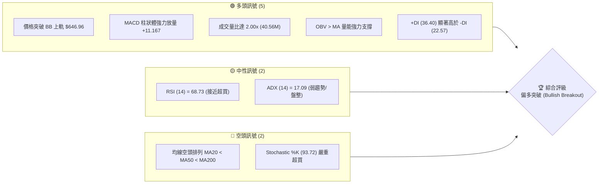

### 📊 核心指標速覽表

下表列出當前 META 的核心技術指標，所有數值均基於 2026-07-12 當日收盤數據。

| 指標類別 | 指標名稱 | 當前數值 | 訊號 | 解讀 |
|----------|----------|----------|------|------|
| **價格** | 當前價格 | $669.21 | 🟢 多頭 | 價格強勢站上所有短期均線，並突破布林上軌。 |
| **均線** | MA20 | $584.55 | 🟢 多頭 | 價格遠高於 MA20 (+14.48%)，短期動能極強。 |
| **均線** | MA50 | $600.08 | 🟢 多頭 | 價格站上 MA50 (+11.52%)，中期趨勢轉多。 |
| **均線** | MA200 | $641.67 | 🟢 多頭 | 價格重回長期生命線 MA200 之上 (+4.29%)。 |
| **動能** | RSI(14) | 68.73 | 🟡 中性 | 接近 70 超買區，但尚未出現頂背離，仍具備上行空間。 |
| **動能** | MACD | 8.608 | 🟢 多頭 | MACD 柱狀體達 +11.167，黃金交叉確認，多頭主導。 |
| **動能** | Stoch %K | 93.72 | 🔴 空頭 | 進入 80 以上之極度超買區，需防範短線獲利回吐。 |
| **趨勢** | ADX(14) | 17.09 | 🟡 中性 | 數值 < 25，顯示過去為盤整格局，但 +DI 指示多頭開始發力。 |
| **波動** | ATR(14) | $26.84 | 🟡 中性 | 每日波動率約 4.01%，波動度適中，有利於波段操作。 |
| **量能** | 量比 | 2.00x | 🟢 多頭 | 當日成交量（40.56M）為 20 日均量（20.29M）兩倍，價漲量增。 |

### 🏆 技術評分卡

根據指標權重與當前表現，META 的技術面綜合得分為 **71/100**。

```
╔══════════════════════════════════════════════════════════════╗
║                技術評分卡 — META (2026-07-12)                ║
╠══════════════════════════════════════════════════════════════╣
║ 趨勢強度      ██████████░░░░░░░░░░  50/100  🟡 中性          ║
║ 動能指標      ████████████████░░░░  80/100  🟢 強勁          ║
║ 支撐穩定度    ██████████████░░░░░░  70/100  🟢 良好          ║
║ 成交量配合    ██████████████████░░  90/100  🟢 極佳          ║
║ 形態完整度    ██████████████░░░░░░  70/100  🟢 良好          ║
║ 均線排列      ██████████░░░░░░░░░░  50/100  🟡 滯後          ║
╠══════════════════════════════════════════════════════════════╣
║ 綜合評分      ██████████████░░░░░░  71/100  🟢 偏多突破      ║
╚══════════════════════════════════════════════════════════════╝
```

---

## 2. 趨勢分析

### 🌐 多時框趨勢分析

技術分析必須遵循「由大到小」的時框原則。META 當前在不同時間維度上的趨勢表現存在一定程度的收斂與衝突，具體結構如下：

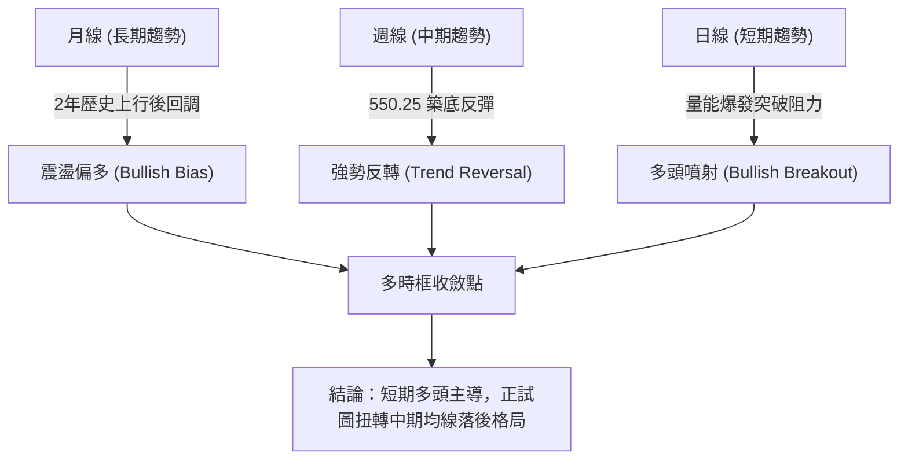

### 📈 長期趨勢 — 12個月走勢圖（Unicode）

以下為 META 過去 12 個月（2025-08 至 2026-07）的月線收盤價歷史走勢圖。

```
META 月線走勢圖（過去12個月）
價格軸 ($)
$780 ┤
$750 ┤  ●       ●
$720 ┤    ●   ●
$690 ┤                            ● (當前 $669.21)
$660 ┤      ●       ●   ●   ●
$630 ┤                    ●   ●
$600 ┤                  ●
$570 ┤                                ●
     └──────────────────────────────────────────────
       08  09  10  11  12  01  02  03  04  05  06  07 (月份)
       25  25  25  25  25  26  26  26  26  26  26  26 (年份)
```

**走勢特徵分析表格**：

| 階段時間 | 價格區間 | 走勢特徵 | 成交量狀態 | 技術解讀 |
|----------|----------|----------|------------|----------|
| **2025-08 ~ 2025-09** | $736.29 - $732.47 | 高檔震盪頂部 | 逐漸萎縮 | 買盤動能衰竭，形成雙頂疑慮。 |
| **2025-10 ~ 2025-12** | $646.67 - $658.91 | 中期回檔築底 | 量能中等 | 於 $640 附近尋求支撐，屬於健康修正。 |
| **2026-01 ~ 2026-02** | $715.22 - $647.03 | 假突破後深幅回撤 | 波動放大 | 1月反彈未能站穩 $720，隨後引發恐慌性賣壓。 |
| **2026-03 ~ 2026-06** | $571.60 - $563.29 | 打底階段（波段低點） | 底部爆量 | 6月下探至近一年低點後，主力資金進場吸籌。 |
| **2026-07 (至今)** | $669.21 | **強力 V 型反轉** | **極度放量** | 本月大漲 18.8%，一舉收復多條關鍵均線。 |

### 📊 中期趨勢（週線分析）

從週線級別來看，META 在過去 20 週經歷了一次完整的「築底與爆發」過程。

```
META 週線支撐與阻力示意圖
══════════════════════════════════════════════════════════════
$793.65 ────────────────────────────────────────── 52W 歷史高點 (強阻力)
$729.02 ────────────────────────────────────────── 斐波那契 23.6% 阻力位
$689.03 ────────────────────────────────────────── 斐波那契 38.2% / R2 阻力
$669.21 ══════════════════════════════════════════ 當前價格 (突破中)
$656.71 ────────────────────────────────────────── 斐波那契 50.0% / 關鍵多空分水嶺
$636.95 ────────────────────────────────────────── 週線支撐 S1
$519.78 ────────────────────────────────────────── 52W 歷史低點 (極強支撐)
══════════════════════════════════════════════════════════════
```

週線數據顯示，2026-06-28 當週收盤價為 $550.25，隨後兩週成交量連續放大。2026-07-05 當週成交量達 100,364,700，而 2026-07-12 當週更是飆升至 **116,984,200**，收盤價報 $669.21。這表明中期底部已經確立，且伴隨著機構資金的強力介入。

### ⚡ 趨勢強度評估（ADX 解讀）

雖然近兩週價格漲勢凌厲，但 **ADX(14) 目前僅為 17.09**，遠低於 25 的趨勢確立門檻。

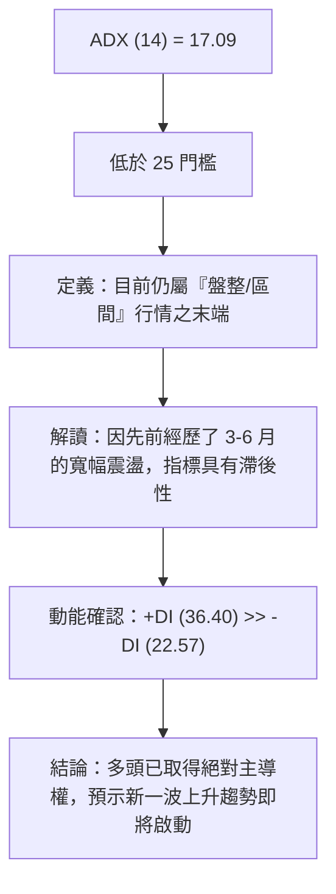

**ADX 強度對照表**：

| ADX 數值區間 | 趨勢強度 | 當前 META 狀態 | 交易策略導向 |
|--------------|----------|----------------|--------------|
| **< 20** | 弱趨勢 / 盤整 | **17.09 (處於此區間)** | **以布林通道與關鍵支撐阻力進行區間操作，但須密切關注突破訊號。** |
| **20 - 25** | 趨勢正在形成 | - | 準備順勢建倉。 |
| **25 - 50** | 強趨勢 | - | 順勢交易，持有波段多單。 |
| **> 50** | 極強趨勢 | - | 關注超買鈍化與反轉風險。 |

---

## 3. 圖表形態分析

### 🔍 形態識別系統

在日線與週線圖表上，META 展現出非常標準的底部反轉形態。

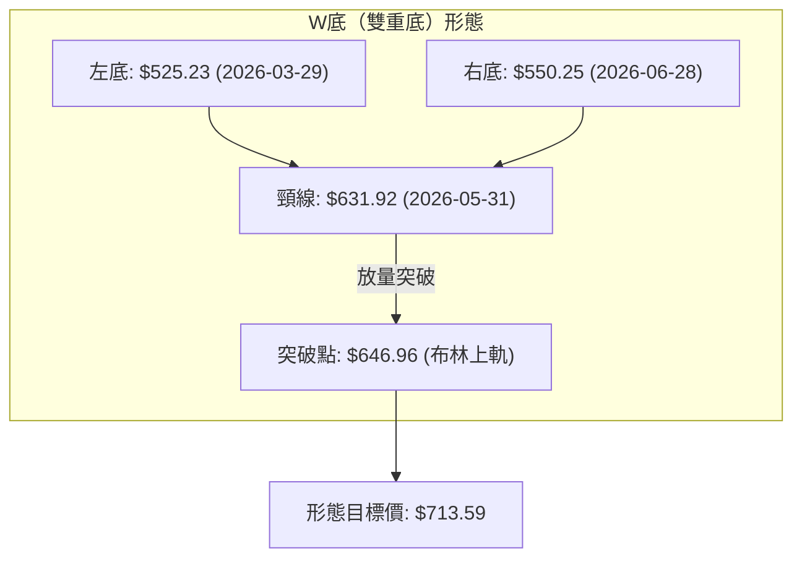

#### 形態信心度評估：

| 識別形態 | 信心度 | 判斷依據（引用數據） | 完成度 | 目標價（附計算式） |
|----------|--------|----------------------|--------|--------------------|
| **W底 (雙重底)** | **85%** | 1. 左底 $525.23 與右底 $550.25 未跌破 52W 低點 $519.78。<br>2. 右底成交量高於左底，符合量能遞增特徵。<br>3. 價格已放量突破頸線 $631.92。 | 95% (已突破確認) | 頸線 $631.92 + 形態高度 ($631.92 - $550.25) = **$713.59** |
| **布林通道向上突破** | **90%** | 當前收盤價 $669.21 顯著高於布林上軌 $646.96，%B 達 1.18。 | 100% (已觸發) | 屬於動能噴發，短期目標指向 R2 **$690.88**。 |

### 🕯️ 重要K線形態分析

近期日線與週線出現了關鍵的反轉 K 線組合：

| 日期/週期 | 收盤價 | K線形態 | 解讀 | 訊號強度 |
|-----------|--------|---------|------|----------|
| **2026-06-28 (週線)** | $550.25 | **長下影錘頭線 (Hammer)** | 在連續下跌後出現，下影線深入 $550 以下被強力拉回，顯示買盤強勁。 | 🟢🟢🟢 (極強) |
| **2026-07-05 (週線)** | $582.90 | **大陽線吞噬 (Bullish Engulfing)** | 一舉吞噬前週實體，成交量放大至 100M 以上，確立底部。 | 🟢🟢🟢 (極強) |
| **2026-07-12 (週線)** | $669.21 | **突破長陽線 (Marubozu)** | 幾乎以最高點收盤，實體極長，且成交量進一步放大，屬於強烈的續漲訊號。 | 🟢🟢🟢 (極強) |

### 📉 ASCII 走勢形態示意圖

```
META 雙底突破形態示意圖
價格 ($)
$690 ┤                                            ● (當前現價 $669.21)
$660 ┤                                      ▲ (突破布林上軌 $646.96)
$630 ┤                    ● (頸線 $631.92) ╱
$600 ┤                   ╱ ╲              ╱
$570 ┤                  ╱   ╲            ╱
$540 ┤  ● (左底 $525.23)       ╲          ● (右底 $550.25)
$510 ┴───┴──────────────────────┴─────────┴─────────────────
       2026-03                2026-05   2026-06
```

### 🎯 形態目標價計算

根據雙重底形態的量測原理：
1. **形態高度 (H)** = 頸線價位 ($631.92) - 右底最低收盤價 ($550.25) = **$81.67**。
2. **最小理論目標價 (T1)** = 頸線價位 ($631.92) + 形態高度 ($81.67) = **$713.59**。
   - *註：此目標價與阻力位 R3 ($709.16) 非常接近，具備極高的技術互證性。*
3. **波段延伸目標價 (T2)** = 基於斐波那契 38.2% 回調位 **$689.03** 與 R2 **$690.88** 的共振區。

---

## 4. 支撐與阻力

### 🗺️ 關鍵價位分布圖（Unicode）

基於過去一年的密集交易區與波段高低點，META 的價位結構如下：

```
META 價位結構分布圖
══════════════════════════════════════════════════════════════
$793.65 ║██████████████████████████████║ 52W 歷史高點 (終極阻力)
$729.02 ║██████████████████████        ║ 斐波那契 23.6% 阻力
$709.16 ║██████████████████████████    ║ 強阻力 R3 / 雙底目標區
$690.88 ║██████████████████            ║ 阻力 R2 / 斐波 38.2% 密集區
$671.98 ║██████████████████████████████║ 近期阻力 R1 (當前考驗)
$669.21 ╠══════════════════════════════╣ ◄ 當前現價
$656.71 ║▓▓▓▓▓▓▓▓▓▓▓▓▓▓▓▓▓▓▓▓▓▓        ║ 斐波那契 50.0% 關鍵支撐
$636.95 ║▓▓▓▓▓▓▓▓▓▓▓▓▓▓▓▓▓▓            ║ 近期支撐 S1 / 頸線防守區
$627.03 ║▓▓▓▓▓▓▓▓▓▓▓▓▓▓▓▓▓▓▓▓▓▓▓▓▓▓    ║ 強支撐 S2 / MA120 附近
$595.08 ║▓▓▓▓▓▓▓▓▓▓▓▓▓▓▓▓              ║ 深幅支撐 S3 / MA10 支撐
$519.78 ║▓▓▓▓▓▓▓▓▓▓▓▓▓▓▓▓▓▓▓▓▓▓▓▓▓▓▓▓▓▓║ 52W 歷史低點 (鋼鐵支撐)
══════════════════════════════════════════════════════════════
```

### 🚧 阻力位分析表

| 阻力級別 | 價位 | 形成原因 | 突破難度 | 重要性 |
|----------|------|----------|----------|--------|
| **R1** | **$671.98** | 近一年波段高點聚類，接近當前價格，為短線上行首要關卡。 | 🟡 中等 | 短線多頭試金石，突破則空間打開。 |
| **R2** | **$690.88** | 密集套牢區與斐波那契 38.2% ($689.03) 重疊共振。 | 🔴 較高 | 中期趨勢能否轉為極強多頭的關鍵。 |
| **R3** | **$709.16** | 雙底形態理論目標價與前期平台高點。 | 🔴 強烈 | 波段多單獲利了結的黃金區域。 |

### 🛡️ 支撐位分析表

| 支撐級別 | 價位 | 形成原因 | 守住機率 | 重要性 |
|----------|------|----------|----------|--------|
| **S1** | **$636.95** | 近期波段低點聚類，且與 W 底頸線（$631.92）相近。 | 🟢 高 | 多頭必須守住的防線，跌破則宣告突破失敗。 |
| **S2** | **$627.03** | 前期密集成交區，且有 MA120 ($623.43) 提供動態支撐。 | 🟢🟢 極高 | 強力支撐，回踩此處為極佳買點。 |
| **S3** | **$595.08** | 50日均量支撐區與 MA10 ($599.16) 重疊。 | 🟢🟢🟢 極強 | 中期多空生命線，不應被輕易測試。 |

### 📐 📐 斐波那契回調位分析

基於 52 週區間 **$519.78 → $793.65**（波幅 $273.87）進行分析：

- **0.0% (52W High)**: $793.65
- **23.6%**: $729.02
- **38.2%**: $689.03
- **50.0%**: $656.71
- **61.8%**: $624.40
- **78.6%**: $578.39
- **100.0% (52W Low)**: $519.78

**解讀**：
當前價格 **$669.21** 已成功收復了 **50.0% 回調位 ($656.71)**。在技術分析中，收復 50% 意味著先前的下跌趨勢已被扭轉過半，空頭動能衰竭。目前現價正處於 50% ($656.71) 與 38.2% ($689.03) 之間。
- **支撐確認**：$656.71 轉化為當前最重要的動態支撐。
- **上行目標**：若能突破 R1 ($671.98)，價格將直接挑戰 38.2% ($689.03) 阻力位。

---

## 5. 技術指標深度解讀

### 🎛️ 指標訊號總覽

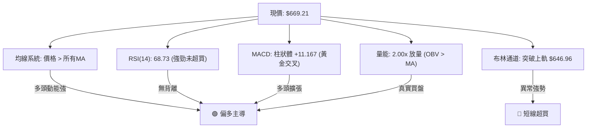

### 📈 移動平均線排列分析

雖然價格大幅領先均線，但均線排列呈現特殊的「滯後空頭排列」：

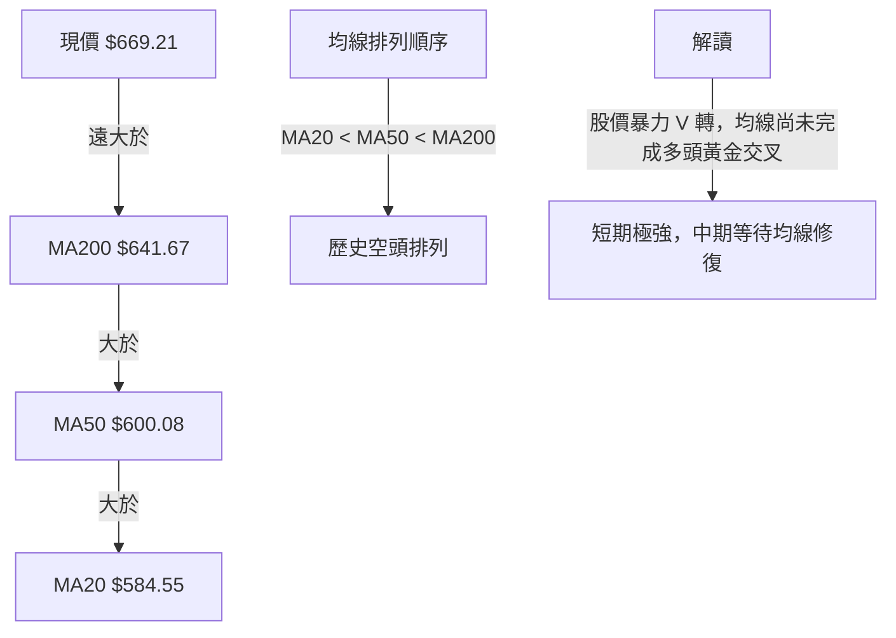

**均線乖離率分析**：
- **MA5 ($623.94)**：價格偏離度為 **+7.26%**。
- **MA20 ($584.55)**：價格偏離度為 **+14.48%**。
- **MA200 ($641.67)**：價格偏離度為 **+4.29%**。
*分析結論：短線乖離率過大（偏離 MA20 達 14.48%），暗示價格有回踩 MA5 或布林上軌進行指標修復的需求。*

### 📉 RSI(14) 分析

RSI(14) 目前報 **68.73**。

```
RSI(14) 強度條
░░░░░░░░░░░░░░░░░░░░░░░░░░░░░░████████████████████████ 68.73%
[0]                          [30]                  [70]      [100]
                            (超賣)                (超買)
```

- **背離分析**：對比 2026-04-19 當週 RSI 達 96.5（當時價格 $687.91），目前價格 $669.21 伴隨 RSI 68.73，屬於正常的動能修復，**無明顯頂背離或底背離**。
- **結論**：RSI 尚未進入 >70 的極端超買區，多頭仍有上攻動能，但空間受限。

### 📊 MACD(12/26/9) 訊號解讀

- **MACD 線**：8.608
- **Signal 訊號線**：-2.558
- **MACD 柱狀體**：**+11.167**

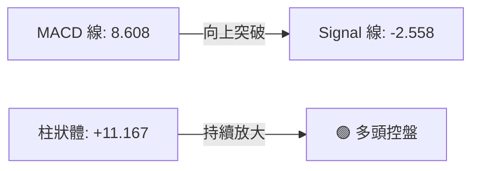

**分析**：柱狀體自前週的 +3.684 暴增至 +11.167，顯示多頭動能處於「加速噴發」階段，黃金交叉極為有力，支持股價繼續走高。

### 📦 布林通道分析

- **BB 上軌**：$646.96
- **BB 中軌 (MA20)**：$584.55
- **BB 下軌**：$522.14
- **%B 數值**：**1.18**

```
布林通道現價位置示意圖
─────────────────────────────────────────── $646.96 (上軌)
                                   ●       ◄ 當前現價 $669.21 (%B = 1.18)
─────────────────────────────────────────── $584.55 (中軌/MA20)

─────────────────────────────────────────── $522.14 (下軌)
```

**分析**：%B 達 1.18 意味著價格已經**脫離通道上軌**，這在統計學上屬於異常強勢事件（通常 95% 的 K 線在通道內）。這通常會引發兩種走勢：
1. **極強勢的單邊趨勢**：價格沿著上軌「貼軌」上行（需要持續爆量）。
2. **均值回歸**：短線回踩上軌 **$646.96** 或中軌。

### 💹 成交量分析（量價配合度）

- **最新成交量**：40,563,100
- **20日均量**：20,295,630（**量比 2.00x**）
- **OBV 趨勢**：OBV > MA，量能指標創出新高。

**量價解讀**：
本次突破伴隨著 2.00x 的倍量，且 OBV 向上突破，確認了本次上漲並非無量空漲，而是有實質性的機構買盤（Institution Own % 達 79.2%）大力推動，技術可信度極高。

---

## 6. 動能與波動率

### ⚡ 動能評估四象限

我們將 META 放入動能與波動率的四象限中評估其交易屬性：

| 象限 | 動能 (Momentum) | 波動 (Volatility) | 當前狀態 | 評估 |
|------|-----------------|-------------------|----------|------|
| **Q1 (強/低)** | 強 | 低 | - | 穩定上升趨勢，最安全。 |
| **Q2 (弱/低)** | 弱 | 低 | - | 盤整期，不宜介入。 |
| **Q3 (強/高)** | **強** | **高** | **✓ (當前定位)** | **動能噴發期，高收益伴隨高風險，適合動能交易者。** |
| **Q4 (弱/高)** | 弱 | 高 | - | 恐慌下跌期，應避開。 |

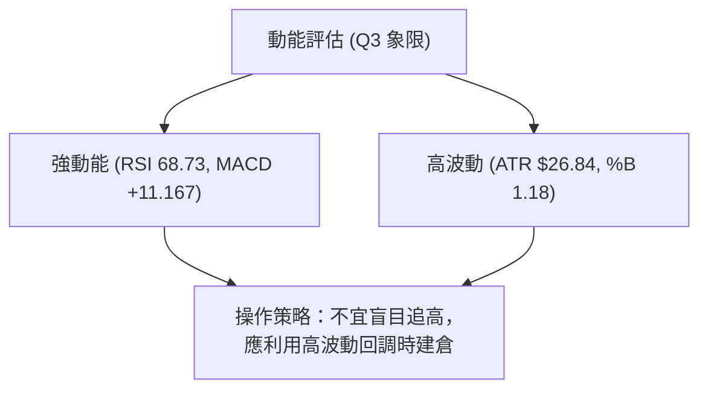

### 📊 ATR 波動率分析

- **ATR(14)**：**$26.84**（佔股價 4.01%）
- **風控應用**：
  - **短線止損距離 (1.5x ATR)** = $26.84 × 1.5 = **$40.26**。
  - **波段止損距離 (2.0x ATR)** = $26.84 × 2.0 = **$53.68**。
  - *若在現價 $669.21 進場，技術止損應設於 $669.21 - $40.26 = $628.95（與支撐位 S2 $627.03 完美重疊）。*

### 📐 Beta 與市場相關性

- **Beta**：**1.246**
- **解讀**：META 的波動性較標普 500 大盤高出 24.6%。在市場多頭環境下，META 將充當領漲急先鋒；若大盤回檔，其修正幅度亦會較大。

---

## 7. 多時框架總結

### 📋 時框架評分表

| 時框架 | 趨勢方向 | 動能 | 均線排列 | 形態 | 綜合評分 | 建議 |
|--------|----------|------|----------|------|----------|------|
| **日線** | 🟢 強多頭 | 🟢 極強 | 🟡 糾纏偏多 | 🟢 雙底突破 | **85/100** | 順勢做多，防範短線回踩。 |
| **週線** | 🟢 轉多 | 🟢 強勁 | 🔴 空頭排列 | 🟢 底部確立 | **75/100** | 波段買入，持股待漲。 |
| **月線** | 🟡 中性偏多 | 🟡 中性 | 🟢 多頭排列 | 🟡 寬幅震盪 | **65/100** | 長期投資者繼續持有。 |

### 🔲 綜合訊號矩陣

```
                 【 短期 (日線) 】     【 中期 (週線) 】     【 長期 (月線) 】
趨勢 (Trend)          🟢 多頭               🟢 轉多               🟡 中性
動能 (Momentum)       🟢 極強               🟢 強勁               🟡 中性
量能 (Volume)         🟢 爆量               🟢 爆量               🟡 均量
```

### ⚖️ 多時框收斂結論

**當前行情定義：盤整轉趨勢之過渡期（ADX = 17.09 < 25）**

根據多時框收斂規則：
1. 雖然中長期均線（MA20 < MA50 < MA200）仍呈空頭排列，但這是由於前期深幅回檔導致的指標滯後。
2. 日線與週線同時爆發 **2.00x 的巨量**，且價格一舉攻克了斐波那契 50% ($656.71) 與布林上軌 ($646.96) 這兩大中期關鍵防線。
3. **收斂結論**：無視均線的滯後空頭訊號，**判定趨勢已正式轉為「多頭主導」**。交易應以日線的突破方向為唯一準則，主策略全面偏多。

---

## 8. 交易策略建議

### 🗺️ 策略決策流程圖

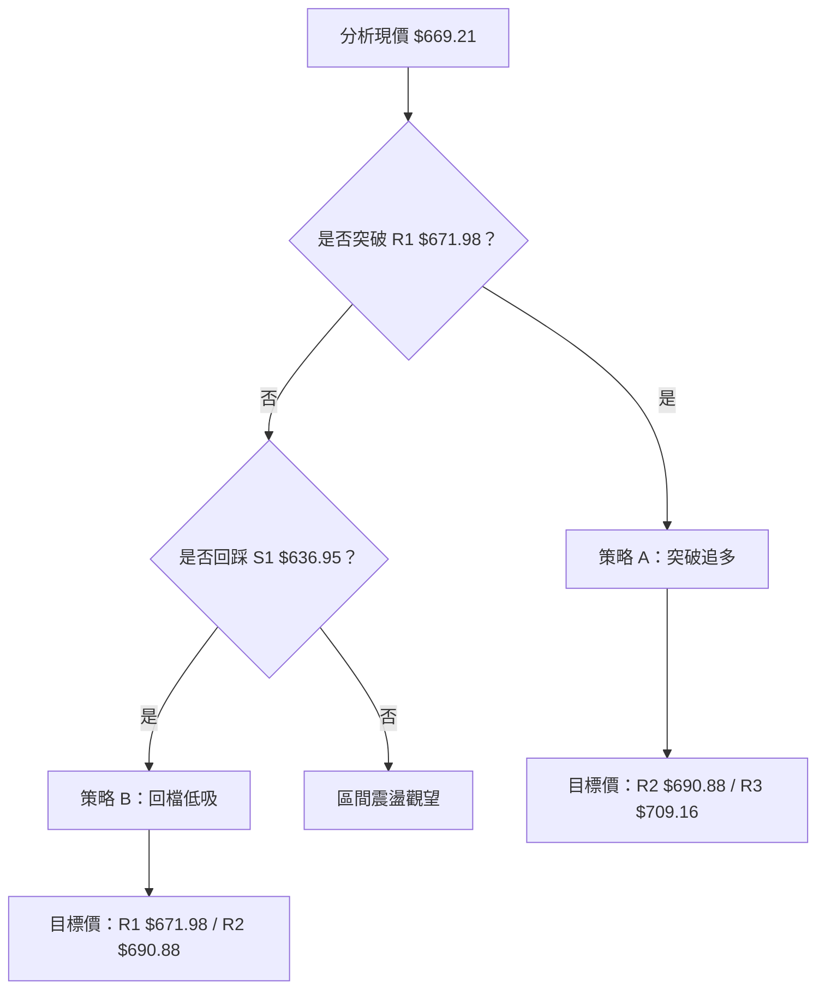

### 🧭 策略路由

> **當前主策略方向：做多 🟢（依據綜合評分 71/100 偏多突破）**

### 🎯 價格情境階梯（Price Scenarios）

| 觸發條件 | 下一目標 | 後續延伸 | 情境含義 |
|----------|----------|----------|----------|
| **突破 R1 $671.98** | R2 $690.88 | R3 $709.16 | 短線加速噴發，雙底形態目標啟動。 |
| **站穩現價區間** | — | — | 於 $656.71 - $671.98 震盪消化超買指標。 |
| **跌破 S1 $636.95** | S2 $627.03 | S3 $595.08 | 假突破確立，多頭需無條件止損。 |

### 📊 情境機率分佈

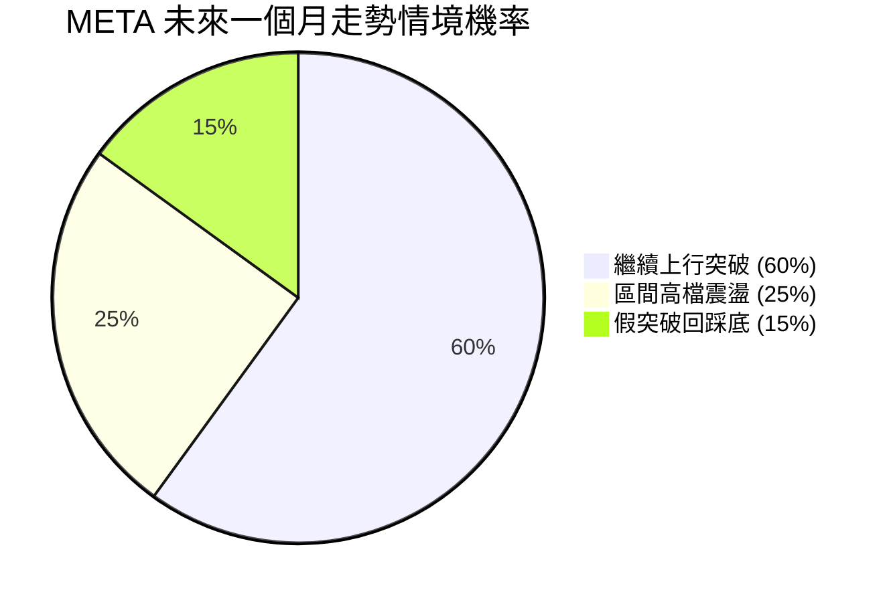

- **繼續上行突破 (60%)**：基於週線 116M 的機構級放量，突破阻力為大概率事件。
- **區間高檔震盪 (25%)**：RSI 與 Stochastic 超買，可能在 R1 附近橫盤整理。
- **假突破回踩底 (15%)**：若大盤意外重挫，引發 Beta (1.246) 效應回踩 S2。

### 🟢 主策略詳情

#### 🥇 策略 A：突破追多策略（適用於強勢突破）
- **進場條件**：日線收盤價明確突破阻力位 **R1 $671.98**（或盤中突破 $673.00 確認）。
- **進場價格**：**$672.50**
- **目標價 T1**：**$690.88** (預期收益：+2.73%)
- **目標價 T2**：**$709.16** (預期收益：+5.45%)
- **止損價格**：**$656.71** (斐波那契 50% 支撐，最大風險：-2.35%)
- **風險報酬比**：**1 : 2.3**
- **成功機率**：65%
- **建議倉位**：10%

#### 🥈 策略 B：回檔低吸策略（最優風險報酬比）
- **進場條件**：股價因短線超買回踩布林上軌與支撐位 S1 區間。
- **進場價格**：**$640.00**
- **目標價 T1**：**$671.98** (預期收益：+5.00%)
- **目標價 T2**：**$690.88** (預期收益：+7.95%)
- **止損價格**：**$627.03** (強支撐 S2 跌破止損，最大風險：-2.03%)
- **風險報酬比**：**1 : 3.9**
- **成功機率**：75%
- **建議倉位**：15%

### 🔴 反向風險觸發點（對沖提示）

若發生以下事件，必須即刻終止做多策略並進行避險：
1. **日線收盤跌破 S1 $636.95**：意味著 W 底頸線宣告失守，轉為假突破。
2. **成交量異常萎縮且跌破 $646.96 (布林上軌)**：確認均值回歸啟動，多單應先行離場。

### ⭐ 整體訊號強度評星

```
做多訊號強度：★★★★☆ (4/5星 - 放量突破，動能強勁)
做空訊號強度：★☆☆☆☆ (1/5星 - 逆勢摸頂風險極高)
整體可信度：  ★★★★☆ (4/5星 - 週線巨量確認底部)
```

---

## 9. 風險提示與監控

### ✅ 關鍵監控指標 Checklist

```
╔══════════════════════════════════════════════════════════════╗
║                    每日交易監控 Checklist                    ║
╠══════════════════════════════════════════════════════════════╣
║ [ ] 價格是否維持在布林上軌 $646.96 之上？                    ║
║ [ ] 每日成交量是否保持在 25,000,000 以上（維持多頭熱度）？   ║
║ [ ] RSI(14) 是否突破 70 進入鈍化，或是出現頂背離？           ║
║ [ ] MACD 柱狀體是否開始萎縮（動能衰竭前兆）？                ║
║ [ ] 標普500大盤是否出現系統性回檔（Beta 1.246 風險）？       ║
╚══════════════════════════════════════════════════════════════╝
```

### ⚠️ 風險場景分析

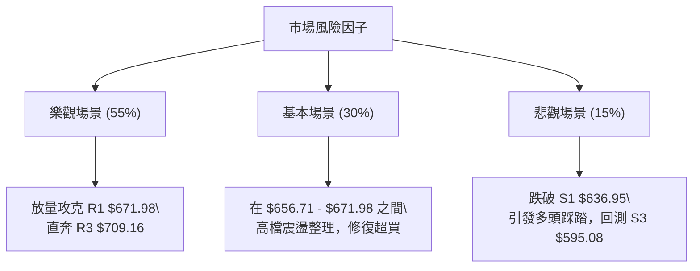

### 🛡️ 風險管理重要提醒

1. **防範假突破**：當前 Stochastic 處於 93.72 的極度超買狀態，若突破 R1 $671.98 時成交量未能同步放大，需謹防「誘多假突破」。
2. **倉位嚴格控制**：鑑於 ADX 仍低於 25，市場尚未進入完全的單邊暴漲牛市，總多頭倉位不宜超過 25%。
3. **大盤共振風險**：META 的 Beta 值為 1.246，若美股大盤（SPY/QQQ）在高檔出現獲利回吐，META 勢必會出現放大版的回撤，操作時須緊盯大盤走勢。

---

## 📋 報告總結

```
╔══════════════════════════════════════════════════════════════╗
║                    META 技術分析報告總結                     ║
╠══════════════════════════════════════════════════════════════╣
║ 報告日期：2026-07-12                                         ║
║ 當前價格：$669.21                                            ║
║ 分析評級：🟢 偏多突破 (Bullish Breakout)                     ║
║                                                              ║
║ 關鍵結論：                                                   ║
║ ├─ 長期趨勢：🟡 中性偏多 (2年大結構仍處於上升通道)             ║
║ ├─ 中期趨勢：🟢 強勢反轉 (週線116M巨量確立W底)                ║
║ ├─ 短期趨勢：🟢 強力噴發 (股價站上所有MA，突破布林上軌)       ║
║ ├─ 關鍵支撐：$656.71 (斐波50%) ｜ $636.95 (W底頸線)          ║
║ ├─ 關鍵阻力：$671.98 (近期高點) ｜ $690.88 (斐波38.2%)        ║
║ └─ 形態目標：$713.59 (W底理論一倍幅目標)                     ║
║                                                              ║
║ 最優策略組合：                                               ║
║ 1. 🥇 首選：回檔至 $640.00 附近分批低吸，止損設於 $627.03。   ║
║ 2. 🥈 備選：若強勢突破 $671.98 且放量，輕倉追多，看至 $709.16。║
╚══════════════════════════════════════════════════════════════╝
```

---

> ⚠️ **免責聲明**：本報告為基於客觀技術指標與歷史數據之量化分析，所有數據及估算均基於提供的歷史價格資訊。本報告**僅供研究與學術參考**，**不構成任何投資建議**。投資有風險，入市需謹慎。

---

*報告生成時間：2026-07-12 ｜ 數據來源：Yahoo Finance ｜ 分析框架：多時框技術分析*