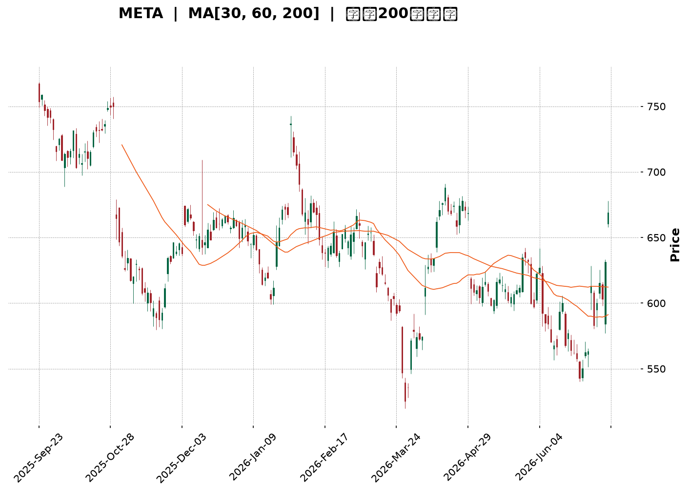
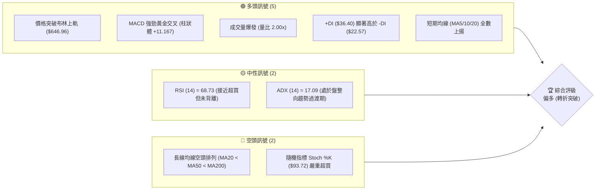
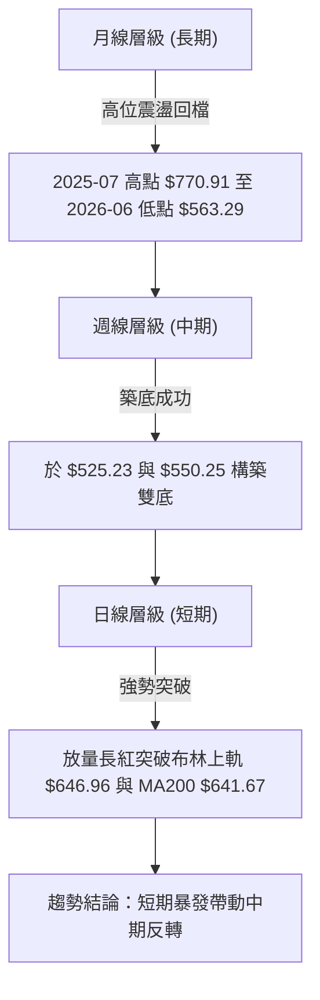
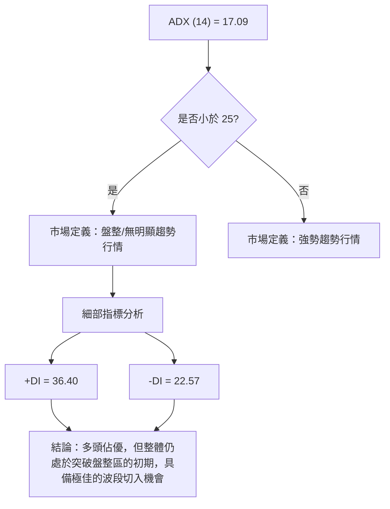
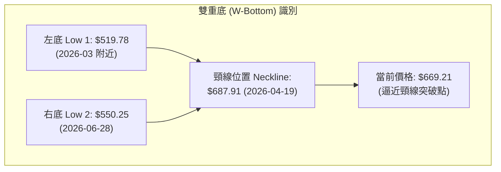
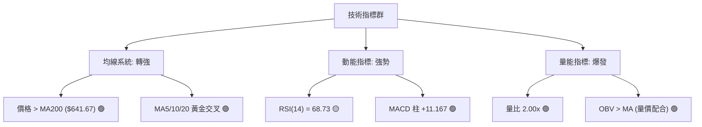
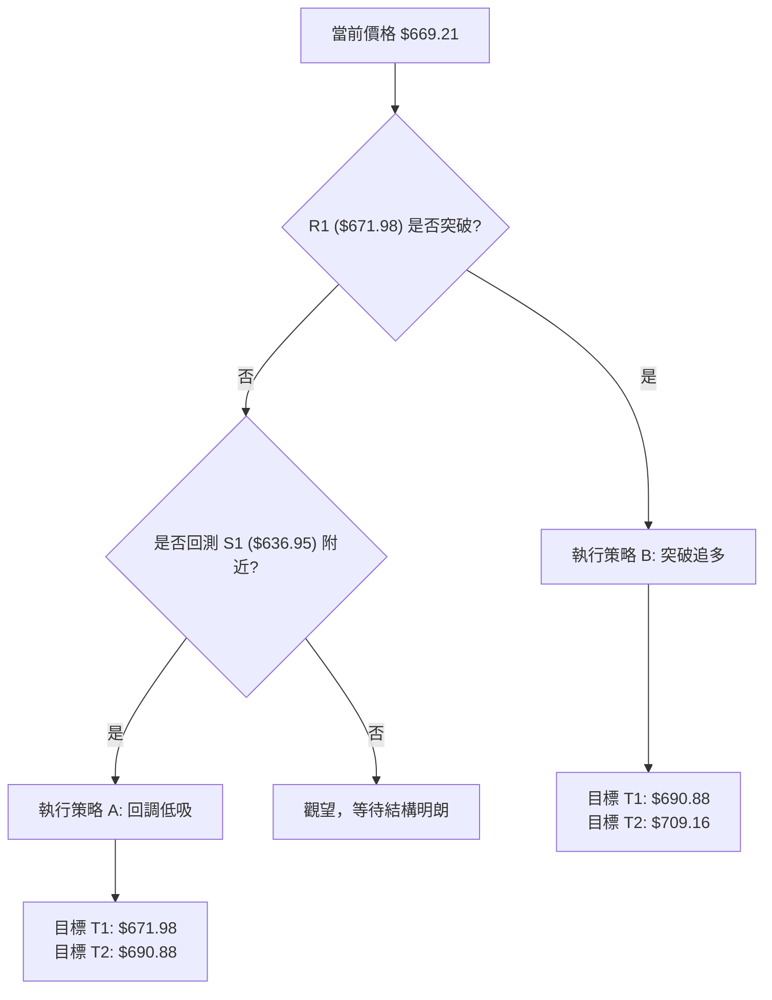
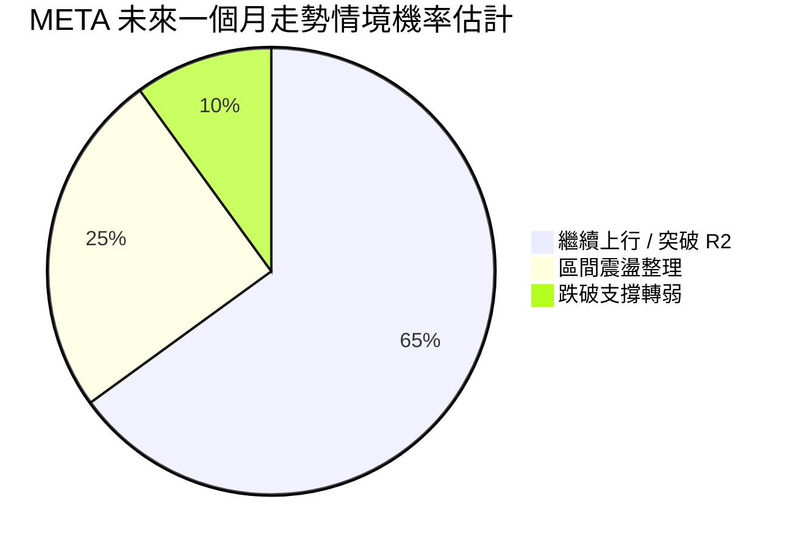
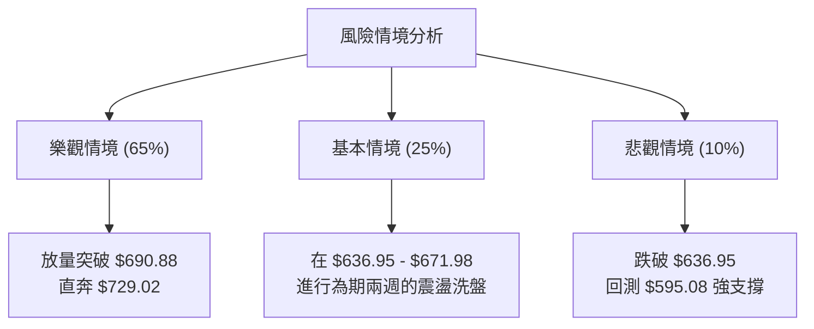

<details>
<summary>📊 靜態圖表 (點擊展開)</summary>

</details>

<html>
<head><meta charset="utf-8" /></head>
<body>
    <div style="height:500px; width:100%;">                        <script>window.PlotlyConfig = {MathJaxConfig: 'local'};</script>
        <script charset="utf-8" src="https://cdn.plot.ly/plotly-3.7.0.min.js" integrity="sha256-jvTGqxNp8AGWEcvNLVuKr+8j5dGe9Yw51LQkmDH+IYA=" crossorigin="anonymous"></script>                <div id="candlestick-chart" class="plotly-graph-div" style="height:100%; width:100%;"></div>            <script>                window.PLOTLYENV=window.PLOTLYENV || {};                                if (document.getElementById("candlestick-chart")) {                    Plotly.newPlot(                        "candlestick-chart",                        [{"close":{"dtype":"f8","bdata":"AAAAAIaLh0AAAACAfrWHQAAAAOC8V4dAAAAAoJAuh0AAAADAxSuHQAAAAMDM44ZAAAAAQNVbhkAAAADAT6mGQAAAAOC7JYZAAAAAoG1OhkAAAACA1zmGQAAAAMDSX4ZAAAAAoNvchkAAAABgw\u002fuFQAAAAEC\u002fToZAAAAAYH4WhkAAAABAgl2GQAAAAGDIMYZAAAAAYHtYhkAAAABgKtKGQAAAAGDx2oZAAAAAQA\u002fchkAAAACAxOCGQAAAAKCOA4dAAAAAYPpmh0AAAAAA7WuHQAAAAMDCbYdAAAAA4O3FhEAAAABAWDWEQAAAAEBy4INAAAAAoIqNg0AAAAAAZ9KDQAAAAOCsSoNAAAAAIMdgg0AAAABA+LCDQAAAAICgi4NAAAAAAHH7gkAAAACgdgKDQAAAAEAI\u002f4JAAAAAIJbDgkAAAADgHaGCQAAAACBPZoJAAAAAQPlcgkAAAAAAq4WCQAAAAICtG4NAAAAAYI7Ug0AAAAAgu7+DQAAAAEAnMoRAAAAAAKn5g0AAAADgXiuEQAAAAMCG74NAAAAAIIOehEAAAACAYv2EQAAAAOCPyIRAAAAAAAx6hEAAAABAjEOEQAAAAGAiWIRAAAAAgHgUhEAAAABA2zKEQAAAAODWf4RAAAAAgL9ChEAAAACAIrqEQAAAAKDGjIRAAAAAwJOihEAAAABADL6EQAAAAADk0oRAAAAAIN+whEAAAAAgI4yEQAAAACAdxoRAAAAAIFGXhEAAAADAA0qEQAAAAIDvjIRAAAAAoIybhEAAAACARzyEQAAAAOBGJ4RAAAAAYC1fhEAAAABgnQaEQAAAAAC7r4NAAAAAYGQzg0AAAACAjl2DQAAAACAqWYNAAAAAwFrYgkAAAADg8h6DQAAAAIDQM4RAAAAAQLKMhEAAAABATfmEQAAAAGAs\u002foRAAAAAQFDchEAAAACA9geHQAAAACDLWYZAAAAAgDcJhkAAAAAgv5OFQAAAAABk3oRAAAAAICLohEAAAAAAQqKEQAAAAOAcIIVAAAAAgDTshEAAAACg\u002ftuEQAAAAEA5RYRAAAAA4Av1g0AAAACgNvGDQAAAAOCYEIRAAAAAIA4dhEAAAADA8HOEQAAAAEDs4INAAAAAIEvxg0AAAABANWSEQAAAAKC4foRAAAAA4DQ4hEAAAACAK2OEQAAAAABPb4RAAAAAAFTUhEAAAACAJpuEQAAAAKCxHYRAAAAA4OUxhEAAAABAPmeEQAAAAECNbYRAAAAAgFnog0AAAAAA8CSDQAAAAMDzloNAAAAA4Kpwg0AAAAAg4TiDQAAAACAb8YJAAAAA4OGIgkAAAABgAdyCQAAAAMD3goJAAAAAoLaSgkAAAACAQxiBQAAAAIDdaYBAAAAAIBG\u002fgEAAAABAzdyBQAAAAKCMFYJAAAAAwGzvgUAAAABg6uOBQAAAAOAj9IFAAAAAwNIeg0AAAAAgd56DQAAAAMA2qoNAAAAAQIrPg0AAAAAgA6+EQAAAAGCq94RAAAAAIPIhhUAAAACgTH+FQAAAAGBP8oRAAAAAAMThhEAAAAAAwxCFQAAAAEBRlIRAAAAAYD0ThUAAAADg7i+FQAAAAEC\u002f9YRAAAAA4ADkhEAAAABAvxqDQAAAAKB9AYNAAAAAIMIOg0AAAADgMuOCQAAAAACAIoNAAAAAIOlBg0AAAAAghgiDQAAAAKBxsoJAAAAAgIjTgkAAAADgeECDQAAAAODbToNAAAAAQEotg0AAAAAAJxWDQAAAAIBq0IJAAAAAgP\u002fjgkAAAABgivaCQAAAAECPDYNAAAAAIC8eg0AAAADgX9WDQAAAACCd1YNAAAAAAGW\u002fg0AAAADAT7+CQAAAAOCcqIJAAAAAoDlzg0AAAABA6ZeDQAAAAICbg4JAAAAAoMhGgkAAAADAY0CCQAAAAECc04FAAAAAoDq\u002fgUAAAADAo7OBQAAAAADXi4JAAAAAIK7BgkAAAADgo7yBQAAAAIDCCYJAAAAAwMyegUAAAACgmZGBQAAAACBcbYFAAAAAwPX2gEAAAAAAADKBQAAAAMDMlIFAAAAA4FGagUAAAACgRyeDQAAAAEAzN4JAAAAA4FHCgkAAAADgozyDQAAAAMD12IJAAAAAANe7g0AAAAAgrumEQA=="},"high":{"dtype":"f8","bdata":"UOoZv84EiEDuI\u002fe7FbmHQEQ75H10lodALFejytVvh0DOmLfKqGaHQHMSVF1XKIdAB7oOqtF\u002fhkAsl7aMDq+GQJzxfWjUyIZAGnO7xClYhkCHTY7UFmWGQL+\u002fVgJEboZAAAAAoNvchkCvfrzH5uqGQFUYSDmUcIZAZCif14xNhkCHp6FjLZCGQF2MNDTdnIZAmNO9hGhlhkDdXOW\u002f7t6GQLso\u002fpasBIdAGFNCLW4Vh0Bn4xFy3yOHQIYY3VtMGodAWh7CzlCOh0CMDiImdqOHQGVFSXWGqYdAWRODhYw5hUDBZRJAHQmFQEl\u002fdCT1jIRAKlUpJJoAhEDWSOMCgwSEQHYveh3N0oNAN2zLBCFkg0BpnZSJ0sqDQKTINlNqn4NAfzIZ2t2ag0BXtRzmYUCDQLAqoVS0IINAU1dmUtMQg0BpsMiowNCCQMevAQJJjoJAtujMJyvpgkBwfrowjKSCQDQv5VvNOINAQ5ob1y3bg0AxptzjoeWDQCQUB3jzMoRA7G7B+yodhEAEzrnIgzGEQCxniZtVOYRAPDzk+MQShUBV8rvAhAeFQMqv4PmiF4VAXZXI7Ay2hEAAG+A6f2aEQO9pjxikbIRAnEIGyD4phkB7RNi6sl6EQFRNS9jhqoRAn+OPuWughEA9hNB37eqEQBGudAZx7oRArnTVkgsDhUA4C2tCg8aEQPXI2fPr14RARZcyPBLehEDt765PmJiEQMEUsiIv+IRA1kUU2Ia+hEBa5rjkp7mEQBNuIojauoRAPRN6Aa7ChECUIcx6z4+EQIQkHvWUL4RASMmTO0VuhEDwXRWdcWaEQC939NoCCYRAJCQY2aWag0AvHev1d3iDQGxbqMytn4NAsOXTs30Sg0B+w+RiWkmDQLTNmW8mm4RAjYDJD23KhEBsedzZnhCFQBo3xTXrHIVAi2FaPMkjhUCytBvgZjWHQHcEIBvu1oZA6ecG8x+AhkDYqlY8yV2GQCsBCwfUfIVAsUNr1EpChUCjr8f5WPaEQNOYmwq\u002fUIVARThsCYE7hUCjmATrezCFQEnskd5eFoVAjRtr+ihShEChy\u002f9tpQuEQCOFP+LPHoRA9ZAa9kwwhEC3t1HVWbGEQElZr007hIRASERUZr\u002f\u002fg0AsFJ6uuWWEQAj8MJOVnoRAfwWyx0RChEAHpNF7HpaEQNiDKo\u002fujoRAC87dnpP8hEAGlC7PC+yEQORkTBCCQoRAxaztz8U0hECLJyWI\u002fpiEQPPrLDeSj4RAtqKzArFihECNg5KeZaCDQGWmE0hM0YNAC9oNSa\u002ffg0DGR2uIlnCDQCQxnY11I4NAOmnY1zTbgkCoupOQnACDQA3cdU2Mw4JAaXqbWePYgkADMpdgrjOCQJjibdfF+IBAhUUkPWfYgEA3Y6UqRemBQJw64L0CgIJA2dS79rYPgkDfeR25ADKCQAKTniiU9YFAFOauAe+qg0Aup38ZR+eDQE1\u002fftbo74NAQWna20vTg0Cv2bH5JM2EQKViuGD5LoVAQR1M554nhUBxsiGeCZeFQLc1X1r6VYVAkGDsSpcchUAQwi\u002fPAy6FQNhZOyKF54RAy7LtTVFAhUDo323E8U6FQAj5WodqLIVA8oGUZQENhUAMUANsM2KDQBPEWap0UoNAHP89sXMrg0DsfF2xPy6DQE\u002fZtfcBW4NAoPqKwTWDg0Do8ptVl0GDQDm2\u002f4bM4oJAAYfmE4fZgkB6o3qsm1qDQJE\u002fDzM4eYNAHo9rqP9kg0CH0I3xKDiDQCs\u002fkmjkKoNAmJbEDH\u002f7gkDGFDeqSAiDQFBIK\u002f\u002fsMYNAeGjzNTUvg0Abcik7Re+DQEN9\u002fqA8E4RAynHluUzPg0CbnQZYStmDQJTdOYqHAoNAIX79p5N8g0Au7FYAcQ6EQCAl9jKKpINAphIFV517gkAt7lLlnKiCQIX33g0udoJAHB1ECB\u002fdgUDgXN7iSvyBQAAAAAApyoJAAAAA4HrugkAAAADgeo6CQAAAAIDCIYJAAAAA4Hr+gUAAAACgmeGBQAAAAOBRyIFAAAAAYLhigUAAAADAzGaBQAAAAEAz14FAAAAA4FGsgUAAAACAPaKDQAAAAAAAEINAAAAA4KPcgkAAAADA9YqDQAAAAAAAQINAAAAAACnKg0AAAABA4S6FQA=="},"hovertemplate":"\u003cb\u003e%{x|%Y-%m-%d}\u003c\u002fb\u003e\u003cbr\u003e\u958b: $%{open:.2f}\u003cbr\u003e\u9ad8: $%{high:.2f}\u003cbr\u003e\u4f4e: $%{low:.2f}\u003cbr\u003e\u6536: $%{close:.2f}\u003cextra\u003e\u003c\u002fextra\u003e","low":{"dtype":"f8","bdata":"GyMZIfloh0BBhwyRn3SHQA6\u002f08nyNIdA\u002fwx7YH\u002f7hkCdM0ZU3AmHQAtYH81To4ZAtI8Sb9wihkCPVxp2N2KGQPnB06SzIoZAliB1HMCFhUB\u002fUS+RWv+FQItwMonKD4ZAaMn3L7w0hkDromWydfWFQFwmOjJvDoZAo8fJgyDMhUCMD8YWWx2GQEnMx8Ju8IVAGehqYE4ChkCvEMuSfnKGQLW3bWPgtoZAvv8p9TaRhkCDixIIltmGQJYLxO0GyoZAWqjabY5Qh0Cw32BTsDyHQLSl9smrJIdAIAIBGN5DhEBsTemkKR+EQJNe3eA81INAESSotRaDg0D3zS0+UYeDQO1PdL4sQ4NAqtQClx+9gkCN0yuEDUSDQBk5cTpEToNAb+x0FozxgkA86al6fMuCQHDpUoI\u002fjYJAFCEi\u002fteOgkAfmLElIDKCQITs5e\u002fvHYJAUKVrkLEugkD6jKsSziKCQGmgekujoIJAh0GqdJFFg0BOvNSk7q+DQLQ\u002ftcTPzoNAgEG9Rdjgg0BMw1B5UeODQJMIFkQr34NA3MTa3LOShEACEBm5X6WEQMhD2xDCuoRAXXw6eyldhECLEEMB2Q2EQEEptuYZ+YNAfqNBm6Dng0CnZoiAgOyDQIsh0B5wEIRA+ikNOFpAhEC9B1QjVHqEQArZ1GYQiIRAxBikr9h7hEBpz5WFn4iEQPUcisIqqIRAVwQGzyOhhEBzdzNuzGmEQMmSDnNZhYRAr9rbPiCShEC5wuhS1RKEQNYASOLFNIRAclS37OlVhECMXUVmSx2EQIAECjW01INAhkGQe6QNhEAHYNaStACEQJQGit3od4NAwp2ATc0tg0DId3kVFymDQM5nsJ7OV4NA31UqBnS3gkDh7waYF7iCQC9jrH95i4NA5dTkjmsahEC9oOc+5qCEQHrI283Pu4RAtQVZl0\u002fHhEDpOTbwPzqGQK+1ohyOQoZAvmn+aSPyhUCeAbJqgGmFQG91PzQs0oRAxqhg77BihEBiGeJtyiqEQDBjwB7bjIRA4tY6RMfkhEBVmeCDcH+EQE\u002fA6GQMIYRAJeinNoXLg0BRtMdgcZ2DQHhamJRAmINAqRCwhLDcg0BtJpEtJO2DQPCT487w1oNAKLPxYeGeg0CL0tb++AeEQDBP9c3GMoRAwLSwr97ng0Dletch9sqDQOXJ5Lie7YNAyFqFz\u002f2DhECa+S5qN0mEQMMtqIjR14NAwQneyE+Ng0BHF\u002f1cwT6EQG4s6fOkOYRASDnbyiDeg0DoYs9rtwODQPSpzx8vdINAyQMEsv5og0DQjG7HUzCDQNN0cGuezYJAPgy4Z6ZVgkAMYpOTpLOCQOkOFESfc4JAfqhX882GgkBK+jFSxvaAQKk1wto5PoBA3KTqnWeAgEDEZt4XHBKBQInbPUJP6oFAGk12PXR5gUDrsSxPw9uBQGrPcoPloYFACZjTi0F6gkBsFJ6YYnODQOhnwdwDfoNAZuuZNZN+g0AsZYQ4OfaDQCsr6PTWvIRA7D2Xqw3ZhEC+8AfzCRSFQE2NqEQN24RAd8kRXbLVhEDbbr3sCemEQENHaPGPY4RANthFb+BphEBZoNRAwPGEQNlHFfQbyIRA+KXMEZC5hEDZvMc1jruCQHLqmuFj7IJAu2F9BonRgkDl0Dm5br6CQFzVSYderIJAng6RU8Yng0CNBjKF\u002feuCQCDao7o1rIJArbjb+GiAgkBvVQAf3KCCQCYxIcFxM4NAs99jdPcFg0CX0uNCDNmCQCG4DIjzv4JAoC6IPw2qgkB0N63WEpKCQAXw3aYa84JAVcHPeerlgkB9hMwrfQODQHgpHnfRpYNAQUkHny52g0DKKVSIzLeCQNbuOA0FoYJAhF7IsLa9gkAKYl4\u002f1G6DQETCNEL2MoJA21hmE3gVgkDCxAiqxiOCQO97ebiS0IFA4FhOKPRjgUBmdMSHC4OBQAAAAGBmGoJAAAAAAACAgkAAAAAghbGBQAAAAMDMmIFAAAAA4Hp+gUAAAAAAKYiBQAAAAGBmXIFAAAAAoHDhgEAAAABAM+OAQAAAAAAAcIFAAAAAoHA7gUAAAADAzJiCQAAAACBcI4JAAAAAgBQugkAAAACgR92CQAAAAIAUsIJAAAAAYI8IgkAAAACAFJCEQA=="},"name":"\u50f9\u683c","open":{"dtype":"f8","bdata":"KFwnKwn6h0BwnrCpR5yHQE4kSsH2e4dAbCKQa29gh0AAoIe8OFaHQKDlg7CYIodASqarU\u002fJ8hkA7R27\u002fpIWGQCFmwu\u002flvYZAcRFfv+L6hUBQJ2953V6GQJ6Fk1LLPIZATkFSiVVjhkBBKu8DMciGQOQdnWpIOYZAclE\u002fP40PhkDTS2lamVmGQC9m+UKCXYZAm8a\u002fZvcJhkCITCW1jXqGQOiI4MPi8IZAc3O4RGnfhkD17\u002fNnWuaGQET0QZcH94ZA9VCJykdeh0B1X47Na3WHQLbRCkNWhodAq6IfY1DbhEDWTeYEFQaFQCEcVfVicoRAjYrOTEmTg0DHOaCWW7WDQCbFhKma0YNAb1KZOyA3g0Di+y6vn6uDQJCO0bz3koNAxCC6KwGUg0Dt8Rhb1huDQFhYpL\u002fUwYJAPJ+nJq77gkBDWX7ahXCCQLi1yi9wgYJAbzsow3nPgkCRuR2MyVeCQD+oGsFVqYJAqdAszAxzg0Cp4g5TSeCDQL1A2o9w04NAaQxHoyDvg0DXItPJYwWEQGGUKRLoFYRA67PbwPgRhUBo0XdrOLKEQC7HbGHU3IRAhFhWsmKwhEBImM2UHEKEQCUoGiz4DIRAQkG6SOpAhED8BLf5ZiSEQNefw2bVEoRA0E8ReIpzhEA5ri1v4X6EQDAMOdrdyYRARkXyc8ajhECwsitV\u002f5aEQGafcm7NqoRA+zANu\u002fbWhEB0gcz6tIaEQEF2kBkjjIRAvEd6wYe8hEAU3HgyZqyEQHwA7X7OToRAFRo9FCqThEBGjabHx3OEQPC1COjWJYRATQKlaVMihECT9WDd8VqEQC939NoCCYRAY4GLVROLg0DYwduVB0uDQKOpHmuMeINAquDkiWH2gkCzYKnuRu2CQDlEsKnVoYNAx9UnxPkchEBK3d+dkL+EQOW2lVccC4VAjwkqNWQKhUAx6oZ17wCHQKUE1gKjsYZAqdcAwp5KhkCukcEa4hCGQP5\u002f8SkLdIVAJSdWDTCzhECQ2NWtcMKEQDycITP+r4RA10PpqCUjhUDwJNkiZgaFQKHX2Fs35oRA6skHMJwfhED+3u\u002f74\u002fKDQHTlDRpfxYNASRqJpXbrg0Dlexl8aPSDQEtyol4GW4RAST95Tp+\u002fg0BTrrpSFguEQPGHrQ4iS4RAYPfBH28ShEAPFJIONOCDQC+63MIVOYRAHjHBwE6GhED3YWTKAqaEQN9P8In4NYRAWllOnDLNg0DZnRucK2OEQB9mVN3AbIRAxk7ZVMI8hEC+FvR\u002fO3aDQHVaHn9Ru4NAt0yHpESbg0DzoJafJz6DQAALPmqqHINAH8uVCMXXgkAMJSkY1emCQO+C2adctIJA0uH1EnyxgkCAszHYmi+CQBVJpXrM3IBAAAAAIBG\u002fgEAo33sBxCuBQHSOFiu+HIJAHhmidyCsgUDQx+2kPQmCQKyYp1+Z34FAUMu2zILrgkAtmV6RHZODQEqN40EPz4NAeqzSSVang0Bb4WSr\u002fhSEQDokWi8P04RA9Ow5i+kahUAwwnTexS+FQNep\u002fy7VRYVAQQBkhwfzhEC+gcJu4g2FQOTAGf+uuIRAyhZjJaudhEDvsSuTB\u002fOEQHWVIuDsDIVAKCT1JVPihEDULb\u002fy+FWDQGY7Z3z3MINAj3QITwT7gkDD9EDK7yWDQHD2I4\u002fyw4JAULOwtjQxg0B1KdTvCjWDQHaHCewU4IJA7LwbYyeSgkC5Z35BNLKCQDAHq9tvO4NA0qOANF8rg0AbqosbXgSDQOQSvWjZAoNAQsxwR6HBgkAuvfQejruCQEXaZIOJ+oJAtSHrCpwCg0Du4ZuprwaDQKEcJkRD94NA4L5gn07Hg0Crvl29h66DQPQJZ3xz1YJAK1t8g4jTgkBNLGFlvXiDQHO0LN0Pd4NAphIFV517gkAbnRI4n3OCQLcR1cKJIYJAtzBEznKqgUDclJkNW+OBQAAAAEAzH4JAAAAAQDONgkAAAAAAAICCQAAAAGCP5oFAAAAAACnggUAAAAAAAJKBQAAAAMAej4FAAAAAYGZcgUAAAABguPqAQAAAAAAAgIFAAAAAIIWHgUAAAACgR\u002f+CQAAAAEAz\u002f4JAAAAAYLiWgkAAAABguPyCQAAAAMAeM4NAAAAAgOs\u002fgkAAAABguKKEQA=="},"x":["2025-09-23T00:00:00-04:00","2025-09-24T00:00:00-04:00","2025-09-25T00:00:00-04:00","2025-09-26T00:00:00-04:00","2025-09-29T00:00:00-04:00","2025-09-30T00:00:00-04:00","2025-10-01T00:00:00-04:00","2025-10-02T00:00:00-04:00","2025-10-03T00:00:00-04:00","2025-10-06T00:00:00-04:00","2025-10-07T00:00:00-04:00","2025-10-08T00:00:00-04:00","2025-10-09T00:00:00-04:00","2025-10-10T00:00:00-04:00","2025-10-13T00:00:00-04:00","2025-10-14T00:00:00-04:00","2025-10-15T00:00:00-04:00","2025-10-16T00:00:00-04:00","2025-10-17T00:00:00-04:00","2025-10-20T00:00:00-04:00","2025-10-21T00:00:00-04:00","2025-10-22T00:00:00-04:00","2025-10-23T00:00:00-04:00","2025-10-24T00:00:00-04:00","2025-10-27T00:00:00-04:00","2025-10-28T00:00:00-04:00","2025-10-29T00:00:00-04:00","2025-10-30T00:00:00-04:00","2025-10-31T00:00:00-04:00","2025-11-03T00:00:00-05:00","2025-11-04T00:00:00-05:00","2025-11-05T00:00:00-05:00","2025-11-06T00:00:00-05:00","2025-11-07T00:00:00-05:00","2025-11-10T00:00:00-05:00","2025-11-11T00:00:00-05:00","2025-11-12T00:00:00-05:00","2025-11-13T00:00:00-05:00","2025-11-14T00:00:00-05:00","2025-11-17T00:00:00-05:00","2025-11-18T00:00:00-05:00","2025-11-19T00:00:00-05:00","2025-11-20T00:00:00-05:00","2025-11-21T00:00:00-05:00","2025-11-24T00:00:00-05:00","2025-11-25T00:00:00-05:00","2025-11-26T00:00:00-05:00","2025-11-28T00:00:00-05:00","2025-12-01T00:00:00-05:00","2025-12-02T00:00:00-05:00","2025-12-03T00:00:00-05:00","2025-12-04T00:00:00-05:00","2025-12-05T00:00:00-05:00","2025-12-08T00:00:00-05:00","2025-12-09T00:00:00-05:00","2025-12-10T00:00:00-05:00","2025-12-11T00:00:00-05:00","2025-12-12T00:00:00-05:00","2025-12-15T00:00:00-05:00","2025-12-16T00:00:00-05:00","2025-12-17T00:00:00-05:00","2025-12-18T00:00:00-05:00","2025-12-19T00:00:00-05:00","2025-12-22T00:00:00-05:00","2025-12-23T00:00:00-05:00","2025-12-24T00:00:00-05:00","2025-12-26T00:00:00-05:00","2025-12-29T00:00:00-05:00","2025-12-30T00:00:00-05:00","2025-12-31T00:00:00-05:00","2026-01-02T00:00:00-05:00","2026-01-05T00:00:00-05:00","2026-01-06T00:00:00-05:00","2026-01-07T00:00:00-05:00","2026-01-08T00:00:00-05:00","2026-01-09T00:00:00-05:00","2026-01-12T00:00:00-05:00","2026-01-13T00:00:00-05:00","2026-01-14T00:00:00-05:00","2026-01-15T00:00:00-05:00","2026-01-16T00:00:00-05:00","2026-01-20T00:00:00-05:00","2026-01-21T00:00:00-05:00","2026-01-22T00:00:00-05:00","2026-01-23T00:00:00-05:00","2026-01-26T00:00:00-05:00","2026-01-27T00:00:00-05:00","2026-01-28T00:00:00-05:00","2026-01-29T00:00:00-05:00","2026-01-30T00:00:00-05:00","2026-02-02T00:00:00-05:00","2026-02-03T00:00:00-05:00","2026-02-04T00:00:00-05:00","2026-02-05T00:00:00-05:00","2026-02-06T00:00:00-05:00","2026-02-09T00:00:00-05:00","2026-02-10T00:00:00-05:00","2026-02-11T00:00:00-05:00","2026-02-12T00:00:00-05:00","2026-02-13T00:00:00-05:00","2026-02-17T00:00:00-05:00","2026-02-18T00:00:00-05:00","2026-02-19T00:00:00-05:00","2026-02-20T00:00:00-05:00","2026-02-23T00:00:00-05:00","2026-02-24T00:00:00-05:00","2026-02-25T00:00:00-05:00","2026-02-26T00:00:00-05:00","2026-02-27T00:00:00-05:00","2026-03-02T00:00:00-05:00","2026-03-03T00:00:00-05:00","2026-03-04T00:00:00-05:00","2026-03-05T00:00:00-05:00","2026-03-06T00:00:00-05:00","2026-03-09T00:00:00-04:00","2026-03-10T00:00:00-04:00","2026-03-11T00:00:00-04:00","2026-03-12T00:00:00-04:00","2026-03-13T00:00:00-04:00","2026-03-16T00:00:00-04:00","2026-03-17T00:00:00-04:00","2026-03-18T00:00:00-04:00","2026-03-19T00:00:00-04:00","2026-03-20T00:00:00-04:00","2026-03-23T00:00:00-04:00","2026-03-24T00:00:00-04:00","2026-03-25T00:00:00-04:00","2026-03-26T00:00:00-04:00","2026-03-27T00:00:00-04:00","2026-03-30T00:00:00-04:00","2026-03-31T00:00:00-04:00","2026-04-01T00:00:00-04:00","2026-04-02T00:00:00-04:00","2026-04-06T00:00:00-04:00","2026-04-07T00:00:00-04:00","2026-04-08T00:00:00-04:00","2026-04-09T00:00:00-04:00","2026-04-10T00:00:00-04:00","2026-04-13T00:00:00-04:00","2026-04-14T00:00:00-04:00","2026-04-15T00:00:00-04:00","2026-04-16T00:00:00-04:00","2026-04-17T00:00:00-04:00","2026-04-20T00:00:00-04:00","2026-04-21T00:00:00-04:00","2026-04-22T00:00:00-04:00","2026-04-23T00:00:00-04:00","2026-04-24T00:00:00-04:00","2026-04-27T00:00:00-04:00","2026-04-28T00:00:00-04:00","2026-04-29T00:00:00-04:00","2026-04-30T00:00:00-04:00","2026-05-01T00:00:00-04:00","2026-05-04T00:00:00-04:00","2026-05-05T00:00:00-04:00","2026-05-06T00:00:00-04:00","2026-05-07T00:00:00-04:00","2026-05-08T00:00:00-04:00","2026-05-11T00:00:00-04:00","2026-05-12T00:00:00-04:00","2026-05-13T00:00:00-04:00","2026-05-14T00:00:00-04:00","2026-05-15T00:00:00-04:00","2026-05-18T00:00:00-04:00","2026-05-19T00:00:00-04:00","2026-05-20T00:00:00-04:00","2026-05-21T00:00:00-04:00","2026-05-22T00:00:00-04:00","2026-05-26T00:00:00-04:00","2026-05-27T00:00:00-04:00","2026-05-28T00:00:00-04:00","2026-05-29T00:00:00-04:00","2026-06-01T00:00:00-04:00","2026-06-02T00:00:00-04:00","2026-06-03T00:00:00-04:00","2026-06-04T00:00:00-04:00","2026-06-05T00:00:00-04:00","2026-06-08T00:00:00-04:00","2026-06-09T00:00:00-04:00","2026-06-10T00:00:00-04:00","2026-06-11T00:00:00-04:00","2026-06-12T00:00:00-04:00","2026-06-15T00:00:00-04:00","2026-06-16T00:00:00-04:00","2026-06-17T00:00:00-04:00","2026-06-18T00:00:00-04:00","2026-06-22T00:00:00-04:00","2026-06-23T00:00:00-04:00","2026-06-24T00:00:00-04:00","2026-06-25T00:00:00-04:00","2026-06-26T00:00:00-04:00","2026-06-29T00:00:00-04:00","2026-06-30T00:00:00-04:00","2026-07-01T00:00:00-04:00","2026-07-02T00:00:00-04:00","2026-07-06T00:00:00-04:00","2026-07-07T00:00:00-04:00","2026-07-08T00:00:00-04:00","2026-07-09T00:00:00-04:00","2026-07-10T00:00:00-04:00"],"type":"candlestick"},{"hovertemplate":"MA30: $%{y:.2f}\u003cextra\u003e\u003c\u002fextra\u003e","line":{"color":"#2196F3","dash":"dash","width":2},"mode":"lines","name":"MA30","x":["2025-09-23T00:00:00-04:00","2025-09-24T00:00:00-04:00","2025-09-25T00:00:00-04:00","2025-09-26T00:00:00-04:00","2025-09-29T00:00:00-04:00","2025-09-30T00:00:00-04:00","2025-10-01T00:00:00-04:00","2025-10-02T00:00:00-04:00","2025-10-03T00:00:00-04:00","2025-10-06T00:00:00-04:00","2025-10-07T00:00:00-04:00","2025-10-08T00:00:00-04:00","2025-10-09T00:00:00-04:00","2025-10-10T00:00:00-04:00","2025-10-13T00:00:00-04:00","2025-10-14T00:00:00-04:00","2025-10-15T00:00:00-04:00","2025-10-16T00:00:00-04:00","2025-10-17T00:00:00-04:00","2025-10-20T00:00:00-04:00","2025-10-21T00:00:00-04:00","2025-10-22T00:00:00-04:00","2025-10-23T00:00:00-04:00","2025-10-24T00:00:00-04:00","2025-10-27T00:00:00-04:00","2025-10-28T00:00:00-04:00","2025-10-29T00:00:00-04:00","2025-10-30T00:00:00-04:00","2025-10-31T00:00:00-04:00","2025-11-03T00:00:00-05:00","2025-11-04T00:00:00-05:00","2025-11-05T00:00:00-05:00","2025-11-06T00:00:00-05:00","2025-11-07T00:00:00-05:00","2025-11-10T00:00:00-05:00","2025-11-11T00:00:00-05:00","2025-11-12T00:00:00-05:00","2025-11-13T00:00:00-05:00","2025-11-14T00:00:00-05:00","2025-11-17T00:00:00-05:00","2025-11-18T00:00:00-05:00","2025-11-19T00:00:00-05:00","2025-11-20T00:00:00-05:00","2025-11-21T00:00:00-05:00","2025-11-24T00:00:00-05:00","2025-11-25T00:00:00-05:00","2025-11-26T00:00:00-05:00","2025-11-28T00:00:00-05:00","2025-12-01T00:00:00-05:00","2025-12-02T00:00:00-05:00","2025-12-03T00:00:00-05:00","2025-12-04T00:00:00-05:00","2025-12-05T00:00:00-05:00","2025-12-08T00:00:00-05:00","2025-12-09T00:00:00-05:00","2025-12-10T00:00:00-05:00","2025-12-11T00:00:00-05:00","2025-12-12T00:00:00-05:00","2025-12-15T00:00:00-05:00","2025-12-16T00:00:00-05:00","2025-12-17T00:00:00-05:00","2025-12-18T00:00:00-05:00","2025-12-19T00:00:00-05:00","2025-12-22T00:00:00-05:00","2025-12-23T00:00:00-05:00","2025-12-24T00:00:00-05:00","2025-12-26T00:00:00-05:00","2025-12-29T00:00:00-05:00","2025-12-30T00:00:00-05:00","2025-12-31T00:00:00-05:00","2026-01-02T00:00:00-05:00","2026-01-05T00:00:00-05:00","2026-01-06T00:00:00-05:00","2026-01-07T00:00:00-05:00","2026-01-08T00:00:00-05:00","2026-01-09T00:00:00-05:00","2026-01-12T00:00:00-05:00","2026-01-13T00:00:00-05:00","2026-01-14T00:00:00-05:00","2026-01-15T00:00:00-05:00","2026-01-16T00:00:00-05:00","2026-01-20T00:00:00-05:00","2026-01-21T00:00:00-05:00","2026-01-22T00:00:00-05:00","2026-01-23T00:00:00-05:00","2026-01-26T00:00:00-05:00","2026-01-27T00:00:00-05:00","2026-01-28T00:00:00-05:00","2026-01-29T00:00:00-05:00","2026-01-30T00:00:00-05:00","2026-02-02T00:00:00-05:00","2026-02-03T00:00:00-05:00","2026-02-04T00:00:00-05:00","2026-02-05T00:00:00-05:00","2026-02-06T00:00:00-05:00","2026-02-09T00:00:00-05:00","2026-02-10T00:00:00-05:00","2026-02-11T00:00:00-05:00","2026-02-12T00:00:00-05:00","2026-02-13T00:00:00-05:00","2026-02-17T00:00:00-05:00","2026-02-18T00:00:00-05:00","2026-02-19T00:00:00-05:00","2026-02-20T00:00:00-05:00","2026-02-23T00:00:00-05:00","2026-02-24T00:00:00-05:00","2026-02-25T00:00:00-05:00","2026-02-26T00:00:00-05:00","2026-02-27T00:00:00-05:00","2026-03-02T00:00:00-05:00","2026-03-03T00:00:00-05:00","2026-03-04T00:00:00-05:00","2026-03-05T00:00:00-05:00","2026-03-06T00:00:00-05:00","2026-03-09T00:00:00-04:00","2026-03-10T00:00:00-04:00","2026-03-11T00:00:00-04:00","2026-03-12T00:00:00-04:00","2026-03-13T00:00:00-04:00","2026-03-16T00:00:00-04:00","2026-03-17T00:00:00-04:00","2026-03-18T00:00:00-04:00","2026-03-19T00:00:00-04:00","2026-03-20T00:00:00-04:00","2026-03-23T00:00:00-04:00","2026-03-24T00:00:00-04:00","2026-03-25T00:00:00-04:00","2026-03-26T00:00:00-04:00","2026-03-27T00:00:00-04:00","2026-03-30T00:00:00-04:00","2026-03-31T00:00:00-04:00","2026-04-01T00:00:00-04:00","2026-04-02T00:00:00-04:00","2026-04-06T00:00:00-04:00","2026-04-07T00:00:00-04:00","2026-04-08T00:00:00-04:00","2026-04-09T00:00:00-04:00","2026-04-10T00:00:00-04:00","2026-04-13T00:00:00-04:00","2026-04-14T00:00:00-04:00","2026-04-15T00:00:00-04:00","2026-04-16T00:00:00-04:00","2026-04-17T00:00:00-04:00","2026-04-20T00:00:00-04:00","2026-04-21T00:00:00-04:00","2026-04-22T00:00:00-04:00","2026-04-23T00:00:00-04:00","2026-04-24T00:00:00-04:00","2026-04-27T00:00:00-04:00","2026-04-28T00:00:00-04:00","2026-04-29T00:00:00-04:00","2026-04-30T00:00:00-04:00","2026-05-01T00:00:00-04:00","2026-05-04T00:00:00-04:00","2026-05-05T00:00:00-04:00","2026-05-06T00:00:00-04:00","2026-05-07T00:00:00-04:00","2026-05-08T00:00:00-04:00","2026-05-11T00:00:00-04:00","2026-05-12T00:00:00-04:00","2026-05-13T00:00:00-04:00","2026-05-14T00:00:00-04:00","2026-05-15T00:00:00-04:00","2026-05-18T00:00:00-04:00","2026-05-19T00:00:00-04:00","2026-05-20T00:00:00-04:00","2026-05-21T00:00:00-04:00","2026-05-22T00:00:00-04:00","2026-05-26T00:00:00-04:00","2026-05-27T00:00:00-04:00","2026-05-28T00:00:00-04:00","2026-05-29T00:00:00-04:00","2026-06-01T00:00:00-04:00","2026-06-02T00:00:00-04:00","2026-06-03T00:00:00-04:00","2026-06-04T00:00:00-04:00","2026-06-05T00:00:00-04:00","2026-06-08T00:00:00-04:00","2026-06-09T00:00:00-04:00","2026-06-10T00:00:00-04:00","2026-06-11T00:00:00-04:00","2026-06-12T00:00:00-04:00","2026-06-15T00:00:00-04:00","2026-06-16T00:00:00-04:00","2026-06-17T00:00:00-04:00","2026-06-18T00:00:00-04:00","2026-06-22T00:00:00-04:00","2026-06-23T00:00:00-04:00","2026-06-24T00:00:00-04:00","2026-06-25T00:00:00-04:00","2026-06-26T00:00:00-04:00","2026-06-29T00:00:00-04:00","2026-06-30T00:00:00-04:00","2026-07-01T00:00:00-04:00","2026-07-02T00:00:00-04:00","2026-07-06T00:00:00-04:00","2026-07-07T00:00:00-04:00","2026-07-08T00:00:00-04:00","2026-07-09T00:00:00-04:00","2026-07-10T00:00:00-04:00"],"y":{"dtype":"f8","bdata":"AAAAAAAA+H8AAAAAAAD4fwAAAAAAAPh\u002fAAAAAAAA+H8AAAAAAAD4fwAAAAAAAPh\u002fAAAAAAAA+H8AAAAAAAD4fwAAAAAAAPh\u002fAAAAAAAA+H8AAAAAAAD4fwAAAAAAAPh\u002fAAAAAAAA+H8AAAAAAAD4fwAAAAAAAPh\u002fAAAAAAAA+H8AAAAAAAD4fwAAAAAAAPh\u002fAAAAAAAA+H8AAAAAAAD4fwAAAAAAAPh\u002fAAAAAAAA+H8AAAAAAAD4fwAAAAAAAPh\u002fAAAAAAAA+H8AAAAAAAD4fwAAAAAAAPh\u002fAAAAAAAA+H8AAAAAAAD4fxEREdEchYZAd3d35wtjhkBERER04EGGQKuqqtpOH4ZARERENNn+hUAAAACwJ+GFQN7d3a2dxIVAmpmZic2nhUCrqqoqpIiFQAAAAFDAbYVA3t3d7YVPhUAzMzMT1TCFQJqZmUnqDoVAAAAA4ITohEB3d3eH+8qEQDMzMyOur4RAd3d3Z2qchEB3d3f3FoaEQAAAABAJdYRAmpmZ2c5ghEB3d3d3LkqEQDMzM4NEMYRA3t3dPSYehEAAAABgCQ6EQCIiIuIA+4NAERERAQrig0CJiIjYF8eDQDMzM7PFrINAMzMzY9umg0B3d3cnxqaDQO\u002fu7k4WrINAq6qqmiCyg0De3d0N2rmDQFVVVaWWxINAq6qqqlDPg0DNzMzMSNiDQDMzM3Mx44NAAAAAMMbxg0CamZmJ5f6DQGZmZuYQDoRAMzMzM6gdhEDv7u7+0SuEQM3MzKwsPoRAiYiIuFNRhECamZmJ8l+EQM3MzAzeaIRAMzMz83xthEAzMzPT2W+EQCIiIuKAa4RA7+7u\u002fuRkhEB3d3e3CF6EQBEREaEFWYRAZmZmJuJJhEDv7u5+7zmEQO\u002fu7i76NIRAMzMzU5k1hECrqqpKqDuEQImIiCgxQYRAvLu7e9pHhEDv7u4OBmCEQHd3d3fSb4RAmpmZmfh+hEDe3d2NOYaEQAAAAADyiIRAvLu7i0OLhEB3d3dnVoqEQN7d3V3pjIRA3t3dreOOhEAREREhjZGEQERERERBjYRA7+7ujtiHhECamZnJ4oSEQERERMS9gIRAmpmZWYZ8hEAzMzNTYX6EQImIiPgIfIRAvLu7S194hEBVVVX1fXuEQHd3d0dkgoRAVVVV5RWLhEBERERUzpOEQDMzM9MTnYRAiYiIiAKuhEC8u7vrrrqEQImIiCjyuYRAiYiIWOu2hECrqqr6DLKEQAAAAOA6rYRAzczMDBmlhECrqqoq7oOEQERERHRebIRAIiIiojdWhECrqqoqH0KEQN7d3c2tMYRA3t3d7W8dhEBERESkSw6EQKuqqpr994NAAAAA4PDjg0CamZkJ0cODQERERJTnooNAq6qqWoGHg0C8u7sbwnWDQM3MzEzbZINAq6qq2kRSg0BmZmbGZjyDQCIiIrL5K4NA7+7urvUkg0B3d3dHXh6DQCIiIuJIF4NAq6qqussTg0CrqqrqUhaDQO\u002fu7n7eGoNAVVVV1XQdg0BERES0DyWDQHd3dwcmLINARERExAIyg0AzMzNTqTeDQAAAACD0OINAd3d3p+pCg0DNzMyMWVSDQAAAAAALYINAvLu7u2tsg0CrqqqaamuDQLy7u2v2a4NARERE1Gxwg0BmZmY2qnCDQN7d3Y37dYNAIiIiktJ7g0AzMzNTXYyDQKuqqrrZn4NAERERcZmxg0Dv7u5+dL2DQCIiIhLmx4NAVVVVhX7Sg0BVVVU1q9yDQFVVVeUC5INAvLu76wzig0BmZmb2c9yDQN7d3S0714NA3t3dvVHRg0ARERGREMqDQFVVVXVlwINARERE9JO0g0B3d3eXHJ2DQERERKSWiYNARERE1F59g0CamZkJz3CDQBEREWEvX4NA7+7unk1Hg0AzMzNzQC6DQM3MzIyDE4NAREREJLD4gkAiIiLCt+yCQN7d3c3L6IJAIiIiEjrmgkARERGBaNyCQKuqqtoM04JAERERcRTFgkB3d3cXlbiCQKuqqgq\u002frYJAiYiISNydgkCJiIi4T4yCQLy7u3uTfYJA3t3dzSRwgkDe3d19v3CCQM3MzAyka4JAmpmZqYRqgkCJiIjY2myCQO\u002fu7v4Za4JAMzMzU1twgkAiIiIikXmCQA=="},"type":"scatter"},{"hovertemplate":"MA60: $%{y:.2f}\u003cextra\u003e\u003c\u002fextra\u003e","line":{"color":"#9C27B0","dash":"dash","width":2},"mode":"lines","name":"MA60","x":["2025-09-23T00:00:00-04:00","2025-09-24T00:00:00-04:00","2025-09-25T00:00:00-04:00","2025-09-26T00:00:00-04:00","2025-09-29T00:00:00-04:00","2025-09-30T00:00:00-04:00","2025-10-01T00:00:00-04:00","2025-10-02T00:00:00-04:00","2025-10-03T00:00:00-04:00","2025-10-06T00:00:00-04:00","2025-10-07T00:00:00-04:00","2025-10-08T00:00:00-04:00","2025-10-09T00:00:00-04:00","2025-10-10T00:00:00-04:00","2025-10-13T00:00:00-04:00","2025-10-14T00:00:00-04:00","2025-10-15T00:00:00-04:00","2025-10-16T00:00:00-04:00","2025-10-17T00:00:00-04:00","2025-10-20T00:00:00-04:00","2025-10-21T00:00:00-04:00","2025-10-22T00:00:00-04:00","2025-10-23T00:00:00-04:00","2025-10-24T00:00:00-04:00","2025-10-27T00:00:00-04:00","2025-10-28T00:00:00-04:00","2025-10-29T00:00:00-04:00","2025-10-30T00:00:00-04:00","2025-10-31T00:00:00-04:00","2025-11-03T00:00:00-05:00","2025-11-04T00:00:00-05:00","2025-11-05T00:00:00-05:00","2025-11-06T00:00:00-05:00","2025-11-07T00:00:00-05:00","2025-11-10T00:00:00-05:00","2025-11-11T00:00:00-05:00","2025-11-12T00:00:00-05:00","2025-11-13T00:00:00-05:00","2025-11-14T00:00:00-05:00","2025-11-17T00:00:00-05:00","2025-11-18T00:00:00-05:00","2025-11-19T00:00:00-05:00","2025-11-20T00:00:00-05:00","2025-11-21T00:00:00-05:00","2025-11-24T00:00:00-05:00","2025-11-25T00:00:00-05:00","2025-11-26T00:00:00-05:00","2025-11-28T00:00:00-05:00","2025-12-01T00:00:00-05:00","2025-12-02T00:00:00-05:00","2025-12-03T00:00:00-05:00","2025-12-04T00:00:00-05:00","2025-12-05T00:00:00-05:00","2025-12-08T00:00:00-05:00","2025-12-09T00:00:00-05:00","2025-12-10T00:00:00-05:00","2025-12-11T00:00:00-05:00","2025-12-12T00:00:00-05:00","2025-12-15T00:00:00-05:00","2025-12-16T00:00:00-05:00","2025-12-17T00:00:00-05:00","2025-12-18T00:00:00-05:00","2025-12-19T00:00:00-05:00","2025-12-22T00:00:00-05:00","2025-12-23T00:00:00-05:00","2025-12-24T00:00:00-05:00","2025-12-26T00:00:00-05:00","2025-12-29T00:00:00-05:00","2025-12-30T00:00:00-05:00","2025-12-31T00:00:00-05:00","2026-01-02T00:00:00-05:00","2026-01-05T00:00:00-05:00","2026-01-06T00:00:00-05:00","2026-01-07T00:00:00-05:00","2026-01-08T00:00:00-05:00","2026-01-09T00:00:00-05:00","2026-01-12T00:00:00-05:00","2026-01-13T00:00:00-05:00","2026-01-14T00:00:00-05:00","2026-01-15T00:00:00-05:00","2026-01-16T00:00:00-05:00","2026-01-20T00:00:00-05:00","2026-01-21T00:00:00-05:00","2026-01-22T00:00:00-05:00","2026-01-23T00:00:00-05:00","2026-01-26T00:00:00-05:00","2026-01-27T00:00:00-05:00","2026-01-28T00:00:00-05:00","2026-01-29T00:00:00-05:00","2026-01-30T00:00:00-05:00","2026-02-02T00:00:00-05:00","2026-02-03T00:00:00-05:00","2026-02-04T00:00:00-05:00","2026-02-05T00:00:00-05:00","2026-02-06T00:00:00-05:00","2026-02-09T00:00:00-05:00","2026-02-10T00:00:00-05:00","2026-02-11T00:00:00-05:00","2026-02-12T00:00:00-05:00","2026-02-13T00:00:00-05:00","2026-02-17T00:00:00-05:00","2026-02-18T00:00:00-05:00","2026-02-19T00:00:00-05:00","2026-02-20T00:00:00-05:00","2026-02-23T00:00:00-05:00","2026-02-24T00:00:00-05:00","2026-02-25T00:00:00-05:00","2026-02-26T00:00:00-05:00","2026-02-27T00:00:00-05:00","2026-03-02T00:00:00-05:00","2026-03-03T00:00:00-05:00","2026-03-04T00:00:00-05:00","2026-03-05T00:00:00-05:00","2026-03-06T00:00:00-05:00","2026-03-09T00:00:00-04:00","2026-03-10T00:00:00-04:00","2026-03-11T00:00:00-04:00","2026-03-12T00:00:00-04:00","2026-03-13T00:00:00-04:00","2026-03-16T00:00:00-04:00","2026-03-17T00:00:00-04:00","2026-03-18T00:00:00-04:00","2026-03-19T00:00:00-04:00","2026-03-20T00:00:00-04:00","2026-03-23T00:00:00-04:00","2026-03-24T00:00:00-04:00","2026-03-25T00:00:00-04:00","2026-03-26T00:00:00-04:00","2026-03-27T00:00:00-04:00","2026-03-30T00:00:00-04:00","2026-03-31T00:00:00-04:00","2026-04-01T00:00:00-04:00","2026-04-02T00:00:00-04:00","2026-04-06T00:00:00-04:00","2026-04-07T00:00:00-04:00","2026-04-08T00:00:00-04:00","2026-04-09T00:00:00-04:00","2026-04-10T00:00:00-04:00","2026-04-13T00:00:00-04:00","2026-04-14T00:00:00-04:00","2026-04-15T00:00:00-04:00","2026-04-16T00:00:00-04:00","2026-04-17T00:00:00-04:00","2026-04-20T00:00:00-04:00","2026-04-21T00:00:00-04:00","2026-04-22T00:00:00-04:00","2026-04-23T00:00:00-04:00","2026-04-24T00:00:00-04:00","2026-04-27T00:00:00-04:00","2026-04-28T00:00:00-04:00","2026-04-29T00:00:00-04:00","2026-04-30T00:00:00-04:00","2026-05-01T00:00:00-04:00","2026-05-04T00:00:00-04:00","2026-05-05T00:00:00-04:00","2026-05-06T00:00:00-04:00","2026-05-07T00:00:00-04:00","2026-05-08T00:00:00-04:00","2026-05-11T00:00:00-04:00","2026-05-12T00:00:00-04:00","2026-05-13T00:00:00-04:00","2026-05-14T00:00:00-04:00","2026-05-15T00:00:00-04:00","2026-05-18T00:00:00-04:00","2026-05-19T00:00:00-04:00","2026-05-20T00:00:00-04:00","2026-05-21T00:00:00-04:00","2026-05-22T00:00:00-04:00","2026-05-26T00:00:00-04:00","2026-05-27T00:00:00-04:00","2026-05-28T00:00:00-04:00","2026-05-29T00:00:00-04:00","2026-06-01T00:00:00-04:00","2026-06-02T00:00:00-04:00","2026-06-03T00:00:00-04:00","2026-06-04T00:00:00-04:00","2026-06-05T00:00:00-04:00","2026-06-08T00:00:00-04:00","2026-06-09T00:00:00-04:00","2026-06-10T00:00:00-04:00","2026-06-11T00:00:00-04:00","2026-06-12T00:00:00-04:00","2026-06-15T00:00:00-04:00","2026-06-16T00:00:00-04:00","2026-06-17T00:00:00-04:00","2026-06-18T00:00:00-04:00","2026-06-22T00:00:00-04:00","2026-06-23T00:00:00-04:00","2026-06-24T00:00:00-04:00","2026-06-25T00:00:00-04:00","2026-06-26T00:00:00-04:00","2026-06-29T00:00:00-04:00","2026-06-30T00:00:00-04:00","2026-07-01T00:00:00-04:00","2026-07-02T00:00:00-04:00","2026-07-06T00:00:00-04:00","2026-07-07T00:00:00-04:00","2026-07-08T00:00:00-04:00","2026-07-09T00:00:00-04:00","2026-07-10T00:00:00-04:00"],"y":{"dtype":"f8","bdata":"AAAAAAAA+H8AAAAAAAD4fwAAAAAAAPh\u002fAAAAAAAA+H8AAAAAAAD4fwAAAAAAAPh\u002fAAAAAAAA+H8AAAAAAAD4fwAAAAAAAPh\u002fAAAAAAAA+H8AAAAAAAD4fwAAAAAAAPh\u002fAAAAAAAA+H8AAAAAAAD4fwAAAAAAAPh\u002fAAAAAAAA+H8AAAAAAAD4fwAAAAAAAPh\u002fAAAAAAAA+H8AAAAAAAD4fwAAAAAAAPh\u002fAAAAAAAA+H8AAAAAAAD4fwAAAAAAAPh\u002fAAAAAAAA+H8AAAAAAAD4fwAAAAAAAPh\u002fAAAAAAAA+H8AAAAAAAD4fwAAAAAAAPh\u002fAAAAAAAA+H8AAAAAAAD4fwAAAAAAAPh\u002fAAAAAAAA+H8AAAAAAAD4fwAAAAAAAPh\u002fAAAAAAAA+H8AAAAAAAD4fwAAAAAAAPh\u002fAAAAAAAA+H8AAAAAAAD4fwAAAAAAAPh\u002fAAAAAAAA+H8AAAAAAAD4fwAAAAAAAPh\u002fAAAAAAAA+H8AAAAAAAD4fwAAAAAAAPh\u002fAAAAAAAA+H8AAAAAAAD4fwAAAAAAAPh\u002fAAAAAAAA+H8AAAAAAAD4fwAAAAAAAPh\u002fAAAAAAAA+H8AAAAAAAD4fwAAAAAAAPh\u002fAAAAAAAA+H8AAAAAAAD4fwAAAJCZGIVAERERQZYKhUARERFB3f2EQAAAAMDy8YRAd3d37xTnhEBmZmY+uNyEQImIiJDn04RAzczM3MnMhEAiIiLaxMOEQDMzM5vovYRAiYiIEJe2hEARERGJU66EQDMzM3uLpoRARERETOychECJiIgId5WEQAAAABhGjIRAVVVVrfOEhEBVVVVl+HqEQBEREflEcIRARERE7NlihEB3d3eXG1SEQCIiIhIlRYRAIiIiMgQ0hEB3d3dv\u002fCOEQImIiIj9F4RAIiIiqtELhECamZkRYAGEQN7d3W379oNAd3d371r3g0AzMzMbZgOEQDMzM2P0DYRAIiIimowYhEDe3d3NCSCEQKuqqlLEJoRAMzMzG0othEAiIiKaTzGEQImIiGgNOIRA7+7u7lRAhEBVVVVVOUiEQFVVVRWpTYRAERERYcBShEBERERkWliEQImIiDh1X4RAERERCe1mhEBmZmbuKW+EQKuqqoJzcoRAd3d3H+5yhEBERETkq3WEQM3MzJTydoRAIiIicv13hEDe3d2F63iEQCIiIroMe4RAd3d3V\u002fJ7hEBVVVU1T3qEQLy7uyt2d4RA3t3dVUJ2hECrqqqi2naEQERERAQ2d4RARERExHl2hEDNzMwc+nGEQN7d3XUYboRA3t3dHZhqhEBERERcLGSEQO\u002fu7uZPXYRAzczMvFlUhEDe3d0FUUyEQERERHxzQoRA7+7uRmo5hEBVVVUVryqEQERERGwUGIRAzczM9KwHhECrqqpyUv2DQImIiIjM8oNAIiIimmXng0DNzMwMZN2DQFVVVVUB1INAVVVVfarOg0BmZmYe7syDQM3MzJTWzINAAAAA0HDPg0B3d3efENWDQBERESn524NA7+7urrvlg0AAAABQ3++DQAAAABgM84NAZmZmDnf0g0Dv7u4m2\u002fSDQAAAAIAX84NAIiIi2gH0g0C8u7vbI+yDQCIiIro05oNA7+7urlHhg0CrqqrixNaDQM3MzBzSzoNAERERYe7Gg0BVVVXter+DQERERJT8toNAERERueGvg0BmZmYuF6iDQHd3d6dgoYNA3t3dZY2cg0BVVVVNm5mDQHd3d69gloNAAAAAsGGSg0De3d39iIyDQLy7u0v+h4NAVVVVTYGDg0Dv7u4eaX2DQAAAAAhCd4NAREREvI5yg0De3d29MXCDQCIiIvqhbYNAzczMZARpg0De3d0lFmGDQN7d3VXeWoNAREREzLBXg0BmZmYuPFSDQImIiMARTINAMzMzIxxFg0AAAAAATUGDQGZmZkbHOYNAAAAA8I0yg0BmZmYuESyDQM3MzBxhKoNAMzMzc1Mrg0C8u7tbiSaDQERERDSEJINAmpmZgXMgg0BVVVU1eSKDQKuqqmLMJoNAzczM3Long0C8u7sb4iSDQO\u002fu7sa8IoNAmpmZqVEhg0CamZlZtSaDQBEREXnTJ4NAq6qqykgmg0B3d3dnpySDQGZmZpYqIYNAiYiIiNYgg0CamZnZ0CGDQA=="},"type":"scatter"},{"hovertemplate":"MA200: $%{y:.2f}\u003cextra\u003e\u003c\u002fextra\u003e","line":{"color":"#FF6F00","dash":"solid","width":2},"mode":"lines","name":"MA200","x":["2025-09-23T00:00:00-04:00","2025-09-24T00:00:00-04:00","2025-09-25T00:00:00-04:00","2025-09-26T00:00:00-04:00","2025-09-29T00:00:00-04:00","2025-09-30T00:00:00-04:00","2025-10-01T00:00:00-04:00","2025-10-02T00:00:00-04:00","2025-10-03T00:00:00-04:00","2025-10-06T00:00:00-04:00","2025-10-07T00:00:00-04:00","2025-10-08T00:00:00-04:00","2025-10-09T00:00:00-04:00","2025-10-10T00:00:00-04:00","2025-10-13T00:00:00-04:00","2025-10-14T00:00:00-04:00","2025-10-15T00:00:00-04:00","2025-10-16T00:00:00-04:00","2025-10-17T00:00:00-04:00","2025-10-20T00:00:00-04:00","2025-10-21T00:00:00-04:00","2025-10-22T00:00:00-04:00","2025-10-23T00:00:00-04:00","2025-10-24T00:00:00-04:00","2025-10-27T00:00:00-04:00","2025-10-28T00:00:00-04:00","2025-10-29T00:00:00-04:00","2025-10-30T00:00:00-04:00","2025-10-31T00:00:00-04:00","2025-11-03T00:00:00-05:00","2025-11-04T00:00:00-05:00","2025-11-05T00:00:00-05:00","2025-11-06T00:00:00-05:00","2025-11-07T00:00:00-05:00","2025-11-10T00:00:00-05:00","2025-11-11T00:00:00-05:00","2025-11-12T00:00:00-05:00","2025-11-13T00:00:00-05:00","2025-11-14T00:00:00-05:00","2025-11-17T00:00:00-05:00","2025-11-18T00:00:00-05:00","2025-11-19T00:00:00-05:00","2025-11-20T00:00:00-05:00","2025-11-21T00:00:00-05:00","2025-11-24T00:00:00-05:00","2025-11-25T00:00:00-05:00","2025-11-26T00:00:00-05:00","2025-11-28T00:00:00-05:00","2025-12-01T00:00:00-05:00","2025-12-02T00:00:00-05:00","2025-12-03T00:00:00-05:00","2025-12-04T00:00:00-05:00","2025-12-05T00:00:00-05:00","2025-12-08T00:00:00-05:00","2025-12-09T00:00:00-05:00","2025-12-10T00:00:00-05:00","2025-12-11T00:00:00-05:00","2025-12-12T00:00:00-05:00","2025-12-15T00:00:00-05:00","2025-12-16T00:00:00-05:00","2025-12-17T00:00:00-05:00","2025-12-18T00:00:00-05:00","2025-12-19T00:00:00-05:00","2025-12-22T00:00:00-05:00","2025-12-23T00:00:00-05:00","2025-12-24T00:00:00-05:00","2025-12-26T00:00:00-05:00","2025-12-29T00:00:00-05:00","2025-12-30T00:00:00-05:00","2025-12-31T00:00:00-05:00","2026-01-02T00:00:00-05:00","2026-01-05T00:00:00-05:00","2026-01-06T00:00:00-05:00","2026-01-07T00:00:00-05:00","2026-01-08T00:00:00-05:00","2026-01-09T00:00:00-05:00","2026-01-12T00:00:00-05:00","2026-01-13T00:00:00-05:00","2026-01-14T00:00:00-05:00","2026-01-15T00:00:00-05:00","2026-01-16T00:00:00-05:00","2026-01-20T00:00:00-05:00","2026-01-21T00:00:00-05:00","2026-01-22T00:00:00-05:00","2026-01-23T00:00:00-05:00","2026-01-26T00:00:00-05:00","2026-01-27T00:00:00-05:00","2026-01-28T00:00:00-05:00","2026-01-29T00:00:00-05:00","2026-01-30T00:00:00-05:00","2026-02-02T00:00:00-05:00","2026-02-03T00:00:00-05:00","2026-02-04T00:00:00-05:00","2026-02-05T00:00:00-05:00","2026-02-06T00:00:00-05:00","2026-02-09T00:00:00-05:00","2026-02-10T00:00:00-05:00","2026-02-11T00:00:00-05:00","2026-02-12T00:00:00-05:00","2026-02-13T00:00:00-05:00","2026-02-17T00:00:00-05:00","2026-02-18T00:00:00-05:00","2026-02-19T00:00:00-05:00","2026-02-20T00:00:00-05:00","2026-02-23T00:00:00-05:00","2026-02-24T00:00:00-05:00","2026-02-25T00:00:00-05:00","2026-02-26T00:00:00-05:00","2026-02-27T00:00:00-05:00","2026-03-02T00:00:00-05:00","2026-03-03T00:00:00-05:00","2026-03-04T00:00:00-05:00","2026-03-05T00:00:00-05:00","2026-03-06T00:00:00-05:00","2026-03-09T00:00:00-04:00","2026-03-10T00:00:00-04:00","2026-03-11T00:00:00-04:00","2026-03-12T00:00:00-04:00","2026-03-13T00:00:00-04:00","2026-03-16T00:00:00-04:00","2026-03-17T00:00:00-04:00","2026-03-18T00:00:00-04:00","2026-03-19T00:00:00-04:00","2026-03-20T00:00:00-04:00","2026-03-23T00:00:00-04:00","2026-03-24T00:00:00-04:00","2026-03-25T00:00:00-04:00","2026-03-26T00:00:00-04:00","2026-03-27T00:00:00-04:00","2026-03-30T00:00:00-04:00","2026-03-31T00:00:00-04:00","2026-04-01T00:00:00-04:00","2026-04-02T00:00:00-04:00","2026-04-06T00:00:00-04:00","2026-04-07T00:00:00-04:00","2026-04-08T00:00:00-04:00","2026-04-09T00:00:00-04:00","2026-04-10T00:00:00-04:00","2026-04-13T00:00:00-04:00","2026-04-14T00:00:00-04:00","2026-04-15T00:00:00-04:00","2026-04-16T00:00:00-04:00","2026-04-17T00:00:00-04:00","2026-04-20T00:00:00-04:00","2026-04-21T00:00:00-04:00","2026-04-22T00:00:00-04:00","2026-04-23T00:00:00-04:00","2026-04-24T00:00:00-04:00","2026-04-27T00:00:00-04:00","2026-04-28T00:00:00-04:00","2026-04-29T00:00:00-04:00","2026-04-30T00:00:00-04:00","2026-05-01T00:00:00-04:00","2026-05-04T00:00:00-04:00","2026-05-05T00:00:00-04:00","2026-05-06T00:00:00-04:00","2026-05-07T00:00:00-04:00","2026-05-08T00:00:00-04:00","2026-05-11T00:00:00-04:00","2026-05-12T00:00:00-04:00","2026-05-13T00:00:00-04:00","2026-05-14T00:00:00-04:00","2026-05-15T00:00:00-04:00","2026-05-18T00:00:00-04:00","2026-05-19T00:00:00-04:00","2026-05-20T00:00:00-04:00","2026-05-21T00:00:00-04:00","2026-05-22T00:00:00-04:00","2026-05-26T00:00:00-04:00","2026-05-27T00:00:00-04:00","2026-05-28T00:00:00-04:00","2026-05-29T00:00:00-04:00","2026-06-01T00:00:00-04:00","2026-06-02T00:00:00-04:00","2026-06-03T00:00:00-04:00","2026-06-04T00:00:00-04:00","2026-06-05T00:00:00-04:00","2026-06-08T00:00:00-04:00","2026-06-09T00:00:00-04:00","2026-06-10T00:00:00-04:00","2026-06-11T00:00:00-04:00","2026-06-12T00:00:00-04:00","2026-06-15T00:00:00-04:00","2026-06-16T00:00:00-04:00","2026-06-17T00:00:00-04:00","2026-06-18T00:00:00-04:00","2026-06-22T00:00:00-04:00","2026-06-23T00:00:00-04:00","2026-06-24T00:00:00-04:00","2026-06-25T00:00:00-04:00","2026-06-26T00:00:00-04:00","2026-06-29T00:00:00-04:00","2026-06-30T00:00:00-04:00","2026-07-01T00:00:00-04:00","2026-07-02T00:00:00-04:00","2026-07-06T00:00:00-04:00","2026-07-07T00:00:00-04:00","2026-07-08T00:00:00-04:00","2026-07-09T00:00:00-04:00","2026-07-10T00:00:00-04:00"],"y":{"dtype":"f8","bdata":"AAAAAAAA+H8AAAAAAAD4fwAAAAAAAPh\u002fAAAAAAAA+H8AAAAAAAD4fwAAAAAAAPh\u002fAAAAAAAA+H8AAAAAAAD4fwAAAAAAAPh\u002fAAAAAAAA+H8AAAAAAAD4fwAAAAAAAPh\u002fAAAAAAAA+H8AAAAAAAD4fwAAAAAAAPh\u002fAAAAAAAA+H8AAAAAAAD4fwAAAAAAAPh\u002fAAAAAAAA+H8AAAAAAAD4fwAAAAAAAPh\u002fAAAAAAAA+H8AAAAAAAD4fwAAAAAAAPh\u002fAAAAAAAA+H8AAAAAAAD4fwAAAAAAAPh\u002fAAAAAAAA+H8AAAAAAAD4fwAAAAAAAPh\u002fAAAAAAAA+H8AAAAAAAD4fwAAAAAAAPh\u002fAAAAAAAA+H8AAAAAAAD4fwAAAAAAAPh\u002fAAAAAAAA+H8AAAAAAAD4fwAAAAAAAPh\u002fAAAAAAAA+H8AAAAAAAD4fwAAAAAAAPh\u002fAAAAAAAA+H8AAAAAAAD4fwAAAAAAAPh\u002fAAAAAAAA+H8AAAAAAAD4fwAAAAAAAPh\u002fAAAAAAAA+H8AAAAAAAD4fwAAAAAAAPh\u002fAAAAAAAA+H8AAAAAAAD4fwAAAAAAAPh\u002fAAAAAAAA+H8AAAAAAAD4fwAAAAAAAPh\u002fAAAAAAAA+H8AAAAAAAD4fwAAAAAAAPh\u002fAAAAAAAA+H8AAAAAAAD4fwAAAAAAAPh\u002fAAAAAAAA+H8AAAAAAAD4fwAAAAAAAPh\u002fAAAAAAAA+H8AAAAAAAD4fwAAAAAAAPh\u002fAAAAAAAA+H8AAAAAAAD4fwAAAAAAAPh\u002fAAAAAAAA+H8AAAAAAAD4fwAAAAAAAPh\u002fAAAAAAAA+H8AAAAAAAD4fwAAAAAAAPh\u002fAAAAAAAA+H8AAAAAAAD4fwAAAAAAAPh\u002fAAAAAAAA+H8AAAAAAAD4fwAAAAAAAPh\u002fAAAAAAAA+H8AAAAAAAD4fwAAAAAAAPh\u002fAAAAAAAA+H8AAAAAAAD4fwAAAAAAAPh\u002fAAAAAAAA+H8AAAAAAAD4fwAAAAAAAPh\u002fAAAAAAAA+H8AAAAAAAD4fwAAAAAAAPh\u002fAAAAAAAA+H8AAAAAAAD4fwAAAAAAAPh\u002fAAAAAAAA+H8AAAAAAAD4fwAAAAAAAPh\u002fAAAAAAAA+H8AAAAAAAD4fwAAAAAAAPh\u002fAAAAAAAA+H8AAAAAAAD4fwAAAAAAAPh\u002fAAAAAAAA+H8AAAAAAAD4fwAAAAAAAPh\u002fAAAAAAAA+H8AAAAAAAD4fwAAAAAAAPh\u002fAAAAAAAA+H8AAAAAAAD4fwAAAAAAAPh\u002fAAAAAAAA+H8AAAAAAAD4fwAAAAAAAPh\u002fAAAAAAAA+H8AAAAAAAD4fwAAAAAAAPh\u002fAAAAAAAA+H8AAAAAAAD4fwAAAAAAAPh\u002fAAAAAAAA+H8AAAAAAAD4fwAAAAAAAPh\u002fAAAAAAAA+H8AAAAAAAD4fwAAAAAAAPh\u002fAAAAAAAA+H8AAAAAAAD4fwAAAAAAAPh\u002fAAAAAAAA+H8AAAAAAAD4fwAAAAAAAPh\u002fAAAAAAAA+H8AAAAAAAD4fwAAAAAAAPh\u002fAAAAAAAA+H8AAAAAAAD4fwAAAAAAAPh\u002fAAAAAAAA+H8AAAAAAAD4fwAAAAAAAPh\u002fAAAAAAAA+H8AAAAAAAD4fwAAAAAAAPh\u002fAAAAAAAA+H8AAAAAAAD4fwAAAAAAAPh\u002fAAAAAAAA+H8AAAAAAAD4fwAAAAAAAPh\u002fAAAAAAAA+H8AAAAAAAD4fwAAAAAAAPh\u002fAAAAAAAA+H8AAAAAAAD4fwAAAAAAAPh\u002fAAAAAAAA+H8AAAAAAAD4fwAAAAAAAPh\u002fAAAAAAAA+H8AAAAAAAD4fwAAAAAAAPh\u002fAAAAAAAA+H8AAAAAAAD4fwAAAAAAAPh\u002fAAAAAAAA+H8AAAAAAAD4fwAAAAAAAPh\u002fAAAAAAAA+H8AAAAAAAD4fwAAAAAAAPh\u002fAAAAAAAA+H8AAAAAAAD4fwAAAAAAAPh\u002fAAAAAAAA+H8AAAAAAAD4fwAAAAAAAPh\u002fAAAAAAAA+H8AAAAAAAD4fwAAAAAAAPh\u002fAAAAAAAA+H8AAAAAAAD4fwAAAAAAAPh\u002fAAAAAAAA+H8AAAAAAAD4fwAAAAAAAPh\u002fAAAAAAAA+H8AAAAAAAD4fwAAAAAAAPh\u002fAAAAAAAA+H8AAAAAAAD4fwAAAAAAAPh\u002fAAAAAAAA+H89CteHYg2EQA=="},"type":"scatter"}],                        {"template":{"data":{"barpolar":[{"marker":{"line":{"color":"rgb(17,17,17)","width":0.5},"pattern":{"fillmode":"overlay","size":10,"solidity":0.2}},"type":"barpolar"}],"bar":[{"error_x":{"color":"#f2f5fa"},"error_y":{"color":"#f2f5fa"},"marker":{"line":{"color":"rgb(17,17,17)","width":0.5},"pattern":{"fillmode":"overlay","size":10,"solidity":0.2}},"type":"bar"}],"carpet":[{"aaxis":{"endlinecolor":"#A2B1C6","gridcolor":"#506784","linecolor":"#506784","minorgridcolor":"#506784","startlinecolor":"#A2B1C6"},"baxis":{"endlinecolor":"#A2B1C6","gridcolor":"#506784","linecolor":"#506784","minorgridcolor":"#506784","startlinecolor":"#A2B1C6"},"type":"carpet"}],"choropleth":[{"colorbar":{"outlinewidth":0,"ticks":""},"type":"choropleth"}],"contourcarpet":[{"colorbar":{"outlinewidth":0,"ticks":""},"type":"contourcarpet"}],"contour":[{"colorbar":{"outlinewidth":0,"ticks":""},"colorscale":[[0.0,"#0d0887"],[0.1111111111111111,"#46039f"],[0.2222222222222222,"#7201a8"],[0.3333333333333333,"#9c179e"],[0.4444444444444444,"#bd3786"],[0.5555555555555556,"#d8576b"],[0.6666666666666666,"#ed7953"],[0.7777777777777778,"#fb9f3a"],[0.8888888888888888,"#fdca26"],[1.0,"#f0f921"]],"type":"contour"}],"heatmap":[{"colorbar":{"outlinewidth":0,"ticks":""},"colorscale":[[0.0,"#0d0887"],[0.1111111111111111,"#46039f"],[0.2222222222222222,"#7201a8"],[0.3333333333333333,"#9c179e"],[0.4444444444444444,"#bd3786"],[0.5555555555555556,"#d8576b"],[0.6666666666666666,"#ed7953"],[0.7777777777777778,"#fb9f3a"],[0.8888888888888888,"#fdca26"],[1.0,"#f0f921"]],"type":"heatmap"}],"histogram2dcontour":[{"colorbar":{"outlinewidth":0,"ticks":""},"colorscale":[[0.0,"#0d0887"],[0.1111111111111111,"#46039f"],[0.2222222222222222,"#7201a8"],[0.3333333333333333,"#9c179e"],[0.4444444444444444,"#bd3786"],[0.5555555555555556,"#d8576b"],[0.6666666666666666,"#ed7953"],[0.7777777777777778,"#fb9f3a"],[0.8888888888888888,"#fdca26"],[1.0,"#f0f921"]],"type":"histogram2dcontour"}],"histogram2d":[{"colorbar":{"outlinewidth":0,"ticks":""},"colorscale":[[0.0,"#0d0887"],[0.1111111111111111,"#46039f"],[0.2222222222222222,"#7201a8"],[0.3333333333333333,"#9c179e"],[0.4444444444444444,"#bd3786"],[0.5555555555555556,"#d8576b"],[0.6666666666666666,"#ed7953"],[0.7777777777777778,"#fb9f3a"],[0.8888888888888888,"#fdca26"],[1.0,"#f0f921"]],"type":"histogram2d"}],"histogram":[{"marker":{"pattern":{"fillmode":"overlay","size":10,"solidity":0.2}},"type":"histogram"}],"mesh3d":[{"colorbar":{"outlinewidth":0,"ticks":""},"type":"mesh3d"}],"parcoords":[{"line":{"colorbar":{"outlinewidth":0,"ticks":""}},"type":"parcoords"}],"pie":[{"automargin":true,"type":"pie"}],"scatter3d":[{"line":{"colorbar":{"outlinewidth":0,"ticks":""}},"marker":{"colorbar":{"outlinewidth":0,"ticks":""}},"type":"scatter3d"}],"scattercarpet":[{"marker":{"colorbar":{"outlinewidth":0,"ticks":""}},"type":"scattercarpet"}],"scattergeo":[{"marker":{"colorbar":{"outlinewidth":0,"ticks":""}},"type":"scattergeo"}],"scattergl":[{"marker":{"line":{"color":"#283442"}},"type":"scattergl"}],"scattermapbox":[{"marker":{"colorbar":{"outlinewidth":0,"ticks":""}},"type":"scattermapbox"}],"scattermap":[{"marker":{"colorbar":{"outlinewidth":0,"ticks":""}},"type":"scattermap"}],"scatterpolargl":[{"marker":{"colorbar":{"outlinewidth":0,"ticks":""}},"type":"scatterpolargl"}],"scatterpolar":[{"marker":{"colorbar":{"outlinewidth":0,"ticks":""}},"type":"scatterpolar"}],"scatter":[{"marker":{"line":{"color":"#283442"}},"type":"scatter"}],"scatterternary":[{"marker":{"colorbar":{"outlinewidth":0,"ticks":""}},"type":"scatterternary"}],"surface":[{"colorbar":{"outlinewidth":0,"ticks":""},"colorscale":[[0.0,"#0d0887"],[0.1111111111111111,"#46039f"],[0.2222222222222222,"#7201a8"],[0.3333333333333333,"#9c179e"],[0.4444444444444444,"#bd3786"],[0.5555555555555556,"#d8576b"],[0.6666666666666666,"#ed7953"],[0.7777777777777778,"#fb9f3a"],[0.8888888888888888,"#fdca26"],[1.0,"#f0f921"]],"type":"surface"}],"table":[{"cells":{"fill":{"color":"#506784"},"line":{"color":"rgb(17,17,17)"}},"header":{"fill":{"color":"#2a3f5f"},"line":{"color":"rgb(17,17,17)"}},"type":"table"}]},"layout":{"annotationdefaults":{"arrowcolor":"#f2f5fa","arrowhead":0,"arrowwidth":1},"autotypenumbers":"strict","coloraxis":{"colorbar":{"outlinewidth":0,"ticks":""}},"colorscale":{"diverging":[[0,"#8e0152"],[0.1,"#c51b7d"],[0.2,"#de77ae"],[0.3,"#f1b6da"],[0.4,"#fde0ef"],[0.5,"#f7f7f7"],[0.6,"#e6f5d0"],[0.7,"#b8e186"],[0.8,"#7fbc41"],[0.9,"#4d9221"],[1,"#276419"]],"sequential":[[0.0,"#0d0887"],[0.1111111111111111,"#46039f"],[0.2222222222222222,"#7201a8"],[0.3333333333333333,"#9c179e"],[0.4444444444444444,"#bd3786"],[0.5555555555555556,"#d8576b"],[0.6666666666666666,"#ed7953"],[0.7777777777777778,"#fb9f3a"],[0.8888888888888888,"#fdca26"],[1.0,"#f0f921"]],"sequentialminus":[[0.0,"#0d0887"],[0.1111111111111111,"#46039f"],[0.2222222222222222,"#7201a8"],[0.3333333333333333,"#9c179e"],[0.4444444444444444,"#bd3786"],[0.5555555555555556,"#d8576b"],[0.6666666666666666,"#ed7953"],[0.7777777777777778,"#fb9f3a"],[0.8888888888888888,"#fdca26"],[1.0,"#f0f921"]]},"colorway":["#636efa","#EF553B","#00cc96","#ab63fa","#FFA15A","#19d3f3","#FF6692","#B6E880","#FF97FF","#FECB52"],"font":{"color":"#f2f5fa"},"geo":{"bgcolor":"rgb(17,17,17)","lakecolor":"rgb(17,17,17)","landcolor":"rgb(17,17,17)","showlakes":true,"showland":true,"subunitcolor":"#506784"},"hoverlabel":{"align":"left"},"hovermode":"closest","mapbox":{"style":"dark"},"paper_bgcolor":"rgb(17,17,17)","plot_bgcolor":"rgb(17,17,17)","polar":{"angularaxis":{"gridcolor":"#506784","linecolor":"#506784","ticks":""},"bgcolor":"rgb(17,17,17)","radialaxis":{"gridcolor":"#506784","linecolor":"#506784","ticks":""}},"scene":{"xaxis":{"backgroundcolor":"rgb(17,17,17)","gridcolor":"#506784","gridwidth":2,"linecolor":"#506784","showbackground":true,"ticks":"","zerolinecolor":"#C8D4E3"},"yaxis":{"backgroundcolor":"rgb(17,17,17)","gridcolor":"#506784","gridwidth":2,"linecolor":"#506784","showbackground":true,"ticks":"","zerolinecolor":"#C8D4E3"},"zaxis":{"backgroundcolor":"rgb(17,17,17)","gridcolor":"#506784","gridwidth":2,"linecolor":"#506784","showbackground":true,"ticks":"","zerolinecolor":"#C8D4E3"}},"shapedefaults":{"line":{"color":"#f2f5fa"}},"sliderdefaults":{"bgcolor":"#C8D4E3","bordercolor":"rgb(17,17,17)","borderwidth":1,"tickwidth":0},"ternary":{"aaxis":{"gridcolor":"#506784","linecolor":"#506784","ticks":""},"baxis":{"gridcolor":"#506784","linecolor":"#506784","ticks":""},"bgcolor":"rgb(17,17,17)","caxis":{"gridcolor":"#506784","linecolor":"#506784","ticks":""}},"title":{"x":0.05},"updatemenudefaults":{"bgcolor":"#506784","borderwidth":0},"xaxis":{"automargin":true,"gridcolor":"#283442","linecolor":"#506784","ticks":"","title":{"standoff":15},"zerolinecolor":"#283442","zerolinewidth":2},"yaxis":{"automargin":true,"gridcolor":"#283442","linecolor":"#506784","ticks":"","title":{"standoff":15},"zerolinecolor":"#283442","zerolinewidth":2}}},"xaxis":{"rangeslider":{"visible":false},"title":{"text":"\u65e5\u671f"}},"font":{"size":11},"title":{"text":"META  |  MA(30\u002f60\u002f200)  |  \u6700\u8fd1200\u4ea4\u6613\u65e5"},"yaxis":{"title":{"text":"\u80a1\u50f9 (USD)"}},"hovermode":"x unified","height":500},                        {"responsive": true}                    )                };            </script>        </div>
</body>
</html>

# META 技術分析報告

> **報告日期**：2026-07-13 ｜ **語言**：繁體中文 ｜ **數據來源**：Yahoo Finance ｜ **當前價格**：$669.21

---

## 目錄

| 章節 | 內容 |
|------|------|
| [1. 技術面概覽](#1-技術面概覽) | 訊號儀表板、核心指標、評分卡 |
| [2. 趨勢分析](#2-趨勢分析) | 多時框趨勢、長中短期走勢 |
| [3. 圖表形態分析](#3-圖表形態分析) | 形態識別、K線組合、目標價 |
| [4. 支撐與阻力](#4-支撐與阻力) | 關鍵價位、斐波那契回調 |
| [5. 技術指標深度解讀](#5-技術指標深度解讀) | MA/RSI/MACD/布林/成交量 |
| [6. 動能與波動率](#6-動能與波動率) | 動能評估、ATR、Beta |
| [7. 多時框架總結](#7-多時框架總結) | 時框架評分矩陣 |
| [8. 交易策略建議](#8-交易策略建議) | 多空策略、風險報酬比 |
| [9. 風險提示與監控](#9-風險提示與監控) | 監控指標、風險場景 |
| [10. 報告總結](#10-報告總結) | 核心結論與最優策略組合 |

---

## 1. 技術面概覽

### 🎯 技術訊號儀表板

本儀表板整合了當前 META 的多空關鍵技術訊號。目前市場呈現「短期強勁爆發、中期底部確立、長期均線待修復」的格局。



### 📊 核心指標速覽表

| 指標類別 | 指標名稱 | 當前數值 | 訊號 | 解讀 |
|----------|----------|----------|------|------|
| **價格** | 當前價格 | $669.21 | 🟢 多頭 | 價格強勢突破布林上軌，並站上 MA200 ($641.67) |
| **均線** | MA20 | $584.55 | 🟢 多頭 | 價格遠高於 MA20，MA20 開始拐頭向上 |
| **均線** | MA50 | $600.08 | 🟡 中性 | 價格已收復，但 MA50 仍低於 MA200，長線尚未黃金交叉 |
| **均線** | MA200 | $641.67 | 🟢 多頭 | 價格成功收復年線 (MA200)，轉為支撐線 |
| **動能** | RSI(14) | 68.73 | 🟡 中性 | 進入強勢多頭區間，尚未進入 >70 極端超買區 |
| **動能** | MACD | 8.608 | 🟢 多頭 | MACD 穿越訊號線，柱狀體達 +11.167，多頭動能極強 |
| **波動** | ATR(14) | $26.84 | 🟡 中性 | 波動率佔股價 4.01%，近期波動有擴大趨勢 |
| **量能** | 當前成交量 | 40,563,100| 🟢 多頭 | 量比達 2.00x，買盤積極，確認突破有效性 |

### 🏆 技術評分卡

根據當前技術指標的量化表現，META 的綜合技術評分為 **74/100**，屬於強勢突破的偏多格局。

```
技術評分卡 — META (2026-07-13)
════════════════════════════════════════════════════
趨勢強度      ██████████░░░░░░░░░░░░  50/100  🟡 中性 (ADX 17.09 低位)
動能指標      ████████████████░░░░░░  80/100  🟢 強勁 (MACD與RSI共振)
支撐穩定度    ██████████████░░░░░░░░  70/100  🟢 良好 (守穩雙底與斐波50%)
成交量配合    ██████████████████░░░░  90/100  🟢 極佳 (突破伴隨雙倍均量)
形態完整度    ████████████████░░░░░░  80/100  🟢 良好 (週線雙底成形中)
均線排列      ████████░░░░░░░░░░░░░░  40/100  🔴 較弱 (MA20<MA50<MA200)
════════════════════════════════════════════════════
綜合評分      ███████████████░░░░░░  74/100  🟢 偏多 (突破買入訊號)
════════════════════════════════════════════════════
```

---

## 2. 趨勢分析

### 🌐 多時框趨勢分析

META 當前的趨勢在不同時間框架下展現出顯著的「共振轉折」特徵：



### 📈 長期趨勢 — 12個月走勢圖（Unicode）

以下為過去 12 個月（2025-08 至 2026-07）的月線收盤走勢圖，清晰展示了股價從歷史高位回檔、震盪築底，並於近期強勢反彈的軌跡。

```
META 月線走勢圖（過去12個月）
價格軸 ($)
$780 ┤               ● (2025-07 高點 $770.91)
$750 ┤    ●     ●
$720 ┤                      ●
$690 ┤                                                    ● (現在 $669.21)
$660 ┤         ●     ●  ●        ●           ●
$630 ┤                               ●     ●        ●
$600 ┤                                  ●
$570 ┤                                                 ●
     └────┬─────┬─────┬─────┬─────┬─────┬─────┬─────┬─────┬─────┬─────┬────
        08/25 09/25 10/25 11/25 12/25 01/26 02/26 03/26 04/26 05/26 06/26 07/26 (月份)
```

**走勢特徵分析表**：

| 階段 | 時間區間 | 收盤價變動 | 走勢特徵描述 |
|------|----------|------------|--------------|
| **高位震盪期** | 2025-07 ~ 2025-09 | $770.91 → $732.47 | 高位見頂，買盤力道減弱，開始出現獲利回吐。 |
| **中期修正期** | 2025-10 ~ 2025-12 | $646.67 → $658.91 | 股價快速下挫至 $640 附近尋求支撐，進入橫盤整理。 |
| **多頭反撲期** | 2026-01 ~ 2026-02 | $715.22 → $647.03 | 元月效應帶動反彈至 $715.22，隨後遭遇季線阻力再度回落。 |
| **二次探底期** | 2026-03 ~ 2026-06 | $571.60 → $563.29 | 探底至 52W 低點區間，洗盤徹底，籌碼逐漸沉澱。 |
| **強勢突破期** | 2026-07 (至今) | $669.21 | 伴隨大成交量，單月大漲近 19%，一舉收復多條關鍵均線。 |

### 📊 中期趨勢（週線分析）

從週線級別來看，META 在過去 20 週內經歷了極其標準的「洗盤與築底」過程。特別是 2026-06-28 當週收盤價跌至 $550.25 後，隨即在 2026-07-12 當週拉出一根伴隨 **116,984,200** 股（兩倍於均量）的巨幅長紅K棒，收盤價直逼 $669.21。

週線級別的 MACD 柱狀體由負轉正達 **+11.167**，RSI(14) 從超賣區一路飆升至 **68.73**，這在中期結構上是一個極為罕見且強烈的「底部反轉確認」訊號。

### ⚡ 趨勢強度評估（ADX 解讀）

目前 ADX(14) 數值為 **17.09**。



| ADX 數值區間 | 趨勢強度 | 當前 META 狀態 | 交易策略導向 |
|--------------|----------|----------------|--------------|
| < 20 | 極弱趨勢 / 盤整 | **★ 17.09 (處於此區間)** | **區間低吸高拋 / 突破初期卡位** |
| 20 - 25 | 溫和趨勢 | - | 趨勢建立中，可適度加碼 |
| > 25 | 強勢趨勢 | - | 順勢交易，持有波段多單 |

---

## 3. 圖表形態分析

### 🔍 形態識別系統

在週線與日線圖表上，META 展現出高度可信的圖表形態。



**形態評估表**：

| 形態名稱 | 信心度 | 判斷依據（引用數據） | 完成度 | 目標價（附計算式） |
|----------|--------|----------------------|--------|--------------------|
| **大型雙重底 (W-Bottom)** | **85%** | 1. 左底 $519.78 與右底 $550.25 形成一底比一底高的多頭特徵。<br>2. 右底反彈伴隨 2.00x 放量。<br>3. 週線 MACD 出現強烈黃金交叉。 | **90%** | **$856.04**<br>計算式：<br>頸線 $687.91 + 形態高度 ($687.91 - $519.78) = $856.04 |
| **布林通道向上突破** | **95%** | 1. 當前價格 $669.21 遠超布林上軌 $646.96。<br>2. %B 指標達 1.18，確認為強勢軌道外運行。 | **100%** | **$690.88 (R2)**<br>計算式：<br>直接挑戰前一波段密集阻力區。 |

### 🕯️ 重要K線形態分析

觀察近期（2026-06 至 2026-07）的K線組合，展現出極強的買盤承接力道：

| 日期 | 收盤價 | K線形態 | 解讀 | 訊號 |
|------|--------|---------|------|------|
| **2026-06-28** | $550.25 | **錘頭線 (Hammer)** | 股價探底後快速拉回，下影線極長，顯示 $550 以下買盤強勁。 | 🟢 看多反轉 |
| **2026-07-05** | $582.90 | **啟明星 (Morning Star) 確認** | 連續兩週收陽，站穩 MA20 均線，確立底部反轉。 | 🟢 強烈看多 |
| **2026-07-12** | $669.21 | **放量大陽線 (Marubozu)** | 幾無上下影線的長紅K，收在當週最高點，買方完全主導市場。 | 🟢 極度看多 |

### 📉 ASCII 雙重底形態示意圖

```
META 週線雙底形態示意
價格 ($)
$690 ─────────────────────── 頸線 (Neckline) $687.91 ─── 逼近突破點 ($669.21)
$650               \       /                 \
$610                \     /                   \
$570                 \   /                     ● 右底 ($550.25)
$530 ─────────────────● 左底 ($519.78)
     └─────────────────────────────────────────────────────────────
       2026-03         2026-04             2026-06       2026-07
```

### 🎯 形態目標價計算

1. **短期目標價 (R2 阻力位)**：**$690.88**（受制於 38.2% 斐波那契回調位 $689.03 的共振壓力）。
2. **中期目標價 (雙底突破理論目標)**：**$856.04**。
   - 計算邏輯：以 52 週最低點 $519.78 為 W 底左腳，2026-04-19 的週線收盤高點 $687.91 為頸線。
   - 形態高度 = $687.91 - $519.78 = $168.13。
   - 突破頸線後的等幅測量目標價 = $687.91 + $168.13 = $856.04。此目標價亦與華爾街分析師平均目標價 $828.34 以及高點目標 $1015.00 形成呼應。

---

## 4. 支撐與阻力

### 🗺️ 關鍵價位分布圖（Unicode）

基於近一年波段高低點聚類與斐波那契回調位，META 的價格結構呈現出極其清晰的支撐與阻力階梯：

```
META 價位結構分布圖
═══════════════════════════════════════════════════
$793.65 ║████████████████████████║ 52W 歷史高點 (0.0%)
$729.02 ║████████████████████    ║ 阻力 R3 / 23.6% 斐波那契位
$709.16 ║████████████████████████║ 阻力 R2 (密集套牢區)
$689.03 ║████████████████████████║ 關鍵阻力 R1 (38.2% 斐波那契位)
$669.21 ╠════════════════════════╣ ◄ 當前價格
$656.71 ║▓▓▓▓▓▓▓▓▓▓▓▓▓▓▓▓        ║ 近期支撐 S1 (50.0% 斐波那契位)
$636.95 ║████████████████████████║ 強支撐 S2 (MA200 / 密集換手區)
$595.08 ║████████████████████████║ 強支撐 S3 (MA50 / 密集底)
$519.78 ║████████████████████████║ 52W 歷史低點 (100.0%)
═══════════════════════════════════════════════════
```

### 🚧 阻力位分析表

| 阻力級別 | 價位 | 形成原因 | 突破難度 | 重要性 |
|----------|------|----------|----------|--------|
| **R1 (弱阻力)** | **$671.98** | 近一年波段高點聚類，與現價極近。 | 🟢 容易 | 屬於短線多頭突破的「臨門一腳」，站穩則宣告短線全面轉強。 |
| **R2 (中阻力)** | **$690.88** | 密集波段高點，且與 38.2% 斐波那契位 ($689.03) 重疊。 | 🟡 中等 | 此處為多空分水嶺，突破此處代表週線 W 底頸線 ($687.91) 正式宣告收復。 |
| **R3 (強阻力)** | **$709.16** | 歷史套牢盤密集區，2026年1月反彈高點。 | 🔴 困難 | 需要持續的成交量配合才能消化，是波段多單的第一獲利了結點。 |

### 🛡️ 支撐位分析表

| 支撐級別 | 價位 | 形成原因 | 守住機率 | 重要性 |
|----------|------|----------|----------|--------|
| **S1 (近支撐)** | **$636.95** | 近期密集換手區，且與 MA200 ($641.67) 及 50.0% 斐波那契位 ($656.71) 形成支撐帶。 | 🟢 極高 | 多頭強勢格局下，回測此處應有強力買盤支撐。 |
| **S2 (中支撐)** | **$627.03** | 61.8% 斐波那契回調位 ($624.40) 附近，前期起漲點。 | 🟢 高 | 若不幸跌破 S1，此處為多頭防守的最後底線。 |
| **S3 (強支撐)** | **$595.08** | MA50 均線 ($600.08) 附近，前期築底平台。 | 🟢 極高 | 除非市場發生系統性風險，否則此處在中期內極難被跌破。 |

### 📐 斐波那契回調位分析

當前價格 **$669.21** 正好夾在 **50.0% 回調位 ($656.71)** 與 **38.2% 回調位 ($689.03)** 之間。
- 股價成功收復 50.0% 關鍵中軸線 ($656.71)，代表空頭動能已被削弱過半，市場主導權重新回到多頭手中。
- 向上挑戰 38.2% ($689.03) 是當前的核心任務，一旦收復，根據斐波那契理論，股價將大概率回測 23.6% ($729.02) 甚至 52W 高點 ($793.65)。

---

## 5. 技術指標深度解讀

### 🎛️ 指標訊號總覽



### 📈 移動平均線排列分析

雖然目前中期均線仍呈現空頭排列（MA20 < MA50 < MA200），但短期均線已發生決定性的改變：
- **MA5 ($623.94)** 與 **MA10 ($599.16)** 已強勢黃金交叉穿越 **MA20 ($584.55)** 與 **MA50 ($600.08)**。
- 價格目前收在 **$669.21**，高於所有短期與長期均線，這通常是均線系統「由空轉多」重新洗牌的標準前兆。

### 📉 RSI(14) 分析

RSI 目前位於 **68.73**。

```
RSI(14) 強度檢視
░░░░░░░░░░░░░░░░░░░░░░░░░░░░░░██████████████████████████████░░░
0                            30                           70  100
                                                        ▲
                                                   當前: 68.73
```

- **無背離跡象**：RSI 隨股價同步創出近期新高，未出現「價創新高、指標不創新高」的頂背離現象，顯示上漲動能真實且健康。
- **空間評估**：雖然接近 70 超買區，但在強勢多頭行情中，RSI 常會在 70-80 區間鈍化，目前仍有向上衝刺的空間。

### 📊 MACD(12/26/9) 訊號解讀

- **MACD 值**：8.608
- **Signal 值**：-2.558
- **柱狀體 (Histogram)**：**+11.167**
- **解讀**：MACD 在零軸下方完成黃金交叉後，目前正以極陡峭的角度穿越零軸。柱狀體連續多日擴大，顯示多頭控盤力道正在呈指數級增長，這是一個極具信服力的買入訊號。

### 📦 布林通道分析

```
布林通道現狀示意圖
$646.96 ─────────────────────────────────────────── BB 上軌
                                                   ● 當前股價 $669.21 (軌道外)
$584.55 ─────────────────────────────────────────── BB 中軌 (MA20)

$522.14 ─────────────────────────────────────────── BB 下軌
```

- **%B 指標 = 1.18**：當前股價已顯著脫離布林上軌。在極度強勢的突破行情中，股價會沿著上軌「貼軌運行」（Band Walking）。
- **帶寬擴張**：布林通道上下軌開始急速張口，暗示市場正在擺脫過去的低波動盤整（ADX 17.09），即將迎來新一輪的單邊趨勢行情。

### 💹 成交量分析（量價配合度）

- **最新成交量**：40,563,100
- **20日均量**：20,295,630（**量比 2.00x**）
- **OBV 趨勢**：OBV 指標已突破前期高點，且高於其移動平均線。
- **量價關係結論**：**量增價漲**。本次突破完全由實質買盤推動，而非無量空頭軋空。這大幅降低了本次突破為「假突破」的機率。

---

## 6. 動能與波動率

### ⚡ 動能評估四象限

根據 META 當前的技術狀態，我們將其定位於**第一象限（強動能、低/中波動）**向**第三象限（強動能、高波動）**過渡的臨界點。

| 象限 | 動能強度 | 波動率 (ATR) | 當前狀態 | 評估與交易指南 |
|------|----------|--------------|----------|----------------|
| **Q1 (高動能/低波動)** | 強 | 低 | - | 最佳的安全買入點，趨勢穩定。 |
| **Q3 (高動能/高波動)** | **強** | **高** | **✓ (當前定位)** | **爆發力極強，但需嚴格執行止損，防範高位劇烈洗盤。** |
| **Q2 (弱動能/低波動)** | 弱 | 低 | - | 觀望期，資金效率低下。 |
| **Q4 (弱動能/高波動)** | 弱 | 高 | - | 避開，多為無序震盪或陰跌。 |

### 📊 ATR 波動率分析

- **ATR(14)**：**$26.84**（佔股價 4.01%）。
- **止損距離建議**：基於 1.5x ATR 的標準波動止損，合理止損距離應設為 **$40.26**。
- **倉位管理應用**：若於現價 $669.21 進場，技術性止損點應設在 $669.21 - $40.26 = **$628.95**（此價位與強支撐 S2 $627.03 高度重合，證明該止損設置極具邏輯支撐）。

### 📐 Beta 與市場相關性

- **Beta**：**1.246**。
- **解讀**：META 的波動性較標普500大盤高出 24.6%。在大盤環境偏暖時，META 將展現出極佳的彈性與超額收益（Alpha）獲取能力。

---

## 7. 多時框架總結

### 📋 時框架評分表

| 時框架 | 趨勢方向 | 動能 | 均線排列 | 形態 | 綜合評分 | 建議 |
|--------|----------|------|----------|------|----------|------|
| **日線 (短期)** | 🟢 強多 | 🟢 極強 | 🟢 多頭排列 | 🟢 突破 | **90/100** | 逢回調積極買入 |
| **週線 (中期)** | 🟢 多頭 | 🟢 強勁 | 🟡 糾纏 | 🟢 雙底確認 | **75/100** | 波段多單持有 |
| **月線 (長期)** | 🟡 中性 | 🟡 溫和 | 🔴 空頭排列 | 🟡 震盪 | **55/100** | 長線建倉起步期 |

### 🔲 綜合訊號矩陣

```
                     RSI     MACD     均線     布林     成交量
   日線 (短期)       🟢       🟢       🟢       🟢       🟢    --> 全面共振看多
   週線 (中期)       🟢       🟢       🟡       🟢       🟢    --> 底部確立突破
   月線 (長期)       🟡       🟡       🔴       🟡       🟡    --> 築底完成反彈
```

### ⚖️ 多時框收斂結論

**當前主導行情：盤整轉趨勢之「波動率突破」行情（ADX = 17.09 雖小於 25，但布林通道放量強勢擴張）。**

依據多時框收斂規則，當前日線與週線的強勢突破訊號已成功壓制了月線的均線滯後性。唯一方向性結論為：**強烈偏多**。
任何短線的回調（如回測日線布林上軌或 MA200）均應視為中期波段多單的絕佳建倉機會，直至週線級別出現明顯的頂背離或跌破 S2 支撐為止。

---

## 8. 交易策略建議

### 🗺️ 策略決策流程圖



### 🧭 策略路由

**當前主策略方向：做多 (LONG) ｜ 技術評分：74/100**

因綜合評分顯著高於 60 分臨界點，本報告**拒絕兩頭下注**，主推**多頭策略**。空頭僅作為風險對沖與止損出場的參考依據。

### 🎯 價格情境階梯（Price Scenarios）

| 觸發條件 | 下一目標 | 後續延伸 | 情境含義 |
|----------|----------|----------|----------|
| **突破 R1 ($671.98)** | **R2 ($690.88)** | **R3 ($709.16)** | 短線多頭完全主導，週線 W 底頸線正式宣告突破。 |
| **站穩現價區間** | — | — | 在 $650 - $670 之間進行強勢整理，消化短線超買壓力。 |
| **跌破 S1 ($636.95)** | **S2 ($627.03)** | **S3 ($595.08)** | 短線突破宣告失敗，重回區間震盪，需無條件止損。 |

### 📊 情境機率分佈



- **繼續上行 / 突破 R2 (65%)**：基於 2.00x 的爆發性成交量與 MACD 強勁動能，此為極大概率事件。
- **區間震盪整理 (25%)**：由於 Stoch %K 處於 93.72 的超買狀態，股價可能在 R1 附近稍作橫盤整理。
- **跌破支撐轉弱 (10%)**：概率極低，除非大盤發生系統性崩盤。

### 🟢 主策略詳情

本報告為投資者提供兩套極具可操作性的做多方案：

| 策略要素 | 策略 A：回調低吸（穩健型） | 策略 B：突破追多（激進型） |
|----------|----------------------------|----------------------------|
| **進場條件** | 股價回測 50.0% 斐波那契位與布林上軌支撐帶 | 股價強勢突破 R1 並站穩 1 小時 K 線 |
| **進場價格** | **$648.00 - $656.71** | **$672.50** |
| **目標價 T1** | **$671.98** (短線獲利 3.8%) | **$690.88** (短線獲利 2.7%) |
| **目標價 T2** | **$690.88** (波段獲利 6.7%) | **$709.16** (波段獲利 5.5%) |
| **止損價格** | **$636.90** (跌破 S1 支撐) | **$656.00** (跌破 50% 斐波那契位) |
| **風險報酬比** | **1 : 2.21** (以 T2 計算) | **1 : 2.22** (以 T2 計算) |
| **成功機率** | **75%** | **65%** |
| **建議倉位** | **15% - 20%** | **10%** |

### 🔴 反向風險觸發點（對沖提示）

若出現以下情況，應立即暫停做多計劃並進行多頭減倉/避險：
1. 日線收盤價**跌破 $636.95 (S1)**，宣告本次布林通道突破為「假突破」。
2. 成交量急劇萎縮至 15,000,000 以下，且股價無力攻克 R1 ($671.98)。

### ⭐ 整體訊號強度評星

```
做多訊號強度：★★★★☆  (4.5/5星 - 放量突破，動能充沛)
做空訊號強度：★☆☆☆☆  (0.5/5星 - 逆勢操作，風險極高)
整體可信度：  ★★★★☆  (4.0/5星 - 均線系統尚待完全修復)
```

---

## 9. 風險提示與監控

### ✅ 關鍵監控指標 Checklist

```
╔══════════════════════════════════════════════════════════════╗
║              每日交易監控 Checklist                           ║
╠══════════════════════════════════════════════════════════════╣
║ [ ] 監控 MACD 柱狀體是否持續大於 0 (確認多頭動能未衰退)      ║
║ [ ] 觀察日成交量是否維持在 25,000,000 以上 (確認資金未離場)  ║
║ [ ] 每日收盤價是否守穩 MA200 ($641.67)                      ║
║ [ ] 追蹤 RSI(14) 是否在進入 >75 後出現頂背離訊號            ║
╚══════════════════════════════════════════════════════════════╝
```

### ⚠️ 風險場景分析



### 🛡️ 風險管理重要提醒

1. **嚴防「假突破」風險**：由於 Stoch 指標極度超買，不排除有短線回踩布林上軌（$646.96）的需求。進場時切忌一次性滿倉，強烈建議採用**分批建倉法**。
2. **波動率調整**：當前 ATR 達 $26.84，意味著單日波動在 $25 內均屬正常範圍。請投資者務必調整槓桿比例，避免因短線正常波動而被震盪洗出場。

---

## 📋 10. 報告總結

```
META 技術分析報告總結
════════════════════════════════════════════════════════
報告日期：2026-07-13
當前價格：$669.21
分析評級：🟢 強烈推薦買入 (Strong Buy)

關鍵結論：
├─ 短期趨勢：🟢 強多。放量突破布林上軌與年線，動能極其強勁。
├─ 中期趨勢：🟢 多頭。週線級別 W 底結構基本成形，挑戰頸線 $687.91。
├─ 長期趨勢：🟡 中性。仍需時間修復均線系統，但底部基本確立。
├─ 關鍵支撐：$636.95 (S1) ｜ $627.03 (S2)
├─ 關鍵阻力：$671.98 (R1) ｜ $690.88 (R2)
└─ 分析師平均目標價：$828.34 (隱含 23.7% 上漲空間)

最優策略組合：
1. 🥇 最佳機會：等待股價微幅回測 $656.71 (50% 斐波那契位) 附近分批佈局多單，
               止損設於 $636.90，首要目標看 $690.88。
2. 🥈 次選機會：若股價強勢突破 R1 ($671.98) 且成交量持續放大，可於 $672.50
               直接順勢追多，看至 R3 ($709.16)。
════════════════════════════════════════════════════════
```

---

> ⚠️ **免責聲明**：本報告為基於量化技術指標與歷史價格數據之客觀分析，所有數據及估算均基於提供的歷史價格資訊。本報告**僅供研究與學術參考**，**不構成任何投資建議**。投資有風險，入市需謹慎。

---

*報告生成時間：2026-07-13 ｜ 數據來源：Yahoo Finance ｜ 分析框架：多時框技術分析*