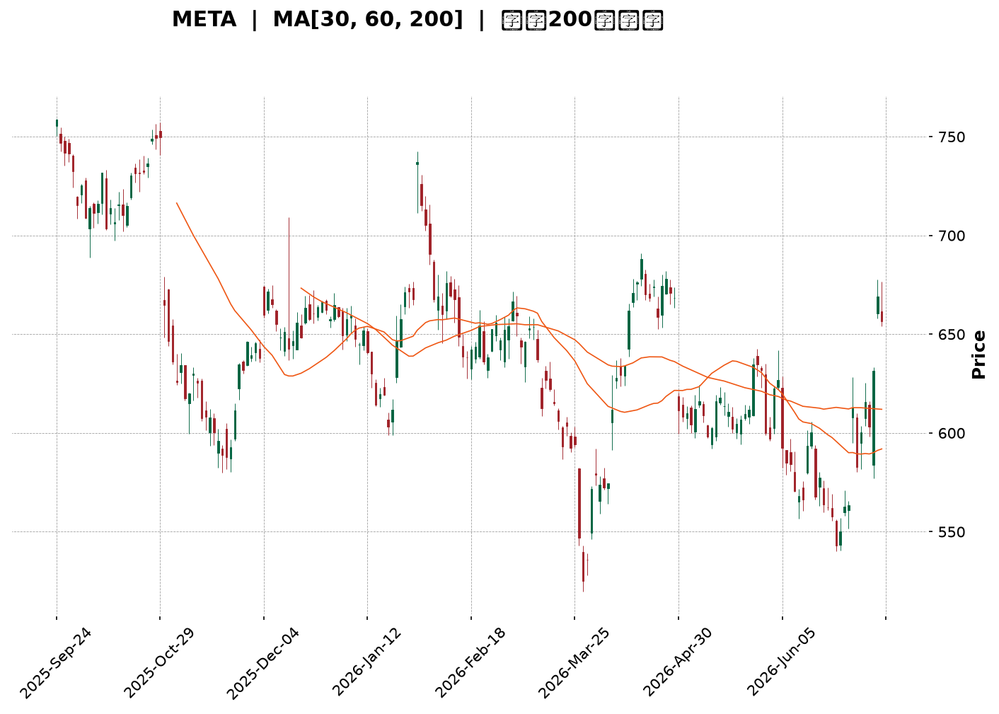
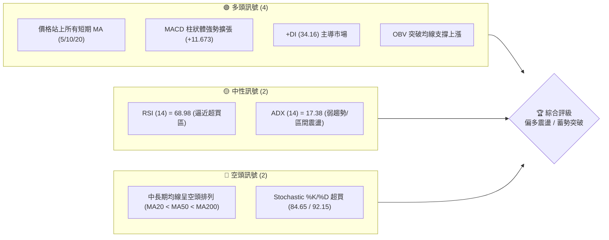
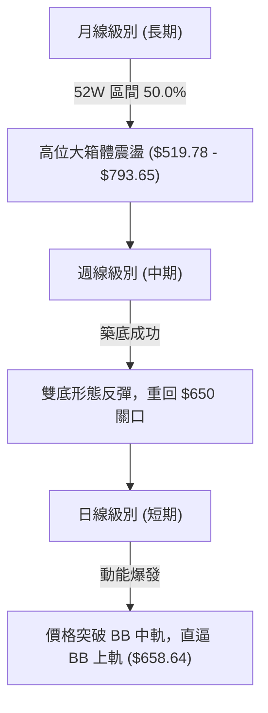
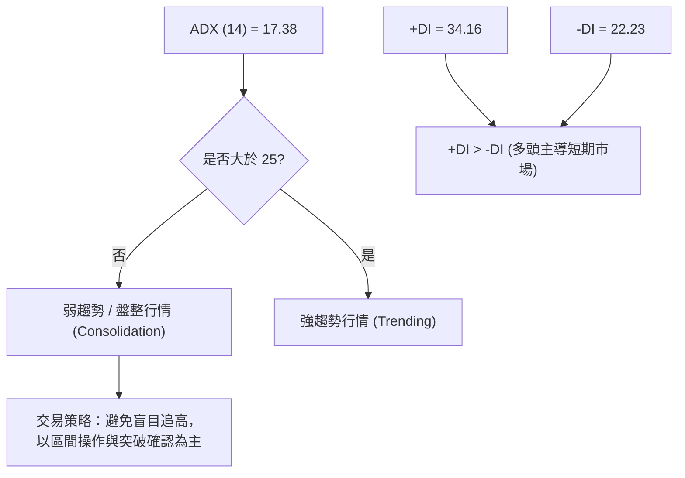
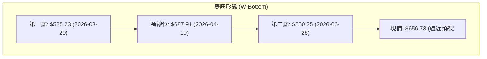
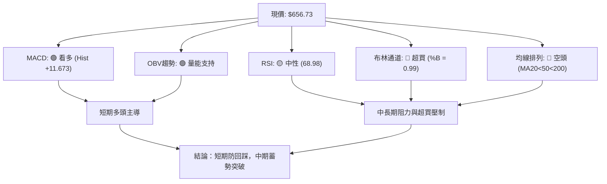
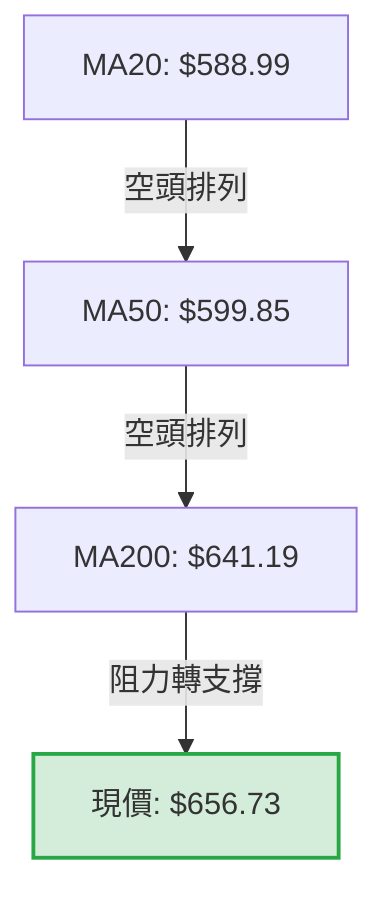
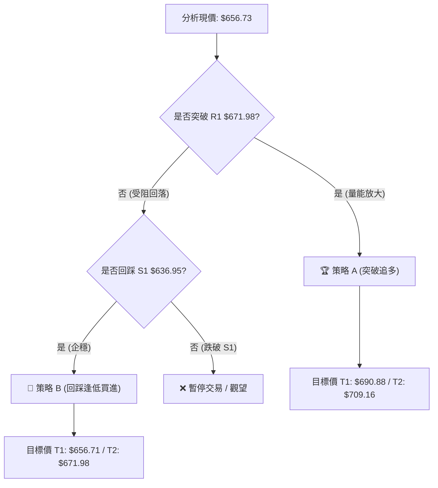
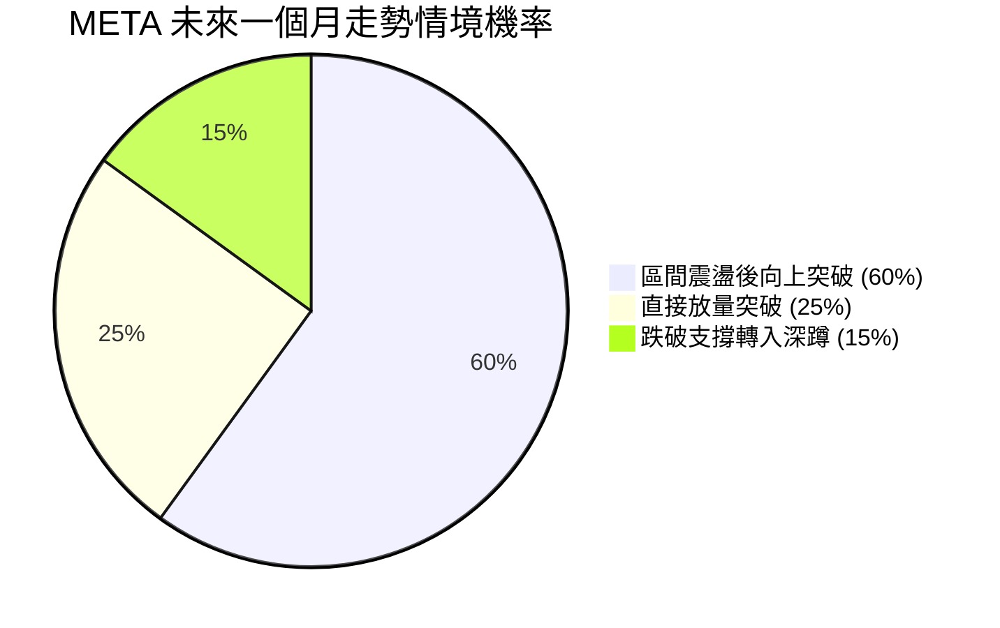
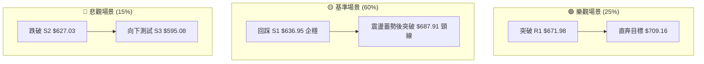

<details>
<summary>📊 靜態圖表 (點擊展開)</summary>

</details>

<html>
<head><meta charset="utf-8" /></head>
<body>
    <div style="height:500px; width:100%;">                        <script>window.PlotlyConfig = {MathJaxConfig: 'local'};</script>
        <script charset="utf-8" src="https://cdn.plot.ly/plotly-3.7.0.min.js" integrity="sha256-jvTGqxNp8AGWEcvNLVuKr+8j5dGe9Yw51LQkmDH+IYA=" crossorigin="anonymous"></script>                <div id="candlestick-chart" class="plotly-graph-div" style="height:100%; width:100%;"></div>            <script>                window.PLOTLYENV=window.PLOTLYENV || {};                                if (document.getElementById("candlestick-chart")) {                    Plotly.newPlot(                        "candlestick-chart",                        [{"close":{"dtype":"f8","bdata":"AAAAgH61h0AAAAAAvVeHQAAAAMCQLodAAAAAwMUrh0AAAADAzOOGQAAAAGDVW4ZAAAAA4E+phkAAAADguyWGQAAAAKBtToZAAAAAgNc5hkAAAADg0l+GQAAAAIDb3IZAAAAAYMP7hUAAAABAv06GQAAAAGB+FoZAAAAAYIJdhkAAAABgyDGGQAAAAGB7WIZAAAAAQCrShkAAAACA8dqGQAAAAGAP3IZAAAAAgMTghkAAAACgjgOHQAAAAID6ZodAAAAA4Oxrh0AAAADAwm2HQAAAAMDtxYRAAAAAYFg1hEAAAABAcuCDQAAAAKCKjYNAAAAAAGfSg0AAAADgrEqDQAAAAEDHYINAAAAAIPiwg0AAAABgoIuDQAAAAABx+4JAAAAAoHYCg0AAAABACP+CQAAAACCWw4JAAAAA4B2hgkAAAABAT2aCQAAAAED5XIJAAAAAAKuFgkAAAACArRuDQAAAAGCO1INAAAAAALu\u002fg0AAAABAJzKEQAAAAOCo+YNAAAAA4F4rhEAAAADAhu+DQAAAAACDnoRAAAAAgGL9hEAAAADgj8iEQAAAAOALeoRAAAAAYIxDhEAAAACAIliEQAAAAGB4FIRAAAAAQNsyhEAAAADA1n+EQAAAAIC\u002fQoRAAAAAoCK6hEAAAACgxoyEQAAAAKCTooRAAAAAQAy+hEAAAAAg5NKEQAAAAADfsIRAAAAAICOMhEAAAAAgHcaEQAAAAEBRl4RAAAAA4ANKhEAAAACA74yEQAAAAMCMm4RAAAAAoEc8hEAAAADgRieEQAAAAEAtX4RAAAAAgJ0GhEAAAAAAu6+DQAAAAGBkM4NAAAAAgI5dg0AAAAAgKlmDQAAAAMBa2IJAAAAA4PIeg0AAAACA0DOEQAAAAECyjIRAAAAAYE35hEAAAABgLP6EQAAAAGBQ3IRAAAAAgPYHh0AAAAAgy1mGQAAAAIA3CYZAAAAAIL+ThUAAAADgY96EQAAAAAAi6IRAAAAAAEKihEAAAADgHCCFQAAAAKA07IRAAAAAoP7bhEAAAABAOUWEQAAAAAAM9YNAAAAAgDbxg0AAAADgmBCEQAAAACAOHYRAAAAAoPBzhEAAAAAg7OCDQAAAAABL8YNAAAAAYDVkhEAAAACguH6EQAAAAAA1OIRAAAAAgCtjhEAAAAAAT2+EQAAAAABU1IRAAAAAgCabhEAAAACgsR2EQAAAAADmMYRAAAAAID5nhEAAAAAgjW2EQAAAAGBZ6INAAAAAAPAkg0AAAADA85aDQAAAAOCqcINAAAAAIOE4g0AAAAAgG\u002fGCQAAAAODhiIJAAAAAYAHcgkAAAADA94KCQAAAAKC2koJAAAAAgEMYgUAAAACA3WmAQAAAACARv4BAAAAAQM3cgUAAAACgjBWCQAAAAMBs74FAAAAAYOrjgUAAAADgI\u002fSBQAAAAMDSHoNAAAAAIHeeg0AAAADANqqDQAAAAECKz4NAAAAAIAOvhEAAAABgqveEQAAAACDyIYVAAAAAoEx\u002fhUAAAABgT\u002fKEQAAAAADE4YRAAAAAAMMQhUAAAABAUZSEQAAAAGA9E4VAAAAA4O4vhUAAAABAv\u002fWEQAAAAOAA5IRAAAAAQL8ag0AAAACgfQGDQAAAACDCDoNAAAAA4DLjgkAAAAAAgCKDQAAAACDpQYNAAAAAIIYIg0AAAACgcbKCQAAAAICI04JAAAAA4HhAg0AAAADg206DQAAAAEBKLYNAAAAAACcVg0AAAACAatCCQAAAAID\u002f44JAAAAAYIr2gkAAAABAjw2DQAAAACAvHoNAAAAA4F\u002fVg0AAAAAgndWDQAAAAABlv4NAAAAAwE+\u002fgkAAAADgnKiCQAAAAKA5c4NAAAAAQOmXg0AAAACAm4OCQAAAAKDIRoJAAAAAwGNAgkAAAABAnNOBQAAAAKA6v4FAAAAAwKOzgUAAAAAA14uCQAAAACCuwYJAAAAA4KO8gUAAAACAwgmCQAAAAMDMnoFAAAAAoJmRgUAAAAAgXG2BQAAAAMD19oBAAAAAAAAygUAAAADAzJSBQAAAAOBRmoFAAAAAoEcng0AAAABAMzeCQAAAAOBRwoJAAAAA4KM8g0AAAADA9diCQAAAAADXu4NAAAAAIK7phEAAAAAA14WEQA=="},"high":{"dtype":"f8","bdata":"7iP3uxW5h0CLNTqedJaHQEtw\u002ferVb4dAzpi3yqhmh0BzElRdVyiHQOo6QsrRf4ZAFbS+rA6vhkCc8X1o1MiGQBpzu8QpWIZAh02O1BZlhkCbZ2siRG6GQAAAAIDb3IZAr368x+bqhkBVGEg5lHCGQGQon9eMTYZAgCbqgy2QhkBdjDQ03ZyGQJjTvYRoZYZA4nXTn+7ehkB5lji3rASHQJKikk1uFYdAZ+MRct8jh0CGGN1bTBqHQI3o9+5QjodANS7WBXajh0BlRUl1hqmHQCP40GSMOYVAIbxhYR0JhUBJf3Qk9YyEQCpVKSSaAIRA1kjjAoMEhEB2L3odzdKDQOb00CQhZINAIppqadLKg0DPYhYzap+DQH8yGdrdmoNAV7Uc5mFAg0CwKqFUtCCDQFNXZlLTEINAabDIqMDQgkAuNkciSY6CQLbozCcr6YJAcH66MIykgkA0L+VbzTiDQEOaG9ct24NAbDyfw6Hlg0AkFAd48zKEQOuMiNsqHYRABM65yIMxhEAsZ4mbVTmEQEPPL9jEEoVAVfK7wIQHhUDKr+D5oheFQBvQaswMtoRAxEsXW39mhEBYq684pGyEQC83taQ+KYZAe0TYurJehEB1HAi44aqEQJ\u002fjj7lroIRAttgbmO3qhEARrnQGce6EQG7bP3ILA4VAOAtrQoPGhEAohOET7NeEQLSv7BsS3oRA7e+uT5iYhEDBFLIiL\u002fiEQCo1UfiGvoRA9fpoBai5hEATbiKI2rqEQHfWtiGuwoRA0TlQm8+PhECEJB71lC+EQPATfBtFboRA4H6uvXFmhEAvd\u002fTaAgmEQCQkGNmlmoNALx3r9Xd4g0BsW6jMrZ+DQLDl07N9EoNAfsPkYlpJg0C0zZlvJpuEQI2AyQ9tyoRATg0A+p4QhUAaN8U16xyFQPoEyFzJI4VAsrQb4GY1h0B3BCAb7taGQOnnBvMfgIZA2KpWPMldhkCWDhjm03yFQEJE4bNKQoVAo6\u002fH+Vj2hEDTmJsKv1CFQL+A5SmBO4VAo5gE63swhUBJ7JHeXhaFQLBoABspUoRAYmHVTaULhEAjhT\u002fizx6EQPWQGvZMMIRA96LxtFmxhECBdagsO4SEQMoSPUa\u002f\u002f4NAvHWgzrllhEAI\u002fDCTlZ6EQDHywedEQoRAB6TRex6WhEDYgyqP7o6EQAvO3Z6T\u002fIRABpQuzwvshEDkZEwQgkKEQOc68u\u002fFNIRASiDXZ\u002f6YhECCofcWko+EQPL67uGwYoRAjYOSnmWgg0BlphNITNGDQAvaDUmv34NAxkdriJZwg0AkMZ2NdSODQDpp2Nc024JAqLqTkJwAg0AN3HVNjMOCQGl6m1nj2IJAAzKXYK4zgkCY4m3XxfiAQIVFJD1n2IBAN2OlKkXpgUCcOuC9AoCCQNnUu\u002fa2D4JA33kduQAygkACk54olPWBQBTmrgHvqoNALqd\u002fGUfng0BNf37W6O+DQEFp2ttL04NAr9mx+STNhEClYrhg+S6FQEEdTOeeJ4VAcbIhngmXhUC3NV9a+lWFQJBg7EqXHIVAEMIvzwMuhUDYWTsiheeEQMuy7U1RQIVA6N9txPFOhUAI+VqHaiyFQPKBlGUBDYVADFADbDNig0ATxFmqdFKDQBz\u002fPbFzK4NA7HxdsT8ug0BP2bX3AVuDQKD6isE1g4NA6PKbVZdBg0A5tv+GzOKCQAGH5hOH2YJAeqN6rJtag0CRPw8zOHmDQB6Pa6j\u002fZINAh9CN8Sg4g0ArP5Jo5CqDQJiWxAx\u002f+4JAxhQ3qkgIg0BQSCv\u002f7DGDQHho8zU1L4NAG3IpO0Xvg0BDff6gPBOEQMpx5blMz4NAm50GWErZg0CU3TmKhwKDQCF+\u002faeTfINALuxWAHEOhEAgJfYyiqSDQKYSBVede4JALe5S5ZyogkCF994NLnaCQBwdRAgf3YFA4Fze4kr8gUAAAAAAKcqCQAAAAOB67oJAAAAA4HqOgkAAAACAwiGCQAAAAOB6\u002foFAAAAAoJnhgUAAAADgUciBQAAAAGC4YoFAAAAAwMxmgUAAAABAM9eBQAAAAOBRrIFAAAAAgD2ig0AAAAAAABCDQAAAAOCj3IJAAAAAwPWKg0AAAAAAAECDQAAAAAApyoNAAAAAQOEuhUAAAADA9SSFQA=="},"hovertemplate":"\u003cb\u003e%{x|%Y-%m-%d}\u003c\u002fb\u003e\u003cbr\u003e\u958b: $%{open:.2f}\u003cbr\u003e\u9ad8: $%{high:.2f}\u003cbr\u003e\u4f4e: $%{low:.2f}\u003cbr\u003e\u6536: $%{close:.2f}\u003cextra\u003e\u003c\u002fextra\u003e","low":{"dtype":"f8","bdata":"QYcMkZ90h0DpDaTp8jSHQNiONIB\u002f+4ZAnTNGVNwJh0ALWB\u002fNU6OGQMoFwY7cIoZACPO1lTdihkD5wdOksyKGQJYgdRzAhYVAf1EvkVr\u002fhUAP+r+oyg+GQOgZ4xC8NIZA66JlsnX1hUBcJjoybw6GQKPHyYMgzIVAdEVqNlsdhkBJzMfCbvCFQBnoamBOAoZAkjdRc35yhkBzODuD4LaGQDo6wRQ3kYZAg4sSCJbZhkCWC8TtBsqGQJz\u002fu42OUIdAcGmhM7A8h0C0pfbJqySHQJZcyfjdQ4RAVy3GxCkfhECTXt3gPNSDQBEkqLUWg4NA980tPlGHg0DtT3S+LEODQE+U9LUfvYJAV9PcZA1Eg0DgrtUaRE6DQG\u002fsdBaM8YJAPOmpenzLgkBw6VKCP42CQBQhIv7XjoJAH5ixJSAygkCzDmgP8B2CQFCla5CxLoJA+oyrEs4igkBpoHpLo6CCQIdBqnSRRYNAvFXuhO6vg0C0P7XEz86DQHgC5SXY4INATMNQeVHjg0CTCBZEK9+DQNIY7byzkoRAAhAZuV+lhEDIQ9sQwrqEQCKgZ1spXYRAW0PuINkNhEBpriAGGvmDQC0aiXug54NAp2aIgIDsg0D9B37\u002fbxCEQPopDThaQIRAjoXxQlR6hEAK2dRmEIiEQKMo4I\u002fYe4RAac+VhZ+IhECpdUjiKqiEQOFYHq8joYRAc3czbsxphEDJkg5zWYWEQIPJ014gkoRAhrqRctUShEDWAEjixTSEQLcySwzqVYRA3l0UhksdhECABAo1tNSDQKpUEFykDYRAq+7MsrQAhECUBord6HeDQMKdgE3NLYNAyHd5FRcpg0DOZ7CezleDQN9VKgZ0t4JA4e8GmBe4gkAvY6x\u002feYuDQOXU5I5rGoRAYMBgXuaghEB6yNvNz7uEQPTNOLdPx4RA6Tk28D86hkCvtaIcjkKGQL5p\u002fmkj8oVAngGyaoBphUCVMVIULNKEQA3oLNCwYoRAYhnibcoqhEAwY8Ae24yEQA97L2TH5IRAVZngg3B\u002fhEBPwOhkDCGEQJ9SZVaFy4NAGCBOQXGdg0B4WpiUQJiDQKkQsISw3INAiA1kDiTtg0CdpfOu8NaDQMnwdULhnoNAKRRGHvkHhEAwT\u002fXNxjKEQCmQMc\u002fe54NA5XrXIfbKg0DlyeS4nu2DQMhahc\u002f9g4RAmvkuajdJhEDDLaiI0deDQN892edPjYNATZc8PcE+hEBQfDrUpDmEQHKn66og3oNA6GLPa7cDg0D0qc8fL3SDQMkDBLL+aINA0Ixux1Mwg0DTdHBrns2CQD4MuGemVYJADGKTk6SzgkDpDhREn3OCQH6oV\u002fPNhoJASvoxUsb2gECpNcLaOT6AQNyk6p1ngIBAxGbeFxwSgUCJ2z1CT+qBQBpNdj10eYFA67EsT8PbgUBqz3KD5aGBQAmY04tBeoJAbBSemGJzg0DoZ8HcA36DQGbrmTWTfoNALGWEODn2g0ArK+j01ryEQOw9l6sN2YRAvvAH8wkUhUBNjahEDduEQHfJEV2y1YRA22697AnphEBDR2jxj2OEQDbYRW\u002fgaYRAWaDUQMDxhEDZRxX0G8iEQPilzBGQuYRA2bzHNY67gkBy6prhY+yCQLthfQaJ0YJA5dA5uW6+gkBc1UmHXqyCQJ4OkVPGJ4NAjQYyhf3rgkAg2qO6NayCQK242\u002fhogIJAb1UAH9yggkAmMSHBcTODQLPfY3T3BYNAl9LjQgzZgkAhuAyI87+CQKAuiD8NqoJAdDet1hKSgkAF8N2mGvOCQFXBz3nq5YJAfYTMK30Dg0B4KR530aWDQEFJB58udoNAyilUiMy3gkDW7jgNBaGCQIReyLC2vYJACmJeP9Rug0BEwjRC9jKCQNtYZhN4FYJAwsQIqsYjgkDve3m4ktCBQOBYTij0Y4FAZnTEhwuDgUAAAABgZhqCQAAAAAAAgIJAAAAAIIWxgUAAAADAzJiBQAAAAOB6foFAAAAAACmIgUAAAABgZlyBQAAAAKBw4YBAAAAAQDPjgEAAAAAAAHCBQAAAAKBwO4FAAAAAwMyYgkAAAAAgXCOCQAAAAIAULoJAAAAAoEfdgkAAAACAFLCCQAAAAGCPCIJAAAAAgBSQhEAAAACgmXGEQA=="},"name":"\u50f9\u683c","open":{"dtype":"f8","bdata":"cJ6wqUech0CnzXvh9nuHQIv51ItvYIdAAKCHvDhWh0Cg5YOwmCKHQMIK23PyfIZAv+k7H6WFhkAhZsLv5b2GQHERX7\u002fi+oVAUCdved1ehkBMbGFyyzyGQMtY\u002fGlVY4ZAQSrvAzHIhkDkHZ1qSDmGQHJRPz+ND4ZAwbNjeplZhkAvZvlCgl2GQJvGv2b3CYZAdCaglY16hkDnQf\u002fj4vCGQIwkvWRp34ZA9e\u002fzZ1rmhkBE9EGXB\u002feGQFpsfepHXodAWGaBrWt1h0C20QpDVoaHQHax\u002fkJQ24RADdcwJhUGhUAhHFX1YnKEQI2KzkxJk4NAxzmgllu1g0AmxYSpmtGDQDmKVFsgN4NA66s3j5+rg0DaicWc95KDQMQguisBlINA7fEYW9Ybg0BYWKS\u002f1MGCQDyfpyau+4JAQ1l+2oVwgkBS5PlPcIGCQG87KMN5z4JAkbkdjMlXgkA\u002fqBrBVamCQKnQLMwMc4NAbSLaMkngg0C9QNqPcNODQPHrV4Mg74NA1yLTyWMFhEBhlCkS6BWEQOKDKKD4EYVAaNF3aziyhEAux2xh1NyEQJltAZJisIRAq1PLtBxChECe7aNL+AyEQE1tcyjqQIRA\u002fAS3+WYkhEDwyG1H1RKEQNBPEXiKc4RAHDPSjuF+hEAwDDna3cmEQKdp8FPGo4RAsLIrVf+WhEDeBDWOzaqEQGhH0pr21oRAdIHM+rSGhEBBdpAZI4yEQMsctOGHvIRAJQgUU2ashEB8AO1+zk6EQN8UMDQqk4RA\u002fVH+58dzhEDwtQjo1iWEQCqYBEpTIoRAl7bn\u002ffFahEAvd\u002fTaAgmEQGOBi1UTi4NA2MHblQdLg0CjqR5rjHiDQKrg5Ilh9oJAs2Cp7kbtgkA5RLCp1aGDQMfVJ8T5HIRAUsaHvZC\u002fhEDltpVXHAuFQHe4cFVkCoVAMeqGde8Ah0ClBNYCo7GGQKnXAMKeSoZArpHBGuIQhkDPBQwJC3SFQBMxp+0vs4RAkNjVrXDChEA8nCEz\u002fq+EQK1LPcklI4VA8CTZImYGhUCh19hbN+aEQGUJTFCcH4RABy7t2+Pyg0B05Q0aX8WDQEkaiaV264NAawThXGj0g0Dh4909BluEQDTzyC6fv4NALdMuchYLhEDxh60OIkuEQMYvhj9vEoRADxSSDjTgg0AvutzCFTmEQB4xwcBOhoRA92FkygKmhEDfT\u002fCJ+DWEQKDIrrsyzYNAGQEifCtjhEBJplW9wGyEQDOgUTTCPIRAvhb0fzt2g0B1Wh5\u002fUbuDQLdMh6REm4NA86CWnyc+g0AACz5qqhyDQB\u002fLlQjF14JADCUpGNXpgkDvgtmnXLSCQNLh9RJ8sYJAgLMx2JovgkAVSaV6zNyAQAAAACARv4BAKN97AcQrgUB0jhYrvhyCQB4ZoncgrIFA0MftpD0JgkCsmKdfmd+BQFDLtsyC64JALZlekR2Tg0BKjeNBD8+DQHqs0klWp4NAW+Fkq\u002f4UhEA6JFovD9OEQPTsOYvpGoVAMMJ03sUvhUDXqf8u1UWFQEEAZIcH84RAvoHCbuINhUDkwBn\u002frriEQMoWYyWrnYRA77ErkwfzhEB1lSLg7AyFQCgk9SVT4oRA1C2\u002f8vhVg0BmO2d89zCDQI90CE8E+4JAw\u002fRAyu8lg0Bw9iOP8sOCQFCzsLY0MYNAdSnU7wo1g0B2hwnsFOCCQOy8G2MnkoJAuWd+QTSygkAwB6vbbzuDQNKjgDRfK4NAG6qLG14Eg0DkEr1o2QKDQELMcEehwYJALr30Ho67gkBF2mSDifqCQLUh6wqcAoNA7uGbqa8Gg0ChHCZEQ\u002feDQOC+YJ9Ox4NAq75dvYeug0D0CWd8c9WCQCtbfIOI04JATSxhZb14g0BztCzdD3eDQKYSBVede4JAG50SOJ9zgkC3EdXCiSGCQLcwRM5yqoFA3JSZDVvjgUAAAABAMx+CQAAAAEAzjYJAAAAAAACAgkAAAABgj+aBQAAAAAAp4IFAAAAAAACSgUAAAADAHo+BQAAAAGBmXIFAAAAAYLj6gEAAAAAAAICBQAAAACCFh4FAAAAAoEf\u002fgkAAAABAM\u002f+CQAAAAGC4loJAAAAAYLj8gkAAAADAHjODQAAAAIDrP4JAAAAAYLiihEAAAACAFKyEQA=="},"x":["2025-09-24T00:00:00-04:00","2025-09-25T00:00:00-04:00","2025-09-26T00:00:00-04:00","2025-09-29T00:00:00-04:00","2025-09-30T00:00:00-04:00","2025-10-01T00:00:00-04:00","2025-10-02T00:00:00-04:00","2025-10-03T00:00:00-04:00","2025-10-06T00:00:00-04:00","2025-10-07T00:00:00-04:00","2025-10-08T00:00:00-04:00","2025-10-09T00:00:00-04:00","2025-10-10T00:00:00-04:00","2025-10-13T00:00:00-04:00","2025-10-14T00:00:00-04:00","2025-10-15T00:00:00-04:00","2025-10-16T00:00:00-04:00","2025-10-17T00:00:00-04:00","2025-10-20T00:00:00-04:00","2025-10-21T00:00:00-04:00","2025-10-22T00:00:00-04:00","2025-10-23T00:00:00-04:00","2025-10-24T00:00:00-04:00","2025-10-27T00:00:00-04:00","2025-10-28T00:00:00-04:00","2025-10-29T00:00:00-04:00","2025-10-30T00:00:00-04:00","2025-10-31T00:00:00-04:00","2025-11-03T00:00:00-05:00","2025-11-04T00:00:00-05:00","2025-11-05T00:00:00-05:00","2025-11-06T00:00:00-05:00","2025-11-07T00:00:00-05:00","2025-11-10T00:00:00-05:00","2025-11-11T00:00:00-05:00","2025-11-12T00:00:00-05:00","2025-11-13T00:00:00-05:00","2025-11-14T00:00:00-05:00","2025-11-17T00:00:00-05:00","2025-11-18T00:00:00-05:00","2025-11-19T00:00:00-05:00","2025-11-20T00:00:00-05:00","2025-11-21T00:00:00-05:00","2025-11-24T00:00:00-05:00","2025-11-25T00:00:00-05:00","2025-11-26T00:00:00-05:00","2025-11-28T00:00:00-05:00","2025-12-01T00:00:00-05:00","2025-12-02T00:00:00-05:00","2025-12-03T00:00:00-05:00","2025-12-04T00:00:00-05:00","2025-12-05T00:00:00-05:00","2025-12-08T00:00:00-05:00","2025-12-09T00:00:00-05:00","2025-12-10T00:00:00-05:00","2025-12-11T00:00:00-05:00","2025-12-12T00:00:00-05:00","2025-12-15T00:00:00-05:00","2025-12-16T00:00:00-05:00","2025-12-17T00:00:00-05:00","2025-12-18T00:00:00-05:00","2025-12-19T00:00:00-05:00","2025-12-22T00:00:00-05:00","2025-12-23T00:00:00-05:00","2025-12-24T00:00:00-05:00","2025-12-26T00:00:00-05:00","2025-12-29T00:00:00-05:00","2025-12-30T00:00:00-05:00","2025-12-31T00:00:00-05:00","2026-01-02T00:00:00-05:00","2026-01-05T00:00:00-05:00","2026-01-06T00:00:00-05:00","2026-01-07T00:00:00-05:00","2026-01-08T00:00:00-05:00","2026-01-09T00:00:00-05:00","2026-01-12T00:00:00-05:00","2026-01-13T00:00:00-05:00","2026-01-14T00:00:00-05:00","2026-01-15T00:00:00-05:00","2026-01-16T00:00:00-05:00","2026-01-20T00:00:00-05:00","2026-01-21T00:00:00-05:00","2026-01-22T00:00:00-05:00","2026-01-23T00:00:00-05:00","2026-01-26T00:00:00-05:00","2026-01-27T00:00:00-05:00","2026-01-28T00:00:00-05:00","2026-01-29T00:00:00-05:00","2026-01-30T00:00:00-05:00","2026-02-02T00:00:00-05:00","2026-02-03T00:00:00-05:00","2026-02-04T00:00:00-05:00","2026-02-05T00:00:00-05:00","2026-02-06T00:00:00-05:00","2026-02-09T00:00:00-05:00","2026-02-10T00:00:00-05:00","2026-02-11T00:00:00-05:00","2026-02-12T00:00:00-05:00","2026-02-13T00:00:00-05:00","2026-02-17T00:00:00-05:00","2026-02-18T00:00:00-05:00","2026-02-19T00:00:00-05:00","2026-02-20T00:00:00-05:00","2026-02-23T00:00:00-05:00","2026-02-24T00:00:00-05:00","2026-02-25T00:00:00-05:00","2026-02-26T00:00:00-05:00","2026-02-27T00:00:00-05:00","2026-03-02T00:00:00-05:00","2026-03-03T00:00:00-05:00","2026-03-04T00:00:00-05:00","2026-03-05T00:00:00-05:00","2026-03-06T00:00:00-05:00","2026-03-09T00:00:00-04:00","2026-03-10T00:00:00-04:00","2026-03-11T00:00:00-04:00","2026-03-12T00:00:00-04:00","2026-03-13T00:00:00-04:00","2026-03-16T00:00:00-04:00","2026-03-17T00:00:00-04:00","2026-03-18T00:00:00-04:00","2026-03-19T00:00:00-04:00","2026-03-20T00:00:00-04:00","2026-03-23T00:00:00-04:00","2026-03-24T00:00:00-04:00","2026-03-25T00:00:00-04:00","2026-03-26T00:00:00-04:00","2026-03-27T00:00:00-04:00","2026-03-30T00:00:00-04:00","2026-03-31T00:00:00-04:00","2026-04-01T00:00:00-04:00","2026-04-02T00:00:00-04:00","2026-04-06T00:00:00-04:00","2026-04-07T00:00:00-04:00","2026-04-08T00:00:00-04:00","2026-04-09T00:00:00-04:00","2026-04-10T00:00:00-04:00","2026-04-13T00:00:00-04:00","2026-04-14T00:00:00-04:00","2026-04-15T00:00:00-04:00","2026-04-16T00:00:00-04:00","2026-04-17T00:00:00-04:00","2026-04-20T00:00:00-04:00","2026-04-21T00:00:00-04:00","2026-04-22T00:00:00-04:00","2026-04-23T00:00:00-04:00","2026-04-24T00:00:00-04:00","2026-04-27T00:00:00-04:00","2026-04-28T00:00:00-04:00","2026-04-29T00:00:00-04:00","2026-04-30T00:00:00-04:00","2026-05-01T00:00:00-04:00","2026-05-04T00:00:00-04:00","2026-05-05T00:00:00-04:00","2026-05-06T00:00:00-04:00","2026-05-07T00:00:00-04:00","2026-05-08T00:00:00-04:00","2026-05-11T00:00:00-04:00","2026-05-12T00:00:00-04:00","2026-05-13T00:00:00-04:00","2026-05-14T00:00:00-04:00","2026-05-15T00:00:00-04:00","2026-05-18T00:00:00-04:00","2026-05-19T00:00:00-04:00","2026-05-20T00:00:00-04:00","2026-05-21T00:00:00-04:00","2026-05-22T00:00:00-04:00","2026-05-26T00:00:00-04:00","2026-05-27T00:00:00-04:00","2026-05-28T00:00:00-04:00","2026-05-29T00:00:00-04:00","2026-06-01T00:00:00-04:00","2026-06-02T00:00:00-04:00","2026-06-03T00:00:00-04:00","2026-06-04T00:00:00-04:00","2026-06-05T00:00:00-04:00","2026-06-08T00:00:00-04:00","2026-06-09T00:00:00-04:00","2026-06-10T00:00:00-04:00","2026-06-11T00:00:00-04:00","2026-06-12T00:00:00-04:00","2026-06-15T00:00:00-04:00","2026-06-16T00:00:00-04:00","2026-06-17T00:00:00-04:00","2026-06-18T00:00:00-04:00","2026-06-22T00:00:00-04:00","2026-06-23T00:00:00-04:00","2026-06-24T00:00:00-04:00","2026-06-25T00:00:00-04:00","2026-06-26T00:00:00-04:00","2026-06-29T00:00:00-04:00","2026-06-30T00:00:00-04:00","2026-07-01T00:00:00-04:00","2026-07-02T00:00:00-04:00","2026-07-06T00:00:00-04:00","2026-07-07T00:00:00-04:00","2026-07-08T00:00:00-04:00","2026-07-09T00:00:00-04:00","2026-07-10T00:00:00-04:00","2026-07-13T00:00:00-04:00"],"type":"candlestick"},{"hovertemplate":"MA30: $%{y:.2f}\u003cextra\u003e\u003c\u002fextra\u003e","line":{"color":"#2196F3","dash":"dash","width":2},"mode":"lines","name":"MA30","x":["2025-09-24T00:00:00-04:00","2025-09-25T00:00:00-04:00","2025-09-26T00:00:00-04:00","2025-09-29T00:00:00-04:00","2025-09-30T00:00:00-04:00","2025-10-01T00:00:00-04:00","2025-10-02T00:00:00-04:00","2025-10-03T00:00:00-04:00","2025-10-06T00:00:00-04:00","2025-10-07T00:00:00-04:00","2025-10-08T00:00:00-04:00","2025-10-09T00:00:00-04:00","2025-10-10T00:00:00-04:00","2025-10-13T00:00:00-04:00","2025-10-14T00:00:00-04:00","2025-10-15T00:00:00-04:00","2025-10-16T00:00:00-04:00","2025-10-17T00:00:00-04:00","2025-10-20T00:00:00-04:00","2025-10-21T00:00:00-04:00","2025-10-22T00:00:00-04:00","2025-10-23T00:00:00-04:00","2025-10-24T00:00:00-04:00","2025-10-27T00:00:00-04:00","2025-10-28T00:00:00-04:00","2025-10-29T00:00:00-04:00","2025-10-30T00:00:00-04:00","2025-10-31T00:00:00-04:00","2025-11-03T00:00:00-05:00","2025-11-04T00:00:00-05:00","2025-11-05T00:00:00-05:00","2025-11-06T00:00:00-05:00","2025-11-07T00:00:00-05:00","2025-11-10T00:00:00-05:00","2025-11-11T00:00:00-05:00","2025-11-12T00:00:00-05:00","2025-11-13T00:00:00-05:00","2025-11-14T00:00:00-05:00","2025-11-17T00:00:00-05:00","2025-11-18T00:00:00-05:00","2025-11-19T00:00:00-05:00","2025-11-20T00:00:00-05:00","2025-11-21T00:00:00-05:00","2025-11-24T00:00:00-05:00","2025-11-25T00:00:00-05:00","2025-11-26T00:00:00-05:00","2025-11-28T00:00:00-05:00","2025-12-01T00:00:00-05:00","2025-12-02T00:00:00-05:00","2025-12-03T00:00:00-05:00","2025-12-04T00:00:00-05:00","2025-12-05T00:00:00-05:00","2025-12-08T00:00:00-05:00","2025-12-09T00:00:00-05:00","2025-12-10T00:00:00-05:00","2025-12-11T00:00:00-05:00","2025-12-12T00:00:00-05:00","2025-12-15T00:00:00-05:00","2025-12-16T00:00:00-05:00","2025-12-17T00:00:00-05:00","2025-12-18T00:00:00-05:00","2025-12-19T00:00:00-05:00","2025-12-22T00:00:00-05:00","2025-12-23T00:00:00-05:00","2025-12-24T00:00:00-05:00","2025-12-26T00:00:00-05:00","2025-12-29T00:00:00-05:00","2025-12-30T00:00:00-05:00","2025-12-31T00:00:00-05:00","2026-01-02T00:00:00-05:00","2026-01-05T00:00:00-05:00","2026-01-06T00:00:00-05:00","2026-01-07T00:00:00-05:00","2026-01-08T00:00:00-05:00","2026-01-09T00:00:00-05:00","2026-01-12T00:00:00-05:00","2026-01-13T00:00:00-05:00","2026-01-14T00:00:00-05:00","2026-01-15T00:00:00-05:00","2026-01-16T00:00:00-05:00","2026-01-20T00:00:00-05:00","2026-01-21T00:00:00-05:00","2026-01-22T00:00:00-05:00","2026-01-23T00:00:00-05:00","2026-01-26T00:00:00-05:00","2026-01-27T00:00:00-05:00","2026-01-28T00:00:00-05:00","2026-01-29T00:00:00-05:00","2026-01-30T00:00:00-05:00","2026-02-02T00:00:00-05:00","2026-02-03T00:00:00-05:00","2026-02-04T00:00:00-05:00","2026-02-05T00:00:00-05:00","2026-02-06T00:00:00-05:00","2026-02-09T00:00:00-05:00","2026-02-10T00:00:00-05:00","2026-02-11T00:00:00-05:00","2026-02-12T00:00:00-05:00","2026-02-13T00:00:00-05:00","2026-02-17T00:00:00-05:00","2026-02-18T00:00:00-05:00","2026-02-19T00:00:00-05:00","2026-02-20T00:00:00-05:00","2026-02-23T00:00:00-05:00","2026-02-24T00:00:00-05:00","2026-02-25T00:00:00-05:00","2026-02-26T00:00:00-05:00","2026-02-27T00:00:00-05:00","2026-03-02T00:00:00-05:00","2026-03-03T00:00:00-05:00","2026-03-04T00:00:00-05:00","2026-03-05T00:00:00-05:00","2026-03-06T00:00:00-05:00","2026-03-09T00:00:00-04:00","2026-03-10T00:00:00-04:00","2026-03-11T00:00:00-04:00","2026-03-12T00:00:00-04:00","2026-03-13T00:00:00-04:00","2026-03-16T00:00:00-04:00","2026-03-17T00:00:00-04:00","2026-03-18T00:00:00-04:00","2026-03-19T00:00:00-04:00","2026-03-20T00:00:00-04:00","2026-03-23T00:00:00-04:00","2026-03-24T00:00:00-04:00","2026-03-25T00:00:00-04:00","2026-03-26T00:00:00-04:00","2026-03-27T00:00:00-04:00","2026-03-30T00:00:00-04:00","2026-03-31T00:00:00-04:00","2026-04-01T00:00:00-04:00","2026-04-02T00:00:00-04:00","2026-04-06T00:00:00-04:00","2026-04-07T00:00:00-04:00","2026-04-08T00:00:00-04:00","2026-04-09T00:00:00-04:00","2026-04-10T00:00:00-04:00","2026-04-13T00:00:00-04:00","2026-04-14T00:00:00-04:00","2026-04-15T00:00:00-04:00","2026-04-16T00:00:00-04:00","2026-04-17T00:00:00-04:00","2026-04-20T00:00:00-04:00","2026-04-21T00:00:00-04:00","2026-04-22T00:00:00-04:00","2026-04-23T00:00:00-04:00","2026-04-24T00:00:00-04:00","2026-04-27T00:00:00-04:00","2026-04-28T00:00:00-04:00","2026-04-29T00:00:00-04:00","2026-04-30T00:00:00-04:00","2026-05-01T00:00:00-04:00","2026-05-04T00:00:00-04:00","2026-05-05T00:00:00-04:00","2026-05-06T00:00:00-04:00","2026-05-07T00:00:00-04:00","2026-05-08T00:00:00-04:00","2026-05-11T00:00:00-04:00","2026-05-12T00:00:00-04:00","2026-05-13T00:00:00-04:00","2026-05-14T00:00:00-04:00","2026-05-15T00:00:00-04:00","2026-05-18T00:00:00-04:00","2026-05-19T00:00:00-04:00","2026-05-20T00:00:00-04:00","2026-05-21T00:00:00-04:00","2026-05-22T00:00:00-04:00","2026-05-26T00:00:00-04:00","2026-05-27T00:00:00-04:00","2026-05-28T00:00:00-04:00","2026-05-29T00:00:00-04:00","2026-06-01T00:00:00-04:00","2026-06-02T00:00:00-04:00","2026-06-03T00:00:00-04:00","2026-06-04T00:00:00-04:00","2026-06-05T00:00:00-04:00","2026-06-08T00:00:00-04:00","2026-06-09T00:00:00-04:00","2026-06-10T00:00:00-04:00","2026-06-11T00:00:00-04:00","2026-06-12T00:00:00-04:00","2026-06-15T00:00:00-04:00","2026-06-16T00:00:00-04:00","2026-06-17T00:00:00-04:00","2026-06-18T00:00:00-04:00","2026-06-22T00:00:00-04:00","2026-06-23T00:00:00-04:00","2026-06-24T00:00:00-04:00","2026-06-25T00:00:00-04:00","2026-06-26T00:00:00-04:00","2026-06-29T00:00:00-04:00","2026-06-30T00:00:00-04:00","2026-07-01T00:00:00-04:00","2026-07-02T00:00:00-04:00","2026-07-06T00:00:00-04:00","2026-07-07T00:00:00-04:00","2026-07-08T00:00:00-04:00","2026-07-09T00:00:00-04:00","2026-07-10T00:00:00-04:00","2026-07-13T00:00:00-04:00"],"y":{"dtype":"f8","bdata":"AAAAAAAA+H8AAAAAAAD4fwAAAAAAAPh\u002fAAAAAAAA+H8AAAAAAAD4fwAAAAAAAPh\u002fAAAAAAAA+H8AAAAAAAD4fwAAAAAAAPh\u002fAAAAAAAA+H8AAAAAAAD4fwAAAAAAAPh\u002fAAAAAAAA+H8AAAAAAAD4fwAAAAAAAPh\u002fAAAAAAAA+H8AAAAAAAD4fwAAAAAAAPh\u002fAAAAAAAA+H8AAAAAAAD4fwAAAAAAAPh\u002fAAAAAAAA+H8AAAAAAAD4fwAAAAAAAPh\u002fAAAAAAAA+H8AAAAAAAD4fwAAAAAAAPh\u002fAAAAAAAA+H8AAAAAAAD4f97d3e0LY4ZAq6qqeuBBhkAAAADgTh+GQJqZmTnZ\u002foVAREREtCfhhUARERGxncSFQLy7u4vNp4VAvLu7K6SIhUARERFRwG2FQO\u002fu7u6FT4VAREREFNUwhUCrqqpK6g6FQCIiIuKE6IRAmpmZifvKhEBVVVUlrq+EQJqZmWlqnIRAd3d39xaGhEAAAAAQCXWEQImIiNjOYIRAd3d3dy5KhEAiIiKCRDGEQKuqqjomHoRAzczMXAkOhEDv7u7eAPuDQLy7u\u002fsJ4oNAVVVV1RfHg0ARERGxxayDQBEREWHbpoNAREREJMamg0CrqqpKFqyDQGZmZpYgsoNAq6qqCtq5g0AiIiKilsSDQFVVVaVQz4NAiYiIyEjYg0ARERFxMeODQM3MzCzG8YNAZmZmhuX+g0AzMzPjEA6EQBERETGoHYRA3t3d\u002fdErhECrqqqqLD6EQHd3d7dTUYRAmpmZifJfhEDNzMwM3miEQCIiIvJ8bYRARERE1NlvhEAzMzPjgGuEQBEREQHlZIRAmpmZuQhehEAzMzOjBVmEQJqZmSniSYRAIiIigu85hEAiIiIy+jSEQHd3d1eZNYRA7+7uTqg7hEC8u7srMUGEQBEREYHaR4RAREREFAZghEDe3d190m+EQAAAAKD4foRAMzMzkzmGhEBEREQE8oiEQAAAAJBDi4RAvLu7a1aKhEARERFh6YyEQDMzM7PjjoRAZmZmJo2RhECamZlJQY2EQERERJTYh4RAzczMzOKEhEB3d3fHvYCEQLy7u1uGfIRAMzMzU2F+hEB3d3f3CHyEQKuqqkpfeIRARERE9H17hEBmZmZGZIKEQFVVVeUVi4RAREREVM6ThEAzMzPTE52EQImIiIgCroRAvLu76666hECJiIgo8rmEQJqZmVnrtoRAmpmZ+QyyhEDe3d3dOq2EQImIiAgZpYRAZmZmJu6DhEAAAABwXmyEQN7d3Z03VoRAZmZmJh9ChECrqqrKrTGEQLy7u+tvHYRAIiIioksOhECJiIiY\u002ffeDQM3MzNzw44NAZmZmBtHDg0ARERGR56KDQGZmZlaBh4NAiYiIGMJ1g0CamZlJ22SDQHd3d9dEUoNARERExGY8g0ARERGx+SuDQO\u002fu7q71JINAZmZmRl4eg0ARERHhSBeDQImIiLjLE4NAiYiI6FIWg0DNzMx83hqDQDMzM9N0HYNAIiIisg8lg0BVVVUFJiyDQBEREcECMoNAERERUak3g0Dv7u4e9DiDQHd3d6fqQoNAzczMjFlUg0AAAAAAC2CDQLy7u7trbINAq6qqmmprg0C8u7tr9muDQERERNRscINAZmZmNqpwg0De3d2N+3WDQCIiIpLSe4NAMzMzU12Mg0Crqqq62Z+DQBEREXGZsYNA7+7ufnS9g0AiIiIS5seDQFVVVYV+0oNAVVVVNavcg0BVVVXlAuSDQLy7u+sM4oNAZmZm9nPcg0De3d0tO9eDQN7d3b1R0YNAERERkRDKg0BVVVV1ZcCDQERERPSTtINAd3d3lxydg0BERESklomDQERERNRefYNAmpmZCc9wg0ARERFhL1+DQO\u002fu7p5NR4NAMzMzc0Aug0DNzMyMgxODQERERCSw+IJAIiIiwrfsgkDe3d3Ny+iCQCIiIhI65oJAERERgWjcgkCrqqraDNOCQBEREXEUxYJAd3d3F5W4gkCrqqoKv62CQImIiEjcnYJAiYiIuE+MgkC8u7t7k32CQN7d3c0kcIJA3t3dfb9wgkDNzMwMpGuCQJqZmamEaoJAiYiI2NpsgkDv7u7+GWuCQDMzM1NbcIJAIiIiIpF5gkDe3d3tcH+CQA=="},"type":"scatter"},{"hovertemplate":"MA60: $%{y:.2f}\u003cextra\u003e\u003c\u002fextra\u003e","line":{"color":"#9C27B0","dash":"dash","width":2},"mode":"lines","name":"MA60","x":["2025-09-24T00:00:00-04:00","2025-09-25T00:00:00-04:00","2025-09-26T00:00:00-04:00","2025-09-29T00:00:00-04:00","2025-09-30T00:00:00-04:00","2025-10-01T00:00:00-04:00","2025-10-02T00:00:00-04:00","2025-10-03T00:00:00-04:00","2025-10-06T00:00:00-04:00","2025-10-07T00:00:00-04:00","2025-10-08T00:00:00-04:00","2025-10-09T00:00:00-04:00","2025-10-10T00:00:00-04:00","2025-10-13T00:00:00-04:00","2025-10-14T00:00:00-04:00","2025-10-15T00:00:00-04:00","2025-10-16T00:00:00-04:00","2025-10-17T00:00:00-04:00","2025-10-20T00:00:00-04:00","2025-10-21T00:00:00-04:00","2025-10-22T00:00:00-04:00","2025-10-23T00:00:00-04:00","2025-10-24T00:00:00-04:00","2025-10-27T00:00:00-04:00","2025-10-28T00:00:00-04:00","2025-10-29T00:00:00-04:00","2025-10-30T00:00:00-04:00","2025-10-31T00:00:00-04:00","2025-11-03T00:00:00-05:00","2025-11-04T00:00:00-05:00","2025-11-05T00:00:00-05:00","2025-11-06T00:00:00-05:00","2025-11-07T00:00:00-05:00","2025-11-10T00:00:00-05:00","2025-11-11T00:00:00-05:00","2025-11-12T00:00:00-05:00","2025-11-13T00:00:00-05:00","2025-11-14T00:00:00-05:00","2025-11-17T00:00:00-05:00","2025-11-18T00:00:00-05:00","2025-11-19T00:00:00-05:00","2025-11-20T00:00:00-05:00","2025-11-21T00:00:00-05:00","2025-11-24T00:00:00-05:00","2025-11-25T00:00:00-05:00","2025-11-26T00:00:00-05:00","2025-11-28T00:00:00-05:00","2025-12-01T00:00:00-05:00","2025-12-02T00:00:00-05:00","2025-12-03T00:00:00-05:00","2025-12-04T00:00:00-05:00","2025-12-05T00:00:00-05:00","2025-12-08T00:00:00-05:00","2025-12-09T00:00:00-05:00","2025-12-10T00:00:00-05:00","2025-12-11T00:00:00-05:00","2025-12-12T00:00:00-05:00","2025-12-15T00:00:00-05:00","2025-12-16T00:00:00-05:00","2025-12-17T00:00:00-05:00","2025-12-18T00:00:00-05:00","2025-12-19T00:00:00-05:00","2025-12-22T00:00:00-05:00","2025-12-23T00:00:00-05:00","2025-12-24T00:00:00-05:00","2025-12-26T00:00:00-05:00","2025-12-29T00:00:00-05:00","2025-12-30T00:00:00-05:00","2025-12-31T00:00:00-05:00","2026-01-02T00:00:00-05:00","2026-01-05T00:00:00-05:00","2026-01-06T00:00:00-05:00","2026-01-07T00:00:00-05:00","2026-01-08T00:00:00-05:00","2026-01-09T00:00:00-05:00","2026-01-12T00:00:00-05:00","2026-01-13T00:00:00-05:00","2026-01-14T00:00:00-05:00","2026-01-15T00:00:00-05:00","2026-01-16T00:00:00-05:00","2026-01-20T00:00:00-05:00","2026-01-21T00:00:00-05:00","2026-01-22T00:00:00-05:00","2026-01-23T00:00:00-05:00","2026-01-26T00:00:00-05:00","2026-01-27T00:00:00-05:00","2026-01-28T00:00:00-05:00","2026-01-29T00:00:00-05:00","2026-01-30T00:00:00-05:00","2026-02-02T00:00:00-05:00","2026-02-03T00:00:00-05:00","2026-02-04T00:00:00-05:00","2026-02-05T00:00:00-05:00","2026-02-06T00:00:00-05:00","2026-02-09T00:00:00-05:00","2026-02-10T00:00:00-05:00","2026-02-11T00:00:00-05:00","2026-02-12T00:00:00-05:00","2026-02-13T00:00:00-05:00","2026-02-17T00:00:00-05:00","2026-02-18T00:00:00-05:00","2026-02-19T00:00:00-05:00","2026-02-20T00:00:00-05:00","2026-02-23T00:00:00-05:00","2026-02-24T00:00:00-05:00","2026-02-25T00:00:00-05:00","2026-02-26T00:00:00-05:00","2026-02-27T00:00:00-05:00","2026-03-02T00:00:00-05:00","2026-03-03T00:00:00-05:00","2026-03-04T00:00:00-05:00","2026-03-05T00:00:00-05:00","2026-03-06T00:00:00-05:00","2026-03-09T00:00:00-04:00","2026-03-10T00:00:00-04:00","2026-03-11T00:00:00-04:00","2026-03-12T00:00:00-04:00","2026-03-13T00:00:00-04:00","2026-03-16T00:00:00-04:00","2026-03-17T00:00:00-04:00","2026-03-18T00:00:00-04:00","2026-03-19T00:00:00-04:00","2026-03-20T00:00:00-04:00","2026-03-23T00:00:00-04:00","2026-03-24T00:00:00-04:00","2026-03-25T00:00:00-04:00","2026-03-26T00:00:00-04:00","2026-03-27T00:00:00-04:00","2026-03-30T00:00:00-04:00","2026-03-31T00:00:00-04:00","2026-04-01T00:00:00-04:00","2026-04-02T00:00:00-04:00","2026-04-06T00:00:00-04:00","2026-04-07T00:00:00-04:00","2026-04-08T00:00:00-04:00","2026-04-09T00:00:00-04:00","2026-04-10T00:00:00-04:00","2026-04-13T00:00:00-04:00","2026-04-14T00:00:00-04:00","2026-04-15T00:00:00-04:00","2026-04-16T00:00:00-04:00","2026-04-17T00:00:00-04:00","2026-04-20T00:00:00-04:00","2026-04-21T00:00:00-04:00","2026-04-22T00:00:00-04:00","2026-04-23T00:00:00-04:00","2026-04-24T00:00:00-04:00","2026-04-27T00:00:00-04:00","2026-04-28T00:00:00-04:00","2026-04-29T00:00:00-04:00","2026-04-30T00:00:00-04:00","2026-05-01T00:00:00-04:00","2026-05-04T00:00:00-04:00","2026-05-05T00:00:00-04:00","2026-05-06T00:00:00-04:00","2026-05-07T00:00:00-04:00","2026-05-08T00:00:00-04:00","2026-05-11T00:00:00-04:00","2026-05-12T00:00:00-04:00","2026-05-13T00:00:00-04:00","2026-05-14T00:00:00-04:00","2026-05-15T00:00:00-04:00","2026-05-18T00:00:00-04:00","2026-05-19T00:00:00-04:00","2026-05-20T00:00:00-04:00","2026-05-21T00:00:00-04:00","2026-05-22T00:00:00-04:00","2026-05-26T00:00:00-04:00","2026-05-27T00:00:00-04:00","2026-05-28T00:00:00-04:00","2026-05-29T00:00:00-04:00","2026-06-01T00:00:00-04:00","2026-06-02T00:00:00-04:00","2026-06-03T00:00:00-04:00","2026-06-04T00:00:00-04:00","2026-06-05T00:00:00-04:00","2026-06-08T00:00:00-04:00","2026-06-09T00:00:00-04:00","2026-06-10T00:00:00-04:00","2026-06-11T00:00:00-04:00","2026-06-12T00:00:00-04:00","2026-06-15T00:00:00-04:00","2026-06-16T00:00:00-04:00","2026-06-17T00:00:00-04:00","2026-06-18T00:00:00-04:00","2026-06-22T00:00:00-04:00","2026-06-23T00:00:00-04:00","2026-06-24T00:00:00-04:00","2026-06-25T00:00:00-04:00","2026-06-26T00:00:00-04:00","2026-06-29T00:00:00-04:00","2026-06-30T00:00:00-04:00","2026-07-01T00:00:00-04:00","2026-07-02T00:00:00-04:00","2026-07-06T00:00:00-04:00","2026-07-07T00:00:00-04:00","2026-07-08T00:00:00-04:00","2026-07-09T00:00:00-04:00","2026-07-10T00:00:00-04:00","2026-07-13T00:00:00-04:00"],"y":{"dtype":"f8","bdata":"AAAAAAAA+H8AAAAAAAD4fwAAAAAAAPh\u002fAAAAAAAA+H8AAAAAAAD4fwAAAAAAAPh\u002fAAAAAAAA+H8AAAAAAAD4fwAAAAAAAPh\u002fAAAAAAAA+H8AAAAAAAD4fwAAAAAAAPh\u002fAAAAAAAA+H8AAAAAAAD4fwAAAAAAAPh\u002fAAAAAAAA+H8AAAAAAAD4fwAAAAAAAPh\u002fAAAAAAAA+H8AAAAAAAD4fwAAAAAAAPh\u002fAAAAAAAA+H8AAAAAAAD4fwAAAAAAAPh\u002fAAAAAAAA+H8AAAAAAAD4fwAAAAAAAPh\u002fAAAAAAAA+H8AAAAAAAD4fwAAAAAAAPh\u002fAAAAAAAA+H8AAAAAAAD4fwAAAAAAAPh\u002fAAAAAAAA+H8AAAAAAAD4fwAAAAAAAPh\u002fAAAAAAAA+H8AAAAAAAD4fwAAAAAAAPh\u002fAAAAAAAA+H8AAAAAAAD4fwAAAAAAAPh\u002fAAAAAAAA+H8AAAAAAAD4fwAAAAAAAPh\u002fAAAAAAAA+H8AAAAAAAD4fwAAAAAAAPh\u002fAAAAAAAA+H8AAAAAAAD4fwAAAAAAAPh\u002fAAAAAAAA+H8AAAAAAAD4fwAAAAAAAPh\u002fAAAAAAAA+H8AAAAAAAD4fwAAAAAAAPh\u002fAAAAAAAA+H8AAAAAAAD4fyIiIkKWCoVAq6qqQt39hEARERHB8vGEQHd3d+8U54RAZmZmPrjchEARERGR59OEQERERNzJzIRAERER2cTDhEAiIiKa6L2EQAAAABCXtoRAERERiVOuhECrqqp6i6aEQM3MzEzsnIRAmpmZCXeVhEAREREZRoyEQN7d3a3zhIRA3t3dZfh6hECamZn5RHCEQM3MzOzZYoRAiYiImBtUhECrqqoSJUWEQCIiIjIENIRAd3d3b\u002fwjhECJiIiI\u002fReEQJqZmanRC4RAIiIiEmABhEBmZmZu+\u002faDQBEREfFa94NAREREHGYDhEBERERk9A2EQDMzM5uMGIRA7+7uzgkghEAzMzNTxCaEQKuqqhpKLYRAIiIimk8xhEARERFpDTiEQAAAAPBUQIRAZmZmVjlIhEBmZmYWqU2EQKuqqmLAUoRAVVVVZVpYhEARERE5dV+EQJqZmQntZoRAZmZm7ilvhEAiIiKCc3KEQGZmZh7ucoRARERE5Kt1hEDNzMyU8naEQDMzM3P9d4RA7+7uhut4hEAzMzO7DHuEQBEREVnye4RA7+7uNk96hEBVVVUtdneEQImIiFhCdoRAREREpNp2hEDNzMwENneEQM3MzMR5doRAVVVVHfpxhEDv7u52GG6EQO\u002fu7h6YaoRAzczMXCxkhEB3d3fnT12EQN7d3b1ZVIRA7+7uBlFMhEDNzMx8c0KEQAAAAEhqOYRAZmZmFq8qhEBVVVVtFBiEQFVVVfWsB4RAq6qqclL9g0CJiIiIzPKDQJqZmZll54NAvLu7C2Tdg0BERERUAdSDQM3MzHyqzoNAVVVVHe7Mg0C8u7uT1syDQO\u002fu7s5wz4NAZmZmnhDVg0AAAAAo+duDQN7d3a275YNA7+7uTt\u002fvg0Dv7u4WDPODQFVVVQ139INAVVVVJdv0g0BmZmZ+F\u002fODQAAAANgB9INAmpmZ2SPsg0AAAAC4NOaDQM3MzKxR4YNAiYiI4MTWg0AzMzMb0s6DQAAAAGDuxoNARERE7Hq\u002fg0AzMzOT\u002fLaDQHd3d7fhr4NAzczMLBeog0De3d2lYKGDQLy7u2ONnINAvLu7S5uZg0De3d2tYJaDQGZmZq5hkoNAzczM\u002fIiMg0AzMzNL\u002foeDQFVVVU2Bg4NAZmZmHml9g0B3d3cHQneDQDMzM7uOcoNAzczMvDFwg0ARERH5oW2DQLy7u2MEaYNAzczMJBZhg0DNzMxU3lqDQKuqqsqwV4NAVVVVLTxUg0AAAADAEUyDQDMzMyMcRYNAAAAAAE1Bg0BmZmZGxzmDQAAAAPCNMoNAZmZmLhEsg0DNzMwcYSqDQDMzM3NTK4NAvLu7W4kmg0BEREQ0hCSDQJqZmYFzIINAVVVVNXkig0CrqqpizCaDQM3MzNy6J4NAvLu7G+Ikg0Dv7u7GvCKDQJqZmalRIYNAmpmZWbUmg0ARERF50yeDQKuqqspIJoNAd3d3Z6ckg0BmZmaWKiGDQImIiIjWIINAmpmZ2dAhg0CamZkx6x+DQA=="},"type":"scatter"},{"hovertemplate":"MA200: $%{y:.2f}\u003cextra\u003e\u003c\u002fextra\u003e","line":{"color":"#FF6F00","dash":"solid","width":2},"mode":"lines","name":"MA200","x":["2025-09-24T00:00:00-04:00","2025-09-25T00:00:00-04:00","2025-09-26T00:00:00-04:00","2025-09-29T00:00:00-04:00","2025-09-30T00:00:00-04:00","2025-10-01T00:00:00-04:00","2025-10-02T00:00:00-04:00","2025-10-03T00:00:00-04:00","2025-10-06T00:00:00-04:00","2025-10-07T00:00:00-04:00","2025-10-08T00:00:00-04:00","2025-10-09T00:00:00-04:00","2025-10-10T00:00:00-04:00","2025-10-13T00:00:00-04:00","2025-10-14T00:00:00-04:00","2025-10-15T00:00:00-04:00","2025-10-16T00:00:00-04:00","2025-10-17T00:00:00-04:00","2025-10-20T00:00:00-04:00","2025-10-21T00:00:00-04:00","2025-10-22T00:00:00-04:00","2025-10-23T00:00:00-04:00","2025-10-24T00:00:00-04:00","2025-10-27T00:00:00-04:00","2025-10-28T00:00:00-04:00","2025-10-29T00:00:00-04:00","2025-10-30T00:00:00-04:00","2025-10-31T00:00:00-04:00","2025-11-03T00:00:00-05:00","2025-11-04T00:00:00-05:00","2025-11-05T00:00:00-05:00","2025-11-06T00:00:00-05:00","2025-11-07T00:00:00-05:00","2025-11-10T00:00:00-05:00","2025-11-11T00:00:00-05:00","2025-11-12T00:00:00-05:00","2025-11-13T00:00:00-05:00","2025-11-14T00:00:00-05:00","2025-11-17T00:00:00-05:00","2025-11-18T00:00:00-05:00","2025-11-19T00:00:00-05:00","2025-11-20T00:00:00-05:00","2025-11-21T00:00:00-05:00","2025-11-24T00:00:00-05:00","2025-11-25T00:00:00-05:00","2025-11-26T00:00:00-05:00","2025-11-28T00:00:00-05:00","2025-12-01T00:00:00-05:00","2025-12-02T00:00:00-05:00","2025-12-03T00:00:00-05:00","2025-12-04T00:00:00-05:00","2025-12-05T00:00:00-05:00","2025-12-08T00:00:00-05:00","2025-12-09T00:00:00-05:00","2025-12-10T00:00:00-05:00","2025-12-11T00:00:00-05:00","2025-12-12T00:00:00-05:00","2025-12-15T00:00:00-05:00","2025-12-16T00:00:00-05:00","2025-12-17T00:00:00-05:00","2025-12-18T00:00:00-05:00","2025-12-19T00:00:00-05:00","2025-12-22T00:00:00-05:00","2025-12-23T00:00:00-05:00","2025-12-24T00:00:00-05:00","2025-12-26T00:00:00-05:00","2025-12-29T00:00:00-05:00","2025-12-30T00:00:00-05:00","2025-12-31T00:00:00-05:00","2026-01-02T00:00:00-05:00","2026-01-05T00:00:00-05:00","2026-01-06T00:00:00-05:00","2026-01-07T00:00:00-05:00","2026-01-08T00:00:00-05:00","2026-01-09T00:00:00-05:00","2026-01-12T00:00:00-05:00","2026-01-13T00:00:00-05:00","2026-01-14T00:00:00-05:00","2026-01-15T00:00:00-05:00","2026-01-16T00:00:00-05:00","2026-01-20T00:00:00-05:00","2026-01-21T00:00:00-05:00","2026-01-22T00:00:00-05:00","2026-01-23T00:00:00-05:00","2026-01-26T00:00:00-05:00","2026-01-27T00:00:00-05:00","2026-01-28T00:00:00-05:00","2026-01-29T00:00:00-05:00","2026-01-30T00:00:00-05:00","2026-02-02T00:00:00-05:00","2026-02-03T00:00:00-05:00","2026-02-04T00:00:00-05:00","2026-02-05T00:00:00-05:00","2026-02-06T00:00:00-05:00","2026-02-09T00:00:00-05:00","2026-02-10T00:00:00-05:00","2026-02-11T00:00:00-05:00","2026-02-12T00:00:00-05:00","2026-02-13T00:00:00-05:00","2026-02-17T00:00:00-05:00","2026-02-18T00:00:00-05:00","2026-02-19T00:00:00-05:00","2026-02-20T00:00:00-05:00","2026-02-23T00:00:00-05:00","2026-02-24T00:00:00-05:00","2026-02-25T00:00:00-05:00","2026-02-26T00:00:00-05:00","2026-02-27T00:00:00-05:00","2026-03-02T00:00:00-05:00","2026-03-03T00:00:00-05:00","2026-03-04T00:00:00-05:00","2026-03-05T00:00:00-05:00","2026-03-06T00:00:00-05:00","2026-03-09T00:00:00-04:00","2026-03-10T00:00:00-04:00","2026-03-11T00:00:00-04:00","2026-03-12T00:00:00-04:00","2026-03-13T00:00:00-04:00","2026-03-16T00:00:00-04:00","2026-03-17T00:00:00-04:00","2026-03-18T00:00:00-04:00","2026-03-19T00:00:00-04:00","2026-03-20T00:00:00-04:00","2026-03-23T00:00:00-04:00","2026-03-24T00:00:00-04:00","2026-03-25T00:00:00-04:00","2026-03-26T00:00:00-04:00","2026-03-27T00:00:00-04:00","2026-03-30T00:00:00-04:00","2026-03-31T00:00:00-04:00","2026-04-01T00:00:00-04:00","2026-04-02T00:00:00-04:00","2026-04-06T00:00:00-04:00","2026-04-07T00:00:00-04:00","2026-04-08T00:00:00-04:00","2026-04-09T00:00:00-04:00","2026-04-10T00:00:00-04:00","2026-04-13T00:00:00-04:00","2026-04-14T00:00:00-04:00","2026-04-15T00:00:00-04:00","2026-04-16T00:00:00-04:00","2026-04-17T00:00:00-04:00","2026-04-20T00:00:00-04:00","2026-04-21T00:00:00-04:00","2026-04-22T00:00:00-04:00","2026-04-23T00:00:00-04:00","2026-04-24T00:00:00-04:00","2026-04-27T00:00:00-04:00","2026-04-28T00:00:00-04:00","2026-04-29T00:00:00-04:00","2026-04-30T00:00:00-04:00","2026-05-01T00:00:00-04:00","2026-05-04T00:00:00-04:00","2026-05-05T00:00:00-04:00","2026-05-06T00:00:00-04:00","2026-05-07T00:00:00-04:00","2026-05-08T00:00:00-04:00","2026-05-11T00:00:00-04:00","2026-05-12T00:00:00-04:00","2026-05-13T00:00:00-04:00","2026-05-14T00:00:00-04:00","2026-05-15T00:00:00-04:00","2026-05-18T00:00:00-04:00","2026-05-19T00:00:00-04:00","2026-05-20T00:00:00-04:00","2026-05-21T00:00:00-04:00","2026-05-22T00:00:00-04:00","2026-05-26T00:00:00-04:00","2026-05-27T00:00:00-04:00","2026-05-28T00:00:00-04:00","2026-05-29T00:00:00-04:00","2026-06-01T00:00:00-04:00","2026-06-02T00:00:00-04:00","2026-06-03T00:00:00-04:00","2026-06-04T00:00:00-04:00","2026-06-05T00:00:00-04:00","2026-06-08T00:00:00-04:00","2026-06-09T00:00:00-04:00","2026-06-10T00:00:00-04:00","2026-06-11T00:00:00-04:00","2026-06-12T00:00:00-04:00","2026-06-15T00:00:00-04:00","2026-06-16T00:00:00-04:00","2026-06-17T00:00:00-04:00","2026-06-18T00:00:00-04:00","2026-06-22T00:00:00-04:00","2026-06-23T00:00:00-04:00","2026-06-24T00:00:00-04:00","2026-06-25T00:00:00-04:00","2026-06-26T00:00:00-04:00","2026-06-29T00:00:00-04:00","2026-06-30T00:00:00-04:00","2026-07-01T00:00:00-04:00","2026-07-02T00:00:00-04:00","2026-07-06T00:00:00-04:00","2026-07-07T00:00:00-04:00","2026-07-08T00:00:00-04:00","2026-07-09T00:00:00-04:00","2026-07-10T00:00:00-04:00","2026-07-13T00:00:00-04:00"],"y":{"dtype":"f8","bdata":"AAAAAAAA+H8AAAAAAAD4fwAAAAAAAPh\u002fAAAAAAAA+H8AAAAAAAD4fwAAAAAAAPh\u002fAAAAAAAA+H8AAAAAAAD4fwAAAAAAAPh\u002fAAAAAAAA+H8AAAAAAAD4fwAAAAAAAPh\u002fAAAAAAAA+H8AAAAAAAD4fwAAAAAAAPh\u002fAAAAAAAA+H8AAAAAAAD4fwAAAAAAAPh\u002fAAAAAAAA+H8AAAAAAAD4fwAAAAAAAPh\u002fAAAAAAAA+H8AAAAAAAD4fwAAAAAAAPh\u002fAAAAAAAA+H8AAAAAAAD4fwAAAAAAAPh\u002fAAAAAAAA+H8AAAAAAAD4fwAAAAAAAPh\u002fAAAAAAAA+H8AAAAAAAD4fwAAAAAAAPh\u002fAAAAAAAA+H8AAAAAAAD4fwAAAAAAAPh\u002fAAAAAAAA+H8AAAAAAAD4fwAAAAAAAPh\u002fAAAAAAAA+H8AAAAAAAD4fwAAAAAAAPh\u002fAAAAAAAA+H8AAAAAAAD4fwAAAAAAAPh\u002fAAAAAAAA+H8AAAAAAAD4fwAAAAAAAPh\u002fAAAAAAAA+H8AAAAAAAD4fwAAAAAAAPh\u002fAAAAAAAA+H8AAAAAAAD4fwAAAAAAAPh\u002fAAAAAAAA+H8AAAAAAAD4fwAAAAAAAPh\u002fAAAAAAAA+H8AAAAAAAD4fwAAAAAAAPh\u002fAAAAAAAA+H8AAAAAAAD4fwAAAAAAAPh\u002fAAAAAAAA+H8AAAAAAAD4fwAAAAAAAPh\u002fAAAAAAAA+H8AAAAAAAD4fwAAAAAAAPh\u002fAAAAAAAA+H8AAAAAAAD4fwAAAAAAAPh\u002fAAAAAAAA+H8AAAAAAAD4fwAAAAAAAPh\u002fAAAAAAAA+H8AAAAAAAD4fwAAAAAAAPh\u002fAAAAAAAA+H8AAAAAAAD4fwAAAAAAAPh\u002fAAAAAAAA+H8AAAAAAAD4fwAAAAAAAPh\u002fAAAAAAAA+H8AAAAAAAD4fwAAAAAAAPh\u002fAAAAAAAA+H8AAAAAAAD4fwAAAAAAAPh\u002fAAAAAAAA+H8AAAAAAAD4fwAAAAAAAPh\u002fAAAAAAAA+H8AAAAAAAD4fwAAAAAAAPh\u002fAAAAAAAA+H8AAAAAAAD4fwAAAAAAAPh\u002fAAAAAAAA+H8AAAAAAAD4fwAAAAAAAPh\u002fAAAAAAAA+H8AAAAAAAD4fwAAAAAAAPh\u002fAAAAAAAA+H8AAAAAAAD4fwAAAAAAAPh\u002fAAAAAAAA+H8AAAAAAAD4fwAAAAAAAPh\u002fAAAAAAAA+H8AAAAAAAD4fwAAAAAAAPh\u002fAAAAAAAA+H8AAAAAAAD4fwAAAAAAAPh\u002fAAAAAAAA+H8AAAAAAAD4fwAAAAAAAPh\u002fAAAAAAAA+H8AAAAAAAD4fwAAAAAAAPh\u002fAAAAAAAA+H8AAAAAAAD4fwAAAAAAAPh\u002fAAAAAAAA+H8AAAAAAAD4fwAAAAAAAPh\u002fAAAAAAAA+H8AAAAAAAD4fwAAAAAAAPh\u002fAAAAAAAA+H8AAAAAAAD4fwAAAAAAAPh\u002fAAAAAAAA+H8AAAAAAAD4fwAAAAAAAPh\u002fAAAAAAAA+H8AAAAAAAD4fwAAAAAAAPh\u002fAAAAAAAA+H8AAAAAAAD4fwAAAAAAAPh\u002fAAAAAAAA+H8AAAAAAAD4fwAAAAAAAPh\u002fAAAAAAAA+H8AAAAAAAD4fwAAAAAAAPh\u002fAAAAAAAA+H8AAAAAAAD4fwAAAAAAAPh\u002fAAAAAAAA+H8AAAAAAAD4fwAAAAAAAPh\u002fAAAAAAAA+H8AAAAAAAD4fwAAAAAAAPh\u002fAAAAAAAA+H8AAAAAAAD4fwAAAAAAAPh\u002fAAAAAAAA+H8AAAAAAAD4fwAAAAAAAPh\u002fAAAAAAAA+H8AAAAAAAD4fwAAAAAAAPh\u002fAAAAAAAA+H8AAAAAAAD4fwAAAAAAAPh\u002fAAAAAAAA+H8AAAAAAAD4fwAAAAAAAPh\u002fAAAAAAAA+H8AAAAAAAD4fwAAAAAAAPh\u002fAAAAAAAA+H8AAAAAAAD4fwAAAAAAAPh\u002fAAAAAAAA+H8AAAAAAAD4fwAAAAAAAPh\u002fAAAAAAAA+H8AAAAAAAD4fwAAAAAAAPh\u002fAAAAAAAA+H8AAAAAAAD4fwAAAAAAAPh\u002fAAAAAAAA+H8AAAAAAAD4fwAAAAAAAPh\u002fAAAAAAAA+H8AAAAAAAD4fwAAAAAAAPh\u002fAAAAAAAA+H8AAAAAAAD4fwAAAAAAAPh\u002fAAAAAAAA+H89Ctc3hAmEQA=="},"type":"scatter"}],                        {"template":{"data":{"barpolar":[{"marker":{"line":{"color":"rgb(17,17,17)","width":0.5},"pattern":{"fillmode":"overlay","size":10,"solidity":0.2}},"type":"barpolar"}],"bar":[{"error_x":{"color":"#f2f5fa"},"error_y":{"color":"#f2f5fa"},"marker":{"line":{"color":"rgb(17,17,17)","width":0.5},"pattern":{"fillmode":"overlay","size":10,"solidity":0.2}},"type":"bar"}],"carpet":[{"aaxis":{"endlinecolor":"#A2B1C6","gridcolor":"#506784","linecolor":"#506784","minorgridcolor":"#506784","startlinecolor":"#A2B1C6"},"baxis":{"endlinecolor":"#A2B1C6","gridcolor":"#506784","linecolor":"#506784","minorgridcolor":"#506784","startlinecolor":"#A2B1C6"},"type":"carpet"}],"choropleth":[{"colorbar":{"outlinewidth":0,"ticks":""},"type":"choropleth"}],"contourcarpet":[{"colorbar":{"outlinewidth":0,"ticks":""},"type":"contourcarpet"}],"contour":[{"colorbar":{"outlinewidth":0,"ticks":""},"colorscale":[[0.0,"#0d0887"],[0.1111111111111111,"#46039f"],[0.2222222222222222,"#7201a8"],[0.3333333333333333,"#9c179e"],[0.4444444444444444,"#bd3786"],[0.5555555555555556,"#d8576b"],[0.6666666666666666,"#ed7953"],[0.7777777777777778,"#fb9f3a"],[0.8888888888888888,"#fdca26"],[1.0,"#f0f921"]],"type":"contour"}],"heatmap":[{"colorbar":{"outlinewidth":0,"ticks":""},"colorscale":[[0.0,"#0d0887"],[0.1111111111111111,"#46039f"],[0.2222222222222222,"#7201a8"],[0.3333333333333333,"#9c179e"],[0.4444444444444444,"#bd3786"],[0.5555555555555556,"#d8576b"],[0.6666666666666666,"#ed7953"],[0.7777777777777778,"#fb9f3a"],[0.8888888888888888,"#fdca26"],[1.0,"#f0f921"]],"type":"heatmap"}],"histogram2dcontour":[{"colorbar":{"outlinewidth":0,"ticks":""},"colorscale":[[0.0,"#0d0887"],[0.1111111111111111,"#46039f"],[0.2222222222222222,"#7201a8"],[0.3333333333333333,"#9c179e"],[0.4444444444444444,"#bd3786"],[0.5555555555555556,"#d8576b"],[0.6666666666666666,"#ed7953"],[0.7777777777777778,"#fb9f3a"],[0.8888888888888888,"#fdca26"],[1.0,"#f0f921"]],"type":"histogram2dcontour"}],"histogram2d":[{"colorbar":{"outlinewidth":0,"ticks":""},"colorscale":[[0.0,"#0d0887"],[0.1111111111111111,"#46039f"],[0.2222222222222222,"#7201a8"],[0.3333333333333333,"#9c179e"],[0.4444444444444444,"#bd3786"],[0.5555555555555556,"#d8576b"],[0.6666666666666666,"#ed7953"],[0.7777777777777778,"#fb9f3a"],[0.8888888888888888,"#fdca26"],[1.0,"#f0f921"]],"type":"histogram2d"}],"histogram":[{"marker":{"pattern":{"fillmode":"overlay","size":10,"solidity":0.2}},"type":"histogram"}],"mesh3d":[{"colorbar":{"outlinewidth":0,"ticks":""},"type":"mesh3d"}],"parcoords":[{"line":{"colorbar":{"outlinewidth":0,"ticks":""}},"type":"parcoords"}],"pie":[{"automargin":true,"type":"pie"}],"scatter3d":[{"line":{"colorbar":{"outlinewidth":0,"ticks":""}},"marker":{"colorbar":{"outlinewidth":0,"ticks":""}},"type":"scatter3d"}],"scattercarpet":[{"marker":{"colorbar":{"outlinewidth":0,"ticks":""}},"type":"scattercarpet"}],"scattergeo":[{"marker":{"colorbar":{"outlinewidth":0,"ticks":""}},"type":"scattergeo"}],"scattergl":[{"marker":{"line":{"color":"#283442"}},"type":"scattergl"}],"scattermapbox":[{"marker":{"colorbar":{"outlinewidth":0,"ticks":""}},"type":"scattermapbox"}],"scattermap":[{"marker":{"colorbar":{"outlinewidth":0,"ticks":""}},"type":"scattermap"}],"scatterpolargl":[{"marker":{"colorbar":{"outlinewidth":0,"ticks":""}},"type":"scatterpolargl"}],"scatterpolar":[{"marker":{"colorbar":{"outlinewidth":0,"ticks":""}},"type":"scatterpolar"}],"scatter":[{"marker":{"line":{"color":"#283442"}},"type":"scatter"}],"scatterternary":[{"marker":{"colorbar":{"outlinewidth":0,"ticks":""}},"type":"scatterternary"}],"surface":[{"colorbar":{"outlinewidth":0,"ticks":""},"colorscale":[[0.0,"#0d0887"],[0.1111111111111111,"#46039f"],[0.2222222222222222,"#7201a8"],[0.3333333333333333,"#9c179e"],[0.4444444444444444,"#bd3786"],[0.5555555555555556,"#d8576b"],[0.6666666666666666,"#ed7953"],[0.7777777777777778,"#fb9f3a"],[0.8888888888888888,"#fdca26"],[1.0,"#f0f921"]],"type":"surface"}],"table":[{"cells":{"fill":{"color":"#506784"},"line":{"color":"rgb(17,17,17)"}},"header":{"fill":{"color":"#2a3f5f"},"line":{"color":"rgb(17,17,17)"}},"type":"table"}]},"layout":{"annotationdefaults":{"arrowcolor":"#f2f5fa","arrowhead":0,"arrowwidth":1},"autotypenumbers":"strict","coloraxis":{"colorbar":{"outlinewidth":0,"ticks":""}},"colorscale":{"diverging":[[0,"#8e0152"],[0.1,"#c51b7d"],[0.2,"#de77ae"],[0.3,"#f1b6da"],[0.4,"#fde0ef"],[0.5,"#f7f7f7"],[0.6,"#e6f5d0"],[0.7,"#b8e186"],[0.8,"#7fbc41"],[0.9,"#4d9221"],[1,"#276419"]],"sequential":[[0.0,"#0d0887"],[0.1111111111111111,"#46039f"],[0.2222222222222222,"#7201a8"],[0.3333333333333333,"#9c179e"],[0.4444444444444444,"#bd3786"],[0.5555555555555556,"#d8576b"],[0.6666666666666666,"#ed7953"],[0.7777777777777778,"#fb9f3a"],[0.8888888888888888,"#fdca26"],[1.0,"#f0f921"]],"sequentialminus":[[0.0,"#0d0887"],[0.1111111111111111,"#46039f"],[0.2222222222222222,"#7201a8"],[0.3333333333333333,"#9c179e"],[0.4444444444444444,"#bd3786"],[0.5555555555555556,"#d8576b"],[0.6666666666666666,"#ed7953"],[0.7777777777777778,"#fb9f3a"],[0.8888888888888888,"#fdca26"],[1.0,"#f0f921"]]},"colorway":["#636efa","#EF553B","#00cc96","#ab63fa","#FFA15A","#19d3f3","#FF6692","#B6E880","#FF97FF","#FECB52"],"font":{"color":"#f2f5fa"},"geo":{"bgcolor":"rgb(17,17,17)","lakecolor":"rgb(17,17,17)","landcolor":"rgb(17,17,17)","showlakes":true,"showland":true,"subunitcolor":"#506784"},"hoverlabel":{"align":"left"},"hovermode":"closest","mapbox":{"style":"dark"},"paper_bgcolor":"rgb(17,17,17)","plot_bgcolor":"rgb(17,17,17)","polar":{"angularaxis":{"gridcolor":"#506784","linecolor":"#506784","ticks":""},"bgcolor":"rgb(17,17,17)","radialaxis":{"gridcolor":"#506784","linecolor":"#506784","ticks":""}},"scene":{"xaxis":{"backgroundcolor":"rgb(17,17,17)","gridcolor":"#506784","gridwidth":2,"linecolor":"#506784","showbackground":true,"ticks":"","zerolinecolor":"#C8D4E3"},"yaxis":{"backgroundcolor":"rgb(17,17,17)","gridcolor":"#506784","gridwidth":2,"linecolor":"#506784","showbackground":true,"ticks":"","zerolinecolor":"#C8D4E3"},"zaxis":{"backgroundcolor":"rgb(17,17,17)","gridcolor":"#506784","gridwidth":2,"linecolor":"#506784","showbackground":true,"ticks":"","zerolinecolor":"#C8D4E3"}},"shapedefaults":{"line":{"color":"#f2f5fa"}},"sliderdefaults":{"bgcolor":"#C8D4E3","bordercolor":"rgb(17,17,17)","borderwidth":1,"tickwidth":0},"ternary":{"aaxis":{"gridcolor":"#506784","linecolor":"#506784","ticks":""},"baxis":{"gridcolor":"#506784","linecolor":"#506784","ticks":""},"bgcolor":"rgb(17,17,17)","caxis":{"gridcolor":"#506784","linecolor":"#506784","ticks":""}},"title":{"x":0.05},"updatemenudefaults":{"bgcolor":"#506784","borderwidth":0},"xaxis":{"automargin":true,"gridcolor":"#283442","linecolor":"#506784","ticks":"","title":{"standoff":15},"zerolinecolor":"#283442","zerolinewidth":2},"yaxis":{"automargin":true,"gridcolor":"#283442","linecolor":"#506784","ticks":"","title":{"standoff":15},"zerolinecolor":"#283442","zerolinewidth":2}}},"xaxis":{"rangeslider":{"visible":false},"title":{"text":"\u65e5\u671f"}},"font":{"size":11},"title":{"text":"META  |  MA(30\u002f60\u002f200)  |  \u6700\u8fd1200\u4ea4\u6613\u65e5"},"yaxis":{"title":{"text":"\u80a1\u50f9 (USD)"}},"hovermode":"x unified","height":500},                        {"responsive": true}                    )                };            </script>        </div>
</body>
</html>

# META 技術分析報告

> **報告日期**：2026-07-14 ｜ **語言**：繁體中文 ｜ **數據來源**：Yahoo Finance ｜ **當前價格**：$656.73

---

## 目錄

| 章節 | 內容 |
|------|------|
| [1. 技術面概覽](#1-技術面概覽) | 訊號儀表板、核心指標、評分卡 |
| [2. 趨勢分析](#2-趨勢分析) | 多時框趨勢、長中短期走勢 |
| [3. 圖表形態分析](#3-圖表形態分析) | 形態識別、K線組合、目標價 |
| [4. 支撐與阻力](#4-支撐與阻力) | 關鍵價位、斐波那契回調 |
| [5. 技術指標深度解讀](#5-技術指標深度解讀) | MA/RSI/MACD/布林/成交量 |
| [6. 動能與波動率](#6-動能與波動率) | 動能評估、ATR、Beta |
| [7. 多時框架總結](#7-多時框架總結) | 時框架評分矩陣 |
| [8. 交易策略建議](#8-交易策略建議) | 多空策略、風險報酬比 |
| [9. 風險提示與監控](#9-風險提示與監控) | 監控指標、風險場景 |
| [📋 報告總結](#-報告總結) | 核心技術結論與最優策略 |

---

## 1. 技術面概覽

### 🎯 技術訊號儀表板

本儀表板整合了 META 當前的多空訊號分佈。目前市場正處於一個關鍵的轉折期：短期動能極其強勁，但整體格局仍受制於中長期的區間盤整與均線反壓。



### 📊 核心指標速覽表

| 指標類別 | 指標名稱 | 當前數值 | 訊號 | 解讀 |
|----------|----------|----------|------|------|
| **價格** | 當前價格 | $656.73 | 🟢 | 價格強勢反彈，站上短期均線，挑戰 50% 斐波那契位 |
| **均線** | MA20 | $588.99 | 🟢 | 價格遠高於 MA20（+11.50%），短期趨勢向上 |
| **均線** | MA50 | $599.85 | 🟢 | 價格站上 MA50，中期下行壓力得到緩解 |
| **均線** | MA200 | $641.19 | 🟢 | 價格重回年線（MA200）之上，長線多頭結構未破壞 |
| **動能** | RSI(14) | 68.98 | 🟡 | 接近 70 超買界限，短期買盤強勁但需防回吐 |
| **動能** | MACD | 12.033 | 🟢 | 雙線黃金交叉，柱狀體 +11.673 顯示多頭動能充沛 |
| **波動** | ATR(14) | $27.20 | 🟡 | 波動率佔股價 4.14%，每日波動幅度適中 |
| **趨勢** | ADX(14) | 17.38 | 🟡 | 數值 < 25，顯示當前非單邊趨勢，屬於大型區間震盪 |

### 🏆 技術評分卡

根據多因子技術模型評估，META 的技術面綜合得分為 **62/100**。短期動能與量能配合極佳，但受限於中長期均線的空頭排列與整體盤整格局，評級為「**偏多震盪，伺機突破**」。

```
技術評分卡 — META (2026-07-14)
════════════════════════════════════════════════════
趨勢強度      ████████░░░░░░░░░░░░  40/100  🟡 中性
動能指標      ████████████████░░░░  80/100  🟢 看多
支撐穩定度    ████████████░░░░░░░░  60/100  🟡 中性
成交量配合    ████████████░░░░░░░░  60/100  🟡 中性
形態完整度    ██████████████░░░░░░  70/100  🟢 看多
均線排列      ████████░░░░░░░░░░░░  40/100  🔴 看空
════════════════════════════════════════════════════
綜合評分      ████████████░░░░░░░░  62/100  🟢 偏多震盪
════════════════════════════════════════════════════
```

---

## 2. 趨勢分析

### 🌐 多時框趨勢分析

技術分析的核心在於多時框的收斂。以下為 META 從月線到日線的趨勢演變路徑：



### 📈 長期趨勢 — 12個月走勢圖（Unicode）

META 過去 12 個月的股價呈現「雙峰對峙、中期深蹲、近期強彈」的格局。2025年年中觸及 $770.91 的高點後，經歷了兩波顯著的回撤，最低在 2026年6月下探至 $563.29，隨後在 7月展現極其強勢的 V型反彈。

```
META 月線走勢圖（過去12個月）
價格軸 ($)
$770.91 ┤● (2025-07)
$736.29 ┤    ●       ●
$715.22 ┤                ●
$656.73 ┤                        ●← 現在 (2026-07)
$644.88 ┤        ●   ●       ●
$571.60 ┤                    ●
$563.29 ┤                        ● (2026-06 低點)
        └─────────────────────────────────────────────
         07  08  09  10  11  12  01  02  03  04  05  06  07 (月份)
```

**走勢特徵分析表**：

| 階段 | 時間區間 | 收盤價變化 | 漲跌幅 | 主要走勢特徵 |
|------|----------|------------|--------|--------------|
| **階段一** | 2025-07 至 2025-09 | $770.91 → $732.47 | -4.99% | 高位見頂後橫盤整理，多頭動能首次出現衰竭跡象。 |
| **階段二** | 2025-10 至 2025-12 | $646.67 → $658.91 | +1.89% | 經歷第一波快速回撤後，在 $640-$650 區間尋求支撐。 |
| **階段三** | 2026-01 至 2026-03 | $715.22 → $571.60 | -20.08% | 1月短暫反彈後遭遇強烈拋壓，股價跌破多重均線，跌勢加劇。 |
| **階段四** | 2026-04 至 2026-06 | $611.34 → $563.29 | -7.86% | 震盪築底階段，6月份收盤價觸及近一年低點。 |
| **階段五** | 2026-07 (至今) | $563.29 → $656.73 | +16.59% | **報復性V型反彈**，短期動能極度充沛，收復多個關鍵失地。 |

### 📊 中期趨勢（週線分析）

從週線級別來看，META 在過去 20 週內完成了一次驚心動魄的「二次探底」過程。

```
週線支撐與阻力結構示意圖
══════════════════════════════════════════════════════════════════
[阻力區] ═════════════════════════════════════════ $687.91 (4月前高)
              ▲
              │ [當前強勢上攻]
              │
[現價]   ━━━━━━━━━━━━━━━━━━━━━━━━━━━━━━━━━━━━━━━━━ $656.73 (50.0% Fib)
              │
              │ [中期安全墊]
              ▼
[支撐區] ═════════════════════════════════════════ $550.25 (6月雙底頸線位)
══════════════════════════════════════════════════════════════════
```

*   **第一底**：2026年3月29日當週，收盤價跌至 $525.23，RSI 跌至 18.0 的極度超賣區，隨後引發技術性反彈至 $687.91（4月19日）。
*   **第二底**：2026年6月28日當週，收盤價再度探底至 $550.25，此時 RSI 為 35.3，未再破前低且 RSI 呈現明顯的「底背離預備狀態」（價格未創新低，指標顯著高於前低）。
*   **當前狀態**：最近兩週（7月12日及7月19日當週）爆發大陽線，週成交量分別高達 117M 與 18M（僅單日），MACD 柱狀體由負轉正至 +11.673，顯示中期築底已經完成，多頭完全主導局勢。

### ⚡ 趨勢強度評估（ADX 解讀）

雖然近兩週反彈極其凌厲，但從量化指標 ADX 來看，我們必須保持客觀理性。



| ADX 數值區間 | 趨勢強度分類 | META 當前定位 (17.38) | 適用交易系統 |
|--------------|--------------|-----------------------|--------------|
| < 20 | 💡 無趨勢 / 極弱 | **★ 當前所處區間** | **震盪指標 (RSI, Stochastic, 布林通道上下軌)** |
| 20 - 25 | 🟡 溫和趨勢 | 尚未進入 | 混合策略（漸進式建倉） |
| > 25 | 🟢 強趨勢 | 尚未進入 | 趨勢跟隨系統 (MA 交叉, 突破跟進) |

**結論**：ADX 處於 17.38 的低位，意味著 META 儘管短期內漲勢迅猛，但本質上仍未擺脫過去一年確立的「大型寬幅震盪箱體」。這是一次**箱體內部的強勢反彈**，而非新一輪單邊牛市趨勢的確立。

---

## 3. 圖表形態分析

### 🔍 形態識別系統

在週線與日線圖表上，META 呈現出一個非常標準的「雙底（W底）」結構。



#### 形態信心度評估表

| 形態名稱 | 信心度 | 判斷依據（引用數據） | 完成度 | 目標價（附計算式） |
|------|--------|----------------------|--------|--------------------|
| **雙底 (W-Bottom)** | **75%** | 1. 兩次探底未破 52W 低點 $519.78。<br>2. 第二底 ($550.25) 顯著高於第一底 ($525.23)，呈現一底比一底高的健康多頭特徵。<br>3. 7月12日當週成交量放大至 117M，滿足突破前量能放大的要求。 | **85%** | **$825.57**<br>計算式：<br>頸線 $687.91 + 形態高度 ($687.91 - $550.25 = $137.66) = **$825.57** |

### 🕯️ 重要K線形態分析

觀察最近四週的 K 線組合，展現了極其強烈的多頭反轉訊號：

| 日期 | 收盤價 | K線形態 | 解讀 | 訊號 |
|------|--------|---------|------|------|
| **2026-06-28** | $550.25 | **錘頭線 (Hammer)** | 在連續下跌後出現長下影線，顯示下方買盤極強，築底成功。 | 🟢 強烈看多 |
| **2026-07-05** | $582.90 | **啟明星 (Morning Star) 組合** | 配合前一週的錘頭線，此處收陽線確認了底部的成立。 | 🟢 確認看多 |
| **2026-07-12** | $669.21 | **大陽突破 (Marubozu)** | 幾乎光頭光腳的大陽線，成交量暴增至 117M，一舉突破多條短期均線。 | 🟢 極度看多 |
| **2026-07-19** | $656.73 | **高位十字星 (Doji)** | 在大漲後出現小幅回檔與十字星，顯示在 50% 斐波那契位 ($656.71) 附近遭遇獲利回吐阻力。 | 🟡 中性/短期休整 |

### 📉 ASCII 雙底形態示意圖

```
META 雙底形態與突破路徑預測
價格 ($)
$825.57 ┼───────────────────────────────────────────────► [形態理論目標價]
        │
$687.91 ┼───────────────────────● [頸線阻力位]
        │                      / \
$656.73 ┼─────────────────────/───★ [當前位置 - 50% Fib]
        │                    /     \
        │   ●               /       \
$550.25 ┼──/─\─────────────● [右底]   \
        │ /   \           /             \
$525.23 ┼● [左底] ╲_______/               \______ [回踩確認支撐]
        └───────────────────────────────────────────────
         3月    4月        6月         7月 (時間)
```

### 🎯 形態目標價計算

當前 W 底形態的頸線設定為 **$687.91**（2026-04-19 的波段高點）。
*   **形態高度** = 頸線 ($687.91) - 右底最低收盤價 ($550.25) = **$137.66**。
*   **第一階段突破目標價** = 頸線 ($687.91) + 形態高度 ($137.66) = **$825.57**。
*   此目標價與華爾街分析師的平均目標價 **$828.34** 驚人地吻合（相差僅 0.33%），進一步強化了該形態的技術可信度。

---

## 4. 支撐與阻力

### 🗺️ 關鍵價位分布圖（Unicode）

基於過去兩年的成交量密集區與波段高低點，META 的價位結構呈現出明顯的階梯狀分佈。目前股價正處於多空爭奪的黃金分割中軸線上。

```
META 價位結構分布圖
═══════════════════════════════════════════════════
$793.65 ║████████████████████████║ 終極阻力 (52W High)
$729.02 ║██████████████████      ║ 斐波那契 23.6% 阻力
$709.16 ║██████████████████████  ║ 強阻力 R3
$690.88 ║████████████████        ║ 阻力 R2
$671.98 ║████████████████████████║ 關鍵阻力 R1 (W底頸線重合區)
$656.73 ╠════════════════════════╣ ◄ 當前價格 / 斐波那契 50.0% ($656.71)
$636.95 ║▓▓▓▓▓▓▓▓▓▓▓▓▓▓▓▓        ║ 近期支撐 S1 (MA200 重合區)
$627.03 ║████████████████████████║ 強支撐 S2 (斐波那契 61.8% 重合區)
$595.08 ║████████████████████    ║ 關鍵防線 S3 (MA20/50 密集區)
$519.78 ║████████████████████████║ 終極支撐 (52W Low)
═══════════════════════════════════════════════════
```

### 🚧 阻力位分析表

| 阻力級別 | 價位 | 形成原因 | 突破難度 | 重要性 |
|----------|------|----------|----------|--------|
| **R1** | **$671.98** | 近一年波段高點聚類，且極度接近 W 底頸線 $687.91。 | ▓▓▓▓▓▓░░░░ 60% | **極高**。此處為多頭轉入中期牛市的「分水嶺」。 |
| **R2** | **$690.88** | 密集套牢區下沿，與斐波那契 38.2% ($689.03) 重疊。 | ▓▓▓▓▓▓▓░░░ 70% | **中等**。突破後將加速向 $700 關口推進。 |
| **R3** | **$709.16** | 歷史成交量密集區上沿，前期多次衝高回落的起跌點。 | ▓▓▓▓▓▓▓▓░░ 80% | **高**。站穩此處意味著將直接挑戰 52W 高點 $793.65。 |

### 🛡️ 支撐位分析表

| 支撐級別 | 價位 | 形成原因 | 守住機率 | 重要性 |
|----------|------|----------|----------|--------|
| **S1** | **$636.95** | 近期跳空上漲的平台支撐，且與年線 MA200 ($641.19) 形成共振支撐帶。 | ▓▓▓▓▓▓▓░░░ 70% | **高**。短期回檔不應跌破此線，否則強勢反彈宣告結束。 |
| **S2** | **$627.03** | 6月反彈的起漲點，與斐波那契 61.8% ($624.40) 形成密集防禦帶。 | ▓▓▓▓▓▓▓▓░░ 80% | **極高**。中期多空強弱的底線，跌破則重回弱勢。 |
| **S3** | **$595.08** | 前期底部的密集換手區，與 MA20 ($588.99) 及 MA50 ($599.85) 重疊。 | ▓▓▓▓▓▓▓▓▓░ 90% | **極高**。此為多頭的「馬奇諾防線」，守住則中期築底結構不破。 |

### 📐 斐波那契回調位分析

以 52週高點 **$793.65** 與低點 **$519.78** 為基準作黃金分割：

*   **100.0% (52W Low)**: $519.78
*   **78.6%**: $578.39（6月築底時的關鍵支撐位）
*   **61.8%**: $624.40（與支撐位 S2 產生共振，為黃金回檔關鍵買點）
*   **50.0%**: **$656.71** ◄ **當前價格 $656.73 幾乎精確鎖定於此！**
*   **38.2%**: $689.03（與阻力位 R2、W底頸線高度重合，為強阻力帶）
*   **23.6%**: $729.02
*   **0.0% (52W High)**: $793.65

**技術解讀**：當前股價 $656.73 與 50.0% 回撤位 $656.71 的重合並非巧合。50% 往往是多空雙方力量最為均衡的「中軸線」。在沒有進一步催化劑的情況下，股價在此處出現震盪、休整是完全符合技術邏輯的。若能放量收盤站穩 $656.71 之上，下一個目標將直接指向 38.2% ($689.03)。

---

## 5. 技術指標深度解讀

### 🎛️ 指標訊號總覽



### 📈 移動平均線排列分析

雖然價格目前高高在上，但均線系統的「排兵布陣」依然殘留著過去半年熊市的陰影。



*   **空頭排列事實**：MA20 ($588.99) < MA50 ($599.85) < MA200 ($641.19)，這在傳統定義上是典型的空頭排列，顯示中期大趨勢尚未完全扭轉。
*   **價格的「叛逆」表現**：當前價格 $656.73 已經**強勢站上所有均線**。
    *   相較於 MA5 (+$21.51 / +3.39%)
    *   相較於 MA20 (+$67.74 / +11.50%)
    *   相較於 MA200 (+$15.54 / +2.42%)
*   **技術啟示**：這是一種典型的「**價格先行，均線滯後**」現象。極速的反彈迫使短期均線（MA5、MA10、MA20）出現顯著的拐頭向上。只要股價能在 MA200 ($641.19) 之上維持 5-10 個交易日，MA20 與 MA50 將會迎來黃金交叉，正式宣告均線系統重回多頭排列。

### 📉 RSI(14) 分析

*   **當前數值**：**68.98**
    
    `[ 0 ─── 🟢 30 ───────────── 🟡 70 ── 🔴 100 ]`
    
    `RSI 評分: ▓▓▓▓▓▓▓▓▓▓▓▓▓▓▓▓░░░░ 68.98%`
    
*   **超買/超賣研判**：RSI 已經無限逼近 70 的警戒線。歷史數據表明，當 META 的日線 RSI 觸及 70-75 區間時，通常會伴隨著 3% - 5% 的技術性回檔。
*   **背離分析**：**無明顯背離**。股價近期創出反彈新高，RSI 亦同步創出新高，量價與動能配合良好，未出現「價格創新高、指標不創新高」的頂背離現象。這意味著即使有回檔，也是健康的整理，而非趨勢的反轉。

### 📊 MACD(12/26/9) 訊號解讀

*   **MACD 主線**：12.033
*   **信號線 (Signal)**：0.360
*   **柱狀體 (Histogram)**：**+11.673**
*   **技術解讀**：MACD 在零軸下方完成黃金交叉後，目前已經強勢衝上零軸上方。柱狀體 +11.673 呈現持續放大的綠柱，這是極其強烈的**多頭噴發訊號**。這解釋了為什麼股價能無視均線空頭排列，實現凌厲的短線突破。

### 📦 布林通道分析

*   **布林上軌**：$658.64
*   **布林中軌 (MA20)**：$588.99
*   **布林下軌**：$519.35
*   **%B 指標**：**0.99**（現價 $656.73 距離上軌 $658.64 僅一步之遙）

```
布林通道現狀示意圖
                       [上軌: $658.64] ───┐ ◄ %B = 0.99 (極度超買)
                                          ├─ ★ 現價: $656.73
                                          │
                       [中軌: $588.99] ───┘
                       
                       [下軌: $519.35]
```

*   **技術研判**：布林帶寬正在快速擴張（通道開口），股價貼著上軌運行。根據布林通道交易法則，當 %B 達到 0.99 時，股價有極高機率向通道內部（中軌 $588.99）進行均值回歸，或者沿著上軌進行橫盤震盪以消化超買壓力。此時**不宜在布林上軌處重倉追高**。

### 💹 成交量分析（量價配合度）

*   **最新成交量**：18,010,409
*   **20日均量**：20,317,040（量比：0.89x）
*   **50日均量**：19,052,844
*   **OBV 趨勢**：OBV > MA（能量潮指標高於其移動平均線）
*   **量價關係評估**：
    1.  雖然最新一天的量比為 0.89x，略低於均量，但從週線級別來看，7月12日當週的成交量高達 117M，相較於前幾週（78M, 100M）有著明顯的「**上漲放量**」特徵。
    2.  OBV 指標持續走高並突破前期高點，確認了有大資金（Institutional Own % 高達 79.2%）在底部持續吸籌。**量能支持當前的上漲走勢**，並非無量空漲。

---

## 6. 動能與波動率

### ⚡ 動能評估四象限

為了更精確地定位 META 在當前市場環境中的角色，我們引入動能與波動率的雙維度評估模型：

| 象限 | 動能 (Momentum) | 波動 (Volatility) | 當前狀態 | 評估與交易指南 |
|------|-----------------|-------------------|----------|----------------|
| **Q1: 狂飆期** | 強 (RSI > 65) | 高 (ATR % > 5%) | — | 適合動能突破交易，高風險高收益。 |
| **Q2: 蓄勢期** | **強 (RSI = 68.98)** | **低 (ATR % = 4.14%)** | **✓ 當前定位** | **最佳波段交易機會。波動率未失控，動能強勁，適合拉回買進。** |
| **Q3: 衰退期** | 弱 (RSI < 45) | 高 (ATR % > 5%) | — | 恐慌拋售階段，避開或進行輕倉對沖。 |
| **Q4: 築底期** | 弱 (RSI < 45) | 低 (ATR % < 3%) | — | 沉悶的無方向盤整，適合觀望或賣出寬跨式期權。 |

### 📊 ATR 波動率分析

*   **ATR(14)**：**$27.20**
*   **ATR 佔比**：4.14%
*   **交易應用（防守設定）**：
    *   基於 ATR 的波動特性，我們在設定止損與回踩買入點時，必須預留足夠的「噪聲緩衝空間」。
    *   **1.0x ATR 緩衝距離**：$27.20
    *   **1.5x ATR 寬幅止損距離**：$40.80
    *   這意味著，如果我們在現價 $656.73 附近進場，技術上最安全的短期止損點應設在現價減去 1.0x ATR 之外，即 **$629.53** 附近。這與我們的強支撐位 S2 ($627.03) 形成完美的技術互證。

### 📐 Beta 與市場相關性

*   **Beta 係數**：**1.246**
*   **市場屬性解讀**：
    *   META 的 Beta 為 1.246，屬於高彈性（High-Beta）的科技龍頭股。這意味著當標普 500 指數上漲 1% 時，META 理論上將上漲 1.246%；反之亦然。
    *   在當前大盤環境偏暖、META 自身技術面築底完成的背景下，1.246 的 Beta 將提供顯著的「超額收益（Alpha）」放大效應。

---

## 7. 多時框架總結

### 📋 時框架評分表

| 時框架 | 趨勢方向 | 動能 | 均線排列 | 形態 | 綜合評分 | 交易建議 |
|--------|----------|------|----------|------|----------|----------|
| **日線 (短期)** | 🟢 強勢上漲 | 🟢 極強 (MACD柱擴張) | 🟢 站上所有均線 | 🟡 震盪整理 | **85/100** | 逢回調至 S1 附近買入，不盲目追高。 |
| **週線 (中期)** | 🟡 區間震盪 | 🟢 轉強 (MACD金叉) | 🔴 空頭排列 | 🟢 雙底築底完成 | **65/100** | 偏多看待，等待突破頸線 $687.91。 |
| **月線 (長期)** | 🟢 多頭未死 | 🟡 中性 (RSI 接近 70) | 🟢 MA200 支撐有效 | 🟡 寬幅箱體震盪 | **70/100** | 長線投資者持股待漲，分批佈局。 |

### 🔲 綜合訊號矩陣

```
           短期 (日線)    中期 (週線)    長期 (月線)
趨勢方向       ▲             ►             ▲
動能指標       ▲             ▲             ►
均線排列       ▲             ▼             ▲
形態結構       ►             ▲             ►
─────────────────────────────────────────────
綜合判斷      多頭主導       偏多震盪      箱體多頭
```

### ⚖️ 多時框收斂結論

根據**多時框收斂優先級規則**：
1.  **當前行情屬性定義**：ADX 為 17.38（<25），技術上屬於**大型區間震盪行情**。
2.  **交易區間鎖定**：主要交易區間由日線布林通道上下軌（**$519.35 - $658.64**）界定。
3.  **多空方向收斂**：雖然中長期均線呈空頭排列，但日線與週線動能（MACD +11.673、RSI 68.98、OBV > MA）已發生強烈共振上行，且價格已站上年線 MA200 ($641.19)。
4.  **最終結論**：**多頭佔據絕對主動，短期面臨布林上軌與 50% 斐波那契位 ($656.71) 的技術性壓制。預計將出現短暫回踩整理，隨後蓄勢挑戰並突破 W底頸線 $687.91。**

---

## 8. 交易策略建議

### 🗺️ 策略決策流程圖



### 🧭 策略路由

*   **當前主策略方向**：**偏多震盪，以「回踩買入」為主，「突破追多」為輔。**（基於技術評分 **62/100** 的偏多定位，且股價正處於布林上軌超買區，直接追高風險報酬比不佳）。

### 🎯 價格情境階梯（Price Scenarios）

| 觸發條件 | 下一目標 | 後續延伸 | 情境含義 |
|----------|----------|----------|----------|
| **放量突破 R1 $671.98** | **R2 $690.88** | **R3 $709.16** | 雙底形態正式確立，中期牛市回歸，空頭全面平倉。 |
| **站穩現價 $656.73** | — | — | 在 50% 斐波那契位進行橫盤整理，時間換取空間。 |
| **跌破 S1 $636.95** | **S2 $627.03** | **S3 $595.08** | 短期反彈動能衰竭，重回弱勢震盪，需執行防守。 |

### 📊 情境機率分佈



*   **情境一：區間震盪後向上突破（機率 60%）**：股價在 $636.95 - $658.64 之間震盪消化超買，隨後借力突破。
*   **情境二：直接放量突破（機率 25%）**：多頭動能極其強悍，直接一舉突破 R1 $671.98。
*   **情境三：跌破支撐轉入深蹲（機率 15%）**：受制於大盤拖累，意外跌破 S1 $636.95，回試 S2 $627.03。

### 🟢 主策略詳情

#### 🥈 策略 B：回踩逢低買進（最優推薦，風險報酬比極佳）

*   **進場條件**：股價回踩 S1 支撐區，且在日線級別出現下影線或企穩 K 線。
*   **精確進場價格**：**$636.95**
*   **第一目標價 (T1)**：**$656.71**（50% 斐波那契位）
*   **第二目標價 (T2)**：**$671.98**（關鍵阻力 R1）
*   **嚴格止損價格**：**$627.03**（跌破 S2 止損，此時雙底結構受損）
*   **風險報酬比**：
    *   至 T1 = ($656.71 - $636.95) / ($636.95 - $627.03) = 19.76 / 9.92 = **1.99 : 1**
    *   至 T2 = ($671.98 - $636.95) / ($636.95 - $627.03) = 35.03 / 9.92 = **3.53 : 1** 🟢 (極具吸引力)
*   **成功機率**：**70%**
*   **建議倉位**：**15%**

#### 🥇 策略 A：突破追多（右側交易策略）

*   **進場條件**：日線收盤價放量（成交量 > 20M）突破 R1 $671.98。
*   **精確進場價格**：**$673.50**（突破確認點）
*   **第一目標價 (T1)**：**$690.88**（阻力 R2）
*   **第二目標價 (T2)**：**$709.16**（強阻力 R3）
*   **嚴格止損價格**：**$656.71**（重回 50% 斐波那契位下方止損）
*   **風險報酬比**：
    *   至 T1 = ($690.88 - $673.50) / ($673.50 - $656.71) = 17.38 / 16.79 = **1.04 : 1**
    *   至 T2 = ($709.16 - $673.50) / ($673.50 - $656.71) = 35.66 / 16.79 = **2.12 : 1**
*   **成功機率**：**60%**
*   **建議倉位**：**10%**

### 🔴 反向風險觸發點（對沖提示）

若股價未如預期上行，反而**跌破 $627.03 (S2)**，這意味著：
1.  W 底形態宣告失敗。
2.  股價重新跌回年線 MA200 ($641.19) 下方。
3.  此時應立即**終止所有多頭策略**，多單無條件止損，並可考慮輕倉買入 Put 期權對沖，目標看至 **$595.08 (S3)**。

### ⭐ 整體訊號強度評星

```
做多訊號強度：★★★★☆  (4/5 星 - 短期動能充沛，中期築底完成)
做空訊號強度：★☆☆☆☆  (1/5 星 - 空頭動能衰竭，暫無做空空間)
整體可信度：  ★★★★☆  (4/5 星 - 多量能配合，指標共振度高)
```

---

## 9. Risk Warning and Monitoring (風險提示與監控)

### ✅ 關鍵監控指標 Checklist

交易者在持股期間，每日收盤後必須對照以下清單進行風控審查：

```
╔══════════════════════════════════════════════════════════════╗
║              META 每日風控監控清單 (Checklist)               ║
╠══════════════════════════════════════════════════════════════╣
║  [ ] 價格是否維持在 MA200 ($641.19) 之上？                  ║
║  [ ] RSI(14) 是否在觸及 70 後出現頂背離？                     ║
║  [ ] 日交易量是否萎縮至 15,000,000 以下（無量上漲警告）？     ║
║  [ ] MACD 柱狀體是否出現首根「深綠變淺綠」（動能衰竭）？     ║
║  [ ] 價格是否跌破 S1 ($636.95) 關鍵防線？                   ║
╚══════════════════════════════════════════════════════════════╝
```

### ⚠️ 風險場景分析



### 🛡️ 風險管理重要提醒

1.  **防範「假突破」風險**：由於 ADX 目前僅為 17.38，市場隨時可能出現「盤整箱體內的誘多行為」。若股價盤中突破 $671.98 但收盤未能站穩，且成交量低於 20日均量，應視為**假突破**，切勿盲目追多。
2.  **嚴格的資金管理**：META 擁有 1.246 的高 Beta 屬性，且 ATR 高達 $27.20。單筆交易的風險暴露（即進場價與止損價的差額）不應超過個人總資金的 **1.5%**。
3.  **財報與事件避險**：本技術分析基於純技術面數據。若遇到 Meta 官方發布重大財報、AI 資本支出調整或監管處罰等基本面黑天鵝事件，技術面支撐可能瞬間失效，屆時必須以基本面風控為第一優先級。

---

## 📋 報告總結

```
META 技術分析報告總結
════════════════════════════════════════════════════════
報告日期：2026-07-14
當前價格：$656.73
分析評級：⚖️ 偏多震盪 (W底築底完成，短期面臨 50% 斐波那契回撤壓制)

關鍵結論：
├─ 長期趨勢：🟢 多頭未死，年線 MA200 ($641.19) 重奪控制權
├─ 中期趨勢：🟢 週線雙底 (W底) 結構基本成型，頸線指向 $687.91
├─ 短期趨勢：🟢 日線爆發性反彈，MACD 強勢多頭噴發
├─ 關鍵支撐：$636.95 (S1) ｜ $627.03 (S2)
├─ 關鍵阻力：$671.98 (R1) ｜ $690.88 (R2)
└─ 形態理論目標價：$825.57 (與分析師均價 $828.34 高度共振)

最優策略組合：
1. 🥇 最佳機會：等待回踩 S1 $636.95 企穩做多，止損設於 S2 $627.03，
               目標看至 $671.98 (期望盈虧比 3.53:1)。
2. 🥈 次選機會：若股價放量突破 R1 $671.98，順勢追多，目標看至 $709.16。
3. 🥉 保守選擇：在 ADX < 25 期間，於布林通道上軌 ($658.64) 與
               中軌 ($588.99) 之間進行網格交易，賺取區間波段利潤。
════════════════════════════════════════════════════════
```

---

> ⚠️ **免責聲明**：本報告為 AI 自動生成之技術分析，所有數據及估算均基於提供的歷史價格資訊。本報告**僅供研究與學術參考**，**不構成任何投資建議**。投資有風險，入市需謹慎。

---

*報告生成時間：2026-07-14 ｜ 數據來源：Yahoo Finance ｜ 分析框架：多時框技術分析*