<details>
<summary>📊 靜態圖表 (點擊展開)</summary>
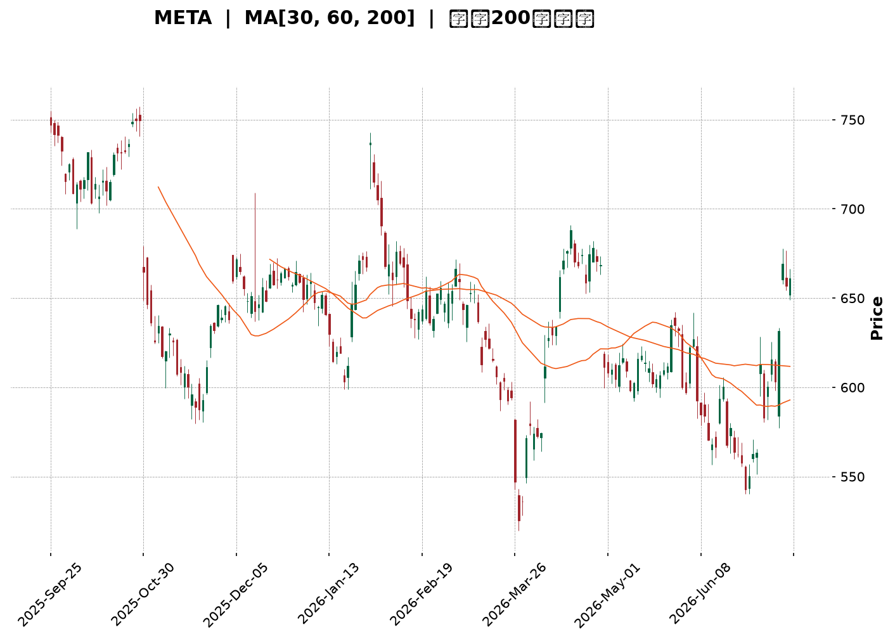
</details>

<html>
<head><meta charset="utf-8" /></head>
<body>
    <div style="height:500px; width:100%;">                        <script>window.PlotlyConfig = {MathJaxConfig: 'local'};</script>
        <script charset="utf-8" src="https://cdn.plot.ly/plotly-3.7.0.min.js" integrity="sha256-jvTGqxNp8AGWEcvNLVuKr+8j5dGe9Yw51LQkmDH+IYA=" crossorigin="anonymous"></script>                <div id="candlestick-chart" class="plotly-graph-div" style="height:100%; width:100%;"></div>            <script>                window.PLOTLYENV=window.PLOTLYENV || {};                                if (document.getElementById("candlestick-chart")) {                    Plotly.newPlot(                        "candlestick-chart",                        [{"close":{"dtype":"f8","bdata":"AAAA4LxXh0AAAADAkC6HQAAAAMDFK4dAAAAAwMzjhkAAAABA1VuGQAAAAMBPqYZAAAAA4LslhkAAAACgbU6GQAAAAIDXOYZAAAAAwNJfhkAAAACg29yGQAAAAGDD+4VAAAAAQL9OhkAAAABgfhaGQAAAAECCXYZAAAAAYMgxhkAAAABge1iGQAAAAGAq0oZAAAAAYPHahkAAAABAD9yGQAAAAIDE4IZAAAAAgI4Dh0AAAACA+maHQAAAAADta4dAAAAAwMJth0AAAADA7cWEQAAAAEBYNYRAAAAAIHLgg0AAAACgio2DQAAAAABn0oNAAAAA4KxKg0AAAAAgx2CDQAAAAED4sINAAAAAYKCLg0AAAAAAcfuCQAAAAKB2AoNAAAAAQAj\u002fgkAAAABAlsOCQAAAAOAdoYJAAAAAIE9mgkAAAABA+VyCQAAAAACrhYJAAAAAYK0bg0AAAACAjtSDQAAAACC7v4NAAAAAQCcyhEAAAAAAqfmDQAAAAABfK4RAAAAA4Ibvg0AAAAAAg56EQAAAAIBi\u002fYRAAAAA4I\u002fIhEAAAADgC3qEQAAAAECMQ4RAAAAAgCJYhEAAAABgeBSEQAAAAEDbMoRAAAAAwNZ\u002fhEAAAACAv0KEQAAAAKAiuoRAAAAAoMaMhEAAAACgk6KEQAAAAEAMvoRAAAAAIOTShEAAAAAA37CEQAAAACAjjIRAAAAAIB3GhEAAAABAUZeEQAAAAOADSoRAAAAAgO+MhEAAAADAjJuEQAAAAKBHPIRAAAAA4EYnhEAAAABALV+EQAAAAICdBoRAAAAAALuvg0AAAABgZDODQAAAAICOXYNAAAAAICpZg0AAAADAWtiCQAAAAODyHoNAAAAAgNAzhEAAAABAsoyEQAAAAGBN+YRAAAAAYCz+hEAAAABgUNyEQAAAAID2B4dAAAAAIMtZhkAAAACANwmGQAAAACC\u002fk4VAAAAA4GPehEAAAAAAIuiEQAAAAABCooRAAAAA4BwghUAAAACgNOyEQAAAAKD+24RAAAAAQDlFhEAAAAAADPWDQAAAAIA28YNAAAAA4JgQhEAAAAAgDh2EQAAAAKDwc4RAAAAAIOzgg0AAAAAAS\u002fGDQAAAAGA1ZIRAAAAAoLh+hEAAAAAANTiEQAAAAIArY4RAAAAAAE9vhEAAAAAAVNSEQAAAAIAmm4RAAAAAoLEdhEAAAAAA5jGEQAAAACA+Z4RAAAAAII1thEAAAABgWeiDQAAAAADwJINAAAAAwPOWg0AAAADgqnCDQAAAACDhOINAAAAAIBvxgkAAAADg4YiCQAAAAGAB3IJAAAAAwPeCgkAAAACgtpKCQAAAAIBDGIFAAAAAgN1pgEAAAAAgEb+AQAAAAEDN3IFAAAAAoIwVgkAAAADAbO+BQAAAAGDq44FAAAAA4CP0gUAAAADA0h6DQAAAACB3noNAAAAAwDaqg0AAAABAis+DQAAAACADr4RAAAAAYKr3hEAAAAAg8iGFQAAAAKBMf4VAAAAAYE\u002fyhEAAAAAAxOGEQAAAAADDEIVAAAAAQFGUhEAAAABgPROFQAAAAODuL4VAAAAAQL\u002f1hEAAAADgAOSEQAAAAEC\u002fGoNAAAAAoH0Bg0AAAAAgwg6DQAAAAOAy44JAAAAAAIAig0AAAAAg6UGDQAAAACCGCINAAAAAoHGygkAAAACAiNOCQAAAAOB4QINAAAAA4NtOg0AAAABASi2DQAAAAAAnFYNAAAAAgGrQgkAAAACA\u002f+OCQAAAAGCK9oJAAAAAQI8Ng0AAAAAgLx6DQAAAAOBf1YNAAAAAIJ3Vg0AAAAAAZb+DQAAAAMBPv4JAAAAA4JyogkAAAACgOXODQAAAAEDpl4NAAAAAgJuDgkAAAACgyEaCQAAAAMBjQIJAAAAAQJzTgUAAAACgOr+BQAAAAMCjs4FAAAAAANeLgkAAAAAgrsGCQAAAAOCjvIFAAAAAgMIJgkAAAADAzJ6BQAAAAKCZkYFAAAAAIFxtgUAAAADA9faAQAAAAAAAMoFAAAAAwMyUgUAAAADgUZqBQAAAAKBHJ4NAAAAAQDM3gkAAAADgUcKCQAAAAOCjPINAAAAAwPXYgkAAAAAA17uDQAAAACCu6YRAAAAAANeFhEAAAADgUaiEQA=="},"high":{"dtype":"f8","bdata":"RDvkfXSWh0BLcP3q1W+HQM6Yt8qoZodAcxJUXVcoh0AHug6q0X+GQCyXtowOr4ZAnPF9aNTIhkAac7vEKViGQIdNjtQWZYZAv79WAkRuhkAAAACg29yGQK9+vMfm6oZAVRhIOZRwhkBkKJ\u002fXjE2GQIenoWMtkIZAXYw0NN2chkCY072EaGWGQN1c5b\u002fu3oZAuyj+lqwEh0AYU0ItbhWHQGfjEXLfI4dAm3m9O0wah0CN6PfuUI6HQIwOIiZ2o4dAZUVJdYaph0Aj+NBkjDmFQMFlEkAdCYVAfcReA\u002fWMhEAqVSkkmgCEQNZI4wKDBIRAdi96Hc3Sg0A3bMsEIWSDQGmdlInSyoNAz2IWM2qfg0B\u002fMhna3ZqDQFe1HOZhQINAsCqhVLQgg0BjEOpy0xCDQGmwyKjA0IJAx68BAkmOgkC26MwnK+mCQHB+ujCMpIJABGm0O804g0A4Sib3LduDQDGm3OOh5YNAJBQHePMyhEDsbsH7Kh2EQIiNw+iDMYRAiOD\u002fu1U5hEBDzy\u002fYxBKFQFXyu8CEB4VAyq\u002fg+aIXhUAb0GrMDLaEQAAb4Dp\u002fZoRAWKuvOKRshEAvN7WkPimGQHtE2LqyXoRAdRwIuOGqhECf44+5a6CEQLbYG5jt6oRAEa50BnHuhEBu2z9yCwOFQDgLa0KDxoRAKIThE+zXhEC0r+wbEt6EQO3vrk+YmIRAwRSyIi\u002f4hEAqNVH4hr6EQPX6aAWouYRAE24iiNq6hEB31rYhrsKEQNE5UJvPj4RAhCQe9ZQvhEDwE3wbRW6EQOB+rr1xZoRAL3f02gIJhEAkJBjZpZqDQC8d6\u002fV3eINAbFuozK2fg0Cw5dOzfRKDQH7D5GJaSYNAtM2ZbyabhECNgMkPbcqEQE4NAPqeEIVAGjfFNeschUD6BMhcySOFQLK0G+BmNYdAdwQgG+7WhkDp5wbzH4CGQNiqVjzJXYZAlg4Y5tN8hUBCROGzSkKFQKOvx\u002flY9oRA05ibCr9QhUC\u002fgOUpgTuFQKOYBOt7MIVASeyR3l4WhUCwaAAbKVKEQGJh1U2lC4RAI4U\u002f4s8ehED1kBr2TDCEQPei8bRZsYRAgXWoLDuEhEDKEj1Gv\u002f+DQLx1oM65ZYRACPwwk5WehEAx8sHnREKEQAek0XseloRA2IMqj+6OhEALzt2ek\u002fyEQAaULs8L7IRA5GRMEIJChEDnOvLvxTSEQEog12f+mIRAgqH3FpKPhEDy+u7hsGKEQI2Dkp5loINAZaYTSEzRg0AL2g1Jr9+DQMZHa4iWcINAJDGdjXUjg0A6adjXNNuCQKi6k5CcAINADdx1TYzDgkBpeptZ49iCQAMyl2CuM4JAmOJt18X4gECFRSQ9Z9iAQDdjpSpF6YFAnDrgvQKAgkDZ1Lv2tg+CQN95HbkAMoJAApOeKJT1gUAU5q4B76qDQC6nfxlH54NATX9+1ujvg0BBadrbS9ODQK\u002fZsfkkzYRApWK4YPkuhUBBHUznnieFQHGyIZ4Jl4VAtzVfWvpVhUCQYOxKlxyFQBDCL88DLoVA2Fk7IoXnhEDLsu1NUUCFQOjfbcTxToVACPlah2oshUDygZRlAQ2FQAxQA2wzYoNAE8RZqnRSg0Ac\u002fz2xcyuDQOx8XbE\u002fLoNAT9m19wFbg0Cg+orBNYODQOjym1WXQYNAObb\u002fhszigkABh+YTh9mCQHqjeqybWoNAkT8PMzh5g0Aej2uo\u002f2SDQIfQjfEoOINAKz+SaOQqg0CYlsQMf\u002fuCQMYUN6pICINAUEgr\u002f+wxg0B4aPM1NS+DQBtyKTtF74NAQ33+oDwThEDKceW5TM+DQJudBlhK2YNAlN05iocCg0Ahfv2nk3yDQC7sVgBxDoRAICX2Moqkg0CmEgVXnXuCQC3uUuWcqIJAhffeDS52gkAcHUQIH92BQOBc3uJK\u002fIFAAAAAACnKgkAAAADgeu6CQAAAAOB6joJAAAAAgMIhgkAAAADgev6BQAAAAKCZ4YFAAAAA4FHIgUAAAABguGKBQAAAAMDMZoFAAAAAQDPXgUAAAADgUayBQAAAAIA9ooNAAAAAAAAQg0AAAADgo9yCQAAAAMD1ioNAAAAAAABAg0AAAAAAKcqDQAAAAEDhLoVAAAAAwPUkhUAAAAAAANSEQA=="},"hovertemplate":"\u003cb\u003e%{x|%Y-%m-%d}\u003c\u002fb\u003e\u003cbr\u003e\u958b: $%{open:.2f}\u003cbr\u003e\u9ad8: $%{high:.2f}\u003cbr\u003e\u4f4e: $%{low:.2f}\u003cbr\u003e\u6536: $%{close:.2f}\u003cextra\u003e\u003c\u002fextra\u003e","low":{"dtype":"f8","bdata":"Dr\u002fTyfI0h0DYjjSAf\u002fuGQJ0zRlTcCYdAC1gfzVOjhkC0jxJv3CKGQI9XGnY3YoZA+cHTpLMihkCWIHUcwIWFQH9RL5Fa\u002f4VAi3AyicoPhkBoyfcvvDSGQOuiZbJ19YVAXCY6Mm8OhkCjx8mDIMyFQIwPxhZbHYZASczHwm7whUAZ6GpgTgKGQK8Qy5J+coZAtbdtY+C2hkC+\u002fyn1NpGGQIOLEgiW2YZA6wkUzgbKhkCc\u002f7uNjlCHQLDfYFOwPIdAtKX2yaskh0CWXMn43UOEQGxN6aQpH4RALQbxwDzUg0ARJKi1FoODQPfNLT5Rh4NA7U90vixDg0Cq1AKXH72CQI3TK4QNRINA4K7VGkROg0Bv7HQWjPGCQDzpqXp8y4JAcOlSgj+NgkClLsgd2I6CQB+YsSUgMoJAhOzl7+8dgkBQpWuQsS6CQPqMqxLOIoJA261ILKOggkBzhMOTkUWDQE681KTur4NAtD+1xM\u002fOg0CAQb1F2OCDQI1y3phR44NA+cb7Yyvfg0DSGO28s5KEQAIQGblfpYRAyEPbEMK6hEAioGdbKV2EQIsQQwHZDYRAaa4gBhr5g0AtGol7oOeDQKdmiICA7INA\u002fQd+\u002f28QhED6KQ04WkCEQI6F8UJUeoRACtnUZhCIhECjKOCP2HuEQGnPlYWfiIRAqXVI4iqohEDhWB6vI6GEQHN3M27MaYRAyZIOc1mFhECDydNeIJKEQIa6kXLVEoRA1gBI4sU0hEC3MksM6lWEQN5dFIZLHYRAgAQKNbTUg0CqVBBcpA2EQKvuzLK0AIRAlAaK3eh3g0DCnYBNzS2DQMh3eRUXKYNAzmewns5Xg0DfVSoGdLeCQOHvBpgXuIJAL2Osf3mLg0Dl1OSOaxqEQGDAYF7moIRAesjbzc+7hED0zTi3T8eEQOk5NvA\u002fOoZAr7WiHI5ChkC+af5pI\u002fKFQJ4BsmqAaYVAlTFSFCzShEAN6CzQsGKEQGIZ4m3KKoRAMGPAHtuMhEAPey9kx+SEQFWZ4INwf4RAT8DoZAwhhECfUmVWhcuDQBggTkFxnYNAeFqYlECYg0CpELCEsNyDQIgNZA4k7YNAnaXzrvDWg0DJ8HVC4Z6DQCkURh75B4RAME\u002f1zcYyhEApkDHP3ueDQOV61yH2yoNA5cnkuJ7tg0DIWoXP\u002fYOEQJr5Lmo3SYRAwy2oiNHXg0DfPdnnT42DQE2XPD3BPoRAUHw61KQ5hEByp+uqIN6DQOhiz2u3A4NA9KnPHy90g0DJAwSy\u002fmiDQNCMbsdTMINA03Rwa57NgkA+DLhnplWCQAxik5Oks4JA6Q4URJ9zgkB+qFfzzYaCQEr6MVLG9oBAqTXC2jk+gEDcpOqdZ4CAQMRm3hccEoFAids9Qk\u002fqgUAaTXY9dHmBQOuxLE\u002fD24FAas9yg+WhgUAJmNOLQXqCQGwUnphic4NA6GfB3AN+g0Bm65k1k36DQCxlhDg59oNAKyvo9Na8hEDsPZerDdmEQL7wB\u002fMJFIVATY2oRA3bhEB3yRFdstWEQNtuvewJ6YRAQ0do8Y9jhEA22EVv4GmEQFmg1EDA8YRA2UcV9BvIhED4pcwRkLmEQNm8xzWOu4JAcuqa4WPsgkC7YX0GidGCQOXQObluvoJAXNVJh16sgkCeDpFTxieDQI0GMoX964JAINqjujWsgkCtuNv4aICCQG9VAB\u002fcoIJAJjEhwXEzg0Cz32N09wWDQJfS40IM2YJAIbgMiPO\u002fgkCgLog\u002fDaqCQHQ3rdYSkoJABfDdphrzgkBVwc956uWCQH2EzCt9A4NAeCked9Glg0BBSQefLnaDQMopVIjMt4JA1u44DQWhgkCEXsiwtr2CQApiXj\u002fUboNARMI0QvYygkDbWGYTeBWCQMLECKrGI4JA73t5uJLQgUDgWE4o9GOBQGZ0xIcLg4FAAAAAYGYagkAAAAAAAICCQAAAACCFsYFAAAAAwMyYgUAAAADgen6BQAAAAAApiIFAAAAAYGZcgUAAAACgcOGAQAAAAEAz44BAAAAAAABwgUAAAACgcDuBQAAAAMDMmIJAAAAAIFwjgkAAAACAFC6CQAAAAKBH3YJAAAAAgBSwgkAAAABgjwiCQAAAAIAUkIRAAAAAoJlxhEAAAABgZkiEQA=="},"name":"\u50f9\u683c","open":{"dtype":"f8","bdata":"TiRKwfZ7h0CL+dSLb2CHQACgh7w4VodAoOWDsJgih0BKpqtT8nyGQDtHbv+khYZAIWbC7+W9hkBxEV+\u002f4vqFQFAnb3ndXoZAnoWTUss8hkBOQVKJVWOGQEEq7wMxyIZA5B2dakg5hkByUT8\u002fjQ+GQNNLaVqZWYZAL2b5QoJdhkCbxr9m9wmGQIhMJbWNeoZA6Ijgw+LwhkBzc7hEad+GQPXv82da5oZAh19Tdwf3hkBabH3qR16HQHVfjs1rdYdAttEKQ1aGh0B2sf5CUNuEQNZN5gQVBoVAUChq1GJyhECNis5MSZODQMc5oJZbtYNAJsWEqZrRg0BvUpk7IDeDQOL7Lq+fq4NA2onFnPeSg0DEILorAZSDQO3xGFvWG4NAWFikv9TBgkC2SAdHrvuCQENZftqFcIJAuLXKL3CBgkBvOyjDec+CQJG5HYzJV4JAFSXaoVWpgkBaeI\u002frDHODQKniDlNJ4INAvUDaj3DTg0BpDEejIO+DQJPgluljBYRAoy9nMugVhEDigyig+BGFQGjRd2s4soRALsdsYdTchECZbQGSYrCEQEiYzZQcQoRAnu2jS\u002fgMhEBNbXMo6kCEQPwEt\u002flmJIRA8MhtR9UShEDQTxF4inOEQBwz0o7hfoRAMAw52t3JhECnafBTxqOEQLCyK1X\u002floRA3gQ1js2qhEBoR9Ka9taEQHSBzPq0hoRAQXaQGSOMhEDLHLThh7yEQCUIFFNmrIRAfADtfs5OhEDfFDA0KpOEQP1R\u002fufHc4RA8LUI6NYlhEAqmARKUyKEQJe25\u002f3xWoRAL3f02gIJhEBjgYtVE4uDQNjB25UHS4NAo6kea4x4g0Cq4OSJYfaCQLNgqe5G7YJAOUSwqdWhg0DH1SfE+RyEQFLGh72Qv4RA5baVVxwLhUB3uHBVZAqFQDHqhnXvAIdApQTWAqOxhkCp1wDCnkqGQK6RwRriEIZAzwUMCQt0hUATMaftL7OEQJDY1a1wwoRAPJwhM\u002f6vhECtSz3JJSOFQPAk2SJmBoVAodfYWzfmhEBlCUxQnB+EQAcu7dvj8oNAdOUNGl\u002fFg0BJGomlduuDQGsE4Vxo9INA4ePdPQZbhEA088gun7+DQC3TLnIWC4RA8YetDiJLhEDGL4Y\u002fbxKEQA8Ukg404INAL7rcwhU5hEAeMcHAToaEQPdhZMoCpoRA30\u002fwifg1hECgyK67Ms2DQBkBInwrY4RASaZVvcBshEAzoFE0wjyEQL4W9H87doNAdVoef1G7g0C3TIekRJuDQPOglp8nPoNAAAs+aqocg0Afy5UIxdeCQAwlKRjV6YJA74LZp1y0gkDS4fUSfLGCQICzMdiaL4JAFUmleszcgEAAAAAgEb+AQCjfewHEK4FAdI4WK74cgkAeGaJ3IKyBQNDH7aQ9CYJArJinX5nfgUBQy7bMguuCQC2ZXpEdk4NASo3jQQ\u002fPg0B6rNJJVqeDQFvhZKv+FIRAOiRaLw\u002fThED07DmL6RqFQDDCdN7FL4VA16n\u002fLtVFhUBBAGSHB\u002fOEQL6Bwm7iDYVA5MAZ\u002f664hEDKFmMlq52EQO+xK5MH84RAdZUi4OwMhUAoJPUlU+KEQNQtv\u002fL4VYNAZjtnfPcwg0CPdAhPBPuCQMP0QMrvJYNAcPYjj\u002fLDgkBQs7C2NDGDQHUp1O8KNYNAdocJ7BTggkDsvBtjJ5KCQLlnfkE0soJAMAer2287g0DSo4A0XyuDQBuqixteBINA5BK9aNkCg0BCzHBHocGCQC699B6Ou4JARdpkg4n6gkC1IesKnAKDQO7hm6mvBoNAoRwmREP3g0DgvmCfTseDQKu+Xb2HroNA9AlnfHPVgkArW3yDiNOCQE0sYWW9eINAc7Qs3Q93g0CmEgVXnXuCQBudEjifc4JAtxHVwokhgkC3METOcqqBQNyUmQ1b44FAAAAAQDMfgkAAAABAM42CQAAAAAAAgIJAAAAAYI\u002fmgUAAAAAAKeCBQAAAAAAAkoFAAAAAwB6PgUAAAABgZlyBQAAAAGC4+oBAAAAAAACAgUAAAAAghYeBQAAAAKBH\u002f4JAAAAAQDP\u002fgkAAAABguJaCQAAAAGC4\u002fIJAAAAAwB4zg0AAAACA6z+CQAAAAGC4ooRAAAAAQAqrhEAAAAAAAGCEQA=="},"x":["2025-09-25T00:00:00-04:00","2025-09-26T00:00:00-04:00","2025-09-29T00:00:00-04:00","2025-09-30T00:00:00-04:00","2025-10-01T00:00:00-04:00","2025-10-02T00:00:00-04:00","2025-10-03T00:00:00-04:00","2025-10-06T00:00:00-04:00","2025-10-07T00:00:00-04:00","2025-10-08T00:00:00-04:00","2025-10-09T00:00:00-04:00","2025-10-10T00:00:00-04:00","2025-10-13T00:00:00-04:00","2025-10-14T00:00:00-04:00","2025-10-15T00:00:00-04:00","2025-10-16T00:00:00-04:00","2025-10-17T00:00:00-04:00","2025-10-20T00:00:00-04:00","2025-10-21T00:00:00-04:00","2025-10-22T00:00:00-04:00","2025-10-23T00:00:00-04:00","2025-10-24T00:00:00-04:00","2025-10-27T00:00:00-04:00","2025-10-28T00:00:00-04:00","2025-10-29T00:00:00-04:00","2025-10-30T00:00:00-04:00","2025-10-31T00:00:00-04:00","2025-11-03T00:00:00-05:00","2025-11-04T00:00:00-05:00","2025-11-05T00:00:00-05:00","2025-11-06T00:00:00-05:00","2025-11-07T00:00:00-05:00","2025-11-10T00:00:00-05:00","2025-11-11T00:00:00-05:00","2025-11-12T00:00:00-05:00","2025-11-13T00:00:00-05:00","2025-11-14T00:00:00-05:00","2025-11-17T00:00:00-05:00","2025-11-18T00:00:00-05:00","2025-11-19T00:00:00-05:00","2025-11-20T00:00:00-05:00","2025-11-21T00:00:00-05:00","2025-11-24T00:00:00-05:00","2025-11-25T00:00:00-05:00","2025-11-26T00:00:00-05:00","2025-11-28T00:00:00-05:00","2025-12-01T00:00:00-05:00","2025-12-02T00:00:00-05:00","2025-12-03T00:00:00-05:00","2025-12-04T00:00:00-05:00","2025-12-05T00:00:00-05:00","2025-12-08T00:00:00-05:00","2025-12-09T00:00:00-05:00","2025-12-10T00:00:00-05:00","2025-12-11T00:00:00-05:00","2025-12-12T00:00:00-05:00","2025-12-15T00:00:00-05:00","2025-12-16T00:00:00-05:00","2025-12-17T00:00:00-05:00","2025-12-18T00:00:00-05:00","2025-12-19T00:00:00-05:00","2025-12-22T00:00:00-05:00","2025-12-23T00:00:00-05:00","2025-12-24T00:00:00-05:00","2025-12-26T00:00:00-05:00","2025-12-29T00:00:00-05:00","2025-12-30T00:00:00-05:00","2025-12-31T00:00:00-05:00","2026-01-02T00:00:00-05:00","2026-01-05T00:00:00-05:00","2026-01-06T00:00:00-05:00","2026-01-07T00:00:00-05:00","2026-01-08T00:00:00-05:00","2026-01-09T00:00:00-05:00","2026-01-12T00:00:00-05:00","2026-01-13T00:00:00-05:00","2026-01-14T00:00:00-05:00","2026-01-15T00:00:00-05:00","2026-01-16T00:00:00-05:00","2026-01-20T00:00:00-05:00","2026-01-21T00:00:00-05:00","2026-01-22T00:00:00-05:00","2026-01-23T00:00:00-05:00","2026-01-26T00:00:00-05:00","2026-01-27T00:00:00-05:00","2026-01-28T00:00:00-05:00","2026-01-29T00:00:00-05:00","2026-01-30T00:00:00-05:00","2026-02-02T00:00:00-05:00","2026-02-03T00:00:00-05:00","2026-02-04T00:00:00-05:00","2026-02-05T00:00:00-05:00","2026-02-06T00:00:00-05:00","2026-02-09T00:00:00-05:00","2026-02-10T00:00:00-05:00","2026-02-11T00:00:00-05:00","2026-02-12T00:00:00-05:00","2026-02-13T00:00:00-05:00","2026-02-17T00:00:00-05:00","2026-02-18T00:00:00-05:00","2026-02-19T00:00:00-05:00","2026-02-20T00:00:00-05:00","2026-02-23T00:00:00-05:00","2026-02-24T00:00:00-05:00","2026-02-25T00:00:00-05:00","2026-02-26T00:00:00-05:00","2026-02-27T00:00:00-05:00","2026-03-02T00:00:00-05:00","2026-03-03T00:00:00-05:00","2026-03-04T00:00:00-05:00","2026-03-05T00:00:00-05:00","2026-03-06T00:00:00-05:00","2026-03-09T00:00:00-04:00","2026-03-10T00:00:00-04:00","2026-03-11T00:00:00-04:00","2026-03-12T00:00:00-04:00","2026-03-13T00:00:00-04:00","2026-03-16T00:00:00-04:00","2026-03-17T00:00:00-04:00","2026-03-18T00:00:00-04:00","2026-03-19T00:00:00-04:00","2026-03-20T00:00:00-04:00","2026-03-23T00:00:00-04:00","2026-03-24T00:00:00-04:00","2026-03-25T00:00:00-04:00","2026-03-26T00:00:00-04:00","2026-03-27T00:00:00-04:00","2026-03-30T00:00:00-04:00","2026-03-31T00:00:00-04:00","2026-04-01T00:00:00-04:00","2026-04-02T00:00:00-04:00","2026-04-06T00:00:00-04:00","2026-04-07T00:00:00-04:00","2026-04-08T00:00:00-04:00","2026-04-09T00:00:00-04:00","2026-04-10T00:00:00-04:00","2026-04-13T00:00:00-04:00","2026-04-14T00:00:00-04:00","2026-04-15T00:00:00-04:00","2026-04-16T00:00:00-04:00","2026-04-17T00:00:00-04:00","2026-04-20T00:00:00-04:00","2026-04-21T00:00:00-04:00","2026-04-22T00:00:00-04:00","2026-04-23T00:00:00-04:00","2026-04-24T00:00:00-04:00","2026-04-27T00:00:00-04:00","2026-04-28T00:00:00-04:00","2026-04-29T00:00:00-04:00","2026-04-30T00:00:00-04:00","2026-05-01T00:00:00-04:00","2026-05-04T00:00:00-04:00","2026-05-05T00:00:00-04:00","2026-05-06T00:00:00-04:00","2026-05-07T00:00:00-04:00","2026-05-08T00:00:00-04:00","2026-05-11T00:00:00-04:00","2026-05-12T00:00:00-04:00","2026-05-13T00:00:00-04:00","2026-05-14T00:00:00-04:00","2026-05-15T00:00:00-04:00","2026-05-18T00:00:00-04:00","2026-05-19T00:00:00-04:00","2026-05-20T00:00:00-04:00","2026-05-21T00:00:00-04:00","2026-05-22T00:00:00-04:00","2026-05-26T00:00:00-04:00","2026-05-27T00:00:00-04:00","2026-05-28T00:00:00-04:00","2026-05-29T00:00:00-04:00","2026-06-01T00:00:00-04:00","2026-06-02T00:00:00-04:00","2026-06-03T00:00:00-04:00","2026-06-04T00:00:00-04:00","2026-06-05T00:00:00-04:00","2026-06-08T00:00:00-04:00","2026-06-09T00:00:00-04:00","2026-06-10T00:00:00-04:00","2026-06-11T00:00:00-04:00","2026-06-12T00:00:00-04:00","2026-06-15T00:00:00-04:00","2026-06-16T00:00:00-04:00","2026-06-17T00:00:00-04:00","2026-06-18T00:00:00-04:00","2026-06-22T00:00:00-04:00","2026-06-23T00:00:00-04:00","2026-06-24T00:00:00-04:00","2026-06-25T00:00:00-04:00","2026-06-26T00:00:00-04:00","2026-06-29T00:00:00-04:00","2026-06-30T00:00:00-04:00","2026-07-01T00:00:00-04:00","2026-07-02T00:00:00-04:00","2026-07-06T00:00:00-04:00","2026-07-07T00:00:00-04:00","2026-07-08T00:00:00-04:00","2026-07-09T00:00:00-04:00","2026-07-10T00:00:00-04:00","2026-07-13T00:00:00-04:00","2026-07-14T00:00:00-04:00"],"type":"candlestick"},{"hovertemplate":"MA30: $%{y:.2f}\u003cextra\u003e\u003c\u002fextra\u003e","line":{"color":"#2196F3","dash":"dash","width":2},"mode":"lines","name":"MA30","x":["2025-09-25T00:00:00-04:00","2025-09-26T00:00:00-04:00","2025-09-29T00:00:00-04:00","2025-09-30T00:00:00-04:00","2025-10-01T00:00:00-04:00","2025-10-02T00:00:00-04:00","2025-10-03T00:00:00-04:00","2025-10-06T00:00:00-04:00","2025-10-07T00:00:00-04:00","2025-10-08T00:00:00-04:00","2025-10-09T00:00:00-04:00","2025-10-10T00:00:00-04:00","2025-10-13T00:00:00-04:00","2025-10-14T00:00:00-04:00","2025-10-15T00:00:00-04:00","2025-10-16T00:00:00-04:00","2025-10-17T00:00:00-04:00","2025-10-20T00:00:00-04:00","2025-10-21T00:00:00-04:00","2025-10-22T00:00:00-04:00","2025-10-23T00:00:00-04:00","2025-10-24T00:00:00-04:00","2025-10-27T00:00:00-04:00","2025-10-28T00:00:00-04:00","2025-10-29T00:00:00-04:00","2025-10-30T00:00:00-04:00","2025-10-31T00:00:00-04:00","2025-11-03T00:00:00-05:00","2025-11-04T00:00:00-05:00","2025-11-05T00:00:00-05:00","2025-11-06T00:00:00-05:00","2025-11-07T00:00:00-05:00","2025-11-10T00:00:00-05:00","2025-11-11T00:00:00-05:00","2025-11-12T00:00:00-05:00","2025-11-13T00:00:00-05:00","2025-11-14T00:00:00-05:00","2025-11-17T00:00:00-05:00","2025-11-18T00:00:00-05:00","2025-11-19T00:00:00-05:00","2025-11-20T00:00:00-05:00","2025-11-21T00:00:00-05:00","2025-11-24T00:00:00-05:00","2025-11-25T00:00:00-05:00","2025-11-26T00:00:00-05:00","2025-11-28T00:00:00-05:00","2025-12-01T00:00:00-05:00","2025-12-02T00:00:00-05:00","2025-12-03T00:00:00-05:00","2025-12-04T00:00:00-05:00","2025-12-05T00:00:00-05:00","2025-12-08T00:00:00-05:00","2025-12-09T00:00:00-05:00","2025-12-10T00:00:00-05:00","2025-12-11T00:00:00-05:00","2025-12-12T00:00:00-05:00","2025-12-15T00:00:00-05:00","2025-12-16T00:00:00-05:00","2025-12-17T00:00:00-05:00","2025-12-18T00:00:00-05:00","2025-12-19T00:00:00-05:00","2025-12-22T00:00:00-05:00","2025-12-23T00:00:00-05:00","2025-12-24T00:00:00-05:00","2025-12-26T00:00:00-05:00","2025-12-29T00:00:00-05:00","2025-12-30T00:00:00-05:00","2025-12-31T00:00:00-05:00","2026-01-02T00:00:00-05:00","2026-01-05T00:00:00-05:00","2026-01-06T00:00:00-05:00","2026-01-07T00:00:00-05:00","2026-01-08T00:00:00-05:00","2026-01-09T00:00:00-05:00","2026-01-12T00:00:00-05:00","2026-01-13T00:00:00-05:00","2026-01-14T00:00:00-05:00","2026-01-15T00:00:00-05:00","2026-01-16T00:00:00-05:00","2026-01-20T00:00:00-05:00","2026-01-21T00:00:00-05:00","2026-01-22T00:00:00-05:00","2026-01-23T00:00:00-05:00","2026-01-26T00:00:00-05:00","2026-01-27T00:00:00-05:00","2026-01-28T00:00:00-05:00","2026-01-29T00:00:00-05:00","2026-01-30T00:00:00-05:00","2026-02-02T00:00:00-05:00","2026-02-03T00:00:00-05:00","2026-02-04T00:00:00-05:00","2026-02-05T00:00:00-05:00","2026-02-06T00:00:00-05:00","2026-02-09T00:00:00-05:00","2026-02-10T00:00:00-05:00","2026-02-11T00:00:00-05:00","2026-02-12T00:00:00-05:00","2026-02-13T00:00:00-05:00","2026-02-17T00:00:00-05:00","2026-02-18T00:00:00-05:00","2026-02-19T00:00:00-05:00","2026-02-20T00:00:00-05:00","2026-02-23T00:00:00-05:00","2026-02-24T00:00:00-05:00","2026-02-25T00:00:00-05:00","2026-02-26T00:00:00-05:00","2026-02-27T00:00:00-05:00","2026-03-02T00:00:00-05:00","2026-03-03T00:00:00-05:00","2026-03-04T00:00:00-05:00","2026-03-05T00:00:00-05:00","2026-03-06T00:00:00-05:00","2026-03-09T00:00:00-04:00","2026-03-10T00:00:00-04:00","2026-03-11T00:00:00-04:00","2026-03-12T00:00:00-04:00","2026-03-13T00:00:00-04:00","2026-03-16T00:00:00-04:00","2026-03-17T00:00:00-04:00","2026-03-18T00:00:00-04:00","2026-03-19T00:00:00-04:00","2026-03-20T00:00:00-04:00","2026-03-23T00:00:00-04:00","2026-03-24T00:00:00-04:00","2026-03-25T00:00:00-04:00","2026-03-26T00:00:00-04:00","2026-03-27T00:00:00-04:00","2026-03-30T00:00:00-04:00","2026-03-31T00:00:00-04:00","2026-04-01T00:00:00-04:00","2026-04-02T00:00:00-04:00","2026-04-06T00:00:00-04:00","2026-04-07T00:00:00-04:00","2026-04-08T00:00:00-04:00","2026-04-09T00:00:00-04:00","2026-04-10T00:00:00-04:00","2026-04-13T00:00:00-04:00","2026-04-14T00:00:00-04:00","2026-04-15T00:00:00-04:00","2026-04-16T00:00:00-04:00","2026-04-17T00:00:00-04:00","2026-04-20T00:00:00-04:00","2026-04-21T00:00:00-04:00","2026-04-22T00:00:00-04:00","2026-04-23T00:00:00-04:00","2026-04-24T00:00:00-04:00","2026-04-27T00:00:00-04:00","2026-04-28T00:00:00-04:00","2026-04-29T00:00:00-04:00","2026-04-30T00:00:00-04:00","2026-05-01T00:00:00-04:00","2026-05-04T00:00:00-04:00","2026-05-05T00:00:00-04:00","2026-05-06T00:00:00-04:00","2026-05-07T00:00:00-04:00","2026-05-08T00:00:00-04:00","2026-05-11T00:00:00-04:00","2026-05-12T00:00:00-04:00","2026-05-13T00:00:00-04:00","2026-05-14T00:00:00-04:00","2026-05-15T00:00:00-04:00","2026-05-18T00:00:00-04:00","2026-05-19T00:00:00-04:00","2026-05-20T00:00:00-04:00","2026-05-21T00:00:00-04:00","2026-05-22T00:00:00-04:00","2026-05-26T00:00:00-04:00","2026-05-27T00:00:00-04:00","2026-05-28T00:00:00-04:00","2026-05-29T00:00:00-04:00","2026-06-01T00:00:00-04:00","2026-06-02T00:00:00-04:00","2026-06-03T00:00:00-04:00","2026-06-04T00:00:00-04:00","2026-06-05T00:00:00-04:00","2026-06-08T00:00:00-04:00","2026-06-09T00:00:00-04:00","2026-06-10T00:00:00-04:00","2026-06-11T00:00:00-04:00","2026-06-12T00:00:00-04:00","2026-06-15T00:00:00-04:00","2026-06-16T00:00:00-04:00","2026-06-17T00:00:00-04:00","2026-06-18T00:00:00-04:00","2026-06-22T00:00:00-04:00","2026-06-23T00:00:00-04:00","2026-06-24T00:00:00-04:00","2026-06-25T00:00:00-04:00","2026-06-26T00:00:00-04:00","2026-06-29T00:00:00-04:00","2026-06-30T00:00:00-04:00","2026-07-01T00:00:00-04:00","2026-07-02T00:00:00-04:00","2026-07-06T00:00:00-04:00","2026-07-07T00:00:00-04:00","2026-07-08T00:00:00-04:00","2026-07-09T00:00:00-04:00","2026-07-10T00:00:00-04:00","2026-07-13T00:00:00-04:00","2026-07-14T00:00:00-04:00"],"y":{"dtype":"f8","bdata":"AAAAAAAA+H8AAAAAAAD4fwAAAAAAAPh\u002fAAAAAAAA+H8AAAAAAAD4fwAAAAAAAPh\u002fAAAAAAAA+H8AAAAAAAD4fwAAAAAAAPh\u002fAAAAAAAA+H8AAAAAAAD4fwAAAAAAAPh\u002fAAAAAAAA+H8AAAAAAAD4fwAAAAAAAPh\u002fAAAAAAAA+H8AAAAAAAD4fwAAAAAAAPh\u002fAAAAAAAA+H8AAAAAAAD4fwAAAAAAAPh\u002fAAAAAAAA+H8AAAAAAAD4fwAAAAAAAPh\u002fAAAAAAAA+H8AAAAAAAD4fwAAAAAAAPh\u002fAAAAAAAA+H8AAAAAAAD4fzMzM3PgQYZAmpmZ2U4fhkAiIiIy2f6FQN7d3a0n4YVAq6qqqp3EhUBmZmaGzaeFQHd3dyekiIVAzczMTMBthUC8u7vrhU+FQBERERHVMIVAd3d3R+oOhUDe3d3dhOiEQFVVVYX7yoRAAAAAIK6vhEBVVVVlapyEQFVVVfUWhoRA3t3dDQl1hEB3d3fXzmCEQGZmZnYuSoRAMzMzg0QxhEDNzMw8Jh6EQO\u002fu7l4JDoRAIiIi4gD7g0Dv7u7+CeKDQGZmZtYXx4NAIiIissWsg0AiIiJi26aDQGZmZibGpoNA3t3dTRasg0CamZmZILKDQN7d3Q3auYNAVVVVpZbEg0CamZmpUM+DQLy7u8tI2INAREREdDHjg0AAAAAwxvGDQJqZmYnl\u002foNAZmZm5hAOhEAzMzMzqB2EQAAAAADSK4RA3t3drSw+hECrqqq6U1GEQM3MzIzyX4RAEREREd5ohEBVVVX1fG2EQGZmZtbZb4RAVVVV5YBrhEAiIiIC5WSEQJqZmbkIXoRAIiIiogVZhECJiIgo4kmEQBEREYHvOYRAERERMfo0hEBmZmZWmTWEQO\u002fu7k6oO4RAvLu7KzFBhEARERGB2keEQERERBQGYIRA3t3dfdJvhEAAAACg+H6EQDMzM5M5hoRAREREBPKIhEAAAACQQ4uEQLy7u2tWioRAERERYemMhEAzMzOz446EQGZmZiaNkYRAmpmZSUGNhEBERESU2IeEQM3MzMzihIRAd3d3x72AhEC8u7tbhnyEQDMzM1NhfoRAd3d39wh8hECrqqpKX3iEQERERPR9e4RAZmZmRmSChEBVVVXlFYuEQERERFTOk4RAMzMz0xOdhECJiIiIAq6EQLy7u+uuuoRAiYiIKPK5hECamZlZ67aEQJqZmfkMsoRA3t3d3TqthECJiIgIGaWEQGZmZibug4RAAAAAcF5shEDe3d2dN1aEQGZmZiYfQoRAq6qqyq0xhEC8u7vrbx2EQCIiIqJLDoRAiYiImP33g0DNzMzc8OODQGZmZgbRw4NAERERkeeig0BmZmZWgYeDQImIiBjCdYNAmpmZSdtkg0B3d3fXRFKDQERERMRmPINAERERsfkrg0Dv7u6u9SSDQGZmZkZeHoNAERER4UgXg0CJiIi4yxODQImIiOhSFoNAzczMfN4ag0AzMzPTdB2DQCIiIrIPJYNAVVVVBSYsg0ARERHBAjKDQBEREVGpN4NA7+7uHvQ4g0B3d3en6kKDQM3MzIxZVINAAAAAAAtgg0C8u7u7a2yDQKuqqppqa4NAvLu7a\u002fZrg0BERETUbHCDQGZmZjaqcINA3t3djft1g0AiIiKS0nuDQDMzM1NdjINAq6qqutmfg0ARERFxmbGDQO\u002fu7n50vYNAIiIiEubHg0BVVVWFftKDQFVVVTWr3INAVVVV5QLkg0C8u7vrDOKDQGZmZvZz3INA3t3dLTvXg0De3d29UdGDQBEREZEQyoNAVVVVdWXAg0BERET0k7SDQHd3d5ccnYNAREREpJaJg0BERETUXn2DQJqZmQnPcINAERERYS9fg0Dv7u6eTUeDQDMzM3NALoNAzczMjIMTg0BEREQksPiCQCIiIsK37IJA3t3dzcvogkAiIiISOuaCQBEREYFo3IJAq6qq2gzTgkARERFxFMWCQHd3dxeVuIJAq6qqCr+tgkCJiIhI3J2CQImIiLhPjIJAvLu7e5N9gkDe3d3NJHCCQN7d3X2\u002fcIJAzczMDKRrgkCamZmphGqCQImIiNjabIJA7+7u\u002fhlrgkAzMzNTW3CCQCIiIiKReYJA3t3d7XB\u002fgkDv7u6ONIeCQA=="},"type":"scatter"},{"hovertemplate":"MA60: $%{y:.2f}\u003cextra\u003e\u003c\u002fextra\u003e","line":{"color":"#9C27B0","dash":"dash","width":2},"mode":"lines","name":"MA60","x":["2025-09-25T00:00:00-04:00","2025-09-26T00:00:00-04:00","2025-09-29T00:00:00-04:00","2025-09-30T00:00:00-04:00","2025-10-01T00:00:00-04:00","2025-10-02T00:00:00-04:00","2025-10-03T00:00:00-04:00","2025-10-06T00:00:00-04:00","2025-10-07T00:00:00-04:00","2025-10-08T00:00:00-04:00","2025-10-09T00:00:00-04:00","2025-10-10T00:00:00-04:00","2025-10-13T00:00:00-04:00","2025-10-14T00:00:00-04:00","2025-10-15T00:00:00-04:00","2025-10-16T00:00:00-04:00","2025-10-17T00:00:00-04:00","2025-10-20T00:00:00-04:00","2025-10-21T00:00:00-04:00","2025-10-22T00:00:00-04:00","2025-10-23T00:00:00-04:00","2025-10-24T00:00:00-04:00","2025-10-27T00:00:00-04:00","2025-10-28T00:00:00-04:00","2025-10-29T00:00:00-04:00","2025-10-30T00:00:00-04:00","2025-10-31T00:00:00-04:00","2025-11-03T00:00:00-05:00","2025-11-04T00:00:00-05:00","2025-11-05T00:00:00-05:00","2025-11-06T00:00:00-05:00","2025-11-07T00:00:00-05:00","2025-11-10T00:00:00-05:00","2025-11-11T00:00:00-05:00","2025-11-12T00:00:00-05:00","2025-11-13T00:00:00-05:00","2025-11-14T00:00:00-05:00","2025-11-17T00:00:00-05:00","2025-11-18T00:00:00-05:00","2025-11-19T00:00:00-05:00","2025-11-20T00:00:00-05:00","2025-11-21T00:00:00-05:00","2025-11-24T00:00:00-05:00","2025-11-25T00:00:00-05:00","2025-11-26T00:00:00-05:00","2025-11-28T00:00:00-05:00","2025-12-01T00:00:00-05:00","2025-12-02T00:00:00-05:00","2025-12-03T00:00:00-05:00","2025-12-04T00:00:00-05:00","2025-12-05T00:00:00-05:00","2025-12-08T00:00:00-05:00","2025-12-09T00:00:00-05:00","2025-12-10T00:00:00-05:00","2025-12-11T00:00:00-05:00","2025-12-12T00:00:00-05:00","2025-12-15T00:00:00-05:00","2025-12-16T00:00:00-05:00","2025-12-17T00:00:00-05:00","2025-12-18T00:00:00-05:00","2025-12-19T00:00:00-05:00","2025-12-22T00:00:00-05:00","2025-12-23T00:00:00-05:00","2025-12-24T00:00:00-05:00","2025-12-26T00:00:00-05:00","2025-12-29T00:00:00-05:00","2025-12-30T00:00:00-05:00","2025-12-31T00:00:00-05:00","2026-01-02T00:00:00-05:00","2026-01-05T00:00:00-05:00","2026-01-06T00:00:00-05:00","2026-01-07T00:00:00-05:00","2026-01-08T00:00:00-05:00","2026-01-09T00:00:00-05:00","2026-01-12T00:00:00-05:00","2026-01-13T00:00:00-05:00","2026-01-14T00:00:00-05:00","2026-01-15T00:00:00-05:00","2026-01-16T00:00:00-05:00","2026-01-20T00:00:00-05:00","2026-01-21T00:00:00-05:00","2026-01-22T00:00:00-05:00","2026-01-23T00:00:00-05:00","2026-01-26T00:00:00-05:00","2026-01-27T00:00:00-05:00","2026-01-28T00:00:00-05:00","2026-01-29T00:00:00-05:00","2026-01-30T00:00:00-05:00","2026-02-02T00:00:00-05:00","2026-02-03T00:00:00-05:00","2026-02-04T00:00:00-05:00","2026-02-05T00:00:00-05:00","2026-02-06T00:00:00-05:00","2026-02-09T00:00:00-05:00","2026-02-10T00:00:00-05:00","2026-02-11T00:00:00-05:00","2026-02-12T00:00:00-05:00","2026-02-13T00:00:00-05:00","2026-02-17T00:00:00-05:00","2026-02-18T00:00:00-05:00","2026-02-19T00:00:00-05:00","2026-02-20T00:00:00-05:00","2026-02-23T00:00:00-05:00","2026-02-24T00:00:00-05:00","2026-02-25T00:00:00-05:00","2026-02-26T00:00:00-05:00","2026-02-27T00:00:00-05:00","2026-03-02T00:00:00-05:00","2026-03-03T00:00:00-05:00","2026-03-04T00:00:00-05:00","2026-03-05T00:00:00-05:00","2026-03-06T00:00:00-05:00","2026-03-09T00:00:00-04:00","2026-03-10T00:00:00-04:00","2026-03-11T00:00:00-04:00","2026-03-12T00:00:00-04:00","2026-03-13T00:00:00-04:00","2026-03-16T00:00:00-04:00","2026-03-17T00:00:00-04:00","2026-03-18T00:00:00-04:00","2026-03-19T00:00:00-04:00","2026-03-20T00:00:00-04:00","2026-03-23T00:00:00-04:00","2026-03-24T00:00:00-04:00","2026-03-25T00:00:00-04:00","2026-03-26T00:00:00-04:00","2026-03-27T00:00:00-04:00","2026-03-30T00:00:00-04:00","2026-03-31T00:00:00-04:00","2026-04-01T00:00:00-04:00","2026-04-02T00:00:00-04:00","2026-04-06T00:00:00-04:00","2026-04-07T00:00:00-04:00","2026-04-08T00:00:00-04:00","2026-04-09T00:00:00-04:00","2026-04-10T00:00:00-04:00","2026-04-13T00:00:00-04:00","2026-04-14T00:00:00-04:00","2026-04-15T00:00:00-04:00","2026-04-16T00:00:00-04:00","2026-04-17T00:00:00-04:00","2026-04-20T00:00:00-04:00","2026-04-21T00:00:00-04:00","2026-04-22T00:00:00-04:00","2026-04-23T00:00:00-04:00","2026-04-24T00:00:00-04:00","2026-04-27T00:00:00-04:00","2026-04-28T00:00:00-04:00","2026-04-29T00:00:00-04:00","2026-04-30T00:00:00-04:00","2026-05-01T00:00:00-04:00","2026-05-04T00:00:00-04:00","2026-05-05T00:00:00-04:00","2026-05-06T00:00:00-04:00","2026-05-07T00:00:00-04:00","2026-05-08T00:00:00-04:00","2026-05-11T00:00:00-04:00","2026-05-12T00:00:00-04:00","2026-05-13T00:00:00-04:00","2026-05-14T00:00:00-04:00","2026-05-15T00:00:00-04:00","2026-05-18T00:00:00-04:00","2026-05-19T00:00:00-04:00","2026-05-20T00:00:00-04:00","2026-05-21T00:00:00-04:00","2026-05-22T00:00:00-04:00","2026-05-26T00:00:00-04:00","2026-05-27T00:00:00-04:00","2026-05-28T00:00:00-04:00","2026-05-29T00:00:00-04:00","2026-06-01T00:00:00-04:00","2026-06-02T00:00:00-04:00","2026-06-03T00:00:00-04:00","2026-06-04T00:00:00-04:00","2026-06-05T00:00:00-04:00","2026-06-08T00:00:00-04:00","2026-06-09T00:00:00-04:00","2026-06-10T00:00:00-04:00","2026-06-11T00:00:00-04:00","2026-06-12T00:00:00-04:00","2026-06-15T00:00:00-04:00","2026-06-16T00:00:00-04:00","2026-06-17T00:00:00-04:00","2026-06-18T00:00:00-04:00","2026-06-22T00:00:00-04:00","2026-06-23T00:00:00-04:00","2026-06-24T00:00:00-04:00","2026-06-25T00:00:00-04:00","2026-06-26T00:00:00-04:00","2026-06-29T00:00:00-04:00","2026-06-30T00:00:00-04:00","2026-07-01T00:00:00-04:00","2026-07-02T00:00:00-04:00","2026-07-06T00:00:00-04:00","2026-07-07T00:00:00-04:00","2026-07-08T00:00:00-04:00","2026-07-09T00:00:00-04:00","2026-07-10T00:00:00-04:00","2026-07-13T00:00:00-04:00","2026-07-14T00:00:00-04:00"],"y":{"dtype":"f8","bdata":"AAAAAAAA+H8AAAAAAAD4fwAAAAAAAPh\u002fAAAAAAAA+H8AAAAAAAD4fwAAAAAAAPh\u002fAAAAAAAA+H8AAAAAAAD4fwAAAAAAAPh\u002fAAAAAAAA+H8AAAAAAAD4fwAAAAAAAPh\u002fAAAAAAAA+H8AAAAAAAD4fwAAAAAAAPh\u002fAAAAAAAA+H8AAAAAAAD4fwAAAAAAAPh\u002fAAAAAAAA+H8AAAAAAAD4fwAAAAAAAPh\u002fAAAAAAAA+H8AAAAAAAD4fwAAAAAAAPh\u002fAAAAAAAA+H8AAAAAAAD4fwAAAAAAAPh\u002fAAAAAAAA+H8AAAAAAAD4fwAAAAAAAPh\u002fAAAAAAAA+H8AAAAAAAD4fwAAAAAAAPh\u002fAAAAAAAA+H8AAAAAAAD4fwAAAAAAAPh\u002fAAAAAAAA+H8AAAAAAAD4fwAAAAAAAPh\u002fAAAAAAAA+H8AAAAAAAD4fwAAAAAAAPh\u002fAAAAAAAA+H8AAAAAAAD4fwAAAAAAAPh\u002fAAAAAAAA+H8AAAAAAAD4fwAAAAAAAPh\u002fAAAAAAAA+H8AAAAAAAD4fwAAAAAAAPh\u002fAAAAAAAA+H8AAAAAAAD4fwAAAAAAAPh\u002fAAAAAAAA+H8AAAAAAAD4fwAAAAAAAPh\u002fAAAAAAAA+H8AAAAAAAD4f4mIiEDd\u002fYRAd3d3v\u002fLxhEDe3d3tFOeEQM3MzDy43IRAd3d3j+fThEAzMzPbycyEQImIiNjEw4RAmpmZmei9hEB3d3cPl7aEQImIiIhTroRAq6qqeoumhEBERERM7JyEQBEREQl3lYRAiYiIGEaMhEBVVVWt84SEQN7d3WX4eoRAmpmZ+URwhEDNzMzs2WKEQAAAAJgbVIRAq6qqEiVFhECrqqoyBDSEQAAAAHD8I4RAmpmZif0XhECrqqqq0QuEQKuqqhJgAYRA7+7ubvv2g0CamZnxWveDQFVVVR1mA4RA3t3dZfQNhEDNzMycjBiEQImIiNAJIIRAzczMVMQmhEDNzMwcSi2EQLy7u5tPMYRAq6qqag04hECamZnxVECEQAAAAFg5SIRAAAAAGKlNhEC8u7tjwFKEQGZmZmZaWIRAq6qqOnVfhEAzMzML7WaEQAAAAPApb4RAREREhHNyhEAAAAAg7nKEQFVVVeWrdYRA3t3dlfJ2hEC8u7tz\u002fXeEQO\u002fu7obreIRAq6qqugx7hECJiIhY8nuEQGZmZjZPeoRAzczMLHZ3hEAAAABYQnaEQERERKTadoRAzczMBDZ3hEDNzMzEeXaEQFVVVR36cYRA7+7udhhuhEDv7u4emGqEQM3MzFwsZIRAd3d3509dhEDe3d29WVSEQO\u002fu7gZRTIRAzczMfHNChEAAAABIajmEQGZmZhavKoRAVVVVbRQYhEBVVVX1rAeEQKuqqnJS\u002fYNAiYiIiMzyg0CamZmZZeeDQLy7uwtk3YNAREREVAHUg0DNzMx8qs6DQFVVVR3uzINAvLu7k9bMg0Dv7u7OcM+DQGZmZp4Q1YNAAAAAKPnbg0De3d2tu+WDQO\u002fu7k7f74NA7+7uFgzzg0BVVVUNd\u002fSDQFVVVSXb9INAZmZmfhfzg0AAAADYAfSDQJqZmdkj7INAAAAAuDTmg0DNzMysUeGDQImIiODE1oNAMzMzG9LOg0AAAABg7saDQEREROx6v4NAMzMzk\u002fy2g0B3d3e34a+DQM3MzCwXqINA3t3dpWChg0C8u7tjjZyDQLy7u0ubmYNA3t3drWCWg0BmZmauYZKDQM3MzPyIjINAMzMzS\u002f6Hg0BVVVVNgYODQGZmZh5pfYNAd3d3B0J3g0AzMzO7jnKDQM3MzLwxcINAERER+aFtg0C8u7tjBGmDQM3MzCQWYYNAzczMVN5ag0CrqqrKsFeDQFVVVS08VINAAAAAwBFMg0AzMzMjHEWDQAAAAABNQYNAZmZmRsc5g0AAAADwjTKDQGZmZi4RLINAzczMHGEqg0AzMzNzUyuDQLy7u1uJJoNARERENIQkg0CamZmBcyCDQFVVVTV5IoNAq6qqYswmg0DNzMzcuieDQLy7uxviJINA7+7uxrwig0CamZmpUSGDQJqZmVm1JoNAERERedMng0CrqqrKSCaDQHd3d2enJINAZmZmliohg0CJiIiI1iCDQJqZmdnQIYNAmpmZMesfg0CamZlB5B2DQA=="},"type":"scatter"},{"hovertemplate":"MA200: $%{y:.2f}\u003cextra\u003e\u003c\u002fextra\u003e","line":{"color":"#FF6F00","dash":"solid","width":2},"mode":"lines","name":"MA200","x":["2025-09-25T00:00:00-04:00","2025-09-26T00:00:00-04:00","2025-09-29T00:00:00-04:00","2025-09-30T00:00:00-04:00","2025-10-01T00:00:00-04:00","2025-10-02T00:00:00-04:00","2025-10-03T00:00:00-04:00","2025-10-06T00:00:00-04:00","2025-10-07T00:00:00-04:00","2025-10-08T00:00:00-04:00","2025-10-09T00:00:00-04:00","2025-10-10T00:00:00-04:00","2025-10-13T00:00:00-04:00","2025-10-14T00:00:00-04:00","2025-10-15T00:00:00-04:00","2025-10-16T00:00:00-04:00","2025-10-17T00:00:00-04:00","2025-10-20T00:00:00-04:00","2025-10-21T00:00:00-04:00","2025-10-22T00:00:00-04:00","2025-10-23T00:00:00-04:00","2025-10-24T00:00:00-04:00","2025-10-27T00:00:00-04:00","2025-10-28T00:00:00-04:00","2025-10-29T00:00:00-04:00","2025-10-30T00:00:00-04:00","2025-10-31T00:00:00-04:00","2025-11-03T00:00:00-05:00","2025-11-04T00:00:00-05:00","2025-11-05T00:00:00-05:00","2025-11-06T00:00:00-05:00","2025-11-07T00:00:00-05:00","2025-11-10T00:00:00-05:00","2025-11-11T00:00:00-05:00","2025-11-12T00:00:00-05:00","2025-11-13T00:00:00-05:00","2025-11-14T00:00:00-05:00","2025-11-17T00:00:00-05:00","2025-11-18T00:00:00-05:00","2025-11-19T00:00:00-05:00","2025-11-20T00:00:00-05:00","2025-11-21T00:00:00-05:00","2025-11-24T00:00:00-05:00","2025-11-25T00:00:00-05:00","2025-11-26T00:00:00-05:00","2025-11-28T00:00:00-05:00","2025-12-01T00:00:00-05:00","2025-12-02T00:00:00-05:00","2025-12-03T00:00:00-05:00","2025-12-04T00:00:00-05:00","2025-12-05T00:00:00-05:00","2025-12-08T00:00:00-05:00","2025-12-09T00:00:00-05:00","2025-12-10T00:00:00-05:00","2025-12-11T00:00:00-05:00","2025-12-12T00:00:00-05:00","2025-12-15T00:00:00-05:00","2025-12-16T00:00:00-05:00","2025-12-17T00:00:00-05:00","2025-12-18T00:00:00-05:00","2025-12-19T00:00:00-05:00","2025-12-22T00:00:00-05:00","2025-12-23T00:00:00-05:00","2025-12-24T00:00:00-05:00","2025-12-26T00:00:00-05:00","2025-12-29T00:00:00-05:00","2025-12-30T00:00:00-05:00","2025-12-31T00:00:00-05:00","2026-01-02T00:00:00-05:00","2026-01-05T00:00:00-05:00","2026-01-06T00:00:00-05:00","2026-01-07T00:00:00-05:00","2026-01-08T00:00:00-05:00","2026-01-09T00:00:00-05:00","2026-01-12T00:00:00-05:00","2026-01-13T00:00:00-05:00","2026-01-14T00:00:00-05:00","2026-01-15T00:00:00-05:00","2026-01-16T00:00:00-05:00","2026-01-20T00:00:00-05:00","2026-01-21T00:00:00-05:00","2026-01-22T00:00:00-05:00","2026-01-23T00:00:00-05:00","2026-01-26T00:00:00-05:00","2026-01-27T00:00:00-05:00","2026-01-28T00:00:00-05:00","2026-01-29T00:00:00-05:00","2026-01-30T00:00:00-05:00","2026-02-02T00:00:00-05:00","2026-02-03T00:00:00-05:00","2026-02-04T00:00:00-05:00","2026-02-05T00:00:00-05:00","2026-02-06T00:00:00-05:00","2026-02-09T00:00:00-05:00","2026-02-10T00:00:00-05:00","2026-02-11T00:00:00-05:00","2026-02-12T00:00:00-05:00","2026-02-13T00:00:00-05:00","2026-02-17T00:00:00-05:00","2026-02-18T00:00:00-05:00","2026-02-19T00:00:00-05:00","2026-02-20T00:00:00-05:00","2026-02-23T00:00:00-05:00","2026-02-24T00:00:00-05:00","2026-02-25T00:00:00-05:00","2026-02-26T00:00:00-05:00","2026-02-27T00:00:00-05:00","2026-03-02T00:00:00-05:00","2026-03-03T00:00:00-05:00","2026-03-04T00:00:00-05:00","2026-03-05T00:00:00-05:00","2026-03-06T00:00:00-05:00","2026-03-09T00:00:00-04:00","2026-03-10T00:00:00-04:00","2026-03-11T00:00:00-04:00","2026-03-12T00:00:00-04:00","2026-03-13T00:00:00-04:00","2026-03-16T00:00:00-04:00","2026-03-17T00:00:00-04:00","2026-03-18T00:00:00-04:00","2026-03-19T00:00:00-04:00","2026-03-20T00:00:00-04:00","2026-03-23T00:00:00-04:00","2026-03-24T00:00:00-04:00","2026-03-25T00:00:00-04:00","2026-03-26T00:00:00-04:00","2026-03-27T00:00:00-04:00","2026-03-30T00:00:00-04:00","2026-03-31T00:00:00-04:00","2026-04-01T00:00:00-04:00","2026-04-02T00:00:00-04:00","2026-04-06T00:00:00-04:00","2026-04-07T00:00:00-04:00","2026-04-08T00:00:00-04:00","2026-04-09T00:00:00-04:00","2026-04-10T00:00:00-04:00","2026-04-13T00:00:00-04:00","2026-04-14T00:00:00-04:00","2026-04-15T00:00:00-04:00","2026-04-16T00:00:00-04:00","2026-04-17T00:00:00-04:00","2026-04-20T00:00:00-04:00","2026-04-21T00:00:00-04:00","2026-04-22T00:00:00-04:00","2026-04-23T00:00:00-04:00","2026-04-24T00:00:00-04:00","2026-04-27T00:00:00-04:00","2026-04-28T00:00:00-04:00","2026-04-29T00:00:00-04:00","2026-04-30T00:00:00-04:00","2026-05-01T00:00:00-04:00","2026-05-04T00:00:00-04:00","2026-05-05T00:00:00-04:00","2026-05-06T00:00:00-04:00","2026-05-07T00:00:00-04:00","2026-05-08T00:00:00-04:00","2026-05-11T00:00:00-04:00","2026-05-12T00:00:00-04:00","2026-05-13T00:00:00-04:00","2026-05-14T00:00:00-04:00","2026-05-15T00:00:00-04:00","2026-05-18T00:00:00-04:00","2026-05-19T00:00:00-04:00","2026-05-20T00:00:00-04:00","2026-05-21T00:00:00-04:00","2026-05-22T00:00:00-04:00","2026-05-26T00:00:00-04:00","2026-05-27T00:00:00-04:00","2026-05-28T00:00:00-04:00","2026-05-29T00:00:00-04:00","2026-06-01T00:00:00-04:00","2026-06-02T00:00:00-04:00","2026-06-03T00:00:00-04:00","2026-06-04T00:00:00-04:00","2026-06-05T00:00:00-04:00","2026-06-08T00:00:00-04:00","2026-06-09T00:00:00-04:00","2026-06-10T00:00:00-04:00","2026-06-11T00:00:00-04:00","2026-06-12T00:00:00-04:00","2026-06-15T00:00:00-04:00","2026-06-16T00:00:00-04:00","2026-06-17T00:00:00-04:00","2026-06-18T00:00:00-04:00","2026-06-22T00:00:00-04:00","2026-06-23T00:00:00-04:00","2026-06-24T00:00:00-04:00","2026-06-25T00:00:00-04:00","2026-06-26T00:00:00-04:00","2026-06-29T00:00:00-04:00","2026-06-30T00:00:00-04:00","2026-07-01T00:00:00-04:00","2026-07-02T00:00:00-04:00","2026-07-06T00:00:00-04:00","2026-07-07T00:00:00-04:00","2026-07-08T00:00:00-04:00","2026-07-09T00:00:00-04:00","2026-07-10T00:00:00-04:00","2026-07-13T00:00:00-04:00","2026-07-14T00:00:00-04:00"],"y":{"dtype":"f8","bdata":"AAAAAAAA+H8AAAAAAAD4fwAAAAAAAPh\u002fAAAAAAAA+H8AAAAAAAD4fwAAAAAAAPh\u002fAAAAAAAA+H8AAAAAAAD4fwAAAAAAAPh\u002fAAAAAAAA+H8AAAAAAAD4fwAAAAAAAPh\u002fAAAAAAAA+H8AAAAAAAD4fwAAAAAAAPh\u002fAAAAAAAA+H8AAAAAAAD4fwAAAAAAAPh\u002fAAAAAAAA+H8AAAAAAAD4fwAAAAAAAPh\u002fAAAAAAAA+H8AAAAAAAD4fwAAAAAAAPh\u002fAAAAAAAA+H8AAAAAAAD4fwAAAAAAAPh\u002fAAAAAAAA+H8AAAAAAAD4fwAAAAAAAPh\u002fAAAAAAAA+H8AAAAAAAD4fwAAAAAAAPh\u002fAAAAAAAA+H8AAAAAAAD4fwAAAAAAAPh\u002fAAAAAAAA+H8AAAAAAAD4fwAAAAAAAPh\u002fAAAAAAAA+H8AAAAAAAD4fwAAAAAAAPh\u002fAAAAAAAA+H8AAAAAAAD4fwAAAAAAAPh\u002fAAAAAAAA+H8AAAAAAAD4fwAAAAAAAPh\u002fAAAAAAAA+H8AAAAAAAD4fwAAAAAAAPh\u002fAAAAAAAA+H8AAAAAAAD4fwAAAAAAAPh\u002fAAAAAAAA+H8AAAAAAAD4fwAAAAAAAPh\u002fAAAAAAAA+H8AAAAAAAD4fwAAAAAAAPh\u002fAAAAAAAA+H8AAAAAAAD4fwAAAAAAAPh\u002fAAAAAAAA+H8AAAAAAAD4fwAAAAAAAPh\u002fAAAAAAAA+H8AAAAAAAD4fwAAAAAAAPh\u002fAAAAAAAA+H8AAAAAAAD4fwAAAAAAAPh\u002fAAAAAAAA+H8AAAAAAAD4fwAAAAAAAPh\u002fAAAAAAAA+H8AAAAAAAD4fwAAAAAAAPh\u002fAAAAAAAA+H8AAAAAAAD4fwAAAAAAAPh\u002fAAAAAAAA+H8AAAAAAAD4fwAAAAAAAPh\u002fAAAAAAAA+H8AAAAAAAD4fwAAAAAAAPh\u002fAAAAAAAA+H8AAAAAAAD4fwAAAAAAAPh\u002fAAAAAAAA+H8AAAAAAAD4fwAAAAAAAPh\u002fAAAAAAAA+H8AAAAAAAD4fwAAAAAAAPh\u002fAAAAAAAA+H8AAAAAAAD4fwAAAAAAAPh\u002fAAAAAAAA+H8AAAAAAAD4fwAAAAAAAPh\u002fAAAAAAAA+H8AAAAAAAD4fwAAAAAAAPh\u002fAAAAAAAA+H8AAAAAAAD4fwAAAAAAAPh\u002fAAAAAAAA+H8AAAAAAAD4fwAAAAAAAPh\u002fAAAAAAAA+H8AAAAAAAD4fwAAAAAAAPh\u002fAAAAAAAA+H8AAAAAAAD4fwAAAAAAAPh\u002fAAAAAAAA+H8AAAAAAAD4fwAAAAAAAPh\u002fAAAAAAAA+H8AAAAAAAD4fwAAAAAAAPh\u002fAAAAAAAA+H8AAAAAAAD4fwAAAAAAAPh\u002fAAAAAAAA+H8AAAAAAAD4fwAAAAAAAPh\u002fAAAAAAAA+H8AAAAAAAD4fwAAAAAAAPh\u002fAAAAAAAA+H8AAAAAAAD4fwAAAAAAAPh\u002fAAAAAAAA+H8AAAAAAAD4fwAAAAAAAPh\u002fAAAAAAAA+H8AAAAAAAD4fwAAAAAAAPh\u002fAAAAAAAA+H8AAAAAAAD4fwAAAAAAAPh\u002fAAAAAAAA+H8AAAAAAAD4fwAAAAAAAPh\u002fAAAAAAAA+H8AAAAAAAD4fwAAAAAAAPh\u002fAAAAAAAA+H8AAAAAAAD4fwAAAAAAAPh\u002fAAAAAAAA+H8AAAAAAAD4fwAAAAAAAPh\u002fAAAAAAAA+H8AAAAAAAD4fwAAAAAAAPh\u002fAAAAAAAA+H8AAAAAAAD4fwAAAAAAAPh\u002fAAAAAAAA+H8AAAAAAAD4fwAAAAAAAPh\u002fAAAAAAAA+H8AAAAAAAD4fwAAAAAAAPh\u002fAAAAAAAA+H8AAAAAAAD4fwAAAAAAAPh\u002fAAAAAAAA+H8AAAAAAAD4fwAAAAAAAPh\u002fAAAAAAAA+H8AAAAAAAD4fwAAAAAAAPh\u002fAAAAAAAA+H8AAAAAAAD4fwAAAAAAAPh\u002fAAAAAAAA+H8AAAAAAAD4fwAAAAAAAPh\u002fAAAAAAAA+H8AAAAAAAD4fwAAAAAAAPh\u002fAAAAAAAA+H8AAAAAAAD4fwAAAAAAAPh\u002fAAAAAAAA+H8AAAAAAAD4fwAAAAAAAPh\u002fAAAAAAAA+H8AAAAAAAD4fwAAAAAAAPh\u002fAAAAAAAA+H8AAAAAAAD4fwAAAAAAAPh\u002fAAAAAAAA+H8AAABQnAWEQA=="},"type":"scatter"}],                        {"template":{"data":{"barpolar":[{"marker":{"line":{"color":"rgb(17,17,17)","width":0.5},"pattern":{"fillmode":"overlay","size":10,"solidity":0.2}},"type":"barpolar"}],"bar":[{"error_x":{"color":"#f2f5fa"},"error_y":{"color":"#f2f5fa"},"marker":{"line":{"color":"rgb(17,17,17)","width":0.5},"pattern":{"fillmode":"overlay","size":10,"solidity":0.2}},"type":"bar"}],"carpet":[{"aaxis":{"endlinecolor":"#A2B1C6","gridcolor":"#506784","linecolor":"#506784","minorgridcolor":"#506784","startlinecolor":"#A2B1C6"},"baxis":{"endlinecolor":"#A2B1C6","gridcolor":"#506784","linecolor":"#506784","minorgridcolor":"#506784","startlinecolor":"#A2B1C6"},"type":"carpet"}],"choropleth":[{"colorbar":{"outlinewidth":0,"ticks":""},"type":"choropleth"}],"contourcarpet":[{"colorbar":{"outlinewidth":0,"ticks":""},"type":"contourcarpet"}],"contour":[{"colorbar":{"outlinewidth":0,"ticks":""},"colorscale":[[0.0,"#0d0887"],[0.1111111111111111,"#46039f"],[0.2222222222222222,"#7201a8"],[0.3333333333333333,"#9c179e"],[0.4444444444444444,"#bd3786"],[0.5555555555555556,"#d8576b"],[0.6666666666666666,"#ed7953"],[0.7777777777777778,"#fb9f3a"],[0.8888888888888888,"#fdca26"],[1.0,"#f0f921"]],"type":"contour"}],"heatmap":[{"colorbar":{"outlinewidth":0,"ticks":""},"colorscale":[[0.0,"#0d0887"],[0.1111111111111111,"#46039f"],[0.2222222222222222,"#7201a8"],[0.3333333333333333,"#9c179e"],[0.4444444444444444,"#bd3786"],[0.5555555555555556,"#d8576b"],[0.6666666666666666,"#ed7953"],[0.7777777777777778,"#fb9f3a"],[0.8888888888888888,"#fdca26"],[1.0,"#f0f921"]],"type":"heatmap"}],"histogram2dcontour":[{"colorbar":{"outlinewidth":0,"ticks":""},"colorscale":[[0.0,"#0d0887"],[0.1111111111111111,"#46039f"],[0.2222222222222222,"#7201a8"],[0.3333333333333333,"#9c179e"],[0.4444444444444444,"#bd3786"],[0.5555555555555556,"#d8576b"],[0.6666666666666666,"#ed7953"],[0.7777777777777778,"#fb9f3a"],[0.8888888888888888,"#fdca26"],[1.0,"#f0f921"]],"type":"histogram2dcontour"}],"histogram2d":[{"colorbar":{"outlinewidth":0,"ticks":""},"colorscale":[[0.0,"#0d0887"],[0.1111111111111111,"#46039f"],[0.2222222222222222,"#7201a8"],[0.3333333333333333,"#9c179e"],[0.4444444444444444,"#bd3786"],[0.5555555555555556,"#d8576b"],[0.6666666666666666,"#ed7953"],[0.7777777777777778,"#fb9f3a"],[0.8888888888888888,"#fdca26"],[1.0,"#f0f921"]],"type":"histogram2d"}],"histogram":[{"marker":{"pattern":{"fillmode":"overlay","size":10,"solidity":0.2}},"type":"histogram"}],"mesh3d":[{"colorbar":{"outlinewidth":0,"ticks":""},"type":"mesh3d"}],"parcoords":[{"line":{"colorbar":{"outlinewidth":0,"ticks":""}},"type":"parcoords"}],"pie":[{"automargin":true,"type":"pie"}],"scatter3d":[{"line":{"colorbar":{"outlinewidth":0,"ticks":""}},"marker":{"colorbar":{"outlinewidth":0,"ticks":""}},"type":"scatter3d"}],"scattercarpet":[{"marker":{"colorbar":{"outlinewidth":0,"ticks":""}},"type":"scattercarpet"}],"scattergeo":[{"marker":{"colorbar":{"outlinewidth":0,"ticks":""}},"type":"scattergeo"}],"scattergl":[{"marker":{"line":{"color":"#283442"}},"type":"scattergl"}],"scattermapbox":[{"marker":{"colorbar":{"outlinewidth":0,"ticks":""}},"type":"scattermapbox"}],"scattermap":[{"marker":{"colorbar":{"outlinewidth":0,"ticks":""}},"type":"scattermap"}],"scatterpolargl":[{"marker":{"colorbar":{"outlinewidth":0,"ticks":""}},"type":"scatterpolargl"}],"scatterpolar":[{"marker":{"colorbar":{"outlinewidth":0,"ticks":""}},"type":"scatterpolar"}],"scatter":[{"marker":{"line":{"color":"#283442"}},"type":"scatter"}],"scatterternary":[{"marker":{"colorbar":{"outlinewidth":0,"ticks":""}},"type":"scatterternary"}],"surface":[{"colorbar":{"outlinewidth":0,"ticks":""},"colorscale":[[0.0,"#0d0887"],[0.1111111111111111,"#46039f"],[0.2222222222222222,"#7201a8"],[0.3333333333333333,"#9c179e"],[0.4444444444444444,"#bd3786"],[0.5555555555555556,"#d8576b"],[0.6666666666666666,"#ed7953"],[0.7777777777777778,"#fb9f3a"],[0.8888888888888888,"#fdca26"],[1.0,"#f0f921"]],"type":"surface"}],"table":[{"cells":{"fill":{"color":"#506784"},"line":{"color":"rgb(17,17,17)"}},"header":{"fill":{"color":"#2a3f5f"},"line":{"color":"rgb(17,17,17)"}},"type":"table"}]},"layout":{"annotationdefaults":{"arrowcolor":"#f2f5fa","arrowhead":0,"arrowwidth":1},"autotypenumbers":"strict","coloraxis":{"colorbar":{"outlinewidth":0,"ticks":""}},"colorscale":{"diverging":[[0,"#8e0152"],[0.1,"#c51b7d"],[0.2,"#de77ae"],[0.3,"#f1b6da"],[0.4,"#fde0ef"],[0.5,"#f7f7f7"],[0.6,"#e6f5d0"],[0.7,"#b8e186"],[0.8,"#7fbc41"],[0.9,"#4d9221"],[1,"#276419"]],"sequential":[[0.0,"#0d0887"],[0.1111111111111111,"#46039f"],[0.2222222222222222,"#7201a8"],[0.3333333333333333,"#9c179e"],[0.4444444444444444,"#bd3786"],[0.5555555555555556,"#d8576b"],[0.6666666666666666,"#ed7953"],[0.7777777777777778,"#fb9f3a"],[0.8888888888888888,"#fdca26"],[1.0,"#f0f921"]],"sequentialminus":[[0.0,"#0d0887"],[0.1111111111111111,"#46039f"],[0.2222222222222222,"#7201a8"],[0.3333333333333333,"#9c179e"],[0.4444444444444444,"#bd3786"],[0.5555555555555556,"#d8576b"],[0.6666666666666666,"#ed7953"],[0.7777777777777778,"#fb9f3a"],[0.8888888888888888,"#fdca26"],[1.0,"#f0f921"]]},"colorway":["#636efa","#EF553B","#00cc96","#ab63fa","#FFA15A","#19d3f3","#FF6692","#B6E880","#FF97FF","#FECB52"],"font":{"color":"#f2f5fa"},"geo":{"bgcolor":"rgb(17,17,17)","lakecolor":"rgb(17,17,17)","landcolor":"rgb(17,17,17)","showlakes":true,"showland":true,"subunitcolor":"#506784"},"hoverlabel":{"align":"left"},"hovermode":"closest","mapbox":{"style":"dark"},"paper_bgcolor":"rgb(17,17,17)","plot_bgcolor":"rgb(17,17,17)","polar":{"angularaxis":{"gridcolor":"#506784","linecolor":"#506784","ticks":""},"bgcolor":"rgb(17,17,17)","radialaxis":{"gridcolor":"#506784","linecolor":"#506784","ticks":""}},"scene":{"xaxis":{"backgroundcolor":"rgb(17,17,17)","gridcolor":"#506784","gridwidth":2,"linecolor":"#506784","showbackground":true,"ticks":"","zerolinecolor":"#C8D4E3"},"yaxis":{"backgroundcolor":"rgb(17,17,17)","gridcolor":"#506784","gridwidth":2,"linecolor":"#506784","showbackground":true,"ticks":"","zerolinecolor":"#C8D4E3"},"zaxis":{"backgroundcolor":"rgb(17,17,17)","gridcolor":"#506784","gridwidth":2,"linecolor":"#506784","showbackground":true,"ticks":"","zerolinecolor":"#C8D4E3"}},"shapedefaults":{"line":{"color":"#f2f5fa"}},"sliderdefaults":{"bgcolor":"#C8D4E3","bordercolor":"rgb(17,17,17)","borderwidth":1,"tickwidth":0},"ternary":{"aaxis":{"gridcolor":"#506784","linecolor":"#506784","ticks":""},"baxis":{"gridcolor":"#506784","linecolor":"#506784","ticks":""},"bgcolor":"rgb(17,17,17)","caxis":{"gridcolor":"#506784","linecolor":"#506784","ticks":""}},"title":{"x":0.05},"updatemenudefaults":{"bgcolor":"#506784","borderwidth":0},"xaxis":{"automargin":true,"gridcolor":"#283442","linecolor":"#506784","ticks":"","title":{"standoff":15},"zerolinecolor":"#283442","zerolinewidth":2},"yaxis":{"automargin":true,"gridcolor":"#283442","linecolor":"#506784","ticks":"","title":{"standoff":15},"zerolinecolor":"#283442","zerolinewidth":2}}},"xaxis":{"rangeslider":{"visible":false},"title":{"text":"\u65e5\u671f"}},"font":{"size":11},"title":{"text":"META  |  MA(30\u002f60\u002f200)  |  \u6700\u8fd1200\u4ea4\u6613\u65e5"},"yaxis":{"title":{"text":"\u80a1\u50f9 (USD)"}},"hovermode":"x unified","height":500},                        {"responsive": true}                    )                };            </script>        </div>
</body>
</html>

# META 技術分析報告

> **報告日期**：2026-07-15 ｜ **語言**：繁體中文 ｜ **數據來源**：Yahoo Finance ｜ **當前價格**：$661.04

---

## 目錄

| 章節 | 內容 |
|------|------|
| [1. 技術面概覽](#1-技術面概覽) | 訊號儀表板、核心指標、評分卡 |
| [2. 趨勢分析](#2-趨勢分析) | 多時框趨勢、長中短期走勢 |
| [3. 圖表形態分析](#3-圖表形態分析) | 形態識別、K線組合、目標價 |
| [4. 支撐與阻力](#4-支撐與阻力) | 關鍵價位、斐波那契回調 |
| [5. 技術指標深度解讀](#5-技術指標深度解讀) | MA/RSI/MACD/布林/成交量 |
| [6. 動能與波動率](#6-動能與波動率) | 動能評估、ATR、Beta |
| [7. 多時框架總結](#7-多時框架總結) | 時框架評分矩陣 |
| [8. 交易策略建議](#8-交易策略建議) | 多空策略、風險報酬比 |
| [9. 風險提示與監控](#9-風險提示與監控) | 監控指標、風險場景 |
| [10. 報告總結](#-報告總結) | 核心結論與最優策略組合 |

---

## 1. 技術面概覽

### 🎯 技術訊號儀表板

本儀表板綜合評估了 META 當前的技術面表現。目前市場呈現「短期極度強勢反彈，但面臨中長期關鍵阻力與指標超買」的格局。

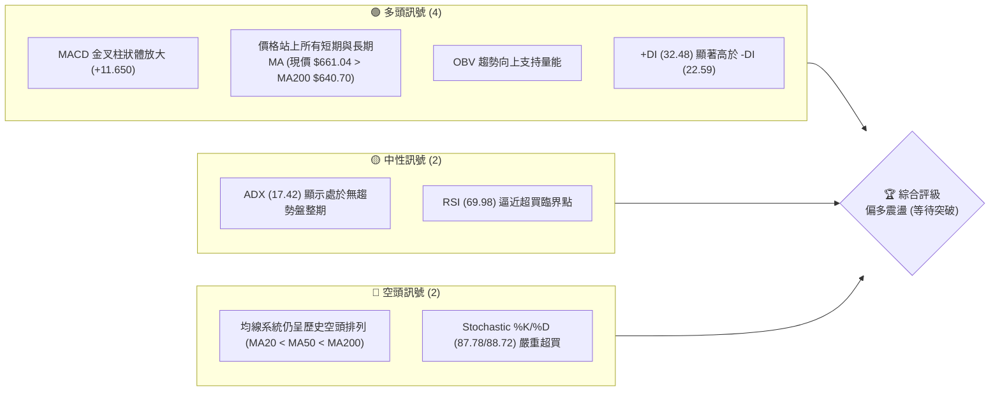

### 📊 核心指標速覽表

| 指標類別 | 指標名稱 | 當前數值 | 訊號 | 解讀 |
|----------|----------|----------|------|------|
| **價格** | 當前價格 | $661.04 | 🟢 多頭 | 價格在過去兩週出現V型暴漲，成功收復 50% 斐波那契回調位 ($656.71)。 |
| **均線** | MA20 | $593.72 | 🟢 多頭 | 價格遠高於 MA20（乖離率 +11.34%），MA20 已拐頭向上。 |
| **均線** | MA50 | $600.84 | 🟢 多頭 | 價格成功站上 MA50，短期多頭動能強勁。 |
| **均線** | MA200 | $640.70 | 🟢 多頭 | 成功收復牛熊分界線 MA200，長線趨勢有轉多跡象。 |
| **動能** | RSI(14) | 69.98 | 🟡 中性 | 數值極度接近 70 超買區，暗示短線不宜盲目追高。 |
| **動能** | MACD | 14.923 | 🟢 多頭 | MACD 柱狀體達 +11.650，多頭動能正處於爆發階段。 |
| **波動** | ATR(14) | $27.64 | 🟡 中性 | 佔股價 4.18%，每日波動幅度適中，提供良好的波段操作空間。 |
| **趨勢** | ADX(14) | 17.42 | 🟡 中性 | ADX < 25 說明市場整體仍處於大箱體盤整，非單邊趨勢行情。 |

### 🏆 技術評分卡

╔══════════════════════════════════════════════════════════════╗
║              技術評分卡 — META (2026-07-15)                  ║
╠══════════════════════════════════════════════════════════════╣
║  趨勢強度      ████████░░░░░░░░░░░░  40/100  🟡 中性         ║
║  動能指標      ████████████████░░░░  80/100  🟢 強勁         ║
║  支撐穩定度    ████████████░░░░░░░░  60/100  🟡 良好         ║
║  成交量配合    ██████████████░░░░░░  70/100  🟢 配合         ║
║  形態完整度    ████████████░░░░░░░░  60/100  🟡 構築中       ║
║  均線排列      ████████░░░░░░░░░░░░  40/100  🔴 偏弱         ║
╠══════════════════════════════════════════════════════════════╣
║  綜合評分      ████████████░░░░░░░░  64/100  🟢 偏多震盪     ║
╚══════════════════════════════════════════════════════════════╝

---

## 2. 趨勢分析

### 🌐 多時框趨勢分析

技術分析的精髓在於多時框的相互驗證。以下為 META 從月線到日線的趨勢收斂路徑：

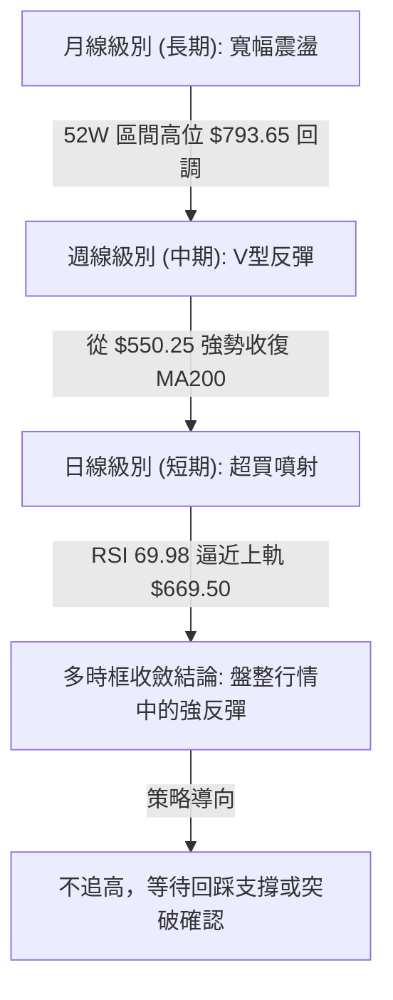

### 📈 長期趨勢 — 12個月走勢圖

以下展示過去 12 個月（2025-08 至 2026-07）的收盤價走勢，可清晰看出 META 經歷了一次完整的「高位回調、探底、再反彈」的箱體結構。

```
META 月線走勢圖（過去12個月）
價格軸 ($)
$770.91 ┤              ●(2025-07 高點)
$736.29 ┤●━━━━━●
$715.22 ┤              ●
$661.04 ┤                                      ● (當前現價)
$646.67 ┤    ●━━━━━●━━━━━━━●━━━━━●         
$571.60 ┤                        ●         ●
$550.25 ┤                            ●(2026-06 底部)
        └──────────────────────────────────────────
         08  09  10  11  12  01  02  03  04  05  06  07  (月份)
```

**走勢特徵分析表**：

| 階段區間 | 價格變動 | 趨勢特徵 | 成交量與動能配合度 |
|----------|----------|----------|--------------------|
| **2025-08 ~ 2025-09** | $736.29 ➔ $732.47 | 高位橫盤整理 | 量能萎縮，多頭動能衰竭，為回調埋下伏筆。 |
| **2025-10 ~ 2025-11** | $646.67 ➔ $646.27 | 快速下殺後平台整理 | 恐慌盤湧出，隨後在 $640 附近獲得暫時性支撐。 |
| **2025-12 ~ 2026-01** | $658.91 ➔ $715.22 | 歲末年初假突破反彈 | 伴隨季節性買盤反彈，但未能突破前高，形成次高點。 |
| **2026-02 ~ 2026-03** | $647.03 ➔ $571.60 | 二次探底與恐慌宣洩 | 跌破前低，市場情緒極度悲觀，賣壓沉重。 |
| **2026-04 ~ 2026-05** | $611.34 ➔ $631.92 | 弱勢反彈與築底 | 成交量溫和，市場進入多空拉鋸期。 |
| **2026-06 ~ 2026-07** | $563.29 ➔ $661.04 | **強力V型反轉** | 週成交量在探底 $550.25 後爆發性放大，多頭強力接盤。 |

### 📊 中期趨勢（週線分析）

從近 20 週的收盤走勢來看，META 經歷了極為戲劇性的洗盤：
1. **築底階段**：在 2026-06-28 創下 $550.25 的波段低點（極度接近 52W 低點 $519.78），此時 RSI 跌至 35.3，市場呈現超賣。
2. **爆發階段**：隨後兩週（2026-07-12 與 2026-07-19），週成交量分別暴增至 117,030,000 與 36,586,854（換算單週仍極高），股價在短短兩週內從 $550.25 飆升至 $661.04，漲幅高達 **20.1%**。

```
週線級別壓力與支撐結構示意圖
════════════════════════════════════════════════════════════
[阻力區]   $709.16 (R3) ────────────────────────── (中期強阻力)
           $690.88 (R2) ────────────────────────── (波段頸線阻力)
                                 ▲ [當前價格 $661.04]
[支撐區]   $636.95 (S1) ────────────────────────── (短期回踩支撐)
           $627.03 (S2) ────────────────────────── (中期防守關鍵)
           $595.08 (S3) ────────────────────────── (波段起漲點)
════════════════════════════════════════════════════════════
```

### ⚡ 趨勢強度評估（ADX 解讀）

雖然短期價格走勢極為凌厲，但從量化指標 **ADX(14)** 來看，當前數值僅為 **17.42**。

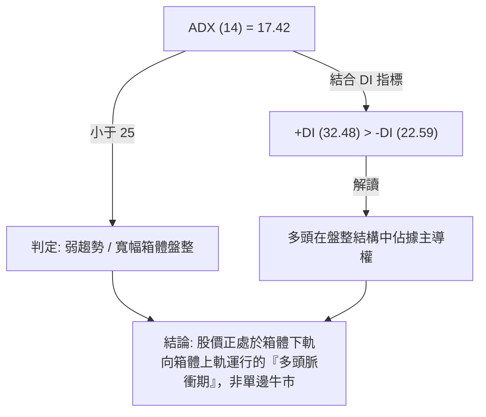

**ADX 趨勢強度對照表**：

| ADX 數值區間 | 趨勢狀態 | META 當前狀態 (17.42) | 交易策略導向 |
|--------------|----------|-----------------------|--------------|
| **< 20** | **極弱趨勢 / 盤整** | **✓ 處於此區間** | **高拋低吸，以布林通道與歷史支撐阻力為主** |
| **20 - 25** | 趨勢形成中 | ❌ 否 | 觀望，等待突破 |
| **25 - 50** | 強趨勢 | ❌ 否 | 順勢交易，均線金叉/死叉進場 |
| **> 50** | 極強趨勢 | ❌ 否 | 尋求極端超買/超賣的反轉機會 |

---

## 3. 圖表形態分析

### 🔍 形態識別系統

在日線與週線圖表上，META 呈現出一個非常標準的**雙底（Double Bottom，俗稱 W 底）**築底形態。

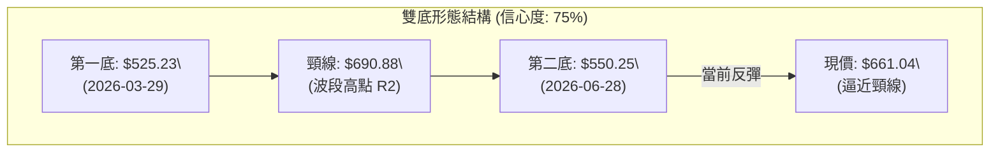

**形態信心度與判斷依據**：

| 識別形態 | 信心度 | 判斷依據（引用數據） | 完成度 | 目標價（附計算式） |
|----------|--------|----------------------|--------|--------------------|
| **雙底 (W底)** | **75%** | 1. 第一低點 $525.23 與第二低點 $550.25 形成中期雙底結構，低點未跌破 52W 低點 $519.78。<br>2. 第二底成交量（1.21億）顯著大於第一底，符合「無量一底、放量二底」的經典技術特徵。 | **85%** | **$856.53**<br>*(計算式：頸線 $690.88 + 形態高度 ($690.88 - $525.23) = $856.53)* |
| **V型反轉** | **55%** | 自 2026-06-28 低點以來，連續兩週以大陽線收復多條均線，但由於上方阻力重重，此形態通常需要回踩確認。 | **60%** | **$770.83**<br>*(計算式：起跌點 $550.25 + 兩週漲幅 $110.79 = $661.04，若維持同等動能延伸至 $770.83)* |

### 🕯️ 重要K線形態分析

觀察最近幾週的 K線 組合，多頭反攻訊號極為明確：

| 日期/週 | 收盤價 | K線形態 | 解讀 | 訊號 |
|------|--------|---------|------|------|
| **2026-06-28** | $550.25 | **錘頭線 (Hammer)** | 帶有長下影線，回測 52W 低點未破，買盤強力介入。 | 🟢 強烈看多 |
| **2026-07-05** | $582.90 | **大陽線 (Marubozu)** | 實體大陽線，收復 5 日與 10 日均線，確認底部成立。 | 🟢 看多 |
| **2026-07-12** | $669.21 | **長陽突破 (Breakout)** | 伴隨 1.17 億股的巨量，一舉突破 MA200，多頭全面主導。 | 🟢 極強看多 |
| **2026-07-19** | $661.04 | **高位十字星 (Doji)** | 在布林上軌附近收窄，顯示短線多空力量暫時平衡，面臨回調壓力。 | 🟡 中性偏空 |

### 📉 ASCII 走勢形態示意圖

```
META 雙底（W底）形態與突破路徑示意圖
價格 ($)
$709.16 ┤                                         
$690.88 ┤          ★ 頸線位置 (R2) ─────────────── 進場點 B (突破買入)
        │         ╱  ╲                           
$661.04 ┤        ╱    ╲          ● 現價          
        │       ╱      ╲        ╱                
$636.95 ┤      ╱        ╲      ╱ ◄─────── 進場點 A (回踩買入)
        │     ╱          ╲    ╱                  
$550.25 ┤    ╱            ●──┘ (第二底: 放量)    
$525.23 ┤  ●┘ (第一底)                           
        └─────────────────────────────────────────
          3月              5月       6月       7月 (時間)
```

---

## 4. 支撐與阻力

### 🗺️ 關鍵價位分布圖

基於歷史成交量密集區與波段高低點，META 當前的價格結構分布如下：

```
META 價位結構分布圖
═══════════════════════════════════════════════════
$709.16 ║████████████████████████║ 強阻力 R3 (密集套牢區)
$690.88 ║████████████████████    ║ 阻力 R2 (W底頸線)
$671.98 ║████████████████████████║ 關鍵阻力 R1 (布林上軌附近)
$661.04 ╠════════════════════════╣ ◄ 當前現價
$636.95 ║▓▓▓▓▓▓▓▓▓▓▓▓▓▓▓▓        ║ 近期支撐 S1 (MA200 支撐)
$627.03 ║████████████████████████║ 強支撐 S2 (密集成交區)
$595.08 ║████████████████████████║ 波段起漲點 S3
═══════════════════════════════════════════════════
```

### 🚧 阻力位分析表

| 阻力級別 | 價位 | 形成原因 | 突破難度 | 重要性 |
|----------|------|----------|----------|--------|
| **R1 (關鍵阻力)** | **$671.98** | 近一年波段高點聚類，且極度接近日線布林通道上軌（$669.50）。 | 🟡 中等 | 此處為短線多頭的「試金石」，若能日線收盤站穩此處，將直接挑戰頸線。 |
| **R2 (波段頸線)** | **$690.88** | 2026-04-19 的週線高點，亦是雙底形態的頸線，此處套牢盤極重。 | 🔴 極高 | 決定中期趨勢是否徹底反轉為牛市的「分水嶺」。 |
| **R3 (強阻力)** | **$709.16** | 2026-01 月高點密集區，斐波那契 23.6% ($729.02) 下方的最後防線。 | 🔴 極高 | 突破此處則上方無重大阻力，直指 52W 高點 $793.65。 |

### 🛡️ 支撐位分析表

| 支撐級別 | 價位 | 形成原因 | 守住機率 | 重要性 |
|----------|------|----------|----------|--------|
| **S1 (近期支撐)** | **$636.95** | 接近長期牛熊分界線 MA200 ($640.70) 與週線密集區。 | 🟢 高 | 短期多頭防線，回踩不破此處代表買盤強勁。 |
| **S2 (強支撐)** | **$627.03** | 2026-04-12 週線起漲點，且接近 61.8% 斐波那契回調位 ($624.40)。 | 🟢 極高 | 中期多空攻防的底線，跌破此處代表 W 底構築失敗。 |
| **S3 (波段起漲點)** | **$595.08** | 接近 MA20 ($593.72) 與布林中軌，為前一波上漲的發動起點。 | 🟢 極高 | 極強長線買盤支撐區。 |

### 📐 斐波那契回調位分析

（基準：52週高點 $793.65 ➔ 52週低點 $519.78）

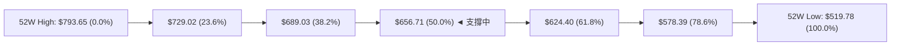

*   **當前位置解讀**：現價 **$661.04** 剛好站穩在 **50.0% 回調位 ($656.71)** 之上。這在技術面上是一個非常積極的訊號，代表空頭波段的跌幅已被收復一半。
*   **下一步動態**：若能在 $656.71 之上站穩 3 個交易日，股價將順理成章向 **38.2% 回調位 ($689.03)** 發起衝擊，該價位與 R2 阻力位 ($690.88) 高度重合，形成共振阻力帶。

---

## 5. 技術指標深度解讀

### 🎛️ 指標訊號總覽

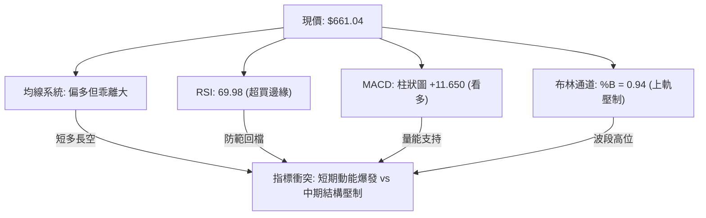

### 📈 移動平均線排列分析

雖然現價 $661.04 已經站上所有主要均線，但由於前期的深幅回檔，均線系統目前仍呈現**歷史空頭排列（MA20 < MA50 < MA200）**。

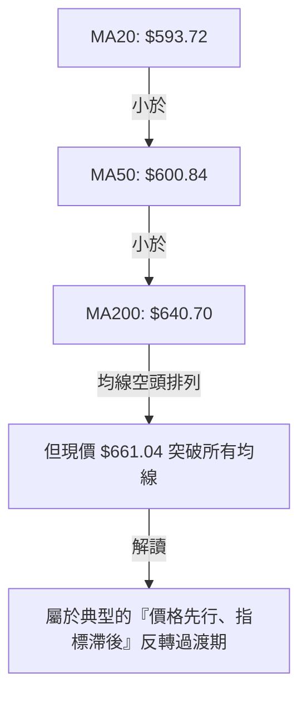

*   **MA5 ($644.32) & MA10 ($619.65)**：均呈現急劇斜率向上攀升，短期多頭掌握絕對控制權。
*   **MA200 ($640.70)**：股價已成功突破此牛熊分界線。只要未來一週收盤價不跌破 $640.70，中長期趨勢將正式由空轉多。

### 📉 RSI(14) 分析

RSI 目前數值為 **69.98**。

```
RSI (14) 強度指示器
░░░░░░░░░░░░░░░░░░░░░░░░░░░░░░░░███████████████ 69.98 (超買臨界點)
[0]                            [50]           [70]       [100]
```

*   **背離分析**：將當前日線 RSI 與 2026-04-19 的高點（當時股價 $687.91，RSI 高達 96.5）進行對比，目前股價在 $661.04，RSI 為 69.98。**未發現明顯的頂背離或底背離**，動能與價格走勢基本相符。
*   **超買警示**：RSI 達 69.98 且 Stoch %K/%D 均在 87 以上，顯示短線買盤已推升至極致，短線追高的風險報酬比極低。

### 📊 MACD(12/26/9) 訊號解讀

*   **MACD 線**：14.923
*   **訊號線 (Signal)**：3.273
*   **柱狀圖 (Histogram)**：**+11.650** 🟢

MACD 在零軸上方完成黃金交叉，且柱狀體持續放大，這表明**短期上漲動能極強**。這種強烈的多頭脈衝通常能支撐股價在回調時獲得強力買盤支撐。

### 📦 布林通道分析

*   **BB上軌**：$669.50
*   **BB中軌 (MA20)**：$593.72
*   **BB下軌**：$517.95
*   **BB %B**：**0.94**

當前現價 $661.04 處於布林通道的極高位（%B = 0.94），極度貼近上軌 $669.50。在 ADX < 25 的盤整行情中，布林上軌通常會構成強烈的壓制。若無法放量突破 $669.50 ~ $671.98 (R1) 阻力帶，股價大概率會向中軌 $593.72 進行技術性回踩。

### 💹 成交量分析（量價配合度）

*   **量能表現**：最新成交量為 16,746,154，相較於 20 日均量 (20,529,543) 略顯不足（量比 0.82x）。
*   **OBV (能量潮)**：OBV > MA，量能呈現階梯式上揚，支持此波上漲。
*   **解讀**：在突破 MA200 關鍵位置時有放量，但在逼近 $660 以上高位時，成交量略有萎縮。這是一種**「量價背離」**的隱憂，暗示高位跟風買盤開始謹慎，需要提防無量衝高後的快速回落。

---

## 6. 動能與波動率

### ⚡ 動能評估四象限

根據「動能強度」與「波動率」兩大維度，META 當前定位如下：

| 象限 | 動能 (RSI/MACD) | 波動 (ATR/BB) | 當前狀態 | 評估與交易指南 |
|------|-----------------|---------------|----------|----------------|
| **Q1 (高動能/低波動)** | 強 | 低 | ❌ 否 | 最佳安全做多區間。 |
| **Q2 (強動能/高波動)** | **強** | **高** | **✓ 處於此區間** | **當前狀態。短期動能極強，但 ATR 達 4.18%，波動劇烈。適合高拋低吸，嚴格控制止損。** |
| **Q3 (弱動能/高波動)** | 弱 | 高 | ❌ 否 | 恐慌殺跌區，避免介入。 |
| **Q4 (弱動能/低波動)** | 弱 | 低 | ❌ 否 | 橫盤死水，資金效率低下。 |

### 📊 ATR 波動率分析

*   **ATR(14)**：**$27.64**
*   **波動比率**：4.18%（佔當前股價）
*   **止損距離建議**：
    *   **短線交易 (1.5倍 ATR)**：$27.64 × 1.5 = **$41.46**。若在現價 $661.04 進場，合理止損應設在 $619.58 之下。
    *   **波段交易 (2.0倍 ATR)**：$27.64 × 2.0 = **$55.28**。

### 📐 Beta 與市場相關性

*   **Beta 值**：**1.246**
*   **解讀**：META 具有高於大盤（S&P 500）約 24.6% 的波動敏感度。在大盤上漲時，其具有更強的彈性；但在市場系統性調整時，跌幅亦會放大。當前高 Beta 屬性配合強動能，適合做為進攻型配置，但需嚴防系統性風險。

---

## 7. 多時框架總結

### 📋 時框架評分表

| 時框架 | 趨勢方向 | 動能 | 均線排列 | 形態 | 綜合評分 | 交易建議 |
|--------|----------|------|----------|------|----------|----------|
| **日線 (短期)** | 🟢 強勢上漲 | 🔴 超買 | 🟢 站上全均線 | 🟡 雙底構築中 | **75/100** | 不宜追高，等待回踩 S1 買入。 |
| **週線 (中期)** | 🟢 V型反彈 | 🟢 多頭爆發 | 🔴 空頭排列 | 🟢 雙底確認 | **65/100** | 中期趨勢轉佳，回調皆為買點。 |
| **月線 (長期)** | 🟡 寬幅震盪 | 🟡 中性 | 🟡 走平 | 🟡 箱體整理 | **50/100** | 長期處於 $520 - $790 大箱體。 |

### 🔲 綜合訊號矩陣

```
            短期 (日線)    中期 (週線)    長期 (月線)
趨勢方向       🟢             🟢             🟡
動能指標       🔴 (超買)      🟢             🟡
均線系統       🟢             🔴             🟡
```

### ⚖️ 多時框收斂結論

*   **收斂判定**：由於當前 **ADX(14) = 17.42 < 25**，市場在中長期本質上仍定義為**「盤整/箱體行情」**。
*   **主導區間**：日線布林通道上下軌 **$517.95 ~ $669.50**。
*   **唯一方向性結論**：**偏多震盪，但短線面臨布林上軌壓制，不可追多**。中期 W 底形態支持股價震盪上行，但必須經歷一次對 MA200 ($640.70) 或 S1 ($636.95) 的回踩確認，方能蓄勢突破 R2 ($690.88) 頸線。

---

## 8. 交易策略建議

### 🗺️ 策略決策流程圖

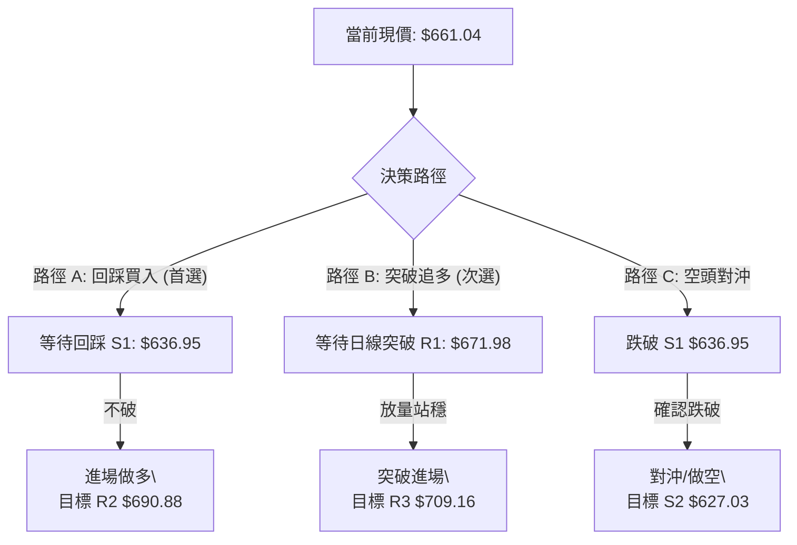

### 🧭 策略路由

*   **當前主策略方向**：**偏多操作，但採取「回踩买入」與「突破買入」雙軌制，嚴禁現價追高（依據技術評分 64/100 判定）。**

### 🎯 價格情境階梯 (Price Scenarios)

| 觸發條件 | 下一目標 | 後續延伸 | 情境含義 |
|----------|----------|----------|----------|
| **突破 R1 ($671.98)** | R2 ($690.88) | R3 ($709.16) | 短線強勢多頭確立，W 底頸線面臨考驗。 |
| **站穩 50% 斐波位 ($656.71)** | R1 ($671.98) | — | 區間強勢震盪，以時間換取空間。 |
| **跌破 S1 ($636.95)** | S2 ($627.03) | S3 ($595.08) | 短期反彈夭折，重新回測中期支撐。 |

### 📊 情境機率分佈

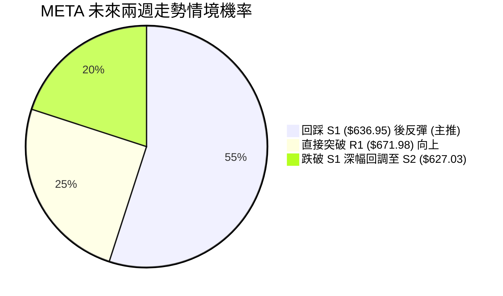

### 🟢 主策略詳情

#### 🥇 策略 A：回踩支撐做多（主推策略，勝率較高）

*   **進場條件**：股價短線回調，在 **$636.95 (S1)** 附近企穩（日線收盤未跌破）。
*   **進場價格**：**$636.95**
*   **目標價 T1**：**$671.98** (阻力 R1)
*   **目標價 T2**：**$690.88** (W底頸線 R2)
*   **止損價格**：**$624.40** (跌破 61.8% 斐波那契位與 S2 $627.03，代表反彈失敗)
*   **風險報酬比**：**1 : 4.3**
    *   *最大風險：$636.95 - $624.40 = $12.55*
    *   *最大利潤：$690.88 - $636.95 = $53.93*
*   **成功機率**：**65%**
*   **建議倉位**：**15%**

#### 🥈 策略 B：突破頸線做多（突破型策略）

*   **進場條件**：日線收盤強勢突破 **$671.98 (R1)**，且 15 分鐘 K 線放量站穩。
*   **進場價格**：**$672.50**
*   **目標價 T1**：**$690.88** (阻力 R2)
*   **目標價 T2**：**$709.16** (阻力 R3)
*   **止損價格**：**$656.71** (重新跌回 50% 斐波那契位之下，判定為假突破)
*   **風險報酬比**：**1 : 2.3**
    *   *最大風險：$672.50 - $656.71 = $15.79*
    *   *最大利潤：$709.16 - $672.50 = $36.66*
*   **成功機率**：**55%**
*   **建議倉位**：**10%**

### 🔴 反向風險觸發點（對沖提示）

*   **觸發訊號**：若日線收盤價**跌破 $636.95 (S1)**，且 MACD 柱狀體開始萎縮。
*   **風控行動**：多頭倉位應立即減半，並可買入適量 **Strike Price $625 的 Put 期權**進行對沖，防範股價快速下探至 **$595.08 (S3)**。

### ⭐ 整體訊號強度評星

*   **做多訊號強度**：★★★★☆ (4/5星 - 短期動能強勁，W底成型)
*   **做空訊號強度**：★☆☆☆☆ (1/5星 - 暫無做空依據，僅防範超買回調)
*   **整體可信度**：  ★★★★☆ (4/5星 - 多時框指標共振度高)

---

## 9. 風險提示與監控

### ✅ 關鍵監控指標 Checklist

╔══════════════════════════════════════════════════════════════╗
║                    每日交易監控 Checklist                    ║
╠══════════════════════════════════════════════════════════════╣
║  [ ] 價格是否跌破 50% 斐波那契位 $656.71？                    ║
║  [ ] 日線 RSI(14) 是否突破 70 進入極端超買區？                ║
║  [ ] MACD 柱狀體是否出現首根「綠柱縮短」？                    ║
║  [ ] 突破 R1 $671.98 時，成交量是否大於 20 日均量 (20.5M)？    ║
║  [ ] 下方 MA200 $640.70 是否發揮支撐作用？                    ║
╚══════════════════════════════════════════════════════════════╝

### ⚠️ 風險場景分析

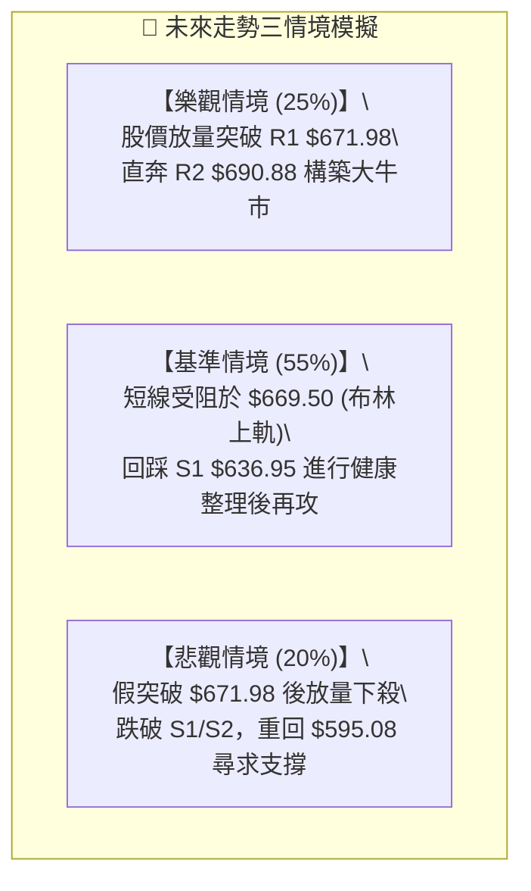

### 🛡️ 風險管理重要提醒

1.  **防範假突破**：目前 RSI 處於高位，若股價觸及 R1 ($671.98) 但成交量低於 15,000,000，切勿盲目追多，此時假突破概率極高。
2.  **嚴格執行移動止損**：由於 META 的 Beta 值高達 1.246，一旦市場情緒逆轉，回撤速度將極快。若採用策略 A 進場，當利潤達到 1 倍 ATR ($27.64) 時，應立即將止損價移至保本價（進場成本）。
3.  **大盤共振風險**：隨時關注 S&P 500 與 Nasdaq 100 指數是否同樣處於超買區。若大盤開始調整，META 作為權重股將難以獨善其身。

---

## 📋 報告總結

╔══════════════════════════════════════════════════════════════╗
║                    META 技術分析報告總結                     ║
╠══════════════════════════════════════════════════════════════╣
║  報告日期：2026-07-15                                        ║
║  當前價格：$661.04                                           ║
║  分析評級：⚖️ 偏多震盪 (不宜追高，靜待回踩)                  ║
║                                                              ║
║  關鍵結論：                                                  ║
║  ├─ 長期趨勢：🟡 中性 (處於 $520 - $790 寬幅箱體整理)        ║
║  ├─ 中期趨勢：🟢 多頭 (週線兩週暴漲 20%，構築標準 W 底)      ║
║  ├─ 短期趨勢：🔴 超買 (RSI 69.98 逼近上軌，面臨技術性回調)    ║
║  ├─ 關鍵支撐：$636.95 (S1) ｜ $627.03 (S2)                   ║
║  ├─ 關鍵阻力：$671.98 (R1) ｜ $690.88 (R2)                   ║
║  └─ 分析師目標價：$826.63 (Mean)                             ║
║                                                              ║
║  最優策略組合：                                              ║
║  1. 🥇 最佳機會：等待回踩 $636.95 (S1) 企穩做多，止損設於    ║
║                  $624.40，目標直指 $690.88 (R2)。            ║
║  2. 🥈 次選機會：若放量突破 $671.98 (R1)，輕倉追多，目標     ║
║                  $709.16 (R3)，止損設於 $656.71。            ║
╚══════════════════════════════════════════════════════════════╝

---

> ⚠️ **免責聲明**：本報告為 AI 自動生成之技術分析，所有數據及估算均基於提供的歷史價格資訊。本報告**僅供研究與學術參考**，**不構成任何投資建議**。投資有風險，入市需謹慎。

---

*報告生成時間：2026-07-15 ｜ 數據來源：Yahoo Finance ｜ 分析框架：多時框技術分析*