<details>
<summary>📊 靜態圖表 (點擊展開)</summary>
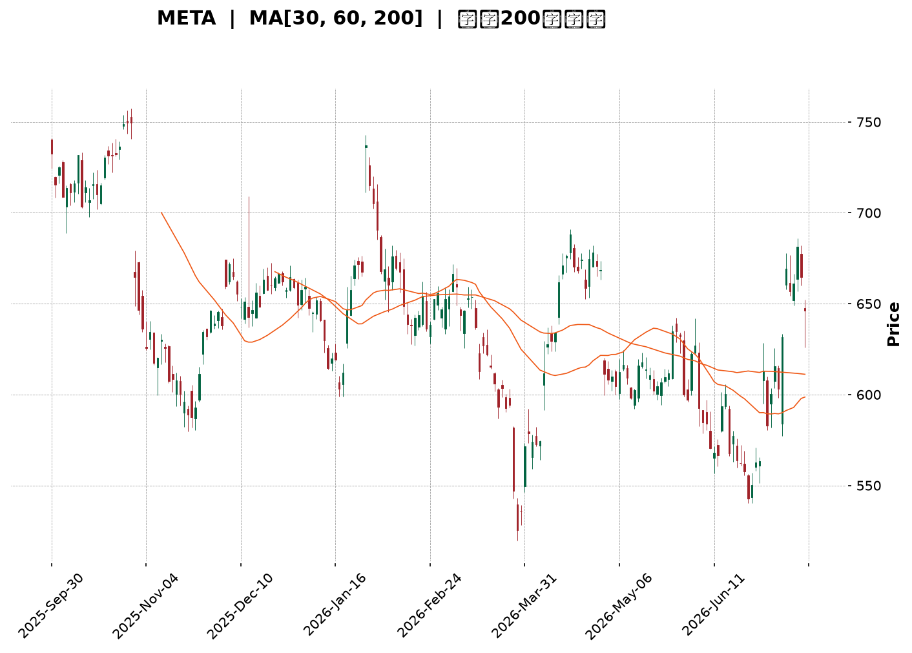
</details>

<html>
<head><meta charset="utf-8" /></head>
<body>
    <div style="height:500px; width:100%;">                        <script>window.PlotlyConfig = {MathJaxConfig: 'local'};</script>
        <script charset="utf-8" src="https://cdn.plot.ly/plotly-3.7.0.min.js" integrity="sha256-jvTGqxNp8AGWEcvNLVuKr+8j5dGe9Yw51LQkmDH+IYA=" crossorigin="anonymous"></script>                <div id="candlestick-chart" class="plotly-graph-div" style="height:100%; width:100%;"></div>            <script>                window.PLOTLYENV=window.PLOTLYENV || {};                                if (document.getElementById("candlestick-chart")) {                    Plotly.newPlot(                        "candlestick-chart",                        [{"close":{"dtype":"f8","bdata":"AAAAwMzjhkAAAABg1VuGQAAAAOBPqYZAAAAA4LslhkAAAACgbU6GQAAAAIDXOYZAAAAA4NJfhkAAAACg29yGQAAAAGDD+4VAAAAAQL9OhkAAAABgfhaGQAAAAECCXYZAAAAAYMgxhkAAAABge1iGQAAAAEAq0oZAAAAAgPHahkAAAABgD9yGQAAAAIDE4IZAAAAAgI4Dh0AAAACA+maHQAAAAODsa4dAAAAAoMJth0AAAADA7cWEQAAAAGBYNYRAAAAAIHLgg0AAAACgio2DQAAAAABn0oNAAAAA4KxKg0AAAABAx2CDQAAAAED4sINAAAAAYKCLg0AAAAAAcfuCQAAAAKB2AoNAAAAAQAj\u002fgkAAAABAlsOCQAAAAOAdoYJAAAAAQE9mgkAAAABA+VyCQAAAAACrhYJAAAAAYK0bg0AAAABgjtSDQAAAACC7v4NAAAAAQCcyhEAAAADgqPmDQAAAAOBeK4RAAAAAwIbvg0AAAAAAg56EQAAAAIBi\u002fYRAAAAA4I\u002fIhEAAAADgC3qEQAAAAGCMQ4RAAAAAgCJYhEAAAABAeBSEQAAAAEDbMoRAAAAAwNZ\u002fhEAAAACAv0KEQAAAAKAiuoRAAAAAoMaMhEAAAACgk6KEQAAAAEAMvoRAAAAAIOTShEAAAAAA37CEQAAAACAjjIRAAAAAIB3GhEAAAABAUZeEQAAAAOADSoRAAAAAgO+MhEAAAADAjJuEQAAAAKBHPIRAAAAA4EYnhEAAAABALV+EQAAAAICdBoRAAAAAALuvg0AAAABgZDODQAAAAICOXYNAAAAAICpZg0AAAADAWtiCQAAAAODyHoNAAAAAgNAzhEAAAABAsoyEQAAAAGBN+YRAAAAAYCz+hEAAAABgUNyEQAAAAID2B4dAAAAAIMtZhkAAAACANwmGQAAAACC\u002fk4VAAAAA4GPehEAAAAAAIuiEQAAAAABCooRAAAAA4BwghUAAAACgNOyEQAAAAKD+24RAAAAAQDlFhEAAAAAADPWDQAAAAIA28YNAAAAA4JgQhEAAAAAgDh2EQAAAAKDwc4RAAAAAIOzgg0AAAAAAS\u002fGDQAAAAGA1ZIRAAAAAoLh+hEAAAAAANTiEQAAAAIArY4RAAAAAAE9vhEAAAAAAVNSEQAAAAIAmm4RAAAAAoLEdhEAAAAAA5jGEQAAAACA+Z4RAAAAAII1thEAAAABgWeiDQAAAAADwJINAAAAAwPOWg0AAAADgqnCDQAAAACDhOINAAAAAIBvxgkAAAADg4YiCQAAAAGAB3IJAAAAAwPeCgkAAAACgtpKCQAAAAIBDGIFAAAAAgN1pgEAAAAAgEb+AQAAAAEDN3IFAAAAAoIwVgkAAAADAbO+BQAAAAGDq44FAAAAA4CP0gUAAAADA0h6DQAAAACB3noNAAAAAwDaqg0AAAABAis+DQAAAACADr4RAAAAAYKr3hEAAAAAg8iGFQAAAAKBMf4VAAAAAYE\u002fyhEAAAAAAxOGEQAAAAADDEIVAAAAAQFGUhEAAAABgPROFQAAAAODuL4VAAAAAQL\u002f1hEAAAADgAOSEQAAAAEC\u002fGoNAAAAAoH0Bg0AAAAAgwg6DQAAAAOAy44JAAAAAAIAig0AAAAAg6UGDQAAAACCGCINAAAAAoHGygkAAAACAiNOCQAAAAOB4QINAAAAA4NtOg0AAAABASi2DQAAAAAAnFYNAAAAAgGrQgkAAAACA\u002f+OCQAAAAGCK9oJAAAAAQI8Ng0AAAAAgLx6DQAAAAOBf1YNAAAAAIJ3Vg0AAAAAAZb+DQAAAAMBPv4JAAAAA4JyogkAAAACgOXODQAAAAEDpl4NAAAAAgJuDgkAAAACgyEaCQAAAAMBjQIJAAAAAQJzTgUAAAACgOr+BQAAAAMCjs4FAAAAAANeLgkAAAAAgrsGCQAAAAOCjvIFAAAAAgMIJgkAAAADAzJ6BQAAAAKCZkYFAAAAAIFxtgUAAAADA9faAQAAAAAAAMoFAAAAAwMyUgUAAAADgUZqBQAAAAKBHJ4NAAAAAQDM3gkAAAADgUcKCQAAAAOCjPINAAAAAwPXYgkAAAAAA17uDQAAAACCu6YRAAAAAANeFhEAAAADgUaiEQAAAAOB6SoVAAAAA4FHEhEAAAACAFDCEQA=="},"high":{"dtype":"f8","bdata":"cxJUXVcoh0DqOkLK0X+GQBW0vqwOr4ZAnPF9aNTIhkAac7vEKViGQIdNjtQWZYZAm2drIkRuhkAAAACg29yGQK9+vMfm6oZAVRhIOZRwhkBkKJ\u002fXjE2GQIenoWMtkIZAXYw0NN2chkCY072EaGWGQOJ105\u002fu3oZAeZY4t6wEh0CSopJNbhWHQGfjEXLfI4dAm3m9O0wah0CN6PfuUI6HQDUu1gV2o4dAZqT3VIaph0Aj+NBkjDmFQCG8YWEdCYVAfcReA\u002fWMhEAqVSkkmgCEQNZI4wKDBIRAdi96Hc3Sg0Dm9NAkIWSDQGmdlInSyoNAz2IWM2qfg0B\u002fMhna3ZqDQFe1HOZhQINAsCqhVLQgg0BjEOpy0xCDQGmwyKjA0IJALjZHIkmOgkC26MwnK+mCQHB+ujCMpIJABGm0O804g0BDmhvXLduDQDGm3OOh5YNAJBQHePMyhEDrjIjbKh2EQATOuciDMYRALGeJm1U5hEBDzy\u002fYxBKFQFXyu8CEB4VAyq\u002fg+aIXhUAb0GrMDLaEQMRLF1t\u002fZoRAWKuvOKRshEDDK2SBPimGQHtE2LqyXoRAdRwIuOGqhECf44+5a6CEQLbYG5jt6oRAEa50BnHuhEBu2z9yCwOFQDgLa0KDxoRAKIThE+zXhEC0r+wbEt6EQO3vrk+YmIRAwRSyIi\u002f4hEAqNVH4hr6EQPX6aAWouYRAE24iiNq6hEB31rYhrsKEQNE5UJvPj4RAhCQe9ZQvhEDwE3wbRW6EQOB+rr1xZoRAL3f02gIJhEAkJBjZpZqDQC8d6\u002fV3eINAbFuozK2fg0Cw5dOzfRKDQH7D5GJaSYNAtM2ZbyabhECNgMkPbcqEQE4NAPqeEIVAGjfFNeschUD6BMhcySOFQLK0G+BmNYdAdwQgG+7WhkDp5wbzH4CGQNiqVjzJXYZAlg4Y5tN8hUBCROGzSkKFQKOvx\u002flY9oRA05ibCr9QhUC\u002fgOUpgTuFQKOYBOt7MIVASeyR3l4WhUCwaAAbKVKEQGJh1U2lC4RAI4U\u002f4s8ehED1kBr2TDCEQPei8bRZsYRAgXWoLDuEhEDKEj1Gv\u002f+DQLx1oM65ZYRACPwwk5WehEAx8sHnREKEQAek0XseloRA2IMqj+6OhEALzt2ek\u002fyEQAaULs8L7IRA5GRMEIJChEDnOvLvxTSEQEog12f+mIRAgqH3FpKPhEDy+u7hsGKEQI2Dkp5loINAZaYTSEzRg0AL2g1Jr9+DQMZHa4iWcINAJDGdjXUjg0A6adjXNNuCQKi6k5CcAINADdx1TYzDgkBpeptZ49iCQAMyl2CuM4JAmOJt18X4gECFRSQ9Z9iAQDdjpSpF6YFAnDrgvQKAgkDZ1Lv2tg+CQN95HbkAMoJAApOeKJT1gUAU5q4B76qDQC6nfxlH54NATX9+1ujvg0BBadrbS9ODQK\u002fZsfkkzYRApWK4YPkuhUBBHUznnieFQHGyIZ4Jl4VAtzVfWvpVhUCQYOxKlxyFQBDCL88DLoVA2Fk7IoXnhEDLsu1NUUCFQOjfbcTxToVACPlah2oshUDygZRlAQ2FQAxQA2wzYoNAE8RZqnRSg0Ac\u002fz2xcyuDQOx8XbE\u002fLoNAT9m19wFbg0Cg+orBNYODQOjym1WXQYNAObb\u002fhszigkABh+YTh9mCQHqjeqybWoNAkT8PMzh5g0Aej2uo\u002f2SDQIfQjfEoOINAKz+SaOQqg0CYlsQMf\u002fuCQMYUN6pICINAUEgr\u002f+wxg0B4aPM1NS+DQBtyKTtF74NAQ33+oDwThEDKceW5TM+DQJudBlhK2YNAlN05iocCg0Ahfv2nk3yDQC7sVgBxDoRAICX2Moqkg0CmEgVXnXuCQC3uUuWcqIJAhffeDS52gkAcHUQIH92BQOBc3uJK\u002fIFAAAAAACnKgkAAAADgeu6CQAAAAOB6joJAAAAAgMIhgkAAAADgev6BQAAAAKCZ4YFAAAAA4FHIgUAAAABguGKBQAAAAMDMZoFAAAAAQDPXgUAAAADgUayBQAAAAIA9ooNAAAAAAAAQg0AAAADgo9yCQAAAAMD1ioNAAAAAAABAg0AAAAAAKcqDQAAAAEDhLoVAAAAAwPUkhUAAAAAAANSEQAAAAOCjcIVAAAAAQDNPhUAAAACgmWGEQA=="},"hovertemplate":"\u003cb\u003e%{x|%Y-%m-%d}\u003c\u002fb\u003e\u003cbr\u003e\u958b: $%{open:.2f}\u003cbr\u003e\u9ad8: $%{high:.2f}\u003cbr\u003e\u4f4e: $%{low:.2f}\u003cbr\u003e\u6536: $%{close:.2f}\u003cextra\u003e\u003c\u002fextra\u003e","low":{"dtype":"f8","bdata":"C1gfzVOjhkDKBcGO3CKGQAjztZU3YoZA+cHTpLMihkCWIHUcwIWFQH9RL5Fa\u002f4VAD\u002fq\u002fqMoPhkBoyfcvvDSGQOuiZbJ19YVAXCY6Mm8OhkCjx8mDIMyFQIwPxhZbHYZASczHwm7whUAZ6GpgTgKGQJI3UXN+coZAczg7g+C2hkA6OsEUN5GGQIOLEgiW2YZA6wkUzgbKhkCc\u002f7uNjlCHQHBpoTOwPIdA8Xlaqqskh0CWXMn43UOEQFctxsQpH4RALQbxwDzUg0ARJKi1FoODQPfNLT5Rh4NA7U90vixDg0BPlPS1H72CQI3TK4QNRINA4K7VGkROg0Bv7HQWjPGCQDzpqXp8y4JAcOlSgj+NgkClLsgd2I6CQB+YsSUgMoJAsw5oD\u002fAdgkBQpWuQsS6CQPqMqxLOIoJA261ILKOggkCHQap0kUWDQE681KTur4NAtD+1xM\u002fOg0B4AuUl2OCDQEzDUHlR44NAkwgWRCvfg0DSGO28s5KEQAIQGblfpYRAyEPbEMK6hEAioGdbKV2EQFtD7iDZDYRAaa4gBhr5g0DckNBboOeDQKdmiICA7INA\u002fQd+\u002f28QhED6KQ04WkCEQI6F8UJUeoRACtnUZhCIhECjKOCP2HuEQGnPlYWfiIRAqXVI4iqohEDhWB6vI6GEQHN3M27MaYRAyZIOc1mFhECDydNeIJKEQIa6kXLVEoRA1gBI4sU0hEC3MksM6lWEQN5dFIZLHYRAgAQKNbTUg0CqVBBcpA2EQKvuzLK0AIRAlAaK3eh3g0DCnYBNzS2DQMh3eRUXKYNAzmewns5Xg0DfVSoGdLeCQOHvBpgXuIJAL2Osf3mLg0Dl1OSOaxqEQGDAYF7moIRAesjbzc+7hED0zTi3T8eEQOk5NvA\u002fOoZAr7WiHI5ChkC+af5pI\u002fKFQJ4BsmqAaYVAlTFSFCzShEAN6CzQsGKEQGIZ4m3KKoRAMGPAHtuMhEAPey9kx+SEQFWZ4INwf4RAT8DoZAwhhECfUmVWhcuDQBggTkFxnYNAeFqYlECYg0CpELCEsNyDQIgNZA4k7YNAnaXzrvDWg0DJ8HVC4Z6DQCkURh75B4RAME\u002f1zcYyhEApkDHP3ueDQOV61yH2yoNA5cnkuJ7tg0DIWoXP\u002fYOEQJr5Lmo3SYRAwy2oiNHXg0DfPdnnT42DQE2XPD3BPoRAUHw61KQ5hEByp+uqIN6DQOhiz2u3A4NA9KnPHy90g0DJAwSy\u002fmiDQNCMbsdTMINA03Rwa57NgkA+DLhnplWCQAxik5Oks4JA6Q4URJ9zgkB+qFfzzYaCQEr6MVLG9oBAqTXC2jk+gEDcpOqdZ4CAQMRm3hccEoFAids9Qk\u002fqgUAaTXY9dHmBQOuxLE\u002fD24FAas9yg+WhgUAJmNOLQXqCQGwUnphic4NA6GfB3AN+g0Bm65k1k36DQCxlhDg59oNAKyvo9Na8hEDsPZerDdmEQL7wB\u002fMJFIVATY2oRA3bhEB3yRFdstWEQNtuvewJ6YRAQ0do8Y9jhEA22EVv4GmEQFmg1EDA8YRA2UcV9BvIhED4pcwRkLmEQNm8xzWOu4JAcuqa4WPsgkC7YX0GidGCQOXQObluvoJAXNVJh16sgkCeDpFTxieDQI0GMoX964JAINqjujWsgkCtuNv4aICCQG9VAB\u002fcoIJAJjEhwXEzg0Cz32N09wWDQJfS40IM2YJAIbgMiPO\u002fgkCgLog\u002fDaqCQHQ3rdYSkoJABfDdphrzgkBVwc956uWCQH2EzCt9A4NAeCked9Glg0BBSQefLnaDQMopVIjMt4JA1u44DQWhgkCEXsiwtr2CQApiXj\u002fUboNARMI0QvYygkDbWGYTeBWCQMLECKrGI4JA73t5uJLQgUDgWE4o9GOBQGZ0xIcLg4FAAAAAYGYagkAAAAAAAICCQAAAACCFsYFAAAAAwMyYgUAAAADgen6BQAAAAAApiIFAAAAAYGZcgUAAAACgcOGAQAAAAEAz44BAAAAAAABwgUAAAACgcDuBQAAAAMDMmIJAAAAAIFwjgkAAAACAFC6CQAAAAKBH3YJAAAAAgBSwgkAAAABgjwiCQAAAAIAUkIRAAAAAoJlxhEAAAABgZkiEQAAAAKBHhYRAAAAAoEehhEAAAAAAAJCDQA=="},"name":"\u50f9\u683c","open":{"dtype":"f8","bdata":"oOWDsJgih0DCCttz8nyGQL\u002fpOx+lhYZAIWbC7+W9hkBxEV+\u002f4vqFQFAnb3ndXoZATGxhcss8hkBOQVKJVWOGQEEq7wMxyIZA5B2dakg5hkByUT8\u002fjQ+GQNNLaVqZWYZAL2b5QoJdhkCbxr9m9wmGQHQmoJWNeoZA50H\u002f4+LwhkCMJL1kad+GQPXv82da5oZAh19Tdwf3hkBabH3qR16HQFhmga1rdYdAfkDpIlaGh0B2sf5CUNuEQA3XMCYVBoVAUChq1GJyhECNis5MSZODQMc5oJZbtYNAJsWEqZrRg0A5ilRbIDeDQOL7Lq+fq4NA2onFnPeSg0DEILorAZSDQO3xGFvWG4NAWFikv9TBgkC2SAdHrvuCQENZftqFcIJAUuT5T3CBgkBvOyjDec+CQJG5HYzJV4JAFSXaoVWpgkCp0CzMDHODQKniDlNJ4INAvUDaj3DTg0Dx61eDIO+DQNci08ljBYRAYZQpEugVhEDigyig+BGFQGjRd2s4soRALsdsYdTchECZbQGSYrCEQKtTy7QcQoRAnu2jS\u002fgMhEBXmSwI6kCEQPwEt\u002flmJIRA8MhtR9UShEDQTxF4inOEQBwz0o7hfoRAMAw52t3JhECnafBTxqOEQLCyK1X\u002floRA3gQ1js2qhEBoR9Ka9taEQHSBzPq0hoRAQXaQGSOMhEDLHLThh7yEQCUIFFNmrIRAfADtfs5OhEDfFDA0KpOEQP1R\u002fufHc4RA8LUI6NYlhEAqmARKUyKEQJe25\u002f3xWoRAL3f02gIJhEBjgYtVE4uDQNjB25UHS4NAo6kea4x4g0Cq4OSJYfaCQLNgqe5G7YJAOUSwqdWhg0DH1SfE+RyEQFLGh72Qv4RA5baVVxwLhUB3uHBVZAqFQDHqhnXvAIdApQTWAqOxhkCp1wDCnkqGQK6RwRriEIZAzwUMCQt0hUATMaftL7OEQJDY1a1wwoRAPJwhM\u002f6vhECtSz3JJSOFQPAk2SJmBoVAodfYWzfmhEBlCUxQnB+EQAcu7dvj8oNAdOUNGl\u002fFg0BJGomlduuDQGsE4Vxo9INA4ePdPQZbhEA088gun7+DQC3TLnIWC4RA8YetDiJLhEDGL4Y\u002fbxKEQA8Ukg404INAL7rcwhU5hEAeMcHAToaEQPdhZMoCpoRA30\u002fwifg1hECgyK67Ms2DQBkBInwrY4RASaZVvcBshEAzoFE0wjyEQL4W9H87doNAdVoef1G7g0C3TIekRJuDQPOglp8nPoNAAAs+aqocg0Afy5UIxdeCQAwlKRjV6YJA74LZp1y0gkDS4fUSfLGCQICzMdiaL4JAFUmleszcgEAAAAAgEb+AQCjfewHEK4FAdI4WK74cgkAeGaJ3IKyBQNDH7aQ9CYJArJinX5nfgUBQy7bMguuCQC2ZXpEdk4NASo3jQQ\u002fPg0B6rNJJVqeDQFvhZKv+FIRAOiRaLw\u002fThED07DmL6RqFQDDCdN7FL4VA16n\u002fLtVFhUBBAGSHB\u002fOEQL6Bwm7iDYVA5MAZ\u002f664hEDKFmMlq52EQO+xK5MH84RAdZUi4OwMhUAoJPUlU+KEQNQtv\u002fL4VYNAZjtnfPcwg0CPdAhPBPuCQMP0QMrvJYNAcPYjj\u002fLDgkBQs7C2NDGDQHUp1O8KNYNAdocJ7BTggkDsvBtjJ5KCQLlnfkE0soJAMAer2287g0DSo4A0XyuDQBuqixteBINA5BK9aNkCg0BCzHBHocGCQC699B6Ou4JARdpkg4n6gkC1IesKnAKDQO7hm6mvBoNAoRwmREP3g0DgvmCfTseDQKu+Xb2HroNA9AlnfHPVgkArW3yDiNOCQE0sYWW9eINAc7Qs3Q93g0CmEgVXnXuCQBudEjifc4JAtxHVwokhgkC3METOcqqBQNyUmQ1b44FAAAAAQDMfgkAAAABAM42CQAAAAAAAgIJAAAAAYI\u002fmgUAAAAAAKeCBQAAAAAAAkoFAAAAAwB6PgUAAAABgZlyBQAAAAGC4+oBAAAAAAACAgUAAAAAghYeBQAAAAKBH\u002f4JAAAAAQDP\u002fgkAAAABguJaCQAAAAGC4\u002fIJAAAAAwB4zg0AAAACA6z+CQAAAAGC4ooRAAAAAQAqrhEAAAAAAAGCEQAAAAMDMvIRAAAAAgD0qhUAAAACgmT2EQA=="},"x":["2025-09-30T00:00:00-04:00","2025-10-01T00:00:00-04:00","2025-10-02T00:00:00-04:00","2025-10-03T00:00:00-04:00","2025-10-06T00:00:00-04:00","2025-10-07T00:00:00-04:00","2025-10-08T00:00:00-04:00","2025-10-09T00:00:00-04:00","2025-10-10T00:00:00-04:00","2025-10-13T00:00:00-04:00","2025-10-14T00:00:00-04:00","2025-10-15T00:00:00-04:00","2025-10-16T00:00:00-04:00","2025-10-17T00:00:00-04:00","2025-10-20T00:00:00-04:00","2025-10-21T00:00:00-04:00","2025-10-22T00:00:00-04:00","2025-10-23T00:00:00-04:00","2025-10-24T00:00:00-04:00","2025-10-27T00:00:00-04:00","2025-10-28T00:00:00-04:00","2025-10-29T00:00:00-04:00","2025-10-30T00:00:00-04:00","2025-10-31T00:00:00-04:00","2025-11-03T00:00:00-05:00","2025-11-04T00:00:00-05:00","2025-11-05T00:00:00-05:00","2025-11-06T00:00:00-05:00","2025-11-07T00:00:00-05:00","2025-11-10T00:00:00-05:00","2025-11-11T00:00:00-05:00","2025-11-12T00:00:00-05:00","2025-11-13T00:00:00-05:00","2025-11-14T00:00:00-05:00","2025-11-17T00:00:00-05:00","2025-11-18T00:00:00-05:00","2025-11-19T00:00:00-05:00","2025-11-20T00:00:00-05:00","2025-11-21T00:00:00-05:00","2025-11-24T00:00:00-05:00","2025-11-25T00:00:00-05:00","2025-11-26T00:00:00-05:00","2025-11-28T00:00:00-05:00","2025-12-01T00:00:00-05:00","2025-12-02T00:00:00-05:00","2025-12-03T00:00:00-05:00","2025-12-04T00:00:00-05:00","2025-12-05T00:00:00-05:00","2025-12-08T00:00:00-05:00","2025-12-09T00:00:00-05:00","2025-12-10T00:00:00-05:00","2025-12-11T00:00:00-05:00","2025-12-12T00:00:00-05:00","2025-12-15T00:00:00-05:00","2025-12-16T00:00:00-05:00","2025-12-17T00:00:00-05:00","2025-12-18T00:00:00-05:00","2025-12-19T00:00:00-05:00","2025-12-22T00:00:00-05:00","2025-12-23T00:00:00-05:00","2025-12-24T00:00:00-05:00","2025-12-26T00:00:00-05:00","2025-12-29T00:00:00-05:00","2025-12-30T00:00:00-05:00","2025-12-31T00:00:00-05:00","2026-01-02T00:00:00-05:00","2026-01-05T00:00:00-05:00","2026-01-06T00:00:00-05:00","2026-01-07T00:00:00-05:00","2026-01-08T00:00:00-05:00","2026-01-09T00:00:00-05:00","2026-01-12T00:00:00-05:00","2026-01-13T00:00:00-05:00","2026-01-14T00:00:00-05:00","2026-01-15T00:00:00-05:00","2026-01-16T00:00:00-05:00","2026-01-20T00:00:00-05:00","2026-01-21T00:00:00-05:00","2026-01-22T00:00:00-05:00","2026-01-23T00:00:00-05:00","2026-01-26T00:00:00-05:00","2026-01-27T00:00:00-05:00","2026-01-28T00:00:00-05:00","2026-01-29T00:00:00-05:00","2026-01-30T00:00:00-05:00","2026-02-02T00:00:00-05:00","2026-02-03T00:00:00-05:00","2026-02-04T00:00:00-05:00","2026-02-05T00:00:00-05:00","2026-02-06T00:00:00-05:00","2026-02-09T00:00:00-05:00","2026-02-10T00:00:00-05:00","2026-02-11T00:00:00-05:00","2026-02-12T00:00:00-05:00","2026-02-13T00:00:00-05:00","2026-02-17T00:00:00-05:00","2026-02-18T00:00:00-05:00","2026-02-19T00:00:00-05:00","2026-02-20T00:00:00-05:00","2026-02-23T00:00:00-05:00","2026-02-24T00:00:00-05:00","2026-02-25T00:00:00-05:00","2026-02-26T00:00:00-05:00","2026-02-27T00:00:00-05:00","2026-03-02T00:00:00-05:00","2026-03-03T00:00:00-05:00","2026-03-04T00:00:00-05:00","2026-03-05T00:00:00-05:00","2026-03-06T00:00:00-05:00","2026-03-09T00:00:00-04:00","2026-03-10T00:00:00-04:00","2026-03-11T00:00:00-04:00","2026-03-12T00:00:00-04:00","2026-03-13T00:00:00-04:00","2026-03-16T00:00:00-04:00","2026-03-17T00:00:00-04:00","2026-03-18T00:00:00-04:00","2026-03-19T00:00:00-04:00","2026-03-20T00:00:00-04:00","2026-03-23T00:00:00-04:00","2026-03-24T00:00:00-04:00","2026-03-25T00:00:00-04:00","2026-03-26T00:00:00-04:00","2026-03-27T00:00:00-04:00","2026-03-30T00:00:00-04:00","2026-03-31T00:00:00-04:00","2026-04-01T00:00:00-04:00","2026-04-02T00:00:00-04:00","2026-04-06T00:00:00-04:00","2026-04-07T00:00:00-04:00","2026-04-08T00:00:00-04:00","2026-04-09T00:00:00-04:00","2026-04-10T00:00:00-04:00","2026-04-13T00:00:00-04:00","2026-04-14T00:00:00-04:00","2026-04-15T00:00:00-04:00","2026-04-16T00:00:00-04:00","2026-04-17T00:00:00-04:00","2026-04-20T00:00:00-04:00","2026-04-21T00:00:00-04:00","2026-04-22T00:00:00-04:00","2026-04-23T00:00:00-04:00","2026-04-24T00:00:00-04:00","2026-04-27T00:00:00-04:00","2026-04-28T00:00:00-04:00","2026-04-29T00:00:00-04:00","2026-04-30T00:00:00-04:00","2026-05-01T00:00:00-04:00","2026-05-04T00:00:00-04:00","2026-05-05T00:00:00-04:00","2026-05-06T00:00:00-04:00","2026-05-07T00:00:00-04:00","2026-05-08T00:00:00-04:00","2026-05-11T00:00:00-04:00","2026-05-12T00:00:00-04:00","2026-05-13T00:00:00-04:00","2026-05-14T00:00:00-04:00","2026-05-15T00:00:00-04:00","2026-05-18T00:00:00-04:00","2026-05-19T00:00:00-04:00","2026-05-20T00:00:00-04:00","2026-05-21T00:00:00-04:00","2026-05-22T00:00:00-04:00","2026-05-26T00:00:00-04:00","2026-05-27T00:00:00-04:00","2026-05-28T00:00:00-04:00","2026-05-29T00:00:00-04:00","2026-06-01T00:00:00-04:00","2026-06-02T00:00:00-04:00","2026-06-03T00:00:00-04:00","2026-06-04T00:00:00-04:00","2026-06-05T00:00:00-04:00","2026-06-08T00:00:00-04:00","2026-06-09T00:00:00-04:00","2026-06-10T00:00:00-04:00","2026-06-11T00:00:00-04:00","2026-06-12T00:00:00-04:00","2026-06-15T00:00:00-04:00","2026-06-16T00:00:00-04:00","2026-06-17T00:00:00-04:00","2026-06-18T00:00:00-04:00","2026-06-22T00:00:00-04:00","2026-06-23T00:00:00-04:00","2026-06-24T00:00:00-04:00","2026-06-25T00:00:00-04:00","2026-06-26T00:00:00-04:00","2026-06-29T00:00:00-04:00","2026-06-30T00:00:00-04:00","2026-07-01T00:00:00-04:00","2026-07-02T00:00:00-04:00","2026-07-06T00:00:00-04:00","2026-07-07T00:00:00-04:00","2026-07-08T00:00:00-04:00","2026-07-09T00:00:00-04:00","2026-07-10T00:00:00-04:00","2026-07-13T00:00:00-04:00","2026-07-14T00:00:00-04:00","2026-07-15T00:00:00-04:00","2026-07-16T00:00:00-04:00","2026-07-17T00:00:00-04:00"],"type":"candlestick"},{"hovertemplate":"MA30: $%{y:.2f}\u003cextra\u003e\u003c\u002fextra\u003e","line":{"color":"#2196F3","dash":"dash","width":2},"mode":"lines","name":"MA30","x":["2025-09-30T00:00:00-04:00","2025-10-01T00:00:00-04:00","2025-10-02T00:00:00-04:00","2025-10-03T00:00:00-04:00","2025-10-06T00:00:00-04:00","2025-10-07T00:00:00-04:00","2025-10-08T00:00:00-04:00","2025-10-09T00:00:00-04:00","2025-10-10T00:00:00-04:00","2025-10-13T00:00:00-04:00","2025-10-14T00:00:00-04:00","2025-10-15T00:00:00-04:00","2025-10-16T00:00:00-04:00","2025-10-17T00:00:00-04:00","2025-10-20T00:00:00-04:00","2025-10-21T00:00:00-04:00","2025-10-22T00:00:00-04:00","2025-10-23T00:00:00-04:00","2025-10-24T00:00:00-04:00","2025-10-27T00:00:00-04:00","2025-10-28T00:00:00-04:00","2025-10-29T00:00:00-04:00","2025-10-30T00:00:00-04:00","2025-10-31T00:00:00-04:00","2025-11-03T00:00:00-05:00","2025-11-04T00:00:00-05:00","2025-11-05T00:00:00-05:00","2025-11-06T00:00:00-05:00","2025-11-07T00:00:00-05:00","2025-11-10T00:00:00-05:00","2025-11-11T00:00:00-05:00","2025-11-12T00:00:00-05:00","2025-11-13T00:00:00-05:00","2025-11-14T00:00:00-05:00","2025-11-17T00:00:00-05:00","2025-11-18T00:00:00-05:00","2025-11-19T00:00:00-05:00","2025-11-20T00:00:00-05:00","2025-11-21T00:00:00-05:00","2025-11-24T00:00:00-05:00","2025-11-25T00:00:00-05:00","2025-11-26T00:00:00-05:00","2025-11-28T00:00:00-05:00","2025-12-01T00:00:00-05:00","2025-12-02T00:00:00-05:00","2025-12-03T00:00:00-05:00","2025-12-04T00:00:00-05:00","2025-12-05T00:00:00-05:00","2025-12-08T00:00:00-05:00","2025-12-09T00:00:00-05:00","2025-12-10T00:00:00-05:00","2025-12-11T00:00:00-05:00","2025-12-12T00:00:00-05:00","2025-12-15T00:00:00-05:00","2025-12-16T00:00:00-05:00","2025-12-17T00:00:00-05:00","2025-12-18T00:00:00-05:00","2025-12-19T00:00:00-05:00","2025-12-22T00:00:00-05:00","2025-12-23T00:00:00-05:00","2025-12-24T00:00:00-05:00","2025-12-26T00:00:00-05:00","2025-12-29T00:00:00-05:00","2025-12-30T00:00:00-05:00","2025-12-31T00:00:00-05:00","2026-01-02T00:00:00-05:00","2026-01-05T00:00:00-05:00","2026-01-06T00:00:00-05:00","2026-01-07T00:00:00-05:00","2026-01-08T00:00:00-05:00","2026-01-09T00:00:00-05:00","2026-01-12T00:00:00-05:00","2026-01-13T00:00:00-05:00","2026-01-14T00:00:00-05:00","2026-01-15T00:00:00-05:00","2026-01-16T00:00:00-05:00","2026-01-20T00:00:00-05:00","2026-01-21T00:00:00-05:00","2026-01-22T00:00:00-05:00","2026-01-23T00:00:00-05:00","2026-01-26T00:00:00-05:00","2026-01-27T00:00:00-05:00","2026-01-28T00:00:00-05:00","2026-01-29T00:00:00-05:00","2026-01-30T00:00:00-05:00","2026-02-02T00:00:00-05:00","2026-02-03T00:00:00-05:00","2026-02-04T00:00:00-05:00","2026-02-05T00:00:00-05:00","2026-02-06T00:00:00-05:00","2026-02-09T00:00:00-05:00","2026-02-10T00:00:00-05:00","2026-02-11T00:00:00-05:00","2026-02-12T00:00:00-05:00","2026-02-13T00:00:00-05:00","2026-02-17T00:00:00-05:00","2026-02-18T00:00:00-05:00","2026-02-19T00:00:00-05:00","2026-02-20T00:00:00-05:00","2026-02-23T00:00:00-05:00","2026-02-24T00:00:00-05:00","2026-02-25T00:00:00-05:00","2026-02-26T00:00:00-05:00","2026-02-27T00:00:00-05:00","2026-03-02T00:00:00-05:00","2026-03-03T00:00:00-05:00","2026-03-04T00:00:00-05:00","2026-03-05T00:00:00-05:00","2026-03-06T00:00:00-05:00","2026-03-09T00:00:00-04:00","2026-03-10T00:00:00-04:00","2026-03-11T00:00:00-04:00","2026-03-12T00:00:00-04:00","2026-03-13T00:00:00-04:00","2026-03-16T00:00:00-04:00","2026-03-17T00:00:00-04:00","2026-03-18T00:00:00-04:00","2026-03-19T00:00:00-04:00","2026-03-20T00:00:00-04:00","2026-03-23T00:00:00-04:00","2026-03-24T00:00:00-04:00","2026-03-25T00:00:00-04:00","2026-03-26T00:00:00-04:00","2026-03-27T00:00:00-04:00","2026-03-30T00:00:00-04:00","2026-03-31T00:00:00-04:00","2026-04-01T00:00:00-04:00","2026-04-02T00:00:00-04:00","2026-04-06T00:00:00-04:00","2026-04-07T00:00:00-04:00","2026-04-08T00:00:00-04:00","2026-04-09T00:00:00-04:00","2026-04-10T00:00:00-04:00","2026-04-13T00:00:00-04:00","2026-04-14T00:00:00-04:00","2026-04-15T00:00:00-04:00","2026-04-16T00:00:00-04:00","2026-04-17T00:00:00-04:00","2026-04-20T00:00:00-04:00","2026-04-21T00:00:00-04:00","2026-04-22T00:00:00-04:00","2026-04-23T00:00:00-04:00","2026-04-24T00:00:00-04:00","2026-04-27T00:00:00-04:00","2026-04-28T00:00:00-04:00","2026-04-29T00:00:00-04:00","2026-04-30T00:00:00-04:00","2026-05-01T00:00:00-04:00","2026-05-04T00:00:00-04:00","2026-05-05T00:00:00-04:00","2026-05-06T00:00:00-04:00","2026-05-07T00:00:00-04:00","2026-05-08T00:00:00-04:00","2026-05-11T00:00:00-04:00","2026-05-12T00:00:00-04:00","2026-05-13T00:00:00-04:00","2026-05-14T00:00:00-04:00","2026-05-15T00:00:00-04:00","2026-05-18T00:00:00-04:00","2026-05-19T00:00:00-04:00","2026-05-20T00:00:00-04:00","2026-05-21T00:00:00-04:00","2026-05-22T00:00:00-04:00","2026-05-26T00:00:00-04:00","2026-05-27T00:00:00-04:00","2026-05-28T00:00:00-04:00","2026-05-29T00:00:00-04:00","2026-06-01T00:00:00-04:00","2026-06-02T00:00:00-04:00","2026-06-03T00:00:00-04:00","2026-06-04T00:00:00-04:00","2026-06-05T00:00:00-04:00","2026-06-08T00:00:00-04:00","2026-06-09T00:00:00-04:00","2026-06-10T00:00:00-04:00","2026-06-11T00:00:00-04:00","2026-06-12T00:00:00-04:00","2026-06-15T00:00:00-04:00","2026-06-16T00:00:00-04:00","2026-06-17T00:00:00-04:00","2026-06-18T00:00:00-04:00","2026-06-22T00:00:00-04:00","2026-06-23T00:00:00-04:00","2026-06-24T00:00:00-04:00","2026-06-25T00:00:00-04:00","2026-06-26T00:00:00-04:00","2026-06-29T00:00:00-04:00","2026-06-30T00:00:00-04:00","2026-07-01T00:00:00-04:00","2026-07-02T00:00:00-04:00","2026-07-06T00:00:00-04:00","2026-07-07T00:00:00-04:00","2026-07-08T00:00:00-04:00","2026-07-09T00:00:00-04:00","2026-07-10T00:00:00-04:00","2026-07-13T00:00:00-04:00","2026-07-14T00:00:00-04:00","2026-07-15T00:00:00-04:00","2026-07-16T00:00:00-04:00","2026-07-17T00:00:00-04:00"],"y":{"dtype":"f8","bdata":"AAAAAAAA+H8AAAAAAAD4fwAAAAAAAPh\u002fAAAAAAAA+H8AAAAAAAD4fwAAAAAAAPh\u002fAAAAAAAA+H8AAAAAAAD4fwAAAAAAAPh\u002fAAAAAAAA+H8AAAAAAAD4fwAAAAAAAPh\u002fAAAAAAAA+H8AAAAAAAD4fwAAAAAAAPh\u002fAAAAAAAA+H8AAAAAAAD4fwAAAAAAAPh\u002fAAAAAAAA+H8AAAAAAAD4fwAAAAAAAPh\u002fAAAAAAAA+H8AAAAAAAD4fwAAAAAAAPh\u002fAAAAAAAA+H8AAAAAAAD4fwAAAAAAAPh\u002fAAAAAAAA+H8AAAAAAAD4fyIiIrIn4YVA7+7urp3EhUCamZmJzaeFQJqZmSmkiIVA7+7uTsBthUDe3d3thU+FQDMzMxPVMIVAmpmZSeoOhUAAAADghOiEQHd3d4f7yoRAIiIiIq6vhEBmZmZmapyEQGZmZvYWhoRA7+7uDgl1hEB3d3fXzmCEQGZmZnYuSoRAERERgUQxhECamZk5Jh6EQLy7u1sJDoRA7+7u3gD7g0C8u7v7CeKDQFVVVdUXx4NAIiIissWsg0ARERFh26aDQERERCTGpoNAvLu7Sxasg0B3d3eXILKDQLy7uwvauYNAMzMzo5bEg0BmZmamUM+DQImIiMhI2INAERERcTHjg0DNzMwsxvGDQGZmZobl\u002foNAMzMz4xAOhEAAAAAwqB2EQM3MzPzRK4RAmpmZqSw+hEBmZma2U1GEQImIiIjyX4RAzczMDN5ohEAiIiLyfG2EQDMzM9PZb4RAIiIi4oBrhEAAAAAA5WSEQImIiLgIXoRAIiIiogVZhECJiIgo4kmEQBEREYHvOYRAERERMfo0hEBmZmZWmTWEQN7d3U2oO4RAq6qqKjFBhEARERGB2keEQERERBQGYIRA3t3dfdJvhEAAAACg+H6EQDMzM5M5hoRAREREBPKIhEAAAACQQ4uEQLy7u2tWioRAERERYemMhEAzMzOz446EQGZmZiaNkYRAmpmZSUGNhEBERESU2IeEQM3MzMzihIRAd3d3x72AhEC8u7tbhnyEQDMzM1NhfoRAd3d39wh8hECrqqpKX3iEQERERPR9e4RAZmZmRmSChEBVVVXlFYuEQERERFTOk4RAMzMz0xOdhECJiIiIAq6EQLy7u+uuuoRAiYiIKPK5hECamZlZ67aEQJqZmfkMsoRA3t3d3TqthECJiIgIGaWEQGZmZibug4RAAAAAcF5shEDe3d2dN1aEQGZmZiYfQoRAq6qqyq0xhEC8u7vrbx2EQCIiIqJLDoRAiYiImP33g0DNzMzc8OODQGZmZgbRw4NAERERkeeig0BmZmZWgYeDQImIiBjCdYNAmpmZSdtkg0B3d3fXRFKDQERERMRmPINAERERsfkrg0Dv7u6u9SSDQGZmZkZeHoNAERER4UgXg0CJiIi4yxODQImIiOhSFoNAzczMfN4ag0AzMzPTdB2DQCIiIrIPJYNAVVVVBSYsg0ARERHBAjKDQBEREVGpN4NA7+7uHvQ4g0B3d3en6kKDQM3MzIxZVINAAAAAAAtgg0C8u7u7a2yDQKuqqppqa4NAvLu7a\u002fZrg0BERETUbHCDQGZmZjaqcINA3t3djft1g0AiIiKS0nuDQDMzM1NdjINAq6qqutmfg0ARERFxmbGDQO\u002fu7n50vYNAIiIiEubHg0BVVVWFftKDQFVVVTWr3INAVVVV5QLkg0C8u7vrDOKDQGZmZvZz3INA3t3dLTvXg0De3d29UdGDQBEREZEQyoNAVVVVdWXAg0BERET0k7SDQHd3d5ccnYNAREREpJaJg0BERETUXn2DQJqZmQnPcINAERERYS9fg0Dv7u6eTUeDQDMzM3NALoNAzczMjIMTg0BEREQksPiCQCIiIsK37IJA3t3dzcvogkAiIiISOuaCQBEREYFo3IJAq6qq2gzTgkARERFxFMWCQHd3dxeVuIJAq6qqCr+tgkCJiIhI3J2CQImIiLhPjIJAvLu7e5N9gkDe3d3NJHCCQN7d3X2\u002fcIJAzczMDKRrgkCamZmphGqCQImIiNjabIJA7+7u\u002fhlrgkAzMzNTW3CCQCIiIiKReYJA3t3d7XB\u002fgkDv7u6ONIeCQCIiIjLpnIJAIiIisuaugkAiIiJCMrWCQA=="},"type":"scatter"},{"hovertemplate":"MA60: $%{y:.2f}\u003cextra\u003e\u003c\u002fextra\u003e","line":{"color":"#9C27B0","dash":"dash","width":2},"mode":"lines","name":"MA60","x":["2025-09-30T00:00:00-04:00","2025-10-01T00:00:00-04:00","2025-10-02T00:00:00-04:00","2025-10-03T00:00:00-04:00","2025-10-06T00:00:00-04:00","2025-10-07T00:00:00-04:00","2025-10-08T00:00:00-04:00","2025-10-09T00:00:00-04:00","2025-10-10T00:00:00-04:00","2025-10-13T00:00:00-04:00","2025-10-14T00:00:00-04:00","2025-10-15T00:00:00-04:00","2025-10-16T00:00:00-04:00","2025-10-17T00:00:00-04:00","2025-10-20T00:00:00-04:00","2025-10-21T00:00:00-04:00","2025-10-22T00:00:00-04:00","2025-10-23T00:00:00-04:00","2025-10-24T00:00:00-04:00","2025-10-27T00:00:00-04:00","2025-10-28T00:00:00-04:00","2025-10-29T00:00:00-04:00","2025-10-30T00:00:00-04:00","2025-10-31T00:00:00-04:00","2025-11-03T00:00:00-05:00","2025-11-04T00:00:00-05:00","2025-11-05T00:00:00-05:00","2025-11-06T00:00:00-05:00","2025-11-07T00:00:00-05:00","2025-11-10T00:00:00-05:00","2025-11-11T00:00:00-05:00","2025-11-12T00:00:00-05:00","2025-11-13T00:00:00-05:00","2025-11-14T00:00:00-05:00","2025-11-17T00:00:00-05:00","2025-11-18T00:00:00-05:00","2025-11-19T00:00:00-05:00","2025-11-20T00:00:00-05:00","2025-11-21T00:00:00-05:00","2025-11-24T00:00:00-05:00","2025-11-25T00:00:00-05:00","2025-11-26T00:00:00-05:00","2025-11-28T00:00:00-05:00","2025-12-01T00:00:00-05:00","2025-12-02T00:00:00-05:00","2025-12-03T00:00:00-05:00","2025-12-04T00:00:00-05:00","2025-12-05T00:00:00-05:00","2025-12-08T00:00:00-05:00","2025-12-09T00:00:00-05:00","2025-12-10T00:00:00-05:00","2025-12-11T00:00:00-05:00","2025-12-12T00:00:00-05:00","2025-12-15T00:00:00-05:00","2025-12-16T00:00:00-05:00","2025-12-17T00:00:00-05:00","2025-12-18T00:00:00-05:00","2025-12-19T00:00:00-05:00","2025-12-22T00:00:00-05:00","2025-12-23T00:00:00-05:00","2025-12-24T00:00:00-05:00","2025-12-26T00:00:00-05:00","2025-12-29T00:00:00-05:00","2025-12-30T00:00:00-05:00","2025-12-31T00:00:00-05:00","2026-01-02T00:00:00-05:00","2026-01-05T00:00:00-05:00","2026-01-06T00:00:00-05:00","2026-01-07T00:00:00-05:00","2026-01-08T00:00:00-05:00","2026-01-09T00:00:00-05:00","2026-01-12T00:00:00-05:00","2026-01-13T00:00:00-05:00","2026-01-14T00:00:00-05:00","2026-01-15T00:00:00-05:00","2026-01-16T00:00:00-05:00","2026-01-20T00:00:00-05:00","2026-01-21T00:00:00-05:00","2026-01-22T00:00:00-05:00","2026-01-23T00:00:00-05:00","2026-01-26T00:00:00-05:00","2026-01-27T00:00:00-05:00","2026-01-28T00:00:00-05:00","2026-01-29T00:00:00-05:00","2026-01-30T00:00:00-05:00","2026-02-02T00:00:00-05:00","2026-02-03T00:00:00-05:00","2026-02-04T00:00:00-05:00","2026-02-05T00:00:00-05:00","2026-02-06T00:00:00-05:00","2026-02-09T00:00:00-05:00","2026-02-10T00:00:00-05:00","2026-02-11T00:00:00-05:00","2026-02-12T00:00:00-05:00","2026-02-13T00:00:00-05:00","2026-02-17T00:00:00-05:00","2026-02-18T00:00:00-05:00","2026-02-19T00:00:00-05:00","2026-02-20T00:00:00-05:00","2026-02-23T00:00:00-05:00","2026-02-24T00:00:00-05:00","2026-02-25T00:00:00-05:00","2026-02-26T00:00:00-05:00","2026-02-27T00:00:00-05:00","2026-03-02T00:00:00-05:00","2026-03-03T00:00:00-05:00","2026-03-04T00:00:00-05:00","2026-03-05T00:00:00-05:00","2026-03-06T00:00:00-05:00","2026-03-09T00:00:00-04:00","2026-03-10T00:00:00-04:00","2026-03-11T00:00:00-04:00","2026-03-12T00:00:00-04:00","2026-03-13T00:00:00-04:00","2026-03-16T00:00:00-04:00","2026-03-17T00:00:00-04:00","2026-03-18T00:00:00-04:00","2026-03-19T00:00:00-04:00","2026-03-20T00:00:00-04:00","2026-03-23T00:00:00-04:00","2026-03-24T00:00:00-04:00","2026-03-25T00:00:00-04:00","2026-03-26T00:00:00-04:00","2026-03-27T00:00:00-04:00","2026-03-30T00:00:00-04:00","2026-03-31T00:00:00-04:00","2026-04-01T00:00:00-04:00","2026-04-02T00:00:00-04:00","2026-04-06T00:00:00-04:00","2026-04-07T00:00:00-04:00","2026-04-08T00:00:00-04:00","2026-04-09T00:00:00-04:00","2026-04-10T00:00:00-04:00","2026-04-13T00:00:00-04:00","2026-04-14T00:00:00-04:00","2026-04-15T00:00:00-04:00","2026-04-16T00:00:00-04:00","2026-04-17T00:00:00-04:00","2026-04-20T00:00:00-04:00","2026-04-21T00:00:00-04:00","2026-04-22T00:00:00-04:00","2026-04-23T00:00:00-04:00","2026-04-24T00:00:00-04:00","2026-04-27T00:00:00-04:00","2026-04-28T00:00:00-04:00","2026-04-29T00:00:00-04:00","2026-04-30T00:00:00-04:00","2026-05-01T00:00:00-04:00","2026-05-04T00:00:00-04:00","2026-05-05T00:00:00-04:00","2026-05-06T00:00:00-04:00","2026-05-07T00:00:00-04:00","2026-05-08T00:00:00-04:00","2026-05-11T00:00:00-04:00","2026-05-12T00:00:00-04:00","2026-05-13T00:00:00-04:00","2026-05-14T00:00:00-04:00","2026-05-15T00:00:00-04:00","2026-05-18T00:00:00-04:00","2026-05-19T00:00:00-04:00","2026-05-20T00:00:00-04:00","2026-05-21T00:00:00-04:00","2026-05-22T00:00:00-04:00","2026-05-26T00:00:00-04:00","2026-05-27T00:00:00-04:00","2026-05-28T00:00:00-04:00","2026-05-29T00:00:00-04:00","2026-06-01T00:00:00-04:00","2026-06-02T00:00:00-04:00","2026-06-03T00:00:00-04:00","2026-06-04T00:00:00-04:00","2026-06-05T00:00:00-04:00","2026-06-08T00:00:00-04:00","2026-06-09T00:00:00-04:00","2026-06-10T00:00:00-04:00","2026-06-11T00:00:00-04:00","2026-06-12T00:00:00-04:00","2026-06-15T00:00:00-04:00","2026-06-16T00:00:00-04:00","2026-06-17T00:00:00-04:00","2026-06-18T00:00:00-04:00","2026-06-22T00:00:00-04:00","2026-06-23T00:00:00-04:00","2026-06-24T00:00:00-04:00","2026-06-25T00:00:00-04:00","2026-06-26T00:00:00-04:00","2026-06-29T00:00:00-04:00","2026-06-30T00:00:00-04:00","2026-07-01T00:00:00-04:00","2026-07-02T00:00:00-04:00","2026-07-06T00:00:00-04:00","2026-07-07T00:00:00-04:00","2026-07-08T00:00:00-04:00","2026-07-09T00:00:00-04:00","2026-07-10T00:00:00-04:00","2026-07-13T00:00:00-04:00","2026-07-14T00:00:00-04:00","2026-07-15T00:00:00-04:00","2026-07-16T00:00:00-04:00","2026-07-17T00:00:00-04:00"],"y":{"dtype":"f8","bdata":"AAAAAAAA+H8AAAAAAAD4fwAAAAAAAPh\u002fAAAAAAAA+H8AAAAAAAD4fwAAAAAAAPh\u002fAAAAAAAA+H8AAAAAAAD4fwAAAAAAAPh\u002fAAAAAAAA+H8AAAAAAAD4fwAAAAAAAPh\u002fAAAAAAAA+H8AAAAAAAD4fwAAAAAAAPh\u002fAAAAAAAA+H8AAAAAAAD4fwAAAAAAAPh\u002fAAAAAAAA+H8AAAAAAAD4fwAAAAAAAPh\u002fAAAAAAAA+H8AAAAAAAD4fwAAAAAAAPh\u002fAAAAAAAA+H8AAAAAAAD4fwAAAAAAAPh\u002fAAAAAAAA+H8AAAAAAAD4fwAAAAAAAPh\u002fAAAAAAAA+H8AAAAAAAD4fwAAAAAAAPh\u002fAAAAAAAA+H8AAAAAAAD4fwAAAAAAAPh\u002fAAAAAAAA+H8AAAAAAAD4fwAAAAAAAPh\u002fAAAAAAAA+H8AAAAAAAD4fwAAAAAAAPh\u002fAAAAAAAA+H8AAAAAAAD4fwAAAAAAAPh\u002fAAAAAAAA+H8AAAAAAAD4fwAAAAAAAPh\u002fAAAAAAAA+H8AAAAAAAD4fwAAAAAAAPh\u002fAAAAAAAA+H8AAAAAAAD4fwAAAAAAAPh\u002fAAAAAAAA+H8AAAAAAAD4fwAAAAAAAPh\u002fAAAAAAAA+H8AAAAAAAD4f1VVVT243IRAAAAAkOfThEAzMzPbycyEQAAAANjEw4RAERERmei9hEDv7u4Ol7aEQAAAAIhTroRAmpmZeYumhEAzMzNL7JyEQAAAAAh3lYRAd3d3F0aMhEBERESs84SEQM3MzGT4eoRAiYiI+ERwhEC8u7vr2WKEQHd3d5cbVIRAmpmZESVFhEARERExBDSEQGZmZm78I4RAAAAAiP0XhEARERGp0QuEQJqZmRFgAYRAZmZmbvv2g0ARERHxWveDQERERBxmA4RAzczMZPQNhEC8u7ubjBiEQHd3d88JIIRAvLu7U8QmhEAzMzMbSi2EQCIiIppPMYRAERERaQ04hEAAAADwVECEQGZmZlY5SIRAZmZmFqlNhEAiIiJiwFKEQM3MzGRaWIRAiYiIOHVfhEAREREJ7WaEQN7d3e0pb4RAIiIignNyhEBmZmYe7nKEQLy7u+OrdYRARERElPJ2hECrqqpy\u002fXeEQGZmZobreIRAq6qqugx7hECJiIhY8nuEQGZmZjZPeoRAzczMLHZ3hEAAAABYQnaEQLy7u6PadoRAREREBDZ3hEDNzMzEeXaEQFVVVR36cYRA7+7udhhuhEDv7u4emGqEQM3MzFwsZIRAd3d3509dhEDe3d29WVSEQO\u002fu7gZRTIRAzczMfHNChEAAAABIajmEQGZmZhavKoRAVVVVbRQYhEBVVVX1rAeEQKuqqnJS\u002fYNAiYiIiMzyg0CamZmZZeeDQLy7uwtk3YNAREREVAHUg0DNzMx8qs6DQFVVVR3uzINAvLu7k9bMg0Dv7u7OcM+DQGZmZp4Q1YNAAAAAKPnbg0De3d2tu+WDQO\u002fu7k7f74NA7+7uFgzzg0BVVVUNd\u002fSDQFVVVSXb9INAZmZmfhfzg0AAAADYAfSDQJqZmdkj7INAAAAAuDTmg0DNzMysUeGDQImIiODE1oNAMzMzG9LOg0AAAABg7saDQEREROx6v4NAMzMzk\u002fy2g0B3d3e34a+DQM3MzCwXqINA3t3dpWChg0C8u7tjjZyDQLy7u0ubmYNA3t3drWCWg0BmZmauYZKDQM3MzPyIjINAMzMzS\u002f6Hg0BVVVVNgYODQGZmZh5pfYNAd3d3B0J3g0AzMzO7jnKDQM3MzLwxcINAERER+aFtg0C8u7tjBGmDQM3MzCQWYYNAzczMVN5ag0CrqqrKsFeDQFVVVS08VINAAAAAwBFMg0AzMzMjHEWDQAAAAABNQYNAZmZmRsc5g0AAAADwjTKDQGZmZi4RLINAzczMHGEqg0AzMzNzUyuDQLy7u1uJJoNARERENIQkg0CamZmBcyCDQFVVVTV5IoNAq6qqYswmg0DNzMzcuieDQLy7uxviJINA7+7uxrwig0CamZmpUSGDQJqZmVm1JoNAERERedMng0CrqqrKSCaDQHd3d2enJINAZmZmliohg0CJiIiI1iCDQJqZmdnQIYNAmpmZMesfg0CamZlB5B2DQM3MzOQCHYNAMzMzqz4cg0AzMzOLSBmDQA=="},"type":"scatter"},{"hovertemplate":"MA200: $%{y:.2f}\u003cextra\u003e\u003c\u002fextra\u003e","line":{"color":"#FF6F00","dash":"solid","width":2},"mode":"lines","name":"MA200","x":["2025-09-30T00:00:00-04:00","2025-10-01T00:00:00-04:00","2025-10-02T00:00:00-04:00","2025-10-03T00:00:00-04:00","2025-10-06T00:00:00-04:00","2025-10-07T00:00:00-04:00","2025-10-08T00:00:00-04:00","2025-10-09T00:00:00-04:00","2025-10-10T00:00:00-04:00","2025-10-13T00:00:00-04:00","2025-10-14T00:00:00-04:00","2025-10-15T00:00:00-04:00","2025-10-16T00:00:00-04:00","2025-10-17T00:00:00-04:00","2025-10-20T00:00:00-04:00","2025-10-21T00:00:00-04:00","2025-10-22T00:00:00-04:00","2025-10-23T00:00:00-04:00","2025-10-24T00:00:00-04:00","2025-10-27T00:00:00-04:00","2025-10-28T00:00:00-04:00","2025-10-29T00:00:00-04:00","2025-10-30T00:00:00-04:00","2025-10-31T00:00:00-04:00","2025-11-03T00:00:00-05:00","2025-11-04T00:00:00-05:00","2025-11-05T00:00:00-05:00","2025-11-06T00:00:00-05:00","2025-11-07T00:00:00-05:00","2025-11-10T00:00:00-05:00","2025-11-11T00:00:00-05:00","2025-11-12T00:00:00-05:00","2025-11-13T00:00:00-05:00","2025-11-14T00:00:00-05:00","2025-11-17T00:00:00-05:00","2025-11-18T00:00:00-05:00","2025-11-19T00:00:00-05:00","2025-11-20T00:00:00-05:00","2025-11-21T00:00:00-05:00","2025-11-24T00:00:00-05:00","2025-11-25T00:00:00-05:00","2025-11-26T00:00:00-05:00","2025-11-28T00:00:00-05:00","2025-12-01T00:00:00-05:00","2025-12-02T00:00:00-05:00","2025-12-03T00:00:00-05:00","2025-12-04T00:00:00-05:00","2025-12-05T00:00:00-05:00","2025-12-08T00:00:00-05:00","2025-12-09T00:00:00-05:00","2025-12-10T00:00:00-05:00","2025-12-11T00:00:00-05:00","2025-12-12T00:00:00-05:00","2025-12-15T00:00:00-05:00","2025-12-16T00:00:00-05:00","2025-12-17T00:00:00-05:00","2025-12-18T00:00:00-05:00","2025-12-19T00:00:00-05:00","2025-12-22T00:00:00-05:00","2025-12-23T00:00:00-05:00","2025-12-24T00:00:00-05:00","2025-12-26T00:00:00-05:00","2025-12-29T00:00:00-05:00","2025-12-30T00:00:00-05:00","2025-12-31T00:00:00-05:00","2026-01-02T00:00:00-05:00","2026-01-05T00:00:00-05:00","2026-01-06T00:00:00-05:00","2026-01-07T00:00:00-05:00","2026-01-08T00:00:00-05:00","2026-01-09T00:00:00-05:00","2026-01-12T00:00:00-05:00","2026-01-13T00:00:00-05:00","2026-01-14T00:00:00-05:00","2026-01-15T00:00:00-05:00","2026-01-16T00:00:00-05:00","2026-01-20T00:00:00-05:00","2026-01-21T00:00:00-05:00","2026-01-22T00:00:00-05:00","2026-01-23T00:00:00-05:00","2026-01-26T00:00:00-05:00","2026-01-27T00:00:00-05:00","2026-01-28T00:00:00-05:00","2026-01-29T00:00:00-05:00","2026-01-30T00:00:00-05:00","2026-02-02T00:00:00-05:00","2026-02-03T00:00:00-05:00","2026-02-04T00:00:00-05:00","2026-02-05T00:00:00-05:00","2026-02-06T00:00:00-05:00","2026-02-09T00:00:00-05:00","2026-02-10T00:00:00-05:00","2026-02-11T00:00:00-05:00","2026-02-12T00:00:00-05:00","2026-02-13T00:00:00-05:00","2026-02-17T00:00:00-05:00","2026-02-18T00:00:00-05:00","2026-02-19T00:00:00-05:00","2026-02-20T00:00:00-05:00","2026-02-23T00:00:00-05:00","2026-02-24T00:00:00-05:00","2026-02-25T00:00:00-05:00","2026-02-26T00:00:00-05:00","2026-02-27T00:00:00-05:00","2026-03-02T00:00:00-05:00","2026-03-03T00:00:00-05:00","2026-03-04T00:00:00-05:00","2026-03-05T00:00:00-05:00","2026-03-06T00:00:00-05:00","2026-03-09T00:00:00-04:00","2026-03-10T00:00:00-04:00","2026-03-11T00:00:00-04:00","2026-03-12T00:00:00-04:00","2026-03-13T00:00:00-04:00","2026-03-16T00:00:00-04:00","2026-03-17T00:00:00-04:00","2026-03-18T00:00:00-04:00","2026-03-19T00:00:00-04:00","2026-03-20T00:00:00-04:00","2026-03-23T00:00:00-04:00","2026-03-24T00:00:00-04:00","2026-03-25T00:00:00-04:00","2026-03-26T00:00:00-04:00","2026-03-27T00:00:00-04:00","2026-03-30T00:00:00-04:00","2026-03-31T00:00:00-04:00","2026-04-01T00:00:00-04:00","2026-04-02T00:00:00-04:00","2026-04-06T00:00:00-04:00","2026-04-07T00:00:00-04:00","2026-04-08T00:00:00-04:00","2026-04-09T00:00:00-04:00","2026-04-10T00:00:00-04:00","2026-04-13T00:00:00-04:00","2026-04-14T00:00:00-04:00","2026-04-15T00:00:00-04:00","2026-04-16T00:00:00-04:00","2026-04-17T00:00:00-04:00","2026-04-20T00:00:00-04:00","2026-04-21T00:00:00-04:00","2026-04-22T00:00:00-04:00","2026-04-23T00:00:00-04:00","2026-04-24T00:00:00-04:00","2026-04-27T00:00:00-04:00","2026-04-28T00:00:00-04:00","2026-04-29T00:00:00-04:00","2026-04-30T00:00:00-04:00","2026-05-01T00:00:00-04:00","2026-05-04T00:00:00-04:00","2026-05-05T00:00:00-04:00","2026-05-06T00:00:00-04:00","2026-05-07T00:00:00-04:00","2026-05-08T00:00:00-04:00","2026-05-11T00:00:00-04:00","2026-05-12T00:00:00-04:00","2026-05-13T00:00:00-04:00","2026-05-14T00:00:00-04:00","2026-05-15T00:00:00-04:00","2026-05-18T00:00:00-04:00","2026-05-19T00:00:00-04:00","2026-05-20T00:00:00-04:00","2026-05-21T00:00:00-04:00","2026-05-22T00:00:00-04:00","2026-05-26T00:00:00-04:00","2026-05-27T00:00:00-04:00","2026-05-28T00:00:00-04:00","2026-05-29T00:00:00-04:00","2026-06-01T00:00:00-04:00","2026-06-02T00:00:00-04:00","2026-06-03T00:00:00-04:00","2026-06-04T00:00:00-04:00","2026-06-05T00:00:00-04:00","2026-06-08T00:00:00-04:00","2026-06-09T00:00:00-04:00","2026-06-10T00:00:00-04:00","2026-06-11T00:00:00-04:00","2026-06-12T00:00:00-04:00","2026-06-15T00:00:00-04:00","2026-06-16T00:00:00-04:00","2026-06-17T00:00:00-04:00","2026-06-18T00:00:00-04:00","2026-06-22T00:00:00-04:00","2026-06-23T00:00:00-04:00","2026-06-24T00:00:00-04:00","2026-06-25T00:00:00-04:00","2026-06-26T00:00:00-04:00","2026-06-29T00:00:00-04:00","2026-06-30T00:00:00-04:00","2026-07-01T00:00:00-04:00","2026-07-02T00:00:00-04:00","2026-07-06T00:00:00-04:00","2026-07-07T00:00:00-04:00","2026-07-08T00:00:00-04:00","2026-07-09T00:00:00-04:00","2026-07-10T00:00:00-04:00","2026-07-13T00:00:00-04:00","2026-07-14T00:00:00-04:00","2026-07-15T00:00:00-04:00","2026-07-16T00:00:00-04:00","2026-07-17T00:00:00-04:00"],"y":{"dtype":"f8","bdata":"AAAAAAAA+H8AAAAAAAD4fwAAAAAAAPh\u002fAAAAAAAA+H8AAAAAAAD4fwAAAAAAAPh\u002fAAAAAAAA+H8AAAAAAAD4fwAAAAAAAPh\u002fAAAAAAAA+H8AAAAAAAD4fwAAAAAAAPh\u002fAAAAAAAA+H8AAAAAAAD4fwAAAAAAAPh\u002fAAAAAAAA+H8AAAAAAAD4fwAAAAAAAPh\u002fAAAAAAAA+H8AAAAAAAD4fwAAAAAAAPh\u002fAAAAAAAA+H8AAAAAAAD4fwAAAAAAAPh\u002fAAAAAAAA+H8AAAAAAAD4fwAAAAAAAPh\u002fAAAAAAAA+H8AAAAAAAD4fwAAAAAAAPh\u002fAAAAAAAA+H8AAAAAAAD4fwAAAAAAAPh\u002fAAAAAAAA+H8AAAAAAAD4fwAAAAAAAPh\u002fAAAAAAAA+H8AAAAAAAD4fwAAAAAAAPh\u002fAAAAAAAA+H8AAAAAAAD4fwAAAAAAAPh\u002fAAAAAAAA+H8AAAAAAAD4fwAAAAAAAPh\u002fAAAAAAAA+H8AAAAAAAD4fwAAAAAAAPh\u002fAAAAAAAA+H8AAAAAAAD4fwAAAAAAAPh\u002fAAAAAAAA+H8AAAAAAAD4fwAAAAAAAPh\u002fAAAAAAAA+H8AAAAAAAD4fwAAAAAAAPh\u002fAAAAAAAA+H8AAAAAAAD4fwAAAAAAAPh\u002fAAAAAAAA+H8AAAAAAAD4fwAAAAAAAPh\u002fAAAAAAAA+H8AAAAAAAD4fwAAAAAAAPh\u002fAAAAAAAA+H8AAAAAAAD4fwAAAAAAAPh\u002fAAAAAAAA+H8AAAAAAAD4fwAAAAAAAPh\u002fAAAAAAAA+H8AAAAAAAD4fwAAAAAAAPh\u002fAAAAAAAA+H8AAAAAAAD4fwAAAAAAAPh\u002fAAAAAAAA+H8AAAAAAAD4fwAAAAAAAPh\u002fAAAAAAAA+H8AAAAAAAD4fwAAAAAAAPh\u002fAAAAAAAA+H8AAAAAAAD4fwAAAAAAAPh\u002fAAAAAAAA+H8AAAAAAAD4fwAAAAAAAPh\u002fAAAAAAAA+H8AAAAAAAD4fwAAAAAAAPh\u002fAAAAAAAA+H8AAAAAAAD4fwAAAAAAAPh\u002fAAAAAAAA+H8AAAAAAAD4fwAAAAAAAPh\u002fAAAAAAAA+H8AAAAAAAD4fwAAAAAAAPh\u002fAAAAAAAA+H8AAAAAAAD4fwAAAAAAAPh\u002fAAAAAAAA+H8AAAAAAAD4fwAAAAAAAPh\u002fAAAAAAAA+H8AAAAAAAD4fwAAAAAAAPh\u002fAAAAAAAA+H8AAAAAAAD4fwAAAAAAAPh\u002fAAAAAAAA+H8AAAAAAAD4fwAAAAAAAPh\u002fAAAAAAAA+H8AAAAAAAD4fwAAAAAAAPh\u002fAAAAAAAA+H8AAAAAAAD4fwAAAAAAAPh\u002fAAAAAAAA+H8AAAAAAAD4fwAAAAAAAPh\u002fAAAAAAAA+H8AAAAAAAD4fwAAAAAAAPh\u002fAAAAAAAA+H8AAAAAAAD4fwAAAAAAAPh\u002fAAAAAAAA+H8AAAAAAAD4fwAAAAAAAPh\u002fAAAAAAAA+H8AAAAAAAD4fwAAAAAAAPh\u002fAAAAAAAA+H8AAAAAAAD4fwAAAAAAAPh\u002fAAAAAAAA+H8AAAAAAAD4fwAAAAAAAPh\u002fAAAAAAAA+H8AAAAAAAD4fwAAAAAAAPh\u002fAAAAAAAA+H8AAAAAAAD4fwAAAAAAAPh\u002fAAAAAAAA+H8AAAAAAAD4fwAAAAAAAPh\u002fAAAAAAAA+H8AAAAAAAD4fwAAAAAAAPh\u002fAAAAAAAA+H8AAAAAAAD4fwAAAAAAAPh\u002fAAAAAAAA+H8AAAAAAAD4fwAAAAAAAPh\u002fAAAAAAAA+H8AAAAAAAD4fwAAAAAAAPh\u002fAAAAAAAA+H8AAAAAAAD4fwAAAAAAAPh\u002fAAAAAAAA+H8AAAAAAAD4fwAAAAAAAPh\u002fAAAAAAAA+H8AAAAAAAD4fwAAAAAAAPh\u002fAAAAAAAA+H8AAAAAAAD4fwAAAAAAAPh\u002fAAAAAAAA+H8AAAAAAAD4fwAAAAAAAPh\u002fAAAAAAAA+H8AAAAAAAD4fwAAAAAAAPh\u002fAAAAAAAA+H8AAAAAAAD4fwAAAAAAAPh\u002fAAAAAAAA+H8AAAAAAAD4fwAAAAAAAPh\u002fAAAAAAAA+H8AAAAAAAD4fwAAAAAAAPh\u002fAAAAAAAA+H8AAAAAAAD4fwAAAAAAAPh\u002fAAAAAAAA+H8AAAAAAAD4fwAAAAAAAPh\u002fAAAAAAAA+H+kcD0aE\u002fyDQA=="},"type":"scatter"}],                        {"template":{"data":{"barpolar":[{"marker":{"line":{"color":"rgb(17,17,17)","width":0.5},"pattern":{"fillmode":"overlay","size":10,"solidity":0.2}},"type":"barpolar"}],"bar":[{"error_x":{"color":"#f2f5fa"},"error_y":{"color":"#f2f5fa"},"marker":{"line":{"color":"rgb(17,17,17)","width":0.5},"pattern":{"fillmode":"overlay","size":10,"solidity":0.2}},"type":"bar"}],"carpet":[{"aaxis":{"endlinecolor":"#A2B1C6","gridcolor":"#506784","linecolor":"#506784","minorgridcolor":"#506784","startlinecolor":"#A2B1C6"},"baxis":{"endlinecolor":"#A2B1C6","gridcolor":"#506784","linecolor":"#506784","minorgridcolor":"#506784","startlinecolor":"#A2B1C6"},"type":"carpet"}],"choropleth":[{"colorbar":{"outlinewidth":0,"ticks":""},"type":"choropleth"}],"contourcarpet":[{"colorbar":{"outlinewidth":0,"ticks":""},"type":"contourcarpet"}],"contour":[{"colorbar":{"outlinewidth":0,"ticks":""},"colorscale":[[0.0,"#0d0887"],[0.1111111111111111,"#46039f"],[0.2222222222222222,"#7201a8"],[0.3333333333333333,"#9c179e"],[0.4444444444444444,"#bd3786"],[0.5555555555555556,"#d8576b"],[0.6666666666666666,"#ed7953"],[0.7777777777777778,"#fb9f3a"],[0.8888888888888888,"#fdca26"],[1.0,"#f0f921"]],"type":"contour"}],"heatmap":[{"colorbar":{"outlinewidth":0,"ticks":""},"colorscale":[[0.0,"#0d0887"],[0.1111111111111111,"#46039f"],[0.2222222222222222,"#7201a8"],[0.3333333333333333,"#9c179e"],[0.4444444444444444,"#bd3786"],[0.5555555555555556,"#d8576b"],[0.6666666666666666,"#ed7953"],[0.7777777777777778,"#fb9f3a"],[0.8888888888888888,"#fdca26"],[1.0,"#f0f921"]],"type":"heatmap"}],"histogram2dcontour":[{"colorbar":{"outlinewidth":0,"ticks":""},"colorscale":[[0.0,"#0d0887"],[0.1111111111111111,"#46039f"],[0.2222222222222222,"#7201a8"],[0.3333333333333333,"#9c179e"],[0.4444444444444444,"#bd3786"],[0.5555555555555556,"#d8576b"],[0.6666666666666666,"#ed7953"],[0.7777777777777778,"#fb9f3a"],[0.8888888888888888,"#fdca26"],[1.0,"#f0f921"]],"type":"histogram2dcontour"}],"histogram2d":[{"colorbar":{"outlinewidth":0,"ticks":""},"colorscale":[[0.0,"#0d0887"],[0.1111111111111111,"#46039f"],[0.2222222222222222,"#7201a8"],[0.3333333333333333,"#9c179e"],[0.4444444444444444,"#bd3786"],[0.5555555555555556,"#d8576b"],[0.6666666666666666,"#ed7953"],[0.7777777777777778,"#fb9f3a"],[0.8888888888888888,"#fdca26"],[1.0,"#f0f921"]],"type":"histogram2d"}],"histogram":[{"marker":{"pattern":{"fillmode":"overlay","size":10,"solidity":0.2}},"type":"histogram"}],"mesh3d":[{"colorbar":{"outlinewidth":0,"ticks":""},"type":"mesh3d"}],"parcoords":[{"line":{"colorbar":{"outlinewidth":0,"ticks":""}},"type":"parcoords"}],"pie":[{"automargin":true,"type":"pie"}],"scatter3d":[{"line":{"colorbar":{"outlinewidth":0,"ticks":""}},"marker":{"colorbar":{"outlinewidth":0,"ticks":""}},"type":"scatter3d"}],"scattercarpet":[{"marker":{"colorbar":{"outlinewidth":0,"ticks":""}},"type":"scattercarpet"}],"scattergeo":[{"marker":{"colorbar":{"outlinewidth":0,"ticks":""}},"type":"scattergeo"}],"scattergl":[{"marker":{"line":{"color":"#283442"}},"type":"scattergl"}],"scattermapbox":[{"marker":{"colorbar":{"outlinewidth":0,"ticks":""}},"type":"scattermapbox"}],"scattermap":[{"marker":{"colorbar":{"outlinewidth":0,"ticks":""}},"type":"scattermap"}],"scatterpolargl":[{"marker":{"colorbar":{"outlinewidth":0,"ticks":""}},"type":"scatterpolargl"}],"scatterpolar":[{"marker":{"colorbar":{"outlinewidth":0,"ticks":""}},"type":"scatterpolar"}],"scatter":[{"marker":{"line":{"color":"#283442"}},"type":"scatter"}],"scatterternary":[{"marker":{"colorbar":{"outlinewidth":0,"ticks":""}},"type":"scatterternary"}],"surface":[{"colorbar":{"outlinewidth":0,"ticks":""},"colorscale":[[0.0,"#0d0887"],[0.1111111111111111,"#46039f"],[0.2222222222222222,"#7201a8"],[0.3333333333333333,"#9c179e"],[0.4444444444444444,"#bd3786"],[0.5555555555555556,"#d8576b"],[0.6666666666666666,"#ed7953"],[0.7777777777777778,"#fb9f3a"],[0.8888888888888888,"#fdca26"],[1.0,"#f0f921"]],"type":"surface"}],"table":[{"cells":{"fill":{"color":"#506784"},"line":{"color":"rgb(17,17,17)"}},"header":{"fill":{"color":"#2a3f5f"},"line":{"color":"rgb(17,17,17)"}},"type":"table"}]},"layout":{"annotationdefaults":{"arrowcolor":"#f2f5fa","arrowhead":0,"arrowwidth":1},"autotypenumbers":"strict","coloraxis":{"colorbar":{"outlinewidth":0,"ticks":""}},"colorscale":{"diverging":[[0,"#8e0152"],[0.1,"#c51b7d"],[0.2,"#de77ae"],[0.3,"#f1b6da"],[0.4,"#fde0ef"],[0.5,"#f7f7f7"],[0.6,"#e6f5d0"],[0.7,"#b8e186"],[0.8,"#7fbc41"],[0.9,"#4d9221"],[1,"#276419"]],"sequential":[[0.0,"#0d0887"],[0.1111111111111111,"#46039f"],[0.2222222222222222,"#7201a8"],[0.3333333333333333,"#9c179e"],[0.4444444444444444,"#bd3786"],[0.5555555555555556,"#d8576b"],[0.6666666666666666,"#ed7953"],[0.7777777777777778,"#fb9f3a"],[0.8888888888888888,"#fdca26"],[1.0,"#f0f921"]],"sequentialminus":[[0.0,"#0d0887"],[0.1111111111111111,"#46039f"],[0.2222222222222222,"#7201a8"],[0.3333333333333333,"#9c179e"],[0.4444444444444444,"#bd3786"],[0.5555555555555556,"#d8576b"],[0.6666666666666666,"#ed7953"],[0.7777777777777778,"#fb9f3a"],[0.8888888888888888,"#fdca26"],[1.0,"#f0f921"]]},"colorway":["#636efa","#EF553B","#00cc96","#ab63fa","#FFA15A","#19d3f3","#FF6692","#B6E880","#FF97FF","#FECB52"],"font":{"color":"#f2f5fa"},"geo":{"bgcolor":"rgb(17,17,17)","lakecolor":"rgb(17,17,17)","landcolor":"rgb(17,17,17)","showlakes":true,"showland":true,"subunitcolor":"#506784"},"hoverlabel":{"align":"left"},"hovermode":"closest","mapbox":{"style":"dark"},"paper_bgcolor":"rgb(17,17,17)","plot_bgcolor":"rgb(17,17,17)","polar":{"angularaxis":{"gridcolor":"#506784","linecolor":"#506784","ticks":""},"bgcolor":"rgb(17,17,17)","radialaxis":{"gridcolor":"#506784","linecolor":"#506784","ticks":""}},"scene":{"xaxis":{"backgroundcolor":"rgb(17,17,17)","gridcolor":"#506784","gridwidth":2,"linecolor":"#506784","showbackground":true,"ticks":"","zerolinecolor":"#C8D4E3"},"yaxis":{"backgroundcolor":"rgb(17,17,17)","gridcolor":"#506784","gridwidth":2,"linecolor":"#506784","showbackground":true,"ticks":"","zerolinecolor":"#C8D4E3"},"zaxis":{"backgroundcolor":"rgb(17,17,17)","gridcolor":"#506784","gridwidth":2,"linecolor":"#506784","showbackground":true,"ticks":"","zerolinecolor":"#C8D4E3"}},"shapedefaults":{"line":{"color":"#f2f5fa"}},"sliderdefaults":{"bgcolor":"#C8D4E3","bordercolor":"rgb(17,17,17)","borderwidth":1,"tickwidth":0},"ternary":{"aaxis":{"gridcolor":"#506784","linecolor":"#506784","ticks":""},"baxis":{"gridcolor":"#506784","linecolor":"#506784","ticks":""},"bgcolor":"rgb(17,17,17)","caxis":{"gridcolor":"#506784","linecolor":"#506784","ticks":""}},"title":{"x":0.05},"updatemenudefaults":{"bgcolor":"#506784","borderwidth":0},"xaxis":{"automargin":true,"gridcolor":"#283442","linecolor":"#506784","ticks":"","title":{"standoff":15},"zerolinecolor":"#283442","zerolinewidth":2},"yaxis":{"automargin":true,"gridcolor":"#283442","linecolor":"#506784","ticks":"","title":{"standoff":15},"zerolinecolor":"#283442","zerolinewidth":2}}},"xaxis":{"rangeslider":{"visible":false},"title":{"text":"\u65e5\u671f"}},"font":{"size":11},"title":{"text":"META  |  MA(30\u002f60\u002f200)  |  \u6700\u8fd1200\u4ea4\u6613\u65e5"},"yaxis":{"title":{"text":"\u80a1\u50f9 (USD)"}},"hovermode":"x unified","height":500},                        {"responsive": true}                    )                };            </script>        </div>
</body>
</html>

# META 技術分析報告

> **報告日期**：2026-07-18 ｜ **語言**：繁體中文 ｜ **數據來源**：Yahoo Finance ｜ **當前價格**：$646.01

---

## 目錄

| 章節 | 內容 |
|------|------|
| [1. 技術面概覽](#1-技術面概覽) | 訊號儀表板、核心指標、評分卡 |
| [2. 趨勢分析](#2-趨勢分析) | 多時框趨勢、長中短期走勢 |
| [3. 圖表形態分析](#3-圖表形態分析) | 形態識別、K線組合、目標價 |
| [4. 支撐與阻力](#4-支撐與阻力) | 關鍵價位、斐波那契回調 |
| [5. 技術指標深度解讀](#5-技術指標深度解讀) | MA/RSI/MACD/布林/成交量 |
| [6. 動能與波動率](#6-動能與波動率) | 動能評估、ATR、Beta |
| [7. 多時框架總結](#7-多時框架總結) | 時框架評分矩陣 |
| [8. 交易策略建議](#8-交易策略建議) | 多空策略、風險報酬比 |
| [9. 風險提示與監控](#9-風險提示與監控) | 監控指標、風險場景 |
| [📋 報告總結](#-報告總結) | 核心結論與最佳機會 |

---

## 1. 技術面概覽

### 🎯 技術訊號儀表板

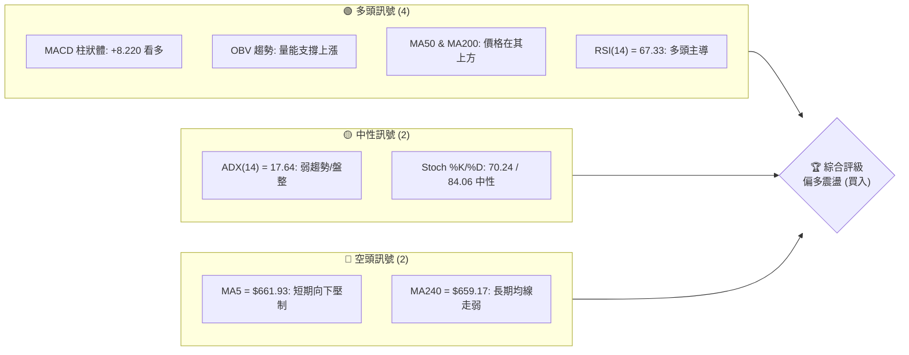

### 📊 核心指標速覽表

| 指標類別 | 指標名稱 | 當前數值 | 訊號 | 解讀 |
|----------|----------|----------|------|------|
| **價格** | 當前價格 | $646.01 | 🟡 中性 | 位於52W高低點區間之46.1%，處於中軸震盪 |
| **均線** | MA20 | $605.25 | 🟢 看多 | 價格在MA20上方，且MA20呈上行趨勢 (+6.73%) |
| **均線** | MA50 | $604.23 | 🟢 看多 | 價格在MA50上方，與MA20形成黃金交叉 |
| **均線** | MA200 | $639.51 | 🟢 看多 | 價格成功站回長期生命線 MA200 上方 |
| **動能** | RSI(14) | 67.33 | 🟡 中性 | 接近超買區但未過熱，多頭動能仍佔優勢 |
| **動能** | MACD | 19.349 | 🟢 看多 | MACD高於信號線，柱狀體維持正值 (+8.220) |
| **波動** | ATR(14) | $30.66 | 🟡 中性 | 每日波動率 4.75%，波動度適中，適合區間操作 |

### 🏆 技術評分卡

```
╔══════════════════════════════════════════════════════════════╗
║                技術評分卡 — META (2026-07-18)                ║
╠══════════════════════════════════════════════════════════════╣
║  趨勢強度      ████████░░░░░░░░░░░░  40/100  🟡 中性         ║
║  動能指標      ██████████████░░░░░░  70/100  🟢 看多         ║
║  支撐穩定度    ████████████████░░░░  80/100  🟢 看多         ║
║  成交量配合    ██████████████░░░░░░  70/100  🟢 看多         ║
║  形態完整度    ████████████░░░░░░░░  60/100  🟡 中性         ║
║  均線排列      ████████████░░░░░░░░  60/100  🟡 中性         ║
╠══════════════════════════════════════════════════════════════╣
║  綜合評分      █████████████░░░░░░░  68/100  🟢 偏多         ║
╚══════════════════════════════════════════════════════════════╝
```

---

## 2. 趨勢分析

### 🌐 多時框趨勢分析

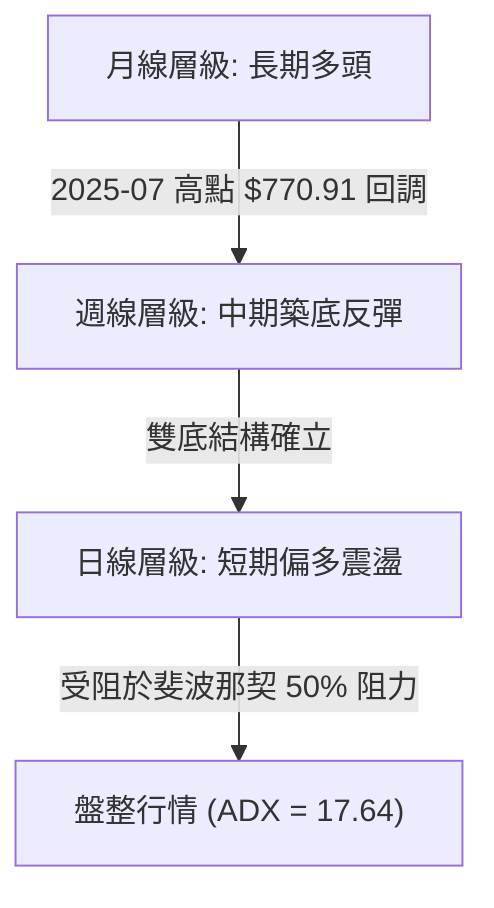

### 📈 長期趨勢 — 12個月走勢圖（Unicode）

```
META 月線走勢圖（過去12個月）
價格軸 ($)
$771 ┤●(2025-07)
$736 ┤    ●       ●
$689 ┤                ●
$646 ┤        ●           ●                   ●(現在: $646.01)
$595 ┤                        ●           ●
$550 ┤                            ●   ●
     └──────────────────────────────────────────────────────────
       07  08  09  10  11  12  01  02  03  04  05  06  07 (月份)
```

**走勢特徵分析表格**：

| 期間 | 收盤價區間 | 趨勢特徵 | 成交量特徵 | 技術面解讀 |
|------|------------|----------|------------|------------|
| **2025-07 至 2025-09** | $770.91 → $732.47 | 高檔震盪回落 | 均量 | 歷史高點見頂後的初步獲利回吐 |
| **2025-10 至 2025-12** | $646.67 → $658.91 | 中期平台整理 | 量縮 | 尋求 $640 附近支撐，形成第一階段底部 |
| **2026-01 至 2026-03** | $715.22 → $571.60 | 二次下探深淵 | 破位放量 | 跌破 MA200，恐慌盤湧現，探至中期低點 |
| **2026-04 至 2026-07** | $611.34 → $646.01 | 雙底築底反彈 | 逐步放量 | 探底 $550.25 後強勢拉升，多頭重掌主導權 |

### 📊 中期趨勢（週線分析）

中期走勢在經歷了 2026 年 3 月底的非理性下跌（最低收盤 $525.23）後，於 2026 年 6 月底在 $550.25 附近成功完成了二次探底。這兩次低點形成了週線級別的「不規則雙底」結構。

```
週線級別阻力與支撐結構示意圖：
[阻力 R3: $709.16] ══════════════════════════════════════ (強壓力區)
[阻力 R2: $690.88] ────────────────────────────────────── (週線頸線位)
[阻力 R1: $671.98] -------------------------------------- (近期反彈高點)
[現價   : $646.01] ◄───────── 目前在此區間震盪
[支撐 S1: $636.95] -------------------------------------- (短期回踩支撐)
[支撐 S2: $627.03] ────────────────────────────────────── (均線密集支撐)
[支撐 S3: $595.08] ══════════════════════════════════════ (中期防守底線)
```

### ⚡ 趨勢強度評估（ADX 解讀）

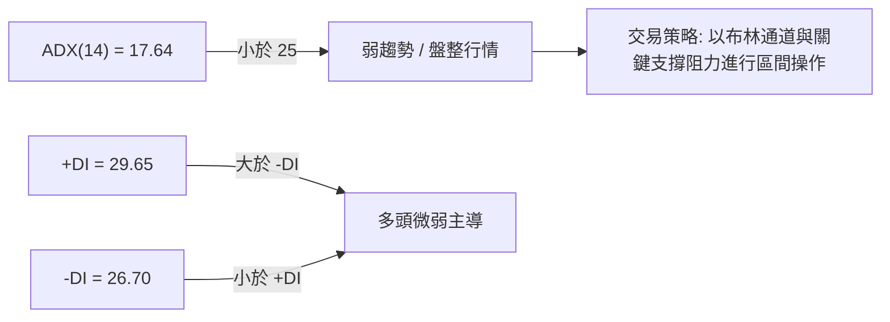

| ADX 數值區間 | 趨勢強度 | 當前 META 狀態 | 交易指導原則 |
|--------------|----------|----------------|--------------|
| **> 40** | 極強趨勢 | ❌ 否 | 順勢突破，持有波段 |
| **25 - 40** | 中等趨勢 | ❌ 否 | 趨勢跟隨，拉回買入 |
| **< 25** | 弱趨勢 / 盤整 | 🟢 是 (17.64) | 限制追漲殺跌，採取高拋低吸策略 |

---

## 3. 圖表形態分析

### 🔍 形態識別系統

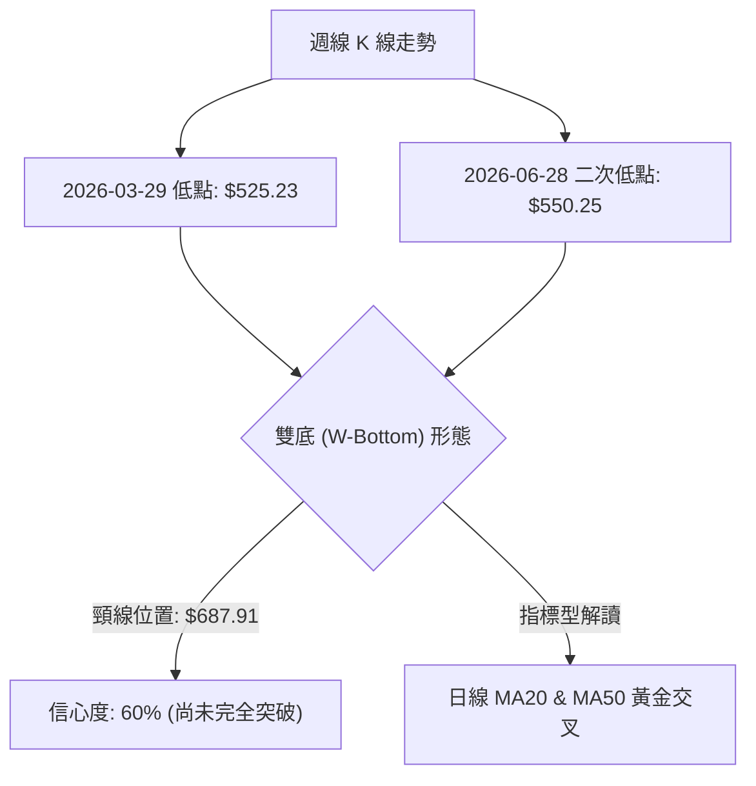

#### 形態評估與信心度

| 形態 | 信心度 | 判斷依據（引用數據） | 完成度 | 目標價（附計算式） |
|------|--------|----------------------|--------|--------------------|
| **不規則雙底** | 60% | 第一底 $525.23 (2026-03-29)，第二底 $550.25 (2026-06-28)。兩次探底未破前低，且第二底高於第一底，屬強勢特徵。 | 80% (尚未突破頸線) | **$850.59**<br>計算式：頸線 $687.91 + 形態高度 ($687.91 - $525.23) = $850.59 |
| **均線黃金交叉** | 85% | 短期 MA20 ($605.25) 向上穿越中期 MA50 ($604.23)，且價格在其上方。 | 100% (已完成) | **$671.98 (R1)**<br>短期目標，受阻於近期高點。 |

### 🕯️ 重要K線形態分析

| 日期/月份 | 收盤價 | K線形態 | 解讀 | 訊號 |
|-----------|--------|---------|------|------|
| **2026-03-29** | $525.23 | 長下影線錘子線 | 伴隨 1.02 億股極致恐慌量，確認階段性底部。 | 🟢 強烈買入 |
| **2026-05-17** | $613.66 | 縮量十字星 | 在 $600 關口企穩，多空力量達到短暫平衡。 | 🟡 中性 |
| **2026-06-28** | $550.25 | 二次探底錘子線 | 縮量探底，未破前低，買盤在低位積極承接。 | 🟢 買入 |
| **2026-07-12** | $669.21 | 大陽線突破 | 伴隨 1.17 億股放量，一舉收復 MA200，確立反彈趨勢。 | 🟢 強烈買入 |
| **2026-07-19** | $646.01 | 孕線 (Harami) | 受阻於 50% 斐波那契位，縮量小陰線回調，屬健康整固。 | 🟡 中性 |

### 📉 ASCII 走勢形態示意圖

```
                    [頸線 $687.91] 
                       ┌───┐
                      /     \         [現價 $646.01]
                     /       \       ●
                    /         \     / \
                   /           └───/   \
                  /                     \
                 /                       \
                /                         \
  ─────────────┘                           └─────────────
        [第一底 $525.23]             [第二底 $550.25]
        (2026-03-29)                 (2026-06-28)
```

### 🎯 形態目標價計算

根據雙底形態推算：
*   **形態頸線 (Neckline)**: $687.91 (2026-04-19 週收盤價)
*   **最低底點 (Lowest Low)**: $525.23 (2026-03-29 週收盤價)
*   **形態高度 (Height)**: $687.91 - $525.23 = $162.68
*   **理論突破目標價**: $687.91 + $162.68 = **$850.59**
*   *備註：此目標價需待週線收盤價有效突破並站穩頸線 $687.91 後方能正式宣告啟動。*

---

## 4. 支撐與阻力

### 🗺️ 關鍵價位分布圖（Unicode）

```
META 價位結構分布圖 (2026-07-18)
═══════════════════════════════════════════════════
$709.16 ║████████████████████████║ 強阻力 R3 (近一年高點)
$690.88 ║████████████████████    ║ 阻力 R2 (週線頸線)
$671.98 ║████████████████████████║ 關鍵阻力 R1 (反彈前高)
$646.01 ╠════════════════════════╣ ◄ 當前價格
$636.95 ║▓▓▓▓▓▓▓▓▓▓▓▓▓▓▓▓        ║ 近期支撐 S1 (日線回踩點)
$627.03 ║████████████████████████║ 強支撐 S2 (均線密集區)
$595.08 ║████████████████████████║ 強支撐 S3 (波段起漲點)
═══════════════════════════════════════════════════
```

### 🚧 阻力位分析表

| 阻力級別 | 價位 | 形成原因 | 突破難度 | 重要性 |
|----------|------|----------|----------|--------|
| **R1** | **$671.98** | 近期反彈波段高點，密集成交區上沿。 | 🟢 較易 | 短期多空分水嶺，突破則打開上行空間。 |
| **R2** | **$690.88** | 接近 38.2% 斐波那契回調位 ($689.03) 及雙底頸線。 | 🟡 中等 | 極關鍵的中期阻力，站穩此線確立中期反轉。 |
| **R3** | **$709.16** | 歷史套牢盤密集區，2026年1月高點平台。 | 🔴 極難 | 需配合極大成交量或利多消息方能突破。 |

### 🛡️ 支撐位分析表

| 支撐級別 | 價位 | 形成原因 | 守住機率 | 重要性 |
|----------|------|----------|----------|--------|
| **S1** | **$636.95** | 近期日線回踩密集成交區，接近 MA200 ($639.51)。 | 🟢 高 | 短期防守線，守住此線代表多頭依然強勢。 |
| **S2** | **$627.03** | 61.8% 斐波那契回調位 ($624.40) 上方，MA120 支撐。 | 🟢 極高 | 中期強支撐，跌破此處代表反彈結構破壞。 |
| **S3** | **$595.08** | 接近 MA20 ($605.25) 與 MA50 ($604.23) 交叉點。 | 🔴 極高 | 終極防守底線，此處若失守將重回熊市結構。 |

### 📐 斐波那契回調位分析（52週區間：$519.78 → $793.65）

現價 **$646.01** 目前精確運行於 **50.0% ($656.71)** 與 **61.8% ($624.40)** 兩個黃金分割位之間。

```
斐波那契黃金分割位與現價關係：
0.0%   (52W High)  $793.65 ──────────────────────────────────
23.6%              $729.02 ──────────────────────────────────
38.2%              $689.03 ────────────────────────────────── (接近 R2 $690.88)
50.0%              $656.71 ══════════════════════════════════ (當前直接壓制位)
[現價]             $646.01 ◄─── 目前承壓於 50% 回調位下方
61.8%              $624.40 ══════════════════════════════════ (當前關鍵支撐位)
78.6%              $578.39 ──────────────────────────────────
100.0% (52W Low)   $519.78 ──────────────────────────────────
```

*   **技術解讀**：價格在反彈至 50.0% 回調位 ($656.71) 處受阻回落，屬於標準的技術性整理。只要回踩不跌破黃金分割強弱分水嶺 61.8% ($624.40)，多頭反彈趨勢即未改變。

---

## 5. 技術指標深度解讀

### 🎛️ 指標訊號總覽

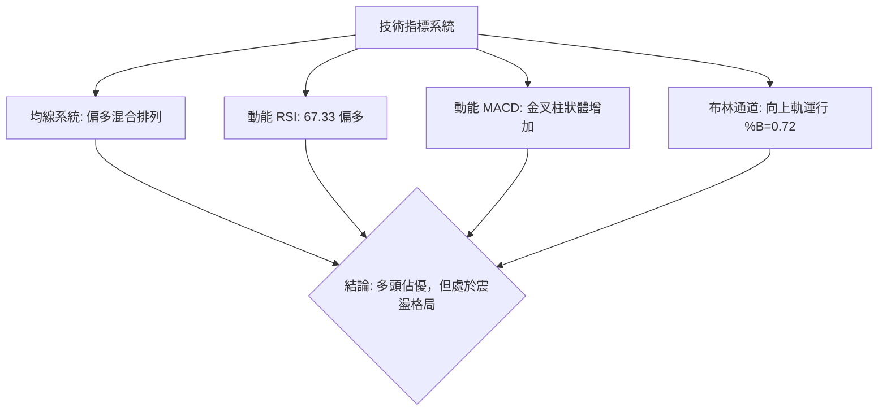

### 📈 移動平均線排列分析

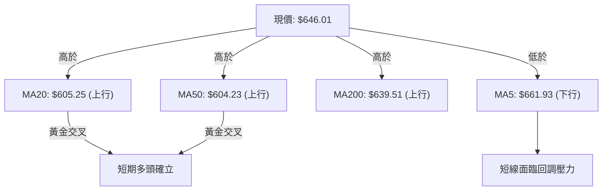

*   **均線狀態**：均線目前呈現「混合排列」。MA20 向上穿越 MA50 形成黃金交叉，且價格穩立於 MA200 上方，中期趨勢已轉多。然而，短期 MA5 位於 $661.93 且向下運行，對現價形成短期壓制，暗示股價需要時間震盪整固。

### 📉 RSI(14) 分析

*   **RSI(14) 當前數值**：**67.33**
    ```
    RSI 強度：██████████████████░░░░░░  67.33% (多頭主導區)
    ```
*   **區間評估**：RSI 處於 50 - 70 的強勢多頭區間。未進入 >70 的極端超買區，這意味著上漲動能並未枯竭，依然有向上開展的空間。
*   **背離分析**：
    *   **結論：無明顯背離**。
    *   **分析**：股價在 7 月中旬創出近期反彈高點，RSI 同步上升至 67.33，量能與指標走勢同步，未出現價升指標降的頂背離現象。

### 📊 MACD(12/26/9) 訊號解讀

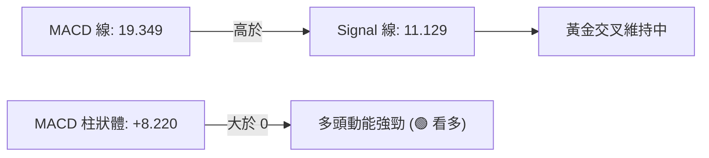

*   **技術解讀**：MACD 在零軸上方維持黃金交叉，且柱狀體持續擴大至 +8.220，顯示中期上升動能正在加速。

### 📦 布林通道分析

```
布林通道運行示意圖：
[BB 上軌: $696.23] ───────────────────────────────────────────
                       ● (反彈受阻高點)
[現價   : $646.01] ───● (%B = 0.72，處於中上軌強勢區)
[BB 中軌: $605.25] ─────────────────────────────────────────── (等於 MA20)
                       
[BB 下軌: $514.28] ───────────────────────────────────────────
```

*   **技術解讀**：布林通道目前處於溫和張口狀態，%B 值為 0.72，顯示股價在中軌與上軌之間的「多頭強勢通道」內運行。股價近期觸及上軌 $696.23 後回落，目前正向中軌 $605.25 尋求支撐。

### 💹 成交量分析（量價配合度）

*   **最新成交量**：20,966,389 股
*   **20日均量**：20,845,134 股 (量比: 1.01x)
*   **50日均量**：18,389,246 股
*   **OBV (能量潮) 趨勢**：**OBV > MA** 
*   **量價關係評估**：
    *   在 7 月 12 日當週股價大漲時，週成交量放大至 1.17 億股（遠超 20日與50日均量），呈現「**價漲量增**」的健康多頭特徵。
    *   本週（7月19日）股價微幅回調，成交量萎縮至 92,374,689 股，呈現「**價跌量縮**」的洗盤特徵。
    *   OBV 指標持續站於其均線之上，顯示主力資金並未流出，量能對股價上漲有堅實支撐。

---

## 6. 動能與波動率

### ⚡ 動能評估

| 象限 | 動能強度 | 波動率 | 當前狀態 | 評估與策略 |
|------|----------|--------|----------|------------|
| **Q1 (高動能/低波動)** | 強 | 低 | ❌ 否 | 最佳單邊趨勢，適合持股。 |
| **Q2 (弱動能/低波動)** | 弱 | 低 | ❌ 否 | 橫盤整理，不宜過度交易。 |
| **Q3 (強動能/高波動)** | 強 | 高 | 🟢 是 | **當前 META 狀態**。多頭反彈動能強，但每日波動大（ATR 4.75%），適合拉回支撐位買入。 |
| **Q4 (弱動能/高波動)** | 弱 | 高 | ❌ 否 | 高風險無方向，容易兩頭被巴。 |

### 📊 ATR 波動率分析

*   **ATR(14) 數值**：**$30.66** (佔股價 4.75%)
*   **止損與波動區間建議**：
    *   **短線交易止損距離**：1.5倍 ATR = $30.66 × 1.5 = **$45.99**
    *   **波段交易止損距離**：2.0倍 ATR = $30.66 × 2.0 = **$61.32**
    *   *應用*：若在當前價 $646.01 進場，技術止損應設於 $646.01 - $45.99 = $600.02 之外（恰好位於 MA20 支撐下方，具備極高技術合理性）。

### 📐 Beta 與市場相關性

*   **Beta 係數**：**1.246**
*   **技術解讀**：META 的波動率高於標普500指數約 24.6%。在大盤上漲時，META 具有更強的彈性（Beta 放大效應）；但若大盤系統性回調，其跌幅亦會相對較深。

---

## 7. 多時框架總結

### 📋 時框架評分表

| 時框架 | 趨勢方向 | 動能 | 均線排列 | 形態 | 綜合評分 | 建議 |
|--------|----------|------|----------|------|----------|------|
| **月線** | 🟢 偏多 | 🟡 中性 | 🟢 多頭 | 🟡 震盪箱體 | **75/100** | 長期投資者逢低買入，長線持有。 |
| **週線** | 🟢 偏多 | 🟢 強勁 | 🟡 混合 | 🟢 雙底築底 | **80/100** | 波段操作者以回踩支撐位買入為主。 |
| **日線** | 🟡 震盪 | 🟢 偏多 | 🟢 金叉 | 🟡 斐波那契受阻| **65/100** | 短線等待回踩 S1 或突破 R1 後進場。 |

### 🔲 綜合訊號矩陣

```
            短期 (日線)      中期 (週線)      長期 (月線)
趨勢方向     🟡 震盪          🟢 偏多          🟢 偏多
動能指標     🟢 強勁          🟢 強勁          🟡 中性
支撐阻力     S1: $636.95      S2: $627.03      S3: $595.08
```

### ⚖️ 多時框收斂結論

*   **行情屬性診斷**：由於 **ADX(14) = 17.64 < 25**，當前市場定性為**「盤整/震盪行情」**。
*   **多時框優先級收斂**：
    *   雖然日線在 50.0% 斐波那契回調位 ($656.71) 處受阻，但中長期（週線、月線）指標呈現明顯的築底反彈多頭特徵（MACD 週線金叉、OBV 資金持續流入）。
    *   因此，我們採取**「大趨勢看多，小趨勢看震盪」**的收斂結論。
    *   **唯一方向性結論**：**偏多震盪整理**。操作上應避免在高位追漲，而應在日線級別回踩布林通道中軌（$605.25）或關鍵支撐位 S1 ($636.95) / S2 ($627.03) 時，逢低布局多單。

---

## 8. 交易策略建議

### 🗺️ 策略決策流程圖

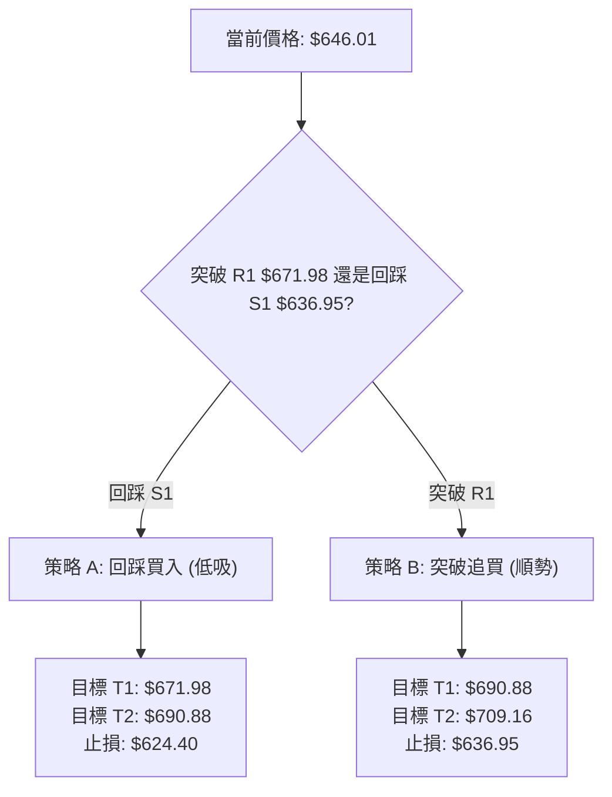

### 🧭 策略路由

*   **當前主策略方向**：**做多（技術評分：68/100，中長期趨勢偏多，日線回踩即是買點）**。

### 🎯 價格情境階梯（Price Scenarios）

| 觸發條件 | 下一目標 | 後續延伸 | 情境含義 |
|----------|----------|----------|----------|
| **突破 R1 $671.98** | R2 $690.88 | R3 $709.16 | 短線多頭確認，開啟挑戰週線頸線之旅。 |
| **站穩現價區間** | $656.71 (Fib 50%) | — | 區間震盪整理，時間換取空間。 |
| **跌破 S1 $636.95** | S2 $627.03 | S3 $595.08 | 短線轉弱，多頭防線後撤，中期買點浮現。 |

### 📊 情境機率分佈

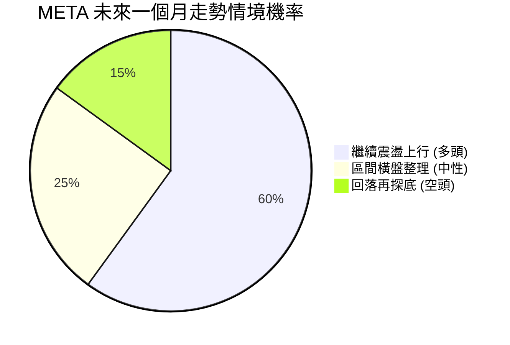

*   **主要依據**：週線級別雙底基本確立，MACD 柱狀體持續翻紅放大 (+8.220)，OBV 顯示主力資金流入。因此上行機率高達 60%。

---

### 🟢 主策略詳情

#### 策略 A：回踩支撐位買入（最優策略）

*   **進場條件**：股價回踩短期支撐位 S1 附近企穩。
*   **進場價格**：**$636.95**
*   **目標價 T1**：**$671.98** (近期反彈高點)
*   **目標價 T2**：**$690.88** (週線頸線位)
*   **止損價格**：**$624.40** (跌破 61.8% 斐波那契回調位，代表反彈結構破壞)
*   **風險報酬比**：**1 : 4.29**
    *   *計算式*：最大風險 = $636.95 - $624.40 = $12.55；最大利潤 = $690.88 - $636.95 = $53.93。
*   **成功機率**：**65%**
*   **建議倉位**：**15%**

#### 策略 B：突破阻力位追買（備用策略）

*   **進場條件**：日線收盤價強勢突破 50% 斐波那契阻力位。
*   **進場價格**：**$656.71**
*   **目標價 T1**：**$690.88** (週線頸線位)
*   **目標價 T2**：**$709.16** (強阻力 R3)
*   **止損價格**：**$636.95** (跌破近期支撐 S1)
*   **風險報酬比**：**1 : 2.65**
    *   *計算式*：最大風險 = $656.71 - $636.95 = $19.76；最大利潤 = $709.16 - $656.71 = $52.45。
*   **成功機率**：**55%**
*   **建議倉位**：**10%**

---

### 🔴 反向風險觸發點（對沖提示）

若股價不幸跌破 **S2 $627.03**，多頭應立即減倉，並在跌破 **S3 $595.08** 時無條件執行全倉止損，防範股價重回 $519.78 尋底的風險。

### ⭐ 整體訊號強度評星

*   **做多訊號強度**：★★★★☆ (4/5星)
*   **做空訊號強度**：★☆☆☆☆ (1/5星)
*   **整體可信度**：  ★★★★☆ (4/5星)

---

## 9. 風險提示與監控

### ✅ 關鍵監控指標 Checklist

```
╔══════════════════════════════════════════════════════════════╗
║                    每日交易監控 Checklist                    ║
╠══════════════════════════════════════════════════════════════╣
║ [ ] 價格是否站穩 MA200 ($639.51)？                         ║
║ [ ] RSI(14) 是否跌破 50 臨界線？                           ║
║ [ ] MACD 柱狀體是否出現「紅柱縮短」之轉折訊號？              ║
║ [ ] 成交量是否低於 20日均量 (20,845,134)？                 ║
║ [ ] 價格是否觸及布林下軌 ($514.28) 或上軌 ($696.23)？       ║
╚══════════════════════════════════════════════════════════════╝
```

### ⚠️ 風險場景分析

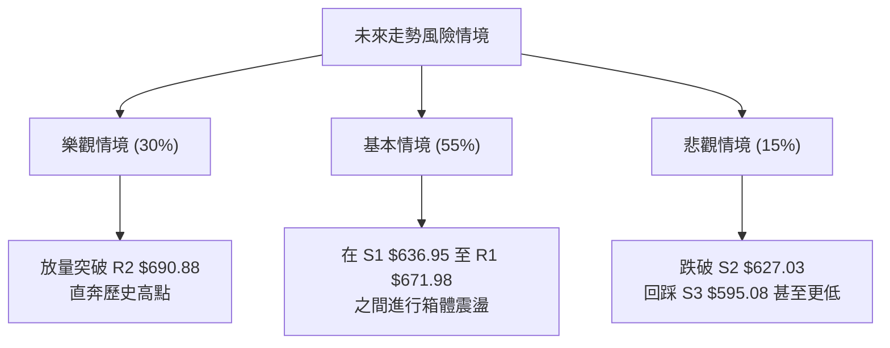

### 🛡️ 風險管理重要提醒

1.  **倉位控管**：因 ADX 顯示當前為弱趨勢盤整行情，單次建倉資金不宜超過總資金的 **15%**。
2.  **嚴格止損**：震盪行情中最忌「不設止損、一路攤平」。請務必將止損點嚴格設於 **$624.40** 或 **$636.95**（視進場策略而定）。
3.  **系統性風險**：META 的 Beta 達 1.246，對大盤高度敏感。若標普500指數出現系統性回調，應主動調低 META 的買入預期價位。

---

## 📋 報告總結

```
╔══════════════════════════════════════════════════════════════╗
║                 META 技術分析報告總結 (2026-07-18)           ║
╠══════════════════════════════════════════════════════════════╣
║  當前價格：$646.01 ｜ 分析評級：🟢 偏多震盪 (買入)            ║
║                                                              ║
║  關鍵結論：                                                  ║
║  ├─ 長期趨勢：🟢 偏多 (月線級別多頭格局未變)                ║
║  ├─ 中期趨勢：🟢 偏多 (週線不規則雙底築底成功)              ║
║  ├─ 短期趨勢：🟡 震盪 (承壓於 50% 斐波那契阻力 $656.71)      ║
║  ├─ 關鍵支撐：$636.95 (S1) ｜ $627.03 (S2)                  ║
║  ├─ 關鍵阻力：$671.98 (R1) ｜ $690.88 (R2)                  ║
║  └─ 分析師目標均價：$826.63                                  ║
║                                                              ║
║  最優策略組合：                                              ║
║  1. 🥇 最佳機會：於 $636.95 (S1) 逢低買入，止損 $624.40，    ║
║                  目標看向 $690.88 (風報比 1:4.29)。          ║
║  2. 🥈 次選機會：待放量突破 $656.71 後順勢追買，             ║
║                  止損 $636.95，目標 $709.16。                ║
╚══════════════════════════════════════════════════════════════╝
```

---

> ⚠️ **免責聲明**：本報告為 AI 自動生成之技術分析，所有數據及估算均基於提供的歷史價格資訊。本報告**僅供研究與學術參考**，**不構成任何投資建議**。投資有風險，入市需謹慎。

---

*報告生成時間：2026-07-18 ｜ 數據來源：Yahoo Finance ｜ 分析框架：多時框技術分析*