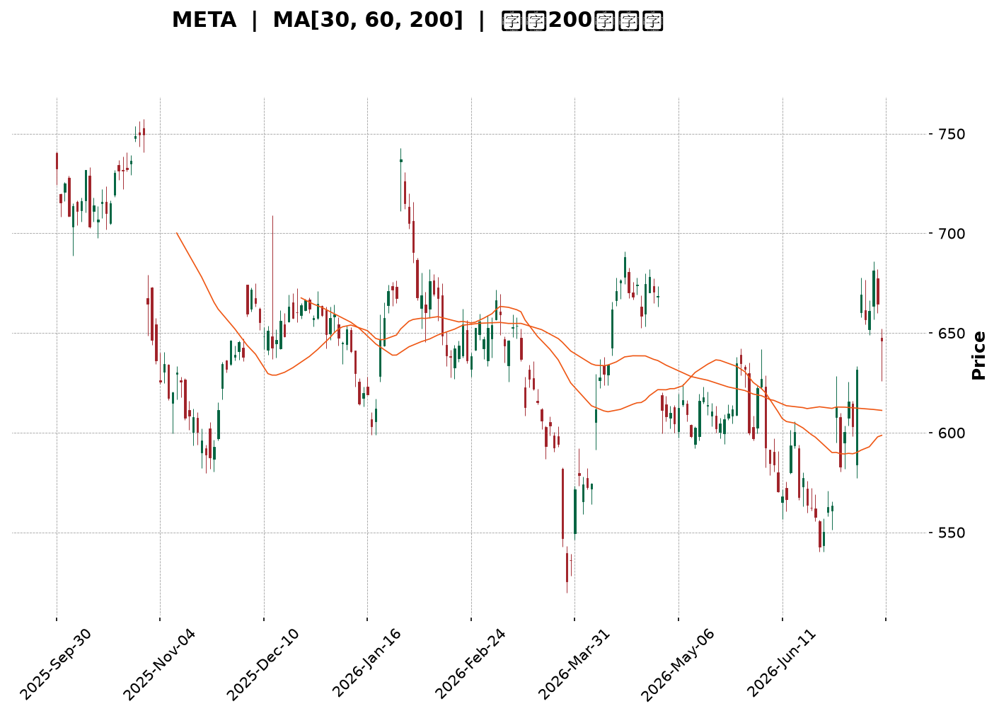
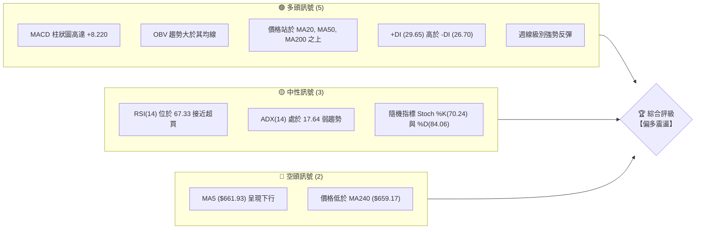
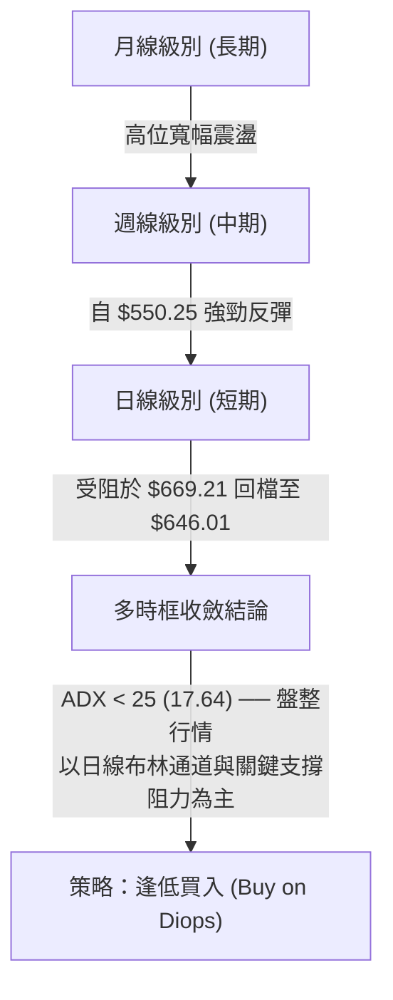
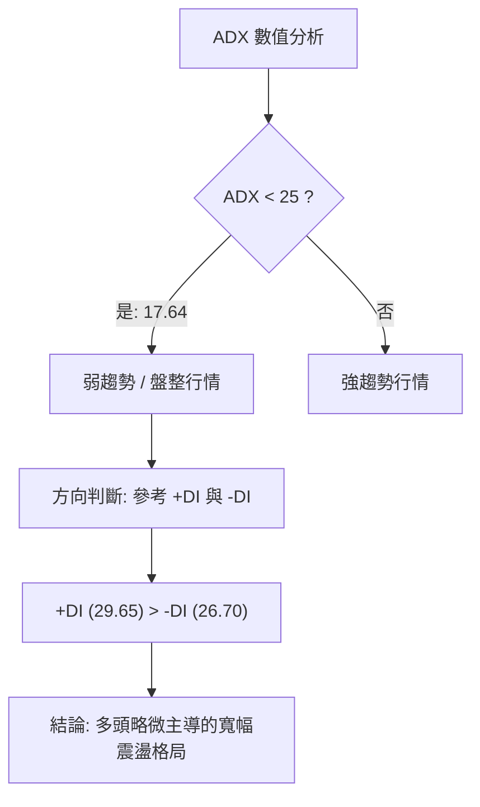
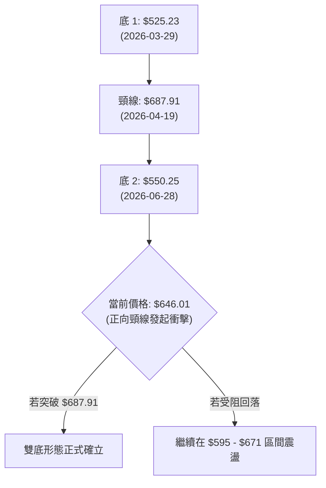
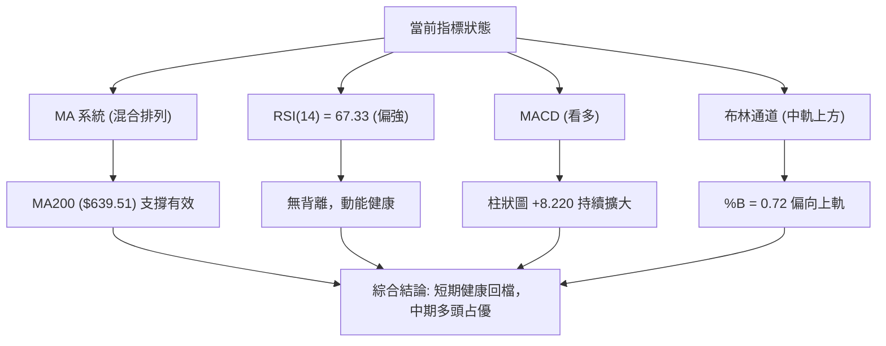
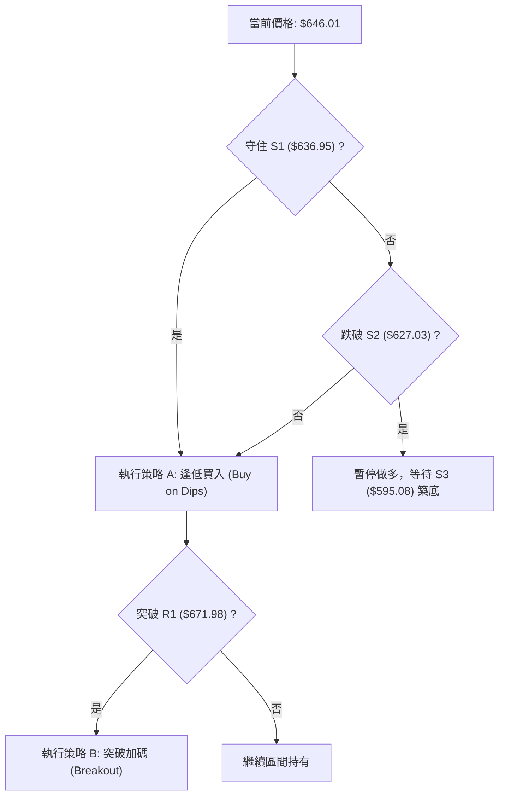
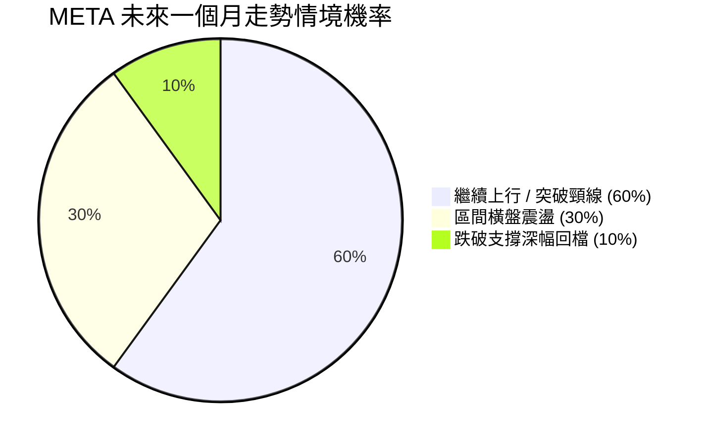
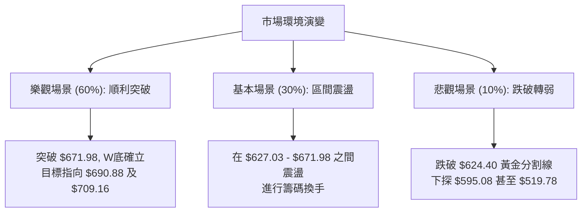

<details>
<summary>📊 靜態圖表 (點擊展開)</summary>

</details>

<html>
<head><meta charset="utf-8" /></head>
<body>
    <div style="height:500px; width:100%;">                        <script>window.PlotlyConfig = {MathJaxConfig: 'local'};</script>
        <script charset="utf-8" src="https://cdn.plot.ly/plotly-3.7.0.min.js" integrity="sha256-jvTGqxNp8AGWEcvNLVuKr+8j5dGe9Yw51LQkmDH+IYA=" crossorigin="anonymous"></script>                <div id="candlestick-chart" class="plotly-graph-div" style="height:100%; width:100%;"></div>            <script>                window.PLOTLYENV=window.PLOTLYENV || {};                                if (document.getElementById("candlestick-chart")) {                    Plotly.newPlot(                        "candlestick-chart",                        [{"close":{"dtype":"f8","bdata":"AAAAwMzjhkAAAABA1VuGQAAAAMBPqYZAAAAA4LslhkAAAACgbU6GQAAAAIDXOYZAAAAAwNJfhkAAAACg29yGQAAAAGDD+4VAAAAAQL9OhkAAAABgfhaGQAAAAECCXYZAAAAAYMgxhkAAAABge1iGQAAAAGAq0oZAAAAAYPHahkAAAABAD9yGQAAAAIDE4IZAAAAAgI4Dh0AAAACA+maHQAAAAADta4dAAAAAwMJth0AAAADA7cWEQAAAAEBYNYRAAAAAIHLgg0AAAACgio2DQAAAAABn0oNAAAAA4KxKg0AAAAAgx2CDQAAAAED4sINAAAAAYKCLg0AAAAAAcfuCQAAAAKB2AoNAAAAAQAj\u002fgkAAAABAlsOCQAAAAOAdoYJAAAAAIE9mgkAAAABA+VyCQAAAAACrhYJAAAAAYK0bg0AAAACAjtSDQAAAACC7v4NAAAAAQCcyhEAAAAAAqfmDQAAAAABfK4RAAAAA4Ibvg0AAAAAAg56EQAAAAIBi\u002fYRAAAAA4I\u002fIhEAAAADgC3qEQAAAAECMQ4RAAAAAgCJYhEAAAABgeBSEQAAAAEDbMoRAAAAAwNZ\u002fhEAAAACAv0KEQAAAAKAiuoRAAAAAoMaMhEAAAACgk6KEQAAAAEAMvoRAAAAAIOTShEAAAAAA37CEQAAAACAjjIRAAAAAIB3GhEAAAABAUZeEQAAAAOADSoRAAAAAgO+MhEAAAADAjJuEQAAAAKBHPIRAAAAA4EYnhEAAAABALV+EQAAAAICdBoRAAAAAALuvg0AAAABgZDODQAAAAICOXYNAAAAAICpZg0AAAADAWtiCQAAAAODyHoNAAAAAgNAzhEAAAABAsoyEQAAAAGBN+YRAAAAAYCz+hEAAAABgUNyEQAAAAID2B4dAAAAAIMtZhkAAAACANwmGQAAAACC\u002fk4VAAAAA4GPehEAAAAAAIuiEQAAAAABCooRAAAAA4BwghUAAAACgNOyEQAAAAKD+24RAAAAAQDlFhEAAAAAADPWDQAAAAIA28YNAAAAA4JgQhEAAAAAgDh2EQAAAAKDwc4RAAAAAIOzgg0AAAAAAS\u002fGDQAAAAGA1ZIRAAAAAoLh+hEAAAAAANTiEQAAAAIArY4RAAAAAAE9vhEAAAAAAVNSEQAAAAIAmm4RAAAAAoLEdhEAAAAAA5jGEQAAAACA+Z4RAAAAAII1thEAAAABgWeiDQAAAAADwJINAAAAAwPOWg0AAAADgqnCDQAAAACDhOINAAAAAIBvxgkAAAADg4YiCQAAAAGAB3IJAAAAAwPeCgkAAAACgtpKCQAAAAIBDGIFAAAAAgN1pgEAAAAAgEb+AQAAAAEDN3IFAAAAAoIwVgkAAAADAbO+BQAAAAGDq44FAAAAA4CP0gUAAAADA0h6DQAAAACB3noNAAAAAwDaqg0AAAABAis+DQAAAACADr4RAAAAAYKr3hEAAAAAg8iGFQAAAAKBMf4VAAAAAYE\u002fyhEAAAAAAxOGEQAAAAADDEIVAAAAAQFGUhEAAAABgPROFQAAAAODuL4VAAAAAQL\u002f1hEAAAADgAOSEQAAAAEC\u002fGoNAAAAAoH0Bg0AAAAAgwg6DQAAAAOAy44JAAAAAAIAig0AAAAAg6UGDQAAAACCGCINAAAAAoHGygkAAAACAiNOCQAAAAOB4QINAAAAA4NtOg0AAAABASi2DQAAAAAAnFYNAAAAAgGrQgkAAAACA\u002f+OCQAAAAGCK9oJAAAAAQI8Ng0AAAAAgLx6DQAAAAOBf1YNAAAAAIJ3Vg0AAAAAAZb+DQAAAAMBPv4JAAAAA4JyogkAAAACgOXODQAAAAEDpl4NAAAAAgJuDgkAAAACgyEaCQAAAAMBjQIJAAAAAQJzTgUAAAACgOr+BQAAAAMCjs4FAAAAAANeLgkAAAAAgrsGCQAAAAOCjvIFAAAAAgMIJgkAAAADAzJ6BQAAAAKCZkYFAAAAAIFxtgUAAAADA9faAQAAAAAAAMoFAAAAAwMyUgUAAAADgUZqBQAAAAKBHJ4NAAAAAQDM3gkAAAADgUcKCQAAAAOCjPINAAAAAwPXYgkAAAAAA17uDQAAAACCu6YRAAAAAANeFhEAAAADgUaiEQAAAAOB6SoVAAAAA4FHEhEAAAACAFDCEQA=="},"high":{"dtype":"f8","bdata":"cxJUXVcoh0AHug6q0X+GQCyXtowOr4ZAnPF9aNTIhkAac7vEKViGQIdNjtQWZYZAv79WAkRuhkAAAACg29yGQK9+vMfm6oZAVRhIOZRwhkBkKJ\u002fXjE2GQIenoWMtkIZAXYw0NN2chkCY072EaGWGQN1c5b\u002fu3oZAuyj+lqwEh0AYU0ItbhWHQGfjEXLfI4dAm3m9O0wah0CN6PfuUI6HQIwOIiZ2o4dAZUVJdYaph0Aj+NBkjDmFQMFlEkAdCYVAfcReA\u002fWMhEAqVSkkmgCEQNZI4wKDBIRAdi96Hc3Sg0A3bMsEIWSDQGmdlInSyoNAz2IWM2qfg0B\u002fMhna3ZqDQFe1HOZhQINAsCqhVLQgg0BjEOpy0xCDQGmwyKjA0IJAx68BAkmOgkC26MwnK+mCQHB+ujCMpIJABGm0O804g0A4Sib3LduDQDGm3OOh5YNAJBQHePMyhEDsbsH7Kh2EQIiNw+iDMYRAiOD\u002fu1U5hEBDzy\u002fYxBKFQFXyu8CEB4VAyq\u002fg+aIXhUAb0GrMDLaEQAAb4Dp\u002fZoRAWKuvOKRshEAvN7WkPimGQHtE2LqyXoRAdRwIuOGqhECf44+5a6CEQLbYG5jt6oRAEa50BnHuhEBu2z9yCwOFQDgLa0KDxoRAKIThE+zXhEC0r+wbEt6EQO3vrk+YmIRAwRSyIi\u002f4hEAqNVH4hr6EQPX6aAWouYRAE24iiNq6hEB31rYhrsKEQNE5UJvPj4RAhCQe9ZQvhEDwE3wbRW6EQOB+rr1xZoRAL3f02gIJhEAkJBjZpZqDQC8d6\u002fV3eINAbFuozK2fg0Cw5dOzfRKDQH7D5GJaSYNAtM2ZbyabhECNgMkPbcqEQE4NAPqeEIVAGjfFNeschUD6BMhcySOFQLK0G+BmNYdAdwQgG+7WhkDp5wbzH4CGQNiqVjzJXYZAlg4Y5tN8hUBCROGzSkKFQKOvx\u002flY9oRA05ibCr9QhUC\u002fgOUpgTuFQKOYBOt7MIVASeyR3l4WhUCwaAAbKVKEQGJh1U2lC4RAI4U\u002f4s8ehED1kBr2TDCEQPei8bRZsYRAgXWoLDuEhEDKEj1Gv\u002f+DQLx1oM65ZYRACPwwk5WehEAx8sHnREKEQAek0XseloRA2IMqj+6OhEALzt2ek\u002fyEQAaULs8L7IRA5GRMEIJChEDnOvLvxTSEQEog12f+mIRAgqH3FpKPhEDy+u7hsGKEQI2Dkp5loINAZaYTSEzRg0AL2g1Jr9+DQMZHa4iWcINAJDGdjXUjg0A6adjXNNuCQKi6k5CcAINADdx1TYzDgkBpeptZ49iCQAMyl2CuM4JAmOJt18X4gECFRSQ9Z9iAQDdjpSpF6YFAnDrgvQKAgkDZ1Lv2tg+CQN95HbkAMoJAApOeKJT1gUAU5q4B76qDQC6nfxlH54NATX9+1ujvg0BBadrbS9ODQK\u002fZsfkkzYRApWK4YPkuhUBBHUznnieFQHGyIZ4Jl4VAtzVfWvpVhUCQYOxKlxyFQBDCL88DLoVA2Fk7IoXnhEDLsu1NUUCFQOjfbcTxToVACPlah2oshUDygZRlAQ2FQAxQA2wzYoNAE8RZqnRSg0Ac\u002fz2xcyuDQOx8XbE\u002fLoNAT9m19wFbg0Cg+orBNYODQOjym1WXQYNAObb\u002fhszigkABh+YTh9mCQHqjeqybWoNAkT8PMzh5g0Aej2uo\u002f2SDQIfQjfEoOINAKz+SaOQqg0CYlsQMf\u002fuCQMYUN6pICINAUEgr\u002f+wxg0B4aPM1NS+DQBtyKTtF74NAQ33+oDwThEDKceW5TM+DQJudBlhK2YNAlN05iocCg0Ahfv2nk3yDQC7sVgBxDoRAICX2Moqkg0CmEgVXnXuCQC3uUuWcqIJAhffeDS52gkAcHUQIH92BQOBc3uJK\u002fIFAAAAAACnKgkAAAADgeu6CQAAAAOB6joJAAAAAgMIhgkAAAADgev6BQAAAAKCZ4YFAAAAA4FHIgUAAAABguGKBQAAAAMDMZoFAAAAAQDPXgUAAAADgUayBQAAAAIA9ooNAAAAAAAAQg0AAAADgo9yCQAAAAMD1ioNAAAAAAABAg0AAAAAAKcqDQAAAAEDhLoVAAAAAwPUkhUAAAAAAANSEQAAAAOCjcIVAAAAAQDNPhUAAAACgmWGEQA=="},"hovertemplate":"\u003cb\u003e%{x|%Y-%m-%d}\u003c\u002fb\u003e\u003cbr\u003e\u958b: $%{open:.2f}\u003cbr\u003e\u9ad8: $%{high:.2f}\u003cbr\u003e\u4f4e: $%{low:.2f}\u003cbr\u003e\u6536: $%{close:.2f}\u003cextra\u003e\u003c\u002fextra\u003e","low":{"dtype":"f8","bdata":"C1gfzVOjhkC0jxJv3CKGQI9XGnY3YoZA+cHTpLMihkCWIHUcwIWFQH9RL5Fa\u002f4VAi3AyicoPhkBoyfcvvDSGQOuiZbJ19YVAXCY6Mm8OhkCjx8mDIMyFQIwPxhZbHYZASczHwm7whUAZ6GpgTgKGQK8Qy5J+coZAtbdtY+C2hkC+\u002fyn1NpGGQIOLEgiW2YZA6wkUzgbKhkCc\u002f7uNjlCHQLDfYFOwPIdAtKX2yaskh0CWXMn43UOEQGxN6aQpH4RALQbxwDzUg0ARJKi1FoODQPfNLT5Rh4NA7U90vixDg0Cq1AKXH72CQI3TK4QNRINA4K7VGkROg0Bv7HQWjPGCQDzpqXp8y4JAcOlSgj+NgkClLsgd2I6CQB+YsSUgMoJAhOzl7+8dgkBQpWuQsS6CQPqMqxLOIoJA261ILKOggkBzhMOTkUWDQE681KTur4NAtD+1xM\u002fOg0CAQb1F2OCDQI1y3phR44NA+cb7Yyvfg0DSGO28s5KEQAIQGblfpYRAyEPbEMK6hEAioGdbKV2EQIsQQwHZDYRAaa4gBhr5g0AtGol7oOeDQKdmiICA7INA\u002fQd+\u002f28QhED6KQ04WkCEQI6F8UJUeoRACtnUZhCIhECjKOCP2HuEQGnPlYWfiIRAqXVI4iqohEDhWB6vI6GEQHN3M27MaYRAyZIOc1mFhECDydNeIJKEQIa6kXLVEoRA1gBI4sU0hEC3MksM6lWEQN5dFIZLHYRAgAQKNbTUg0CqVBBcpA2EQKvuzLK0AIRAlAaK3eh3g0DCnYBNzS2DQMh3eRUXKYNAzmewns5Xg0DfVSoGdLeCQOHvBpgXuIJAL2Osf3mLg0Dl1OSOaxqEQGDAYF7moIRAesjbzc+7hED0zTi3T8eEQOk5NvA\u002fOoZAr7WiHI5ChkC+af5pI\u002fKFQJ4BsmqAaYVAlTFSFCzShEAN6CzQsGKEQGIZ4m3KKoRAMGPAHtuMhEAPey9kx+SEQFWZ4INwf4RAT8DoZAwhhECfUmVWhcuDQBggTkFxnYNAeFqYlECYg0CpELCEsNyDQIgNZA4k7YNAnaXzrvDWg0DJ8HVC4Z6DQCkURh75B4RAME\u002f1zcYyhEApkDHP3ueDQOV61yH2yoNA5cnkuJ7tg0DIWoXP\u002fYOEQJr5Lmo3SYRAwy2oiNHXg0DfPdnnT42DQE2XPD3BPoRAUHw61KQ5hEByp+uqIN6DQOhiz2u3A4NA9KnPHy90g0DJAwSy\u002fmiDQNCMbsdTMINA03Rwa57NgkA+DLhnplWCQAxik5Oks4JA6Q4URJ9zgkB+qFfzzYaCQEr6MVLG9oBAqTXC2jk+gEDcpOqdZ4CAQMRm3hccEoFAids9Qk\u002fqgUAaTXY9dHmBQOuxLE\u002fD24FAas9yg+WhgUAJmNOLQXqCQGwUnphic4NA6GfB3AN+g0Bm65k1k36DQCxlhDg59oNAKyvo9Na8hEDsPZerDdmEQL7wB\u002fMJFIVATY2oRA3bhEB3yRFdstWEQNtuvewJ6YRAQ0do8Y9jhEA22EVv4GmEQFmg1EDA8YRA2UcV9BvIhED4pcwRkLmEQNm8xzWOu4JAcuqa4WPsgkC7YX0GidGCQOXQObluvoJAXNVJh16sgkCeDpFTxieDQI0GMoX964JAINqjujWsgkCtuNv4aICCQG9VAB\u002fcoIJAJjEhwXEzg0Cz32N09wWDQJfS40IM2YJAIbgMiPO\u002fgkCgLog\u002fDaqCQHQ3rdYSkoJABfDdphrzgkBVwc956uWCQH2EzCt9A4NAeCked9Glg0BBSQefLnaDQMopVIjMt4JA1u44DQWhgkCEXsiwtr2CQApiXj\u002fUboNARMI0QvYygkDbWGYTeBWCQMLECKrGI4JA73t5uJLQgUDgWE4o9GOBQGZ0xIcLg4FAAAAAYGYagkAAAAAAAICCQAAAACCFsYFAAAAAwMyYgUAAAADgen6BQAAAAAApiIFAAAAAYGZcgUAAAACgcOGAQAAAAEAz44BAAAAAAABwgUAAAACgcDuBQAAAAMDMmIJAAAAAIFwjgkAAAACAFC6CQAAAAKBH3YJAAAAAgBSwgkAAAABgjwiCQAAAAIAUkIRAAAAAoJlxhEAAAABgZkiEQAAAAKBHhYRAAAAAoEehhEAAAAAAAJCDQA=="},"name":"\u50f9\u683c","open":{"dtype":"f8","bdata":"oOWDsJgih0BKpqtT8nyGQDtHbv+khYZAIWbC7+W9hkBxEV+\u002f4vqFQFAnb3ndXoZAnoWTUss8hkBOQVKJVWOGQEEq7wMxyIZA5B2dakg5hkByUT8\u002fjQ+GQNNLaVqZWYZAL2b5QoJdhkCbxr9m9wmGQIhMJbWNeoZA6Ijgw+LwhkBzc7hEad+GQPXv82da5oZAh19Tdwf3hkBabH3qR16HQHVfjs1rdYdAttEKQ1aGh0B2sf5CUNuEQNZN5gQVBoVAUChq1GJyhECNis5MSZODQMc5oJZbtYNAJsWEqZrRg0BvUpk7IDeDQOL7Lq+fq4NA2onFnPeSg0DEILorAZSDQO3xGFvWG4NAWFikv9TBgkC2SAdHrvuCQENZftqFcIJAuLXKL3CBgkBvOyjDec+CQJG5HYzJV4JAFSXaoVWpgkBaeI\u002frDHODQKniDlNJ4INAvUDaj3DTg0BpDEejIO+DQJPgluljBYRAoy9nMugVhEDigyig+BGFQGjRd2s4soRALsdsYdTchECZbQGSYrCEQEiYzZQcQoRAnu2jS\u002fgMhEBNbXMo6kCEQPwEt\u002flmJIRA8MhtR9UShEDQTxF4inOEQBwz0o7hfoRAMAw52t3JhECnafBTxqOEQLCyK1X\u002floRA3gQ1js2qhEBoR9Ka9taEQHSBzPq0hoRAQXaQGSOMhEDLHLThh7yEQCUIFFNmrIRAfADtfs5OhEDfFDA0KpOEQP1R\u002fufHc4RA8LUI6NYlhEAqmARKUyKEQJe25\u002f3xWoRAL3f02gIJhEBjgYtVE4uDQNjB25UHS4NAo6kea4x4g0Cq4OSJYfaCQLNgqe5G7YJAOUSwqdWhg0DH1SfE+RyEQFLGh72Qv4RA5baVVxwLhUB3uHBVZAqFQDHqhnXvAIdApQTWAqOxhkCp1wDCnkqGQK6RwRriEIZAzwUMCQt0hUATMaftL7OEQJDY1a1wwoRAPJwhM\u002f6vhECtSz3JJSOFQPAk2SJmBoVAodfYWzfmhEBlCUxQnB+EQAcu7dvj8oNAdOUNGl\u002fFg0BJGomlduuDQGsE4Vxo9INA4ePdPQZbhEA088gun7+DQC3TLnIWC4RA8YetDiJLhEDGL4Y\u002fbxKEQA8Ukg404INAL7rcwhU5hEAeMcHAToaEQPdhZMoCpoRA30\u002fwifg1hECgyK67Ms2DQBkBInwrY4RASaZVvcBshEAzoFE0wjyEQL4W9H87doNAdVoef1G7g0C3TIekRJuDQPOglp8nPoNAAAs+aqocg0Afy5UIxdeCQAwlKRjV6YJA74LZp1y0gkDS4fUSfLGCQICzMdiaL4JAFUmleszcgEAAAAAgEb+AQCjfewHEK4FAdI4WK74cgkAeGaJ3IKyBQNDH7aQ9CYJArJinX5nfgUBQy7bMguuCQC2ZXpEdk4NASo3jQQ\u002fPg0B6rNJJVqeDQFvhZKv+FIRAOiRaLw\u002fThED07DmL6RqFQDDCdN7FL4VA16n\u002fLtVFhUBBAGSHB\u002fOEQL6Bwm7iDYVA5MAZ\u002f664hEDKFmMlq52EQO+xK5MH84RAdZUi4OwMhUAoJPUlU+KEQNQtv\u002fL4VYNAZjtnfPcwg0CPdAhPBPuCQMP0QMrvJYNAcPYjj\u002fLDgkBQs7C2NDGDQHUp1O8KNYNAdocJ7BTggkDsvBtjJ5KCQLlnfkE0soJAMAer2287g0DSo4A0XyuDQBuqixteBINA5BK9aNkCg0BCzHBHocGCQC699B6Ou4JARdpkg4n6gkC1IesKnAKDQO7hm6mvBoNAoRwmREP3g0DgvmCfTseDQKu+Xb2HroNA9AlnfHPVgkArW3yDiNOCQE0sYWW9eINAc7Qs3Q93g0CmEgVXnXuCQBudEjifc4JAtxHVwokhgkC3METOcqqBQNyUmQ1b44FAAAAAQDMfgkAAAABAM42CQAAAAAAAgIJAAAAAYI\u002fmgUAAAAAAKeCBQAAAAAAAkoFAAAAAwB6PgUAAAABgZlyBQAAAAGC4+oBAAAAAAACAgUAAAAAghYeBQAAAAKBH\u002f4JAAAAAQDP\u002fgkAAAABguJaCQAAAAGC4\u002fIJAAAAAwB4zg0AAAACA6z+CQAAAAGC4ooRAAAAAQAqrhEAAAAAAAGCEQAAAAMDMvIRAAAAAgD0qhUAAAACgmT2EQA=="},"x":["2025-09-30T00:00:00-04:00","2025-10-01T00:00:00-04:00","2025-10-02T00:00:00-04:00","2025-10-03T00:00:00-04:00","2025-10-06T00:00:00-04:00","2025-10-07T00:00:00-04:00","2025-10-08T00:00:00-04:00","2025-10-09T00:00:00-04:00","2025-10-10T00:00:00-04:00","2025-10-13T00:00:00-04:00","2025-10-14T00:00:00-04:00","2025-10-15T00:00:00-04:00","2025-10-16T00:00:00-04:00","2025-10-17T00:00:00-04:00","2025-10-20T00:00:00-04:00","2025-10-21T00:00:00-04:00","2025-10-22T00:00:00-04:00","2025-10-23T00:00:00-04:00","2025-10-24T00:00:00-04:00","2025-10-27T00:00:00-04:00","2025-10-28T00:00:00-04:00","2025-10-29T00:00:00-04:00","2025-10-30T00:00:00-04:00","2025-10-31T00:00:00-04:00","2025-11-03T00:00:00-05:00","2025-11-04T00:00:00-05:00","2025-11-05T00:00:00-05:00","2025-11-06T00:00:00-05:00","2025-11-07T00:00:00-05:00","2025-11-10T00:00:00-05:00","2025-11-11T00:00:00-05:00","2025-11-12T00:00:00-05:00","2025-11-13T00:00:00-05:00","2025-11-14T00:00:00-05:00","2025-11-17T00:00:00-05:00","2025-11-18T00:00:00-05:00","2025-11-19T00:00:00-05:00","2025-11-20T00:00:00-05:00","2025-11-21T00:00:00-05:00","2025-11-24T00:00:00-05:00","2025-11-25T00:00:00-05:00","2025-11-26T00:00:00-05:00","2025-11-28T00:00:00-05:00","2025-12-01T00:00:00-05:00","2025-12-02T00:00:00-05:00","2025-12-03T00:00:00-05:00","2025-12-04T00:00:00-05:00","2025-12-05T00:00:00-05:00","2025-12-08T00:00:00-05:00","2025-12-09T00:00:00-05:00","2025-12-10T00:00:00-05:00","2025-12-11T00:00:00-05:00","2025-12-12T00:00:00-05:00","2025-12-15T00:00:00-05:00","2025-12-16T00:00:00-05:00","2025-12-17T00:00:00-05:00","2025-12-18T00:00:00-05:00","2025-12-19T00:00:00-05:00","2025-12-22T00:00:00-05:00","2025-12-23T00:00:00-05:00","2025-12-24T00:00:00-05:00","2025-12-26T00:00:00-05:00","2025-12-29T00:00:00-05:00","2025-12-30T00:00:00-05:00","2025-12-31T00:00:00-05:00","2026-01-02T00:00:00-05:00","2026-01-05T00:00:00-05:00","2026-01-06T00:00:00-05:00","2026-01-07T00:00:00-05:00","2026-01-08T00:00:00-05:00","2026-01-09T00:00:00-05:00","2026-01-12T00:00:00-05:00","2026-01-13T00:00:00-05:00","2026-01-14T00:00:00-05:00","2026-01-15T00:00:00-05:00","2026-01-16T00:00:00-05:00","2026-01-20T00:00:00-05:00","2026-01-21T00:00:00-05:00","2026-01-22T00:00:00-05:00","2026-01-23T00:00:00-05:00","2026-01-26T00:00:00-05:00","2026-01-27T00:00:00-05:00","2026-01-28T00:00:00-05:00","2026-01-29T00:00:00-05:00","2026-01-30T00:00:00-05:00","2026-02-02T00:00:00-05:00","2026-02-03T00:00:00-05:00","2026-02-04T00:00:00-05:00","2026-02-05T00:00:00-05:00","2026-02-06T00:00:00-05:00","2026-02-09T00:00:00-05:00","2026-02-10T00:00:00-05:00","2026-02-11T00:00:00-05:00","2026-02-12T00:00:00-05:00","2026-02-13T00:00:00-05:00","2026-02-17T00:00:00-05:00","2026-02-18T00:00:00-05:00","2026-02-19T00:00:00-05:00","2026-02-20T00:00:00-05:00","2026-02-23T00:00:00-05:00","2026-02-24T00:00:00-05:00","2026-02-25T00:00:00-05:00","2026-02-26T00:00:00-05:00","2026-02-27T00:00:00-05:00","2026-03-02T00:00:00-05:00","2026-03-03T00:00:00-05:00","2026-03-04T00:00:00-05:00","2026-03-05T00:00:00-05:00","2026-03-06T00:00:00-05:00","2026-03-09T00:00:00-04:00","2026-03-10T00:00:00-04:00","2026-03-11T00:00:00-04:00","2026-03-12T00:00:00-04:00","2026-03-13T00:00:00-04:00","2026-03-16T00:00:00-04:00","2026-03-17T00:00:00-04:00","2026-03-18T00:00:00-04:00","2026-03-19T00:00:00-04:00","2026-03-20T00:00:00-04:00","2026-03-23T00:00:00-04:00","2026-03-24T00:00:00-04:00","2026-03-25T00:00:00-04:00","2026-03-26T00:00:00-04:00","2026-03-27T00:00:00-04:00","2026-03-30T00:00:00-04:00","2026-03-31T00:00:00-04:00","2026-04-01T00:00:00-04:00","2026-04-02T00:00:00-04:00","2026-04-06T00:00:00-04:00","2026-04-07T00:00:00-04:00","2026-04-08T00:00:00-04:00","2026-04-09T00:00:00-04:00","2026-04-10T00:00:00-04:00","2026-04-13T00:00:00-04:00","2026-04-14T00:00:00-04:00","2026-04-15T00:00:00-04:00","2026-04-16T00:00:00-04:00","2026-04-17T00:00:00-04:00","2026-04-20T00:00:00-04:00","2026-04-21T00:00:00-04:00","2026-04-22T00:00:00-04:00","2026-04-23T00:00:00-04:00","2026-04-24T00:00:00-04:00","2026-04-27T00:00:00-04:00","2026-04-28T00:00:00-04:00","2026-04-29T00:00:00-04:00","2026-04-30T00:00:00-04:00","2026-05-01T00:00:00-04:00","2026-05-04T00:00:00-04:00","2026-05-05T00:00:00-04:00","2026-05-06T00:00:00-04:00","2026-05-07T00:00:00-04:00","2026-05-08T00:00:00-04:00","2026-05-11T00:00:00-04:00","2026-05-12T00:00:00-04:00","2026-05-13T00:00:00-04:00","2026-05-14T00:00:00-04:00","2026-05-15T00:00:00-04:00","2026-05-18T00:00:00-04:00","2026-05-19T00:00:00-04:00","2026-05-20T00:00:00-04:00","2026-05-21T00:00:00-04:00","2026-05-22T00:00:00-04:00","2026-05-26T00:00:00-04:00","2026-05-27T00:00:00-04:00","2026-05-28T00:00:00-04:00","2026-05-29T00:00:00-04:00","2026-06-01T00:00:00-04:00","2026-06-02T00:00:00-04:00","2026-06-03T00:00:00-04:00","2026-06-04T00:00:00-04:00","2026-06-05T00:00:00-04:00","2026-06-08T00:00:00-04:00","2026-06-09T00:00:00-04:00","2026-06-10T00:00:00-04:00","2026-06-11T00:00:00-04:00","2026-06-12T00:00:00-04:00","2026-06-15T00:00:00-04:00","2026-06-16T00:00:00-04:00","2026-06-17T00:00:00-04:00","2026-06-18T00:00:00-04:00","2026-06-22T00:00:00-04:00","2026-06-23T00:00:00-04:00","2026-06-24T00:00:00-04:00","2026-06-25T00:00:00-04:00","2026-06-26T00:00:00-04:00","2026-06-29T00:00:00-04:00","2026-06-30T00:00:00-04:00","2026-07-01T00:00:00-04:00","2026-07-02T00:00:00-04:00","2026-07-06T00:00:00-04:00","2026-07-07T00:00:00-04:00","2026-07-08T00:00:00-04:00","2026-07-09T00:00:00-04:00","2026-07-10T00:00:00-04:00","2026-07-13T00:00:00-04:00","2026-07-14T00:00:00-04:00","2026-07-15T00:00:00-04:00","2026-07-16T00:00:00-04:00","2026-07-17T00:00:00-04:00"],"type":"candlestick"},{"hovertemplate":"MA30: $%{y:.2f}\u003cextra\u003e\u003c\u002fextra\u003e","line":{"color":"#2196F3","dash":"dash","width":2},"mode":"lines","name":"MA30","x":["2025-09-30T00:00:00-04:00","2025-10-01T00:00:00-04:00","2025-10-02T00:00:00-04:00","2025-10-03T00:00:00-04:00","2025-10-06T00:00:00-04:00","2025-10-07T00:00:00-04:00","2025-10-08T00:00:00-04:00","2025-10-09T00:00:00-04:00","2025-10-10T00:00:00-04:00","2025-10-13T00:00:00-04:00","2025-10-14T00:00:00-04:00","2025-10-15T00:00:00-04:00","2025-10-16T00:00:00-04:00","2025-10-17T00:00:00-04:00","2025-10-20T00:00:00-04:00","2025-10-21T00:00:00-04:00","2025-10-22T00:00:00-04:00","2025-10-23T00:00:00-04:00","2025-10-24T00:00:00-04:00","2025-10-27T00:00:00-04:00","2025-10-28T00:00:00-04:00","2025-10-29T00:00:00-04:00","2025-10-30T00:00:00-04:00","2025-10-31T00:00:00-04:00","2025-11-03T00:00:00-05:00","2025-11-04T00:00:00-05:00","2025-11-05T00:00:00-05:00","2025-11-06T00:00:00-05:00","2025-11-07T00:00:00-05:00","2025-11-10T00:00:00-05:00","2025-11-11T00:00:00-05:00","2025-11-12T00:00:00-05:00","2025-11-13T00:00:00-05:00","2025-11-14T00:00:00-05:00","2025-11-17T00:00:00-05:00","2025-11-18T00:00:00-05:00","2025-11-19T00:00:00-05:00","2025-11-20T00:00:00-05:00","2025-11-21T00:00:00-05:00","2025-11-24T00:00:00-05:00","2025-11-25T00:00:00-05:00","2025-11-26T00:00:00-05:00","2025-11-28T00:00:00-05:00","2025-12-01T00:00:00-05:00","2025-12-02T00:00:00-05:00","2025-12-03T00:00:00-05:00","2025-12-04T00:00:00-05:00","2025-12-05T00:00:00-05:00","2025-12-08T00:00:00-05:00","2025-12-09T00:00:00-05:00","2025-12-10T00:00:00-05:00","2025-12-11T00:00:00-05:00","2025-12-12T00:00:00-05:00","2025-12-15T00:00:00-05:00","2025-12-16T00:00:00-05:00","2025-12-17T00:00:00-05:00","2025-12-18T00:00:00-05:00","2025-12-19T00:00:00-05:00","2025-12-22T00:00:00-05:00","2025-12-23T00:00:00-05:00","2025-12-24T00:00:00-05:00","2025-12-26T00:00:00-05:00","2025-12-29T00:00:00-05:00","2025-12-30T00:00:00-05:00","2025-12-31T00:00:00-05:00","2026-01-02T00:00:00-05:00","2026-01-05T00:00:00-05:00","2026-01-06T00:00:00-05:00","2026-01-07T00:00:00-05:00","2026-01-08T00:00:00-05:00","2026-01-09T00:00:00-05:00","2026-01-12T00:00:00-05:00","2026-01-13T00:00:00-05:00","2026-01-14T00:00:00-05:00","2026-01-15T00:00:00-05:00","2026-01-16T00:00:00-05:00","2026-01-20T00:00:00-05:00","2026-01-21T00:00:00-05:00","2026-01-22T00:00:00-05:00","2026-01-23T00:00:00-05:00","2026-01-26T00:00:00-05:00","2026-01-27T00:00:00-05:00","2026-01-28T00:00:00-05:00","2026-01-29T00:00:00-05:00","2026-01-30T00:00:00-05:00","2026-02-02T00:00:00-05:00","2026-02-03T00:00:00-05:00","2026-02-04T00:00:00-05:00","2026-02-05T00:00:00-05:00","2026-02-06T00:00:00-05:00","2026-02-09T00:00:00-05:00","2026-02-10T00:00:00-05:00","2026-02-11T00:00:00-05:00","2026-02-12T00:00:00-05:00","2026-02-13T00:00:00-05:00","2026-02-17T00:00:00-05:00","2026-02-18T00:00:00-05:00","2026-02-19T00:00:00-05:00","2026-02-20T00:00:00-05:00","2026-02-23T00:00:00-05:00","2026-02-24T00:00:00-05:00","2026-02-25T00:00:00-05:00","2026-02-26T00:00:00-05:00","2026-02-27T00:00:00-05:00","2026-03-02T00:00:00-05:00","2026-03-03T00:00:00-05:00","2026-03-04T00:00:00-05:00","2026-03-05T00:00:00-05:00","2026-03-06T00:00:00-05:00","2026-03-09T00:00:00-04:00","2026-03-10T00:00:00-04:00","2026-03-11T00:00:00-04:00","2026-03-12T00:00:00-04:00","2026-03-13T00:00:00-04:00","2026-03-16T00:00:00-04:00","2026-03-17T00:00:00-04:00","2026-03-18T00:00:00-04:00","2026-03-19T00:00:00-04:00","2026-03-20T00:00:00-04:00","2026-03-23T00:00:00-04:00","2026-03-24T00:00:00-04:00","2026-03-25T00:00:00-04:00","2026-03-26T00:00:00-04:00","2026-03-27T00:00:00-04:00","2026-03-30T00:00:00-04:00","2026-03-31T00:00:00-04:00","2026-04-01T00:00:00-04:00","2026-04-02T00:00:00-04:00","2026-04-06T00:00:00-04:00","2026-04-07T00:00:00-04:00","2026-04-08T00:00:00-04:00","2026-04-09T00:00:00-04:00","2026-04-10T00:00:00-04:00","2026-04-13T00:00:00-04:00","2026-04-14T00:00:00-04:00","2026-04-15T00:00:00-04:00","2026-04-16T00:00:00-04:00","2026-04-17T00:00:00-04:00","2026-04-20T00:00:00-04:00","2026-04-21T00:00:00-04:00","2026-04-22T00:00:00-04:00","2026-04-23T00:00:00-04:00","2026-04-24T00:00:00-04:00","2026-04-27T00:00:00-04:00","2026-04-28T00:00:00-04:00","2026-04-29T00:00:00-04:00","2026-04-30T00:00:00-04:00","2026-05-01T00:00:00-04:00","2026-05-04T00:00:00-04:00","2026-05-05T00:00:00-04:00","2026-05-06T00:00:00-04:00","2026-05-07T00:00:00-04:00","2026-05-08T00:00:00-04:00","2026-05-11T00:00:00-04:00","2026-05-12T00:00:00-04:00","2026-05-13T00:00:00-04:00","2026-05-14T00:00:00-04:00","2026-05-15T00:00:00-04:00","2026-05-18T00:00:00-04:00","2026-05-19T00:00:00-04:00","2026-05-20T00:00:00-04:00","2026-05-21T00:00:00-04:00","2026-05-22T00:00:00-04:00","2026-05-26T00:00:00-04:00","2026-05-27T00:00:00-04:00","2026-05-28T00:00:00-04:00","2026-05-29T00:00:00-04:00","2026-06-01T00:00:00-04:00","2026-06-02T00:00:00-04:00","2026-06-03T00:00:00-04:00","2026-06-04T00:00:00-04:00","2026-06-05T00:00:00-04:00","2026-06-08T00:00:00-04:00","2026-06-09T00:00:00-04:00","2026-06-10T00:00:00-04:00","2026-06-11T00:00:00-04:00","2026-06-12T00:00:00-04:00","2026-06-15T00:00:00-04:00","2026-06-16T00:00:00-04:00","2026-06-17T00:00:00-04:00","2026-06-18T00:00:00-04:00","2026-06-22T00:00:00-04:00","2026-06-23T00:00:00-04:00","2026-06-24T00:00:00-04:00","2026-06-25T00:00:00-04:00","2026-06-26T00:00:00-04:00","2026-06-29T00:00:00-04:00","2026-06-30T00:00:00-04:00","2026-07-01T00:00:00-04:00","2026-07-02T00:00:00-04:00","2026-07-06T00:00:00-04:00","2026-07-07T00:00:00-04:00","2026-07-08T00:00:00-04:00","2026-07-09T00:00:00-04:00","2026-07-10T00:00:00-04:00","2026-07-13T00:00:00-04:00","2026-07-14T00:00:00-04:00","2026-07-15T00:00:00-04:00","2026-07-16T00:00:00-04:00","2026-07-17T00:00:00-04:00"],"y":{"dtype":"f8","bdata":"AAAAAAAA+H8AAAAAAAD4fwAAAAAAAPh\u002fAAAAAAAA+H8AAAAAAAD4fwAAAAAAAPh\u002fAAAAAAAA+H8AAAAAAAD4fwAAAAAAAPh\u002fAAAAAAAA+H8AAAAAAAD4fwAAAAAAAPh\u002fAAAAAAAA+H8AAAAAAAD4fwAAAAAAAPh\u002fAAAAAAAA+H8AAAAAAAD4fwAAAAAAAPh\u002fAAAAAAAA+H8AAAAAAAD4fwAAAAAAAPh\u002fAAAAAAAA+H8AAAAAAAD4fwAAAAAAAPh\u002fAAAAAAAA+H8AAAAAAAD4fwAAAAAAAPh\u002fAAAAAAAA+H8AAAAAAAD4f97d3a0n4YVAq6qqqp3EhUBmZmaGzaeFQHd3dyekiIVAzczMTMBthUC8u7vrhU+FQBERERHVMIVAd3d3R+oOhUDe3d3dhOiEQFVVVYX7yoRAAAAAIK6vhEBVVVVlapyEQFVVVfUWhoRA3t3dDQl1hEB3d3fXzmCEQGZmZnYuSoRAMzMzg0QxhEDNzMw8Jh6EQO\u002fu7l4JDoRAIiIi4gD7g0Dv7u7+CeKDQGZmZtYXx4NAIiIissWsg0AiIiJi26aDQGZmZibGpoNA3t3dTRasg0CamZmZILKDQN7d3Q3auYNAVVVVpZbEg0CamZmpUM+DQLy7u8tI2INAREREdDHjg0AAAAAwxvGDQJqZmYnl\u002foNAZmZm5hAOhEAzMzMzqB2EQAAAAADSK4RA3t3drSw+hECrqqq6U1GEQM3MzIzyX4RAEREREd5ohEBVVVX1fG2EQGZmZtbZb4RAVVVV5YBrhEAiIiIC5WSEQJqZmbkIXoRAIiIiogVZhECJiIgo4kmEQBEREYHvOYRAERERMfo0hEBmZmZWmTWEQO\u002fu7k6oO4RAvLu7KzFBhEARERGB2keEQERERBQGYIRA3t3dfdJvhEAAAACg+H6EQDMzM5M5hoRAREREBPKIhEAAAACQQ4uEQLy7u2tWioRAERERYemMhEAzMzOz446EQGZmZiaNkYRAmpmZSUGNhEBERESU2IeEQM3MzMzihIRAd3d3x72AhEC8u7tbhnyEQDMzM1NhfoRAd3d39wh8hECrqqpKX3iEQERERPR9e4RAZmZmRmSChEBVVVXlFYuEQERERFTOk4RAMzMz0xOdhECJiIiIAq6EQLy7u+uuuoRAiYiIKPK5hECamZlZ67aEQJqZmfkMsoRA3t3d3TqthECJiIgIGaWEQGZmZibug4RAAAAAcF5shEDe3d2dN1aEQGZmZiYfQoRAq6qqyq0xhEC8u7vrbx2EQCIiIqJLDoRAiYiImP33g0DNzMzc8OODQGZmZgbRw4NAERERkeeig0BmZmZWgYeDQImIiBjCdYNAmpmZSdtkg0B3d3fXRFKDQERERMRmPINAERERsfkrg0Dv7u6u9SSDQGZmZkZeHoNAERER4UgXg0CJiIi4yxODQImIiOhSFoNAzczMfN4ag0AzMzPTdB2DQCIiIrIPJYNAVVVVBSYsg0ARERHBAjKDQBEREVGpN4NA7+7uHvQ4g0B3d3en6kKDQM3MzIxZVINAAAAAAAtgg0C8u7u7a2yDQKuqqppqa4NAvLu7a\u002fZrg0BERETUbHCDQGZmZjaqcINA3t3djft1g0AiIiKS0nuDQDMzM1NdjINAq6qqutmfg0ARERFxmbGDQO\u002fu7n50vYNAIiIiEubHg0BVVVWFftKDQFVVVTWr3INAVVVV5QLkg0C8u7vrDOKDQGZmZvZz3INA3t3dLTvXg0De3d29UdGDQBEREZEQyoNAVVVVdWXAg0BERET0k7SDQHd3d5ccnYNAREREpJaJg0BERETUXn2DQJqZmQnPcINAERERYS9fg0Dv7u6eTUeDQDMzM3NALoNAzczMjIMTg0BEREQksPiCQCIiIsK37IJA3t3dzcvogkAiIiISOuaCQBEREYFo3IJAq6qq2gzTgkARERFxFMWCQHd3dxeVuIJAq6qqCr+tgkCJiIhI3J2CQImIiLhPjIJAvLu7e5N9gkDe3d3NJHCCQN7d3X2\u002fcIJAzczMDKRrgkCamZmphGqCQImIiNjabIJA7+7u\u002fhlrgkAzMzNTW3CCQCIiIiKReYJA3t3d7XB\u002fgkDv7u6ONIeCQCIiIjLpnIJAIiIisuaugkAiIiJCMrWCQA=="},"type":"scatter"},{"hovertemplate":"MA60: $%{y:.2f}\u003cextra\u003e\u003c\u002fextra\u003e","line":{"color":"#9C27B0","dash":"dash","width":2},"mode":"lines","name":"MA60","x":["2025-09-30T00:00:00-04:00","2025-10-01T00:00:00-04:00","2025-10-02T00:00:00-04:00","2025-10-03T00:00:00-04:00","2025-10-06T00:00:00-04:00","2025-10-07T00:00:00-04:00","2025-10-08T00:00:00-04:00","2025-10-09T00:00:00-04:00","2025-10-10T00:00:00-04:00","2025-10-13T00:00:00-04:00","2025-10-14T00:00:00-04:00","2025-10-15T00:00:00-04:00","2025-10-16T00:00:00-04:00","2025-10-17T00:00:00-04:00","2025-10-20T00:00:00-04:00","2025-10-21T00:00:00-04:00","2025-10-22T00:00:00-04:00","2025-10-23T00:00:00-04:00","2025-10-24T00:00:00-04:00","2025-10-27T00:00:00-04:00","2025-10-28T00:00:00-04:00","2025-10-29T00:00:00-04:00","2025-10-30T00:00:00-04:00","2025-10-31T00:00:00-04:00","2025-11-03T00:00:00-05:00","2025-11-04T00:00:00-05:00","2025-11-05T00:00:00-05:00","2025-11-06T00:00:00-05:00","2025-11-07T00:00:00-05:00","2025-11-10T00:00:00-05:00","2025-11-11T00:00:00-05:00","2025-11-12T00:00:00-05:00","2025-11-13T00:00:00-05:00","2025-11-14T00:00:00-05:00","2025-11-17T00:00:00-05:00","2025-11-18T00:00:00-05:00","2025-11-19T00:00:00-05:00","2025-11-20T00:00:00-05:00","2025-11-21T00:00:00-05:00","2025-11-24T00:00:00-05:00","2025-11-25T00:00:00-05:00","2025-11-26T00:00:00-05:00","2025-11-28T00:00:00-05:00","2025-12-01T00:00:00-05:00","2025-12-02T00:00:00-05:00","2025-12-03T00:00:00-05:00","2025-12-04T00:00:00-05:00","2025-12-05T00:00:00-05:00","2025-12-08T00:00:00-05:00","2025-12-09T00:00:00-05:00","2025-12-10T00:00:00-05:00","2025-12-11T00:00:00-05:00","2025-12-12T00:00:00-05:00","2025-12-15T00:00:00-05:00","2025-12-16T00:00:00-05:00","2025-12-17T00:00:00-05:00","2025-12-18T00:00:00-05:00","2025-12-19T00:00:00-05:00","2025-12-22T00:00:00-05:00","2025-12-23T00:00:00-05:00","2025-12-24T00:00:00-05:00","2025-12-26T00:00:00-05:00","2025-12-29T00:00:00-05:00","2025-12-30T00:00:00-05:00","2025-12-31T00:00:00-05:00","2026-01-02T00:00:00-05:00","2026-01-05T00:00:00-05:00","2026-01-06T00:00:00-05:00","2026-01-07T00:00:00-05:00","2026-01-08T00:00:00-05:00","2026-01-09T00:00:00-05:00","2026-01-12T00:00:00-05:00","2026-01-13T00:00:00-05:00","2026-01-14T00:00:00-05:00","2026-01-15T00:00:00-05:00","2026-01-16T00:00:00-05:00","2026-01-20T00:00:00-05:00","2026-01-21T00:00:00-05:00","2026-01-22T00:00:00-05:00","2026-01-23T00:00:00-05:00","2026-01-26T00:00:00-05:00","2026-01-27T00:00:00-05:00","2026-01-28T00:00:00-05:00","2026-01-29T00:00:00-05:00","2026-01-30T00:00:00-05:00","2026-02-02T00:00:00-05:00","2026-02-03T00:00:00-05:00","2026-02-04T00:00:00-05:00","2026-02-05T00:00:00-05:00","2026-02-06T00:00:00-05:00","2026-02-09T00:00:00-05:00","2026-02-10T00:00:00-05:00","2026-02-11T00:00:00-05:00","2026-02-12T00:00:00-05:00","2026-02-13T00:00:00-05:00","2026-02-17T00:00:00-05:00","2026-02-18T00:00:00-05:00","2026-02-19T00:00:00-05:00","2026-02-20T00:00:00-05:00","2026-02-23T00:00:00-05:00","2026-02-24T00:00:00-05:00","2026-02-25T00:00:00-05:00","2026-02-26T00:00:00-05:00","2026-02-27T00:00:00-05:00","2026-03-02T00:00:00-05:00","2026-03-03T00:00:00-05:00","2026-03-04T00:00:00-05:00","2026-03-05T00:00:00-05:00","2026-03-06T00:00:00-05:00","2026-03-09T00:00:00-04:00","2026-03-10T00:00:00-04:00","2026-03-11T00:00:00-04:00","2026-03-12T00:00:00-04:00","2026-03-13T00:00:00-04:00","2026-03-16T00:00:00-04:00","2026-03-17T00:00:00-04:00","2026-03-18T00:00:00-04:00","2026-03-19T00:00:00-04:00","2026-03-20T00:00:00-04:00","2026-03-23T00:00:00-04:00","2026-03-24T00:00:00-04:00","2026-03-25T00:00:00-04:00","2026-03-26T00:00:00-04:00","2026-03-27T00:00:00-04:00","2026-03-30T00:00:00-04:00","2026-03-31T00:00:00-04:00","2026-04-01T00:00:00-04:00","2026-04-02T00:00:00-04:00","2026-04-06T00:00:00-04:00","2026-04-07T00:00:00-04:00","2026-04-08T00:00:00-04:00","2026-04-09T00:00:00-04:00","2026-04-10T00:00:00-04:00","2026-04-13T00:00:00-04:00","2026-04-14T00:00:00-04:00","2026-04-15T00:00:00-04:00","2026-04-16T00:00:00-04:00","2026-04-17T00:00:00-04:00","2026-04-20T00:00:00-04:00","2026-04-21T00:00:00-04:00","2026-04-22T00:00:00-04:00","2026-04-23T00:00:00-04:00","2026-04-24T00:00:00-04:00","2026-04-27T00:00:00-04:00","2026-04-28T00:00:00-04:00","2026-04-29T00:00:00-04:00","2026-04-30T00:00:00-04:00","2026-05-01T00:00:00-04:00","2026-05-04T00:00:00-04:00","2026-05-05T00:00:00-04:00","2026-05-06T00:00:00-04:00","2026-05-07T00:00:00-04:00","2026-05-08T00:00:00-04:00","2026-05-11T00:00:00-04:00","2026-05-12T00:00:00-04:00","2026-05-13T00:00:00-04:00","2026-05-14T00:00:00-04:00","2026-05-15T00:00:00-04:00","2026-05-18T00:00:00-04:00","2026-05-19T00:00:00-04:00","2026-05-20T00:00:00-04:00","2026-05-21T00:00:00-04:00","2026-05-22T00:00:00-04:00","2026-05-26T00:00:00-04:00","2026-05-27T00:00:00-04:00","2026-05-28T00:00:00-04:00","2026-05-29T00:00:00-04:00","2026-06-01T00:00:00-04:00","2026-06-02T00:00:00-04:00","2026-06-03T00:00:00-04:00","2026-06-04T00:00:00-04:00","2026-06-05T00:00:00-04:00","2026-06-08T00:00:00-04:00","2026-06-09T00:00:00-04:00","2026-06-10T00:00:00-04:00","2026-06-11T00:00:00-04:00","2026-06-12T00:00:00-04:00","2026-06-15T00:00:00-04:00","2026-06-16T00:00:00-04:00","2026-06-17T00:00:00-04:00","2026-06-18T00:00:00-04:00","2026-06-22T00:00:00-04:00","2026-06-23T00:00:00-04:00","2026-06-24T00:00:00-04:00","2026-06-25T00:00:00-04:00","2026-06-26T00:00:00-04:00","2026-06-29T00:00:00-04:00","2026-06-30T00:00:00-04:00","2026-07-01T00:00:00-04:00","2026-07-02T00:00:00-04:00","2026-07-06T00:00:00-04:00","2026-07-07T00:00:00-04:00","2026-07-08T00:00:00-04:00","2026-07-09T00:00:00-04:00","2026-07-10T00:00:00-04:00","2026-07-13T00:00:00-04:00","2026-07-14T00:00:00-04:00","2026-07-15T00:00:00-04:00","2026-07-16T00:00:00-04:00","2026-07-17T00:00:00-04:00"],"y":{"dtype":"f8","bdata":"AAAAAAAA+H8AAAAAAAD4fwAAAAAAAPh\u002fAAAAAAAA+H8AAAAAAAD4fwAAAAAAAPh\u002fAAAAAAAA+H8AAAAAAAD4fwAAAAAAAPh\u002fAAAAAAAA+H8AAAAAAAD4fwAAAAAAAPh\u002fAAAAAAAA+H8AAAAAAAD4fwAAAAAAAPh\u002fAAAAAAAA+H8AAAAAAAD4fwAAAAAAAPh\u002fAAAAAAAA+H8AAAAAAAD4fwAAAAAAAPh\u002fAAAAAAAA+H8AAAAAAAD4fwAAAAAAAPh\u002fAAAAAAAA+H8AAAAAAAD4fwAAAAAAAPh\u002fAAAAAAAA+H8AAAAAAAD4fwAAAAAAAPh\u002fAAAAAAAA+H8AAAAAAAD4fwAAAAAAAPh\u002fAAAAAAAA+H8AAAAAAAD4fwAAAAAAAPh\u002fAAAAAAAA+H8AAAAAAAD4fwAAAAAAAPh\u002fAAAAAAAA+H8AAAAAAAD4fwAAAAAAAPh\u002fAAAAAAAA+H8AAAAAAAD4fwAAAAAAAPh\u002fAAAAAAAA+H8AAAAAAAD4fwAAAAAAAPh\u002fAAAAAAAA+H8AAAAAAAD4fwAAAAAAAPh\u002fAAAAAAAA+H8AAAAAAAD4fwAAAAAAAPh\u002fAAAAAAAA+H8AAAAAAAD4fwAAAAAAAPh\u002fAAAAAAAA+H8AAAAAAAD4f83MzDy43IRAd3d3j+fThEAzMzPbycyEQImIiNjEw4RAmpmZmei9hEB3d3cPl7aEQImIiIhTroRAq6qqeoumhEBERERM7JyEQBEREQl3lYRAiYiIGEaMhEBVVVWt84SEQN7d3WX4eoRAmpmZ+URwhEDNzMzs2WKEQAAAAJgbVIRAq6qqEiVFhECrqqoyBDSEQAAAAHD8I4RAmpmZif0XhECrqqqq0QuEQKuqqhJgAYRA7+7ubvv2g0CamZnxWveDQFVVVR1mA4RA3t3dZfQNhEDNzMycjBiEQImIiNAJIIRAzczMVMQmhEDNzMwcSi2EQLy7u5tPMYRAq6qqag04hECamZnxVECEQAAAAFg5SIRAAAAAGKlNhEC8u7tjwFKEQGZmZmZaWIRAq6qqOnVfhEAzMzML7WaEQAAAAPApb4RAREREhHNyhEAAAAAg7nKEQFVVVeWrdYRA3t3dlfJ2hEC8u7tz\u002fXeEQO\u002fu7obreIRAq6qqugx7hECJiIhY8nuEQGZmZjZPeoRAzczMLHZ3hEAAAABYQnaEQERERKTadoRAzczMBDZ3hEDNzMzEeXaEQFVVVR36cYRA7+7udhhuhEDv7u4emGqEQM3MzFwsZIRAd3d3509dhEDe3d29WVSEQO\u002fu7gZRTIRAzczMfHNChEAAAABIajmEQGZmZhavKoRAVVVVbRQYhEBVVVX1rAeEQKuqqnJS\u002fYNAiYiIiMzyg0CamZmZZeeDQLy7uwtk3YNAREREVAHUg0DNzMx8qs6DQFVVVR3uzINAvLu7k9bMg0Dv7u7OcM+DQGZmZp4Q1YNAAAAAKPnbg0De3d2tu+WDQO\u002fu7k7f74NA7+7uFgzzg0BVVVUNd\u002fSDQFVVVSXb9INAZmZmfhfzg0AAAADYAfSDQJqZmdkj7INAAAAAuDTmg0DNzMysUeGDQImIiODE1oNAMzMzG9LOg0AAAABg7saDQEREROx6v4NAMzMzk\u002fy2g0B3d3e34a+DQM3MzCwXqINA3t3dpWChg0C8u7tjjZyDQLy7u0ubmYNA3t3drWCWg0BmZmauYZKDQM3MzPyIjINAMzMzS\u002f6Hg0BVVVVNgYODQGZmZh5pfYNAd3d3B0J3g0AzMzO7jnKDQM3MzLwxcINAERER+aFtg0C8u7tjBGmDQM3MzCQWYYNAzczMVN5ag0CrqqrKsFeDQFVVVS08VINAAAAAwBFMg0AzMzMjHEWDQAAAAABNQYNAZmZmRsc5g0AAAADwjTKDQGZmZi4RLINAzczMHGEqg0AzMzNzUyuDQLy7u1uJJoNARERENIQkg0CamZmBcyCDQFVVVTV5IoNAq6qqYswmg0DNzMzcuieDQLy7uxviJINA7+7uxrwig0CamZmpUSGDQJqZmVm1JoNAERERedMng0CrqqrKSCaDQHd3d2enJINAZmZmliohg0CJiIiI1iCDQJqZmdnQIYNAmpmZMesfg0CamZlB5B2DQM3MzOQCHYNAMzMzqz4cg0AzMzOLSBmDQA=="},"type":"scatter"},{"hovertemplate":"MA200: $%{y:.2f}\u003cextra\u003e\u003c\u002fextra\u003e","line":{"color":"#FF6F00","dash":"solid","width":2},"mode":"lines","name":"MA200","x":["2025-09-30T00:00:00-04:00","2025-10-01T00:00:00-04:00","2025-10-02T00:00:00-04:00","2025-10-03T00:00:00-04:00","2025-10-06T00:00:00-04:00","2025-10-07T00:00:00-04:00","2025-10-08T00:00:00-04:00","2025-10-09T00:00:00-04:00","2025-10-10T00:00:00-04:00","2025-10-13T00:00:00-04:00","2025-10-14T00:00:00-04:00","2025-10-15T00:00:00-04:00","2025-10-16T00:00:00-04:00","2025-10-17T00:00:00-04:00","2025-10-20T00:00:00-04:00","2025-10-21T00:00:00-04:00","2025-10-22T00:00:00-04:00","2025-10-23T00:00:00-04:00","2025-10-24T00:00:00-04:00","2025-10-27T00:00:00-04:00","2025-10-28T00:00:00-04:00","2025-10-29T00:00:00-04:00","2025-10-30T00:00:00-04:00","2025-10-31T00:00:00-04:00","2025-11-03T00:00:00-05:00","2025-11-04T00:00:00-05:00","2025-11-05T00:00:00-05:00","2025-11-06T00:00:00-05:00","2025-11-07T00:00:00-05:00","2025-11-10T00:00:00-05:00","2025-11-11T00:00:00-05:00","2025-11-12T00:00:00-05:00","2025-11-13T00:00:00-05:00","2025-11-14T00:00:00-05:00","2025-11-17T00:00:00-05:00","2025-11-18T00:00:00-05:00","2025-11-19T00:00:00-05:00","2025-11-20T00:00:00-05:00","2025-11-21T00:00:00-05:00","2025-11-24T00:00:00-05:00","2025-11-25T00:00:00-05:00","2025-11-26T00:00:00-05:00","2025-11-28T00:00:00-05:00","2025-12-01T00:00:00-05:00","2025-12-02T00:00:00-05:00","2025-12-03T00:00:00-05:00","2025-12-04T00:00:00-05:00","2025-12-05T00:00:00-05:00","2025-12-08T00:00:00-05:00","2025-12-09T00:00:00-05:00","2025-12-10T00:00:00-05:00","2025-12-11T00:00:00-05:00","2025-12-12T00:00:00-05:00","2025-12-15T00:00:00-05:00","2025-12-16T00:00:00-05:00","2025-12-17T00:00:00-05:00","2025-12-18T00:00:00-05:00","2025-12-19T00:00:00-05:00","2025-12-22T00:00:00-05:00","2025-12-23T00:00:00-05:00","2025-12-24T00:00:00-05:00","2025-12-26T00:00:00-05:00","2025-12-29T00:00:00-05:00","2025-12-30T00:00:00-05:00","2025-12-31T00:00:00-05:00","2026-01-02T00:00:00-05:00","2026-01-05T00:00:00-05:00","2026-01-06T00:00:00-05:00","2026-01-07T00:00:00-05:00","2026-01-08T00:00:00-05:00","2026-01-09T00:00:00-05:00","2026-01-12T00:00:00-05:00","2026-01-13T00:00:00-05:00","2026-01-14T00:00:00-05:00","2026-01-15T00:00:00-05:00","2026-01-16T00:00:00-05:00","2026-01-20T00:00:00-05:00","2026-01-21T00:00:00-05:00","2026-01-22T00:00:00-05:00","2026-01-23T00:00:00-05:00","2026-01-26T00:00:00-05:00","2026-01-27T00:00:00-05:00","2026-01-28T00:00:00-05:00","2026-01-29T00:00:00-05:00","2026-01-30T00:00:00-05:00","2026-02-02T00:00:00-05:00","2026-02-03T00:00:00-05:00","2026-02-04T00:00:00-05:00","2026-02-05T00:00:00-05:00","2026-02-06T00:00:00-05:00","2026-02-09T00:00:00-05:00","2026-02-10T00:00:00-05:00","2026-02-11T00:00:00-05:00","2026-02-12T00:00:00-05:00","2026-02-13T00:00:00-05:00","2026-02-17T00:00:00-05:00","2026-02-18T00:00:00-05:00","2026-02-19T00:00:00-05:00","2026-02-20T00:00:00-05:00","2026-02-23T00:00:00-05:00","2026-02-24T00:00:00-05:00","2026-02-25T00:00:00-05:00","2026-02-26T00:00:00-05:00","2026-02-27T00:00:00-05:00","2026-03-02T00:00:00-05:00","2026-03-03T00:00:00-05:00","2026-03-04T00:00:00-05:00","2026-03-05T00:00:00-05:00","2026-03-06T00:00:00-05:00","2026-03-09T00:00:00-04:00","2026-03-10T00:00:00-04:00","2026-03-11T00:00:00-04:00","2026-03-12T00:00:00-04:00","2026-03-13T00:00:00-04:00","2026-03-16T00:00:00-04:00","2026-03-17T00:00:00-04:00","2026-03-18T00:00:00-04:00","2026-03-19T00:00:00-04:00","2026-03-20T00:00:00-04:00","2026-03-23T00:00:00-04:00","2026-03-24T00:00:00-04:00","2026-03-25T00:00:00-04:00","2026-03-26T00:00:00-04:00","2026-03-27T00:00:00-04:00","2026-03-30T00:00:00-04:00","2026-03-31T00:00:00-04:00","2026-04-01T00:00:00-04:00","2026-04-02T00:00:00-04:00","2026-04-06T00:00:00-04:00","2026-04-07T00:00:00-04:00","2026-04-08T00:00:00-04:00","2026-04-09T00:00:00-04:00","2026-04-10T00:00:00-04:00","2026-04-13T00:00:00-04:00","2026-04-14T00:00:00-04:00","2026-04-15T00:00:00-04:00","2026-04-16T00:00:00-04:00","2026-04-17T00:00:00-04:00","2026-04-20T00:00:00-04:00","2026-04-21T00:00:00-04:00","2026-04-22T00:00:00-04:00","2026-04-23T00:00:00-04:00","2026-04-24T00:00:00-04:00","2026-04-27T00:00:00-04:00","2026-04-28T00:00:00-04:00","2026-04-29T00:00:00-04:00","2026-04-30T00:00:00-04:00","2026-05-01T00:00:00-04:00","2026-05-04T00:00:00-04:00","2026-05-05T00:00:00-04:00","2026-05-06T00:00:00-04:00","2026-05-07T00:00:00-04:00","2026-05-08T00:00:00-04:00","2026-05-11T00:00:00-04:00","2026-05-12T00:00:00-04:00","2026-05-13T00:00:00-04:00","2026-05-14T00:00:00-04:00","2026-05-15T00:00:00-04:00","2026-05-18T00:00:00-04:00","2026-05-19T00:00:00-04:00","2026-05-20T00:00:00-04:00","2026-05-21T00:00:00-04:00","2026-05-22T00:00:00-04:00","2026-05-26T00:00:00-04:00","2026-05-27T00:00:00-04:00","2026-05-28T00:00:00-04:00","2026-05-29T00:00:00-04:00","2026-06-01T00:00:00-04:00","2026-06-02T00:00:00-04:00","2026-06-03T00:00:00-04:00","2026-06-04T00:00:00-04:00","2026-06-05T00:00:00-04:00","2026-06-08T00:00:00-04:00","2026-06-09T00:00:00-04:00","2026-06-10T00:00:00-04:00","2026-06-11T00:00:00-04:00","2026-06-12T00:00:00-04:00","2026-06-15T00:00:00-04:00","2026-06-16T00:00:00-04:00","2026-06-17T00:00:00-04:00","2026-06-18T00:00:00-04:00","2026-06-22T00:00:00-04:00","2026-06-23T00:00:00-04:00","2026-06-24T00:00:00-04:00","2026-06-25T00:00:00-04:00","2026-06-26T00:00:00-04:00","2026-06-29T00:00:00-04:00","2026-06-30T00:00:00-04:00","2026-07-01T00:00:00-04:00","2026-07-02T00:00:00-04:00","2026-07-06T00:00:00-04:00","2026-07-07T00:00:00-04:00","2026-07-08T00:00:00-04:00","2026-07-09T00:00:00-04:00","2026-07-10T00:00:00-04:00","2026-07-13T00:00:00-04:00","2026-07-14T00:00:00-04:00","2026-07-15T00:00:00-04:00","2026-07-16T00:00:00-04:00","2026-07-17T00:00:00-04:00"],"y":{"dtype":"f8","bdata":"AAAAAAAA+H8AAAAAAAD4fwAAAAAAAPh\u002fAAAAAAAA+H8AAAAAAAD4fwAAAAAAAPh\u002fAAAAAAAA+H8AAAAAAAD4fwAAAAAAAPh\u002fAAAAAAAA+H8AAAAAAAD4fwAAAAAAAPh\u002fAAAAAAAA+H8AAAAAAAD4fwAAAAAAAPh\u002fAAAAAAAA+H8AAAAAAAD4fwAAAAAAAPh\u002fAAAAAAAA+H8AAAAAAAD4fwAAAAAAAPh\u002fAAAAAAAA+H8AAAAAAAD4fwAAAAAAAPh\u002fAAAAAAAA+H8AAAAAAAD4fwAAAAAAAPh\u002fAAAAAAAA+H8AAAAAAAD4fwAAAAAAAPh\u002fAAAAAAAA+H8AAAAAAAD4fwAAAAAAAPh\u002fAAAAAAAA+H8AAAAAAAD4fwAAAAAAAPh\u002fAAAAAAAA+H8AAAAAAAD4fwAAAAAAAPh\u002fAAAAAAAA+H8AAAAAAAD4fwAAAAAAAPh\u002fAAAAAAAA+H8AAAAAAAD4fwAAAAAAAPh\u002fAAAAAAAA+H8AAAAAAAD4fwAAAAAAAPh\u002fAAAAAAAA+H8AAAAAAAD4fwAAAAAAAPh\u002fAAAAAAAA+H8AAAAAAAD4fwAAAAAAAPh\u002fAAAAAAAA+H8AAAAAAAD4fwAAAAAAAPh\u002fAAAAAAAA+H8AAAAAAAD4fwAAAAAAAPh\u002fAAAAAAAA+H8AAAAAAAD4fwAAAAAAAPh\u002fAAAAAAAA+H8AAAAAAAD4fwAAAAAAAPh\u002fAAAAAAAA+H8AAAAAAAD4fwAAAAAAAPh\u002fAAAAAAAA+H8AAAAAAAD4fwAAAAAAAPh\u002fAAAAAAAA+H8AAAAAAAD4fwAAAAAAAPh\u002fAAAAAAAA+H8AAAAAAAD4fwAAAAAAAPh\u002fAAAAAAAA+H8AAAAAAAD4fwAAAAAAAPh\u002fAAAAAAAA+H8AAAAAAAD4fwAAAAAAAPh\u002fAAAAAAAA+H8AAAAAAAD4fwAAAAAAAPh\u002fAAAAAAAA+H8AAAAAAAD4fwAAAAAAAPh\u002fAAAAAAAA+H8AAAAAAAD4fwAAAAAAAPh\u002fAAAAAAAA+H8AAAAAAAD4fwAAAAAAAPh\u002fAAAAAAAA+H8AAAAAAAD4fwAAAAAAAPh\u002fAAAAAAAA+H8AAAAAAAD4fwAAAAAAAPh\u002fAAAAAAAA+H8AAAAAAAD4fwAAAAAAAPh\u002fAAAAAAAA+H8AAAAAAAD4fwAAAAAAAPh\u002fAAAAAAAA+H8AAAAAAAD4fwAAAAAAAPh\u002fAAAAAAAA+H8AAAAAAAD4fwAAAAAAAPh\u002fAAAAAAAA+H8AAAAAAAD4fwAAAAAAAPh\u002fAAAAAAAA+H8AAAAAAAD4fwAAAAAAAPh\u002fAAAAAAAA+H8AAAAAAAD4fwAAAAAAAPh\u002fAAAAAAAA+H8AAAAAAAD4fwAAAAAAAPh\u002fAAAAAAAA+H8AAAAAAAD4fwAAAAAAAPh\u002fAAAAAAAA+H8AAAAAAAD4fwAAAAAAAPh\u002fAAAAAAAA+H8AAAAAAAD4fwAAAAAAAPh\u002fAAAAAAAA+H8AAAAAAAD4fwAAAAAAAPh\u002fAAAAAAAA+H8AAAAAAAD4fwAAAAAAAPh\u002fAAAAAAAA+H8AAAAAAAD4fwAAAAAAAPh\u002fAAAAAAAA+H8AAAAAAAD4fwAAAAAAAPh\u002fAAAAAAAA+H8AAAAAAAD4fwAAAAAAAPh\u002fAAAAAAAA+H8AAAAAAAD4fwAAAAAAAPh\u002fAAAAAAAA+H8AAAAAAAD4fwAAAAAAAPh\u002fAAAAAAAA+H8AAAAAAAD4fwAAAAAAAPh\u002fAAAAAAAA+H8AAAAAAAD4fwAAAAAAAPh\u002fAAAAAAAA+H8AAAAAAAD4fwAAAAAAAPh\u002fAAAAAAAA+H8AAAAAAAD4fwAAAAAAAPh\u002fAAAAAAAA+H8AAAAAAAD4fwAAAAAAAPh\u002fAAAAAAAA+H8AAAAAAAD4fwAAAAAAAPh\u002fAAAAAAAA+H8AAAAAAAD4fwAAAAAAAPh\u002fAAAAAAAA+H8AAAAAAAD4fwAAAAAAAPh\u002fAAAAAAAA+H8AAAAAAAD4fwAAAAAAAPh\u002fAAAAAAAA+H8AAAAAAAD4fwAAAAAAAPh\u002fAAAAAAAA+H8AAAAAAAD4fwAAAAAAAPh\u002fAAAAAAAA+H8AAAAAAAD4fwAAAAAAAPh\u002fAAAAAAAA+H8AAAAAAAD4fwAAAAAAAPh\u002fAAAAAAAA+H8AAAAAAAD4fwAAAAAAAPh\u002fAAAAAAAA+H\u002fhehQaE\u002fyDQA=="},"type":"scatter"}],                        {"template":{"data":{"barpolar":[{"marker":{"line":{"color":"rgb(17,17,17)","width":0.5},"pattern":{"fillmode":"overlay","size":10,"solidity":0.2}},"type":"barpolar"}],"bar":[{"error_x":{"color":"#f2f5fa"},"error_y":{"color":"#f2f5fa"},"marker":{"line":{"color":"rgb(17,17,17)","width":0.5},"pattern":{"fillmode":"overlay","size":10,"solidity":0.2}},"type":"bar"}],"carpet":[{"aaxis":{"endlinecolor":"#A2B1C6","gridcolor":"#506784","linecolor":"#506784","minorgridcolor":"#506784","startlinecolor":"#A2B1C6"},"baxis":{"endlinecolor":"#A2B1C6","gridcolor":"#506784","linecolor":"#506784","minorgridcolor":"#506784","startlinecolor":"#A2B1C6"},"type":"carpet"}],"choropleth":[{"colorbar":{"outlinewidth":0,"ticks":""},"type":"choropleth"}],"contourcarpet":[{"colorbar":{"outlinewidth":0,"ticks":""},"type":"contourcarpet"}],"contour":[{"colorbar":{"outlinewidth":0,"ticks":""},"colorscale":[[0.0,"#0d0887"],[0.1111111111111111,"#46039f"],[0.2222222222222222,"#7201a8"],[0.3333333333333333,"#9c179e"],[0.4444444444444444,"#bd3786"],[0.5555555555555556,"#d8576b"],[0.6666666666666666,"#ed7953"],[0.7777777777777778,"#fb9f3a"],[0.8888888888888888,"#fdca26"],[1.0,"#f0f921"]],"type":"contour"}],"heatmap":[{"colorbar":{"outlinewidth":0,"ticks":""},"colorscale":[[0.0,"#0d0887"],[0.1111111111111111,"#46039f"],[0.2222222222222222,"#7201a8"],[0.3333333333333333,"#9c179e"],[0.4444444444444444,"#bd3786"],[0.5555555555555556,"#d8576b"],[0.6666666666666666,"#ed7953"],[0.7777777777777778,"#fb9f3a"],[0.8888888888888888,"#fdca26"],[1.0,"#f0f921"]],"type":"heatmap"}],"histogram2dcontour":[{"colorbar":{"outlinewidth":0,"ticks":""},"colorscale":[[0.0,"#0d0887"],[0.1111111111111111,"#46039f"],[0.2222222222222222,"#7201a8"],[0.3333333333333333,"#9c179e"],[0.4444444444444444,"#bd3786"],[0.5555555555555556,"#d8576b"],[0.6666666666666666,"#ed7953"],[0.7777777777777778,"#fb9f3a"],[0.8888888888888888,"#fdca26"],[1.0,"#f0f921"]],"type":"histogram2dcontour"}],"histogram2d":[{"colorbar":{"outlinewidth":0,"ticks":""},"colorscale":[[0.0,"#0d0887"],[0.1111111111111111,"#46039f"],[0.2222222222222222,"#7201a8"],[0.3333333333333333,"#9c179e"],[0.4444444444444444,"#bd3786"],[0.5555555555555556,"#d8576b"],[0.6666666666666666,"#ed7953"],[0.7777777777777778,"#fb9f3a"],[0.8888888888888888,"#fdca26"],[1.0,"#f0f921"]],"type":"histogram2d"}],"histogram":[{"marker":{"pattern":{"fillmode":"overlay","size":10,"solidity":0.2}},"type":"histogram"}],"mesh3d":[{"colorbar":{"outlinewidth":0,"ticks":""},"type":"mesh3d"}],"parcoords":[{"line":{"colorbar":{"outlinewidth":0,"ticks":""}},"type":"parcoords"}],"pie":[{"automargin":true,"type":"pie"}],"scatter3d":[{"line":{"colorbar":{"outlinewidth":0,"ticks":""}},"marker":{"colorbar":{"outlinewidth":0,"ticks":""}},"type":"scatter3d"}],"scattercarpet":[{"marker":{"colorbar":{"outlinewidth":0,"ticks":""}},"type":"scattercarpet"}],"scattergeo":[{"marker":{"colorbar":{"outlinewidth":0,"ticks":""}},"type":"scattergeo"}],"scattergl":[{"marker":{"line":{"color":"#283442"}},"type":"scattergl"}],"scattermapbox":[{"marker":{"colorbar":{"outlinewidth":0,"ticks":""}},"type":"scattermapbox"}],"scattermap":[{"marker":{"colorbar":{"outlinewidth":0,"ticks":""}},"type":"scattermap"}],"scatterpolargl":[{"marker":{"colorbar":{"outlinewidth":0,"ticks":""}},"type":"scatterpolargl"}],"scatterpolar":[{"marker":{"colorbar":{"outlinewidth":0,"ticks":""}},"type":"scatterpolar"}],"scatter":[{"marker":{"line":{"color":"#283442"}},"type":"scatter"}],"scatterternary":[{"marker":{"colorbar":{"outlinewidth":0,"ticks":""}},"type":"scatterternary"}],"surface":[{"colorbar":{"outlinewidth":0,"ticks":""},"colorscale":[[0.0,"#0d0887"],[0.1111111111111111,"#46039f"],[0.2222222222222222,"#7201a8"],[0.3333333333333333,"#9c179e"],[0.4444444444444444,"#bd3786"],[0.5555555555555556,"#d8576b"],[0.6666666666666666,"#ed7953"],[0.7777777777777778,"#fb9f3a"],[0.8888888888888888,"#fdca26"],[1.0,"#f0f921"]],"type":"surface"}],"table":[{"cells":{"fill":{"color":"#506784"},"line":{"color":"rgb(17,17,17)"}},"header":{"fill":{"color":"#2a3f5f"},"line":{"color":"rgb(17,17,17)"}},"type":"table"}]},"layout":{"annotationdefaults":{"arrowcolor":"#f2f5fa","arrowhead":0,"arrowwidth":1},"autotypenumbers":"strict","coloraxis":{"colorbar":{"outlinewidth":0,"ticks":""}},"colorscale":{"diverging":[[0,"#8e0152"],[0.1,"#c51b7d"],[0.2,"#de77ae"],[0.3,"#f1b6da"],[0.4,"#fde0ef"],[0.5,"#f7f7f7"],[0.6,"#e6f5d0"],[0.7,"#b8e186"],[0.8,"#7fbc41"],[0.9,"#4d9221"],[1,"#276419"]],"sequential":[[0.0,"#0d0887"],[0.1111111111111111,"#46039f"],[0.2222222222222222,"#7201a8"],[0.3333333333333333,"#9c179e"],[0.4444444444444444,"#bd3786"],[0.5555555555555556,"#d8576b"],[0.6666666666666666,"#ed7953"],[0.7777777777777778,"#fb9f3a"],[0.8888888888888888,"#fdca26"],[1.0,"#f0f921"]],"sequentialminus":[[0.0,"#0d0887"],[0.1111111111111111,"#46039f"],[0.2222222222222222,"#7201a8"],[0.3333333333333333,"#9c179e"],[0.4444444444444444,"#bd3786"],[0.5555555555555556,"#d8576b"],[0.6666666666666666,"#ed7953"],[0.7777777777777778,"#fb9f3a"],[0.8888888888888888,"#fdca26"],[1.0,"#f0f921"]]},"colorway":["#636efa","#EF553B","#00cc96","#ab63fa","#FFA15A","#19d3f3","#FF6692","#B6E880","#FF97FF","#FECB52"],"font":{"color":"#f2f5fa"},"geo":{"bgcolor":"rgb(17,17,17)","lakecolor":"rgb(17,17,17)","landcolor":"rgb(17,17,17)","showlakes":true,"showland":true,"subunitcolor":"#506784"},"hoverlabel":{"align":"left"},"hovermode":"closest","mapbox":{"style":"dark"},"paper_bgcolor":"rgb(17,17,17)","plot_bgcolor":"rgb(17,17,17)","polar":{"angularaxis":{"gridcolor":"#506784","linecolor":"#506784","ticks":""},"bgcolor":"rgb(17,17,17)","radialaxis":{"gridcolor":"#506784","linecolor":"#506784","ticks":""}},"scene":{"xaxis":{"backgroundcolor":"rgb(17,17,17)","gridcolor":"#506784","gridwidth":2,"linecolor":"#506784","showbackground":true,"ticks":"","zerolinecolor":"#C8D4E3"},"yaxis":{"backgroundcolor":"rgb(17,17,17)","gridcolor":"#506784","gridwidth":2,"linecolor":"#506784","showbackground":true,"ticks":"","zerolinecolor":"#C8D4E3"},"zaxis":{"backgroundcolor":"rgb(17,17,17)","gridcolor":"#506784","gridwidth":2,"linecolor":"#506784","showbackground":true,"ticks":"","zerolinecolor":"#C8D4E3"}},"shapedefaults":{"line":{"color":"#f2f5fa"}},"sliderdefaults":{"bgcolor":"#C8D4E3","bordercolor":"rgb(17,17,17)","borderwidth":1,"tickwidth":0},"ternary":{"aaxis":{"gridcolor":"#506784","linecolor":"#506784","ticks":""},"baxis":{"gridcolor":"#506784","linecolor":"#506784","ticks":""},"bgcolor":"rgb(17,17,17)","caxis":{"gridcolor":"#506784","linecolor":"#506784","ticks":""}},"title":{"x":0.05},"updatemenudefaults":{"bgcolor":"#506784","borderwidth":0},"xaxis":{"automargin":true,"gridcolor":"#283442","linecolor":"#506784","ticks":"","title":{"standoff":15},"zerolinecolor":"#283442","zerolinewidth":2},"yaxis":{"automargin":true,"gridcolor":"#283442","linecolor":"#506784","ticks":"","title":{"standoff":15},"zerolinecolor":"#283442","zerolinewidth":2}}},"xaxis":{"rangeslider":{"visible":false},"title":{"text":"\u65e5\u671f"}},"font":{"size":11},"title":{"text":"META  |  MA(30\u002f60\u002f200)  |  \u6700\u8fd1200\u4ea4\u6613\u65e5"},"yaxis":{"title":{"text":"\u80a1\u50f9 (USD)"}},"hovermode":"x unified","height":500},                        {"responsive": true}                    )                };            </script>        </div>
</body>
</html>

# META 技術分析報告

> **報告日期**：2026-07-19 ｜ **語言**：繁體中文 ｜ **數據來源**：Yahoo Finance ｜ **當前價格**：$646.01

---

## 目錄

| 章節 | 內容 |
|------|------|
| [1. 技術面概覽](#1-技術面概覽) | 訊號儀表板、核心指標、評分卡 |
| [2. 趨勢分析](#2-趨勢分析) | 多時框趨勢、長中短期走勢 |
| [3. 圖表形態分析](#3-圖表形態分析) | 形態識別、K線組合、目標價 |
| [4. 支撐與阻力](#4-支撐與阻力) | 關鍵價位、斐波那契回調 |
| [5. 技術指標深度解讀](#5-技術指標深度解讀) | MA/RSI/MACD/布林/成交量 |
| [6. 動能與波動率](#6-動能與波動率) | 動能評估、ATR、Beta |
| [7. 多時框架總結](#7-多時框架總結) | 時框架評分矩陣 |
| [8. 交易策略建議](#8-交易策略建議) | 多空策略、風險報酬比 |
| [9. 風險提示與監控](#9-風險提示與監控) | 監控指標、風險場景 |
| [10. 報告總結](#10-報告總結) | 核心結論與最優策略組合 |

---

## 1. 技術面概覽

### 🎯 技術訊號儀表板

本儀表板綜合評估了 META 當前的技術指標分布。當前市場呈現「短期回檔、中長期偏多、整體處於寬幅震盪」的格局。



### 📊 核心指標速覽表

| 指標類別 | 指標名稱 | 當前數值 | 訊號 | 解讀 |
|----------|----------|----------|------|------|
| **價格** | 當前價格 | $646.01 | 🟡 中性 | 處於52周區間的46.1%，多空拉鋸中樞 |
| **均線** | MA20 | $605.25 | 🟢 多頭 | 價格顯著高於20日均線，中期支撐強勁 |
| **均線** | MA50 | $604.23 | 🟢 多頭 | 價格站於50日生命線之上，中期趨勢向上 |
| **均線** | MA200 | $639.51 | 🟢 多頭 | 價格站於200日牛熊分界線之上，長期基調偏多 |
| **動能** | RSI(14) | 67.33 | 🟡 中性 | 動能偏強但未進入 >70 極端超買區 |
| **動能** | MACD | +19.349 | 🟢 多頭 | MACD線高於信號線，柱狀圖正值擴大 |
| **波動** | ATR(14) | $30.66 | 🟡 中性 | 每日波動率 4.75%，提供足夠的波段操作空間 |

### 🏆 技術評分卡

根據當前技術指標的權重計算，META 的綜合技術評分為 **65/100**，屬於**偏多震盪**格局。

```
技術評分卡 — META (2026-07-19)
════════════════════════════════════════════════════
趨勢強度      ██████░░░░░░░░░░░░░░  30/100  🟡 中性 (ADX=17.64)
動能指標      ██████████████░░░░░░  70/100  🟢 看多 (MACD強勁)
支撐穩定度    ██████████████░░░░░░  70/100  🟢 看多 (S1/S2凝聚力高)
成交量配合    ████████████████░░░░  80/100  🟢 看多 (OBV量能支撐)
形態完整度    ██████████░░░░░░░░░░  50/100  🟡 中性 (雙底構築中)
均線排列      ████████████░░░░░░░░  60/100  🟡 中性 (混合排列)
════════════════════════════════════════════════════
綜合評分      █████████████░░░░░░░  65/100  偏多震盪
════════════════════════════════════════════════════
```

---

## 2. 趨勢分析

### 🌐 多時框趨勢分析

技術分析必須遵循「由大到小」的原則。下圖展示了 META 從月線到日線的趨勢收斂路徑：



### 📈 長期趨勢 — 12個月走勢圖（Unicode）

以下為 META 過去 12 個月的月線收盤價走勢示意圖。可以清晰看到，META 在 2025 年 7 月創下 $770.91 的高點後，經歷了兩波顯著的修正（一波在 2025 年 10-11 月，另一波在 2026 年 3 月和 6 月），目前正處於第二波修正後的強勁反彈期。

```
META 月線走勢圖（過去12個月）
價格軸 ($)
$780 ┤                                  ● $770.91 (2025-07)
$740 ┤                              ●   │   ●   ●
$700 ┤                          ●   │   │   │   │       ●
$660 ┤                      ●   │   │   │   │   │   ●   │       ● $646.01 (現在)
$620 ┤              ●       │   │   │   │   │   │   │   │   ●   │
$580 ┤      ●   ●   │   ●   │   │   │   │   │   │   │   │   │   │
$540 ┤●     │   │   │   │   │   │   │   │   │   │   │   │   │   │
     └─┬────┬───┬───┬───┬───┬───┬───┬───┬───┬───┬───┬───┬───┬───┬───
      07/  08/ 09/ 10/ 11/ 12/ 01/ 02/ 03/ 04/ 05/ 06/ 07/ 06/ 07/ (月份)
      24   24  24  24  24  24  25  25  25  25  25  25  25  26  26
```

**走勢特徵分析表格**：

| 階段 | 時間區間 | 收盤價變動 | 漲跌幅 | 主要技術特徵 |
|------|----------|------------|--------|--------------|
| **第一階段** | 2024-07 至 2025-01 | $471.66 → $685.79 | +45.40% | 強勁主升段，均線多頭排列 |
| **第二階段** | 2025-02 至 2025-04 | $664.91 → $546.79 | -17.76% | 首次中期健康回檔，於 $546 附近止跌 |
| **第三階段** | 2025-05 至 2025-07 | $644.88 → $770.91 | +19.54% | 二次衝高，創下 $770.91 歷史收盤高點 |
| **第四階段** | 2025-08 至 2026-03 | $736.29 → $571.60 | -22.37% | 寬幅震盪下行，測試長期支撐 |
| **第五階段** | 2026-04 至 2026-07 | $611.34 → $646.01 | +5.67%  | 築底反彈，近期自 $550.25 強勢收復失地 |

### 📊 中期趨勢（週線分析）

從近 20 週的收盤數據來看，META 經歷了極具戲劇性的 V 型反彈。
在 2026 年 6 月 28 日當週，股價跌至近一年低點 **$550.25**，隨後在 2026 年 7 月 12 日當週爆量大漲至 **$669.21**，單週成交量高達 **117,030,000** 股，顯示有極強的中長線資金入場抄底。
本週（2026-07-19）收於 **$646.01**，屬於健康的回檔蓄勢。

```
週線級別支撐與阻力示意圖：
────────────────────────────────────────────────────────────
[阻力區]  R2: $690.88 ══════════════════════════════════════ (斐波那契 38.2% 壓力)
          R1: $671.98 ────────────────────────────────────── (近期反彈高點壓力)
────────────────────────────────────────────────────────────
[現價]    $646.01 (回檔蓄勢中)
────────────────────────────────────────────────────────────
[支撐區]  S1: $636.95 ────────────────────────────────────── (日線 MA200 / 近期支撐)
          S2: $627.03 ══════════════════════════════════════ (斐波那契 61.8% 強支撐)
────────────────────────────────────────────────────────────
```

### ⚡ 趨勢強度評估（ADX 解讀）

當前 META 的 **ADX(14) 數值為 17.64**。



| ADX 數值區間 | 趨勢強度 | 適用交易策略 | META 當前狀態 |
|--------------|----------|--------------|---------------|
| < 20 | **極弱趨勢 / 盤整** | **網格交易、區間高拋低吸** | **✓ (17.64) 處於此區間** |
| 20 - 25 | 溫和趨勢 | 突破確認後順勢 | - |
| > 25 | 強趨勢 | 趨勢跟隨、突破回踩買入 | - |

---

## 3. 圖表形態分析

### 🔍 形態識別系統

在週線與日線圖表上，META 正在構築一個潛在的**中線雙底（W-Bottom）形態**。



**形態信心度表格**：

| 形態 | 信心度 | 判斷依據（引用數據） | 完成度 | 目標價（附計算式） |
|------|--------|----------------------|--------|--------------------|
| **潛在雙底 (W-Bottom)** | **65%** 🟡 中高 | 1. 第一底 $525.23 與第二底 $550.25 抬高，符合多頭特徵。<br>2. 近期反彈量能（117M）顯著放大，支持右底成型。 | **80%** (尚未突破頸線 $687.91) | **$825.57**<br>計算式：頸線 $687.91 + 形態高度 ($687.91 - $550.25) = $825.57<br>*(此目標價與分析師均價 $822.69 高度吻合)* |
| **短期上升旗形 (Bull Flag)** | **45%** 🔴 偏低 | 日線自 $550.25 快速拉升至 $669.21（旗桿），隨後三日小幅回檔至 $646.01（旗面）。 | **50%** (需等待日線突破 $671.98 確認) | **$764.97**<br>計算式：突破點 $646.01 + 旗桿高度 ($669.21 - $550.25) = $764.97 |

### 🕯️ 重要 K 線形態分析

觀察最近幾週的週線 K 線表現：

| 日期 | 收盤價 | K 線形態 | 解讀 | 訊號 |
|------|--------|---------|------|------|
| **2026-06-28** | $550.25 | **錘頭線 (Hammer)** | 帶有長下影線，顯示下方買盤強勁，探底成功。 | 🟢 看多反轉 |
| **2026-07-12** | $669.21 | **大陽線 (Marubozu)** | 幾乎無上下影線的大陽線，伴隨 1.17 億股的巨量，多頭絕對主導。 | 🟢 極度看多 |
| **2026-07-19** | $646.01 | **孕線 (Harami)** | 收窄的陰 K 線完全包覆在前一週的大陽線實體內，顯示短期衝高後的獲利回吐與蓄勢。 | 🟡 中性回檔 |

### 📉 ASCII 雙底形態示意圖

```
$700 ┤                      [頸線] $687.91
     │                        / \
$650 ┤                       /   \   ● $646.01 (當前位置)
     │                      /     \ /
$600 ┤                     /       V
     │                    /
$550 ┤      ●            /             ● [底2] $550.25
     │       \          /
$500 ┤        \        /
     │         ● [底1] $525.23
     └──────────────────────────────────────────────────
```

---

## 4. 支撐與阻力

### 🗺️ 關鍵價位分布圖

基於近一年 OHLCV 歷史數據聚類計算，META 的關鍵價位結構如下。當前價格 $646.01 正處於關鍵支撐帶 S1 與斐波那契 50% 回檔位之間的過渡地帶。

```
META 價位結構分布圖
═══════════════════════════════════════════════════
$709.16 ║████████████████████████║ 強阻力 R3 (波段高點聚類)
$690.88 ║████████████████████    ║ 中阻力 R2 (密集成交區)
$671.98 ║████████████████████████║ 近期阻力 R1 (反彈高點)
$656.71 ╠════════════════════════╣ 斐波那契 50.0% 分水嶺
$646.01 ╠════════════════════════╣ ◄ 當前價格
$636.95 ║▓▓▓▓▓▓▓▓▓▓▓▓▓▓▓▓        ║ 近期支撐 S1 (MA200 匯合區)
$627.03 ║████████████████████████║ 強支撐 S2 (斐波那契 61.8% 重合)
$595.08 ║████████████████████████║ 戰略支撐 S3 (中期底部)
═══════════════════════════════════════════════════
```

### 🚧 阻力位分析表

| 阻力級別 | 價位 | 形成原因 | 突破難度 | 重要性 |
|----------|------|----------|----------|--------|
| **R1** | **$671.98** | 近一年波段高點聚類、近期反彈最高點。 | 🟡 中等 | 短線多頭強弱的分水嶺，突破此處將直接挑戰 BB 上軌。 |
| **R2** | **$690.88** | 密集成交套牢區、接近斐波那契 38.2% 回檔位 ($689.03)。 | 🔴 較高 | 中期關鍵阻力，此處累積了大量歷史套牢盤。 |
| **R3** | **$709.16** | 前期歷史高位平台聚類。 | 🔴 極高 | 長期強阻力，非極大基本面利多難以一蹴而就突破。 |

### 🛡️ 支撐位分析表

| 支撐級別 | 價位 | 形成原因 | 守住機率 | 重要性 |
|----------|------|----------|----------|--------|
| **S1** | **$636.95** | 近期波段低點、與長期 MA200 ($639.51) 高度匯合。 | 🟢 較高 | 短期生命線，守住此處代表多頭反彈趨勢未被破壞。 |
| **S2** | **$627.03** | 近一年強支撐聚類、極度接近斐波那契 61.8% 黄金分割點 ($624.40)。 | 🟢 極高 | 中期防守底線，具有極強的買盤支撐。 |
| **S3** | **$595.08** | 歷史密集成交區底座。 | 🟢 極高 | 戰略級支撐，跌破此處代表中期反彈宣告結束。 |

### 📐 斐波那契回調位分析（52週區間 $519.78 → $793.65）

當前價格 **$646.01** 處於 **50.0% ($656.71)** 與 **61.8% ($624.40)** 之間。

*   **50.0% 回檔位 ($656.71)**：當前最直接的上方微型阻力。若日線收盤價能重返 $656.71 上方，意味著多頭重新奪回中期主導權。
*   **61.8% 回檔位 ($624.40)**：黃金分割點。這與我們的強支撐 S2 ($627.03) 形成了 **「黃金支撐帶」**。只要股價維持在 $624.40 之上，整體的 W 底構築與反彈格局依然成立。

---

## 5. 技術指標深度解讀

### 🎛️ 指標訊號總覽



### 📈 移動平均線排列分析

當前均線系統呈現「混合排列」狀態，這與 ADX < 25 的盤整特徵相符：

*   **MA5 ($661.93) & MA240 ($659.17) 在上方**：對股價構成短期壓制，解釋了近幾日的獲利回吐。
*   **MA20 ($605.25) & MA50 ($604.23) 在下方**：兩者已形成黃金交叉，且向上運行，提供極強的中期支撐。
*   **MA200 ($639.51)**：股價目前站於 MA200 之上，且 MA200 呈現緩慢上行趨勢，守住了牛熊分界線。

### 📉 RSI(14) 分析

*   **當前數值**：**67.33** 
*   **強度進度條**：█████████████░░░░░ 67.3%
*   **背離分析**：**無明顯背離**。股價近期創出反彈新高 $669.21，RSI 同步上升至 68 左右，並未出現「價創新高而指標不創新高」的頂背離現象，量能與動能配合良好。

### 📊 MACD(12/26/9) 訊號解讀

*   **MACD 線**：19.349
*   **信號線 (Signal Line)**：11.129
*   **柱狀圖 (Histogram)**：**+8.220** (🟢 看多)
*   **解讀**：MACD 在零軸上方二次金叉，柱狀圖持續擴大。雖然短期股價回檔，但 MACD 綠柱並未快速萎縮，顯示中期上升動能依然充沛。

### 📦 布林通道分析（BB）

```
布林通道現狀示意圖：
$696.23 ├─────────────────────────────────────────── BB 上軌
        │
$646.01 ├────────────── ● (現價 %B = 0.72)
        │
$605.25 ├─────────────────────────────────────────── BB 中軌 (MA20)
        │
$514.28 ├─────────────────────────────────────────── BB 下軌
```
*   **寬度分析**：布林通道上下軌寬度較大（$514.28 - $696.23），表明市場處於高位寬幅震盪區間。
*   **位置解讀**：現價 $646.01 位於中軌（$605.25）與上軌（$696.23）之間，%B 為 0.72。這表明股價仍處於強勢通道中，回檔並未跌破中軌，屬於強勢震盪。

### 💹 成交量分析（量價配合度）

*   **最新成交量**：22,219,700 股
*   **20日均量**：20,907,800 股 (量比：1.06x)
*   **OBV 趨勢**：OBV > MA。
*   **量價關係評估**：
    在 2026-07-12 當週，股價大漲至 $669.21，週成交量暴增至 **117,030,000**（比前一週增加 17%），這是典型的「**放量上漲**」。
    本週（2026-07-19）股價回檔至 $646.01，週成交量萎縮至 **93,628,000**，呈現「**縮量回檔**」。
    這表明籌碼鎖定良好，回檔並未引發恐慌性拋盤，量價配合極其健康，支持後市蓄勢後再度上攻。

---

## 6. 動能與波動率

### ⚡ 動能評估四象限

本評估幫助我們確定當前 META 在動能與波動率維度上的定位。

| 象限 | 動能強度 | 波動率 (ATR) | 當前狀態 | 評估與交易策略 |
|------|----------|--------------|----------|----------------|
| **Q1 (高動能 / 低波動)** | 強 | 低 | - | 最佳趨勢鎖定點，適合加碼。 |
| **Q2 (強動能 / 中高波動)** | **強** | **中高** | **✓ 當前定位** | **多頭主導的寬幅震盪。適合「逢低買入」，利用 ATR 設定安全止損。** |
| **Q3 (弱動能 / 高波動)** | 弱 | 高 | - | 高風險無方向，避免進場。 |
| **Q4 (弱動能 / 低波動)** | 弱 | 低 | - | 橫盤死寂，資金效率低下。 |

### 📊 ATR 波動率分析

*   **ATR(14)**：**$30.66** (佔股價 4.75%)
*   **止損距離建議**：
    *   *激進交易者 (1.5x ATR)*：$30.66 × 1.5 = **$45.99**
    *   *穩健交易者 (2.0x ATR)*：$30.66 × 2.0 = **$61.32**
*   **應用**：在當前價格 $646.01 進場，穩健止損應設於 $646.01 - $61.32 = $584.69。這與我們的戰略支撐 S3 ($595.08) 形成了良好的風控呼應。

### 📐 Beta 與市場相關性

*   **Beta 係數**：**1.246**
*   **解讀**：META 的波動性比標普500大盤高出 24.6%。在市場反彈時，META 具有更強的彈性（如近期自 $550 的快速反彈）；但在市場系統性回檔時，也需提防其 ATR 擴大帶來的下行風險。

---

## 7. 多時框架總結

### 📋 時框架評分表

| 時框架 | 趨勢方向 | 動能 (RSI/MACD) | 均線排列 | 形態 | 綜合評分 | 建議 |
|--------|----------|-----------------|----------|------|----------|------|
| **日線** | 🟡 震盪 | 🟢 偏強 (RSI 67) | 🟡 混合排列 | 🟡 旗形整理 | **65/100** | 逢低買入 (Buy on Dips) |
| **週線** | 🟢 看多 | 🟢 強勁 (MACD金叉)| 🟢 偏多排列 | 🟢 雙底構築 | **75/100** | 中線持有，目標挑戰頸線 |
| **月線** | 🟢 看多 | 🟡 中性 (震盪) | 🟢 多頭排列 | 🟡 寬幅箱體 | **70/100** | 長線底倉不動 |

### 🔲 綜合訊號矩陣

```
┌─────────────────────────────────────────────────────────┐
│              META 多時框技術訊號一致性矩陣               │
├──────────────┬──────────────┬──────────────┬────────────┤
│ 指標 / 時框  │ 短期 (日線)  │ 中期 (週線)  │ 長期 (月線)│
├──────────────┼──────────────┼──────────────┼────────────┤
│ 趨勢方向     │ 🟡 震盪回檔  │ 🟢 強勁反彈  │ 🟢 長期牛市│
│ 均線支撐     │ 🟢 MA200撐住 │ 🟢 MA50 撐住 │ 🟢 MA20撐住│
│ 動能指標     │ 🟢 MACD金叉  │ 🟢 MACD強勢  │ 🟡 RSI中性 │
│ 成交量配合   │ 🟢 縮量回檔  │ 🟢 放量大漲  │ 🟢 長期健康│
└──────────────┴──────────────┴──────────────┴────────────┘
```

### ⚖️ 多時框收斂結論

> **當前市場狀態判斷**：**盤整/寬幅震盪行情 (ADX 17.64 < 25)**。
>
> **收斂規則應用**：
> 雖然日線短期因 MA5 與 MA240 壓制出現回檔（自 $669.21 回落至 $646.01），但中長期（週線、月線）方向依然由多頭主導。
> 依據「多時框收斂規則」，在 ADX < 25 的盤整行情中，我們應**以日線布林通道上下軌與關鍵支撐阻力為核心交易區間**，並順應週線級別的 W 底反彈趨勢。
> 
> **唯一方向性結論**：**偏多震盪，回踩強支撐買入**。

---

## 8. 交易策略建議

### 🗺️ 策略決策流程圖



### 🧭 策略路由

*   **當前主策略方向**：**做多 (Bullish Bias)** — 基於技術評分卡高達 **65/100**，量能強勢配合，且週線級別構築雙底。

### 🎯 價格情境階梯（Price Scenarios）

| 觸發條件 | 下一目標 | 後續延伸 | 情境含義 |
|----------|----------|----------|----------|
| **突破 R1 $671.98** | R2 $690.88 | R3 $709.16 | 短線突破，挑戰雙底頸線，多頭全面爆發。 |
| **站穩現價區間** | $656.71 (50% Fib) | — | 區間窄幅震盪，時間換取空間。 |
| **跌破 S1 $636.95** | S2 $627.03 | S3 $595.08 | 短期走弱，測試「黃金支撐帶」，中線買點浮現。 |

### 📊 情境機率分佈



*   **主要依據**：週線 1.17 億股的抄底巨量（2026-07-12）奠定了堅實的底部，MACD 柱狀圖（+8.220）看多，OBV 趨勢向上，顯示主力資金控盤度高，回檔空間有限。

### 🟢 主策略詳情

#### 🥇 策略 A：逢低買入策略（主推）

*   **進場條件**：股價回踩 **S1 ($636.95) 至 $640.00 區間** 企穩時分批佈局。
*   **進場價格**：**$638.50** (預期掛單均價)
*   **目標價 T1**：**$671.98** (近期反彈高點 R1，預期收益率：+5.24%)
*   **目標價 T2**：**$690.88** (斐波那契 38.2% 阻力 R2，預期收益率：+8.20%)
*   **止損價格**：**$624.40** (嚴格設於斐波那契 61.8% 黃金分割位下方，防守 S2)
*   **風險報酬比 (R:R)**：
    *   挑戰 T1 ── **1 : 2.37**
    *   挑戰 T2 ── **1 : 3.71**
*   **成功機率**：**70%**
*   **建議倉位**：**15%**

#### 🥈 策略 B：突破追多策略（輔助）

*   **進場條件**：日線收盤價**強勢突破 R1 ($671.98)**，且當日成交量大於 20 日均量 (20.9M)。
*   **進場價格**：**$673.50**
*   **目標價 T1**：**$690.88** (R2，預期收益率：+2.58%)
*   **目標價 T2**：**$709.16** (R3，預期收益率：+5.29%)
*   **止損價格**：**$656.71** (設於斐波那契 50% 回檔位下方，防守前阻力變支撐)
*   **風險報酬比 (R:R)**：
    *   挑戰 T1 ── **1 : 1.03**
    *   挑戰 T2 ── **1 : 2.12**
*   **成功機率**：**60%**
*   **建議倉位**：**10%**

### 🔴 反向風險觸發點（對沖提示）

若 META 跌破 **S2 ($627.03)** 且日線收盤確認，應立即暫停所有做多計劃。若進一步跌破 **S3 ($595.08)**，技術面將轉為全面看空，多頭應果斷離場或買入對沖期權。

### ⭐ 整體訊號強度評星

*   **做多訊號強度**：★★★★☆ (4/5星) — 中長期底部確立，量能配合完美。
*   **做空訊號強度**：★☆☆☆☆ (1/5星) — 逆大趨勢，僅有短期獲利回吐壓力。
*   **整體可信度**：  ★★★★☆ (4/5星) — 多時框指標共振，支撐阻力結構清晰。

---

## 9. 風險提示與監控

### ✅ 關鍵監控指標 Checklist

```
╔══════════════════════════════════════════════════════════════╗
║              META 每日風控與指標監控清單                     ║
╠══════════════════════════════════════════════════════════════╣
║ [ ] 價格是否跌破日線 MA200 ($639.51)？ (若跌破，警惕短線轉弱) ║
║ [ ] RSI(14) 是否跌破 50 中軸？ (若跌破，動能轉向空頭)        ║
║ [ ] MACD 柱狀圖是否跌破零軸？ (若跌破，中期反彈結束)         ║
║ [ ] 單日下跌成交量是否突破 3,000 萬股？ (若突破，警惕主力出貨)║
║ [ ] 股價是否跌破斐波那契 61.8% ($624.40)？ (若跌破，多頭止損) ║
╚══════════════════════════════════════════════════════════════╝
```

### ⚠️ 風險場景分析



### 🛡️ 風險管理重要提醒

1.  **倉位管理**：鑑於 META 的 Beta 值較高 (1.246)，單一標的持倉建議不超過總資產的 **15%**。
2.  **止損紀律**：黃金分割點 **$624.40** 是多頭的最後防線。一旦日線收盤確認跌破，必須無條件執行止損，防範股價進一步向 52 周低點 $519.78 靠攏。
3.  **事件風險**：技術面分析無法預測突發的監管政策或財報黑天鵝，在重大事件前夕應適當收緊止損或降低倉位。

---

## 10. 報告總結

```
META 技術分析報告總結
════════════════════════════════════════════════════════
報告日期：2026-07-19
當前價格：$646.01
分析評級：⚖️ 偏多震盪 (W底構築，回檔蓄勢)

關鍵結論：
├─ 長期趨勢：🟢 看多 (價格守住 MA200 $639.51，多頭基調不變)
├─ 中期趨勢：🟢 看多 (週線構築雙底，近期自 $550 放量反彈)
├─ 短期趨勢：🟡 震盪 (受阻於 R1 $671.98，正常縮量回檔中)
├─ 關鍵支撐：$636.95 (S1) / $627.03 (S2)
├─ 關鍵阻力：$671.98 (R1) / $690.88 (R2)
└─ 分析師目標均價：$822.69 (與 W 底形態理論目標 $825.57 高度吻合)

最優策略組合：
1. 🥇 最佳機會：策略 A (逢低買入)
   - 於 $636.95 - $640.00 區間買入，止損 $624.40，目標 $671.98 / $690.88。
2. 🥈 次選機會：策略 B (突破追多)
   - 待日線放量突破 $671.98 後進場，止損 $656.71，目標 $709.16。
3. 🥉 保守選擇：觀望
   - 待股價回踩至 S2 $627.03 附近，出現明確止跌 K 線信號後再行佈局。
════════════════════════════════════════════════════════
```

---

> ⚠️ **免責聲明**：本報告為 AI 自動生成之技術分析，所有數據及估算均基於提供的歷史價格資訊。本報告**僅供研究與學術參考**，**不構成任何投資建議**。投資有風險，入市需謹慎。

---

*報告生成時間：2026-07-19 ｜ 數據來源：Yahoo Finance ｜ 分析框架：多時框技術分析*