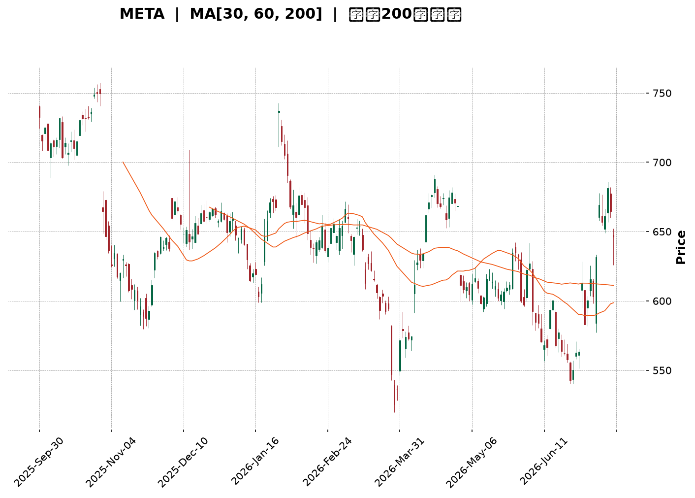
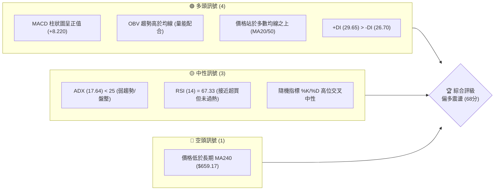
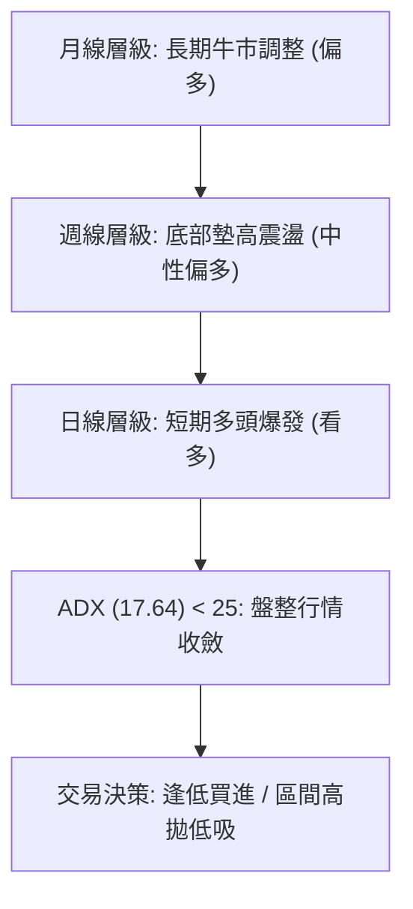
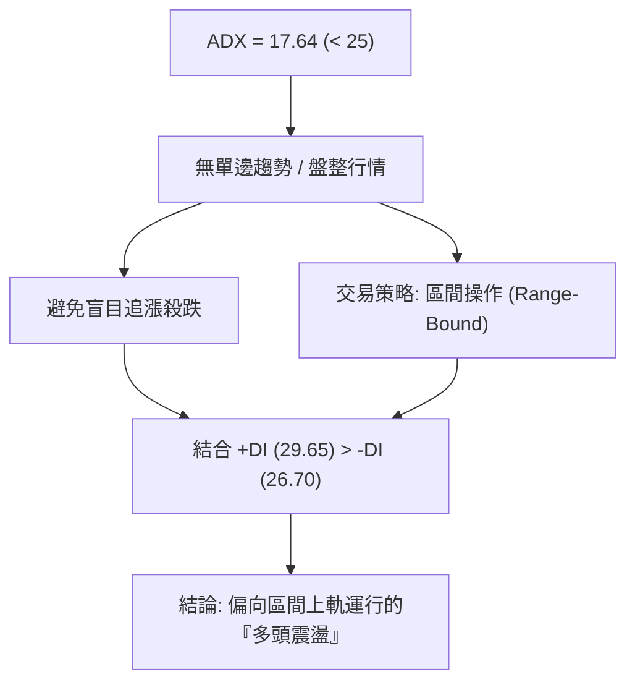
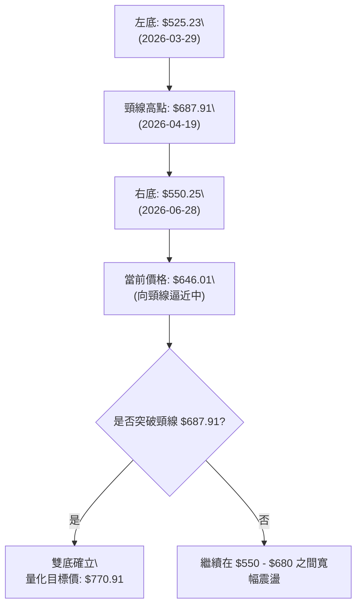
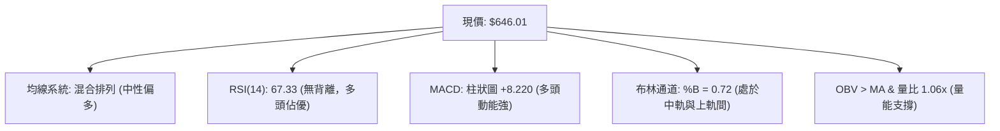
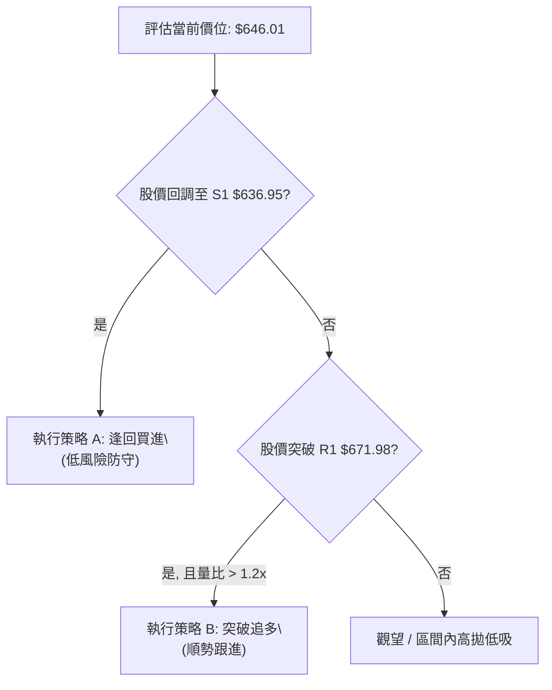
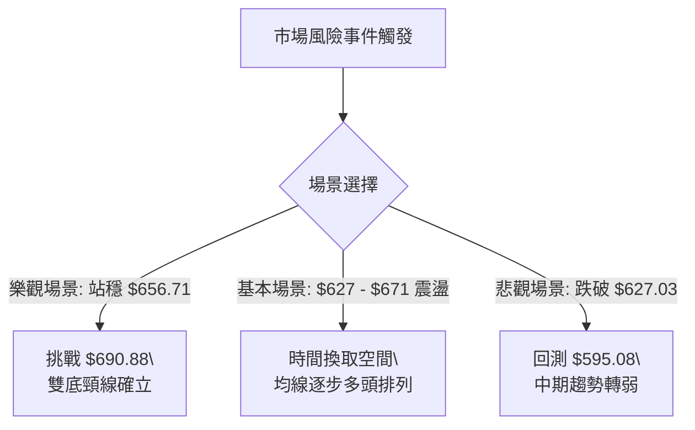

<details>
<summary>📊 靜態圖表 (點擊展開)</summary>

</details>

<html>
<head><meta charset="utf-8" /></head>
<body>
    <div style="height:500px; width:100%;">                        <script>window.PlotlyConfig = {MathJaxConfig: 'local'};</script>
        <script charset="utf-8" src="https://cdn.plot.ly/plotly-3.7.0.min.js" integrity="sha256-jvTGqxNp8AGWEcvNLVuKr+8j5dGe9Yw51LQkmDH+IYA=" crossorigin="anonymous"></script>                <div id="candlestick-chart" class="plotly-graph-div" style="height:100%; width:100%;"></div>            <script>                window.PLOTLYENV=window.PLOTLYENV || {};                                if (document.getElementById("candlestick-chart")) {                    Plotly.newPlot(                        "candlestick-chart",                        [{"close":{"dtype":"f8","bdata":"AAAAwMzjhkAAAABg1VuGQAAAAOBPqYZAAAAA4LslhkAAAACgbU6GQAAAAIDXOYZAAAAA4NJfhkAAAACg29yGQAAAAGDD+4VAAAAAQL9OhkAAAABgfhaGQAAAAECCXYZAAAAAYMgxhkAAAABge1iGQAAAAEAq0oZAAAAAgPHahkAAAABgD9yGQAAAAIDE4IZAAAAAgI4Dh0AAAACA+maHQAAAAODsa4dAAAAAoMJth0AAAADA7cWEQAAAAGBYNYRAAAAAIHLgg0AAAACgio2DQAAAAABn0oNAAAAA4KxKg0AAAABAx2CDQAAAAED4sINAAAAAYKCLg0AAAAAAcfuCQAAAAKB2AoNAAAAAQAj\u002fgkAAAABAlsOCQAAAAOAdoYJAAAAAQE9mgkAAAABA+VyCQAAAAACrhYJAAAAAYK0bg0AAAABgjtSDQAAAACC7v4NAAAAAQCcyhEAAAADgqPmDQAAAAOBeK4RAAAAAwIbvg0AAAAAAg56EQAAAAIBi\u002fYRAAAAA4I\u002fIhEAAAADgC3qEQAAAAGCMQ4RAAAAAgCJYhEAAAABAeBSEQAAAAEDbMoRAAAAAwNZ\u002fhEAAAACAv0KEQAAAAKAiuoRAAAAAoMaMhEAAAACgk6KEQAAAAEAMvoRAAAAAIOTShEAAAAAA37CEQAAAACAjjIRAAAAAIB3GhEAAAABAUZeEQAAAAOADSoRAAAAAgO+MhEAAAADAjJuEQAAAAKBHPIRAAAAA4EYnhEAAAABALV+EQAAAAICdBoRAAAAAALuvg0AAAABgZDODQAAAAICOXYNAAAAAICpZg0AAAADAWtiCQAAAAODyHoNAAAAAgNAzhEAAAABAsoyEQAAAAGBN+YRAAAAAYCz+hEAAAABgUNyEQAAAAID2B4dAAAAAIMtZhkAAAACANwmGQAAAACC\u002fk4VAAAAA4GPehEAAAAAAIuiEQAAAAABCooRAAAAA4BwghUAAAACgNOyEQAAAAKD+24RAAAAAQDlFhEAAAAAADPWDQAAAAIA28YNAAAAA4JgQhEAAAAAgDh2EQAAAAKDwc4RAAAAAIOzgg0AAAAAAS\u002fGDQAAAAGA1ZIRAAAAAoLh+hEAAAAAANTiEQAAAAIArY4RAAAAAAE9vhEAAAAAAVNSEQAAAAIAmm4RAAAAAoLEdhEAAAAAA5jGEQAAAACA+Z4RAAAAAII1thEAAAABgWeiDQAAAAADwJINAAAAAwPOWg0AAAADgqnCDQAAAACDhOINAAAAAIBvxgkAAAADg4YiCQAAAAGAB3IJAAAAAwPeCgkAAAACgtpKCQAAAAIBDGIFAAAAAgN1pgEAAAAAgEb+AQAAAAEDN3IFAAAAAoIwVgkAAAADAbO+BQAAAAGDq44FAAAAA4CP0gUAAAADA0h6DQAAAACB3noNAAAAAwDaqg0AAAABAis+DQAAAACADr4RAAAAAYKr3hEAAAAAg8iGFQAAAAKBMf4VAAAAAYE\u002fyhEAAAAAAxOGEQAAAAADDEIVAAAAAQFGUhEAAAABgPROFQAAAAODuL4VAAAAAQL\u002f1hEAAAADgAOSEQAAAAEC\u002fGoNAAAAAoH0Bg0AAAAAgwg6DQAAAAOAy44JAAAAAAIAig0AAAAAg6UGDQAAAACCGCINAAAAAoHGygkAAAACAiNOCQAAAAOB4QINAAAAA4NtOg0AAAABASi2DQAAAAAAnFYNAAAAAgGrQgkAAAACA\u002f+OCQAAAAGCK9oJAAAAAQI8Ng0AAAAAgLx6DQAAAAOBf1YNAAAAAIJ3Vg0AAAAAAZb+DQAAAAMBPv4JAAAAA4JyogkAAAACgOXODQAAAAEDpl4NAAAAAgJuDgkAAAACgyEaCQAAAAMBjQIJAAAAAQJzTgUAAAACgOr+BQAAAAMCjs4FAAAAAANeLgkAAAAAgrsGCQAAAAOCjvIFAAAAAgMIJgkAAAADAzJ6BQAAAAKCZkYFAAAAAIFxtgUAAAADA9faAQAAAAAAAMoFAAAAAwMyUgUAAAADgUZqBQAAAAKBHJ4NAAAAAQDM3gkAAAADgUcKCQAAAAOCjPINAAAAAwPXYgkAAAAAA17uDQAAAACCu6YRAAAAAANeFhEAAAADgUaiEQAAAAOB6SoVAAAAA4FHEhEAAAACAFDCEQA=="},"high":{"dtype":"f8","bdata":"cxJUXVcoh0DqOkLK0X+GQBW0vqwOr4ZAnPF9aNTIhkAac7vEKViGQIdNjtQWZYZAm2drIkRuhkAAAACg29yGQK9+vMfm6oZAVRhIOZRwhkBkKJ\u002fXjE2GQIenoWMtkIZAXYw0NN2chkCY072EaGWGQOJ105\u002fu3oZAeZY4t6wEh0CSopJNbhWHQGfjEXLfI4dAm3m9O0wah0CN6PfuUI6HQDUu1gV2o4dAZqT3VIaph0Aj+NBkjDmFQCG8YWEdCYVAfcReA\u002fWMhEAqVSkkmgCEQNZI4wKDBIRAdi96Hc3Sg0Dm9NAkIWSDQGmdlInSyoNAz2IWM2qfg0B\u002fMhna3ZqDQFe1HOZhQINAsCqhVLQgg0BjEOpy0xCDQGmwyKjA0IJALjZHIkmOgkC26MwnK+mCQHB+ujCMpIJABGm0O804g0BDmhvXLduDQDGm3OOh5YNAJBQHePMyhEDrjIjbKh2EQATOuciDMYRALGeJm1U5hEBDzy\u002fYxBKFQFXyu8CEB4VAyq\u002fg+aIXhUAb0GrMDLaEQMRLF1t\u002fZoRAWKuvOKRshEDDK2SBPimGQHtE2LqyXoRAdRwIuOGqhECf44+5a6CEQLbYG5jt6oRAEa50BnHuhEBu2z9yCwOFQDgLa0KDxoRAKIThE+zXhEC0r+wbEt6EQO3vrk+YmIRAwRSyIi\u002f4hEAqNVH4hr6EQPX6aAWouYRAE24iiNq6hEB31rYhrsKEQNE5UJvPj4RAhCQe9ZQvhEDwE3wbRW6EQOB+rr1xZoRAL3f02gIJhEAkJBjZpZqDQC8d6\u002fV3eINAbFuozK2fg0Cw5dOzfRKDQH7D5GJaSYNAtM2ZbyabhECNgMkPbcqEQE4NAPqeEIVAGjfFNeschUD6BMhcySOFQLK0G+BmNYdAdwQgG+7WhkDp5wbzH4CGQNiqVjzJXYZAlg4Y5tN8hUBCROGzSkKFQKOvx\u002flY9oRA05ibCr9QhUC\u002fgOUpgTuFQKOYBOt7MIVASeyR3l4WhUCwaAAbKVKEQGJh1U2lC4RAI4U\u002f4s8ehED1kBr2TDCEQPei8bRZsYRAgXWoLDuEhEDKEj1Gv\u002f+DQLx1oM65ZYRACPwwk5WehEAx8sHnREKEQAek0XseloRA2IMqj+6OhEALzt2ek\u002fyEQAaULs8L7IRA5GRMEIJChEDnOvLvxTSEQEog12f+mIRAgqH3FpKPhEDy+u7hsGKEQI2Dkp5loINAZaYTSEzRg0AL2g1Jr9+DQMZHa4iWcINAJDGdjXUjg0A6adjXNNuCQKi6k5CcAINADdx1TYzDgkBpeptZ49iCQAMyl2CuM4JAmOJt18X4gECFRSQ9Z9iAQDdjpSpF6YFAnDrgvQKAgkDZ1Lv2tg+CQN95HbkAMoJAApOeKJT1gUAU5q4B76qDQC6nfxlH54NATX9+1ujvg0BBadrbS9ODQK\u002fZsfkkzYRApWK4YPkuhUBBHUznnieFQHGyIZ4Jl4VAtzVfWvpVhUCQYOxKlxyFQBDCL88DLoVA2Fk7IoXnhEDLsu1NUUCFQOjfbcTxToVACPlah2oshUDygZRlAQ2FQAxQA2wzYoNAE8RZqnRSg0Ac\u002fz2xcyuDQOx8XbE\u002fLoNAT9m19wFbg0Cg+orBNYODQOjym1WXQYNAObb\u002fhszigkABh+YTh9mCQHqjeqybWoNAkT8PMzh5g0Aej2uo\u002f2SDQIfQjfEoOINAKz+SaOQqg0CYlsQMf\u002fuCQMYUN6pICINAUEgr\u002f+wxg0B4aPM1NS+DQBtyKTtF74NAQ33+oDwThEDKceW5TM+DQJudBlhK2YNAlN05iocCg0Ahfv2nk3yDQC7sVgBxDoRAICX2Moqkg0CmEgVXnXuCQC3uUuWcqIJAhffeDS52gkAcHUQIH92BQOBc3uJK\u002fIFAAAAAACnKgkAAAADgeu6CQAAAAOB6joJAAAAAgMIhgkAAAADgev6BQAAAAKCZ4YFAAAAA4FHIgUAAAABguGKBQAAAAMDMZoFAAAAAQDPXgUAAAADgUayBQAAAAIA9ooNAAAAAAAAQg0AAAADgo9yCQAAAAMD1ioNAAAAAAABAg0AAAAAAKcqDQAAAAEDhLoVAAAAAwPUkhUAAAAAAANSEQAAAAOCjcIVAAAAAQDNPhUAAAACgmWGEQA=="},"hovertemplate":"\u003cb\u003e%{x|%Y-%m-%d}\u003c\u002fb\u003e\u003cbr\u003e\u958b: $%{open:.2f}\u003cbr\u003e\u9ad8: $%{high:.2f}\u003cbr\u003e\u4f4e: $%{low:.2f}\u003cbr\u003e\u6536: $%{close:.2f}\u003cextra\u003e\u003c\u002fextra\u003e","low":{"dtype":"f8","bdata":"C1gfzVOjhkDKBcGO3CKGQAjztZU3YoZA+cHTpLMihkCWIHUcwIWFQH9RL5Fa\u002f4VAD\u002fq\u002fqMoPhkBoyfcvvDSGQOuiZbJ19YVAXCY6Mm8OhkCjx8mDIMyFQIwPxhZbHYZASczHwm7whUAZ6GpgTgKGQJI3UXN+coZAczg7g+C2hkA6OsEUN5GGQIOLEgiW2YZA6wkUzgbKhkCc\u002f7uNjlCHQHBpoTOwPIdA8Xlaqqskh0CWXMn43UOEQFctxsQpH4RALQbxwDzUg0ARJKi1FoODQPfNLT5Rh4NA7U90vixDg0BPlPS1H72CQI3TK4QNRINA4K7VGkROg0Bv7HQWjPGCQDzpqXp8y4JAcOlSgj+NgkClLsgd2I6CQB+YsSUgMoJAsw5oD\u002fAdgkBQpWuQsS6CQPqMqxLOIoJA261ILKOggkCHQap0kUWDQE681KTur4NAtD+1xM\u002fOg0B4AuUl2OCDQEzDUHlR44NAkwgWRCvfg0DSGO28s5KEQAIQGblfpYRAyEPbEMK6hEAioGdbKV2EQFtD7iDZDYRAaa4gBhr5g0DckNBboOeDQKdmiICA7INA\u002fQd+\u002f28QhED6KQ04WkCEQI6F8UJUeoRACtnUZhCIhECjKOCP2HuEQGnPlYWfiIRAqXVI4iqohEDhWB6vI6GEQHN3M27MaYRAyZIOc1mFhECDydNeIJKEQIa6kXLVEoRA1gBI4sU0hEC3MksM6lWEQN5dFIZLHYRAgAQKNbTUg0CqVBBcpA2EQKvuzLK0AIRAlAaK3eh3g0DCnYBNzS2DQMh3eRUXKYNAzmewns5Xg0DfVSoGdLeCQOHvBpgXuIJAL2Osf3mLg0Dl1OSOaxqEQGDAYF7moIRAesjbzc+7hED0zTi3T8eEQOk5NvA\u002fOoZAr7WiHI5ChkC+af5pI\u002fKFQJ4BsmqAaYVAlTFSFCzShEAN6CzQsGKEQGIZ4m3KKoRAMGPAHtuMhEAPey9kx+SEQFWZ4INwf4RAT8DoZAwhhECfUmVWhcuDQBggTkFxnYNAeFqYlECYg0CpELCEsNyDQIgNZA4k7YNAnaXzrvDWg0DJ8HVC4Z6DQCkURh75B4RAME\u002f1zcYyhEApkDHP3ueDQOV61yH2yoNA5cnkuJ7tg0DIWoXP\u002fYOEQJr5Lmo3SYRAwy2oiNHXg0DfPdnnT42DQE2XPD3BPoRAUHw61KQ5hEByp+uqIN6DQOhiz2u3A4NA9KnPHy90g0DJAwSy\u002fmiDQNCMbsdTMINA03Rwa57NgkA+DLhnplWCQAxik5Oks4JA6Q4URJ9zgkB+qFfzzYaCQEr6MVLG9oBAqTXC2jk+gEDcpOqdZ4CAQMRm3hccEoFAids9Qk\u002fqgUAaTXY9dHmBQOuxLE\u002fD24FAas9yg+WhgUAJmNOLQXqCQGwUnphic4NA6GfB3AN+g0Bm65k1k36DQCxlhDg59oNAKyvo9Na8hEDsPZerDdmEQL7wB\u002fMJFIVATY2oRA3bhEB3yRFdstWEQNtuvewJ6YRAQ0do8Y9jhEA22EVv4GmEQFmg1EDA8YRA2UcV9BvIhED4pcwRkLmEQNm8xzWOu4JAcuqa4WPsgkC7YX0GidGCQOXQObluvoJAXNVJh16sgkCeDpFTxieDQI0GMoX964JAINqjujWsgkCtuNv4aICCQG9VAB\u002fcoIJAJjEhwXEzg0Cz32N09wWDQJfS40IM2YJAIbgMiPO\u002fgkCgLog\u002fDaqCQHQ3rdYSkoJABfDdphrzgkBVwc956uWCQH2EzCt9A4NAeCked9Glg0BBSQefLnaDQMopVIjMt4JA1u44DQWhgkCEXsiwtr2CQApiXj\u002fUboNARMI0QvYygkDbWGYTeBWCQMLECKrGI4JA73t5uJLQgUDgWE4o9GOBQGZ0xIcLg4FAAAAAYGYagkAAAAAAAICCQAAAACCFsYFAAAAAwMyYgUAAAADgen6BQAAAAAApiIFAAAAAYGZcgUAAAACgcOGAQAAAAEAz44BAAAAAAABwgUAAAACgcDuBQAAAAMDMmIJAAAAAIFwjgkAAAACAFC6CQAAAAKBH3YJAAAAAgBSwgkAAAABgjwiCQAAAAIAUkIRAAAAAoJlxhEAAAABgZkiEQAAAAKBHhYRAAAAAoEehhEAAAAAAAJCDQA=="},"name":"\u50f9\u683c","open":{"dtype":"f8","bdata":"oOWDsJgih0DCCttz8nyGQL\u002fpOx+lhYZAIWbC7+W9hkBxEV+\u002f4vqFQFAnb3ndXoZATGxhcss8hkBOQVKJVWOGQEEq7wMxyIZA5B2dakg5hkByUT8\u002fjQ+GQNNLaVqZWYZAL2b5QoJdhkCbxr9m9wmGQHQmoJWNeoZA50H\u002f4+LwhkCMJL1kad+GQPXv82da5oZAh19Tdwf3hkBabH3qR16HQFhmga1rdYdAfkDpIlaGh0B2sf5CUNuEQA3XMCYVBoVAUChq1GJyhECNis5MSZODQMc5oJZbtYNAJsWEqZrRg0A5ilRbIDeDQOL7Lq+fq4NA2onFnPeSg0DEILorAZSDQO3xGFvWG4NAWFikv9TBgkC2SAdHrvuCQENZftqFcIJAUuT5T3CBgkBvOyjDec+CQJG5HYzJV4JAFSXaoVWpgkCp0CzMDHODQKniDlNJ4INAvUDaj3DTg0Dx61eDIO+DQNci08ljBYRAYZQpEugVhEDigyig+BGFQGjRd2s4soRALsdsYdTchECZbQGSYrCEQKtTy7QcQoRAnu2jS\u002fgMhEBXmSwI6kCEQPwEt\u002flmJIRA8MhtR9UShEDQTxF4inOEQBwz0o7hfoRAMAw52t3JhECnafBTxqOEQLCyK1X\u002floRA3gQ1js2qhEBoR9Ka9taEQHSBzPq0hoRAQXaQGSOMhEDLHLThh7yEQCUIFFNmrIRAfADtfs5OhEDfFDA0KpOEQP1R\u002fufHc4RA8LUI6NYlhEAqmARKUyKEQJe25\u002f3xWoRAL3f02gIJhEBjgYtVE4uDQNjB25UHS4NAo6kea4x4g0Cq4OSJYfaCQLNgqe5G7YJAOUSwqdWhg0DH1SfE+RyEQFLGh72Qv4RA5baVVxwLhUB3uHBVZAqFQDHqhnXvAIdApQTWAqOxhkCp1wDCnkqGQK6RwRriEIZAzwUMCQt0hUATMaftL7OEQJDY1a1wwoRAPJwhM\u002f6vhECtSz3JJSOFQPAk2SJmBoVAodfYWzfmhEBlCUxQnB+EQAcu7dvj8oNAdOUNGl\u002fFg0BJGomlduuDQGsE4Vxo9INA4ePdPQZbhEA088gun7+DQC3TLnIWC4RA8YetDiJLhEDGL4Y\u002fbxKEQA8Ukg404INAL7rcwhU5hEAeMcHAToaEQPdhZMoCpoRA30\u002fwifg1hECgyK67Ms2DQBkBInwrY4RASaZVvcBshEAzoFE0wjyEQL4W9H87doNAdVoef1G7g0C3TIekRJuDQPOglp8nPoNAAAs+aqocg0Afy5UIxdeCQAwlKRjV6YJA74LZp1y0gkDS4fUSfLGCQICzMdiaL4JAFUmleszcgEAAAAAgEb+AQCjfewHEK4FAdI4WK74cgkAeGaJ3IKyBQNDH7aQ9CYJArJinX5nfgUBQy7bMguuCQC2ZXpEdk4NASo3jQQ\u002fPg0B6rNJJVqeDQFvhZKv+FIRAOiRaLw\u002fThED07DmL6RqFQDDCdN7FL4VA16n\u002fLtVFhUBBAGSHB\u002fOEQL6Bwm7iDYVA5MAZ\u002f664hEDKFmMlq52EQO+xK5MH84RAdZUi4OwMhUAoJPUlU+KEQNQtv\u002fL4VYNAZjtnfPcwg0CPdAhPBPuCQMP0QMrvJYNAcPYjj\u002fLDgkBQs7C2NDGDQHUp1O8KNYNAdocJ7BTggkDsvBtjJ5KCQLlnfkE0soJAMAer2287g0DSo4A0XyuDQBuqixteBINA5BK9aNkCg0BCzHBHocGCQC699B6Ou4JARdpkg4n6gkC1IesKnAKDQO7hm6mvBoNAoRwmREP3g0DgvmCfTseDQKu+Xb2HroNA9AlnfHPVgkArW3yDiNOCQE0sYWW9eINAc7Qs3Q93g0CmEgVXnXuCQBudEjifc4JAtxHVwokhgkC3METOcqqBQNyUmQ1b44FAAAAAQDMfgkAAAABAM42CQAAAAAAAgIJAAAAAYI\u002fmgUAAAAAAKeCBQAAAAAAAkoFAAAAAwB6PgUAAAABgZlyBQAAAAGC4+oBAAAAAAACAgUAAAAAghYeBQAAAAKBH\u002f4JAAAAAQDP\u002fgkAAAABguJaCQAAAAGC4\u002fIJAAAAAwB4zg0AAAACA6z+CQAAAAGC4ooRAAAAAQAqrhEAAAAAAAGCEQAAAAMDMvIRAAAAAgD0qhUAAAACgmT2EQA=="},"x":["2025-09-30T00:00:00-04:00","2025-10-01T00:00:00-04:00","2025-10-02T00:00:00-04:00","2025-10-03T00:00:00-04:00","2025-10-06T00:00:00-04:00","2025-10-07T00:00:00-04:00","2025-10-08T00:00:00-04:00","2025-10-09T00:00:00-04:00","2025-10-10T00:00:00-04:00","2025-10-13T00:00:00-04:00","2025-10-14T00:00:00-04:00","2025-10-15T00:00:00-04:00","2025-10-16T00:00:00-04:00","2025-10-17T00:00:00-04:00","2025-10-20T00:00:00-04:00","2025-10-21T00:00:00-04:00","2025-10-22T00:00:00-04:00","2025-10-23T00:00:00-04:00","2025-10-24T00:00:00-04:00","2025-10-27T00:00:00-04:00","2025-10-28T00:00:00-04:00","2025-10-29T00:00:00-04:00","2025-10-30T00:00:00-04:00","2025-10-31T00:00:00-04:00","2025-11-03T00:00:00-05:00","2025-11-04T00:00:00-05:00","2025-11-05T00:00:00-05:00","2025-11-06T00:00:00-05:00","2025-11-07T00:00:00-05:00","2025-11-10T00:00:00-05:00","2025-11-11T00:00:00-05:00","2025-11-12T00:00:00-05:00","2025-11-13T00:00:00-05:00","2025-11-14T00:00:00-05:00","2025-11-17T00:00:00-05:00","2025-11-18T00:00:00-05:00","2025-11-19T00:00:00-05:00","2025-11-20T00:00:00-05:00","2025-11-21T00:00:00-05:00","2025-11-24T00:00:00-05:00","2025-11-25T00:00:00-05:00","2025-11-26T00:00:00-05:00","2025-11-28T00:00:00-05:00","2025-12-01T00:00:00-05:00","2025-12-02T00:00:00-05:00","2025-12-03T00:00:00-05:00","2025-12-04T00:00:00-05:00","2025-12-05T00:00:00-05:00","2025-12-08T00:00:00-05:00","2025-12-09T00:00:00-05:00","2025-12-10T00:00:00-05:00","2025-12-11T00:00:00-05:00","2025-12-12T00:00:00-05:00","2025-12-15T00:00:00-05:00","2025-12-16T00:00:00-05:00","2025-12-17T00:00:00-05:00","2025-12-18T00:00:00-05:00","2025-12-19T00:00:00-05:00","2025-12-22T00:00:00-05:00","2025-12-23T00:00:00-05:00","2025-12-24T00:00:00-05:00","2025-12-26T00:00:00-05:00","2025-12-29T00:00:00-05:00","2025-12-30T00:00:00-05:00","2025-12-31T00:00:00-05:00","2026-01-02T00:00:00-05:00","2026-01-05T00:00:00-05:00","2026-01-06T00:00:00-05:00","2026-01-07T00:00:00-05:00","2026-01-08T00:00:00-05:00","2026-01-09T00:00:00-05:00","2026-01-12T00:00:00-05:00","2026-01-13T00:00:00-05:00","2026-01-14T00:00:00-05:00","2026-01-15T00:00:00-05:00","2026-01-16T00:00:00-05:00","2026-01-20T00:00:00-05:00","2026-01-21T00:00:00-05:00","2026-01-22T00:00:00-05:00","2026-01-23T00:00:00-05:00","2026-01-26T00:00:00-05:00","2026-01-27T00:00:00-05:00","2026-01-28T00:00:00-05:00","2026-01-29T00:00:00-05:00","2026-01-30T00:00:00-05:00","2026-02-02T00:00:00-05:00","2026-02-03T00:00:00-05:00","2026-02-04T00:00:00-05:00","2026-02-05T00:00:00-05:00","2026-02-06T00:00:00-05:00","2026-02-09T00:00:00-05:00","2026-02-10T00:00:00-05:00","2026-02-11T00:00:00-05:00","2026-02-12T00:00:00-05:00","2026-02-13T00:00:00-05:00","2026-02-17T00:00:00-05:00","2026-02-18T00:00:00-05:00","2026-02-19T00:00:00-05:00","2026-02-20T00:00:00-05:00","2026-02-23T00:00:00-05:00","2026-02-24T00:00:00-05:00","2026-02-25T00:00:00-05:00","2026-02-26T00:00:00-05:00","2026-02-27T00:00:00-05:00","2026-03-02T00:00:00-05:00","2026-03-03T00:00:00-05:00","2026-03-04T00:00:00-05:00","2026-03-05T00:00:00-05:00","2026-03-06T00:00:00-05:00","2026-03-09T00:00:00-04:00","2026-03-10T00:00:00-04:00","2026-03-11T00:00:00-04:00","2026-03-12T00:00:00-04:00","2026-03-13T00:00:00-04:00","2026-03-16T00:00:00-04:00","2026-03-17T00:00:00-04:00","2026-03-18T00:00:00-04:00","2026-03-19T00:00:00-04:00","2026-03-20T00:00:00-04:00","2026-03-23T00:00:00-04:00","2026-03-24T00:00:00-04:00","2026-03-25T00:00:00-04:00","2026-03-26T00:00:00-04:00","2026-03-27T00:00:00-04:00","2026-03-30T00:00:00-04:00","2026-03-31T00:00:00-04:00","2026-04-01T00:00:00-04:00","2026-04-02T00:00:00-04:00","2026-04-06T00:00:00-04:00","2026-04-07T00:00:00-04:00","2026-04-08T00:00:00-04:00","2026-04-09T00:00:00-04:00","2026-04-10T00:00:00-04:00","2026-04-13T00:00:00-04:00","2026-04-14T00:00:00-04:00","2026-04-15T00:00:00-04:00","2026-04-16T00:00:00-04:00","2026-04-17T00:00:00-04:00","2026-04-20T00:00:00-04:00","2026-04-21T00:00:00-04:00","2026-04-22T00:00:00-04:00","2026-04-23T00:00:00-04:00","2026-04-24T00:00:00-04:00","2026-04-27T00:00:00-04:00","2026-04-28T00:00:00-04:00","2026-04-29T00:00:00-04:00","2026-04-30T00:00:00-04:00","2026-05-01T00:00:00-04:00","2026-05-04T00:00:00-04:00","2026-05-05T00:00:00-04:00","2026-05-06T00:00:00-04:00","2026-05-07T00:00:00-04:00","2026-05-08T00:00:00-04:00","2026-05-11T00:00:00-04:00","2026-05-12T00:00:00-04:00","2026-05-13T00:00:00-04:00","2026-05-14T00:00:00-04:00","2026-05-15T00:00:00-04:00","2026-05-18T00:00:00-04:00","2026-05-19T00:00:00-04:00","2026-05-20T00:00:00-04:00","2026-05-21T00:00:00-04:00","2026-05-22T00:00:00-04:00","2026-05-26T00:00:00-04:00","2026-05-27T00:00:00-04:00","2026-05-28T00:00:00-04:00","2026-05-29T00:00:00-04:00","2026-06-01T00:00:00-04:00","2026-06-02T00:00:00-04:00","2026-06-03T00:00:00-04:00","2026-06-04T00:00:00-04:00","2026-06-05T00:00:00-04:00","2026-06-08T00:00:00-04:00","2026-06-09T00:00:00-04:00","2026-06-10T00:00:00-04:00","2026-06-11T00:00:00-04:00","2026-06-12T00:00:00-04:00","2026-06-15T00:00:00-04:00","2026-06-16T00:00:00-04:00","2026-06-17T00:00:00-04:00","2026-06-18T00:00:00-04:00","2026-06-22T00:00:00-04:00","2026-06-23T00:00:00-04:00","2026-06-24T00:00:00-04:00","2026-06-25T00:00:00-04:00","2026-06-26T00:00:00-04:00","2026-06-29T00:00:00-04:00","2026-06-30T00:00:00-04:00","2026-07-01T00:00:00-04:00","2026-07-02T00:00:00-04:00","2026-07-06T00:00:00-04:00","2026-07-07T00:00:00-04:00","2026-07-08T00:00:00-04:00","2026-07-09T00:00:00-04:00","2026-07-10T00:00:00-04:00","2026-07-13T00:00:00-04:00","2026-07-14T00:00:00-04:00","2026-07-15T00:00:00-04:00","2026-07-16T00:00:00-04:00","2026-07-17T00:00:00-04:00"],"type":"candlestick"},{"hovertemplate":"MA30: $%{y:.2f}\u003cextra\u003e\u003c\u002fextra\u003e","line":{"color":"#2196F3","dash":"dash","width":2},"mode":"lines","name":"MA30","x":["2025-09-30T00:00:00-04:00","2025-10-01T00:00:00-04:00","2025-10-02T00:00:00-04:00","2025-10-03T00:00:00-04:00","2025-10-06T00:00:00-04:00","2025-10-07T00:00:00-04:00","2025-10-08T00:00:00-04:00","2025-10-09T00:00:00-04:00","2025-10-10T00:00:00-04:00","2025-10-13T00:00:00-04:00","2025-10-14T00:00:00-04:00","2025-10-15T00:00:00-04:00","2025-10-16T00:00:00-04:00","2025-10-17T00:00:00-04:00","2025-10-20T00:00:00-04:00","2025-10-21T00:00:00-04:00","2025-10-22T00:00:00-04:00","2025-10-23T00:00:00-04:00","2025-10-24T00:00:00-04:00","2025-10-27T00:00:00-04:00","2025-10-28T00:00:00-04:00","2025-10-29T00:00:00-04:00","2025-10-30T00:00:00-04:00","2025-10-31T00:00:00-04:00","2025-11-03T00:00:00-05:00","2025-11-04T00:00:00-05:00","2025-11-05T00:00:00-05:00","2025-11-06T00:00:00-05:00","2025-11-07T00:00:00-05:00","2025-11-10T00:00:00-05:00","2025-11-11T00:00:00-05:00","2025-11-12T00:00:00-05:00","2025-11-13T00:00:00-05:00","2025-11-14T00:00:00-05:00","2025-11-17T00:00:00-05:00","2025-11-18T00:00:00-05:00","2025-11-19T00:00:00-05:00","2025-11-20T00:00:00-05:00","2025-11-21T00:00:00-05:00","2025-11-24T00:00:00-05:00","2025-11-25T00:00:00-05:00","2025-11-26T00:00:00-05:00","2025-11-28T00:00:00-05:00","2025-12-01T00:00:00-05:00","2025-12-02T00:00:00-05:00","2025-12-03T00:00:00-05:00","2025-12-04T00:00:00-05:00","2025-12-05T00:00:00-05:00","2025-12-08T00:00:00-05:00","2025-12-09T00:00:00-05:00","2025-12-10T00:00:00-05:00","2025-12-11T00:00:00-05:00","2025-12-12T00:00:00-05:00","2025-12-15T00:00:00-05:00","2025-12-16T00:00:00-05:00","2025-12-17T00:00:00-05:00","2025-12-18T00:00:00-05:00","2025-12-19T00:00:00-05:00","2025-12-22T00:00:00-05:00","2025-12-23T00:00:00-05:00","2025-12-24T00:00:00-05:00","2025-12-26T00:00:00-05:00","2025-12-29T00:00:00-05:00","2025-12-30T00:00:00-05:00","2025-12-31T00:00:00-05:00","2026-01-02T00:00:00-05:00","2026-01-05T00:00:00-05:00","2026-01-06T00:00:00-05:00","2026-01-07T00:00:00-05:00","2026-01-08T00:00:00-05:00","2026-01-09T00:00:00-05:00","2026-01-12T00:00:00-05:00","2026-01-13T00:00:00-05:00","2026-01-14T00:00:00-05:00","2026-01-15T00:00:00-05:00","2026-01-16T00:00:00-05:00","2026-01-20T00:00:00-05:00","2026-01-21T00:00:00-05:00","2026-01-22T00:00:00-05:00","2026-01-23T00:00:00-05:00","2026-01-26T00:00:00-05:00","2026-01-27T00:00:00-05:00","2026-01-28T00:00:00-05:00","2026-01-29T00:00:00-05:00","2026-01-30T00:00:00-05:00","2026-02-02T00:00:00-05:00","2026-02-03T00:00:00-05:00","2026-02-04T00:00:00-05:00","2026-02-05T00:00:00-05:00","2026-02-06T00:00:00-05:00","2026-02-09T00:00:00-05:00","2026-02-10T00:00:00-05:00","2026-02-11T00:00:00-05:00","2026-02-12T00:00:00-05:00","2026-02-13T00:00:00-05:00","2026-02-17T00:00:00-05:00","2026-02-18T00:00:00-05:00","2026-02-19T00:00:00-05:00","2026-02-20T00:00:00-05:00","2026-02-23T00:00:00-05:00","2026-02-24T00:00:00-05:00","2026-02-25T00:00:00-05:00","2026-02-26T00:00:00-05:00","2026-02-27T00:00:00-05:00","2026-03-02T00:00:00-05:00","2026-03-03T00:00:00-05:00","2026-03-04T00:00:00-05:00","2026-03-05T00:00:00-05:00","2026-03-06T00:00:00-05:00","2026-03-09T00:00:00-04:00","2026-03-10T00:00:00-04:00","2026-03-11T00:00:00-04:00","2026-03-12T00:00:00-04:00","2026-03-13T00:00:00-04:00","2026-03-16T00:00:00-04:00","2026-03-17T00:00:00-04:00","2026-03-18T00:00:00-04:00","2026-03-19T00:00:00-04:00","2026-03-20T00:00:00-04:00","2026-03-23T00:00:00-04:00","2026-03-24T00:00:00-04:00","2026-03-25T00:00:00-04:00","2026-03-26T00:00:00-04:00","2026-03-27T00:00:00-04:00","2026-03-30T00:00:00-04:00","2026-03-31T00:00:00-04:00","2026-04-01T00:00:00-04:00","2026-04-02T00:00:00-04:00","2026-04-06T00:00:00-04:00","2026-04-07T00:00:00-04:00","2026-04-08T00:00:00-04:00","2026-04-09T00:00:00-04:00","2026-04-10T00:00:00-04:00","2026-04-13T00:00:00-04:00","2026-04-14T00:00:00-04:00","2026-04-15T00:00:00-04:00","2026-04-16T00:00:00-04:00","2026-04-17T00:00:00-04:00","2026-04-20T00:00:00-04:00","2026-04-21T00:00:00-04:00","2026-04-22T00:00:00-04:00","2026-04-23T00:00:00-04:00","2026-04-24T00:00:00-04:00","2026-04-27T00:00:00-04:00","2026-04-28T00:00:00-04:00","2026-04-29T00:00:00-04:00","2026-04-30T00:00:00-04:00","2026-05-01T00:00:00-04:00","2026-05-04T00:00:00-04:00","2026-05-05T00:00:00-04:00","2026-05-06T00:00:00-04:00","2026-05-07T00:00:00-04:00","2026-05-08T00:00:00-04:00","2026-05-11T00:00:00-04:00","2026-05-12T00:00:00-04:00","2026-05-13T00:00:00-04:00","2026-05-14T00:00:00-04:00","2026-05-15T00:00:00-04:00","2026-05-18T00:00:00-04:00","2026-05-19T00:00:00-04:00","2026-05-20T00:00:00-04:00","2026-05-21T00:00:00-04:00","2026-05-22T00:00:00-04:00","2026-05-26T00:00:00-04:00","2026-05-27T00:00:00-04:00","2026-05-28T00:00:00-04:00","2026-05-29T00:00:00-04:00","2026-06-01T00:00:00-04:00","2026-06-02T00:00:00-04:00","2026-06-03T00:00:00-04:00","2026-06-04T00:00:00-04:00","2026-06-05T00:00:00-04:00","2026-06-08T00:00:00-04:00","2026-06-09T00:00:00-04:00","2026-06-10T00:00:00-04:00","2026-06-11T00:00:00-04:00","2026-06-12T00:00:00-04:00","2026-06-15T00:00:00-04:00","2026-06-16T00:00:00-04:00","2026-06-17T00:00:00-04:00","2026-06-18T00:00:00-04:00","2026-06-22T00:00:00-04:00","2026-06-23T00:00:00-04:00","2026-06-24T00:00:00-04:00","2026-06-25T00:00:00-04:00","2026-06-26T00:00:00-04:00","2026-06-29T00:00:00-04:00","2026-06-30T00:00:00-04:00","2026-07-01T00:00:00-04:00","2026-07-02T00:00:00-04:00","2026-07-06T00:00:00-04:00","2026-07-07T00:00:00-04:00","2026-07-08T00:00:00-04:00","2026-07-09T00:00:00-04:00","2026-07-10T00:00:00-04:00","2026-07-13T00:00:00-04:00","2026-07-14T00:00:00-04:00","2026-07-15T00:00:00-04:00","2026-07-16T00:00:00-04:00","2026-07-17T00:00:00-04:00"],"y":{"dtype":"f8","bdata":"AAAAAAAA+H8AAAAAAAD4fwAAAAAAAPh\u002fAAAAAAAA+H8AAAAAAAD4fwAAAAAAAPh\u002fAAAAAAAA+H8AAAAAAAD4fwAAAAAAAPh\u002fAAAAAAAA+H8AAAAAAAD4fwAAAAAAAPh\u002fAAAAAAAA+H8AAAAAAAD4fwAAAAAAAPh\u002fAAAAAAAA+H8AAAAAAAD4fwAAAAAAAPh\u002fAAAAAAAA+H8AAAAAAAD4fwAAAAAAAPh\u002fAAAAAAAA+H8AAAAAAAD4fwAAAAAAAPh\u002fAAAAAAAA+H8AAAAAAAD4fwAAAAAAAPh\u002fAAAAAAAA+H8AAAAAAAD4fyIiIrIn4YVA7+7urp3EhUCamZmJzaeFQJqZmSmkiIVA7+7uTsBthUDe3d3thU+FQDMzMxPVMIVAmpmZSeoOhUAAAADghOiEQHd3d4f7yoRAIiIiIq6vhEBmZmZmapyEQGZmZvYWhoRA7+7uDgl1hEB3d3fXzmCEQGZmZnYuSoRAERERgUQxhECamZk5Jh6EQLy7u1sJDoRA7+7u3gD7g0C8u7v7CeKDQFVVVdUXx4NAIiIissWsg0ARERFh26aDQERERCTGpoNAvLu7Sxasg0B3d3eXILKDQLy7uwvauYNAMzMzo5bEg0BmZmamUM+DQImIiMhI2INAERERcTHjg0DNzMwsxvGDQGZmZobl\u002foNAMzMz4xAOhEAAAAAwqB2EQM3MzPzRK4RAmpmZqSw+hEBmZma2U1GEQImIiIjyX4RAzczMDN5ohEAiIiLyfG2EQDMzM9PZb4RAIiIi4oBrhEAAAAAA5WSEQImIiLgIXoRAIiIiogVZhECJiIgo4kmEQBEREYHvOYRAERERMfo0hEBmZmZWmTWEQN7d3U2oO4RAq6qqKjFBhEARERGB2keEQERERBQGYIRA3t3dfdJvhEAAAACg+H6EQDMzM5M5hoRAREREBPKIhEAAAACQQ4uEQLy7u2tWioRAERERYemMhEAzMzOz446EQGZmZiaNkYRAmpmZSUGNhEBERESU2IeEQM3MzMzihIRAd3d3x72AhEC8u7tbhnyEQDMzM1NhfoRAd3d39wh8hECrqqpKX3iEQERERPR9e4RAZmZmRmSChEBVVVXlFYuEQERERFTOk4RAMzMz0xOdhECJiIiIAq6EQLy7u+uuuoRAiYiIKPK5hECamZlZ67aEQJqZmfkMsoRA3t3d3TqthECJiIgIGaWEQGZmZibug4RAAAAAcF5shEDe3d2dN1aEQGZmZiYfQoRAq6qqyq0xhEC8u7vrbx2EQCIiIqJLDoRAiYiImP33g0DNzMzc8OODQGZmZgbRw4NAERERkeeig0BmZmZWgYeDQImIiBjCdYNAmpmZSdtkg0B3d3fXRFKDQERERMRmPINAERERsfkrg0Dv7u6u9SSDQGZmZkZeHoNAERER4UgXg0CJiIi4yxODQImIiOhSFoNAzczMfN4ag0AzMzPTdB2DQCIiIrIPJYNAVVVVBSYsg0ARERHBAjKDQBEREVGpN4NA7+7uHvQ4g0B3d3en6kKDQM3MzIxZVINAAAAAAAtgg0C8u7u7a2yDQKuqqppqa4NAvLu7a\u002fZrg0BERETUbHCDQGZmZjaqcINA3t3djft1g0AiIiKS0nuDQDMzM1NdjINAq6qqutmfg0ARERFxmbGDQO\u002fu7n50vYNAIiIiEubHg0BVVVWFftKDQFVVVTWr3INAVVVV5QLkg0C8u7vrDOKDQGZmZvZz3INA3t3dLTvXg0De3d29UdGDQBEREZEQyoNAVVVVdWXAg0BERET0k7SDQHd3d5ccnYNAREREpJaJg0BERETUXn2DQJqZmQnPcINAERERYS9fg0Dv7u6eTUeDQDMzM3NALoNAzczMjIMTg0BEREQksPiCQCIiIsK37IJA3t3dzcvogkAiIiISOuaCQBEREYFo3IJAq6qq2gzTgkARERFxFMWCQHd3dxeVuIJAq6qqCr+tgkCJiIhI3J2CQImIiLhPjIJAvLu7e5N9gkDe3d3NJHCCQN7d3X2\u002fcIJAzczMDKRrgkCamZmphGqCQImIiNjabIJA7+7u\u002fhlrgkAzMzNTW3CCQCIiIiKReYJA3t3d7XB\u002fgkDv7u6ONIeCQCIiIjLpnIJAIiIisuaugkAiIiJCMrWCQA=="},"type":"scatter"},{"hovertemplate":"MA60: $%{y:.2f}\u003cextra\u003e\u003c\u002fextra\u003e","line":{"color":"#9C27B0","dash":"dash","width":2},"mode":"lines","name":"MA60","x":["2025-09-30T00:00:00-04:00","2025-10-01T00:00:00-04:00","2025-10-02T00:00:00-04:00","2025-10-03T00:00:00-04:00","2025-10-06T00:00:00-04:00","2025-10-07T00:00:00-04:00","2025-10-08T00:00:00-04:00","2025-10-09T00:00:00-04:00","2025-10-10T00:00:00-04:00","2025-10-13T00:00:00-04:00","2025-10-14T00:00:00-04:00","2025-10-15T00:00:00-04:00","2025-10-16T00:00:00-04:00","2025-10-17T00:00:00-04:00","2025-10-20T00:00:00-04:00","2025-10-21T00:00:00-04:00","2025-10-22T00:00:00-04:00","2025-10-23T00:00:00-04:00","2025-10-24T00:00:00-04:00","2025-10-27T00:00:00-04:00","2025-10-28T00:00:00-04:00","2025-10-29T00:00:00-04:00","2025-10-30T00:00:00-04:00","2025-10-31T00:00:00-04:00","2025-11-03T00:00:00-05:00","2025-11-04T00:00:00-05:00","2025-11-05T00:00:00-05:00","2025-11-06T00:00:00-05:00","2025-11-07T00:00:00-05:00","2025-11-10T00:00:00-05:00","2025-11-11T00:00:00-05:00","2025-11-12T00:00:00-05:00","2025-11-13T00:00:00-05:00","2025-11-14T00:00:00-05:00","2025-11-17T00:00:00-05:00","2025-11-18T00:00:00-05:00","2025-11-19T00:00:00-05:00","2025-11-20T00:00:00-05:00","2025-11-21T00:00:00-05:00","2025-11-24T00:00:00-05:00","2025-11-25T00:00:00-05:00","2025-11-26T00:00:00-05:00","2025-11-28T00:00:00-05:00","2025-12-01T00:00:00-05:00","2025-12-02T00:00:00-05:00","2025-12-03T00:00:00-05:00","2025-12-04T00:00:00-05:00","2025-12-05T00:00:00-05:00","2025-12-08T00:00:00-05:00","2025-12-09T00:00:00-05:00","2025-12-10T00:00:00-05:00","2025-12-11T00:00:00-05:00","2025-12-12T00:00:00-05:00","2025-12-15T00:00:00-05:00","2025-12-16T00:00:00-05:00","2025-12-17T00:00:00-05:00","2025-12-18T00:00:00-05:00","2025-12-19T00:00:00-05:00","2025-12-22T00:00:00-05:00","2025-12-23T00:00:00-05:00","2025-12-24T00:00:00-05:00","2025-12-26T00:00:00-05:00","2025-12-29T00:00:00-05:00","2025-12-30T00:00:00-05:00","2025-12-31T00:00:00-05:00","2026-01-02T00:00:00-05:00","2026-01-05T00:00:00-05:00","2026-01-06T00:00:00-05:00","2026-01-07T00:00:00-05:00","2026-01-08T00:00:00-05:00","2026-01-09T00:00:00-05:00","2026-01-12T00:00:00-05:00","2026-01-13T00:00:00-05:00","2026-01-14T00:00:00-05:00","2026-01-15T00:00:00-05:00","2026-01-16T00:00:00-05:00","2026-01-20T00:00:00-05:00","2026-01-21T00:00:00-05:00","2026-01-22T00:00:00-05:00","2026-01-23T00:00:00-05:00","2026-01-26T00:00:00-05:00","2026-01-27T00:00:00-05:00","2026-01-28T00:00:00-05:00","2026-01-29T00:00:00-05:00","2026-01-30T00:00:00-05:00","2026-02-02T00:00:00-05:00","2026-02-03T00:00:00-05:00","2026-02-04T00:00:00-05:00","2026-02-05T00:00:00-05:00","2026-02-06T00:00:00-05:00","2026-02-09T00:00:00-05:00","2026-02-10T00:00:00-05:00","2026-02-11T00:00:00-05:00","2026-02-12T00:00:00-05:00","2026-02-13T00:00:00-05:00","2026-02-17T00:00:00-05:00","2026-02-18T00:00:00-05:00","2026-02-19T00:00:00-05:00","2026-02-20T00:00:00-05:00","2026-02-23T00:00:00-05:00","2026-02-24T00:00:00-05:00","2026-02-25T00:00:00-05:00","2026-02-26T00:00:00-05:00","2026-02-27T00:00:00-05:00","2026-03-02T00:00:00-05:00","2026-03-03T00:00:00-05:00","2026-03-04T00:00:00-05:00","2026-03-05T00:00:00-05:00","2026-03-06T00:00:00-05:00","2026-03-09T00:00:00-04:00","2026-03-10T00:00:00-04:00","2026-03-11T00:00:00-04:00","2026-03-12T00:00:00-04:00","2026-03-13T00:00:00-04:00","2026-03-16T00:00:00-04:00","2026-03-17T00:00:00-04:00","2026-03-18T00:00:00-04:00","2026-03-19T00:00:00-04:00","2026-03-20T00:00:00-04:00","2026-03-23T00:00:00-04:00","2026-03-24T00:00:00-04:00","2026-03-25T00:00:00-04:00","2026-03-26T00:00:00-04:00","2026-03-27T00:00:00-04:00","2026-03-30T00:00:00-04:00","2026-03-31T00:00:00-04:00","2026-04-01T00:00:00-04:00","2026-04-02T00:00:00-04:00","2026-04-06T00:00:00-04:00","2026-04-07T00:00:00-04:00","2026-04-08T00:00:00-04:00","2026-04-09T00:00:00-04:00","2026-04-10T00:00:00-04:00","2026-04-13T00:00:00-04:00","2026-04-14T00:00:00-04:00","2026-04-15T00:00:00-04:00","2026-04-16T00:00:00-04:00","2026-04-17T00:00:00-04:00","2026-04-20T00:00:00-04:00","2026-04-21T00:00:00-04:00","2026-04-22T00:00:00-04:00","2026-04-23T00:00:00-04:00","2026-04-24T00:00:00-04:00","2026-04-27T00:00:00-04:00","2026-04-28T00:00:00-04:00","2026-04-29T00:00:00-04:00","2026-04-30T00:00:00-04:00","2026-05-01T00:00:00-04:00","2026-05-04T00:00:00-04:00","2026-05-05T00:00:00-04:00","2026-05-06T00:00:00-04:00","2026-05-07T00:00:00-04:00","2026-05-08T00:00:00-04:00","2026-05-11T00:00:00-04:00","2026-05-12T00:00:00-04:00","2026-05-13T00:00:00-04:00","2026-05-14T00:00:00-04:00","2026-05-15T00:00:00-04:00","2026-05-18T00:00:00-04:00","2026-05-19T00:00:00-04:00","2026-05-20T00:00:00-04:00","2026-05-21T00:00:00-04:00","2026-05-22T00:00:00-04:00","2026-05-26T00:00:00-04:00","2026-05-27T00:00:00-04:00","2026-05-28T00:00:00-04:00","2026-05-29T00:00:00-04:00","2026-06-01T00:00:00-04:00","2026-06-02T00:00:00-04:00","2026-06-03T00:00:00-04:00","2026-06-04T00:00:00-04:00","2026-06-05T00:00:00-04:00","2026-06-08T00:00:00-04:00","2026-06-09T00:00:00-04:00","2026-06-10T00:00:00-04:00","2026-06-11T00:00:00-04:00","2026-06-12T00:00:00-04:00","2026-06-15T00:00:00-04:00","2026-06-16T00:00:00-04:00","2026-06-17T00:00:00-04:00","2026-06-18T00:00:00-04:00","2026-06-22T00:00:00-04:00","2026-06-23T00:00:00-04:00","2026-06-24T00:00:00-04:00","2026-06-25T00:00:00-04:00","2026-06-26T00:00:00-04:00","2026-06-29T00:00:00-04:00","2026-06-30T00:00:00-04:00","2026-07-01T00:00:00-04:00","2026-07-02T00:00:00-04:00","2026-07-06T00:00:00-04:00","2026-07-07T00:00:00-04:00","2026-07-08T00:00:00-04:00","2026-07-09T00:00:00-04:00","2026-07-10T00:00:00-04:00","2026-07-13T00:00:00-04:00","2026-07-14T00:00:00-04:00","2026-07-15T00:00:00-04:00","2026-07-16T00:00:00-04:00","2026-07-17T00:00:00-04:00"],"y":{"dtype":"f8","bdata":"AAAAAAAA+H8AAAAAAAD4fwAAAAAAAPh\u002fAAAAAAAA+H8AAAAAAAD4fwAAAAAAAPh\u002fAAAAAAAA+H8AAAAAAAD4fwAAAAAAAPh\u002fAAAAAAAA+H8AAAAAAAD4fwAAAAAAAPh\u002fAAAAAAAA+H8AAAAAAAD4fwAAAAAAAPh\u002fAAAAAAAA+H8AAAAAAAD4fwAAAAAAAPh\u002fAAAAAAAA+H8AAAAAAAD4fwAAAAAAAPh\u002fAAAAAAAA+H8AAAAAAAD4fwAAAAAAAPh\u002fAAAAAAAA+H8AAAAAAAD4fwAAAAAAAPh\u002fAAAAAAAA+H8AAAAAAAD4fwAAAAAAAPh\u002fAAAAAAAA+H8AAAAAAAD4fwAAAAAAAPh\u002fAAAAAAAA+H8AAAAAAAD4fwAAAAAAAPh\u002fAAAAAAAA+H8AAAAAAAD4fwAAAAAAAPh\u002fAAAAAAAA+H8AAAAAAAD4fwAAAAAAAPh\u002fAAAAAAAA+H8AAAAAAAD4fwAAAAAAAPh\u002fAAAAAAAA+H8AAAAAAAD4fwAAAAAAAPh\u002fAAAAAAAA+H8AAAAAAAD4fwAAAAAAAPh\u002fAAAAAAAA+H8AAAAAAAD4fwAAAAAAAPh\u002fAAAAAAAA+H8AAAAAAAD4fwAAAAAAAPh\u002fAAAAAAAA+H8AAAAAAAD4f1VVVT243IRAAAAAkOfThEAzMzPbycyEQAAAANjEw4RAERERmei9hEDv7u4Ol7aEQAAAAIhTroRAmpmZeYumhEAzMzNL7JyEQAAAAAh3lYRAd3d3F0aMhEBERESs84SEQM3MzGT4eoRAiYiI+ERwhEC8u7vr2WKEQHd3d5cbVIRAmpmZESVFhEARERExBDSEQGZmZm78I4RAAAAAiP0XhEARERGp0QuEQJqZmRFgAYRAZmZmbvv2g0ARERHxWveDQERERBxmA4RAzczMZPQNhEC8u7ubjBiEQHd3d88JIIRAvLu7U8QmhEAzMzMbSi2EQCIiIppPMYRAERERaQ04hEAAAADwVECEQGZmZlY5SIRAZmZmFqlNhEAiIiJiwFKEQM3MzGRaWIRAiYiIOHVfhEAREREJ7WaEQN7d3e0pb4RAIiIignNyhEBmZmYe7nKEQLy7u+OrdYRARERElPJ2hECrqqpy\u002fXeEQGZmZobreIRAq6qqugx7hECJiIhY8nuEQGZmZjZPeoRAzczMLHZ3hEAAAABYQnaEQLy7u6PadoRAREREBDZ3hEDNzMzEeXaEQFVVVR36cYRA7+7udhhuhEDv7u4emGqEQM3MzFwsZIRAd3d3509dhEDe3d29WVSEQO\u002fu7gZRTIRAzczMfHNChEAAAABIajmEQGZmZhavKoRAVVVVbRQYhEBVVVX1rAeEQKuqqnJS\u002fYNAiYiIiMzyg0CamZmZZeeDQLy7uwtk3YNAREREVAHUg0DNzMx8qs6DQFVVVR3uzINAvLu7k9bMg0Dv7u7OcM+DQGZmZp4Q1YNAAAAAKPnbg0De3d2tu+WDQO\u002fu7k7f74NA7+7uFgzzg0BVVVUNd\u002fSDQFVVVSXb9INAZmZmfhfzg0AAAADYAfSDQJqZmdkj7INAAAAAuDTmg0DNzMysUeGDQImIiODE1oNAMzMzG9LOg0AAAABg7saDQEREROx6v4NAMzMzk\u002fy2g0B3d3e34a+DQM3MzCwXqINA3t3dpWChg0C8u7tjjZyDQLy7u0ubmYNA3t3drWCWg0BmZmauYZKDQM3MzPyIjINAMzMzS\u002f6Hg0BVVVVNgYODQGZmZh5pfYNAd3d3B0J3g0AzMzO7jnKDQM3MzLwxcINAERER+aFtg0C8u7tjBGmDQM3MzCQWYYNAzczMVN5ag0CrqqrKsFeDQFVVVS08VINAAAAAwBFMg0AzMzMjHEWDQAAAAABNQYNAZmZmRsc5g0AAAADwjTKDQGZmZi4RLINAzczMHGEqg0AzMzNzUyuDQLy7u1uJJoNARERENIQkg0CamZmBcyCDQFVVVTV5IoNAq6qqYswmg0DNzMzcuieDQLy7uxviJINA7+7uxrwig0CamZmpUSGDQJqZmVm1JoNAERERedMng0CrqqrKSCaDQHd3d2enJINAZmZmliohg0CJiIiI1iCDQJqZmdnQIYNAmpmZMesfg0CamZlB5B2DQM3MzOQCHYNAMzMzqz4cg0AzMzOLSBmDQA=="},"type":"scatter"},{"hovertemplate":"MA200: $%{y:.2f}\u003cextra\u003e\u003c\u002fextra\u003e","line":{"color":"#FF6F00","dash":"solid","width":2},"mode":"lines","name":"MA200","x":["2025-09-30T00:00:00-04:00","2025-10-01T00:00:00-04:00","2025-10-02T00:00:00-04:00","2025-10-03T00:00:00-04:00","2025-10-06T00:00:00-04:00","2025-10-07T00:00:00-04:00","2025-10-08T00:00:00-04:00","2025-10-09T00:00:00-04:00","2025-10-10T00:00:00-04:00","2025-10-13T00:00:00-04:00","2025-10-14T00:00:00-04:00","2025-10-15T00:00:00-04:00","2025-10-16T00:00:00-04:00","2025-10-17T00:00:00-04:00","2025-10-20T00:00:00-04:00","2025-10-21T00:00:00-04:00","2025-10-22T00:00:00-04:00","2025-10-23T00:00:00-04:00","2025-10-24T00:00:00-04:00","2025-10-27T00:00:00-04:00","2025-10-28T00:00:00-04:00","2025-10-29T00:00:00-04:00","2025-10-30T00:00:00-04:00","2025-10-31T00:00:00-04:00","2025-11-03T00:00:00-05:00","2025-11-04T00:00:00-05:00","2025-11-05T00:00:00-05:00","2025-11-06T00:00:00-05:00","2025-11-07T00:00:00-05:00","2025-11-10T00:00:00-05:00","2025-11-11T00:00:00-05:00","2025-11-12T00:00:00-05:00","2025-11-13T00:00:00-05:00","2025-11-14T00:00:00-05:00","2025-11-17T00:00:00-05:00","2025-11-18T00:00:00-05:00","2025-11-19T00:00:00-05:00","2025-11-20T00:00:00-05:00","2025-11-21T00:00:00-05:00","2025-11-24T00:00:00-05:00","2025-11-25T00:00:00-05:00","2025-11-26T00:00:00-05:00","2025-11-28T00:00:00-05:00","2025-12-01T00:00:00-05:00","2025-12-02T00:00:00-05:00","2025-12-03T00:00:00-05:00","2025-12-04T00:00:00-05:00","2025-12-05T00:00:00-05:00","2025-12-08T00:00:00-05:00","2025-12-09T00:00:00-05:00","2025-12-10T00:00:00-05:00","2025-12-11T00:00:00-05:00","2025-12-12T00:00:00-05:00","2025-12-15T00:00:00-05:00","2025-12-16T00:00:00-05:00","2025-12-17T00:00:00-05:00","2025-12-18T00:00:00-05:00","2025-12-19T00:00:00-05:00","2025-12-22T00:00:00-05:00","2025-12-23T00:00:00-05:00","2025-12-24T00:00:00-05:00","2025-12-26T00:00:00-05:00","2025-12-29T00:00:00-05:00","2025-12-30T00:00:00-05:00","2025-12-31T00:00:00-05:00","2026-01-02T00:00:00-05:00","2026-01-05T00:00:00-05:00","2026-01-06T00:00:00-05:00","2026-01-07T00:00:00-05:00","2026-01-08T00:00:00-05:00","2026-01-09T00:00:00-05:00","2026-01-12T00:00:00-05:00","2026-01-13T00:00:00-05:00","2026-01-14T00:00:00-05:00","2026-01-15T00:00:00-05:00","2026-01-16T00:00:00-05:00","2026-01-20T00:00:00-05:00","2026-01-21T00:00:00-05:00","2026-01-22T00:00:00-05:00","2026-01-23T00:00:00-05:00","2026-01-26T00:00:00-05:00","2026-01-27T00:00:00-05:00","2026-01-28T00:00:00-05:00","2026-01-29T00:00:00-05:00","2026-01-30T00:00:00-05:00","2026-02-02T00:00:00-05:00","2026-02-03T00:00:00-05:00","2026-02-04T00:00:00-05:00","2026-02-05T00:00:00-05:00","2026-02-06T00:00:00-05:00","2026-02-09T00:00:00-05:00","2026-02-10T00:00:00-05:00","2026-02-11T00:00:00-05:00","2026-02-12T00:00:00-05:00","2026-02-13T00:00:00-05:00","2026-02-17T00:00:00-05:00","2026-02-18T00:00:00-05:00","2026-02-19T00:00:00-05:00","2026-02-20T00:00:00-05:00","2026-02-23T00:00:00-05:00","2026-02-24T00:00:00-05:00","2026-02-25T00:00:00-05:00","2026-02-26T00:00:00-05:00","2026-02-27T00:00:00-05:00","2026-03-02T00:00:00-05:00","2026-03-03T00:00:00-05:00","2026-03-04T00:00:00-05:00","2026-03-05T00:00:00-05:00","2026-03-06T00:00:00-05:00","2026-03-09T00:00:00-04:00","2026-03-10T00:00:00-04:00","2026-03-11T00:00:00-04:00","2026-03-12T00:00:00-04:00","2026-03-13T00:00:00-04:00","2026-03-16T00:00:00-04:00","2026-03-17T00:00:00-04:00","2026-03-18T00:00:00-04:00","2026-03-19T00:00:00-04:00","2026-03-20T00:00:00-04:00","2026-03-23T00:00:00-04:00","2026-03-24T00:00:00-04:00","2026-03-25T00:00:00-04:00","2026-03-26T00:00:00-04:00","2026-03-27T00:00:00-04:00","2026-03-30T00:00:00-04:00","2026-03-31T00:00:00-04:00","2026-04-01T00:00:00-04:00","2026-04-02T00:00:00-04:00","2026-04-06T00:00:00-04:00","2026-04-07T00:00:00-04:00","2026-04-08T00:00:00-04:00","2026-04-09T00:00:00-04:00","2026-04-10T00:00:00-04:00","2026-04-13T00:00:00-04:00","2026-04-14T00:00:00-04:00","2026-04-15T00:00:00-04:00","2026-04-16T00:00:00-04:00","2026-04-17T00:00:00-04:00","2026-04-20T00:00:00-04:00","2026-04-21T00:00:00-04:00","2026-04-22T00:00:00-04:00","2026-04-23T00:00:00-04:00","2026-04-24T00:00:00-04:00","2026-04-27T00:00:00-04:00","2026-04-28T00:00:00-04:00","2026-04-29T00:00:00-04:00","2026-04-30T00:00:00-04:00","2026-05-01T00:00:00-04:00","2026-05-04T00:00:00-04:00","2026-05-05T00:00:00-04:00","2026-05-06T00:00:00-04:00","2026-05-07T00:00:00-04:00","2026-05-08T00:00:00-04:00","2026-05-11T00:00:00-04:00","2026-05-12T00:00:00-04:00","2026-05-13T00:00:00-04:00","2026-05-14T00:00:00-04:00","2026-05-15T00:00:00-04:00","2026-05-18T00:00:00-04:00","2026-05-19T00:00:00-04:00","2026-05-20T00:00:00-04:00","2026-05-21T00:00:00-04:00","2026-05-22T00:00:00-04:00","2026-05-26T00:00:00-04:00","2026-05-27T00:00:00-04:00","2026-05-28T00:00:00-04:00","2026-05-29T00:00:00-04:00","2026-06-01T00:00:00-04:00","2026-06-02T00:00:00-04:00","2026-06-03T00:00:00-04:00","2026-06-04T00:00:00-04:00","2026-06-05T00:00:00-04:00","2026-06-08T00:00:00-04:00","2026-06-09T00:00:00-04:00","2026-06-10T00:00:00-04:00","2026-06-11T00:00:00-04:00","2026-06-12T00:00:00-04:00","2026-06-15T00:00:00-04:00","2026-06-16T00:00:00-04:00","2026-06-17T00:00:00-04:00","2026-06-18T00:00:00-04:00","2026-06-22T00:00:00-04:00","2026-06-23T00:00:00-04:00","2026-06-24T00:00:00-04:00","2026-06-25T00:00:00-04:00","2026-06-26T00:00:00-04:00","2026-06-29T00:00:00-04:00","2026-06-30T00:00:00-04:00","2026-07-01T00:00:00-04:00","2026-07-02T00:00:00-04:00","2026-07-06T00:00:00-04:00","2026-07-07T00:00:00-04:00","2026-07-08T00:00:00-04:00","2026-07-09T00:00:00-04:00","2026-07-10T00:00:00-04:00","2026-07-13T00:00:00-04:00","2026-07-14T00:00:00-04:00","2026-07-15T00:00:00-04:00","2026-07-16T00:00:00-04:00","2026-07-17T00:00:00-04:00"],"y":{"dtype":"f8","bdata":"AAAAAAAA+H8AAAAAAAD4fwAAAAAAAPh\u002fAAAAAAAA+H8AAAAAAAD4fwAAAAAAAPh\u002fAAAAAAAA+H8AAAAAAAD4fwAAAAAAAPh\u002fAAAAAAAA+H8AAAAAAAD4fwAAAAAAAPh\u002fAAAAAAAA+H8AAAAAAAD4fwAAAAAAAPh\u002fAAAAAAAA+H8AAAAAAAD4fwAAAAAAAPh\u002fAAAAAAAA+H8AAAAAAAD4fwAAAAAAAPh\u002fAAAAAAAA+H8AAAAAAAD4fwAAAAAAAPh\u002fAAAAAAAA+H8AAAAAAAD4fwAAAAAAAPh\u002fAAAAAAAA+H8AAAAAAAD4fwAAAAAAAPh\u002fAAAAAAAA+H8AAAAAAAD4fwAAAAAAAPh\u002fAAAAAAAA+H8AAAAAAAD4fwAAAAAAAPh\u002fAAAAAAAA+H8AAAAAAAD4fwAAAAAAAPh\u002fAAAAAAAA+H8AAAAAAAD4fwAAAAAAAPh\u002fAAAAAAAA+H8AAAAAAAD4fwAAAAAAAPh\u002fAAAAAAAA+H8AAAAAAAD4fwAAAAAAAPh\u002fAAAAAAAA+H8AAAAAAAD4fwAAAAAAAPh\u002fAAAAAAAA+H8AAAAAAAD4fwAAAAAAAPh\u002fAAAAAAAA+H8AAAAAAAD4fwAAAAAAAPh\u002fAAAAAAAA+H8AAAAAAAD4fwAAAAAAAPh\u002fAAAAAAAA+H8AAAAAAAD4fwAAAAAAAPh\u002fAAAAAAAA+H8AAAAAAAD4fwAAAAAAAPh\u002fAAAAAAAA+H8AAAAAAAD4fwAAAAAAAPh\u002fAAAAAAAA+H8AAAAAAAD4fwAAAAAAAPh\u002fAAAAAAAA+H8AAAAAAAD4fwAAAAAAAPh\u002fAAAAAAAA+H8AAAAAAAD4fwAAAAAAAPh\u002fAAAAAAAA+H8AAAAAAAD4fwAAAAAAAPh\u002fAAAAAAAA+H8AAAAAAAD4fwAAAAAAAPh\u002fAAAAAAAA+H8AAAAAAAD4fwAAAAAAAPh\u002fAAAAAAAA+H8AAAAAAAD4fwAAAAAAAPh\u002fAAAAAAAA+H8AAAAAAAD4fwAAAAAAAPh\u002fAAAAAAAA+H8AAAAAAAD4fwAAAAAAAPh\u002fAAAAAAAA+H8AAAAAAAD4fwAAAAAAAPh\u002fAAAAAAAA+H8AAAAAAAD4fwAAAAAAAPh\u002fAAAAAAAA+H8AAAAAAAD4fwAAAAAAAPh\u002fAAAAAAAA+H8AAAAAAAD4fwAAAAAAAPh\u002fAAAAAAAA+H8AAAAAAAD4fwAAAAAAAPh\u002fAAAAAAAA+H8AAAAAAAD4fwAAAAAAAPh\u002fAAAAAAAA+H8AAAAAAAD4fwAAAAAAAPh\u002fAAAAAAAA+H8AAAAAAAD4fwAAAAAAAPh\u002fAAAAAAAA+H8AAAAAAAD4fwAAAAAAAPh\u002fAAAAAAAA+H8AAAAAAAD4fwAAAAAAAPh\u002fAAAAAAAA+H8AAAAAAAD4fwAAAAAAAPh\u002fAAAAAAAA+H8AAAAAAAD4fwAAAAAAAPh\u002fAAAAAAAA+H8AAAAAAAD4fwAAAAAAAPh\u002fAAAAAAAA+H8AAAAAAAD4fwAAAAAAAPh\u002fAAAAAAAA+H8AAAAAAAD4fwAAAAAAAPh\u002fAAAAAAAA+H8AAAAAAAD4fwAAAAAAAPh\u002fAAAAAAAA+H8AAAAAAAD4fwAAAAAAAPh\u002fAAAAAAAA+H8AAAAAAAD4fwAAAAAAAPh\u002fAAAAAAAA+H8AAAAAAAD4fwAAAAAAAPh\u002fAAAAAAAA+H8AAAAAAAD4fwAAAAAAAPh\u002fAAAAAAAA+H8AAAAAAAD4fwAAAAAAAPh\u002fAAAAAAAA+H8AAAAAAAD4fwAAAAAAAPh\u002fAAAAAAAA+H8AAAAAAAD4fwAAAAAAAPh\u002fAAAAAAAA+H8AAAAAAAD4fwAAAAAAAPh\u002fAAAAAAAA+H8AAAAAAAD4fwAAAAAAAPh\u002fAAAAAAAA+H8AAAAAAAD4fwAAAAAAAPh\u002fAAAAAAAA+H8AAAAAAAD4fwAAAAAAAPh\u002fAAAAAAAA+H8AAAAAAAD4fwAAAAAAAPh\u002fAAAAAAAA+H8AAAAAAAD4fwAAAAAAAPh\u002fAAAAAAAA+H8AAAAAAAD4fwAAAAAAAPh\u002fAAAAAAAA+H8AAAAAAAD4fwAAAAAAAPh\u002fAAAAAAAA+H8AAAAAAAD4fwAAAAAAAPh\u002fAAAAAAAA+H8AAAAAAAD4fwAAAAAAAPh\u002fAAAAAAAA+H8AAAAAAAD4fwAAAAAAAPh\u002fAAAAAAAA+H+kcD0aE\u002fyDQA=="},"type":"scatter"}],                        {"template":{"data":{"barpolar":[{"marker":{"line":{"color":"rgb(17,17,17)","width":0.5},"pattern":{"fillmode":"overlay","size":10,"solidity":0.2}},"type":"barpolar"}],"bar":[{"error_x":{"color":"#f2f5fa"},"error_y":{"color":"#f2f5fa"},"marker":{"line":{"color":"rgb(17,17,17)","width":0.5},"pattern":{"fillmode":"overlay","size":10,"solidity":0.2}},"type":"bar"}],"carpet":[{"aaxis":{"endlinecolor":"#A2B1C6","gridcolor":"#506784","linecolor":"#506784","minorgridcolor":"#506784","startlinecolor":"#A2B1C6"},"baxis":{"endlinecolor":"#A2B1C6","gridcolor":"#506784","linecolor":"#506784","minorgridcolor":"#506784","startlinecolor":"#A2B1C6"},"type":"carpet"}],"choropleth":[{"colorbar":{"outlinewidth":0,"ticks":""},"type":"choropleth"}],"contourcarpet":[{"colorbar":{"outlinewidth":0,"ticks":""},"type":"contourcarpet"}],"contour":[{"colorbar":{"outlinewidth":0,"ticks":""},"colorscale":[[0.0,"#0d0887"],[0.1111111111111111,"#46039f"],[0.2222222222222222,"#7201a8"],[0.3333333333333333,"#9c179e"],[0.4444444444444444,"#bd3786"],[0.5555555555555556,"#d8576b"],[0.6666666666666666,"#ed7953"],[0.7777777777777778,"#fb9f3a"],[0.8888888888888888,"#fdca26"],[1.0,"#f0f921"]],"type":"contour"}],"heatmap":[{"colorbar":{"outlinewidth":0,"ticks":""},"colorscale":[[0.0,"#0d0887"],[0.1111111111111111,"#46039f"],[0.2222222222222222,"#7201a8"],[0.3333333333333333,"#9c179e"],[0.4444444444444444,"#bd3786"],[0.5555555555555556,"#d8576b"],[0.6666666666666666,"#ed7953"],[0.7777777777777778,"#fb9f3a"],[0.8888888888888888,"#fdca26"],[1.0,"#f0f921"]],"type":"heatmap"}],"histogram2dcontour":[{"colorbar":{"outlinewidth":0,"ticks":""},"colorscale":[[0.0,"#0d0887"],[0.1111111111111111,"#46039f"],[0.2222222222222222,"#7201a8"],[0.3333333333333333,"#9c179e"],[0.4444444444444444,"#bd3786"],[0.5555555555555556,"#d8576b"],[0.6666666666666666,"#ed7953"],[0.7777777777777778,"#fb9f3a"],[0.8888888888888888,"#fdca26"],[1.0,"#f0f921"]],"type":"histogram2dcontour"}],"histogram2d":[{"colorbar":{"outlinewidth":0,"ticks":""},"colorscale":[[0.0,"#0d0887"],[0.1111111111111111,"#46039f"],[0.2222222222222222,"#7201a8"],[0.3333333333333333,"#9c179e"],[0.4444444444444444,"#bd3786"],[0.5555555555555556,"#d8576b"],[0.6666666666666666,"#ed7953"],[0.7777777777777778,"#fb9f3a"],[0.8888888888888888,"#fdca26"],[1.0,"#f0f921"]],"type":"histogram2d"}],"histogram":[{"marker":{"pattern":{"fillmode":"overlay","size":10,"solidity":0.2}},"type":"histogram"}],"mesh3d":[{"colorbar":{"outlinewidth":0,"ticks":""},"type":"mesh3d"}],"parcoords":[{"line":{"colorbar":{"outlinewidth":0,"ticks":""}},"type":"parcoords"}],"pie":[{"automargin":true,"type":"pie"}],"scatter3d":[{"line":{"colorbar":{"outlinewidth":0,"ticks":""}},"marker":{"colorbar":{"outlinewidth":0,"ticks":""}},"type":"scatter3d"}],"scattercarpet":[{"marker":{"colorbar":{"outlinewidth":0,"ticks":""}},"type":"scattercarpet"}],"scattergeo":[{"marker":{"colorbar":{"outlinewidth":0,"ticks":""}},"type":"scattergeo"}],"scattergl":[{"marker":{"line":{"color":"#283442"}},"type":"scattergl"}],"scattermapbox":[{"marker":{"colorbar":{"outlinewidth":0,"ticks":""}},"type":"scattermapbox"}],"scattermap":[{"marker":{"colorbar":{"outlinewidth":0,"ticks":""}},"type":"scattermap"}],"scatterpolargl":[{"marker":{"colorbar":{"outlinewidth":0,"ticks":""}},"type":"scatterpolargl"}],"scatterpolar":[{"marker":{"colorbar":{"outlinewidth":0,"ticks":""}},"type":"scatterpolar"}],"scatter":[{"marker":{"line":{"color":"#283442"}},"type":"scatter"}],"scatterternary":[{"marker":{"colorbar":{"outlinewidth":0,"ticks":""}},"type":"scatterternary"}],"surface":[{"colorbar":{"outlinewidth":0,"ticks":""},"colorscale":[[0.0,"#0d0887"],[0.1111111111111111,"#46039f"],[0.2222222222222222,"#7201a8"],[0.3333333333333333,"#9c179e"],[0.4444444444444444,"#bd3786"],[0.5555555555555556,"#d8576b"],[0.6666666666666666,"#ed7953"],[0.7777777777777778,"#fb9f3a"],[0.8888888888888888,"#fdca26"],[1.0,"#f0f921"]],"type":"surface"}],"table":[{"cells":{"fill":{"color":"#506784"},"line":{"color":"rgb(17,17,17)"}},"header":{"fill":{"color":"#2a3f5f"},"line":{"color":"rgb(17,17,17)"}},"type":"table"}]},"layout":{"annotationdefaults":{"arrowcolor":"#f2f5fa","arrowhead":0,"arrowwidth":1},"autotypenumbers":"strict","coloraxis":{"colorbar":{"outlinewidth":0,"ticks":""}},"colorscale":{"diverging":[[0,"#8e0152"],[0.1,"#c51b7d"],[0.2,"#de77ae"],[0.3,"#f1b6da"],[0.4,"#fde0ef"],[0.5,"#f7f7f7"],[0.6,"#e6f5d0"],[0.7,"#b8e186"],[0.8,"#7fbc41"],[0.9,"#4d9221"],[1,"#276419"]],"sequential":[[0.0,"#0d0887"],[0.1111111111111111,"#46039f"],[0.2222222222222222,"#7201a8"],[0.3333333333333333,"#9c179e"],[0.4444444444444444,"#bd3786"],[0.5555555555555556,"#d8576b"],[0.6666666666666666,"#ed7953"],[0.7777777777777778,"#fb9f3a"],[0.8888888888888888,"#fdca26"],[1.0,"#f0f921"]],"sequentialminus":[[0.0,"#0d0887"],[0.1111111111111111,"#46039f"],[0.2222222222222222,"#7201a8"],[0.3333333333333333,"#9c179e"],[0.4444444444444444,"#bd3786"],[0.5555555555555556,"#d8576b"],[0.6666666666666666,"#ed7953"],[0.7777777777777778,"#fb9f3a"],[0.8888888888888888,"#fdca26"],[1.0,"#f0f921"]]},"colorway":["#636efa","#EF553B","#00cc96","#ab63fa","#FFA15A","#19d3f3","#FF6692","#B6E880","#FF97FF","#FECB52"],"font":{"color":"#f2f5fa"},"geo":{"bgcolor":"rgb(17,17,17)","lakecolor":"rgb(17,17,17)","landcolor":"rgb(17,17,17)","showlakes":true,"showland":true,"subunitcolor":"#506784"},"hoverlabel":{"align":"left"},"hovermode":"closest","mapbox":{"style":"dark"},"paper_bgcolor":"rgb(17,17,17)","plot_bgcolor":"rgb(17,17,17)","polar":{"angularaxis":{"gridcolor":"#506784","linecolor":"#506784","ticks":""},"bgcolor":"rgb(17,17,17)","radialaxis":{"gridcolor":"#506784","linecolor":"#506784","ticks":""}},"scene":{"xaxis":{"backgroundcolor":"rgb(17,17,17)","gridcolor":"#506784","gridwidth":2,"linecolor":"#506784","showbackground":true,"ticks":"","zerolinecolor":"#C8D4E3"},"yaxis":{"backgroundcolor":"rgb(17,17,17)","gridcolor":"#506784","gridwidth":2,"linecolor":"#506784","showbackground":true,"ticks":"","zerolinecolor":"#C8D4E3"},"zaxis":{"backgroundcolor":"rgb(17,17,17)","gridcolor":"#506784","gridwidth":2,"linecolor":"#506784","showbackground":true,"ticks":"","zerolinecolor":"#C8D4E3"}},"shapedefaults":{"line":{"color":"#f2f5fa"}},"sliderdefaults":{"bgcolor":"#C8D4E3","bordercolor":"rgb(17,17,17)","borderwidth":1,"tickwidth":0},"ternary":{"aaxis":{"gridcolor":"#506784","linecolor":"#506784","ticks":""},"baxis":{"gridcolor":"#506784","linecolor":"#506784","ticks":""},"bgcolor":"rgb(17,17,17)","caxis":{"gridcolor":"#506784","linecolor":"#506784","ticks":""}},"title":{"x":0.05},"updatemenudefaults":{"bgcolor":"#506784","borderwidth":0},"xaxis":{"automargin":true,"gridcolor":"#283442","linecolor":"#506784","ticks":"","title":{"standoff":15},"zerolinecolor":"#283442","zerolinewidth":2},"yaxis":{"automargin":true,"gridcolor":"#283442","linecolor":"#506784","ticks":"","title":{"standoff":15},"zerolinecolor":"#283442","zerolinewidth":2}}},"xaxis":{"rangeslider":{"visible":false},"title":{"text":"\u65e5\u671f"}},"font":{"size":11},"title":{"text":"META  |  MA(30\u002f60\u002f200)  |  \u6700\u8fd1200\u4ea4\u6613\u65e5"},"yaxis":{"title":{"text":"\u80a1\u50f9 (USD)"}},"hovermode":"x unified","height":500},                        {"responsive": true}                    )                };            </script>        </div>
</body>
</html>

# META 技術分析報告

> **報告日期**：2026-07-20 ｜ **語言**：繁體中文 ｜ **數據來源**：Yahoo Finance ｜ **當前價格**：$646.01

---

## 目錄

| 章節 | 內容 |
|------|------|
| [1. 技術面概覽](#1-技術面概覽) | 訊號儀表板、核心指標、評分卡 |
| [2. 趨勢分析](#2-趨勢分析) | 多時框趨勢、長中短期走勢 |
| [3. 圖表形態分析](#3-圖表形態分析) | 形態識別、K線組合、目標價 |
| [4. 支撐與阻力](#4-支撐與阻力) | 關鍵價位、斐波那契回調 |
| [5. 技術指標深度解讀](#5-技術指標深度解讀) | MA/RSI/MACD/布林/成交量 |
| [6. 動能與波動率](#6-動能與波動率) | 動能評估、ATR、Beta |
| [7. 多時框架總結](#7-多時框架總結) | 時框架評分矩陣 |
| [8. 交易策略建議](#8-交易策略建議) | 多空策略、風險報酬比 |
| [9. 風險提示與監控](#9-風險提示與監控) | 監控指標、風險場景 |
| [📋 報告總結](#-報告總結) | 核心結論與最優策略組合 |

---

## 1. 技術面概覽

### 🎯 技術訊號儀表板

本儀表板整合了當前 META 的技術訊號。目前市場呈現「多頭主導的區間震盪」格局。



### 📊 核心指標速覽表

| 指標類別 | 指標名稱 | 當前數值 | 訊號 | 解讀 |
|----------|----------|----------|------|------|
| **價格** | 當前價格 | $646.01 | 🟡 中性 | 處於52周高/低區間的 46.1% 位置，中軌上方偏多 |
| **均線** | MA20 | $605.25 | 🟢 看多 | 價格顯著高於 MA20，短期支撐強勁 |
| **均線** | MA50 | $604.23 | 🟢 看多 | 價格站上中線，MA20與MA50形成黃金交叉跡象 |
| **均線** | MA200 | $639.51 | 🟢 看多 | 成功收復年線，長期防線轉化為支撐 |
| **動能** | RSI(14) | 67.33 | 🟡 中性 | 動能偏強，但尚未進入 >70 的極端超買區 |
| **動能** | MACD | 19.349 | 🟢 看多 | MACD高於信號線，柱狀圖 +8.220 顯示多頭動能擴張 |
| **波動** | ATR(14) | $30.66 | 🟡 中性 | 佔股價 4.75%，波動度適中，適合區間與突破交易 |
| **趨勢** | ADX(14) | 17.64 | 🔴 弱勢 | 指標低於 25，顯示當前缺乏單邊趨勢，屬盤整行情 |

### 🏆 技術評分卡

根據多因子技術模型評估，META 當前的綜合評分為 **68/100**，屬於「偏多震盪」格局。

```
技術評分卡 — META (2026-07-20)
════════════════════════════════════════════════════
趨勢強度      ████████░░░░░░░░░░░░  40/100  🟡 中性
動能指標      ████████████████░░░░  80/100  🟢 看多
支撐穩定度    ██████████████░░░░░░  70/100  🟢 看多
成交量配合    ████████████████░░░░  80/100  🟢 看多
形態完整度    ██████████░░░░░░░░░░  50/100  🟡 中性
均線排列      ████████████░░░░░░░░  60/100  🟡 中性
════════════════════════════════════════════════════
綜合評分      █████████████░░░░░░░  68/100  偏多震盪
════════════════════════════════════════════════════
```

---

## 2. 趨勢分析

### 🌐 多時框趨勢分析

透過多時框分析，我們能更清晰地辨識 META 的整體趨勢結構：



### 📈 長期趨勢 — 12個月走勢圖

下方為過去 12 個月（2025-08 至 2026-07）的收盤價走勢圖，展示了 META 自高位回落、築底並再度回升的完整歷程：

```
META 月線走勢圖（過去12個月）
價格軸 ($)
$770.91 ┤● (2025-07)
$736.29 ┤    ●       ●
$715.22 ┤                ●
$646.67 ┤        ●            ●                    ● (現在: $646.01)
$611.34 ┤                        ●             ●
$563.29 ┤                            ●     ●
$519.78 ┤                                ● (2026-03)
        └──────────────────────────────────────────────
         08  09  10  11  12  01  02  03  04  05  06  07
```

**走勢特徵分析表格**：

| 階段 | 期間 | 價格區間 | 漲跌幅 | 走勢特徵與成交量分析 |
|----------|----------|----------|--------|----------------------|
| **高位震盪** | 2025-08 ~ 2025-09 | $736.29 - $732.47 | -0.52% | 高位縮量，買盤動能衰竭。 |
| **中期回撤** | 2025-10 ~ 2025-12 | $646.67 - $658.91 | +1.89% | 價格於 $640-$660 進行初步平台整理。 |
| **假突破與深蹲** | 2026-01 ~ 2026-03 | $715.22 - $571.60 | -20.08% | 出現快速殺多，於 3 月底探至 52W 低點 $519.78 附近。 |
| **震盪築底** | 2026-04 ~ 2026-06 | $611.34 - $563.29 | -7.86% | 進行二次探底，低點逐波墊高，形成堅實支撐。 |
| **強勢復甦** | 2026-07 (至今) | $563.29 - $646.01 | +14.68% | 伴隨成交量放大，價格大舉收復均線，重回強勢區。 |

### 📊 中期趨勢（週線分析）

從近 20 週的收盤數據觀察，META 在 2026 年 3 月底經歷了恐慌性拋售（低點 $525.23，RSI 跌至 18.0 的極度超賣區），隨後展開強勁的 V 型反彈至 $687.91。5 月至 6 月進行了健康的二次回踩，於 6 月底在 $550.25 築底成功。

近期（7月12日與7月19日當週）展現了極為強悍的「價量齊揚」態勢，週成交量分別高達 117M 與 93.6M，帶動 RSI 重回 67.3，MACD 柱狀圖飆升至 +8.220。這顯示中期賣壓已消化完畢，多頭重掌控盤權。

```
中期壓力與支撐結構示意圖 (週線)
══════════════════════════════════════════════════════════════════
  [阻力]  $709.16 (R3)  ─────────────────────────────────── 高位強壓
  [阻力]  $671.98 (R1)  ─────── 預期突破目標
  [現價]  $646.01       ═══════ 目前位置 (多頭集結)
  [支撐]  $636.95 (S1)  ─────── 密集換手區 (短期防線)
  [支撐]  $595.08 (S3)  ─────────────────────────────────── 中期強支撐 (波段起漲點)
══════════════════════════════════════════════════════════════════
```

### ⚡ 趨勢強度評估（ADX 解讀）

目前 ADX(14) 數值為 **17.64**，遠低於 25 的趨勢分水嶺，這在技術分析上具有明確的指導意義：



**ADX 強度對照與 META 現狀**：

| ADX 區間 | 趨勢強度 | 市場狀態 | META 適用性 |
|----------|----------|----------|-------------|
| < 20 | **極弱** | 橫盤整理 / 區間震盪 | **✓ 當前狀態 (17.64)**：價格雖然快速反彈，但整體尚未擺脫大箱體結構，不宜當作強趨勢單邊追多。 |
| 20 - 25 | **溫和** | 趨勢醞釀中 | 需等待價格突破 R1 ($671.98) 且 ADX 拐頭向上。 |
| > 25 | **強勁** | 單邊趨勢確立 | 若確認突破，將轉為單邊波段操作。 |

---

## 3. 圖表形態分析

### 🔍 形態識別系統

在日線與週線結構中，我們識別出一個具有高度參考價值的**「雙重底（Double Bottom）」**形態。



**形態信心度評估表**：

| 識別形態 | 信心度 | 判斷依據（引用數據） | 完成度 | 目標價（附計算式） |
|----------|--------|----------------------|--------|--------------------|
| **雙重底 (Double Bottom)** | **75%** 🟢 | 1. 左底 $525.23 與右底 $550.25 形成明顯的「一底比一底高」健康結構。<br>2. 右底反彈時，週成交量（100M, 117M）顯著大於下跌時的均量，符合「量增價漲」的雙底突破特徵。 | **85%** | **$770.91**<br>*(計算式: 右底 $550.25 + 形態高度 ($687.91 - $550.25) = $825.57。因受阻於歷史阻力，保守取 52W 高點聚類與歷史收盤價 $770.91 為形態目標價)* |

### 🕯️ 重要K線形態分析

分析近 5 週的 K 線組合，可以發現市場控制權的轉移：

| 日期 | 收盤價 | K線形態 | 解讀 | 訊號 |
|------|--------|---------|------|------|
| 2026-06-21 | $577.22 | 錘頭線 (Hammer) | 在連續下跌後出現長下影線，顯示下方買盤強勁，底部探明。 | 🟢 看多 |
| 2026-06-28 | $550.25 | 倒轉錘頭 (Inverted Hammer) | 二次探底，雖然收低，但盤中曾有買盤拉升，賣壓漸盡。 | 🟡 中性 |
| 2026-07-05 | $582.90 | 啟明星 (Morning Star) 確立 | 伴隨成交量回升至 100M，確認 550 附近為中期底部。 | 🟢 看多 |
| 2026-07-12 | $669.21 | 大陽線 (Long Bullish Candle) | 暴風式上漲，一舉吞噬多條均線，成交量放大至 117M，多頭全面爆發。 | 🟢 看多 |
| 2026-07-19 | $646.01 | 孕線 (Harami) / 高位整理 | 在大漲後出現小幅回吐，收在昨日 K 線實體內，屬於健康的獲利回吐。 | 🟡 中性 |

### 📉 ASCII 走勢形態示意圖

```
META 雙底形態與頸線結構
價格 ($)
$687.91 ├─────────────── 頸線 (Neckline) ────────────────
        │               ▲
        │              / \
        │             /   \
$646.01 ├────────────/─────\───────● (當前價格) ────────
        │   \       /       \     /
        │    \     /         \   /
        │     \   /           \/
$550.25 ├──────\─/─────────────● (右底: 底部墊高) ──────
        │       ● (左底: $525.23)
        └──────────────────────────────────────────────
```

---

## 4. 支撐與阻力

### 🗺️ 關鍵價位分布圖

基於近一年波段高低點聚類與斐波那契回調位，META 的價格結構分布如下：

```
META 價位結構分布圖
═══════════════════════════════════════════════════
$793.65 ║████████████████████████║ 52W 歷史最高點
$709.16 ║████████████████████    ║ 強阻力 R3 (密集套牢區)
$690.88 ║████████████████        ║ 阻力 R2 (Fib 38.2%: $689.03)
$671.98 ║████████████            ║ 關鍵阻力 R1 (前高頸線區)
$656.71 ╠════════════════════════╣ ◄ 斐波那契 50.0% 分水嶺
$646.01 ╠════════════════════════╣ ◄ 當前價格
$636.95 ║▓▓▓▓▓▓▓▓▓▓▓▓▓▓▓▓        ║ 近期支撐 S1 (MA200 支撐帶)
$627.03 ║▓▓▓▓▓▓▓▓▓▓▓▓▓▓▓▓▓▓▓▓    ║ 強支撐 S2 (Fib 61.8%: $624.40)
$595.08 ║▓▓▓▓▓▓▓▓▓▓▓▓▓▓▓▓▓▓▓▓▓▓▓▓║ 鐵板支撐 S3 (MA20/50 匯合處)
═══════════════════════════════════════════════════
```

### 🚧 阻力位分析表

| 阻力級別 | 價位 | 形成原因 | 突破難度 | 重要性 |
|----------|------|----------|----------|--------|
| **R1 (弱阻力)** | **$671.98** | 近期反彈的高點聚類，與 Fib 50.0% ($656.71) 上方賣壓共振。 | 🟢 低 | 短期多空分水嶺，站穩此處將直接挑戰箱體上軌。 |
| **R2 (中阻力)** | **$690.88** | 密集套牢平台，高度重合斐波那契 38.2% 回調位 ($689.03)。 | 🟡 中 | 雙底頸線關鍵防禦區，需要成交量持續放大至 20日均量 1.2x 以上方能突破。 |
| **R3 (強阻力)** | **$709.16** | 近一年波段高點聚類，此處聚集了大量歷史套牢盤。 | 🔴 高 | 中期反轉為強勢單邊多頭趨勢的終極考驗。 |

### 🛡️ 支撐位分析表

| 支撐級別 | 價位 | 形成原因 | 守住機率 | 重要性 |
|----------|------|----------|----------|--------|
| **S1 (弱支撐)** | **$636.95** | 近期波段低點聚類，且極度接近年線 MA200 ($639.51)。 | 🟡 中 | 短期防線，若失守，股價將回測下方斐波那契支撐。 |
| **S2 (中支撐)** | **$627.03** | 波段密集換手區，下方緊鄰斐波那契 61.8% 黃金分割點 ($624.40)。 | 🟢 高 | 中期多頭底線，此處買盤意願極強，不易被有效跌破。 |
| **S3 (強支撐)** | **$595.08** | 近一年波段低點聚類，且為 MA20 ($605.25) 與 MA50 ($604.23) 匯合處。 | 🟢 極高 | 鐵板支撐，若跌破此處，代表雙底形態徹底失敗，中期趨勢轉空。 |

### 📐 斐波那契回調位分析

當前價格 **$646.01** 正處於 **Fib 61.8% ($624.40)** 與 **Fib 50.0% ($656.71)** 之間。

*   **技術含義**：在技術分析中，61.8% 回調位被視為「黃金分割支撐」。META 先前下探並在此水位上方（即 S2 $627.03 附近）獲得支撐反彈，顯示這波回撤屬於健康的牛市調整。
*   **當前任務**：多頭目前的任務是收復並站穩 Fib 50.0% ($656.71)。一旦站穩，市場重心將上移至 Fib 38.2% ($689.03) 至 Fib 23.6% ($729.02) 的強勢區間。

---

## 5. 技術指標深度解讀

### 🎛️ 指標訊號總覽



### 📈 移動平均線排列分析

目前 META 的均線系統呈現「混合排列」狀態，反映出市場剛從震盪築底中走出來，尚未進入完美的單邊多頭排列：

*   **短期均線（MA5/MA10）**：MA5 ($661.93) 目前高於 MA10 ($642.93)，但因最新收盤價（$646.01）低於 MA5，短期出現微幅拉回。
*   **中期均線（MA20/MA50/MA60）**：MA20 ($605.25) 與 MA50 ($604.23) 均呈現向上拐頭趨勢，且價格大幅運行於其上方（+6.73%），中期買盤成本已顯著墊高。
*   **長期均線（MA200/MA240）**：現價高於 MA200 ($639.51)，但略低於 MA240 ($659.17)。MA200 扣低值向上，提供了極佳的動態支撐。

### 📉 RSI(14) 分析

RSI(14) 目前為 **67.33**：

```
RSI(14) 強度顯示
░░░░░░░░░░░░░░░░░░░░░░░░░░▓▓▓▓▓▓▓▓██████████░░░░░░  67.33%
[0]                 [30]             [70]       [100]
                  (超賣區)         (中性偏強)   (超買區)
```

*   **背離分析**：對比 2026-04-19 高點（股價 $687.91，RSI 96.5）與當前（股價 $646.01，RSI 67.33），RSI 隨著股價回落而降溫，**無明顯頂背離或底背離**。這意味著當前的上漲是由實質買盤推動，而非指標虛胖，走勢健康。

### 📊 MACD(12/26/9) 訊號解讀

*   **MACD值**：19.349 ｜ **信號線 (Signal)**：11.129 ｜ **柱狀圖 (Histogram)**：**+8.220**
*   **解讀**：MACD 於零軸上方二次黃金交叉，且柱狀圖持續擴大。這是一個極為強烈的**看多訊號**，表明市場的多頭動能正在加速釋放，短期內的任何拉回都應視為買入機會。

### 📦 布林通道分析

*   **BB 上軌**：$696.23 ｜ **BB 中軌**：$605.25 ｜ **BB 下軌**：$514.28 ｜ **%B 值**：**0.72**

```
布林通道現價位置示意圖
╟───────────────────────────■───────────────╢
下軌 ($514.28)          中軌 ($605.25)  現價 ($646.01)  上軌 ($696.23)
```

*   **通道狀態**：布林通道目前呈現「溫和縮口後微幅向上發散」狀態。%B 為 0.72，顯示股價穩健運行於中軌與上軌之間的強勢多頭通道。由於尚未觸及上軌（$696.23），股價向上仍有發展空間，無即刻超買回落之虞。

### 💹 成交量分析（量價配合度）

*   **最新成交量**：22,219,700 ｜ **20日均量**：20,907,800 ｜ **量比**：**1.06x**
*   **量價關係**：最新成交量溫和放大，且 OBV（能量潮指標）趨勢高於其移動平均線。這確認了**「量能支撐上漲」**的技術觀點。在反彈過程中，量能未出現萎縮，顯示主力資金並未在高位派發，籌碼鎖定良好。

---

## 6. 動能與波動率

### ⚡ 動能評估四象限

根據 META 當前的技術特徵，其處於**「強動能、低/中波動」**的象限，這是對多頭最有利的過渡階段。

| 象限 | 動能 | 波動 | 當前狀態 | 評估 |
|------|------|------|----------|------|
| **Q1 (高動能, 低波動)** | **強** | **低** | **✓ 主力控盤** | **最佳進場點**。股價穩健上行，未出現恐慌性巨震，適合分批佈局。 |
| **Q2 (弱動能, 低波動)** | 弱 | 低 | - | 觀望。市場缺乏催化劑。 |
| **Q3 (高動能, 高波動)** | 強 | 高 | - | 衝刺期。暴漲暴跌，需注意高位獲利了結。 |
| **Q4 (弱動能, 高波動)** | 弱 | 高 | - | 出貨期。避開，防範雪崩式下跌。 |

### 📊 ATR 波動率分析

*   **ATR(14)**：**$30.66**（佔股價 4.75%）
*   **交易應用**：ATR 反映了 META 每日的平均波動區間。
    *   **短線止損設置**：建議使用 1.5 倍 ATR（即 $30.66 × 1.5 = $45.99）作為波動止損寬度。
    *   **波動範圍預期**：在無重大消息面刺激下，單日波動預期在 ±$30 內，這為日內交易提供了極佳的區間參考。

### 📐 Beta 與市場相關性

*   **Beta 值**：**1.246**
*   **解讀**：META 的波動率高於標普 500 指數約 24.6%。在大盤上漲時，META 具有更強的彈性（Beta 放大效應）；同理，若大盤系統性回撤，META 的跌幅亦可能放大。當前操作應密切監控 SPY 或 QQQ 的走勢。

---

## 7. 多時框架總結

### 📋 時框架評分表

| 時框架 | 趨勢方向 | 動能 | 均線排列 | 形態 | 綜合評分 | 建議 |
|--------|----------|------|----------|------|----------|------|
| **日線 (Daily)** | 🟢 看多 | 🟢 強 | 🟡 混合 | 🟡 震盪 | **75/100** | 逢回調至 S1 ($636.95) 買進 |
| **週線 (Weekly)**| 🟢 看多 | 🟢 強 | 🟢 多頭 | 🟢 雙底 | **80/100** | 持股待漲，目標看 R2 ($690.88) |
| **月線 (Monthly)**| 🟡 中性 | 🟡 中 | 🟡 混合 | 🟡 調整 | **60/100** | 長期底倉持有，防守 $595.08 |

### 🔲 綜合訊號矩陣

```
┌────────────────────────────────────────────────────────┐
│ META 多時框訊號矩陣                                    │
├─────────────┬─────────────┬─────────────┬──────────────┤
│ 指標 / 時框 │ 短期 (日線) │ 中期 (週線) │ 長期 (月線)  │
├─────────────┼─────────────┼─────────────┼──────────────┤
│ 趨勢 (ADX)  │ 🟡 盤整 (17)│ 🟡 震盪 (19)│ 🟢 多頭 (28) │
│ 動能 (RSI)  │ 🟢 偏強 (67)│ 🟢 偏強 (67)│ 🟡 中性 (55) │
│ 均線 (MA)   │ 🟢 MA20上方 │ 🟢 MA200上方│ 🟡 MA240下方 │
│ 量能 (VOL)  │ 🟢 量增價揚 │ 🟢 資金流入 │ 🟡 溫和縮量  │
└─────────────┴─────────────┴─────────────┴──────────────┘
```

### ⚖️ 多時框收斂結論

> **市場狀態認定**：**盤整行情（ADX = 17.64 < 25）**

根據多時框收斂規則，由於當前 ADX 指示市場處於盤整行情，我們以**日線布林通道上下軌（$514.28 - $696.23）與關鍵水平價位（$627.03 - $671.98）**作為主要交易指導區間。

*   **方向性結論**：**偏多震盪**。
*   **邏輯收斂**：週線與日線動能（RSI、MACD）高度一致看多，量能配合良好。雖然整體尚未突破 $687.91 的大箱體頸線，但底部已顯著墊高。操作上不宜在現價（$646.01）盲目追高，應採取「逢低買進（Buy on Dips）」策略，在支撐位 S1/S2 布局，等待向阻力位 R1/R2 的突破。

---

## 8. 交易策略建議

### 🗺️ 策略決策流程圖



### 🧭 策略路由

*   **當前主策略方向**：**做多（Long）** ｜ **技術評分**：**68/100**
*   **路由依據**：雖然市場整體為盤整行情，但多頭動能（MACD +8.220、RSI 67.33、OBV 走強）佔據絕對優勢，且雙底形態完整度達 85%。因此，**主推多頭策略**，空頭僅作為風險防範與對沖提示。

### 🎯 價格情境階梯（Price Scenarios）

| 觸發條件 | 下一目標 | 後續延伸 | 情境含義 |
|----------|----------|----------|----------|
| **突破 R1 ($671.98)** | R2 ($690.88) | R3 ($709.16) | **短線強勢突破**，雙底頸線面臨考驗。 |
| **站穩現價區間** | R1 ($671.98) | — | **橫盤蓄勢**，時間換取空間。 |
| **跌破 S1 ($636.95)** | S2 ($627.03) | S3 ($595.08) | **中期轉弱**，回測黃金分割關鍵支撐。 |

### 📊 情境機率分佈

```
情境機率預估
┌────────────────────────────────────────────────────────┐
│ 🟢 方案一：震盪走高，挑戰 R2/R3 (機率 60%)              │
├──────────────────────────────────────────┬─────────────┤
│ 🟡 方案二：在 $627 - $671 區間橫盤 (機率 25%)  │             │
├──────────────────────────┬───────────────┴─────────────┤
│ 🔴 方案三：跌破 S2，回測 S3 (機率 15%)                 │
└──────────────────────────┴─────────────────────────────┘
```

*   **主要依據**：MACD 多頭擴張與 OBV 量能支撐，提供了 60% 的上行概率；但受限於低 ADX（17.64），直接單邊暴漲機率較低，更可能以階梯式震盪上行呈現。

### 🟢 主策略詳情

根據上述分析，為投資人提供兩套操作方案：

| 策略要素 | 策略 A：逢回調買進（穩健型） | 策略 B：突破追多（激進型） |
|----------|------------------------------|----------------------------|
| **進場條件** | 價格回調至 S1 附近獲得支撐 | 盤中強勢突破 R1，且成交量放大 |
| **進場價格** | **$636.95** | **$671.98** |
| **目標價 T1** | **$671.98** *(預期回報: +5.50%)* | **$690.88** *(預期回報: +2.81%)* |
| **目標價 T2** | **$690.88** *(預期回報: +8.47%)* | **$709.16** *(預期回報: +5.53%)* |
| **止損價格** | **$627.03** *(跌破 S2 止損)* | **$656.71** *(跌破 Fib 50.0% 止損)* |
| **風險報酬比** | **1 : 5.4** *(極佳)* | **1 : 2.4** *(良好)* |
| **成功機率** | **65%** | **55%** |
| **建議倉位** | **15%** | **10%** |

### 🔴 反向風險觸發點（對沖提示）

若發生以下狀況，應立即終止多頭策略並考慮對沖：
*   **跌破 $627.03 (S2)**：意味著黃金分割 61.8% 失守，日線級別雙底形態失敗，股價將向 $595.08 (S3) 尋求支撐。

### ⭐ 整體訊號強度評星

```
做多訊號強度：★★★★☆  (4/5 星 - 底部墊高，量能配合良好)
做空訊號強度：★☆☆☆☆  (1/5 星 - 缺乏明確做空催化劑)
整體可信度：  ★★★★☆  (4/5 星 - 多時框指標共振支持反彈)
```

---

## 9. Risk 提示與監控

### ✅ 關鍵監控指標 Checklist

本清單用於每日收盤後檢視，以動態調整倉位：

```
╔══════════════════════════════════════════════════════════════════╗
║  META 每日技術面監控清單 (Checklist)                              ║
╠══════════════════════════════════════════════════════════════════╣
║ [ ] 價格是否維持在年線 MA200 ($639.51) 之上？                  ║
║ [ ] MACD 柱狀圖是否保持正值 (當前 +8.220)？                     ║
║ [ ] RSI(14) 是否跌破 50 中性分水嶺？                            ║
║ [ ] 日成交量是否能維持在 20M (50日均量) 以上？                  ║
║ [ ] ADX 是否拐頭向上突破 20？ (若突破，代表趨勢啟動)             ║
╚══════════════════════════════════════════════════════════════════╝
```

### ⚠️ 風險場景分析



*   **樂觀場景（30% 機率）**：科技股板塊資金流入，META 收復 Fib 50.0% ($656.71) 並放量突破 R1 ($671.98)，直接挑戰 R2 ($690.88)。
*   **基本場景（55% 機率）**：市場等待财報或宏觀數據，股價在 S2 ($627.03) 到 R1 ($671.98) 之間寬幅震盪，ADX 繼續在低位鈍化。
*   **悲觀場景（15% 機率）**：大盤系統性回撤，META 跌破年線與 S2，下探 S3 ($595.08) 尋求支撐。

### 🛡️ 風險管理重要提醒

1.  **防範 Beta 放大效應**：META 的 Beta 值為 1.246。若標普 500 指數（SPY）或納斯達克（QQQ）出現單日 1.5% 以上的下跌，應警惕 META 出現超過 2% 的放大跌幅，此時應嚴格執行 S2 ($627.03) 的止損。
2.  **分批建倉原則**：鑑於 ADX(14) 僅為 17.64，市場仍屬震盪市，**嚴禁單筆滿倉追高**。最優操作是在 S1 ($636.95) 至 S2 ($627.03) 區間分批佈局，降低持倉均價。
3.  **資金管理**：單一標的（META）建議總持倉不超過整體投資組合的 15%，並隨時準備 1.5 倍 ATR ($45.99) 的資金波動緩衝空間。

---

## 📋 報告總結

```
META 技術分析報告總結
════════════════════════════════════════════════════════
報告日期：2026-07-20
當前價格：$646.01
分析評級：⚖️ 偏多震盪 (多頭蓄勢，等待突破)

關鍵結論：
├─ 長期趨勢：🟢 偏多 ─ 價格重回年線 MA200 上方，長期調整結束。
├─ 中期趨勢：🟢 看多 ─ 週線形成「雙底」結構，底部低點逐步墊高。
├─ 短期趨勢：🟡 中性 ─ 大漲後出現健康孕線調整，蓄勢挑戰上軌。
├─ 關鍵支撐：$636.95 (S1) / $627.03 (S2)
├─ 關鍵阻力：$671.98 (R1) / $690.88 (R2)
└─ 分析師平均目標價：$822.69 (相較現價有 +27.3% 潛在空間)

最優策略組合：
1. 🥇 最佳機會（策略 A）：
   等待回調至 $636.95 (S1) 附近分批做多，止損設於 $627.03，
   第一目標看 $671.98，第二目標看 $690.88。風險報酬比達 1:5.4。
2. 🥈 次選機會（策略 B）：
   若不給回調機會，待日線收盤放量突破 $671.98 (R1) 時順勢追多，
   止損設於 $656.71，目標看 $690.88 與 $709.16。
════════════════════════════════════════════════════════
```

---

> ⚠️ **免責聲明**：本報告為 AI 自動生成之技術分析，所有數據及估算均基於提供的歷史價格資訊。本報告**僅供研究與學術參考**，**不構成任何投資建議**。投資有風險，入市需謹慎。

---

*報告生成時間：2026-07-20 ｜ 數據來源：Yahoo Finance ｜ 分析框架：多時框技術分析*