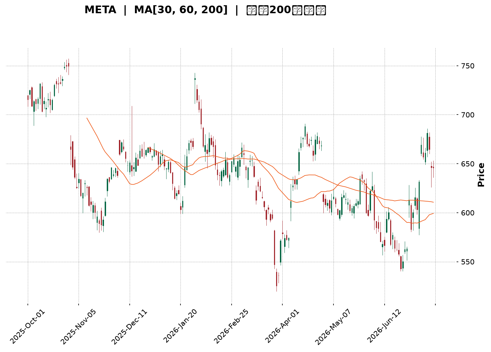
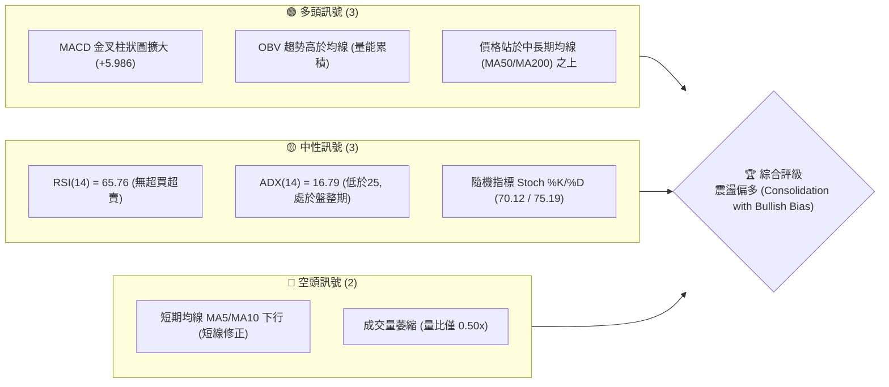
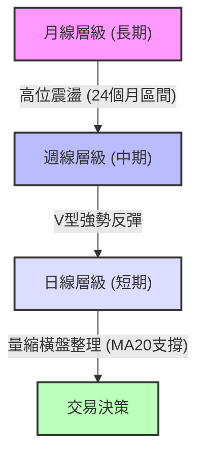
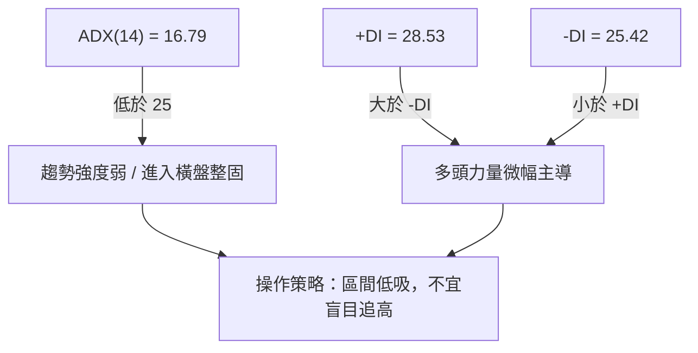
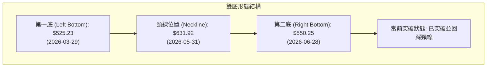
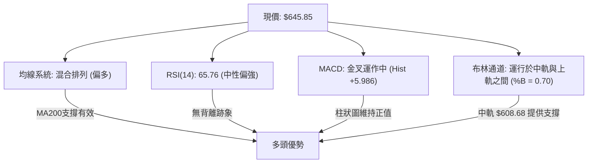
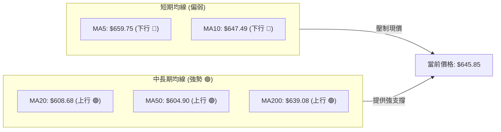
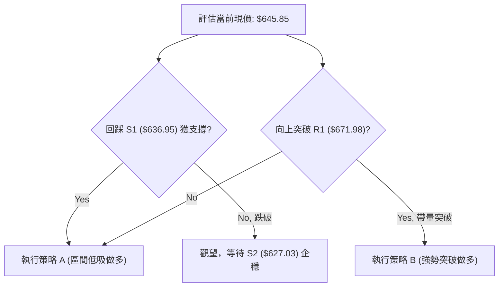
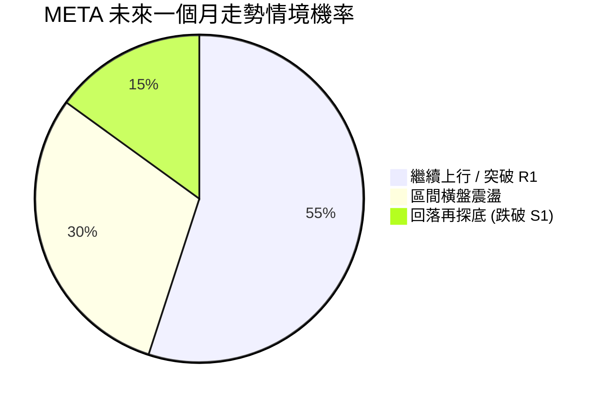
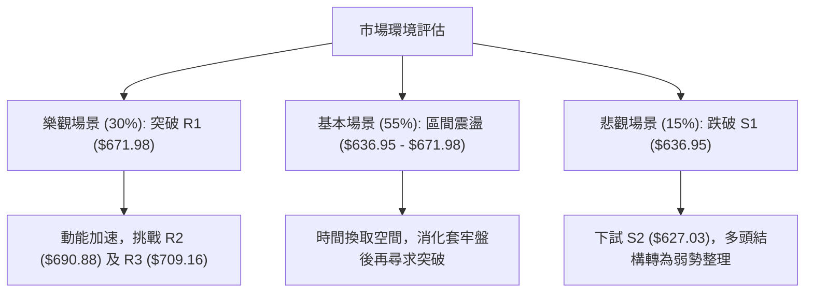

<details>
<summary>📊 靜態圖表 (點擊展開)</summary>

</details>

<html>
<head><meta charset="utf-8" /></head>
<body>
    <div style="height:500px; width:100%;">                        <script>window.PlotlyConfig = {MathJaxConfig: 'local'};</script>
        <script charset="utf-8" src="https://cdn.plot.ly/plotly-3.7.0.min.js" integrity="sha256-jvTGqxNp8AGWEcvNLVuKr+8j5dGe9Yw51LQkmDH+IYA=" crossorigin="anonymous"></script>                <div id="candlestick-chart" class="plotly-graph-div" style="height:100%; width:100%;"></div>            <script>                window.PLOTLYENV=window.PLOTLYENV || {};                                if (document.getElementById("candlestick-chart")) {                    Plotly.newPlot(                        "candlestick-chart",                        [{"close":{"dtype":"f8","bdata":"AAAAYNVbhkAAAADAT6mGQAAAAOC7JYZAAAAAoG1OhkAAAACA1zmGQAAAAMDSX4ZAAAAAoNvchkAAAABgw\u002fuFQAAAAEC\u002fToZAAAAAYH4WhkAAAABAgl2GQAAAAGDIMYZAAAAAYHtYhkAAAABgKtKGQAAAAGDx2oZAAAAAQA\u002fchkAAAACAxOCGQAAAAICOA4dAAAAAgPpmh0AAAAAA7WuHQAAAAMDCbYdAAAAAwO3FhEAAAABAWDWEQAAAAEBy4INAAAAAoIqNg0AAAAAAZ9KDQAAAAOCsSoNAAAAAIMdgg0AAAAAg+LCDQAAAAGCgi4NAAAAAAHH7gkAAAACgdgKDQAAAAEAI\u002f4JAAAAAQJbDgkAAAADAHaGCQAAAACBPZoJAAAAAYPlcgkAAAADgqoWCQAAAAGCtG4NAAAAAgI7Ug0AAAAAgu7+DQAAAAEAnMoRAAAAAIKn5g0AAAADgXiuEQAAAAOCG74NAAAAAAIOehEAAAACAYv2EQAAAAOCPyIRAAAAA4At6hEAAAABAjEOEQAAAAIAiWIRAAAAAgHgUhEAAAABA2zKEQAAAAODWf4RAAAAAgL9ChEAAAACAIrqEQAAAAKDGjIRAAAAAwJOihEAAAABADL6EQAAAAADk0oRAAAAAIN+whEAAAAAgI4yEQAAAACAdxoRAAAAAIFGXhEAAAADAA0qEQAAAAIDvjIRAAAAAoIybhEAAAACARzyEQAAAAOBGJ4RAAAAAYC1fhEAAAABgnQaEQAAAAAC7r4NAAAAAYGQzg0AAAACAjl2DQAAAACAqWYNAAAAAwFrYgkAAAADg8h6DQAAAAIDQM4RAAAAAQLKMhEAAAABATfmEQAAAAGAs\u002foRAAAAAQFDchEAAAACA9geHQAAAACDLWYZAAAAAgDcJhkAAAAAgv5OFQAAAAABk3oRAAAAAICLohEAAAAAAQqKEQAAAAOAcIIVAAAAAgDTshEAAAACg\u002ftuEQAAAAEA5RYRAAAAA4Av1g0AAAACgNvGDQAAAAOCYEIRAAAAAIA4dhEAAAADA8HOEQAAAAEDs4INAAAAAIEvxg0AAAABANWSEQAAAAKC4foRAAAAA4DQ4hEAAAACAK2OEQAAAAABPb4RAAAAAAFTUhEAAAACAJpuEQAAAAKCxHYRAAAAA4OUxhEAAAABAPmeEQAAAAECNbYRAAAAAgFnog0AAAAAA8CSDQAAAAMDzloNAAAAA4Kpwg0AAAAAg4TiDQAAAACAb8YJAAAAA4OGIgkAAAABgAdyCQAAAAMD3goJAAAAAoLaSgkAAAACAQxiBQAAAAIDdaYBAAAAAIBG\u002fgEAAAABAzdyBQAAAAKCMFYJAAAAAwGzvgUAAAABg6uOBQAAAAOAj9IFAAAAAwNIeg0AAAAAgd56DQAAAAMA2qoNAAAAAQIrPg0AAAAAgA6+EQAAAAGCq94RAAAAAIPIhhUAAAACgTH+FQAAAAGBP8oRAAAAAAMThhEAAAAAAwxCFQAAAAEBRlIRAAAAAYD0ThUAAAADg7i+FQAAAAEC\u002f9YRAAAAA4ADkhEAAAABAvxqDQAAAAKB9AYNAAAAAIMIOg0AAAADgMuOCQAAAAACAIoNAAAAAIOlBg0AAAAAghgiDQAAAAKBxsoJAAAAAgIjTgkAAAADgeECDQAAAAODbToNAAAAAQEotg0AAAAAAJxWDQAAAAIBq0IJAAAAAgP\u002fjgkAAAABgivaCQAAAAECPDYNAAAAAIC8eg0AAAADgX9WDQAAAACCd1YNAAAAAAGW\u002fg0AAAADAT7+CQAAAAOCcqIJAAAAAoDlzg0AAAABA6ZeDQAAAAICbg4JAAAAAoMhGgkAAAADAY0CCQAAAAECc04FAAAAAoDq\u002fgUAAAADAo7OBQAAAAADXi4JAAAAAIK7BgkAAAADgo7yBQAAAAIDCCYJAAAAAwMyegUAAAACgmZGBQAAAACBcbYFAAAAAwPX2gEAAAAAAADKBQAAAAMDMlIFAAAAA4FGagUAAAACgRyeDQAAAAEAzN4JAAAAA4FHCgkAAAADgozyDQAAAAMD12IJAAAAAANe7g0AAAAAgrumEQAAAAADXhYRAAAAA4FGohEAAAADgekqFQAAAAOBRxIRAAAAAgBQwhEAAAADAzC6EQA=="},"high":{"dtype":"f8","bdata":"6jpCytF\u002fhkAsl7aMDq+GQJzxfWjUyIZAGnO7xClYhkCHTY7UFmWGQL+\u002fVgJEboZAAAAAoNvchkCvfrzH5uqGQFUYSDmUcIZAZCif14xNhkCHp6FjLZCGQF2MNDTdnIZAmNO9hGhlhkDdXOW\u002f7t6GQLso\u002fpasBIdAGFNCLW4Vh0Bn4xFy3yOHQJt5vTtMGodAjej37lCOh0CMDiImdqOHQGVFSXWGqYdAI\u002fjQZIw5hUDBZRJAHQmFQEl\u002fdCT1jIRAKlUpJJoAhEDWSOMCgwSEQHYveh3N0oNAN2zLBCFkg0Aimmpp0sqDQM9iFjNqn4NAfzIZ2t2ag0BXtRzmYUCDQLAqoVS0IINAYxDqctMQg0A13XaIwNCCQMevAQJJjoJAGTfBSCvpgkDxJIUQjKSCQARptDvNOINAOEom9y3bg0AxptzjoeWDQCQUB3jzMoRA7VD6GysdhEAEzrnIgzGEQIjg\u002f7tVOYRAQ88v2MQShUBV8rvAhAeFQMqv4PmiF4VAG9BqzAy2hEAAG+A6f2aEQFirrzikbIRAnEIGyD4phkB7RNi6sl6EQFRNS9jhqoRAn+OPuWughEA9hNB37eqEQBGudAZx7oRArnTVkgsDhUA4C2tCg8aEQPXI2fPr14RARZcyPBLehEDt765PmJiEQMEUsiIv+IRA1kUU2Ia+hEBa5rjkp7mEQBNuIojauoRAPRN6Aa7ChECUIcx6z4+EQIQkHvWUL4RASMmTO0VuhEDwXRWdcWaEQC939NoCCYRAJCQY2aWag0AvHev1d3iDQGxbqMytn4NAsOXTs30Sg0B+w+RiWkmDQLTNmW8mm4RAjYDJD23KhEBsedzZnhCFQBo3xTXrHIVAi2FaPMkjhUCytBvgZjWHQHcEIBvu1oZA6ecG8x+AhkDYqlY8yV2GQCsBCwfUfIVAsUNr1EpChUCjr8f5WPaEQNOYmwq\u002fUIVARThsCYE7hUCjmATrezCFQEnskd5eFoVAjRtr+ihShEChy\u002f9tpQuEQCOFP+LPHoRA9ZAa9kwwhEC3t1HVWbGEQElZr007hIRASERUZr\u002f\u002fg0AsFJ6uuWWEQAj8MJOVnoRAfwWyx0RChEAHpNF7HpaEQNiDKo\u002fujoRAC87dnpP8hEAGlC7PC+yEQORkTBCCQoRAxaztz8U0hECLJyWI\u002fpiEQPPrLDeSj4RAtqKzArFihECNg5KeZaCDQGWmE0hM0YNAC9oNSa\u002ffg0DGR2uIlnCDQCQxnY11I4NAOmnY1zTbgkCoupOQnACDQA3cdU2Mw4JAaXqbWePYgkADMpdgrjOCQJjibdfF+IBAhUUkPWfYgEA3Y6UqRemBQJw64L0CgIJA2dS79rYPgkDfeR25ADKCQAKTniiU9YFAFOauAe+qg0Aup38ZR+eDQE1\u002fftbo74NAQWna20vTg0Cv2bH5JM2EQKViuGD5LoVAQR1M554nhUBxsiGeCZeFQLc1X1r6VYVAkGDsSpcchUAQwi\u002fPAy6FQNhZOyKF54RAy7LtTVFAhUDo323E8U6FQAj5WodqLIVA8oGUZQENhUAMUANsM2KDQBPEWap0UoNAHP89sXMrg0DsfF2xPy6DQE\u002fZtfcBW4NAoPqKwTWDg0Do8ptVl0GDQDm2\u002f4bM4oJAAYfmE4fZgkB6o3qsm1qDQJE\u002fDzM4eYNAHo9rqP9kg0CH0I3xKDiDQCs\u002fkmjkKoNAmJbEDH\u002f7gkDGFDeqSAiDQFBIK\u002f\u002fsMYNAeGjzNTUvg0Abcik7Re+DQEN9\u002fqA8E4RAynHluUzPg0CbnQZYStmDQJTdOYqHAoNAIX79p5N8g0Au7FYAcQ6EQCAl9jKKpINAphIFV517gkAt7lLlnKiCQIX33g0udoJAHB1ECB\u002fdgUDgXN7iSvyBQAAAAAApyoJAAAAA4HrugkAAAADgeo6CQAAAAIDCIYJAAAAA4Hr+gUAAAACgmeGBQAAAAOBRyIFAAAAAYLhigUAAAADAzGaBQAAAAEAz14FAAAAA4FGsgUAAAACAPaKDQAAAAAAAEINAAAAA4KPcgkAAAADA9YqDQAAAAAAAQINAAAAAACnKg0AAAABA4S6FQAAAAMD1JIVAAAAAAADUhEAAAADgo3CFQAAAAEAzT4VAAAAAoJlhhEAAAABgZmqEQA=="},"hovertemplate":"\u003cb\u003e%{x|%Y-%m-%d}\u003c\u002fb\u003e\u003cbr\u003e\u958b: $%{open:.2f}\u003cbr\u003e\u9ad8: $%{high:.2f}\u003cbr\u003e\u4f4e: $%{low:.2f}\u003cbr\u003e\u6536: $%{close:.2f}\u003cextra\u003e\u003c\u002fextra\u003e","low":{"dtype":"f8","bdata":"ygXBjtwihkCPVxp2N2KGQPnB06SzIoZAliB1HMCFhUB\u002fUS+RWv+FQItwMonKD4ZAaMn3L7w0hkDromWydfWFQFwmOjJvDoZAo8fJgyDMhUCMD8YWWx2GQEnMx8Ju8IVAGehqYE4ChkCvEMuSfnKGQLW3bWPgtoZAvv8p9TaRhkCDixIIltmGQOsJFM4GyoZAnP+7jY5Qh0Cw32BTsDyHQLSl9smrJIdAllzJ+N1DhEBsTemkKR+EQJNe3eA81INAESSotRaDg0D3zS0+UYeDQO1PdL4sQ4NAqtQClx+9gkBX09xkDUSDQOCu1RpEToNAb+x0FozxgkA86al6fMuCQHDpUoI\u002fjYJApS7IHdiOgkDpPnAGIDKCQITs5e\u002fvHYJAVP8asLEugkBAWlbzzSKCQNutSCyjoIJAc4TDk5FFg0BOvNSk7q+DQLQ\u002ftcTPzoNAiYCVZdjgg0BMw1B5UeODQPnG+2Mr34NA0hjtvLOShEACEBm5X6WEQMhD2xDCuoRAIqBnWyldhECLEEMB2Q2EQGmuIAYa+YNAfqNBm6Dng0CnZoiAgOyDQIsh0B5wEIRA+ikNOFpAhEC9B1QjVHqEQArZ1GYQiIRAxBikr9h7hEBpz5WFn4iEQPUcisIqqIRAVwQGzyOhhEBzdzNuzGmEQMmSDnNZhYRAr9rbPiCShEC5wuhS1RKEQNYASOLFNIRAclS37OlVhECMXUVmSx2EQIAECjW01INAhkGQe6QNhEAHYNaStACEQJQGit3od4NAwp2ATc0tg0DId3kVFymDQM5nsJ7OV4NA31UqBnS3gkDh7waYF7iCQC9jrH95i4NA5dTkjmsahEC9oOc+5qCEQHrI283Pu4RAtQVZl0\u002fHhEDpOTbwPzqGQK+1ohyOQoZAvmn+aSPyhUCeAbJqgGmFQG91PzQs0oRAxqhg77BihEBiGeJtyiqEQDBjwB7bjIRA4tY6RMfkhEBVmeCDcH+EQE\u002fA6GQMIYRAJeinNoXLg0BRtMdgcZ2DQHhamJRAmINAqRCwhLDcg0BtJpEtJO2DQPCT487w1oNAKLPxYeGeg0CL0tb++AeEQDBP9c3GMoRAwLSwr97ng0Dletch9sqDQOXJ5Lie7YNAyFqFz\u002f2DhECa+S5qN0mEQMMtqIjR14NAwQneyE+Ng0BHF\u002f1cwT6EQG4s6fOkOYRASDnbyiDeg0DoYs9rtwODQPSpzx8vdINAyQMEsv5og0DQjG7HUzCDQNN0cGuezYJAPgy4Z6ZVgkAMYpOTpLOCQOkOFESfc4JAfqhX882GgkBK+jFSxvaAQKk1wto5PoBA3KTqnWeAgEDEZt4XHBKBQInbPUJP6oFAGk12PXR5gUDrsSxPw9uBQGrPcoPloYFACZjTi0F6gkBsFJ6YYnODQOhnwdwDfoNAZuuZNZN+g0AsZYQ4OfaDQCsr6PTWvIRA7D2Xqw3ZhEC+8AfzCRSFQE2NqEQN24RAd8kRXbLVhEDbbr3sCemEQENHaPGPY4RANthFb+BphEBZoNRAwPGEQNlHFfQbyIRA+KXMEZC5hEDZvMc1jruCQHLqmuFj7IJAu2F9BonRgkDl0Dm5br6CQFzVSYderIJAng6RU8Yng0CNBjKF\u002feuCQCDao7o1rIJArbjb+GiAgkBvVQAf3KCCQCYxIcFxM4NAs99jdPcFg0CX0uNCDNmCQCG4DIjzv4JAoC6IPw2qgkB0N63WEpKCQAXw3aYa84JAVcHPeerlgkB9hMwrfQODQHgpHnfRpYNAQUkHny52g0DKKVSIzLeCQNbuOA0FoYJAhF7IsLa9gkAKYl4\u002f1G6DQETCNEL2MoJA21hmE3gVgkDCxAiqxiOCQO97ebiS0IFA4FhOKPRjgUBmdMSHC4OBQAAAAGBmGoJAAAAAAACAgkAAAAAghbGBQAAAAMDMmIFAAAAA4Hp+gUAAAAAAKYiBQAAAAGBmXIFAAAAAoHDhgEAAAABAM+OAQAAAAAAAcIFAAAAAoHA7gUAAAADAzJiCQAAAACBcI4JAAAAAgBQugkAAAACgR92CQAAAAIAUsIJAAAAAYI8IgkAAAACAFJCEQAAAAKCZcYRAAAAAYGZIhEAAAACgR4WEQAAAAKBHoYRAAAAAAACQg0AAAACAFeCDQA=="},"name":"\u50f9\u683c","open":{"dtype":"f8","bdata":"wgrbc\u002fJ8hkA7R27\u002fpIWGQCFmwu\u002flvYZAcRFfv+L6hUBQJ2953V6GQJ6Fk1LLPIZATkFSiVVjhkBBKu8DMciGQOQdnWpIOYZAclE\u002fP40PhkDTS2lamVmGQC9m+UKCXYZAm8a\u002fZvcJhkCITCW1jXqGQOiI4MPi8IZAc3O4RGnfhkD17\u002fNnWuaGQIdfU3cH94ZAWmx96kdeh0B1X47Na3WHQLbRCkNWhodAdrH+QlDbhEDWTeYEFQaFQCEcVfVicoRAjYrOTEmTg0DHOaCWW7WDQCbFhKma0YNAb1KZOyA3g0DrqzePn6uDQNqJxZz3koNAxCC6KwGUg0Dt8Rhb1huDQFhYpL\u002fUwYJAtkgHR677gkC40dG6hXCCQLi1yi9wgYJA8MPv43nPgkC9\u002fWxsyVeCQBUl2qFVqYJAWniP6wxzg0Cp4g5TSeCDQL1A2o9w04NA4iw2wyDvg0DXItPJYwWEQKMvZzLoFYRA4oMooPgRhUBo0XdrOLKEQC7HbGHU3IRAmW0BkmKwhEBImM2UHEKEQJ7to0v4DIRAQkG6SOpAhED8BLf5ZiSEQNefw2bVEoRA0E8ReIpzhEA5ri1v4X6EQDAMOdrdyYRARkXyc8ajhECwsitV\u002f5aEQGafcm7NqoRA+zANu\u002fbWhEB0gcz6tIaEQEF2kBkjjIRAvEd6wYe8hEAU3HgyZqyEQHwA7X7OToRAFRo9FCqThEBGjabHx3OEQPC1COjWJYRATQKlaVMihECT9WDd8VqEQC939NoCCYRAY4GLVROLg0DYwduVB0uDQKOpHmuMeINAquDkiWH2gkCzYKnuRu2CQDlEsKnVoYNAx9UnxPkchEBK3d+dkL+EQOW2lVccC4VAjwkqNWQKhUAx6oZ17wCHQKUE1gKjsYZAqdcAwp5KhkCukcEa4hCGQP5\u002f8SkLdIVAJSdWDTCzhECQ2NWtcMKEQDycITP+r4RA10PpqCUjhUDwJNkiZgaFQKHX2Fs35oRA6skHMJwfhED+3u\u002f74\u002fKDQHTlDRpfxYNASRqJpXbrg0Dlexl8aPSDQEtyol4GW4RAST95Tp+\u002fg0BTrrpSFguEQPGHrQ4iS4RAYPfBH28ShEAPFJIONOCDQC+63MIVOYRAHjHBwE6GhED3YWTKAqaEQN9P8In4NYRAWllOnDLNg0DZnRucK2OEQB9mVN3AbIRAxk7ZVMI8hEC+FvR\u002fO3aDQHVaHn9Ru4NAt0yHpESbg0DzoJafJz6DQAALPmqqHINAH8uVCMXXgkAMJSkY1emCQO+C2adctIJA0uH1EnyxgkCAszHYmi+CQBVJpXrM3IBAAAAAIBG\u002fgEAo33sBxCuBQHSOFiu+HIJAHhmidyCsgUDQx+2kPQmCQKyYp1+Z34FAUMu2zILrgkAtmV6RHZODQEqN40EPz4NAeqzSSVang0Bb4WSr\u002fhSEQDokWi8P04RA9Ow5i+kahUAwwnTexS+FQNep\u002fy7VRYVAQQBkhwfzhEC+gcJu4g2FQOTAGf+uuIRAyhZjJaudhEDvsSuTB\u002fOEQHWVIuDsDIVAKCT1JVPihEDULb\u002fy+FWDQGY7Z3z3MINAj3QITwT7gkDD9EDK7yWDQHD2I4\u002fyw4JAULOwtjQxg0B1KdTvCjWDQHaHCewU4IJA7LwbYyeSgkC5Z35BNLKCQDAHq9tvO4NA0qOANF8rg0AbqosbXgSDQOQSvWjZAoNAQsxwR6HBgkAuvfQejruCQEXaZIOJ+oJAtSHrCpwCg0Du4ZuprwaDQKEcJkRD94NA4L5gn07Hg0Crvl29h66DQPQJZ3xz1YJAK1t8g4jTgkBNLGFlvXiDQHO0LN0Pd4NAphIFV517gkAbnRI4n3OCQLcR1cKJIYJAtzBEznKqgUDclJkNW+OBQAAAAEAzH4JAAAAAQDONgkAAAAAAAICCQAAAAGCP5oFAAAAAACnggUAAAAAAAJKBQAAAAMAej4FAAAAAYGZcgUAAAABguPqAQAAAAAAAgIFAAAAAIIWHgUAAAACgR\u002f+CQAAAAEAz\u002f4JAAAAAYLiWgkAAAABguPyCQAAAAMAeM4NAAAAAgOs\u002fgkAAAABguKKEQAAAAEAKq4RAAAAAAABghEAAAADAzLyEQAAAAIA9KoVAAAAAoJk9hEAAAACgmTWEQA=="},"x":["2025-10-01T00:00:00-04:00","2025-10-02T00:00:00-04:00","2025-10-03T00:00:00-04:00","2025-10-06T00:00:00-04:00","2025-10-07T00:00:00-04:00","2025-10-08T00:00:00-04:00","2025-10-09T00:00:00-04:00","2025-10-10T00:00:00-04:00","2025-10-13T00:00:00-04:00","2025-10-14T00:00:00-04:00","2025-10-15T00:00:00-04:00","2025-10-16T00:00:00-04:00","2025-10-17T00:00:00-04:00","2025-10-20T00:00:00-04:00","2025-10-21T00:00:00-04:00","2025-10-22T00:00:00-04:00","2025-10-23T00:00:00-04:00","2025-10-24T00:00:00-04:00","2025-10-27T00:00:00-04:00","2025-10-28T00:00:00-04:00","2025-10-29T00:00:00-04:00","2025-10-30T00:00:00-04:00","2025-10-31T00:00:00-04:00","2025-11-03T00:00:00-05:00","2025-11-04T00:00:00-05:00","2025-11-05T00:00:00-05:00","2025-11-06T00:00:00-05:00","2025-11-07T00:00:00-05:00","2025-11-10T00:00:00-05:00","2025-11-11T00:00:00-05:00","2025-11-12T00:00:00-05:00","2025-11-13T00:00:00-05:00","2025-11-14T00:00:00-05:00","2025-11-17T00:00:00-05:00","2025-11-18T00:00:00-05:00","2025-11-19T00:00:00-05:00","2025-11-20T00:00:00-05:00","2025-11-21T00:00:00-05:00","2025-11-24T00:00:00-05:00","2025-11-25T00:00:00-05:00","2025-11-26T00:00:00-05:00","2025-11-28T00:00:00-05:00","2025-12-01T00:00:00-05:00","2025-12-02T00:00:00-05:00","2025-12-03T00:00:00-05:00","2025-12-04T00:00:00-05:00","2025-12-05T00:00:00-05:00","2025-12-08T00:00:00-05:00","2025-12-09T00:00:00-05:00","2025-12-10T00:00:00-05:00","2025-12-11T00:00:00-05:00","2025-12-12T00:00:00-05:00","2025-12-15T00:00:00-05:00","2025-12-16T00:00:00-05:00","2025-12-17T00:00:00-05:00","2025-12-18T00:00:00-05:00","2025-12-19T00:00:00-05:00","2025-12-22T00:00:00-05:00","2025-12-23T00:00:00-05:00","2025-12-24T00:00:00-05:00","2025-12-26T00:00:00-05:00","2025-12-29T00:00:00-05:00","2025-12-30T00:00:00-05:00","2025-12-31T00:00:00-05:00","2026-01-02T00:00:00-05:00","2026-01-05T00:00:00-05:00","2026-01-06T00:00:00-05:00","2026-01-07T00:00:00-05:00","2026-01-08T00:00:00-05:00","2026-01-09T00:00:00-05:00","2026-01-12T00:00:00-05:00","2026-01-13T00:00:00-05:00","2026-01-14T00:00:00-05:00","2026-01-15T00:00:00-05:00","2026-01-16T00:00:00-05:00","2026-01-20T00:00:00-05:00","2026-01-21T00:00:00-05:00","2026-01-22T00:00:00-05:00","2026-01-23T00:00:00-05:00","2026-01-26T00:00:00-05:00","2026-01-27T00:00:00-05:00","2026-01-28T00:00:00-05:00","2026-01-29T00:00:00-05:00","2026-01-30T00:00:00-05:00","2026-02-02T00:00:00-05:00","2026-02-03T00:00:00-05:00","2026-02-04T00:00:00-05:00","2026-02-05T00:00:00-05:00","2026-02-06T00:00:00-05:00","2026-02-09T00:00:00-05:00","2026-02-10T00:00:00-05:00","2026-02-11T00:00:00-05:00","2026-02-12T00:00:00-05:00","2026-02-13T00:00:00-05:00","2026-02-17T00:00:00-05:00","2026-02-18T00:00:00-05:00","2026-02-19T00:00:00-05:00","2026-02-20T00:00:00-05:00","2026-02-23T00:00:00-05:00","2026-02-24T00:00:00-05:00","2026-02-25T00:00:00-05:00","2026-02-26T00:00:00-05:00","2026-02-27T00:00:00-05:00","2026-03-02T00:00:00-05:00","2026-03-03T00:00:00-05:00","2026-03-04T00:00:00-05:00","2026-03-05T00:00:00-05:00","2026-03-06T00:00:00-05:00","2026-03-09T00:00:00-04:00","2026-03-10T00:00:00-04:00","2026-03-11T00:00:00-04:00","2026-03-12T00:00:00-04:00","2026-03-13T00:00:00-04:00","2026-03-16T00:00:00-04:00","2026-03-17T00:00:00-04:00","2026-03-18T00:00:00-04:00","2026-03-19T00:00:00-04:00","2026-03-20T00:00:00-04:00","2026-03-23T00:00:00-04:00","2026-03-24T00:00:00-04:00","2026-03-25T00:00:00-04:00","2026-03-26T00:00:00-04:00","2026-03-27T00:00:00-04:00","2026-03-30T00:00:00-04:00","2026-03-31T00:00:00-04:00","2026-04-01T00:00:00-04:00","2026-04-02T00:00:00-04:00","2026-04-06T00:00:00-04:00","2026-04-07T00:00:00-04:00","2026-04-08T00:00:00-04:00","2026-04-09T00:00:00-04:00","2026-04-10T00:00:00-04:00","2026-04-13T00:00:00-04:00","2026-04-14T00:00:00-04:00","2026-04-15T00:00:00-04:00","2026-04-16T00:00:00-04:00","2026-04-17T00:00:00-04:00","2026-04-20T00:00:00-04:00","2026-04-21T00:00:00-04:00","2026-04-22T00:00:00-04:00","2026-04-23T00:00:00-04:00","2026-04-24T00:00:00-04:00","2026-04-27T00:00:00-04:00","2026-04-28T00:00:00-04:00","2026-04-29T00:00:00-04:00","2026-04-30T00:00:00-04:00","2026-05-01T00:00:00-04:00","2026-05-04T00:00:00-04:00","2026-05-05T00:00:00-04:00","2026-05-06T00:00:00-04:00","2026-05-07T00:00:00-04:00","2026-05-08T00:00:00-04:00","2026-05-11T00:00:00-04:00","2026-05-12T00:00:00-04:00","2026-05-13T00:00:00-04:00","2026-05-14T00:00:00-04:00","2026-05-15T00:00:00-04:00","2026-05-18T00:00:00-04:00","2026-05-19T00:00:00-04:00","2026-05-20T00:00:00-04:00","2026-05-21T00:00:00-04:00","2026-05-22T00:00:00-04:00","2026-05-26T00:00:00-04:00","2026-05-27T00:00:00-04:00","2026-05-28T00:00:00-04:00","2026-05-29T00:00:00-04:00","2026-06-01T00:00:00-04:00","2026-06-02T00:00:00-04:00","2026-06-03T00:00:00-04:00","2026-06-04T00:00:00-04:00","2026-06-05T00:00:00-04:00","2026-06-08T00:00:00-04:00","2026-06-09T00:00:00-04:00","2026-06-10T00:00:00-04:00","2026-06-11T00:00:00-04:00","2026-06-12T00:00:00-04:00","2026-06-15T00:00:00-04:00","2026-06-16T00:00:00-04:00","2026-06-17T00:00:00-04:00","2026-06-18T00:00:00-04:00","2026-06-22T00:00:00-04:00","2026-06-23T00:00:00-04:00","2026-06-24T00:00:00-04:00","2026-06-25T00:00:00-04:00","2026-06-26T00:00:00-04:00","2026-06-29T00:00:00-04:00","2026-06-30T00:00:00-04:00","2026-07-01T00:00:00-04:00","2026-07-02T00:00:00-04:00","2026-07-06T00:00:00-04:00","2026-07-07T00:00:00-04:00","2026-07-08T00:00:00-04:00","2026-07-09T00:00:00-04:00","2026-07-10T00:00:00-04:00","2026-07-13T00:00:00-04:00","2026-07-14T00:00:00-04:00","2026-07-15T00:00:00-04:00","2026-07-16T00:00:00-04:00","2026-07-17T00:00:00-04:00","2026-07-20T00:00:00-04:00"],"type":"candlestick"},{"hovertemplate":"MA30: $%{y:.2f}\u003cextra\u003e\u003c\u002fextra\u003e","line":{"color":"#2196F3","dash":"dash","width":2},"mode":"lines","name":"MA30","x":["2025-10-01T00:00:00-04:00","2025-10-02T00:00:00-04:00","2025-10-03T00:00:00-04:00","2025-10-06T00:00:00-04:00","2025-10-07T00:00:00-04:00","2025-10-08T00:00:00-04:00","2025-10-09T00:00:00-04:00","2025-10-10T00:00:00-04:00","2025-10-13T00:00:00-04:00","2025-10-14T00:00:00-04:00","2025-10-15T00:00:00-04:00","2025-10-16T00:00:00-04:00","2025-10-17T00:00:00-04:00","2025-10-20T00:00:00-04:00","2025-10-21T00:00:00-04:00","2025-10-22T00:00:00-04:00","2025-10-23T00:00:00-04:00","2025-10-24T00:00:00-04:00","2025-10-27T00:00:00-04:00","2025-10-28T00:00:00-04:00","2025-10-29T00:00:00-04:00","2025-10-30T00:00:00-04:00","2025-10-31T00:00:00-04:00","2025-11-03T00:00:00-05:00","2025-11-04T00:00:00-05:00","2025-11-05T00:00:00-05:00","2025-11-06T00:00:00-05:00","2025-11-07T00:00:00-05:00","2025-11-10T00:00:00-05:00","2025-11-11T00:00:00-05:00","2025-11-12T00:00:00-05:00","2025-11-13T00:00:00-05:00","2025-11-14T00:00:00-05:00","2025-11-17T00:00:00-05:00","2025-11-18T00:00:00-05:00","2025-11-19T00:00:00-05:00","2025-11-20T00:00:00-05:00","2025-11-21T00:00:00-05:00","2025-11-24T00:00:00-05:00","2025-11-25T00:00:00-05:00","2025-11-26T00:00:00-05:00","2025-11-28T00:00:00-05:00","2025-12-01T00:00:00-05:00","2025-12-02T00:00:00-05:00","2025-12-03T00:00:00-05:00","2025-12-04T00:00:00-05:00","2025-12-05T00:00:00-05:00","2025-12-08T00:00:00-05:00","2025-12-09T00:00:00-05:00","2025-12-10T00:00:00-05:00","2025-12-11T00:00:00-05:00","2025-12-12T00:00:00-05:00","2025-12-15T00:00:00-05:00","2025-12-16T00:00:00-05:00","2025-12-17T00:00:00-05:00","2025-12-18T00:00:00-05:00","2025-12-19T00:00:00-05:00","2025-12-22T00:00:00-05:00","2025-12-23T00:00:00-05:00","2025-12-24T00:00:00-05:00","2025-12-26T00:00:00-05:00","2025-12-29T00:00:00-05:00","2025-12-30T00:00:00-05:00","2025-12-31T00:00:00-05:00","2026-01-02T00:00:00-05:00","2026-01-05T00:00:00-05:00","2026-01-06T00:00:00-05:00","2026-01-07T00:00:00-05:00","2026-01-08T00:00:00-05:00","2026-01-09T00:00:00-05:00","2026-01-12T00:00:00-05:00","2026-01-13T00:00:00-05:00","2026-01-14T00:00:00-05:00","2026-01-15T00:00:00-05:00","2026-01-16T00:00:00-05:00","2026-01-20T00:00:00-05:00","2026-01-21T00:00:00-05:00","2026-01-22T00:00:00-05:00","2026-01-23T00:00:00-05:00","2026-01-26T00:00:00-05:00","2026-01-27T00:00:00-05:00","2026-01-28T00:00:00-05:00","2026-01-29T00:00:00-05:00","2026-01-30T00:00:00-05:00","2026-02-02T00:00:00-05:00","2026-02-03T00:00:00-05:00","2026-02-04T00:00:00-05:00","2026-02-05T00:00:00-05:00","2026-02-06T00:00:00-05:00","2026-02-09T00:00:00-05:00","2026-02-10T00:00:00-05:00","2026-02-11T00:00:00-05:00","2026-02-12T00:00:00-05:00","2026-02-13T00:00:00-05:00","2026-02-17T00:00:00-05:00","2026-02-18T00:00:00-05:00","2026-02-19T00:00:00-05:00","2026-02-20T00:00:00-05:00","2026-02-23T00:00:00-05:00","2026-02-24T00:00:00-05:00","2026-02-25T00:00:00-05:00","2026-02-26T00:00:00-05:00","2026-02-27T00:00:00-05:00","2026-03-02T00:00:00-05:00","2026-03-03T00:00:00-05:00","2026-03-04T00:00:00-05:00","2026-03-05T00:00:00-05:00","2026-03-06T00:00:00-05:00","2026-03-09T00:00:00-04:00","2026-03-10T00:00:00-04:00","2026-03-11T00:00:00-04:00","2026-03-12T00:00:00-04:00","2026-03-13T00:00:00-04:00","2026-03-16T00:00:00-04:00","2026-03-17T00:00:00-04:00","2026-03-18T00:00:00-04:00","2026-03-19T00:00:00-04:00","2026-03-20T00:00:00-04:00","2026-03-23T00:00:00-04:00","2026-03-24T00:00:00-04:00","2026-03-25T00:00:00-04:00","2026-03-26T00:00:00-04:00","2026-03-27T00:00:00-04:00","2026-03-30T00:00:00-04:00","2026-03-31T00:00:00-04:00","2026-04-01T00:00:00-04:00","2026-04-02T00:00:00-04:00","2026-04-06T00:00:00-04:00","2026-04-07T00:00:00-04:00","2026-04-08T00:00:00-04:00","2026-04-09T00:00:00-04:00","2026-04-10T00:00:00-04:00","2026-04-13T00:00:00-04:00","2026-04-14T00:00:00-04:00","2026-04-15T00:00:00-04:00","2026-04-16T00:00:00-04:00","2026-04-17T00:00:00-04:00","2026-04-20T00:00:00-04:00","2026-04-21T00:00:00-04:00","2026-04-22T00:00:00-04:00","2026-04-23T00:00:00-04:00","2026-04-24T00:00:00-04:00","2026-04-27T00:00:00-04:00","2026-04-28T00:00:00-04:00","2026-04-29T00:00:00-04:00","2026-04-30T00:00:00-04:00","2026-05-01T00:00:00-04:00","2026-05-04T00:00:00-04:00","2026-05-05T00:00:00-04:00","2026-05-06T00:00:00-04:00","2026-05-07T00:00:00-04:00","2026-05-08T00:00:00-04:00","2026-05-11T00:00:00-04:00","2026-05-12T00:00:00-04:00","2026-05-13T00:00:00-04:00","2026-05-14T00:00:00-04:00","2026-05-15T00:00:00-04:00","2026-05-18T00:00:00-04:00","2026-05-19T00:00:00-04:00","2026-05-20T00:00:00-04:00","2026-05-21T00:00:00-04:00","2026-05-22T00:00:00-04:00","2026-05-26T00:00:00-04:00","2026-05-27T00:00:00-04:00","2026-05-28T00:00:00-04:00","2026-05-29T00:00:00-04:00","2026-06-01T00:00:00-04:00","2026-06-02T00:00:00-04:00","2026-06-03T00:00:00-04:00","2026-06-04T00:00:00-04:00","2026-06-05T00:00:00-04:00","2026-06-08T00:00:00-04:00","2026-06-09T00:00:00-04:00","2026-06-10T00:00:00-04:00","2026-06-11T00:00:00-04:00","2026-06-12T00:00:00-04:00","2026-06-15T00:00:00-04:00","2026-06-16T00:00:00-04:00","2026-06-17T00:00:00-04:00","2026-06-18T00:00:00-04:00","2026-06-22T00:00:00-04:00","2026-06-23T00:00:00-04:00","2026-06-24T00:00:00-04:00","2026-06-25T00:00:00-04:00","2026-06-26T00:00:00-04:00","2026-06-29T00:00:00-04:00","2026-06-30T00:00:00-04:00","2026-07-01T00:00:00-04:00","2026-07-02T00:00:00-04:00","2026-07-06T00:00:00-04:00","2026-07-07T00:00:00-04:00","2026-07-08T00:00:00-04:00","2026-07-09T00:00:00-04:00","2026-07-10T00:00:00-04:00","2026-07-13T00:00:00-04:00","2026-07-14T00:00:00-04:00","2026-07-15T00:00:00-04:00","2026-07-16T00:00:00-04:00","2026-07-17T00:00:00-04:00","2026-07-20T00:00:00-04:00"],"y":{"dtype":"f8","bdata":"AAAAAAAA+H8AAAAAAAD4fwAAAAAAAPh\u002fAAAAAAAA+H8AAAAAAAD4fwAAAAAAAPh\u002fAAAAAAAA+H8AAAAAAAD4fwAAAAAAAPh\u002fAAAAAAAA+H8AAAAAAAD4fwAAAAAAAPh\u002fAAAAAAAA+H8AAAAAAAD4fwAAAAAAAPh\u002fAAAAAAAA+H8AAAAAAAD4fwAAAAAAAPh\u002fAAAAAAAA+H8AAAAAAAD4fwAAAAAAAPh\u002fAAAAAAAA+H8AAAAAAAD4fwAAAAAAAPh\u002fAAAAAAAA+H8AAAAAAAD4fwAAAAAAAPh\u002fAAAAAAAA+H8AAAAAAAD4f7y7u6udxIVAZmZmhs2nhUB3d3cnpIiFQM3MzEzAbYVAvLu764VPhUAAAAAQ1TCFQGZmZkbqDoVA3t3d3YTohEBERESE+8qEQO\u002fu7h6ur4RAREREZGqchEBERET0FoaEQM3MzAwJdYRAd3d3185ghEBVVVV1LkqEQCIiIoJEMYRAvLu7OyYehEDe3d1dCQ6EQBEREeEA+4NA3t3d\u002fQnig0BVVVXVF8eDQBEREbHFrINAIiIiYtumg0BmZmYmxqaDQN7d3U0WrINAmpmZmSCyg0DNzMwM2rmDQERERKSWxINAmpmZqVDPg0DNzMzMSNiDQERERHQx44NAERERMcbxg0CrqqqK5f6DQHd3d+cQDoRAMzMzM6gdhEAAAAAA0iuEQN7d3a0sPoRAiYiIuFNRhECrqqqK8l+EQO\u002fu7g7eaIRARERE9HxthEBERETU2W+EQDMzM+OAa4RA7+7u\u002fuRkhEB3d3e3CF6EQAAAAKAFWYRAZmZmJuJJhEDv7u5+7zmEQO\u002fu7i76NIRAREREVJk1hEC8u7tLqDuEQImIiCgxQYRAvLu7e9pHhEDv7u4OBmCEQHd3d3fSb4RAmpmZmfh+hEDe3d2NOYaEQAAAAADyiIRAvLu7i0OLhEB3d3dnVoqEQN7d3V3pjIRA3t3dreOOhEAREREhjZGEQERERERBjYRA7+7ujtiHhECamZnJ4oSEQERERMS9gIRAmpmZWYZ8hEAzMzNTYX6EQImIiPgIfIRAvLu7S194hEBVVVX1fXuEQHd3d0dkgoRAVVVV5RWLhEBERERUzpOEQDMzM9MTnYRAiYiIiAKuhEC8u7vrrrqEQImIiCjyuYRAiYiIWOu2hECrqqr6DLKEQAAAAOA6rYRAzczMDBmlhECrqqoq7oOEQERERHRebIRAIiIiojdWhECrqqoqH0KEQN7d3c2tMYRA3t3d7W8dhEBERESkSw6EQKuqqpr994NAAAAA4PDjg0CamZkJ0cODQERERJTnooNAq6qqWoGHg0C8u7sbwnWDQM3MzEzbZINAq6qq2kRSg0BmZmbGZjyDQCIiIrL5K4NA7+7urvUkg0B3d3dHXh6DQCIiIuJIF4NAq6qqussTg0CrqqrqUhaDQO\u002fu7n7eGoNAVVVV1XQdg0BERES0DyWDQHd3dwcmLINARERExAIyg0AzMzNTqTeDQAAAACD0OINAd3d3p+pCg0DNzMyMWVSDQAAAAAALYINAvLu7u2tsg0CrqqqaamuDQLy7u2v2a4NARERE1Gxwg0BmZmY2qnCDQN7d3Y37dYNAIiIiktJ7g0AzMzNTXYyDQKuqqrrZn4NAERERcZmxg0Dv7u5+dL2DQCIiIhLmx4NAVVVVhX7Sg0BVVVU1q9yDQFVVVeUC5INAvLu76wzig0BmZmb2c9yDQN7d3S0714NA3t3dvVHRg0ARERGREMqDQFVVVXVlwINARERE9JO0g0B3d3eXHJ2DQERERKSWiYNARERE1F59g0CamZkJz3CDQBEREWEvX4NA7+7unk1Hg0AzMzNzQC6DQM3MzIyDE4NAREREJLD4gkAiIiLCt+yCQN7d3c3L6IJAIiIiEjrmgkARERGBaNyCQKuqqtoM04JAERERcRTFgkB3d3cXlbiCQKuqqgq\u002frYJAiYiISNydgkCJiIi4T4yCQLy7u3uTfYJA3t3dzSRwgkDe3d19v3CCQM3MzAyka4JAmpmZqYRqgkCJiIjY2myCQO\u002fu7v4Za4JAMzMzU1twgkAiIiIikXmCQN7d3e1wf4JA7+7ujjSHgkAiIiIy6ZyCQCIiIrLmroJAIiIiQjK1gkB3d3fXObqCQA=="},"type":"scatter"},{"hovertemplate":"MA60: $%{y:.2f}\u003cextra\u003e\u003c\u002fextra\u003e","line":{"color":"#9C27B0","dash":"dash","width":2},"mode":"lines","name":"MA60","x":["2025-10-01T00:00:00-04:00","2025-10-02T00:00:00-04:00","2025-10-03T00:00:00-04:00","2025-10-06T00:00:00-04:00","2025-10-07T00:00:00-04:00","2025-10-08T00:00:00-04:00","2025-10-09T00:00:00-04:00","2025-10-10T00:00:00-04:00","2025-10-13T00:00:00-04:00","2025-10-14T00:00:00-04:00","2025-10-15T00:00:00-04:00","2025-10-16T00:00:00-04:00","2025-10-17T00:00:00-04:00","2025-10-20T00:00:00-04:00","2025-10-21T00:00:00-04:00","2025-10-22T00:00:00-04:00","2025-10-23T00:00:00-04:00","2025-10-24T00:00:00-04:00","2025-10-27T00:00:00-04:00","2025-10-28T00:00:00-04:00","2025-10-29T00:00:00-04:00","2025-10-30T00:00:00-04:00","2025-10-31T00:00:00-04:00","2025-11-03T00:00:00-05:00","2025-11-04T00:00:00-05:00","2025-11-05T00:00:00-05:00","2025-11-06T00:00:00-05:00","2025-11-07T00:00:00-05:00","2025-11-10T00:00:00-05:00","2025-11-11T00:00:00-05:00","2025-11-12T00:00:00-05:00","2025-11-13T00:00:00-05:00","2025-11-14T00:00:00-05:00","2025-11-17T00:00:00-05:00","2025-11-18T00:00:00-05:00","2025-11-19T00:00:00-05:00","2025-11-20T00:00:00-05:00","2025-11-21T00:00:00-05:00","2025-11-24T00:00:00-05:00","2025-11-25T00:00:00-05:00","2025-11-26T00:00:00-05:00","2025-11-28T00:00:00-05:00","2025-12-01T00:00:00-05:00","2025-12-02T00:00:00-05:00","2025-12-03T00:00:00-05:00","2025-12-04T00:00:00-05:00","2025-12-05T00:00:00-05:00","2025-12-08T00:00:00-05:00","2025-12-09T00:00:00-05:00","2025-12-10T00:00:00-05:00","2025-12-11T00:00:00-05:00","2025-12-12T00:00:00-05:00","2025-12-15T00:00:00-05:00","2025-12-16T00:00:00-05:00","2025-12-17T00:00:00-05:00","2025-12-18T00:00:00-05:00","2025-12-19T00:00:00-05:00","2025-12-22T00:00:00-05:00","2025-12-23T00:00:00-05:00","2025-12-24T00:00:00-05:00","2025-12-26T00:00:00-05:00","2025-12-29T00:00:00-05:00","2025-12-30T00:00:00-05:00","2025-12-31T00:00:00-05:00","2026-01-02T00:00:00-05:00","2026-01-05T00:00:00-05:00","2026-01-06T00:00:00-05:00","2026-01-07T00:00:00-05:00","2026-01-08T00:00:00-05:00","2026-01-09T00:00:00-05:00","2026-01-12T00:00:00-05:00","2026-01-13T00:00:00-05:00","2026-01-14T00:00:00-05:00","2026-01-15T00:00:00-05:00","2026-01-16T00:00:00-05:00","2026-01-20T00:00:00-05:00","2026-01-21T00:00:00-05:00","2026-01-22T00:00:00-05:00","2026-01-23T00:00:00-05:00","2026-01-26T00:00:00-05:00","2026-01-27T00:00:00-05:00","2026-01-28T00:00:00-05:00","2026-01-29T00:00:00-05:00","2026-01-30T00:00:00-05:00","2026-02-02T00:00:00-05:00","2026-02-03T00:00:00-05:00","2026-02-04T00:00:00-05:00","2026-02-05T00:00:00-05:00","2026-02-06T00:00:00-05:00","2026-02-09T00:00:00-05:00","2026-02-10T00:00:00-05:00","2026-02-11T00:00:00-05:00","2026-02-12T00:00:00-05:00","2026-02-13T00:00:00-05:00","2026-02-17T00:00:00-05:00","2026-02-18T00:00:00-05:00","2026-02-19T00:00:00-05:00","2026-02-20T00:00:00-05:00","2026-02-23T00:00:00-05:00","2026-02-24T00:00:00-05:00","2026-02-25T00:00:00-05:00","2026-02-26T00:00:00-05:00","2026-02-27T00:00:00-05:00","2026-03-02T00:00:00-05:00","2026-03-03T00:00:00-05:00","2026-03-04T00:00:00-05:00","2026-03-05T00:00:00-05:00","2026-03-06T00:00:00-05:00","2026-03-09T00:00:00-04:00","2026-03-10T00:00:00-04:00","2026-03-11T00:00:00-04:00","2026-03-12T00:00:00-04:00","2026-03-13T00:00:00-04:00","2026-03-16T00:00:00-04:00","2026-03-17T00:00:00-04:00","2026-03-18T00:00:00-04:00","2026-03-19T00:00:00-04:00","2026-03-20T00:00:00-04:00","2026-03-23T00:00:00-04:00","2026-03-24T00:00:00-04:00","2026-03-25T00:00:00-04:00","2026-03-26T00:00:00-04:00","2026-03-27T00:00:00-04:00","2026-03-30T00:00:00-04:00","2026-03-31T00:00:00-04:00","2026-04-01T00:00:00-04:00","2026-04-02T00:00:00-04:00","2026-04-06T00:00:00-04:00","2026-04-07T00:00:00-04:00","2026-04-08T00:00:00-04:00","2026-04-09T00:00:00-04:00","2026-04-10T00:00:00-04:00","2026-04-13T00:00:00-04:00","2026-04-14T00:00:00-04:00","2026-04-15T00:00:00-04:00","2026-04-16T00:00:00-04:00","2026-04-17T00:00:00-04:00","2026-04-20T00:00:00-04:00","2026-04-21T00:00:00-04:00","2026-04-22T00:00:00-04:00","2026-04-23T00:00:00-04:00","2026-04-24T00:00:00-04:00","2026-04-27T00:00:00-04:00","2026-04-28T00:00:00-04:00","2026-04-29T00:00:00-04:00","2026-04-30T00:00:00-04:00","2026-05-01T00:00:00-04:00","2026-05-04T00:00:00-04:00","2026-05-05T00:00:00-04:00","2026-05-06T00:00:00-04:00","2026-05-07T00:00:00-04:00","2026-05-08T00:00:00-04:00","2026-05-11T00:00:00-04:00","2026-05-12T00:00:00-04:00","2026-05-13T00:00:00-04:00","2026-05-14T00:00:00-04:00","2026-05-15T00:00:00-04:00","2026-05-18T00:00:00-04:00","2026-05-19T00:00:00-04:00","2026-05-20T00:00:00-04:00","2026-05-21T00:00:00-04:00","2026-05-22T00:00:00-04:00","2026-05-26T00:00:00-04:00","2026-05-27T00:00:00-04:00","2026-05-28T00:00:00-04:00","2026-05-29T00:00:00-04:00","2026-06-01T00:00:00-04:00","2026-06-02T00:00:00-04:00","2026-06-03T00:00:00-04:00","2026-06-04T00:00:00-04:00","2026-06-05T00:00:00-04:00","2026-06-08T00:00:00-04:00","2026-06-09T00:00:00-04:00","2026-06-10T00:00:00-04:00","2026-06-11T00:00:00-04:00","2026-06-12T00:00:00-04:00","2026-06-15T00:00:00-04:00","2026-06-16T00:00:00-04:00","2026-06-17T00:00:00-04:00","2026-06-18T00:00:00-04:00","2026-06-22T00:00:00-04:00","2026-06-23T00:00:00-04:00","2026-06-24T00:00:00-04:00","2026-06-25T00:00:00-04:00","2026-06-26T00:00:00-04:00","2026-06-29T00:00:00-04:00","2026-06-30T00:00:00-04:00","2026-07-01T00:00:00-04:00","2026-07-02T00:00:00-04:00","2026-07-06T00:00:00-04:00","2026-07-07T00:00:00-04:00","2026-07-08T00:00:00-04:00","2026-07-09T00:00:00-04:00","2026-07-10T00:00:00-04:00","2026-07-13T00:00:00-04:00","2026-07-14T00:00:00-04:00","2026-07-15T00:00:00-04:00","2026-07-16T00:00:00-04:00","2026-07-17T00:00:00-04:00","2026-07-20T00:00:00-04:00"],"y":{"dtype":"f8","bdata":"AAAAAAAA+H8AAAAAAAD4fwAAAAAAAPh\u002fAAAAAAAA+H8AAAAAAAD4fwAAAAAAAPh\u002fAAAAAAAA+H8AAAAAAAD4fwAAAAAAAPh\u002fAAAAAAAA+H8AAAAAAAD4fwAAAAAAAPh\u002fAAAAAAAA+H8AAAAAAAD4fwAAAAAAAPh\u002fAAAAAAAA+H8AAAAAAAD4fwAAAAAAAPh\u002fAAAAAAAA+H8AAAAAAAD4fwAAAAAAAPh\u002fAAAAAAAA+H8AAAAAAAD4fwAAAAAAAPh\u002fAAAAAAAA+H8AAAAAAAD4fwAAAAAAAPh\u002fAAAAAAAA+H8AAAAAAAD4fwAAAAAAAPh\u002fAAAAAAAA+H8AAAAAAAD4fwAAAAAAAPh\u002fAAAAAAAA+H8AAAAAAAD4fwAAAAAAAPh\u002fAAAAAAAA+H8AAAAAAAD4fwAAAAAAAPh\u002fAAAAAAAA+H8AAAAAAAD4fwAAAAAAAPh\u002fAAAAAAAA+H8AAAAAAAD4fwAAAAAAAPh\u002fAAAAAAAA+H8AAAAAAAD4fwAAAAAAAPh\u002fAAAAAAAA+H8AAAAAAAD4fwAAAAAAAPh\u002fAAAAAAAA+H8AAAAAAAD4fwAAAAAAAPh\u002fAAAAAAAA+H8AAAAAAAD4fwAAAAAAAPh\u002fAAAAAAAA+H8AAAAAAAD4fwAAAJDn04RAvLu728nMhEARERHZxMOEQCIiIprovYRAd3d3D5e2hEAAAACIU66EQCIiInqLpoRAMzMzS+ychEB3d3cHd5WEQO\u002fu7hZGjIRARERErPOEhEBERERk+HqEQAAAAPhEcIRAMzMz69lihEBmZmaWG1SEQBERERElRYRAERERMQQ0hEBmZmZu\u002fCOEQAAAAIj9F4RAERERqdELhECJiIgQYAGEQM3MzGz79oNA7+7u7lr3g0CrqqoaZgOEQKuqqmL0DYRAmpmZmYwYhEBVVVXNCSCEQCIiIlLEJoRAq6qqGkothEAiIiKaTzGEQBEREWkNOIRAd3d371RAhEDe3d1VOUiEQN7d3RWpTYRAERERYcBShEDNzMxkWliEQBERETl1X4RAERERCe1mhEDv7u7uKW+EQLy7u4NzcoRAAAAAIO5yhEDNzMzkq3WEQFVVVZXydoRAIiIicv13hEDe3d2F63iEQJqZmbkMe4RAd3d3V\u002fJ7hEBVVVU1T3qEQLy7uyt2d4RAZmZmVkJ2hEAzMzOj2naEQERERAQ2d4RARERExHl2hEDNzMwc+nGEQN7d3XUYboRA3t3dHZhqhEBERERcLGSEQO\u002fu7uZPXYRAzczMvFlUhEDe3d0FUUyEQERERHxzQoRA7+7uRmo5hEBVVVUVryqEQERERGwUGIRAzczM9KwHhECrqqpyUv2DQImIiIjM8oNAIiIimmXng0DNzMwMZN2DQFVVVVUB1INAVVVVfarOg0BmZmYe7syDQM3MzJTWzINAAAAA0HDPg0B3d3efENWDQBERESn524NA7+7urrvlg0AAAABQ3++DQAAAABgM84NAZmZmDnf0g0Dv7u4m2\u002fSDQAAAAIAX84NAIiIi2gH0g0C8u7vbI+yDQCIiIro05oNA7+7urlHhg0CrqqrixNaDQM3MzBzSzoNAERERYe7Gg0BVVVXter+DQERERJT8toNAERERueGvg0BmZmYuF6iDQHd3d6dgoYNA3t3dZY2cg0BVVVVNm5mDQHd3d69gloNAAAAAsGGSg0De3d39iIyDQLy7u0v+h4NAVVVVTYGDg0Dv7u4eaX2DQAAAAAhCd4NAREREvI5yg0De3d29MXCDQCIiIvqhbYNAzczMZARpg0De3d0lFmGDQN7d3VXeWoNAREREzLBXg0BmZmYuPFSDQImIiMARTINAMzMzIxxFg0AAAAAATUGDQGZmZkbHOYNAAAAA8I0yg0BmZmYuESyDQM3MzBxhKoNAMzMzc1Mrg0C8u7tbiSaDQERERDSEJINAmpmZgXMgg0BVVVU1eSKDQKuqqmLMJoNAzczM3Long0C8u7sb4iSDQO\u002fu7sa8IoNAmpmZqVEhg0CamZlZtSaDQBEREXnTJ4NAq6qqykgmg0B3d3dnpySDQGZmZpYqIYNAiYiIiNYgg0CamZnZ0CGDQJqZmTHrH4NAmpmZQeQdg0DNzMzkAh2DQDMzM6s+HINAMzMzi0gZg0CJiIhwhBWDQA=="},"type":"scatter"},{"hovertemplate":"MA200: $%{y:.2f}\u003cextra\u003e\u003c\u002fextra\u003e","line":{"color":"#FF6F00","dash":"solid","width":2},"mode":"lines","name":"MA200","x":["2025-10-01T00:00:00-04:00","2025-10-02T00:00:00-04:00","2025-10-03T00:00:00-04:00","2025-10-06T00:00:00-04:00","2025-10-07T00:00:00-04:00","2025-10-08T00:00:00-04:00","2025-10-09T00:00:00-04:00","2025-10-10T00:00:00-04:00","2025-10-13T00:00:00-04:00","2025-10-14T00:00:00-04:00","2025-10-15T00:00:00-04:00","2025-10-16T00:00:00-04:00","2025-10-17T00:00:00-04:00","2025-10-20T00:00:00-04:00","2025-10-21T00:00:00-04:00","2025-10-22T00:00:00-04:00","2025-10-23T00:00:00-04:00","2025-10-24T00:00:00-04:00","2025-10-27T00:00:00-04:00","2025-10-28T00:00:00-04:00","2025-10-29T00:00:00-04:00","2025-10-30T00:00:00-04:00","2025-10-31T00:00:00-04:00","2025-11-03T00:00:00-05:00","2025-11-04T00:00:00-05:00","2025-11-05T00:00:00-05:00","2025-11-06T00:00:00-05:00","2025-11-07T00:00:00-05:00","2025-11-10T00:00:00-05:00","2025-11-11T00:00:00-05:00","2025-11-12T00:00:00-05:00","2025-11-13T00:00:00-05:00","2025-11-14T00:00:00-05:00","2025-11-17T00:00:00-05:00","2025-11-18T00:00:00-05:00","2025-11-19T00:00:00-05:00","2025-11-20T00:00:00-05:00","2025-11-21T00:00:00-05:00","2025-11-24T00:00:00-05:00","2025-11-25T00:00:00-05:00","2025-11-26T00:00:00-05:00","2025-11-28T00:00:00-05:00","2025-12-01T00:00:00-05:00","2025-12-02T00:00:00-05:00","2025-12-03T00:00:00-05:00","2025-12-04T00:00:00-05:00","2025-12-05T00:00:00-05:00","2025-12-08T00:00:00-05:00","2025-12-09T00:00:00-05:00","2025-12-10T00:00:00-05:00","2025-12-11T00:00:00-05:00","2025-12-12T00:00:00-05:00","2025-12-15T00:00:00-05:00","2025-12-16T00:00:00-05:00","2025-12-17T00:00:00-05:00","2025-12-18T00:00:00-05:00","2025-12-19T00:00:00-05:00","2025-12-22T00:00:00-05:00","2025-12-23T00:00:00-05:00","2025-12-24T00:00:00-05:00","2025-12-26T00:00:00-05:00","2025-12-29T00:00:00-05:00","2025-12-30T00:00:00-05:00","2025-12-31T00:00:00-05:00","2026-01-02T00:00:00-05:00","2026-01-05T00:00:00-05:00","2026-01-06T00:00:00-05:00","2026-01-07T00:00:00-05:00","2026-01-08T00:00:00-05:00","2026-01-09T00:00:00-05:00","2026-01-12T00:00:00-05:00","2026-01-13T00:00:00-05:00","2026-01-14T00:00:00-05:00","2026-01-15T00:00:00-05:00","2026-01-16T00:00:00-05:00","2026-01-20T00:00:00-05:00","2026-01-21T00:00:00-05:00","2026-01-22T00:00:00-05:00","2026-01-23T00:00:00-05:00","2026-01-26T00:00:00-05:00","2026-01-27T00:00:00-05:00","2026-01-28T00:00:00-05:00","2026-01-29T00:00:00-05:00","2026-01-30T00:00:00-05:00","2026-02-02T00:00:00-05:00","2026-02-03T00:00:00-05:00","2026-02-04T00:00:00-05:00","2026-02-05T00:00:00-05:00","2026-02-06T00:00:00-05:00","2026-02-09T00:00:00-05:00","2026-02-10T00:00:00-05:00","2026-02-11T00:00:00-05:00","2026-02-12T00:00:00-05:00","2026-02-13T00:00:00-05:00","2026-02-17T00:00:00-05:00","2026-02-18T00:00:00-05:00","2026-02-19T00:00:00-05:00","2026-02-20T00:00:00-05:00","2026-02-23T00:00:00-05:00","2026-02-24T00:00:00-05:00","2026-02-25T00:00:00-05:00","2026-02-26T00:00:00-05:00","2026-02-27T00:00:00-05:00","2026-03-02T00:00:00-05:00","2026-03-03T00:00:00-05:00","2026-03-04T00:00:00-05:00","2026-03-05T00:00:00-05:00","2026-03-06T00:00:00-05:00","2026-03-09T00:00:00-04:00","2026-03-10T00:00:00-04:00","2026-03-11T00:00:00-04:00","2026-03-12T00:00:00-04:00","2026-03-13T00:00:00-04:00","2026-03-16T00:00:00-04:00","2026-03-17T00:00:00-04:00","2026-03-18T00:00:00-04:00","2026-03-19T00:00:00-04:00","2026-03-20T00:00:00-04:00","2026-03-23T00:00:00-04:00","2026-03-24T00:00:00-04:00","2026-03-25T00:00:00-04:00","2026-03-26T00:00:00-04:00","2026-03-27T00:00:00-04:00","2026-03-30T00:00:00-04:00","2026-03-31T00:00:00-04:00","2026-04-01T00:00:00-04:00","2026-04-02T00:00:00-04:00","2026-04-06T00:00:00-04:00","2026-04-07T00:00:00-04:00","2026-04-08T00:00:00-04:00","2026-04-09T00:00:00-04:00","2026-04-10T00:00:00-04:00","2026-04-13T00:00:00-04:00","2026-04-14T00:00:00-04:00","2026-04-15T00:00:00-04:00","2026-04-16T00:00:00-04:00","2026-04-17T00:00:00-04:00","2026-04-20T00:00:00-04:00","2026-04-21T00:00:00-04:00","2026-04-22T00:00:00-04:00","2026-04-23T00:00:00-04:00","2026-04-24T00:00:00-04:00","2026-04-27T00:00:00-04:00","2026-04-28T00:00:00-04:00","2026-04-29T00:00:00-04:00","2026-04-30T00:00:00-04:00","2026-05-01T00:00:00-04:00","2026-05-04T00:00:00-04:00","2026-05-05T00:00:00-04:00","2026-05-06T00:00:00-04:00","2026-05-07T00:00:00-04:00","2026-05-08T00:00:00-04:00","2026-05-11T00:00:00-04:00","2026-05-12T00:00:00-04:00","2026-05-13T00:00:00-04:00","2026-05-14T00:00:00-04:00","2026-05-15T00:00:00-04:00","2026-05-18T00:00:00-04:00","2026-05-19T00:00:00-04:00","2026-05-20T00:00:00-04:00","2026-05-21T00:00:00-04:00","2026-05-22T00:00:00-04:00","2026-05-26T00:00:00-04:00","2026-05-27T00:00:00-04:00","2026-05-28T00:00:00-04:00","2026-05-29T00:00:00-04:00","2026-06-01T00:00:00-04:00","2026-06-02T00:00:00-04:00","2026-06-03T00:00:00-04:00","2026-06-04T00:00:00-04:00","2026-06-05T00:00:00-04:00","2026-06-08T00:00:00-04:00","2026-06-09T00:00:00-04:00","2026-06-10T00:00:00-04:00","2026-06-11T00:00:00-04:00","2026-06-12T00:00:00-04:00","2026-06-15T00:00:00-04:00","2026-06-16T00:00:00-04:00","2026-06-17T00:00:00-04:00","2026-06-18T00:00:00-04:00","2026-06-22T00:00:00-04:00","2026-06-23T00:00:00-04:00","2026-06-24T00:00:00-04:00","2026-06-25T00:00:00-04:00","2026-06-26T00:00:00-04:00","2026-06-29T00:00:00-04:00","2026-06-30T00:00:00-04:00","2026-07-01T00:00:00-04:00","2026-07-02T00:00:00-04:00","2026-07-06T00:00:00-04:00","2026-07-07T00:00:00-04:00","2026-07-08T00:00:00-04:00","2026-07-09T00:00:00-04:00","2026-07-10T00:00:00-04:00","2026-07-13T00:00:00-04:00","2026-07-14T00:00:00-04:00","2026-07-15T00:00:00-04:00","2026-07-16T00:00:00-04:00","2026-07-17T00:00:00-04:00","2026-07-20T00:00:00-04:00"],"y":{"dtype":"f8","bdata":"AAAAAAAA+H8AAAAAAAD4fwAAAAAAAPh\u002fAAAAAAAA+H8AAAAAAAD4fwAAAAAAAPh\u002fAAAAAAAA+H8AAAAAAAD4fwAAAAAAAPh\u002fAAAAAAAA+H8AAAAAAAD4fwAAAAAAAPh\u002fAAAAAAAA+H8AAAAAAAD4fwAAAAAAAPh\u002fAAAAAAAA+H8AAAAAAAD4fwAAAAAAAPh\u002fAAAAAAAA+H8AAAAAAAD4fwAAAAAAAPh\u002fAAAAAAAA+H8AAAAAAAD4fwAAAAAAAPh\u002fAAAAAAAA+H8AAAAAAAD4fwAAAAAAAPh\u002fAAAAAAAA+H8AAAAAAAD4fwAAAAAAAPh\u002fAAAAAAAA+H8AAAAAAAD4fwAAAAAAAPh\u002fAAAAAAAA+H8AAAAAAAD4fwAAAAAAAPh\u002fAAAAAAAA+H8AAAAAAAD4fwAAAAAAAPh\u002fAAAAAAAA+H8AAAAAAAD4fwAAAAAAAPh\u002fAAAAAAAA+H8AAAAAAAD4fwAAAAAAAPh\u002fAAAAAAAA+H8AAAAAAAD4fwAAAAAAAPh\u002fAAAAAAAA+H8AAAAAAAD4fwAAAAAAAPh\u002fAAAAAAAA+H8AAAAAAAD4fwAAAAAAAPh\u002fAAAAAAAA+H8AAAAAAAD4fwAAAAAAAPh\u002fAAAAAAAA+H8AAAAAAAD4fwAAAAAAAPh\u002fAAAAAAAA+H8AAAAAAAD4fwAAAAAAAPh\u002fAAAAAAAA+H8AAAAAAAD4fwAAAAAAAPh\u002fAAAAAAAA+H8AAAAAAAD4fwAAAAAAAPh\u002fAAAAAAAA+H8AAAAAAAD4fwAAAAAAAPh\u002fAAAAAAAA+H8AAAAAAAD4fwAAAAAAAPh\u002fAAAAAAAA+H8AAAAAAAD4fwAAAAAAAPh\u002fAAAAAAAA+H8AAAAAAAD4fwAAAAAAAPh\u002fAAAAAAAA+H8AAAAAAAD4fwAAAAAAAPh\u002fAAAAAAAA+H8AAAAAAAD4fwAAAAAAAPh\u002fAAAAAAAA+H8AAAAAAAD4fwAAAAAAAPh\u002fAAAAAAAA+H8AAAAAAAD4fwAAAAAAAPh\u002fAAAAAAAA+H8AAAAAAAD4fwAAAAAAAPh\u002fAAAAAAAA+H8AAAAAAAD4fwAAAAAAAPh\u002fAAAAAAAA+H8AAAAAAAD4fwAAAAAAAPh\u002fAAAAAAAA+H8AAAAAAAD4fwAAAAAAAPh\u002fAAAAAAAA+H8AAAAAAAD4fwAAAAAAAPh\u002fAAAAAAAA+H8AAAAAAAD4fwAAAAAAAPh\u002fAAAAAAAA+H8AAAAAAAD4fwAAAAAAAPh\u002fAAAAAAAA+H8AAAAAAAD4fwAAAAAAAPh\u002fAAAAAAAA+H8AAAAAAAD4fwAAAAAAAPh\u002fAAAAAAAA+H8AAAAAAAD4fwAAAAAAAPh\u002fAAAAAAAA+H8AAAAAAAD4fwAAAAAAAPh\u002fAAAAAAAA+H8AAAAAAAD4fwAAAAAAAPh\u002fAAAAAAAA+H8AAAAAAAD4fwAAAAAAAPh\u002fAAAAAAAA+H8AAAAAAAD4fwAAAAAAAPh\u002fAAAAAAAA+H8AAAAAAAD4fwAAAAAAAPh\u002fAAAAAAAA+H8AAAAAAAD4fwAAAAAAAPh\u002fAAAAAAAA+H8AAAAAAAD4fwAAAAAAAPh\u002fAAAAAAAA+H8AAAAAAAD4fwAAAAAAAPh\u002fAAAAAAAA+H8AAAAAAAD4fwAAAAAAAPh\u002fAAAAAAAA+H8AAAAAAAD4fwAAAAAAAPh\u002fAAAAAAAA+H8AAAAAAAD4fwAAAAAAAPh\u002fAAAAAAAA+H8AAAAAAAD4fwAAAAAAAPh\u002fAAAAAAAA+H8AAAAAAAD4fwAAAAAAAPh\u002fAAAAAAAA+H8AAAAAAAD4fwAAAAAAAPh\u002fAAAAAAAA+H8AAAAAAAD4fwAAAAAAAPh\u002fAAAAAAAA+H8AAAAAAAD4fwAAAAAAAPh\u002fAAAAAAAA+H8AAAAAAAD4fwAAAAAAAPh\u002fAAAAAAAA+H8AAAAAAAD4fwAAAAAAAPh\u002fAAAAAAAA+H8AAAAAAAD4fwAAAAAAAPh\u002fAAAAAAAA+H8AAAAAAAD4fwAAAAAAAPh\u002fAAAAAAAA+H8AAAAAAAD4fwAAAAAAAPh\u002fAAAAAAAA+H8AAAAAAAD4fwAAAAAAAPh\u002fAAAAAAAA+H8AAAAAAAD4fwAAAAAAAPh\u002fAAAAAAAA+H8AAAAAAAD4fwAAAAAAAPh\u002fAAAAAAAA+H8AAAAAAAD4fwAAAAAAAPh\u002fAAAAAAAA+H89CtcPnPiDQA=="},"type":"scatter"}],                        {"template":{"data":{"barpolar":[{"marker":{"line":{"color":"rgb(17,17,17)","width":0.5},"pattern":{"fillmode":"overlay","size":10,"solidity":0.2}},"type":"barpolar"}],"bar":[{"error_x":{"color":"#f2f5fa"},"error_y":{"color":"#f2f5fa"},"marker":{"line":{"color":"rgb(17,17,17)","width":0.5},"pattern":{"fillmode":"overlay","size":10,"solidity":0.2}},"type":"bar"}],"carpet":[{"aaxis":{"endlinecolor":"#A2B1C6","gridcolor":"#506784","linecolor":"#506784","minorgridcolor":"#506784","startlinecolor":"#A2B1C6"},"baxis":{"endlinecolor":"#A2B1C6","gridcolor":"#506784","linecolor":"#506784","minorgridcolor":"#506784","startlinecolor":"#A2B1C6"},"type":"carpet"}],"choropleth":[{"colorbar":{"outlinewidth":0,"ticks":""},"type":"choropleth"}],"contourcarpet":[{"colorbar":{"outlinewidth":0,"ticks":""},"type":"contourcarpet"}],"contour":[{"colorbar":{"outlinewidth":0,"ticks":""},"colorscale":[[0.0,"#0d0887"],[0.1111111111111111,"#46039f"],[0.2222222222222222,"#7201a8"],[0.3333333333333333,"#9c179e"],[0.4444444444444444,"#bd3786"],[0.5555555555555556,"#d8576b"],[0.6666666666666666,"#ed7953"],[0.7777777777777778,"#fb9f3a"],[0.8888888888888888,"#fdca26"],[1.0,"#f0f921"]],"type":"contour"}],"heatmap":[{"colorbar":{"outlinewidth":0,"ticks":""},"colorscale":[[0.0,"#0d0887"],[0.1111111111111111,"#46039f"],[0.2222222222222222,"#7201a8"],[0.3333333333333333,"#9c179e"],[0.4444444444444444,"#bd3786"],[0.5555555555555556,"#d8576b"],[0.6666666666666666,"#ed7953"],[0.7777777777777778,"#fb9f3a"],[0.8888888888888888,"#fdca26"],[1.0,"#f0f921"]],"type":"heatmap"}],"histogram2dcontour":[{"colorbar":{"outlinewidth":0,"ticks":""},"colorscale":[[0.0,"#0d0887"],[0.1111111111111111,"#46039f"],[0.2222222222222222,"#7201a8"],[0.3333333333333333,"#9c179e"],[0.4444444444444444,"#bd3786"],[0.5555555555555556,"#d8576b"],[0.6666666666666666,"#ed7953"],[0.7777777777777778,"#fb9f3a"],[0.8888888888888888,"#fdca26"],[1.0,"#f0f921"]],"type":"histogram2dcontour"}],"histogram2d":[{"colorbar":{"outlinewidth":0,"ticks":""},"colorscale":[[0.0,"#0d0887"],[0.1111111111111111,"#46039f"],[0.2222222222222222,"#7201a8"],[0.3333333333333333,"#9c179e"],[0.4444444444444444,"#bd3786"],[0.5555555555555556,"#d8576b"],[0.6666666666666666,"#ed7953"],[0.7777777777777778,"#fb9f3a"],[0.8888888888888888,"#fdca26"],[1.0,"#f0f921"]],"type":"histogram2d"}],"histogram":[{"marker":{"pattern":{"fillmode":"overlay","size":10,"solidity":0.2}},"type":"histogram"}],"mesh3d":[{"colorbar":{"outlinewidth":0,"ticks":""},"type":"mesh3d"}],"parcoords":[{"line":{"colorbar":{"outlinewidth":0,"ticks":""}},"type":"parcoords"}],"pie":[{"automargin":true,"type":"pie"}],"scatter3d":[{"line":{"colorbar":{"outlinewidth":0,"ticks":""}},"marker":{"colorbar":{"outlinewidth":0,"ticks":""}},"type":"scatter3d"}],"scattercarpet":[{"marker":{"colorbar":{"outlinewidth":0,"ticks":""}},"type":"scattercarpet"}],"scattergeo":[{"marker":{"colorbar":{"outlinewidth":0,"ticks":""}},"type":"scattergeo"}],"scattergl":[{"marker":{"line":{"color":"#283442"}},"type":"scattergl"}],"scattermapbox":[{"marker":{"colorbar":{"outlinewidth":0,"ticks":""}},"type":"scattermapbox"}],"scattermap":[{"marker":{"colorbar":{"outlinewidth":0,"ticks":""}},"type":"scattermap"}],"scatterpolargl":[{"marker":{"colorbar":{"outlinewidth":0,"ticks":""}},"type":"scatterpolargl"}],"scatterpolar":[{"marker":{"colorbar":{"outlinewidth":0,"ticks":""}},"type":"scatterpolar"}],"scatter":[{"marker":{"line":{"color":"#283442"}},"type":"scatter"}],"scatterternary":[{"marker":{"colorbar":{"outlinewidth":0,"ticks":""}},"type":"scatterternary"}],"surface":[{"colorbar":{"outlinewidth":0,"ticks":""},"colorscale":[[0.0,"#0d0887"],[0.1111111111111111,"#46039f"],[0.2222222222222222,"#7201a8"],[0.3333333333333333,"#9c179e"],[0.4444444444444444,"#bd3786"],[0.5555555555555556,"#d8576b"],[0.6666666666666666,"#ed7953"],[0.7777777777777778,"#fb9f3a"],[0.8888888888888888,"#fdca26"],[1.0,"#f0f921"]],"type":"surface"}],"table":[{"cells":{"fill":{"color":"#506784"},"line":{"color":"rgb(17,17,17)"}},"header":{"fill":{"color":"#2a3f5f"},"line":{"color":"rgb(17,17,17)"}},"type":"table"}]},"layout":{"annotationdefaults":{"arrowcolor":"#f2f5fa","arrowhead":0,"arrowwidth":1},"autotypenumbers":"strict","coloraxis":{"colorbar":{"outlinewidth":0,"ticks":""}},"colorscale":{"diverging":[[0,"#8e0152"],[0.1,"#c51b7d"],[0.2,"#de77ae"],[0.3,"#f1b6da"],[0.4,"#fde0ef"],[0.5,"#f7f7f7"],[0.6,"#e6f5d0"],[0.7,"#b8e186"],[0.8,"#7fbc41"],[0.9,"#4d9221"],[1,"#276419"]],"sequential":[[0.0,"#0d0887"],[0.1111111111111111,"#46039f"],[0.2222222222222222,"#7201a8"],[0.3333333333333333,"#9c179e"],[0.4444444444444444,"#bd3786"],[0.5555555555555556,"#d8576b"],[0.6666666666666666,"#ed7953"],[0.7777777777777778,"#fb9f3a"],[0.8888888888888888,"#fdca26"],[1.0,"#f0f921"]],"sequentialminus":[[0.0,"#0d0887"],[0.1111111111111111,"#46039f"],[0.2222222222222222,"#7201a8"],[0.3333333333333333,"#9c179e"],[0.4444444444444444,"#bd3786"],[0.5555555555555556,"#d8576b"],[0.6666666666666666,"#ed7953"],[0.7777777777777778,"#fb9f3a"],[0.8888888888888888,"#fdca26"],[1.0,"#f0f921"]]},"colorway":["#636efa","#EF553B","#00cc96","#ab63fa","#FFA15A","#19d3f3","#FF6692","#B6E880","#FF97FF","#FECB52"],"font":{"color":"#f2f5fa"},"geo":{"bgcolor":"rgb(17,17,17)","lakecolor":"rgb(17,17,17)","landcolor":"rgb(17,17,17)","showlakes":true,"showland":true,"subunitcolor":"#506784"},"hoverlabel":{"align":"left"},"hovermode":"closest","mapbox":{"style":"dark"},"paper_bgcolor":"rgb(17,17,17)","plot_bgcolor":"rgb(17,17,17)","polar":{"angularaxis":{"gridcolor":"#506784","linecolor":"#506784","ticks":""},"bgcolor":"rgb(17,17,17)","radialaxis":{"gridcolor":"#506784","linecolor":"#506784","ticks":""}},"scene":{"xaxis":{"backgroundcolor":"rgb(17,17,17)","gridcolor":"#506784","gridwidth":2,"linecolor":"#506784","showbackground":true,"ticks":"","zerolinecolor":"#C8D4E3"},"yaxis":{"backgroundcolor":"rgb(17,17,17)","gridcolor":"#506784","gridwidth":2,"linecolor":"#506784","showbackground":true,"ticks":"","zerolinecolor":"#C8D4E3"},"zaxis":{"backgroundcolor":"rgb(17,17,17)","gridcolor":"#506784","gridwidth":2,"linecolor":"#506784","showbackground":true,"ticks":"","zerolinecolor":"#C8D4E3"}},"shapedefaults":{"line":{"color":"#f2f5fa"}},"sliderdefaults":{"bgcolor":"#C8D4E3","bordercolor":"rgb(17,17,17)","borderwidth":1,"tickwidth":0},"ternary":{"aaxis":{"gridcolor":"#506784","linecolor":"#506784","ticks":""},"baxis":{"gridcolor":"#506784","linecolor":"#506784","ticks":""},"bgcolor":"rgb(17,17,17)","caxis":{"gridcolor":"#506784","linecolor":"#506784","ticks":""}},"title":{"x":0.05},"updatemenudefaults":{"bgcolor":"#506784","borderwidth":0},"xaxis":{"automargin":true,"gridcolor":"#283442","linecolor":"#506784","ticks":"","title":{"standoff":15},"zerolinecolor":"#283442","zerolinewidth":2},"yaxis":{"automargin":true,"gridcolor":"#283442","linecolor":"#506784","ticks":"","title":{"standoff":15},"zerolinecolor":"#283442","zerolinewidth":2}}},"xaxis":{"rangeslider":{"visible":false},"title":{"text":"\u65e5\u671f"}},"font":{"size":11},"title":{"text":"META  |  MA(30\u002f60\u002f200)  |  \u6700\u8fd1200\u4ea4\u6613\u65e5"},"yaxis":{"title":{"text":"\u80a1\u50f9 (USD)"}},"hovermode":"x unified","height":500},                        {"responsive": true}                    )                };            </script>        </div>
</body>
</html>

# META 技術分析報告

> **報告日期**：2026-07-21 ｜ **語言**：繁體中文 ｜ **數據來源**：Yahoo Finance ｜ **當前價格**：$645.85

---

## 目錄

| 章節 | 內容 |
|------|------|
| [1. 技術面概覽](#1-技術面概覽) | 訊號儀表板、核心指標、評分卡 |
| [2. 趨勢分析](#2-趨勢分析) | 多時框趨勢、長中短期走勢 |
| [3. 圖表形態分析](#3-圖表形態分析) | 形態識別、K線組合、目標價 |
| [4. 支撐與阻力](#4-支撐與阻力) | 關鍵價位、斐波那契回調 |
| [5. 技術指標深度解讀](#5-技術指標深度解讀) | MA/RSI/MACD/布林/成交量 |
| [6. 動能與波動率](#6-動能與波動率) | 動能評估、ATR、Beta |
| [7. 多時框架總結](#7-多時框架總結) | 時框架評分矩陣 |
| [8. 交易策略建議](#8-交易策略建議) | 多空策略、風險報酬比 |
| [9. 風險提示與監控](#9-風險提示與監控) | 監控指標、風險場景 |

---

## 1. 技術面概覽

### 🎯 技術訊號儀表板

本儀表板綜合評估了當前 META 的技術面指標。雖然短期內價格呈現高位震盪與微幅拉回，但中長期多頭格局並未破壞。



### 📊 核心指標速覽表

| 指標類別 | 指標名稱 | 當前數值 | 訊號 | 解讀 |
|----------|----------|----------|------|------|
| **價格** | 當前價格 | $645.85 | 🟡 中性 | 位於 52 週高低點區間之 46.0% 處，屬中軸位置 |
| **均線** | MA20 | $608.68 | 🟢 多頭 | 價格顯著高於 MA20，中軌提供強大支撐 |
| **均線** | MA50 | $604.90 | 🟢 多頭 | 均線向上運行，中期多頭趨勢不變 |
| **均線** | MA200 | $639.08 | 🟢 多頭 | 股價成功站回長期生命線，多頭結構完整 |
| **動能** | RSI(14) | 65.76 | 🟡 中性 | 動能偏強但未達超買區（>70），仍有上行空間 |
| **動能** | MACD | 18.612 | 🟢 多頭 | MACD 高於訊號線且柱狀圖呈正值（+5.986） |
| **波動** | ATR(14) | $30.42 | 🟡 中性 | 佔股價 4.71%，波動適中，適合設定波動止損 |

### 🏆 技術評分卡

╔══════════════════════════════════════════════════════════════╗
║             技術評分卡 — META (2026-07-21)                  ║
╠══════════════════════════════════════════════════════════════╣
║ 趨勢強度    ▓▓▓▓▓▓▓▓░░░░░░░░░░░░  40/100  🟡 弱趨勢/蓄勢盤整 ║
║ 動能指標    ▓▓▓▓▓▓▓▓▓▓▓▓▓▓▓░░░░░  75/100  🟢 多頭動能充沛     ║
║ 支撐穩定度  ▓▓▓▓▓▓▓▓▓▓▓▓▓▓▓▓░░░░  80/100  🟢 密集波段支撐     ║
║ 成交量配合  ▓▓▓▓▓▓▓▓▓▓░░░░░░░░░░  50/100  🟡 短期量縮回檔     ║
║ 形態完整度  ▓▓▓▓▓▓▓▓▓▓▓▓▓░░░░░░░  65/100  🟡 V型反彈後整理    ║
║ 均線排列    ▓▓▓▓▓▓▓▓▓▓▓▓▓░░░░░░░  65/100  🟢 偏多混合排列     ║
╠══════════════════════════════════════════════════════════════╣
║ 綜合評分    ▓▓▓▓▓▓▓▓▓▓▓▓▓░░░░░░░  66/100  🟢 震盪偏多         ║
╚══════════════════════════════════════════════════════════════╝

---

## 2. 趨勢分析

### 🌐 多時框趨勢分析

技術分析的核心在於多時框的收斂。當前 META 在不同時間跨度上展現出不同的特徵：



### 📈 長期趨勢 — 12個月走勢圖（Unicode）

以下為 META 過去 12 個月的月線收盤走勢圖，展示了股價從 2025 年中的高點回落，並在 2026 年中再次展開強勢反彈的軌跡：

```
META 月線走勢圖（過去12個月）
價格軸 ($)
$771 ┤●(2025-07)
$736 ┤    ●       ●
$715 ┤            │       ●
$659 ┤            │   ●   │       ●←現在 ($645.85)
$646 ┤            ●   │   │   ●   │   ●
$571 ┤                ●   │   │   ●   │
$563 ┤                    │       │   │   ●
$550 ┤                    ●       ●   ●
     └──────────────────────────────────────────────
      07  08  09  10  11  12  01  02  03  04  05  06  07  (月份)
```

#### 走勢特徵分析表

| 階段 | 時間區間 | 收盤價變動 | 走勢特徵與技術解讀 |
|------|----------|------------|--------------------|
| **階段 I** | 2025-07 至 2025-11 | $770.91 → $646.27 | **高位回撤**：自歷史高點回落，成交量溫和，屬於健康的獲利了結。 |
| **階段 II** | 2025-12 至 2026-03 | $658.91 → $571.60 | **二次探底**：股價在 2026 年 1 月曾短暫反彈至 $715.22，隨後因市場波動再次探底至 $571.60。 |
| **階段 III** | 2026-04 至 2026-06 | $611.34 → $563.29 | **築底階段**：股價在 $550 - $570 區間展現極強的買盤支撐，未再創 52 週新低。 |
| **階段 IV** | 2026-07 (最新) | $645.85 | **強勢復甦**：7 月份展現強勁的 V 型反彈，重新站上多條關鍵均線。 |

### 📊 中期趨勢（週線分析）

從週線層級來看，META 經歷了 2026 年 6 月底的低點 $550.25 後，連續兩週拉出長陽線，最高於 2026-07-12 達到週收盤價 $669.21。隨後兩週出現了極窄幅度的孕線（Inside Bars）整理，收盤分別為 $646.01 與 $645.85。這表明中期多頭在快速拉升後進行籌碼換手，屬於強勢整理特徵。

```
週線壓力與支撐結構示意圖：
-------------------------------------------------- 阻力區：R2 ($690.88)
        ▲
        │  [中期拉升波段]
        │
-------------------------------------------------- 當前整理區：現價 ($645.85)
        ▼
        │  [強大買盤墊高]
        │
-------------------------------------------------- 支撐區：S1 ($636.95) / S2 ($627.03)
```

### ⚡ 趨勢強度評估（ADX 解讀）

當前 META 的趨勢強度指標 ADX(14) 數值為 **16.79**。在技術分析中，ADX 低於 25 明確定義為「弱趨勢或無趨勢的盤整行情」。



#### ADX 強度對照與當前定位

| ADX 數值區間 | 趨勢狀態 | 適用交易系統 | META 當前狀態評估 |
|--------------|----------|--------------|-------------------|
| **< 20** | **極弱趨勢 / 盤整** | **網格交易 / 區間震盪指標** | **★ 當前定位 (16.79)**：市場缺乏單邊動能，價格傾向在支撐與阻力間擺動。 |
| **20 - 25** | **過渡期 / 趨勢萌芽** | **結合均線與突破指標** | 蓄勢階段，等待日線級別方向性突破。 |
| **> 25** | **強趨勢** | **順勢指標 (MA, MACD)** | 暫未達到。一旦突破關鍵阻力，ADX 將快速攀升。 |

---

## 3. 圖表形態分析

### 🔍 形態識別系統

在日線與週線圖表中，META 展現出一個顯著的**中期雙重底（Double Bottom）**形態。該形態自 2026 年 3 月底的低點開始構築，並在 2026 年 6 月底完成二次探底。



#### 形態信心度評估表

| 識別形態 | 信心度 | 判斷依據（引用數據） | 完成度 | 形態目標價計算 |
|----------|--------|----------------------|--------|----------------|
| **中期雙重底** | **75%** | 1. 左底 $525.23，右底 $550.25，呈現一底比一底高的健康多頭特徵。<br>2. 頸線設於 2026-05-31 的週收盤價 **$631.92**。 | **90%** (已向上突破頸線，目前處於回踩確認階段) | **第一目標價：$713.59**<br>計算式：<br>頸線 ($631.92) + 形態高度 ($631.92 - $550.25 = $81.67) = **$713.59** (此目標價與 R3 阻力位 $709.16 高度重合)。 |

### 🕯️ 重要K線形態分析

觀察近期（2026年6月至7月）的週線K線組合，可以發現明顯的底部反轉與多頭蓄勢訊號：

| 日期 | 收盤價 | K線形態 | 技術解讀 | 訊號強度 |
|------|--------|---------|----------|----------|
| **2026-06-28** | $550.25 | **錘頭線 (Hammer)** | 股價盤中下探但收盤大幅拉回，留下長下影線，顯示買盤在 $550 關口極為強勁。 | 🟢 偏多反轉 |
| **2026-07-12** | $669.21 | **大陽線 (Marubozu)** | 週漲幅高達 14.8%，一舉吞噬前三週的整理陰線，成交量顯著放大，為強勢突破訊號。 | 🟢 極強多頭 |
| **2026-07-26** | $645.85 | **孕線 (Inside Bar)** | 連續兩週在高位呈現窄幅波動，實體部分完全包孕在前一根大陽線之內，顯示短期動能消耗後的橫盤整理。 | 🟡 中性蓄勢 |

### 📉 ASCII 走勢形態示意圖

```
META 雙底突破與回踩示意圖
價格 ($)
$709 ┤                                     ★ 形態理論目標價 ($713.59)
     │                                    /
$671 ┤                         ┌─●───────/ (突破 R1)
     │                        /   ▲
$631 ┤          ● (頸線)     /    │ (回踩確認中)
     │         / \          /     ▼
$608 ┤        /   \        /      ● (現價 $645.85, 站穩頸線之上)
     │       /     \      /
$550 ┤      /       ●────┘ (右底 $550.25)
     │     /
$525 ┤────● (左底 $525.23)
     └───────────────────────────────────────────────
       2026-03    2026-05    2026-06    2026-07 (時間)
```

---

## 4. 支撐與阻力

### 🗺️ 關鍵價位分布圖

基於歷史波段高低點聚類與斐波那契回調位，META 當前的價格結構分布如下：

```
META 價位結構分布圖
══════════════════════════════════════════════════════════════════════
$793.65 ║████████████████████████████████████████║ 52W 歷史高點 (0.0%)
$729.02 ║██████████████████████████████          ║ 斐波那契 23.6% 回調位
$709.16 ║████████████████████████                ║ 強阻力 R3 (密集套牢區)
$690.88 ║████████████████████                    ║ 阻力 R2 / 斐波那契 38.2% ($689.03)
$671.98 ║████████████████                        ║ 關鍵阻力 R1 (短線突破口)
$656.71 ╠════════════════════════════════════════╣ 斐波那契 50.0% 分水嶺
$645.85 ╠════════════════ 現價 ══════════════════╣ ◄ 當前價格位置
$636.95 ║▓▓▓▓▓▓▓▓▓▓▓▓▓▓▓▓                        ║ 近期支撐 S1 (MA200 / 頸線重合帶)
$627.03 ║▓▓▓▓▓▓▓▓▓▓▓▓                            ║ 強支撐 S2 / 斐波那契 61.8% ($624.40)
$595.08 ║▓▓▓▓▓▓▓▓                                ║ 深底支撐 S3 (中期防線)
$519.78 ║▓▓▓▓                                    ║ 52W 歷史低點 (100.0%)
══════════════════════════════════════════════════════════════════════
```

### 🚧 阻力位分析表

| 阻力級別 | 精確價位 | 形成原因與技術背景 | 突破難度 | 交易戰略重要性 |
|----------|----------|--------------------|----------|----------------|
| **R1** | **$671.98** | 近一年波段高點聚類，且接近 50.0% 斐波那契回調位 ($656.71)。 | 🟡 中等 | 短線多頭的分水嶺，收盤價突破此位將打開通往 $690 的通道。 |
| **R2** | **$690.88** | 密集波段高點，且與 38.2% 斐波那契回調位 ($689.03) 高度重合。 | 🔴 較高 | 中期強阻力區，預期此處會有顯著的獲利了結賣壓。 |
| **R3** | **$709.16** | 歷史套牢盤密集區，與雙底形態理論目標價 ($713.59) 鄰近。 | 🔴 極高 | 波段多頭的終極目標位，觸及此處應考慮鎖定利潤。 |

### 🛡️ 支撐位分析表

| 支撐級別 | 精確價位 | 形成原因與技術背景 | 守住機率 | 交易戰略重要性 |
|----------|----------|--------------------|----------|----------------|
| **S1** | **$636.95** | 近期波段低點聚類，且與長期均線 MA200 ($639.08) 及雙底頸線重合。 | 🟢 高 | **多頭生命線**。只要日線收盤不跌破此位，多頭結構即保持完整。 |
| **S2** | **$627.03** | 密集交易區下沿，且與 61.8% 黄金分割位 ($624.40) 形成雙重支撐。 | 🟢 極高 | 強力買盤防禦帶，若因市場系統性風險回調至此，為絕佳加倉點。 |
| **S3** | **$595.08** | 中期波段防線，跌破此處意味著雙底形態宣告失敗。 | 🟢 極高 | 極端悲觀情境下的防守底線，不容有失。 |

### 📐 斐波那契回調位分析

當前 META 價格為 **$645.85**，正處於 **50.0% 回調位 ($656.71)** 與 **61.8% 回調位 ($624.40)** 之間：
- 股價目前在 61.8% 黄金分割位 ($624.40) 之上獲得了實質性支撐，這在技術上被視為強勢回調的極限位置。
- 向上挑戰 50.0% 回調位 ($656.71) 是多頭重新奪回主導權的首要任務。一旦日線收盤價站穩 $656.71 之上，多頭動能將加速釋放，挑戰 38.2% 回調位 ($689.03)。

---

## 5. 技術指標深度解讀

### 🎛️ 指標訊號總覽



### 📈 移動平均線排列分析

當前 META 均線系統呈現「混合排列」狀態，這主要是因為短期均線（MA5/MA10）在近期高位震盪中出現了死叉，但中長期均線依舊維持多頭排列。



- **黃金交叉預期**：MA20 ($608.68) 已經成功上穿 MA50 ($604.90)，形成中期黃金交叉。
- **生命線站穩**：價格持續站立於 MA200 ($639.08) 之上，確認了長期趨勢已由熊轉牛。

### 📉 RSI(14) 分析

當前 RSI(14) 值為 **65.76**。
- **區間評估**：數值處於 50 - 70 的強勢多頭區間，顯示買盤力量仍佔據主導地位，且尚未進入 >70 的極端超買區，這排除了因超買而引發暴跌的風險。
- **背離分析**：
  - **結論：無明顯背離**。
  - **詳細解讀**：股價在 7 月中旬創出近期新高，RSI 同步上升至接近 70。隨後股價微幅回落，RSI 亦溫和降至 65.76，量價與指標走勢高度同步，未出現「價創新高而指標不創新高」的頂背離現象。

### 📊 MACD 訊號解讀

- **MACD 主線**：18.612
- **訊號線 (Signal Line)**：12.626
- **柱狀圖 (Histogram)**：+5.986
- **多空研判**：MACD 於零軸之上運行，且雙線維持金叉狀態。雖然柱狀圖較前幾日的峰值略有收斂，但仍維持在 +5.986 的高位，顯示中期多頭動能依然充沛。

### 📦 布林通道分析

當前布林通道呈現溫和縮口狀態，顯示市場波動率在經歷前期大漲後開始降低。

```
META 日線布林通道示意圖
$700.38 ─────────────────────────────────────────── BB 上軌
                   ● (7月中旬高點)
                     \
$645.85 ───────────────────● (現價位置, %B = 0.70) ─────── BB 中軌 (MA20: $608.68)
                             \
                              ● (回踩確認)
$516.99 ─────────────────────────────────────────── BB 下軌
```

- **位置研判**：現價 $645.85 處於布林通道中軌（$608.68）與上軌（$700.38）之間，%B 值為 0.70。這表明股價仍處於強勢區域，中軌將是極為關鍵的動態支撐位。

### 💹 成交量分析（量價配合度）

- **最新成交量**：9,924,164
- **20日均量**：19,965,188（量比：0.50x）
- **量價關係解讀**：
  1. **量縮回檔**：近期股價從 $669.21 回落至 $645.85 的過程中，成交量出現顯著萎縮（僅為均量的一半）。在技術分析中，「上漲放量、下跌量縮」是典型的主力控盤與籌碼鎖定特徵，顯示市場並無恐慌性拋盤。
  2. **OBV 指標確認**：OBV（能量潮指標）目前持續高於其移動平均線，量能趨勢整體向上，這確認了前期的上漲是由實質性資金流入推動的，當前回調僅為技術性整固。

---

## 6. 動能與波動率

### ⚡ 動能評估四象限

基於 META 當前的動能與波動率表現，我們將其歸類於 **Q1 象限（高動能、低/中波動）**。這是對多頭最有利的象限，表明股價在溫和的波動中穩步上揚。

| 象限 | 動能強度 | 波動率水平 | 當前狀態 | 投資策略與評估 |
|------|----------|------------|----------|----------------|
| **Q1 (當前定位)** | **強 (RSI > 60)** | **中/低 (ATR 4.7%)** | **✓ 主導** | **最佳波段操作機會**。股價呈趨勢性震盪上行，適合逢低買入，持股待漲。 |
| **Q2** | 弱 (RSI < 40) | 低 (縮口) | - | 觀望期。市場缺乏方向，資金利用率低。 |
| **Q3** | 強 (RSI > 70) | 高 (開口) | - | 高風險期。股價進入噴發或超買階段，應避免追高。 |
| **Q4** | 弱 (RSI < 30) | 高 (放量下跌) | - | 恐慌期。股價快速尋底，應嚴格止損或等待築底。 |

### 📊 ATR 波動率分析

- **ATR(14) 數值**：**$30.42**（佔股價的 4.71%）。
- **止損距離設定**：基於波動率的專業風控，建議將波段交易的止損距離設定為 **1.5倍 ATR**，即：
  $$1.5 \times \$30.42 = \$45.63$$
- **動態止損應用**：若以現價 $645.85 進場，技術止損應設於：
  $$\$645.85 - \$45.63 = \$600.22$$
  （此價位剛好保護在強支撐 S3 $595.08 之上，符合邏輯）。

### 📐 Beta 與市場相關性

- **Beta 值**：**1.246**。
- **解讀**：META 的波動性略高於標普 500 指數。當大盤上漲 1% 時，META 理論上將上漲 1.25%；反之亦然。這意味著在多頭市場中，META 具有極佳的超額收益（Alpha）潛力，但在市場系統性回調時，也需要承擔更高的波動風險。

---

## 7. 多時框架總結

### 📋 時框架評分表

| 時框架 | 趨勢方向 | 動能 (RSI) | 均線排列 | 形態特徵 | 綜合評分 | 交易建議 |
|--------|----------|------------|----------|----------|----------|----------|
| **日線 (短期)** | 🟡 橫盤整理 | 🟡 中性 (58) | 🟡 混合排列 | 孕線橫盤，蓄勢待變 | **60/100** | 區間操作，等待突破 |
| **週線 (中期)** | 🟢 震盪偏多 | 🟢 強勢 (65) | 🟢 多頭排列 | 雙底突破，回踩頸線 | **75/100** | 逢低買入，波段持有 |
| **月線 (長期)** | 🟢 寬幅震盪 | 🟢 偏多 (62) | 🟢 多頭排列 | 大結構多頭，重回生命線 | **70/100** | 長線配置，分批布局 |

### 🔲 綜合訊號矩陣

```
                 【 短期 (日線) 】     【 中期 (週線) 】     【 長期 (月線) 】
趨勢 (Trend)          🟡 中性               🟢 多頭               🟢 多頭
動能 (Momentum)       🟡 中性               🟢 多頭               🟡 中性
量能 (Volume)         🔴 空頭               🟢 多頭               🟡 中性
支撐 (Support)        🟢 強烈               🟢 強烈               🟢 強烈
```

### ⚖️ 多時框收斂結論

**當前行情屬性：盤整行情中的多頭蓄勢（ADX = 16.79 < 25）**

根據多時框收斂原則，當短期與中長期訊號出現輕微衝突時（日線量縮回檔，週/月線維持多頭），**應以中長期趨勢為主導方向，並利用日線的技術回調尋找低吸進場機會**。

- **核心結論**：META 當前處於**中期雙底突破後的技術性回踩階段**。股價在 $636.95 - $645.85 區間的震盪，是多頭在發動下一波攻勢前的正常整固，而非趨勢反轉。
- **主導方向**：**震盪偏多**，交易應以「逢低做多」為主，嚴禁盲目做空。

---

## 8. 交易策略建議

### 🗺️ 策略決策流程圖



### 🧭 策略路由

> **當前主策略方向：多頭策略（依據技術綜合評分：66/100）**

由於長期趨勢看漲，中期雙底確立，且日線級別在關鍵支撐位 S1 $636.95 上方企穩，因此本報告**主推多頭交易策略**。空頭策略僅作為極端跌破時的風險對沖提示。

### 🎯 價格情境階梯（Price Scenarios）

| 觸發條件 | 下一目標 | 後續延伸 | 情境含義 |
|----------|----------|----------|----------|
| **向上突破 R1 ($671.98)** | R2 ($690.88) | R3 ($709.16) | 短線多頭確認，雙底形態目標啟動。 |
| **站穩現價區間 ($636.95 - $656.71)** | — | — | 區間震盪，籌碼換手，蓄勢待變。 |
| **跌破支撐 S1 ($636.95)** | S2 ($627.03) | S3 ($595.08) | 短期走勢轉弱，進入深幅回調。 |

### 📊 情境機率分佈



- **繼續上行 / 突破 R1 (55%)**：基於 MACD 金叉、OBV 量能支持及雙底突破結構。
- **區間橫盤震盪 (30%)**：基於 ADX = 16.79 顯示當前趨勢動能較弱，可能需要時間消化籌碼。
- **回落再探底 (15%)**：主要受大盤系統性風險或即將到來的財報不確定性影響。

---

### 🟢 主推多頭策略詳情

#### 🥇 策略 A：區間逢低做多（最優風險報酬比）

*適用於不願追高、傾向在安全邊際進場的投資人。*

* **進場條件**：股價回踩 **$636.95 (S1)** 附近企穩，或在現價 **$645.85** 分批布局。
* **進場價格**：**$638.50** (預設回踩買入價)
* **目標價 T1**：**$671.98** (R1 阻力位，預期短線獲利結清點)
* **目標價 T2**：**$690.88** (R2 阻力位，波段主要利潤區)
* **止損價格**：**$624.40** (跌破 61.8% 斐波那契回調位，宣告短線支撐失效)
* **風險報酬比**：
  - 挑戰 T1：
    $$\text{風險} = \$638.50 - \$624.40 = \$14.10$$
    $$\text{利潤} = \$671.98 - \$638.50 = \$33.48$$
    $$\text{風報比} = 1 : 2.37$$
  - 挑戰 T2：
    $$\text{利潤} = \$690.88 - \$638.50 = \$52.38$$
    $$\text{風報比} = 1 : 3.71$$
* **成功機率**：**65%**
* **建議倉位**：**15%**

#### 🥈 策略 B：強勢突破做多（順勢動能交易）

*適用於右側交易者，確認趨勢發動後進場。*

* **進場條件**：日線收盤價強勢突破 **$671.98 (R1)**，且當日成交量大於 20D 均量（>19,965,188）。
* **進場價格**：**$673.50** (確認突破後進場)
* **目標價 T1**：**$690.88** (R2 阻力位)
* **目標價 T2**：**$709.16** (R3 強阻力位 / 雙底理論目標價)
* **止損價格**：**$656.71** (回跌至 50.0% 斐波那契回調位之下，判定為假突破)
* **風險報酬比**：
  - 挑戰 T2：
    $$\text{風險} = \$673.50 - \$656.71 = \$16.79$$
    $$\text{利潤} = \$709.16 - \$673.50 = \$35.66$$
    $$\text{風報比} = 1 : 2.12$$
* **成功機率**：**60%**
* **建議倉位**：**10%**

---

### 🔴 反向風險觸發點（對沖與風控提示）

若發生以下技術性事件，應立即暫停多頭策略，並考慮對沖或減倉：
1. **日線收盤價跌破 $624.40 (61.8% Fib)**：意味著雙底頸線支撐徹底失守，股價將重回弱勢。
2. **RSI(14) 快速跌破 50 關口**：顯示多頭動能完全喪失，市場重回空頭主導。
3. **MACD 形成高位死叉**：柱狀圖轉為負值，短期修正壓力將顯著放大。

### ⭐ 整體訊號強度評星

```
做多訊號強度：★★★★☆  (4/5星，中期雙底與均線支持)
做空訊號強度：★☆☆☆☆  (1/5星，無趨勢反轉訊號)
整體可信度：  ★★★★☆  (4/5星，多指標共振確認)
```

---

## 9. Risk Warning and Monitoring (風險提示與監控)

### ✅ 關鍵監控指標 Checklist

╔══════════════════════════════════════════════════════════════╗
║              每日交易監控 Checklist                          ║
╠══════════════════════════════════════════════════════════════╣
║ [ ] 價格是否維持在 MA200 ($639.08) 之上？                    ║
║ [ ] RSI(14) 是否保持在 50 以上的強勢區間？                    ║
║ [ ] MACD 柱狀圖是否維持正值？（警惕縮短至零軸以下）           ║
║ [ ] 成交量是否在挑戰 R1 ($671.98) 時有效放大（>18M）？       ║
║ [ ] 52W 低點 $519.78 築底完成，是否出現任何系統性破位？      ║
╚══════════════════════════════════════════════════════════════╝

### ⚠️ 風險場景分析



### 🛡️ 風險管理重要提醒

1. **倉位控制**：鑑於 ADX 指標顯示當前為弱趨勢（盤整）行情，市場隨時可能出現無預警的雙向洗盤。總持倉比例建議控制在 **25%** 以內，不宜過度槓桿。
2. **財報與事件風險**：技術分析無法預測突發的政策監管或財報爆雷。在重大事件前夕，應主動調低止損至 **S2 ($627.03)**，或利用期權進行下行保護。
3. **執行紀律**：一旦收盤價跌破設定的止損位 **$624.40**，必須無條件執行止損，切勿抱持「等反彈」的僥倖心理。

---

## 📋 報告總結

╔══════════════════════════════════════════════════════════════╗
║                    META 技術分析報告總結                     ║
╠══════════════════════════════════════════════════════════════╣
║ 報告日期：2026-07-21                                         ║
║ 當前價格：$645.85                                            ║
║ 分析評級：⚖️ 震盪偏多 (Bullish Consolidation)                ║
║                                                              ║
║ 關鍵結論：                                                   ║
║ ├─ 長期趨勢：🟢 多頭 (站穩生命線 MA200 $639.08)              ║
║ ├─ 中期趨勢：🟢 多頭 (週線雙底成型，突破回踩中)              ║
║ ├─ 短期趨勢：🟡 中性 (日線量縮孕線整理)                      ║
║ ├─ 關鍵支撐：$636.95 (S1) / $627.03 (S2)                     ║
║ ├─ 關鍵阻力：$671.98 (R1) / $690.88 (R2)                     ║
║ └─ 分析師平均目標價：$822.69 (具備 27.3% 潛在上漲空間)       ║
║                                                              ║
║ 最優策略組合：                                               ║
║ 1. 🥇 最佳機會：回踩 $636.95 - $638.50 區間逢低做多 (策略 A) ║
║ 2. 🥈 次選機會：帶量突破 $671.98 後順勢追多 (策略 B)         ║
║ 3. 🥉 保守選擇：等待 ADX 回升至 25 以上，趨勢明確後再進場   ║
╚══════════════════════════════════════════════════════════════╝

---

> ⚠️ **免責聲明**：本報告為 AI 自動生成之技術分析，所有數據及估算均基於提供的歷史價格資訊。本報告**僅供研究與學術參考**，**不構成任何投資建議**。投資有風險，入市需謹慎。

---

*報告生成時間：2026-07-21 ｜ 數據來源：Yahoo Finance ｜ 分析框架：多時框技術分析*