<details>
<summary>📊 靜態圖表 (點擊展開)</summary>
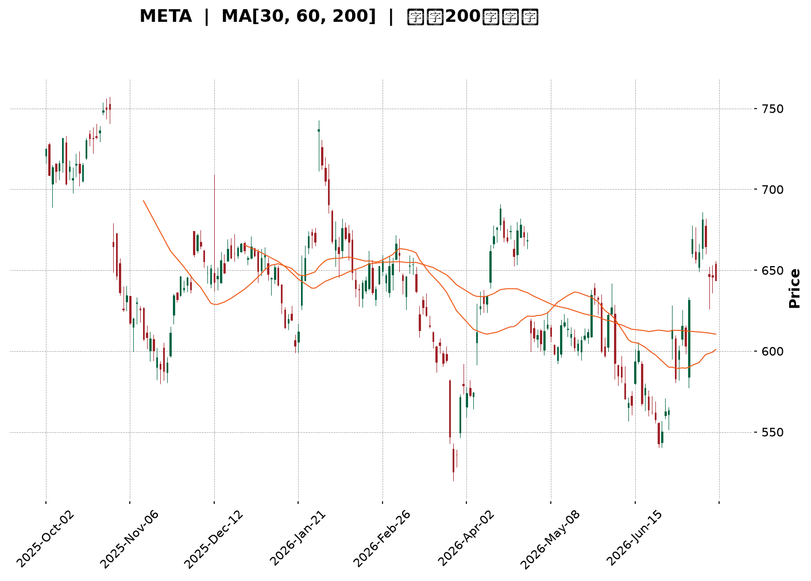
</details>

<html>
<head><meta charset="utf-8" /></head>
<body>
    <div style="height:500px; width:100%;">                        <script>window.PlotlyConfig = {MathJaxConfig: 'local'};</script>
        <script charset="utf-8" src="https://cdn.plot.ly/plotly-3.7.0.min.js" integrity="sha256-jvTGqxNp8AGWEcvNLVuKr+8j5dGe9Yw51LQkmDH+IYA=" crossorigin="anonymous"></script>                <div id="candlestick-chart" class="plotly-graph-div" style="height:100%; width:100%;"></div>            <script>                window.PLOTLYENV=window.PLOTLYENV || {};                                if (document.getElementById("candlestick-chart")) {                    Plotly.newPlot(                        "candlestick-chart",                        [{"close":{"dtype":"f8","bdata":"AAAAwE+phkAAAADguyWGQAAAAKBtToZAAAAAgNc5hkAAAADA0l+GQAAAAKDb3IZAAAAAYMP7hUAAAABAv06GQAAAAIB+FoZAAAAAQIJdhkAAAABgyDGGQAAAAGB7WIZAAAAAYCrShkAAAABg8dqGQAAAAEAP3IZAAAAAgMTghkAAAACAjgOHQAAAAID6ZodAAAAAAO1rh0AAAADgwm2HQAAAAMDtxYRAAAAAQFg1hEAAAABAcuCDQAAAAKCKjYNAAAAAAGfSg0AAAADgrEqDQAAAACDHYINAAAAAIPiwg0AAAACAoIuDQAAAAABx+4JAAAAAoHYCg0AAAABACP+CQAAAACCWw4JAAAAA4B2hgkAAAAAgT2aCQAAAAGD5XIJAAAAAAKuFgkAAAACArRuDQAAAAICO1INAAAAAQLu\u002fg0AAAABAJzKEQAAAACCp+YNAAAAA4F4rhEAAAADghu+DQAAAAACDnoRAAAAAgGL9hEAAAADgj8iEQAAAAOALeoRAAAAAQIxDhEAAAACAIliEQAAAAIB4FIRAAAAAQNsyhEAAAADg1n+EQAAAAIC\u002fQoRAAAAAgCK6hEAAAACgxoyEQAAAAMCTooRAAAAAQAy+hEAAAAAA5NKEQAAAACDfsIRAAAAAICOMhEAAAAAgHcaEQAAAACBRl4RAAAAAwANKhEAAAACA74yEQAAAAKCMm4RAAAAAgEc8hEAAAADgRieEQAAAAGAtX4RAAAAAYJ0GhEAAAAAAu6+DQAAAAGBkM4NAAAAAgI5dg0AAAAAgKlmDQAAAAMBa2IJAAAAA4PIeg0AAAACA0DOEQAAAAECyjIRAAAAAQE35hEAAAABgLP6EQAAAAEBQ3IRAAAAAgPYHh0AAAAAgy1mGQAAAAIA3CYZAAAAAIL+ThUAAAAAAZN6EQAAAACAi6IRAAAAAAEKihEAAAADgHCCFQAAAAIA07IRAAAAAoP7bhEAAAABAOUWEQAAAAOAL9YNAAAAAoDbxg0AAAADgmBCEQAAAACAOHYRAAAAAwPBzhEAAAABA7OCDQAAAACBL8YNAAAAAQDVkhEAAAACguH6EQAAAAOA0OIRAAAAAgCtjhEAAAAAAT2+EQAAAAABU1IRAAAAAgCabhEAAAACgsR2EQAAAAODlMYRAAAAAQD5nhEAAAABAjW2EQAAAAIBZ6INAAAAAAPAkg0AAAADA85aDQAAAAOCqcINAAAAAIOE4g0AAAAAgG\u002fGCQAAAAODhiIJAAAAAYAHcgkAAAADA94KCQAAAAKC2koJAAAAAgEMYgUAAAACA3WmAQAAAACARv4BAAAAAQM3cgUAAAACgjBWCQAAAAMBs74FAAAAAYOrjgUAAAADgI\u002fSBQAAAAMDSHoNAAAAAIHeeg0AAAADANqqDQAAAAECKz4NAAAAAIAOvhEAAAABgqveEQAAAACDyIYVAAAAAoEx\u002fhUAAAABgT\u002fKEQAAAAADE4YRAAAAAAMMQhUAAAABAUZSEQAAAAGA9E4VAAAAA4O4vhUAAAABAv\u002fWEQAAAAOAA5IRAAAAAQL8ag0AAAACgfQGDQAAAACDCDoNAAAAA4DLjgkAAAAAAgCKDQAAAACDpQYNAAAAAIIYIg0AAAACgcbKCQAAAAICI04JAAAAA4HhAg0AAAADg206DQAAAAEBKLYNAAAAAACcVg0AAAACAatCCQAAAAID\u002f44JAAAAAYIr2gkAAAABAjw2DQAAAACAvHoNAAAAA4F\u002fVg0AAAAAgndWDQAAAAABlv4NAAAAAwE+\u002fgkAAAADgnKiCQAAAAKA5c4NAAAAAQOmXg0AAAACAm4OCQAAAAKDIRoJAAAAAwGNAgkAAAABAnNOBQAAAAKA6v4FAAAAAwKOzgUAAAAAA14uCQAAAACCuwYJAAAAA4KO8gUAAAACAwgmCQAAAAMDMnoFAAAAAoJmRgUAAAAAgXG2BQAAAAMD19oBAAAAAAAAygUAAAADAzJSBQAAAAOBRmoFAAAAAoEcng0AAAABAMzeCQAAAAOBRwoJAAAAA4KM8g0AAAADA9diCQAAAAADXu4NAAAAAIK7phEAAAAAA14WEQAAAAOBRqIRAAAAA4HpKhUAAAADgUcSEQAAAAIAUMIRAAAAAwMwuhEAAAADgeh6EQA=="},"high":{"dtype":"f8","bdata":"LJe2jA6vhkCc8X1o1MiGQBpzu8QpWIZAh02O1BZlhkC\u002fv1YCRG6GQAAAAKDb3IZAr368x+bqhkBVGEg5lHCGQOHr7veMTYZAh6ehYy2QhkBdjDQ03ZyGQJjTvYRoZYZA3Vzlv+7ehkC7KP6WrASHQBhTQi1uFYdAZ+MRct8jh0Cbeb07TBqHQI3o9+5QjodAjA4iJnajh0Bm5pqVhqmHQCP40GSMOYVAwWUSQB0JhUBJf3Qk9YyEQCpVKSSaAIRA1kjjAoMEhEB2L3odzdKDQDdsywQhZINAIppqadLKg0CkyDZTap+DQH8yGdrdmoNAV7Uc5mFAg0CwKqFUtCCDQFNXZlLTEINAabDIqMDQgkDHrwECSY6CQBk3wUgr6YJAcH66MIykgkA0L+VbzTiDQDhKJvct24NA9w8aBKLlg0AkFAd48zKEQO1Q+hsrHYRABM65yIMxhECI4P+7VTmEQEPPL9jEEoVAVfK7wIQHhUDKr+D5oheFQBvQaswMtoRAABvgOn9mhEBYq684pGyEQJxCBsg+KYZAe0TYurJehEBUTUvY4aqEQJ\u002fjj7lroIRAPYTQd+3qhEARrnQGce6EQK501ZILA4VAOAtrQoPGhED1yNnz69eEQEWXMjwS3oRA7e+uT5iYhEDBFLIiL\u002fiEQNZFFNiGvoRAWua45Ke5hEATbiKI2rqEQD0TegGuwoRAlCHMes+PhECEJB71lC+EQEjJkztFboRA8F0VnXFmhEAvd\u002fTaAgmEQCQkGNmlmoNALx3r9Xd4g0BsW6jMrZ+DQLDl07N9EoNAfsPkYlpJg0C0zZlvJpuEQI2AyQ9tyoRAbHnc2Z4QhUAaN8U16xyFQIthWjzJI4VAsrQb4GY1h0B3BCAb7taGQOnnBvMfgIZA2KpWPMldhkArAQsH1HyFQLFDa9RKQoVAo6\u002fH+Vj2hEDTmJsKv1CFQEU4bAmBO4VAo5gE63swhUBJ7JHeXhaFQI0ba\u002fooUoRAocv\u002fbaULhEAjhT\u002fizx6EQPWQGvZMMIRAt7dR1VmxhEBJWa9NO4SEQEhEVGa\u002f\u002f4NALBSerrllhEAI\u002fDCTlZ6EQH8FssdEQoRAB6TRex6WhEDYgyqP7o6EQAvO3Z6T\u002fIRABpQuzwvshEDkZEwQgkKEQMWs7c\u002fFNIRAiycliP6YhEDz6yw3ko+EQLaiswKxYoRAjYOSnmWgg0BlphNITNGDQAvaDUmv34NAxkdriJZwg0AkMZ2NdSODQDpp2Nc024JAqLqTkJwAg0AN3HVNjMOCQGl6m1nj2IJAAzKXYK4zgkCY4m3XxfiAQIVFJD1n2IBAN2OlKkXpgUCcOuC9AoCCQNnUu\u002fa2D4JA33kduQAygkACk54olPWBQBTmrgHvqoNALqd\u002fGUfng0BNf37W6O+DQEFp2ttL04NAr9mx+STNhEClYrhg+S6FQEEdTOeeJ4VAcbIhngmXhUC3NV9a+lWFQJBg7EqXHIVAEMIvzwMuhUDYWTsiheeEQMuy7U1RQIVA6N9txPFOhUAI+VqHaiyFQPKBlGUBDYVADFADbDNig0ATxFmqdFKDQBz\u002fPbFzK4NA7HxdsT8ug0BP2bX3AVuDQKD6isE1g4NA6PKbVZdBg0A5tv+GzOKCQAGH5hOH2YJAeqN6rJtag0CRPw8zOHmDQB6Pa6j\u002fZINAh9CN8Sg4g0ArP5Jo5CqDQJiWxAx\u002f+4JAxhQ3qkgIg0BQSCv\u002f7DGDQHho8zU1L4NAG3IpO0Xvg0BDff6gPBOEQMpx5blMz4NAm50GWErZg0CU3TmKhwKDQCF+\u002faeTfINALuxWAHEOhEAgJfYyiqSDQKYSBVede4JALe5S5ZyogkCF994NLnaCQBwdRAgf3YFA4Fze4kr8gUAAAAAAKcqCQAAAAOB67oJAAAAA4HqOgkAAAACAwiGCQAAAAOB6\u002foFAAAAAoJnhgUAAAADgUciBQAAAAGC4YoFAAAAAwMxmgUAAAABAM9eBQAAAAOBRrIFAAAAAgD2ig0AAAAAAABCDQAAAAOCj3IJAAAAAwPWKg0AAAAAAAECDQAAAAAApyoNAAAAAQOEuhUAAAADA9SSFQAAAAAAA1IRAAAAA4KNwhUAAAABAM0+FQAAAAKCZYYRAAAAAYGZqhEAAAABACn+EQA=="},"hovertemplate":"\u003cb\u003e%{x|%Y-%m-%d}\u003c\u002fb\u003e\u003cbr\u003e\u958b: $%{open:.2f}\u003cbr\u003e\u9ad8: $%{high:.2f}\u003cbr\u003e\u4f4e: $%{low:.2f}\u003cbr\u003e\u6536: $%{close:.2f}\u003cextra\u003e\u003c\u002fextra\u003e","low":{"dtype":"f8","bdata":"j1cadjdihkD5wdOksyKGQJYgdRzAhYVAf1EvkVr\u002fhUCLcDKJyg+GQGjJ9y+8NIZA66JlsnX1hUBcJjoybw6GQFwKXqMgzIVAjA\u002fGFlsdhkBJzMfCbvCFQBnoamBOAoZArxDLkn5yhkC1t21j4LaGQL7\u002fKfU2kYZAg4sSCJbZhkDrCRTOBsqGQJz\u002fu42OUIdAsN9gU7A8h0B40ZLpqySHQJZcyfjdQ4RAbE3ppCkfhECTXt3gPNSDQBEkqLUWg4NA980tPlGHg0DtT3S+LEODQKrUApcfvYJAV9PcZA1Eg0AZOXE6RE6DQG\u002fsdBaM8YJAPOmpenzLgkBw6VKCP42CQBQhIv7XjoJAH5ixJSAygkCE7OXv7x2CQFT\u002fGrCxLoJA+oyrEs4igkBpoHpLo6CCQHOEw5ORRYNA3yK7xO6vg0C0P7XEz86DQImAlWXY4INATMNQeVHjg0D5xvtjK9+DQNIY7byzkoRAAhAZuV+lhEDIQ9sQwrqEQCKgZ1spXYRAixBDAdkNhEBpriAGGvmDQH6jQZug54NAp2aIgIDsg0CLIdAecBCEQPopDThaQIRAvQdUI1R6hEAK2dRmEIiEQMQYpK\u002fYe4RAac+VhZ+IhED1HIrCKqiEQFcEBs8joYRAc3czbsxphEDJkg5zWYWEQK\u002fa2z4gkoRAucLoUtUShEDWAEjixTSEQHJUt+zpVYRAjF1FZksdhECABAo1tNSDQIZBkHukDYRAB2DWkrQAhECUBord6HeDQMKdgE3NLYNAyHd5FRcpg0DOZ7CezleDQN9VKgZ0t4JA4e8GmBe4gkAvY6x\u002feYuDQOXU5I5rGoRAvaDnPuaghEB6yNvNz7uEQLUFWZdPx4RA6Tk28D86hkCvtaIcjkKGQL5p\u002fmkj8oVAngGyaoBphUBvdT80LNKEQMaoYO+wYoRAYhnibcoqhEAwY8Ae24yEQOLWOkTH5IRAVZngg3B\u002fhEBPwOhkDCGEQCXopzaFy4NAUbTHYHGdg0B4WpiUQJiDQKkQsISw3INAbSaRLSTtg0Dwk+PO8NaDQCiz8WHhnoNAi9LW\u002fvgHhEAwT\u002fXNxjKEQMC0sK\u002fe54NA5XrXIfbKg0DlyeS4nu2DQMhahc\u002f9g4RAmvkuajdJhEDDLaiI0deDQMEJ3shPjYNARxf9XME+hEBuLOnzpDmEQEg528og3oNA6GLPa7cDg0D0qc8fL3SDQMkDBLL+aINA0Ixux1Mwg0DTdHBrns2CQD4MuGemVYJADGKTk6SzgkDpDhREn3OCQH6oV\u002fPNhoJASvoxUsb2gECpNcLaOT6AQNyk6p1ngIBAxGbeFxwSgUCJ2z1CT+qBQBpNdj10eYFA67EsT8PbgUBqz3KD5aGBQAmY04tBeoJAbBSemGJzg0DoZ8HcA36DQGbrmTWTfoNALGWEODn2g0ArK+j01ryEQOw9l6sN2YRAvvAH8wkUhUBNjahEDduEQHfJEV2y1YRA22697AnphEBDR2jxj2OEQDbYRW\u002fgaYRAWaDUQMDxhEDZRxX0G8iEQPilzBGQuYRA2bzHNY67gkBy6prhY+yCQLthfQaJ0YJA5dA5uW6+gkBc1UmHXqyCQJ4OkVPGJ4NAjQYyhf3rgkAg2qO6NayCQK242\u002fhogIJAb1UAH9yggkAmMSHBcTODQLPfY3T3BYNAl9LjQgzZgkAhuAyI87+CQKAuiD8NqoJAdDet1hKSgkAF8N2mGvOCQFXBz3nq5YJAfYTMK30Dg0B4KR530aWDQEFJB58udoNAyilUiMy3gkDW7jgNBaGCQIReyLC2vYJACmJeP9Rug0BEwjRC9jKCQNtYZhN4FYJAwsQIqsYjgkDve3m4ktCBQOBYTij0Y4FAZnTEhwuDgUAAAABgZhqCQAAAAAAAgIJAAAAAIIWxgUAAAADAzJiBQAAAAOB6foFAAAAAACmIgUAAAABgZlyBQAAAAKBw4YBAAAAAQDPjgEAAAAAAAHCBQAAAAKBwO4FAAAAAwMyYgkAAAAAgXCOCQAAAAIAULoJAAAAAoEfdgkAAAACAFLCCQAAAAGCPCIJAAAAAgBSQhEAAAACgmXGEQAAAAGBmSIRAAAAAoEeFhEAAAACgR6GEQAAAAAAAkINAAAAAgBTgg0AAAACgmRmEQA=="},"name":"\u50f9\u683c","open":{"dtype":"f8","bdata":"O0du\u002f6SFhkAhZsLv5b2GQHERX7\u002fi+oVAUCdved1ehkCehZNSyzyGQE5BUolVY4ZAQSrvAzHIhkDkHZ1qSDmGQNFCNV+ND4ZA00tpWplZhkAvZvlCgl2GQJvGv2b3CYZAiEwltY16hkDoiODD4vCGQHNzuERp34ZA9e\u002fzZ1rmhkCHX1N3B\u002feGQFpsfepHXodAdV+OzWt1h0DuYixjVoaHQHax\u002fkJQ24RA1k3mBBUGhUAhHFX1YnKEQI2KzkxJk4NAxzmgllu1g0AmxYSpmtGDQG9SmTsgN4NA66s3j5+rg0CQjtG895KDQMQguisBlINA7fEYW9Ybg0BYWKS\u002f1MGCQDyfpyau+4JAQ1l+2oVwgkC4tcovcIGCQPDD7+N5z4JAkbkdjMlXgkA\u002fqBrBVamCQFp4j+sMc4NA5KJDc0ngg0C9QNqPcNODQOIsNsMg74NA1yLTyWMFhECjL2cy6BWEQOKDKKD4EYVAaNF3aziyhEAux2xh1NyEQJltAZJisIRASJjNlBxChECe7aNL+AyEQEJBukjqQIRA\u002fAS3+WYkhEDXn8Nm1RKEQNBPEXiKc4RAOa4tb+F+hEAwDDna3cmEQEZF8nPGo4RAsLIrVf+WhEBmn3JuzaqEQPswDbv21oRAdIHM+rSGhEBBdpAZI4yEQLxHesGHvIRAFNx4MmashEB8AO1+zk6EQBUaPRQqk4RARo2mx8dzhEDwtQjo1iWEQE0CpWlTIoRAk\u002fVg3fFahEAvd\u002fTaAgmEQGOBi1UTi4NA2MHblQdLg0CjqR5rjHiDQKrg5Ilh9oJAs2Cp7kbtgkA5RLCp1aGDQMfVJ8T5HIRASt3fnZC\u002fhEDltpVXHAuFQI8JKjVkCoVAMeqGde8Ah0ClBNYCo7GGQKnXAMKeSoZArpHBGuIQhkD+f\u002fEpC3SFQCUnVg0ws4RAkNjVrXDChEA8nCEz\u002fq+EQNdD6aglI4VA8CTZImYGhUCh19hbN+aEQOrJBzCcH4RA\u002ft7v++Pyg0B05Q0aX8WDQEkaiaV264NA5XsZfGj0g0BLcqJeBluEQEk\u002feU6fv4NAU666UhYLhEDxh60OIkuEQGD3wR9vEoRADxSSDjTgg0AvutzCFTmEQB4xwcBOhoRA92FkygKmhEDfT\u002fCJ+DWEQFpZTpwyzYNA2Z0bnCtjhEAfZlTdwGyEQMZO2VTCPIRAvhb0fzt2g0B1Wh5\u002fUbuDQLdMh6REm4NA86CWnyc+g0AACz5qqhyDQB\u002fLlQjF14JADCUpGNXpgkDvgtmnXLSCQNLh9RJ8sYJAgLMx2JovgkAVSaV6zNyAQAAAACARv4BAKN97AcQrgUB0jhYrvhyCQB4ZoncgrIFA0MftpD0JgkCsmKdfmd+BQFDLtsyC64JALZlekR2Tg0BKjeNBD8+DQHqs0klWp4NAW+Fkq\u002f4UhEA6JFovD9OEQPTsOYvpGoVAMMJ03sUvhUDXqf8u1UWFQEEAZIcH84RAvoHCbuINhUDkwBn\u002frriEQMoWYyWrnYRA77ErkwfzhEB1lSLg7AyFQCgk9SVT4oRA1C2\u002f8vhVg0BmO2d89zCDQI90CE8E+4JAw\u002fRAyu8lg0Bw9iOP8sOCQFCzsLY0MYNAdSnU7wo1g0B2hwnsFOCCQOy8G2MnkoJAuWd+QTSygkAwB6vbbzuDQNKjgDRfK4NAG6qLG14Eg0DkEr1o2QKDQELMcEehwYJALr30Ho67gkBF2mSDifqCQLUh6wqcAoNA7uGbqa8Gg0ChHCZEQ\u002feDQOC+YJ9Ox4NAq75dvYeug0D0CWd8c9WCQCtbfIOI04JATSxhZb14g0BztCzdD3eDQKYSBVede4JAG50SOJ9zgkC3EdXCiSGCQLcwRM5yqoFA3JSZDVvjgUAAAABAMx+CQAAAAEAzjYJAAAAAAACAgkAAAABgj+aBQAAAAAAp4IFAAAAAAACSgUAAAADAHo+BQAAAAGBmXIFAAAAAYLj6gEAAAAAAAICBQAAAACCFh4FAAAAAoEf\u002fgkAAAABAM\u002f+CQAAAAGC4loJAAAAAYLj8gkAAAADAHjODQAAAAIDrP4JAAAAAYLiihEAAAABACquEQAAAAAAAYIRAAAAAwMy8hEAAAACAPSqFQAAAAKCZPYRAAAAAoJk1hEAAAABACnGEQA=="},"x":["2025-10-02T00:00:00-04:00","2025-10-03T00:00:00-04:00","2025-10-06T00:00:00-04:00","2025-10-07T00:00:00-04:00","2025-10-08T00:00:00-04:00","2025-10-09T00:00:00-04:00","2025-10-10T00:00:00-04:00","2025-10-13T00:00:00-04:00","2025-10-14T00:00:00-04:00","2025-10-15T00:00:00-04:00","2025-10-16T00:00:00-04:00","2025-10-17T00:00:00-04:00","2025-10-20T00:00:00-04:00","2025-10-21T00:00:00-04:00","2025-10-22T00:00:00-04:00","2025-10-23T00:00:00-04:00","2025-10-24T00:00:00-04:00","2025-10-27T00:00:00-04:00","2025-10-28T00:00:00-04:00","2025-10-29T00:00:00-04:00","2025-10-30T00:00:00-04:00","2025-10-31T00:00:00-04:00","2025-11-03T00:00:00-05:00","2025-11-04T00:00:00-05:00","2025-11-05T00:00:00-05:00","2025-11-06T00:00:00-05:00","2025-11-07T00:00:00-05:00","2025-11-10T00:00:00-05:00","2025-11-11T00:00:00-05:00","2025-11-12T00:00:00-05:00","2025-11-13T00:00:00-05:00","2025-11-14T00:00:00-05:00","2025-11-17T00:00:00-05:00","2025-11-18T00:00:00-05:00","2025-11-19T00:00:00-05:00","2025-11-20T00:00:00-05:00","2025-11-21T00:00:00-05:00","2025-11-24T00:00:00-05:00","2025-11-25T00:00:00-05:00","2025-11-26T00:00:00-05:00","2025-11-28T00:00:00-05:00","2025-12-01T00:00:00-05:00","2025-12-02T00:00:00-05:00","2025-12-03T00:00:00-05:00","2025-12-04T00:00:00-05:00","2025-12-05T00:00:00-05:00","2025-12-08T00:00:00-05:00","2025-12-09T00:00:00-05:00","2025-12-10T00:00:00-05:00","2025-12-11T00:00:00-05:00","2025-12-12T00:00:00-05:00","2025-12-15T00:00:00-05:00","2025-12-16T00:00:00-05:00","2025-12-17T00:00:00-05:00","2025-12-18T00:00:00-05:00","2025-12-19T00:00:00-05:00","2025-12-22T00:00:00-05:00","2025-12-23T00:00:00-05:00","2025-12-24T00:00:00-05:00","2025-12-26T00:00:00-05:00","2025-12-29T00:00:00-05:00","2025-12-30T00:00:00-05:00","2025-12-31T00:00:00-05:00","2026-01-02T00:00:00-05:00","2026-01-05T00:00:00-05:00","2026-01-06T00:00:00-05:00","2026-01-07T00:00:00-05:00","2026-01-08T00:00:00-05:00","2026-01-09T00:00:00-05:00","2026-01-12T00:00:00-05:00","2026-01-13T00:00:00-05:00","2026-01-14T00:00:00-05:00","2026-01-15T00:00:00-05:00","2026-01-16T00:00:00-05:00","2026-01-20T00:00:00-05:00","2026-01-21T00:00:00-05:00","2026-01-22T00:00:00-05:00","2026-01-23T00:00:00-05:00","2026-01-26T00:00:00-05:00","2026-01-27T00:00:00-05:00","2026-01-28T00:00:00-05:00","2026-01-29T00:00:00-05:00","2026-01-30T00:00:00-05:00","2026-02-02T00:00:00-05:00","2026-02-03T00:00:00-05:00","2026-02-04T00:00:00-05:00","2026-02-05T00:00:00-05:00","2026-02-06T00:00:00-05:00","2026-02-09T00:00:00-05:00","2026-02-10T00:00:00-05:00","2026-02-11T00:00:00-05:00","2026-02-12T00:00:00-05:00","2026-02-13T00:00:00-05:00","2026-02-17T00:00:00-05:00","2026-02-18T00:00:00-05:00","2026-02-19T00:00:00-05:00","2026-02-20T00:00:00-05:00","2026-02-23T00:00:00-05:00","2026-02-24T00:00:00-05:00","2026-02-25T00:00:00-05:00","2026-02-26T00:00:00-05:00","2026-02-27T00:00:00-05:00","2026-03-02T00:00:00-05:00","2026-03-03T00:00:00-05:00","2026-03-04T00:00:00-05:00","2026-03-05T00:00:00-05:00","2026-03-06T00:00:00-05:00","2026-03-09T00:00:00-04:00","2026-03-10T00:00:00-04:00","2026-03-11T00:00:00-04:00","2026-03-12T00:00:00-04:00","2026-03-13T00:00:00-04:00","2026-03-16T00:00:00-04:00","2026-03-17T00:00:00-04:00","2026-03-18T00:00:00-04:00","2026-03-19T00:00:00-04:00","2026-03-20T00:00:00-04:00","2026-03-23T00:00:00-04:00","2026-03-24T00:00:00-04:00","2026-03-25T00:00:00-04:00","2026-03-26T00:00:00-04:00","2026-03-27T00:00:00-04:00","2026-03-30T00:00:00-04:00","2026-03-31T00:00:00-04:00","2026-04-01T00:00:00-04:00","2026-04-02T00:00:00-04:00","2026-04-06T00:00:00-04:00","2026-04-07T00:00:00-04:00","2026-04-08T00:00:00-04:00","2026-04-09T00:00:00-04:00","2026-04-10T00:00:00-04:00","2026-04-13T00:00:00-04:00","2026-04-14T00:00:00-04:00","2026-04-15T00:00:00-04:00","2026-04-16T00:00:00-04:00","2026-04-17T00:00:00-04:00","2026-04-20T00:00:00-04:00","2026-04-21T00:00:00-04:00","2026-04-22T00:00:00-04:00","2026-04-23T00:00:00-04:00","2026-04-24T00:00:00-04:00","2026-04-27T00:00:00-04:00","2026-04-28T00:00:00-04:00","2026-04-29T00:00:00-04:00","2026-04-30T00:00:00-04:00","2026-05-01T00:00:00-04:00","2026-05-04T00:00:00-04:00","2026-05-05T00:00:00-04:00","2026-05-06T00:00:00-04:00","2026-05-07T00:00:00-04:00","2026-05-08T00:00:00-04:00","2026-05-11T00:00:00-04:00","2026-05-12T00:00:00-04:00","2026-05-13T00:00:00-04:00","2026-05-14T00:00:00-04:00","2026-05-15T00:00:00-04:00","2026-05-18T00:00:00-04:00","2026-05-19T00:00:00-04:00","2026-05-20T00:00:00-04:00","2026-05-21T00:00:00-04:00","2026-05-22T00:00:00-04:00","2026-05-26T00:00:00-04:00","2026-05-27T00:00:00-04:00","2026-05-28T00:00:00-04:00","2026-05-29T00:00:00-04:00","2026-06-01T00:00:00-04:00","2026-06-02T00:00:00-04:00","2026-06-03T00:00:00-04:00","2026-06-04T00:00:00-04:00","2026-06-05T00:00:00-04:00","2026-06-08T00:00:00-04:00","2026-06-09T00:00:00-04:00","2026-06-10T00:00:00-04:00","2026-06-11T00:00:00-04:00","2026-06-12T00:00:00-04:00","2026-06-15T00:00:00-04:00","2026-06-16T00:00:00-04:00","2026-06-17T00:00:00-04:00","2026-06-18T00:00:00-04:00","2026-06-22T00:00:00-04:00","2026-06-23T00:00:00-04:00","2026-06-24T00:00:00-04:00","2026-06-25T00:00:00-04:00","2026-06-26T00:00:00-04:00","2026-06-29T00:00:00-04:00","2026-06-30T00:00:00-04:00","2026-07-01T00:00:00-04:00","2026-07-02T00:00:00-04:00","2026-07-06T00:00:00-04:00","2026-07-07T00:00:00-04:00","2026-07-08T00:00:00-04:00","2026-07-09T00:00:00-04:00","2026-07-10T00:00:00-04:00","2026-07-13T00:00:00-04:00","2026-07-14T00:00:00-04:00","2026-07-15T00:00:00-04:00","2026-07-16T00:00:00-04:00","2026-07-17T00:00:00-04:00","2026-07-20T00:00:00-04:00","2026-07-21T00:00:00-04:00"],"type":"candlestick"},{"hovertemplate":"MA30: $%{y:.2f}\u003cextra\u003e\u003c\u002fextra\u003e","line":{"color":"#2196F3","dash":"dash","width":2},"mode":"lines","name":"MA30","x":["2025-10-02T00:00:00-04:00","2025-10-03T00:00:00-04:00","2025-10-06T00:00:00-04:00","2025-10-07T00:00:00-04:00","2025-10-08T00:00:00-04:00","2025-10-09T00:00:00-04:00","2025-10-10T00:00:00-04:00","2025-10-13T00:00:00-04:00","2025-10-14T00:00:00-04:00","2025-10-15T00:00:00-04:00","2025-10-16T00:00:00-04:00","2025-10-17T00:00:00-04:00","2025-10-20T00:00:00-04:00","2025-10-21T00:00:00-04:00","2025-10-22T00:00:00-04:00","2025-10-23T00:00:00-04:00","2025-10-24T00:00:00-04:00","2025-10-27T00:00:00-04:00","2025-10-28T00:00:00-04:00","2025-10-29T00:00:00-04:00","2025-10-30T00:00:00-04:00","2025-10-31T00:00:00-04:00","2025-11-03T00:00:00-05:00","2025-11-04T00:00:00-05:00","2025-11-05T00:00:00-05:00","2025-11-06T00:00:00-05:00","2025-11-07T00:00:00-05:00","2025-11-10T00:00:00-05:00","2025-11-11T00:00:00-05:00","2025-11-12T00:00:00-05:00","2025-11-13T00:00:00-05:00","2025-11-14T00:00:00-05:00","2025-11-17T00:00:00-05:00","2025-11-18T00:00:00-05:00","2025-11-19T00:00:00-05:00","2025-11-20T00:00:00-05:00","2025-11-21T00:00:00-05:00","2025-11-24T00:00:00-05:00","2025-11-25T00:00:00-05:00","2025-11-26T00:00:00-05:00","2025-11-28T00:00:00-05:00","2025-12-01T00:00:00-05:00","2025-12-02T00:00:00-05:00","2025-12-03T00:00:00-05:00","2025-12-04T00:00:00-05:00","2025-12-05T00:00:00-05:00","2025-12-08T00:00:00-05:00","2025-12-09T00:00:00-05:00","2025-12-10T00:00:00-05:00","2025-12-11T00:00:00-05:00","2025-12-12T00:00:00-05:00","2025-12-15T00:00:00-05:00","2025-12-16T00:00:00-05:00","2025-12-17T00:00:00-05:00","2025-12-18T00:00:00-05:00","2025-12-19T00:00:00-05:00","2025-12-22T00:00:00-05:00","2025-12-23T00:00:00-05:00","2025-12-24T00:00:00-05:00","2025-12-26T00:00:00-05:00","2025-12-29T00:00:00-05:00","2025-12-30T00:00:00-05:00","2025-12-31T00:00:00-05:00","2026-01-02T00:00:00-05:00","2026-01-05T00:00:00-05:00","2026-01-06T00:00:00-05:00","2026-01-07T00:00:00-05:00","2026-01-08T00:00:00-05:00","2026-01-09T00:00:00-05:00","2026-01-12T00:00:00-05:00","2026-01-13T00:00:00-05:00","2026-01-14T00:00:00-05:00","2026-01-15T00:00:00-05:00","2026-01-16T00:00:00-05:00","2026-01-20T00:00:00-05:00","2026-01-21T00:00:00-05:00","2026-01-22T00:00:00-05:00","2026-01-23T00:00:00-05:00","2026-01-26T00:00:00-05:00","2026-01-27T00:00:00-05:00","2026-01-28T00:00:00-05:00","2026-01-29T00:00:00-05:00","2026-01-30T00:00:00-05:00","2026-02-02T00:00:00-05:00","2026-02-03T00:00:00-05:00","2026-02-04T00:00:00-05:00","2026-02-05T00:00:00-05:00","2026-02-06T00:00:00-05:00","2026-02-09T00:00:00-05:00","2026-02-10T00:00:00-05:00","2026-02-11T00:00:00-05:00","2026-02-12T00:00:00-05:00","2026-02-13T00:00:00-05:00","2026-02-17T00:00:00-05:00","2026-02-18T00:00:00-05:00","2026-02-19T00:00:00-05:00","2026-02-20T00:00:00-05:00","2026-02-23T00:00:00-05:00","2026-02-24T00:00:00-05:00","2026-02-25T00:00:00-05:00","2026-02-26T00:00:00-05:00","2026-02-27T00:00:00-05:00","2026-03-02T00:00:00-05:00","2026-03-03T00:00:00-05:00","2026-03-04T00:00:00-05:00","2026-03-05T00:00:00-05:00","2026-03-06T00:00:00-05:00","2026-03-09T00:00:00-04:00","2026-03-10T00:00:00-04:00","2026-03-11T00:00:00-04:00","2026-03-12T00:00:00-04:00","2026-03-13T00:00:00-04:00","2026-03-16T00:00:00-04:00","2026-03-17T00:00:00-04:00","2026-03-18T00:00:00-04:00","2026-03-19T00:00:00-04:00","2026-03-20T00:00:00-04:00","2026-03-23T00:00:00-04:00","2026-03-24T00:00:00-04:00","2026-03-25T00:00:00-04:00","2026-03-26T00:00:00-04:00","2026-03-27T00:00:00-04:00","2026-03-30T00:00:00-04:00","2026-03-31T00:00:00-04:00","2026-04-01T00:00:00-04:00","2026-04-02T00:00:00-04:00","2026-04-06T00:00:00-04:00","2026-04-07T00:00:00-04:00","2026-04-08T00:00:00-04:00","2026-04-09T00:00:00-04:00","2026-04-10T00:00:00-04:00","2026-04-13T00:00:00-04:00","2026-04-14T00:00:00-04:00","2026-04-15T00:00:00-04:00","2026-04-16T00:00:00-04:00","2026-04-17T00:00:00-04:00","2026-04-20T00:00:00-04:00","2026-04-21T00:00:00-04:00","2026-04-22T00:00:00-04:00","2026-04-23T00:00:00-04:00","2026-04-24T00:00:00-04:00","2026-04-27T00:00:00-04:00","2026-04-28T00:00:00-04:00","2026-04-29T00:00:00-04:00","2026-04-30T00:00:00-04:00","2026-05-01T00:00:00-04:00","2026-05-04T00:00:00-04:00","2026-05-05T00:00:00-04:00","2026-05-06T00:00:00-04:00","2026-05-07T00:00:00-04:00","2026-05-08T00:00:00-04:00","2026-05-11T00:00:00-04:00","2026-05-12T00:00:00-04:00","2026-05-13T00:00:00-04:00","2026-05-14T00:00:00-04:00","2026-05-15T00:00:00-04:00","2026-05-18T00:00:00-04:00","2026-05-19T00:00:00-04:00","2026-05-20T00:00:00-04:00","2026-05-21T00:00:00-04:00","2026-05-22T00:00:00-04:00","2026-05-26T00:00:00-04:00","2026-05-27T00:00:00-04:00","2026-05-28T00:00:00-04:00","2026-05-29T00:00:00-04:00","2026-06-01T00:00:00-04:00","2026-06-02T00:00:00-04:00","2026-06-03T00:00:00-04:00","2026-06-04T00:00:00-04:00","2026-06-05T00:00:00-04:00","2026-06-08T00:00:00-04:00","2026-06-09T00:00:00-04:00","2026-06-10T00:00:00-04:00","2026-06-11T00:00:00-04:00","2026-06-12T00:00:00-04:00","2026-06-15T00:00:00-04:00","2026-06-16T00:00:00-04:00","2026-06-17T00:00:00-04:00","2026-06-18T00:00:00-04:00","2026-06-22T00:00:00-04:00","2026-06-23T00:00:00-04:00","2026-06-24T00:00:00-04:00","2026-06-25T00:00:00-04:00","2026-06-26T00:00:00-04:00","2026-06-29T00:00:00-04:00","2026-06-30T00:00:00-04:00","2026-07-01T00:00:00-04:00","2026-07-02T00:00:00-04:00","2026-07-06T00:00:00-04:00","2026-07-07T00:00:00-04:00","2026-07-08T00:00:00-04:00","2026-07-09T00:00:00-04:00","2026-07-10T00:00:00-04:00","2026-07-13T00:00:00-04:00","2026-07-14T00:00:00-04:00","2026-07-15T00:00:00-04:00","2026-07-16T00:00:00-04:00","2026-07-17T00:00:00-04:00","2026-07-20T00:00:00-04:00","2026-07-21T00:00:00-04:00"],"y":{"dtype":"f8","bdata":"AAAAAAAA+H8AAAAAAAD4fwAAAAAAAPh\u002fAAAAAAAA+H8AAAAAAAD4fwAAAAAAAPh\u002fAAAAAAAA+H8AAAAAAAD4fwAAAAAAAPh\u002fAAAAAAAA+H8AAAAAAAD4fwAAAAAAAPh\u002fAAAAAAAA+H8AAAAAAAD4fwAAAAAAAPh\u002fAAAAAAAA+H8AAAAAAAD4fwAAAAAAAPh\u002fAAAAAAAA+H8AAAAAAAD4fwAAAAAAAPh\u002fAAAAAAAA+H8AAAAAAAD4fwAAAAAAAPh\u002fAAAAAAAA+H8AAAAAAAD4fwAAAAAAAPh\u002fAAAAAAAA+H8AAAAAAAD4f5qZmYnNp4VAq6qqKqSIhUAAAABQwG2FQN7d3e2FT4VAMzMzE9UwhUCamZlJ6g6FQBEREeGE6IRAiYiIiPvKhEBEREQkrq+EQImIiGhqnIRAmpmZ+RaGhEAiIiISCXWEQM3MzNzOYIRAq6qqei5KhEB3d3eHRDGEQBEREUEmHoRAMzMzYwkOhEBmZmbmAPuDQDMzMwMK4oNAq6qq2hfHg0BVVVW1xayDQGZmZmbbpoNAq6qqKsamg0AiIiJSFqyDQN7d3Z0gsoNAEREREdq5g0CJiIiolsSDQN7d3a1Qz4NAERER0UjYg0B3d3d3MeODQERERDTG8YNA3t3djeX+g0CrqqrqEA6EQHd3dzeoHYRAMzMzA9IrhEARERGxLD6EQLy7u7tTUYRAzczMjPJfhEAAAAAQ3miEQFVVVfV8bYRARERE1NlvhEAzMzPjgGuEQO\u002fu7v7kZIRAd3d3twhehEAAAACgBVmEQGZmZibiSYRA7+7ufu85hEDv7u4u+jSEQERERFSZNYRAvLu7S6g7hECJiIgoMUGEQLy7u3vaR4RA7+7uDgZghEB3d3d30m+EQJqZmZn4foRA3t3djTmGhEAAAAAA8oiEQLy7u4tDi4RAd3d3Z1aKhEDe3d1d6YyEQN7d3a3jjoRAERERIY2RhEBEREREQY2EQO\u002fu7o7Yh4RAmpmZyeKEhEBERETEvYCEQJqZmVmGfIRAMzMzU2F+hECJiIj4CHyEQLy7u0tfeIRAVVVV9X17hEB3d3dHZIKEQFVVVeUVi4RAREREVM6ThEAzMzPTE52EQImIiIgCroRAvLu76666hECJiIgo8rmEQImIiFjrtoRAq6qq+gyyhEAAAADgOq2EQM3MzAwZpYRAq6qqKu6DhEBERER0XmyEQCIiIqI3VoRAq6qqKh9ChEDe3d3NrTGEQN7d3e1vHYRAREREpEsOhECrqqqa\u002ffeDQAAAAODw44NAmpmZCdHDg0BERESU56KDQKuqqlqBh4NAvLu7G8J1g0DNzMxM22SDQKuqqtpEUoNAZmZmxmY8g0AiIiKy+SuDQO\u002fu7q71JINAd3d3R14eg0AiIiLiSBeDQKuqqrrLE4NAq6qq6lIWg0Dv7u5+3hqDQFVVVdV0HYNAREREtA8lg0B3d3cHJiyDQERERMQCMoNAMzMzU6k3g0AAAAAg9DiDQHd3d6fqQoNAzczMjFlUg0AAAAAAC2CDQLy7u7trbINAq6qqmmprg0C8u7tr9muDQERERNRscINAZmZmNqpwg0De3d2N+3WDQCIiIpLSe4NAMzMzU12Mg0Crqqq62Z+DQBEREXGZsYNA7+7ufnS9g0AiIiIS5seDQFVVVYV+0oNAVVVVNavcg0BVVVXlAuSDQLy7u+sM4oNAZmZm9nPcg0De3d0tO9eDQN7d3b1R0YNAERERkRDKg0BVVVV1ZcCDQERERPSTtINAd3d3lxydg0BERESklomDQERERNRefYNAmpmZCc9wg0ARERFhL1+DQO\u002fu7p5NR4NAMzMzc0Aug0DNzMyMgxODQERERCSw+IJAIiIiwrfsgkDe3d3Ny+iCQCIiIhI65oJAERERgWjcgkCrqqraDNOCQBEREXEUxYJAd3d3F5W4gkCrqqoKv62CQImIiEjcnYJAiYiIuE+MgkC8u7t7k32CQN7d3c0kcIJA3t3dfb9wgkDNzMwMpGuCQJqZmamEaoJAiYiI2NpsgkDv7u7+GWuCQDMzM1NbcIJAIiIiIpF5gkDe3d3tcH+CQO\u002fu7o40h4JAIiIiMumcgkAiIiKy5q6CQCIiIkIytYJAd3d31zm6gkBERET068eCQA=="},"type":"scatter"},{"hovertemplate":"MA60: $%{y:.2f}\u003cextra\u003e\u003c\u002fextra\u003e","line":{"color":"#9C27B0","dash":"dash","width":2},"mode":"lines","name":"MA60","x":["2025-10-02T00:00:00-04:00","2025-10-03T00:00:00-04:00","2025-10-06T00:00:00-04:00","2025-10-07T00:00:00-04:00","2025-10-08T00:00:00-04:00","2025-10-09T00:00:00-04:00","2025-10-10T00:00:00-04:00","2025-10-13T00:00:00-04:00","2025-10-14T00:00:00-04:00","2025-10-15T00:00:00-04:00","2025-10-16T00:00:00-04:00","2025-10-17T00:00:00-04:00","2025-10-20T00:00:00-04:00","2025-10-21T00:00:00-04:00","2025-10-22T00:00:00-04:00","2025-10-23T00:00:00-04:00","2025-10-24T00:00:00-04:00","2025-10-27T00:00:00-04:00","2025-10-28T00:00:00-04:00","2025-10-29T00:00:00-04:00","2025-10-30T00:00:00-04:00","2025-10-31T00:00:00-04:00","2025-11-03T00:00:00-05:00","2025-11-04T00:00:00-05:00","2025-11-05T00:00:00-05:00","2025-11-06T00:00:00-05:00","2025-11-07T00:00:00-05:00","2025-11-10T00:00:00-05:00","2025-11-11T00:00:00-05:00","2025-11-12T00:00:00-05:00","2025-11-13T00:00:00-05:00","2025-11-14T00:00:00-05:00","2025-11-17T00:00:00-05:00","2025-11-18T00:00:00-05:00","2025-11-19T00:00:00-05:00","2025-11-20T00:00:00-05:00","2025-11-21T00:00:00-05:00","2025-11-24T00:00:00-05:00","2025-11-25T00:00:00-05:00","2025-11-26T00:00:00-05:00","2025-11-28T00:00:00-05:00","2025-12-01T00:00:00-05:00","2025-12-02T00:00:00-05:00","2025-12-03T00:00:00-05:00","2025-12-04T00:00:00-05:00","2025-12-05T00:00:00-05:00","2025-12-08T00:00:00-05:00","2025-12-09T00:00:00-05:00","2025-12-10T00:00:00-05:00","2025-12-11T00:00:00-05:00","2025-12-12T00:00:00-05:00","2025-12-15T00:00:00-05:00","2025-12-16T00:00:00-05:00","2025-12-17T00:00:00-05:00","2025-12-18T00:00:00-05:00","2025-12-19T00:00:00-05:00","2025-12-22T00:00:00-05:00","2025-12-23T00:00:00-05:00","2025-12-24T00:00:00-05:00","2025-12-26T00:00:00-05:00","2025-12-29T00:00:00-05:00","2025-12-30T00:00:00-05:00","2025-12-31T00:00:00-05:00","2026-01-02T00:00:00-05:00","2026-01-05T00:00:00-05:00","2026-01-06T00:00:00-05:00","2026-01-07T00:00:00-05:00","2026-01-08T00:00:00-05:00","2026-01-09T00:00:00-05:00","2026-01-12T00:00:00-05:00","2026-01-13T00:00:00-05:00","2026-01-14T00:00:00-05:00","2026-01-15T00:00:00-05:00","2026-01-16T00:00:00-05:00","2026-01-20T00:00:00-05:00","2026-01-21T00:00:00-05:00","2026-01-22T00:00:00-05:00","2026-01-23T00:00:00-05:00","2026-01-26T00:00:00-05:00","2026-01-27T00:00:00-05:00","2026-01-28T00:00:00-05:00","2026-01-29T00:00:00-05:00","2026-01-30T00:00:00-05:00","2026-02-02T00:00:00-05:00","2026-02-03T00:00:00-05:00","2026-02-04T00:00:00-05:00","2026-02-05T00:00:00-05:00","2026-02-06T00:00:00-05:00","2026-02-09T00:00:00-05:00","2026-02-10T00:00:00-05:00","2026-02-11T00:00:00-05:00","2026-02-12T00:00:00-05:00","2026-02-13T00:00:00-05:00","2026-02-17T00:00:00-05:00","2026-02-18T00:00:00-05:00","2026-02-19T00:00:00-05:00","2026-02-20T00:00:00-05:00","2026-02-23T00:00:00-05:00","2026-02-24T00:00:00-05:00","2026-02-25T00:00:00-05:00","2026-02-26T00:00:00-05:00","2026-02-27T00:00:00-05:00","2026-03-02T00:00:00-05:00","2026-03-03T00:00:00-05:00","2026-03-04T00:00:00-05:00","2026-03-05T00:00:00-05:00","2026-03-06T00:00:00-05:00","2026-03-09T00:00:00-04:00","2026-03-10T00:00:00-04:00","2026-03-11T00:00:00-04:00","2026-03-12T00:00:00-04:00","2026-03-13T00:00:00-04:00","2026-03-16T00:00:00-04:00","2026-03-17T00:00:00-04:00","2026-03-18T00:00:00-04:00","2026-03-19T00:00:00-04:00","2026-03-20T00:00:00-04:00","2026-03-23T00:00:00-04:00","2026-03-24T00:00:00-04:00","2026-03-25T00:00:00-04:00","2026-03-26T00:00:00-04:00","2026-03-27T00:00:00-04:00","2026-03-30T00:00:00-04:00","2026-03-31T00:00:00-04:00","2026-04-01T00:00:00-04:00","2026-04-02T00:00:00-04:00","2026-04-06T00:00:00-04:00","2026-04-07T00:00:00-04:00","2026-04-08T00:00:00-04:00","2026-04-09T00:00:00-04:00","2026-04-10T00:00:00-04:00","2026-04-13T00:00:00-04:00","2026-04-14T00:00:00-04:00","2026-04-15T00:00:00-04:00","2026-04-16T00:00:00-04:00","2026-04-17T00:00:00-04:00","2026-04-20T00:00:00-04:00","2026-04-21T00:00:00-04:00","2026-04-22T00:00:00-04:00","2026-04-23T00:00:00-04:00","2026-04-24T00:00:00-04:00","2026-04-27T00:00:00-04:00","2026-04-28T00:00:00-04:00","2026-04-29T00:00:00-04:00","2026-04-30T00:00:00-04:00","2026-05-01T00:00:00-04:00","2026-05-04T00:00:00-04:00","2026-05-05T00:00:00-04:00","2026-05-06T00:00:00-04:00","2026-05-07T00:00:00-04:00","2026-05-08T00:00:00-04:00","2026-05-11T00:00:00-04:00","2026-05-12T00:00:00-04:00","2026-05-13T00:00:00-04:00","2026-05-14T00:00:00-04:00","2026-05-15T00:00:00-04:00","2026-05-18T00:00:00-04:00","2026-05-19T00:00:00-04:00","2026-05-20T00:00:00-04:00","2026-05-21T00:00:00-04:00","2026-05-22T00:00:00-04:00","2026-05-26T00:00:00-04:00","2026-05-27T00:00:00-04:00","2026-05-28T00:00:00-04:00","2026-05-29T00:00:00-04:00","2026-06-01T00:00:00-04:00","2026-06-02T00:00:00-04:00","2026-06-03T00:00:00-04:00","2026-06-04T00:00:00-04:00","2026-06-05T00:00:00-04:00","2026-06-08T00:00:00-04:00","2026-06-09T00:00:00-04:00","2026-06-10T00:00:00-04:00","2026-06-11T00:00:00-04:00","2026-06-12T00:00:00-04:00","2026-06-15T00:00:00-04:00","2026-06-16T00:00:00-04:00","2026-06-17T00:00:00-04:00","2026-06-18T00:00:00-04:00","2026-06-22T00:00:00-04:00","2026-06-23T00:00:00-04:00","2026-06-24T00:00:00-04:00","2026-06-25T00:00:00-04:00","2026-06-26T00:00:00-04:00","2026-06-29T00:00:00-04:00","2026-06-30T00:00:00-04:00","2026-07-01T00:00:00-04:00","2026-07-02T00:00:00-04:00","2026-07-06T00:00:00-04:00","2026-07-07T00:00:00-04:00","2026-07-08T00:00:00-04:00","2026-07-09T00:00:00-04:00","2026-07-10T00:00:00-04:00","2026-07-13T00:00:00-04:00","2026-07-14T00:00:00-04:00","2026-07-15T00:00:00-04:00","2026-07-16T00:00:00-04:00","2026-07-17T00:00:00-04:00","2026-07-20T00:00:00-04:00","2026-07-21T00:00:00-04:00"],"y":{"dtype":"f8","bdata":"AAAAAAAA+H8AAAAAAAD4fwAAAAAAAPh\u002fAAAAAAAA+H8AAAAAAAD4fwAAAAAAAPh\u002fAAAAAAAA+H8AAAAAAAD4fwAAAAAAAPh\u002fAAAAAAAA+H8AAAAAAAD4fwAAAAAAAPh\u002fAAAAAAAA+H8AAAAAAAD4fwAAAAAAAPh\u002fAAAAAAAA+H8AAAAAAAD4fwAAAAAAAPh\u002fAAAAAAAA+H8AAAAAAAD4fwAAAAAAAPh\u002fAAAAAAAA+H8AAAAAAAD4fwAAAAAAAPh\u002fAAAAAAAA+H8AAAAAAAD4fwAAAAAAAPh\u002fAAAAAAAA+H8AAAAAAAD4fwAAAAAAAPh\u002fAAAAAAAA+H8AAAAAAAD4fwAAAAAAAPh\u002fAAAAAAAA+H8AAAAAAAD4fwAAAAAAAPh\u002fAAAAAAAA+H8AAAAAAAD4fwAAAAAAAPh\u002fAAAAAAAA+H8AAAAAAAD4fwAAAAAAAPh\u002fAAAAAAAA+H8AAAAAAAD4fwAAAAAAAPh\u002fAAAAAAAA+H8AAAAAAAD4fwAAAAAAAPh\u002fAAAAAAAA+H8AAAAAAAD4fwAAAAAAAPh\u002fAAAAAAAA+H8AAAAAAAD4fwAAAAAAAPh\u002fAAAAAAAA+H8AAAAAAAD4fwAAAAAAAPh\u002fAAAAAAAA+H8AAAAAAAD4f+\u002fu7t7JzIRARERE3MTDhEBVVVWd6L2EQKuqqhKXtoRAMzMzi1OuhEBVVVV9i6aEQGZmZk7snIRAq6qqCneVhEAiIiIaRoyEQO\u002fu7q7zhIRA7+7uZvh6hECrqqr6RHCEQN7d3e3ZYoRAERERmRtUhEC8u7sTJUWEQLy7uzMENIRAERERcfwjhECrqqqK\u002fReEQLy7u6vRC4RAMzMzE2ABhEDv7u5u+\u002faDQBEREfFa94NAzczMHGYDhEDNzMxk9A2EQLy7u5uMGIRAd3d3zwkghEBERERUxCaEQM3MzBxKLYRAREREnE8xhECrqqpqDTiEQBEREfFUQIRAd3d3VzlIhEB3d3cXqU2EQDMzM2PAUoRAZmZmZlpYhECrqqo6dV+EQKuqqgrtZoRAAAAA8ClvhEBERESEc3KEQImIiCDucoRAzczM5Kt1hEBVVVWV8naEQCIiInL9d4RA3t3dhet4hECamZm5DHuEQHd3d1fye4RAVVVVNU96hEC8u7srdneEQGZmZlZCdoRAMzMzo9p2hEBEREQENneEQERERMR5doRAzczMHPpxhEDe3d11GG6EQN7d3R2YaoRAREREXCxkhEDv7u7mT12EQM3MzLxZVIRA3t3dBVFMhEBERER8c0KEQO\u002fu7kZqOYRAVVVVFa8qhEBERERsFBiEQM3MzPSsB4RAq6qqclL9g0CJiIiIzPKDQCIiIppl54NAzczMDGTdg0BVVVVVAdSDQFVVVX2qzoNAZmZmHu7Mg0DNzMyU1syDQAAAANBwz4NAd3d3nxDVg0AREREp+duDQO\u002fu7q675YNAAAAAUN\u002fvg0AAAAAYDPODQGZmZg539INA7+7uJtv0g0AAAACAF\u002fODQCIiItoB9INAvLu72yPsg0AiIiK6NOaDQO\u002fu7q5R4YNAq6qq4sTWg0DNzMwc0s6DQBEREWHuxoNAVVVV7Xq\u002fg0BERESU\u002fLaDQBEREbnhr4NAZmZmLheog0B3d3enYKGDQN7d3WWNnINAVVVVTZuZg0B3d3evYJaDQAAAALBhkoNA3t3d\u002fYiMg0C8u7tL\u002foeDQFVVVU2Bg4NA7+7uHml9g0AAAAAIQneDQERERLyOcoNA3t3dvTFwg0AiIiL6oW2DQM3MzGQEaYNA3t3dJRZhg0De3d1V3lqDQERERMywV4NAZmZmLjxUg0CJiIjAEUyDQDMzMyMcRYNAAAAAAE1Bg0BmZmZGxzmDQAAAAPCNMoNAZmZmLhEsg0DNzMwcYSqDQDMzM3NTK4NAvLu7W4kmg0BEREQ0hCSDQJqZmYFzIINAVVVVNXkig0CrqqpizCaDQM3MzNy6J4NAvLu7G+Ikg0Dv7u7GvCKDQJqZmalRIYNAmpmZWbUmg0ARERF50yeDQKuqqspIJoNAd3d3Z6ckg0BmZmaWKiGDQImIiIjWIINAmpmZ2dAhg0CamZkx6x+DQJqZmUHkHYNAzczM5AIdg0AzMzOrPhyDQDMzM4tIGYNAiYiIcIQVg0CrqqqqjRODQA=="},"type":"scatter"},{"hovertemplate":"MA200: $%{y:.2f}\u003cextra\u003e\u003c\u002fextra\u003e","line":{"color":"#FF6F00","dash":"solid","width":2},"mode":"lines","name":"MA200","x":["2025-10-02T00:00:00-04:00","2025-10-03T00:00:00-04:00","2025-10-06T00:00:00-04:00","2025-10-07T00:00:00-04:00","2025-10-08T00:00:00-04:00","2025-10-09T00:00:00-04:00","2025-10-10T00:00:00-04:00","2025-10-13T00:00:00-04:00","2025-10-14T00:00:00-04:00","2025-10-15T00:00:00-04:00","2025-10-16T00:00:00-04:00","2025-10-17T00:00:00-04:00","2025-10-20T00:00:00-04:00","2025-10-21T00:00:00-04:00","2025-10-22T00:00:00-04:00","2025-10-23T00:00:00-04:00","2025-10-24T00:00:00-04:00","2025-10-27T00:00:00-04:00","2025-10-28T00:00:00-04:00","2025-10-29T00:00:00-04:00","2025-10-30T00:00:00-04:00","2025-10-31T00:00:00-04:00","2025-11-03T00:00:00-05:00","2025-11-04T00:00:00-05:00","2025-11-05T00:00:00-05:00","2025-11-06T00:00:00-05:00","2025-11-07T00:00:00-05:00","2025-11-10T00:00:00-05:00","2025-11-11T00:00:00-05:00","2025-11-12T00:00:00-05:00","2025-11-13T00:00:00-05:00","2025-11-14T00:00:00-05:00","2025-11-17T00:00:00-05:00","2025-11-18T00:00:00-05:00","2025-11-19T00:00:00-05:00","2025-11-20T00:00:00-05:00","2025-11-21T00:00:00-05:00","2025-11-24T00:00:00-05:00","2025-11-25T00:00:00-05:00","2025-11-26T00:00:00-05:00","2025-11-28T00:00:00-05:00","2025-12-01T00:00:00-05:00","2025-12-02T00:00:00-05:00","2025-12-03T00:00:00-05:00","2025-12-04T00:00:00-05:00","2025-12-05T00:00:00-05:00","2025-12-08T00:00:00-05:00","2025-12-09T00:00:00-05:00","2025-12-10T00:00:00-05:00","2025-12-11T00:00:00-05:00","2025-12-12T00:00:00-05:00","2025-12-15T00:00:00-05:00","2025-12-16T00:00:00-05:00","2025-12-17T00:00:00-05:00","2025-12-18T00:00:00-05:00","2025-12-19T00:00:00-05:00","2025-12-22T00:00:00-05:00","2025-12-23T00:00:00-05:00","2025-12-24T00:00:00-05:00","2025-12-26T00:00:00-05:00","2025-12-29T00:00:00-05:00","2025-12-30T00:00:00-05:00","2025-12-31T00:00:00-05:00","2026-01-02T00:00:00-05:00","2026-01-05T00:00:00-05:00","2026-01-06T00:00:00-05:00","2026-01-07T00:00:00-05:00","2026-01-08T00:00:00-05:00","2026-01-09T00:00:00-05:00","2026-01-12T00:00:00-05:00","2026-01-13T00:00:00-05:00","2026-01-14T00:00:00-05:00","2026-01-15T00:00:00-05:00","2026-01-16T00:00:00-05:00","2026-01-20T00:00:00-05:00","2026-01-21T00:00:00-05:00","2026-01-22T00:00:00-05:00","2026-01-23T00:00:00-05:00","2026-01-26T00:00:00-05:00","2026-01-27T00:00:00-05:00","2026-01-28T00:00:00-05:00","2026-01-29T00:00:00-05:00","2026-01-30T00:00:00-05:00","2026-02-02T00:00:00-05:00","2026-02-03T00:00:00-05:00","2026-02-04T00:00:00-05:00","2026-02-05T00:00:00-05:00","2026-02-06T00:00:00-05:00","2026-02-09T00:00:00-05:00","2026-02-10T00:00:00-05:00","2026-02-11T00:00:00-05:00","2026-02-12T00:00:00-05:00","2026-02-13T00:00:00-05:00","2026-02-17T00:00:00-05:00","2026-02-18T00:00:00-05:00","2026-02-19T00:00:00-05:00","2026-02-20T00:00:00-05:00","2026-02-23T00:00:00-05:00","2026-02-24T00:00:00-05:00","2026-02-25T00:00:00-05:00","2026-02-26T00:00:00-05:00","2026-02-27T00:00:00-05:00","2026-03-02T00:00:00-05:00","2026-03-03T00:00:00-05:00","2026-03-04T00:00:00-05:00","2026-03-05T00:00:00-05:00","2026-03-06T00:00:00-05:00","2026-03-09T00:00:00-04:00","2026-03-10T00:00:00-04:00","2026-03-11T00:00:00-04:00","2026-03-12T00:00:00-04:00","2026-03-13T00:00:00-04:00","2026-03-16T00:00:00-04:00","2026-03-17T00:00:00-04:00","2026-03-18T00:00:00-04:00","2026-03-19T00:00:00-04:00","2026-03-20T00:00:00-04:00","2026-03-23T00:00:00-04:00","2026-03-24T00:00:00-04:00","2026-03-25T00:00:00-04:00","2026-03-26T00:00:00-04:00","2026-03-27T00:00:00-04:00","2026-03-30T00:00:00-04:00","2026-03-31T00:00:00-04:00","2026-04-01T00:00:00-04:00","2026-04-02T00:00:00-04:00","2026-04-06T00:00:00-04:00","2026-04-07T00:00:00-04:00","2026-04-08T00:00:00-04:00","2026-04-09T00:00:00-04:00","2026-04-10T00:00:00-04:00","2026-04-13T00:00:00-04:00","2026-04-14T00:00:00-04:00","2026-04-15T00:00:00-04:00","2026-04-16T00:00:00-04:00","2026-04-17T00:00:00-04:00","2026-04-20T00:00:00-04:00","2026-04-21T00:00:00-04:00","2026-04-22T00:00:00-04:00","2026-04-23T00:00:00-04:00","2026-04-24T00:00:00-04:00","2026-04-27T00:00:00-04:00","2026-04-28T00:00:00-04:00","2026-04-29T00:00:00-04:00","2026-04-30T00:00:00-04:00","2026-05-01T00:00:00-04:00","2026-05-04T00:00:00-04:00","2026-05-05T00:00:00-04:00","2026-05-06T00:00:00-04:00","2026-05-07T00:00:00-04:00","2026-05-08T00:00:00-04:00","2026-05-11T00:00:00-04:00","2026-05-12T00:00:00-04:00","2026-05-13T00:00:00-04:00","2026-05-14T00:00:00-04:00","2026-05-15T00:00:00-04:00","2026-05-18T00:00:00-04:00","2026-05-19T00:00:00-04:00","2026-05-20T00:00:00-04:00","2026-05-21T00:00:00-04:00","2026-05-22T00:00:00-04:00","2026-05-26T00:00:00-04:00","2026-05-27T00:00:00-04:00","2026-05-28T00:00:00-04:00","2026-05-29T00:00:00-04:00","2026-06-01T00:00:00-04:00","2026-06-02T00:00:00-04:00","2026-06-03T00:00:00-04:00","2026-06-04T00:00:00-04:00","2026-06-05T00:00:00-04:00","2026-06-08T00:00:00-04:00","2026-06-09T00:00:00-04:00","2026-06-10T00:00:00-04:00","2026-06-11T00:00:00-04:00","2026-06-12T00:00:00-04:00","2026-06-15T00:00:00-04:00","2026-06-16T00:00:00-04:00","2026-06-17T00:00:00-04:00","2026-06-18T00:00:00-04:00","2026-06-22T00:00:00-04:00","2026-06-23T00:00:00-04:00","2026-06-24T00:00:00-04:00","2026-06-25T00:00:00-04:00","2026-06-26T00:00:00-04:00","2026-06-29T00:00:00-04:00","2026-06-30T00:00:00-04:00","2026-07-01T00:00:00-04:00","2026-07-02T00:00:00-04:00","2026-07-06T00:00:00-04:00","2026-07-07T00:00:00-04:00","2026-07-08T00:00:00-04:00","2026-07-09T00:00:00-04:00","2026-07-10T00:00:00-04:00","2026-07-13T00:00:00-04:00","2026-07-14T00:00:00-04:00","2026-07-15T00:00:00-04:00","2026-07-16T00:00:00-04:00","2026-07-17T00:00:00-04:00","2026-07-20T00:00:00-04:00","2026-07-21T00:00:00-04:00"],"y":{"dtype":"f8","bdata":"AAAAAAAA+H8AAAAAAAD4fwAAAAAAAPh\u002fAAAAAAAA+H8AAAAAAAD4fwAAAAAAAPh\u002fAAAAAAAA+H8AAAAAAAD4fwAAAAAAAPh\u002fAAAAAAAA+H8AAAAAAAD4fwAAAAAAAPh\u002fAAAAAAAA+H8AAAAAAAD4fwAAAAAAAPh\u002fAAAAAAAA+H8AAAAAAAD4fwAAAAAAAPh\u002fAAAAAAAA+H8AAAAAAAD4fwAAAAAAAPh\u002fAAAAAAAA+H8AAAAAAAD4fwAAAAAAAPh\u002fAAAAAAAA+H8AAAAAAAD4fwAAAAAAAPh\u002fAAAAAAAA+H8AAAAAAAD4fwAAAAAAAPh\u002fAAAAAAAA+H8AAAAAAAD4fwAAAAAAAPh\u002fAAAAAAAA+H8AAAAAAAD4fwAAAAAAAPh\u002fAAAAAAAA+H8AAAAAAAD4fwAAAAAAAPh\u002fAAAAAAAA+H8AAAAAAAD4fwAAAAAAAPh\u002fAAAAAAAA+H8AAAAAAAD4fwAAAAAAAPh\u002fAAAAAAAA+H8AAAAAAAD4fwAAAAAAAPh\u002fAAAAAAAA+H8AAAAAAAD4fwAAAAAAAPh\u002fAAAAAAAA+H8AAAAAAAD4fwAAAAAAAPh\u002fAAAAAAAA+H8AAAAAAAD4fwAAAAAAAPh\u002fAAAAAAAA+H8AAAAAAAD4fwAAAAAAAPh\u002fAAAAAAAA+H8AAAAAAAD4fwAAAAAAAPh\u002fAAAAAAAA+H8AAAAAAAD4fwAAAAAAAPh\u002fAAAAAAAA+H8AAAAAAAD4fwAAAAAAAPh\u002fAAAAAAAA+H8AAAAAAAD4fwAAAAAAAPh\u002fAAAAAAAA+H8AAAAAAAD4fwAAAAAAAPh\u002fAAAAAAAA+H8AAAAAAAD4fwAAAAAAAPh\u002fAAAAAAAA+H8AAAAAAAD4fwAAAAAAAPh\u002fAAAAAAAA+H8AAAAAAAD4fwAAAAAAAPh\u002fAAAAAAAA+H8AAAAAAAD4fwAAAAAAAPh\u002fAAAAAAAA+H8AAAAAAAD4fwAAAAAAAPh\u002fAAAAAAAA+H8AAAAAAAD4fwAAAAAAAPh\u002fAAAAAAAA+H8AAAAAAAD4fwAAAAAAAPh\u002fAAAAAAAA+H8AAAAAAAD4fwAAAAAAAPh\u002fAAAAAAAA+H8AAAAAAAD4fwAAAAAAAPh\u002fAAAAAAAA+H8AAAAAAAD4fwAAAAAAAPh\u002fAAAAAAAA+H8AAAAAAAD4fwAAAAAAAPh\u002fAAAAAAAA+H8AAAAAAAD4fwAAAAAAAPh\u002fAAAAAAAA+H8AAAAAAAD4fwAAAAAAAPh\u002fAAAAAAAA+H8AAAAAAAD4fwAAAAAAAPh\u002fAAAAAAAA+H8AAAAAAAD4fwAAAAAAAPh\u002fAAAAAAAA+H8AAAAAAAD4fwAAAAAAAPh\u002fAAAAAAAA+H8AAAAAAAD4fwAAAAAAAPh\u002fAAAAAAAA+H8AAAAAAAD4fwAAAAAAAPh\u002fAAAAAAAA+H8AAAAAAAD4fwAAAAAAAPh\u002fAAAAAAAA+H8AAAAAAAD4fwAAAAAAAPh\u002fAAAAAAAA+H8AAAAAAAD4fwAAAAAAAPh\u002fAAAAAAAA+H8AAAAAAAD4fwAAAAAAAPh\u002fAAAAAAAA+H8AAAAAAAD4fwAAAAAAAPh\u002fAAAAAAAA+H8AAAAAAAD4fwAAAAAAAPh\u002fAAAAAAAA+H8AAAAAAAD4fwAAAAAAAPh\u002fAAAAAAAA+H8AAAAAAAD4fwAAAAAAAPh\u002fAAAAAAAA+H8AAAAAAAD4fwAAAAAAAPh\u002fAAAAAAAA+H8AAAAAAAD4fwAAAAAAAPh\u002fAAAAAAAA+H8AAAAAAAD4fwAAAAAAAPh\u002fAAAAAAAA+H8AAAAAAAD4fwAAAAAAAPh\u002fAAAAAAAA+H8AAAAAAAD4fwAAAAAAAPh\u002fAAAAAAAA+H8AAAAAAAD4fwAAAAAAAPh\u002fAAAAAAAA+H8AAAAAAAD4fwAAAAAAAPh\u002fAAAAAAAA+H8AAAAAAAD4fwAAAAAAAPh\u002fAAAAAAAA+H8AAAAAAAD4fwAAAAAAAPh\u002fAAAAAAAA+H8AAAAAAAD4fwAAAAAAAPh\u002fAAAAAAAA+H8AAAAAAAD4fwAAAAAAAPh\u002fAAAAAAAA+H8AAAAAAAD4fwAAAAAAAPh\u002fAAAAAAAA+H8AAAAAAAD4fwAAAAAAAPh\u002fAAAAAAAA+H8AAAAAAAD4fwAAAAAAAPh\u002fAAAAAAAA+H8AAAAAAAD4fwAAAAAAAPh\u002fAAAAAAAA+H+F61EsvvWDQA=="},"type":"scatter"}],                        {"template":{"data":{"barpolar":[{"marker":{"line":{"color":"rgb(17,17,17)","width":0.5},"pattern":{"fillmode":"overlay","size":10,"solidity":0.2}},"type":"barpolar"}],"bar":[{"error_x":{"color":"#f2f5fa"},"error_y":{"color":"#f2f5fa"},"marker":{"line":{"color":"rgb(17,17,17)","width":0.5},"pattern":{"fillmode":"overlay","size":10,"solidity":0.2}},"type":"bar"}],"carpet":[{"aaxis":{"endlinecolor":"#A2B1C6","gridcolor":"#506784","linecolor":"#506784","minorgridcolor":"#506784","startlinecolor":"#A2B1C6"},"baxis":{"endlinecolor":"#A2B1C6","gridcolor":"#506784","linecolor":"#506784","minorgridcolor":"#506784","startlinecolor":"#A2B1C6"},"type":"carpet"}],"choropleth":[{"colorbar":{"outlinewidth":0,"ticks":""},"type":"choropleth"}],"contourcarpet":[{"colorbar":{"outlinewidth":0,"ticks":""},"type":"contourcarpet"}],"contour":[{"colorbar":{"outlinewidth":0,"ticks":""},"colorscale":[[0.0,"#0d0887"],[0.1111111111111111,"#46039f"],[0.2222222222222222,"#7201a8"],[0.3333333333333333,"#9c179e"],[0.4444444444444444,"#bd3786"],[0.5555555555555556,"#d8576b"],[0.6666666666666666,"#ed7953"],[0.7777777777777778,"#fb9f3a"],[0.8888888888888888,"#fdca26"],[1.0,"#f0f921"]],"type":"contour"}],"heatmap":[{"colorbar":{"outlinewidth":0,"ticks":""},"colorscale":[[0.0,"#0d0887"],[0.1111111111111111,"#46039f"],[0.2222222222222222,"#7201a8"],[0.3333333333333333,"#9c179e"],[0.4444444444444444,"#bd3786"],[0.5555555555555556,"#d8576b"],[0.6666666666666666,"#ed7953"],[0.7777777777777778,"#fb9f3a"],[0.8888888888888888,"#fdca26"],[1.0,"#f0f921"]],"type":"heatmap"}],"histogram2dcontour":[{"colorbar":{"outlinewidth":0,"ticks":""},"colorscale":[[0.0,"#0d0887"],[0.1111111111111111,"#46039f"],[0.2222222222222222,"#7201a8"],[0.3333333333333333,"#9c179e"],[0.4444444444444444,"#bd3786"],[0.5555555555555556,"#d8576b"],[0.6666666666666666,"#ed7953"],[0.7777777777777778,"#fb9f3a"],[0.8888888888888888,"#fdca26"],[1.0,"#f0f921"]],"type":"histogram2dcontour"}],"histogram2d":[{"colorbar":{"outlinewidth":0,"ticks":""},"colorscale":[[0.0,"#0d0887"],[0.1111111111111111,"#46039f"],[0.2222222222222222,"#7201a8"],[0.3333333333333333,"#9c179e"],[0.4444444444444444,"#bd3786"],[0.5555555555555556,"#d8576b"],[0.6666666666666666,"#ed7953"],[0.7777777777777778,"#fb9f3a"],[0.8888888888888888,"#fdca26"],[1.0,"#f0f921"]],"type":"histogram2d"}],"histogram":[{"marker":{"pattern":{"fillmode":"overlay","size":10,"solidity":0.2}},"type":"histogram"}],"mesh3d":[{"colorbar":{"outlinewidth":0,"ticks":""},"type":"mesh3d"}],"parcoords":[{"line":{"colorbar":{"outlinewidth":0,"ticks":""}},"type":"parcoords"}],"pie":[{"automargin":true,"type":"pie"}],"scatter3d":[{"line":{"colorbar":{"outlinewidth":0,"ticks":""}},"marker":{"colorbar":{"outlinewidth":0,"ticks":""}},"type":"scatter3d"}],"scattercarpet":[{"marker":{"colorbar":{"outlinewidth":0,"ticks":""}},"type":"scattercarpet"}],"scattergeo":[{"marker":{"colorbar":{"outlinewidth":0,"ticks":""}},"type":"scattergeo"}],"scattergl":[{"marker":{"line":{"color":"#283442"}},"type":"scattergl"}],"scattermapbox":[{"marker":{"colorbar":{"outlinewidth":0,"ticks":""}},"type":"scattermapbox"}],"scattermap":[{"marker":{"colorbar":{"outlinewidth":0,"ticks":""}},"type":"scattermap"}],"scatterpolargl":[{"marker":{"colorbar":{"outlinewidth":0,"ticks":""}},"type":"scatterpolargl"}],"scatterpolar":[{"marker":{"colorbar":{"outlinewidth":0,"ticks":""}},"type":"scatterpolar"}],"scatter":[{"marker":{"line":{"color":"#283442"}},"type":"scatter"}],"scatterternary":[{"marker":{"colorbar":{"outlinewidth":0,"ticks":""}},"type":"scatterternary"}],"surface":[{"colorbar":{"outlinewidth":0,"ticks":""},"colorscale":[[0.0,"#0d0887"],[0.1111111111111111,"#46039f"],[0.2222222222222222,"#7201a8"],[0.3333333333333333,"#9c179e"],[0.4444444444444444,"#bd3786"],[0.5555555555555556,"#d8576b"],[0.6666666666666666,"#ed7953"],[0.7777777777777778,"#fb9f3a"],[0.8888888888888888,"#fdca26"],[1.0,"#f0f921"]],"type":"surface"}],"table":[{"cells":{"fill":{"color":"#506784"},"line":{"color":"rgb(17,17,17)"}},"header":{"fill":{"color":"#2a3f5f"},"line":{"color":"rgb(17,17,17)"}},"type":"table"}]},"layout":{"annotationdefaults":{"arrowcolor":"#f2f5fa","arrowhead":0,"arrowwidth":1},"autotypenumbers":"strict","coloraxis":{"colorbar":{"outlinewidth":0,"ticks":""}},"colorscale":{"diverging":[[0,"#8e0152"],[0.1,"#c51b7d"],[0.2,"#de77ae"],[0.3,"#f1b6da"],[0.4,"#fde0ef"],[0.5,"#f7f7f7"],[0.6,"#e6f5d0"],[0.7,"#b8e186"],[0.8,"#7fbc41"],[0.9,"#4d9221"],[1,"#276419"]],"sequential":[[0.0,"#0d0887"],[0.1111111111111111,"#46039f"],[0.2222222222222222,"#7201a8"],[0.3333333333333333,"#9c179e"],[0.4444444444444444,"#bd3786"],[0.5555555555555556,"#d8576b"],[0.6666666666666666,"#ed7953"],[0.7777777777777778,"#fb9f3a"],[0.8888888888888888,"#fdca26"],[1.0,"#f0f921"]],"sequentialminus":[[0.0,"#0d0887"],[0.1111111111111111,"#46039f"],[0.2222222222222222,"#7201a8"],[0.3333333333333333,"#9c179e"],[0.4444444444444444,"#bd3786"],[0.5555555555555556,"#d8576b"],[0.6666666666666666,"#ed7953"],[0.7777777777777778,"#fb9f3a"],[0.8888888888888888,"#fdca26"],[1.0,"#f0f921"]]},"colorway":["#636efa","#EF553B","#00cc96","#ab63fa","#FFA15A","#19d3f3","#FF6692","#B6E880","#FF97FF","#FECB52"],"font":{"color":"#f2f5fa"},"geo":{"bgcolor":"rgb(17,17,17)","lakecolor":"rgb(17,17,17)","landcolor":"rgb(17,17,17)","showlakes":true,"showland":true,"subunitcolor":"#506784"},"hoverlabel":{"align":"left"},"hovermode":"closest","mapbox":{"style":"dark"},"paper_bgcolor":"rgb(17,17,17)","plot_bgcolor":"rgb(17,17,17)","polar":{"angularaxis":{"gridcolor":"#506784","linecolor":"#506784","ticks":""},"bgcolor":"rgb(17,17,17)","radialaxis":{"gridcolor":"#506784","linecolor":"#506784","ticks":""}},"scene":{"xaxis":{"backgroundcolor":"rgb(17,17,17)","gridcolor":"#506784","gridwidth":2,"linecolor":"#506784","showbackground":true,"ticks":"","zerolinecolor":"#C8D4E3"},"yaxis":{"backgroundcolor":"rgb(17,17,17)","gridcolor":"#506784","gridwidth":2,"linecolor":"#506784","showbackground":true,"ticks":"","zerolinecolor":"#C8D4E3"},"zaxis":{"backgroundcolor":"rgb(17,17,17)","gridcolor":"#506784","gridwidth":2,"linecolor":"#506784","showbackground":true,"ticks":"","zerolinecolor":"#C8D4E3"}},"shapedefaults":{"line":{"color":"#f2f5fa"}},"sliderdefaults":{"bgcolor":"#C8D4E3","bordercolor":"rgb(17,17,17)","borderwidth":1,"tickwidth":0},"ternary":{"aaxis":{"gridcolor":"#506784","linecolor":"#506784","ticks":""},"baxis":{"gridcolor":"#506784","linecolor":"#506784","ticks":""},"bgcolor":"rgb(17,17,17)","caxis":{"gridcolor":"#506784","linecolor":"#506784","ticks":""}},"title":{"x":0.05},"updatemenudefaults":{"bgcolor":"#506784","borderwidth":0},"xaxis":{"automargin":true,"gridcolor":"#283442","linecolor":"#506784","ticks":"","title":{"standoff":15},"zerolinecolor":"#283442","zerolinewidth":2},"yaxis":{"automargin":true,"gridcolor":"#283442","linecolor":"#506784","ticks":"","title":{"standoff":15},"zerolinecolor":"#283442","zerolinewidth":2}}},"xaxis":{"rangeslider":{"visible":false},"title":{"text":"\u65e5\u671f"}},"font":{"size":11},"title":{"text":"META  |  MA(30\u002f60\u002f200)  |  \u6700\u8fd1200\u4ea4\u6613\u65e5"},"yaxis":{"title":{"text":"\u80a1\u50f9 (USD)"}},"hovermode":"x unified","height":500},                        {"responsive": true}                    )                };            </script>        </div>
</body>
</html>

# META 技術分析報告

> **報告日期**：2026-07-22 ｜ **語言**：繁體中文 ｜ **數據來源**：Yahoo Finance ｜ **當前價格**：$643.81

---

## 目錄

| 章節 | 內容 |
|------|------|
| [1. 技術面概覽](#1-技術面概覽) | 訊號儀表板、核心指標、評分卡 |
| [2. 趨勢分析](#2-趨勢分析) | 多時框趨勢、長中短期走勢 |
| [3. 圖表形態分析](#3-圖表形態分析) | 形態識別、K線組合、目標價 |
| [4. 支撐與阻力](#4-支撐與阻力) | 關鍵價位、斐波那契回調 |
| [5. 技術指標深度解讀](#5-技術指標深度解讀) | MA/RSI/MACD/布林/成交量 |
| [6. 動能與波動率](#6-動能與波動率) | 動能評估、ATR、Beta |
| [7. 多時框架總結](#7-多時框架總結) | 時框架評分矩陣 |
| [8. 交易策略建議](#8-交易策略建議) | 多空策略、風險報酬比 |
| [9. 風險提示與監控](#9-風險提示與監控) | 監控指標、風險場景 |

---

## 1. 技術面概覽

### 🎯 技術訊號儀表板

根據 META 當前技術數據，多空訊號分布與綜合評級如下：

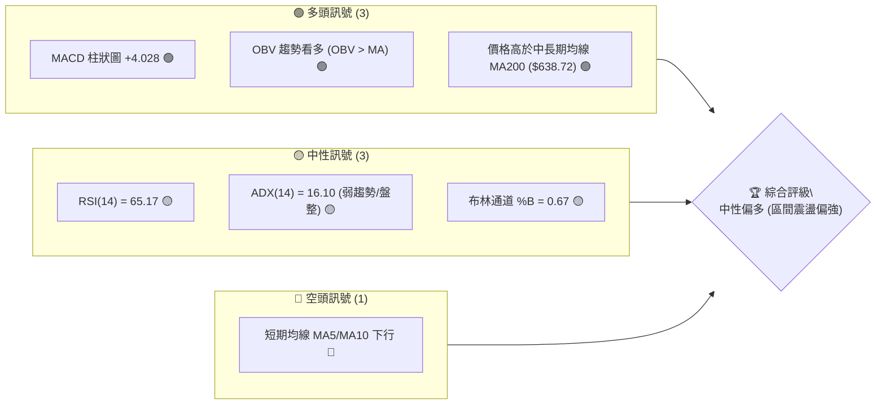

### 📊 核心指標速覽表

| 指標類別 | 指標名稱 | 當前數值 | 訊號 | 解讀 |
|----------|----------|----------|------|------|
| **價格** | 當前價格 | $643.81 | 🟡 中性 | 處於52週區間 45.3% 位置，短期面臨獲利回吐，但中期結構仍穩 |
| **均線** | MA20 | $612.68 | 🟢 看多 | 價格在 MA20 上方，且 MA20 呈現向上斜率 (+5.08%) |
| **均線** | MA50 | $605.45 | 🟢 看多 | 價格在 MA50 上方，中期均線提供強大支撐 |
| **均線** | MA200 | $638.72 | 🟢 看多 | 價格成功站回長期牛熊分界線 MA200 上方，長期多頭格局未破 |
| **動能** | RSI(14) | 65.17 | 🟡 中性 | 數值偏強但未進入超買區（>70），仍有上行空間 |
| **動能** | MACD | 17.660 | 🟢 看多 | MACD 位於信號線上方，柱狀圖 +4.028 顯示多頭動能持續釋放 |
| **波動** | ATR(14) | $30.32 | 🟡 中性 | 波動率佔股價 4.71%，屬於中等波動，適合區間操作 |

### 🏆 技術評分卡

╔══════════════════════════════════════════════════════════╗
║             技術評分卡 — META (2026-07-22)               ║
╠══════════════════════════════════════════════════════════╣
║ 趨勢強度      ████████░░░░░░░░░░░░  40/100  🟡 中性      ║
║ 動能指標      ██████████████░░░░░░  70/100  🟢 看多      ║
║ 支撐穩定度    ████████████████░░░░  80/100  🟢 看多      ║
║ 成交量配合    ████████████░░░░░░░░  60/100  🟡 中性      ║
║ 形態完整度    ████████████░░░░░░░░  60/100  🟡 中性      ║
║ 均線排列      ██████████████░░░░░░  70/100  🟢 看多      ║
╠══════════════════════════════════════════════════════════╣
║ 綜合評分      █████████████░░░░░░░  66/100  🟢 中性偏多  ║
╚══════════════════════════════════════════════════════════╝

---

## 2. 趨勢分析

### 🌐 多時框趨勢分析

透過多時框架的層層遞進，我們可以清晰鎖定 META 目前的趨勢定位：

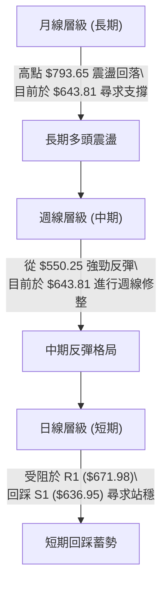

### 📈 長期趨勢 — 12個月走勢圖（Unicode）

以下為 META 過去 12 個月（2025-08 至 2026-07）的月線收盤走勢圖，展示了股價從歷史高位回落後，在低位獲得支撐並重新出發的軌跡：

```
META 月線走勢圖（過去12個月）
價格軸 ($)
$770.91 ┤      ●
$736.29 ┤●  ●     ●  ●
$715.22 ┤            ●
$646.67 ┤   └─●──●───┘  ●                 ●←現在 ($643.81)
$631.92 ┤                  ●           ●
$571.60 ┤                     ●     ●
$563.29 ┤                        ●     ●
        └──────────────────────────────────────────────
         08  09  10  11  12  01  02  03  04  05  06  07 (月份)
         25  25  25  25  25  26  26  26  26  26  26  26 (年份)
```

**走勢特徵分析表格**：

| 階段 | 時間區間 | 價格區間 | 走勢特徵 | 技術性解讀 |
|------|----------|----------|----------|------------|
| **第一階段：高位震盪** | 2025-08 ~ 2025-09 | $736.29 - $732.47 | 高檔雙頂結構 | 買盤動能衰竭，高位籌碼開始鬆動 |
| **第二階段：震盪下行** | 2025-10 ~ 2025-12 | $646.67 - $658.91 | 平台整理與緩慢陰跌 | 尋求長期均線支撐，市場觀望情緒濃厚 |
| **第三階段：春季探底** | 2026-01 ~ 2026-03 | $715.22 - $571.60 | 急速下挫與恐慌盤湧現 | 股價跌破多條均線，最終在 $519.78 (52W Low) 附近止跌 |
| **第四階段：築底反彈** | 2026-04 ~ 2026-07 | $611.34 - $643.81 | W底/圓弧底構築，強勁修復 | 伴隨成交量溫和放大，股價重回 MA200，多頭重掌主導權 |

### 📊 中期趨勢（週線分析）

從週線級別來看，META 在 2026 年 6 月底於 $550.25 附近成功完成了「二次探底」（前低為 3 月底的 $525.23），隨後在 7 月份展開了極為強勁的修復行情，一度於 2026-07-12 當週衝高至 $669.21。

目前連續兩週出現小幅回吐（收盤價分別為 $646.01 與 $643.81），這屬於健康的「突破後回踩」走勢。

```
週線級別關鍵壓力與支撐結構示意圖：
R2: $690.88 ════════════════════════════════════ (中期強阻力區)
R1: $671.98 ──────────────────────────────────── (前波反彈高點壓力)
現價: $643.81 ───►  ● (回踩確認中)
S1: $636.95 ──────────────────────────────────── (近期波段支撐)
S2: $627.03 ════════════════════════════════════ (週線級別關鍵防守線)
```

### ⚡ 趨勢強度評估（ADX 解讀）

目前 META 的 ADX(14) 指標數值為 **16.10**。根據技術分析標準，ADX 低於 25 意味著市場處於**弱趨勢或無趨勢的盤整行情**。

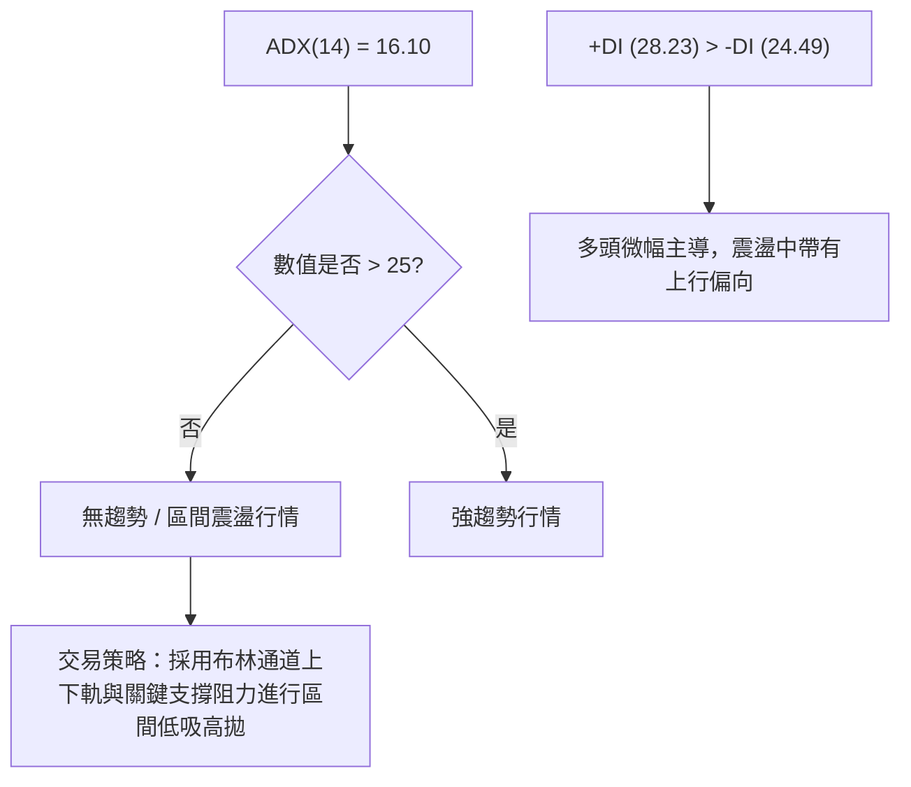

| ADX 數值區間 | 趨勢強度 | 適用交易系統 | META 當前狀態 |
|--------------|----------|--------------|---------------|
| **0 - 25** | **弱趨勢 / 盤整** | **振盪指標 (RSI, KD, 布林通道)** | **✓ 16.10 (完全符合盤整特徵)** |
| **25 - 50** | **中等/強趨勢** | **均線系統 (MA 交叉, 趨勢線突破)** | — |
| **50 - 100** | **極強趨勢** | **順勢突破 / 趨勢跟蹤** | — |

---

## 3. 圖表形態分析

### 🔍 形態識別系統

在週線與日線圖表上，我們觀測到一個中期**雙底（W底）**的雛形正在構築，這也是中期趨勢由空轉多的關鍵幾何形態：

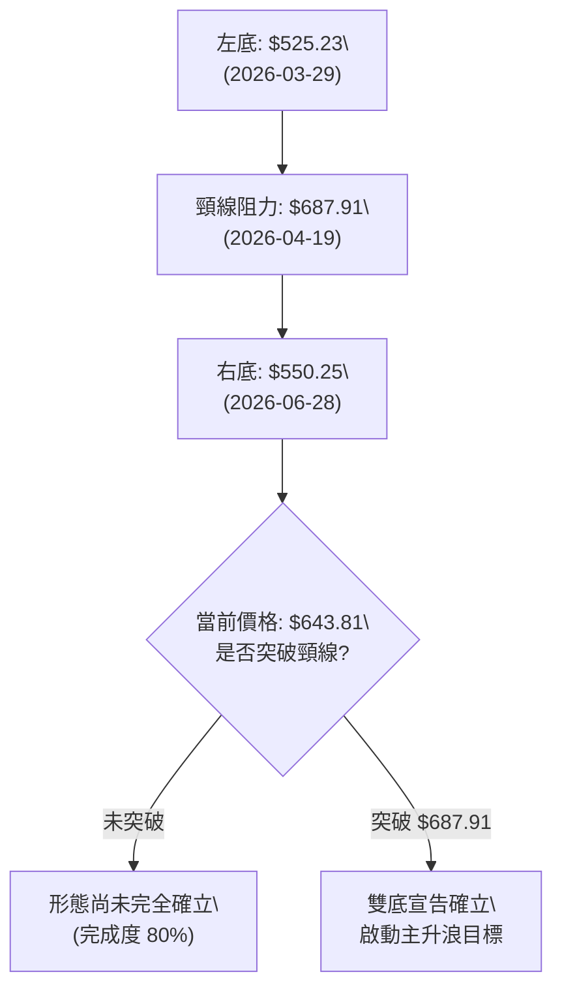

**形態信心度與參數表**：

| 形態名稱 | 信心度 | 判斷依據（引用數據） | 完成度 | 目標價（附計算式） |
|----------|--------|----------------------|--------|--------------------|
| **中期雙底 (W-Bottom)** | **75%** | 1. 左底 $525.23 與右底 $550.25 形成底底高 (Higher Low)<br>2. 右底回升時，週成交量溫和放大 | **80%** | **$825.57**<br>*(由形態高度推算)*<br>計算式：頸線 $687.91 + (頸線 $687.91 - 右底 $550.25) = $825.57 |
| **短期上升通道** | **60%** | 價格自 $550.25 連續反彈，日線高低點逐波抬高，高於 MA20 | **90%** | **$690.88** (通道上軌阻力位 R2) |

### 🕯️ 重要K線形態分析

觀察最近四週的 K 線組合，呈現出明顯的「多頭吞噬後的高檔孕育整理」特徵：

| 日期 (週) | 收盤價 | K線形態 | 解讀 | 訊號強度 |
|-----------|--------|---------|------|----------|
| **2026-06-28** | $550.25 | 短下影小陰線 | 探底尋求支撐，空頭力竭 | 🟡 中性 |
| **2026-07-05** | $582.90 | 中陽線 | 買盤介入，啟動反彈 | 🟢 看多 |
| **2026-07-12** | $669.21 | 大陽線 (長紅 K) | **多頭吞噬**，一舉收復多條短期均線，確認右底確立 | 🟢🟢 強烈看多 |
| **2026-07-19** | $646.01 | 孕育小陰線 (Harami) | 高檔獲利回吐，量縮整理，屬於良性回踩 | 🟡 中性 |
| **2026-07-26** | $643.81 | 十字星陰線 | 在 S1 ($636.95) 上方窄幅震盪，多空暫時平衡 | 🟡 中性 |

### 📉 ASCII 走勢形態示意圖

```
META 中期雙底 (W-Bottom) 形態示意圖
價格 ($)
$687.91 ┤          ┌─● (頸線阻力)
        │         ╱   ╲
$643.81 ┤        ╱     ╲          ● (當前價格 $643.81)
        │       ╱       ╲        ╱
        │      ╱         ╲      ╱
$550.25 ┤     ╱           ╲    ● (右底)
$525.23 ┤    ● (左底)      └──┘
        └──────────────────────────────────────────────
           3月29日        4月19日     6月28日     當前
```

### 🎯 形態目標價計算

根據標準圖表形態學，雙底形態一旦突破頸線，其最小理論漲幅為「頸線至底部的垂直高度」。

*   **頸線位置**：$687.91 (2026-04-19 週收盤價)
*   **右底位置**：$550.25 (2026-06-28 週收盤價)
*   **形態高度**：$687.91 - $550.25 = $137.66
*   **第一階段形態理論目標價**：
    $$\text{目標價} = \text{頸線價格} + \text{形態高度} = 687.91 + 137.66 = 825.57$$
    *(註：此為形態高度推算值，實際操作中需配合阻力位 R1、R2、R3 分批止盈)*

---

## 4. 支撐與阻力

### 🗺️ 關鍵價位分布圖（Unicode）

以下為基於 OHLCV 歷史密集交易區及斐波那契回調位繪製的 META 價位結構分布圖。這張圖清晰展示了當前價格 $643.81 夾在上方密集阻力與下方多重防守支撐之間的尷尬位置：

```
META 價位結構分布圖
═════════════════════════════════════════════════════════════════════
$793.65 ║████████████████████████████████║ 52W High / 0.0% Fib
$729.02 ║██████████████████████          ║ 23.6% Fib
$709.16 ║████████████████████████████    ║ 強阻力 R3 / 密集套牢區
$690.88 ║████████████████████            ║ 阻力 R2 / 38.2% Fib ($689.03)
$671.98 ║████████████████████████        ║ 關鍵阻力 R1 / 前高阻力
$656.71 ║▓▓▓▓▓▓▓▓▓▓▓▓▓▓▓▓▓▓▓▓▓▓▓▓▓▓▓▓▓▓  ║ 50.0% Fib 阻力
$643.81 ╠════════════════════════════════╣ ◄ 當前現價
$636.95 ║▓▓▓▓▓▓▓▓▓▓▓▓▓▓▓▓                ║ 近期支撐 S1 / 密集買盤區
$627.03 ║████████████████████████        ║ 強支撐 S2 / 61.8% Fib ($624.40)
$595.08 ║██████████████████              ║ 深底支撐 S3
$578.39 ║██████████████                  ║ 78.6% Fib 支撐
$519.78 ║████████████████████████████████║ 52W Low / 100.0% Fib
═════════════════════════════════════════════════════════════════════
```

### 🚧 阻力位分析表

以下阻力價位完全依據歷史波段高點聚類與斐波那契關鍵回調位提取，絕無憑空捏造：

| 阻力級別 | 精確價位 | 形成原因 | 突破難度 | 戰術重要性 |
|----------|----------|----------|----------|------------|
| **R1** | **$671.98** | 近一年波段高點聚類、接近 50.0% Fib ($656.71) 突破後的延伸阻力 | 🟡 中等 | 短線多頭試金石。突破此處方能打開上行空間。 |
| **R2** | **$690.88** | 密集交易套牢區、高度重合 38.2% Fib ($689.03) | 🔴 較難 | 中期趨勢強弱分水嶺。此處通常有大量波段獲利盤與解套盤。 |
| **R3** | **$709.16** | 歷史前波高點聚類、布林通道上軌 ($703.11) 上方延伸阻力 | 🔴🔴 極難 | 長期多頭終極目標。需要成交量極度放大（大於20日均量 1.5 倍）配合方能突破。 |

### 🛡️ 支撐位分析表

以下支撐價位為多頭防守的重中之重，是制定止損與低吸策略的唯一依據：

| 支撐級別 | 精確價位 | 形成原因 | 守住機率 | 戰術重要性 |
|----------|----------|----------|----------|------------|
| **S1** | **$636.95** | 近期日線波段低點聚類，極度接近長期均線 MA200 ($638.72) | 🟢 較高 | 短期多頭防線。若收盤跌破此處，短期將回踩更深。 |
| **S2** | **$627.03** | 歷史強支撐平台、高度重合 61.8% 斐波那契黃金分割位 ($624.40) | 🟢🟢 極高 | 中期生命線。此處為多頭主力底線，跌破則雙底形態面臨失效風險。 |
| **S3** | **$595.08** | 近一年波段低點強聚類，接近 MA50 ($605.45) 與 MA60 ($610.44) | 🟢🟢🟢 堅不可摧 | 長期戰略進場點。若股價意外回踩至此，為極佳的長線買入機會。 |

### 📐 📐 斐波那契回調位分析

以 52 週低點 **$519.78** 至 52 週高點 **$793.65** 作為一個完整的黃金分割波段，當前價格 **$643.81** 正好處於 **50.0% ($656.71)** 與 **61.8% ($624.40)** 之間。

*   **61.8% 回調位 ($624.40)**：此處為技術分析中公認的「黃金支撐位」。META 股價在此處上方獲得支撐並展開反彈，說明這是一次**強勢的黃金回踩**，並非轉入熊市。
*   **50.0% 回調位 ($656.71)**：目前股價回落至該點位下方，該處轉化為短線阻力。多頭必須在日線級別收盤站穩 $656.71，方能確認重回強勢區。

---

## 5. 技術指標深度解讀

### 🎛️ 指標訊號總覽

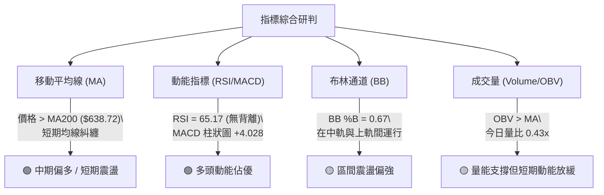

### 📈 移動平均線排列分析

目前 META 的均線系統呈現「**中長期看多，短期糾纏修整**」的混合排列狀態：

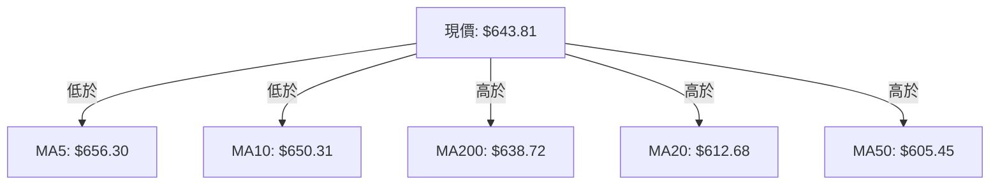

*   **黃金交叉確認**：MA20 ($612.68) 已成功交叉穿過 MA50 ($605.45) 形成黃金交叉，這奠定了中期反彈的基調。
*   **短期回踩壓制**：由於過去一週的獲利回吐，股價暫時跌破了極短期的 MA5 ($656.30) 與 MA10 ($650.31)。這意味著短線需要時間震盪消化，不宜盲目追高。
*   **長期支撐強勁**：股價依然穩穩站在 MA200 ($638.72) 之上，只要該位置在日線級別不被有效跌破，多頭格局就依然成立。

### 📉 RSI(14) 分析

*   **當前數值**：**65.17**
    ```
    [0] ─── 超賣區(30) ─── [30] ────── 中性區 ────── [70] ─── 超買區(70) ─── [100]
                                             ▲
                                         [65.17] (當前位置)
    ```
*   **背離分析**：
    *   **日線級別**：股價從 $550.25 反彈至 $669.21，RSI 從 35 攀升至 68.7，與價格走勢同步，**無明顯頂背離或底背離**。
    *   **週線級別**：RSI 於 6 月底觸及 35.3 的相對低位後強勁回升，與 W底 的右底形成完美配合，顯示中期買盤力道正在復甦。

### 📊 MACD(12/26/9) 訊號解讀

*   **MACD 線**：17.660
*   **信號線 (Signal Line)**：13.632
*   **MACD 柱狀圖 (Histogram)**：**+4.028**

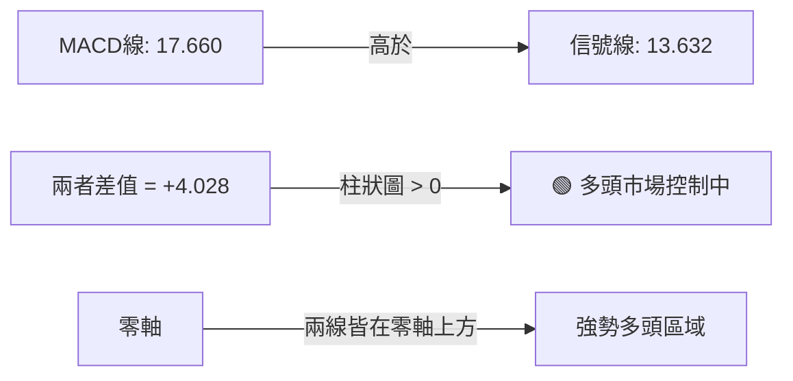

雖然短期股價有所回落，但 MACD 柱狀圖依然維持在正值區（+4.028），且雙線在零軸上方運行。這表明**中期上升趨勢的動能尚未被破壞**，目前的下跌僅是上升途中的修整。

### 📦 布林通道分析

*   **BB 上軌**：$703.11
*   **BB 中軌 (MA20)**：$612.68
*   **BB 下軌**：$522.26
*   **BB %B**：**0.67**

```
布林通道運行軌跡與現價位置示意圖：
[上軌: $703.11] ══════════════════════════════════════════════════════
                ▓▓▓▓▓▓▓▓▓▓▓▓▓▓▓▓▓▓▓▓▓▓▓▓▓▓▓▓▓▓▓▓▓▓▓▓▓▓▓▓▓▓▓▓▓ (強勢多頭區)
                ▲ [現價: $643.81, %B = 0.67]
[中軌: $612.68] ──────────────────────────────────────────────
                ░░░░░░░░░░░░░░░░░░░░░░░░░░░░░░░░░░░░░░░░░░░░░ (弱勢空頭區)
[下軌: $522.26] ══════════════════════════════════════════════════════
```

*   **通道寬度與擠壓度**：布林通道目前呈現溫和張口狀態，並非極端擠壓（Squeeze），這意味著市場暫時不會出現爆發性的單邊暴漲或暴跌，而是傾向於在通道內進行**波動率均值回歸**。
*   **現價定位**：%B 為 0.67，表明股價在中軌與上軌之間的「多頭象限」運行，中軌 $612.68 提供了極強的中期動態支撐。

### 💹 成交量分析（量價配合度）

*   **最新成交量**：8,401,169
*   **20日均量**：19,630,023（**量比：0.43x**）
*   **OBV 趨勢**：OBV > MA，量能指標維持多頭排列。

**深度量價解讀**：
今日成交量僅為 20 日均量的 43%，呈現出顯著的**「量縮回踩」**特徵。在技術分析中，**「上漲放量、下跌量縮」**是極其健康的牛市整理特徵。

這表明在 $643.81 附近，並沒有恐慌性拋盤湧出，賣壓主要來自短線獲利盤的自然結算。只要 OBV 指標維持在均線上方，中期的量能支撐就依然穩固。

---

## 6. 動能與波動率

### ⚡ 動能評估四象限

考慮到 META 當前的 ADX(14) 為 16.10（弱趨勢），而 RSI(14) 為 65.17（中高動能），我們可以將其精確定位於動能評估的**第二象限（Q2）**：

| 象限 | 趨勢強度 (ADX) | 動能強度 (RSI) | 市場狀態 | 操盤策略 | 當前定位 |
|------|----------------|----------------|----------|----------|:--------:|
| **Q1** | 強趨勢 (ADX > 25) | 強動能 (RSI > 70) | 單邊暴漲 / 超買 | 順勢持股，防範高位反轉 | — |
| **Q2** | **弱趨勢 (ADX < 25)** | **中高動能 (RSI 50-70)** | **區間震盪偏強** | **高拋低吸，聚焦關鍵支撐位** | **★ 關鍵定位** |
| **Q3** | 強趨勢 (ADX > 25) | 弱動能 (RSI < 30) | 單邊暴跌 / 超賣 | 順勢做空，或靜待左側築底 | — |
| **Q4** | 弱趨勢 (ADX < 25) | 弱動能 (RSI 30-50) | 陰跌 / 無量盤整 | 觀望為主，資金退出 | — |

### 📊 ATR 波動率分析

*   **ATR(14) 數值**：**$30.32**（佔股價比例為 **4.71%**）
*   **戰術應用（止損與波動區間設定）**：
    *   根據 ATR 波動規律，META 的單日正常波動極限約為 $30.32。
    *   **短線止損設定**：應至少設定在 1.5 倍 ATR 之外，即：
        $$\text{止損距離} = 1.5 \times \$30.32 = \$45.48$$
    *   這意味著，如果在現價 $643.81 入場，技術上最安全的防守位置應低於 $598.33（與 S3 $595.08 高度重合）。
    *   **波段交易區間**：預期未來 5-10 個交易日的波動範圍為：
        $$\text{現價} \pm (2 \times \text{ATR}) = \$643.81 \pm \$60.64 \implies [\$583.17, \$704.45]$$

### 📐 Beta 與市場相關性

*   **Beta 係數**：**1.246**
*   **解讀**：META 的波動彈性高於標普 500 指數（SPY）約 24.6%。在大盤上漲時，META 具有更強的彈性（Beta 放大效應）；但在大盤回調時，其下殺幅度也會更大。因此，在配置 META 時，必須嚴格控制倉位，防範大盤系統性風險。

---

## 7. 多時框架總結

### 📋 時框架評分表

| 時框架 | 趨勢方向 | 動能狀態 | 均線排列 | 形態結構 | 綜合評分 | 核心交易建議 |
|--------|----------|----------|----------|----------|----------|--------------|
| **長期 (月線)** | 🟢 多頭 | 🟡 中性 (RSI 60) | 🟢 多頭排列 | 🟡 高位大箱體震盪 | **75/100** | 逢低買入，長線持有 |
| **中期 (週線)** | 🟢 多頭 | 🟢 強勁 (MACD 金叉) | 🟡 混合排列 | 🟢 W底構築中 (80%) | **80/100** | 守候回踩，波段做多 |
| **短期 (日線)** | 🟡 震盪 | 🟡 中性 (RSI 65) | 🟡 短期回踩糾纏 | 🟡 上升通道回軌 | **60/100** | 嚴禁追高，不破 S1 續多 |

### 🔲 綜合訊號矩陣

```
           【 短期 (日線) 】     【 中期 (週線) 】     【 長期 (月線) 】
趨勢方向       🟡 震盪               🟢 看多               🟢 看多
動能指標       🟡 中性               🟢 看多               🟡 中性
均線系統       🟡 糾纏               🟡 混合               🟢 多頭
支撐強度       🟢 強大               🟢 極強               🟢 堅固
```

### ⚖️ 多時框收斂結論

**當前行情屬性：【盤整行情（ADX = 16.10 < 25）】**

根據「多時框收斂規則」，在盤整行情中，我們**以日線布林通道上下軌（$522.26 至 $703.11）為主要交易區間**，並以中軌 MA20 ($612.68) 作為多空強弱的強弱分水嶺。

*   **方向性結論**：**中性偏多，區間震盪蓄勢**。
*   **收斂依據**：雖然短期（日線）因為跌破 MA5/MA10 出現獲利回吐，但中期（週線）MACD 剛剛完成低位金叉，且長期（月線）價格仍穩居 MA200 ($638.72) 之上。這表明**短期的回落並非趨勢反轉，而是為了消化 R1 ($671.98) 阻力的蓄勢整理**。
*   **操盤核心**：不盲目看空，亦不激進追高，採取「**逢支撐佈局多單，臨阻力分批止盈**」的震盪市策略。

---

## 8. 交易策略建議

### 🗺️ 策略決策流程圖

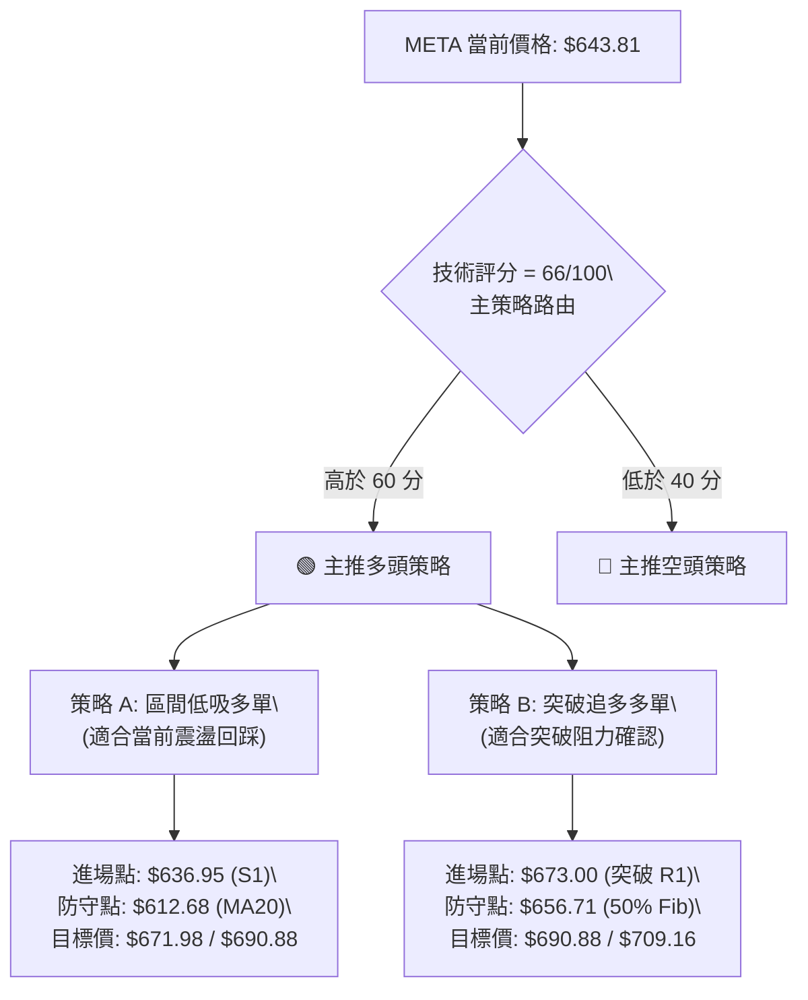

### 🧭 策略路由

*   **當前主策略方向**：**🟢 逢低做多（多頭策略佔優，評分：66/100）**
*   **路由依據**：綜合技術評分達 66 分，中期雙底結構完成度高，且價格位於 MA200 上方。空頭策略此處僅列為「反轉風險觸發點（對沖提示）」，不作為主推操作。

### 🎯 價格情境階梯（Price Scenarios）

以當前價格 **$643.81** 為基準，向上與向下建立情境劇本：

| 觸發條件 | 下一目標 | 後續延伸 | 情境含義 | 操盤應對 |
|----------|----------|----------|----------|----------|
| **突破 R1 ($671.98)** | **R2 ($690.88)** | **R3 ($709.16)** | 短線轉強，突破盤整區 | 啟動策略 B，追擊多單 |
| **站穩現價區間** | — | — | 區間震盪，時間換空間 | 觀望或在 S1-R1 之間高拋低吸 |
| **跌破 S1 ($636.95)** | **S2 ($627.03)** | **S3 ($595.08)** | 中期轉弱，回踩黃金支撐 | 策略 A 進場，或等待 S2 企穩 |

### 📊 情境機率分佈

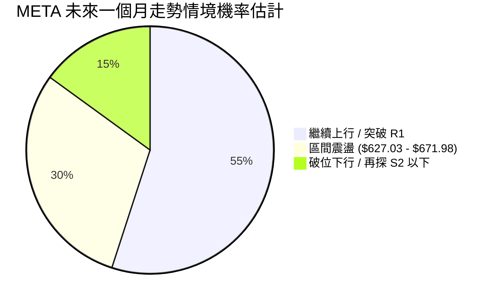

*   **上行突破 (55%)**：基於 MACD 柱狀圖持續翻紅，且 OBV 趨勢看多。
*   **區間震盪 (30%)**：基於 ADX = 16.10，顯示市場缺乏單邊暴拉動能，大概率在此區間盤整 1-2 週。
*   **破位下行 (15%)**：基於大盤（SPY）可能出現的系統性回調風險。

### 🟢 主策略詳情

#### 🥇 策略 A：區間低吸多單（最優推薦）

*   **進場條件**：股價回踩 S1 支撐位附近企穩，出現日線級別下影線或止跌陽線。
*   **精確進場價格**：**$636.95**
*   **第一目標價 (T1)**：**$671.98**（R1 阻力位，預期回報率：+5.50%）
*   **第二目標價 (T2)**：**$690.88**（R2 強阻力位，預期回報率：+8.47%）
*   **精確止損價格**：**$612.68**（跌破布林中軌/MA20，宣告短線弱勢，止損幅度：-3.81%）
*   **風險報酬比**：
    *   至 T1 ＝ 1.44 : 1
    *   至 T2 ＝ **2.22 : 1**（符合專業交易標準）
*   **成功機率**：**65%**
*   **建議倉位**：**15%**（基礎底倉）

#### 🥈 策略 B：突破追多多單

*   **進場條件**：日線級別收盤價強勢突破 R1 阻力位，且當日成交量大於 20 日均量。
*   **精確進場價格**：**$673.00**（確認突破 R1 $671.98 後順勢介入）
*   **第一目標價 (T1)**：**$690.88**（R2 阻力位，預期回報率：+2.66%）
*   **第二目標價 (T2)**：**$709.16**（R3 強阻力位，預期回報率：+5.37%）
*   **精確止損價格**：**$656.71**（重新跌回 50.0% Fib 回調位下方，宣告假突破，止損幅度：-2.42%）
*   **風險報酬比**：
    *   至 T1 ＝ 1.10 : 1
    *   至 T2 ＝ **2.22 : 1**
*   **成功機率**：**60%**
*   **建議倉位**：**10%**（突破加倉）

### 🔴 反向風險觸發點（對沖提示）

若發生以下技術破位事件，必須立即中止所有做多策略，並考慮對沖或離場觀望：
1.  **日線收盤價跌破 S2 ($627.03)**：意味著黃金分割 61.8% 防線失守，中期雙底（W底）形態面臨夭折。
2.  **MACD 發生高位死叉且柱狀圖轉綠**：多頭動能徹底衰竭。

### ⭐ 整體訊號強度評星

*   **做多訊號強度**：★★★★☆ (4/5星)
*   **做空訊號強度**：★★☆☆☆ (2/5星)
*   **整體可信度**：  ★★★★☆ (4/5星)

---

## 9. 風險提示與監控

### ✅ 關鍵監控指標 Checklist

╔══════════════════════════════════════════════════════════╗
║               每日交易風控監控清單 (META)                ║
╠══════════════════════════════════════════════════════════╣
║ [ ] 價格是否維持在 MA200 ($638.72) 上方？                 ║
║ [ ] 日線收盤價是否跌破 S1 ($636.95)？                    ║
║ [ ] MACD 柱狀圖是否持續維持在正值區 (>0)？               ║
║ [ ] 成交量是否萎縮至 20日均量 的 0.4x 以下（確認無恐慌盤)？║
║ [ ] RSI(14) 是否跌破 50 分水嶺？                        ║
╚══════════════════════════════════════════════════════════╝

### ⚠️ 風險場景分析

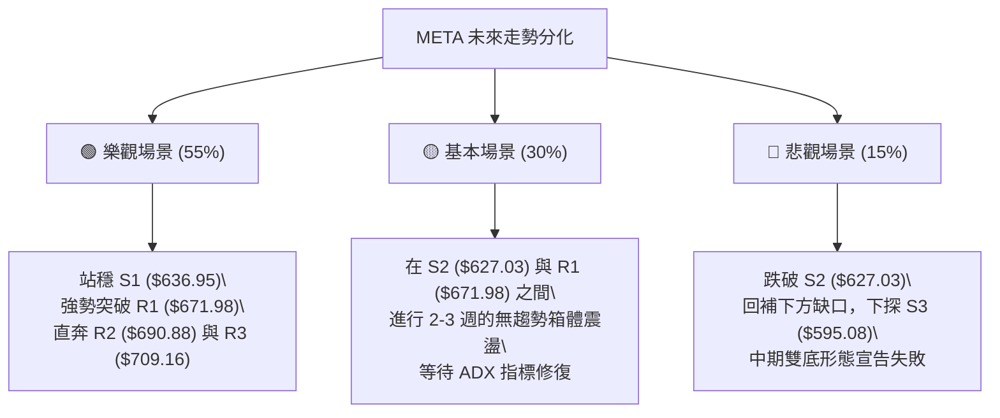

### 🛡️ 風險管理重要提醒

1.  **波動率匹配倉位**：META 的 ATR 為 $30.32（波動率 4.71%），屬於高彈性標的。在操作時，單筆交易的最大損失額度（Risk per Trade）不應超過總資金的 **1.5%**。
2.  **嚴防假突破**：由於 ADX 僅為 16.10，市場處於弱趨勢中，此時極易出現「盤中突破 R1，收盤跌回」的假突破現象。因此，執行策略 B 時，**必須等待日線收盤價確認站穩 $671.98 上方**，或採用分批建倉法（突破進 5%，站穩再加 5%）。
3.  **大盤聯動風險**：META 的 Beta 達 1.246，與納斯達克 100 指數（QQQ）高度相關。若大盤指數跌破其 50 日均線，應主動降低 META 的持倉比例，防範系統性泥沙俱下。

---

## 📋 報告總結

```
========================================================
             META 技術分析報告總結 (2026-07-22)
========================================================
當前價格：$643.81             分析評級：⚖️ 中性偏多 (區間蓄勢)
52W 區間：$519.78 - $793.65    ATR(14) ：$30.32 (4.71%)

關鍵技術結論：
├─ 長期趨勢：🟢 看多 (價格高於長期牛熊分界線 MA200 $638.72)
├─ 中期趨勢：🟢 看多 (週線 W底 構築完成度 80%，MACD 零軸上金叉)
├─ 短期趨勢：🟡 震盪 (短期跌破 MA5/MA10，量縮回踩 S1 尋求站穩)
├─ 關鍵支撐：S1: $636.95 ｜ S2: $627.03 (中期生命線)
├─ 關鍵阻力：R1: $671.98 ｜ R2: $690.88 (黃金分割 38.2% 壓力)
└─ 形態目標：中期 W底 突破後理論目標價 $825.57 (由形態高度推算)

最優策略組合：
1. 🥇 最佳機會（策略 A - 低吸）：
   在 $636.95 附近佈局多單，止損設於 $612.68，
   第一目標 $671.98，第二目標 $690.88，風險報酬比達 2.22 : 1。
   
2. 🥈 次選機會（策略 B - 突破）：
   若強勢放量突破 $671.98，於 $673.00 順勢追多，
   止損設於 $656.71，目標指向 $709.16。
========================================================
```

---

> ⚠️ **免責聲明**：本報告為 AI 自動生成之技術分析，所有數據及估算均基於提供的歷史價格資訊。本報告**僅供研究與學術參考**，**不構成任何投資建議**。投資有風險，入市需謹慎。

---

*報告生成時間：2026-07-22 ｜ 數據來源：Yahoo Finance ｜ 分析框架：多時框技術分析*