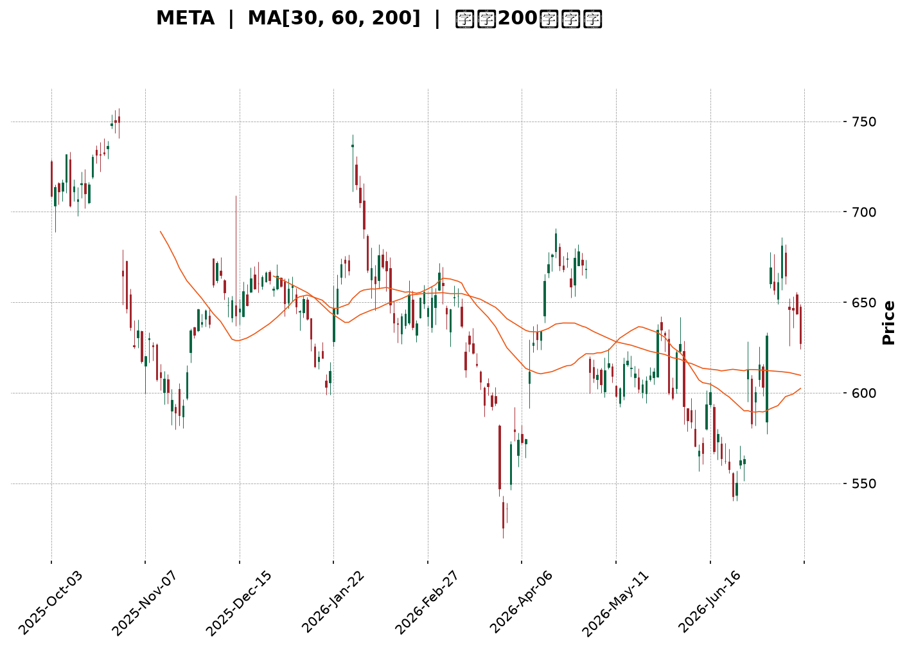
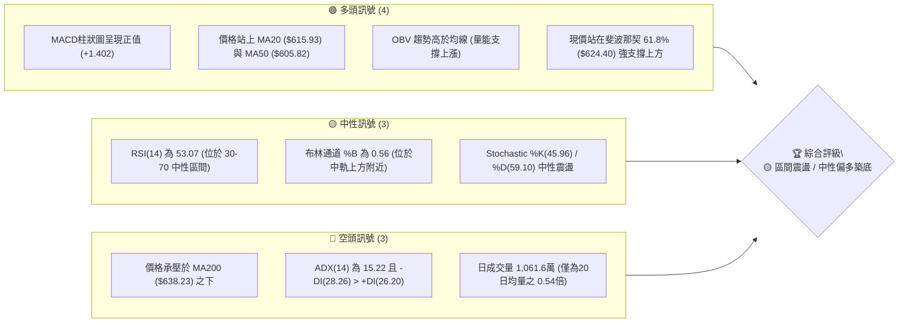
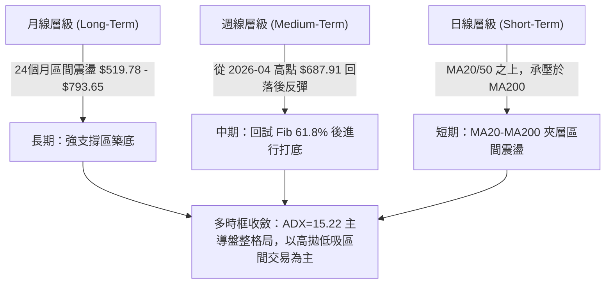
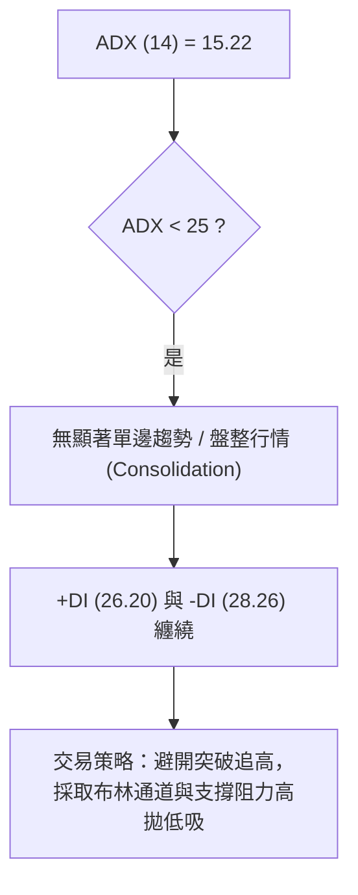
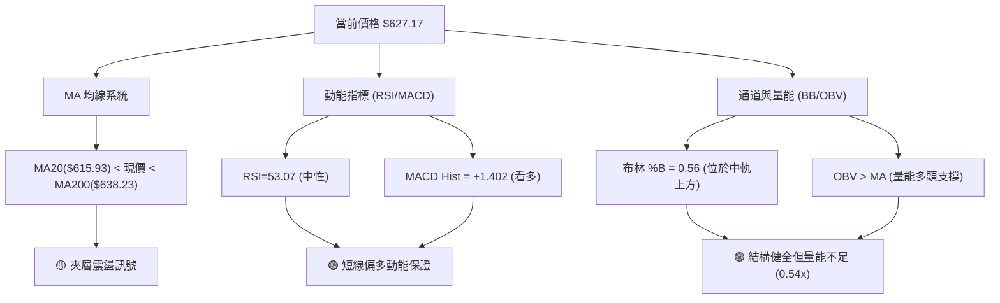
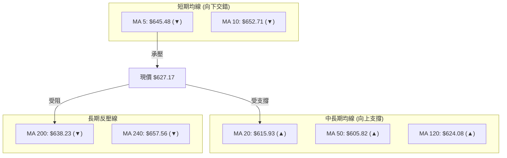
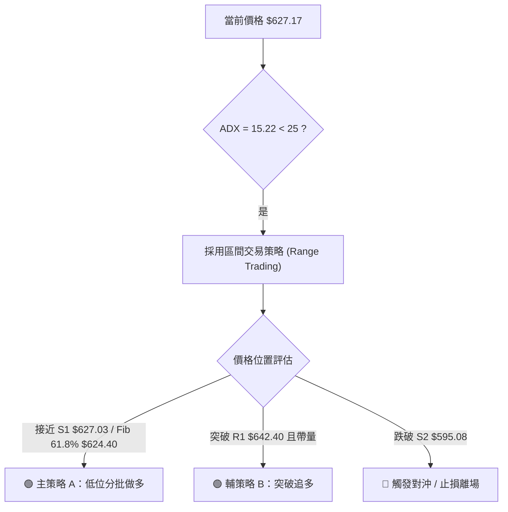
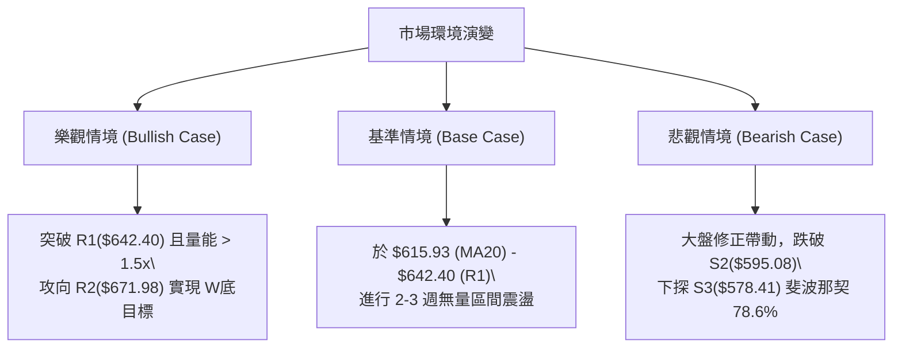

<details>
<summary>📊 靜態圖表 (點擊展開)</summary>

</details>

<html>
<head><meta charset="utf-8" /></head>
<body>
    <div style="height:500px; width:100%;">                        <script>window.PlotlyConfig = {MathJaxConfig: 'local'};</script>
        <script charset="utf-8" src="https://cdn.plot.ly/plotly-3.7.0.min.js" integrity="sha256-jvTGqxNp8AGWEcvNLVuKr+8j5dGe9Yw51LQkmDH+IYA=" crossorigin="anonymous"></script>                <div id="candlestick-chart" class="plotly-graph-div" style="height:100%; width:100%;"></div>            <script>                window.PLOTLYENV=window.PLOTLYENV || {};                                if (document.getElementById("candlestick-chart")) {                    Plotly.newPlot(                        "candlestick-chart",                        [{"close":{"dtype":"f8","bdata":"AAAA4LslhkAAAACgbU6GQAAAAIDXOYZAAAAAwNJfhkAAAACg29yGQAAAAGDD+4VAAAAAQL9OhkAAAACAfhaGQAAAAECCXYZAAAAAYMgxhkAAAABge1iGQAAAAGAq0oZAAAAAYPHahkAAAABAD9yGQAAAAIDE4IZAAAAAgI4Dh0AAAACA+maHQAAAAADta4dAAAAA4MJth0AAAADA7cWEQAAAAEBYNYRAAAAAQHLgg0AAAACgio2DQAAAAABn0oNAAAAA4KxKg0AAAAAgx2CDQAAAACD4sINAAAAAgKCLg0AAAAAAcfuCQAAAAKB2AoNAAAAAQAj\u002fgkAAAAAglsOCQAAAAOAdoYJAAAAAIE9mgkAAAABg+VyCQAAAAACrhYJAAAAAgK0bg0AAAACAjtSDQAAAAEC7v4NAAAAAQCcyhEAAAAAgqfmDQAAAAOBeK4RAAAAA4Ibvg0AAAAAAg56EQAAAAIBi\u002fYRAAAAA4I\u002fIhEAAAADgC3qEQAAAAECMQ4RAAAAAgCJYhEAAAACAeBSEQAAAAEDbMoRAAAAA4NZ\u002fhEAAAACAv0KEQAAAAIAiuoRAAAAAoMaMhEAAAADAk6KEQAAAAEAMvoRAAAAAAOTShEAAAAAg37CEQAAAACAjjIRAAAAAIB3GhEAAAAAgUZeEQAAAAMADSoRAAAAAgO+MhEAAAACgjJuEQAAAAIBHPIRAAAAA4EYnhEAAAABgLV+EQAAAAGCdBoRAAAAAALuvg0AAAABgZDODQAAAAICOXYNAAAAAICpZg0AAAADAWtiCQAAAAODyHoNAAAAAgNAzhEAAAABAsoyEQAAAAEBN+YRAAAAAYCz+hEAAAABAUNyEQAAAAID2B4dAAAAAIMtZhkAAAACANwmGQAAAACC\u002fk4VAAAAAAGTehEAAAAAgIuiEQAAAAABCooRAAAAA4BwghUAAAACANOyEQAAAAKD+24RAAAAAQDlFhEAAAADgC\u002fWDQAAAAKA28YNAAAAA4JgQhEAAAAAgDh2EQAAAAMDwc4RAAAAAQOzgg0AAAAAgS\u002fGDQAAAAEA1ZIRAAAAAoLh+hEAAAADgNDiEQAAAAIArY4RAAAAAAE9vhEAAAAAAVNSEQAAAAIAmm4RAAAAAoLEdhEAAAADg5TGEQAAAAEA+Z4RAAAAAQI1thEAAAACAWeiDQAAAAADwJINAAAAAwPOWg0AAAADgqnCDQAAAACDhOINAAAAAIBvxgkAAAADg4YiCQAAAAGAB3IJAAAAAwPeCgkAAAACgtpKCQAAAAIBDGIFAAAAAgN1pgEAAAAAgEb+AQAAAAEDN3IFAAAAAoIwVgkAAAADAbO+BQAAAAGDq44FAAAAA4CP0gUAAAADA0h6DQAAAACB3noNAAAAAwDaqg0AAAABAis+DQAAAACADr4RAAAAAYKr3hEAAAAAg8iGFQAAAAKBMf4VAAAAAYE\u002fyhEAAAAAAxOGEQAAAAADDEIVAAAAAQFGUhEAAAABgPROFQAAAAODuL4VAAAAAQL\u002f1hEAAAADgAOSEQAAAAEC\u002fGoNAAAAAoH0Bg0AAAAAgwg6DQAAAAOAy44JAAAAAAIAig0AAAAAg6UGDQAAAACCGCINAAAAAoHGygkAAAACAiNOCQAAAAOB4QINAAAAA4NtOg0AAAABASi2DQAAAAAAnFYNAAAAAgGrQgkAAAACA\u002f+OCQAAAAGCK9oJAAAAAQI8Ng0AAAAAgLx6DQAAAAOBf1YNAAAAAIJ3Vg0AAAAAAZb+DQAAAAMBPv4JAAAAA4JyogkAAAACgOXODQAAAAEDpl4NAAAAAgJuDgkAAAACgyEaCQAAAAMBjQIJAAAAAQJzTgUAAAACgOr+BQAAAAMCjs4FAAAAAANeLgkAAAAAgrsGCQAAAAOCjvIFAAAAAgMIJgkAAAADAzJ6BQAAAAKCZkYFAAAAAIFxtgUAAAADA9faAQAAAAAAAMoFAAAAAwMyUgUAAAADgUZqBQAAAAKBHJ4NAAAAAQDM3gkAAAADgUcKCQAAAAOCjPINAAAAAwPXYgkAAAAAA17uDQAAAACCu6YRAAAAAANeFhEAAAADgUaiEQAAAAOB6SoVAAAAA4FHEhEAAAACAFDCEQAAAAMDMLoRAAAAA4HoehEAAAAAgXJmDQA=="},"high":{"dtype":"f8","bdata":"nPF9aNTIhkAac7vEKViGQIdNjtQWZYZAv79WAkRuhkAAAACg29yGQK9+vMfm6oZAVRhIOZRwhkDh6+73jE2GQIenoWMtkIZAXYw0NN2chkCY072EaGWGQN1c5b\u002fu3oZAuyj+lqwEh0AYU0ItbhWHQGfjEXLfI4dAm3m9O0wah0CN6PfuUI6HQIwOIiZ2o4dAZuaalYaph0Aj+NBkjDmFQMFlEkAdCYVASX90JPWMhEAqVSkkmgCEQNZI4wKDBIRAdi96Hc3Sg0A3bMsEIWSDQCKaamnSyoNApMg2U2qfg0B\u002fMhna3ZqDQFe1HOZhQINAsCqhVLQgg0BTV2ZS0xCDQGmwyKjA0IJAx68BAkmOgkAZN8FIK+mCQHB+ujCMpIJANC\u002flW804g0A4Sib3LduDQPcPGgSi5YNAJBQHePMyhEDtUPobKx2EQATOuciDMYRAiOD\u002fu1U5hEBDzy\u002fYxBKFQFXyu8CEB4VAyq\u002fg+aIXhUAb0GrMDLaEQAAb4Dp\u002fZoRAWKuvOKRshECcQgbIPimGQHtE2LqyXoRAVE1L2OGqhECf44+5a6CEQD2E0Hft6oRAEa50BnHuhECudNWSCwOFQDgLa0KDxoRA9cjZ8+vXhEBFlzI8Et6EQO3vrk+YmIRAwRSyIi\u002f4hEDWRRTYhr6EQFrmuOSnuYRAE24iiNq6hEA9E3oBrsKEQJQhzHrPj4RAhCQe9ZQvhEBIyZM7RW6EQPBdFZ1xZoRAL3f02gIJhEAkJBjZpZqDQC8d6\u002fV3eINAbFuozK2fg0Cw5dOzfRKDQH7D5GJaSYNAtM2ZbyabhECNgMkPbcqEQGx53NmeEIVAGjfFNeschUCLYVo8ySOFQLK0G+BmNYdAdwQgG+7WhkDp5wbzH4CGQNiqVjzJXYZAKwELB9R8hUCxQ2vUSkKFQKOvx\u002flY9oRA05ibCr9QhUBFOGwJgTuFQKOYBOt7MIVASeyR3l4WhUCNG2v6KFKEQKHL\u002f22lC4RAI4U\u002f4s8ehED1kBr2TDCEQLe3UdVZsYRASVmvTTuEhEBIRFRmv\u002f+DQCwUnq65ZYRACPwwk5WehEB\u002fBbLHREKEQAek0XseloRA2IMqj+6OhEALzt2ek\u002fyEQAaULs8L7IRA5GRMEIJChEDFrO3PxTSEQIsnJYj+mIRA8+ssN5KPhEC2orMCsWKEQI2Dkp5loINAZaYTSEzRg0AL2g1Jr9+DQMZHa4iWcINAJDGdjXUjg0A6adjXNNuCQKi6k5CcAINADdx1TYzDgkBpeptZ49iCQAMyl2CuM4JAmOJt18X4gECFRSQ9Z9iAQDdjpSpF6YFAnDrgvQKAgkDZ1Lv2tg+CQN95HbkAMoJAApOeKJT1gUAU5q4B76qDQC6nfxlH54NATX9+1ujvg0BBadrbS9ODQK\u002fZsfkkzYRApWK4YPkuhUBBHUznnieFQHGyIZ4Jl4VAtzVfWvpVhUCQYOxKlxyFQBDCL88DLoVA2Fk7IoXnhEDLsu1NUUCFQOjfbcTxToVACPlah2oshUDygZRlAQ2FQAxQA2wzYoNAE8RZqnRSg0Ac\u002fz2xcyuDQOx8XbE\u002fLoNAT9m19wFbg0Cg+orBNYODQOjym1WXQYNAObb\u002fhszigkABh+YTh9mCQHqjeqybWoNAkT8PMzh5g0Aej2uo\u002f2SDQIfQjfEoOINAKz+SaOQqg0CYlsQMf\u002fuCQMYUN6pICINAUEgr\u002f+wxg0B4aPM1NS+DQBtyKTtF74NAQ33+oDwThEDKceW5TM+DQJudBlhK2YNAlN05iocCg0Ahfv2nk3yDQC7sVgBxDoRAICX2Moqkg0CmEgVXnXuCQC3uUuWcqIJAhffeDS52gkAcHUQIH92BQOBc3uJK\u002fIFAAAAAACnKgkAAAADgeu6CQAAAAOB6joJAAAAAgMIhgkAAAADgev6BQAAAAKCZ4YFAAAAA4FHIgUAAAABguGKBQAAAAMDMZoFAAAAAQDPXgUAAAADgUayBQAAAAIA9ooNAAAAAAAAQg0AAAADgo9yCQAAAAMD1ioNAAAAAAABAg0AAAAAAKcqDQAAAAEDhLoVAAAAAwPUkhUAAAAAAANSEQAAAAOCjcIVAAAAAQDNPhUAAAACgmWGEQAAAAGBmaoRAAAAAQAp\u002fhEAAAADg+0eEQA=="},"hovertemplate":"\u003cb\u003e%{x|%Y-%m-%d}\u003c\u002fb\u003e\u003cbr\u003e\u958b: $%{open:.2f}\u003cbr\u003e\u9ad8: $%{high:.2f}\u003cbr\u003e\u4f4e: $%{low:.2f}\u003cbr\u003e\u6536: $%{close:.2f}\u003cextra\u003e\u003c\u002fextra\u003e","low":{"dtype":"f8","bdata":"+cHTpLMihkCWIHUcwIWFQH9RL5Fa\u002f4VAi3AyicoPhkBoyfcvvDSGQOuiZbJ19YVAXCY6Mm8OhkBcCl6jIMyFQIwPxhZbHYZASczHwm7whUAZ6GpgTgKGQK8Qy5J+coZAtbdtY+C2hkC+\u002fyn1NpGGQIOLEgiW2YZA6wkUzgbKhkCc\u002f7uNjlCHQLDfYFOwPIdAeNGS6askh0CWXMn43UOEQGxN6aQpH4RAk17d4DzUg0ARJKi1FoODQPfNLT5Rh4NA7U90vixDg0Cq1AKXH72CQFfT3GQNRINAGTlxOkROg0Bv7HQWjPGCQDzpqXp8y4JAcOlSgj+NgkAUISL+146CQB+YsSUgMoJAhOzl7+8dgkBU\u002fxqwsS6CQPqMqxLOIoJAaaB6S6OggkBzhMOTkUWDQN8iu8Tur4NAtD+1xM\u002fOg0CJgJVl2OCDQEzDUHlR44NA+cb7Yyvfg0DSGO28s5KEQAIQGblfpYRAyEPbEMK6hEAioGdbKV2EQIsQQwHZDYRAaa4gBhr5g0B+o0GboOeDQKdmiICA7INAiyHQHnAQhED6KQ04WkCEQL0HVCNUeoRACtnUZhCIhEDEGKSv2HuEQGnPlYWfiIRA9RyKwiqohEBXBAbPI6GEQHN3M27MaYRAyZIOc1mFhECv2ts+IJKEQLnC6FLVEoRA1gBI4sU0hEByVLfs6VWEQIxdRWZLHYRAgAQKNbTUg0CGQZB7pA2EQAdg1pK0AIRAlAaK3eh3g0DCnYBNzS2DQMh3eRUXKYNAzmewns5Xg0DfVSoGdLeCQOHvBpgXuIJAL2Osf3mLg0Dl1OSOaxqEQL2g5z7moIRAesjbzc+7hEC1BVmXT8eEQOk5NvA\u002fOoZAr7WiHI5ChkC+af5pI\u002fKFQJ4BsmqAaYVAb3U\u002fNCzShEDGqGDvsGKEQGIZ4m3KKoRAMGPAHtuMhEDi1jpEx+SEQFWZ4INwf4RAT8DoZAwhhEAl6Kc2hcuDQFG0x2BxnYNAeFqYlECYg0CpELCEsNyDQG0mkS0k7YNA8JPjzvDWg0Aos\u002fFh4Z6DQIvS1v74B4RAME\u002f1zcYyhEDAtLCv3ueDQOV61yH2yoNA5cnkuJ7tg0DIWoXP\u002fYOEQJr5Lmo3SYRAwy2oiNHXg0DBCd7IT42DQEcX\u002fVzBPoRAbizp86Q5hEBIOdvKIN6DQOhiz2u3A4NA9KnPHy90g0DJAwSy\u002fmiDQNCMbsdTMINA03Rwa57NgkA+DLhnplWCQAxik5Oks4JA6Q4URJ9zgkB+qFfzzYaCQEr6MVLG9oBAqTXC2jk+gEDcpOqdZ4CAQMRm3hccEoFAids9Qk\u002fqgUAaTXY9dHmBQOuxLE\u002fD24FAas9yg+WhgUAJmNOLQXqCQGwUnphic4NA6GfB3AN+g0Bm65k1k36DQCxlhDg59oNAKyvo9Na8hEDsPZerDdmEQL7wB\u002fMJFIVATY2oRA3bhEB3yRFdstWEQNtuvewJ6YRAQ0do8Y9jhEA22EVv4GmEQFmg1EDA8YRA2UcV9BvIhED4pcwRkLmEQNm8xzWOu4JAcuqa4WPsgkC7YX0GidGCQOXQObluvoJAXNVJh16sgkCeDpFTxieDQI0GMoX964JAINqjujWsgkCtuNv4aICCQG9VAB\u002fcoIJAJjEhwXEzg0Cz32N09wWDQJfS40IM2YJAIbgMiPO\u002fgkCgLog\u002fDaqCQHQ3rdYSkoJABfDdphrzgkBVwc956uWCQH2EzCt9A4NAeCked9Glg0BBSQefLnaDQMopVIjMt4JA1u44DQWhgkCEXsiwtr2CQApiXj\u002fUboNARMI0QvYygkDbWGYTeBWCQMLECKrGI4JA73t5uJLQgUDgWE4o9GOBQGZ0xIcLg4FAAAAAYGYagkAAAAAAAICCQAAAACCFsYFAAAAAwMyYgUAAAADgen6BQAAAAAApiIFAAAAAYGZcgUAAAACgcOGAQAAAAEAz44BAAAAAAABwgUAAAACgcDuBQAAAAMDMmIJAAAAAIFwjgkAAAACAFC6CQAAAAKBH3YJAAAAAgBSwgkAAAABgjwiCQAAAAIAUkIRAAAAAoJlxhEAAAABgZkiEQAAAAKBHhYRAAAAAoEehhEAAAAAAAJCDQAAAAIAU4INAAAAAoJkZhEAAAAAAAICDQA=="},"name":"\u50f9\u683c","open":{"dtype":"f8","bdata":"IWbC7+W9hkBxEV+\u002f4vqFQFAnb3ndXoZAnoWTUss8hkBOQVKJVWOGQEEq7wMxyIZA5B2dakg5hkDRQjVfjQ+GQNNLaVqZWYZAL2b5QoJdhkCbxr9m9wmGQIhMJbWNeoZA6Ijgw+LwhkBzc7hEad+GQPXv82da5oZAh19Tdwf3hkBabH3qR16HQHVfjs1rdYdA7mIsY1aGh0B2sf5CUNuEQNZN5gQVBoVAIRxV9WJyhECNis5MSZODQMc5oJZbtYNAJsWEqZrRg0BvUpk7IDeDQOurN4+fq4NAkI7RvPeSg0DEILorAZSDQO3xGFvWG4NAWFikv9TBgkA8n6cmrvuCQENZftqFcIJAuLXKL3CBgkDww+\u002fjec+CQJG5HYzJV4JAP6gawVWpgkBaeI\u002frDHODQOSiQ3NJ4INAvUDaj3DTg0DiLDbDIO+DQNci08ljBYRAoy9nMugVhEDigyig+BGFQGjRd2s4soRALsdsYdTchECZbQGSYrCEQEiYzZQcQoRAnu2jS\u002fgMhEBCQbpI6kCEQPwEt\u002flmJIRA15\u002fDZtUShEDQTxF4inOEQDmuLW\u002fhfoRAMAw52t3JhEBGRfJzxqOEQLCyK1X\u002floRAZp9ybs2qhED7MA279taEQHSBzPq0hoRAQXaQGSOMhEC8R3rBh7yEQBTceDJmrIRAfADtfs5OhEAVGj0UKpOEQEaNpsfHc4RA8LUI6NYlhEBNAqVpUyKEQJP1YN3xWoRAL3f02gIJhEBjgYtVE4uDQNjB25UHS4NAo6kea4x4g0Cq4OSJYfaCQLNgqe5G7YJAOUSwqdWhg0DH1SfE+RyEQErd352Qv4RA5baVVxwLhUCPCSo1ZAqFQDHqhnXvAIdApQTWAqOxhkCp1wDCnkqGQK6RwRriEIZA\u002fn\u002fxKQt0hUAlJ1YNMLOEQJDY1a1wwoRAPJwhM\u002f6vhEDXQ+moJSOFQPAk2SJmBoVAodfYWzfmhEDqyQcwnB+EQP7e7\u002fvj8oNAdOUNGl\u002fFg0BJGomlduuDQOV7GXxo9INAS3KiXgZbhEBJP3lOn7+DQFOuulIWC4RA8YetDiJLhEBg98EfbxKEQA8Ukg404INAL7rcwhU5hEAeMcHAToaEQPdhZMoCpoRA30\u002fwifg1hEBaWU6cMs2DQNmdG5wrY4RAH2ZU3cBshEDGTtlUwjyEQL4W9H87doNAdVoef1G7g0C3TIekRJuDQPOglp8nPoNAAAs+aqocg0Afy5UIxdeCQAwlKRjV6YJA74LZp1y0gkDS4fUSfLGCQICzMdiaL4JAFUmleszcgEAAAAAgEb+AQCjfewHEK4FAdI4WK74cgkAeGaJ3IKyBQNDH7aQ9CYJArJinX5nfgUBQy7bMguuCQC2ZXpEdk4NASo3jQQ\u002fPg0B6rNJJVqeDQFvhZKv+FIRAOiRaLw\u002fThED07DmL6RqFQDDCdN7FL4VA16n\u002fLtVFhUBBAGSHB\u002fOEQL6Bwm7iDYVA5MAZ\u002f664hEDKFmMlq52EQO+xK5MH84RAdZUi4OwMhUAoJPUlU+KEQNQtv\u002fL4VYNAZjtnfPcwg0CPdAhPBPuCQMP0QMrvJYNAcPYjj\u002fLDgkBQs7C2NDGDQHUp1O8KNYNAdocJ7BTggkDsvBtjJ5KCQLlnfkE0soJAMAer2287g0DSo4A0XyuDQBuqixteBINA5BK9aNkCg0BCzHBHocGCQC699B6Ou4JARdpkg4n6gkC1IesKnAKDQO7hm6mvBoNAoRwmREP3g0DgvmCfTseDQKu+Xb2HroNA9AlnfHPVgkArW3yDiNOCQE0sYWW9eINAc7Qs3Q93g0CmEgVXnXuCQBudEjifc4JAtxHVwokhgkC3METOcqqBQNyUmQ1b44FAAAAAQDMfgkAAAABAM42CQAAAAAAAgIJAAAAAYI\u002fmgUAAAAAAKeCBQAAAAAAAkoFAAAAAwB6PgUAAAABgZlyBQAAAAGC4+oBAAAAAAACAgUAAAAAghYeBQAAAAKBH\u002f4JAAAAAQDP\u002fgkAAAABguJaCQAAAAGC4\u002fIJAAAAAwB4zg0AAAACA6z+CQAAAAGC4ooRAAAAAQAqrhEAAAAAAAGCEQAAAAMDMvIRAAAAAgD0qhUAAAACgmT2EQAAAAKCZNYRAAAAAoHBxhEAAAACgmT2EQA=="},"x":["2025-10-03T00:00:00-04:00","2025-10-06T00:00:00-04:00","2025-10-07T00:00:00-04:00","2025-10-08T00:00:00-04:00","2025-10-09T00:00:00-04:00","2025-10-10T00:00:00-04:00","2025-10-13T00:00:00-04:00","2025-10-14T00:00:00-04:00","2025-10-15T00:00:00-04:00","2025-10-16T00:00:00-04:00","2025-10-17T00:00:00-04:00","2025-10-20T00:00:00-04:00","2025-10-21T00:00:00-04:00","2025-10-22T00:00:00-04:00","2025-10-23T00:00:00-04:00","2025-10-24T00:00:00-04:00","2025-10-27T00:00:00-04:00","2025-10-28T00:00:00-04:00","2025-10-29T00:00:00-04:00","2025-10-30T00:00:00-04:00","2025-10-31T00:00:00-04:00","2025-11-03T00:00:00-05:00","2025-11-04T00:00:00-05:00","2025-11-05T00:00:00-05:00","2025-11-06T00:00:00-05:00","2025-11-07T00:00:00-05:00","2025-11-10T00:00:00-05:00","2025-11-11T00:00:00-05:00","2025-11-12T00:00:00-05:00","2025-11-13T00:00:00-05:00","2025-11-14T00:00:00-05:00","2025-11-17T00:00:00-05:00","2025-11-18T00:00:00-05:00","2025-11-19T00:00:00-05:00","2025-11-20T00:00:00-05:00","2025-11-21T00:00:00-05:00","2025-11-24T00:00:00-05:00","2025-11-25T00:00:00-05:00","2025-11-26T00:00:00-05:00","2025-11-28T00:00:00-05:00","2025-12-01T00:00:00-05:00","2025-12-02T00:00:00-05:00","2025-12-03T00:00:00-05:00","2025-12-04T00:00:00-05:00","2025-12-05T00:00:00-05:00","2025-12-08T00:00:00-05:00","2025-12-09T00:00:00-05:00","2025-12-10T00:00:00-05:00","2025-12-11T00:00:00-05:00","2025-12-12T00:00:00-05:00","2025-12-15T00:00:00-05:00","2025-12-16T00:00:00-05:00","2025-12-17T00:00:00-05:00","2025-12-18T00:00:00-05:00","2025-12-19T00:00:00-05:00","2025-12-22T00:00:00-05:00","2025-12-23T00:00:00-05:00","2025-12-24T00:00:00-05:00","2025-12-26T00:00:00-05:00","2025-12-29T00:00:00-05:00","2025-12-30T00:00:00-05:00","2025-12-31T00:00:00-05:00","2026-01-02T00:00:00-05:00","2026-01-05T00:00:00-05:00","2026-01-06T00:00:00-05:00","2026-01-07T00:00:00-05:00","2026-01-08T00:00:00-05:00","2026-01-09T00:00:00-05:00","2026-01-12T00:00:00-05:00","2026-01-13T00:00:00-05:00","2026-01-14T00:00:00-05:00","2026-01-15T00:00:00-05:00","2026-01-16T00:00:00-05:00","2026-01-20T00:00:00-05:00","2026-01-21T00:00:00-05:00","2026-01-22T00:00:00-05:00","2026-01-23T00:00:00-05:00","2026-01-26T00:00:00-05:00","2026-01-27T00:00:00-05:00","2026-01-28T00:00:00-05:00","2026-01-29T00:00:00-05:00","2026-01-30T00:00:00-05:00","2026-02-02T00:00:00-05:00","2026-02-03T00:00:00-05:00","2026-02-04T00:00:00-05:00","2026-02-05T00:00:00-05:00","2026-02-06T00:00:00-05:00","2026-02-09T00:00:00-05:00","2026-02-10T00:00:00-05:00","2026-02-11T00:00:00-05:00","2026-02-12T00:00:00-05:00","2026-02-13T00:00:00-05:00","2026-02-17T00:00:00-05:00","2026-02-18T00:00:00-05:00","2026-02-19T00:00:00-05:00","2026-02-20T00:00:00-05:00","2026-02-23T00:00:00-05:00","2026-02-24T00:00:00-05:00","2026-02-25T00:00:00-05:00","2026-02-26T00:00:00-05:00","2026-02-27T00:00:00-05:00","2026-03-02T00:00:00-05:00","2026-03-03T00:00:00-05:00","2026-03-04T00:00:00-05:00","2026-03-05T00:00:00-05:00","2026-03-06T00:00:00-05:00","2026-03-09T00:00:00-04:00","2026-03-10T00:00:00-04:00","2026-03-11T00:00:00-04:00","2026-03-12T00:00:00-04:00","2026-03-13T00:00:00-04:00","2026-03-16T00:00:00-04:00","2026-03-17T00:00:00-04:00","2026-03-18T00:00:00-04:00","2026-03-19T00:00:00-04:00","2026-03-20T00:00:00-04:00","2026-03-23T00:00:00-04:00","2026-03-24T00:00:00-04:00","2026-03-25T00:00:00-04:00","2026-03-26T00:00:00-04:00","2026-03-27T00:00:00-04:00","2026-03-30T00:00:00-04:00","2026-03-31T00:00:00-04:00","2026-04-01T00:00:00-04:00","2026-04-02T00:00:00-04:00","2026-04-06T00:00:00-04:00","2026-04-07T00:00:00-04:00","2026-04-08T00:00:00-04:00","2026-04-09T00:00:00-04:00","2026-04-10T00:00:00-04:00","2026-04-13T00:00:00-04:00","2026-04-14T00:00:00-04:00","2026-04-15T00:00:00-04:00","2026-04-16T00:00:00-04:00","2026-04-17T00:00:00-04:00","2026-04-20T00:00:00-04:00","2026-04-21T00:00:00-04:00","2026-04-22T00:00:00-04:00","2026-04-23T00:00:00-04:00","2026-04-24T00:00:00-04:00","2026-04-27T00:00:00-04:00","2026-04-28T00:00:00-04:00","2026-04-29T00:00:00-04:00","2026-04-30T00:00:00-04:00","2026-05-01T00:00:00-04:00","2026-05-04T00:00:00-04:00","2026-05-05T00:00:00-04:00","2026-05-06T00:00:00-04:00","2026-05-07T00:00:00-04:00","2026-05-08T00:00:00-04:00","2026-05-11T00:00:00-04:00","2026-05-12T00:00:00-04:00","2026-05-13T00:00:00-04:00","2026-05-14T00:00:00-04:00","2026-05-15T00:00:00-04:00","2026-05-18T00:00:00-04:00","2026-05-19T00:00:00-04:00","2026-05-20T00:00:00-04:00","2026-05-21T00:00:00-04:00","2026-05-22T00:00:00-04:00","2026-05-26T00:00:00-04:00","2026-05-27T00:00:00-04:00","2026-05-28T00:00:00-04:00","2026-05-29T00:00:00-04:00","2026-06-01T00:00:00-04:00","2026-06-02T00:00:00-04:00","2026-06-03T00:00:00-04:00","2026-06-04T00:00:00-04:00","2026-06-05T00:00:00-04:00","2026-06-08T00:00:00-04:00","2026-06-09T00:00:00-04:00","2026-06-10T00:00:00-04:00","2026-06-11T00:00:00-04:00","2026-06-12T00:00:00-04:00","2026-06-15T00:00:00-04:00","2026-06-16T00:00:00-04:00","2026-06-17T00:00:00-04:00","2026-06-18T00:00:00-04:00","2026-06-22T00:00:00-04:00","2026-06-23T00:00:00-04:00","2026-06-24T00:00:00-04:00","2026-06-25T00:00:00-04:00","2026-06-26T00:00:00-04:00","2026-06-29T00:00:00-04:00","2026-06-30T00:00:00-04:00","2026-07-01T00:00:00-04:00","2026-07-02T00:00:00-04:00","2026-07-06T00:00:00-04:00","2026-07-07T00:00:00-04:00","2026-07-08T00:00:00-04:00","2026-07-09T00:00:00-04:00","2026-07-10T00:00:00-04:00","2026-07-13T00:00:00-04:00","2026-07-14T00:00:00-04:00","2026-07-15T00:00:00-04:00","2026-07-16T00:00:00-04:00","2026-07-17T00:00:00-04:00","2026-07-20T00:00:00-04:00","2026-07-21T00:00:00-04:00","2026-07-22T00:00:00-04:00"],"type":"candlestick"},{"hovertemplate":"MA30: $%{y:.2f}\u003cextra\u003e\u003c\u002fextra\u003e","line":{"color":"#2196F3","dash":"dash","width":2},"mode":"lines","name":"MA30","x":["2025-10-03T00:00:00-04:00","2025-10-06T00:00:00-04:00","2025-10-07T00:00:00-04:00","2025-10-08T00:00:00-04:00","2025-10-09T00:00:00-04:00","2025-10-10T00:00:00-04:00","2025-10-13T00:00:00-04:00","2025-10-14T00:00:00-04:00","2025-10-15T00:00:00-04:00","2025-10-16T00:00:00-04:00","2025-10-17T00:00:00-04:00","2025-10-20T00:00:00-04:00","2025-10-21T00:00:00-04:00","2025-10-22T00:00:00-04:00","2025-10-23T00:00:00-04:00","2025-10-24T00:00:00-04:00","2025-10-27T00:00:00-04:00","2025-10-28T00:00:00-04:00","2025-10-29T00:00:00-04:00","2025-10-30T00:00:00-04:00","2025-10-31T00:00:00-04:00","2025-11-03T00:00:00-05:00","2025-11-04T00:00:00-05:00","2025-11-05T00:00:00-05:00","2025-11-06T00:00:00-05:00","2025-11-07T00:00:00-05:00","2025-11-10T00:00:00-05:00","2025-11-11T00:00:00-05:00","2025-11-12T00:00:00-05:00","2025-11-13T00:00:00-05:00","2025-11-14T00:00:00-05:00","2025-11-17T00:00:00-05:00","2025-11-18T00:00:00-05:00","2025-11-19T00:00:00-05:00","2025-11-20T00:00:00-05:00","2025-11-21T00:00:00-05:00","2025-11-24T00:00:00-05:00","2025-11-25T00:00:00-05:00","2025-11-26T00:00:00-05:00","2025-11-28T00:00:00-05:00","2025-12-01T00:00:00-05:00","2025-12-02T00:00:00-05:00","2025-12-03T00:00:00-05:00","2025-12-04T00:00:00-05:00","2025-12-05T00:00:00-05:00","2025-12-08T00:00:00-05:00","2025-12-09T00:00:00-05:00","2025-12-10T00:00:00-05:00","2025-12-11T00:00:00-05:00","2025-12-12T00:00:00-05:00","2025-12-15T00:00:00-05:00","2025-12-16T00:00:00-05:00","2025-12-17T00:00:00-05:00","2025-12-18T00:00:00-05:00","2025-12-19T00:00:00-05:00","2025-12-22T00:00:00-05:00","2025-12-23T00:00:00-05:00","2025-12-24T00:00:00-05:00","2025-12-26T00:00:00-05:00","2025-12-29T00:00:00-05:00","2025-12-30T00:00:00-05:00","2025-12-31T00:00:00-05:00","2026-01-02T00:00:00-05:00","2026-01-05T00:00:00-05:00","2026-01-06T00:00:00-05:00","2026-01-07T00:00:00-05:00","2026-01-08T00:00:00-05:00","2026-01-09T00:00:00-05:00","2026-01-12T00:00:00-05:00","2026-01-13T00:00:00-05:00","2026-01-14T00:00:00-05:00","2026-01-15T00:00:00-05:00","2026-01-16T00:00:00-05:00","2026-01-20T00:00:00-05:00","2026-01-21T00:00:00-05:00","2026-01-22T00:00:00-05:00","2026-01-23T00:00:00-05:00","2026-01-26T00:00:00-05:00","2026-01-27T00:00:00-05:00","2026-01-28T00:00:00-05:00","2026-01-29T00:00:00-05:00","2026-01-30T00:00:00-05:00","2026-02-02T00:00:00-05:00","2026-02-03T00:00:00-05:00","2026-02-04T00:00:00-05:00","2026-02-05T00:00:00-05:00","2026-02-06T00:00:00-05:00","2026-02-09T00:00:00-05:00","2026-02-10T00:00:00-05:00","2026-02-11T00:00:00-05:00","2026-02-12T00:00:00-05:00","2026-02-13T00:00:00-05:00","2026-02-17T00:00:00-05:00","2026-02-18T00:00:00-05:00","2026-02-19T00:00:00-05:00","2026-02-20T00:00:00-05:00","2026-02-23T00:00:00-05:00","2026-02-24T00:00:00-05:00","2026-02-25T00:00:00-05:00","2026-02-26T00:00:00-05:00","2026-02-27T00:00:00-05:00","2026-03-02T00:00:00-05:00","2026-03-03T00:00:00-05:00","2026-03-04T00:00:00-05:00","2026-03-05T00:00:00-05:00","2026-03-06T00:00:00-05:00","2026-03-09T00:00:00-04:00","2026-03-10T00:00:00-04:00","2026-03-11T00:00:00-04:00","2026-03-12T00:00:00-04:00","2026-03-13T00:00:00-04:00","2026-03-16T00:00:00-04:00","2026-03-17T00:00:00-04:00","2026-03-18T00:00:00-04:00","2026-03-19T00:00:00-04:00","2026-03-20T00:00:00-04:00","2026-03-23T00:00:00-04:00","2026-03-24T00:00:00-04:00","2026-03-25T00:00:00-04:00","2026-03-26T00:00:00-04:00","2026-03-27T00:00:00-04:00","2026-03-30T00:00:00-04:00","2026-03-31T00:00:00-04:00","2026-04-01T00:00:00-04:00","2026-04-02T00:00:00-04:00","2026-04-06T00:00:00-04:00","2026-04-07T00:00:00-04:00","2026-04-08T00:00:00-04:00","2026-04-09T00:00:00-04:00","2026-04-10T00:00:00-04:00","2026-04-13T00:00:00-04:00","2026-04-14T00:00:00-04:00","2026-04-15T00:00:00-04:00","2026-04-16T00:00:00-04:00","2026-04-17T00:00:00-04:00","2026-04-20T00:00:00-04:00","2026-04-21T00:00:00-04:00","2026-04-22T00:00:00-04:00","2026-04-23T00:00:00-04:00","2026-04-24T00:00:00-04:00","2026-04-27T00:00:00-04:00","2026-04-28T00:00:00-04:00","2026-04-29T00:00:00-04:00","2026-04-30T00:00:00-04:00","2026-05-01T00:00:00-04:00","2026-05-04T00:00:00-04:00","2026-05-05T00:00:00-04:00","2026-05-06T00:00:00-04:00","2026-05-07T00:00:00-04:00","2026-05-08T00:00:00-04:00","2026-05-11T00:00:00-04:00","2026-05-12T00:00:00-04:00","2026-05-13T00:00:00-04:00","2026-05-14T00:00:00-04:00","2026-05-15T00:00:00-04:00","2026-05-18T00:00:00-04:00","2026-05-19T00:00:00-04:00","2026-05-20T00:00:00-04:00","2026-05-21T00:00:00-04:00","2026-05-22T00:00:00-04:00","2026-05-26T00:00:00-04:00","2026-05-27T00:00:00-04:00","2026-05-28T00:00:00-04:00","2026-05-29T00:00:00-04:00","2026-06-01T00:00:00-04:00","2026-06-02T00:00:00-04:00","2026-06-03T00:00:00-04:00","2026-06-04T00:00:00-04:00","2026-06-05T00:00:00-04:00","2026-06-08T00:00:00-04:00","2026-06-09T00:00:00-04:00","2026-06-10T00:00:00-04:00","2026-06-11T00:00:00-04:00","2026-06-12T00:00:00-04:00","2026-06-15T00:00:00-04:00","2026-06-16T00:00:00-04:00","2026-06-17T00:00:00-04:00","2026-06-18T00:00:00-04:00","2026-06-22T00:00:00-04:00","2026-06-23T00:00:00-04:00","2026-06-24T00:00:00-04:00","2026-06-25T00:00:00-04:00","2026-06-26T00:00:00-04:00","2026-06-29T00:00:00-04:00","2026-06-30T00:00:00-04:00","2026-07-01T00:00:00-04:00","2026-07-02T00:00:00-04:00","2026-07-06T00:00:00-04:00","2026-07-07T00:00:00-04:00","2026-07-08T00:00:00-04:00","2026-07-09T00:00:00-04:00","2026-07-10T00:00:00-04:00","2026-07-13T00:00:00-04:00","2026-07-14T00:00:00-04:00","2026-07-15T00:00:00-04:00","2026-07-16T00:00:00-04:00","2026-07-17T00:00:00-04:00","2026-07-20T00:00:00-04:00","2026-07-21T00:00:00-04:00","2026-07-22T00:00:00-04:00"],"y":{"dtype":"f8","bdata":"AAAAAAAA+H8AAAAAAAD4fwAAAAAAAPh\u002fAAAAAAAA+H8AAAAAAAD4fwAAAAAAAPh\u002fAAAAAAAA+H8AAAAAAAD4fwAAAAAAAPh\u002fAAAAAAAA+H8AAAAAAAD4fwAAAAAAAPh\u002fAAAAAAAA+H8AAAAAAAD4fwAAAAAAAPh\u002fAAAAAAAA+H8AAAAAAAD4fwAAAAAAAPh\u002fAAAAAAAA+H8AAAAAAAD4fwAAAAAAAPh\u002fAAAAAAAA+H8AAAAAAAD4fwAAAAAAAPh\u002fAAAAAAAA+H8AAAAAAAD4fwAAAAAAAPh\u002fAAAAAAAA+H8AAAAAAAD4f6uqqiqkiIVAAAAAUMBthUDe3d3thU+FQDMzMxPVMIVAmpmZSeoOhUARERHhhOiEQImIiIj7yoRAREREJK6vhECJiIhoapyEQJqZmfkWhoRAIiIiEgl1hEDNzMzczmCEQKuqqnouSoRAd3d3h0QxhEARERFBJh6EQDMzM2MJDoRAZmZm5gD7g0AzMzMDCuKDQKuqqtoXx4NAVVVVtcWsg0BmZmZm26aDQKuqqirGpoNAIiIiUhasg0De3d2dILKDQBERERHauYNAiYiIqJbEg0De3d2tUM+DQBEREdFI2INAd3d3dzHjg0BEREQ0xvGDQN7d3Y3l\u002foNAq6qq6hAOhEB3d3c3qB2EQDMzMwPSK4RAERERsSw+hEC8u7u7U1GEQM3MzIzyX4RAAAAAEN5ohEBVVVX1fG2EQERERNTZb4RAMzMz44BrhEDv7u7+5GSEQHd3d7cIXoRAAAAAoAVZhEBmZmYm4kmEQO\u002fu7n7vOYRA7+7uLvo0hEBERERUmTWEQLy7u0uoO4RAiYiIKDFBhEC8u7t72keEQO\u002fu7g4GYIRAd3d3d9JvhECamZmZ+H6EQN7d3Y05hoRAAAAAAPKIhEC8u7uLQ4uEQHd3d2dWioRA3t3dXemMhEDe3d2t446EQBERESGNkYRAREREREGNhEDv7u6O2IeEQJqZmcnihIRARERExL2AhECamZlZhnyEQDMzM1NhfoRAiYiI+Ah8hEC8u7tLX3iEQFVVVfV9e4RAd3d3R2SChEBVVVXlFYuEQERERFTOk4RAMzMz0xOdhECJiIiIAq6EQLy7u+uuuoRAiYiIKPK5hECJiIhY67aEQKuqqvoMsoRAAAAA4DqthEDNzMwMGaWEQKuqqirug4RAREREdF5shEAiIiKiN1aEQKuqqiofQoRA3t3dza0xhEDe3d3tbx2EQERERKRLDoRAq6qqmv33g0AAAADg8OODQJqZmQnRw4NARERElOeig0CrqqpagYeDQLy7uxvCdYNAzczMTNtkg0CrqqraRFKDQGZmZsZmPINAIiIisvkrg0Dv7u6u9SSDQHd3d0deHoNAIiIi4kgXg0Crqqq6yxODQKuqqupSFoNA7+7uft4ag0BVVVXVdB2DQERERLQPJYNAd3d3ByYsg0BERETEAjKDQDMzM1OpN4NAAAAAIPQ4g0B3d3en6kKDQM3MzIxZVINAAAAAAAtgg0C8u7u7a2yDQKuqqppqa4NAvLu7a\u002fZrg0BERETUbHCDQGZmZjaqcINA3t3djft1g0AiIiKS0nuDQDMzM1NdjINAq6qqutmfg0ARERFxmbGDQO\u002fu7n50vYNAIiIiEubHg0BVVVWFftKDQFVVVTWr3INAVVVV5QLkg0C8u7vrDOKDQGZmZvZz3INA3t3dLTvXg0De3d29UdGDQBEREZEQyoNAVVVVdWXAg0BERET0k7SDQHd3d5ccnYNAREREpJaJg0BERETUXn2DQJqZmQnPcINAERERYS9fg0Dv7u6eTUeDQDMzM3NALoNAzczMjIMTg0BEREQksPiCQCIiIsK37IJA3t3dzcvogkAiIiISOuaCQBEREYFo3IJAq6qq2gzTgkARERFxFMWCQHd3dxeVuIJAq6qqCr+tgkCJiIhI3J2CQImIiLhPjIJAvLu7e5N9gkDe3d3NJHCCQN7d3X2\u002fcIJAzczMDKRrgkCamZmphGqCQImIiNjabIJA7+7u\u002fhlrgkAzMzNTW3CCQCIiIiKReYJA3t3d7XB\u002fgkDv7u6ONIeCQCIiIjLpnIJAIiIisuaugkAiIiJCMrWCQHd3d9c5uoJARERE9OvHgkAzMzMjNdOCQA=="},"type":"scatter"},{"hovertemplate":"MA60: $%{y:.2f}\u003cextra\u003e\u003c\u002fextra\u003e","line":{"color":"#9C27B0","dash":"dash","width":2},"mode":"lines","name":"MA60","x":["2025-10-03T00:00:00-04:00","2025-10-06T00:00:00-04:00","2025-10-07T00:00:00-04:00","2025-10-08T00:00:00-04:00","2025-10-09T00:00:00-04:00","2025-10-10T00:00:00-04:00","2025-10-13T00:00:00-04:00","2025-10-14T00:00:00-04:00","2025-10-15T00:00:00-04:00","2025-10-16T00:00:00-04:00","2025-10-17T00:00:00-04:00","2025-10-20T00:00:00-04:00","2025-10-21T00:00:00-04:00","2025-10-22T00:00:00-04:00","2025-10-23T00:00:00-04:00","2025-10-24T00:00:00-04:00","2025-10-27T00:00:00-04:00","2025-10-28T00:00:00-04:00","2025-10-29T00:00:00-04:00","2025-10-30T00:00:00-04:00","2025-10-31T00:00:00-04:00","2025-11-03T00:00:00-05:00","2025-11-04T00:00:00-05:00","2025-11-05T00:00:00-05:00","2025-11-06T00:00:00-05:00","2025-11-07T00:00:00-05:00","2025-11-10T00:00:00-05:00","2025-11-11T00:00:00-05:00","2025-11-12T00:00:00-05:00","2025-11-13T00:00:00-05:00","2025-11-14T00:00:00-05:00","2025-11-17T00:00:00-05:00","2025-11-18T00:00:00-05:00","2025-11-19T00:00:00-05:00","2025-11-20T00:00:00-05:00","2025-11-21T00:00:00-05:00","2025-11-24T00:00:00-05:00","2025-11-25T00:00:00-05:00","2025-11-26T00:00:00-05:00","2025-11-28T00:00:00-05:00","2025-12-01T00:00:00-05:00","2025-12-02T00:00:00-05:00","2025-12-03T00:00:00-05:00","2025-12-04T00:00:00-05:00","2025-12-05T00:00:00-05:00","2025-12-08T00:00:00-05:00","2025-12-09T00:00:00-05:00","2025-12-10T00:00:00-05:00","2025-12-11T00:00:00-05:00","2025-12-12T00:00:00-05:00","2025-12-15T00:00:00-05:00","2025-12-16T00:00:00-05:00","2025-12-17T00:00:00-05:00","2025-12-18T00:00:00-05:00","2025-12-19T00:00:00-05:00","2025-12-22T00:00:00-05:00","2025-12-23T00:00:00-05:00","2025-12-24T00:00:00-05:00","2025-12-26T00:00:00-05:00","2025-12-29T00:00:00-05:00","2025-12-30T00:00:00-05:00","2025-12-31T00:00:00-05:00","2026-01-02T00:00:00-05:00","2026-01-05T00:00:00-05:00","2026-01-06T00:00:00-05:00","2026-01-07T00:00:00-05:00","2026-01-08T00:00:00-05:00","2026-01-09T00:00:00-05:00","2026-01-12T00:00:00-05:00","2026-01-13T00:00:00-05:00","2026-01-14T00:00:00-05:00","2026-01-15T00:00:00-05:00","2026-01-16T00:00:00-05:00","2026-01-20T00:00:00-05:00","2026-01-21T00:00:00-05:00","2026-01-22T00:00:00-05:00","2026-01-23T00:00:00-05:00","2026-01-26T00:00:00-05:00","2026-01-27T00:00:00-05:00","2026-01-28T00:00:00-05:00","2026-01-29T00:00:00-05:00","2026-01-30T00:00:00-05:00","2026-02-02T00:00:00-05:00","2026-02-03T00:00:00-05:00","2026-02-04T00:00:00-05:00","2026-02-05T00:00:00-05:00","2026-02-06T00:00:00-05:00","2026-02-09T00:00:00-05:00","2026-02-10T00:00:00-05:00","2026-02-11T00:00:00-05:00","2026-02-12T00:00:00-05:00","2026-02-13T00:00:00-05:00","2026-02-17T00:00:00-05:00","2026-02-18T00:00:00-05:00","2026-02-19T00:00:00-05:00","2026-02-20T00:00:00-05:00","2026-02-23T00:00:00-05:00","2026-02-24T00:00:00-05:00","2026-02-25T00:00:00-05:00","2026-02-26T00:00:00-05:00","2026-02-27T00:00:00-05:00","2026-03-02T00:00:00-05:00","2026-03-03T00:00:00-05:00","2026-03-04T00:00:00-05:00","2026-03-05T00:00:00-05:00","2026-03-06T00:00:00-05:00","2026-03-09T00:00:00-04:00","2026-03-10T00:00:00-04:00","2026-03-11T00:00:00-04:00","2026-03-12T00:00:00-04:00","2026-03-13T00:00:00-04:00","2026-03-16T00:00:00-04:00","2026-03-17T00:00:00-04:00","2026-03-18T00:00:00-04:00","2026-03-19T00:00:00-04:00","2026-03-20T00:00:00-04:00","2026-03-23T00:00:00-04:00","2026-03-24T00:00:00-04:00","2026-03-25T00:00:00-04:00","2026-03-26T00:00:00-04:00","2026-03-27T00:00:00-04:00","2026-03-30T00:00:00-04:00","2026-03-31T00:00:00-04:00","2026-04-01T00:00:00-04:00","2026-04-02T00:00:00-04:00","2026-04-06T00:00:00-04:00","2026-04-07T00:00:00-04:00","2026-04-08T00:00:00-04:00","2026-04-09T00:00:00-04:00","2026-04-10T00:00:00-04:00","2026-04-13T00:00:00-04:00","2026-04-14T00:00:00-04:00","2026-04-15T00:00:00-04:00","2026-04-16T00:00:00-04:00","2026-04-17T00:00:00-04:00","2026-04-20T00:00:00-04:00","2026-04-21T00:00:00-04:00","2026-04-22T00:00:00-04:00","2026-04-23T00:00:00-04:00","2026-04-24T00:00:00-04:00","2026-04-27T00:00:00-04:00","2026-04-28T00:00:00-04:00","2026-04-29T00:00:00-04:00","2026-04-30T00:00:00-04:00","2026-05-01T00:00:00-04:00","2026-05-04T00:00:00-04:00","2026-05-05T00:00:00-04:00","2026-05-06T00:00:00-04:00","2026-05-07T00:00:00-04:00","2026-05-08T00:00:00-04:00","2026-05-11T00:00:00-04:00","2026-05-12T00:00:00-04:00","2026-05-13T00:00:00-04:00","2026-05-14T00:00:00-04:00","2026-05-15T00:00:00-04:00","2026-05-18T00:00:00-04:00","2026-05-19T00:00:00-04:00","2026-05-20T00:00:00-04:00","2026-05-21T00:00:00-04:00","2026-05-22T00:00:00-04:00","2026-05-26T00:00:00-04:00","2026-05-27T00:00:00-04:00","2026-05-28T00:00:00-04:00","2026-05-29T00:00:00-04:00","2026-06-01T00:00:00-04:00","2026-06-02T00:00:00-04:00","2026-06-03T00:00:00-04:00","2026-06-04T00:00:00-04:00","2026-06-05T00:00:00-04:00","2026-06-08T00:00:00-04:00","2026-06-09T00:00:00-04:00","2026-06-10T00:00:00-04:00","2026-06-11T00:00:00-04:00","2026-06-12T00:00:00-04:00","2026-06-15T00:00:00-04:00","2026-06-16T00:00:00-04:00","2026-06-17T00:00:00-04:00","2026-06-18T00:00:00-04:00","2026-06-22T00:00:00-04:00","2026-06-23T00:00:00-04:00","2026-06-24T00:00:00-04:00","2026-06-25T00:00:00-04:00","2026-06-26T00:00:00-04:00","2026-06-29T00:00:00-04:00","2026-06-30T00:00:00-04:00","2026-07-01T00:00:00-04:00","2026-07-02T00:00:00-04:00","2026-07-06T00:00:00-04:00","2026-07-07T00:00:00-04:00","2026-07-08T00:00:00-04:00","2026-07-09T00:00:00-04:00","2026-07-10T00:00:00-04:00","2026-07-13T00:00:00-04:00","2026-07-14T00:00:00-04:00","2026-07-15T00:00:00-04:00","2026-07-16T00:00:00-04:00","2026-07-17T00:00:00-04:00","2026-07-20T00:00:00-04:00","2026-07-21T00:00:00-04:00","2026-07-22T00:00:00-04:00"],"y":{"dtype":"f8","bdata":"AAAAAAAA+H8AAAAAAAD4fwAAAAAAAPh\u002fAAAAAAAA+H8AAAAAAAD4fwAAAAAAAPh\u002fAAAAAAAA+H8AAAAAAAD4fwAAAAAAAPh\u002fAAAAAAAA+H8AAAAAAAD4fwAAAAAAAPh\u002fAAAAAAAA+H8AAAAAAAD4fwAAAAAAAPh\u002fAAAAAAAA+H8AAAAAAAD4fwAAAAAAAPh\u002fAAAAAAAA+H8AAAAAAAD4fwAAAAAAAPh\u002fAAAAAAAA+H8AAAAAAAD4fwAAAAAAAPh\u002fAAAAAAAA+H8AAAAAAAD4fwAAAAAAAPh\u002fAAAAAAAA+H8AAAAAAAD4fwAAAAAAAPh\u002fAAAAAAAA+H8AAAAAAAD4fwAAAAAAAPh\u002fAAAAAAAA+H8AAAAAAAD4fwAAAAAAAPh\u002fAAAAAAAA+H8AAAAAAAD4fwAAAAAAAPh\u002fAAAAAAAA+H8AAAAAAAD4fwAAAAAAAPh\u002fAAAAAAAA+H8AAAAAAAD4fwAAAAAAAPh\u002fAAAAAAAA+H8AAAAAAAD4fwAAAAAAAPh\u002fAAAAAAAA+H8AAAAAAAD4fwAAAAAAAPh\u002fAAAAAAAA+H8AAAAAAAD4fwAAAAAAAPh\u002fAAAAAAAA+H8AAAAAAAD4fwAAAAAAAPh\u002fAAAAAAAA+H8AAAAAAAD4f0RERNzEw4RAVVVVnei9hECrqqoSl7aEQDMzM4tTroRAVVVVfYumhEBmZmZO7JyEQKuqqgp3lYRAIiIiGkaMhEDv7u6u84SEQO\u002fu7mb4eoRAq6qq+kRwhEDe3d3t2WKEQBEREZkbVIRAvLu7EyVFhEC8u7szBDSEQBEREXH8I4RAq6qqiv0XhEC8u7ur0QuEQDMzMxNgAYRA7+7ubvv2g0ARERHxWveDQM3MzBxmA4RAzczMZPQNhEC8u7ubjBiEQHd3d88JIIRAREREVMQmhEDNzMwcSi2EQERERJxPMYRAq6qqag04hEARERHxVECEQHd3d1c5SIRAd3d3F6lNhEAzMzNjwFKEQGZmZmZaWIRAq6qqOnVfhECrqqoK7WaEQAAAAPApb4RAREREhHNyhECJiIgg7nKEQM3MzOSrdYRAVVVVlfJ2hEAiIiJy\u002fXeEQN7d3YXreIRAmpmZuQx7hEB3d3dX8nuEQFVVVTVPeoRAvLu7K3Z3hEBmZmZWQnaEQDMzM6PadoRAREREBDZ3hEBERETEeXaEQM3MzBz6cYRA3t3ddRhuhEDe3d0dmGqEQERERFwsZIRA7+7u5k9dhEDNzMy8WVSEQN7d3QVRTIRAREREfHNChEDv7u5GajmEQFVVVRWvKoRAREREbBQYhEDNzMz0rAeEQKuqqnJS\u002fYNAiYiIiMzyg0AiIiKaZeeDQM3MzAxk3YNAVVVVVQHUg0BVVVV9qs6DQGZmZh7uzINAzczMlNbMg0AAAADQcM+DQHd3d58Q1YNAERERKfnbg0Dv7u6uu+WDQAAAAFDf74NAAAAAGAzzg0BmZmYOd\u002fSDQO\u002fu7ibb9INAAAAAgBfzg0AiIiLaAfSDQLy7u9sj7INAIiIiujTmg0Dv7u6uUeGDQKuqquLE1oNAzczMHNLOg0ARERFh7saDQFVVVe16v4NARERElPy2g0ARERG54a+DQGZmZi4XqINAd3d3p2Chg0De3d1ljZyDQFVVVU2bmYNAd3d3r2CWg0AAAACwYZKDQN7d3f2IjINAvLu7S\u002f6Hg0BVVVVNgYODQO\u002fu7h5pfYNAAAAACEJ3g0BERES8jnKDQN7d3b0xcINAIiIi+qFtg0DNzMxkBGmDQN7d3SUWYYNA3t3dVd5ag0BERETMsFeDQGZmZi48VINAiYiIwBFMg0AzMzMjHEWDQAAAAABNQYNAZmZmRsc5g0AAAADwjTKDQGZmZi4RLINAzczMHGEqg0AzMzNzUyuDQLy7u1uJJoNARERENIQkg0CamZmBcyCDQFVVVTV5IoNAq6qqYswmg0DNzMzcuieDQLy7uxviJINA7+7uxrwig0CamZmpUSGDQJqZmVm1JoNAERERedMng0CrqqrKSCaDQHd3d2enJINAZmZmliohg0CJiIiI1iCDQJqZmdnQIYNAmpmZMesfg0CamZlB5B2DQM3MzOQCHYNAMzMzqz4cg0AzMzOLSBmDQImIiHCEFYNAq6qqqo0Tg0ARERFhQQ2DQA=="},"type":"scatter"},{"hovertemplate":"MA200: $%{y:.2f}\u003cextra\u003e\u003c\u002fextra\u003e","line":{"color":"#FF6F00","dash":"solid","width":2},"mode":"lines","name":"MA200","x":["2025-10-03T00:00:00-04:00","2025-10-06T00:00:00-04:00","2025-10-07T00:00:00-04:00","2025-10-08T00:00:00-04:00","2025-10-09T00:00:00-04:00","2025-10-10T00:00:00-04:00","2025-10-13T00:00:00-04:00","2025-10-14T00:00:00-04:00","2025-10-15T00:00:00-04:00","2025-10-16T00:00:00-04:00","2025-10-17T00:00:00-04:00","2025-10-20T00:00:00-04:00","2025-10-21T00:00:00-04:00","2025-10-22T00:00:00-04:00","2025-10-23T00:00:00-04:00","2025-10-24T00:00:00-04:00","2025-10-27T00:00:00-04:00","2025-10-28T00:00:00-04:00","2025-10-29T00:00:00-04:00","2025-10-30T00:00:00-04:00","2025-10-31T00:00:00-04:00","2025-11-03T00:00:00-05:00","2025-11-04T00:00:00-05:00","2025-11-05T00:00:00-05:00","2025-11-06T00:00:00-05:00","2025-11-07T00:00:00-05:00","2025-11-10T00:00:00-05:00","2025-11-11T00:00:00-05:00","2025-11-12T00:00:00-05:00","2025-11-13T00:00:00-05:00","2025-11-14T00:00:00-05:00","2025-11-17T00:00:00-05:00","2025-11-18T00:00:00-05:00","2025-11-19T00:00:00-05:00","2025-11-20T00:00:00-05:00","2025-11-21T00:00:00-05:00","2025-11-24T00:00:00-05:00","2025-11-25T00:00:00-05:00","2025-11-26T00:00:00-05:00","2025-11-28T00:00:00-05:00","2025-12-01T00:00:00-05:00","2025-12-02T00:00:00-05:00","2025-12-03T00:00:00-05:00","2025-12-04T00:00:00-05:00","2025-12-05T00:00:00-05:00","2025-12-08T00:00:00-05:00","2025-12-09T00:00:00-05:00","2025-12-10T00:00:00-05:00","2025-12-11T00:00:00-05:00","2025-12-12T00:00:00-05:00","2025-12-15T00:00:00-05:00","2025-12-16T00:00:00-05:00","2025-12-17T00:00:00-05:00","2025-12-18T00:00:00-05:00","2025-12-19T00:00:00-05:00","2025-12-22T00:00:00-05:00","2025-12-23T00:00:00-05:00","2025-12-24T00:00:00-05:00","2025-12-26T00:00:00-05:00","2025-12-29T00:00:00-05:00","2025-12-30T00:00:00-05:00","2025-12-31T00:00:00-05:00","2026-01-02T00:00:00-05:00","2026-01-05T00:00:00-05:00","2026-01-06T00:00:00-05:00","2026-01-07T00:00:00-05:00","2026-01-08T00:00:00-05:00","2026-01-09T00:00:00-05:00","2026-01-12T00:00:00-05:00","2026-01-13T00:00:00-05:00","2026-01-14T00:00:00-05:00","2026-01-15T00:00:00-05:00","2026-01-16T00:00:00-05:00","2026-01-20T00:00:00-05:00","2026-01-21T00:00:00-05:00","2026-01-22T00:00:00-05:00","2026-01-23T00:00:00-05:00","2026-01-26T00:00:00-05:00","2026-01-27T00:00:00-05:00","2026-01-28T00:00:00-05:00","2026-01-29T00:00:00-05:00","2026-01-30T00:00:00-05:00","2026-02-02T00:00:00-05:00","2026-02-03T00:00:00-05:00","2026-02-04T00:00:00-05:00","2026-02-05T00:00:00-05:00","2026-02-06T00:00:00-05:00","2026-02-09T00:00:00-05:00","2026-02-10T00:00:00-05:00","2026-02-11T00:00:00-05:00","2026-02-12T00:00:00-05:00","2026-02-13T00:00:00-05:00","2026-02-17T00:00:00-05:00","2026-02-18T00:00:00-05:00","2026-02-19T00:00:00-05:00","2026-02-20T00:00:00-05:00","2026-02-23T00:00:00-05:00","2026-02-24T00:00:00-05:00","2026-02-25T00:00:00-05:00","2026-02-26T00:00:00-05:00","2026-02-27T00:00:00-05:00","2026-03-02T00:00:00-05:00","2026-03-03T00:00:00-05:00","2026-03-04T00:00:00-05:00","2026-03-05T00:00:00-05:00","2026-03-06T00:00:00-05:00","2026-03-09T00:00:00-04:00","2026-03-10T00:00:00-04:00","2026-03-11T00:00:00-04:00","2026-03-12T00:00:00-04:00","2026-03-13T00:00:00-04:00","2026-03-16T00:00:00-04:00","2026-03-17T00:00:00-04:00","2026-03-18T00:00:00-04:00","2026-03-19T00:00:00-04:00","2026-03-20T00:00:00-04:00","2026-03-23T00:00:00-04:00","2026-03-24T00:00:00-04:00","2026-03-25T00:00:00-04:00","2026-03-26T00:00:00-04:00","2026-03-27T00:00:00-04:00","2026-03-30T00:00:00-04:00","2026-03-31T00:00:00-04:00","2026-04-01T00:00:00-04:00","2026-04-02T00:00:00-04:00","2026-04-06T00:00:00-04:00","2026-04-07T00:00:00-04:00","2026-04-08T00:00:00-04:00","2026-04-09T00:00:00-04:00","2026-04-10T00:00:00-04:00","2026-04-13T00:00:00-04:00","2026-04-14T00:00:00-04:00","2026-04-15T00:00:00-04:00","2026-04-16T00:00:00-04:00","2026-04-17T00:00:00-04:00","2026-04-20T00:00:00-04:00","2026-04-21T00:00:00-04:00","2026-04-22T00:00:00-04:00","2026-04-23T00:00:00-04:00","2026-04-24T00:00:00-04:00","2026-04-27T00:00:00-04:00","2026-04-28T00:00:00-04:00","2026-04-29T00:00:00-04:00","2026-04-30T00:00:00-04:00","2026-05-01T00:00:00-04:00","2026-05-04T00:00:00-04:00","2026-05-05T00:00:00-04:00","2026-05-06T00:00:00-04:00","2026-05-07T00:00:00-04:00","2026-05-08T00:00:00-04:00","2026-05-11T00:00:00-04:00","2026-05-12T00:00:00-04:00","2026-05-13T00:00:00-04:00","2026-05-14T00:00:00-04:00","2026-05-15T00:00:00-04:00","2026-05-18T00:00:00-04:00","2026-05-19T00:00:00-04:00","2026-05-20T00:00:00-04:00","2026-05-21T00:00:00-04:00","2026-05-22T00:00:00-04:00","2026-05-26T00:00:00-04:00","2026-05-27T00:00:00-04:00","2026-05-28T00:00:00-04:00","2026-05-29T00:00:00-04:00","2026-06-01T00:00:00-04:00","2026-06-02T00:00:00-04:00","2026-06-03T00:00:00-04:00","2026-06-04T00:00:00-04:00","2026-06-05T00:00:00-04:00","2026-06-08T00:00:00-04:00","2026-06-09T00:00:00-04:00","2026-06-10T00:00:00-04:00","2026-06-11T00:00:00-04:00","2026-06-12T00:00:00-04:00","2026-06-15T00:00:00-04:00","2026-06-16T00:00:00-04:00","2026-06-17T00:00:00-04:00","2026-06-18T00:00:00-04:00","2026-06-22T00:00:00-04:00","2026-06-23T00:00:00-04:00","2026-06-24T00:00:00-04:00","2026-06-25T00:00:00-04:00","2026-06-26T00:00:00-04:00","2026-06-29T00:00:00-04:00","2026-06-30T00:00:00-04:00","2026-07-01T00:00:00-04:00","2026-07-02T00:00:00-04:00","2026-07-06T00:00:00-04:00","2026-07-07T00:00:00-04:00","2026-07-08T00:00:00-04:00","2026-07-09T00:00:00-04:00","2026-07-10T00:00:00-04:00","2026-07-13T00:00:00-04:00","2026-07-14T00:00:00-04:00","2026-07-15T00:00:00-04:00","2026-07-16T00:00:00-04:00","2026-07-17T00:00:00-04:00","2026-07-20T00:00:00-04:00","2026-07-21T00:00:00-04:00","2026-07-22T00:00:00-04:00"],"y":{"dtype":"f8","bdata":"AAAAAAAA+H8AAAAAAAD4fwAAAAAAAPh\u002fAAAAAAAA+H8AAAAAAAD4fwAAAAAAAPh\u002fAAAAAAAA+H8AAAAAAAD4fwAAAAAAAPh\u002fAAAAAAAA+H8AAAAAAAD4fwAAAAAAAPh\u002fAAAAAAAA+H8AAAAAAAD4fwAAAAAAAPh\u002fAAAAAAAA+H8AAAAAAAD4fwAAAAAAAPh\u002fAAAAAAAA+H8AAAAAAAD4fwAAAAAAAPh\u002fAAAAAAAA+H8AAAAAAAD4fwAAAAAAAPh\u002fAAAAAAAA+H8AAAAAAAD4fwAAAAAAAPh\u002fAAAAAAAA+H8AAAAAAAD4fwAAAAAAAPh\u002fAAAAAAAA+H8AAAAAAAD4fwAAAAAAAPh\u002fAAAAAAAA+H8AAAAAAAD4fwAAAAAAAPh\u002fAAAAAAAA+H8AAAAAAAD4fwAAAAAAAPh\u002fAAAAAAAA+H8AAAAAAAD4fwAAAAAAAPh\u002fAAAAAAAA+H8AAAAAAAD4fwAAAAAAAPh\u002fAAAAAAAA+H8AAAAAAAD4fwAAAAAAAPh\u002fAAAAAAAA+H8AAAAAAAD4fwAAAAAAAPh\u002fAAAAAAAA+H8AAAAAAAD4fwAAAAAAAPh\u002fAAAAAAAA+H8AAAAAAAD4fwAAAAAAAPh\u002fAAAAAAAA+H8AAAAAAAD4fwAAAAAAAPh\u002fAAAAAAAA+H8AAAAAAAD4fwAAAAAAAPh\u002fAAAAAAAA+H8AAAAAAAD4fwAAAAAAAPh\u002fAAAAAAAA+H8AAAAAAAD4fwAAAAAAAPh\u002fAAAAAAAA+H8AAAAAAAD4fwAAAAAAAPh\u002fAAAAAAAA+H8AAAAAAAD4fwAAAAAAAPh\u002fAAAAAAAA+H8AAAAAAAD4fwAAAAAAAPh\u002fAAAAAAAA+H8AAAAAAAD4fwAAAAAAAPh\u002fAAAAAAAA+H8AAAAAAAD4fwAAAAAAAPh\u002fAAAAAAAA+H8AAAAAAAD4fwAAAAAAAPh\u002fAAAAAAAA+H8AAAAAAAD4fwAAAAAAAPh\u002fAAAAAAAA+H8AAAAAAAD4fwAAAAAAAPh\u002fAAAAAAAA+H8AAAAAAAD4fwAAAAAAAPh\u002fAAAAAAAA+H8AAAAAAAD4fwAAAAAAAPh\u002fAAAAAAAA+H8AAAAAAAD4fwAAAAAAAPh\u002fAAAAAAAA+H8AAAAAAAD4fwAAAAAAAPh\u002fAAAAAAAA+H8AAAAAAAD4fwAAAAAAAPh\u002fAAAAAAAA+H8AAAAAAAD4fwAAAAAAAPh\u002fAAAAAAAA+H8AAAAAAAD4fwAAAAAAAPh\u002fAAAAAAAA+H8AAAAAAAD4fwAAAAAAAPh\u002fAAAAAAAA+H8AAAAAAAD4fwAAAAAAAPh\u002fAAAAAAAA+H8AAAAAAAD4fwAAAAAAAPh\u002fAAAAAAAA+H8AAAAAAAD4fwAAAAAAAPh\u002fAAAAAAAA+H8AAAAAAAD4fwAAAAAAAPh\u002fAAAAAAAA+H8AAAAAAAD4fwAAAAAAAPh\u002fAAAAAAAA+H8AAAAAAAD4fwAAAAAAAPh\u002fAAAAAAAA+H8AAAAAAAD4fwAAAAAAAPh\u002fAAAAAAAA+H8AAAAAAAD4fwAAAAAAAPh\u002fAAAAAAAA+H8AAAAAAAD4fwAAAAAAAPh\u002fAAAAAAAA+H8AAAAAAAD4fwAAAAAAAPh\u002fAAAAAAAA+H8AAAAAAAD4fwAAAAAAAPh\u002fAAAAAAAA+H8AAAAAAAD4fwAAAAAAAPh\u002fAAAAAAAA+H8AAAAAAAD4fwAAAAAAAPh\u002fAAAAAAAA+H8AAAAAAAD4fwAAAAAAAPh\u002fAAAAAAAA+H8AAAAAAAD4fwAAAAAAAPh\u002fAAAAAAAA+H8AAAAAAAD4fwAAAAAAAPh\u002fAAAAAAAA+H8AAAAAAAD4fwAAAAAAAPh\u002fAAAAAAAA+H8AAAAAAAD4fwAAAAAAAPh\u002fAAAAAAAA+H8AAAAAAAD4fwAAAAAAAPh\u002fAAAAAAAA+H8AAAAAAAD4fwAAAAAAAPh\u002fAAAAAAAA+H8AAAAAAAD4fwAAAAAAAPh\u002fAAAAAAAA+H8AAAAAAAD4fwAAAAAAAPh\u002fAAAAAAAA+H8AAAAAAAD4fwAAAAAAAPh\u002fAAAAAAAA+H8AAAAAAAD4fwAAAAAAAPh\u002fAAAAAAAA+H8AAAAAAAD4fwAAAAAAAPh\u002fAAAAAAAA+H8AAAAAAAD4fwAAAAAAAPh\u002fAAAAAAAA+H8AAAAAAAD4fwAAAAAAAPh\u002fAAAAAAAA+H9xPQq30vGDQA=="},"type":"scatter"}],                        {"template":{"data":{"barpolar":[{"marker":{"line":{"color":"rgb(17,17,17)","width":0.5},"pattern":{"fillmode":"overlay","size":10,"solidity":0.2}},"type":"barpolar"}],"bar":[{"error_x":{"color":"#f2f5fa"},"error_y":{"color":"#f2f5fa"},"marker":{"line":{"color":"rgb(17,17,17)","width":0.5},"pattern":{"fillmode":"overlay","size":10,"solidity":0.2}},"type":"bar"}],"carpet":[{"aaxis":{"endlinecolor":"#A2B1C6","gridcolor":"#506784","linecolor":"#506784","minorgridcolor":"#506784","startlinecolor":"#A2B1C6"},"baxis":{"endlinecolor":"#A2B1C6","gridcolor":"#506784","linecolor":"#506784","minorgridcolor":"#506784","startlinecolor":"#A2B1C6"},"type":"carpet"}],"choropleth":[{"colorbar":{"outlinewidth":0,"ticks":""},"type":"choropleth"}],"contourcarpet":[{"colorbar":{"outlinewidth":0,"ticks":""},"type":"contourcarpet"}],"contour":[{"colorbar":{"outlinewidth":0,"ticks":""},"colorscale":[[0.0,"#0d0887"],[0.1111111111111111,"#46039f"],[0.2222222222222222,"#7201a8"],[0.3333333333333333,"#9c179e"],[0.4444444444444444,"#bd3786"],[0.5555555555555556,"#d8576b"],[0.6666666666666666,"#ed7953"],[0.7777777777777778,"#fb9f3a"],[0.8888888888888888,"#fdca26"],[1.0,"#f0f921"]],"type":"contour"}],"heatmap":[{"colorbar":{"outlinewidth":0,"ticks":""},"colorscale":[[0.0,"#0d0887"],[0.1111111111111111,"#46039f"],[0.2222222222222222,"#7201a8"],[0.3333333333333333,"#9c179e"],[0.4444444444444444,"#bd3786"],[0.5555555555555556,"#d8576b"],[0.6666666666666666,"#ed7953"],[0.7777777777777778,"#fb9f3a"],[0.8888888888888888,"#fdca26"],[1.0,"#f0f921"]],"type":"heatmap"}],"histogram2dcontour":[{"colorbar":{"outlinewidth":0,"ticks":""},"colorscale":[[0.0,"#0d0887"],[0.1111111111111111,"#46039f"],[0.2222222222222222,"#7201a8"],[0.3333333333333333,"#9c179e"],[0.4444444444444444,"#bd3786"],[0.5555555555555556,"#d8576b"],[0.6666666666666666,"#ed7953"],[0.7777777777777778,"#fb9f3a"],[0.8888888888888888,"#fdca26"],[1.0,"#f0f921"]],"type":"histogram2dcontour"}],"histogram2d":[{"colorbar":{"outlinewidth":0,"ticks":""},"colorscale":[[0.0,"#0d0887"],[0.1111111111111111,"#46039f"],[0.2222222222222222,"#7201a8"],[0.3333333333333333,"#9c179e"],[0.4444444444444444,"#bd3786"],[0.5555555555555556,"#d8576b"],[0.6666666666666666,"#ed7953"],[0.7777777777777778,"#fb9f3a"],[0.8888888888888888,"#fdca26"],[1.0,"#f0f921"]],"type":"histogram2d"}],"histogram":[{"marker":{"pattern":{"fillmode":"overlay","size":10,"solidity":0.2}},"type":"histogram"}],"mesh3d":[{"colorbar":{"outlinewidth":0,"ticks":""},"type":"mesh3d"}],"parcoords":[{"line":{"colorbar":{"outlinewidth":0,"ticks":""}},"type":"parcoords"}],"pie":[{"automargin":true,"type":"pie"}],"scatter3d":[{"line":{"colorbar":{"outlinewidth":0,"ticks":""}},"marker":{"colorbar":{"outlinewidth":0,"ticks":""}},"type":"scatter3d"}],"scattercarpet":[{"marker":{"colorbar":{"outlinewidth":0,"ticks":""}},"type":"scattercarpet"}],"scattergeo":[{"marker":{"colorbar":{"outlinewidth":0,"ticks":""}},"type":"scattergeo"}],"scattergl":[{"marker":{"line":{"color":"#283442"}},"type":"scattergl"}],"scattermapbox":[{"marker":{"colorbar":{"outlinewidth":0,"ticks":""}},"type":"scattermapbox"}],"scattermap":[{"marker":{"colorbar":{"outlinewidth":0,"ticks":""}},"type":"scattermap"}],"scatterpolargl":[{"marker":{"colorbar":{"outlinewidth":0,"ticks":""}},"type":"scatterpolargl"}],"scatterpolar":[{"marker":{"colorbar":{"outlinewidth":0,"ticks":""}},"type":"scatterpolar"}],"scatter":[{"marker":{"line":{"color":"#283442"}},"type":"scatter"}],"scatterternary":[{"marker":{"colorbar":{"outlinewidth":0,"ticks":""}},"type":"scatterternary"}],"surface":[{"colorbar":{"outlinewidth":0,"ticks":""},"colorscale":[[0.0,"#0d0887"],[0.1111111111111111,"#46039f"],[0.2222222222222222,"#7201a8"],[0.3333333333333333,"#9c179e"],[0.4444444444444444,"#bd3786"],[0.5555555555555556,"#d8576b"],[0.6666666666666666,"#ed7953"],[0.7777777777777778,"#fb9f3a"],[0.8888888888888888,"#fdca26"],[1.0,"#f0f921"]],"type":"surface"}],"table":[{"cells":{"fill":{"color":"#506784"},"line":{"color":"rgb(17,17,17)"}},"header":{"fill":{"color":"#2a3f5f"},"line":{"color":"rgb(17,17,17)"}},"type":"table"}]},"layout":{"annotationdefaults":{"arrowcolor":"#f2f5fa","arrowhead":0,"arrowwidth":1},"autotypenumbers":"strict","coloraxis":{"colorbar":{"outlinewidth":0,"ticks":""}},"colorscale":{"diverging":[[0,"#8e0152"],[0.1,"#c51b7d"],[0.2,"#de77ae"],[0.3,"#f1b6da"],[0.4,"#fde0ef"],[0.5,"#f7f7f7"],[0.6,"#e6f5d0"],[0.7,"#b8e186"],[0.8,"#7fbc41"],[0.9,"#4d9221"],[1,"#276419"]],"sequential":[[0.0,"#0d0887"],[0.1111111111111111,"#46039f"],[0.2222222222222222,"#7201a8"],[0.3333333333333333,"#9c179e"],[0.4444444444444444,"#bd3786"],[0.5555555555555556,"#d8576b"],[0.6666666666666666,"#ed7953"],[0.7777777777777778,"#fb9f3a"],[0.8888888888888888,"#fdca26"],[1.0,"#f0f921"]],"sequentialminus":[[0.0,"#0d0887"],[0.1111111111111111,"#46039f"],[0.2222222222222222,"#7201a8"],[0.3333333333333333,"#9c179e"],[0.4444444444444444,"#bd3786"],[0.5555555555555556,"#d8576b"],[0.6666666666666666,"#ed7953"],[0.7777777777777778,"#fb9f3a"],[0.8888888888888888,"#fdca26"],[1.0,"#f0f921"]]},"colorway":["#636efa","#EF553B","#00cc96","#ab63fa","#FFA15A","#19d3f3","#FF6692","#B6E880","#FF97FF","#FECB52"],"font":{"color":"#f2f5fa"},"geo":{"bgcolor":"rgb(17,17,17)","lakecolor":"rgb(17,17,17)","landcolor":"rgb(17,17,17)","showlakes":true,"showland":true,"subunitcolor":"#506784"},"hoverlabel":{"align":"left"},"hovermode":"closest","mapbox":{"style":"dark"},"paper_bgcolor":"rgb(17,17,17)","plot_bgcolor":"rgb(17,17,17)","polar":{"angularaxis":{"gridcolor":"#506784","linecolor":"#506784","ticks":""},"bgcolor":"rgb(17,17,17)","radialaxis":{"gridcolor":"#506784","linecolor":"#506784","ticks":""}},"scene":{"xaxis":{"backgroundcolor":"rgb(17,17,17)","gridcolor":"#506784","gridwidth":2,"linecolor":"#506784","showbackground":true,"ticks":"","zerolinecolor":"#C8D4E3"},"yaxis":{"backgroundcolor":"rgb(17,17,17)","gridcolor":"#506784","gridwidth":2,"linecolor":"#506784","showbackground":true,"ticks":"","zerolinecolor":"#C8D4E3"},"zaxis":{"backgroundcolor":"rgb(17,17,17)","gridcolor":"#506784","gridwidth":2,"linecolor":"#506784","showbackground":true,"ticks":"","zerolinecolor":"#C8D4E3"}},"shapedefaults":{"line":{"color":"#f2f5fa"}},"sliderdefaults":{"bgcolor":"#C8D4E3","bordercolor":"rgb(17,17,17)","borderwidth":1,"tickwidth":0},"ternary":{"aaxis":{"gridcolor":"#506784","linecolor":"#506784","ticks":""},"baxis":{"gridcolor":"#506784","linecolor":"#506784","ticks":""},"bgcolor":"rgb(17,17,17)","caxis":{"gridcolor":"#506784","linecolor":"#506784","ticks":""}},"title":{"x":0.05},"updatemenudefaults":{"bgcolor":"#506784","borderwidth":0},"xaxis":{"automargin":true,"gridcolor":"#283442","linecolor":"#506784","ticks":"","title":{"standoff":15},"zerolinecolor":"#283442","zerolinewidth":2},"yaxis":{"automargin":true,"gridcolor":"#283442","linecolor":"#506784","ticks":"","title":{"standoff":15},"zerolinecolor":"#283442","zerolinewidth":2}}},"xaxis":{"rangeslider":{"visible":false},"title":{"text":"\u65e5\u671f"}},"font":{"size":11},"title":{"text":"META  |  MA(30\u002f60\u002f200)  |  \u6700\u8fd1200\u4ea4\u6613\u65e5"},"yaxis":{"title":{"text":"\u80a1\u50f9 (USD)"}},"hovermode":"x unified","height":500},                        {"responsive": true}                    )                };            </script>        </div>
</body>
</html>

# META 技術分析報告

> **報告日期**：2026-07-23 ｜ **語言**：繁體中文 ｜ **數據來源**：Yahoo Finance ｜ **當前價格**：$627.17

---

## 目錄

| 章節 | 內容 |
|------|------|
| [1. 技術面概覽](#1-技術面概覽) | 訊號儀表板、核心指標、評分卡 |
| [2. 趨勢分析](#2-趨勢分析) | 多時框趨勢、長中短期走勢 |
| [3. 圖表形態分析](#3-圖表形態分析) | 形態識別、K線組合、目標價 |
| [4. 支撐與阻力](#4-支撐與阻力) | 關鍵價位、斐波那契回調 |
| [5. 技術指標深度解讀](#5-技術指標深度解讀) | MA/RSI/MACD/布林/成交量 |
| [6. 動能與波動率](#6-動能與波動率) | 動能評估、ATR、Beta |
| [7. 多時框架總結](#7-多時框架總結) | 時框架評分矩陣 |
| [8. 交易策略建議](#8-交易策略建議) | 多空策略、風險報酬比 |
| [9. 風險提示與監控](#9-風險提示與監控) | 監控指標、風險場景 |

---

## 1. 技術面概覽

### 🎯 技術訊號儀表板



### 📊 核心指標速覽表

| 指標類別 | 指標名稱 | 當前數值 | 訊號 | 解讀 |
|----------|----------|----------|------|------|
| **價格** | 當前價格 | $627.17 | 🟡 | 位於52週區間 39.2% 位置，接近關鍵支撐 S1 ($627.03) |
| **均線** | MA20 | $615.93 | 🟢 | 價格位於 MA20 上方 (+1.82%)，短線呈支撐 |
| **均線** | MA50 | $605.82 | 🟢 | 價格位於 MA50 上方 (+3.52%)，中期底層支撐 |
| **均線** | MA200 | $638.23 | 🔴 | 價格承壓於 MA200 下方 (-1.73%)，長期牛熊分界點 |
| **動能** | RSI(14) | 53.07 | 🟡 | 動能處於中性區域，無超買或超賣現象 |
| **動能** | MACD | 15.385 | 🟢 | MACD 線高於 Signal (13.983)，Hist +1.402 呈現多頭柱 |
| **趨勢** | ADX(14) | 15.22 | 🔴 | ADX < 25 表示無強烈單邊趨勢，屬典型的區間盤整行情 |
| **波動** | ATR(14) | $27.46 | 🟡 | 每日波幅 4.38%，波動度適中，提供操作空間 |

### 🏆 技術評分卡

```
╔══════════════════════════════════════════════════════════════════╗
║                   技術評分卡 — META (2026-07-23)                 ║
╠══════════════════════════════════════════════════════════════════╣
║ 趨勢強度 (ADX)     ██████░░░░░░░░░░░░░░  30/100  🔴 (盤整/弱趨勢)║
║ 動能指標 (MACD/RSI)████████████░░░░░░░░  60/100  🟢 (短線柱狀圖看多)║
║ 支撐穩定度 (S1/Fib)██████████████░░░░░░  70/100  🟢 (61.8%回調位支撐)║
║ 成交量配合 (OBV/Vol)████████░░░░░░░░░░░░  40/100  🟡 (量能退潮 0.54x) ║
║ 形態完整度 (底層築底)████████████░░░░░░░░  60/100  🟢 (區間底部支撐確認)║
║ 均線排列 (混合結構)██████████░░░░░░░░░░  50/100  🟡 (位於MA20上/MA200下)║
╠══════════════════════════════════════════════════════════════════╣
║ 綜合評分           ███████████░░░░░░░░░  58/100  🟡 中性偏多震盪    ║
╚══════════════════════════════════════════════════════════════════╝
```

---

## 2. 趨勢分析

### 🌐 多時框趨勢分析



### 📈 長期趨勢 — 12個月走勢圖（Unicode）

以下為 META 過去 12 個月（2025-08 至 2026-07）之收盤價格走勢圖：

```
META 月線走勢圖（近12個月歷史）
價格軸 ($)
$800 ┤                                                              
$770 ┤            ●(07月:$770.91)                                    
$740 ┤ ●(08月:$736.29)                                              
$710 ┤                ●(09月)             ●(01月:$715.22)            
$680 ┤                                                              
$650 ┤                    ●(10月) ●(11月) ●(12月) ●(02月)           
$620 ┤                                                    ●(05月)   ●(07月:$627.17)
$590 ┤                                                        ●(04月)   ●(06月:$563.29)
$560 ┤                                            ●(03月:$571.60)   
     └─────────────────────────────────────────────────────────────────
       25-08  25-09  25-10  25-11  25-12  26-01  26-02  26-03  26-04  26-05  26-06  26-07
```

**走勢特徵分析表格**：

| 階段 | 時間區間 | 收盤價變動 | 漲跌幅 | 走勢特徵與技術含義 |
|------|----------|------------|--------|----------------────|
| 衝高段 | 2025-07 ~ 2025-09 | $770.91 → $732.47 | -4.99% | 觸及 52 週歷史高點附近，進入高位獲利瞭結獲利賣壓 |
| 回落段 | 2025-10 ~ 2025-12 | $646.67 → $658.91 | +1.90% | 於 $640-$660 進行第一波回檔橫盤整理 |
| 脈衝段 | 2026-01 | $658.91 → $715.22 | +8.55% | 尋求向上突破，但受阻於 $720 附近反壓 |
| 探底段 | 2026-02 ~ 2026-03 | $715.22 → $571.60 | -20.08%| 加速拉回破位，打至 52 週低點區間（近 $519.78） |
| 築底反彈 | 2026-04 ~ 2026-07 | $571.60 → $627.17 | +9.72% | 經過 6 月低點 $563.29 震盪後，7 月強勢反彈重回 $620 之上 |

### 📊 中期趨勢（週線分析）

從近 20 週數據觀察，META 在 2026-03-29 創下近期週收盤低點 $525.23，隨後於 2026-04-19 急速反彈至 $687.91；經歷 5-6 月的第二次二次探底（2026-06-28 週收盤 $550.25）後，7 月再次展現強烈彈升動能（2026-07-12 攀升至 $669.21），目前拉回至 $627.17 整理。整體呈現大型雙底或寬幅震盪結構。

```
壓力位 R2: $671.98  ───┐
                       ├─► 中期震盪區間：$595.08 - $671.98
支撐位 S2: $595.08  ───┘
```

### ⚡ 趨勢強度評估（ADX 解讀）



| ADX 數值範圍 | 當前狀態 | 市場環境分類 | 最佳交易工具 |
|--------------|----------|--------------|--------------|
| < 20 | **15.22 (當前)** | **弱趨勢 / 寬幅盤整** | **RSI / 布林通道 / 支撐阻力** |
| 20 - 25 | - | 趨勢萌芽 / 轉折期 | 均線交叉 confirmation |
| > 25 | - | 強烈趨勢行情 | MACD / 均線追蹤 / 突破策略 |

---

## 3. 圖表形態分析

### 🔍 形態識別系統

根據近一年及近20週 OHLCV 價格結構識別，當前圖表呈現「大型雙重底（W底）打底架構」。

| 形態類型 | 信心度 | 判斷依據（引用數據） | 完成度 | 目標價（附計算式） |
|----------|--------|----------------------|--------|--------------------|
| **雙重底 (Double Bottom)** | 65% | 第一底為 2026-03-29 低點 $525.23，第二底為 2026-06-28 低點 $550.25，兩次均於 S3($578.41)/52W Low ($519.78) 上方獲強支撐 | 75% | **$793.71**<br/>計算式：頸線 R2 ($671.98) + [頸線 R2 ($671.98) - 第一底 ($550.25)] = $671.98 + $121.73 = $793.71 |
| **矩形震盪 (Rectangle)** | 80% | 價格持續於 S2 ($595.08) 至 R2 ($671.98) 區間內進行籌碼交換 | 90% | 區間上軌 $671.98 / 下軌 $595.08 |

### 🕯️ 重要K線形態分析

| 週別 / 月份 | 收盤價 | K線形態 | 解讀 | 訊號 |
|-------------|--------|---------|------|------|
| 2026-04-19 | $687.91 | 長紅突破 K 線 | 週 RSI 達 96.5，短線超買，引發隨後回檔 | 🔴 短線見頂 |
| 2026-06-28 | $550.25 | 落底落腳錘子線 | 低檔成功受支撐，預告二次打底完成 | 🟢 底訊確認 |
| 2026-07-12 | $669.21 | 大陽線實體 | 週 MACD柱達 +11.167，多頭動能迅速回升 | 🟢 強勢反彈 |
| 2026-07-26 | $627.17 | 中陰線拉回 | 受到 MA200 ($638.23) 阻礙拉回，回測 S1 支撐 | 🟡 短線整理 |

### 📉 ASCII 走勢形態示意圖

```
META 雙底 (W-Bottom) 打底形態示意圖

$688.48 ┤                     頸線反壓區 (R2: $671.98 / R3: $688.48)
        │                       ▲                 ▲
$627.17 ┤                      / \   (現價)      / \
        │                     /   \   ●        /   \
$578.41 ┤                    /     \ / \      /     \
        │   底一            /       V   \    /       \
$525.23 ┤====●=============──────────────●──/─────────\──
        └────┼───────────────────────────┼───────────────
         (2026-03 低點)             (2026-06 低點)
```

### 🎯 形態目標價計算

以雙重底形態進行高度推算：
1. **頸線位置 (Neckline)**：取近半年反彈高點聚類 R2 = **$671.98**
2. **形態低點 (Pattern Low)**：取第二隻腳低點 = **$550.25**
3. **形態垂直高度**：$671.98 - $550.25 = **$121.73**
4. **最小突破目標價**：頸線 $671.98 + 高度 $121.73 = **$793.71** （與 52 週高點 $793.65 極為接近）

---

## 4. 支撐與阻力

### 🗺️ 關鍵價位分布圖（Unicode）

```
META 價位結構分布圖
═══════════════════════════════════════════════════════════════
$793.65 ║████████████████████████████████████████║ 52W High / 雙底目標
$729.02 ║████████████████████                    ║ Fib 23.6%
$688.48 ║████████████████████████████            ║ 阻力 R3
$671.98 ║████████████████████████                ║ 阻力 R2 (頸線)
$656.71 ║████████████                            ║ Fib 50.0%
$642.40 ║████████████████                        ║ 阻力 R1 (MA200 壓制區)
$627.17 ╠════════════════════════════════════════╣ ◄ 現價 ($627.17)
$627.03 ║▓▓▓▓▓▓▓▓▓▓▓▓▓▓▓▓▓▓▓▓▓▓▓▓▓▓▓▓▓▓▓▓        ║ 支撐 S1 / Fib 61.8% ($624.40)
$595.08 ║████████████████████████████████        ║ 強支撐 S2 (MA20/50 密集區)
$578.41 ║████████████████████████████            ║ 支撐 S3 / Fib 78.6% ($578.39)
$519.78 ║████████████████████████████████████████║ 52W Low (底線)
═══════════════════════════════════════════════════════════════
```

### 🚧 阻力位分析表

| 阻力級別 | 精確價位 | 形成原因（依據） | 突破難度 | 技術重要性 |
|----------|----------|------------------|----------|------------|
| **R1** | **$642.40** | 近一年波段高點聚類，且貼近 MA200 ($638.23) 與 MA5 ($645.48) | 🟡 中等 | 短線多空分水嶺，站穩方能挑戰上軌 |
| **R2** | **$671.98** | 近一年次高波段高點，W底頸線位置 | 🔴 較強 | 中期波段攻防核心，突破開啟大行情 |
| **R3** | **$688.48** | 波段高點聚類，接近 Fib 38.2% ($689.03) | 🔴 極強 | 上方強籌碼套牢套牢反壓區 |

### 🛡️ 支撐位分析表

| 支撐級別 | 精確價位 | 形成原因（依據） | 守住機率 | 技術重要性 |
|----------|----------|------------------|----------|------------|
| **S1** | **$627.03** | 波段低點聚類，重合 Fib 61.8% ($624.40) 與 MA120 ($624.08) | 🟢 極高 | 當前防線，多頭守備第一關 |
| **S2** | **$595.08** | 波段低點聚類，下方有 MA20 ($615.93) 與 MA50 ($605.82) 護航 | 🟢 高 | 中期強支撐，波段買點區間 |
| **S3** | **$578.41** | 波段低點聚類，完全重合 Fib 78.6% ($578.39) | 🟡 中等 | 深度回檔最終防線，跌破則轉空 |

### 📐 斐波那契回調位分析

依據 52 週高低點範圍（$519.78 → $793.65，全幅波段 $273.87）計算之回調位：

```
0.0%  (52W High)  $793.65 ───────────────────────────────────────
23.6%             $729.02 ───────────────────────────────────────
38.2%             $689.03 ───────────────────────────────────────
50.0%             $656.71 ───────────────────────────────────────
61.8%             $624.40 ──────◄ 當前價格 $627.17 緊貼此處上方
78.6%             $578.39 ───────────────────────────────────────
100.0%(52W Low)   $519.78 ───────────────────────────────────────
```

- **當前位置解讀**：現價 $627.17 精確部位於 **61.8% 回調位 ($624.40)** 與 **50.0% 回調位 ($656.71)** 之間。
- **黃金分割意義**：61.8% 位（$624.40）為經典的「黃金支撐位」。價格在此位置止跌回升，代表本輪自高點拉回之修正未破壞整體黃金分割結構，屬於健康的技術性築底。

---

## 5. 技術指標深度解讀

### 🎛️ 指標訊號總覽



### 📈 移動平均線排列分析



- **均線排列狀態**：**混合排列 (Mixed Alignment)**。
- **極短線**：MA5 ($645.48) 與 MA10 ($652.71) 於上方形成近壓。
- **中短線**：MA20 ($615.93) 與 MA50 ($605.82) 呈上揚趨勢，於現價下方提供極佳緩衝層。
- **長線**：MA200 ($638.23) 與 MA240 ($657.56) 在上方壓制，多頭必須帶量突破 MA200 方能扭轉中長期趨勢。

### 📉 RSI(14) 分析

- **當前數值**：**53.07**
- **進度條**：`▓▓▓▓▓▓▓▓▓▓▓▓█░░░░░░░░░░` 53.07% (中性區間)
- **區域評估**：位於 30-70 中性區，既無超買（>70）風險，亦無超賣（<30）超跌。
- **背離判斷**：
  - **頂/底背離**：無明顯背離。價格於 6 月落底 $563.29 時 RSI 為 35.3，7 月反彈至 $669.21 時 RSI 升至 68.7，指標走勢與價格走勢高度同向，呈現正常的技術性同步。

### 📊 MACD(12/26/9) 訊號解讀

- **MACD 快線**：15.385
- **Signal 慢線**：13.983
- **MACD 柱狀圖 (Histogram)**：**+1.402** 🟢 (多頭擴張)
- **解讀**：MACD 線持續位於 Signal 線上方，且柱狀圖維持正值，顯示短線經歷 7 月中旬的回檔後，多頭動能尚未潰散，多方仍掌握發球權。

### 📦 布林通道分析

```
META 布林通道位置示意圖

$703.34 ┬────────────────────────────────────────── 布林上軌 (BB Upper)
        │
        │                                         
$627.17 ┼───────────────────────● (現價, %B = 0.56)
$615.93 ┼────────────────────────────────────────── 布林中軌 (MA20)
        │
        │
$528.52 ┴────────────────────────────────────────── 布林下軌 (BB Lower)
```

- **通道寬度**：上軌 $703.34 - 下軌 $528.52 = $174.82（寬幅震盪狀態）。
- **位置判讀**：%B 數值為 **0.56**，價格位於中軌（$615.93）上方附近，顯示多頭具備微幅優勢，中軌已轉為短線支撐。

### 💹 成交量分析（量價配合度）

- **最新成交量**：10,616,447 股
- **20日均量**：19,542,647 股 (量比：**0.54x**)
- **量價關係解讀**：
  - **縮量拉回**：近期價格拉回過程中成交量顯著萎縮（僅為均量半數），說明市場並無大規模恐慌性拋盤出壓，屬於典型的「無量拉回」。
  - **OBV 趨勢**：OBV > MA，累積能量指標持續走高，顯示法人與大戶資金在中長期低位具有持續性吸收籌碼（Accumulation）跡象。

---

## 6. 動能與波動率

### ⚡ 動能評估四象限

```
              高動能 (High Momentum)
                        │
         Q3 (高風險高收益) │ Q1 (強勢領漲)
                        │
  低波動 ───────────────┼─────────────── 高波動 (High Volatility)
  (Low Volatility)      │  ★ (META: Beta 1.25, ADX 15.22)
         Q2 (震盪築底)    │ Q4 (避險/弱勢)
  [當前位置: Q2/Q4交界]  │
                        │
              低動能 (Low Momentum)
```

| 象限分類 | 當前狀態 | 技術面特徵 | 操作思維 |
|----------|----------|------------|----------|
| **Q2 (低動能/中低波動)** | **✓ (符合)** | ADX=15.22, RSI=53.07，價格於區間內整理 | **低吸高拋，避免追高** |

### 📊 ATR 波動率分析

- **ATR(14) 數值**：**$27.46**
- **價格百分比**：4.38%
- **風控止損參考距**：
  - **1.0x ATR** = $27.46（適用於超短線/日內交易）
  - **1.5x ATR** = $41.19（適用於波段交易止損距離）
  - **2.0x ATR** = $54.92（適用於趨勢交易止損距離）

### 📐 Beta 與市場相關性

- **Beta 係數**：**1.246**
- **解讀**：META 之波動度較標普 500 指數高出約 24.6%。在大盤上漲時具備放大收益之特性，但在市場整體修正時亦面臨較高的下行貝塔風險。

---

## 7. 多時框架總結

### 📋 時框架評分表

| 時框架 | 趨勢方向 | 動能指標 | 均線排列 | 形態結構 | 綜合評分 | 交易策略建議 |
|--------|----------|----------|----------|----------|----------|--------------|
| **月線 (Long)** | 🟡 區間震盪 | 🟡 中性 (53.07) | 🟡 混合 | 大波段打底 | **55/100** | 長線分批逢低佈局 |
| **週線 (Medium)**| 🟢 底部反彈 | 🟢 MACD擴張 | 🟢 MA20抬頭 | 雙底架構萌芽 | **62/100** | 中線依據 S2 逢低買進 |
| **日線 (Short)** | 🟡 震盪整理 | 🟢 MACD柱狀圖正值 | 🔴 承壓 MA200 | 夾層橫盤 | **56/100** | 短線區間操作 / 突破跟進 |

### 🔲 綜合訊號矩陣

| 維度 | 短期 (日線) | 中期 (週線) | 長期 (月線) | 一致性評估 |
|------|-------------|-------------|-------------|------------|
| **趨勢** | 區間震盪 | 底部反彈 | 寬幅盤整 | 🟡 中等一致（無強烈單邊趨勢） |
| **均線** | MA20之上/MA200之下 | 守住MA50週線 | 支撐於52W Low區 | 🟢 高一致（下有支撐、上有反壓） |
| **動能** | MACD柱正值 | 週MACD翻紅 | RSI 50附近 | 🟢 高一致（偏多動能微幅佔優） |

### ⚖️ 多時框收斂結論

> **主導規則確認**：當前 ADX(14) = 15.22 (< 25)，技術面明確判定為 **盤整/區間震盪行情 (Consolidation Market)**。
> 
> **收斂結論**：無視單邊突破之幻想，**以日線布林通道 ($528.52 - $703.34) 與關鍵支撐阻力 S2 ($595.08) ~ R2 ($671.98) 為主要交易邊界**。總體技術評分收斂為 **58/100 (中性偏多震盪)**。

---

## 8. 交易策略建議

### 🗺️ 策略決策流程圖



### 🧭 策略路由

- **當前主策略方向**：**🟢 做多 (偏多區間操作，綜合評分 58/100)**
- **戰術邏輯**：當前價格 $627.17 緊貼 S1 ($627.03) 及斐波那契 61.8% 支撐位 ($624.40)，回檔量能顯著萎縮，下行空間受限，提供極佳的低風險報酬比買點。

### 🎯 價格情境階梯 (Price Scenarios)

| 觸發條件 | 下一目標價 | 後續延伸目標 | 情境含義與技術解讀 |
|----------|------------|--------------|--------------------|
| **突破 R1 $642.40** | **R2 $671.98** | **R3 $688.48** | 成功站上 MA200，多頭短線轉強，開啟 W 底頸線衝刺 |
| **站穩現價區間 ($624 - $627)**| **R1 $642.40** | - | 於斐波那契 61.8% 進行窄幅打底整理 |
| **跌破 S1 $627.03** | **S2 $595.08** | **S3 $578.41** | 尋求 MA20 / MA50 中期均線防線支援 |

### 📊 情境機率分佈

| 情境劇本 | 機率 | 主要技術依據 |
|----------|------|--------------|
| **區間反彈 / 向上測試 R1** | **50%** | MACD柱狀圖維持正值、OBV支撐、價保 61.8% 黃金位 |
| **區間震盪 ($595 - $642)** | **35%** | ADX = 15.22 顯示趨勢極弱、日成交量退潮 (0.54x) |
| **向下破位 / 探底 S2-S3** | **15%** | -DI > +DI，且價格承壓於 MA200 之下 |

### 🟢 主策略詳情

| 策略要素 | 策略 A (波段逢低做多 - 首選) | 策略 B (帶量突破做多 - 次選) |
|----------|------------------------------|------------------------------|
| **策略類型** | 支撐位反彈低吸 | 關鍵阻力突破追擊 |
| **進場條件** | 價格回試 $624.40 - $627.03 區間獲支撐 | 日收盤價帶量突破 R1 ($642.40) |
| **精確進場價** | **$625.50** | **$643.50** |
| **目標價 T1** | **$642.40** (阻力 R1 / +2.70%) | **$671.98** (阻力 R2 / +4.43%) |
| **目標價 T2** | **$671.98** (阻力 R2 / +7.43%) | **$688.48** (阻力 R3 / +6.99%) |
| **精確止損價** | **$595.08** (跌破 S2 強支撐離場) | **$627.03** (跌破 S1 止損) |
| **風險報酬比** | **1.53 : 1** (以T2計算) | **1.73 : 1** (以T2計算) |
| **預估成功率** | **62%** | **55%** |
| **建議倉位** | **15% - 20%** | **10% - 15%** |

### 🔴 反向風險觸發點（對沖與風控提示）

若價格**無條件跌破 S2 ($595.08)**，說明 MA20/MA50 中期支撐宣告失守，多頭結構遭到破壞，應立即平倉多頭頭寸；若進一步跌破 **S3 ($578.41)**，則 W 底形態失效，將回測 52 週低點 $519.78。

### ⭐ 整體訊號強度評星

```
做多訊號強度：  ★★★☆☆  (3.5 / 5 星 — 支撐強勁但缺乏量能)
做空訊號強度：  ★★☆☆☆  (2.0 / 5 星 — 下方層層均線墊高)
整體策略可信度：★★★☆☆  (3.5 / 5 星 — ADX盤整期，宜波段操作)
```

---

## 9. 風險提示與監控

### ✅ 關鍵監控指標 Checklist

```
╔══════════════════════════════════════════════════════════════════╗
║                    每日交易前技術面監控清單                      ║
╠══════════════════════════════════════════════════════════════════╣
║ [ ] 1. 價格是否站穩斐波那契 61.8% ($624.40) 上方？               ║
║ [ ] 2. 成交量是否回升至 20 日均量 (1,954 萬股) 以上？           ║
║ [ ] 3. MACD 柱狀圖是否持續保持正值 (+1.402 以上擴張)？           ║
║ [ ] 4. 價格衝高時是否受到 MA200 ($638.23) 或 R1 ($642.40) 壓制？║
║ [ ] 5. RSI(14) 是否穿越 60 指示短線強勢突破？                   ║
╚══════════════════════════════════════════════════════════════════╝
```

### ⚠️ 風險場景分析



### 🛡️ 風險管理重要提醒

1. **嚴格控制倉位**：由於目前 ADX(14) 為 15.22，顯示整體市場缺乏強烈趨勢方向，單一股票總持倉建議控制在 **20% 資金以內**，切忌重倉槓桿追高。
2. **止損紀律執行**：波段操作請務必以 **$595.08 (S2)** 為絕對鐵壁止損點（距離現價約 -5.12%），一旦日收盤破位必須執行停損。
3. **動態止盈機制**：若價格順利向上觸及 **R1 ($642.40)**，建議先平倉 50% 鎖定獲利，將剩餘倉位止損點上移至進場保本點，讓利潤繼續奔跑至 **R2 ($671.98)**。

---

## 📋 報告總結

```
╔══════════════════════════════════════════════════════════════════╗
║                   META 技術分析報告總結                          ║
╠══════════════════════════════════════════════════════════════════╣
║ 報告日期：2026-07-23                                             ║
║ 當前價格：$627.17                                                ║
║ 分析評級：🟡 區間震盪 / 中性偏多築底 (分數: 58/100)              ║
╠══════════════════════════════════════════════════════════════════╣
║ 關鍵結論：                                                       ║
║ ├─ 長期趨勢：🟡 寬幅震盪 (52W 區間 $519.78 - $793.65)           ║
║ ├─ 中期趨勢：🟢 雙底打底中 (二次腳於 $550.25 完成)               ║
║ ├─ 短期趨勢：🟡 均線夾層整理 (MA20 $615.93 上 / MA200 $638.23 下) ║
║ ├─ 關鍵支撐：S1 $627.03 / S2 $595.08 / Fib 61.8% $624.40         ║
║ ├─ 關鍵阻力：R1 $642.40 / R2 $671.98 (W底頸線)                  ║
║ └─ 分析師共識目標：$826.01 (強烈買入 Strong Buy)                 ║
╠══════════════════════════════════════════════════════════════════╣
║ 最優策略組合：                                                   ║
║ 1. 🥇 最佳機會：於 $624.40 - $627.03 逢低低吸做多 (策略A)       ║
║ 2. 🥈 次選機會：帶量突破 R1 $642.40 後追擊買進 (策略B)           ║
║ 3. 🥉 保守選擇：等待價格回測試驗 S2 $595.08 止跌訊號再進場       ║
╚══════════════════════════════════════════════════════════════════╝
```

---

> ⚠️ **免責聲明**：本報告為 AI 自動生成之技術分析，所有數據及估算均基於提供的歷史價格資訊。本報告**僅供研究與學術參考**，**不構成任何投資建議**。投資有風險，入市需謹慎。

---

*報告生成時間：2026-07-23 ｜ 數據來源：Yahoo Finance ｜ 分析框架：多時框技術分析*