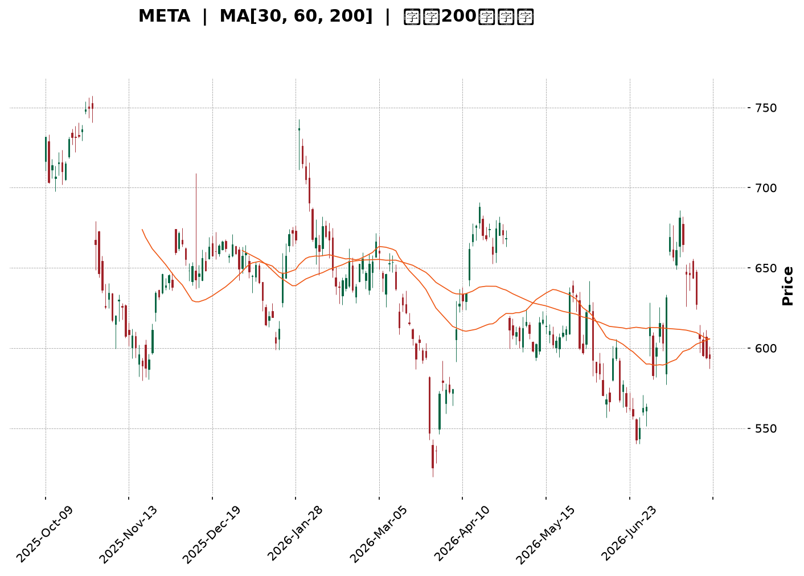
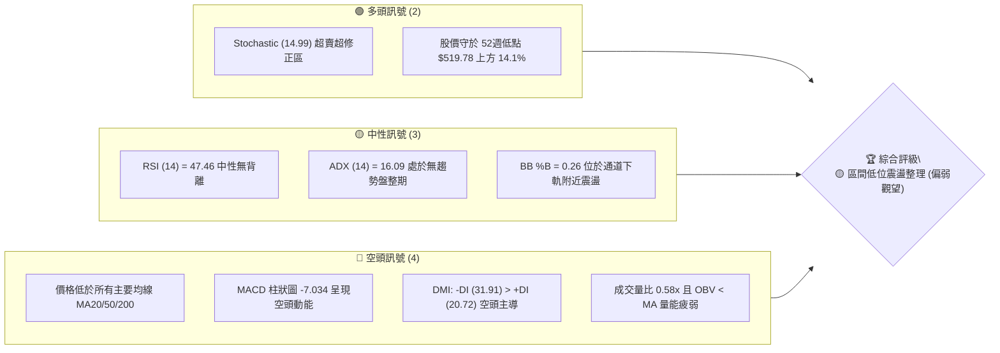
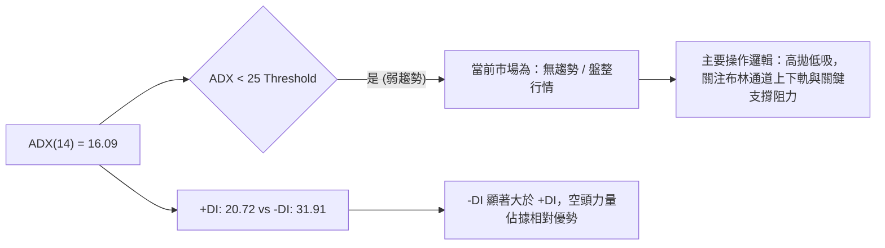
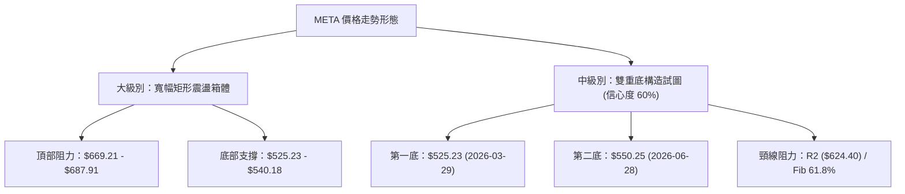
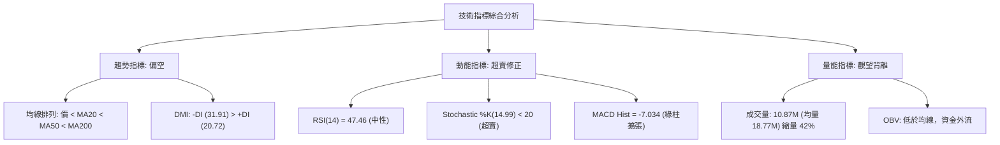
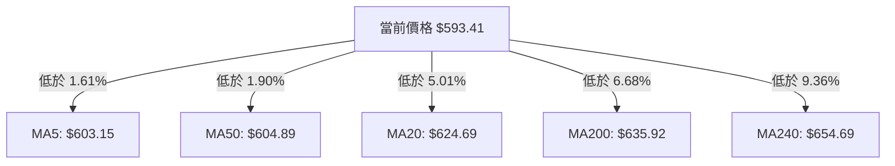
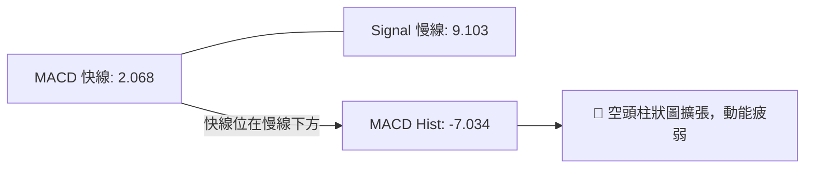
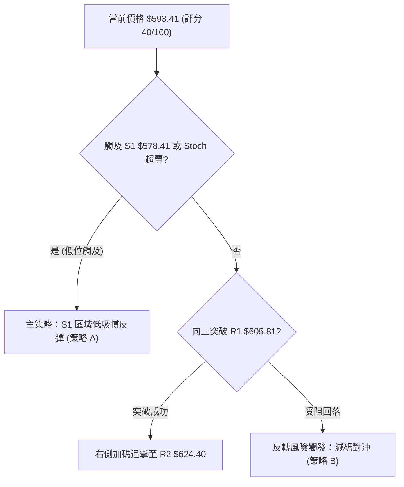
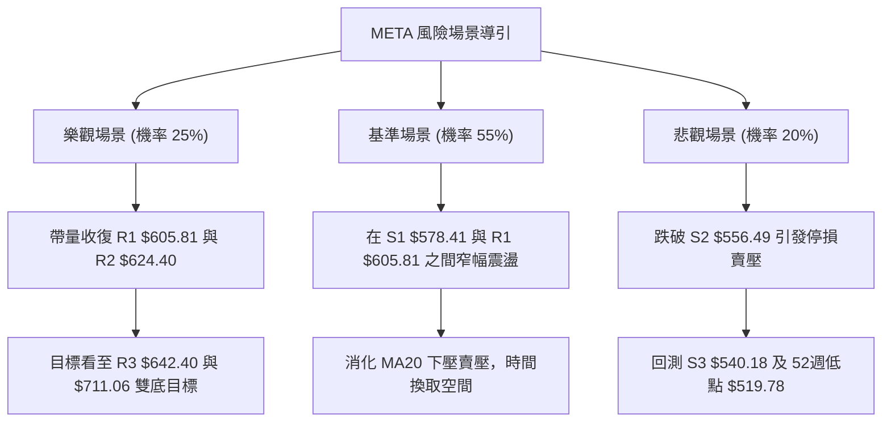

<details markdown="1">
<summary>📊 靜態圖表 (點擊展開)</summary>



</details>

<html>
<head><meta charset="utf-8" /></head>
<body>
    <div style="height:500px; width:100%;">                        <script>window.PlotlyConfig = {MathJaxConfig: 'local'};</script>
        <script charset="utf-8" src="https://cdn.plot.ly/plotly-3.7.0.min.js" integrity="sha256-jvTGqxNp8AGWEcvNLVuKr+8j5dGe9Yw51LQkmDH+IYA=" crossorigin="anonymous"></script>                <div id="candlestick-chart" class="plotly-graph-div" style="height:100%; width:100%;"></div>            <script>                window.PLOTLYENV=window.PLOTLYENV || {};                                if (document.getElementById("candlestick-chart")) {                    Plotly.newPlot(                        "candlestick-chart",                        [{"close":{"dtype":"f8","bdata":"AAAAgNvchkAAAABgw\u002fuFQAAAAEC\u002fToZAAAAAYH4WhkAAAABggl2GQAAAAGDIMYZAAAAAYHtYhkAAAABAKtKGQAAAAIDx2oZAAAAAYA\u002fchkAAAACAxOCGQAAAAKCOA4dAAAAAgPpmh0AAAADg7GuHQAAAAMDCbYdAAAAAwO3FhEAAAABgWDWEQAAAAEBy4INAAAAAoIqNg0AAAAAAZ9KDQAAAAOCsSoNAAAAAQMdgg0AAAAAg+LCDQAAAAGCgi4NAAAAAAHH7gkAAAACgdgKDQAAAAEAI\u002f4JAAAAAIJbDgkAAAADgHaGCQAAAAEBPZoJAAAAAQPlcgkAAAAAAq4WCQAAAAICtG4NAAAAAYI7Ug0AAAAAAu7+DQAAAAEAnMoRAAAAA4Kj5g0AAAADgXiuEQAAAAMCG74NAAAAAAIOehEAAAACAYv2EQAAAAOCPyIRAAAAA4At6hEAAAABgjEOEQAAAAIAiWIRAAAAAYHgUhEAAAABA2zKEQAAAAMDWf4RAAAAAgL9ChEAAAACgIrqEQAAAAKDGjIRAAAAAoJOihEAAAABADL6EQAAAACDk0oRAAAAAAN+whEAAAAAgI4yEQAAAACAdxoRAAAAAQFGXhEAAAADgA0qEQAAAAIDvjIRAAAAAwIybhEAAAACgRzyEQAAAAOBGJ4RAAAAAQC1fhEAAAACAnQaEQAAAAAC7r4NAAAAAYGQzg0AAAACAjl2DQAAAACAqWYNAAAAAwFrYgkAAAADg8h6DQAAAAIDQM4RAAAAAQLKMhEAAAABgTfmEQAAAAGAs\u002foRAAAAAYFDchEAAAACA9geHQAAAACDLWYZAAAAAgDcJhkAAAAAgv5OFQAAAAOBj3oRAAAAAACLohEAAAAAAQqKEQAAAAOAcIIVAAAAAoDTshEAAAACg\u002ftuEQAAAAEA5RYRAAAAAAAz1g0AAAACANvGDQAAAAOCYEIRAAAAAIA4dhEAAAACg8HOEQAAAACDs4INAAAAAAEvxg0AAAABgNWSEQAAAAKC4foRAAAAAADU4hEAAAACAK2OEQAAAAABPb4RAAAAAAFTUhEAAAACAJpuEQAAAAKCxHYRAAAAAAOYxhEAAAAAgPmeEQAAAACCNbYRAAAAAYFnog0AAAAAA8CSDQAAAAMDzloNAAAAA4Kpwg0AAAAAg4TiDQAAAACAb8YJAAAAA4OGIgkAAAABgAdyCQAAAAMD3goJAAAAAoLaSgkAAAACAQxiBQAAAAIDdaYBAAAAAIBG\u002fgEAAAABAzdyBQAAAAKCMFYJAAAAAwGzvgUAAAABg6uOBQAAAAOAj9IFAAAAAwNIeg0AAAAAgd56DQAAAAMA2qoNAAAAAQIrPg0AAAAAgA6+EQAAAAGCq94RAAAAAIPIhhUAAAACgTH+FQAAAAGBP8oRAAAAAAMThhEAAAAAAwxCFQAAAAEBRlIRAAAAAYD0ThUAAAADg7i+FQAAAAEC\u002f9YRAAAAA4ADkhEAAAABAvxqDQAAAAKB9AYNAAAAAIMIOg0AAAADgMuOCQAAAAACAIoNAAAAAIOlBg0AAAAAghgiDQAAAAKBxsoJAAAAAgIjTgkAAAADgeECDQAAAAODbToNAAAAAQEotg0AAAAAAJxWDQAAAAIBq0IJAAAAAgP\u002fjgkAAAABgivaCQAAAAECPDYNAAAAAIC8eg0AAAADgX9WDQAAAACCd1YNAAAAAAGW\u002fg0AAAADAT7+CQAAAAOCcqIJAAAAAoDlzg0AAAABA6ZeDQAAAAICbg4JAAAAAoMhGgkAAAADAY0CCQAAAAECc04FAAAAAoDq\u002fgUAAAADAo7OBQAAAAADXi4JAAAAAIK7BgkAAAADgo7yBQAAAAIDCCYJAAAAAwMyegUAAAACgmZGBQAAAACBcbYFAAAAAwPX2gEAAAAAAADKBQAAAAMDMlIFAAAAA4FGagUAAAACgRyeDQAAAAEAzN4JAAAAA4FHCgkAAAADgozyDQAAAAMD12IJAAAAAANe7g0AAAAAgrumEQAAAAADXhYRAAAAA4FGohEAAAADgekqFQAAAAOBRxIRAAAAAgBQwhEAAAADAzC6EQAAAAOB6HoRAAAAAIFyZg0AAAADAzPCCQAAAACCFmYJAAAAAwPWOgkAAAACgR4uCQA=="},"high":{"dtype":"f8","bdata":"AAAAgNvchkCvfrzH5uqGQFUYSDmUcIZAZCif14xNhkCAJuqDLZCGQF2MNDTdnIZAmNO9hGhlhkDiddOf7t6GQHmWOLesBIdAkqKSTW4Vh0Bn4xFy3yOHQIYY3VtMGodAjej37lCOh0A1LtYFdqOHQGVFSXWGqYdAI\u002fjQZIw5hUAhvGFhHQmFQEl\u002fdCT1jIRAKlUpJJoAhEDWSOMCgwSEQHYveh3N0oNA5vTQJCFkg0Aimmpp0sqDQM9iFjNqn4NAfzIZ2t2ag0BXtRzmYUCDQLAqoVS0IINAU1dmUtMQg0BpsMiowNCCQC42RyJJjoJAtujMJyvpgkBwfrowjKSCQDQv5VvNOINAQ5ob1y3bg0BsPJ\u002fDoeWDQCQUB3jzMoRA64yI2yodhEAEzrnIgzGEQCxniZtVOYRAQ88v2MQShUBV8rvAhAeFQMqv4PmiF4VAG9BqzAy2hEDESxdbf2aEQFirrzikbIRALze1pD4phkB7RNi6sl6EQHUcCLjhqoRAn+OPuWughEC22BuY7eqEQBGudAZx7oRAbts\u002fcgsDhUA4C2tCg8aEQCiE4RPs14RAtK\u002fsGxLehEDt765PmJiEQMEUsiIv+IRAKjVR+Ia+hED1+mgFqLmEQBNuIojauoRAd9a2Ia7ChEDROVCbz4+EQIQkHvWUL4RA8BN8G0VuhEDgfq69cWaEQC939NoCCYRAJCQY2aWag0AvHev1d3iDQGxbqMytn4NAsOXTs30Sg0B+w+RiWkmDQLTNmW8mm4RAjYDJD23KhEBODQD6nhCFQBo3xTXrHIVA+gTIXMkjhUCytBvgZjWHQHcEIBvu1oZA6ecG8x+AhkDYqlY8yV2GQJYOGObTfIVAQkThs0pChUCjr8f5WPaEQNOYmwq\u002fUIVAv4DlKYE7hUCjmATrezCFQEnskd5eFoVAsGgAGylShEBiYdVNpQuEQCOFP+LPHoRA9ZAa9kwwhED3ovG0WbGEQIF1qCw7hIRAyhI9Rr\u002f\u002fg0C8daDOuWWEQAj8MJOVnoRAMfLB50RChEAHpNF7HpaEQNiDKo\u002fujoRAC87dnpP8hEAGlC7PC+yEQORkTBCCQoRA5zry78U0hEBKINdn\u002fpiEQIKh9xaSj4RA8vru4bBihECNg5KeZaCDQGWmE0hM0YNAC9oNSa\u002ffg0DGR2uIlnCDQCQxnY11I4NAOmnY1zTbgkCoupOQnACDQA3cdU2Mw4JAaXqbWePYgkADMpdgrjOCQJjibdfF+IBAhUUkPWfYgEA3Y6UqRemBQJw64L0CgIJA2dS79rYPgkDfeR25ADKCQAKTniiU9YFAFOauAe+qg0Aup38ZR+eDQE1\u002fftbo74NAQWna20vTg0Cv2bH5JM2EQKViuGD5LoVAQR1M554nhUBxsiGeCZeFQLc1X1r6VYVAkGDsSpcchUAQwi\u002fPAy6FQNhZOyKF54RAy7LtTVFAhUDo323E8U6FQAj5WodqLIVA8oGUZQENhUAMUANsM2KDQBPEWap0UoNAHP89sXMrg0DsfF2xPy6DQE\u002fZtfcBW4NAoPqKwTWDg0Do8ptVl0GDQDm2\u002f4bM4oJAAYfmE4fZgkB6o3qsm1qDQJE\u002fDzM4eYNAHo9rqP9kg0CH0I3xKDiDQCs\u002fkmjkKoNAmJbEDH\u002f7gkDGFDeqSAiDQFBIK\u002f\u002fsMYNAeGjzNTUvg0Abcik7Re+DQEN9\u002fqA8E4RAynHluUzPg0CbnQZYStmDQJTdOYqHAoNAIX79p5N8g0Au7FYAcQ6EQCAl9jKKpINAphIFV517gkAt7lLlnKiCQIX33g0udoJAHB1ECB\u002fdgUDgXN7iSvyBQAAAAAApyoJAAAAA4HrugkAAAADgeo6CQAAAAIDCIYJAAAAA4Hr+gUAAAACgmeGBQAAAAOBRyIFAAAAAYLhigUAAAADAzGaBQAAAAEAz14FAAAAA4FGsgUAAAACAPaKDQAAAAAAAEINAAAAA4KPcgkAAAADA9YqDQAAAAAAAQINAAAAAACnKg0AAAABA4S6FQAAAAMD1JIVAAAAAAADUhEAAAADgo3CFQAAAAEAzT4VAAAAAoJlhhEAAAABgZmqEQAAAAEAKf4RAAAAAAABIhEAAAABAMzWDQAAAAADXD4NAAAAAgBQag0AAAAAAAMiCQA=="},"hovertemplate":"\u003cb\u003e%{x|%Y-%m-%d}\u003c\u002fb\u003e\u003cbr\u003e\u958b: $%{open:.2f}\u003cbr\u003e\u9ad8: $%{high:.2f}\u003cbr\u003e\u4f4e: $%{low:.2f}\u003cbr\u003e\u6536: $%{close:.2f}\u003cextra\u003e\u003c\u002fextra\u003e","low":{"dtype":"f8","bdata":"6BnjELw0hkDromWydfWFQFwmOjJvDoZAo8fJgyDMhUB0RWo2Wx2GQEnMx8Ju8IVAGehqYE4ChkCSN1FzfnKGQHM4O4PgtoZAOjrBFDeRhkCDixIIltmGQJYLxO0GyoZAnP+7jY5Qh0BwaaEzsDyHQLSl9smrJIdAllzJ+N1DhEBXLcbEKR+EQJNe3eA81INAESSotRaDg0D3zS0+UYeDQO1PdL4sQ4NAT5T0tR+9gkBX09xkDUSDQOCu1RpEToNAb+x0FozxgkA86al6fMuCQHDpUoI\u002fjYJAFCEi\u002fteOgkAfmLElIDKCQLMOaA\u002fwHYJAUKVrkLEugkD6jKsSziKCQGmgekujoIJAh0GqdJFFg0C8Ve6E7q+DQLQ\u002ftcTPzoNAeALlJdjgg0BMw1B5UeODQJMIFkQr34NA0hjtvLOShEACEBm5X6WEQMhD2xDCuoRAIqBnWyldhEBbQ+4g2Q2EQGmuIAYa+YNALRqJe6Dng0CnZoiAgOyDQP0Hfv9vEIRA+ikNOFpAhECOhfFCVHqEQArZ1GYQiIRAoyjgj9h7hEBpz5WFn4iEQKl1SOIqqIRA4VgeryOhhEBzdzNuzGmEQMmSDnNZhYRAg8nTXiCShECGupFy1RKEQNYASOLFNIRAtzJLDOpVhEDeXRSGSx2EQIAECjW01INAqlQQXKQNhECr7syytACEQJQGit3od4NAwp2ATc0tg0DId3kVFymDQM5nsJ7OV4NA31UqBnS3gkDh7waYF7iCQC9jrH95i4NA5dTkjmsahEBgwGBe5qCEQHrI283Pu4RA9M04t0\u002fHhEDpOTbwPzqGQK+1ohyOQoZAvmn+aSPyhUCeAbJqgGmFQJUxUhQs0oRADegs0LBihEBiGeJtyiqEQDBjwB7bjIRAD3svZMfkhEBVmeCDcH+EQE\u002fA6GQMIYRAn1JlVoXLg0AYIE5BcZ2DQHhamJRAmINAqRCwhLDcg0CIDWQOJO2DQJ2l867w1oNAyfB1QuGeg0ApFEYe+QeEQDBP9c3GMoRAKZAxz97ng0Dletch9sqDQOXJ5Lie7YNAyFqFz\u002f2DhECa+S5qN0mEQMMtqIjR14NA3z3Z50+Ng0BNlzw9wT6EQFB8OtSkOYRAcqfrqiDeg0DoYs9rtwODQPSpzx8vdINAyQMEsv5og0DQjG7HUzCDQNN0cGuezYJAPgy4Z6ZVgkAMYpOTpLOCQOkOFESfc4JAfqhX882GgkBK+jFSxvaAQKk1wto5PoBA3KTqnWeAgEDEZt4XHBKBQInbPUJP6oFAGk12PXR5gUDrsSxPw9uBQGrPcoPloYFACZjTi0F6gkBsFJ6YYnODQOhnwdwDfoNAZuuZNZN+g0AsZYQ4OfaDQCsr6PTWvIRA7D2Xqw3ZhEC+8AfzCRSFQE2NqEQN24RAd8kRXbLVhEDbbr3sCemEQENHaPGPY4RANthFb+BphEBZoNRAwPGEQNlHFfQbyIRA+KXMEZC5hEDZvMc1jruCQHLqmuFj7IJAu2F9BonRgkDl0Dm5br6CQFzVSYderIJAng6RU8Yng0CNBjKF\u002feuCQCDao7o1rIJArbjb+GiAgkBvVQAf3KCCQCYxIcFxM4NAs99jdPcFg0CX0uNCDNmCQCG4DIjzv4JAoC6IPw2qgkB0N63WEpKCQAXw3aYa84JAVcHPeerlgkB9hMwrfQODQHgpHnfRpYNAQUkHny52g0DKKVSIzLeCQNbuOA0FoYJAhF7IsLa9gkAKYl4\u002f1G6DQETCNEL2MoJA21hmE3gVgkDCxAiqxiOCQO97ebiS0IFA4FhOKPRjgUBmdMSHC4OBQAAAAGBmGoJAAAAAAACAgkAAAAAghbGBQAAAAMDMmIFAAAAA4Hp+gUAAAAAAKYiBQAAAAGBmXIFAAAAAoHDhgEAAAABAM+OAQAAAAAAAcIFAAAAAoHA7gUAAAADAzJiCQAAAACBcI4JAAAAAgBQugkAAAACgR92CQAAAAIAUsIJAAAAAYI8IgkAAAACAFJCEQAAAAKCZcYRAAAAAYGZIhEAAAACgR4WEQAAAAKBHoYRAAAAAAACQg0AAAACAFOCDQAAAAKCZGYRAAAAAAACAg0AAAACAwqmCQAAAAKCZk4JAAAAAQAqJgkAAAAAAAFiCQA=="},"name":"\u50f9\u683c","open":{"dtype":"f8","bdata":"y1j8aVVjhkBBKu8DMciGQOQdnWpIOYZAclE\u002fP40PhkDBs2N6mVmGQC9m+UKCXYZAm8a\u002fZvcJhkB0JqCVjXqGQOdB\u002f+Pi8IZAjCS9ZGnfhkD17\u002fNnWuaGQET0QZcH94ZAWmx96kdeh0BYZoGta3WHQLbRCkNWhodAdrH+QlDbhEAN1zAmFQaFQCEcVfVicoRAjYrOTEmTg0DHOaCWW7WDQCbFhKma0YNAOYpUWyA3g0DrqzePn6uDQNqJxZz3koNAxCC6KwGUg0Dt8Rhb1huDQFhYpL\u002fUwYJAPJ+nJq77gkBDWX7ahXCCQFLk+U9wgYJAbzsow3nPgkCRuR2MyVeCQD+oGsFVqYJAqdAszAxzg0BtItoySeCDQL1A2o9w04NA8etXgyDvg0DXItPJYwWEQGGUKRLoFYRA4oMooPgRhUBo0XdrOLKEQC7HbGHU3IRAmW0BkmKwhECrU8u0HEKEQJ7to0v4DIRATW1zKOpAhED8BLf5ZiSEQPDIbUfVEoRA0E8ReIpzhEAcM9KO4X6EQDAMOdrdyYRAp2nwU8ajhECwsitV\u002f5aEQN4ENY7NqoRAaEfSmvbWhEB0gcz6tIaEQEF2kBkjjIRAyxy04Ye8hEAlCBRTZqyEQHwA7X7OToRA3xQwNCqThED9Uf7nx3OEQPC1COjWJYRAKpgESlMihECXtuf98VqEQC939NoCCYRAY4GLVROLg0DYwduVB0uDQKOpHmuMeINAquDkiWH2gkCzYKnuRu2CQDlEsKnVoYNAx9UnxPkchEBSxoe9kL+EQOW2lVccC4VAd7hwVWQKhUAx6oZ17wCHQKUE1gKjsYZAqdcAwp5KhkCukcEa4hCGQM8FDAkLdIVAEzGn7S+zhECQ2NWtcMKEQDycITP+r4RArUs9ySUjhUDwJNkiZgaFQKHX2Fs35oRAZQlMUJwfhEAHLu3b4\u002fKDQHTlDRpfxYNASRqJpXbrg0BrBOFcaPSDQOHj3T0GW4RANPPILp+\u002fg0At0y5yFguEQPGHrQ4iS4RAxi+GP28ShEAPFJIONOCDQC+63MIVOYRAHjHBwE6GhED3YWTKAqaEQN9P8In4NYRAoMiuuzLNg0AZASJ8K2OEQEmmVb3AbIRAM6BRNMI8hEC+FvR\u002fO3aDQHVaHn9Ru4NAt0yHpESbg0DzoJafJz6DQAALPmqqHINAH8uVCMXXgkAMJSkY1emCQO+C2adctIJA0uH1EnyxgkCAszHYmi+CQBVJpXrM3IBAAAAAIBG\u002fgEAo33sBxCuBQHSOFiu+HIJAHhmidyCsgUDQx+2kPQmCQKyYp1+Z34FAUMu2zILrgkAtmV6RHZODQEqN40EPz4NAeqzSSVang0Bb4WSr\u002fhSEQDokWi8P04RA9Ow5i+kahUAwwnTexS+FQNep\u002fy7VRYVAQQBkhwfzhEC+gcJu4g2FQOTAGf+uuIRAyhZjJaudhEDvsSuTB\u002fOEQHWVIuDsDIVAKCT1JVPihEDULb\u002fy+FWDQGY7Z3z3MINAj3QITwT7gkDD9EDK7yWDQHD2I4\u002fyw4JAULOwtjQxg0B1KdTvCjWDQHaHCewU4IJA7LwbYyeSgkC5Z35BNLKCQDAHq9tvO4NA0qOANF8rg0AbqosbXgSDQOQSvWjZAoNAQsxwR6HBgkAuvfQejruCQEXaZIOJ+oJAtSHrCpwCg0Du4ZuprwaDQKEcJkRD94NA4L5gn07Hg0Crvl29h66DQPQJZ3xz1YJAK1t8g4jTgkBNLGFlvXiDQHO0LN0Pd4NAphIFV517gkAbnRI4n3OCQLcR1cKJIYJAtzBEznKqgUDclJkNW+OBQAAAAEAzH4JAAAAAQDONgkAAAAAAAICCQAAAAGCP5oFAAAAAACnggUAAAAAAAJKBQAAAAMAej4FAAAAAYGZcgUAAAABguPqAQAAAAAAAgIFAAAAAIIWHgUAAAACgR\u002f+CQAAAAEAz\u002f4JAAAAAYLiWgkAAAABguPyCQAAAAMAeM4NAAAAAgOs\u002fgkAAAABguKKEQAAAAEAKq4RAAAAAAABghEAAAADAzLyEQAAAAIA9KoVAAAAAoJk9hEAAAACgmTWEQAAAAKBwcYRAAAAAoJk9hEAAAACgRwODQAAAAGBm6oJAAAAAgML5gkAAAABAM5+CQA=="},"x":["2025-10-09T00:00:00-04:00","2025-10-10T00:00:00-04:00","2025-10-13T00:00:00-04:00","2025-10-14T00:00:00-04:00","2025-10-15T00:00:00-04:00","2025-10-16T00:00:00-04:00","2025-10-17T00:00:00-04:00","2025-10-20T00:00:00-04:00","2025-10-21T00:00:00-04:00","2025-10-22T00:00:00-04:00","2025-10-23T00:00:00-04:00","2025-10-24T00:00:00-04:00","2025-10-27T00:00:00-04:00","2025-10-28T00:00:00-04:00","2025-10-29T00:00:00-04:00","2025-10-30T00:00:00-04:00","2025-10-31T00:00:00-04:00","2025-11-03T00:00:00-05:00","2025-11-04T00:00:00-05:00","2025-11-05T00:00:00-05:00","2025-11-06T00:00:00-05:00","2025-11-07T00:00:00-05:00","2025-11-10T00:00:00-05:00","2025-11-11T00:00:00-05:00","2025-11-12T00:00:00-05:00","2025-11-13T00:00:00-05:00","2025-11-14T00:00:00-05:00","2025-11-17T00:00:00-05:00","2025-11-18T00:00:00-05:00","2025-11-19T00:00:00-05:00","2025-11-20T00:00:00-05:00","2025-11-21T00:00:00-05:00","2025-11-24T00:00:00-05:00","2025-11-25T00:00:00-05:00","2025-11-26T00:00:00-05:00","2025-11-28T00:00:00-05:00","2025-12-01T00:00:00-05:00","2025-12-02T00:00:00-05:00","2025-12-03T00:00:00-05:00","2025-12-04T00:00:00-05:00","2025-12-05T00:00:00-05:00","2025-12-08T00:00:00-05:00","2025-12-09T00:00:00-05:00","2025-12-10T00:00:00-05:00","2025-12-11T00:00:00-05:00","2025-12-12T00:00:00-05:00","2025-12-15T00:00:00-05:00","2025-12-16T00:00:00-05:00","2025-12-17T00:00:00-05:00","2025-12-18T00:00:00-05:00","2025-12-19T00:00:00-05:00","2025-12-22T00:00:00-05:00","2025-12-23T00:00:00-05:00","2025-12-24T00:00:00-05:00","2025-12-26T00:00:00-05:00","2025-12-29T00:00:00-05:00","2025-12-30T00:00:00-05:00","2025-12-31T00:00:00-05:00","2026-01-02T00:00:00-05:00","2026-01-05T00:00:00-05:00","2026-01-06T00:00:00-05:00","2026-01-07T00:00:00-05:00","2026-01-08T00:00:00-05:00","2026-01-09T00:00:00-05:00","2026-01-12T00:00:00-05:00","2026-01-13T00:00:00-05:00","2026-01-14T00:00:00-05:00","2026-01-15T00:00:00-05:00","2026-01-16T00:00:00-05:00","2026-01-20T00:00:00-05:00","2026-01-21T00:00:00-05:00","2026-01-22T00:00:00-05:00","2026-01-23T00:00:00-05:00","2026-01-26T00:00:00-05:00","2026-01-27T00:00:00-05:00","2026-01-28T00:00:00-05:00","2026-01-29T00:00:00-05:00","2026-01-30T00:00:00-05:00","2026-02-02T00:00:00-05:00","2026-02-03T00:00:00-05:00","2026-02-04T00:00:00-05:00","2026-02-05T00:00:00-05:00","2026-02-06T00:00:00-05:00","2026-02-09T00:00:00-05:00","2026-02-10T00:00:00-05:00","2026-02-11T00:00:00-05:00","2026-02-12T00:00:00-05:00","2026-02-13T00:00:00-05:00","2026-02-17T00:00:00-05:00","2026-02-18T00:00:00-05:00","2026-02-19T00:00:00-05:00","2026-02-20T00:00:00-05:00","2026-02-23T00:00:00-05:00","2026-02-24T00:00:00-05:00","2026-02-25T00:00:00-05:00","2026-02-26T00:00:00-05:00","2026-02-27T00:00:00-05:00","2026-03-02T00:00:00-05:00","2026-03-03T00:00:00-05:00","2026-03-04T00:00:00-05:00","2026-03-05T00:00:00-05:00","2026-03-06T00:00:00-05:00","2026-03-09T00:00:00-04:00","2026-03-10T00:00:00-04:00","2026-03-11T00:00:00-04:00","2026-03-12T00:00:00-04:00","2026-03-13T00:00:00-04:00","2026-03-16T00:00:00-04:00","2026-03-17T00:00:00-04:00","2026-03-18T00:00:00-04:00","2026-03-19T00:00:00-04:00","2026-03-20T00:00:00-04:00","2026-03-23T00:00:00-04:00","2026-03-24T00:00:00-04:00","2026-03-25T00:00:00-04:00","2026-03-26T00:00:00-04:00","2026-03-27T00:00:00-04:00","2026-03-30T00:00:00-04:00","2026-03-31T00:00:00-04:00","2026-04-01T00:00:00-04:00","2026-04-02T00:00:00-04:00","2026-04-06T00:00:00-04:00","2026-04-07T00:00:00-04:00","2026-04-08T00:00:00-04:00","2026-04-09T00:00:00-04:00","2026-04-10T00:00:00-04:00","2026-04-13T00:00:00-04:00","2026-04-14T00:00:00-04:00","2026-04-15T00:00:00-04:00","2026-04-16T00:00:00-04:00","2026-04-17T00:00:00-04:00","2026-04-20T00:00:00-04:00","2026-04-21T00:00:00-04:00","2026-04-22T00:00:00-04:00","2026-04-23T00:00:00-04:00","2026-04-24T00:00:00-04:00","2026-04-27T00:00:00-04:00","2026-04-28T00:00:00-04:00","2026-04-29T00:00:00-04:00","2026-04-30T00:00:00-04:00","2026-05-01T00:00:00-04:00","2026-05-04T00:00:00-04:00","2026-05-05T00:00:00-04:00","2026-05-06T00:00:00-04:00","2026-05-07T00:00:00-04:00","2026-05-08T00:00:00-04:00","2026-05-11T00:00:00-04:00","2026-05-12T00:00:00-04:00","2026-05-13T00:00:00-04:00","2026-05-14T00:00:00-04:00","2026-05-15T00:00:00-04:00","2026-05-18T00:00:00-04:00","2026-05-19T00:00:00-04:00","2026-05-20T00:00:00-04:00","2026-05-21T00:00:00-04:00","2026-05-22T00:00:00-04:00","2026-05-26T00:00:00-04:00","2026-05-27T00:00:00-04:00","2026-05-28T00:00:00-04:00","2026-05-29T00:00:00-04:00","2026-06-01T00:00:00-04:00","2026-06-02T00:00:00-04:00","2026-06-03T00:00:00-04:00","2026-06-04T00:00:00-04:00","2026-06-05T00:00:00-04:00","2026-06-08T00:00:00-04:00","2026-06-09T00:00:00-04:00","2026-06-10T00:00:00-04:00","2026-06-11T00:00:00-04:00","2026-06-12T00:00:00-04:00","2026-06-15T00:00:00-04:00","2026-06-16T00:00:00-04:00","2026-06-17T00:00:00-04:00","2026-06-18T00:00:00-04:00","2026-06-22T00:00:00-04:00","2026-06-23T00:00:00-04:00","2026-06-24T00:00:00-04:00","2026-06-25T00:00:00-04:00","2026-06-26T00:00:00-04:00","2026-06-29T00:00:00-04:00","2026-06-30T00:00:00-04:00","2026-07-01T00:00:00-04:00","2026-07-02T00:00:00-04:00","2026-07-06T00:00:00-04:00","2026-07-07T00:00:00-04:00","2026-07-08T00:00:00-04:00","2026-07-09T00:00:00-04:00","2026-07-10T00:00:00-04:00","2026-07-13T00:00:00-04:00","2026-07-14T00:00:00-04:00","2026-07-15T00:00:00-04:00","2026-07-16T00:00:00-04:00","2026-07-17T00:00:00-04:00","2026-07-20T00:00:00-04:00","2026-07-21T00:00:00-04:00","2026-07-22T00:00:00-04:00","2026-07-23T00:00:00-04:00","2026-07-24T00:00:00-04:00","2026-07-27T00:00:00-04:00","2026-07-28T00:00:00-04:00"],"type":"candlestick"},{"hovertemplate":"MA30: $%{y:.2f}\u003cextra\u003e\u003c\u002fextra\u003e","line":{"color":"#2196F3","dash":"dash","width":2},"mode":"lines","name":"MA30","x":["2025-10-09T00:00:00-04:00","2025-10-10T00:00:00-04:00","2025-10-13T00:00:00-04:00","2025-10-14T00:00:00-04:00","2025-10-15T00:00:00-04:00","2025-10-16T00:00:00-04:00","2025-10-17T00:00:00-04:00","2025-10-20T00:00:00-04:00","2025-10-21T00:00:00-04:00","2025-10-22T00:00:00-04:00","2025-10-23T00:00:00-04:00","2025-10-24T00:00:00-04:00","2025-10-27T00:00:00-04:00","2025-10-28T00:00:00-04:00","2025-10-29T00:00:00-04:00","2025-10-30T00:00:00-04:00","2025-10-31T00:00:00-04:00","2025-11-03T00:00:00-05:00","2025-11-04T00:00:00-05:00","2025-11-05T00:00:00-05:00","2025-11-06T00:00:00-05:00","2025-11-07T00:00:00-05:00","2025-11-10T00:00:00-05:00","2025-11-11T00:00:00-05:00","2025-11-12T00:00:00-05:00","2025-11-13T00:00:00-05:00","2025-11-14T00:00:00-05:00","2025-11-17T00:00:00-05:00","2025-11-18T00:00:00-05:00","2025-11-19T00:00:00-05:00","2025-11-20T00:00:00-05:00","2025-11-21T00:00:00-05:00","2025-11-24T00:00:00-05:00","2025-11-25T00:00:00-05:00","2025-11-26T00:00:00-05:00","2025-11-28T00:00:00-05:00","2025-12-01T00:00:00-05:00","2025-12-02T00:00:00-05:00","2025-12-03T00:00:00-05:00","2025-12-04T00:00:00-05:00","2025-12-05T00:00:00-05:00","2025-12-08T00:00:00-05:00","2025-12-09T00:00:00-05:00","2025-12-10T00:00:00-05:00","2025-12-11T00:00:00-05:00","2025-12-12T00:00:00-05:00","2025-12-15T00:00:00-05:00","2025-12-16T00:00:00-05:00","2025-12-17T00:00:00-05:00","2025-12-18T00:00:00-05:00","2025-12-19T00:00:00-05:00","2025-12-22T00:00:00-05:00","2025-12-23T00:00:00-05:00","2025-12-24T00:00:00-05:00","2025-12-26T00:00:00-05:00","2025-12-29T00:00:00-05:00","2025-12-30T00:00:00-05:00","2025-12-31T00:00:00-05:00","2026-01-02T00:00:00-05:00","2026-01-05T00:00:00-05:00","2026-01-06T00:00:00-05:00","2026-01-07T00:00:00-05:00","2026-01-08T00:00:00-05:00","2026-01-09T00:00:00-05:00","2026-01-12T00:00:00-05:00","2026-01-13T00:00:00-05:00","2026-01-14T00:00:00-05:00","2026-01-15T00:00:00-05:00","2026-01-16T00:00:00-05:00","2026-01-20T00:00:00-05:00","2026-01-21T00:00:00-05:00","2026-01-22T00:00:00-05:00","2026-01-23T00:00:00-05:00","2026-01-26T00:00:00-05:00","2026-01-27T00:00:00-05:00","2026-01-28T00:00:00-05:00","2026-01-29T00:00:00-05:00","2026-01-30T00:00:00-05:00","2026-02-02T00:00:00-05:00","2026-02-03T00:00:00-05:00","2026-02-04T00:00:00-05:00","2026-02-05T00:00:00-05:00","2026-02-06T00:00:00-05:00","2026-02-09T00:00:00-05:00","2026-02-10T00:00:00-05:00","2026-02-11T00:00:00-05:00","2026-02-12T00:00:00-05:00","2026-02-13T00:00:00-05:00","2026-02-17T00:00:00-05:00","2026-02-18T00:00:00-05:00","2026-02-19T00:00:00-05:00","2026-02-20T00:00:00-05:00","2026-02-23T00:00:00-05:00","2026-02-24T00:00:00-05:00","2026-02-25T00:00:00-05:00","2026-02-26T00:00:00-05:00","2026-02-27T00:00:00-05:00","2026-03-02T00:00:00-05:00","2026-03-03T00:00:00-05:00","2026-03-04T00:00:00-05:00","2026-03-05T00:00:00-05:00","2026-03-06T00:00:00-05:00","2026-03-09T00:00:00-04:00","2026-03-10T00:00:00-04:00","2026-03-11T00:00:00-04:00","2026-03-12T00:00:00-04:00","2026-03-13T00:00:00-04:00","2026-03-16T00:00:00-04:00","2026-03-17T00:00:00-04:00","2026-03-18T00:00:00-04:00","2026-03-19T00:00:00-04:00","2026-03-20T00:00:00-04:00","2026-03-23T00:00:00-04:00","2026-03-24T00:00:00-04:00","2026-03-25T00:00:00-04:00","2026-03-26T00:00:00-04:00","2026-03-27T00:00:00-04:00","2026-03-30T00:00:00-04:00","2026-03-31T00:00:00-04:00","2026-04-01T00:00:00-04:00","2026-04-02T00:00:00-04:00","2026-04-06T00:00:00-04:00","2026-04-07T00:00:00-04:00","2026-04-08T00:00:00-04:00","2026-04-09T00:00:00-04:00","2026-04-10T00:00:00-04:00","2026-04-13T00:00:00-04:00","2026-04-14T00:00:00-04:00","2026-04-15T00:00:00-04:00","2026-04-16T00:00:00-04:00","2026-04-17T00:00:00-04:00","2026-04-20T00:00:00-04:00","2026-04-21T00:00:00-04:00","2026-04-22T00:00:00-04:00","2026-04-23T00:00:00-04:00","2026-04-24T00:00:00-04:00","2026-04-27T00:00:00-04:00","2026-04-28T00:00:00-04:00","2026-04-29T00:00:00-04:00","2026-04-30T00:00:00-04:00","2026-05-01T00:00:00-04:00","2026-05-04T00:00:00-04:00","2026-05-05T00:00:00-04:00","2026-05-06T00:00:00-04:00","2026-05-07T00:00:00-04:00","2026-05-08T00:00:00-04:00","2026-05-11T00:00:00-04:00","2026-05-12T00:00:00-04:00","2026-05-13T00:00:00-04:00","2026-05-14T00:00:00-04:00","2026-05-15T00:00:00-04:00","2026-05-18T00:00:00-04:00","2026-05-19T00:00:00-04:00","2026-05-20T00:00:00-04:00","2026-05-21T00:00:00-04:00","2026-05-22T00:00:00-04:00","2026-05-26T00:00:00-04:00","2026-05-27T00:00:00-04:00","2026-05-28T00:00:00-04:00","2026-05-29T00:00:00-04:00","2026-06-01T00:00:00-04:00","2026-06-02T00:00:00-04:00","2026-06-03T00:00:00-04:00","2026-06-04T00:00:00-04:00","2026-06-05T00:00:00-04:00","2026-06-08T00:00:00-04:00","2026-06-09T00:00:00-04:00","2026-06-10T00:00:00-04:00","2026-06-11T00:00:00-04:00","2026-06-12T00:00:00-04:00","2026-06-15T00:00:00-04:00","2026-06-16T00:00:00-04:00","2026-06-17T00:00:00-04:00","2026-06-18T00:00:00-04:00","2026-06-22T00:00:00-04:00","2026-06-23T00:00:00-04:00","2026-06-24T00:00:00-04:00","2026-06-25T00:00:00-04:00","2026-06-26T00:00:00-04:00","2026-06-29T00:00:00-04:00","2026-06-30T00:00:00-04:00","2026-07-01T00:00:00-04:00","2026-07-02T00:00:00-04:00","2026-07-06T00:00:00-04:00","2026-07-07T00:00:00-04:00","2026-07-08T00:00:00-04:00","2026-07-09T00:00:00-04:00","2026-07-10T00:00:00-04:00","2026-07-13T00:00:00-04:00","2026-07-14T00:00:00-04:00","2026-07-15T00:00:00-04:00","2026-07-16T00:00:00-04:00","2026-07-17T00:00:00-04:00","2026-07-20T00:00:00-04:00","2026-07-21T00:00:00-04:00","2026-07-22T00:00:00-04:00","2026-07-23T00:00:00-04:00","2026-07-24T00:00:00-04:00","2026-07-27T00:00:00-04:00","2026-07-28T00:00:00-04:00"],"y":{"dtype":"f8","bdata":"AAAAAAAA+H8AAAAAAAD4fwAAAAAAAPh\u002fAAAAAAAA+H8AAAAAAAD4fwAAAAAAAPh\u002fAAAAAAAA+H8AAAAAAAD4fwAAAAAAAPh\u002fAAAAAAAA+H8AAAAAAAD4fwAAAAAAAPh\u002fAAAAAAAA+H8AAAAAAAD4fwAAAAAAAPh\u002fAAAAAAAA+H8AAAAAAAD4fwAAAAAAAPh\u002fAAAAAAAA+H8AAAAAAAD4fwAAAAAAAPh\u002fAAAAAAAA+H8AAAAAAAD4fwAAAAAAAPh\u002fAAAAAAAA+H8AAAAAAAD4fwAAAAAAAPh\u002fAAAAAAAA+H8AAAAAAAD4f6uqqkrqDoVAIiIi4oTohECamZmJ+8qEQFVVVSWur4RAmpmZaWqchEB3d3f3FoaEQAAAABAJdYRAiYiI2M5ghEB3d3d3LkqEQCIiIoJEMYRAq6qqOiYehEDNzMxcCQ6EQO\u002fu7t4A+4NAvLu7+wnig0BVVVXVF8eDQBEREbHFrINAERERYdumg0BEREQkxqaDQKuqqkoWrINAZmZmliCyg0CrqqoK2rmDQCIiIqKWxINAVVVVpVDPg0CJiIjISNiDQBEREXEx44NAzczMLMbxg0BmZmaG5f6DQDMzM+MQDoRAERERMagdhEDe3d390SuEQKuqqqosPoRAd3d3t1NRhECamZmJ8l+EQM3MzAzeaIRAIiIi8nxthEBERETU2W+EQDMzM+OAa4RAERERAeVkhECamZm5CF6EQDMzM6MFWYRAmpmZKeJJhEAiIiKC7zmEQCIiIjL6NIRAd3d3V5k1hEDv7u5OqDuEQLy7uysxQYRAERERgdpHhEBEREQUBmCEQN7d3X3Sb4RAAAAAoPh+hEAzMzOTOYaEQERERATyiIRAAAAAkEOLhEC8u7trVoqEQBEREWHpjIRAMzMzs+OOhEBmZmYmjZGEQJqZmUlBjYRARERElNiHhEDNzMzM4oSEQHd3d8e9gIRAvLu7W4Z8hEAzMzNTYX6EQHd3d\u002fcIfIRAq6qqSl94hEBERET0fXuEQGZmZkZkgoRAVVVV5RWLhEBERERUzpOEQDMzM9MTnYRAiYiIiAKuhEC8u7vrrrqEQImIiCjyuYRAmpmZWeu2hECamZn5DLKEQN7d3d06rYRAiYiICBmlhEBmZmYm7oOEQAAAAHBebIRA3t3dnTdWhEBmZmYmH0KEQKuqqsqtMYRAvLu7628dhEAiIiKiSw6EQImIiJj994NAzczM3PDjg0BmZmYG0cODQBEREZHnooNAZmZmVoGHg0CJiIgYwnWDQJqZmUnbZINAd3d310RSg0BERETEZjyDQBEREbH5K4NA7+7urvUkg0BmZmZGXh6DQBEREeFIF4NAiYiIuMsTg0CJiIjoUhaDQM3MzHzeGoNAMzMz03Qdg0AiIiKyDyWDQFVVVQUmLINAERERwQIyg0ARERFRqTeDQO\u002fu7h70OINAd3d3p+pCg0DNzMyMWVSDQAAAAAALYINAvLu7u2tsg0CrqqqaamuDQLy7u2v2a4NARERE1Gxwg0BmZmY2qnCDQN7d3Y37dYNAIiIiktJ7g0AzMzNTXYyDQKuqqrrZn4NAERERcZmxg0Dv7u5+dL2DQCIiIhLmx4NAVVVVhX7Sg0BVVVU1q9yDQFVVVeUC5INAvLu76wzig0BmZmb2c9yDQN7d3S0714NA3t3dvVHRg0ARERGREMqDQFVVVXVlwINARERE9JO0g0B3d3eXHJ2DQERERKSWiYNARERE1F59g0CamZkJz3CDQBEREWEvX4NA7+7unk1Hg0AzMzNzQC6DQM3MzIyDE4NAREREJLD4gkAiIiLCt+yCQN7d3c3L6IJAIiIiEjrmgkARERGBaNyCQKuqqtoM04JAERERcRTFgkB3d3cXlbiCQKuqqgq\u002frYJAiYiISNydgkCJiIi4T4yCQLy7u3uTfYJA3t3dzSRwgkDe3d19v3CCQM3MzAyka4JAmpmZqYRqgkCJiIjY2myCQO\u002fu7v4Za4JAMzMzU1twgkAiIiIikXmCQN7d3e1wf4JA7+7ujjSHgkAiIiIy6ZyCQCIiIrLmroJAIiIiQjK1gkB3d3fXObqCQERERPTrx4JAMzMzIzXTgkARERGBFtmCQFVVVVWv34JAiYiI+JvmgkCamZkZzO2CQA=="},"type":"scatter"},{"hovertemplate":"MA60: $%{y:.2f}\u003cextra\u003e\u003c\u002fextra\u003e","line":{"color":"#9C27B0","dash":"dash","width":2},"mode":"lines","name":"MA60","x":["2025-10-09T00:00:00-04:00","2025-10-10T00:00:00-04:00","2025-10-13T00:00:00-04:00","2025-10-14T00:00:00-04:00","2025-10-15T00:00:00-04:00","2025-10-16T00:00:00-04:00","2025-10-17T00:00:00-04:00","2025-10-20T00:00:00-04:00","2025-10-21T00:00:00-04:00","2025-10-22T00:00:00-04:00","2025-10-23T00:00:00-04:00","2025-10-24T00:00:00-04:00","2025-10-27T00:00:00-04:00","2025-10-28T00:00:00-04:00","2025-10-29T00:00:00-04:00","2025-10-30T00:00:00-04:00","2025-10-31T00:00:00-04:00","2025-11-03T00:00:00-05:00","2025-11-04T00:00:00-05:00","2025-11-05T00:00:00-05:00","2025-11-06T00:00:00-05:00","2025-11-07T00:00:00-05:00","2025-11-10T00:00:00-05:00","2025-11-11T00:00:00-05:00","2025-11-12T00:00:00-05:00","2025-11-13T00:00:00-05:00","2025-11-14T00:00:00-05:00","2025-11-17T00:00:00-05:00","2025-11-18T00:00:00-05:00","2025-11-19T00:00:00-05:00","2025-11-20T00:00:00-05:00","2025-11-21T00:00:00-05:00","2025-11-24T00:00:00-05:00","2025-11-25T00:00:00-05:00","2025-11-26T00:00:00-05:00","2025-11-28T00:00:00-05:00","2025-12-01T00:00:00-05:00","2025-12-02T00:00:00-05:00","2025-12-03T00:00:00-05:00","2025-12-04T00:00:00-05:00","2025-12-05T00:00:00-05:00","2025-12-08T00:00:00-05:00","2025-12-09T00:00:00-05:00","2025-12-10T00:00:00-05:00","2025-12-11T00:00:00-05:00","2025-12-12T00:00:00-05:00","2025-12-15T00:00:00-05:00","2025-12-16T00:00:00-05:00","2025-12-17T00:00:00-05:00","2025-12-18T00:00:00-05:00","2025-12-19T00:00:00-05:00","2025-12-22T00:00:00-05:00","2025-12-23T00:00:00-05:00","2025-12-24T00:00:00-05:00","2025-12-26T00:00:00-05:00","2025-12-29T00:00:00-05:00","2025-12-30T00:00:00-05:00","2025-12-31T00:00:00-05:00","2026-01-02T00:00:00-05:00","2026-01-05T00:00:00-05:00","2026-01-06T00:00:00-05:00","2026-01-07T00:00:00-05:00","2026-01-08T00:00:00-05:00","2026-01-09T00:00:00-05:00","2026-01-12T00:00:00-05:00","2026-01-13T00:00:00-05:00","2026-01-14T00:00:00-05:00","2026-01-15T00:00:00-05:00","2026-01-16T00:00:00-05:00","2026-01-20T00:00:00-05:00","2026-01-21T00:00:00-05:00","2026-01-22T00:00:00-05:00","2026-01-23T00:00:00-05:00","2026-01-26T00:00:00-05:00","2026-01-27T00:00:00-05:00","2026-01-28T00:00:00-05:00","2026-01-29T00:00:00-05:00","2026-01-30T00:00:00-05:00","2026-02-02T00:00:00-05:00","2026-02-03T00:00:00-05:00","2026-02-04T00:00:00-05:00","2026-02-05T00:00:00-05:00","2026-02-06T00:00:00-05:00","2026-02-09T00:00:00-05:00","2026-02-10T00:00:00-05:00","2026-02-11T00:00:00-05:00","2026-02-12T00:00:00-05:00","2026-02-13T00:00:00-05:00","2026-02-17T00:00:00-05:00","2026-02-18T00:00:00-05:00","2026-02-19T00:00:00-05:00","2026-02-20T00:00:00-05:00","2026-02-23T00:00:00-05:00","2026-02-24T00:00:00-05:00","2026-02-25T00:00:00-05:00","2026-02-26T00:00:00-05:00","2026-02-27T00:00:00-05:00","2026-03-02T00:00:00-05:00","2026-03-03T00:00:00-05:00","2026-03-04T00:00:00-05:00","2026-03-05T00:00:00-05:00","2026-03-06T00:00:00-05:00","2026-03-09T00:00:00-04:00","2026-03-10T00:00:00-04:00","2026-03-11T00:00:00-04:00","2026-03-12T00:00:00-04:00","2026-03-13T00:00:00-04:00","2026-03-16T00:00:00-04:00","2026-03-17T00:00:00-04:00","2026-03-18T00:00:00-04:00","2026-03-19T00:00:00-04:00","2026-03-20T00:00:00-04:00","2026-03-23T00:00:00-04:00","2026-03-24T00:00:00-04:00","2026-03-25T00:00:00-04:00","2026-03-26T00:00:00-04:00","2026-03-27T00:00:00-04:00","2026-03-30T00:00:00-04:00","2026-03-31T00:00:00-04:00","2026-04-01T00:00:00-04:00","2026-04-02T00:00:00-04:00","2026-04-06T00:00:00-04:00","2026-04-07T00:00:00-04:00","2026-04-08T00:00:00-04:00","2026-04-09T00:00:00-04:00","2026-04-10T00:00:00-04:00","2026-04-13T00:00:00-04:00","2026-04-14T00:00:00-04:00","2026-04-15T00:00:00-04:00","2026-04-16T00:00:00-04:00","2026-04-17T00:00:00-04:00","2026-04-20T00:00:00-04:00","2026-04-21T00:00:00-04:00","2026-04-22T00:00:00-04:00","2026-04-23T00:00:00-04:00","2026-04-24T00:00:00-04:00","2026-04-27T00:00:00-04:00","2026-04-28T00:00:00-04:00","2026-04-29T00:00:00-04:00","2026-04-30T00:00:00-04:00","2026-05-01T00:00:00-04:00","2026-05-04T00:00:00-04:00","2026-05-05T00:00:00-04:00","2026-05-06T00:00:00-04:00","2026-05-07T00:00:00-04:00","2026-05-08T00:00:00-04:00","2026-05-11T00:00:00-04:00","2026-05-12T00:00:00-04:00","2026-05-13T00:00:00-04:00","2026-05-14T00:00:00-04:00","2026-05-15T00:00:00-04:00","2026-05-18T00:00:00-04:00","2026-05-19T00:00:00-04:00","2026-05-20T00:00:00-04:00","2026-05-21T00:00:00-04:00","2026-05-22T00:00:00-04:00","2026-05-26T00:00:00-04:00","2026-05-27T00:00:00-04:00","2026-05-28T00:00:00-04:00","2026-05-29T00:00:00-04:00","2026-06-01T00:00:00-04:00","2026-06-02T00:00:00-04:00","2026-06-03T00:00:00-04:00","2026-06-04T00:00:00-04:00","2026-06-05T00:00:00-04:00","2026-06-08T00:00:00-04:00","2026-06-09T00:00:00-04:00","2026-06-10T00:00:00-04:00","2026-06-11T00:00:00-04:00","2026-06-12T00:00:00-04:00","2026-06-15T00:00:00-04:00","2026-06-16T00:00:00-04:00","2026-06-17T00:00:00-04:00","2026-06-18T00:00:00-04:00","2026-06-22T00:00:00-04:00","2026-06-23T00:00:00-04:00","2026-06-24T00:00:00-04:00","2026-06-25T00:00:00-04:00","2026-06-26T00:00:00-04:00","2026-06-29T00:00:00-04:00","2026-06-30T00:00:00-04:00","2026-07-01T00:00:00-04:00","2026-07-02T00:00:00-04:00","2026-07-06T00:00:00-04:00","2026-07-07T00:00:00-04:00","2026-07-08T00:00:00-04:00","2026-07-09T00:00:00-04:00","2026-07-10T00:00:00-04:00","2026-07-13T00:00:00-04:00","2026-07-14T00:00:00-04:00","2026-07-15T00:00:00-04:00","2026-07-16T00:00:00-04:00","2026-07-17T00:00:00-04:00","2026-07-20T00:00:00-04:00","2026-07-21T00:00:00-04:00","2026-07-22T00:00:00-04:00","2026-07-23T00:00:00-04:00","2026-07-24T00:00:00-04:00","2026-07-27T00:00:00-04:00","2026-07-28T00:00:00-04:00"],"y":{"dtype":"f8","bdata":"AAAAAAAA+H8AAAAAAAD4fwAAAAAAAPh\u002fAAAAAAAA+H8AAAAAAAD4fwAAAAAAAPh\u002fAAAAAAAA+H8AAAAAAAD4fwAAAAAAAPh\u002fAAAAAAAA+H8AAAAAAAD4fwAAAAAAAPh\u002fAAAAAAAA+H8AAAAAAAD4fwAAAAAAAPh\u002fAAAAAAAA+H8AAAAAAAD4fwAAAAAAAPh\u002fAAAAAAAA+H8AAAAAAAD4fwAAAAAAAPh\u002fAAAAAAAA+H8AAAAAAAD4fwAAAAAAAPh\u002fAAAAAAAA+H8AAAAAAAD4fwAAAAAAAPh\u002fAAAAAAAA+H8AAAAAAAD4fwAAAAAAAPh\u002fAAAAAAAA+H8AAAAAAAD4fwAAAAAAAPh\u002fAAAAAAAA+H8AAAAAAAD4fwAAAAAAAPh\u002fAAAAAAAA+H8AAAAAAAD4fwAAAAAAAPh\u002fAAAAAAAA+H8AAAAAAAD4fwAAAAAAAPh\u002fAAAAAAAA+H8AAAAAAAD4fwAAAAAAAPh\u002fAAAAAAAA+H8AAAAAAAD4fwAAAAAAAPh\u002fAAAAAAAA+H8AAAAAAAD4fwAAAAAAAPh\u002fAAAAAAAA+H8AAAAAAAD4fwAAAAAAAPh\u002fAAAAAAAA+H8AAAAAAAD4fwAAAAAAAPh\u002fAAAAAAAA+H8AAAAAAAD4f6uqqnqLpoRAzczMTOychECamZkJd5WEQBERERlGjIRA3t3drfOEhEDe3d1l+HqEQJqZmflEcIRAzczM7NlihECJiIiYG1SEQKuqqhIlRYRAIiIiMgQ0hEB3d3dv\u002fCOEQImIiIj9F4RAmpmZqdELhEAiIiISYAGEQGZmZm779oNAERER8Vr3g0BEREQcZgOEQERERGT0DYRAMzMzm4wYhEDv7u7OCSCEQDMzM1PEJoRAq6qqGkothEAiIiKaTzGEQBEREWkNOIRAAAAA8FRAhEBmZmZWOUiEQGZmZhapTYRAq6qqYsBShEBVVVVlWliEQBERETl1X4RAmpmZCe1mhEBmZmbuKW+EQCIiIoJzcoRAZmZmHu5yhEBERETkq3WEQM3MzJTydoRAMzMzc\u002f13hEDv7u6G63iEQDMzM7sMe4RAERERWfJ7hEDv7u42T3qEQFVVVS12d4RAiYiIWEJ2hEBERESk2naEQM3MzAQ2d4RAzczMxHl2hEBVVVUd+nGEQO\u002fu7nYYboRA7+7uHphqhEDNzMxcLGSEQHd3d+dPXYRA3t3dvVlUhEDv7u4GUUyEQM3MzHxzQoRAAAAASGo5hEBmZmYWryqEQFVVVW0UGIRAVVVV9awHhECrqqpyUv2DQImIiIjM8oNAmpmZmWXng0C8u7sLZN2DQERERFQB1INAzczMfKrOg0BVVVUd7syDQLy7u5PWzINA7+7uznDPg0BmZmaeENWDQAAAACj524NA3t3drbvlg0Dv7u5O3++DQO\u002fu7hYM84NAVVVVDXf0g0BVVVUl2\u002fSDQGZmZn4X84NAAAAA2AH0g0CamZnZI+yDQAAAALg05oNAzczMrFHhg0CJiIjgxNaDQDMzMxvSzoNAAAAAYO7Gg0BERETser+DQDMzM5P8toNAd3d3t+Gvg0DNzMwsF6iDQN7d3aVgoYNAvLu7Y42cg0C8u7tLm5mDQN7d3a1gloNAZmZmrmGSg0DNzMz8iIyDQDMzM0v+h4NAVVVVTYGDg0BmZmYeaX2DQHd3dwdCd4NAMzMzu45yg0DNzMy8MXCDQBEREfmhbYNAvLu7YwRpg0DNzMwkFmGDQM3MzFTeWoNAq6qqyrBXg0BVVVUtPFSDQAAAAMARTINAMzMzIxxFg0AAAAAATUGDQGZmZkbHOYNAAAAA8I0yg0BmZmYuESyDQM3MzBxhKoNAMzMzc1Mrg0C8u7tbiSaDQERERDSEJINAmpmZgXMgg0BVVVU1eSKDQKuqqmLMJoNAzczM3Long0C8u7sb4iSDQO\u002fu7sa8IoNAmpmZqVEhg0CamZlZtSaDQBEREXnTJ4NAq6qqykgmg0B3d3dnpySDQGZmZpYqIYNAiYiIiNYgg0CamZnZ0CGDQJqZmTHrH4NAmpmZQeQdg0DNzMzkAh2DQDMzM6s+HINAMzMzi0gZg0CJiIhwhBWDQKuqqqqNE4NAERERYUENg0AiIiJ6qwODQBEREXGZ+YJAZmZmDqbvgkDe3d3tQe2CQA=="},"type":"scatter"},{"hovertemplate":"MA200: $%{y:.2f}\u003cextra\u003e\u003c\u002fextra\u003e","line":{"color":"#FF6F00","dash":"solid","width":2},"mode":"lines","name":"MA200","x":["2025-10-09T00:00:00-04:00","2025-10-10T00:00:00-04:00","2025-10-13T00:00:00-04:00","2025-10-14T00:00:00-04:00","2025-10-15T00:00:00-04:00","2025-10-16T00:00:00-04:00","2025-10-17T00:00:00-04:00","2025-10-20T00:00:00-04:00","2025-10-21T00:00:00-04:00","2025-10-22T00:00:00-04:00","2025-10-23T00:00:00-04:00","2025-10-24T00:00:00-04:00","2025-10-27T00:00:00-04:00","2025-10-28T00:00:00-04:00","2025-10-29T00:00:00-04:00","2025-10-30T00:00:00-04:00","2025-10-31T00:00:00-04:00","2025-11-03T00:00:00-05:00","2025-11-04T00:00:00-05:00","2025-11-05T00:00:00-05:00","2025-11-06T00:00:00-05:00","2025-11-07T00:00:00-05:00","2025-11-10T00:00:00-05:00","2025-11-11T00:00:00-05:00","2025-11-12T00:00:00-05:00","2025-11-13T00:00:00-05:00","2025-11-14T00:00:00-05:00","2025-11-17T00:00:00-05:00","2025-11-18T00:00:00-05:00","2025-11-19T00:00:00-05:00","2025-11-20T00:00:00-05:00","2025-11-21T00:00:00-05:00","2025-11-24T00:00:00-05:00","2025-11-25T00:00:00-05:00","2025-11-26T00:00:00-05:00","2025-11-28T00:00:00-05:00","2025-12-01T00:00:00-05:00","2025-12-02T00:00:00-05:00","2025-12-03T00:00:00-05:00","2025-12-04T00:00:00-05:00","2025-12-05T00:00:00-05:00","2025-12-08T00:00:00-05:00","2025-12-09T00:00:00-05:00","2025-12-10T00:00:00-05:00","2025-12-11T00:00:00-05:00","2025-12-12T00:00:00-05:00","2025-12-15T00:00:00-05:00","2025-12-16T00:00:00-05:00","2025-12-17T00:00:00-05:00","2025-12-18T00:00:00-05:00","2025-12-19T00:00:00-05:00","2025-12-22T00:00:00-05:00","2025-12-23T00:00:00-05:00","2025-12-24T00:00:00-05:00","2025-12-26T00:00:00-05:00","2025-12-29T00:00:00-05:00","2025-12-30T00:00:00-05:00","2025-12-31T00:00:00-05:00","2026-01-02T00:00:00-05:00","2026-01-05T00:00:00-05:00","2026-01-06T00:00:00-05:00","2026-01-07T00:00:00-05:00","2026-01-08T00:00:00-05:00","2026-01-09T00:00:00-05:00","2026-01-12T00:00:00-05:00","2026-01-13T00:00:00-05:00","2026-01-14T00:00:00-05:00","2026-01-15T00:00:00-05:00","2026-01-16T00:00:00-05:00","2026-01-20T00:00:00-05:00","2026-01-21T00:00:00-05:00","2026-01-22T00:00:00-05:00","2026-01-23T00:00:00-05:00","2026-01-26T00:00:00-05:00","2026-01-27T00:00:00-05:00","2026-01-28T00:00:00-05:00","2026-01-29T00:00:00-05:00","2026-01-30T00:00:00-05:00","2026-02-02T00:00:00-05:00","2026-02-03T00:00:00-05:00","2026-02-04T00:00:00-05:00","2026-02-05T00:00:00-05:00","2026-02-06T00:00:00-05:00","2026-02-09T00:00:00-05:00","2026-02-10T00:00:00-05:00","2026-02-11T00:00:00-05:00","2026-02-12T00:00:00-05:00","2026-02-13T00:00:00-05:00","2026-02-17T00:00:00-05:00","2026-02-18T00:00:00-05:00","2026-02-19T00:00:00-05:00","2026-02-20T00:00:00-05:00","2026-02-23T00:00:00-05:00","2026-02-24T00:00:00-05:00","2026-02-25T00:00:00-05:00","2026-02-26T00:00:00-05:00","2026-02-27T00:00:00-05:00","2026-03-02T00:00:00-05:00","2026-03-03T00:00:00-05:00","2026-03-04T00:00:00-05:00","2026-03-05T00:00:00-05:00","2026-03-06T00:00:00-05:00","2026-03-09T00:00:00-04:00","2026-03-10T00:00:00-04:00","2026-03-11T00:00:00-04:00","2026-03-12T00:00:00-04:00","2026-03-13T00:00:00-04:00","2026-03-16T00:00:00-04:00","2026-03-17T00:00:00-04:00","2026-03-18T00:00:00-04:00","2026-03-19T00:00:00-04:00","2026-03-20T00:00:00-04:00","2026-03-23T00:00:00-04:00","2026-03-24T00:00:00-04:00","2026-03-25T00:00:00-04:00","2026-03-26T00:00:00-04:00","2026-03-27T00:00:00-04:00","2026-03-30T00:00:00-04:00","2026-03-31T00:00:00-04:00","2026-04-01T00:00:00-04:00","2026-04-02T00:00:00-04:00","2026-04-06T00:00:00-04:00","2026-04-07T00:00:00-04:00","2026-04-08T00:00:00-04:00","2026-04-09T00:00:00-04:00","2026-04-10T00:00:00-04:00","2026-04-13T00:00:00-04:00","2026-04-14T00:00:00-04:00","2026-04-15T00:00:00-04:00","2026-04-16T00:00:00-04:00","2026-04-17T00:00:00-04:00","2026-04-20T00:00:00-04:00","2026-04-21T00:00:00-04:00","2026-04-22T00:00:00-04:00","2026-04-23T00:00:00-04:00","2026-04-24T00:00:00-04:00","2026-04-27T00:00:00-04:00","2026-04-28T00:00:00-04:00","2026-04-29T00:00:00-04:00","2026-04-30T00:00:00-04:00","2026-05-01T00:00:00-04:00","2026-05-04T00:00:00-04:00","2026-05-05T00:00:00-04:00","2026-05-06T00:00:00-04:00","2026-05-07T00:00:00-04:00","2026-05-08T00:00:00-04:00","2026-05-11T00:00:00-04:00","2026-05-12T00:00:00-04:00","2026-05-13T00:00:00-04:00","2026-05-14T00:00:00-04:00","2026-05-15T00:00:00-04:00","2026-05-18T00:00:00-04:00","2026-05-19T00:00:00-04:00","2026-05-20T00:00:00-04:00","2026-05-21T00:00:00-04:00","2026-05-22T00:00:00-04:00","2026-05-26T00:00:00-04:00","2026-05-27T00:00:00-04:00","2026-05-28T00:00:00-04:00","2026-05-29T00:00:00-04:00","2026-06-01T00:00:00-04:00","2026-06-02T00:00:00-04:00","2026-06-03T00:00:00-04:00","2026-06-04T00:00:00-04:00","2026-06-05T00:00:00-04:00","2026-06-08T00:00:00-04:00","2026-06-09T00:00:00-04:00","2026-06-10T00:00:00-04:00","2026-06-11T00:00:00-04:00","2026-06-12T00:00:00-04:00","2026-06-15T00:00:00-04:00","2026-06-16T00:00:00-04:00","2026-06-17T00:00:00-04:00","2026-06-18T00:00:00-04:00","2026-06-22T00:00:00-04:00","2026-06-23T00:00:00-04:00","2026-06-24T00:00:00-04:00","2026-06-25T00:00:00-04:00","2026-06-26T00:00:00-04:00","2026-06-29T00:00:00-04:00","2026-06-30T00:00:00-04:00","2026-07-01T00:00:00-04:00","2026-07-02T00:00:00-04:00","2026-07-06T00:00:00-04:00","2026-07-07T00:00:00-04:00","2026-07-08T00:00:00-04:00","2026-07-09T00:00:00-04:00","2026-07-10T00:00:00-04:00","2026-07-13T00:00:00-04:00","2026-07-14T00:00:00-04:00","2026-07-15T00:00:00-04:00","2026-07-16T00:00:00-04:00","2026-07-17T00:00:00-04:00","2026-07-20T00:00:00-04:00","2026-07-21T00:00:00-04:00","2026-07-22T00:00:00-04:00","2026-07-23T00:00:00-04:00","2026-07-24T00:00:00-04:00","2026-07-27T00:00:00-04:00","2026-07-28T00:00:00-04:00"],"y":{"dtype":"f8","bdata":"AAAAAAAA+H8AAAAAAAD4fwAAAAAAAPh\u002fAAAAAAAA+H8AAAAAAAD4fwAAAAAAAPh\u002fAAAAAAAA+H8AAAAAAAD4fwAAAAAAAPh\u002fAAAAAAAA+H8AAAAAAAD4fwAAAAAAAPh\u002fAAAAAAAA+H8AAAAAAAD4fwAAAAAAAPh\u002fAAAAAAAA+H8AAAAAAAD4fwAAAAAAAPh\u002fAAAAAAAA+H8AAAAAAAD4fwAAAAAAAPh\u002fAAAAAAAA+H8AAAAAAAD4fwAAAAAAAPh\u002fAAAAAAAA+H8AAAAAAAD4fwAAAAAAAPh\u002fAAAAAAAA+H8AAAAAAAD4fwAAAAAAAPh\u002fAAAAAAAA+H8AAAAAAAD4fwAAAAAAAPh\u002fAAAAAAAA+H8AAAAAAAD4fwAAAAAAAPh\u002fAAAAAAAA+H8AAAAAAAD4fwAAAAAAAPh\u002fAAAAAAAA+H8AAAAAAAD4fwAAAAAAAPh\u002fAAAAAAAA+H8AAAAAAAD4fwAAAAAAAPh\u002fAAAAAAAA+H8AAAAAAAD4fwAAAAAAAPh\u002fAAAAAAAA+H8AAAAAAAD4fwAAAAAAAPh\u002fAAAAAAAA+H8AAAAAAAD4fwAAAAAAAPh\u002fAAAAAAAA+H8AAAAAAAD4fwAAAAAAAPh\u002fAAAAAAAA+H8AAAAAAAD4fwAAAAAAAPh\u002fAAAAAAAA+H8AAAAAAAD4fwAAAAAAAPh\u002fAAAAAAAA+H8AAAAAAAD4fwAAAAAAAPh\u002fAAAAAAAA+H8AAAAAAAD4fwAAAAAAAPh\u002fAAAAAAAA+H8AAAAAAAD4fwAAAAAAAPh\u002fAAAAAAAA+H8AAAAAAAD4fwAAAAAAAPh\u002fAAAAAAAA+H8AAAAAAAD4fwAAAAAAAPh\u002fAAAAAAAA+H8AAAAAAAD4fwAAAAAAAPh\u002fAAAAAAAA+H8AAAAAAAD4fwAAAAAAAPh\u002fAAAAAAAA+H8AAAAAAAD4fwAAAAAAAPh\u002fAAAAAAAA+H8AAAAAAAD4fwAAAAAAAPh\u002fAAAAAAAA+H8AAAAAAAD4fwAAAAAAAPh\u002fAAAAAAAA+H8AAAAAAAD4fwAAAAAAAPh\u002fAAAAAAAA+H8AAAAAAAD4fwAAAAAAAPh\u002fAAAAAAAA+H8AAAAAAAD4fwAAAAAAAPh\u002fAAAAAAAA+H8AAAAAAAD4fwAAAAAAAPh\u002fAAAAAAAA+H8AAAAAAAD4fwAAAAAAAPh\u002fAAAAAAAA+H8AAAAAAAD4fwAAAAAAAPh\u002fAAAAAAAA+H8AAAAAAAD4fwAAAAAAAPh\u002fAAAAAAAA+H8AAAAAAAD4fwAAAAAAAPh\u002fAAAAAAAA+H8AAAAAAAD4fwAAAAAAAPh\u002fAAAAAAAA+H8AAAAAAAD4fwAAAAAAAPh\u002fAAAAAAAA+H8AAAAAAAD4fwAAAAAAAPh\u002fAAAAAAAA+H8AAAAAAAD4fwAAAAAAAPh\u002fAAAAAAAA+H8AAAAAAAD4fwAAAAAAAPh\u002fAAAAAAAA+H8AAAAAAAD4fwAAAAAAAPh\u002fAAAAAAAA+H8AAAAAAAD4fwAAAAAAAPh\u002fAAAAAAAA+H8AAAAAAAD4fwAAAAAAAPh\u002fAAAAAAAA+H8AAAAAAAD4fwAAAAAAAPh\u002fAAAAAAAA+H8AAAAAAAD4fwAAAAAAAPh\u002fAAAAAAAA+H8AAAAAAAD4fwAAAAAAAPh\u002fAAAAAAAA+H8AAAAAAAD4fwAAAAAAAPh\u002fAAAAAAAA+H8AAAAAAAD4fwAAAAAAAPh\u002fAAAAAAAA+H8AAAAAAAD4fwAAAAAAAPh\u002fAAAAAAAA+H8AAAAAAAD4fwAAAAAAAPh\u002fAAAAAAAA+H8AAAAAAAD4fwAAAAAAAPh\u002fAAAAAAAA+H8AAAAAAAD4fwAAAAAAAPh\u002fAAAAAAAA+H8AAAAAAAD4fwAAAAAAAPh\u002fAAAAAAAA+H8AAAAAAAD4fwAAAAAAAPh\u002fAAAAAAAA+H8AAAAAAAD4fwAAAAAAAPh\u002fAAAAAAAA+H8AAAAAAAD4fwAAAAAAAPh\u002fAAAAAAAA+H8AAAAAAAD4fwAAAAAAAPh\u002fAAAAAAAA+H8AAAAAAAD4fwAAAAAAAPh\u002fAAAAAAAA+H8AAAAAAAD4fwAAAAAAAPh\u002fAAAAAAAA+H8AAAAAAAD4fwAAAAAAAPh\u002fAAAAAAAA+H8AAAAAAAD4fwAAAAAAAPh\u002fAAAAAAAA+H8AAAAAAAD4fwAAAAAAAPh\u002fAAAAAAAA+H9xPQpzYN+DQA=="},"type":"scatter"}],                        {"template":{"data":{"barpolar":[{"marker":{"line":{"color":"rgb(17,17,17)","width":0.5},"pattern":{"fillmode":"overlay","size":10,"solidity":0.2}},"type":"barpolar"}],"bar":[{"error_x":{"color":"#f2f5fa"},"error_y":{"color":"#f2f5fa"},"marker":{"line":{"color":"rgb(17,17,17)","width":0.5},"pattern":{"fillmode":"overlay","size":10,"solidity":0.2}},"type":"bar"}],"carpet":[{"aaxis":{"endlinecolor":"#A2B1C6","gridcolor":"#506784","linecolor":"#506784","minorgridcolor":"#506784","startlinecolor":"#A2B1C6"},"baxis":{"endlinecolor":"#A2B1C6","gridcolor":"#506784","linecolor":"#506784","minorgridcolor":"#506784","startlinecolor":"#A2B1C6"},"type":"carpet"}],"choropleth":[{"colorbar":{"outlinewidth":0,"ticks":""},"type":"choropleth"}],"contourcarpet":[{"colorbar":{"outlinewidth":0,"ticks":""},"type":"contourcarpet"}],"contour":[{"colorbar":{"outlinewidth":0,"ticks":""},"colorscale":[[0.0,"#0d0887"],[0.1111111111111111,"#46039f"],[0.2222222222222222,"#7201a8"],[0.3333333333333333,"#9c179e"],[0.4444444444444444,"#bd3786"],[0.5555555555555556,"#d8576b"],[0.6666666666666666,"#ed7953"],[0.7777777777777778,"#fb9f3a"],[0.8888888888888888,"#fdca26"],[1.0,"#f0f921"]],"type":"contour"}],"heatmap":[{"colorbar":{"outlinewidth":0,"ticks":""},"colorscale":[[0.0,"#0d0887"],[0.1111111111111111,"#46039f"],[0.2222222222222222,"#7201a8"],[0.3333333333333333,"#9c179e"],[0.4444444444444444,"#bd3786"],[0.5555555555555556,"#d8576b"],[0.6666666666666666,"#ed7953"],[0.7777777777777778,"#fb9f3a"],[0.8888888888888888,"#fdca26"],[1.0,"#f0f921"]],"type":"heatmap"}],"histogram2dcontour":[{"colorbar":{"outlinewidth":0,"ticks":""},"colorscale":[[0.0,"#0d0887"],[0.1111111111111111,"#46039f"],[0.2222222222222222,"#7201a8"],[0.3333333333333333,"#9c179e"],[0.4444444444444444,"#bd3786"],[0.5555555555555556,"#d8576b"],[0.6666666666666666,"#ed7953"],[0.7777777777777778,"#fb9f3a"],[0.8888888888888888,"#fdca26"],[1.0,"#f0f921"]],"type":"histogram2dcontour"}],"histogram2d":[{"colorbar":{"outlinewidth":0,"ticks":""},"colorscale":[[0.0,"#0d0887"],[0.1111111111111111,"#46039f"],[0.2222222222222222,"#7201a8"],[0.3333333333333333,"#9c179e"],[0.4444444444444444,"#bd3786"],[0.5555555555555556,"#d8576b"],[0.6666666666666666,"#ed7953"],[0.7777777777777778,"#fb9f3a"],[0.8888888888888888,"#fdca26"],[1.0,"#f0f921"]],"type":"histogram2d"}],"histogram":[{"marker":{"pattern":{"fillmode":"overlay","size":10,"solidity":0.2}},"type":"histogram"}],"mesh3d":[{"colorbar":{"outlinewidth":0,"ticks":""},"type":"mesh3d"}],"parcoords":[{"line":{"colorbar":{"outlinewidth":0,"ticks":""}},"type":"parcoords"}],"pie":[{"automargin":true,"type":"pie"}],"scatter3d":[{"line":{"colorbar":{"outlinewidth":0,"ticks":""}},"marker":{"colorbar":{"outlinewidth":0,"ticks":""}},"type":"scatter3d"}],"scattercarpet":[{"marker":{"colorbar":{"outlinewidth":0,"ticks":""}},"type":"scattercarpet"}],"scattergeo":[{"marker":{"colorbar":{"outlinewidth":0,"ticks":""}},"type":"scattergeo"}],"scattergl":[{"marker":{"line":{"color":"#283442"}},"type":"scattergl"}],"scattermapbox":[{"marker":{"colorbar":{"outlinewidth":0,"ticks":""}},"type":"scattermapbox"}],"scattermap":[{"marker":{"colorbar":{"outlinewidth":0,"ticks":""}},"type":"scattermap"}],"scatterpolargl":[{"marker":{"colorbar":{"outlinewidth":0,"ticks":""}},"type":"scatterpolargl"}],"scatterpolar":[{"marker":{"colorbar":{"outlinewidth":0,"ticks":""}},"type":"scatterpolar"}],"scatter":[{"marker":{"line":{"color":"#283442"}},"type":"scatter"}],"scatterternary":[{"marker":{"colorbar":{"outlinewidth":0,"ticks":""}},"type":"scatterternary"}],"surface":[{"colorbar":{"outlinewidth":0,"ticks":""},"colorscale":[[0.0,"#0d0887"],[0.1111111111111111,"#46039f"],[0.2222222222222222,"#7201a8"],[0.3333333333333333,"#9c179e"],[0.4444444444444444,"#bd3786"],[0.5555555555555556,"#d8576b"],[0.6666666666666666,"#ed7953"],[0.7777777777777778,"#fb9f3a"],[0.8888888888888888,"#fdca26"],[1.0,"#f0f921"]],"type":"surface"}],"table":[{"cells":{"fill":{"color":"#506784"},"line":{"color":"rgb(17,17,17)"}},"header":{"fill":{"color":"#2a3f5f"},"line":{"color":"rgb(17,17,17)"}},"type":"table"}]},"layout":{"annotationdefaults":{"arrowcolor":"#f2f5fa","arrowhead":0,"arrowwidth":1},"autotypenumbers":"strict","coloraxis":{"colorbar":{"outlinewidth":0,"ticks":""}},"colorscale":{"diverging":[[0,"#8e0152"],[0.1,"#c51b7d"],[0.2,"#de77ae"],[0.3,"#f1b6da"],[0.4,"#fde0ef"],[0.5,"#f7f7f7"],[0.6,"#e6f5d0"],[0.7,"#b8e186"],[0.8,"#7fbc41"],[0.9,"#4d9221"],[1,"#276419"]],"sequential":[[0.0,"#0d0887"],[0.1111111111111111,"#46039f"],[0.2222222222222222,"#7201a8"],[0.3333333333333333,"#9c179e"],[0.4444444444444444,"#bd3786"],[0.5555555555555556,"#d8576b"],[0.6666666666666666,"#ed7953"],[0.7777777777777778,"#fb9f3a"],[0.8888888888888888,"#fdca26"],[1.0,"#f0f921"]],"sequentialminus":[[0.0,"#0d0887"],[0.1111111111111111,"#46039f"],[0.2222222222222222,"#7201a8"],[0.3333333333333333,"#9c179e"],[0.4444444444444444,"#bd3786"],[0.5555555555555556,"#d8576b"],[0.6666666666666666,"#ed7953"],[0.7777777777777778,"#fb9f3a"],[0.8888888888888888,"#fdca26"],[1.0,"#f0f921"]]},"colorway":["#636efa","#EF553B","#00cc96","#ab63fa","#FFA15A","#19d3f3","#FF6692","#B6E880","#FF97FF","#FECB52"],"font":{"color":"#f2f5fa"},"geo":{"bgcolor":"rgb(17,17,17)","lakecolor":"rgb(17,17,17)","landcolor":"rgb(17,17,17)","showlakes":true,"showland":true,"subunitcolor":"#506784"},"hoverlabel":{"align":"left"},"hovermode":"closest","mapbox":{"style":"dark"},"paper_bgcolor":"rgb(17,17,17)","plot_bgcolor":"rgb(17,17,17)","polar":{"angularaxis":{"gridcolor":"#506784","linecolor":"#506784","ticks":""},"bgcolor":"rgb(17,17,17)","radialaxis":{"gridcolor":"#506784","linecolor":"#506784","ticks":""}},"scene":{"xaxis":{"backgroundcolor":"rgb(17,17,17)","gridcolor":"#506784","gridwidth":2,"linecolor":"#506784","showbackground":true,"ticks":"","zerolinecolor":"#C8D4E3"},"yaxis":{"backgroundcolor":"rgb(17,17,17)","gridcolor":"#506784","gridwidth":2,"linecolor":"#506784","showbackground":true,"ticks":"","zerolinecolor":"#C8D4E3"},"zaxis":{"backgroundcolor":"rgb(17,17,17)","gridcolor":"#506784","gridwidth":2,"linecolor":"#506784","showbackground":true,"ticks":"","zerolinecolor":"#C8D4E3"}},"shapedefaults":{"line":{"color":"#f2f5fa"}},"sliderdefaults":{"bgcolor":"#C8D4E3","bordercolor":"rgb(17,17,17)","borderwidth":1,"tickwidth":0},"ternary":{"aaxis":{"gridcolor":"#506784","linecolor":"#506784","ticks":""},"baxis":{"gridcolor":"#506784","linecolor":"#506784","ticks":""},"bgcolor":"rgb(17,17,17)","caxis":{"gridcolor":"#506784","linecolor":"#506784","ticks":""}},"title":{"x":0.05},"updatemenudefaults":{"bgcolor":"#506784","borderwidth":0},"xaxis":{"automargin":true,"gridcolor":"#283442","linecolor":"#506784","ticks":"","title":{"standoff":15},"zerolinecolor":"#283442","zerolinewidth":2},"yaxis":{"automargin":true,"gridcolor":"#283442","linecolor":"#506784","ticks":"","title":{"standoff":15},"zerolinecolor":"#283442","zerolinewidth":2}}},"xaxis":{"rangeslider":{"visible":false},"title":{"text":"\u65e5\u671f"}},"font":{"size":11},"title":{"text":"META  |  MA(30\u002f60\u002f200)  |  \u6700\u8fd1200\u4ea4\u6613\u65e5"},"yaxis":{"title":{"text":"\u80a1\u50f9 (USD)"}},"hovermode":"x unified","height":500},                        {"responsive": true}                    )                };            </script>        </div>
</body>
</html>

# META 技術分析報告

> **報告日期**：2026-07-29 ｜ **語言**：繁體中文 ｜ **數據來源**：Yahoo Finance ｜ **當前價格**：$593.41

---

## 目錄

| 章節 | 內容 |
|------|------|
| [1. 技術面概覽](#1-技術面概覽) | 訊號儀表板、核心指標、評分卡 |
| [2. 趨勢分析](#2-趨勢分析) | 多時框趨勢、長中短期走勢 |
| [3. 圖表形態分析](#3-圖表形態分析) | 形態識別、K線組合、目標價 |
| [4. 支撐與阻力](#4-支撐與阻力) | 關鍵價位、斐波那契回調 |
| [5. 技術指標深度解讀](#5-技術指標深度解讀) | MA/RSI/MACD/布林/成交量 |
| [6. 動能與波動率](#6-動能與波動率) | 動能評估、ATR、Beta |
| [7. 多時框架總結](#7-多時框架總結) | 時框架評分矩陣 |
| [8. 交易策略建議](#8-交易策略建議) | 多空策略、風險報酬比 |
| [9. 風險提示與監控](#9-風險提示與監控) | 監控指標、風險場景 |

---

## 1. 技術面概覽

### 🎯 技術訊號儀表板



### 📊 核心指標速覽表

| 指標類別 | 指標名稱 | 當前數值 | 訊號 | 解讀 |
|----------|----------|----------|------|------|
| **價格** | 當前價格 | $593.41 | 🟡 | 位於 52 週區間 ($519.78–$793.65) 之 26.9% 分位 |
| **均線** | MA20 | $624.69 | 🔴 | 股價低於 MA20 達 -5.01%，短線阻力位 |
| **均線** | MA50 | $604.89 | 🔴 | 股價低於 MA50 達 -1.90%，中期阻力位 |
| **均線** | MA200 | $635.92 | 🔴 | 股價低於 MA200 達 -6.68%，長期趨勢轉弱 |
| **動能** | RSI(14) | 47.46 | 🟡 | 處於 30–70 中性區域，無明顯頂底背離 |
| **動能** | MACD | 2.068 (Hist: -7.034) | 🔴 | MACD 快線高於信號線但柱狀圖負擴張，動能偏空 |
| **動能** | Stochastic | %K: 14.99 / %D: 15.67 | 🟢 | 進入極度超賣區，短線存在技術性反彈契機 |
| **趨勢** | ADX(14) | 16.09 (-DI: 31.91) | 🔴 | ADX < 25 為盤整行情；-DI 主導顯示空方佔優 |
| **波動** | ATR(14) | $26.05 (4.39%) | 🟡 | 日均波動幅度適中，提供操作止損空間參考 |
| **量能** | 量比 (20D) | 0.58x (OBV < MA) | 🔴 | 買盤縮量，缺乏推升動能 |

### 🏆 技術評分卡

```
╔══════════════════════════════════════════════════════════════════╗
║              META 技術評分卡 — (2026-07-29)                      ║
╠══════════════════════════════════════════════════════════════════╣
║ 趨勢強度      ██████░░░░░░░░░░░░░░  32/100  🔴 空頭佔優/低ADX   ║
║ 動能指標      ████████░░░░░░░░░░░░  40/100  🟡 超賣但MACD走弱   ║
║ 支撐穩定度    ████████████░░░░░░░░  60/100  🟢 S1($578.41)守穩   ║
║ 成交量配合    ██████░░░░░░░░░░░░░░  30/100  🔴 縮量整理/OBV偏弱 ║
║ 形態完整度    ██████████░░░░░░░░░░  50/100  🟡 矩形箱體下軌震盪 ║
║ 均線排列      ██████░░░░░░░░░░░░░░  30/100  🔴 均線上方全數空頭 ║
╠══════════════════════════════════════════════════════════════════╣
║ 綜合評分      ████████░░░░░░░░░░░░  40/100  🟡 中性偏空震盪     ║
╚══════════════════════════════════════════════════════════════════╝
```

---

## 2. 趨勢分析

### 🌐 多時框趨勢分析

```mermaid
graph TD
    A["月線框架 (Long-Term)"] -->|"高點 $793.65 回落至今 $593.41"| B["中長期大箱體震盪 (52W位階 26.9%)"]
    B --> C["週線框架 (Medium-Term)"]
    C -->|"波段低點 $525.23 至高點 $669.21"| D["中期築底/反彈受阻 (高點下移)"]
    D --> E["日線框架 (Short-Term)"]
    E -->|"ADX("14") = 16.09 (<25)"| F["無強趨勢：S1 $578.41 至 R1 $605.81 區間操作"]
```

### 📈 長期趨勢 — 12個月走勢圖（Unicode）

```
META 月線走勢圖（2025-08 至 2026-07）
價格軸 ($)
$800 ┤                                                    
$760 ┤               ● $770.91                                
$720 ┤    ● $736.29  │  ● $732.47                             
$680 ┤    │          │  │                   ● $715.22         
$640 ┤    │          │  │   ● $646.67 ● $658.91 │  ● $647.03   ● $631.92
$600 ┤    │          │  │   │         │         │  │  │        │  │
$560 ┤    │          │  │   │         │         │  │  ● $571.60│  ● $563.29 ● $593.41
$520 ┤    │          │  │   │         │         │  │  │        │  │         │
     └────┴──────────┴──┴───┴─────────┴─────────┴──┴──┴────────┴──┴─────────┴───
         08/25      09  10  11       12        01/26 02 03       04 05       06 07/26
```

#### 走勢特徵分析表

| 月份 | 收盤價 | MoM 變動 | 走勢特徵分析 |
|------|--------|----------|--------------|
| **2025-08** | $736.29 | -4.49% | 高位強烈獲利結吐，回踩均線支撐 |
| **2025-09** | $732.47 | -0.52% | 高檔橫盤震盪，多空暫時均衡 |
| **2025-10** | $646.67 | -11.71% | 財報季賣壓湧現，長黑破位跌破短均 |
| **2025-11** | $646.27 | -0.06% | 低位止跌打底，形成 $646 區域初步支撐 |
| **2025-12** | $658.91 | +1.96% | 年末溫和反彈，挑戰上方均線 |
| **2026-01** | $715.22 | +8.55% | 跨年拉升反彈，受阻於 $720 反轉高點 |
| **2026-02** | $647.03 | -9.53% | 二度回測前低，多頭推升動能匱乏 |
| **2026-03** | $571.60 | -11.66% | 加速探底，逼近 52 週低點區間 |
| **2026-04** | $611.34 | +6.95% | 跌深技術性反彈，收復 $600 關卡 |
| **2026-05** | $631.92 | +3.37% | 延續反彈態勢，受阻於 60 日均線附近 |
| **2026-06** | $563.29 | -10.86% | 再次下尋支撐，測試 $550–$560 區間 |
| **2026-07** | $593.41 | +5.35% | 月線下影線反彈，收於 S1 ($578.41) 與 R1 ($605.81) 之間 |

### 📊 中期趨勢（週線分析）

以近 20 週數據來看，META 經歷了兩波嚴重的下探與回升：
1. **2026-03-29 低點**：探至 $525.23 後引發強烈空頭涵蓋，並於 **2026-04-19** 強勢反彈至 **$687.91**（RSI 高達 96.5）。
2. **2026-07-12 高點**：自 6 月底部 $550.25 強彈至 **$669.21** 後遭遇賣壓，連續兩週回檔至目前的 **$593.41**。

每當價格接近 $540–$550 區間即有資金承接，但上方高點（$687.91 → $669.21）呈現高點降低（Lower High）的空頭防守態勢。

### ⚡ 趨勢強度評估（ADX 解讀）



| ADX 數值區間 | 市場狀態 | 當前 META 位置 | 交易戰術指南 |
|--------------|----------|----------------|--------------|
| **0 – 20** | 弱趨勢/極度盤整 | **16.09 (現狀)** | **嚴禁追漲殺跌，以區間通道上下軌操作為主** |
| **20 – 25** | 趨勢醞釀期 | - | 密切注意突破訊號與成交量配合 |
| **25 – 50** | 強趨勢行情 | - | 順勢操作，依 MA20/MA50 追蹤趨勢 |
| **> 50** | 極端單邊行情 | - | 留意反轉或過熱背離 |

---

## 3. 圖表形態分析

### 🔍 形態識別系統



#### 形態信心度與目標價評估

| 形態類別 | 信心度 | 判斷依據（引用數據） | 完成度 | 目標價（附計算式） |
|----------|--------|----------------------|--------|--------------------|
| **雙重底 (W底)** | 60% | 兩次下探低點 $525.23 與 $550.25 均守住 S3 ($540.18) 上方，頸線位於 R2 ($624.40) | 65% | 頸線 $624.40 + 形態高度 ($624.40 - $537.74) = **$711.06** |
| **寬幅矩形盤整** | 85% | ADX=16.09 且價格於 $540.18 (S3) 至 $642.40 (R3) 之間重複來回震盪 | 90% | 通道上軌阻力 **$642.40** (R3) |
| **三線花開頭肩頂** | 20% | 數據不足以支撐此幾何形態 | 0% | 訊號不足，僅做指標型解讀 |

### 🕯️ 重要 K 線形態分析（近 5 週週 K 線）

| 日期 | 週收盤價 | K 線形態 | 技術解讀 | 訊號 |
|------|----------|----------|----------|------|
| **2026-06-28** | $550.25 | 探底鎚子線 | 下影線成功測試 S2 ($556.49) 附近買盤，止跌訊號 | 🟢 看多 |
| **2026-07-05** | $582.90 | 中紅實體 K 線 | 帶量突破前週高點，確認底部分批進場 | 🟢 看多 |
| **2026-07-12** | $669.21 | 長紅長揚線 | 週成交量 1.17 億股強勢突破 MA20，激增動能 | 🟢 強多 |
| **2026-07-19** | $646.01 | 高檔避雷針 (上影線) | 觸及 R3 ($642.40) 上方後賣壓湧現，多頭推升受阻 | 🔴 看空 |
| **2026-07-26** | $595.19 | 中黑下殺 K 線 | 回吐前兩週漲幅，重新回測 MA50 ($604.89) 與 S1 | 🔴 看空 |

### 📉 ASCII 走勢形態示意圖

```
META 雙重底與矩形區間形態結構圖
 價格 ($)
 $689.03 ┼───────────────────────────────── (Fib 38.2%)
 $669.21 ┼─────────────● (頸線壓力區)
 $642.40 ┼────────────/─\───────● (R3 區間上軌)
 $624.40 ┼───────────/───\─────/─\───── (R2 頸線臨界點)
 $605.81 ┼──────────/─────\───/───\──── (R1 阻力位)
 $593.41 ┼─────────/───────\─/─────\──●現價 $593.41
 $578.41 ┼────────/─────────●───────\── (S1 第一支撐)
 $550.25 ┼───────/ (底2)            \── (S2 $556.49)
 $525.23 ┼──────● (底1)
         └──────┴──────────┴────────┴─────────
             2026-03    2026-04   2026-06   2026-07
```

### 🎯 形態目標價計算

以已確認的**底部反彈通道**高度估算：
- **形態基底（雙底平均）**：($525.23 + $550.25) / 2 = **$537.74**
- **頸線阻力位置**：關鍵阻力位 R2 = **$624.40**
- **形態垂直高度**：$624.40 - $537.74 = **$86.66**
- **最小突破目標價**：頸線 $624.40 + $86.66 = **$711.06** (若突破 R2 成功，配合斐波那契 23.6% 位階 $729.02)

---

## 4. 支撐與阻力

### 🗺️ 關鍵價位分布圖（Unicode）

```
META 價位結構與密集區分布圖
═════════════════════════════════════════════════════════════
$793.65 ║████████████████████████████████ 52週歷史高點 (0.0%)
$729.02 ║██████████████████               Fib 23.6% 回調位
$689.03 ║████████████████████████         Fib 38.2% 回調位
$656.71 ║██████████████                   Fib 50.0% 中樞位
$642.40 ║████████████████████████████     強阻力 R3 (前波反彈高點聚類)
$624.40 ║████████████████████████████████ 阻力 R2 / Fib 61.8% / MA20
$605.81 ║██████████████████               關鍵阻力 R1 / MA50 ($604.89)
$593.41 ╠════════════════════════════════ ◄ 當前價格 $593.41
$578.41 ║▓▓▓▓▓▓▓▓▓▓▓▓▓▓▓▓▓▓▓▓▓▓▓▓▓▓▓▓▓▓▓▓ 近期支撐 S1 / Fib 78.6% ($578.39)
$556.49 ║████████████████████████████     強支撐 S2 (BB 下軌 $559.18)
$540.18 ║████████████████████████████████ 關鍵強支撐 S3 (一年低點聚類)
$519.78 ║████████████████████████████████ 52週歷史低點 (100.0%)
═════════════════════════════════════════════════════════════
```

### 🚧 阻力位分析表

| 阻力級別 | 精確價位 | 形成原因 | 突破難度 | 重要性 |
|----------|----------|----------|----------|--------|
| **阻力 R1** | **$605.81** | 近一年波段高點聚類、MA50 ($604.89) 與 MA5 ($603.15) 重疊 | 🟡 中等 | 短線多空強弱分水嶺 |
| **阻力 R2** | **$624.40** | MA20 ($624.69) 扣抵位置與斐波那契 61.8% 重合位 | 🔴 偏難 | 中期趨勢翻多解套線 |
| **阻力 R3** | **$642.40** | 近一年高點解套密集賣壓區、前波反彈高點 | 🔴 極難 | 多頭波段攻勢目標上限 |

### 🛡️ 支撐位分析表

| 支撐級別 | 精確價位 | 形成原因 | 守住機率 | 重要性 |
|----------|----------|----------|----------|--------|
| **支撐 S1** | **$578.41** | 近一年波段低點聚類、斐波那契 78.6% ($578.39) | 🟢 70% | 短線震盪護盤防線 |
| **支撐 S2** | **$556.49** | 近年低點聚類、布林帶下軌 ($559.18) 技術支撐 | 🟢 80% | 中期空頭打底防線 |
| **支撐 S3** | **$540.18** | 近一年最密集波段底部、逼近 52W 低點 $519.78 | 🟢 90% | 長線多頭生死防線 |

### 📐 斐波那契回調位分析（52週區間 $519.78 → $793.65）

當前價格 **$593.41** 正落於 **78.6% ($578.39)** 與 **61.8% ($624.40)** 回調位之間，屬於深度回調後的打底區間。

| 回調比例 | 計算價位 | 當前價位相對位置 | 歷史與技術意義 |
|----------|----------|------------------|----------------|
| **0.0%** | $793.65 | +33.74% | 52 週最高點，強烈心理關卡 |
| **23.6%** | $729.02 | +22.85% | 空頭強勢區，反彈極限阻力 |
| **38.2%** | $689.03 | +16.11% | 中期多空均衡點 |
| **50.0%** | $656.71 | +10.67% | 轉強分水嶺 |
| **61.8%** | $624.40 | +5.22% | **關鍵黃金切割阻力位 (與 R2 重合)** |
| **78.6%** | $578.39 | -2.53% | **關鍵黃金切割支撐位 (與 S1 精確重合)** |
| **100.0%**| $519.78 | -12.41% | 52 週最高防禦低點 |

---

## 5. 技術指標深度解讀

### 🎛️ 指標訊號總覽



### 📈 移動平均線排列分析

目前股價與各大均線呈**混合偏空排列**，價格同時跌破短、中、長期均線：



- **短均死亡交叉風險**：MA5 ($603.15) 已下穿 MA20 ($624.69)，短線承壓。
- **扣抵位置**：MA20 位於 $624.69，未來數日扣抵高價區，將持續施加下壓壓力。

### 📉 RSI(14) 分析

```
RSI(14) 強度進度條
0             30               50      70            100
├──────────────┼────────────────█───────┼──────────────┤
               超賣區           47.46   超買區
```

- **當前數值**：47.46，處於 30–70 之嚴格中性區間。
- **背離判斷**：日線與週線層級**無明顯頂背離或底背離**。在 6 月底價格創低 $550.25 時，RSI 未出現更高低點，屬於指標同步跟隨價格走勢。

### 📊 MACD(12/26/9) 訊號解讀



- 快線高於 0 軸（2.068），顯示長期基底尚未完全破壞。
- 但 DIF - DEA 為負，Hist 來到 -7.034，說明短線向下修正動能顯著，尚未出現死亡交叉後的綠柱縮短（柱狀圖翻紅）訊號。

### 📦 布林通道分析

```
META 布林通道示意圖 ($559.18 - $690.20)
$690.20 ────────────── 上軌 (BB Upper)
$650.00 
$624.69 ────────────── 中軌 (MA20)
$593.41 ────────────── ● 當前價格 (%B = 0.26)
$559.18 ────────────── 下軌 (BB Lower)
```

- **BB %B 數值**：0.26，代表股價極度靠近布林通道下軌。
- **帶寬狀態**：通道呈現平行寬幅震盪（上軌 $690.20 / 下軌 $559.18），當前觸及 lower bound 附近的 S1 ($578.41) 易引發通道內的均值回歸反彈。

### 💹 成交量分析（量價配合度）

- **最新日成交量**：10,870,647 股
- **20日平均成交量**：18,775,452 股（量比僅 **0.58x**）
- **量價分析**：股價回檔過程中成交量大幅萎縮（僅均量的 58%），顯示「賣壓非恐慌性拋售」，而是「買盤縮手」。OBV 處於均線下方，反映整體主力資金目前多採觀望態度。

---

## 6. 動能與波動率

### ⚡ 動能評估四象限

| 象限 | 動能強度 | 波動率 | 當前 META 位置 | 交易戰術評估 |
|------|----------|--------|----------------|--------------|
| **Q1 (高動能/低波動)** | 強 | 低 | - | 最完美突破買點 |
| **Q2 (弱動能/低波動)** | 弱 | 低 | **✓ (當前狀態)** | **適合低拋高吸，區間操作，嚴控止損** |
| **Q3 (強動能/高波動)** | 強 | 高 | - | 追價強勢股，注意防守 |
| **Q4 (弱動能/高波動)** | 弱 | 高 | - | 恐慌殺盤區，避免盲目進場 |

### 📊 ATR 波動率分析

- **ATR (14)**：**$26.05** (佔股價 4.39%)
- **止損距離建議**：
  - **短線戰術止損 (1.0 x ATR)**：$26.05，相較進場點下方約 $26。
  - **波段安全止損 (1.5 x ATR)**：$39.08，從當前價 $593.41 下推至 **$554.33**（恰好護守在 S2 $556.49 下方）。

### 📐 Beta 與市場相關性

- **Beta 係數**：**1.246**
- **解讀**：META 波動度高於標普 500 指數約 24.6%。在大盤震盪時，其回檔與反彈幅度皆會放大，適合利用支撐阻力位進行網格或區間操作。

---

## 7. 多時框架總結

### 📋 時框架評分表

| 時框架 | 趨勢方向 | 動能 (RSI/MACD) | 均線排列 | 形態結構 | 綜合評分 | 戰術建議 |
|--------|----------|-----------------|----------|----------|----------|----------|
| **月線 (Long)** | 🟡 中性震盪 | RSI 52 (中性) | 多頭基底仍在 | 52W 中高位 | **60/100** | 長線價值區分批布局 |
| **週線 (Medium)**| 🔴 偏空修正 | MACD 柱狀負擴張 | 低於 MA20/MA50 | 高點下移箱體 | **42/100** | 等待支撐區確認落底 |
| **日線 (Short)** | 🟡 跌深反彈 | Stoch 超賣 (14.99)| 低於全數 MA | 觸及 BB 下軌區 | **38/100** | 短線輕倉尋求網格反彈 |

### 🔲 綜合訊號矩陣

```
時框架訊號收斂矩陣
┌──────────┬──────────┬──────────┬──────────┐
│ 時框架   │ 趨勢方向 │ 動能狀態 │ 建議權重 │
├──────────┼──────────┼──────────┼──────────┤
│ 月線     │ 🟢 多頭  │ 🟡 中性  │ 40%      │
│ 週線     │ 🔴 空頭  │ 🔴 空頭  │ 40%      │
│ 日線     │ 🟡 盤整  │ 🟢 超賣  │ 20%      │
└──────────┴──────────┴──────────┴──────────┘
```

### ⚖️ 多時框收斂結論

依據多時框收斂規則：**ADX(14) = 16.09 (<25)**，確認當前市場處於**無趨勢之箱體盤整行情**。

1. **主導規則**：日線與週線布林通道上下軌（$559.18–$690.20）及關鍵支撐阻力（S1 $578.41 至 R2 $624.40）為主要操作依據。
2. **方向收斂**：雖然中長期基本面與月線維持多頭格局，但中期（週線）均線壓力沉重，日線超賣帶來短線反彈契機。整體結論判定為：**以 S1 ($578.41) 為防守底線的區間低吸策略（中性偏空防守）**。

---

## 8. 交易策略建議

### 🗺️ 策略決策流程圖



### 🧭 策略路由

**當前主策略方向 = 🟡 區間低吸與反彈戰術 (依評分 40/100 分流)**

由於 ADX 為 16.09 且綜合評分為 40 分，不宜進行盲目追空或強烈追多。策略將以「**靠近 S1 支撐位做多**」為主策略，並以「**R1/R2 受阻反手對沖**」為風險保護。

### 🎯 價格情境階梯 (Price Scenarios)

| 觸發條件 | 下一目標 | 後續延伸 | 情境含義 |
|----------|----------|----------|----------|
| **突破 R1 $605.81** | R2 $624.40 | R3 $642.40 | 短線站回 MA50，轉強挑戰 61.8% 阻力 |
| **站穩現價區間** | $600.00 | R1 $605.81 | 消化空頭賣壓，構築短期底部 |
| **跌破 S1 $578.41** | S2 $556.49 | S3 $540.18 | 中期修正下尋布林下軌及 52W 低點保護 |

### 📊 情境機率分佈

| 情境 | 機率 | 主要依據 |
|------|------|----------|
| **區間震盪反彈 (迎向 R1/R2)** | **55%** | Stochastic (14.99) 極度超賣、股價逼近 Fib 78.6% ($578.39) 強支撐 |
| **橫盤築底震盪 (守住 S1)** | **30%** | ADX (16.09) 顯示無趨勢、成交量萎縮 0.58x 觀望濃厚 |
| **破位回測低點 (下尋 S2/S3)** | **15%** | MACD 柱狀圖負向擴張、均線呈現死亡交叉排布 |

### 🟢 主策略詳情

| 策略要素 | 策略 A：S1 強支撐低吸 (主策略) | 策略 B：突破 R1 右側順勢加碼 |
|----------|───────────────────────────────|──────────────────────────────|
| **策略類型** | 區間低吸（左側/半右側） | 突破追擊（右側確認） |
| **進場條件** | 股價回踩 $580.00–$593.41 區域且未破 S1 | 日線實體 K 線收高於 $605.81 (R1) 上方 |
| **進場價格** | **$585.00** | **$607.00** |
| **目標價 T1** | **$605.81** (R1 阻力位) | **$624.40** (R2 / Fib 61.8%) |
| **目標價 T2** | **$624.40** (R2 / MA20) | **$642.40** (R3 阻力位) |
| **止損價格** | **$556.49** (S2 支撐位 / 1.5 ATR) | **$585.00** (回扣前波高點) |
| **預期報酬** | T1: +3.56% / T2: +6.74% | T1: +2.87% / T2: +5.83% |
| **最大風險** | -4.87% | -3.62% |
| **風險報酬比** | **1 : 1.38** (至 T2) | **1 : 1.61** (至 T2) |
| **成功機率** | 55% | 60% |
| **建議倉位** | **15% – 20%** (輕倉操作) | **10% – 15%** (加碼倉位) |

### 🔴 反向風險觸發點（對沖提示）

若股價日線收盤**收低於 $556.49 (S2)**，代表雙底失敗且布林帶下軌支撐失守，多頭策略應立即全面止損出場；空頭對沖者可於跌破 $556.49 時建立空頭避險頭寸，目標看至 **$540.18 (S3)**。

### ⭐ 整體訊號強度評星

```
做多訊號強度：★★★☆☆  (3/5星 — 依靠超賣與 S1 支撐)
做空訊號強度：★★☆☆☆  (2/5星 — 處於區間底部，追空盈虧比差)
整體可信度：  ★★★☆☆  (3/5星 — 低 ADX 盤整環境)
```

---

## 9. 風險提示與監控

### ✅ 關鍵監控指標 Checklist

```
╔══════════════════════════════════════════════════════════════════╗
║                每日交易前監控檢查清單 (Checklist)               ║
╠══════════════════════════════════════════════════════════════════╣
║ [ ] 1. 股價是否守住 S1 ($578.41) 關鍵收盤價？                    ║
║ [ ] 2. Stochastic 是否出現 %K 向上金叉 %D (超賣反彈訊號)？       ║
║ [ ] 3. 成交量是否回升至 20日均量 (18.77M) 之上？                 ║
║ [ ] 4. MACD 柱狀圖 (當前 -7.034) 是否開始縮短？                  ║
║ [ ] 5. 阻力位 R1 ($605.81) 突破時是否有量能放大配合？            ║
╚══════════════════════════════════════════════════════════════════╝
```

### ⚠️ 風險場景分析



### 🛡️ 風險管理重要提醒

1. **波動率控制**：當前 ATR 為 **$26.05**，單日波動率約 4.39%。請勿使用過高槓桿，單筆交易虧損應限制於總資金的 1%–2% 內。
2. **財報與事件風險**：由於成交量顯著萎縮（量比 0.58x），需密切留心科技股大盤（如 QQQ）及 Meta Segment (FoA / Reality Labs) 之最新基本面變化。
3. **嚴格執行紀律**：當前 ADX < 25，市場缺乏強烈趨勢，**切忌在 $600.00 以上追高**，應堅持「靠近支撐進、靠近阻力出」的區間紀律。

---

## 📋 報告總結

```
╔══════════════════════════════════════════════════════════════════╗
║                   META 技術分析報告總結                          ║
════════════════════════════════════════════════════════════════════
報告日期：2026-07-29
當前價格：$593.41
分析評級：🟡 區間低位震盪整理 (評分: 40/100)

關鍵結論：
├─ 長期趨勢：🟢 大箱體震盪 (52週位階 26.9%，基底尚存)
├─ 中期趨勢：🔴 高點下移受阻 (低於 MA20/MA50/MA200)
├─ 短期趨勢：🟡 跌深超賣整理 (Stochastic 14.99 醞釀反彈)
├─ 關鍵支撐：S1 $578.41 / S2 $556.49 / S3 $540.18
├─ 關鍵阻力：R1 $605.81 / R2 $624.40 / R3 $642.40
└─ 分析師目標價：均價 $824.68 (最低 $664.46 / 最高 $1015.00)

最優策略組合：
1. 🥇 最佳機會：S1 區域 ($580–$593) 輕倉低吸博反彈，目標看至 R1 ($605.81)
2. 🥈 次選機會：突破 R1 ($605.81) 後右側加碼，目標看至 R2 ($624.40)
3. 🥉 保守選擇：等待股價突破 R2 ($624.40) 或回測 S2 ($556.49) 出現強反轉訊號再行進場
════════════════════════════════════════════════════════════════════
```

---

> ⚠️ **免責聲明**：本報告為 AI 自動生成之技術分析，所有數據及估算均基於提供的歷史價格資訊。本報告**僅供研究與學術參考**，**不構成任何投資建議**。投資有風險，入市需謹慎。

---

*報告生成時間：2026-07-29 ｜ 數據來源：Yahoo Finance ｜ 分析框架：多時框技術分析*