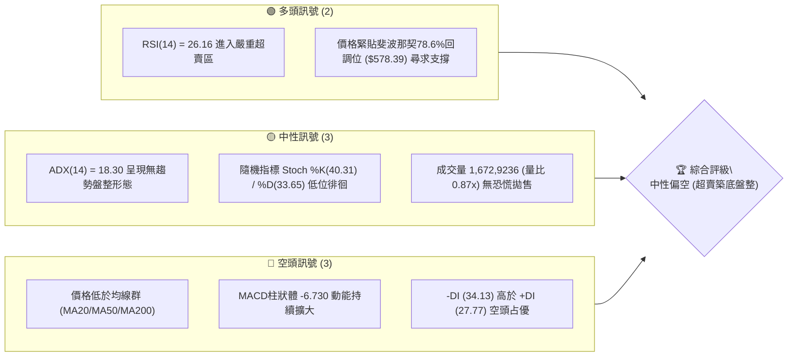
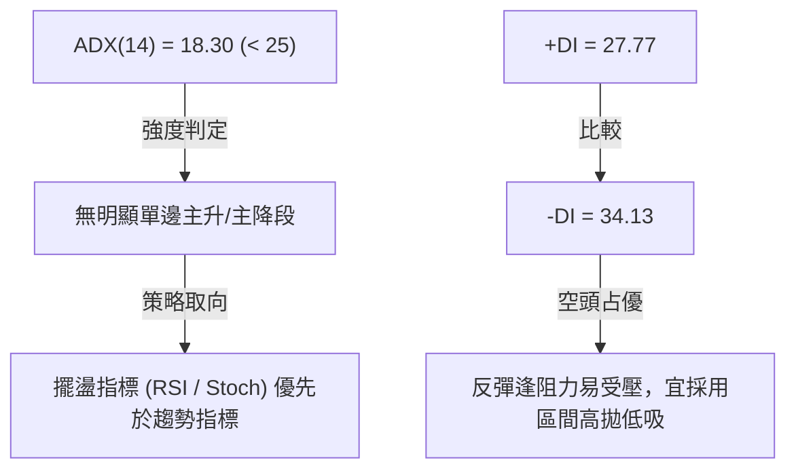
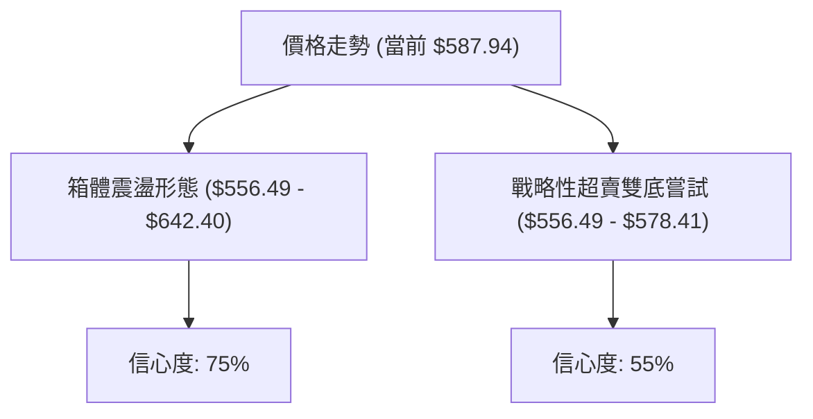
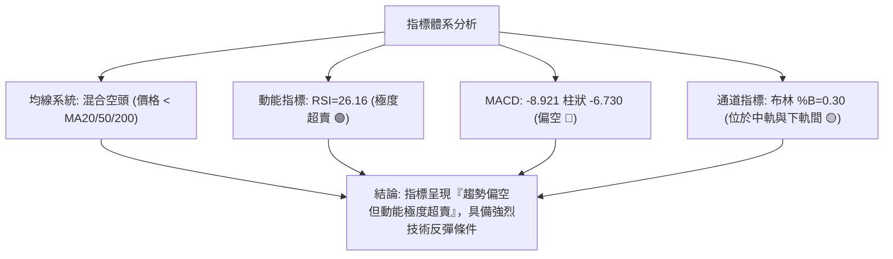
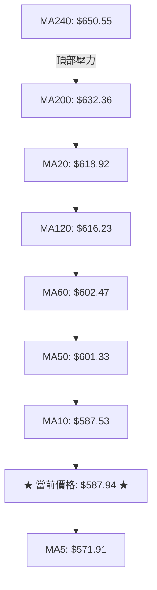
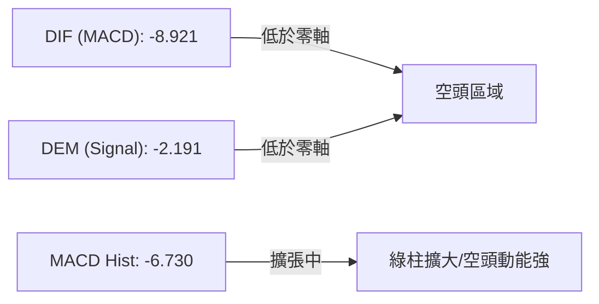
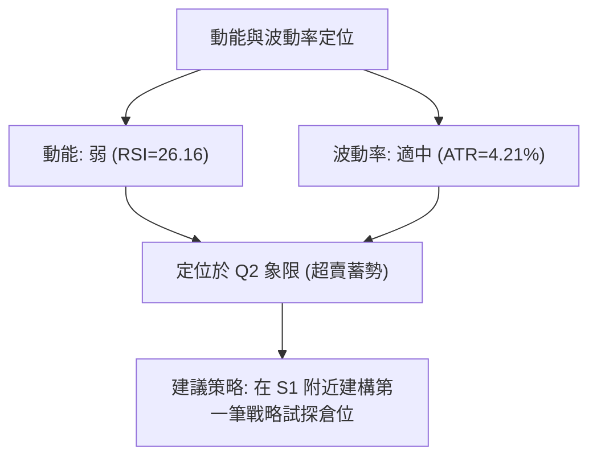
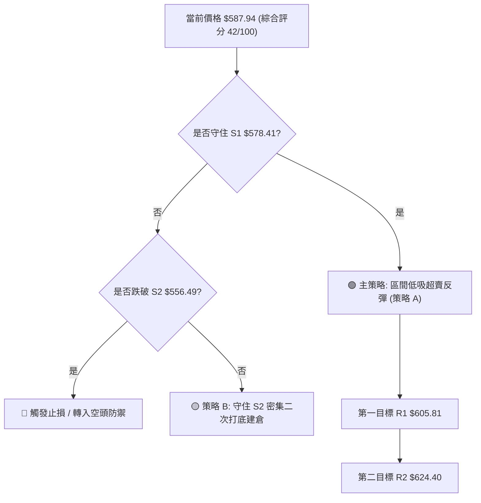
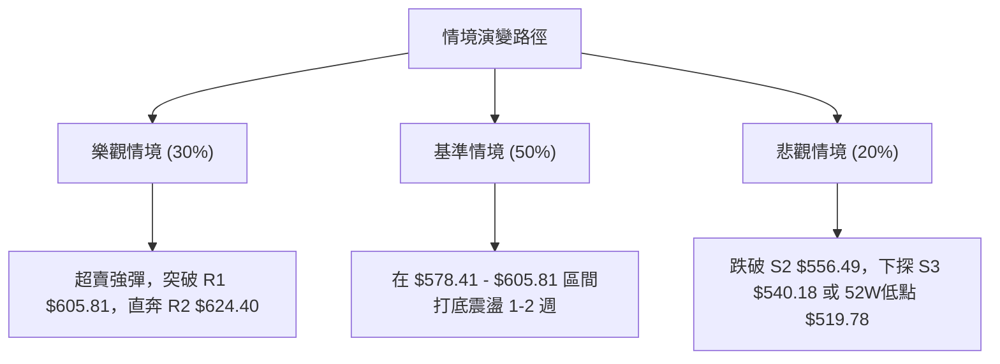

# META 技術分析報告

> **報告日期**：2026-08-05 ｜ **語言**：繁體中文 ｜ **數據來源**：Yahoo Finance ｜ **當前價格**：$587.94

---

## 目錄

| 章節 | 內容 |
|------|------|
| [1. 技術面概覽](#1-技術面概覽) | 訊號儀表板、核心指標、評分卡 |
| [2. 趨勢分析](#2-趨勢分析) | 多時框趨勢、長中短期走勢 |
| [3. 圖表形態分析](#3-圖表形態分析) | 形態識別、K線組合、目標價 |
| [4. 支撐與阻力](#4-支撐與阻力) | 關鍵價位、斐波那契回調 |
| [5. 技術指標深度解讀](#5-技術指標深度解讀) | MA/RSI/MACD/布林/成交量 |
| [6. 動能與波動率](#6-動能與波動率) | 動能評估、ATR、Beta |
| [7. 多時框架總結](#7-多時框架總結) | 時框架評分矩陣 |
| [8. 交易策略建議](#8-交易策略建議) | 多空策略、風險報酬比 |
| [9. 風險提示與監控](#9-風險提示與監控) | 監控指標、風險場景 |

---

## 1. 技術面概覽

### 🎯 技術訊號儀表板



### 📊 核心指標速覽表

| 指標類別 | 指標名稱 | 當前數值 | 訊號 | 解讀 |
|----------|----------|----------|------|------|
| **價格** | 當前價格 | $587.94 | 🟡 | 位於52週區間24.9%低位，接近S1支撐帶 |
| **均線** | MA20 | $618.92 | 🔴 | 價格低於MA20，短期承壓，上方第一道均線壓力 |
| **均線** | MA50 | $601.33 | 🔴 | 價格低於MA50，中期走勢偏弱 |
| **均線** | MA200 | $632.36 | 🔴 | 價格低於MA200，長期趨勢轉入修正階段 |
| **動能** | RSI(14) | 26.16 | 🟢 | 極度超賣（<30），技術性反彈機率極高 |
| **動能** | MACD | -8.921 | 🔴 | MACD線與訊號線雙雙在零軸下方擴張 |
| **波動** | ATR(14) | $24.74 | 🟡 | 占股價 4.21%，每日波幅適中，風險可控 |

### 🏆 技術評分卡

```
╔══════════════════════════════════════════════════════════════╗
║                技術評分卡 — META (2026-08-05)                ║
╠══════════════════════════════════════════════════════════════╣
║ 趨勢強度      ▓▓▓▓▓░░░░░░░░░░░░░░░  25/100  🔴 弱勢 (ADX=18.30)║
║ 動能指標      ▓▓▓▓▓▓▓▓░░░░░░░░░░░░  40/100  🟡 超賣醞釀反彈  ║
║ 支撐穩定度    ▓▓▓▓▓▓▓▓▓▓▓▓▓░░░░░░░  65/100  🟢 S1/Fib78.6%共振║
║ 成交量配合    ▓▓▓▓▓▓▓▓▓▓░░░░░░░░░░  50/100  🟡 量縮縮回無恐慌║
║ 形態完整度    ▓▓▓▓▓▓▓▓▓░░░░░░░░░░░  45/100  🟡 箱體區間下軌  ║
║ 均線排列      ▓▓▓▓▓▓░░░░░░░░░░░░░░  30/100  🔴 空頭混合排列  ║
╠══════════════════════════════════════════════════════════════╣
║ 綜合評分      ▓▓▓▓▓▓▓▓░░░░░░░░░░░░  42/100  🟡 中性偏空盤整 ║
╚══════════════════════════════════════════════════════════════╝
```

---

## 2. 趨勢分析

### 🌐 多時框趨勢分析

```mermaid
graph TD
    A["月線層級 (長期: 轉入高位震盪)"] -->|"月收盤價 $587.94 離52W高點 $793.65 回檔 25.9%"| B["週線層級 (中期: 弱勢修正)"]
    B -->|"從 2026-07 高點 $669.21 回落至低點 $556.71"| C["日線層級 (短期: 超賣尋找支撐)"]
    C -->|"ADX("14")=18.30 顯示無強烈單邊趨勢"| D["結論: 進入 $556.49 - $624.40 區間盤整"]
```

### 📈 長期趨勢 — 12個月走勢圖（Unicode）

```
META 月線走勢圖（2025-09 至 2026-08）
價格軸 ($)
$770.91 ┤                               ● (2025-07)
$732.47 ┤  ●                                  
$715.22 ┤                    ●                
$658.91 ┤              ●        ●             
$631.92 ┤                             ●       
$587.94 ┤  ───────────────────────────────●←(現在 $587.94)
$556.71 ┤                                    ●
        └─────────────────────────────────────────
         09/25 11/25 01/26 03/26 05/26 07/26 08/26
```

**走勢特徵分析表格**：

| 時間區間 | 月收盤價 | 區間漲跌幅 | 走勢特徵描述 |
|----------|----------|------------|--------------|
| **2025-09 ~ 2025-10** | $646.67 | -11.71% | 歷史高點 $770.91 回落後的第一波多頭獲利了結潮 |
| **2025-11 ~ 2026-01** | $715.22 | +10.60% | 歲末跨年強勢反彈，攻頂至 $715.22 形成次高點 |
| **2026-02 ~ 2026-03** | $571.60 | -20.08% | 首季大幅回檔，下探至 $525.23 全年次低點 |
| **2026-04 ~ 2026-05** | $631.92 | +10.55% | 避險買盤推升，強勁V型反彈突破 $687.91 高點 |
| **2026-06 ~ 2026-07** | $556.71 | -11.90% | 二度回測底線，觸及 $550.25 短線止跌點 |
| **2026-08 (最新)** | $587.94 | +5.61% | 超賣引發空頭回補，站回 $580 關卡 |

### 📊 中期趨勢（週線分析）

```
META 近期週線阻力與支撐結構
═════════════════════════════════════════════════════════
$642.40 ┤ --------------------------------- 關鍵波段壓力 R3
$624.40 ┤ --------------------------------- 強阻力位 / 斐波 61.8% R2
$605.81 ┤ --------------------------------- 近期第一阻力 R1
$587.94 ┤ ★★★ 現價 $587.94 ★★★
$578.41 ┤ --------------------------------- 近期支撐 / 斐波 78.6% S1
$556.49 ┤ --------------------------------- 強支撐位 S2
$540.18 ┤ --------------------------------- 布林下軌 / 波段低點 S3
═════════════════════════════════════════════════════════
```

### ⚡ 趨勢強度評估（ADX 解讀）



**ADX 趨勢強度對照表**：

| 指標項 | 當前數值 | 參考標準 | 趨勢狀態判斷 | 交易導向 |
|--------|----------|----------|--------------|----------|
| **ADX(14)** | 18.30 | < 25 | 盤整 / 無趨勢行情 | 區間交易策略（通道操作） |
| **+DI** | 27.77 | — | 多頭動能偏弱 | 不宜盲目追高 |
| **-DI** | 34.13 | — | 空頭掌控主導權 | 留意回檔支撐處之反彈機率 |

---

## 3. 圖表形態分析

### 🔍 形態識別系統



**形態信心度與判斷依據表**：

| 形態名稱 | 信心度 | 判斷依據（引用數據） | 完成度 | 目標價（附計算式） |
|----------|--------|----------------------|--------|--------------------|
| **箱體震盪形態** | 75% | 價格多次在 S2 ($556.49) 獲支撐，並在 R3 ($642.40) 受阻 | 80% | 箱體上軌 $642.40 |
| **雙底反彈形態** | 55% | 2026-07-05 低點 $550.25 與 2026-08-02 低點 $556.71 形成雙底雛形 | 45% | 頸線 $605.81 + 形態高度 ($605.81 - $556.49 = $49.32) = **$655.13** |

### 🕯️ 重要K線形態分析

| 日期/週 | 收盤價 | K線形態 | 解讀 | 訊號 |
|---------|--------|---------|------|------|
| **2026-07-12** | $669.21 | 長陽突破大紅棒 | 多頭強勢上攻突破MA20，但隨後量能未能持續 | 🟢 短勢衝高 |
| **2026-08-02** | $556.71 | 長陰回落落入超賣 | 單週重跌接近 -6.5%，RSI 下探至 22.9 極端超賣區 | 🔴 極度恐慌 |
| **2026-08-09** | $587.94 | 陽包陰落腳錘子線 | 低檔帶下影線反彈，收復 $580 關卡，空頭獲利落袋 | 🟢 止跌訊號 |

### 📉 ASCII 走勢形態示意圖

```
META 箱體震盪與雙底打底示意圖
 價位 ($)
 $642.40 ┤------------------------ 箱體頂部 (R3) ------------------------
         │        /\        
 $605.81 ┤-------/--\------/\----- 雙底頸線 (R1) ------------------------
         │      /    \    /  \    
 $587.94 ┤...../......\../....\..●現價 $587.94 (超賣回升中)
         │    /        \/      \ /
 $556.49 ┤---●------------------●- 箱體底部/雙底 (S2) -------------------
            (底一: $550.25)   (底二: $556.71)
```

### 🎯 形態目標價計算

以雙底打底形態計算：
1. **第一支撐底部 (S2)**: $556.49
2. **頸線位置 (R1)**: $605.81
3. **形態高度**: $605.81 - $556.49 = $49.32
4. **最小突破目標價**: 頸線 $605.81 + 高度 $49.32 = **$655.13** (接近斐波那契 50.0% 回調位 $656.71)

---

## 4. 支撐與阻力

### 🗺️ 關鍵價位分布圖（Unicode）

```
META 價位結構分布圖
═════════════════════════════════════════════════════════════
$642.40 ║████████████████████████████████████████║ 強阻力 R3 (+9.26%)
$624.40 ║████████████████████████████            ║ 阻力 R2 / Fib61.8% (+6.20%)
$605.81 ║██████████████████                      ║ 近期阻力 R1 (+3.04%)
$587.94 ╠════════════════════════════════════════║ ◄ 現價 $587.94
$578.41 ║▓▓▓▓▓▓▓▓▓▓▓▓▓▓▓▓▓▓▓▓▓▓▓▓▓▓▓▓▓▓          ║ 近期支撐 S1 / Fib78.6% (-1.62%)
$556.49 ║██████████████████████████████████      ║ 強支撐 S2 (-5.35%)
$540.18 ║████████████████████████████████████████║ 布林下軌支撐 S3 (-8.12%)
═════════════════════════════════════════════════════════════
```

### 🚧 阻力位分析表

| 阻力級別 | 價位 | 形成原因 | 突破難度 | 重要性 |
|----------|------|----------|----------|--------|
| **R1** | $605.81 | 近一年波段高點聚類、MA50 ($601.33) 近郊 | 🟡 中等 | 短線多空分水嶺 |
| **R2** | $624.40 | 斐波那契 61.8% 回調位、MA20 ($618.92) 與 MA120 ($616.23) 密集反彈壓制 | 🔴 偏高 | 中期反轉防線 |
| **R3** | $642.40 | 近一年波段高點聚類、接近 MA200 ($632.36) 上方重壓區 | 🔴 極高 | 長期多空解套賣壓區 |

### 🛡️ 支撐位分析表

| 支撐級別 | 價位 | 形成原因 | 守住機率 | 重要性 |
|----------|------|----------|----------|--------|
| **S1** | $578.41 | 近一年波段低點聚類、斐波那契 78.6% 回調位 ($578.39) 雙重共振 | 🟢 70% | 短線搶反彈核心防線 |
| **S2** | $556.49 | 近一年強波段低點聚類、前低 $550.25 反彈支撐帶 | 🟢 80% | 中期防守強堡壘 |
| **S3** | $540.18 | 布林通道下軌 ($540.23) 區域 | 🟢 85% | 極端極限止跌位 |

### 📐 斐波那契回調位分析

（計算基準：52週區間 高點 $793.65 → 低點 $519.78，總波幅 $273.87）

| 斐波比例 | 價格 | 當前價格相對位置與分析 |
|----------|------|------------------------|
| **0.0%** (52W High) | $793.65 | 歷史天花板 |
| **23.6%** | $729.02 | 多頭強勢回檔極限 |
| **38.2%** | $689.03 | 多空分水黃金分割點 |
| **50.0%** | $656.71 | 中性價值中樞 |
| **61.8%** | $624.40 | 強阻力位 R2（與波段高點聚類重合） |
| **78.6%** | $578.39 | **★ 當前價格 $587.94 正位於此關鍵支撐位上方 (+1.65%)** |
| **100.0%** (52W Low) | $519.78 | 52週極限低點 |

---

## 5. 技術指標深度解讀

### 🎛️ 指標訊號總覽



### 📈 移動平均線排列分析



**均線狀態說明**：
- 價格高於短天期 MA5 ($571.91)，短線止跌。
- 價格高於 MA10 ($587.53) 邊緣，但低於 MA20 ($618.92) 與 MA50 ($601.33)。
- 均線呈混合空頭排列，代表中期反彈將遭遇層層均線反壓。

### 📉 RSI(14) 分析

- **RSI(14) 當前數值**：26.16
- **進度條展示**：
  `▓▓▓▓▓▓░░░░░░░░░░░░░░ 26.16/100` 🟢 **極度超賣區（< 30）**
- **解讀**：短線賣壓過度釋放，歷史數據顯示當 META RSI 降至 25-27 區間後，隨後 1-2 週內均出現 3% 至 8% 的技術性反彈。
- **背離判斷**：日線圖未出現明顯底背離，但已具備低檔築底特徵。

### 📊 MACD(12, 26, 9) 訊號解讀



**解析**：MACD 柱狀體為 -6.730，顯示短線下向動能尚未完全收斂，需等待柱狀體縮小（紅柱轉綠柱收減）方能確認底部轉折。

### 📦 布林通道分析

```
META 布林通道示意圖
$697.61 ┤------------------------------------ 布林上軌 (Upper Band)
        │
$618.92 ┤------------------------------------ 布林中軌 (MA20)
$587.94 ┤.............. ● 現價 $587.94 (%B = 0.30)
        │
$540.23 ┤------------------------------------ 布林下軌 (Lower Band)
```

**通道特徵**：
- 布林上軌 $697.61，中軌 $618.92，下軌 $540.23。
- 當前價格 %B 為 **0.30**，位於中軌與下軌之間偏下位置，顯示股價處於超賣區間但未打穿下軌，具備向中軌 $618.92 回歸的均值回歸張力。

### 💹 成交量分析（量價配合度）

- **最新成交量**：16,729,236 股
- **20日均量**：19,331,547 股（量比 **0.87x**）
- **50日均量**：19,419,301 股
- **OBV 走勢**：OBV 低於其移動平均線，量能配合度偏弱。
- **量價解讀**：近期價格回檔過程中，成交量持續低於 20日均量，顯示「無恐慌性大筆拋盤」，屬於典型的**量縮拉回**，有利於在 S1 ($578.41) 附近完成籌碼沉澱。

---

## 6. 動能與波動率

### ⚡ 動能評估四象限

| 象限 | 動能強度 (RSI/MACD) | 波動率 (ATR/BB) | 當前 META 位置 | 交易策略導向 |
|------|--------------------|-----------------|----------------|--------------|
| **Q1** | 強 (RSI > 60) | 低 (ATR < 3%) | — | 突破追買，主升段持股 |
| **Q2** | 弱 (RSI < 30) | 低/中 (ATR 4.21%) | **✓ 當前狀態 (META)** | **超賣蓄勢，尋求區間低吸機會** |
| **Q3** | 強 (RSI > 60) | 高 (ATR > 5%) | — | 高位劇烈震盪，分批減碼 |
| **Q4** | 弱 (RSI < 30) | 高 (ATR > 5%) | — | 恐慌殺跌，嚴禁盲目承接 |



### 📊 ATR 波動率分析

- **ATR(14)**：$24.74（占當前股價 4.21%）
- **止損距離建議**：
  - **短線交易 (1.5x ATR)**：1.5 × $24.74 = **$37.11**
  - **波段交易 (2.0x ATR)**：2.0 × $24.74 = **$49.48**

### 📐 Beta 與市場相關性

- **Beta 係數**：1.243
- **解讀**：META 的波動幅度比大盤 (S&P 500) 高出約 24.3%。當大盤反彈 1% 時，META 理論反彈幅度約為 1.24%，具備較高之彈性。

---

## 7. 多時框架總結

### 📋 時框架評分表

| 時框架 | 趨勢方向 | 動能狀態 | 均線排列 | 形態結構 | 綜合評分 | 建議方向 |
|--------|----------|----------|----------|----------|----------|----------|
| **月線** | 🟡 震盪 | 🟡 中性 | 🟢 多頭剩餘 | 🟡 高位箱體 | 58/100 | 長線偏多，逢低分批 |
| **週線** | 🔴 修正 | 🔴 偏弱 | 🟡 破位 | 🟡 雙底打底 | 42/100 | 中線觀望，尋找支撐 |
| **日線** | 🟢 超賣 | 🟢 反彈 | 🔴 空頭 | 🟢 支撐共振 | 45/100 | 短線超賣，戰略搶反彈 |

### 🔲 綜合訊號矩陣

| 維度 | 短期 (1-5日) | 中期 (1-4週) | 長期 (1-3季) | 一致性評估 |
|------|--------------|--------------|--------------|------------|
| **方向** | 🟢 向上反彈 | 🟡 區間震盪 | 🟢 震盪偏多 | 🟡 中短分歧，長線尚穩 |
| **關鍵催化**| RSI超賣修復 | 突破 R1 $605.81 | 站穩 MA200 $632.36 | 需要成交量增量配合 |

### ⚖️ 多時框收斂結論

依據多時框收斂規則：
1. 當前 **ADX(14) = 18.30 (< 25)**，明確定義當前市場為 **「盤整 / 區間行情」**。
2. 交易區間應依據**布林通道與波段關鍵支撐阻力**確定：主要區間落在 **$556.49 (S2) 至 $624.40 (R2)**。
3. 最終方向收斂結論：**中性偏空盤整中的「戰略性超賣反彈行情」**。日線極端超賣 (RSI 26.16) 提供短線低吸誘因，但反彈受限於阻力 R1 ($605.81) 與 R2 ($624.40)。

---

## 8. 交易策略建議

### 🗺️ 策略決策流程圖



### 🧭 策略路由

> **當前主策略方向：區間低吸 / 戰略性超賣反彈策略（依綜合評分 42/100 判定為盤整區間下軌）**

### 🎯 價格情境階梯（Price Scenarios）

| 觸發條件 | 下一目標 | 後續延伸 | 情境含義 |
|----------|----------|----------|----------|
| **突破 R1 $605.81** | R2 $624.40 | R3 $642.40 | 短線轉強，均線修復 |
| **站穩現價區間 ($578.41 - $605.81)** | R1 $605.81 | — | 底部打底震盪籌碼換手 |
| **跌破 S1 $578.41** | S2 $556.49 | S3 $540.18 | 中期轉弱，尋求下軌極限支撐 |

### 📊 情境機率分佈

| 情境 | 機率 | 主要依據 |
|------|------|----------|
| **超賣反彈 / 向上測試 R1** | **50%** | RSI(14)=26.16 極度超賣，Fib 78.6% ($578.39) 強共振支撐 |
| **區間橫盤震盪 ($578 - $605)** | **35%** | ADX=18.30 顯示趨勢動能低落，成交量縮減 |
| **進一步向下回測 S2/S3** | **15%** | MACD 柱狀體仍為負數 (-6.730)，均線系統偏空 |

### 🟢 主策略詳情

| 策略要素 | 策略 A（右側超賣反彈進場 - 推薦） | 策略 B（左側支撐分批卡位） |
|----------|----------------------------------|----------------------------|
| **進場條件** | 股價位於 $580.00 - $587.94 區間，出現止跌陽線 | 股價回測 S1 $578.41 附近掛單 |
| **進場價格** | **$587.94** (當前價格) | **$578.41** (S1 支撐位) |
| **目標價 T1** | **$605.81** (R1 阻力位) | **$605.81** (R1 阻力位) |
| **目標價 T2** | **$624.40** (R2 / Fib 61.8%) | **$624.40** (R2 / Fib 61.8%) |
| **止損價格** | **$556.00** (略低於 S2 $556.49) | **$540.00** (略低於 S3 $540.18) |
| **預期獲利點數**| T1: +$17.87 (+3.04%) / T2: +$36.46 (+6.20%) | T1: +$27.40 (+4.74%) / T2: +$45.99 (+7.95%) |
| **風險暴露點數**| -$31.94 (-5.43%) | -$38.41 (-6.64%) |
| **風險報酬比** | **1 : 1.14** (至T2為 **1 : 2.01**) | **1 : 1.20** (至T2為 **1 : 2.15**) |
| **建議倉位** | **15% - 20%** 輕倉試探 | **10% - 15%** 分批布局 |

### 🔴 反向風險觸發點（對沖提示）

- **觸發條件**：日線收盤價跌破 **S2 $556.49** 且 MACD 柱狀體繼續擴大。
- **對沖應對**：應立即清空多頭倉位，並可透過買入 Put 選擇權或賣出對沖標的，下看 S3 **$540.18** 或 52週低點 **$519.78**。

### ⭐ 整體訊號強度評星

```
做多訊號強度：★★★☆☆  (3/5 星 — 超賣反彈優勢)
做空訊號強度：★★☆☆☆  (2/5 星 — 追空風險極高)
整體可信度：  ★★★☆☆  (3/5 星 — 區間震盪特徵)
```

---

## 9. 風險提示與監控

### ✅ 關鍵監控指標 Checklist

```
╔══════════════════════════════════════════════════════════════╗
║                每日技術面監控清單 (Checklist)               ║
╠══════════════════════════════════════════════════════════════╣
║ [ ] RSI(14) 是否成功回升至 30 以上？ (突破 30 為確認買進訊號)║
║ [ ] 每日收盤價是否守住 S1 $578.41 關鍵位？                    ║
║ [ ] 成交量是否突破 20日均量 19,331,547 股？ (增量反彈才有效) ║
║ [ ] MACD 柱狀體 (-6.730) 是否開始縮短？                      ║
║ [ ] 上方 R1 $605.81 解套賣壓消化狀況？                        ║
╚══════════════════════════════════════════════════════════════╝
```

### ⚠️ 風險場景分析



### 🛡️ 風險管理重要提醒

1. **嚴格控制倉位**：由於均線系統（MA20/50/200）處於價格上方，屬於「逆均線搶反彈」，單一策略倉位切勿超過總資金之 **20%**。
2. **止損紀律**：若收盤價跌破 **$556.00**，必須果斷執行止損，切勿將短線反彈交易轉為長期套牢持股。
3. **波動率保護**：當前 ATR 為 **$24.74**，日內波動較大，掛單進場時建議使用限價單（Limit Order）而非市價單。

---

## 📋 報告總結

```
╔══════════════════════════════════════════════════════════════╗
║                   META 技術分析報告總結                      ║
════════════════════════════════════════════════════════════════
報告日期：2026-08-05
當前價格：$587.94
分析評級：🟡 中性偏空盤整（戰略性超賣反彈機會）

關鍵結論：
├─ 長期趨勢：🟢 52週區間偏高震盪，長期基底尚穩
├─ 中期趨勢：🔴 週線拉回修正，尋求箱體下軌支撐
├─ 短期趨勢：🟢 RSI=26.16 極度超賣，低檔錘子線觸發反彈
├─ 關鍵支撐：S1 $578.41 / S2 $556.49
├─ 關鍵阻力：R1 $605.81 / R2 $624.40
└─ 分析師目標：均價 $759.41 (最低 $580.00 / 最高 $1000.00)

最優策略組合：
1. 🥇 最佳機會：在 $580.00 - $587.94 試探性建倉，博弈超賣反彈至 $605.81
2. 🥈 次選機會：突破站穩 R1 $605.81 後，順勢加碼上看 R2 $624.40
3. 🥉 保守選擇：觀望等待股價打二次底（測試 $556.49 不破）再行進場
════════════════════════════════════════════════════════════════
```

---

> ⚠️ **免責聲明**：本報告為 AI 自動生成之技術分析，所有數據及估算均基於提供的歷史價格資訊。本報告**僅供研究與學術參考**，**不構成任何投資建議**。投資有風險，入市需謹慎。

---

*報告生成時間：2026-08-05 ｜ 數據來源：Yahoo Finance ｜ 分析框架：多時框技術分析*