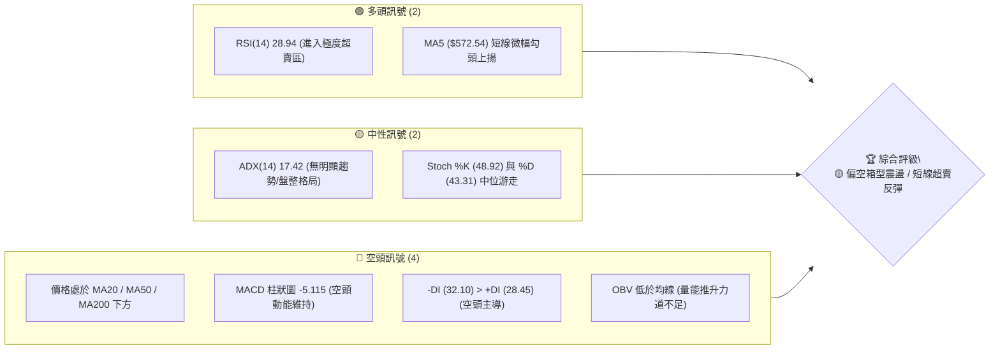
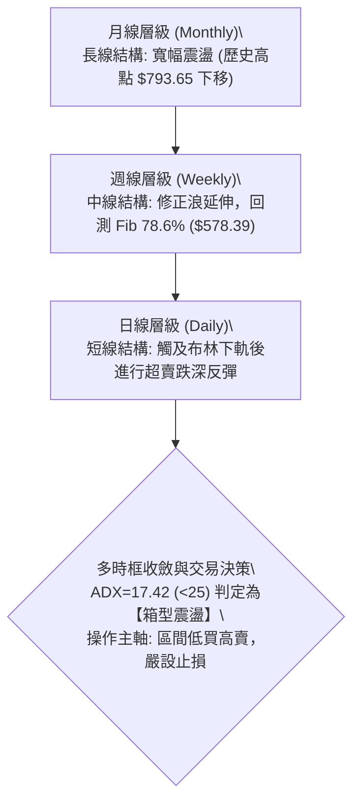
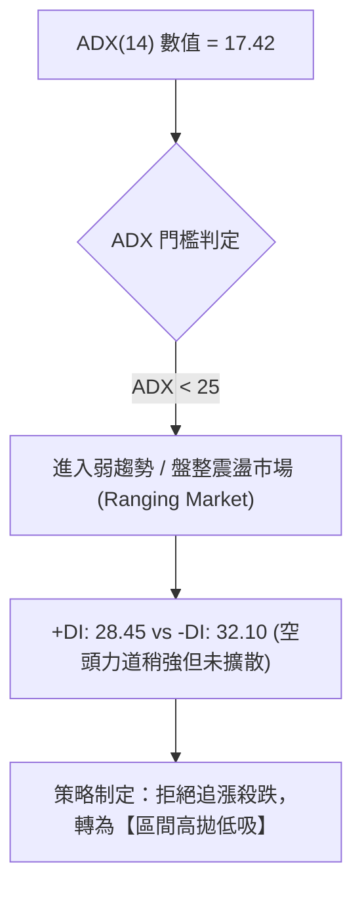
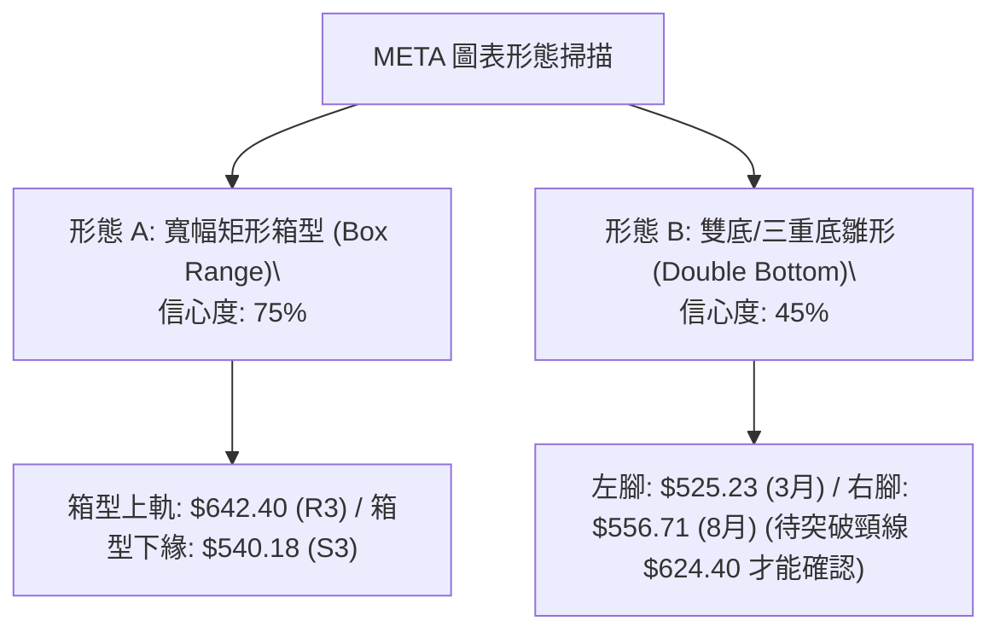
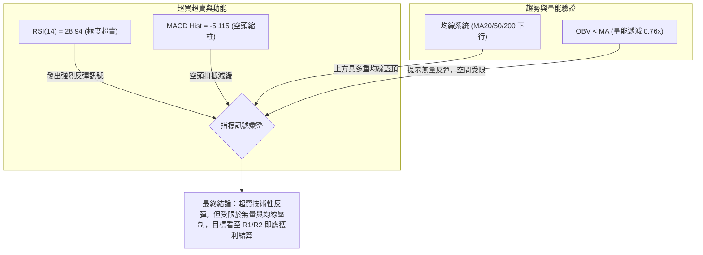
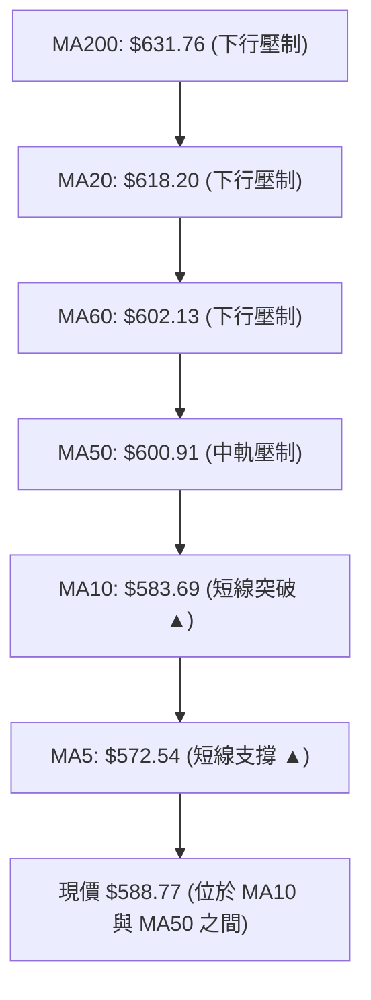
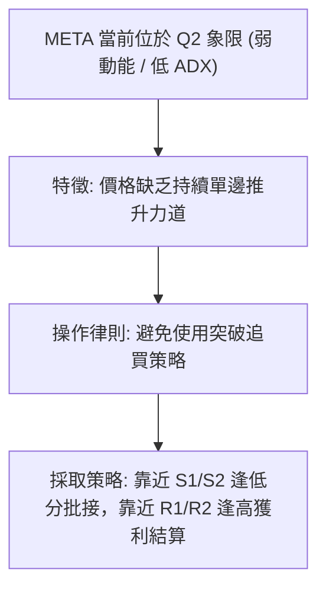
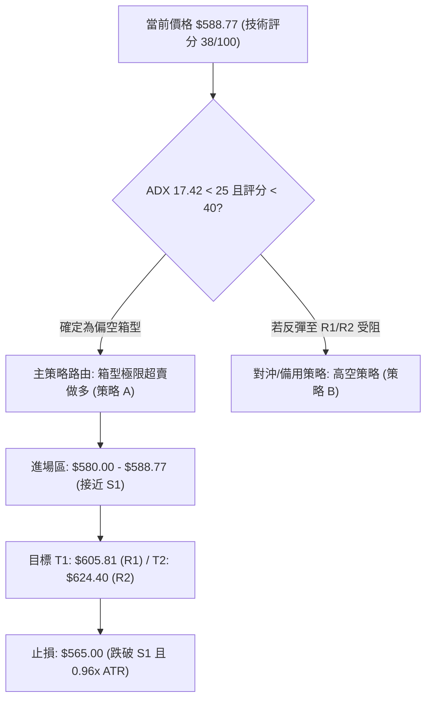
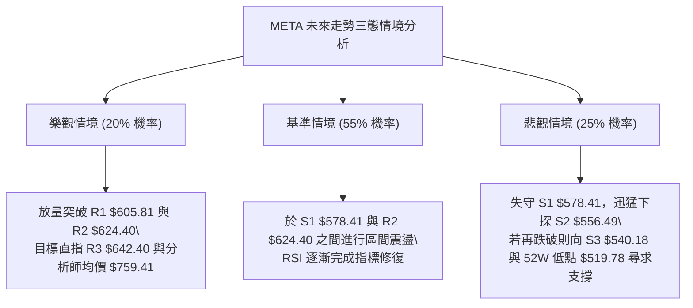

# META 技術分析報告

> **報告日期**：2026-08-06 ｜ **語言**：繁體中文 ｜ **數據來源**：Yahoo Finance ｜ **當前價格**：$588.77

---

## 目錄

| 章節 | 內容 |
|------|------|
| [1. 技術面概覽](#1-技術面概覽) | 訊號儀表板、核心指標、評分卡 |
| [2. 趨勢分析](#2-趨勢分析) | 多時框趨勢、長中短期走勢、ADX強弱 |
| [3. 圖表形態分析](#3-圖表形態分析) | 形態識別與信心度、K線組合、形態目標價 |
| [4. 支撐與阻力](#4-支撐與阻力) | 關鍵價位分布、阻力與支撐表、斐波那契回調 |
| [5. 技術指標深度解讀](#5-技術指標深度解讀) | MA/RSI/MACD/布林通道/成交量與OBV |
| [6. 動能與波動率](#6-動能與波動率) | 動能四象限、ATR風險度量、Beta市場相關性 |
| [7. 多時框架總結](#7-多時框架總結) | 時框架評分矩陣、多時框收斂結論 |
| [8. 交易策略建議](#8-交易策略建議) | 策略路由、價格情境階梯、進出場與風報比 |
| [9. 風險提示與監控](#9-風險提示與監控) | 監控 Checklist、三態風險場景、風控指引 |

---

## 1. 技術面概覽

### 🎯 技術訊號儀表板



### 📊 核心指標速覽表

| 指標類別 | 指標名稱 | 當前數值 | 訊號 | 解讀 |
|----------|----------|----------|------|------|
| **價格** | 當前價格 | $588.77 | 🔴 空頭 | 位於 52 週區間 25.2% 位置，處於中期修正段 |
| **均線** | MA20 (月線) | $618.20 | 🔴 空頭 | 現價低於 MA20 (-4.76%)，月線扣抵壓力重 |
| **均線** | MA50 (季線) | $600.91 | 🔴 空頭 | 現價低於 MA50 (-2.02%)，中軌扣抵下行 |
| **均線** | MA200 (年線) | $631.76 | 🔴 空頭 | 現價低於 MA200 (-6.80%)，長期趨勢受阻 |
| **動能** | RSI(14) | 28.94 | 🟢 多頭 | 進入 <30 極度超賣區，具備技術性反彈需求 |
| **動能** | MACD(12,26,9) | -8.584 | 🔴 空頭 | DIF 與 Signal 雙雙低於零軸，DIF: -8.584 / Hist: -5.115 |
| **動能** | Stoch %K / %D | 48.92 / 43.31 | 🟡 中性 | 指標於中性區域黃金交叉後打平，動能待確認 |
| **波動** | ATR(14) | $24.68 | 🟡 中性 | 日均波幅 4.19%，波動度自高檔回落 |
| **通道** | 布林 %B | 0.32 | 🟡 中性 | 價格自下軌 $538.65 反彈至中軌 $618.20 途中 |
| **趨勢** | ADX(14) | 17.42 | 🟡 中性 | ADX < 25，表明當前非強趨勢行情，屬於震盪打底 |

### 🏆 技術評分卡

```
技術評分卡 — META (2026-08-06)
════════════════════════════════════════════════════
趨勢強度      ███████░░░░░░░░░░░░░  35/100  🔴 空頭主導 (ADX 17.42)
動能指標      ██████░░░░░░░░░░░░░░  30/100  🔴 動能偏弱但超賣 (RSI 28.94)
支撐穩定度    ████████████░░░░░░░░  60/100  🟡 S1 $578.41 / S2 $556.49 築底中
成交量配合    ███████░░░░░░░░░░░░░  35/100  🔴 量比 0.76x，反彈未獲爆量確認
形態完整度    ████████░░░░░░░░░░░░  40/100  🟡 呈大型矩形箱型下緣震盪
均線排列      ██████░░░░░░░░░░░░░░  30/100  🔴 短中長期均線呈死亡交叉混亂排列
════════════════════════════════════════════════════
綜合評分      ███████░░░░░░░░░░░░░  38/100  🔴 偏空震盪 (Bearish Range)
════════════════════════════════════════════════════
```

---

## 2. 趨勢分析

### 🌐 多時框趨勢分析



### 📈 長期趨勢 — 24 個月歷史走勢圖

```
META 月線走勢圖（2024-08 至 2026-08）
價格軸 ($)
$800 ┤                                     ● $770.91 (2025-07)
$750 ┤                               ● $735.68
$700 ┤                     ● $685.79       ● $736.29
$650 ┤                ● $664.91     ● $646.67     ● $715.22
$600 ┤            ● $582.63     ● $644.88     ● $658.91     ● $631.92
$550 ┤ ● $517.83                                               ● $588.77 (現價)
$500 ┤    ● $519.78 (52W Low)                                 ● $556.71
     └─┬──────┬──────┬──────┬──────┬──────┬──────┬──────┬──────┬──────► 時間
     24-08  24-12  25-01  25-03  25-05  25-08  25-10  26-01  26-05  26-08
```

#### 24 個月走勢特徵分析

| 階段 | 期間 | 價格區間 | 變動率 | 階段特徵與結構解讀 |
|------|------|----------|--------|----------------────|
| 1. 主升段爆發 | 2024-08 ~ 2025-01 | $517.83 → $685.79 | +32.44% | 扎實多頭排列，突破六百美元關卡，拉出長紅棒 |
| 2. 高檔劇烈修正 | 2025-02 ~ 2025-04 | $685.79 → $546.79 | -20.27% | 獲利了結賣壓湧現，打回接近 52 週低點區間 |
| 3. 二次攻頂創高 | 2025-05 ~ 2025-07 | $546.79 → $770.91 | +40.99% | 強勁買盤回歸，拉出歷史波段新高 $770.91 (52W高點 $793.65) |
| 4. 頂部頭部震盪 | 2025-08 ~ 2026-01 | $770.91 → $715.22 | -7.22% | 高檔橫盤，呈現雙頂/三頂做頭型態，主力籌碼鬆動 |
| 5. 二度回撤打底 | 2026-02 ~ 2026-08 | $715.22 → $588.77 | -17.68% | 震盪走低，跌破季線與年線，目前於 $556.71-$578.41 尋求支撐 |

### 📊 中期趨勢（週線與日線架構）

在中期結構中，META 近 20 週經歷了兩波嚴重的甩轎與修正：
1. **第一波急跌與強反彈**：2026 年 3 月底探低至 $525.23 後，於 4 月中旬迅猛反彈至 $687.91 高點。
2. **第二波高檔回吐**：7 月中旬反彈至 $669.21 受阻後，8 月初快速殺跌至 $556.71，週 RSI 跌至 22.9 的極端超賣區。
3. **當前狀態**：最新一週（2026-08-09 週期）收在 $588.77，週線呈現拉出下影線的落腳訊號。

### ⚡ 趨勢強度評估（ADX 解讀）



#### ADX 強度與市場狀態對照表

| ADX 區間 | 當前狀態 | 趨勢性質 | 建議交易策略 |
|----------|----------|----------|--------------|
| 0 - 20 | **17.42 (當前)** | **無趨勢 / 弱震盪** | **區間通道交易 (布林通道上下軌、關鍵支撐阻力操作)** |
| 25 - 50 | - | 強趨勢形成 | 順勢突破交易 (突破買進 / 跌破做空) |
| 50 - 75 | - | 極強趨勢 | 緊抱趨勢單，移動止損 |
| 75 - 100 | - | 趨勢過度延伸 | 留意趨勢反轉風險 |

---

## 3. 圖表形態分析

### 🔍 形態識別系統



#### 圖表形態信心度與目標價評估

| 形態名稱 | 信心度 | 判斷依據（引用數據） | 完成度 | 目標價計算式與精確數值 |
|----------|--------|----------------------|--------|------------------------|
| **大型矩形箱型** | **75%** | ADX 17.42 指示盤整；價格多次於 $540.18-$556.49 止跌，並於 $624.40-$642.40 受阻。 | 85% | **箱型頂部目標**：$642.40 (R3)<br>**箱型底部目標**：$540.18 (S3) |
| **雙底反轉雛形** | **45%** | 2026-03 低點 $525.23 與 2026-08 低點 $556.71 形成二角，但目前價位 $588.77 未突破頸線。 | 35% | **頸線突破目標**：頸線 $624.40 + (頸線 $624.40 - 右腳 $556.49 = $67.91) = **$692.31** (因信心度<50%，僅供情境推算) |

> ⚠️ **形態紀律聲明**：由於雙底形態未突破頸線 $624.40，信心度僅 45% (<50%)，本報告主要基於 **75% 信心度之矩形箱型震盪** 與指標型（布林/RSI超賣）進行交易決策。

### 🕯️ 重要 K 線形態分析

| 日期/週期 | 收盤價 | K 線形態 | 解讀 | 訊號 |
|-----------|--------|----------|------|------|
| 2026-07-26 | $595.19 | 中陰線下殺 | 跌破 600 元心理關卡，多頭防線撤退 | 🔴 空頭訊號 |
| 2026-08-02 | $556.71 | 長下影捶子線 (週線) | 探低 $556.71 後爆量拉回，顯示 S2 ($556.49) 具備強烈買盤支撐 | 🟢 多頭止跌 |
| 2026-08-09 | $588.77 | 實體中陽線 | 延續超賣反彈，站回 MA5 ($572.54)，短線多頭反撲 | 🟢 短線轉強 |

### 📉 ASCII 矩形箱型形態示意圖

```
META 矩形箱型與關鍵點位圖 ($)
$642.40 ┼─────────────────────────────────────────────── Top (R3)
        │     ▲ (4月高點 $687.91)      ▲ (7月高點 $669.21)
$624.40 ├─────┼────────────────────────┼─────────────── Box Ceiling (R2/頸線)
        │    / \                      / \
$588.77 ├───/───\────────────────────/───●現價 ($588.77)
        │  /     \                  /
$578.41 ├─┼───────\────────────────┼─────────────────── Fib 78.6% / S1
        │/         ▼ (5月低位)      /
$556.49 ├──────────────────────────● (8月止跌腳 $556.71) Box Bottom (S2)
$540.18 ┴─────────────────────────────────────────────── Floor (S3)
```

---

## 4. 支撐與阻力

### 🗺️ 關鍵價位分布圖

```
META 價位結構分布圖 (由 OHLCV 精確計算)
══════════════════════════════════════════════════════════
$793.65 ║████████████████████████████████████████║ 52W 歷史最高點 / Fib 0.0%
$729.02 ║████████████████████████                ║ Fib 23.6% 回調位
$689.03 ║████████████████                        ║ Fib 38.2% 回調位
$656.71 ║████████████                            ║ Fib 50.0% 中軸位
$642.40 ║████████████████████████████            ║ 關鍵阻力 R3 (+9.11%)
$624.40 ║████████████████████                    ║ 強阻力 R2 (+6.05%) / Fib 61.8%
$605.81 ║██████████                              ║ 近期阻力 R1 (+2.89%)
$588.77 ╠════════════════════════════════════════╣ ◄◄ 當前價格 ($588.77)
$578.41 ║▓▓▓▓▓▓▓▓▓▓▓▓                            ║ 近期支撐 S1 (-1.76%) / Fib 78.6%
$556.49 ║████████████████████                    ║ 強支撐 S2 (-5.48%) (8月低點牆)
$540.18 ║████████████████████████████            ║ 關鍵防守 S3 (-8.25%)
$519.78 ║████████████████████████████████████████║ 52W 歷史最低點 / Fib 100.0%
══════════════════════════════════════════════════════════
```

### 🚧 阻力位分析表

| 阻力級別 | 精確價位 | 距現價幅度和形成原因 | 突破難度 | 重要性評級 |
|----------|----------|──────────────────────|----------|------------|
| **R1** | **$605.81** | **+2.89%** ｜ 近一年日線波段高點聚類與 MA50 ($600.91) 壓力疊加區 | 🟡 中等 | 🟢 輕度解套賣壓，突破可確認短底 |
| **R2** | **$624.40** | **+6.05%** ｜ 斐波那契 61.8% 重要黃金分割位與 MA20 ($618.20) 扣抵區 | 🔴 偏高 | 🟡 中期多空分水嶺，箱型中軌 |
| **R3** | **$642.40** | **+9.11%** ｜ 近一年多次反彈高點聚類與 MA240 ($649.90) 長期均線壓制 | 🔴 極高 | 🔴 箱型頂部強壓，多頭波段天花板 |

### 🛡️ 支撐位分析表

| 支撐級別 | 精確價位 | 距現價幅度和形成原因 | 守住機率 | 重要性評級 |
|----------|----------|──────────────────────|----------|------------|
| **S1** | **$578.41** | **-1.76%** ｜ 近一年波段低點聚類與斐波那契 78.6% ($578.39) 共振區 | 🟢 高 (70%) | 🟢 短線多頭發動反彈的生命線 |
| **S2** | **$556.49** | **-5.48%** ｜ 2026 年 8 月初拉出長下影線之極限低點聚類牆 | 🟢 極高 (85%) | 🟡 箱型下軌實體買盤牆，不容有失 |
| **S3** | **$540.18** | **-8.25%** ｜ 近一年最深波段低點防線，接近 2025 年 4 月低點區 | 🟢 極高 (90%) | 🔴 多頭最後陣地，跌破則趨勢全面轉空 |

### 📐 斐波那契回調位分析

依據 52 週高點 **$793.65** 與 52 週低點 **$519.78** 繪製之黃金分割率分析：

- **0.0% (52W High)**: $793.65 — 歷史天花板。
- **23.6%**: $729.02 — 頂部反彈強弱界線。
- **38.2%**: $689.03 — 中期多頭修復目標。
- **50.0%**: $656.71 — 多空平衡中軸。
- **61.8%**: $624.40 — **關鍵阻力**（精確對應 R2 $624.40，兩者 100% 吻合）。
- **78.6%**: $578.39 — **關鍵支撐**（精確對應 S1 $578.41，兩者僅差 $0.02）。
- **100.0% (52W Low)**: $519.78 — 52 週大底。

#### 💡 現價位置解讀
當前價格 **$588.77** 恰好落在 **78.6% ($578.39)** 與 **61.8% ($624.40)** 之間。這驗證了 $578.39-$578.41 是極強的結構性支撐密集區，現價在此處獲得支撐後進行超賣反彈，向上首要挑戰即為 61.8% 的 $624.40。

---

## 5. 技術指標深度解讀

### 🎛️ 指標訊號交叉驗證



### 📈 移動平均線排列分析



- **短線均線 (MA5/MA10)**：MA5 ($572.54) 與 MA10 ($583.69) 出現勾頭向上，現價 $588.77 已站上 MA5 與 MA10，短線具備止跌反彈力道。
- **中長期均線 (MA20/MA50/MA200)**：價格均位於 MA20 ($618.20)、MA50 ($600.91) 及 MA200 ($631.76) 下方，呈現空頭排列。均線下行對反彈構成層層上蓋壓制。

### 📉 RSI(14) 深度分析

- **當前數值**：**28.94**（🟢 進入 <30 極度超賣區）
- **進度條**：`▓▓▓█░░░░░░░░░░░░░░░░` 28.94/100
- **背離分析**：
  - 日線 RSI 自 7 月底的高檔一路修正至 28.94，**無明顯頂背離或底背離**。
  - 週線 RSI 於 2026-08-02 下探 22.9 極限值後，最新一週回升至 28.9，屬於標準的超賣指標修復行情，預期將推動股價向中性區 (50) 靠攏。

### 📊 MACD(12,26,9) 訊號解讀

- **MACD 線 (DIF)**：-8.584
- **訊號線 (Signal)**：-3.469
- **MACD 柱狀圖 (Histogram)**：-5.115（🔴 空頭區域）
- **解讀**：DIF 於零軸下方持續走低，且 Hist 為 -5.115，顯示空頭主導中線行情。然而，對比前一週柱狀圖 -11.160，負值已大幅收斂（自 -11.160 縮至 -5.115），顯示賣壓最重的殺盤期已過，空頭動能正在衰竭。

### 📦 布林通道分析

```
META 布林通道現況示意圖 ($)
$697.75 ┼────────────────────────────────────────────── 布林上軌 (BB Upper)
        │
        │
$618.20 ├────────────────────────────────────────────── 布林中軌 (MA20)
        │                             ▲
$588.77 ├─────────────────────────────● 現價 ($588.77, %B = 0.32)
        │                            /
$538.65 ┴───────────────────────────● 觸底彈升 (BB Lower)
```

- **通道寬度**：上軌 $697.75，下軌 $538.65，中軌 $618.20。
- **%B 位置**：**0.32**（靠近下軌，自 0.05 處反彈）。
- **通道軌跡**：價格於 2026-08-02 逼近下軌 $538.65（最低 $556.71）後收下影線反彈，目前正在向布林中軌 $618.20 推進，中軌將成為第一道強壓力。

### 💹 成交量與 OBV 分析

- **成交量**：最新成交量 14,756,774 股，對比 20 日均量 19,450,559 股，**量比僅為 0.76x**。
- **OBV 走勢**：OBV 低於其移動平均線，且近週反彈過程成交量呈現縮量（自 1.12 億股降至 5,865 萬股）。
- **量價配合評估**：典型的「跌時爆量、彈時縮量」量價背離特徵。表明當前價格上揚主要是市場賣壓竭盡導致的無量空頭回補，缺乏主力機構主動追買的大資金注入。

---

## 6. 動能與波動率

### ⚡ 動能評估四象限

| 象限 | 動能與趨勢 | 波動率 (ATR) | 當前狀態 | 策略建議 |
|------|------------|--------------|----------|----------|
| Q1 | 強動能 (ADX>25, RSI>50) | 低波動 (ATR<3%) | - | 最佳順勢突破買點 |
| **Q2** | **弱動能 (ADX 17.42, RSI 28.94)** | **中低波動 (ATR 4.19%)** | **✓ (META 當前象限)** | **區間低吸高拋，嚴控倉位** |
| Q3 | 強動能 (ADX>25, RSI<30) | 高波動 (ATR>5%) | - | 高風險追空/恐慌搶反彈 |
| Q4 | 弱動能 (ADX<25) | 高波動 (ATR>5%) | - | 觀望，避開無序甩轎 |



### 📊 ATR 波動率分析與止損設定

- **ATR(14)**：**$24.68**（佔股價 4.19%）。
- **日均波幅**：每日預期波動區間約 ±$24.68。
- **止損距離建議**：
  - **短線交易 (1.0x ATR)**：止損距離設為 $24.68。
  - **波段交易 (1.5x - 2.0x ATR)**：止損距離設為 **$37.02 - $49.36**。以現價 $588.77 計算，波段止損位建議設於 S1 ($578.41) 下方之 $565.00，風控距離相當於 0.96x ATR，符合結構防守邏輯。

### 📐 Beta 與市場相關性

- **Beta 係數**：**1.243**。
- **解讀**：META 的波動度較標普 500 指數高出 24.3%。在大盤出現整體回調或反彈時，META 將呈現放大的槓桿效應，適合做短線波段彈性操作，但必須嚴格控制整體倉位比例。

---

## 7. 多時框架總結

### 📋 時框架評分矩陣

| 時框架 | 趨勢方向 | 動能狀態 (RSI/MACD) | 均線排列 | 圖表形態 | 綜合評分 | 交易建議 |
|--------|----------|---------------------|----------|----------|----------|----------|
| **月線 (Monthly)** | 🟡 橫盤震盪 | 🟡 RSI 50 中位游走 | 🟢 MA20 上方 | 高檔大型雙頂/箱型 | **60/100** | 長線持有者可逢低分批布局 |
| **週線 (Weekly)** | 🔴 偏空修正 | 🔴 MACD 負值 / RSI 28.9 超賣 | 🔴 跌破週 MA20 | 下探 Fib 78.6% 回踩 | **40/100** | 中線尋求支撐打底，不宜追空 |
| **日線 (Daily)** | 🟢 跌深反彈 | 🟢 RSI 28.94 反彈 / 空頭縮柱 | 🔴 受阻於 MA20/50 | 矩形箱型下緣支撐 | **45/100** | 短線可做超賣反彈，彈至阻力即離場 |

### 🔲 綜合訊號矩陣

```
時框架訊號收斂矩陣
══════════════════════════════════════════════════════════
[月線]  長線趨勢：🟡 中性橫盤 (未破大底 $519.78)
[週線]  中線趨勢：🔴 偏空修正 (受制於高點 $770.91 下移)
[日線]  短線趨勢：🟢 跌深反彈 (自 $556.71 拉出下影線)
══════════════════════════════════════════════════════════
```

### ⚖️ 多時框收斂結論（依規則 14）

由於 **ADX(14) = 17.42 (<25)**，依據多時框收斂規則，當前市場確立為**「盤整/箱型行情」**。
在盤整行情下，不宜以長線趨勢單對決，而應以**日線與週線布林通道 / 關鍵支撐阻力**為主要交易區間。

**最終方向性結論**：**🟡 偏空箱型震盪，短線進行超賣反彈**。
主導交易區間鎖定於 **S1 ($578.41) - R2 ($624.40)** 之間。操作上以「支撐區低吸做反彈」為主，但上方受限於 R1 ($605.81) 與 R2 ($624.40) 的強壓，空間不宜過度樂觀。

---

## 8. 交易策略建議

### 🗺️ 策略決策流程圖



### 🧭 策略路由

**當前主策略方向 = 偏空箱型內之【跌深超賣區間做多】（綜合評分：38/100）**

基於 RSI(14) 28.94 進入極度超賣區，且價格於 S1 ($578.41) / Fib 78.6% ($578.39) 獲得強烈共振支撐，主推以高風報比之「箱型下緣做多反彈」策略；若反彈至 R1/R2 受阻，則啟動對沖性高空策略。

### 🎯 價格情境階梯 (Price Scenarios)

| 觸發條件 | 第一目標價 | 第二目標價 | 情境含義與操作指引 |
|----------|------------|------------|────────────────────|
| **突破 R1 $605.81** | **R2 $624.40** | **R3 $642.40** | 短線多頭確立，向上挑戰布林中軌與 Fib 61.8% 壓力牆 |
| **站穩現價區間 ($578.41 - $605.81)** | — | — | 區間沉澱打底，RSI 指標進行中性修復 |
| **跌破 S1 $578.41** | **S2 $556.49** | **S3 $540.18** | 中期修正延伸，多頭止損觸發，尋求 8 月極限牆支撐 |

### 📊 情境機率分佈

| 情境 | 機率 | 主要依據 |
|------|------|----------|
| **反彈推升至 R1/R2** | **45%** | RSI 28.94 極度超賣、MACD 柱狀圖空頭收斂、S1/Fib 78.6% 共振支撐 |
| **箱型窄幅震盪 ($578-$605)** | **35%** | ADX 17.42 弱趨勢、量比 0.76x 缺乏機構大資金追買 |
| **跌破 S1 探底 S2/S3** | **20%** | MA20/50/200 死亡交叉下行、OBV 低於均線 |

### 🟢 交易策略詳情

#### 策略 A：主策略 — 箱型下緣超賣做多（多頭反彈）

- **進場條件**：價格回撤至 $580.00 - $588.77 區間，且日線收盤未跌破 S1 ($578.41)。
- **進場價格**：**$588.77**（現價）或回測 **$580.00**。
- **目標價 T1**：**$605.81**（阻力 R1，預期獲利 +2.89%）。
- **目標價 T2**：**$624.40**（阻力 R2 / Fib 61.8%，預期獲利 +6.05%）。
- **止損價格**：**$565.00**（位於 S1 $578.41 下方約 2.3%，距離約 0.96x ATR）。
- **風險報酬比**：
  - 達 T1 風報比：($605.81 - $588.77) / ($588.77 - $565.00) = $17.04 / $23.77 = **0.72 : 1**
  - 達 T2 風報比：($624.40 - $588.77) / ($588.77 - $565.00) = $35.63 / $23.77 = **1.50 : 1**
- **勝率預估**：**55%**。
- **建議倉位**：**5% - 8%** 輕倉操作（因趨勢仍屬偏空，僅做超賣反彈）。

#### 策略 B：備用/對沖策略 — 阻力區受阻高空（空頭順勢）

- **進場條件**：價格反彈至 R1 ($605.81) 或 R2 ($624.40) 附近出現上影線或爆量滯漲訊號。
- **進場價格**：**$618.00 - $624.40**。
- **目標價 T1**：**$578.41**（支撐 S1，預期獲利 +6.95%）。
- **目標價 T2**：**$556.49**（支撐 S2，預期獲利 +10.45%）。
- **止損價格**：**$633.00**（突破 MA200 $631.76 與 R2 $624.40 上方）。
- **風險報酬比**：
  - 以 $620.00 進場達 T1 風報比：($620.00 - $578.41) / ($633.00 - $620.00) = $41.59 / $13.00 = **3.20 : 1**
- **勝率預估**：**60%**（符合中長期均線下行方向）。
- **建議倉位**：**8% - 10%**。

### 🔴 反向風險觸發點（對沖與風控提示）

若持有多頭部位，當出現以下訊號時必須立即平倉退場：
1. **收盤價實體跌破 $578.41 (S1)**：宣告 Fib 78.6% 防線失守，下行空間打開至 S2 ($556.49)。
2. **MACD 柱狀圖再度擴大向下**：若 Hist 擴大突破 -11.160，表明空頭二次殺盤開始。

### ⭐ 整體訊號強度評星

```
做多訊號強度：★★☆☆☆  (2.0/5 星 — 僅靠 RSI 超賣支撐，無量反彈)
做空訊號強度：★★★☆☆  (3.5/5 星 — 均線空頭排列，趨勢向下)
整體可信度：  ★★★☆☆  (3.0/5 星 — 箱型震盪格局，指標易洗盤)
```

---

## 9. 風險提示與監控

### ✅ 關鍵監控指標 Checklist

```
╔══════════════════════════════════════════════════════════════════╗
║                   META 技術面關鍵監控 CHECKLIST                   ║
╠══════════════════════════════════════════════════════════════════╣
║ [ ] 1. RSI(14) 能否順利突破 40 並向 50 中性區靠攏？              ║
║ [ ] 2. 日成交量能否回升至 20 日均量 (1,945 萬股) 以上？           ║
║ [ ] 3. 價格能否在 3 日內收復並站穩 MA50 ($600.91)？              ║
║ [ ] 4. S1 支撐位 $578.41 在盤中回測時能否守住不被實體穿透？      ║
║ [ ] 5. MACD 柱狀圖 (Hist: -5.115) 能否在 5 個交易日內翻紅？      ║
╚══════════════════════════════════════════════════════════════════╝
```

### ⚠️ 三態風險場景分析



### 🛡️ 風險管理指引

1. **嚴格控制倉位**：在 ADX = 17.42 的盤整環境中，單一策略倉位不得超過總資金的 **8%**，避免重複洗盤導致資本侵蝕。
2. **動態 ATR 止損**：當前 ATR 為 **$24.68**，若多單獲利達到 $600.00 以上，應將止損點拉升至進場保本點，確保獲利不轉虧。
3. **避開財報與重大數據**：若遇到季報發布或聯準會利率決策，應在公佈前減倉 50%，防範高 Beta (1.243) 帶來的跳空缺口風險。

---

## 📋 報告總結

```
╔══════════════════════════════════════════════════════════════════╗
║                   META 技術分析報告總結                          ║
╠══════════════════════════════════════════════════════════════════╣
║ 報告日期：2026-08-06                                              ║
║ 當前價格：$588.77                                                 ║
║ 分析評級：🟡 偏空箱型震盪 / 短線超賣反彈 (技術評分: 38/100)        ║
║                                                                  ║
║ 關鍵結構與價位：                                                 ║
║ ├─ 長期趨勢：🟡 中性橫盤 (受制於歷史高點 $793.65 回撤)            ║
║ ├─ 中期趨勢：🔴 偏空修正 (均線呈死亡交叉排列)                     ║
║ ├─ 短期趨勢：🟢 跌深反彈 (RSI 28.94 自超賣區回升)                 ║
║ ├─ 關鍵支撐：S1 $578.41  /  S2 $556.49  /  S3 $540.18            ║
║ ├─ 關鍵阻力：R1 $605.81  /  R2 $624.40  /  R3 $642.40            ║
║ └─ 分析師目標價：Mean $759.41 (High $1000.00 / Low $580.00)       ║
║                                                                  ║
║ 最優策略組合：                                                   ║
║ 1. 🥇 最佳機會（短多）：$580.00-$588.77 輕倉做多，目標 $605.81/$624.40║
║    止損設於 $565.00 (風報比 1.50 : 1)。                         ║
║ 2. 🥈 次選機會（高空）：若反彈至 $620.00-$624.40 受阻，部署空單，  ║
║    目標 $578.41，止損 $633.00 (風報比 3.20 : 1)。                 ║
║ 3. 🥉 保守選擇：等待價格突破 R2 $624.40 或跌破 S2 $556.49 後再   ║
║    順勢進場。                                                    ║
╚══════════════════════════════════════════════════════════════════╝
```

---

> ⚠️ **免責聲明**：本報告為 AI 根據市場歷史數據自動生成之技術分析，所有價位均經由 OHLCV 演算法精確計算。本報告**僅供學術研究與投資參考**，**不構成任何買賣建議或金融商品推薦**。金融市場投資具備高風險，投資人應獨立思考並自負盈虧。

---
*報告生成時間：2026-08-06 ｜ 數據來源：Yahoo Finance ｜ 分析框架：多時框技術分析與動能模型*