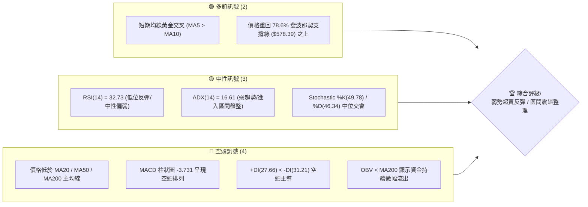
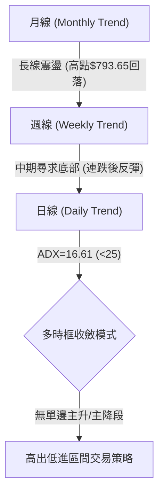
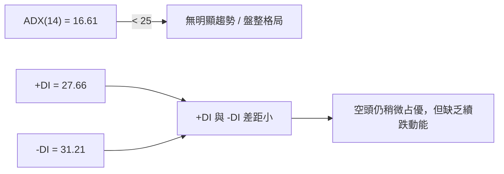
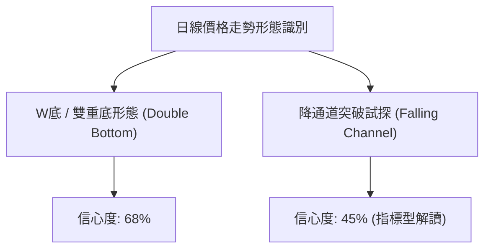
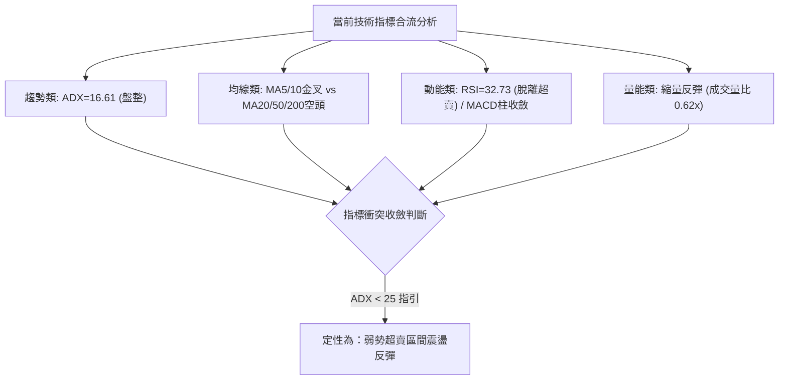
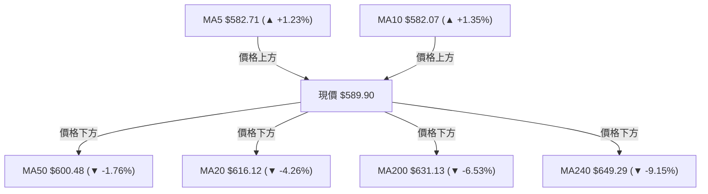
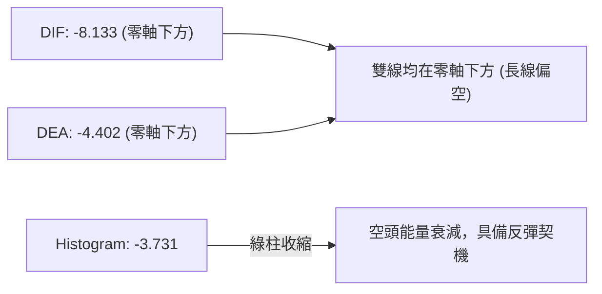
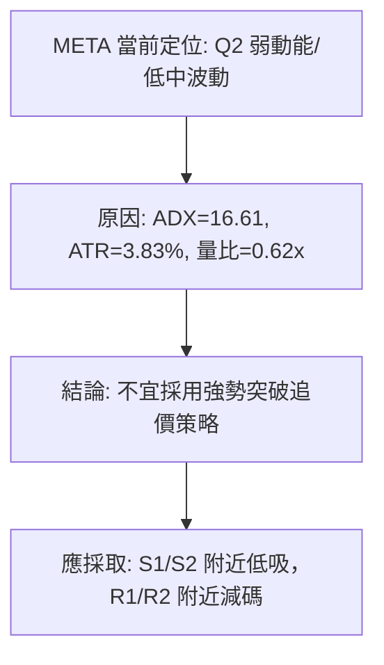
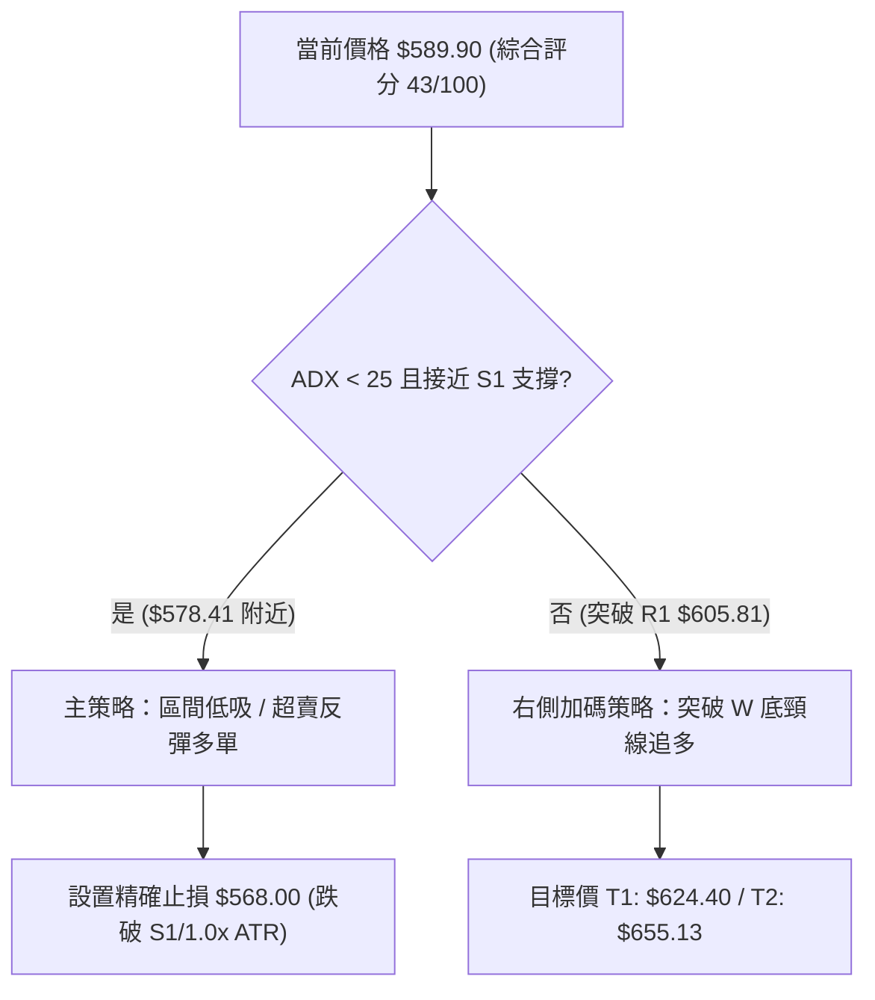
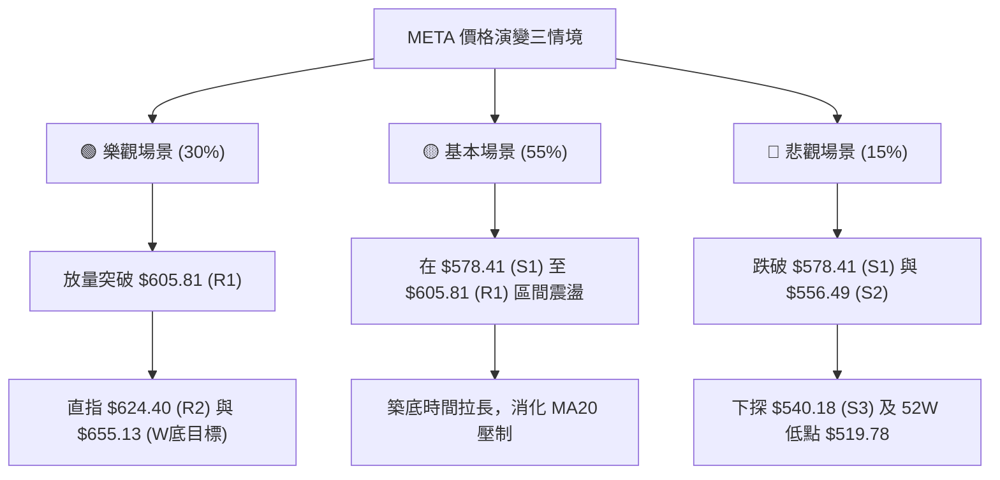

# META 技術分析報告

> **報告日期**：2026-08-07 ｜ **語言**：繁體中文 ｜ **數據來源**：Yahoo Finance ｜ **當前價格**：$589.90

---

## 目錄

| 章節 | 內容 |
|------|------|
| [1. 技術面概覽](#1-技術面概覽) | 訊號儀表板、核心指標、評分卡 |
| [2. 趨勢分析](#2-趨勢分析) | 多時框趨勢、長中短期走勢 |
| [3. 圖表形態分析](#3-圖表形態分析) | 形態識別、K線組合、目標價 |
| [4. 支撐與阻力](#4-支撐與阻力) | 關鍵價位、斐波那契回調 |
| [5. 技術指標深度解讀](#5-技術指標深度解讀) | MA/RSI/MACD/布林/成交量 |
| [6. 動能與波動率](#6-動能與波動率) | 動能評估、ATR、Beta |
| [7. 多時框架總結](#7-多時框架總結) | 時框架評分矩陣 |
| [8. 交易策略建議](#8-交易策略建議) | 多空策略、風險報酬比 |
| [9. 風險提示與監控](#9-風險提示與監控) | 監控指標、風險場景 |

---

## 1. 技術面概覽

### 🎯 技術訊號儀表板



### 📊 核心指標速覽表

| 指標類別 | 指標名稱 | 當前數值 | 訊號 | 解讀 |
|----------|----------|----------|------|------|
| **價格** | 當前價格 | $589.90 | 🟡 中性 | 處於52週區間 $519.78 - $793.65 之 25.6% 分位 |
| **均線** | MA5 / MA10 | $582.71 / $582.07 | 🟢 看多 | 短線突破短均，具備微幅止跌反彈動能 |
| **均線** | MA20 | $616.12 | 🔴 看空 | 價格位於MA20下方 -4.26%，首要動態阻力 |
| **均線** | MA50 | $600.48 | 🔴 看空 | 價格位於MA50下方 -1.76%，中期多空分水嶺 |
| **均線** | MA200 | $631.13 | 🔴 看空 | 價格位於MA200下方 -6.53%，長線轉為偏弱整理 |
| **動能** | RSI(14) | 32.73 | 🟡 中性 | 脫離超賣區（此前週線跌至22.9），低位尋求支撐 |
| **動能** | MACD(12,26,9) | -8.133 | 🔴 看空 | DIF與DEA位於零軸下方，柱狀圖(-3.731)空頭收斂中 |
| **趨勢** | ADX(14) | 16.61 | 🟡 中性 | ADX < 25 表示無強烈單邊趨勢，屬於無趨勢/盤整 |
| **波動** | ATR(14) | $22.59 | 🟡 中性 | 日均波動率 3.83%，波動度居中 |
| **通道** | 布林通道 %B | 0.34 | 🟡 中性 | 位於下軌 ($535.86) 與中軌 ($616.12) 之間 |
| **量能** | 20日均量比 | 0.62x | 🔴 看空 | 當前成交量 1,166 萬股，縮量反彈力道待考驗 |

### 🏆 技術評分卡

```
╔══════════════════════════════════════════════════════════════╗
║                技術評分卡 — META (2026-08-07)                ║
╠══════════════════════════════════════════════════════════════╣
║ 趨勢強度      ▓▓▓▓▓▓▓░░░░░░░░░░░░░  35/100  🔴 空頭佔優      ║
║ 動能指標      ▓▓▓▓▓▓▓▓░░░░░░░░░░░░  40/100  🟡 弱勢築底      ║
║ 支撐穩定度    ▓▓▓▓▓▓▓▓▓▓▓▓▓░░░░░░░  65/100  🟢 S1/Fib強支撐  ║
║ 成交量配合    ▓▓▓▓▓▓▓░░░░░░░░░░░░░  35/100  🔴 縮量整理      ║
║ 形態完整度    ▓▓▓▓▓▓▓▓▓▓░░░░░░░░░░  50/100  🟡 區間打底      ║
║ 均線排列      ▓▓▓▓▓▓░░░░░░░░░░░░░░  30/100  🔴 蓋頂死叉      ║
╠══════════════════════════════════════════════════════════════╣
║ 綜合評分      ▓▓▓▓▓▓▓▓▓░░░░░░░░░░░  43/100  中性偏弱/盤整    ║
╚══════════════════════════════════════════════════════════════╝
```

---

## 2. 趨勢分析

### 🌐 多時框趨勢分析



### 📈 長期趨勢 — 12個月走勢圖（Unicode）

```
META 過去12個月價格走勢圖 ($)
$793.65 ┤                             ● (52W High)
$750.00 ┤                       ●
$700.00 ┤                 ●                 ●
$650.00 ┤           ●           ●                 ●
$600.00 ┤     ●                                         ● $589.90 (現在)
$550.00 ┤                                           ● (52W Low $519.78)
$500.00 ┼───┬───┬───┬───┬───┬───┬───┬───┬───┬───┬───┬─── Line
       09/25 10  11  12 01/26 02  03  04  05  06  07  08/26
```

#### 走勢特徵分析表

| 時間區段 | 月收盤價 | 區間漲跌幅 | 主要技術特徵與驅動因素 |
|----------|----------|------------|------------------------|
| **2025-09 ~ 2025-10** | $646.67 | -11.71% | 歷史高點受阻後回檔，跌破 MA20 支撐 |
| **2025-11 ~ 2026-01** | $715.22 | +10.67% | 歲末強勢反彈，形成第二波攻勢試圖挑戰高點 |
| **2026-02 ~ 2026-03** | $571.60 | -20.08% | 高位放量重挫，跌破 MA50 與 MA200，形成中期空頭頭部 |
| **2026-04 ~ 2026-05** | $631.92 | +10.55% | 跌深反彈，受阻於 $642.40 (R3) 附近 |
| **2026-06 ~ 2026-07** | $556.71 | -11.90% | 二次探底，回試 $556.49 (S2) 關鍵支撐區 |
| **2026-08 (最新)** | $589.90 | +5.96% | 於 $556-$578 強支撐帶觸底回升，呈現日線雙底初現形態 |

### 📊 中期趨勢（週線分析）

近期 20 週數據顯示，META 經歷了兩次嚴重的拋售潮與兩次強烈的短線反彈：
1. **第一次探底與反彈**：2026-03-29 週收盤 $525.23 (超賣，週 RSI=18.0)，隨後急拉至 2026-04-19 的 $687.91。
2. **第二次高位回落**：自 $687.91 承壓回落，於 2026-07-12 再次衝高至 $669.21 後快速跳水。
3. **第三次打底（當前）**：2026-08-02 週跌至 $556.71 (週 RSI=22.9 再次進入超賣區)，最新一週（2026-08-09）強勢彈升至 $589.90，週 MACD 柱狀圖由 -11.160 收斂至 -3.731。

```
週線支撐與壓力結構示意圖
阻力位 R3:  $ 642.40  ─────────────────────────────────── (強壓力帶)
阻力位 R2:  $ 624.40  ─────────────────────────────────── (MA20/61.8% Fib)
阻力位 R1:  $ 605.81  ─────────────────────────────────── (短期反彈目標)
現價價格:   $ 589.90  ═══════════════════════════════════ (目前位置)
支撐位 S1:  $ 578.41  ─────────────────────────────────── (78.6% Fib / 當前第一支撐)
支撐位 S2:  $ 556.49  ─────────────────────────────────── (波段低點聚類)
支撐位 S3:  $ 540.18  ─────────────────────────────────── (52週次低區)
```

### ⚡ 趨勢強度評估（ADX 解讀）



#### ADX 趨勢強度指標對照表

| ADX 數值範圍 | 當前狀態 | 行情性質 | 交易策略指導 |
|--------------|----------|----------|--------------|
| 0 - 20 | **16.61 (當前)** | **極弱趨勢 / 無方向盤整** | **禁止追漲殺跌，採用區間突破或網格操作** |
| 20 - 25 | - | 趨勢萌芽 / 弱趨勢 | 關注方向選擇突破 |
| 25 - 50 | - | 強烈趨勢行情 | 順勢操作，持有趨勢單 |
| > 50 | - | 極端趨勢 / 接近尾聲 | 注意獲利了結，防範極端反轉 |

---

## 3. 圖表形態分析

### 🔍 形態識別系統



#### 圖表形態信心度與目標價評估表

| 形態名稱 | 信心度 | 判斷依據（引用數據） | 完成度 | 目標價（附計算式） |
|----------|--------|----------------------|--------|--------------------|
| **雙重底 (W底)** | **68%** | 第一底 $550.25 (2026-06-28)，第二底 $556.71 (2026-08-02)，未跌破前低，呈現二次築底 | 60% | 頸線 R1 $605.81 + 形態高度 ($605.81 - $556.49 = $49.32) = **$655.13** (接近50% Fib $656.71) |
| **下行通道** | **45%** | 數據不足以支撐完備幾何幾何通道，僅做指標型解讀 | - | 訊號不足，僅做指標型解讀 |

### 🕯️ 重要 K 線形態分析

| 日期/週期 | 收盤價 | K線形態 | 技術解讀 | 訊號評級 |
|-----------|--------|---------|----------|----------|
| **2026-08-02 週** | $556.71 | 長下影錘子線 (Hammer) | 探底 $556.49 支撐區後獲得買盤強力介入，留有長下影線 | 🟢 看多反彈 |
| **2026-08-09 週** | $589.90 | 中陽線吞噬 (Bullish Engulfing) | 實體收盤包覆前一週跌幅，確立短期築底成功 | 🟢 多頭確認 |
| **日線 MA5/10** | $582.71 | 均線金叉 (Golden Cross) | MA5 ($582.71) 向上穿越 MA10 ($582.07)，發出極短線買入訊號 | 🟢 短線看多 |

### 📉 ASCII 走勢形態示意圖

```
META 日線 W底 (雙重底) 形態示意圖
$624.40 ┤                              [R2 阻力 / 波段目標]
$605.81 ┤───────────● (頸線位 R1) ──────────────────────
$589.90 ┤                 \          /  ★ 目前位置 ($589.90)
$578.41 ┤                  \  ● (彈) /
$556.49 ┤    ● (底1)        \______/  ● (底2)
         ─────────────────────────────────────────
         2026-06-28                 2026-08-02
```

### 🎯 形態目標價計算

1. **W底頸線位置**：$605.81 (R1 阻力位)
2. **W底最低支撐**：$556.49 (S2 支撐位)
3. **形態高度 (H)**：$605.81 - $556.49 = **$49.32**
4. **最小突破目標價 (Target 1)**：頸線 $605.81 + H ($49.32) = **$655.13** (與 50.0% 斐波那契回調位 $656.71 極度重合)
5. **第二延伸目標價 (Target 2)**：若進一步突破，延伸挑戰 38.2% 斐波那契位 **$689.03**

---

## 4. 支撐與阻力

### 🗺️ 關鍵價位分布圖（Unicode）

```
META 價位結構分布圖
═════════════════════════════════════════════════════════════
$793.65 ║████████████████████████████████████████║ 52週歷史高點 (0.0% Fib)
$729.02 ║████████████████████████                ║ 23.6% 斐波那契回調位
$689.03 ║██████████████████                      ║ 38.2% 斐波那契回調位
$656.71 ║██████████████                          ║ 50.0% 斐波那契回調位
$642.40 ║█████████████                           ║ 強阻力 R3 / 前波高點
$631.13 ║████████████                            ║ MA200 長線均線反壓
$624.40 ║███████████                             ║ 阻力 R2 / 61.8% Fib / MA20
$605.81 ║█████████                               ║ 關鍵阻力 R1 / W底頸線
$589.90 ╠════════════════════════════════════════╣ ◄ 現價 ($589.90)
$578.41 ║▓▓▓▓▓▓▓▓                                ║ 近期強支撐 S1 / 78.6% Fib
$556.49 ║▓▓▓▓▓                                   ║ 強支撐 S2 / 雙底次低點
$540.18 ║▓▓▓                                     ║ 支撐 S3 / 前波低點帶
$519.78 ║▓                                       ║ 52週歷史低點 (100.0% Fib)
═════════════════════════════════════════════════════════════
```

### 🚧 阻力位分析表

| 阻力級別 | 精確價位 | 形成原因與技術意涵 | 突破難度 | 重要性 |
|----------|----------|--------------------|----------|--------|
| **R1** | **$605.81** | 近一年波段高點聚類、日線 W 底頸線位、近 20 日反彈受阻點 | 🟡 中等 | 🟢🟢🟢 關鍵解套線，突破確認短線轉強 |
| **R2** | **$624.40** | 61.8% 斐波那契黃金分割位、MA20 ($616.12) 與 MA120 ($615.08) 蓋頂區 | 🔴 較高 | 🟢🟢🟢🟢 中期多空轉折重要關卡 |
| **R3** | **$642.40** | 近一年強反彈高點聚類、MA240 ($649.29) 壓力帶 | 🔴 極高 | 🟢🟢🟢🟢🟢 解除空頭威脅之強阻力 |

### 🛡️ 支撐位分析表

| 支撐級別 | 精確價位 | 形成原因與技術意涵 | 守住機率 | 重要性 |
|----------|----------|--------------------|----------|--------|
| **S1** | **$578.41** | 78.6% 斐波那契回調位 ($578.39)、最近一週探底回升起漲點 | 🟢 75% | 🟢🟢🟢🟢 多頭短線防守第一道防線 |
| **S2** | **$556.49** | 近一年波段低點聚類、2026-08-02 週低點、雙底結構之右腳 | 🟢 85% | 🟢🟢🟢🟢🟢 守住則雙底結構確立 |
| **S3** | **$540.18** | 近一年波段次低點聚類、接近 52 週低點 ($519.78) 的安全邊際 | 🟢 90% | 🟢🟢🟢 弱勢下行時之極限防禦帶 |

### 📐 斐波那契回調位分析

依據 52 週高點 **$793.65** 至 52 週低點 **$519.78** 計算之黃金分割層級：

| 斐波那契比例 | 算定價位 | 當前價位相對位置 | 技術分析與交易意義 |
|--------------|----------|------------------|--------------------|
| **0.0% (52W High)** | $793.65 | +34.54% | 歷史最高紀錄點位 |
| **23.6%** | $729.02 | +23.58% | 長線強勢區間分界線 |
| **38.2%** | $689.03 | +16.80% | 中長線多頭回檔極限區 |
| **50.0%** | $656.71 | +11.33% | 多空強弱中間水準，W底目標價延伸位 |
| **61.8%** | $624.40 | +5.85% | **黃金分割關鍵阻力**，與 R2 阻力完全重合 |
| **78.6%** | $578.39 | -1.95% | **當前價格守住區**，與 S1 支撐 ($578.41) 完全重合 |
| **100.0% (52W Low)**| $519.78 | -11.89% | 52 週波段最低點 |

*當前價格位置*：$589.90 精確落在 **78.6% ($578.39)** 與 **61.8% ($624.40)** 兩大關鍵黃金分割位之間。價位在 78.6% 附近獲得明確買盤支撐，顯示超跌買盤已進場築底。

---

## 5. 技術指標深度解讀

### 🎛️ 指標訊號總覽



### 📈 移動平均線排列分析



#### 均線數據狀態解析表

| 均線名稱 | 當前價位 | 偏離率 (%) | 走勢方向 | 技術意涵解讀 |
|----------|----------|------------|----------|--------------|
| **MA5** | $582.71 | +1.23% | ▲ 向上 | 短線極短趨勢轉強，提供極短線下檔支撐 |
| **MA10** | $582.07 | +1.35% | ▲ 向上 | MA5 穿過 MA10，形成短線「黃金交叉」 |
| **MA20** | $616.12 | -4.26% | ▼ 向下 | 月線下彎，為短線反彈首要動態蓋頂壓力 |
| **MA50** | $600.48 | -1.76% | ▼ 向下 | 季線位置，與 $605.81 (R1) 形成雙重阻力 |
| **MA200** | $631.13 | -6.53% | ▼ 向下 | 長期年線走平偏下，代表長線多頭動能受阻 |

### 📉 RSI(14) 分析

* 當前 RSI(14) 數值：**32.73**
* 進度條：███████░░░░░░░░░░░░░ 32.73%

```
RSI(14) 狀態區間示意圖
0 ─── 20 (超賣區) ────── 32.73 (當前) ─────── 50 (中性區) ─────── 70 (超買區) ─── 100
      [先前週線低點 22.9]    ▲
                             └─ 脫離超賣區，發出弱勢買入/止跌訊號
```

#### 背離判斷與趨勢驗證
* **背離檢查**：日線圖上，股價在 2026-06-28 創低點 $550.25 時 RSI 約 35.3；在 2026-08-02 二次探底至 $556.71 時 RSI 下探至 22.9（週線），隨後日線迅速抬升至 32.73。
* **背離結論**：無嚴格頂背離，但出現**微幅底背離萌芽**特徵（價格未創新低，RSI 低點抬升），支持股價進行一波向上均線修正。

### 📊 MACD(12/26/9) 訊號解讀

* **DIF (MACD Line)**: -8.133
* **DEA (Signal Line)**: -4.402
* **MACD Histogram**: -3.731 🔴 看空（但柱狀圖負值正逐日縮小）



### 📦 布林通道分析

```
META 布林通道 (Bollinger Bands) 當前位置
$696.38 ┤───────────────────────────────────────── 布林上軌 (BB Upper)
        │
$616.12 ┤───────────────────────────────────────── 布林中軌 (MA20 / BB Mid)
$589.90 ┤                 ★ 當前價格 ($589.90, %B = 0.34)
        │
$535.86 ┤───────────────────────────────────────── 布林下軌 (BB Lower)
```

* **布林帶寬 (Bandwidth)**：($696.38 - $535.86) / $616.12 = **26.05%**，帶寬處於正常收斂狀態，未見極端開口。
* **%B 指標**：**0.34**，顯示價格從下軌 ($535.86) 反彈，目前向上接近中軌 ($616.12)。在 ADX < 25 的盤整格局下，布林中軌為合理反彈目標。

### 💹 成交量分析（量價配合度）

* **最新日成交量**：11,663,468 股
* **20日平均成交量**：18,711,768 股（**量比 0.62x**）
* **OBV 趨勢**：OBV 線位於其 200 日均線下方。週成交量在探底至 $556.71 時放量至 1.12 億股（具備洗盤換手特徵），但最近一週反彈量能縮至 7,045 萬股。
* **量價結論**：**「縮量止跌反彈」**。多頭主力推升意願仍較謹慎，突破 R1 ($605.81) 時必須要有補量（日成交量需要回升至 1,800 萬股以上）才能確認真突破。

---

## 6. 動能與波動率

### ⚡ 動能評估四象限

| 象限 | 動能強度 | 波動率 | 當前狀態判定 | 交易策略建議 |
|------|----------|--------|--------------|--------------|
| **Q1 (高動能/低波動)** | 強 | 低 | - | 最佳順勢加碼區 |
| **Q2 (弱動能/低波動)** | **弱** | **低/中** | **✓ META 當前歸屬** | **低吸高拋，恪守支撐阻力區間** |
| **Q3 (強動能/高波動)** | 強 | 高 | - | 突破追價，嚴格止損 |
| **Q4 (弱動能/高波動)** | 弱 | 高 | - | 恐慌拋售區，避開或做空 |



### 📊 ATR 波動率分析

* **ATR(14)**：**$22.59**
* **ATR 佔比**：$22.59 / $589.90 = **3.83%**
* **動態止損建議**：
  * **波段交易止損距離 (1.5x ATR)**：1.5 × $22.59 = **$33.89**
  * **極短線止損距離 (1.0x ATR)**：1.0 × $22.59 = **$22.59**
  * 若在現價 $589.90 進場做多，標準技術止損位設於 $589.90 - $22.59 = **$567.31**（高於強支撐 S2 $556.49，防守邏輯完整）。

### 📐 Beta 與市場相關性

* **Beta**：**1.243**（相較 S&P 500 具備更高的高 Beta 彈性）。當美股大盤反彈時，META 具備超越大盤的彈升幅度，但也意味著若大盤下行，其承受的賣壓相應放大。

---

## 7. 多時框架總結

### 📋 時框架評分表

| 時框架 | 趨勢方向 | 動能狀態 | 均線排列 | 形態結構 | 綜合評分 | 交易指導建議 |
|--------|----------|----------|----------|----------|----------|--------------|
| **月線 (Long-term)** | 🟡 中性震盪 | 🟡 修正中 | 🟡 混合排列 | 52週高位回檔 | **55/100** | 長線價值區浮現，分批建倉 |
| **週線 (Medium-term)**| 🔴 中期偏弱 | 🟢 超賣反彈 | 🔴 空頭排列 | 超賣錘子線築底 | **45/100** | 尋求雙底支撐，不宜盲目看空 |
| **日線 (Short-term)** | 🟢 短線反彈 | 🟢 金叉向上 | 🟡 短金長空 | W底初步成形 | **50/100** | 區間操作，逢低做多試單 |

### 🔲 綜合訊號矩陣

```
╔══════════════════════════════════════════════════════════════╗
║                   多時框架訊號一致性矩陣                     ║
╠═════════════════════╦══════════════╦══════════════╦══════════╣
║ 時框架              ║ 短期 (日線)  ║ 中期 (週線)  ║ 長期(月線)║
╠═════════════════════╬══════════════╬══════════════╬══════════╣
║ 趨勢指標 (MA/ADX)   ║ 🟢 看多反彈  ║ 🔴 偏空修正  ║ 🟡 震盪  ║
║ 動能指標 (RSI/MACD) ║ 🟢 低位金叉  ║ 🟢 脫離超賣  ║ 🟡 中位  ║
║ 量能指標 (OBV/Volume)║ 🔴 縮量反彈  ║ 🟢 探底放量  ║ 🟡 中性  ║
╠═════════════════════╬══════════════╬══════════════╬══════════╣
║ 時框架收斂結論      ║    🟢 短多   ║    🟡 築底   ║ 🟡 震盪  ║
╚═════════════════════╩══════════════╩══════════════╩══════════╝
```

### ⚖️ 多時框收斂結論

依據多時框收斂規則：當前 **ADX(14) = 16.61 (< 25)**，明確指示市場處於**無強烈單邊趨勢的盤整行情**。

1. **主導原則**：日線布林通道 ($535.86 - $696.38) 與關鍵支撐/阻力 ($578.41 - $624.40) 為主要交易邊界。
2. **方向收斂**：週線於 S2 ($556.49) 與 78.6% 斐波那契位 ($578.39) 築底成功，日線出現 MA5/MA10 金叉與超賣反彈。
3. **最終判定**：**「中性偏多——超賣區間反彈行情」**。主策略應以逢低做多（低吸反彈）為主，目標看至 MA20/R2 阻力區。

---

## 8. 交易策略建議

### 🗺️ 策略決策流程圖



### 🧭 策略路由

**當前主策略方向 = 🟢 區間低吸做多（超賣反彈策略），綜合評分 43/100 屬區間打底階段**

### 🎯 價格情境階梯 (Price Scenarios)

| 觸發條件 | 下一目標價 | 後續延伸目標 | 情境技術含義 |
|----------|------------|--------------|--------------|
| **突破 R1 $605.81** | **R2 $624.40** | **R3 $642.40** | W底形態確立，向上補齊均線乖離 |
| **站穩現價區間 ($580-$600)** | **$605.81 (R1)** | **$616.12 (MA20)** | 區間打底震盪，消化上檔賣壓 |
| **跌破 S1 $578.41** | **S2 $556.49** | **S3 $540.18** | 反彈失敗，二次回試前波雙底下軌 |

### 📊 情境機率分佈

| 情境 | 機率 | 主要依據與指標確認 |
|------|------|--------------------|
| **超賣反彈 / 上衝 R1-R2** | **60%** | RSI 脫離超賣區、MA5/10 金叉、週線下影錘子線、守住 78.6% Fib |
| **橫盤區間震盪 ($578-$605)**| **25%** | ADX = 16.61 低趨勢強度、成交量比僅 0.62x 縮量 |
| **破位下探 S2/S3** | **15%** | MACD 仍處零軸下方、整體 MA20/50/200 空頭蓋頂 |

### 🟢 主策略詳情（區間低吸 / 雙底反彈多單）

#### 策略 A：左側/現價試單策略 (前波超賣反彈)

| 策略要素 | 詳細設定數值 | 計算邏輯與說明 |
|----------|--------------|----------------|
| **進場條件** | 價格於 $580.00 - $589.90 區間企穩 | 靠近 S1 ($578.41) 與 78.6% Fib 支撐帶 |
| **進場價格** | **$589.90** | 當前市價進場 |
| **第一目標價 (T1)** | **$624.40** | **R2 阻力位** / 61.8% Fib / 接近 MA20 ($616.12) |
| **第二目標價 (T2)** | **$655.13** | **由 W底形態高度推算** ($605.81 + $49.32) |
| **止損價格** | **$568.00** | 跌破 S1 ($578.41) 減去 1.0x ATR 安全邊際 |
| **潛在利潤 (至T1)** | **+$34.50** (+5.85%) | $624.40 - $589.90 |
| **潛在風險** | **-$21.90** (-3.71%) | $589.90 - $568.00 |
| **風險報酬比 (R/R)**| **1 : 1.58** (至T1) / **1 : 2.98** (至T2) | 具備優良的風險報酬比 |
| **建議倉位** | **10% - 15%** | 屬逆勢/反彈單，控制倉位 |

#### 策略 B：右側突破加碼策略 (W底頸線突破 confirmation)

| 策略要素 | 詳細設定數值 | 計算邏輯與說明 |
|----------|--------------|----------------|
| **進場條件** | 日線收盤價突破 **$605.81 (R1)** 且量能 > 1,800 萬股 | W 底頸線正式確認突破 |
| **進場價格** | **$606.50** | 突破 R1 後回測不破進場 |
| **第一目標價 (T1)** | **$642.40** | **R3 強阻力位** / 接近 MA240 ($649.29) |
| **第二目標價 (T2)** | **$655.13** | **由 W底形態高度推算** 完整目標價 |
| **止損價格** | **$588.00** | 跌破頸線下方 1x ATR（假突破止損） |
| **風險報酬比 (R/R)**| **1 : 1.94** (至T1) / **1 : 2.63** (至T2) | 高勝率右側順勢單 |
| **建議倉位** | **15% - 20%** | 右側訊號確立，可加大倉位 |

### 🔴 反向風險觸發點（對沖與風控提示）

* **撤退/停損觸發點**：若價格無量下穿 **$578.41 (S1)** 且日線收低於 **$568.00**，代表短線築底失敗，應立即多單平倉觀望。
* **空頭防守點**：若股價進一步跌破 **$556.49 (S2)**，空頭將主導行情下探 **$540.18 (S3)** 甚至 **$519.78** (52週低點)。

### ⭐ 整體訊號強度評星

```
做多訊號強度：★★★☆☆  (3/5星 — 超賣反彈+雙底雛形)
做空訊號強度：★★☆☆☆  (2/5星 — 動能衰竭+接近強支撐)
整體可信度：  ★★★☆☆  (3/5星 — 盤整行情，指標收斂良好)
```

---

## 9. 風險提示與監控

### ✅ 關鍵監控指標 Checklist

```
╔══════════════════════════════════════════════════════════════╗
║               META 技術面每日監控 Checklist                  ║
╠══════════════════════════════════════════════════════════════╣
║ [ ] 價位監控：是否突破關鍵頸線 $605.81 (R1)？                ║
║ [ ] 價位監控：是否跌破關鍵防守 $578.41 (S1)？                ║
║ [ ] 量能監控：日成交量是否回升至 18,700,000 股（20日均量）？ ║
║ [ ] 均線監控：MA5/MA10 金叉能否持續擴大？                    ║
║ [ ] 指標監控：RSI(14) 能否進一步突破 50 中性分水嶺？         ║
║ [ ] 趨勢監控：MACD 柱狀圖是否由負轉正（突破零軸）？          ║
╚══════════════════════════════════════════════════════════════╝
```

### ⚠️ 風險場景分析



### 🛡️ 風險管理重要提醒

1. **波動率控制**：當前 ATR 為 **$22.59** (3.83%)，屬於中等波動。單筆交易風險金額不應超過總投資組合資產的 **1.5% - 2.0%**。
2. **大盤相關性風險**：META Beta 值為 **1.243**，近期科技股（QQQ/NQ）若出現整體回檔，META 難以獨善其身，操作時需密切留意美股大盤動向。
3. **數據紀律**：嚴格執行以 **$568.00**（策略 A）或 **$588.00**（策略 B）為基準的止損紀律，切勿在跌破 S2 ($556.49) 後硬扛單。

---

## 📋 報告總結

```
╔══════════════════════════════════════════════════════════════╗
║                   META 技術分析報告總結                      ║
════════════════════════════════════════════════════════════════
報告日期：2026-08-07
當前價格：$589.90
分析評級：🟡 弱勢超賣反彈 / 區間打底 (技術評分: 43/100)

關鍵結論：
├─ 長期趨勢：🟡 中性震盪 (52週區間 $519.78 - $793.65 之 25.6% 低位)
├─ 中期趨勢：🟡 尋求底部 (週線 RSI 自 22.9 超賣區回升，長下影打底)
├─ 短期趨勢：🟢 止跌反彈 (MA5/10 形成金叉，日線 W底雛形)
├─ 關鍵支撐：S1 $578.41 (78.6% Fib) ｜ S2 $556.49 (雙底右腳)
├─ 關鍵阻力：R1 $605.81 (W底頸線) ｜ R2 $624.40 (61.8% Fib/MA20)
└─ 分析師目標：$756.95 (均價) ｜ $580.00 (最低) ｜ $1000.00 (最高)

最優策略組合：
1. 🥇 最佳機會：區間低吸多單 (於 $580-$589 建立首批倉位，止損 $568.00，目標 $624.40)
2. 🥈 次選機會：頸線突破追多 (待日線收盤突破 $605.81 後加碼，目標 $655.13)
3. 🥉 保守選擇：觀望等待 (等待股價站穩 MA20 $616.12 且 ADX > 25 趨勢明確後再進場)
════════════════════════════════════════════════════════════════
```

---

> ⚠️ **免責聲明**：本報告為 AI 自動生成之技術分析，所有數據及估算均基於提供的歷史價格資訊。本報告**僅供研究與學術參考**，**不構成任何投資建議**。投資有風險，入市需謹慎。

---

*報告生成時間：2026-08-07 ｜ 數據來源：Yahoo Finance ｜ 分析框架：多時框技術分析*