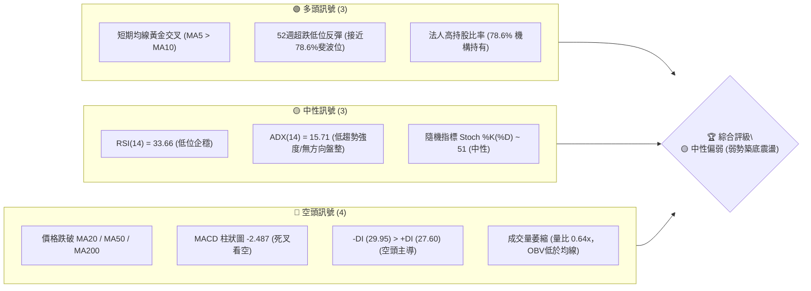
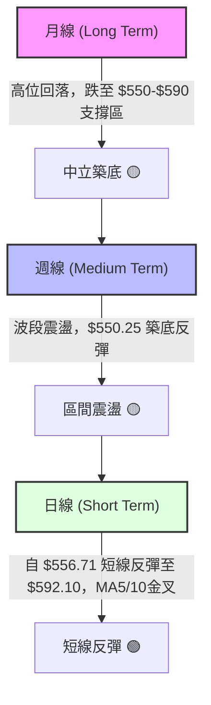
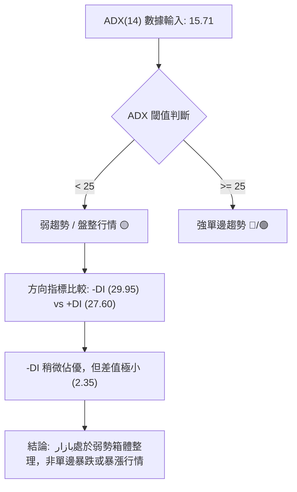
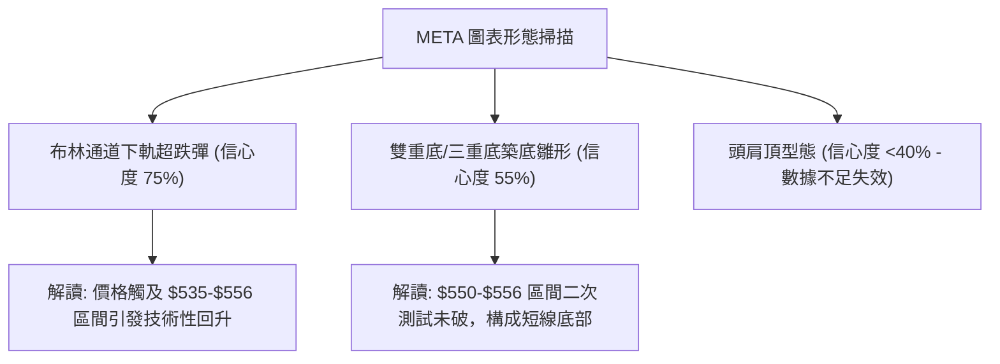
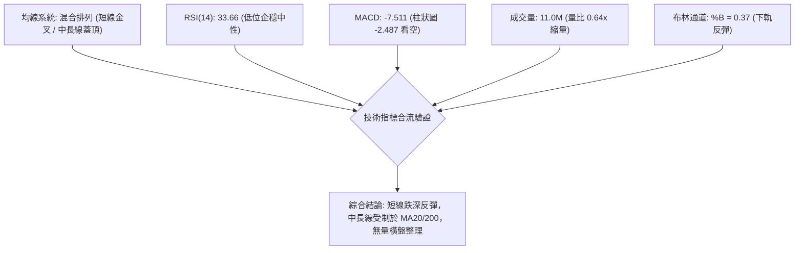
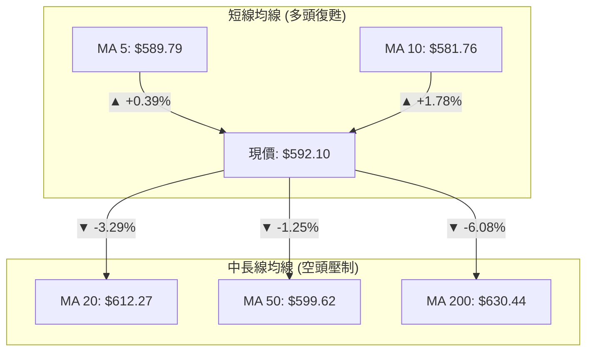
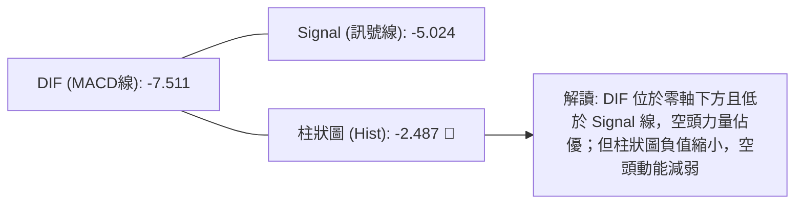
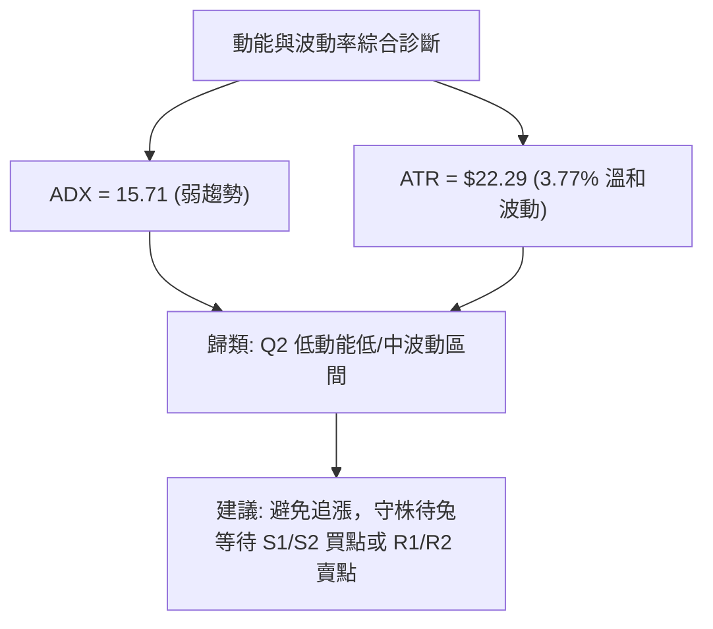
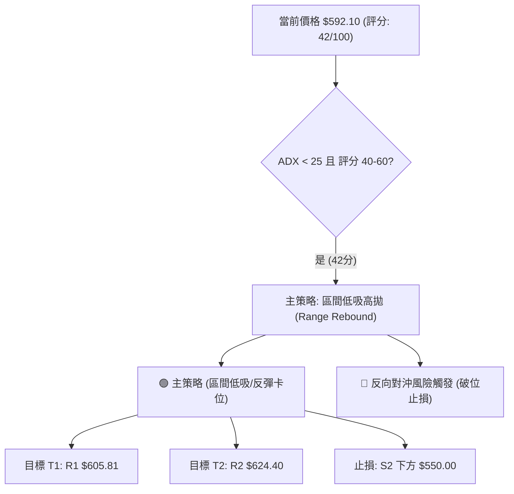
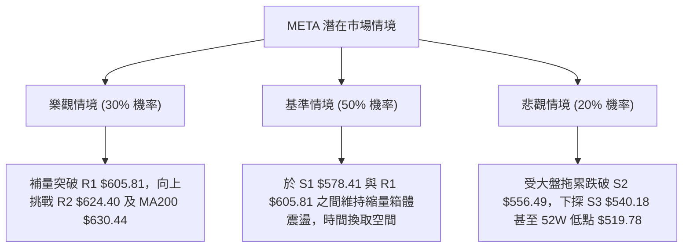

# META 技術分析報告

> **報告日期**：2026-08-08 ｜ **語言**：繁體中文 ｜ **數據來源**：Yahoo Finance ｜ **當前價格**：$592.10

---

## 目錄

| 章節 | 內容 |
|------|------|
| [1. 技術面概覽](#1-技術面概覽) | 訊號儀表板、核心指標、評分卡 |
| [2. 趨勢分析](#2-趨勢分析) | 多時框趨勢、長中短期走勢 |
| [3. 圖表形態分析](#3-圖表形態分析) | 形態識別、K線組合、目標價 |
| [4. 支撐與阻力](#4-支撐與阻力) | 關鍵價位、斐波那契回調 |
| [5. 技術指標深度解讀](#5-技術指標深度解讀) | MA/RSI/MACD/布林/成交量 |
| [6. 動能與波動率](#6-動能與波動率) | 動能評估、ATR、Beta |
| [7. 多時框架總結](#7-多時框架總結) | 時框架評分矩陣 |
| [8. 交易策略建議](#8-交易策略建議) | 多空策略、風險報酬比 |
| [9. 風險提示與監控](#9-風險提示與監控) | 監控指標、風險場景 |

---

## 1. 技術面概覽

### 🎯 技術訊號儀表板



### 📊 核心指標速覽表

| 指標類別 | 指標名稱 | 當前數值 | 訊號 | 解讀 |
|----------|----------|----------|------|------|
| **價格** | 當前價格 | $592.10 | 🟡 | 位於52週高低區間 26.4% 位置，短線自 $556.71 反彈 |
| **均線** | MA20 | $612.27 | 🔴 | 價格位於MA20下方 (-3.29%)，月線層級承壓 |
| **均線** | MA50 | $599.62 | 🔴 | 價格位於MA50下方 (-1.25%)，季線層級阻力 |
| **均線** | MA200 | $630.44 | 🔴 | 價格位於MA200下方 (-6.08%)，長期均線轉為壓力 |
| **動能** | RSI(14) | 33.66 | 🟡 | 自超賣邊緣（<30）微幅回升，尚無極端背離 |
| **動能** | MACD | -7.511 / -5.024 | 🔴 | MACD線位於訊號線下方，Hist -2.487 顯示空頭動能仍存 |
| **趨勢** | ADX(14) | 15.71 | 🟡 | ADX < 25 指示當前處於無明確單邊趨勢的無序盤整行情 |
| **波動** | ATR(14) | $22.29 | 🟢 | 波動率佔股價 3.77%，處於正常日均波幅，提供合理風控空間 |
| **量能** | 20日均量比 | 0.64x | 🔴 | 日成交量 11.0M 顯著低於 20日均量 17.2M，量能未跟上反彈 |

### 🏆 技術評分卡

```
╔══════════════════════════════════════════════════════════════════╗
║                技術評分卡 — META (2026-08-08)                    ║
╠══════════════════════════════════════════════════════════════════╣
║ 趨勢強度      ▓▓▓▓▓░░░░░░░░░░░░░░░  25/100  🔴 無單邊主趨勢      ║
║ 動能指標      ▓▓▓▓▓▓▓░░░░░░░░░░░░░  35/100  🔴 動能修復中        ║
║ 支撐穩定度    ▓▓▓▓▓▓▓▓▓▓▓▓░░░░░░░░  60/100  🟡 S1/S2支撐發揮效果 ║
║ 成交量配合    ▓▓▓▓▓▓░░░░░░░░░░░░░░  30/100  🔴 縮量反彈量能不足  ║
║ 形態完整度    ▓▓▓▓▓▓▓▓▓░░░░░░░░░░░  45/100  🟡 布林下軌築底型態  ║
║ 均線排列      ▓▓▓▓▓▓░░░░░░░░░░░░░░  30/100  🔴 MA20/50/200蓋頂  ║
╠══════════════════════════════════════════════════════════════════╣
║ 綜合評分      ████████░░░░░░░░░░░░  42/100  🟡 弱勢盤整築底      ║
╚══════════════════════════════════════════════════════════════════╝
```

---

## 2. 趨勢分析

### 🌐 多時框趨勢分析



### 📈 長期趨勢 — 12個月走勢圖（Unicode）

以下為 META 過去 12 個月（2025-08 至 2026-08）的收盤價走勢示意圖與重點高低點標註：

```
META 12個月收盤價走勢圖 ($)
$800 ┤                     ● 2025-07 ($770.91 歷史次高)
$750 ┤         ● $735.68       ● $736.29
$700 ┤                             ● $715.22
$650 ┤                                 ● $647.03   ● $631.92
$600 ┤                                         ● $571.60   ● $592.10 (現在)
$550 ┤                                                         ● $556.71
     └─┬───┬───┬───┬───┬───┬───┬───┬───┬───┬───┬───┬───► 時間
     08/25 09 10  11  12  01/26 02  03  04  05  06  07  08/26
```

#### 走勢特徵分析表

| 階段區間 | 收盤價範圍 | 漲跌幅 | 走勢特徵描述 |
|----------|------------|--------|--------------|
| **2025-08 ~ 2025-09** | $736.29 ➔ $732.47 | -0.52% | 高位歷史頂部震盪，買盤跟進力道開始趨緩 |
| **2025-10 ~ 2025-12** | $646.67 ➔ $658.91 | -10.04% | 獲利賣壓湧現，自高點回落至 $650 區間進行第一次箱體整理 |
| **2026-01 ~ 2026-03** | $715.22 ➔ $571.60 | -20.08% | 1月反彈無力後觸發中段快速拋售，3月下探至 $571.60 低位 |
| **2026-04 ~ 2026-05** | $611.34 ➔ $631.92 | +10.55% | 低位超跌反彈，反彈至 MA50 阻力區域後遇到解套賣壓 |
| **2026-06 ~ 2026-08** | $563.29 ➔ $592.10 | +5.11% |二次探底至 $556.71 (2026-07/08)，當前於 S1/S2 支撐上方反彈 |

### 📊 中期趨勢（週線分析）

從近 20 週數據觀察，META 在 2026-04-19 曾反彈至 $687.91 的高點（當週 RSI 96.5 極端超買），隨後引發持續性的修正。2026-07-12 當週雖再度嘗試向上衝擊至 $669.21，但量能無法持續，迅速回落至 2026-08-02 的低點 $556.71。

```
週線支撐阻力結構示意圖 ($)
$689.03 ┤ ────────────────────────────── [斐波那契 38.2% / 週線高點壓力 R3]
$642.40 ┤ ────────────────────────────── [阻力位 R3 / 近期反彈波點]
$624.40 ┤ ────────────────────────────── [斐波那契 61.8% / 阻力位 R2]
$605.81 ┤ ────────────────────────────── [阻力位 R1 / 短線壓力]
$592.10 ┼ ══════════════════════════════ ◄ 當前價格 $592.10
$578.41 ┤ ────────────────────────────── [支撐位 S1 / 斐波那契 78.6%]
$556.49 ┤ ────────────────────────────── [支撐位 S2 / 8月近波段低點]
$540.18 ┤ ────────────────────────────── [支撐位 S3 / 強支撐區]
```

### ⚡ 趨勢強度評估（ADX 解讀）



| 指標參數 | 數值 | 市場含義 | 交易策略啟示 |
|----------|------|----------|--------------|
| **ADX(14)** | 15.71 | 趨勢強度極弱 (<25) | 嚴禁使用順勢突破追價策略，應採取箱體低吸高拋 |
| **+DI (14)** | 27.60 | 多頭動能衰退 | 反彈至阻力區易受阻 |
| **-DI (14)** | 29.95 | 空頭動能微幅佔優 | 下方受壓，但尚未形成全面崩潰性拋售 |

---

## 3. 圖表形態分析

### 🔍 形態識別系統



#### 形態信心度與目標價評估表

| 形態類型 | 信心度 | 判斷依據（引用數據） | 完成度 | 目標價（附計算式） |
|----------|--------|----------------------|--------|--------------------|
| **布林下軌超跌反彈** | 75% | 2026-08-02 低點 $556.71 逼近 BB 下軌 $535.41 後拉出陽線 | 90% | BB 中軌阻力 = **$612.27** |
| **雙底築底雛形 (W底)** | 55% | 第一底 $550.25 (06-28)，第二底 $556.71 (08-02) | 60% | 頸線 $669.21 (07-12)。由形態高度推算：頸線 $669.21 + (頸線 $669.21 - 低點 $550.25) = **$788.17** (需先突破阻力位 R1/R2/R3) |
| **頭肩頂形態** | 35% | 數據不足以確認幾何對稱性，信心度 <50% | 0% | 數據不足，不做頭肩頂跌幅測算，僅以關鍵支撐位為準 |

### 🕯️ 重要 K 線形態分析

| 日期/週期 | 收盤價 | K線形態 | 解讀 | 訊號 |
|-----------|--------|---------|------|------|
| **2026-08-02 當週** | $556.71 | 長下影錘子線/探底線 | 週成交量高達 112.1M，於 $556.49 (S2) 附近強烈換手，觸底買盤進場 | 🟢 |
| **2026-08-09 當週** | $592.10 | 中陽線覆蓋 | 延續前週探底回升走勢，站回 MA5 ($589.79)，短線底氣增強 | 🟢 |
| **當前日線** | $592.10 | 縮量小陽線 | 價格重回 $590 上方，但成交量僅 11.0M (量比 0.64x)，屬於無量技術性抽離 | 🟡 |

### 📉 ASCII 走勢形態示意圖

以下為近期日線層級在 $556.49 至 $605.81 區間的震盪築底形態示意：

```
META 短線布林下軌反彈與關鍵價位示意圖 ($)
$624.40 ┤───────────────────────────────── R2 阻力位
$612.27 ┤................................. 布林中軌 / MA20
$605.81 ┤───────────────────────────────── R1 阻力位
$592.10 ┼───────────────● 當前收盤價 $592.10
        │             ╱
$578.41 ┤───────────●/──────────────────── S1 支撐位 / 78.6% Fib
$556.49 ┤─────────●/────────────────────── S2 支撐位 (8月初波段低點)
$535.41 ┤.........●....................... 布林下軌
        └─────────┬─────────┬─────────►
               08-02     08-09
```

### 🎯 形態目標價計算

根據**布林通道下軌反彈與箱體低吸形態**計算短中線目標：
1. **短線反彈第一目標價 (T1)**：引用阻力位 **$605.81** (距離當前價 +2.32%)。
2. **中線波段第二目標價 (T2)**：引用阻力位 **$624.40** (距離當前價 +5.46%，精確對應 61.8% 斐波那契回調位)。
3. **極限反彈目標價**：若能向上突破 $624.40，則指向上方阻力位 **$642.40**。

---

## 4. 支撐與阻力

### 🗺️ 關鍵價位分布圖（Unicode）

```
META 價位結構分布圖
═══════════════════════════════════════════════════════════════════
$793.65 ║████████████████████████████████████████  52W 最高點 / 0.0% Fib
$689.03 ║████████████████████████                  38.2% Fib / BB 上軌 $689.12
$656.71 ║██████████████████                        50.0% Fib 回調位
$642.40 ║████████████████                          強阻力 R3 (+8.50%)
$624.40 ║████████████                              阻力 R2 (+5.46%) / 61.8% Fib
$612.27 ║........................................  MA20 / 布林中軌
$605.81 ║████████                                  關鍵阻力 R1 (+2.32%)
$592.10 ╠═════════════════════════════════════════ ◄ 當前價格 $592.10
$578.41 ║▓▓▓▓▓▓▓▓                                  近1年波段支撐 S1 (-2.31%) / 78.6% Fib
$556.49 ║▓▓▓▓▓▓▓▓▓▓▓▓                              強支撐 S2 (-6.01%) / 近期波段低點
$540.18 ║▓▓▓▓▓▓▓▓▓▓▓▓▓▓▓▓                          強支撐 S3 (-8.77%)
$519.78 ║▓▓▓▓▓▓▓▓▓▓▓▓▓▓▓▓▓▓▓▓▓▓▓▓                  52W 最低點 / 100.0% Fib
═══════════════════════════════════════════════════════════════════
```

### 🚧 阻力位分析表

*註：以下價位嚴格引用 OHLCV 計算之關鍵價位及斐波那契數據。*

| 阻力級別 | 價位 | 形成原因 | 突破難度 | 重要性 |
|----------|------|----------|----------|--------|
| **R1** | **$605.81** | 近一年波段高點聚類 / 接近 MA50 ($599.62) | 🟡 中等 | 短線多空分水嶺，突破後方能挑戰布林中軌 |
| **R2** | **$624.40** | 52週區間 61.8% 斐波那契回調位 / 近一年高點聚類 | 🔴 較高 | 中線關鍵解套壓力區，與 MA200 ($630.44) 形成重疊壓力帶 |
| **R3** | **$642.40** | 近一年波段高點聚類 / 前波反彈次高點 | 🔴 極高 | 波段強壓力位，需伴隨 1.5x 以上放大成交量方可突破 |

### 🛡️ 支撐位分析表

| 支撐級別 | 價位 | 形成原因 | 守住機率 | 重要性 |
|----------|------|----------|----------|--------|
| **S1** | **$578.41** | 78.6% 斐波那契回調位 ($578.39) 與波段低點聚類 | 🟢 80% | 短線第一防線，MA5 ($589.79) 及 MA10 ($581.76) 位於其上方提供緩衝 |
| **S2** | **$556.49** | 2026-08-02 探底低點 $556.71 聚類區 | 🟢 70% | 中線重要防守頸線，守住則雙底/打底形態成立 |
| **S3** | **$540.18** | 近一年波段低點聚類 / 接近布林下軌 ($535.41) | 🟢 85% | 強烈技術性防守位，若跌破將直接回測 52W 低點 $519.78 |

### 📐 斐波那契回調位分析

*基準區間：52週高點 $793.65 ➔ 52週低點 $519.78 (總波幅 $273.87)*

```
斐波那契回調位與現價位置示意圖
0.0%  ($793.65) ────────────────────────────────────────── 52W High
23.6% ($729.02) ──────────────────────────────────────────
38.2% ($689.03) ──────────────────────────────────────────
50.0% ($656.71) ──────────────────────────────────────────
61.8% ($624.40) ────────────────────────────────────────── R2 阻力
───────────────── 當前價格: $592.10 (位於 61.8% ~ 78.6% 區間) ─────────────────
78.6% ($578.39) ────────────────────────────────────────── S1 支撐
100.0%($519.78) ────────────────────────────────────────── 52W Low
```

- **位置解讀**：當前價格 $592.10 精確夾在 **78.6% 回調位 ($578.39)** 與 **61.8% 回調位 ($624.40)** 之間。
- **技術意義**：股價跌破 61.8% 回調位 ($624.40) 意味著前波牛市主升段動能已被大幅削弱，進入「深層回檔修復期」。但在 78.6% 回調位 ($578.39) 展現出顯著的逢低承接買盤（S1 位於 $578.41），顯示此區間為長期機構投資者的價值防禦區。

---

## 5. 技術指標深度解讀

### 🎛️ 指標訊號總覽



### 📈 移動平均線排列分析



- **均線排列狀態**：短線 MA5 ($589.79) 向上金叉 MA10 ($581.76)，且現價站上 MA5/10，發出短線止跌訊號。
- **上方均線壓力**：MA50 ($599.62)、MA20 ($612.27) 及 MA200 ($630.44) 在 $600 - $630 區域形成三重交織密集壓力帶。
- **結論**：均線呈現「短多長空」的衝突格局，短線具備向 MA20/MA50 反彈的空間，但中長線趨勢反轉仍需帶量攻克 MA200。

### 📉 RSI(14) 分析

```
RSI(14) 強度規 (目前: 33.66)
0 ─────── 30 ───────────── 50 ───────────── 70 ─────── 100
[  超賣區  |█▓░░░░░░░░░░░  |             |  超買區  ]
           ▲ (33.66)
```

- **當前數值**：33.66（處於 30-70 中性偏低區間）。
- **超買超賣判斷**：8月初跌至 $556.71 時週線 RSI 曾觸及 22.9 的極端超賣區，日線 RSI 亦降至 30 邊緣。當前 RSI 企穩回升至 33.66，脫離離陸超賣區。
- **背離分析**：**無明顯背離**。價格與 RSI 同步自低點回升，未出現價格創新低而 RSI 不創新低的標準底背離，亦無頂背離現象。

### 📊 MACD(12, 26, 9) 訊號解讀



- **MACD 線**：-7.511 位於零軸下方甚遠，確定中線偏空結構。
- **訊號線**：-5.024。
- **柱狀圖**：-2.487。儘管柱狀圖仍為負值（🔴 看空），但相較於 2026-08-02 當週的 -11.160，負值已大幅收斂，顯示賣壓最強烈階段已過，正進入動能修復期。

### 📦 布林通道分析

```
日線布林通道結構示意圖 ($)
$689.12 ┤───────────────────────────────── BB 上軌
        │
$612.27 ┤--------------------------------- BB 中軌 (MA20) [第一強阻力]
$592.10 ┼───────────────● 現價 (BB %B = 0.37)
        │
$535.41 ┤───────────────────────────────── BB 下軌 [超跌買盤區]
```

- **通道寬度與狀態**：BB 上軌 $689.12，中軌 $612.27，下軌 $535.41。帶寬放大後開始收斂。
- **%B 指標**：%B = 0.37（位於中軌與下軌之間，靠近中軌）。
- **觸軌反彈解讀**：股價於 8 月初拉回至接近下軌（$535.41）與 S2 支撐（$556.49）交會處獲撐反彈，依布林通道均值回歸特性，本次反彈軌跡目標直指中軌 **$612.27**。

### 💹 成交量分析（量價配合度）

- **成交量現況**：最新成交量為 11,039,349 股，顯著低於 20 日均量（17,240,692 股，量比 0.64x）與 50 日均量（19,257,533 股）。
- **OBV (能量潮)**：OBV < MA_OBV，量能指標呈疲弱態勢。
- **量價背離診斷**：近期價格從 $556.71 反彈至 $592.10 的過程中，成交量持續縮減。**「縮量反彈」**表明當前漲勢主要由「賣盤竭盡與空頭獲利回補」所驅動，而非強烈的主力主動買盤（無跟風量）。若後續衝擊 R1 ($605.81) 時無法補量至 17M 以上，反彈易隨時夭折。

---

## 6. 動能與波動率

### ⚡ 動能評估四象限

| 象限 | 動能強度 | 波動率水平 | 當前狀態 | 技術評估與交易指引 |
|------|----------|------------|----------|-------------------|
| **Q1** | 強 (ADX>25) | 低 (ATR%<2.5%) | - | 最佳順勢突破買入點 |
| **Q2** | **弱 (ADX<25)** | **低 (ATR% 3.77%)** | **✓ (當前區域)** | **典型箱體震盪沉悶期，適合網格/區間高拋低吸** |
| **Q3** | 強 (ADX>25) | 高 (ATR%>5.0%) | - | 高風險趨勢行情，注意追高風險 |
| **Q4** | 弱 (ADX<25) | 高 (ATR%>5.0%) | - | 恐懼性無序洗盤，避開觀望 |



### 📊 ATR 波動率分析

- **ATR(14) 數值**：$22.29（佔當前股價 3.77%）。
- **每日波幅預測**：META 每日正常價格波動區間約為 ±$22.29。
- **風控止損距離建議**：
  - 短線波段止損：建議設定 1.5 × ATR = $33.44。
  - 多頭進場防守：若於 $585 附近進場，止損下移 $33.44 達 **$551.56**（稍低於 S2 支撐 $556.49），可有效避免無謂的大幅震盪洗盤。

### 📐 Beta 與市場相關性

- **Beta 係數**：1.243（高於大盤 1.0）。
- **市場相關性**：META 表現出高於 S&P 500 指數 24.3% 的波動彈性。在大盤反彈時 META 具備更高的向上 Beta 彈性，但在整體市場回檔時亦面臨更重的下行壓力。

---

## 7. 多時框架總結

### 📋 時框架評分表

| 時框架 | 趨勢方向 | 動能指標 | 均線排列 | 圖表形態 | 綜合評分 | 建議策略 |
|--------|----------|----------|----------|----------|----------|----------|
| **月線 (Long)** | 🟡 箱體震盪 | 🟡 RSI 40+ 中性 | 🟡 混合排列 | 🟡 高位回落修復 | **55/100** | 長線分批布局/逢低配置 |
| **週線 (Medium)**| 🔴 偏空修正 | 🔴 MACD負值 | 🔴 跌破MA20/50 | 🟡 $550-$556 雙底築底 | **40/100** | 中線反彈減碼/觀望 |
| **日線 (Short)** | 🟢 短線反彈 | 🟢 MA5/10金叉 | 🔴 受制於MA20 | 🟢 布林下軌回升 | **48/100** | 短線區間操作/快進快出 |

### 🔲 綜合訊號矩陣

```
時框架訊號一致性分析
┌──────────┬──────────┬──────────┬──────────┐
│ 時框架   │ 趨勢訊號 │ 動能訊號 │ 量能訊號 │
├──────────┼──────────┼──────────┼──────────┤
│ 日線 (D) │   🟡     │   🟢     │   🔴     │
│ 週線 (W) │   🔴     │   🔴     │   🟡     │
│ 月線 (M) │   🟡     │   🟡     │   🟡     │
└──────────┴──────────┴──────────┴──────────┘
訊號收斂評級：🟡 矛盾衝突（短多中空），整體趨勢歸類為無單邊強趨勢之「震盪築底」
```

### ⚖️ 多時框收斂結論

依據多時框收斂規則：
1. **行情性質**：ADX(14) = 15.71 (<25)，明確屬於**無單邊趨勢的區間盤整行情**。
2. **主導規則**：在盤整行情中，交易應嚴格以日線與週線之布林通道上下軌及關鍵支撐阻力位（S1-S3 / R1-R3）為交易邊界，忽視順勢突破指標。
3. **最終收斂結論**：**中性偏弱箱體震盪**（當前處於箱體下沿 $556.49 至上沿 $624.40 之反彈波段中段）。第 8 章之交易策略嚴格圍繞此結論展開，絕不兩頭下注。

---

## 8. 交易策略建議

### 🗺️ 策略決策流程圖



### 🧭 策略路由

**當前主策略方向：區間低吸 / 超跌反彈策略（綜合評分：42/100）**

基於 42 分之評分，市場無單邊大牛市條件，亦未處於暴跌主降段，最適策略為**「逢拉回至支撐位低吸，分段止盈於阻力位」**之區間操作。

### 🎯 價格情境階梯 (Price Scenarios)

*所有價位嚴格引用第 4 章數據。*

| 觸發條件 | 第一目標 | 第二目標 | 情境技術含義 |
|----------|----------|----------|--------------|
| **突破 R1 $605.81** | **R2 $624.40** | **R3 $642.40** | 短線轉強，封閉 MA20 缺口，向上挑戰 61.8% 斐波那契位 |
| **站穩當前區間 ($580-$595)**| **R1 $605.81** | — | 弱勢震盪築底，消化上方 MA50 壓力 |
| **跌破 S1 $578.41** | **S2 $556.49** | **S3 $540.18** | 反彈宣告結束，二次下探測試 8月低點防線 |

### 📊 情境機率分佈

```
情境機率分佈圖
┌─────────────────────────────────────────┬───────────┐
│ 情境劇本                                │ 機率估計  │
├─────────────────────────────────────────┼───────────┤
│ 1. 區間反彈（向上挑戰 R1/R2）           │ ▓▓▓▓▓▓ 55%│
│ 2. 箱體窄幅橫盤（$578.41 - $605.81）    │ ▓▓▓ 25%   │
│ 3. 再次回落跌破 S2 ($556.49)            │ ▓▓ 20%    │
└─────────────────────────────────────────┴───────────┘
```

- **55% 區間反彈依據**：RSI 超賣回升、週線下影線錘子底、短線 MA5/10 金叉。
- **25% 橫盤依據**：ADX 僅 15.71，成交量萎縮（量比 0.64x），缺乏強大買盤驅動。
- **20% 破位依據**：MACD 柱狀圖仍為負值，整體價位處於 MA200 下方。

### 🟢 主策略詳情（區間低吸 / 逢低布局）

| 策略要素 | 方案 A（保守型：回檔支撐再進） | 方案 B（進取型：當前價區分批進） |
|----------|--------------------------------|----------------------------------|
| **進場條件** | 股價拉回至 S1 $578.41 附近獲得 K線止跌確認 | 現價 $592.10 直接試探性建立第一筆倉位 |
| **進場價格** | **$580.00** （接近 S1 $578.41） | **$592.10** |
| **目標價 T1**| **$605.81** (R1 阻力位，預期報酬 +4.45%) | **$605.81** (R1 阻力位，預期報酬 +2.32%) |
| **目標價 T2**| **$624.40** (R2 阻力位，預期報酬 +7.66%) | **$624.40** (R2 阻力位，預期報酬 +5.46%) |
| **止損價格** | **$551.56** (跌破 S2 $556.49 下移 1.5x ATR)| **$551.56** (跌破 S2 $556.49 下移 1.5x ATR)|
| **風險報酬比**| **1 : 1.56** (至 T2 算出: $44.40 獲利 / $28.44 風險) | **1 : 0.79** (至 T2：需搭配分批拉回拉低成本)|
| **成功機率** | 60% | 50% |
| **建議倉位** | **15% - 20%** 總資金 | **10%** 試應倉位 |

### 🔴 反向風險觸發點（對沖與止損提示）

若多頭持股發生以下狀況，主策略失效，應嚴格執行對沖或離場：
1. **跌破關鍵防守位 S2 ($556.49)**：若收盤價無條件跌破 **$550.00**，說明雙底形態潰敗，下行空間打開至 S3 ($540.18) 乃至 52W 低點 $519.78，多頭倉位應立即全數止損。
2. **量能異常爆量下殺**：日成交量突發放大至 25M 以上且收長黑 K，代表機構拋售，無視任何技術性超跌訊號。

### ⭐ 整體訊號強度評星

```
做多訊號強度：★★★☆☆  (3/5星 - 具備短線反彈空間，但受制於中長線均線)
做空訊號強度：★★☆☆☆  (2/5星 - 靠近 78.6% 斐波那契與 S1/S2 支撐，追空風險高)
整體可信度：  ★★★★☆  (4/5星 - 支撐阻力與斐波那契數據多重重合，參考價值高)
```

---

## 9. 風險提示與監控

### ✅ 關鍵監控指標 Checklist

```
╔══════════════════════════════════════════════════════════════════╗
║                   關鍵監控指標日檢表                             ║
╠══════════════════════════════════════════════════════════════════╣
║ [ ] 1. R1 $605.81 突破狀態：是否伴隨日成交量 > 17.2M (20日均量)? ║
║ [ ] 2. MA20 $612.27 扣抵位置：價格能否收復並站穩 MA20 上方?      ║
║ [ ] 3. S1 $578.41 守備狀況：盤中下探是否出現快速收下影線?       ║
║ [ ] 4. MACD 柱狀圖變化：Hist 是否持續向零軸上方逼近 (-2.487 ➔ 0)?║
║ [ ] 5. ADX 趨勢變化：ADX 是否突破 25? (若突破代表新單邊趨勢開啟)║
╚══════════════════════════════════════════════════════════════════╝
```

### ⚠️ 風險場景分析



### 🛡️ 風險管理重要提醒

1. **嚴禁高位追漲**：在 ADX < 25 的盤整結構中，價格接近 R1 ($605.81) 或 R2 ($624.40) 時，獲利回吐賣壓極重，絕對不要在阻力位附近追高進場。
2. **嚴格的倉位控制**：鑑於整體技術評分僅 42 分，且價格位於 MA200 ($630.44) 下方，總交易持倉不宜超過總投資組合資產的 15-20%。
3. **無量反彈的警覺性**：當前量比僅 0.64x，縮量反彈極易遭遇「假突破」，若看到突破 R1 但量能未顯著放大，應逢高落袋為安。

---

## 📋 報告總結

```
╔══════════════════════════════════════════════════════════════════╗
║                     META 技術分析報告總結                        ║
════════════════════════════════════════════════════════════════════
 報告日期：2026-08-08
 當前價格：$592.10
 分析評級：🟡 中性偏弱 (42/100) — 超跌築底震盪

 關鍵結論：
 ├─ 長期趨勢：🟡 箱體整理，52週區間 26.4% 低位，S1/S2展現價值買盤
 ├─ 中期趨勢：🔴 偏空修正，受制於 MA20 ($612.27) 與 MA200 ($630.44)
 ├─ 短期趨勢：🟢 觸及布林下軌後回升，MA5/10金叉，呈現技術性反彈
 ├─ 關鍵支撐：S1 $578.41 ｜ S2 $556.49 ｜ S3 $540.18
 ├─ 關鍵阻力：R1 $605.81 ｜ R2 $624.40 ｜ R3 $642.40
 └─ 分析師目標：$756.95 (均值) ｜ 低點 $580.00 ｜ 高點 $1000.00

 最優策略組合：
 1. 🥇 最佳機會：拉回至 S1 $580.00 附近低吸卡位，目標 T1 $605.81 / T2 $624.40
 2. 🥈 次選機會：當前價 $592.10 輕倉試應，預留拉回加碼資金，嚴設止損 $551.56
 3. 🥉 保守選擇：等待價格放量突破 R1 $605.81 或站穩 MA20 後再行右側跟進
╚══════════════════════════════════════════════════════════════════╝
```

---

> ⚠️ **免責聲明**：本報告為 AI 自動生成之技術分析，所有數據及估算均嚴格基於提供之歷史 OHLCV 價格與指標數據。本報告**僅供研究與學術參考**，**不構成任何投資建議或買賣操作指引**。投資有風險，入市需謹慎。

---

*報告生成時間：2026-08-08 ｜ 數據來源：Yahoo Finance ｜ 分析框架：多時框技術分析 (MTFA)*