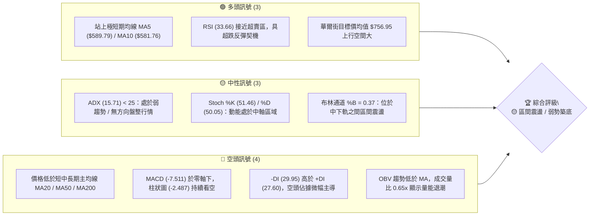
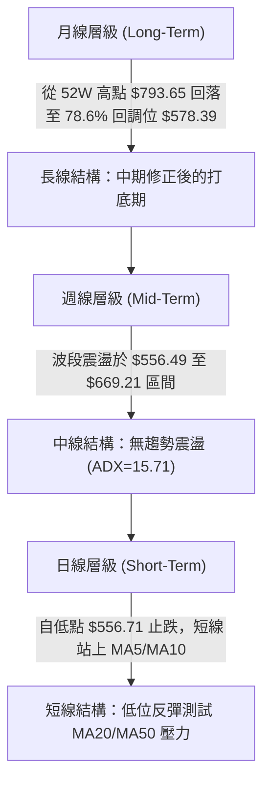
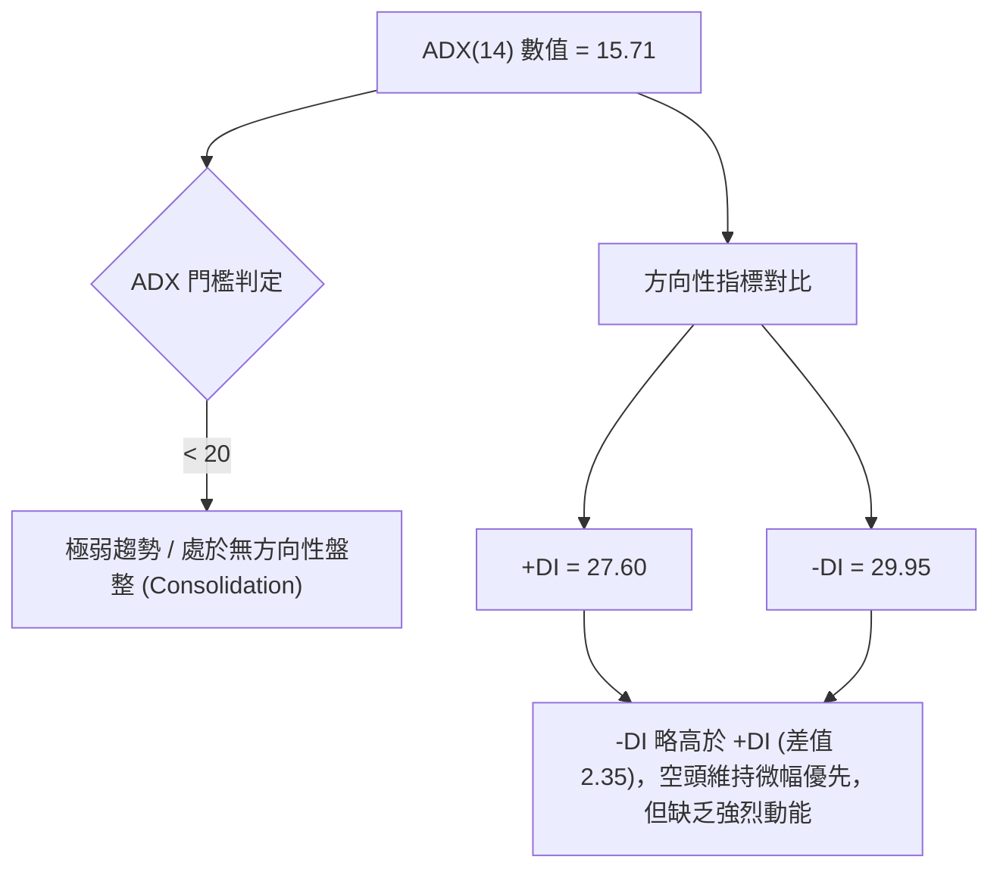
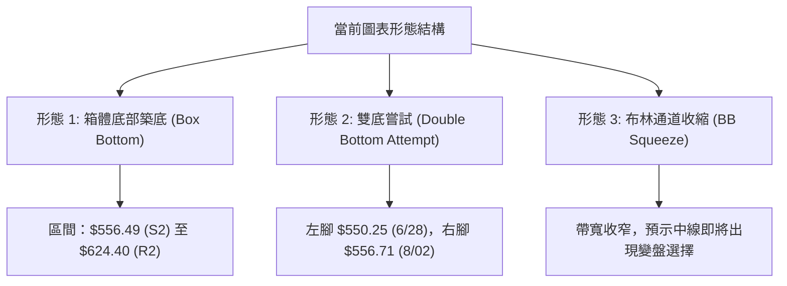
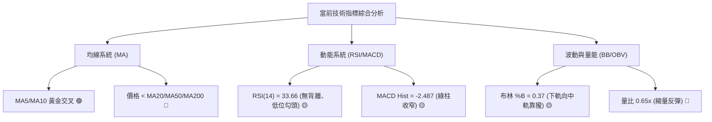
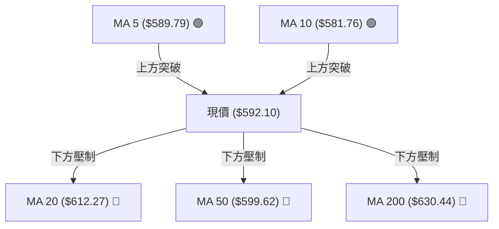
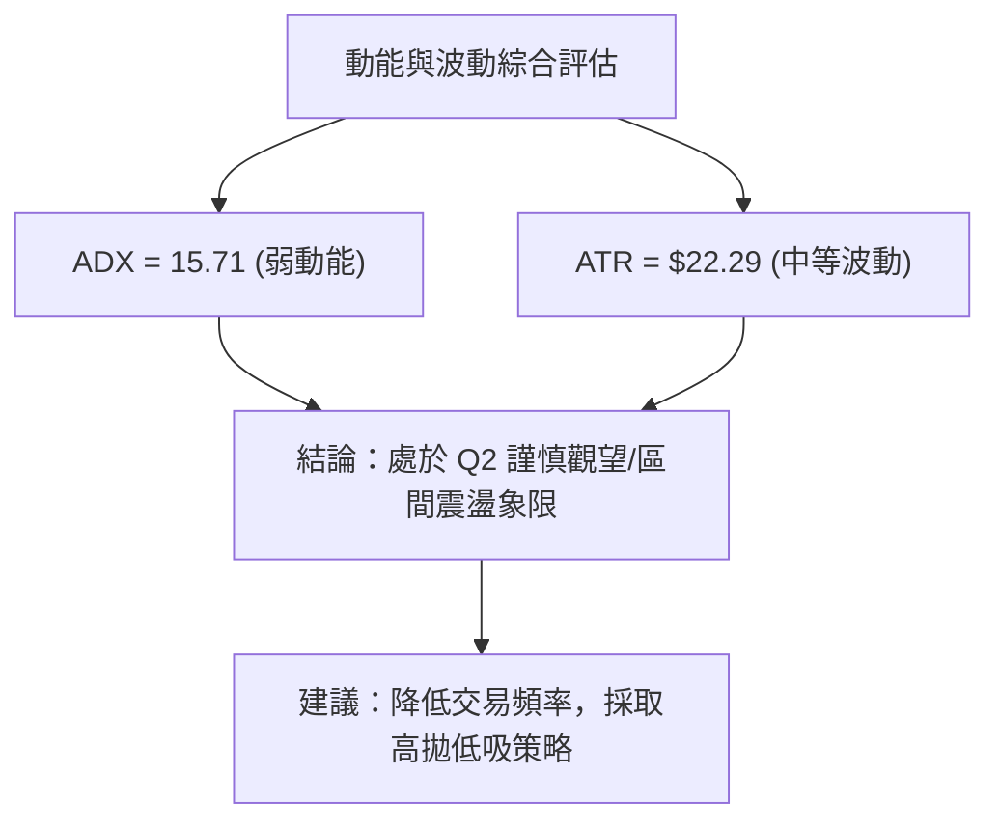
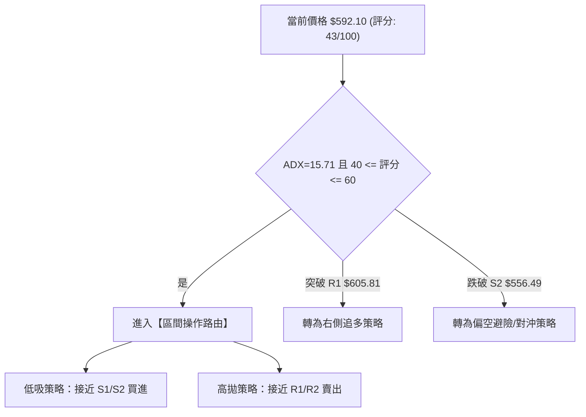
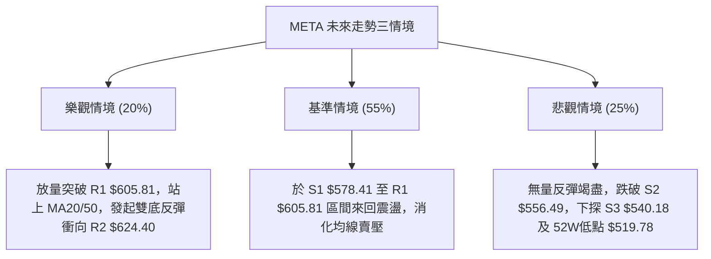

# META 技術分析報告

> **報告日期**：2026-08-09 ｜ **語言**：繁體中文 ｜ **數據來源**：Yahoo Finance ｜ **當前價格**：$592.10

---

## 目錄

| 章節 | 內容 |
|------|------|
| [1. 技術面概覽](#1-技術面概覽) | 訊號儀表板、核心指標、評分卡 |
| [2. 趨勢分析](#2-趨勢分析) | 多時框趨勢、長中短期走勢 |
| [3. 圖表形態分析](#3-圖表形態分析) | 形態識別、K線組合、目標價 |
| [4. 支撐與阻力](#4-支撐與阻力) | 關鍵價位、斐波那契回調 |
| [5. 技術指標深度解讀](#5-技術指標深度解讀) | MA/RSI/MACD/布林/成交量 |
| [6. 動能與波動率](#6-動能與波動率) | 動能評估、ATR、Beta |
| [7. 多時框架總結](#7-多時框架總結) | 時框架評分矩陣 |
| [8. 交易策略建議](#8-交易策略建議) | 多空策略、風險報酬比 |
| [9. 風險提示與監控](#9-風險提示與監控) | 監控指標、風險場景 |

---

## 1. 技術面概覽

### 🎯 技術訊號儀表板



### 📊 核心指標速覽表

| 指標類別 | 指標名稱 | 當前數值 | 訊號 | 解讀 |
|----------|----------|----------|------|------|
| **價格** | 當前價格 | $592.10 | 🟡 中性 | 處於 52 週區間 ($519.78 - $793.65) 之 26.4% 低位水準 |
| **均線** | MA20 | $612.27 | 🔴 空頭 | 價格位於 MA20 下方 (-3.29%)，短線反彈遭遇首道均線蓋頂 |
| **均線** | MA50 | $599.62 | 🔴 空頭 | 價格位於 MA50 下方 (-1.25%)，中期均線形成上方壓制 |
| **均線** | MA200 | $630.44 | 🔴 空頭 | 價格位於 MA200 下方 (-6.08%)，長期趨勢受壓 |
| **動能** | RSI(14) | 33.66 | 🟡 中性 | 位於 30-70 中性偏低區間，無明顯背離但具跌深反彈條件 |
| **動能** | MACD | -7.511 | 🔴 空頭 | MACD 柱狀圖為 -2.487，雙線於零軸下方運行，空頭占優 |
| **動能** | ADX(14) | 15.71 | 🟡 中性 | ADX < 25 判定為盤整/無趨勢行情，無強烈單邊趨勢 |
| **波動** | ATR(14) | $22.29 | 🟡 中性 | 佔當前股價 3.77%，每日波動幅度中等偏高，離場空間需拉寬 |
| **通道** | 布林通道 | %B = 0.37 | 🟡 中性 | 價格於下軌 $535.41 與中軌 $612.27 之間，往中軌靠攏 |
| **量能** | 成交量比 | 0.65x | 🔴 空頭 | 最新量 1,122.67 萬股低於 20 日均量 1,725.00 萬股，量能不足 |

### 🏆 技術評分卡

```
╔══════════════════════════════════════════════════════════════════╗
║                 技術評分卡 — META (2026-08-09)                    ║
╠══════════════════════════════════════════════════════════════════╣
║ 趨勢強度 (ADX) ███████░░░░░░░░░░░░░  35/100  🔴 弱趨勢/盤整      ║
║ 動能指標 (MACD)████████░░░░░░░░░░░░  40/100  🔴 空頭占優        ║
║ 支撐穩定度     █████████████░░░░░░░  65/100  🟡 78.6%斐波守住  ║
║ 成交量配合     ███████░░░░░░░░░░░░░  35/100  🔴 量能萎縮        ║
║ 形態完整度     ██████████░░░░░░░░░░  50/100  🟡 箱體底部震盪    ║
║ 均線排列       ██████░░░░░░░░░░░░░░  30/100  🔴 均線蓋頂        ║
╠══════════════════════════════════════════════════════════════════╣
║ 綜合技術評分   █████████░░░░░░░░░░░  43/100  🟡 區間震盪/弱勢築底║
╚══════════════════════════════════════════════════════════════════╝
```

---

## 2. 趨勢分析

### 🌐 多時框趨勢分析



### 📈 長期趨勢 — 12個月走勢圖（Unicode）

```
META 月線走勢圖（2025-08 至 2026-08）
價格軸 ($)
$780 ┤                            ● (2025-07 高點 $770.91)
$740 ┤        ●    ●   ●
$700 ┤                    ●
$660 ┤                ●       ●
$620 ┤                    ●       ●       ●
$580 ┤●                           ●   ●       ● (當前 $592.10)
$540 ┤                                ●
     └───────────────────────────────────────────────────────────
      08  09  10  11  12  01  02  03  04  05  06  07  08 (月份)
```

#### 走勢特徵分析表格

| 階段歷史 | 時間區間 | 收盤價區間 | 變動幅度 | 主要走勢特徵與量能變化 |
|----------|----------|------------|----------|------------------------|
| **高位拉回** | 2025-08 ~ 2025-11 | $736.29 → $646.27 | -12.23% | 自 $770 高點頂部回落，成交量自峰值溫和退潮 |
| **多頭衝高** | 2025-12 ~ 2026-01 | $658.91 → $715.22 | +8.55% | 展開強勁反彈測試 $715 高點，形成波段次高 |
| **探底深修** | 2026-02 ~ 2026-03 | $647.03 → $571.60 | -11.66% | 快速下殺探底，於 2026-03-29 觸及 $525.23 週低點 |
| **劇烈震盪** | 2026-04 ~ 2026-05 | $611.34 → $631.92 | +3.37% | 4月份快速反彈至 $687.91 週高後，5月大幅拉回 |
| **二次築底** | 2026-06 ~ 2026-08 | $563.29 → $592.10 | +5.11% | 於 $550-$556 區間尋求雙底支撐，目前小幅反彈 |

### 📊 中期趨勢（週線分析）

```
週線級別價格軌跡與壓力支撐示意圖：
$689.03 ─── 斐波 38.2% 回調位 / BB上軌區域 ──────────────────────────────
$656.71 ─── 斐波 50.0% 回調位 / 7月中旬高點 ($669.21) ───────────────
$624.40 ─── R2 壓力位 / 斐波 61.8% 回調位 ──────────────────────────────
$605.81 ─── R1 近期轉折阻力位 (與 MA20/MA50 重疊區) ───────────────────
$592.10 ─── ▲ 現價位置 (於 S1 與 R1 之間震盪)
$578.41 ─── S1 近期波段支撐位 / 斐波 78.6% 回調位 ($578.39) ─────────────
$556.49 ─── S2 次級強支撐位 / 2026年7月低點 ($556.71) ─────────────────
```

1. **週線波段特徵**：2026年7月初自 $550.25 強勢反彈至 2026-07-12 的 $669.21，隨後成交量退潮，連跌三週至 $556.71（2026-08-02 週），顯示上方套牢賣壓沉重，但下檔在 $556.49 (S2) 展現買盤支撐。
2. **均線與趨勢線**：目前週線 RSI 徘徊於 33.7，MACD 柱狀圖由 -11.160 收窄至 -2.487，提示週線級別下行動能正逐步減緩，進入底層箱體整理。

### ⚡ 趨勢強度評估（ADX 解讀）



#### ADX 趨勢強度對照表

| 指標項目 | 當前數值 | 參考標準區間 | 市場行情狀態 | 交易策略導向 |
|----------|----------|--------------|--------------|--------------|
| **ADX(14)** | **15.71** | < 25 (弱趨勢) | 盤整 / 無趨勢行情 | **嚴格採取區間操作（箱體高拋低吸）** |
| **+DI(14)** | **27.60** | 0 - 100 | 多頭力道弱化 | 不宜盲目追高 |
| **-DI(14)** | **29.95** | 0 - 100 | 空頭力道微幅佔優 | 防範跌破 S1/S2 支撐風險 |

---

## 3. 圖表形態分析

### 🔍 形態識別系統



#### 形態信心度與目標價計算表

| 形態名稱 | 信心度 | 判斷依據（引用數據） | 完成度 | 目標價計算公式與精確數值 |
|----------|--------|----------------------|--------|--------------------------|
| **箱體震盪** | **75%** | 價格於 S2 ($556.49) 與 R2 ($624.40) 之間高低點反覆測試 | 85% | **箱體頂部目標** = $624.40 (R2) |
| **雙底結構** | **45%** | 兩次落腳於 2026-06-28 ($550.25) 與 2026-08-02 ($556.71) | 40% | 頸線 R1 ($605.81) - 低點 S2 ($556.49) = $49.32 高度。<br/>突破目標價 = $605.81 + $49.32 = **$655.13** |
| **均線死叉** | **80%** | 短期 MA20 ($612.27) 位於 MA200 ($630.44) 下方 | 100% | 壓制回測目標 = S1 (**$578.41**) |

*註：由於 ADX 僅 15.71，雙底形態尚未突破頸線 $605.81，信心度低於 50%，報告後續將以「區間箱體震盪」做為核心交易邏輯。*

### 🕯️ 重要 K 線形態分析

| 月份/日期 | 收盤價 | 關鍵 K 線形態 | 技術解讀 | 多空訊號 |
|-----------|--------|---------------|----------|----------|
| **2026-06-28** | $550.25 | 波段低位長下影線 | 於 52 週低點附近引發抄底買盤，形成第一隻腳 | 🟢 買盤進駐 |
| **2026-07-12** | $669.21 | 大陽線衝高回落 | 反彈受阻於 50% 斐波位 ($656.71) 上方，長上影線 | 🔴 蓋頂賣壓 |
| **2026-08-02** | $556.71 | 低位小陰線縮量 | 回測 S2 支撐位（$556.49），成交量萎縮，空頭衰竭 | 🟡 止跌訊號 |
| **2026-08-09** | $592.10 | 溫和中陽線 | 自 S2 反彈，收復 MA5 ($589.79) 與 MA10 ($581.76) | 🟢 短線反彈 |

### 📉 ASCII 走勢形態示意圖

```
META 雙底築底與箱體震盪形態示意圖 ($)
$642.40 ┤------------------------------------------- R3 阻力線
$624.40 ┤........................................... R2 箱體頂部
$605.81 ┤--------------- 頸線 (R1) -----------------
        │                  ▲ (07-12: $669.21)
$592.10 ┤............/ \.............現價 $592.10
        │           /   \     /
$578.41 ┤----------/-----\---/---------------------- S1 支撐線
        │  ●(06-28)       \ / ●(08-02)
$556.49 ┤--$550.25--------- $556.71 ---------------- S2 箱體底部
```

---

## 4. 支撐與阻力

### 🗺️ 關鍵價位分布圖（Unicode）

```
META 價位結構分布圖
═════════════════════════════════════════════════════════════════
$793.65 ║████████████████████████████████████████║ 52週歷史高點 (0.0% Fib)
$689.03 ║██████████████████████                  ║ 布林上軌 / 38.2% Fib
$656.71 ║████████████████                        ║ 50.0% Fib 回調位
$642.40 ║██████████████                          ║ 強阻力位 R3
$624.40 ║████████████                            ║ 阻力位 R2 / 61.8% Fib
$605.81 ║████████                                ║ 近期阻力位 R1 / 頸線
$592.10 ╠════════════════════════════════════════╣ ◄ 當前價格 $592.10
$578.41 ║▓▓▓▓▓▓▓▓                                ║ 近期支撐位 S1 / 78.6% Fib ($578.39)
$556.49 ║▓▓▓▓▓▓▓▓▓▓▓▓                            ║ 次級強支撐位 S2 / 7月低點
$540.18 ║▓▓▓▓▓▓▓▓▓▓▓▓▓▓                          ║ 強力支撐位 S3
$519.78 ║▓▓▓▓▓▓▓▓▓▓▓▓▓▓▓▓▓▓▓▓                    ║ 52週歷史低點 (100.0% Fib)
═════════════════════════════════════════════════════════════════
```

### 🚧 阻力位分析表

| 阻力級別 | 精確價位 | 形成原因與技術重疊 | 突破難度 | 戰略重要性 |
|----------|----------|--------------------|----------|------------|
| **R1** | **$605.81** | 近一年波段高點聚類 / 接近 MA20 ($612.27) 與 MA50 ($599.62) | 🟡 中等 | **短線多空分水嶺**，突破方能擺脫空頭壓制 |
| **R2** | **$624.40** | 近一年波段高點聚類 / 斐波那契 61.8% 回調位 ($624.40) | 🔴 偏高 | **中期箱體上軌**，解套賣壓集中區 |
| **R3** | **$642.40** | 近一年波段高點聚類 / 接近 MA200 ($630.44) | 🔴 極高 | **牛熊牛角尖關卡**，需配合大盤與成交量放量突破 |

### 🛡️ 支撐位分析表

| 支撐級別 | 精確價位 | 形成原因與技術重疊 | 守住機率 | 戰略重要性 |
|----------|----------|--------------------|----------|------------|
| **S1** | **$578.41** | 近一年波段低點聚類 / 斐波那契 78.6% 回調位 ($578.39) | 🟢 65% | **短線防守第一線**，跌破則轉向弱勢 |
| **S2** | **$556.49** | 近一年波段低點聚類 / 2026年7-8月低點聚類 ($556.71) | 🟢 75% | **多頭防線大本營**，箱體下軌保護點 |
| **S3** | **$540.18** | 近一年波段低點聚類 / 接近布林通道下軌 ($535.41) | 🟢 85% | **極端行情最後防線**，臨近52週低點 ($519.78) |

### 📐 斐波那契回調位分析

*以 52 週波段高點 **$793.65** 至波段低點 **$519.78** 為基準（總波段幅員 $273.87）：*

```
0.0%  (52W High)   $  793.65 ──────────────────────────────────────
23.6%              $  729.02 ──────────────────────────────────────
38.2%              $  689.03 ─── 布林通道上軌 ($689.12)
50.0%              $  656.71 ─── 中期強弱中軸位
61.8%              $  624.40 ─── 阻力位 R2
78.6%              $  578.39 ─── 支撐位 S1 ($578.41) 附近
100.0% (52W Low)   $  519.78 ──────────────────────────────────────
```

**斐波那契定位解讀**：
當前價格 **$592.10** 精確運行於 **78.6% ($578.39)** 與 **61.8% ($624.40)** 回調位形成的黃金分割黃金箱體區間內。價格在 78.6% ($578.39) 展現出極強的技術性支撐買盤，使得該位置（重疊 S1 $578.41）成為目前築底的核心基石；上方首要挑戰為 61.8% ($624.40)，若能實體突破，將正式宣告深幅回調結束。

---

## 5. 技術指標深度解讀

### 🎛️ 指標訊號總覽



### 📈 移動平均線排列分析



#### 移動平均線結構表格

| 均線天期 | 當前價位 | 均線方向 | 價格相對位置 | 變動幅度 | 技術解讀 |
|----------|----------|----------|--------------|----------|----------|
| **MA 5** | $589.79 | ▲ 向上 | 價格在其上方 | +0.39% | 超短線極強反彈，提供護盤力道 |
| **MA 10** | $581.76 | ▲ 向上 | 價格在其上方 | +1.78% | 短線止跌，短期均線現黃金交叉 |
| **MA 20** | $612.27 | ▼ 向下 | 價格在其下方 | -3.29% | 月線走空，上方首道實體均線賣壓 |
| **MA 60** | $601.82 | ▼ 向下 | 價格在其下方 | -1.61% | 季線下彎，與 MA50 形成雙重壓力帶 |
| **MA 120**| $614.69 | ▼ 向下 | 價格在其下方 | -3.68% | 半年線向下扣高，壓制中期反彈 |
| **MA 240**| $648.62 | ▼ 向下 | 價格在其下方 | -8.71% | 年線長線走勢疲軟 |

### 📉 RSI(14) 分析

```
RSI(14) 動能進度條
0 ─── 超賣 30 ───────────── 當前 33.66 ───────────────── 70 超買 ── 100
[████████████████░░░░░░░░░░░░░░░░░░░░░░░░░░░░░░░░░░░░░] 33.66
```

1. **極值判斷**：RSI 目前位於 **33.66**，遠離 70 超買區，位於 30 附近之低位區，顯示過去數週賣壓已得到充分宣洩。
2. **背離判斷**：近 20 週數據顯示，2026-08-02 週收盤 $556.71 對應 RSI 22.9；當前收盤 $592.10 對應 RSI 33.7。RSI 隨價格回升，**無頂背離亦無底背離**，呈現標準指標修復走勢。

### 📊 MACD(12/26/9) 訊號解讀

* **DIF (MACD 線)**：-7.511
* **DEA (Signal 線)**：-5.024
* **MACD 柱狀圖**：-2.487 (🔴 看空但空頭動能減弱)

```
MACD 柱狀圖近 5 週演變軌跡：
2026-07-12: +11.167  ██████████ (多頭鼎盛)
2026-07-19: +8.220   ████████   (多頭退潮)
2026-07-26: -4.515   ░░░        (轉空)
2026-08-02: -11.160  ░░░░░░░░░░ (空頭峰值)
2026-08-09: -2.487   ░░         (綠柱大幅縮短，空頭衰竭)
```

**解讀**：柱狀圖負值大幅收縮（自 -11.160 縮窄至 -2.487），表明賣盤減弱，若 DIF 線能向上穿過 Signal 線形成零軸下黃金交叉，將引發第一波技術性空頭平倉買盤。

### 📦 布林通道分析

```
META 日線布林通道結構示意圖
$689.12 ────────────────────────────────────────── BB 上軌 (Upper)
        │
$612.27 ────────────────────────────────────────── BB 中軌 (MA20)
        │          ▲ 現價 $592.10 (%B = 0.37)
$535.41 ────────────────────────────────────────── BB 下軌 (Lower)
```

1. **通道位置**：%B 為 **0.37**，價格位於下軌 ($535.41) 與中軌 ($612.27) 之間的中下軌通道。
2. **帶寬特性**：布林上下軌距離約 $153.71，價格正自下軌向中軌 ($612.27) 靠攏，中軌同時為 MA20 所在，構成短線反彈的強壓力位。

### 💹 成交量分析（量價配合度）

1. **成交量對比**：最新日成交量 11,226,700 股，對比 20 日均量 17,250,060 股（量比 **0.65x**），呈現顯著縮量狀態。
2. **OBV 能量潮**：數據顯示 OBV < MA，代表資金流出趨勢尚未逆轉。目前反彈屬於「無量乾彈」，若欲有效突破 R1 ($605.81)，日成交量必須放大至 20 日均量（1,725萬股）以上。

---

## 6. 動能與波動率

### ⚡ 動能評估四象限

| 象限分類 | 動能強度 | 波動率 | 當前狀態判定 | 交易策略指導 |
|----------|----------|--------|--------------|--------------|
| **Q1 (最佳機會)** | 強 (+DI > -DI) | 低 (ATR縮小) | ❌ 非當前狀態 | 順勢加碼 |
| **Q2 (謹慎觀望)** | **弱 (ADX=15.71)**| **低/中 (ATR=3.77%)** | **✓ 當前 META 狀態** | **區間操作 / 控管倉位** |
| **Q3 (高風險高收益)**| 強 (+DI > -DI) | 高 (ATR擴大) | ❌ 非當前狀態 | 突破追價 |
| **Q4 (避免進場)** | 弱 (-DI > +DI) | 高 (ATR擴大) | ❌ 非當前狀態 | 觀望 / 嚴設止損 |



### 📊 ATR 波動率分析

* **ATR(14)**：$22.29（佔價格 **3.77%**）
* **波幅應用建議**：
  * **超短線止損距離 (1.0x ATR)**：$22.29
  * **標準波段止損距離 (1.5x ATR)**：$33.44
  * **寬鬆趨勢止損距離 (2.0x ATR)**：$44.58

**應用**：以當前進場價 $592.10 計算，若建立多頭部位，標準止損應設定於 $592.10 - $33.44 = **$558.66** 附近（與次級強支撐位 S2 $556.49 形成雙重保護）。

### 📐 Beta 與市場相關性

* **Beta 係數**：**1.243**
* **解讀**：META 的波動度較標普500指數高出約 24.3%。在大盤環境處於震盪時，META 個股將呈現放大效應，適合利用支撐阻力位進行波段價差操作。

---

## 7. 多時框架總結

### 📋 時框架評分表

| 時框架 | 趨勢方向 | 動能狀態 | 均線排列 | 形態結構 | 綜合評分 | 戰略建議 |
|--------|----------|----------|----------|----------|----------|----------|
| **月線 (Long)** | 🟡 震盪 | 🟡 中性 | 🟡 混合 | 長期高位震盪 | **55/100** | 長線分批建倉 |
| **週線 (Mid)** | 🔴 偏空 | 🔴 疲弱 | 🔴 死叉蓋頂 | 箱體底部築底 | **40/100** | 中線等待突破 |
| **日線 (Short)**| 🟢 反彈 | 🟡 低位金叉 | 🟢 站上MA5/10 | 低位反彈測試 | **50/100** | 短線區間價差 |

### 🔲 綜合訊號矩陣

```
┌─────────────────┬─────────────────┬─────────────────┐
│ 短期 (1-5日)    │ 中期 (2-6週)    │ 長期 (1-3季)    │
│ 🟢 看多 (反彈)   │ 🟡 中性 (箱體)  │ 🟡 中性 (打底)  │
├─────────────────┼─────────────────┼─────────────────┤
│ 主導因素：      │ 主導因素：      │ 主導因素：      │
│ 跌深反彈，站上  │ ADX=15.71 弱趨勢│ 78.6%斐波位守住 │
│ MA5/MA10        │ 受制於 MA20/MA50│ 基本面 P/E 22.3 │
└─────────────────┴─────────────────┴─────────────────┘
```

### ⚖️ 多時框收斂結論

依「多時框收斂規則」：當前 **ADX(14) = 15.71 (< 25)**，明確判定市場處於**盤整行情（Consolidation Market）**。
日線短線雖展現反彈（站上 MA5/10），但週線與中期均線（MA20 $612.27、MA50 $599.62）仍在上方形成重壓。收斂結論為：**中期箱體震盪（$556.49 - $624.40），短線具反彈動能但受限於阻力位 R1/R2**。主策略必須採用**箱體區間操作**，不可盲目追高。

---

## 8. 交易策略建議

### 🗺️ 策略決策流程圖



### 🧭 策略路由

**當前主策略方向 = 🟡 區間高拋低吸 (Range Bound Trading)（依評分 43/100）**

### 🎯 價格情境階梯（Price Scenarios）

| 觸發條件 | 下一目標 | 後續延伸 | 情境技術含義 |
|----------|----------|----------|--------------|
| **突破 R1 $605.81** | R2 $624.40 | R3 $642.40 | 短線轉強，完成雙底頸線突破 |
| **站穩現價區間 ($578.41-$605.81)** | — | — | 於 MA10 與 MA20 之間築底震盪 |
| **跌破 S1 $578.41** | S2 $556.49 | S3 $540.18 | 中期轉弱，再次回測箱體底部 |

### 📊 情境機率分佈

| 情境劇本 | 機率 | 主要技術依據 |
|----------|------|--------------|
| **區間震盪 ($556.49 - $624.40)** | **55%** | ADX 15.71 處於無趨勢狀態，量能 0.65x 不足放量 |
| **回落再探底 (測試 S1/S2)** | **25%** | 上方 MA20/MA50 蓋頂，MACD 零軸下方空頭佔優 |
| **強勢突破 (突破 R1/R2)** | **20%** | RSI 33.66 低位反彈，離分析師均值 $756.95 具拉升空間 |

---

### 🟢 主策略詳情（區間操作與波段佈局）

#### 策略 A：左側低吸/波段做多（主推策略）

```
做多交易計畫結構圖：
$624.40 ────────────────────────────────────────── 目標價 T2
$605.81 ────────────────────────────────────────── 目標價 T1
$592.10 ───────────────── 現價進場區 ─────────────── 進場點
$556.49 ────────────────────────────────────────── 止損點 (S2下方)
```

| 策略要素 | 策略 A（低位做多） | 策略 B（突破加碼多） |
|----------|────────────────────|──────────────────────|
| **進場條件** | 價格回測 S1 ($578.41) 附近或現價區間止跌 | 放量突破阻力位 R1 ($605.81) 並站穩 |
| **進場價格** | **$578.41 - $592.10** | **$606.00 - $608.00** |
| **目標價 T1**| **$605.81** (R1 阻力位) | **$624.40** (R2 阻力位) |
| **目標價 T2**| **$624.40** (R2 阻力位) | **$642.40** (R3 阻力位) |
| **止損價格** | **$556.49** (S2 支撐位下方) | **$589.79** (MA5 附近) |
| **風險報酬比**| **2.18 : 1** [(624.40-578.41)/(578.41-556.49)] | **2.13 : 1** [(642.40-606)/(606-589.79)] |
| **勝率評估** | **58%** | **52%** |
| **建議倉位** | **15% - 20%** (輕倉/中倉) | **10%** (順勢加碼) |

---

#### 🔴 策略 C：右側高空/避險對沖（備選策略）

| 策略要素 | 策略 C（高壓放空/反向觸發點） |
|----------|──────────────────────────────|
| **進場條件** | 反彈至 R2 ($624.40) 遇阻，或跌破 S2 ($556.49) |
| **進場價格** | **$624.40** (R2 阻力位) 或 跌破 **$556.00** 追空 |
| **目標價 T1**| **$578.41** (S1) |
| **目標價 T2**| **$556.49** (S2) / **$540.18** (S3) |
| **止損價格** | **$630.44** (MA200 突破止損) |
| **風險報酬比**| **2.24 : 1** [(624.40-578.41)/(630.44-624.40)] |
| **建議倉位** | **10%** (避險保護) |

### 🔴 反向風險觸發點（對沖提示）

若 META 日線收盤價跌破 **$556.49 (S2)**，代表雙底嘗試宣告失敗，形態轉為下軌破位，將打開向 S3 ($540.18) 及 52 週低點 ($519.78) 的下行通道。此時多頭部位必須嚴格止損離場，並可考慮啟動策略 C 進行對沖。

### ⭐ 整體訊號強度評星

```
做多訊號強度：★★☆☆☆  (2/5 星 — 受限於 MA 蓋頂與弱量能)
做空訊號強度：★★★☆☆  (3/5 星 — 均線空頭排列但下跌動能減弱)
整體可信度：  ★★★☆☆  (3/5 星 — ADX 低，適合箱體震盪交易)
```

---

## 9. 風險提示與監控

### ✅ 關鍵監控指標 Checklist

```
╔══════════════════════════════════════════════════════════════════╗
║                   每日交易前技術監控 CheckList                  ║
╠══════════════════════════════════════════════════════════════════╣
║ [ ] 1. 價格是否站穩 MA5 ($589.79) 與 MA10 ($581.76) 上方        ║
║ [ ] 2. 日成交量是否放大至 1,725 萬股 (20日均量) 以上             ║
║ [ ] 3. MACD 柱狀圖是否持續收窄並向上交叉（突破 0 軸）            ║
║ [ ] 4. RSI(14) 是否成功突破 40 並站上 50 中軸                    ║
║ [ ] 5. 價格挑戰 R1 ($605.81) 時是否出現長上影線賣壓              ║
║ [ ] 6. 價格回測 S1 ($578.41) 時是否有實體支撐買盤                ║
╚══════════════════════════════════════════════════════════════════╝
```

### ⚠️ 風險場景分析



### 🛡️ 風險管理重要提醒

1. **量能不濟風險**：最新成交量僅 1,122.67 萬股（均量 65%），無量反彈極易在阻力位 R1 ($605.81) 或 MA20 ($612.27) 遭遇空頭拉回，切忌追高。
2. **均線壓制風險**：MA20 ($612.27)、MA50 ($599.62) 與 MA200 ($630.44) 均在上方形成密集阻力帶，多頭突破需消耗大量資金。
3. **資金管理規則**：單一交易部位止損金額不得超過總投資組合權益的 **1.5% - 2.0%**。建議採用分批建倉法（如：S1 附近建立 50% 預備倉，突破 R1 確認後加碼 50%）。

---

## 📋 報告總結

```
╔══════════════════════════════════════════════════════════════════╗
║                     META 技術分析報告總結                        ║
════════════════════════════════════════════════════════════════════
報告日期：2026-08-09
當前價格：$592.10
綜合評級：🟡 區間震盪 / 弱勢築底 (43/100)

關鍵技術結構結論：
├─ 長期趨勢 (月線)：🟡 自高點拉回，於 78.6% 斐波位 ($578.39) 尋求長線支撐
├─ 中期趨勢 (週線)：🔴 均線蓋頂，ADX=15.71 呈現無趨勢箱體震盪
├─ 短期趨勢 (日線)：🟢 自 S2 ($556.49) 反彈，短線站上 MA5/MA10
├─ 關鍵支撐：S1 $578.41 ｜ S2 $556.49
├─ 關鍵阻力：R1 $605.81 ｜ R2 $624.40
└─ 分析師目標價：$756.95 (均值) / $580.00 (低點) / $1000.00 (高點)

最優交易策略組合：
1. 🥇 首選策略 (低吸做多)：於 $578.41 - $592.10 區間建立左側多頭，
                         止損設 $556.49，目標 $605.81 / $624.40
2. 🥈 次選策略 (右側突破)：突破 $605.81 並放量確認後追多，目標 $624.40
3. 🥉 保守選擇 (高拋對沖)：若反彈至 $624.40 附近受阻，建立波段空單
════════════════════════════════════════════════════════════════════
```

---

> ⚠️ **免責聲明**：本報告為 AI 自動生成之技術分析，所有數據及估算均基於提供的歷史價格資訊（截至 2026-08-09）。本報告**僅供研究與學術參考**，**不構成任何投資建議與買賣依據**。投資有風險，入市需謹慎，交易前請務必自行評估個人風險承受能力。

---

*報告生成時間：2026-08-09 ｜ 數據來源：Yahoo Finance ｜ 分析框架：多時框技術分析*