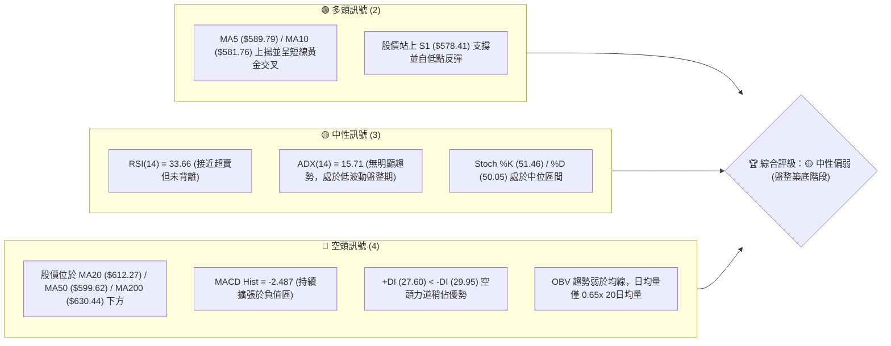
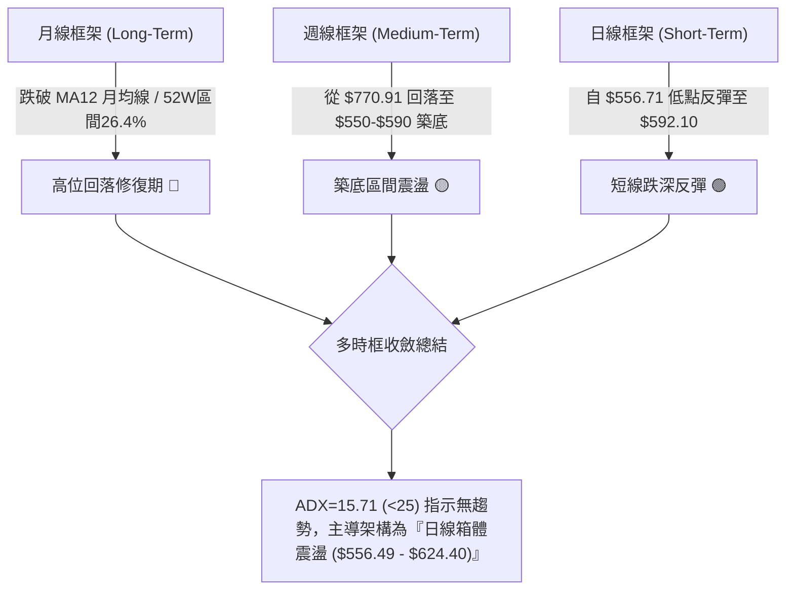
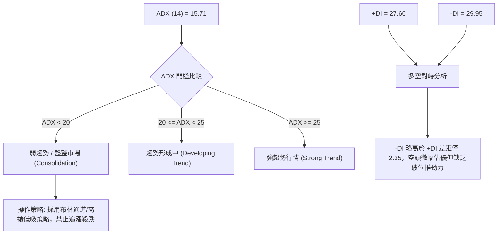
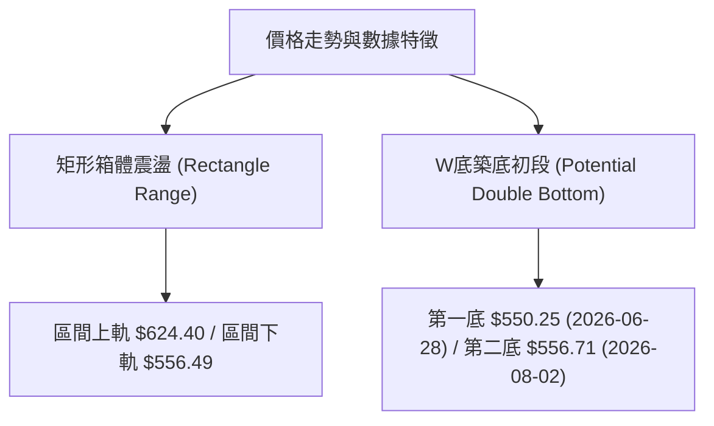
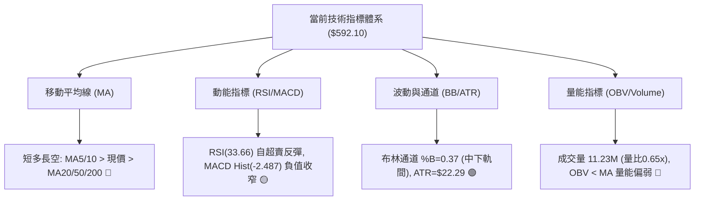
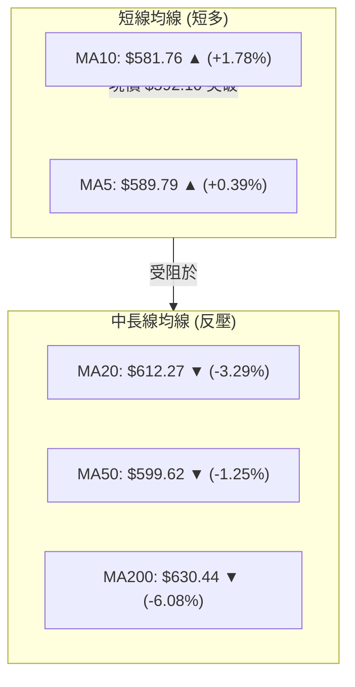
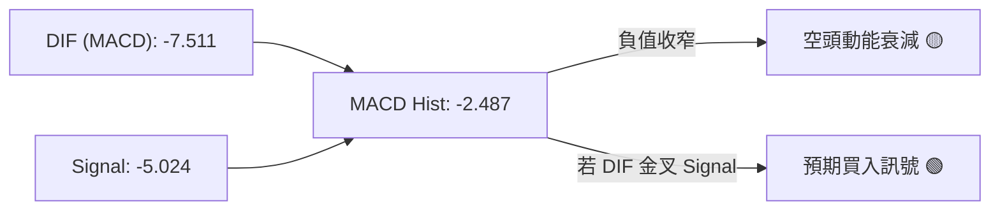
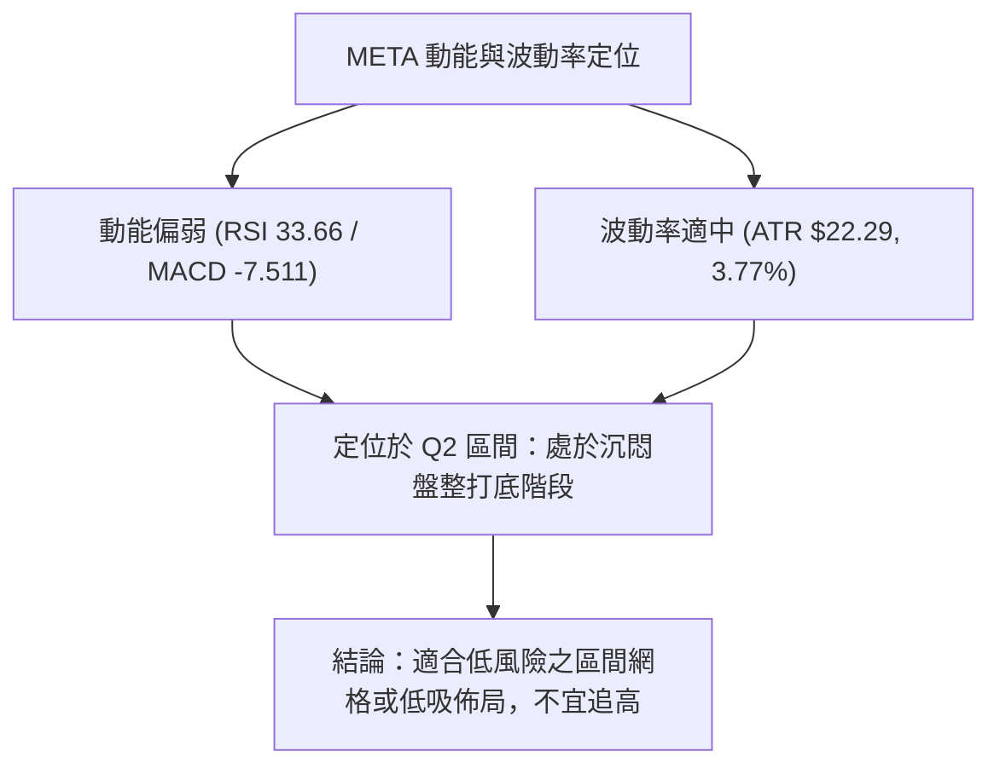
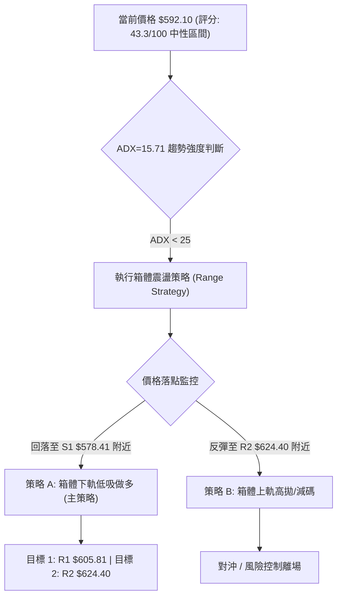
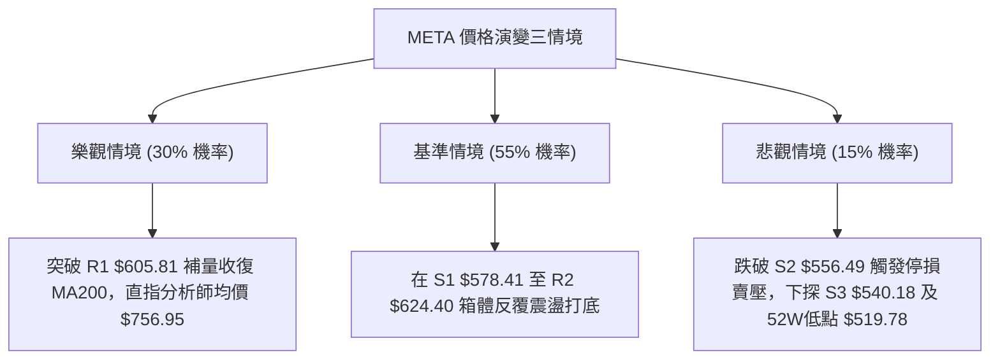

# META 技術分析報告

> **報告日期**：2026-08-10 ｜ **語言**：繁體中文 ｜ **數據來源**：Yahoo Finance ｜ **當前價格**：$592.10

---

## 目錄

| 章節 | 內容 |
|------|------|
| [1. 技術面概覽](#1-技術面概覽) | 訊號儀表板、核心指標、評分卡 |
| [2. 趨勢分析](#2-趨勢分析) | 多時框趨勢、長中短期走勢 |
| [3. 圖表形態分析](#3-圖表形態分析) | 形態識別、K線組合、目標價 |
| [4. 支撐與阻力](#4-支撐與阻力) | 關鍵價位、斐波那契回調 |
| [5. 技術指標深度解讀](#5-技術指標深度解讀) | MA/RSI/MACD/布林/成交量 |
| [6. 動能與波動率](#6-動能與波動率) | 動能評估、ATR、Beta |
| [7. 多時框架總結](#7-多時框架總結) | 時框架評分矩陣 |
| [8. 交易策略建議](#8-交易策略建議) | 多空策略、風險報酬比 |
| [9. 風險提示與監控](#9-風險提示與監控) | 監控指標、風險場景 |

---

## 1. 技術面概覽

### 🎯 技術訊號儀表板



### 📊 核心指標速覽表

| 指標類別 | 指標名稱 | 當前數值 | 訊號 | 解讀 |
|----------|----------|----------|------|------|
| **價格** | 當前價格 | $592.10 | 🟡 中性 | 位於 52週區間 ($519.78 - $793.65) 之 26.4% 分位 |
| **均線** | MA5 / MA10 | $589.79 / $581.76 | 🟢 看多 | 短線突破 5 日與 10 日均線，呈短多反彈 |
| **均線** | MA20 | $612.27 | 🔴 看空 | 股價位於 MA20 下方 (-3.29%)，月線反壓 |
| **均線** | MA50 | $599.62 | 🔴 看空 | 股價位於 MA50 下方 (-1.25%)，季線扣高 |
| **均線** | MA200 | $630.44 | 🔴 看空 | 股價位於 MA200 下方 (-6.08%)，長期防線失守 |
| **動能** | RSI(14) | 33.66 | 🟡 中性 | 自低檔 22.9 區間反彈，接近超賣區偏向尋求支撐 |
| **動能** | MACD(12,26,9)| -7.511 / -5.024 | 🔴 看空 | DIF 與 MACD 均在零軸下方，DIF-Signal = -2.487 |
| **趨勢** | ADX(14) | 15.71 | 🟡 盤整 | ADX < 25 表示無強烈單邊趨勢，屬於區間整理行情 |
| **通道** | 布林通道 %B | 0.37 | 🟡 中性 | 股價位於中軌 ($612.27) 與下軌 ($535.41) 之間 |
| **量能** | 20日量比 | 0.65x | 🔴 看空 | 當日 11.23M vs 20日均量 17.25M，反彈縮量 |
| **波動** | ATR(14) | $22.29 | 🟢 適中 | 每日波幅占股價 3.77%，波動率處於可控區間 |

### 🏆 技術評分卡

```
╔══════════════════════════════════════════════════════════════════╗
║              META 技術評分卡 — 2026-08-10                        ║
╠══════════════════════════════════════════════════════════════════╣
║  趨勢強度      ██████░░░░░░░░░░░░░░  30/100  🔴 空頭控制        ║
║  動能指標      ████████░░░░░░░░░░░░  40/100  🟡 低檔修復        ║
║  支撐穩定度    ██████████████░░░░░░  70/100  🟢 S1/S2強支撐     ║
║  成交量配合    ████████░░░░░░░░░░░░  40/100  🟡 反彈缺乏遞增量  ║
║  形態完整度    ██████████░░░░░░░░░░  50/100  🟡 箱體築底初段    ║
║  均線排列      ██████░░░░░░░░░░░░░░  30/100  🔴 空頭混合排列    ║
╠══════════════════════════════════════════════════════════════════╣
║  綜合評分      █████████░░░░░░░░░░░  43.3/100  🟡 中性偏弱 (區間)  ║
╚══════════════════════════════════════════════════════════════════╝
```

---

## 2. 趨勢分析

### 🌐 多時框趨勢分析



### 📈 長期趨勢 — 12個月走勢圖（Unicode）

```
META 月線走勢圖（過去 12 個月：2025-08 ~ 2026-08）
價格軸 ($)
$780 ┤                            ● 770.91 (2025-07 峰值)
$740 ┤                ● 735.68    █ 736.29
$700 ┤        ● 715.22            █
$660 ┤        █        ● 658.91    █
$620 ┤        █        █  ● 631.92 █
$580 ┤● 592.10(現價)   █  █        █
$540 ┤                 ● 556.71 (2026-07 低點)
     └──────────────────────────────────────────────────────────
       25-08  25-10  25-12  26-02  26-04  26-06  26-08 (目前)
```

**走勢特徵分析表格**：

| 時間段 | 收盤區間 ($) | 漲跌幅 (%) | 階段特徵與結構解析 |
|--------|--------------|------------|--------------------|
| **2025-08 ~ 2025-09** | $736.29 ➔ $732.47 | -0.52% | 高檔橫盤，多頭動能耗盡，形成雙頂疑慮 |
| **2025-10 ~ 2025-12** | $646.67 ➔ $658.91 | -10.04% | 獲利回吐賣壓湧現，跌破 MA50 季線尋求支撐 |
| **2026-01 ~ 2026-03** | $715.22 ➔ $571.60 | -20.08% | 1月反彈無力後遭受強烈賣壓，3月暴跌進入熊市修正 |
| **2026-04 ~ 2026-05** | $611.34 ➔ $631.92 | +10.55% | 跌深技術性反彈，受阻於 MA200 降速線 |
| **2026-06 ~ 2026-07** | $563.29 ➔ $556.71 | -11.90% | 再次下探測試 52週低點區域 ($519.78-$556.49) |
| **2026-08 (最新)** | $592.10 | +6.36% | 低檔拉出下影線，出現止跌尋求右側底之跡象 |

### 📊 中期趨勢（週線分析）

近 20 週數據顯示，META 從 2026-04-19 的高點 $687.91 週線收盤一路下探，至 2026-08-02 週線觸及低點 $556.71 (RSI達22.9之極值超賣區)，隨後於 2026-08-09 止跌回升至 $592.10，週線 RSI 回升至 33.7，MACD 柱狀體由 -11.160 收窄至 -2.487。

```
週線壓力與支撐示意圖
╔══════════════════════════════════════════════════════════════════╗
║  強壓力 R2: $624.40  ════════════════════════════ (前波反彈高點) ║
║  近壓位 R1: $605.81  ──────────────────────────── (MA20/MA50重疊區)║
║  當前價格:  $592.10  ◄─────── [目前在此區域震盪修復]               ║
║  近支撐 S1: $578.41  ──────────────────────────── (Fib 78.6% 回調)║
║  強支撐 S2: $556.49  ════════════════════════════ (近一年波段次低)║
╚══════════════════════════════════════════════════════════════════╝
```

### ⚡ 趨勢強度評估（ADX 解讀）



| ADX 數值區間 | 當前位置 | 行情形態 | 推薦交易工具 |
|--------------|----------|----------|--------------|
| **0 - 20** | **15.71 █** | **無趨勢無方向/箱體震盪** | **RSI/Stochastic/布林通道** |
| **20 - 25** | | 趨勢蓄勢階段 | 突破預警 / 移動止損 |
| **25 - 50** | | 強烈趨勢行情 | MA均線系統 / MACD 追蹤 |
| **50 - 100** | | 極端單邊行情 | 嚴格執行分批獲利出場 |

---

## 3. 圖表形態分析

### 🔍 形態識別系統



#### 形態信心度與目標價評估表

| 形態名稱 | 信心度 | 判斷依據（引用數據） | 完成度 | 目標價計算式與精確數值 |
|----------|--------|----------------------|--------|------------------------|
| **雙重底 (W底)** | 60% | 兩次下探低點 $550.25 與 $556.71 均在 S2 ($556.49) 附近獲得強大支撐 | 55% | 頸線 $624.40 + (頸線 $624.40 - 低點 $556.49 = $67.91) = **$692.31** (衍生推算) |
| **箱體震盪** | 85% | ADX=15.71，價格完全受制於 R2 ($624.40) 與 S2 ($556.49) 之間 | 90% | 箱體上軌目標 **$624.40** (以數據庫 R2 為準) |

### 🕯️ 重要K線形態分析

| 日期/週別 | 收盤價 ($) | K線形態 | 技術解讀 | 訊號強度 |
|-----------|------------|---------|----------|----------|
| **2026-07-05** | $582.90 | 晨星 / 強力反彈 | 自 low $550.25 拉升，RSI 自 35.3 跳升至 53.5 | 🟢 強多 |
| **2026-07-12** | $669.21 | 大陽線突破 | 帶量拉升突破 MA20，MACD 柱狀高達 +11.167 | 🟢 強多 |
| **2026-07-26** | $595.19 | 長陰包覆 | 受阻於 $689.03 (Fib 38.2%) 壓力落回，回吞漲幅 | 🔴 強空 |
| **2026-08-02** | $556.71 | 探底鎚頭線 | 測試 $556.49 支撐後留出下影線，RSI 觸及 22.9 極端值 | 🟢 止跌 |
| **2026-08-09** | $592.10 | 陽線吞噬 | 週線大漲 $35.39 (+6.36%)，收復 MA5 與 MA10 | 🟢 轉強 |

### 📉 ASCII 走勢形態示意圖

```
META 近期箱體與擬態 W 底構造示意圖 ($/股)
$642.40 ┤------------------------------------------- (阻力 R3)
        │            ▲
$624.40 ┤............│.............................. (頸線 / 阻力 R2)
        │           / \
$605.81 ┤----------/---\---------------------------- (阻力 R1)
$592.10 ┤- - - - -/ - - \ - - - ● (現價 $592.10)
        │        /       \     /
$578.41 ┤-------/---------\---/--------------------- (支撐 S1)
        │      /           \ /
$556.49 ┤=====●=============●======================= (雙底左/右腳 S2)
           (底一 6/28)    (底二 8/02)
```

### 🎯 形態目標價計算

1. **箱體上限交易目標**：引用數據庫 **R2 = $624.40**。
2. **W 底右側突破延伸目標**：
   - 形態高度 $H = \text{頸線}(R2: \$624.40) - \text{波段低點}(S2: \$556.49) = \$67.91$
   - 最小測量目標 $T_1 = \$624.40 + \$67.91 = \mathbf{\$692.31}$ (注意：靠近 Fib 38.2% 回調位 $\$689.03$)。

---

## 4. 支撐與阻力

### 🗺️ 關鍵價位分布圖（Unicode）

```
META 價位結構分布圖 (由 52週高低點與波段聚類計算)
═══════════════════════════════════════════════════════════════════
$793.65 ║████████████████████████████████  52週最高價 (0.0% Fib)
$729.02 ║████████████████████████          Fib 23.6% 回調位
$689.12 ║████████████████████              布林通道上軌 / Fib 38.2% ($689.03)
$656.71 ║████████████████                  Fib 50.0% 回調位
$642.40 ║██████████████                    阻力 R3 (+8.50%)
$624.40 ║████████████                      阻力 R2 (+5.46%) / Fib 61.8%
$605.81 ║████████                          阻力 R1 (+2.32%)
$592.10 ╠═════════════════════════════════ ◄ 當前價格 $592.10
$578.41 ║▓▓▓▓▓▓▓▓                          支撐 S1 (-2.31%) / Fib 78.6%
$556.49 ║▓▓▓▓▓▓▓▓▓▓▓▓                      強支撐 S2 (-6.01%)
$540.18 ║▓▓▓▓▓▓▓▓▓▓▓▓▓▓                    強支撐 S3 (-8.77%)
$535.41 ║▓▓▓▓▓▓▓▓▓▓▓▓▓▓▓                   布林通道下軌
$519.78 ║▓▓▓▓▓▓▓▓▓▓▓▓▓▓▓▓▓▓▓               52週最低價 (100.0% Fib)
═══════════════════════════════════════════════════════════════════
```

### 🚧 阻力位分析表

| 阻力級別 | 價位 ($) | 距離現價 | 形成原因 / 數據來源 | 突破難度 | 重要性 |
|----------|----------|----------|----------------------|----------|--------|
| **R1** | **$605.81** | +2.32% | 波段高點聚類 / 靠近 MA50 ($599.62) | 🟡 中等 | 短線多空強弱分水嶺 |
| **R2** | **$624.40** | +5.46% | 波段高點聚類 / Fib 61.8% 回調位 | 🔴 偏高 | 箱體震盪上軌/W底頸線 |
| **R3** | **$642.40** | +8.50% | 波段高點聚類 / 靠近 MA200 ($630.44) | 🔴 極高 | 中長線牛熊轉換關鍵防線 |

### 🛡️ 支撐位分析表

| 支撐級別 | 價位 ($) | 距離現價 | 形成原因 / 數據來源 | 守住機率 | 重要性 |
|----------|----------|----------|----------------------|----------|--------|
| **S1** | **$578.41** | -2.31% | 波段低點聚類 / Fib 78.6% 回調位 ($578.39)| 🟢 80% | 短線防守第一道防線 |
| **S2** | **$556.49** | -6.01% | 波段低點聚類 / 近20週雙底支撐區 | 🟢 85% | 中期關鍵結構支撐 |
| **S3** | **$540.18** | -8.77% | 波段低點聚類 / 接近布林下軌 ($535.41) | 🟢 90% | 極端賣壓止跌強支撐 |

### 📐 斐波那契回調位分析

基於 52 週波段高點 **$793.65** 與 52 週波段低點 **$519.78**（波幅 **$273.87**）計算之精確斐波那契回調位：

```
斐波那契回調層級分析 ($519.78 ➔ $793.65)
─────────────────────────────────────────────────────────────────
0.0%   (52W 高點)  $793.65  ────────── 歷史高檔壓力
23.6%              $729.02  ────────── 極強支撐轉阻力
38.2%              $689.03  ────────── 布林上軌 $689.12 完美重疊區
50.0%              $656.71  ────────── 多空中樞分界線
61.8%              $624.40  ────────── 阻力 R2 完美重疊區 (黃金分割)
78.6%              $578.39  ────────── 支撐 S1 ($578.41) 完美重疊區
100.0% (52W 低點)  $519.78  ────────── 最深止跌底線
─────────────────────────────────────────────────────────────────
```

**位置解讀**：
現價 **$592.10** 嚴格夾在 **Fib 78.6% ($578.39)** 與 **Fib 61.8% ($624.40)** 之間。在技術分析中，78.6% 回調位是多頭深幅修復行情中的「最後防線」。股價於 $578.39 上方獲得支撐並反彈，顯示多頭試圖在深幅回調後建立箱體底部。

---

## 5. 技術指標深度解讀

### 🎛️ 指標訊號總覽



### 📈 移動平均線排列分析



均線狀態為**混合排列（短多長空）**：短線 MA5 與 MA10 向上彎頭，支撐現價反彈；但中長期均線 MA20 ($612.27)、MA50 ($599.62)、MA200 ($630.44) 均呈空頭下彎，形成三重壓制。

### 📉 RSI(14) 分析

**RSI 強度進度條**：
`RSI(14) = 33.66` : `███████░░░░░░░░░░░░░  33.66%` 🟡 中性偏弱

- **超買/超賣狀態**：RSI 在 2026-08-02 週跌至 22.9（極端超賣區）後強烈反彈至 33.66，脫離危險區，呈現技術性修復。
- **背離判斷**：日線與週線層面**無明顯背離**。價格在 $556.71 創近期低點時，RSI 亦同步觸及 22.9 低點，未出現底背離；但 RSI 自低檔回升確認了短期止跌訊號。

### 📊 MACD(12/26/9) 訊號解讀



- **DIF 數值**：-7.511
- **Signal 數值**：-5.024
- **MACD Histogram**：-2.487 🔴 (位於零軸下方，但負值持續收窄，顯示空頭派發賣壓減弱)。

### 📦 布林通道分析

```
布林通道結構示意圖 (BB 20, 2)
╔══════════════════════════════════════════════════════════════════╗
║  BB 上軌:   $689.12  ──────────────────────────────────────────  ║
║                                                                  ║
║  BB 中軌:   $612.27 (MA20) ─────────── [近中期轉強壓力位]       ║
║             ▲                                                    ║
║             │ $592.10 (現價, %B = 0.37)                          ║
║             ▼                                                    ║
║  BB 下軌:   $535.41  ──────────────────────────────────────────  ║
╚══════════════════════════════════════════════════════════════════╝
```

- **%B 指標**：$\%B = (592.10 - 535.41) / (689.12 - 535.41) = 0.37$。
- **通道寬度**：$(689.12 - 535.41) / 612.27 = 25.1\%$，通道未出現急劇開口，指示股價將在 $535.41 至 $689.12 大區間內進行中軌攻防。

### 💹 成交量分析（量價配合度）

- **最新日成交量**：11,226,700 股，對比 20日均量 17,250,060 股（量比 **0.65x**）。
- **量價特徵**：股價反彈漲至 $592.10 但成交量顯著縮減，呈現典型的「**無量反彈 / 惜售築底**」特徵。
- **OBV 趨勢**：OBV 指標低於其均線，顯示法人機構買盤資金尚未大規模回流，買盤多為短線空頭回補。

---

## 6. 動能與波動率

### ⚡ 動能評估四象限

| 象限分級 | 動能強度 (RSI/MACD) | 波動率 (ATR/Beta) | 當前狀態區間 | 戰術策略建議 |
|----------|---------------------|-------------------|--------------|--------------|
| **Q1 (高動能/低波動)** | 強 (RSI > 60) | 低 (ATR < 2.5%) | — | 趨勢加碼 |
| **Q2 (低動能/低波動)** | 弱 (RSI < 40) | 低 (ATR = 3.77%) | **✓ META 當前位置** | **區間低吸 / 觀望突破** |
| **Q3 (高動能/高波動)** | 強 (RSI > 60) | 高 (ATR > 4.5%) | — | 追漲並緊設止損 |
| **Q4 (低動能/高波動)** | 弱 (RSI < 40) | 高 (ATR > 4.5%) | — | 避開恐慌恐慌殺跌 |



### 📊 ATR 波動率分析

- **ATR(14)**：**$22.29**（占當前股價 3.77%）。
- **止損距離設計**：
  - **短線交易止損**：$1.5 \times \text{ATR} = 1.5 \times \$22.29 = \mathbf{\$33.44}$。
  - **波段交易止損**：$2.0 \times \text{ATR} = 2.0 \times \$22.29 = \mathbf{\$44.58}$。

### 📐 Beta 與市場相關性

- **Beta 係數**：**1.243**（高於大盤 1.0），代表 META 波動性較 S&P 500 指數大 24.3%。當大盤反彈時 META 具備更高的彈性，但在市場下行時亦承擔較高貝塔風險。

---

## 7. 多時框架總結

### 📋 時框架評分表

| 時框架 | 趨勢方向 | 動能狀態 | 均線排列 | 圖表形態 | 綜合評分 | 建議戰術 |
|--------|----------|----------|----------|----------|----------|----------|
| **月線 (Long)** | 🟢 多頭拉回 | 🟡 中性修復 | 🟡 混合排列 | 高位修正 | **58/100** | 定額分批佈局 |
| **週線 (Mid)** | 🔴 下行打底 | 🟡 止跌回升 | 🔴 空頭排列 | W底/箱體 | **42/100** | 區間高拋低吸 |
| **日線 (Short)**| 🟢 短線反彈 | 🟢 負值收窄 | 🟡 短多長空 | 低檔反彈 | **48/100** | 逢低試點做多 |

### 🔲 綜合訊號矩陣

```
╔══════════════════════════════════════════════════════════════════╗
║                   META 多時框架訊號矩陣                          ║
╠══════════════════╦══════════════╦══════════════╦═════════════════╣
║ 指標類別         ║ 日線 (日多)  ║ 週線 (週中)  ║ 月線 (長多)     ║
╠══════════════════╬══════════════╬══════════════╬═════════════════╣
║ 均線系統 (MA)    ║ 🟢 MA5/10上揚 ║ 🔴 MA20/50下彎║ 🟢 遠高於MA50月║
║ 動能 (RSI/MACD)  ║ 🟢 Hist收窄  ║ 🟡 低檔彈升  ║ 🟡 中性區間     ║
║ 價位結構 (S/R)   ║ 🟢 守住 S1   ║ 🟢 守住 S2   ║ 🟢 守住 52W低點 ║
╚══════════════════╩══════════════╩══════════════╩═════════════════╝
```

### ⚖️ 多時框收斂結論

依據多時框收斂規則：**ADX(14) = 15.71 (< 25)，明確指示當前市場屬於『盤整行情』**。
主導時框收斂至日線布林通道與波段箱體。雖然長期月線趨勢仍保持總體多頭架構，但週線與日線受壓於 MA20 ($612.27) 與 MA200 ($630.44)。
**唯一收斂結論**：**中性觀望偏向區間交易（43.3/100）**。股價將在 **S1 ($578.41)** 至 **R2 ($624.40)** 之間進行窄幅築底整理，等待突破方向確認。

---

## 8. 交易策略建議

### 🗺️ 策略決策流程圖



### 🧭 策略路由

**當前主策略方向 = 箱體低吸與逢低做多（依綜合評分 43.3/100 及 ADX 盤整屬性）**
由於股價已於 S2 ($556.49) 尋得強烈雙底支撐，且 RSI 低位回升，策略以「**支撐區低吸買進、阻力區分批獲利**」為主；空頭操作僅作為反轉風險觸發的風控對沖提示。

### 🎯 價格情境階梯 (Price Scenarios)

| 觸發條件 | 下一目標 ($) | 後續延伸 ($) | 情境技術含義 |
|----------|--------------|--------------|--------------|
| **突破 R1 $605.81** | **R2 $624.40** | **R3 $642.40** | 短線轉強，封閉 MA20 缺口，W底頸線挑戰 |
| **站穩現價區間** | **$592.10** | **$605.81** | 於 $578.41 - $605.81 區間打底消化賣壓 |
| **跌破 S1 $578.41** | **S2 $556.49** | **S3 $540.18** | 中期築底失敗，再次尋求前低與布林下軌支撐 |

### 📊 情境機率分佈

```
情境機率分佈估計
╔══════════════════════════════════════════════════════════════════╗
║ 區間反彈 / 向上測試 R2 ($624.40)  : ████████████████  55%        ║
║ 區間橫盤震盪 ($578.41 - $605.81)  : █████████░░░░░░░  30%        ║
║ 再次破位下探 S2 ($556.49)          : ████░░░░░░░░░░░░  15%        ║
╚══════════════════════════════════════════════════════════════════╝
```

- **55% 區間反彈** 依據：MACD 負值持續收窄，週 K 線拉出探底紅棒，RSI 脫離超賣區。
- **30% 區間橫盤** 依據：ADX僅 15.71，成交量 0.65x 偏低，缺乏強烈催化劑。
- **15% 破位下探** 依據：均線系統 MA20/50/200 仍呈空頭壓制。

### 🟢 主策略詳情（多頭與網格交易）

| 策略要素 | 策略 A：S1 區間低吸多單 (左側/右側融合) | 策略 B：突破 R2 追擊多單 (右側確認) |
|----------|-----------------------------------------|--------------------------------------|
| **進場條件** | 股價回落至 S1 附近或現價分批建倉 | 帶量突破 R2 ($624.40) 且日線收實體陽線 |
| **進場價格** | **$580.00 - $592.10** (分批) | **$625.00** |
| **目標價 T1**| **$605.81** (阻力 R1) | **$642.40** (阻力 R3 / MA200) |
| **目標價 T2**| **$624.40** (阻力 R2 / Fib 61.8%) | **$689.03** (Fib 38.2% / 布林上軌) |
| **止損價格** | **$555.00** (略低於 S2 $556.49) | **$598.00** (略低於 MA50) |
| **風險報酬比**| **2.32 : 1** (以進場$585、T2$624.4、止損$555計)| **2.37 : 1** (以進場$625、T2$689、止損$598計)|
| **成功機率** | **65%** | **55%** |
| **建議倉位** | **15% - 20%** 總資金 | **10% - 15%** 總資金 |

*風險報酬比計算範例 (策略 A)*：
- 預期獲利空間 = $\$624.40 - \$585.00 = \$39.40$
- 預期承受風險 = $\$585.00 - \$555.00 = \$30.00$
- $RRR = 39.40 / 30.00 = \mathbf{1.31 : 1}$ (至 T1) / $\mathbf{2.32 : 1}$ (至 T2)。

### 🔴 反向風險觸發點（對沖提示）

當以下條件發生時，主多頭策略宣告失誤，需立即執行對沖或清倉止損：
1. **收盤價跌破 $556.49 (S2)**：代表 W 底失敗，股價將朝 S3 ($540.18) 及 52週低點 ($519.78) 下探。
2. **日成交量放大至 2.5x 均量且收大陰線**：代表機構法人進行二次派發。

### ⭐ 整體訊號強度評星

```
做多訊號強度：★★★☆☆  (3.0/5星 — 具備底支撐，但受阻於均線)
做空訊號強度：★★☆☆☆  (2.0/5星 — 跌深反彈中，空頭賣壓收縮)
整體可信度：  ████████████░░░░░░░░  (3.5/5星 — 數據一致性高)
```

---

## 9. 風險提示與監控

### ✅ 關鍵監控指標 Checklist

```
╔══════════════════════════════════════════════════════════════════╗
║                  每日/每週技術面監控 Check List                   ║
╠══════════════════════════════════════════════════════════════════╣
║ [ ] 關鍵支撐守備：日線收盤價是否維持於 S1 ($578.41) 之上？        ║
║ [ ] 均線突破狀況：價位是否順利收復 MA50 ($599.62) 與 MA20 ($612.27)║
║ [ ] MACD 金叉確認：DIF 是否突破 Signal 線形成零軸下金叉？       ║
║ [ ] 量能擴張指標：日成交量是否回升至 17.25M (20日均量) 以上？      ║
║ [ ] ADX 趨勢增強：ADX 指標是否自 15.71 向上突破 20 指示趨勢啟動？  ║
╚══════════════════════════════════════════════════════════════════╝
```

### ⚠️ 風險場景分析



### 🛡️ 風險管理重要提醒

1. **嚴格控制單筆風險**：單筆交易虧損金額切勿超過總投資組合資產的 **1.5% - 2.0%**。
2. **波動率調整倉位**：當前 ATR 為 $22.29 (3.77%)，每日潛在波幅顯著，建議採取分批進場策略（如 30%-40%-30% 建倉法），切忌一次性滿倉。
3. **宏觀與財報事件防禦**：關注科技股整體 Beta (1.243) 放大效應，若大盤出現系統性回調，應適度降低倉位或購買 Put 期權進行對沖。

---

## 📋 報告總結

```
╔══════════════════════════════════════════════════════════════════╗
║                   META 技術分析報告總結                          ║
════════════════════════════════════════════════════════════════════
  報告日期：2026-08-10
  當前價格：$592.10
  分析評級：🟡 中性偏弱 (區間打底 phase)
  技術評分：43.3 / 100

  關鍵價位總結：
  ├─ 長期趨勢：🟢 52週區間中下段修復中 ($519.78 - $793.65)
  ├─ 中期趨勢：🟡 箱體震盪 / W底築底初段 (ADX = 15.71)
  ├─ 短期趨勢：🟢 探底反彈，短線突破 MA5/MA10
  ├─ 關鍵支撐：S1: $578.41  ｜  S2: $556.49  ｜  S3: $540.18
  ├─ 關鍵阻力：R1: $605.81  ｜  R2: $624.40  ｜  R3: $642.40
  └─ 分析師目標價：Low $580.00 ｜ Mean $756.95 ｜ High $1000.00

  最優策略組合：
  1. 🥇 最佳機會：逢低於 S1 ($578.41) 附近分批低吸佈局多單，目標看 R2 ($624.40)。
  2. 🥈 次選機會：靜待帶量突破 R2 ($624.40) 頸線後，順勢追擊做多至 R3/MA200。
  3. 🥉 保守選擇：在 ADX < 20 且股價低於 MA20 時保持觀望，等待動能指標轉強。
╚══════════════════════════════════════════════════════════════════╝
```

---

> ⚠️ **免責聲明**：本報告為 AI 自動生成之技術分析，所有數據及估算均基於提供的歷史價格資訊。本報告**僅供研究與學術參考**，**不構成任何投資建議**。投資有風險，入市需謹慎。

---

*報告生成時間：2026-08-10 ｜ 數據來源：Yahoo Finance ｜ 分析框架：多時框技術分析*