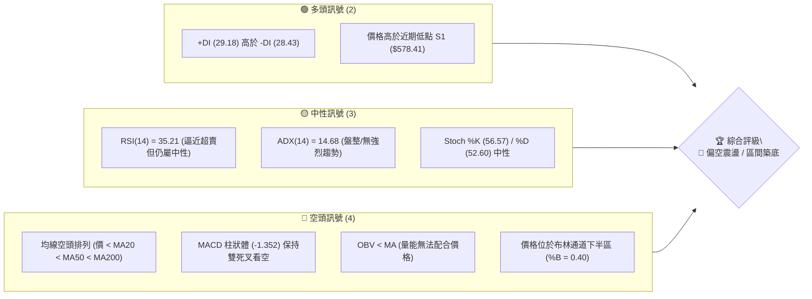
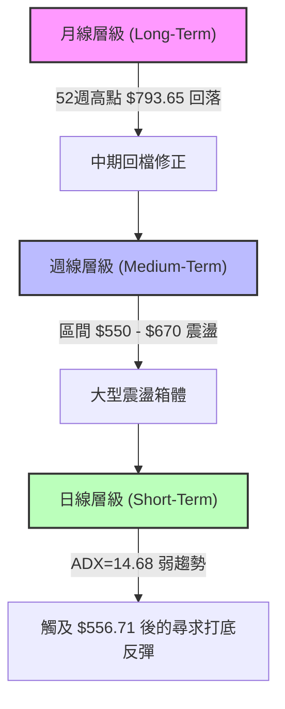
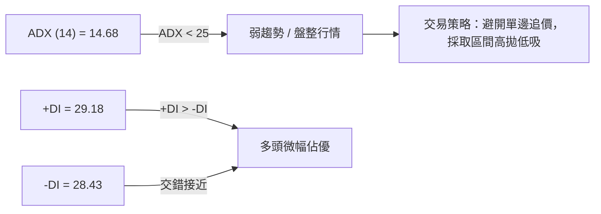
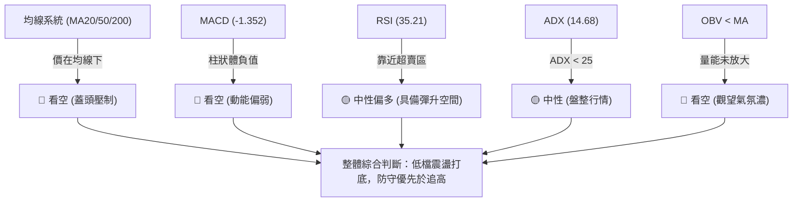
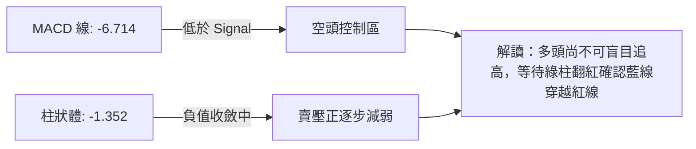
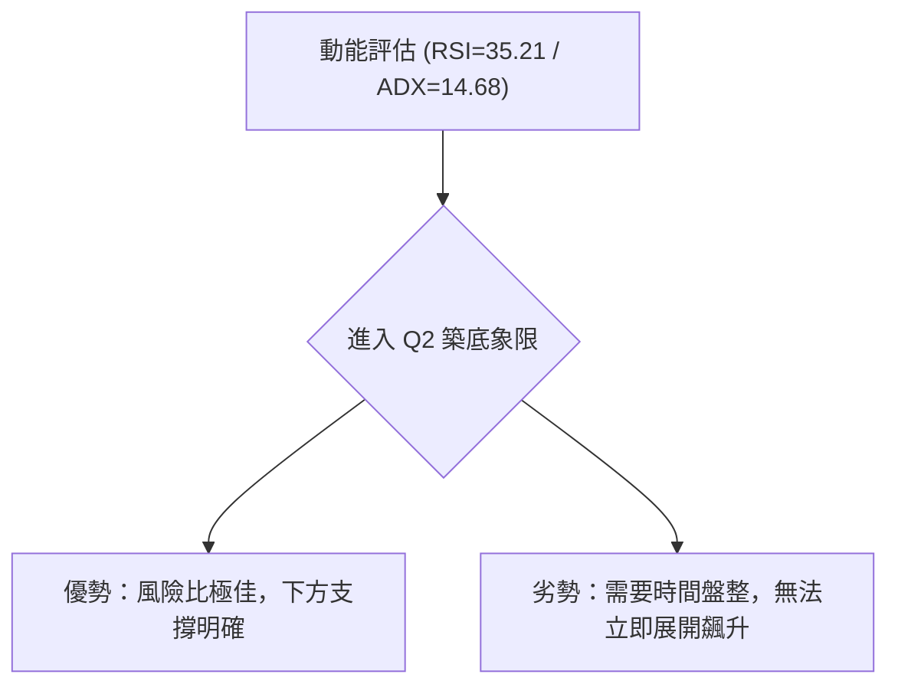
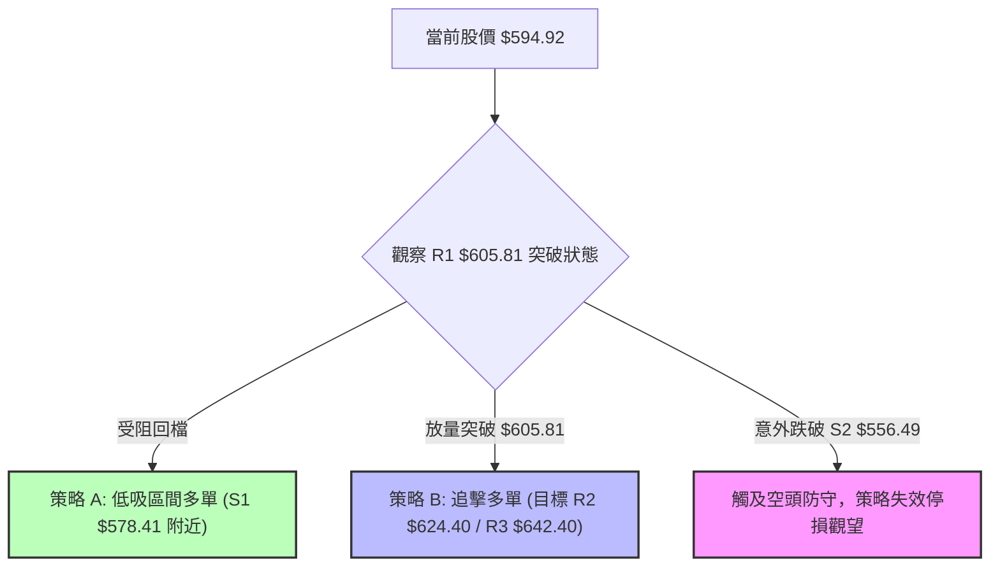
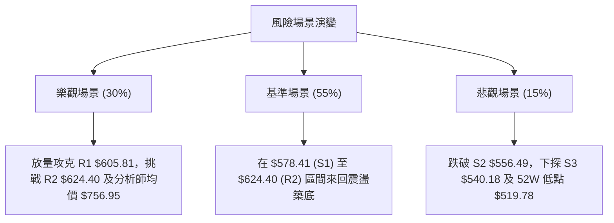

# META 技術分析報告

> **報告日期**：2026-08-11 ｜ **語言**：繁體中文 ｜ **數據來源**：Yahoo Finance ｜ **當前價格**：$594.92

---

## 目錄

| 章節 | 內容 |
|------|------|
| [1. 技術面概覽](#1-技術面概覽) | 訊號儀表板、核心指標、評分卡 |
| [2. 趨勢分析](#2-趨勢分析) | 多時框趨勢、長中短期走勢 |
| [3. 圖表形態分析](#3-圖表形態分析) | 形態識別、K線組合、目標價 |
| [4. 支撐與阻力](#4-支撐與阻力) | 關鍵價位、斐波那契回調 |
| [5. 技術指標深度解讀](#5-技術指標深度解讀) | MA/RSI/MACD/布林/成交量 |
| [6. 動能與波動率](#6-動能與波動率) | 動能評估、ATR、Beta |
| [7. 多時框架總結](#7-多時框架總結) | 時框架評分矩陣 |
| [8. 交易策略建議](#8-交易策略建議) | 多空策略、風險報酬比 |
| [9. 風險提示與監控](#9-風險提示與監控) | 監控指標、風險場景 |

---

## 1. 技術面概覽

### 🎯 技術訊號儀表板



### 📊 核心指標速覽表

| 指標類別 | 指標名稱 | 當前數值 | 訊號 | 解讀 |
|----------|----------|----------|------|------|
| **價格** | 當前價格 | $594.92 | 🟡 | 位於52週區間 27.4% 位置，處於中低檔震盪 |
| **均線** | MA20 | $609.18 | 🔴 | 價格位於 MA20 下方 -2.34%，短線承壓 |
| **均線** | MA50 | $598.83 | 🔴 | 價格位於 MA50 下方 -0.65%，中線支撐轉阻力 |
| **均線** | MA200 | $629.76 | 🔴 | 價格位於 MA200 下方 -5.53%，長線轉為壓力 |
| **動能** | RSI(14) | 35.21 | 🟡 | 位於 30-70 中性區偏低位置，具備超賣反彈潛力 |
| **動能** | MACD(12,26,9) | -6.714 | 🔴 | MACD線 (-6.714) 低於訊號線 (-5.362)，柱狀體 -1.352 保持偏空 |
| **趨勢** | ADX(14) | 14.68 | 🟡 | ADX < 25 表示目前無單邊強趨勢，屬於震盪行情 |
| **波動** | ATR(14) | $22.54 | 🟡 | 每日波幅約 3.79%，波動度處於中等水平 |
| **通道** | 布林 %B | 0.40 | 🟡 | 位於下軌 ($534.92) 與中軌 ($609.18) 之間 |
| **量能** | OBV 趨勢 | OBV < MA | 🔴 | 成交量未見機構顯著吸籌，量能相對疲弱 |

### 🏆 技術評分卡

```
╔══════════════════════════════════════════════════════════════════╗
║              技術評分卡 — META (2026-08-11)                       ║
╠══════════════════════════════════════════════════════════════════╣
║ 趨勢強度      ▓▓▓▓▓░░░░░░░░░░░░░░░  28/100  🔴 強度弱 (ADX=14.68)  ║
║ 動能指標      ▓▓▓▓▓▓▓░░░░░░░░░░░░░  35/100  🔴 動能偏弱          ║
║ 支撐穩定度    ▓▓▓▓▓▓▓▓▓▓▓▓░░░░░░░░  60/100  🟡 S1/S2 守備尚存     ║
║ 成交量配合    ▓▓▓▓▓▓▓░░░░░░░░░░░░░  35/100  🔴 OBV < MA 量能不足 ║
║ 形態完整度    ▓▓▓▓▓▓▓▓▓▓░░░░░░░░░░  50/100  🟡 築底震盪形態      ║
║ 均線排列      ▓▓▓▓▓░░░░░░░░░░░░░░░  25/100  🔴 價低於所有主均線  ║
╠══════════════════════════════════════════════════════════════════╣
║ 綜合評分      ▓▓▓▓▓▓▓▓░░░░░░░░░░░░  38.8/100 🔴 偏空震盪         ║
╚══════════════════════════════════════════════════════════════════╝
```

---

## 2. 趨勢分析

### 🌐 多時框趨勢分析



### 📈 長期趨勢 — 12個月走勢圖（Unicode）

```
META 月線歷史走勢圖（2025-09 至 2026-08）
價格軸 ($)
$800 ┤                               ● 52W High ($793.65)
$750 ┤             ●   ●
$700 ┤                 ●       ●
$650 ┤ ●   ●   ●                   ●
$600 ┤                             ●       ●   ● ← 現在 $594.92
$550 ┤                                 ●   ●
     └─┬───┬───┬───┬───┬───┬───┬───┬───┬───┬───┬─── Line
      09  10  11  12  01  02  03  04  05  06  07  08 (月份)
```

**歷史走勢階段特徵分析表**：

| 時間區間 | 收盤價範圍 | 漲跌趨勢 | 特徵描述與關鍵驅動力 |
|----------|------------|----------|----------------------|
| **2025-08 ~ 2025-09** | $736.29 ➔ $732.47 | 🔴 橫盤高檔 | 觸及高點後的多頭獲利結案期 |
| **2025-10 ~ 2025-12** | $646.67 ➔ $658.91 | 🔴 快速修正 | 財報資本支出疑慮引發中場拉回 |
| **2026-01** | $715.22 | 🟢 強勁反彈 | 跨年資金行情與AI產品變現預期推升 |
| **2026-02 ~ 2026-03** | $647.03 ➔ $571.60 | 🔴 劇烈下挫 | 宏觀利率預期波動與科技股整體賣壓 |
| **2026-04 ~ 2026-05** | $611.34 ➔ $631.92 | 🟢 築底回升 | 營收成長 YoY +28% 基本面支撐展現 |
| **2026-06 ~ 2026-07** | $563.29 ➔ $556.71 | 🔴 二次探底 | 消化前波籌碼，測試 $550-$560 支撐區 |
| **2026-08 (最新)** | $594.92 | 🟢 止跌企穩 | 於 $556.71 止跌，月線展現陽線反彈曙光 |

### 📊 中期趨勢（週線分析）

從近20週的週線數據來看，META 呈現「寬幅箱體震盪」特徵：
- **震盪上界**：位於 $669.21 - $687.91（貼近 50% 斐波那契回調位 $656.71 與 MA200 $629.76 區域）。
- **震盪下界**：位於 $550.25 - $556.71（精準落在 78.6% 斐波那契回調位 $578.39 下方不遠處，形成堅實買盤）。
- **成交量變化**：在 2026-08-02 探底 $556.71 時，週成交量放大至 1.12 億股，隨後一週（2026-08-09）收盤彈升至 $592.10，顯示低位具備較強的抄底接盤買意。

### ⚡ 趨勢強度評估（ADX 解讀）



| 指標項 | 數值 | 評估標準 | 行情性質判定 |
|--------|------|----------|--------------|
| **ADX (14)** | 14.68 | < 20 偏弱；20-25 中性；> 25 強趨勢 | 🔴 **極弱趨勢 (無單邊方向)** |
| **+DI / -DI** | 29.18 / 28.43 | 兩者差距極小 (僅 0.75) | 🟡 **多空拉鋸均勢** |
| **結論** | - | ADX 位於歷史低檔區 | 🟢 **適合布林通道/關鍵支撐阻力區間操作** |

---

## 3. 圖表形態分析

### 🔍 形態識別系統

在當前日線與週線結構中，META 展現出以下幾項幾何與指標型形態：

| 形態名稱 | 信心度 | 判斷依據（引用數據） | 完成度 | 目標價（附計算式） |
|----------|--------|----------------------|--------|--------------------|
| **大型矩形箱體 (Box Range)** | **80%** | 上界以 R3 ($642.40) / BB上軌 ($683.43) 為壓，下界以 S2 ($556.49) 為支撐 | 85% | 破位後方能延伸；箱體中軸為 $599.45 |
| **雙底形態 (Double Bottom)** | **62%** | 第一底 2026-06-28 收盤 $550.25，第二底 2026-08-02 低點 $556.71，頸線為 R1 ($605.81) | 65% | 頸線 $605.81 + 形態高度 ($605.81 - $550.25 = $55.56) = **$661.37** |
| **均線死叉壓制** | **90%** | MA20 ($609.18)、MA50 ($598.83)、MA200 ($629.76) 全部蓋頭 | 100% | 指標壓制型形態，無幾何目標價 |

### 🕯️ 重要 K 線形態分析

| 日期/期間 | 價格點位 | K 線形態 | 技術解讀 | 訊號強度 |
|-----------|----------|----------|----------|----------|
| **2026-08-02 週** | 低點 $556.71 | 長下影長空 K 線 | 探底至 S2 ($556.49) 附近誘空後，爆量 1.12 億股換手，多頭強力吃單 | 🟢 強止跌 |
| **2026-08-09 週** | 收盤 $592.10 | 大陽線吞噬 | 幾乎完全包覆前一週實體，形成週線等級的晨星/多頭吞噬雛形 | 🟢 看多反彈 |
| **2026-08-11 日** | 收盤 $594.92 | 中紅線升破 MA5 | 股價站上 MA5 ($590.73)，短線企穩於 $590 之上 | 🟢 短線轉強 |

### 📉 ASCII 走勢形態示意圖

```
META 雙底打底形態與關鍵壓力區示意圖
═══════════════════════════════════════════════════════════════════
$642.40 (R3) ─────────────────────────────────── 頂部強阻力區
$624.40 (R2) ───────────┐
                        │              頸線突破目標 $661.37
$605.81 (R1) ───────頸線位置──────────────────────┐
                          ▲                      │
$594.92 (現價)───────────/ \───────────▲─────────┘
                        /   \         / 
$578.41 (S1) ──────────/     \       /  (當前正在挑戰頸線)
                      /       \     /
$556.49 (S2) ────────●         \───● (2026-08-02 低點 $556.71)
               (第一底 $550.25)
═══════════════════════════════════════════════════════════════════
```

### 🎯 形態目標價計算

根據雙底形態（信心度 62%）之測量目標推算：
1. **形態低點**：取二次探底之有效平均低點 $550.25。
2. **頸線位置**：R1 即 $605.81。
3. **垂直高度 ($H$)**：$605.81 - $550.25 = $55.56。
4. **最小突破目標價**：$605.81 + $55.56 = **$661.37**（此位置與斐波那契 50.0% 回調位 $656.71 極為接近，具高度收斂性）。

---

## 4. 支撐與阻力

### 🗺️ 關鍵價位分布圖（Unicode）

```
META 價位結構與密集區分布圖
═══════════════════════════════════════════════════════════════════
$793.65 ║████████████████████████████████████████║ 52週最高點 (0.0%)
$729.02 ║██████████████████              ║ Fib 23.6%
$683.43 ║██████████████                  ║ 布林通道上軌
$656.71 ║██████████████████████          ║ Fib 50.0% 弱轉強分水嶺
$642.40 ║████████████                    ║ 阻力 R3 (+7.98%)
$629.76 ║████████████████                ║ MA200 均線壓力
$624.40 ║██████████                      ║ 阻力 R2 (+4.96%) / Fib 61.8%
$605.81 ║████████                        ║ 近期阻力 R1 (+1.83%) / 頸線
$594.92 ╠════════════════════════════════╣ ◄ 現價 ($594.92)
$578.41 ║▓▓▓▓▓▓▓▓▓▓▓▓▓▓                  ║ 近期支撐 S1 (-2.78%) / Fib 78.6%
$556.49 ║▓▓▓▓▓▓▓▓▓▓▓▓▓▓▓▓▓▓▓▓            ║ 強支撐 S2 (-6.46%) / 波段低點
$540.18 ║▓▓▓▓▓▓▓▓                        ║ 支撐 S3 (-9.20%)
$519.78 ║▓▓▓▓▓▓▓▓▓▓▓▓▓▓▓▓▓▓▓▓▓▓▓▓▓▓▓▓▓▓  ║ 52週最低點 (100.0%)
═══════════════════════════════════════════════════════════════════
```

### 🚧 阻力位分析表

| 阻力級別 | 價位 | 形成原因 | 突破難度 | 重要性 |
|----------|------|----------|----------|--------|
| **阻力 R1** | **$605.81** | 近一年波段高點聚類 / 雙底頸線位置 | 🟡 中等 | 🟢🟢🟢 (短線多空分水嶺) |
| **阻力 R2** | **$624.40** | 近一年高點聚類 + Fib 61.8% 重合位 | 🔴 較高 | 🟢🟢🟢🟢 (重要解套賣壓區) |
| **阻力 R3** | **$642.40** | 近一年強密集高點聚類 + MA200 ($629.76) 上方 | 🔴 極高 | 🟢🟢🟢🟢🟢 (波段多頭終極考驗) |

### 🛡️ 支撐位分析表

| 支撐級別 | 價位 | 形成原因 | 守住機率 | 重要性 |
|----------|------|----------|----------|--------|
| **支撐 S1** | **$578.41** | 近一年波段低點聚類 + Fib 78.6% ($578.39) 精準重合 | 🟢 70% | 🟢🟢🟢🟢 (短線回檔防守第一線) |
| **支撐 S2** | **$556.49** | 2026年6月及8月雙重波段低點聚類 | 🟢 85% | 🟢🟢🟢🟢🟢 (中期多頭最後防線) |
| **支撐 S3** | **$540.18** | 布林通道下軌 ($534.92) 附近之強支撐聚類 | 🟢 90% | 🟢🟢🟢 (極端空頭情境支撐) |

### 📐 斐波那契回調位分析

依據 52 週高低點範圍（$519.78 ➔ $793.65，波段幅度 $273.87）進行回調測量：

```
0.0%  (52W High)   $793.65
23.6%              $729.02
38.2%              $689.03
50.0%              $656.71
61.8%              $624.40  ◄─ (與阻力 R2 $624.40 精準重合)
78.6%              $578.39  ◄─ (與支撐 S1 $578.41 精準重合)
100.0% (52W Low)   $519.78
```

- **當前位置解讀**：現價 **$594.92** 恰好落於 **Fib 78.6% ($578.39)** 與 **Fib 61.8% ($624.40)** 之間的深度回調打底區。
- **結構意義**：Fib 78.6% ($578.39) 提供了強大的黃金分割防守性，價格在 $556.71 止跌回升後重新站上 Fib 78.6%，意味著先前的崩跌賣壓已得到有效消化。若能進一步越過 Fib 61.8% ($624.40)，整體趨勢將由防守反彈轉為全面回升。

---

## 5. 技術指標深度解讀

### 🎛️ 指標訊號總覽



### 📈 移動平均線排列分析

```
MA 系統價格相對方位表：
───────────────────────────────────────────────────────────────────
MA240: $647.97 ─── 蓋頭重壓 (-8.19%)  [████████████████████]
MA200: $629.76 ─── 長期均線 (-5.53%)  [████████████████]
MA120: $614.33 ─── 半年線   (-3.16%)  [██████████]
MA20 : $609.18 ─── 月線壓力 (-2.34%)  [███████]
MA60 : $601.46 ─── 季線壓力 (-1.09%)  [███]
MA50 : $598.83 ─── 中期均線 (-0.65%)  [█]
現價 : $594.92 ────────────────────  ◄ 當前位置
MA10 : $581.86 ─── 短期支撐 (+2.24%)  [▓▓▓]
MA5  : $590.73 ─── 極短支撐 (+0.71%)  [▓]
───────────────────────────────────────────────────────────────────
```

- **排列狀態**：當前呈現「混合排列」，短線 MA5 ($590.73) 及 MA10 ($581.86) 翻揚勾頭向上，形成短線下檔支撐；但中長期 MA20/MA50/MA120/MA200 均位於價格上方，形成重重密集扣抵賣壓。
- **關鍵關卡**：短期首要任務為突破並站穩 MA50 ($598.83) 與 MA20 ($609.18)，才能進一步解除均線下壓壓力。

### 📉 RSI(14) 分析

```
RSI(14) 強度指標：
0 ─────── 30 ── 35.21 ───────────── 50 ────────────────── 70 ─────── 100
[超賣區]   │      ▲                 [中性區]              [超買區]
           └──────┴─ 當前位置 (35.21)
```

- **當前數值**：**35.21**。
- **背離判斷**：日線圖上無顯著頂背離或底背離。但在週線層級，2026-08-02 週跌至 $556.71 時 RSI 為 22.9，最新週 RSI 回升至 35.2，價格創近期次低但 RSI 未創新低，展現**週線級別的微幅底背離**雛形。
- **解讀**：離 30 超賣線僅一步之遙，顯示下行賣壓已接近竭盡，隨時具備技術性反彈動能。

### 📊 MACD(12/26/9) 訊號解讀

- **MACD 線**：-6.714
- **Signal 線**：-5.362
- **MACD 柱狀體 (Histogram)**：**-1.352** 🔴



週線層級上，2026-08-02 柱狀體為 -11.160，最新一週已快速收斂至 -1.352，顯示中期下行動能出現急遽衰減，離多頭交叉僅差一步。

### 📦 布林通道分析

```
META 日線布林通道結構示意圖
───────────────────────────────────────────────────────────────────
BB 上軌: $683.43  ───────────────────────────────────
                  
BB 中軌: $609.18  ─── (MA20 阻力區) ───────────────────
                  
現價   : $594.92  ─── ◄ (%B = 0.40，位於通道下半區)
                  
BB 下軌: $534.92  ───────────────────────────────────
───────────────────────────────────────────────────────────────────
```

- **通道帶寬**：上軌 $683.43 至下軌 $534.92，極致寬度達 $148.51，顯示先前的下跌拉開了波動空間。
- **%B 位置**：**0.40**。價格位於下軌與中軌之間，遠離下軌 $534.92 支撐，正向中軌 $609.18 發起衝擊。

### 💹 成交量與 OBV 分析

- **最新日成交量**：14,317,252 股。
- **20日均量**：16,973,888 股（量比 **0.84x**，呈現縮量打底特徵）。
- **OBV 趨勢**：OBV 低於其移動平均線（OBV < MA），反映機構大資金在當前價位仍以觀察為主，進場回補意願偏向保守，量能尚未出現強烈背書。

---

## 6. 動能與波動率

### ⚡ 動能評估四象限

| 象限分類 | 動能強度 | 波動率水準 | META 當前定位與解讀 |
|----------|----------|------------|---------------------|
| **Q1 (最佳攻擊)** | 強 (RSI>60) | 低 (ATR%<2.5%) | - |
| **Q2 (低防守打底)**| 弱 (RSI<40) | 低/中 (ATR%=3.79%) | **✓ 當前定位 (Q2)**：動能偏弱但波動度有所收斂，屬於籌碼沈澱期 |
| **Q3 (高風險失控)**| 弱 (RSI<30) | 高 (ATR%>5.0%) | - |
| **Q4 (主升段衝刺)**| 強 (RSI>60) | 高 (ATR%>4.0%) | - |



### 📊 ATR 波動率與止損風控

- **ATR(14)**：**$22.54**（占當前股價 **3.79%**）。
- **止損距離建議**：
  - **緊密止損 (1.0x ATR)**：$22.54 ➔ 距進場點扣除 $22.54（適合日內/極短線交易）。
  - **標準波段止損 (1.5x ATR)**：$33.81 ➔ 設定於 $594.92 - $33.81 = **$561.11**（剛好保護於 S2 $556.49 上方）。
  - **寬鬆趨勢止損 (2.0x ATR)**：$45.08 ➔ 設定於 $549.84（有效避免洗盤震出）。

### 📐 Beta 與市場相關性

- **Beta**：**1.243**。
- **市場特性**：META 的波動度高於標普 500 指數約 24.3%。在大盤反彈時具有較強的彈升彈性，但在市場下修時亦承受較高的 beta 賣壓。

---

## 7. 多時框架總結

### 📋 時框架評分表

| 時框架 | 趨勢方向 | 動能狀態 | 均線排列 | 形態結構 | 綜合評分 | 交易建議 |
|--------|----------|----------|----------|----------|----------|----------|
| **日線 (Daily)** | 🔴 偏空震盪 | 🟡 RSI 35.21 | 🔴 價在主均線下 | 🟢 雙底尋求頸線突破 | **35 / 100** | 逢高減碼 / 低吸高拋 |
| **週線 (Weekly)**| 🟡 區間打底 | 🟢 MACD 綠柱快速收斂 | 🟡 MA200 上方支撐 | 🟢 大箱體下軌彈升 | **48 / 100** | 區間下軌建立分批倉位 |
| **月線 (Monthly)**| 🟢 長期看多 | 🟡 中性回檔 | 🟢 長期多頭基底未破 | 🟡 高檔大三角/箱體 | **58 / 100** | 長線投資價值展現 |

### 🔲 綜合訊號矩陣

```
┌─────────────────┬───────────────────┬───────────────────┐
│   時框架 \ 維度  │    動能 / 趨勢    │    價位 / 支撐    │
├─────────────────┼───────────────────┼───────────────────┤
│   短期 (日線)   │ 🔴 MACD負值/弱動能│ 🟢 守穩 MA5/S1 $578│
│   中期 (週線)   │ 🟢 賣壓急遽收斂   │ 🟢 雙底打底於 $556│
│   長期 (月線)   │ 🟡 高位獲利回吐   │ 🟢 遠高於52W低點$519│
└─────────────────┴───────────────────┴───────────────────┘
```

### ⚖️ 多時框收斂結論

**收斂規則執行**：
當前 ADX 為 14.68 (< 25)，技術面完全符合**「盤整/箱體行情」**特徵。
根據收斂規則：
1. 本階段不宜採用突破追高之單邊趨勢策略。
2. 主導交割框架以**日線至週線之布林通道上下軌**（$534.92 ➔ $683.43）及**關鍵支撐阻力**（S1/S2 與 R1/R2）為主要交易邊界。
3. **最終收斂方向**：**🟡 中性偏空震盪築底**。整體策略以「下軌買進、壓力區獲利了結」之區間操作為主。

---

## 8. 交易策略建議

### 🗺️ 策略決策流程圖



### 🧭 策略路由

> **當前主策略方向 = 🟡 偏空震盪 / 低吸高拋區間策略（綜合評分 38.8/100）**

基於 ADX = 14.68 與綜合評分 38.8，目前股價介於 S1 ($578.41) 與 R1 ($605.81) 之間。主推策略採取**「低吸高拋區間波段」**與**「壓力位逢高分批減碼」**。

### 🎯 價格情境階梯 (Price Scenarios)

| 觸發條件 | 下一目標 | 後續延伸 | 情境含義 |
|----------|----------|----------|----------|
| **突破 R1 $605.81** | R2 $624.40 | R3 $642.40 | 雙底形態確立，中線轉強開啟反彈 |
| **站穩當前區間 ($580-$600)** | R1 $605.81 | - | 沉澱籌碼，蓄勢消化 MA20 賣壓 |
| **跌破 S1 $578.41** | S2 $556.49 | S3 $540.18 | 二次探底失敗，尋求布林下軌支撐 |

### 📊 情境機率分佈

| 情境劇本 | 機率估計 | 主要技術依據 |
|----------|----------|--------------|
| **區間震盪築底 (主劇本)** | **55%** | ADX < 25、週線 MACD 綠柱顯著收斂、成交量縮量 |
| **突破 R1 上攻反彈** | **30%** | +DI > -DI、RSI 自低檔回升、週線晨星形態 |
| **向下跌破 S2 探底** | **15%** | 均線全數蓋頭壓制、OBV 量能尚未放大 |

### 🟢 主策略詳情（區間與波段交易）

| 策略要素 | 策略 A（低吸多單 — 區間下軌接單） | 策略 B（突破多單 — 頸線確認追擊） |
|----------|-----------------------------------|-----------------------------------|
| **進場條件** | 股價回檔至 S1 附近出現止跌訊號 | 日線收盤價強勢突破 R1 且成交量放大 |
| **進場價格** | **$578.41** (支撐 S1) | **$606.50** (突破 R1 $605.81 確認) |
| **目標價 T1** | **$605.81** (阻力 R1) | **$624.40** (阻力 R2 / Fib 61.8%) |
| **目標價 T2** | **$624.40** (阻力 R2) | **$656.71** (Fib 50.0% / 雙底目標) |
| **止損價格** | **$556.49** (跌破 S2 強支撐) | **$588.00** (假突破拉回止損) |
| **風報比 (T1 / T2)** | **1.25 : 1 / 2.10 : 1** | **0.97 : 1 / 2.71 : 1** |
| **勝率評估** | **60%** | **52%** |
| **建議倉位** | **10% - 15%** | **10%** |

*註：風險報酬比計算式範例 (策略 A - T2)：$(624.40 - 578.41) / (578.41 - 556.49) = $45.99 / $21.92 = 2.10*

### 🔴 反向風險觸發點（對沖與避險提示）

- **做空對沖觸發條件**：若股價向上反彈至 **R2 $624.40** 或 **MA200 $629.76** 附近出現長上影線且 RSI 觸及 60 受阻，可作為多單獲利了結點，或建立適度對沖避險空單（止損設於 $642.40）。
- **多頭全面失效點**：收盤價若**實體跌破 S2 $556.49**，宣告雙底打底失敗，多頭應無條件停損離場。

### ⭐ 整體訊號強度評星

```
做多訊號強度：  ★★☆☆☆  (2.5/5星 — 處於低位打底，待突破確認)
做空訊號強度：  ★★☆☆☆  (2.0/5星 — 下方 S1/S2 支撐極強，不宜深追)
整體可信度：    ★★★☆☆  (3.5/5星 — 數據結構清晰，價位位階明確)
```

---

## 9. 風險提示與監控

### ✅ 關鍵監控指標 Checklist

```
╔══════════════════════════════════════════════════════════════════╗
║                META 技術面關鍵監控清單 (Checklist)               ║
╠══════════════════════════════════════════════════════════════════╣
║ [ ] 1. R1 頸線突破：日收盤價是否站上 $605.81                  ║
║ [ ] 2. 均線扣抵：價格能否儘速收復 MA50 ($598.83) 與 MA20 ($609.18)║
║ [ ] 3. MACD 翻紅：日線 MACD 柱狀體能否由 -1.352 轉正          ║
║ [ ] 4. 量能配合：日成交量能否回升至 20日均量 (1,697萬股) 之上    ║
║ [ ] 5. 支撐防守：S1 ($578.41) 與 S2 ($556.49) 是否完好未破       ║
╚══════════════════════════════════════════════════════════════════╝
```

### ⚠️ 風險場景分析



### 🛡️ 風險管理重要提醒

1. **波動度防範**：ATR 高達 $22.54（3.79%），意味著單日價格波動較大，部位建立應採取**分批建倉**原則，切忌單點一次性開滿倉位。
2. **市場 Beta 風險**：META Beta 為 1.243，高度受納斯達克與科技大盤走勢影響，交易時應同時監控 QQQ / SPY 之整體大盤環境。
3. **財報與宏觀變數**：留意聯準會利率決策及營運資本支出消息對 AI 科技股評估之衝擊。

---

## 📋 報告總結

```
╔══════════════════════════════════════════════════════════════════╗
║                   META 技術分析報告總結                          ║
════════════════════════════════════════════════════════════════════
報告日期：2026-08-11
當前價格：$594.92
分析評級：🔴 偏空震盪築底 (技術評分: 38.8 / 100)

關鍵結論：
├─ 長期趨勢：🟡 中性回檔 (52W 區間 27.4% 位置，守於 $550 波段底上)
├─ 中期趨勢：🟢 週線晨星打底 (在 S2 $556.49 展現強勁爆量支撐)
├─ 短期趨勢：🟢 短線企穩 (站上 MA5 $590.73，衝擊 MA50/R1 壓力區)
├─ 關鍵支撐：S1 $578.41 / S2 $556.49
├─ 關鍵阻力：R1 $605.81 / R2 $624.40
└─ 分析師目標：$756.95 (均價) / $580.00 (最低) / $1000.00 (最高)

最優策略組合：
1. 🥇 最佳機會：回檔至 S1 $578.41 附近建立區間接單多單，防守 S2 $556.49。
2. 🥈 次選機會：靜待突破 R1 $605.81 後追擊，目標看至 R2 $624.40 / $656.71。
3. 🥉 保守選擇：ADX 目前僅 14.68，趨勢未明，可等待 MACD 柱狀體翻紅後再行進場。
════════════════════════════════════════════════════════════════════
```

---

> ⚠️ **免責聲明**：本報告為 AI 自動生成之技術分析，所有數據及估算均基於提供的歷史價格資訊。本報告**僅供研究與學術參考**，**不構成任何投資建議**。投資有風險，入市需謹慎。

---

*報告生成時間：2026-08-11 ｜ 數據來源：Yahoo Finance ｜ 分析框架：多時框技術分析*