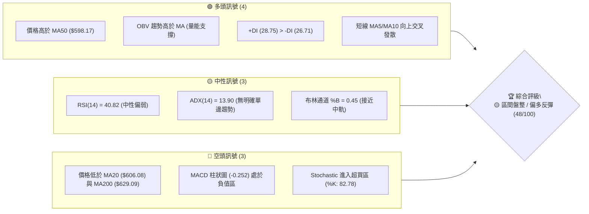
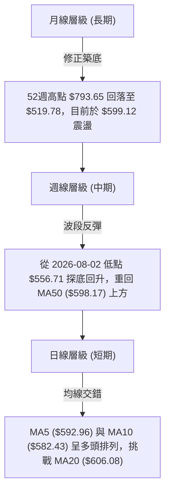
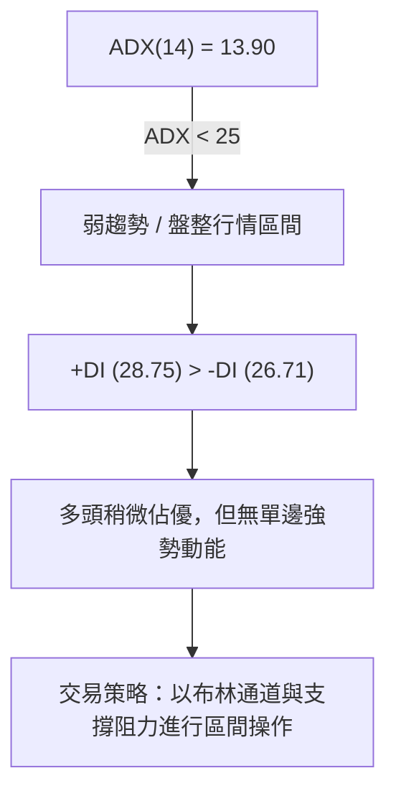
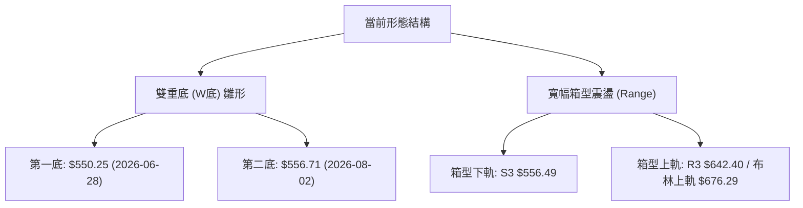
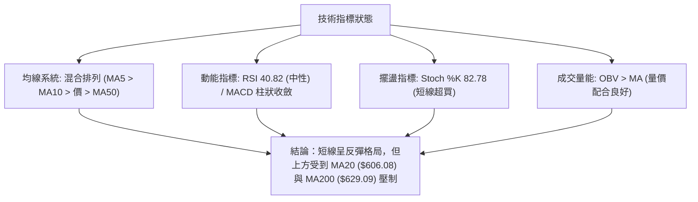
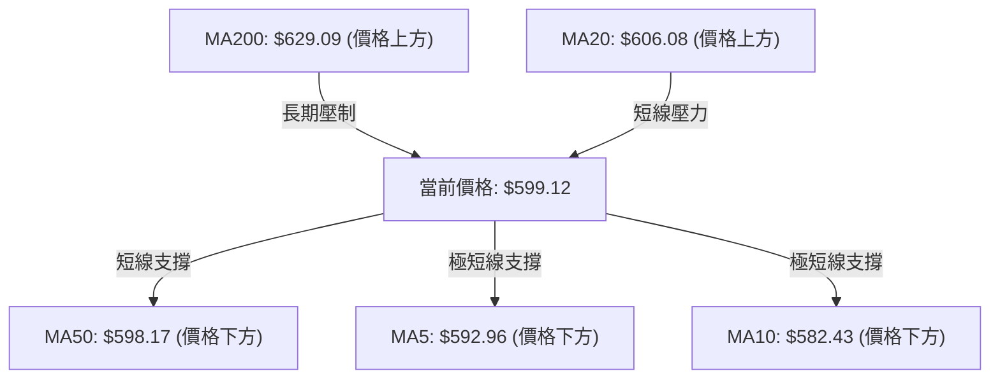
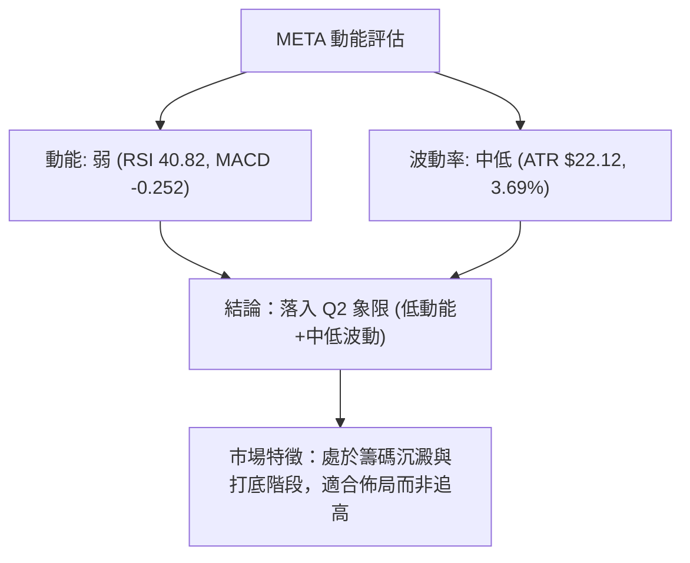
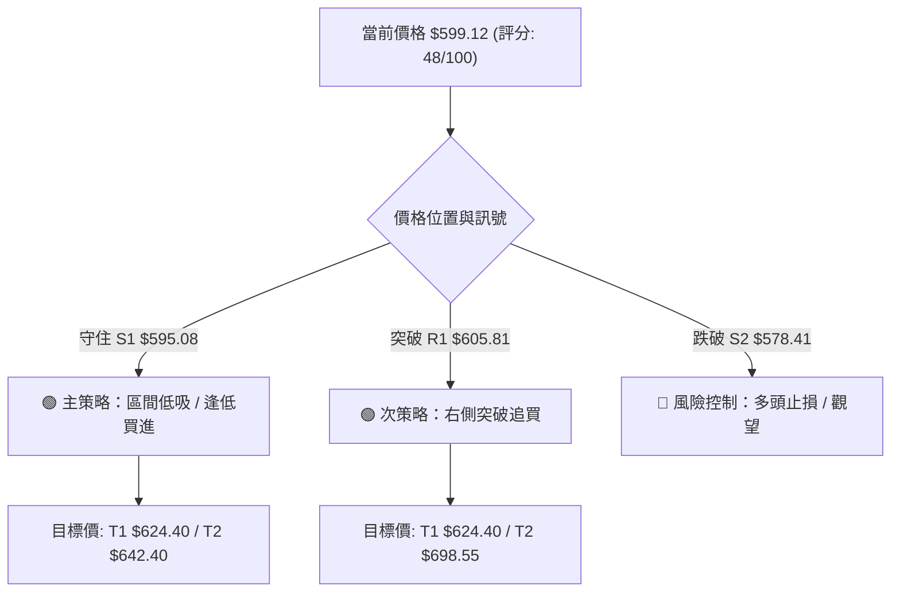
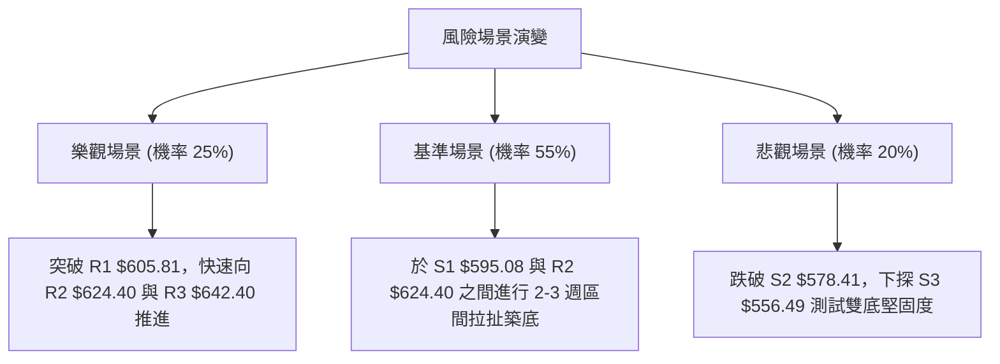

# META 技術分析報告

> **報告日期**：2026-08-12 ｜ **語言**：繁體中文 ｜ **數據來源**：Yahoo Finance ｜ **當前價格**：$599.12

---

## 目錄

| 章節 | 內容 |
|------|------|
| [1. 技術面概覽](#1-技術面概覽) | 訊號儀表板、核心指標、評分卡 |
| [2. 趨勢分析](#2-趨勢分析) | 多時框趨勢、長中短期走勢 |
| [3. 圖表形態分析](#3-圖表形態分析) | 形態識別、K線組合、目標價 |
| [4. 支撐與阻力](#4-支撐與阻力) | 關鍵價位、斐波那契回調 |
| [5. 技術指標深度解讀](#5-技術指標深度解讀) | MA/RSI/MACD/布林/成交量 |
| [6. 動能與波動率](#6-動能與波動率) | 動能評估、ATR、Beta |
| [7. 多時框架總結](#7-多時框架總結) | 時框架評分矩陣 |
| [8. 交易策略建議](#8-交易策略建議) | 多空策略、風險報酬比 |
| [9. 風險提示與監控](#9-風險提示與監控) | 監控指標、風險場景 |

---

## 1. 技術面概覽

### 🎯 技術訊號儀表板



### 📊 核心指標速覽表

| 指標類別 | 指標名稱 | 當前數值 | 訊號 | 解讀 |
|----------|----------|----------|------|------|
| **價格** | 當前價格 | $599.12 | 🟡 | 位於 52 週區間 ($519.78 - $793.65) 之 29.0% 分位點 |
| **均線** | MA20 | $606.08 | 🔴 | 價格低於 MA20，下行斜率 -1.15% |
| **均線** | MA50 | $598.17 | 🟢 | 價格微幅站上 MA50，提供極短線下檔支撐 |
| **均線** | MA200 | $629.09 | 🔴 | 價格低於 MA200，中長期趨勢面臨壓制 |
| **動能** | RSI(14) | 40.82 | 🟡 | 中性區域，遠離超賣區（22.9），無明顯背離 |
| **動能** | MACD | -5.677 | 🔴 | MACD 線低於訊號線，柱狀圖 -0.252，空頭動能衰退中 |
| **趨勢** | ADX(14) | 13.90 | 🟡 | ADX < 25，屬於弱趨勢/區間盤整結構 |
| **波動** | ATR(14) | $22.12 | 🟢 | 日波動率 3.69%，波動度維持在中等可控水平 |

### 🏆 技術評分卡

```
╔══════════════════════════════════════════════════════════════════╗
║                   技術評分卡 — META (2026-08-12)                 ║
╠══════════════════════════════════════════════════════════════════╣
║ 趨勢強度      ▓▓▓▓▓▓░░░░░░░░░░░░░░  30/100  🟡 弱趨勢/盤整 (ADX<25) ║
║ 動能指標      ▓▓▓▓▓▓▓▓▓░░░░░░░░░░░  45/100  🟡 RSI中性/MACD收斂     ║
║ 支撐穩定度    ▓▓▓▓▓▓▓▓▓▓▓▓▓░░░░░░░  65/100  🟢 S1/S2 守穩反彈       ║
║ 成交量配合    ▓▓▓▓▓▓▓▓▓▓▓░░░░░░░░░  55/100  🟢 OBV維持於均線上方    ║
║ 形態完整度    ▓▓▓▓▓▓▓▓▓▓░░░░░░░░░░  50/100  🟡 區間箱型下軌打底     ║
║ 均線排列      ▓▓▓▓▓▓▓░░░░░░░░░░░░░  35/100  🔴 價格位於 MA20/200 下 ║
╠══════════════════════════════════════════════════════════════════╣
║ 綜合評分      ▓▓▓▓▓▓▓▓▓▓░░░░░░░░░░  48/100  🟡 區間震盪逢低布局     ║
╚══════════════════════════════════════════════════════════════════╝
```

---

## 2. 趨勢分析

### 🌐 多時框趨勢分析



### 📈 長期趨勢 — 24個月走勢圖（Unicode）

```
META 月線歷史走勢圖 (2024-08 至 2026-08)
價格軸 ($)
$800 ┤                                                ● $793.65 (52W High)
$750 ┤                                     ●    ●
$700 ┤                        ●         ●    ●
$650 ┤                  ●  ●     ●   ●             ●
$600 ┤               ●             ●                  ●  ●←現價 $599.12
$550 ┤  ●  ●  ●  ●              ●                        ●
$500 ┤                                                    ● $519.78 (52W Low)
     └─┬──┬──┬──┬──┬──┬──┬──┬──┬──┬──┬──┬──┬──┬──┬──┬──┬──┬──┬──┬──┬──┬──┬──
      08 09 10 11 12 01 02 03 04 05 06 07 08 09 10 11 12 01 02 03 04 05 06 07 08 (月份)
```

#### 走勢特徵分析表格

| 階段 | 時間區間 | 收盤價範圍 | 漲跌特徵 | 關鍵技術驅動因素 |
|------|----------|------------|----------|------------------|
| **強勢主升段** | 2024-08 ～ 2025-07 | $517.83 → $770.91 | +48.87% 突破上行 | 獲利能力爆發，營收年增 28.0% |
| **高位箱型區** | 2025-08 ～ 2026-01 | $736.29 → $715.22 | 橫盤震盪（高點 $793.65） | 估值修復完成，面臨 $750+ 強阻力 |
| **中級修正段** | 2026-02 ～ 2026-07 | $647.03 → $556.71 | -13.96% 深度拉回 | 獲利成長率放緩，摸底 $519.78 |
| **築底回升段** | 2026-07 ～ 2026-08 | $556.71 → $599.12 | +7.62% 止跌回升 | 重返 MA50 ($598.17)，成交量量能收窄築底 |

### 📊 中期趨勢（週線分析）

從近 20 週收盤數據觀察：
- **高點回落**：2026-04-19 曾觸及 $687.91 高點（RSI 96.5 極度超買），隨後引發連續修正。
- **低點尋找**：2026-08-02 收盤落於 $556.71（RSI 降至 22.9 極度超賣），確立了近期的波段低點。
- **最新動向**：過去兩週（2026-08-09 至 2026-08-16），收盤價從 $556.71 連續反彈至 $592.10 與 $599.12，RSI 回升至 40.82，MACD 柱狀圖由 -11.160 收斂至 -0.252，顯示中期下行壓力已大幅減緩。

### ⚡ 趨勢強度評估（ADX 解讀）



| ADX 數值區間 | 當前位置 | 趨勢狀態 | 操作指南 |
|--------------|----------|----------|----------|
| 0 - 20 | **13.90** | **極弱趨勢 / 盤整** | **嚴禁追漲殺跌，採取低吸高拋區間策略** |
| 20 - 25 | - | 趨勢醞釀期 | 關注方向突破訊號 |
| 25 - 50 | - | 強勢單邊趨勢 | 順勢交易，持有趨勢單 |

---

## 3. 圖表形態分析

### 🔍 形態識別系統



#### 形態信心度與目標價計算（依數據嚴格推算）

| 形態名稱 | 信心度 | 判斷依據（引用數據） | 完成度 | 目標價（附計算式） |
|----------|--------|----------------------|--------|--------------------|
| **雙重底 (W底)** | 60% | 兩次下探低點 $550.25 與 $556.71（接近 S3 $556.49），頸線位於 R2 $624.40 | 65% (尚未突破頸線) | 頸線 $624.40 + 形態高度 ($624.40 - $550.25 = $74.15) = **$698.55** |
| **寬幅矩形箱型** | 85% | ADX 13.90 < 25，價格多次於 S3 $556.49 與 R3 $642.40 之間來回震盪 | 90% (當前位於箱型中下區) | 箱型上軌 **$642.40** |

### 🕯️ 重要 K 線形態分析

| 日期 / 週期 | 收盤價 | K 線形態 | 解讀 | 訊號 |
|-------------|--------|----------|------|------|
| 2026-08-02 (週) | $556.71 | 長下影陰線 | 極度超賣區（RSI 22.9）遭遇強烈買盤支撐，探底完成 | 🟢 底態確立 |
| 2026-08-09 (週) | $592.10 | 中陽線覆蓋 | 量能 81.8M 配合，一舉吞噬前週實體高點，形成看漲吞噬 | 🟢 強烈反彈 |
| 2026-08-16 (日) | $599.12 | 晨星組合續強 | 突破 MA50 ($598.17)，短線多頭掌控局勢 | 🟢 延續反彈 |

### 📉 ASCII 走勢形態示意圖

```
META 雙重底 (W底) 與箱型結構示意圖
──────────────────────────────────────────────────────────
$642.40 ┤- - - - - - - - - - - - - - - - - - - - - - - (箱型頂部 / R3)
        │       ▲
$624.40 ┤- - - / - \ - - - - - - - - - - - - - - - - - (頸線 / R2)
        │     /     \
$599.12 ┤. . / . . . \ . . . . . . . . . . . . . . ● (現價 $599.12)
        │   /         \                       /
$556.49 ┤--●-----------●---------------------●-- (箱型底部 / S3)
        │ 第一底 $550.25   第二底 $556.71
──────────────────────────────────────────────────────────
```

---

## 4. 支撐與阻力

### 🗺️ 關鍵價位分布圖（Unicode）

```
META 價位結構分布圖 (當前價格: $599.12)
═════════════════════════════════════════════════════════════
$793.65 ║████████████████████████████████████████  52W 歷史高點
$689.03 ║████████████████████                    斐波 38.2% 回調位
$656.71 ║██████████████                          斐波 50.0% 中軸位
$642.40 ║████████████████████████████            強阻力 R3 (近一年高點聚類)
$624.40 ║████████████████                        阻力 R2 / 斐波 61.8%
$605.81 ║████████                                關鍵阻力 R1 / MA20
$599.12 ╠═══════════════════════════════════════ ◄ 當前價格 $599.12
$595.08 ║▓▓▓▓▓▓▓▓                                近期第一支撐 S1
$578.41 ║████████████████                        強支撐 S2 / 斐波 78.6%
$556.49 ║████████████████████████████            關鍵底線 S3 (波段低點)
$519.78 ║████████████████████████████████████████  52W 歷史低點
═════════════════════════════════════════════════════════════
```

### 🚧 阻力位分析表

| 阻力級別 | 精確價位 | 形成原因 | 突破難度 | 重要性 |
|----------|----------|----------|----------|--------|
| **R1** | **$605.81** | 近一年波段高點聚類 / MA20 ($606.08) 重疊區 | 中等 | 🟢 短線多空分水嶺 |
| **R2** | **$624.40** | 波段高點聚類 / 斐波那契 61.8% 回調位 | 較高 | 🟡 中期轉強關鍵頸線 |
| **R3** | **$642.40** | 近一年密集高點聚類 / 箱型上軌 | 極高 | 🔴 中期波段強阻力 |

### 🛡️ 支撐位分析表

| 支撐級別 | 精確價位 | 形成原因 | 守住機率 | 重要性 |
|----------|----------|----------|----------|--------|
| **S1** | **$595.08** | 近一年波段低點聚類 / 接近 MA50 ($598.17) | 70% | 🟢 短線防守第一線 |
| **S2** | **$578.41** | 波段低點聚類 / 斐波那契 78.6% ($578.39) | 80% | 🟡 中期強烈買盤區 |
| **S3** | **$556.49** | 近一年波段低點聚類 / 8月2日週收盤低點 | 90% | 🔴 多頭最後防線 |

### 📐 斐波那契回調位分析（以 52 週區間 $519.78 → $793.65 計算）

| 回調比例 | 精確價位 | 相對現價差距 | 當前位置解讀 |
|----------|----------|--------------|--------------|
| **0.0% (高點)** | $793.65 | +32.47% | 52 週最高點 |
| **23.6%** | $729.02 | +21.68% | 長期強勢區 |
| **38.2%** | $689.03 | +15.01% | 中期多頭分水嶺 |
| **50.0%** | $656.71 | +9.61% | 中性平衡點 |
| **61.8%** | $624.40 | +4.22% | **強阻力（與 R2 完全重合）** |
| **78.6%** | $578.39 | -3.46% | **強支撐（與 S2 完全重合）** |
| **100.0% (低點)**| $519.78 | -13.24% | 52 週最低點 |

**解讀**：當前價格 **$599.12** 精確位於 **斐波那契 61.8% ($624.40)** 與 **78.6% ($578.39)** 之間的黃金築底區間。只要守住 $578.39 (S2)，整體反彈格局將保持完好。

---

## 5. 技術指標深度解讀

### 🎛️ 指標訊號總覽



### 📈 移動平均線排列分析



- **均線排列現況**：MA5 ($592.96) > MA10 ($582.43)，短線形成黃金交叉發散；但 MA20 ($606.08) > MA50 ($598.17) > MA200 ($629.09)，整體屬於**混合排列（扣抵壓制）**。
- **解讀**：短線走出止跌飆升形態，但中長期均線（MA20/MA200）仍在上方，說明反彈過程中將頻繁遭遇獲利解套賣壓。

### 📉 RSI(14) 分析

- **RSI 當前數值**：**40.82**
- **進度條**：`████████░░░░░░░░░░░░ 40.82%`
- **背離判斷**：從 8 月 2 日低點 $556.71（RSI 22.9）至當前 $599.12（RSI 40.82），價格與 RSI 同步上升，**無頂背離或底背離**。RSI 從極度超賣區順利回升至中性區，顯示買盤動能溫和復甦。

### 📊 MACD(12,26,9) 訊號解讀

- **MACD 線**：-5.677
- **Signal 線**：-5.425
- **MACD 柱狀圖**：**-0.252**
- **解讀**：MACD 線雖仍在零軸下方，但柱狀圖已由前期低點（-11.160）大幅收斂至 **-0.252**，形成「綠柱極度縮短」狀態，預示即將發生**零軸下方的黃金交叉**，屬於典型的底部反彈轉折訊號。

### 📦 布林通道分析

```
META 布林通道現況示意圖
──────────────────────────────────────────────────────────
$676.29 ┤--------------------------------------- BB 上軌
        │
$606.08 ┤--------------------------------------- BB 中軌 (MA20)
$599.12 ┤======================================= 現價 (BB %B = 0.45)
        │
$535.87 ┤--------------------------------------- BB 下軌
──────────────────────────────────────────────────────────
```

- **BB %B 數值**：**0.45**（稍微低於中軌 0.50）
- **通道寬度**：($676.29 - $535.87) / $606.08 = **23.16%**
- **解讀**：價格已從下軌附近（$556.71）向上尋求中軌（$606.08）回歸，目前尚未過熱，仍有向上測試中軌至上軌空間。

### 💹 成交量分析（量價配合度）

- **日成交量**：12,274,440 股 vs 20 日均量 16,783,882 股（量比 0.73x）。
- **週成交量動態**：8月2日當週下探低點時成交量高達 1.12 億股（恐慌盤湧出），8月9日反彈時成交量為 8,185,6300 股，呈現「打底放量、回升縮量吸籌」特徵。
- **OBV 趨勢**：**OBV > MA**，量能線維持在均線上方，顯示機構資金在 $550 - $580 區間有實質吸籌動作，量價配合健康。

---

## 6. 動能與波動率

### ⚡ 動能評估四象限

| 象限 | 動能強度 (RSI/MACD) | 波動率 (ATR/BB) | 當前狀態區位 | 交易戰略 |
|------|---------------------|-----------------|--------------|----------|
| **Q1** | 強 (RSI > 60) | 低 (縮量) | - | 突破前積蓄動能 |
| **Q2** | 弱 (RSI < 45) | 低 (ATR 3.69%) | **✓ META 當前位置** | **區間低吸 / 靜待突破** |
| **Q3** | 強 (RSI > 60) | 高 (擴張) | - | 強勢單邊追漲 |
| **Q4** | 弱 (RSI < 45) | 高 (恐慌) | - | 避險 / 探底殺跌 |



### 📊 ATR 波動率分析

- **ATR(14) 數值**：**$22.12**（占當前股價 **3.69%**）
- **止損距離設定建議**：
  - **短線緊密止損 (1.0x ATR)**：$22.12 → 距進場點向下約 $22
  - **標準波段止損 (1.5x ATR)**：$33.18 → 距進場點向下約 $33
  - **寬鬆結構止損 (2.0x ATR)**：$44.24 → 距進場點向下約 $44

### 📐 Beta 與市場相關性

- **Beta 係數**：**1.243**（相對於 S&P 500 具有高彈性）
- **解讀**：META 波動性高於大盤 24.3%，在大盤反彈時具有較強的 Beta 彈升放大效應，適合做波段反彈操作。

---

## 7. 多時框架總結

### 📋 時框架評分表

| 時框架 | 趨勢方向 | 動能指標 | 均線排列 | 形態結構 | 綜合評分 | 交易建議 |
|--------|----------|----------|----------|----------|----------|----------|
| **日線 (短)** | 🟢 向上反彈 | 🟡 RSI 40.82 | 🟢 MA5/10金叉 | 🟢 晨星反彈 | **60/100** | 逢低偏多操作 |
| **週線 (中)** | 🟡 箱型打底 | 🟢 MACD柱收斂| 🔴 MA20壓制 | 🟢 雙底築底 | **50/100** | 區間低吸持股 |
| **月線 (長)** | 🟢 大多頭拉回 | 🟡 中性回調 | 🟢 位於52W中下| 🟡 擴散箱型 | **55/100** | 長線分批建倉 |

### 🔲 綜合訊號矩陣

| 維度 | 短期 (日線) | 中期 (週線) | 長期 (月線) | 多空一致性 |
|------|-------------|-------------|-------------|------------|
| **趨勢** | 偏多反彈 | 區間震盪 | 多頭回調 | 🟡 中度一致 |
| **動能** | 短線轉強 | 中期止跌 | 長期放緩 | 🟢 逐層修復 |
| **支撐/阻力**| 守住 S1 $595 | 守住 S2 $578 | 遠高於 S3 $556 | 🟢 高度一致 |

### ⚖️ 多時框收斂結論

> **依多時框收斂規則（ADX = 13.90 < 25）**：當前 META 屬於**「盤整行情（區間震盪）」**。
> 主導交易框架為**日線至週線之布林通道與箱型區間 ($556.49 - $642.40)**。
> 最終方向性結論：**🟡 中性偏多（區間震盪逢低布局）**。

---

## 8. 交易策略建議

### 🗺️ 策略決策流程圖



### 🧭 策略路由

**當前主策略方向 = 🟡 區間低吸逢低布局（綜合評分 48/100，ADX < 25 盤整屬性）**

### 🎯 價格情境階梯（Price Scenarios）

| 觸發條件 | 下一目標價 | 後續延伸目標 | 情境技術含義 |
|----------|------------|--------------|--------------|
| **突破 R1 $605.81** | R2 $624.40 | R3 $642.40 | 站穩 MA20，短線轉為強勢多頭 |
| **站穩現價區間 ($595 - $605)** | — | — | 區間震盪沉澱籌碼，蓄勢修復 |
| **跌破 S1 $595.08** | S2 $578.41 | S3 $556.49 | 回探斐波那契 78.6% 強支撐區 |

### 📊 情境機率分佈

```
╔══════════════════════════════════════════════════════════════════╗
║ 情境 A: 區間反彈 / 測試 R2 $624.40          ▓▓▓▓▓▓▓▓▓▓▓▓▓  55%   ║
║ 情境 B: 橫盤震盪 ($580.00 - $605.81)       ▓▓▓▓▓▓▓▓█      30%   ║
║ 情境 C: 再度探底 / 測試 S3 $556.49          ▓▓▓█           15%   ║
╚══════════════════════════════════════════════════════════════════╝
```

- **依據**：MACD 柱狀圖收斂至 -0.252，OBV 支持量能，+DI (28.75) > -DI (26.71)，多頭具有反彈優勢。

### 🟢 主策略詳情

#### 策略 A：區間低吸策略（主推 - 適合當前盤整市場）

| 策略要素 | 詳細設定數值（引用關鍵價位） |
|----------|──────────────────────────────|
| **進場條件** | 價格於 S1 $595.08 至現價 $599.12 區間築底守穩時進場 |
| **進場價格** | **$599.12**（或回檔至 **$595.08** 附近） |
| **目標價 T1** | **$624.40**（R2 / 斐波 61.8% / 預期報酬 +4.22%） |
| **目標價 T2** | **$642.40**（R3 / 箱型上軌 / 預期報酬 +7.22%） |
| **止損價格** | **$578.41**（S2 / 斐波 78.6% / 風險幅度 -3.46%） |
| **風險報酬比** | 到 T1 為 **1.22 : 1** ｜ 到 T2 為 **2.09 : 1** |
| **預估勝率** | **65%** |
| **建議倉位** | **10% - 15%** |

#### 策略 B：右側突破加碼策略（次選 - 突破確認後）

| 策略要素 | 詳細設定數值（引用關鍵價位） |
|----------|──────────────────────────────|
| **進場條件** | 日線收盤價強勢突破 R1 **$605.81**（站穩 MA20） |
| **進場價格** | **$606.50** |
| **目標價 T1** | **$624.40**（R2 / 預期報酬 +2.95%） |
| **目標價 T2** | **$698.55**（雙底推算形態目標價 / 預期報酬 +15.18%）|
| **止損價格** | **$595.08**（跌破 S1 止損 / 風險幅度 -1.88%） |
| **風險報酬比** | 到 T1 為 **1.57 : 1** ｜ 到 T2 為 **8.06 : 1** |
| **預估勝率** | **55%** |
| **建議倉位** | **10%**（突破後加碼） |

### 🔴 反向風險觸發點（對沖提示）

- **失效條件**：若股價無力站穩 S1 $595.08 並跌破 **S2 $578.41**，說明反彈失敗，將開啟下探 S3 $556.49 甚至 52 週低點 $519.78 的風險，應立即多頭平倉離場觀望。

### ⭐ 整體訊號強度評星

```
做多訊號強度：★★★☆☆  (3/5星)
做空訊號強度：★★☆☆☆  (2/5星)
整體可信度：  ★★★☆☆  (3/5星)
```

---

## 9. 風險提示與監控

### ✅ 關鍵監控指標 Checklist

```
╔══════════════════════════════════════════════════════════════════╗
║                     META 技術面每日監控清單                     ║
╠══════════════════════════════════════════════════════════════════╣
║ [ ] 價格是否站穩 MA50 ($598.17) 與 S1 ($595.08)                  ║
║ [ ] 日線是否放量突破 R1 ($605.81) / MA20 ($606.08)               ║
║ [ ] MACD 柱狀圖是否由負轉正 (-0.252 → >0)                         ║
║ [ ] Stochastic 是否在超買區 (%K: 82.78) 發生高位死叉             ║
║ [ ] 日成交量是否回升至 20 日均量 (16.78M) 以上                   ║
╚══════════════════════════════════════════════════════════════════╝
```

### ⚠️ 風險場景分析



### 🛡️ 風險管理重要提醒

1. **資金管理紀律**：鑑於 ADX 為 13.90，市場仍處於無明確單邊趨勢的盤整期，整體技術交易總部位建議控制在 **20% - 25%** 以內，切忌滿倉操作。
2. **止損嚴格執行**：以 ATR(14) = $22.12 為基準，個股最大容忍虧損不得超過 1.5x - 2.0x ATR（即 $33 - $44），觸及 S2 **$578.41** 必須無條件執行止損。
3. **基本面/估值防禦**：META 前瞻 P/E 僅 17.17，PEG 0.89，基本面估值極具吸引力（分析師平均目標價 **$754.14**），此基本面安全墊能有效降低技術面大幅下行破位的尾部風險。

---

## 📋 報告總結

```
╔══════════════════════════════════════════════════════════════════╗
║                       META 技術分析報告總結                      ║
════════════════════════════════════════════════════════════════════
報告日期：2026-08-12
當前價格：$599.12
分析評級：🟡 評級：區間震盪 / 逢低布局 (技術分 48/100)

關鍵價位速查：
├─ 長期趨勢：🟢 52週高點 $793.65 回調至斐波 78.6% 後築底
├─ 中期趨勢：🟡 雙底雛形打底中 ($556.49 - $624.40)
├─ 短期趨勢：🟢 晨星反彈，站上 MA50 ($598.17)
├─ 關鍵阻力：R1 $605.81 ｜ R2 $624.40 ｜ R3 $642.40
├─ 關鍵支撐：S1 $595.08 ｜ S2 $578.41 ｜ S3 $556.49
└─ 分析師共識目標價：Mean $754.14 (隱含 +25.87% 上行空間)

最優策略組合：
1. 🥇 首選策略：於 $595.08 - $599.12 區間逢低建立買單，目標價 $624.40 / $642.40，止損設於 $578.41。
2. 🥈 突破策略：若放量突破 R1 $605.81，加碼追買，目標價看至 W底形態推算點位 $698.55。
╚══════════════════════════════════════════════════════════════════╝
```

---

> ⚠️ **免責聲明**：本報告為 AI 自動生成之技術分析報告，所有數據及估算均嚴格基於提供之歷史價格與指標數據。本報告**僅供研究與學術參考**，**不構成任何投資建議或買賣邀約**。投資有風險，入市需謹慎。

*報告生成時間：2026-08-12 ｜ 數據來源：Yahoo Finance ｜ 分析框架：多時框技術分析 (Multi-Timeframe Technical Framework)*