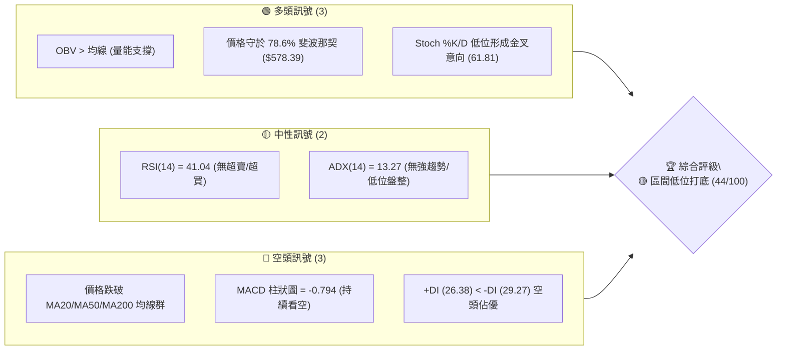
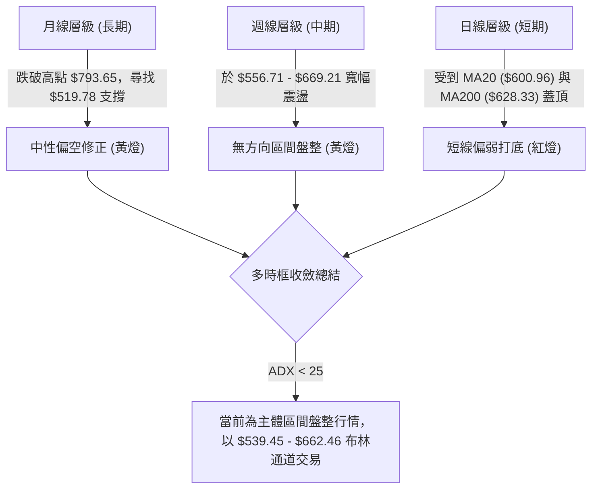
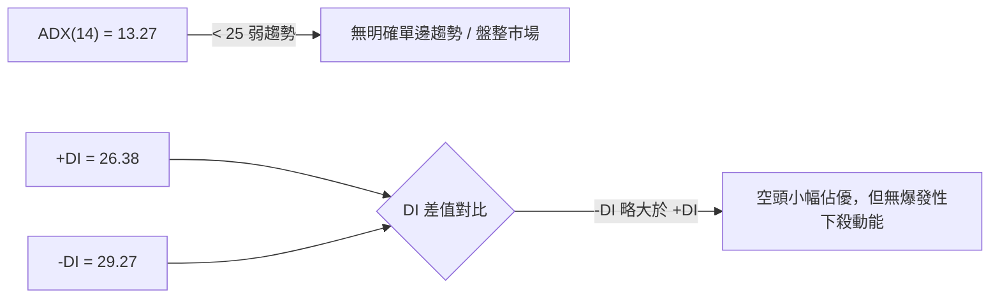
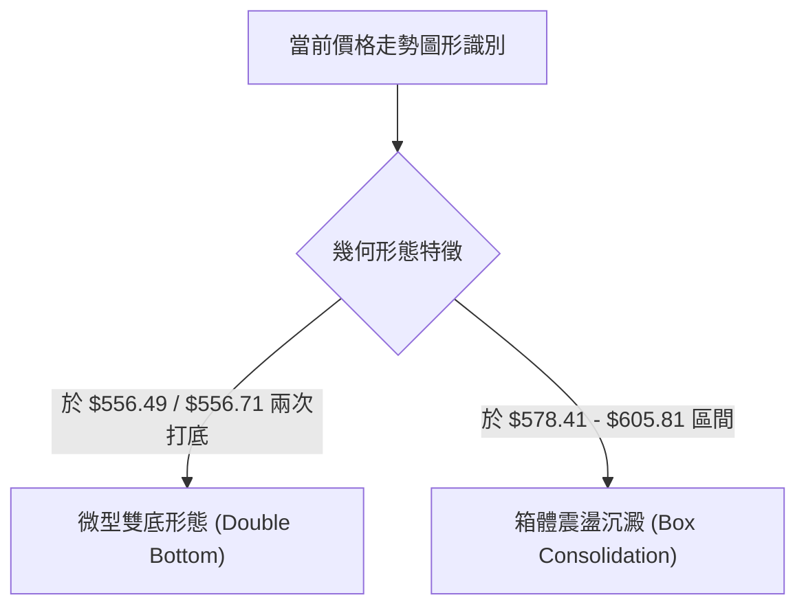
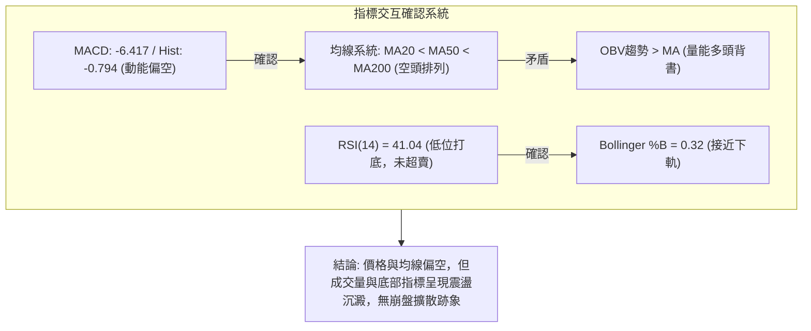
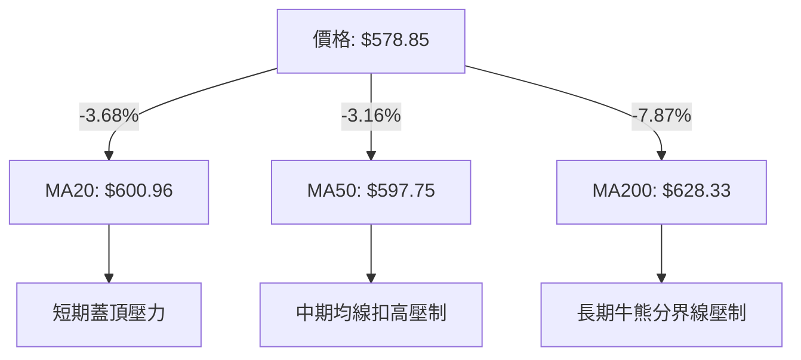
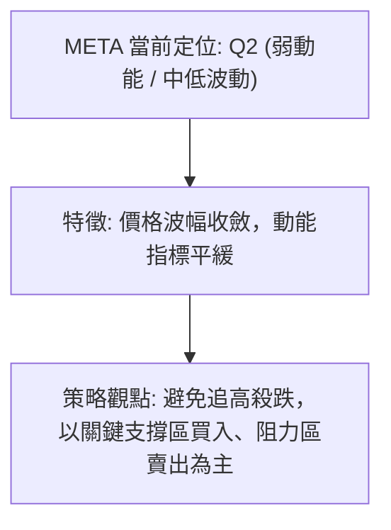
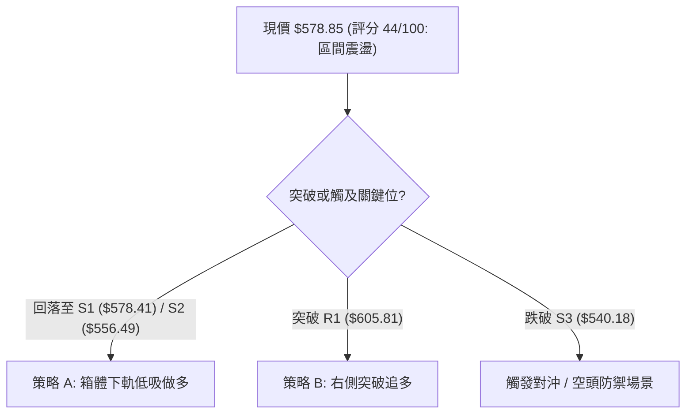
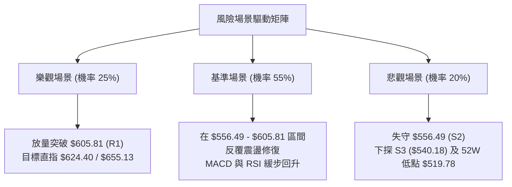

# META 技術分析報告

> **報告日期**：2026-08-13 ｜ **語言**：繁體中文 ｜ **數據來源**：Yahoo Finance ｜ **當前價格**：$578.85

---

## 目錄

| 章節 | 內容 |
|------|------|
| [1. 技術面概覽](#1-技術面概覽) | 訊號儀表板、核心指標、評分卡 |
| [2. 趨勢分析](#2-趨勢分析) | 多時框趨勢、長中短期走勢 |
| [3. 圖表形態分析](#3-圖表形態分析) | 形態識別、K線組合、目標價 |
| [4. 支撐與阻力](#4-支撐與阻力) | 關鍵價位、斐波那契回調 |
| [5. 技術指標深度解讀](#5-技術指標深度解讀) | MA/RSI/MACD/布林/成交量 |
| [6. 動能與波動率](#6-動能與波動率) | 動能評估、ATR、Beta |
| [7. 多時框架總結](#7-多時框架總結) | 時框架評分矩陣 |
| [8. 交易策略建議](#8-交易策略建議) | 多空策略、風險報酬比 |
| [9. 風險提示與監控](#9-風險提示與監控) | 監控指標、風險場景 |

---

## 1. 技術面概覽

### 🎯 技術訊號儀表板



### 📊 核心指標速覽表

| 指標類別 | 指標名稱 | 當前數值 | 訊號 | 解讀 |
|----------|----------|----------|------|------|
| **價格** | 當前收盤價 | $578.85 | 🟡 中性 | 處於 52 週區間相對低位 (21.6% 分位點) |
| **均線** | MA20 | $600.96 | 🔴 空頭 | 價格位於 MA20 下方 -3.68%，短線承壓 |
| **均線** | MA50 | $597.75 | 🔴 空頭 | 價格位於 MA50 下方 -3.16%，中線走弱 |
| **均線** | MA200 | $628.33 | 🔴 空頭 | 價格位於 MA200 下方 -7.87%，長線壓制 |
| **動能** | RSI(14) | 41.04 | 🟡 中性 | 處於中性偏弱區間，尚無超賣（<30）訊號 |
| **動能** | MACD(12,26,9) | -6.417 / -5.623 | 🔴 空頭 | MACD 線位在信號線下方，柱狀圖 -0.794 |
| **動能** | ADX(14) | 13.27 | 🟡 中性 | 數值小於 25，顯示當前為典型區間盤整行情 |
| **波動** | ATR(14) | $21.85 (3.78%) | 🟡 中性 | 每日波幅適中，可作為止損區間間隔基準 |
| **通道** | Bollinger %B | 0.32 | 🟡 中性 | 價格接近布林帶下軌（$539.45）與中軌之間 |
| **量能** | 20日均量比 | 0.95x | 🟢 多頭 | 量能縮減沉澱，OBV趨勢高於均線保持支撐 |

### 🏆 技術評分卡

```
╔══════════════════════════════════════════════════════════════════╗
║                技術評分卡 — META (2026-08-13)                    ║
╠══════════════════════════════════════════════════════════════════╣
║ 趨勢強度      ▓▓▓▓▓▓░░░░░░░░░░░░░░  30/100  🔴 ADX=13.27 趨勢薄弱     ║
║ 動能指標      ▓▓▓▓▓▓▓▓░░░░░░░░░░░░  40/100  🔴 MACD負值/RSI偏弱       ║
║ 支撐穩定度    ▓▓▓▓▓▓▓▓▓▓▓▓▓▓░░░░░░  70/100  🟢 78.6%斐波那契點位紮實  ║
║ 成交量配合    ▓▓▓▓▓▓▓▓▓▓▓░░░░░░░░░  55/100  🟢 OBV走勢強於價格，未失控║
║ 形態完整度    ▓▓▓▓▓▓▓▓▓▓░░░░░░░░░░  50/100  🟡 處於雙底嘗試構築階段   ║
║ 均線排列      ▓▓▓▓▓▓░░░░░░░░░░░░░░  30/100  🔴 MA20/50/200 混合下彎   ║
╠══════════════════════════════════════════════════════════════════╣
║ 綜合評分      ▓▓▓▓▓▓▓▓▓░░░░░░░░░░░  44/100  🟡 觀望/區間下軌尋找反彈 ║
╚══════════════════════════════════════════════════════════════════╝
```

---

## 2. 趨勢分析

### 🌐 多時框趨勢分析



### 📈 長期趨勢 — 12個月走勢圖（Unicode）

```
META 月線走勢圖（過去12個月：2025-08 至 2026-08）
價格軸 ($)
$793.65 ┤                               ● (52W High: $793.65)
$770.91 ┤                   ●
$736.29 ┤       ●       ●
$685.79 ┤   ●
$647.03 ┤               ●       ●
$611.34 ┤                           ●       ●
$578.85 ┤●━━━━━━━━━━━━━━━━━━━━━━━━━━━━━━━━━━━━━● (現價 $578.85)
$519.78 ┤                                           ● (52W Low: $519.78)
        └─┬──────┬──────┬──────┬──────┬──────┬──────┬──────┬──────┬──────┬──────┬──────┬
        25-08  25-09  25-10  25-11  25-12  26-01  26-02  26-03  26-04  26-05  26-06  26-07  26-08
```

#### 過去12個月價格特徵分析表

| 階段 | 時間區間 | 收盤價變化 | 漲跌幅 | 走勢特徵描述 |
|------|----------|------------|--------|--------------|
| **高位回落** | 2025-08 ~ 2025-11 | $736.29 → $646.27 | -12.23% | 從接近歷史高點修正，成交量逐漸萎縮 |
| **反彈築頂** | 2025-12 ~ 2026-01 | $658.91 → $715.22 | +8.55% | 形成次高點拉回，多頭能量衰竭 |
| **大幅下挫** | 2026-02 ~ 2026-03 | $647.03 → $571.60 | -11.66% | 跌破多條長期均線，尋求底部支撐 |
| **低位震盪** | 2026-04 ~ 2026-05 | $611.34 → $631.92 | +3.37% | 試圖反彈但受阻於 $642.40 (R3) 附近 |
| **二次探底** | 2026-06 ~ 2026-08 | $563.29 → $578.85 | +2.76% | 於 $556.71 探底後微幅回升，現集中於 $578.85 |

### 📊 中期趨勢（週線分析）

```
週線壓力支撐架構示意圖
===================================================================
 $669.21  ────────────────────────────────── 週線波段高點阻力 (2026-07-12)
 $642.40  ────────────────────────────────── R3 強阻力位 (波段高點聚類)
 $624.40  ────────────────────────────────── R2 / 61.8% 斐波那契回調位
 $605.81  ────────────────────────────────── R1 第一阻力位 (MA20 附近)
 $578.85  ══════════════════════════════════ 當前現價 ($578.85 / 78.6% 斐波)
 $556.49  ────────────────────────────────── S2 強支撐位 (近兩月低點 $556.71)
 $540.18  ────────────────────────────────── S3 波段極限支撐 (布林帶下軌 $539.45)
===================================================================
```

週線指標顯示，近期 2026-07-12 曾放量拉升至 $669.21，但隨後三週快速失守 $600 關卡，2026-08-02 更砸至週線低點 $556.71（成交量達 1.12 億股），顯示高位拋壓沉重。然而，隨後兩週成交量收縮至 4,396 萬股，價格回升並守住 $578.39 (78.6% 斐波那契位)，表明短線賣壓開始竭盡。

### ⚡ 趨勢強度評估（ADX 解讀）



#### ADX 強度對照表

| ADX 數值範圍 | 趨勢狀態 | META 當前狀態 | 交易策略導向 |
|--------------|----------|---------------|--------------|
| **0 - 20** | **極弱 / 無趨勢** | **✓ (13.27)** | **高拋低吸 / 區間突破交易** |
| **20 - 25** | 趨勢形成中 | 否 | 觀望等待方向確認 |
| **25 - 50** | 強勁趨勢 | 否 | 順勢單邊操作 |
| **50 - 75** | 極強趨勢 | 否 | 緊扣移動止損 |

---

## 3. 圖表形態分析

### 🔍 形態識別系統



#### 圖表形態信心度評估表

| 形態名稱 | 信心度 (%) | 判斷依據（引用數據） | 完成度 | 目標價計算式 | 形態目標價 |
|----------|------------|----------------------|--------|--------------|------------|
| **微型雙底** | **60%** | 2026-07 底低點 $550.25 與 2026-08 低點 $556.71 形成雙重支撐（接近 S2 $556.49） | 65% | 頸線 R1 ($605.81) + 形態高度 ($605.81 - $556.49 = $49.32) | **$655.13** |
| **下降通道突破** | **40%** | 數據不足以確認顯著傾斜通道，僅做指標型解讀 | 30% | 訊號不足，僅做指標型解讀 | N/A |

*註：依據規則 15，由於 ADX<25 且幾何數據尚不足以構成高信心度大級別頭肩底，故本報告不做誇大繪製，主要採雙底與箱體型態解讀。*

### 🕯️ 重要 K 線形態分析（近 6 個月）

| 月份 | 收盤價 | K 線形態 | 技術面解讀 | 多空訊號 |
|------|--------|----------|------------|----------|
| **2026-03** | $571.60 | 大陰線 | 跌破多頭防線，尋求 52 週低點 $519.78 方向的支撐 | 🔴 空頭強烈 |
| **2026-04** | $611.34 | 下影中陽線 | 低位買盤介入，自 $570 附近強勢反彈 | 🟢 多頭反攻 |
| **2026-05** | $631.92 | 小陽星線 | 反彈受阻於 $642.40 (R3)，成交量放緩 | 🟡 震盪觀望 |
| **2026-06** | $563.29 | 長陰包覆 | 吞噬前兩月漲幅，空頭重新主導 | 🔴 空頭再臨 |
| **2026-07** | $556.71 | 探底長下影 | 測試 S2 $556.49 支撐後引發巨量反彈（最高至 $669.21） | 🟢 探底回升 |
| **2026-08** | $578.85 | 縮量十字小陽 | 賣壓大幅收斂，於 78.6% 斐波那契位 ($578.39) 築底 | 🟡 觀望沉澱 |

### 📉 ASCII 走勢形態示意圖

```
META 近期雙底 (W底) 構築與箱體區間示意圖
===================================================================
$624.40 ┤                                  [R2 阻力 / 61.8% 斐波]
$605.81 ┤-------- 頸線阻力 (R1) -----------------------------------
        │        /\            /\
$580.00 ┤───────/──\──────────/──\── 現價 $578.85 ─────────────────
        │      /    \        /    \
$556.49 ┤-----●------\------●------\--- 第一腳 $550.25 / 第二腳 $556.71
$539.45 ┤─────────────────────────────── 布林帶下軌強防線 (S3)
===================================================================
```

### 🎯 形態目標價計算

以已確認的微型雙底形態（信心度 60%）推算：
1. **第一腳低點**：$550.25 (2026-06-28 週收盤)
2. **第二腳低點**：$556.71 (2026-08-02 週收盤)，聚類平均底座取 S2 = **$556.49**
3. **中間頸線高點**：R1 = **$605.81**
4. **形態垂直高度**：$605.81 - $556.49 = **$49.32**
5. **最小向上測幅目標**：頸線 $605.81 + 高度 $49.32 = **$655.13** (接近 50% 斐波那契回調位 $656.71)

---

## 4. 支撐與阻力

### 🗺️ 關鍵價位分布圖（Unicode）

```
META 價位結構分布圖
═══════════════════════════════════════════════════════════════════
$793.65 ║██████████████████████████████████║ 52週歷史高點 (0.0% 斐波)
$729.02 ║████████████████████              ║ 23.6% 斐波那契位
$689.03 ║████████████████                  ║ 38.2% 斐波那契位
$656.71 ║██████████████                    ║ 50.0% 斐波那契位 / 形態測幅目標
$642.40 ║████████████                      ║ 強阻力 R3 (波段高點聚類)
$628.33 ║██████████                        ║ MA200 長期生命線壓制
$624.40 ║████████                          ║ 阻力 R2 / 61.8% 斐波那契位
$605.81 ║██████                            ║ 關鍵頸線阻力 R1 / MA20 / MA50 聚類
$578.85 ╠══════════════════════════════════╣ ◄ 當前現價 ($578.85)
$578.41 ║▓▓▓▓▓▓▓▓▓▓▓▓▓▓▓▓▓▓▓▓▓▓▓▓▓▓▓▓▓▓▓▓  ║ 近期關鍵支撐 S1 / 78.6% 斐波 ($578.39)
$556.49 ║██████████████████████████        ║ 強支撐 S2 (近兩月雙底聚類低點)
$540.18 ║██████████████████████████████████║ 極限支撐 S3 / 布林下軌 ($539.45)
$519.78 ║██████████████████████████████████║ 52週歷史低點 (100.0% 斐波)
═══════════════════════════════════════════════════════════════════
```

### 🚧 阻力位分析表

| 阻力級別 | 精確價位 | 形成原因（依據數據） | 突破難度 | 技術重要性 |
|----------|----------|----------------------|----------|------------|
| **阻力 R1** | **$605.81** | 近一年波段高點聚類、MA20 ($600.96) 與 MA50 ($597.75) 重合區 | 🟡 中等 | 短線多空分水嶺，突破方能擺脫壓制 |
| **阻力 R2** | **$624.40** | 波段高點聚類，精確重合 61.8% 斐波那契回調位與 MA200 ($628.33) | 🔴 較高 | 中線熊市解套盤聚集區，強阻力 |
| **阻力 R3** | **$642.40** | 近一年波段高點聚類，前波反彈高點防線 | 🔴 極高 | 突破宣告中期下降趨勢徹底扭轉 |

### 🛡️ 支撐位分析表

| 支撐級別 | 精確價位 | 形成原因（依據數據） | 守住機率 | 技術重要性 |
|----------|----------|----------------------|----------|------------|
| **支撐 S1** | **$578.41** | 近一年波段低點聚類，與 78.6% 斐波那契位 ($578.39) 重合 (-0.08%) | 🟢 高 | 當前價格防守第一線，多頭回檔防線 |
| **支撐 S2** | **$556.49** | 波段低點聚類，近兩月雙底腳底 ($550.25 - $556.71) 密集區 (-3.86%) | 🟢 很高 | 中線多頭最後防禦陣地，破則趨勢轉壞 |
| **支撐 S3** | **$540.18** | 波段低點聚類，接近布林通道下軌 $539.45 (-6.68%) | 🟢 極高 | 超賣區域，空頭極限延伸點 |

### 📐 斐波那契回調位分析（以 52 週區間 $519.78 → $793.65 計算）

```
斐波那契水平位置與當前價格關係
───────────────────────────────────────────────────────────────────
  0.0%  $793.65 ──────────────────────────────────── 52週最高點
 23.6%  $729.02 ──────────────────────────────────── 上方次級阻力
 38.2%  $689.03 ──────────────────────────────────── 中期轉強關卡
 50.0%  $656.71 ──────────────────────────────────── 多空對峙中心軸
 61.8%  $624.40 ──────────────────────────────────── 重合阻力 R2
 78.6%  $578.39 ─────────────────── ◄ 現價 $578.85 落在此防線上方 (+0.08%)
100.0%  $519.78 ──────────────────────────────────── 52週最低點
───────────────────────────────────────────────────────────────────
```

**解讀**：當前價格 $578.85 精確落在 78.6% 斐波那契回調位（$578.39）與 S1 支撐位（$578.41）的交會處。在技術分析中，78.6% 是深度回調的「最後防線」。若股價能在此處止跌並形成盤整，將構成極佳的風險報酬比入場點；反之，若實體 K 線跌破 $578.39，價格將尋求 S2 ($556.49) 甚至 100% 斐波那契位 ($519.78) 的測試。

---

## 5. 技術指標深度解讀

### 🎛️ 指標訊號總覽



### 📈 移動平均線排列分析



#### 均線數據比較與狀態分析

| 均線天數 | 均線數值 | 當前價差 (美元) | 當前價差 (%) | 均線走勢方向 | 技術訊號 |
|----------|----------|-----------------|--------------|--------------|----------|
| **MA 5** | $590.98 | -$12.13 | -2.05% | ▼ 下彎 | 短線走弱 |
| **MA 10** | $581.76 | -$2.91 | -0.50% | ▼ 下彎 | 短線打底 |
| **MA 20** | $600.96 | -$22.11 | -3.68% | ▼ 下彎 | 短線主阻力 |
| **MA 50** | $597.75 | -$18.90 | -3.16% | ▼ 下彎 | 中線扣高壓制 |
| **MA 120**| $613.43 | -$34.58 | -5.64% | ▼ 下彎 | 中長期受壓 |
| **MA 200**| $628.33 | -$49.48 | -7.87% | ▼ 下彎 | 長期生命線受壓 |
| **MA 240**| $646.64 | -$67.79 | -10.48% | ▼ 下彎 | 年線區域壓力 |

### 📉 RSI(14) 分析

**當前數值**：`41.04`

```
RSI(14) 區間強度： ▓▓▓▓▓▓▓▓▓▓▓▓░░░░░░░░ 41.04% [中性偏弱]
0        30              50              70       100
|--------|---------------|---------------|--------|
       超賣           弱勢區 (現價)       超買
```

* **超買 / 超賣狀態**：RSI 處於 41.04，未進入 <30 超賣區，亦遠離 >70 超買區，顯示短期下挫動能已得到緩和，但多頭尚未展現強勢反彈力道。
* **背離分析**：觀察近兩月走勢，價格於 2026-08-02 觸及 $556.71 時 RSI 為 22.9（超賣），當前價格在 $578.85，RSI 上升至 41.04，**未出現顯著頂背離或底背離**，屬於價格與動能同向的正常修復期。

### 📊 MACD(12/26/9) 訊號解讀

* **DIF (MACD 線)**：`-6.417`
* **DEA (Signal 線)**：`-5.623`
* **MACD 柱狀圖 (Histogram)**：`-0.794` 🔴 看空

```
MACD 數值結構表
┌────────────────────────────────────────────────────────┐
│ MACD Line  (12,26):   -6.417  (處於零軸下方深處)        │
│ Signal Line   (9):   -5.623                            │
│ Histogram        :   -0.794  (綠色柱狀圖伸長，空頭控盤)│
└────────────────────────────────────────────────────────┘
```

**解讀**：DIF 與 DEA 雙雙在零軸下方運行，且 Histogram 為負值（-0.794），表明中短期趨勢仍受空頭力量掌控。然而，Histogram 負值幅度不大（比 2026-08-02 的 -11.160 大幅收斂），顯示殺跌動能正在顯著衰減，空頭續跌能力受限。

### 📦 布林通道分析

```
ASCII 布林通道位置圖
===================================================================
 $662.46 ┤ ----------------------------------------- 布林上軌 ( Upper )
         │
 $600.96 ┤ ----------------------------------------- 布林中軌 ( MA20 )
 $578.85 ┤ ═════════════════════════════════════════ 現價 ($578.85, %B=0.32)
         │
 $539.45 ┤ ----------------------------------------- 布林下軌 ( Lower )
===================================================================
```

* **通道寬度**：上軌 $662.46，下軌 $539.45，通道寬度 $123.01 (約 21.2%)。
* **%B 指標**：`0.32`。表明價格位於中軌（$600.96）與下軌（$539.45）之間，處於通道下半區，偏向弱勢震盪。
* **擠壓 (Squeeze) 判斷**：帶寬目前處於正常水平，未出現極端收縮，結合 ADX=13.27，價格預計將繼續在布林通道上下軌之間進行區間游走。

### 💹 成交量分析（量價配合度）

* **最新單日成交量**：15,847,495 股
* **20 日均量**：16,669,710 股 (量比：`0.95x`)
* **50 日均量**：18,826,632 股
* **OBV (能量潮)**：`OBV > MA` 🟢 量能支撐

**量價解讀**：在股價回落至 S1 ($578.41) 附近時，成交量降至 20 日與 50 日均量下方（量比 0.95x），呈現典型的「無量陰跌 / 縮量整理」特徵，並非「放量恐慌下殺」。此外，OBV 趨勢高於其移動平均線，說明主力資金在近期的回調中未出現大規模流出，籌碼結構相對穩定。

---

## 6. 動能與波動率

### ⚡ 動能評估

#### 動能與波動率定位表

| 象限區間 | 動能強度 (RSI/MACD) | 波動率水平 (ATR) | 當前狀態 | 技術導向評估 |
|----------|---------------------|------------------|----------|--------------|
| **Q1: 強動能 / 低波動** | 強 (RSI > 60) | 低 (ATR < 3%) | ✕ | 最佳趨勢續漲區 |
| **Q2: 弱動能 / 低波動** | **弱 (RSI = 41)** | **中低 (3.78%)** | **✓ (當前區域)** | **築底醞釀區 / 區間操作** |
| **Q3: 強動能 / 高波動** | 強 (RSI > 60) | 高 (ATR > 5%) | ✕ | 高風險主升段 |
| **Q4: 弱動能 / 高波動** | 弱 (RSI < 40) | 高 (ATR > 5%) | ✕ | 恐慌拋售區 |



### 📊 ATR 波動率分析

* **ATR(14)**：`$21.85`
* **波動率百分比**：`3.78%` （以現價 $578.85 計算）

#### 基于 ATR 的止損與波動區間建議

```
╔══════════════════════════════════════════════════════════════════╗
║                    ATR 交易距離參考卡                            ║
╠══════════════════════════════════════════════════════════════════╣
║ 單日預期波動區間 (1.0x ATR):  ± $21.85  ($557.00 ~ $600.70)       ║
║ 短線緊密止損距離 (1.5x ATR):  $32.78                               ║
║ 寬鬆趨勢止損距離 (2.0x ATR):  $43.70                               ║
╚══════════════════════════════════════════════════════════════════╝
```

### 📐 Beta 與市場相關性

* **Beta 係數**：`1.243`

**解讀**：Beta 為 1.243，意味著 META 的波動性高於大盤（S&P 500）約 24.3%。在大盤出現整體調整或反彈時，META 的漲跌幅通常會放大了 1.24 倍。交易者在制定倉位管理時，需將此高 Beta 屬性納入考量，適當降低槓桿倍數。

---

## 7. 多時框架總結

### 📋 時框架評分表

| 時框架 | 趨勢方向 | 動能指標 | 均線排列 | 圖表形態 | 綜合評分 | 交易建議 |
|--------|----------|----------|----------|----------|----------|----------|
| **月線 (長期)** | 🟡 中性修正 | 🟡 中性 | 🔴 下彎壓制 | 🟡 頂部拉回 | **50/100** | 長線定期定額 / 分批佈局 |
| **週線 (中期)** | 🟡 區間震盪 | 🔴 空頭小幅控盤 | 🔴 混合交錯 | 🟢 S2雙底嘗試 | **45/100** | 區間下軌高拋低吸 |
| **日線 (短期)** | 🔴 偏弱打底 | 🟡 空頭動能收斂 | 🔴 空頭排列 | 🟢 S1 守牢 | **40/100** | 逢低分批低吸，嚴設止損 |

### 🔲 綜合訊號矩陣

```
時框架訊號矩陣與方向收斂
┌──────────┬─────────────┬─────────────┬─────────────┐
│ 時框架   │ 趨勢 (ADX)  │ 動能 (MACD) │ 價位 (均線) │
├──────────┼─────────────┼─────────────┼─────────────┤
│ 日線     │ 🟡 盤整(13.2)│ 🔴 柱狀圖負 │ 🔴 低於MA20  │
│ 週線     │ 🟡 盤整     │ 🔴 偏弱     │ 🔴 低於MA50  │
│ 月線     │ 🟢 多頭餘溫 │ 🟡 中性     │ 🟢 高於年線  │
└──────────┴─────────────┴─────────────┴─────────────┘
```

### ⚖️ 多時框收斂結論

**主導趨勢**：ADX 數值為 **13.27 (< 25)**，依多時框收斂規則第 14 條，**當前明確為「盤整行情」**。
在中長期（週線/月線）方向未出現突破強趨勢前，日線交易應以**布林通道區間（$539.45 - $662.46）**與關鍵支撐阻力位作為最高決策依據。

**最終方向定調**：**🟡 區間震盪打底（中性偏多嘗試）**。現價 $578.85 緊貼 S1 支撐位（$578.41）與 78.6% 斐波那契（$578.39），向下空間受制於 S2 ($556.49)，向上則受到 R1 ($605.81) 蓋頂，短期內將在 **$556.49 - $605.81** 箱體內進行修復。

---

## 8. 交易策略建議

### 🗺️ 策略決策流程圖



### 🧭 策略路由

**當前主策略方向 = 🟢 箱體下軌分批做多（依評分 44/100，低位盈虧比優勢）**

### 🎯 價格情境階梯（Price Scenarios）

| 觸發條件 | 下一目標價 | 後續延伸目標 | 情境技術含義 |
|----------|------------|--------------|--------------|
| **突破 R1 $605.81** | R2 $624.40 | R3 $642.40 | 短線轉強，站回 MA20/MA50，雙底形態確認 |
| **守住 S1 $578.41** | R1 $605.81 | — | 於 78.6% 斐波那契位築底震盪，沉澱籌碼 |
| **跌破 S1 降至 S2 $556.49**| S3 $540.18 | $519.78 (52W Low) | 二次探底，測試雙底防線與布林通道下軌 |

### 📊 情境機率分佈

```
情境機率分佈圖
┌────────────────────────────────────────────────────────┐
│ 🟢 區間反彈 / 箱體沉澱 (守住 S1/S2): 55% 機率           │
│ 🟡 窄幅橫盤震盪 ($570 - $590):      30% 機率           │
│ 🔴 跌破 S2 再探 52W 低點 ($519.78):  15% 機率           │
└────────────────────────────────────────────────────────┘
```

### 🟢 主策略詳情

#### 策略 A：箱體下軌分批低吸（首選策略 — 逢低佈局）

* **適用情境**：價格在 S1 ($578.41) 至 S2 ($556.49) 區間止跌企穩，發揮高風險報酬比優勢。

| 策略要素 | 數值 / 設定 | 計算與說明 |
|----------|-------------|------------|
| **進場條件** | 價格回測 S1 附近不破，或於 S2 出現縮量止跌 K 線 |
| **進場價格** | **$578.41** （或分批於 $556.49 - $578.41 掛單） |
| **目標價 T1**| **$605.81** | 首要目標：阻力 R1 (波段高點聚類) |
| **目標價 T2**| **$624.40** | 進階目標：阻力 R2 / 61.8% 斐波那契位 |
| **止損價格** | **$539.45** | 止損設於布林下軌及 S3 ($540.18) 下方 |
| **潛在獲利** | +$27.40 (至 T1) / +$45.99 (至 T2) | 獲利空間 4.73% ~ 7.95% |
| **潛在風險** | -$38.96 | 最大虧損 -6.73% |
| **風險報酬比**| **1 : 1.18** (至 T2) | 以低倉位進行試探 |
| **建議倉位** | **15% - 20%** | 中低倉位，避免承擔過大單邊風險 |

#### 策略 B：右側突破追多（次選策略 — 趨勢確認）

* **適用情境**：日線強勢收高於 R1 ($605.81) 上方，成交量放大至 2,000 萬股以上。

| 策略要素 | 數值 / 設定 | 計算與說明 |
|----------|-------------|------------|
| **進場條件** | 日線實體突破 R1 $605.81 並站穩 1 日 |
| **進場價格** | **$606.00** |
| **目標價 T1**| **$624.40** | 阻力 R2 (61.8% 斐波那契位) |
| **目標價 T2**| **$655.13** | 雙底形態測幅目標價 |
| **止損價格** | **$592.00** | 設於 MA5 ($590.98) 支撐下方 |
| **風險報酬比**| **1 : 1.31** (至 T1) / **1 : 3.51** (至 T2) | 右側交易盈虧比極佳 |
| **建議倉位** | **20% - 25%** | 趨勢確認後可適當加碼 |

### 🔴 反向風險觸發點（對沖提示）

若價格**收盤價跌破 S2 ($556.49)**，且 MACD 柱狀圖負值重新擴大，說明微型雙底構築失敗。多頭應立即執行止損清倉，避開跌向 52 週低點 **$519.78** 的風險。

### ⭐ 整體訊號強度評星

```
做多訊號強度：★★★☆☆  (3/5星 — 支撐紮實但均線蓋頂)
做空訊號強度：★★☆☆☆  (2/5星 — 動能衰竭，不宜低位追空)
整體可信度：  ★★★★☆  (4/5星 — 多指標於 78.6% 斐波那契高度共振)
```

---

## 9. 風險提示與監控

### ✅ 關鍵監控指標 Checklist

```
╔══════════════════════════════════════════════════════════════════╗
║                    每日交易與風控 Check List                      ║
╠══════════════════════════════════════════════════════════════════╣
║ [ ] 價格是否站穩 78.6% 斐波那契位 $578.39？                      ║
║ [ ] RSI(14) 能否突破 50 中性分界線？                              ║
║ [ ] MACD 柱狀圖是否由負轉正（縮短至零軸上方）？                  ║
║ [ ] 單日成交量是否放量突破 20 日均量 (16.67M)？                   ║
║ [ ] 收盤價是否貫穿 S2 強支撐位 $556.49？                          ║
╚══════════════════════════════════════════════════════════════════╝
```

### ⚠️ 風險場景分析



### 🛡️ 風險管理重要提醒

1. **嚴格執行止損紀律**：目前 META 處於均線下方偏弱運行，若觸及止損位（如策略 A 之 $539.45），切勿加碼攤平。
2. **倉位控制**：鑑於 Beta 係數為 1.243 且 ADX 僅為 13.27，單一股票倉位建議控制在總投資組合的 **15% - 20%** 以內。
3. **大盤聯動風險**：當前科技板塊整體波動較大，需同步關注納斯達克 100 指數（NDX）是否出現系統性下挫。

---

## 📋 報告總結

```
╔══════════════════════════════════════════════════════════════════╗
║                   META 技術分析報告總結                          ║
════════════════════════════════════════════════════════════════════
報告日期：2026-08-13
當前價格：$578.85
分析評級：🟡 評級 (區間低位打底 / 觀察反彈)

關鍵結論：
├─ 長期趨勢：🟡 中性修正 (自高點 $793.65 回落後尋求支撐)
├─ 中期趨勢：🟡 寬幅震盪 (於 $556.49 - $669.21 區間游走)
├─ 短期趨勢：🔴 偏弱打底 (受到 MA20 $600.96 蓋頂)
├─ 關鍵支撐：S1 $578.41 / S2 $556.49 / S3 $540.18
├─ 關鍵阻力：R1 $605.81 / R2 $624.40 / R3 $642.40
└─ 分析師共識目標價：$754.14 (均價) / $580.00 (最低)

最優策略組合：
1. 🥇 首選策略：箱體下軌分批低吸 (進場 $578.41 / 止損 $539.45 / 目標 $624.40)
2. 🥈 次選策略：右側突破追多 (突破 $605.81 進場 / 目標 $655.13)
3. 🥉 保守選擇：等待 ADX > 25 且價格突破 MA200 ($628.33) 後再行順勢進場
════════════════════════════════════════════════════════════════════
```

---

> ⚠️ **免責聲明**：本報告為 AI 自動生成之技術分析，所有數據及估算均基於提供的歷史價格資訊。本報告**僅供研究與學術參考**，**不構成任何投資建議**。投資有風險，入市需謹慎。

---

*報告生成時間：2026-08-13 ｜ 數據來源：Yahoo Finance ｜ 分析框架：多時框技術分析*