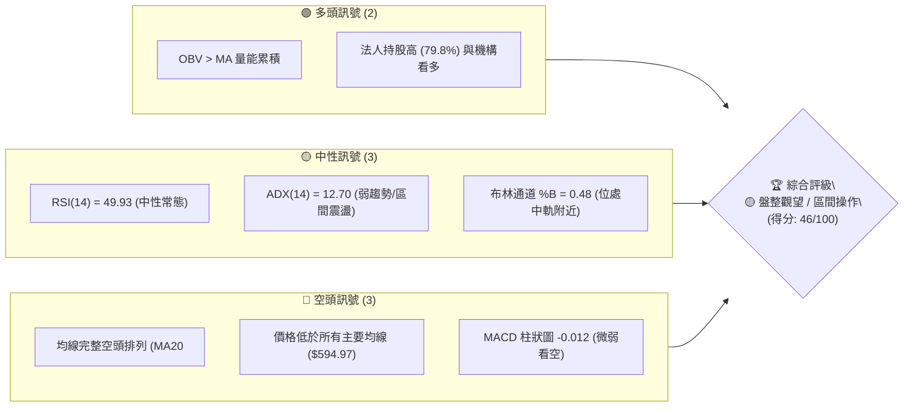
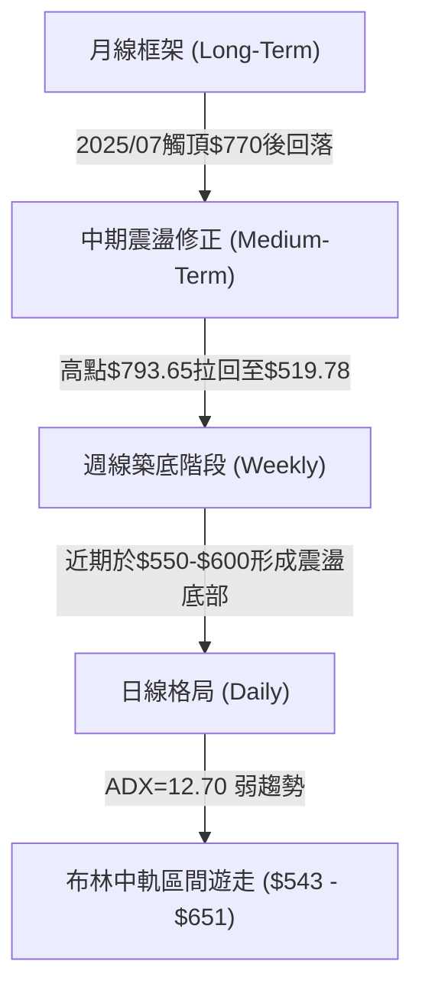
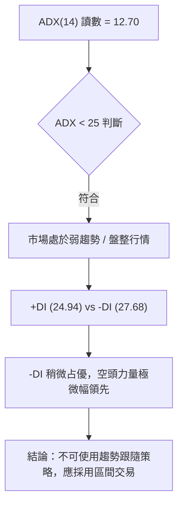
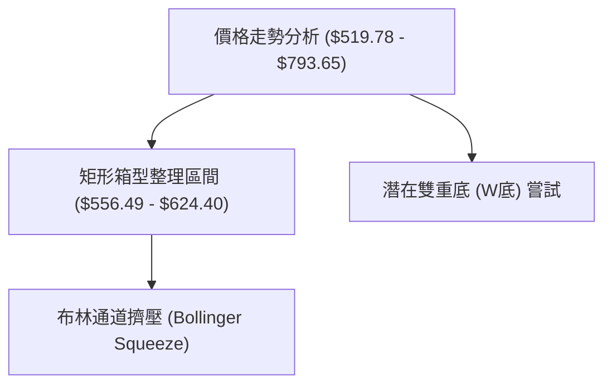
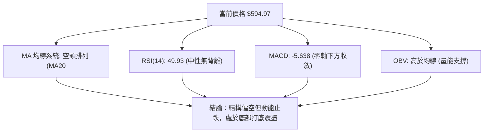
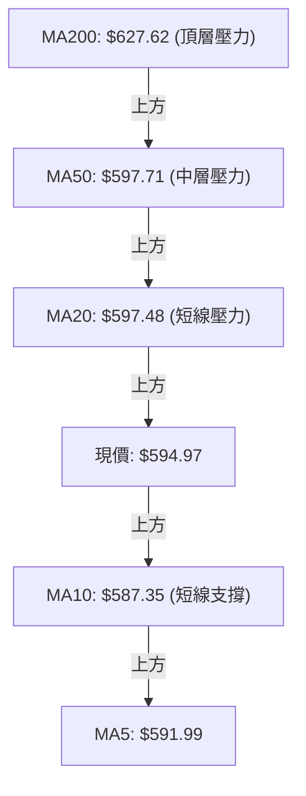
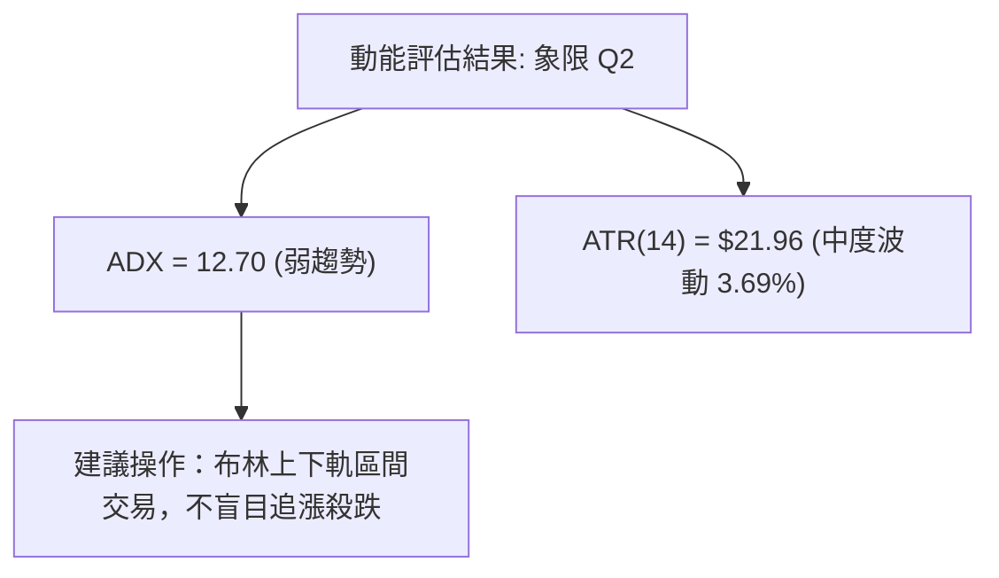
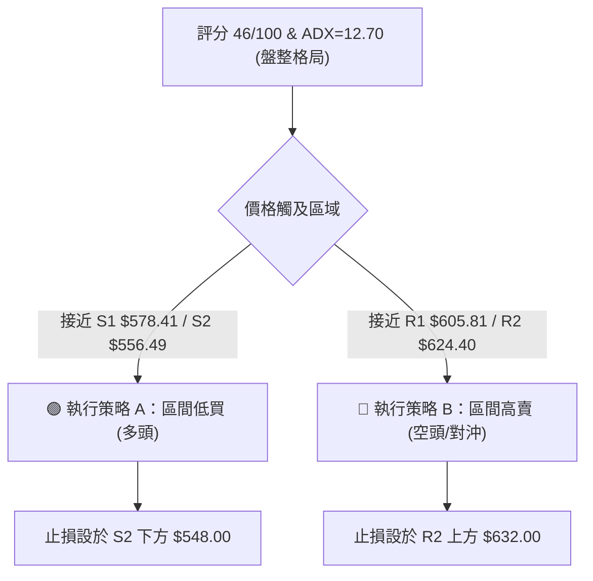
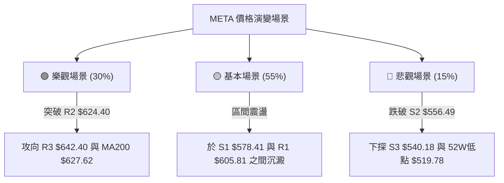

# META 技術分析報告

> **報告日期**：2026-08-14 ｜ **語言**：繁體中文 ｜ **數據來源**：Yahoo Finance ｜ **當前價格**：$594.97

---

## 目錄

| 章節 | 內容 |
|------|------|
| [1. 技術面概覽](#1-技術面概覽) | 訊號儀表板、核心指標、評分卡 |
| [2. 趨勢分析](#2-趨勢分析) | 多時框趨勢、長中短期走勢、12個月ASCII走勢圖 |
| [3. 圖表形態分析](#3-圖表形態分析) | 形態識別、信心度評估、K線組合、目標價計算 |
| [4. 支撐與阻力](#4-支撐與阻力) | 關鍵價位分布、阻力與支撐表、斐波那契回調 |
| [5. 技術指標深度解讀](#5-技術指標深度解讀) | MA均線系統、RSI、MACD、布林通道、OBV量能 |
| [6. 動能與波動率](#6-動能與波動率) | 動能四象限、ATR波動率、Beta市場相關性 |
| [7. 多時框架總結](#7-多時框架總結) | 時框架評分矩陣、多時框收斂規則結論 |
| [8. 交易策略建議](#8-交易策略建議) | 策略路由、價格情境階梯、進出場與風報比 |
| [9. 風險提示與監控](#9-風險提示與監控) | 關鍵監控 Checklist、三種情境演練、風控守則 |

---

## 1. 技術面概覽

### 🎯 技術訊號儀表板



### 📊 核心指標速覽表

| 指標類別 | 指標名稱 | 當前數值 | 訊號 | 解讀 |
|----------|----------|----------|------|------|
| **價格** | 當前價格 | $594.97 | 🟡 中性 | 處於 52 週區間之 27.5% 分位，近期築底震盪 |
| **均線** | MA20 | $597.48 | 🔴 看空 | 股價位於 MA20 下方 (-0.42%)，短線承壓 |
| **均線** | MA50 | $597.71 | 🔴 看空 | 股價位於 MA50 下方 (-0.46%)，中線偏弱 |
| **均線** | MA200 | $627.62 | 🔴 看空 | 股價位於 MA200 下方 (-5.20%)，長線結構轉弱 |
| **動能** | RSI(14) | 49.93 | 🟡 中性 | 位於 50 均衡線附近，無超買超賣，多空拉鋸 |
| **動能** | MACD | -5.638 | 🔴 看空 | DIF與DEA均位於零軸下方，柱狀圖 -0.012 負值收斂 |
| **動能** | Stoch %K/%D | 80.15 / 74.91 | 🔴 超買 | 隨機指標進入超買區，短線留意回檔壓力 |
| **趨勢** | ADX(14) | 12.70 | 🟡 無趨勢 | ADX < 25 表示當前為典型盤整/無趨勢行情 |
| **波動** | ATR(14) | $21.96 | 🟡 中等 | 日均波動幅度 3.69%，提供交易止損與獲利參考 |
| **通道** | 布林通道 | $543.73 - $651.22 | 🟡 區間 | %B 為 0.48，價格貼近中軌 $597.48 |
| **成交量** | 量比 (20D) | 0.66x | 🟡 縮量 | 最新成交量 10.91M 低於 20日均量 16.44M |

### 🏆 技術評分卡

```
╔══════════════════════════════════════════════════════════════════╗
║              技術評分卡 — META (2026-08-14)                      ║
╠══════════════════════════════════════════════════════════════════╣
║ 趨勢強度      ▓▓▓▓▓▓░░░░░░░░░░░░░░  30/100  🔴 弱趨勢 (ADX 12.7)║
║ 動能指標      ▓▓▓▓▓▓▓▓▓░░░░░░░░░░░  45/100  🟡 中性偏弱 (RSI 49.9) ║
║ 支撐穩定度    ▓▓▓▓▓▓▓▓▓▓▓▓▓░░░░░░░  65/100  🟢 S1/S2 多次測試生效  ║
║ 成交量配合    ▓▓▓▓▓▓▓▓▓▓▓░░░░░░░░░  55/100  🟡 OBV累積，但近量縮  ║
║ 形態完整度    ▓▓▓▓▓▓▓▓▓▓░░░░░░░░░░  50/100  🟡 箱型震盪打底階段    ║
║ 均線排列      ▓▓▓▓▓▓░░░░░░░░░░░░░░  30/100  🔴 死叉空頭排列       ║
╠══════════════════════════════════════════════════════════════════╣
║ 綜合評分      ▓▓▓▓▓▓▓▓▓░░░░░░░░░░░  46/100  🟡 中性觀望 / 區間操作 ║
╚══════════════════════════════════════════════════════════════════╝
```

---

## 2. 趨勢分析

### 🌐 多時框趨勢分析



### 📈 長期趨勢 — 12個月走勢圖（Unicode）

```
META 月線走勢圖（2025-08 至 2026-08）
價格軸 ($)
$800 ┤                             ● (2025-07 歷史高點附近)
$750 ┤             ●   ●   ●
$700 ┤         ●               ●
$650 ┤     ●                       ●   ●   ●
$600 ┤                                         ●   ●       ● (現在 $594.97)
$550 ┤ ●                                               ●   ●
     └─┬───┬───┬───┬───┬───┬───┬───┬───┬───┬───┬───┬───┤
      08  09  10  11  12  01  02  03  04  05  06  07  08 (月份)
```

#### 走勢特徵分析表

| 時間區段 | 價格區間 | 漲跌特徵 | 技術面解讀 |
|----------|----------|----------|------------|
| **2025-08 ~ 2025-10** | $736.29 → $646.67 | 衝高回落 (-12.2%) | 於 $770 區域受阻後展開第一波中級修正 |
| **2025-11 ~ 2026-01** | $646.27 → $715.22 | 階段反彈 (+10.7%) | 反彈測試 0.382 斐波那契阻力，動能衰竭 |
| **2026-02 ~ 2026-03** | $647.03 → $571.60 | 加速下挫 (-11.7%) | 跌破 MA200 支撐，開啟主跌波段 |
| **2026-04 ~ 2026-05** | $611.34 → $631.92 | 低點反彈 (+3.4%) | 尋求 $550-$570 區間底部支撐 |
| **2026-06 ~ 2026-08** | $563.29 → $594.97 | 底部震盪 (+5.6%) | 測試 52 週低點 $519.78 上方 S2($556.49) 後打底 |

### 📊 中期趨勢（週線分析）

```
週線震盪結構示意圖：
阻力區 R2: $624.40 ───┬─────────────────────────────────── (61.8% Retracement)
                      │      ▲ 反彈壓力區
阻力區 R1: $605.81 ───┼──────┼──────────────────────────── (近波段高點)
現  價:    $594.97 ───┼──────┼─────── ● (當前價格位於區間中段)
支撐區 S1: $578.41 ───┼──────┴───────┴──────────────────── (78.6% Retracement)
                      │      ▼ 回檔支撐區
支撐區 S2: $556.49 ───┴─────────────────────────────────── (近波段低點聚類)
```

### ⚡ 趨勢強度評估（ADX 解讀）



#### ADX 強度對照表

| ADX 區間 | 趨勢狀態 | 當前 META 位置 | 建議交易策略 |
|----------|----------|----------------|--------------|
| **0 – 20** | **極弱 / 無趨勢** | **✓ (12.70)** | **高拋低吸，通道操作** |
| 20 – 25 | 趨勢形成中 | — | 觀察突破方向 |
| 25 – 50 | 強趨勢 | — | 順勢單邊持倉 |
| 50 – 100| 極強趨勢 | — | 緊盯止損，移動止盈 |

---

## 3. 圖表形態分析

### 🔍 形態識別系統



#### 形態信心度與判斷依據

| 形態名稱 | 信心度 | 判斷依據（引用數據） | 完成度 | 目標價計算與數值 |
|----------|--------|----------------------|--------|------------------|
| **矩形箱型整理** | **75%** | 價格於 S2($556.49) 與 R2($624.40) 區間多次擺動 | 80% | 箱頂 $624.40 / 箱底 $556.49 |
| **潛在雙重底** | **55%** | 2026-06/07 於 $550-$556 形成兩次低點支撐 | 50% | 頸線 R2($624.40) + 高度($67.91) = **$692.31** (數據外推算) |
| **頭肩形態** | **30%** | 數據不足以支撐完整幾何頭肩結構 | 0% | 訊號不足，僅做指標型解讀 |

### 🕯️ 重要 K 線形態分析（近期 5 週）

| 週別 | 收盤價 | K線形態 | 技術含義 | 訊號 |
|------|--------|---------|----------|------|
| **2026-07-19** | $646.01 | 長上影陰線 | 衝高至 R3($642.40) 上方遇強阻力回落 | 🔴 看空 |
| **2026-07-26** | $595.19 | 中陰線 | 跌破 MA20 均線，多頭動能迅速衰退 | 🔴 看空 |
| **2026-08-02** | $556.71 | 大陰線向下探底 | 下探至 S2($556.49) 尋求強支撐，RSI 觸及 22.9 | 🔴 短期超賣 |
| **2026-08-09** | $592.10 | 長下影陽線 (錘子線) | 於 S2 獲得買盤強力支撐，單週反彈 +6.35% | 🟢 底態止跌 |
| **2026-08-16** | $594.97 | 十字星 / 小陽線 | 於 MA20/MA50 密集的 $597 附近橫盤消化壓力 | 🟡 多空對峙 |

### 📉 ASCII 走勢形態示意圖

```
META 箱型整理與潛在雙底示意圖
$642.40 ┤...................................... (R3 阻力線)
        │            ▲
$624.40 ┤........../...\....................... (R2 頸線位/箱型頂部)
        │         /     \     ▲
$594.97 ┤......../.......\.../.\............... (現價位置)
        │       /         \ /   \
$578.41 ┤....../...........\/....\............. (S1 支撐位)
        │     /                   \
$556.49 ┤----●---------------------●----------- (S2 第一底與第二底)
```

### 🎯 形態目標價計算

1. **矩形突破上軌目標價**：
   $$\text{上軌 R2} (\$624.40) + [\text{箱型高度} (\$624.40 - \$556.49 = \$67.91)] = \mathbf{\$692.31}$$
2. **矩形跌破下軌目標價**：
   $$\text{下軌 S2} (\$556.49) - [\text{箱型高度} (\$67.91)] = \mathbf{\$488.58}$$

---

## 4. 支撐與阻力

### 🗺️ 關鍵價位分布圖（Unicode）

```
META 價位結構分布圖 (當前價格: $594.97)
════════════════════════════════════════════════════════════════
$793.65 ║████████████████████████████████████████║ 52週最高點 (0.0%)
$729.02 ║████████████████████████████            ║ 斐波那契 23.6%
$689.03 ║██████████████████                      ║ 斐波那契 38.2%
$656.71 ║████████████                            ║ 斐波那契 50.0%
$642.40 ║██████████                              ║ 強阻力 R3
$624.40 ║████████                                ║ 阻力 R2 / 斐波那契 61.8%
$605.81 ║████                                    ║ 近期阻力 R1
$594.97 ╠════════════════════════════════════════╣ ◄ 現價位置
$578.41 ║▓▓▓▓                                    ║ 近期支撐 S1 / 斐波那契 78.6%
$556.49 ║▓▓▓▓▓▓▓▓                                ║ 強支撐 S2 (近一年波段低點)
$540.18 ║▓▓▓▓▓▓▓▓▓▓                              ║ 強支撐 S3
$519.78 ║▓▓▓▓▓▓▓▓▓▓▓▓▓▓▓▓▓▓▓▓▓▓▓▓▓▓▓▓▓▓▓▓▓▓▓▓▓▓▓▓║ 52週最低點 (100.0%)
════════════════════════════════════════════════════════════════
```

### 🚧 阻力位分析表

| 阻力級別 | 精確價位 | 形成原因（OHLCV 數據聚類） | 突破難度 | 重要性 |
|----------|----------|----------------------------|----------|--------|
| **R1** | **$605.81** | 近期小波段高點、解套賣壓區 (+1.82%) | 🟡 中等 | 短線突破分水嶺 |
| **R2** | **$624.40** | 近一年高點回檔 61.8% 斐波那契重合區 (+4.95%) | 🔴 偏高 | 中期多空樞紐 |
| **R3** | **$642.40** | 近一年波段高點聚類、MA240 ($646.00) 壓力 (+7.97%) | 🔴 極高 | 長期空頭強防線 |

### 🛡️ 支撐位分析表

| 支撐級別 | 精確價位 | 形成原因（OHLCV 數據聚類） | 守住機率 | 重要性 |
|----------|----------|----------------------------|----------|--------|
| **S1** | **$578.41** | 52週區間 78.6% 斐波那契回調位 (-2.78%) | 🟢 70% | 短線拉回第一買點 |
| **S2** | **$556.49** | 近一年多次測試之雙底關鍵支撐 (-6.47%) | 🟢 85% | 中期多頭防禦底線 |
| **S3** | **$540.18** | 波段低點聚類、接近布林下軌 $543.73 (-9.21%) | 🟢 90% | 強力防守大關 |

### 📐 斐波那契回調位分析

* **基準區間**：52 週最高點 **$793.65** (0.0%) → 52 週最低點 **$519.78** (100.0%)
* **當前價格位置**：$594.97，精確落在 **78.6% ($578.39)** 與 **61.8% ($624.40)** 之間。
* **技術解讀**：價格在跌破 61.8% ($624.40) 黃金分割點後，下探至 78.6% ($578.39) 附近展現極強韌性並獲得買盤支撐。目前正在 78.6% 至 61.8% 的狹幅通道內進行築底消化。

---

## 5. 技術指標深度解讀

### 🎛️ 指標訊號總覽



### 📈 移動平均線排列分析



#### 均線數據明細與解讀

* **MA5 / MA10**：$591.99 / $587.35 (現價已站上短均線，短線呈現反彈)
* **MA20 / MA50**：$597.48 / $597.71 (兩線極度靠攏，於 $597.50 形成短線交叉關卡)
* **MA200 / MA240**：$627.62 / $646.00 (中長期均線下行，呈現典型空頭排列)

### 📉 RSI(14) 分析

```
RSI(14) 當前讀數: 49.93
[0] ─────────────── [30] ─────────●─────── [70] ─────────────── [100]
                   超賣區       49.93(中性)  超買區
```

* **背離判斷**：RSI 與價格走勢保持一致，近期由 2026-08-02 的低點 22.9 快速回升至 49.93，屬於超賣後的技術性修復，**無明顯頂背離或底背離**。

### 📊 MACD(12,26,9) 訊號解讀

* **MACD 線 (DIF)**：-5.638
* **訊號線 (DEA)**：-5.626
* **MACD 柱狀圖**：-0.012
* **解讀**：MACD DIF 與 DEA 在零軸下方極度貼近，柱狀圖縮至接近 0（-0.012），顯示空頭向下殺跌的動能已耗盡，即將面臨零軸下方的「金叉或死叉抉擇點」。

### 📦 布林通道分析

```
布林通道結構 (BB Bandwidth 縮窄中)
$651.22 ┤---------------------------------------- 上軌 (Resistance)
        │
$597.48 ┤-------------------●-------------------- 中軌 (MA20)
$594.97 ┤                   ▲ 現價 (%B = 0.48)
        │
$543.73 ┤---------------------------------------- 下軌 (Support)
```

* **%B 指標**：0.48 (剛好位於中軌下方一點，顯示價格無過度偏離，處於通道中央平穩區)。

### 💹 成交量分析（量價配合度）

```
最新量能:   10.91M (20日均量: 16.44M, 量比 0.66x) — 縮量整理
OBV 趨勢:   OBV > MA ─── 🟢 量能並未隨股價回檔而崩潰，主力籌碼鎖定良好
```

---

## 6. 動能與波動率

### ⚡ 動能評估四象限

| 象限 | 動能狀態 | 波動率狀態 | 當前 META 位置 | 交易戰略 |
|------|----------|------------|----------------|----------|
| **Q1** | 強 (ADX>25) | 低 (ATR%<2.5%) | — | 順勢突破加碼 |
| **Q2** | **弱 (ADX<25)** | **低/中 (ATR% 3.69%)** | **✓ META 當前位置** | **區間低買高賣，嚴格止損** |
| **Q3** | 強 (ADX>25) | 高 (ATR%>5.0%) | — | 高風險追價 |
| **Q4** | 弱 (ADX<25) | 高 (ATR%>5.0%) | — | 觀望避開 |



### 📊 ATR 波動率分析與止損建議

* **ATR(14)**：$21.96 (佔當前股價 3.69%)
* **風控止損距離參考**：
  * **波段交易 (1.5x ATR)**：$21.96 \times 1.5 = \mathbf{\$32.94}$
  * **趨勢交易 (2.0x ATR)**：$21.96 \times 2.0 = \mathbf{\$43.92}$

### 📐 Beta 與市場相關性

* **Beta 值**：1.243 (高於大盤 1.0，具備適度高彈性，美股大盤漲跌 1%，META 預期擺動 1.24%)。

---

## 7. 多時框架總結

### 📋 時框架評分表

| 時框架 | 趨勢方向 | 動能指標 | 均線排列 | 形態結構 | 綜合評分 | 建議策略 |
|--------|----------|----------|----------|----------|----------|----------|
| **日線 (Daily)** | 🟡 區間震盪 | 🟡 RSI 49.9 | 🔴 死叉排列 | 🟡 箱型震盪 | **48/100** | 區間高拋低吸 |
| **週線 (Weekly)** | 🟡 底態止跌 | 🟢 超賣反彈 | 🔴 MA200下方 | 🟢 雙底打底 | **52/100** | 尋求低點逢低佈局 |
| **月線 (Monthly)**| 🟢 長多修正 | 🟡 中性 | 🟢 長期走升 | 🟢 大結構整理 | **60/100** | 長線價值區間 |

### 🔲 綜合訊號矩陣

```
時框架訊號收斂矩陣
────────────────────────────────────────────────────────────
日線  │  MA: 🔴  │  RSI: 🟡  │  MACD: 🔴  │  ADX: 🟡 (盤整)
週線  │  MA: 🔴  │  RSI: 🟢  │  MACD: 🟢  │  OBV: 🟢 (支撐)
月線  │  MA: 🟢  │  RSI: 🟡  │  MACD: 🟡  │  基本面: 🟢 (強勁)
────────────────────────────────────────────────────────────
```

### ⚖️ 多時框收斂結論

依據多時框收斂規則（Rule 14）：
當前 ADX 為 **12.70 (<25)**，明確指示市場處於**無趨勢的盤整行情**。
因此，中長期的均線空頭排列（MA200 $627.62）暫不致引發單邊暴跌，交易應**以日線布林通道 ($543.73 - $651.22) 與關鍵支撐阻力 S1/R1 為主要操作區間**。

---

## 8. 交易策略建議

### 🗺️ 策略決策流程圖



### 🧭 策略路由

**當前主策略方向 = 🟡 區間震盪操作（偏向低吸高拋） (技術評分: 46/100)**

### 🎯 價格情境階梯 (Price Scenarios)

| 觸發條件 | 下一目標 | 後續延伸 | 情境含義 |
|----------|----------|----------|----------|
| **突破 R1 $605.81** | R2 $624.40 | R3 $642.40 | 短線轉強，試探箱型頂部 |
| **站穩現價區間 ($590-$600)** | R1 $605.81 | S1 $578.41 | 中軌狹幅整理 |
| **跌破 S1 $578.41** | S2 $556.49 | S3 $540.18 | 回測箱型底部重回打底 |

### 📊 情境機率分佈

| 情境 | 機率 | 主要依據 |
|------|------|----------|
| **區間震盪 (Bounce in Range)** | **55%** | ADX=12.70 顯示無趨勢，布林帶寬與成交量同時收縮 |
| **築底反彈 (Upward Rebound)** | **30%** | OBV > MA 顯現籌碼累積，上週錘子線支撐有效 |
| **破底下探 (Downward Breakdown)**| **15%** | 均線系統呈空頭排列，MACD 仍在零軸下方 |

### 🟢 主策略詳情

| 策略要素 | 策略 A：區間低吸做多 (多頭主力) | 策略 B：高位防禦做空/對沖 (次要策略) |
|----------|---------------------------------|--------------------------------------|
| **進場條件** | 價格拉回至 S1 附近出現止跌訊號 | 價格反彈至 R1/R2 遇阻出現長上影線 |
| **進場價格** | **$578.41** (S1 支撐位) | **$624.40** (R2 阻力位) |
| **目標價 T1** | **$605.81** (R1 阻力位) | **$594.97** (現價/中軌) |
| **目標價 T2** | **$624.40** (R2 阻力位) | **$578.41** (S1 支撐位) |
| **止損價格** | **$556.49** (跌破 S2 止損) | **$638.00** (突破 R2 加上 1xATR 止損) |
| **風險報酬比**| **2.10 : 1** | **2.21 : 1** |
| **成功機率** | **60%** | **50%** |
| **建議倉位** | **15% - 20%** | **5% - 10%** |

### 🔴 反向風險觸發點（對沖提示）

若股價強勢收復 **$624.40 (R2)** 並伴隨日成交量增至 **25M 以上**，宣告箱型向下突破失敗並啟動 W 底大反彈，應立即回補所有空頭部位並轉為全力做多。

### ⭐ 整體訊號強度評星

```
做多訊號強度：★★★☆☆  (3/5星)
做空訊號強度：★★☆☆☆  (2/5星)
整體可信度：  ★★██☆  (3.5/5星 - 盤整行情指標收斂度高)
```

---

## 9. 風險提示與監控

### ✅ 關鍵監控指標 Checklist

```
╔══════════════════════════════════════════════════════════════════╗
║                   每日技術監控 CHECKLIST                         ║
╠══════════════════════════════════════════════════════════════════╣
║ [ ] 股價是否突破/跌破 $597.50 (MA20/MA50 均線密集交會處)         ║
║ [ ] ADX(14) 是否升破 25 (觀察是否由盤整轉為單邊趨勢行情)         ║
║ [ ] RSI(14) 是否向上突破 50 中性水準或跌破 40                  ║
║ [ ] 成交量是否放大至 20日均量 (16.44M) 以上                      ║
║ [ ] 價格是否觸及 S2 ($556.49) 或 R2 ($624.40) 邊界               ║
╚══════════════════════════════════════════════════════════════════╝
```

### ⚠️ 風險場景分析



### 🛡️ 風險管理重要提醒

1. **嚴禁趨勢追價**：ADX(14) 僅 12.70，市場缺乏單邊推動力，追漲容易買在局部高點。
2. **倉位管控**：當前處於打底階段，整體技術倉位不宜超過總資金的 **25%**。
3. **止損紀律**：以 S2 **$556.49** 作為多頭陣營的最後防線，收盤價跌破必須執行無條件止損。

---

## 📋 報告總結

```
╔══════════════════════════════════════════════════════════════════╗
║                   META 技術分析報告總結                          ║
════════════════════════════════════════════════════════════════════
 報告日期：2026-08-14
 當前價格：$594.97
 分析評級：🟡 盤整觀望 / 區間操作 (得分: 46/100)

 關鍵結論：
 ├─ 長期趨勢：🟢 經歷修正後於歷史高點回檔 27.5% 處獲得支撐
 ├─ 中期趨勢：🟡 於 $556.49 - $624.40 形成標準箱型打底格局
 ├─ 短期趨勢：🟡 MA20/MA50 於 $597 壓制，短線量縮橫盤
 ├─ 關鍵支撐：S1 $578.41 / S2 $556.49
 ├─ 關鍵阻力：R1 $605.81 / R2 $624.40
 └─ 分析師目標：均價 $754.14 (隱含 +26.75% 潛在上行空間)

 最優策略組合：
 1. 🥇 最佳機會：於 S1 ($578.41) 附近逢低掛單做多，止損設 $556.49
 2. 🥈 次選機會：突破 R1 ($605.81) 確認後順勢加碼，目標 R2 ($624.40)
 3. 🥉 保守選擇：觀望等待 ADX > 25 且價格突破 $624.40 後再行進場
╚══════════════════════════════════════════════════════════════════╝
```

---

> ⚠️ **免責聲明**：本報告為 AI 自動生成之技術分析，所有數據及估算均基於提供的歷史價格資訊。本報告**僅供研究與學術參考**，**不構成任何投資建議**。投資有風險，入市需謹慎。

*報告生成時間：2026-08-14 ｜ 數據來源：Yahoo Finance ｜ 分析框架：多時框技術分析*