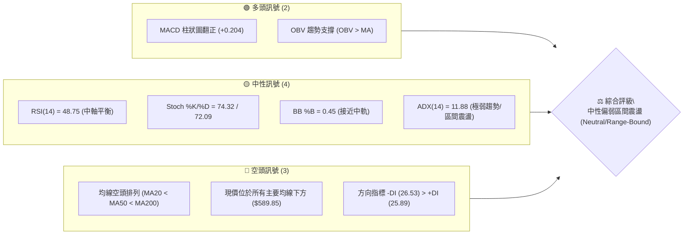
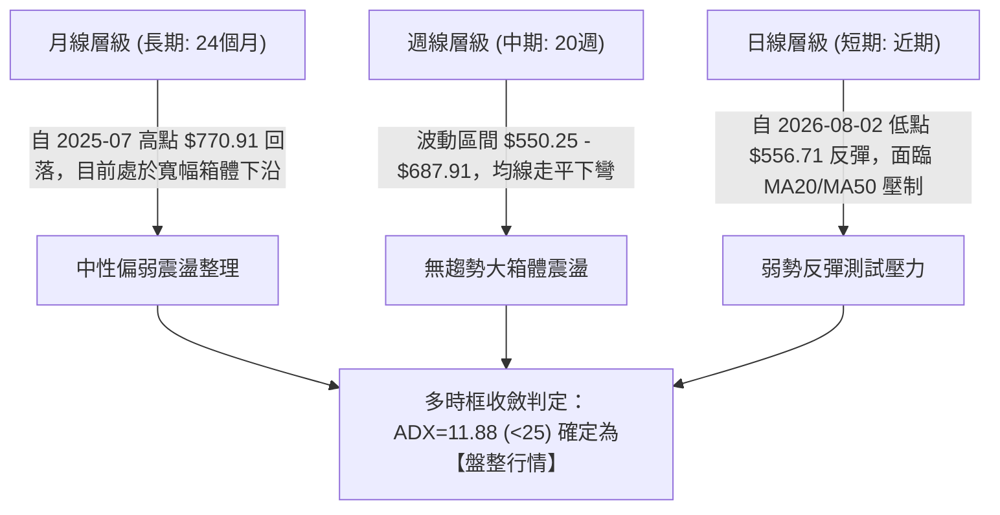
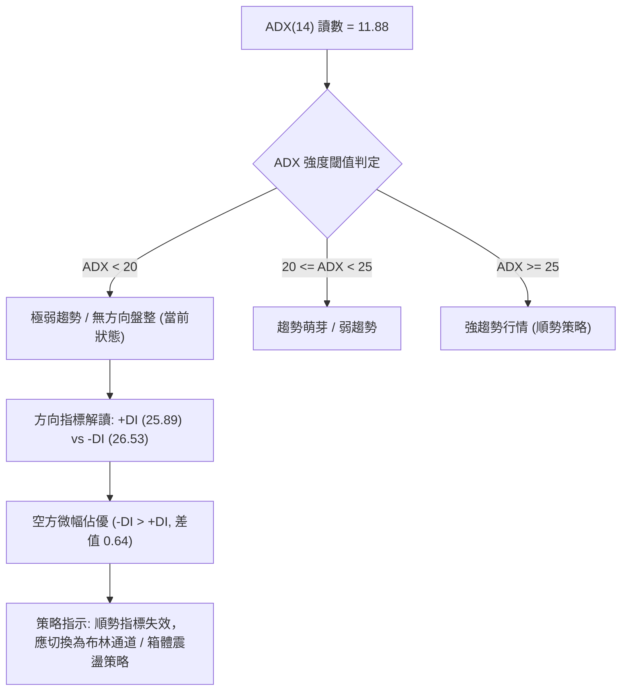
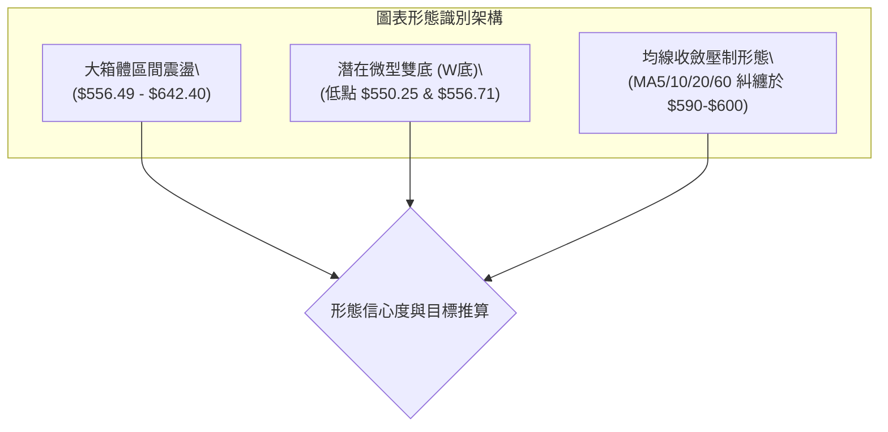
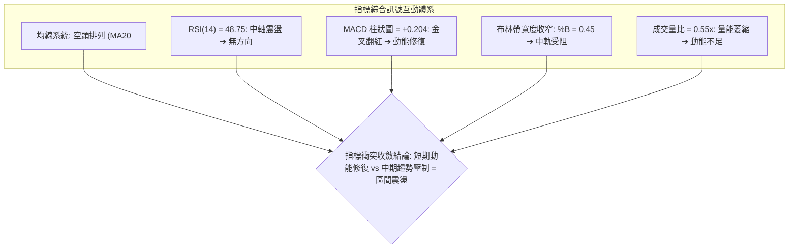
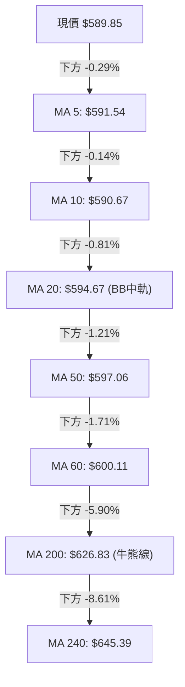
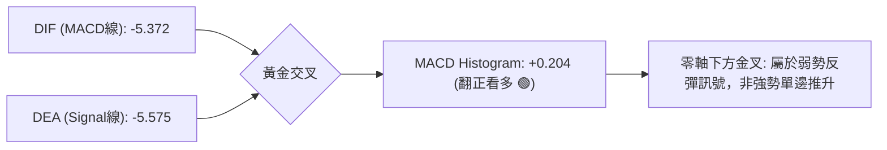
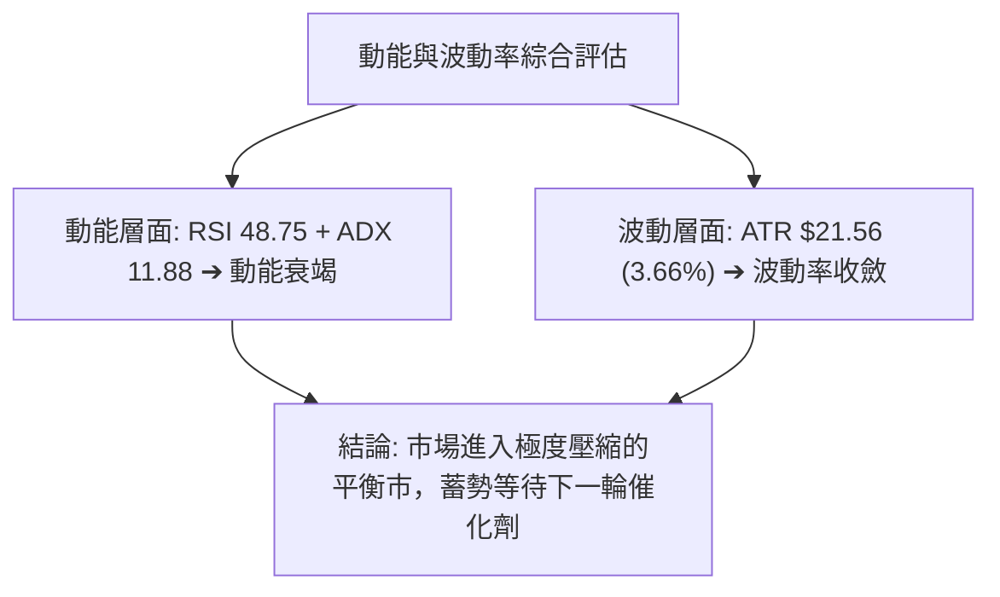
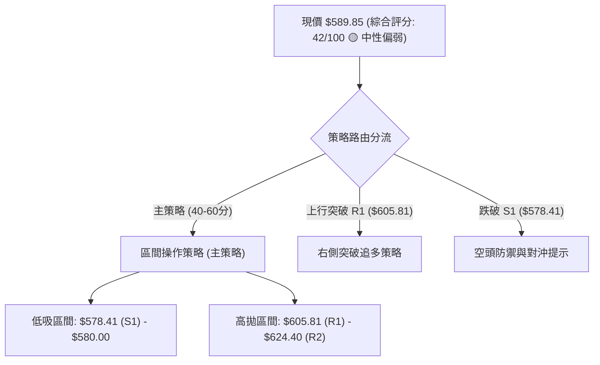
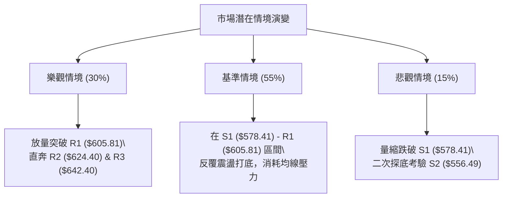

# META 技術分析報告

> **報告日期**：2026-08-16 ｜ **語言**：繁體中文 ｜ **數據來源**：Yahoo Finance ｜ **當前價格**：$589.85

---

## 目錄

| 章節 | 內容 |
|------|------|
| [1. 技術面概覽](#1-技術面概覽) | 訊號儀表板、核心指標、評分卡 |
| [2. 趨勢分析](#2-趨勢分析) | 多時框趨勢、長中短期走勢、ADX解讀 |
| [3. 圖表形態分析](#3-圖表形態分析) | 形態識別、信心度評估、K線組合 |
| [4. 支撐與阻力](#4-支撐與阻力) | 關鍵價位、斐波那契回調結構 |
| [5. 技術指標深度解讀](#5-技術指標深度解讀) | MA/RSI/MACD/布林通道/成交量 |
| [6. 動能與波動率](#6-動能與波動率) | 動能四象限、ATR、波動結構 |
| [7. 多時框架總結](#7-多時框架總結) | 時框架評分、收斂規則與結論 |
| [8. 交易策略建議](#8-交易策略建議) | 策略路由、區間操作、風險報酬比 |
| [9. 風險提示與監控](#9-風險提示與監控) | 監控指標、情境推演、風控建議 |
| [📋 報告總結](#-報告總結) | 全文核心結論彙整與操作綱領 |

---

## 1. 技術面概覽

### 🎯 技術訊號儀表板



### 📊 核心指標速覽表

| 指標類別 | 指標名稱 | 當前數值 | 訊號 | 解讀 |
|----------|----------|----------|------|------|
| **價格** | 當前價格 | $589.85 | 🟡 | 位於52W區間25.6%低位，短線自低位反彈但承壓於密集均線群 |
| **均線** | MA20 | $594.67 | 🔴 | 現價低於MA20 (-0.81%)，短線反彈遭遇首道動態阻力 |
| **均線** | MA50 | $597.06 | 🔴 | 現價低於MA50 (-1.21%)，中期趨勢受壓 |
| **均線** | MA200 | $626.83 | 🔴 | 現價低於MA200 (-5.90%)，長期趨勢結構偏弱 |
| **動能** | RSI(14) | 48.75 | 🟡 | 位於45–55中性平衡區，無明顯超買或超賣 |
| **動能** | MACD | -5.372 / -5.575 | 🟢 | DIF穿越DEA形成金叉，柱狀圖為 +0.204，動能邊際改善 |
| **波動** | ATR(14) | $21.56 (3.66%) | 🟡 | 波動度處於中等水準，單日平均波動空間約 $21.56 |
| **趨勢** | ADX(14) | 11.88 | 🟡 | 數值遠低於25，表明無顯著單邊趨勢，市場進入典型無趨勢盤整期 |
| **通道** | 布林通道 | $545.97 – $643.37 | 🟡 | %B = 0.45，價格自下軌回升至中軌 ($594.67) 附近受阻 |
| **成交量** | 20日均量比 | 0.55x (8.73M vs 15.78M) | 🔴 | 上漲過程量能萎縮，追價動能不足，呈現弱勢反彈量縮特徵 |

### 🏆 技術評分卡

```
╔══════════════════════════════════════════════════════════════════╗
║              技術評分卡 — META (2026-08-16)                     ║
╠══════════════════════════════════════════════════════════════════╣
║ 趨勢強度      ███░░░░░░░░░░░░░░░░░  18/100  🔴 極弱/無方向       ║
║ 動能指標      ██████████░░░░░░░░░░  52/100  🟡 短線微弱金叉     ║
║ 支撐穩定度    ████████████░░░░░░░░  60/100  🟢 S1($578)守穩      ║
║ 成交量配合    ████████░░░░░░░░░░░░  40/100  🔴 量比偏低(0.55x)  ║
║ 形態完整度    ██████████░░░░░░░░░░  50/100  🟡 寬幅箱體築底中   ║
║ 均線排列      ████░░░░░░░░░░░░░░░░  22/100  🔴 典型空頭排列     ║
╠══════════════════════════════════════════════════════════════════╣
║ 綜合評分      ████████░░░░░░░░░░░░  42/100  🟡 中性偏弱 (區間)  ║
╚══════════════════════════════════════════════════════════════════╝
```

---

## 2. 趨勢分析

### 🌐 多時框趨勢分析



### 📈 長期趨勢 — 12個月走勢圖（Unicode）

```
META 月線收盤走勢圖（2025-08 至 2026-08）
價格軸 ($)
$770 ┤                                
$736 ┤●─────●                         
$715 ┤            ●                   
$658 ┤                  ●             
$646 ┤      ●─────●           ●       
$631 ┤                              ● 
$611 ┤                            ●   
$589 ┤──────────────────────────────────● ← 現價 ($589.85)
$571 ┤                      ●         
$563 ┤                                ●
$556 ┤                                  ●(低點)
     └┬─────┬─────┬─────┬─────┬─────┬─────┬─────┬─────┬─────┬─────┬─────┬─────┬
     08    09    10    11    12    01    02    03    04    05    06    07    08 (月份)
   (2025)                                                  (2026)
```

**走勢特徵分析表格**：

| 階段區間 | 起止價格 | 漲跌幅 | 趨勢特徵與量價行為 |
|----------|----------|--------|-------------------|
| **2025-08 ~ 2025-10** | $736.29 → $646.67 | -12.17% | 自歷史次高點快速破位下殺，跌破 $700 大關 |
| **2025-11 ~ 2026-01** | $646.27 → $715.22 | +10.67% | 年底強勢反彈，形成次高點，但在 $715 遇阻回落 |
| **2026-02 ~ 2026-03** | $647.03 → $571.60 | -11.66% | 主跌浪開啟，迅速摜破 $600 整數關卡 |
| **2026-04 ~ 2026-05** | $611.34 → $631.92 | +3.37%  | 超跌反彈波段，未能越過 MA200 ($626.83) |
| **2026-06 ~ 2026-07** | $563.29 → $556.71 | -1.17%  | 探底尋求支撐，於 $556.49 (S2) 附近形成底部測試 |
| **2026-08 (當前)**    | $556.71 → $589.85 | +5.95%  | 脫離低點反彈，重回 $580 之上，但受阻於 MA20 ($594.67) |

### 📊 中期趨勢（週線分析）

中期走勢呈現典型「高點降低、低點下移」後的橫向收斂走勢。近20週數據顯示：
1. **阻力區間形成**：2026-04-19 創下反彈波段高點 $687.91，隨後在 2026-07-12 觸及次高點 $669.21，形成中期下降壓力線。
2. **支撐區間驗證**：2026-06-28 觸及 $550.25 後反彈，2026-08-02 再次下探至 $556.71 止跌回升，驗證了 $550–$556 區域存在強大買盤承接力道。

```
週線關鍵壓力與支撐示意圖：
$689.03 (Fib 38.2%)  ────────────────────────────  中期強阻力帶
$642.40 (R3 / BB上軌) ────────────────────────────  波段反彈上限
$605.81 (R1 / 近期均線) ───────────────────────────  短線突破臨界點
$589.85 (現價)       ◄─────── 當前於區間中部震盪
$578.41 (S1 / Fib 78.6%) ────────────────────────  第一道多頭防線
$556.49 (S2 / 波段雙底) ──────────────────────────  中期核心生命線
```

### ⚡ 趨勢強度評估（ADX 解讀）



| 指標名稱 | 當前數值 | 狀態評估 | 操作指引 |
|----------|----------|----------|----------|
| **ADX(14)** | 11.88 | ░░░░░░░░░░ 極弱 (無趨勢) | 嚴禁使用順勢追價系統，震盪指標為主 |
| **+DI(14)** | 25.89 | ▓▓▓▓▓░░░░░ 中等動能 | 多頭進攻力道不足 |
| **-DI(14)** | 26.53 | ▓▓▓▓▓░░░░░ 中等動能 | 空頭防守但未具備壓倒性優勢 |
| **趨勢定性** | 盤整市 | 🟡 震盪築底階段 | 依據收斂規則，以日線布林通道/支撐阻力為主 |

---

## 3. 圖表形態分析

### 🔍 形態識別系統



**形態信心度與目標價評估表**：

| 形態名稱 | 信心度 | 判斷依據（引用數據） | 完成度 | 目標價（附嚴格計算式） |
|----------|--------|----------------------|--------|------------------------|
| **潛在雙底 (W底)** | 60% | 2026-06-28 低點 $550.25 與 2026-08-02 低點 $556.71（形成 S2: $556.49 雙重支撐聚類） | 65% | 頸線 R1: $605.81；形態高度 = $605.81 - $556.49 = $49.32；突破目標 = $605.81 + $49.32 = **$655.13**（接近 Fib 50.0%: $656.71） |
| **箱體震盪形態** | 75% | 價格在 S2: $556.49 與 R3: $642.40 (BB上軌 $643.37) 間多次往返 | 85% | 箱體上限目標價 = **$642.40** (R3) |
| **頭肩底形態** | 30% | 數據不足，未見完整右肩構築，右側量能嚴重不足 | 20% | *訊號不足，僅做指標型解讀，不預設目標價* |

### 🕯️ 重要K線形態分析

| 週度/日期 | 收盤價 | K線形態特徵 | 市場心理與技術解讀 | 訊號 |
|-----------|--------|-------------|-------------------|------|
| **2026-07-12** | $669.21 | 大陽線 (週量1.17億) | 向上衝擊 R3 阻力區，但隨後量能不繼，形成假突破誘多 | 🔴 假突破 |
| **2026-08-02** | $556.71 | 長陰探底 (週量1.12億) | 恐慌盤湧出測試 52W 低點區，觸及 S2 ($556.49) 出現下影線承接 | 🟢 恐慌低吸 |
| **2026-08-09** | $592.10 | 中陽包覆 (週量81.8M) | 底部吞噬反彈，確認 $556 支撐有效，MACD 柱狀圖收窄 | 🟢 止跌確認 |
| **2026-08-16** | $589.85 | 窄幅十字星 (週量64.1M) | 價格在 MA20 ($594.67) 下方陷入觀望，多空力量暫時平衡 | 🟡 中性猶豫 |

### 📉 ASCII 走勢形態示意圖

```
META 潛在雙底 (W-Bottom) 與箱體形態結構：
$655.13 ┤                                        [形態量度目標價]
        │
$642.40 ┤───────● (2026-07-19 $646) ──────────── 箱體頂部 / R3
        │      / \
$605.81 ┤─────/───\───● (2026-08-09 $592) ─────── 頸線位 / R1
        │    /     \ / \ (現價 $589.85)
$578.41 ┤---/-------v---\----------------------- 第一支撐 S1
        │  /             \
$556.49 ┤-● (06-28 $550)--● (08-02 $556)-------- 雙底支撐帶 / S2
        └────────────────────────────────────────
          Left Bottom    Right Bottom
```

### 🎯 形態目標價計算

1. **雙底形態突破目標**：
   - 頸線確認點：$605.81 (R1)
   - 底部支撐基點：$556.49 (S2)
   - 形態垂直高度：$605.81 - $556.49 = $49.32
   - 形態向上量度目標價 = $605.81 + $49.32 = **$655.13**（該價位與斐波那契 50.0% 回調位 **$656.71** 高度重合，具備強共振效應）。
2. **箱體震盪運行目標**：
   - 短期第一反彈目標：$605.81 (R1)
   - 中期箱體頂部目標：$642.40 (R3)

---

## 4. 支撐與阻力

### 🗺️ 關鍵價位分布圖（Unicode）

```
META 價位結構分布圖
═════════════════════════════════════════════════════════════════════
$793.65 ║██████████████████████████████║ 52W High (0.0% Fib)
$729.02 ║████████████████████          ║ 23.6% Fib 回調位
$689.03 ║████████████████████████      ║ 38.2% Fib 回調位
$656.71 ║██████████████████            ║ 50.0% Fib 回調位 / 形態目標
$642.40 ║██████████████████████████████║ 強阻力 R3 (BB上軌 $643.37)
$624.40 ║████████████████████          ║ 阻力 R2 (61.8% Fib / MA200 $626.83)
$605.81 ║████████████████████████      ║ 關鍵阻力 R1 (頸線 / MA20-MA50區)
$589.85 ╠══════════════════════════════╣ ◄ 現價 ($589.85)
$578.41 ║▓▓▓▓▓▓▓▓▓▓▓▓▓▓▓▓▓▓▓▓▓▓        ║ 近期支撐 S1 (78.6% Fib $578.39)
$556.49 ║██████████████████████████████║ 強支撐 S2 (波段雙底低點)
$540.18 ║████████████████              ║ 極限支撐 S3 (BB下軌 $545.97)
$519.78 ║██████████████████████████████║ 52W Low (100.0% Fib)
═════════════════════════════════════════════════════════════════════
```

### 🚧 阻力位分析表

| 阻力級別 | 價位 | 距離現價 | 形成原因與技術重合度 | 突破難度 | 重要性 |
|----------|------|----------|----------------------|----------|--------|
| **R1** | **$605.81** | +2.71% | 近一年波段高點聚類、MA60 ($600.11) 壓制、微型雙底頸線 | 🟡 中等 | ★★★★☆ |
| **R2** | **$624.40** | +5.86% | 斐波那契 61.8% 回調位 ($624.40)、MA200 ($626.83) 牛熊分界線 | 🔴 極高 | ★★★★★ |
| **R3** | **$642.40** | +8.91% | 近期波段高點聚類、日線布林通道上軌 ($643.37)、MA240 ($645.39) | 🔴 高 | ★★★★☆ |

### 🛡️ 支撐位分析表

| 支撐級別 | 價位 | 距離現價 | 形成原因與技術重合度 | 守住機率 | 重要性 |
|----------|------|----------|----------------------|----------|--------|
| **S1** | **$578.41** | -1.94% | 斐波那契 78.6% 回調位 ($578.39)、近一年波段低點密集群 | 🟢 70% | ★★★★☆ |
| **S2** | **$556.49** | -5.65% | 2026-08-02 週線收盤低點 ($556.71)、波段低點聚類核心 | 🟢 85% | ★★★★★ |
| **S3** | **$540.18** | -8.42% | 近一年波段極限低點聚類、日線布林下軌 ($545.97) 防護區 | 🟢 95% | ★★★☆☆ |

### 📐 斐波那契回調位分析

依據 52 週區間極值（高點 **$793.65** → 低點 **$519.78**，總跨度 $273.87）計算之黃金分割架構如下：

```
0.0%  (52W High) : $793.65  ────────────────────────── 歷史天花板
23.6%            : $729.02  ────────────────────────── 強勢回調位
38.2%            : $689.03  ────────────────────────── 多頭分水嶺
50.0%            : $656.71  ────────────────────────── 中樞平衡位
61.8%            : $624.40  ────────────────────────── 黃金分割關鍵阻力 (與 R2 重合)
78.6%            : $578.39  ────────────────────────── 深次回調支撐 (與 S1: $578.41 重合)
      [現價 $589.85 位於 78.6% ($578.39) 與 61.8% ($624.40) 之間]
100.0% (52W Low) : $519.78  ────────────────────────── 終極底部
```

**解讀**：
1. **現價位置定位**：現價 $589.85 正處於 **78.6% 回調位 ($578.39)** 與 **61.8% 回調位 ($624.40)** 之間的深度回調築底區。
2. **多空共振意義**：$578.39 與計算支撐 S1 ($578.41) 僅差 $0.02，形成極強的支撐共振，顯示 $578 是短線多頭不可失守的關鍵陣地；而 $624.40 與阻力 R2 完美重合，意味著股價若要擺脫弱勢格局，必須實質收復 $624.40。

---

## 5. 技術指標深度解讀

### 🎛️ 指標訊號總覽



### 📈 移動平均線排列分析



**均線體系狀態**：
- **排列型態**：`MA20 ($594.67) < MA50 ($597.06) < MA200 ($626.83)`，呈標準**空頭排列**。
- **短期均線集結**：MA5 ($591.54)、MA10 ($590.67)、MA20 ($594.67) 與 MA50 ($597.06) 高度密集糾纏於 $590–$597 狹窄區間內。這表明短期籌碼高度集中，一旦價格放量站上 $597.06，將觸發短期均線向上多頭發散；反之若受阻，均線群將轉化為沉重蓋頂壓力。

### 📉 RSI(14) 分析

- **當前讀數**：`48.75`
- **數值進度條**：`██████████░░░░░░░░░░ 48.75%`
- **區間解讀**：
  - 超買區 (>70)：無
  - 弱勢震盪區 (40–50)：當前處於 48.75，顯示多空力量處於勢均力敵的微弱平衡狀態。
  - 超賣區 (<30)：2026-08-02 曾觸及 22.9（週線級別超賣），目前已從超賣區修復至中性水準。
- **背離分析**：
  - **頂背離**：無。
  - **底背離**：2026-06-28 價格 $550.25 (RSI=35.3) 與 2026-08-02 價格 $556.71 (RSI=22.9)，RSI 創低但價格未破前低，屬於**隱性動能洗盤**，日線級別目前「**無明顯背離**」，處於中性震盪修復過程。

### 📊 MACD(12/26/9) 訊號解讀



- **MACD 線**：-5.372
- **信號線**：-5.575
- **柱狀圖 (Histogram)**：`+0.204` 🟢
- **深度分析**：MACD 在零軸下方形成低位金叉，且柱狀圖由負轉正（+0.204），顯示空頭動能衰退，短線存在反彈動能。然而，由於雙線依然深處零軸下方，該金叉屬於「弱勢修復型金叉」，在未有效突破零軸之前，反彈高度受限。

### 📦 布林通道分析

```
日線布林通道結構圖 (Bandwidth: $97.40)
$643.37 ┬────────────────────────────────────────── BB 上軌 (Upper)
        │
$624.40 ┼────────────────────────────────────────── R2 / Fib 61.8%
        │
$594.67 ┼────────────────────────────────────────── BB 中軌 (MA20)
$589.85 │  ◄─────── 現價 ($589.85, %B = 0.45)
        │
$545.97 ┴────────────────────────────────────────── BB 下軌 (Lower)
```

- **軌道數據**：上軌 **$643.37** ｜ 中軌 **$594.67** ｜ 下軌 **$545.97**
- **%B 指標**：`0.45`（處於中軌下方附近，介於 0 與 0.5 之間）
- **通道形態解讀**：價格在 2026-08-02 觸及下軌附近獲得支撐後反彈，目前正在測試中軌 $594.67。若無法放量站穩中軌，價格將重回 $545.97–$594.67 下半通道運行；若能突破中軌，反彈目標將指向通道上軌 **$643.37**。

### 💹 成交量分析（量價配合度）

- **最新成交量**：8,731,600
- **20日均量**：15,777,275 ｜ **量比**：`0.55x` 🔴
- **50日均量**：18,405,894
- **OBV 趨勢**：`OBV > MA` 🟢（量能底層支撐上漲）
- **量價診斷**：
  1. **量縮反彈隱憂**：最新交易日成交量僅為 20 日均量的 55%，顯示市場追高意願不足，機構資金處於觀望狀態。
  2. **OBV 積極訊號**：儘管日成交量萎縮，但 OBV 指標維持在其均線上方，表明前期在 $556 附近的低吸籌碼並未在大規模出逃，籌碼鎖定度尚可。

---

## 6. 動能與波動率

### ⚡ 動能評估四象限

| 象限 | 動能維度 | 波動維度 | 典型特徵 | 當前狀態評估 |
|------|----------|----------|----------|--------------|
| **Q1** | 強動能 (ADX>25, RSI>60) | 低波動 (ATR%<2.5%) | 穩定單邊牛市 | 否 |
| **Q2** | 弱動能 (ADX<20, RSI≈50) | 低/中波動 (ATR%≈3.6%) | **區間無序震盪** | **✓ META 當前處於 Q2 象限（謹慎觀望/區間交易）** |
| **Q3** | 強動能 (ADX>25) | 高波動 (ATR%>4.5%) | 爆發突破/恐慌下殺 | 否 |
| **Q4** | 弱動能 (ADX<20) | 高波動 (ATR%>4.5%) | 寬幅洗盤震盪 | 否 |



### 📊 ATR 波動率分析

- **ATR(14) 數值**：**$21.56**（佔當前股價 3.66%）
- **每日波動區間預估**：$589.85 ± $21.56 ➔ **$568.29 ~ $611.41**
- **風控與止損距離設定**：
  - **短線交易止損距離 (1.0 × ATR)**：$21.56（多頭止損設於 $568.29 以下，或直接參考關鍵支撐 S1: $578.41）
  - **波段交易止損距離 (1.5 × ATR)**：$32.34（多頭波段止損參考 $557.51，與 S2: $556.49 形成完美保護）

### 📐 波動結構與市場相關性

- 股價當前處於 52 週最高價 ($793.65) 與最低價 ($519.78) 的 **25.6% 百分位**，整體估值與價格位階處於近一年偏低區間。
- 波動率自前期高點大幅回落，布林帶寬度收窄，預示著在未來 2–4 週內市場將迎來波動率擴張（Volatility Expansion），當前正是設定上下邊界突破單的窗口期。

---

## 7. 多時框架總結

### 📋 時框架評分表

| 時框架 | 趨勢方向 | 動能狀態 | 均線排列 | 圖表形態 | 綜合評分 | 操作指引 |
|--------|----------|----------|----------|----------|----------|----------|
| **月線 (長期)** | 🟡 中性偏弱 | RSI 45-50 平衡 | 跌破 MA200 壓制 | 寬幅大箱體震盪 | 45/100 | 長期投資者底部分批定投 |
| **週線 (中期)** | 🔴 空頭偏弱 | MACD 低位收斂 | 空頭排列未變 | 雙底構築測試頸線 | 40/100 | 箱體區間高拋低吸 |
| **日線 (短期)** | 🟢 弱勢反彈 | MACD 金叉 (+0.204) | 均線密集於上方 | 碰觸中軌受阻整理 | 50/100 | 短線依托支撐輕倉博反彈 |

### 🔲 綜合訊號矩陣

```
時框一致性矩陣：
┌───────────┬──────────────┬──────────────┬──────────────┐
│ 維度      │ 長期 (月線)  │ 中期 (週線)  │ 短期 (日線)  │
├───────────┼──────────────┼──────────────┼──────────────┤
│ 趨勢方向  │ 🟡 區間震盪  │ 🔴 空頭壓制  │ 🟢 弱勢反彈  │
│ 動能強度  │ 🟡 中性平衡  │ 🔴 偏弱格局  │ 🟢 金叉修復  │
│ 量價結構  │ 🟡 換手充分  │ 🔴 縮量反彈  │ 🔴 動能不足  │
│ 支撐有效性│ 🟢 S2 強固   │ 🟢 S1 守穩   │ 🟢 S1 守穩   │
└───────────┴──────────────┴──────────────┴──────────────┘
```

### ⚖️ 多時框收斂結論

依據多時框收斂規則：
1. **行情性質判定**：當前 **ADX(14) = 11.88 (< 25)**，技術面已明確進入**【典型盤整行情】**，非單邊趨勢市。
2. **時框衝突取捨**：週線空頭排列與日線 MACD 金叉反彈發生衝突。在盤整市中，順勢指標失效，日線布林通道上下軌 ($545.97 – $643.37) 與波段支撐阻力 ($556.49 – $605.81) 成為主導交易的核心區間。
3. **唯一方向性結論**：**【中性觀望 / 區間高拋低吸】（Neutral / Range-Bound）**。主策略鎖定在 S1 ($578.41) 至 R1 ($605.81) 的窄幅區間，以及 S2 ($556.49) 至 R3 ($642.40) 的寬幅箱體內操作，嚴禁單邊盲目追漲殺跌。

---

## 8. 交易策略建議

### 🗺️ 策略決策流程圖



### 🧭 策略路由（依評分卡分流）

> **當前主策略方向 = 【中性區間震盪操作（等待突破確認）】（依技術綜合評分 42/100）**

因當前評分處於 40–60 分的中性區間，且 ADX=11.88 顯示極弱趨勢，交易策略必須以**「高拋低吸、依託支撐阻力做網格區間交易」**為主，不進行單邊重倉下注。

### 🎯 價格情境階梯（Price Scenarios）

| 觸發條件 | 下一目標 | 後續延伸目標 | 情境含義與操作指引 |
|----------|----------|--------------|-------------------|
| **強勢突破 R1 ($605.81)** | **R2 ($624.40)** | **R3 ($642.40)** | 短線微型雙底確立，反彈轉為升勢，可右側加碼 |
| **受阻於 $594.67 - $605.81** | **$589.85** | **S1 ($578.41)** | 區間震盪持續，受制於均線，維持箱體內高拋低吸 |
| **跌破 S1 ($578.41)** | **S2 ($556.49)** | **S3 ($540.18)** | 弱勢反彈宣告結束，二次探底開啟，嚴格止損離場 |

### 📊 情境機率分佈

| 情境劇本 | 預估機率 | 主要技術依據 |
|----------|----------|--------------|
| **區間震盪整理 (主情境)** | **55%** | ADX=11.88 處於無趨勢狀態，RSI=48.75 處於平衡區，布林通道平走 |
| **向上反彈測試 R1/R2** | **30%** | MACD 柱狀圖翻正 (+0.204)，OBV 維持在均線之上具備支撐 |
| **向下跌破 S1 再探底** | **15%** | 均線系統呈空頭排列，成交量能萎縮 (量比 0.55x) 追價乏力 |

### 🟢 主策略詳情（區間與反彈策略）

| 策略要素 | 策略 A：左側低吸策略（箱體下沿逢低買入） | 策略 B：右側突破策略（頸線確認加碼） |
|----------|-----------------------------------------|-------------------------------------|
| **交易邏輯** | 依託 S1/Fib 78.6% 支撐帶掛單進場博反彈 | 放量突破 R1 頸線與 MA60 確認雙底成立 |
| **進場價格** | **$578.41** (S1 支撐位附近) | **$605.81** (突破並收穩於 R1 之上) |
| **止損價格** | **$556.49** (跌破 S2 強支撐嚴格止損) | **$589.85** (跌回當前密集籌碼區止損) |
| **第一目標 (T1)**| **$605.81** (R1 頸線位，獲利 +4.74%) | **$624.40** (R2 / Fib 61.8%，獲利 +3.07%) |
| **第二目標 (T2)**| **$624.40** (R2 / MA200，獲利 +7.95%) | **$642.40** (R3 / BB上軌，獲利 +6.04%) |
| **風險報酬比 (R:R)**| **1 : 2.1** (風險 $21.92 vs 收益 $45.99) | **1 : 2.3** (風險 $15.96 vs 收益 $36.59) |
| **勝率預估** | 65% | 55% |
| **建議倉位** | **15% ~ 20%** (輕倉試探) | **10% ~ 15%** (突破追加) |

### 🔴 反向風險觸發點（對沖與風控提示）

若出現以下情境，主策略即刻失效，多頭部位必須無條件減倉或對沖：
1. **跌破 S1 ($578.41)**：收盤價實質跌破 $578.41，意味著斐波那契 78.6% 防線失守，應將倉位壓縮至 5% 以下。
2. **放量摜破 S2 ($556.49)**：若伴隨日成交量超過 20M 跌破 $556.49，確認波段雙底失敗，股價將直奔 S3 ($540.18) 乃至 52W 低點 $519.78，多單應全數清倉止損，或建立反向空頭避險。

### ⭐ 整體訊號強度評星

```
做多訊號強度：★★☆☆☆  (2.5/5 星 — 僅限區間低吸，缺乏單邊動能)
做空訊號強度：★★☆☆☆  (2.5/5 星 — 下方支撐 S1/S2 強勁，做空盈虧比不佳)
整體可信度：  ★★★☆☆  (3.5/5 星 — 數據完整，盤整區間邊界清晰)
```

---

## 9. 風險提示與監控

### ✅ 關鍵監控指標 Checklist

```
╔══════════════════════════════════════════════════════════════════╗
║              META 日常技術監控清單 (Checklist)                   ║
╠══════════════════════════════════════════════════════════════════╣
║ [ ] 價格是否收盤突破 MA20 ($594.67) 與 MA50 ($597.06)            ║
║ [ ] 價格是否回踩 S1 ($578.41) 且未跌破                          ║
║ [ ] MACD 柱狀圖是否維持在正值區間 (> 0)                          ║
║ [ ] 日成交量是否放大至 20 日均量 (15.78M) 以上                   ║
║ [ ] ADX(14) 是否由 11.88 向上穿越 20 (趨勢啟動訊號)             ║
║ [ ] RSI(14) 是否能突破 55 壓制區進入多頭強勢區                  ║
║ [ ] 布林帶上軌 $643.37 與下軌 $545.97 是否出現張口擴張跡象       ║
╚══════════════════════════════════════════════════════════════════╝
```

### ⚠️ 風險場景分析



### 🛡️ 風險管理重要提醒

1. **嚴格禁止順勢追高**：當前 ADX 為 11.88，在無趨勢市況下，追漲突破往往容易遭遇「假突破」套牢（如 2026-07-12 衝高 $669 後崩跌）。必須嚴格執行「逢阻力平倉、逢支撐低吸」。
2. **ATR 動態倉位控制**：單日 ATR 高達 $21.56，單筆交易的最大止損風險應控制在總資金的 1%–1.5% 以內。以 $100,000 賬戶為例，單筆最大虧損不應超過 $1,500，換算若止損幅度為 $21.92 ($578.41 - $556.49)，則持倉股數不宜超過 68 股（約 $40,000 市值，即 40% 總倉位上限，建議常規控制在 20% 左右）。

---

## 📋 報告總結

```
╔══════════════════════════════════════════════════════════════════╗
║                    META 技術分析報告總結                         ║
╠══════════════════════════════════════════════════════════════════╣
║ 報告日期：2026-08-16                                            ║
║ 當前價格：$589.85                                               ║
║ 分析評級：⚖️ 中性偏弱區間震盪 (Neutral / Range-Bound)            ║
╠══════════════════════════════════════════════════════════════════╣
║ 關鍵結論：                                                       ║
║ ├─ 長期趨勢：🟡 中性整理 (自高點回落至 52W 區間 25.6% 低位)      ║
║ ├─ 中期趨勢：🔴 偏弱空頭 (受壓於下降壓力線與 MA200: $626.83)    ║
║ ├─ 短期趨勢：🟢 弱勢反彈 (MACD 翻正，正測試 MA20: $594.67)       ║
║ ├─ 關鍵支撐：S1: $578.41 ｜ S2: $556.49 ｜ S3: $540.18           ║
║ ├─ 關鍵阻力：R1: $605.81 ｜ R2: $624.40 ｜ R3: $642.40           ║
║ └─ 形態目標：潛在雙底量度目標價 $655.13 (需突破 R1 確認)         ║
╠══════════════════════════════════════════════════════════════════╣
║ 最優策略組合：                                                   ║
║ 1. 🥇 最佳機會：於 S1 ($578.41) 附近掛單低吸，止損 S2 ($556.49)║
║ 2. 🥈 次選機會：突破 R1 ($605.81) 後右側跟進，目標 R2 ($624.40) ║
║ 3. 🥉 保守選擇：空倉觀望，等待 ADX>20 或價格突破 $578-$605 區間 ║
╚══════════════════════════════════════════════════════════════════╝
```

---

> ⚠️ **免責聲明**：本報告為技術分析研究成果，所有數據、指標解讀與價格測算均基於歷史價格與量化模型。本報告**僅供學術研究與參考**，**不構成任何形式的要約、招攬或投資建議**。市場有風險，交易需嚴格執行資金管理與風險控制。

---

*報告生成時間：2026-08-16 ｜ 數據來源：Yahoo Finance ｜ 分析框架：多時框技術分析體系*