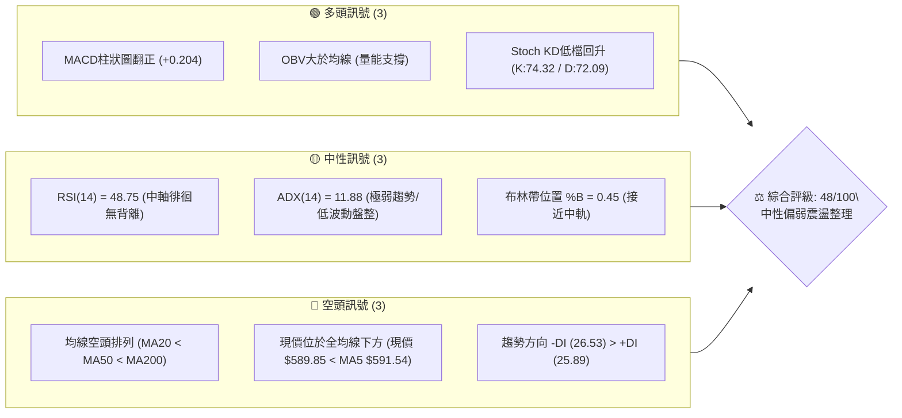
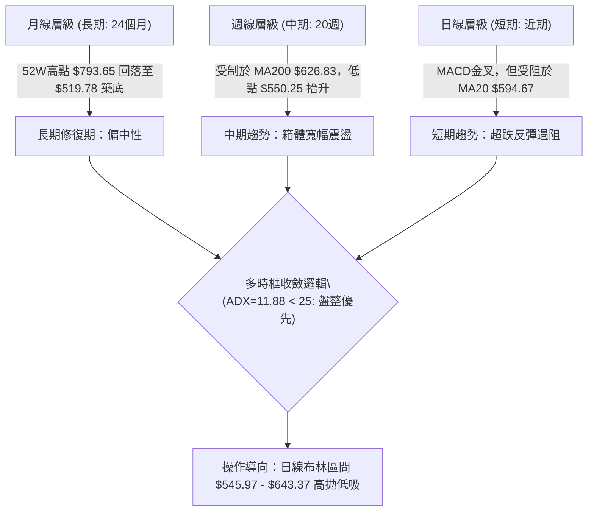
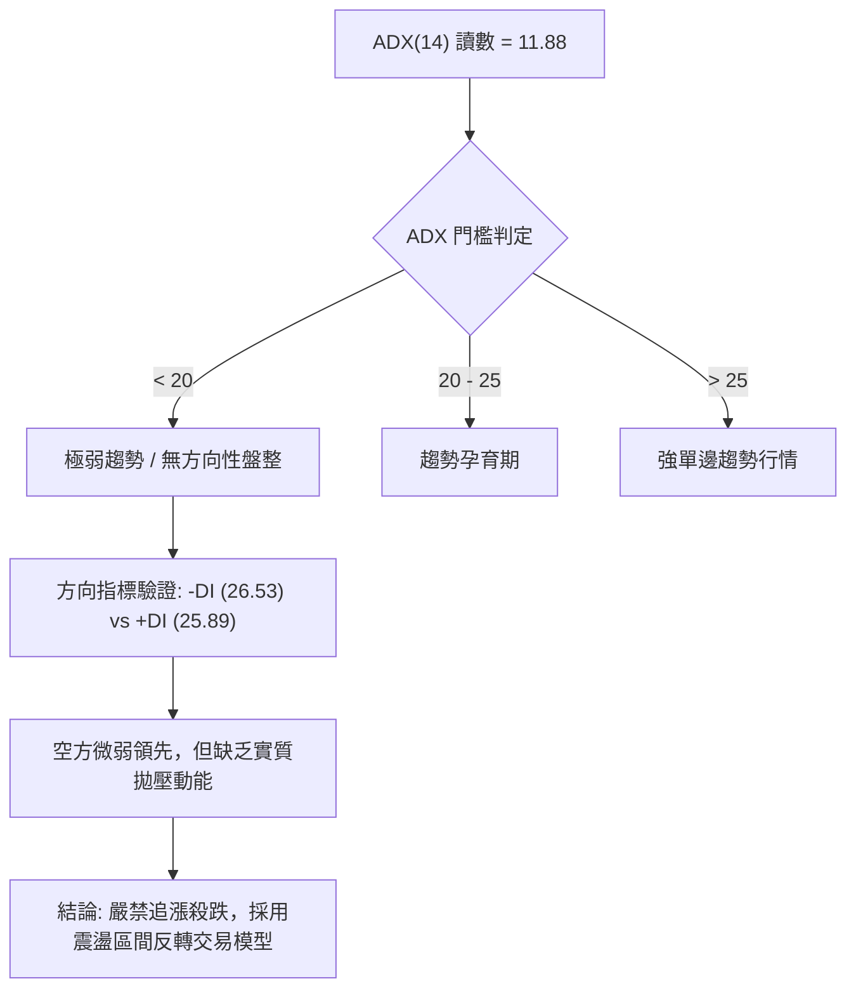
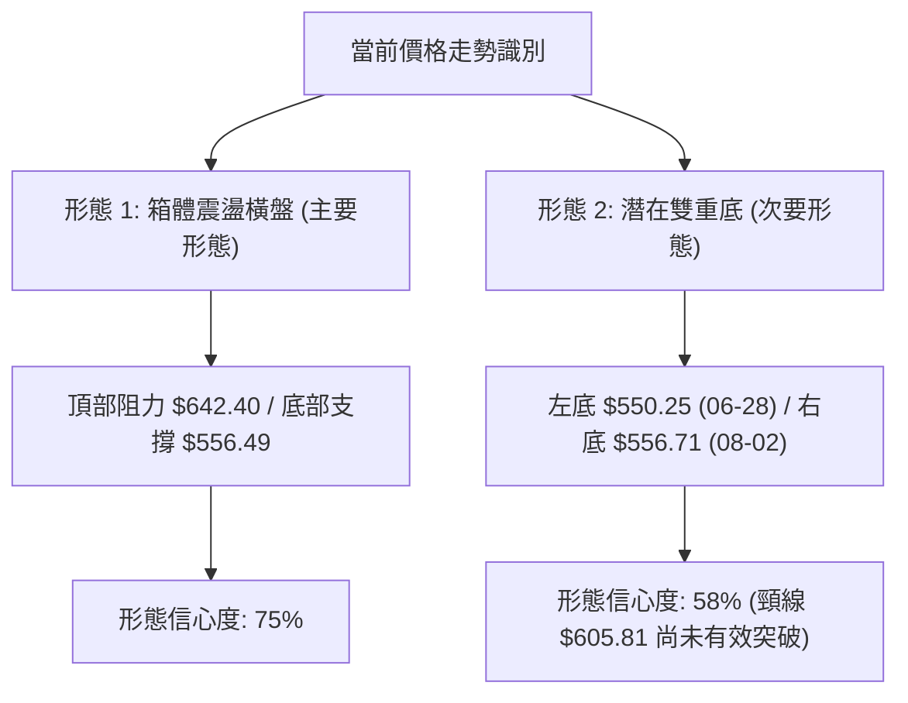
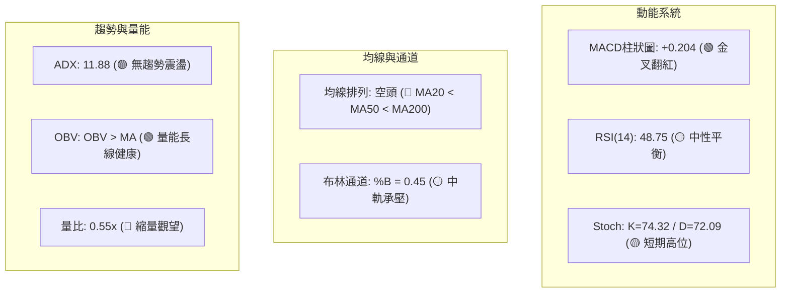
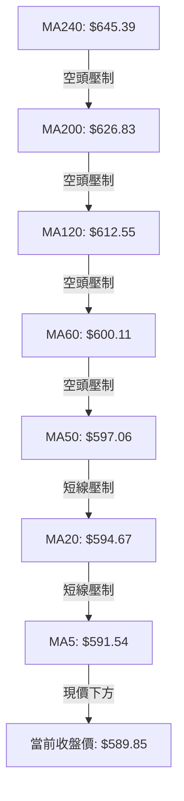
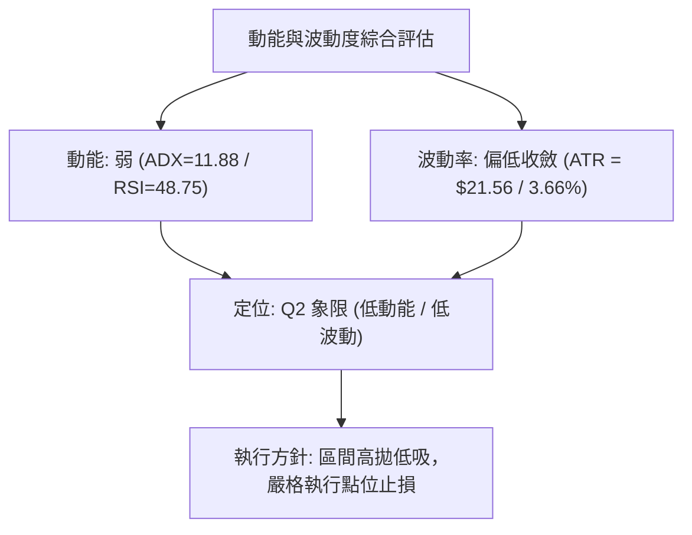
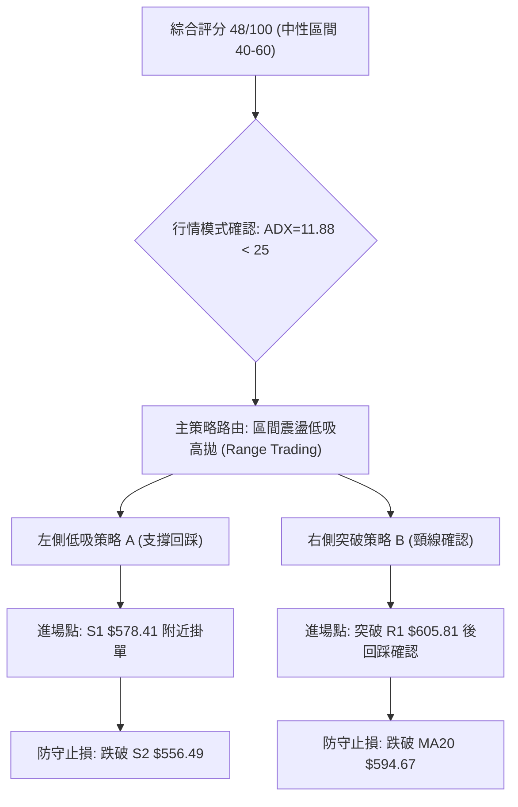
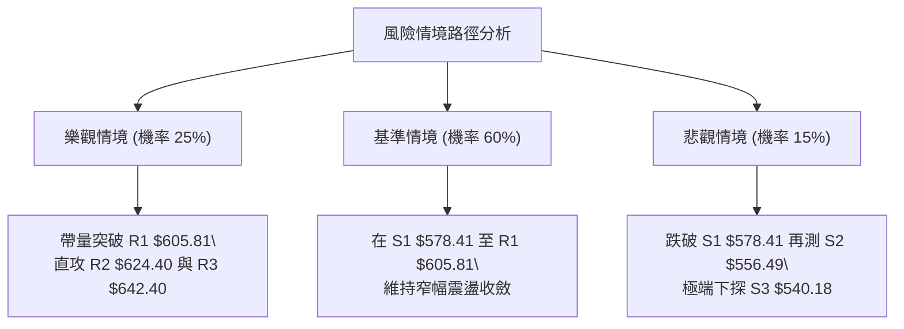

# META 技術分析報告

> **報告日期**：2026-08-17 ｜ **語言**：繁體中文 ｜ **數據來源**：Yahoo Finance ｜ **當前價格**：$589.85

---

## 目錄

| 章節 | 內容 |
|------|------|
| [1. 技術面概覽](#1-技術面概覽) | 訊號儀表板、核心指標、評分卡 |
| [2. 趨勢分析](#2-趨勢分析) | 多時框趨勢、長中短期走勢、ADX解讀 |
| [3. 圖表形態分析](#3-圖表形態分析) | 形態識別、信心度評估、K線組合、形態目標價 |
| [4. 支撐與阻力](#4-支撐與阻力) | 關鍵價位結構、波段聚類、斐波那契回調 |
| [5. 技術指標深度解讀](#5-技術指標深度解讀) | 均線系統、RSI、MACD、布林通道、成交量/OBV |
| [6. 動能與波動率](#6-動能與波動率) | 動能四象限、ATR波動率、Beta係數解讀 |
| [7. 多時框架總結](#7-多時框架總結) | 時框架矩陣、多時框收斂優先級結論 |
| [8. 交易策略建議](#8-交易策略建議) | 策略路由、情境階梯、主策略詳情、風控點 |
| [9. 風險提示與監控](#9-風險提示與監控) | 監控指標Checklist、風險場景、部位管理 |
| [📋 報告總結](#-報告總結) | 儀表板總結、多維結論、最優策略組合 |

---

## 1. 技術面概覽

### 🎯 技術訊號儀表板



### 📊 核心指標速覽表

| 指標類別 | 指標名稱 | 當前數值 | 訊號 | 解讀 |
|:---|:---|:---|:---:|:---|
| **價格** | 當前收盤價 | $589.85 | 🟡 | 位於52週區間25.6%分位，處於波段築底修復期 |
| **均線** | MA20 | $594.67 | 🔴 | 價格在MA20下方 (-0.81%)，短線承壓 |
| **均線** | MA50 | $597.06 | 🔴 | 價格在MA50下方 (-1.21%)，中期趨勢受阻 |
| **均線** | MA200 | $626.83 | 🔴 | 價格在MA200下方 (-5.90%)，長期趨勢受制 |
| **動能** | RSI(14) | 48.75 | 🟡 | 中性區間（30–70），無頂底背離現象 |
| **動能** | MACD (12,26,9) | -5.372 / -5.575 | 🟢 | MACD線上穿Signal線，Hist柱狀圖為 +0.204 呈金叉初升 |
| **動能** | 隨機指標 Stoch | K: 74.32 / D: 72.09 | 🟡 | 自低檔回升至中高位，短線多空拉鋸 |
| **趨勢強度**| ADX (14) | 11.88 | 🟡 | ADX < 25 極弱趨勢，市場處於典型區間震盪行情 |
| **方向指標**| +DI / -DI | 25.89 / 26.53 | 🔴 | -DI 微幅大於 +DI，空方力量微佔優勢 |
| **通道** | 布林通道 (%B) | 0.45 (帶寬 $545.97–$643.37) | 🟡 | 位於中軌（$594.67）下方，通道收窄中 |
| **量能** | 最新量 / 20日均量 | 8.73M / 15.78M (0.55x) | 🔴 | 成交量萎縮，市場觀望氣氛濃厚 |
| **量能** | OBV 趨勢 | OBV > MA | 🟢 | 能量潮保持在均線之上，長線資金未見恐慌出逃 |
| **波動** | ATR(14) | $21.56 (3.66%) | 🟡 | 每日平均波幅適中，有利於設定清晰風控邊界 |

### 🏆 技術評分卡

```
╔══════════════════════════════════════════════════════════════════╗
║                技術評分卡 — META (2026-08-17)                   ║
╠══════════════════════════════════════════════════════════════════╣
║ 趨勢強度 (Trend)       ████░░░░░░░░░░░░░░░░  25/100  🔴 極弱趨勢 ║
║ 動能指標 (Momentum)    ██████████░░░░░░░░░░  52/100  🟡 中性反彈 ║
║ 支撐穩定度 (Support)   ████████████░░░░░░░░  60/100  🟢 底層支撐 ║
║ 成交量配合 (Volume)    ████████░░░░░░░░░░░░  40/100  🔴 量能萎縮 ║
║ 形態完整度 (Patterns)  ██████████░░░░░░░░░░  50/100  🟡 箱體成形 ║
║ 均線排列 (Moving Avg)  ██████░░░░░░░░░░░░░░  30/100  🔴 空頭排列 ║
╠══════════════════════════════════════════════════════════════════╣
║ 綜合評分 (Overall)     █████████░░░░░░░░░░░  48/100  ⚖️ 區間震盪 ║
╚══════════════════════════════════════════════════════════════════╝
```

---

## 2. 趨勢分析

### 🌐 多時框趨勢分析



### 📈 長期趨勢 — 12個月走勢圖（Unicode）

```
META 月線走勢圖（過去12個月：2025-09 至 2026-08）
價格軸 ($)
$793.65 ┼  
$750.00 ┤   ●(732.47)
$700.00 ┤                     ●(715.22)
$650.00 ┤         ●(646.67) ──●(658.91) ──●(647.03) ────●(631.92)
$600.00 ┤                                      ●(611.34)       ●← 現價 ($589.85)
$550.00 ┤                                           ●(571.60)   ●(563.29) ──●(556.71)
$500.00 ┼─────────────────────────────────────────────────────────────────────────────
         09/25  10/25  11/25  12/25  01/26  02/26  03/26  04/26  05/26  06/26  07/26  08/26
```

#### 走勢特徵分析表格

| 階段區間 | 起止月份 | 價格區間 ($) | 區間漲跌幅 | 走勢特徵與結構解讀 |
|:---|:---:|:---:|:---:|:---|
| **歷史高位回調** | 2025-08 ~ 2025-11 | $736.29 → $646.27 | -12.23% | 自52週歷史頂部（$793.65）破位下行，跌破短期上升趨勢線 |
| **次高點反撲** | 2025-12 ~ 2026-01 | $658.91 → $715.22 | +8.55% | 形成多頭反撲次高點（$715.22），但量能未創歷史新高 |
| **主跌浪釋放** | 2026-02 ~ 2026-03 | $647.03 → $571.60 | -11.66% | 連續長陰破位，市場快速尋求52週低點支撐 |
| **區間震盪築底** | 2026-04 ~ 2026-08 | $556.71 → $589.85 | +5.95% | 價格在 $540–$640 寬幅箱體內反覆震盪，空頭動能衰竭 |

### 📊 中期趨勢（週線分析）

```
META 週線阻力與支撐結構示意圖
═════════════════════════════════════════════════════════════════
阻力區間 3: $642.40 ─── [20週高點壓力 / 布林上軌 $643.37]
阻力區間 2: $624.40 ─── [斐波那契 61.8% / MA200 $626.83 關鍵阻力]
阻力區間 1: $605.81 ─── [MA60 $600.11 / 短線反彈密集成交頸線]
─────── 當前價格: $589.85 ───────────────────────────────────────
支撐區間 1: $578.41 ─── [斐波那契 78.6% $578.39 / 近期波動低點]
支撐區間 2: $556.49 ─── [2026-07/08 雙底測試低點]
支撐區間 3: $540.18 ─── [日線布林下軌 $545.97 / 52W極值支撐帶]
═════════════════════════════════════════════════════════════════
```

### ⚡ 趨勢強度評估（ADX 解讀）



| 指標名稱 | 數值 | 狀態等級 | 交易指引 |
|:---|:---:|:---:|:---|
| **ADX(14)** | 11.88 | 弱趨勢/區間震盪 | 單邊順勢突破系統失效，回歸通道與擺盪指標 |
| **+DI (14)** | 25.89 | 買方力量平衡 | 多頭反彈力量尚未形成合力 |
| **-DI (14)** | 26.53 | 賣方力量微佔優 | 空方無法有效摜破 $556.49 支撐區間 |

---

## 3. 圖表形態分析

### 🔍 形態識別系統



#### 形態評估與信心度表格（依規則 15）

| 形態名稱 | 信心度 | 判斷依據（引用數據） | 完成度 | 目標價（附計算式） |
|:---|:---:|:---|:---:|:---|
| **箱體震盪 (Rectangle Range)** | **75%** | 上軌阻力 R3 $642.40 與下軌支撐 S2 $556.49 形成清晰平行通道，且 ADX=11.88 支持盤整 | 85% | **區間內目標**：震盪頂部 **$642.40**；若向上有效突破，目標 = $642.40 + ($642.40 - $556.49) = **$728.31**（接近斐波那契 23.6% $729.02） |
| **潛在雙重底 (W-Bottom)** | **58%** | 兩次下探：2026-06-28 收盤 $550.25 與 2026-08-02 收盤 $556.71，獲得 S2 $556.49 強力支撐 | 60% | **頸線**：R1 $605.81。<br/>**突破目標** = 頸線 $605.81 + ($605.81 - $556.49) = **$655.13**（接近斐波那契 50% $656.71） |
| **均線死叉壓制形態** | **85%** | MA20 ($594.67) < MA50 ($597.06) < MA200 ($626.83)，價格承壓於全均線下方 | 90% | 下方第一回踩支撐為 S1 **$578.41**，極限支撐為 S3 **$540.18** |

### 🕯️ 重要K線形態分析（近5週週K線）

| 週別日期 | 收盤價 ($) | 週漲跌幅 | 週成交量 | K線形態特徵 | 結構解讀與訊號 |
|:---|:---:|:---:|:---:|:---|:---|
| **2026-07-19** | $646.01 | -3.47% | 93.68M | 高位長上影陰線 | 測試阻力 R3 $642.40 後遭遇獲利了結 🔴 |
| **2026-07-26** | $595.19 | -7.87% | 57.38M | 中實體回調陰線 | 跌破 MA20，短線反彈動能中斷 🔴 |
| **2026-08-02** | $556.71 | -6.46% | 112.11M | 爆量下影探底線 | 觸及 S2 $556.49 爆出近期巨量，逢低買盤進場 🟢 |
| **2026-08-09** | $592.10 | +6.36% | 81.86M | 強力反彈陽包陰 | 確認 $556.49 支撐有效，形成底部反轉組合 🟢 |
| **2026-08-16** | $589.85 | -0.38% | 64.20M | 縮量十字星形線 | 遭遇 MA20 ($594.67) 壓制，多空進入平衡觀望 🟡 |

### 📉 ASCII 走勢形態示意圖

```
META 潛在雙重底與箱體形態示意圖
$642.40 ┼──────────────────────────────● (2026-07 箱體頂部 R3)
        │                             / \
$605.81 ┼─────────● (頸線 R1)────────/───\────────● (當前受阻反彈)
        │        / \                /     \      /
$589.85 ┼───────/───\──────────────/───────\────● ← 現價 ($589.85)
        │      /     \            /         \  /
$556.49 ┼─────●       \          /           ● (2026-08 第二底 S2)
$550.25 ┼──────────────● (2026-06 第一底)
        └─────────────────────────────────────────────────────────────
```

### 🎯 形態目標價計算

1. **雙底突破目標價計算**：
   - 形態頸線（R1）：`$605.81`
   - 形態底部低點（S2）：`$556.49`
   - 形態高度：`$605.81 - $556.49 = $49.32`
   - **等距量度目標價**：`$605.81 + $49.32 = $655.13`（高度重合於斐波那契 50.0% 回調位 `$656.71`）。

2. **箱體震盪上軌突破目標價計算**：
   - 箱體頂部（R3）：`$642.40`
   - 箱體底部（S2）：`$556.49`
   - 箱體高度：`$642.40 - $556.49 = $85.91`
   - **突破延展目標價**：`$642.40 + $85.91 = $728.31`（高度重合於斐波那契 23.6% 回調位 `$729.02`）。

---

## 4. 支撐與阻力

### 🗺️ 關鍵價位分布圖（Unicode）

```
META 價位結構分布圖
═══════════════════════════════════════════════════════════════════
$656.71 ║██████████████████████████████║ 斐波那契 50.0% 強多空分水嶺
$642.40 ║████████████████████████      ║ 強阻力 R3 / 布林上軌 ($643.37)
$624.40 ║██████████████████            ║ 阻力 R2 / 斐波那契 61.8% / MA200
$605.81 ║████████████                  ║ 關鍵阻力 R1 / 雙底頸線
$589.85 ╠══════════════════════════════╣ ◄ 當前收盤價 ($589.85)
$578.41 ║▓▓▓▓▓▓▓▓▓▓▓▓                  ║ 近期支撐 S1 / 斐波那契 78.6% ($578.39)
$556.49 ║████████████████████████      ║ 強支撐 S2 / 雙底右腳低點
$540.18 ║██████████████████████████████║ 極限支撐 S3 / 布林下軌 ($545.97)
═══════════════════════════════════════════════════════════════════
```

### 🚧 阻力位分析表

| 阻力級別 | 精確價位 | 形成原因（波段高點與均線聚類） | 突破難度 | 技術重要性 |
|:---|:---:|:---|:---:|:---|
| **R1** | **$605.81** | 近期反彈密集高點聚類、MA60 ($600.11) 壓制帶 | 🟡 中等 | 短線多空強弱分水嶺，站上確立雙底結構 |
| **R2** | **$624.40** | 斐波那契 61.8% 回調位、MA200 ($626.83) 牛熊分界線 | 🔴 高 | 中期趨勢反轉關鍵位，需日線級別成交量放大至 15M 以上 |
| **R3** | **$642.40** | 近一年波段高點聚類、日線布林通道上軌 ($643.37) | 🔴 極高 | 箱體震盪頂部邊界，具備強烈獲利回吐壓力 |

### 🛡️ 支撐位分析表

| 支撐級別 | 精確價位 | 形成原因（波段低點與回調聚類） | 守住機率 | 技術重要性 |
|:---|:---:|:---|:---:|:---|
| **S1** | **$578.41** | 斐波那契 78.6% ($578.39) 聚類、近期拉升平台下沿 | 🟢 70% | 短線回調緩衝區，跌破將考驗底部箱體 |
| **S2** | **$556.49** | 2026-08-02 爆量低點、近一年波段次低點聚類 | 🟢 85% | 中期雙底支撐核心，具備極強機構買盤托底 |
| **S3** | **$540.18** | 近一年波段極值低點聚類、布林下軌 ($545.97) 防守區 | 🟢 95% | 年度級別防禦底線，跌破則打開下行破位空間 |

### 📐 斐波那契回調位分析

依據 52 週極值區間（低點 **$519.78** → 高點 **$793.65**，垂直波幅 $273.87）計算：

```
斐波那契回調階梯分布
0.0%  (52W High)  $793.65 ──────────────────────────────────────────
23.6%             $729.02 ──────────────────────────────────────────
38.2%             $689.03 ──────────────────────────────────────────
50.0%             $656.71 ──────────────────────────────────────────
61.8%             $624.40 ─── [阻力 R2 / 長期牛熊分水嶺]
78.6%             $578.39 ─── [支撐 S1 / 當前價格運行於此線上方]
       現價 ──►   $589.85
100.0% (52W Low)  $519.78 ──────────────────────────────────────────
```

- **位置解讀**：現價 `$589.85` 正處於 **78.6% 回調位（$578.39）** 與 **61.8% 回調位（$624.40）** 之間。
- **技術意義**：價格在深幅回調至 78.6% 關鍵黃金分割位後展現韌性，未進一步跌向 100%（$519.78），顯示 $578.39–$556.49 具備極強的結構性買盤支撐；若向上突破 61.8%（$624.40），將宣告自 $793.65 以來的深度回調正式結束。

---

## 5. 技術指標深度解讀

### 🎛️ 指標訊號總覽



### 📈 移動平均線排列分析



| 均線名稱 | 當前價格 | 與現價偏離度 | 走勢微幅變動 | 均線角色與技術解讀 |
|:---|:---:|:---:|:---:|:---|
| **MA5** | $591.54 | -0.29% | ▼ -1.69 | 超短線第一阻力，收復可緩解日內下行壓力 |
| **MA10** | $590.67 | -0.14% | ▼ -0.82 | 短線黏合線，多空即將在此選擇短線突破方向 |
| **MA20** | $594.67 | -0.81% | ▼ -4.82 | 月均線阻力，日線布林通道中軌所在處 |
| **MA50** | $597.06 | -1.21% | ▼ 下行中 | 季線阻力，為多頭反彈波段的重要心理關卡 |
| **MA60** | $600.11 | -1.71% | ▼ -10.26 | 密集整數阻力帶，與 R1 $605.81 形成共振 |
| **MA120** | $612.55 | -3.71% | ▼ -22.70 | 半年線下行壓制，中期空方主要防線 |
| **MA200** | $626.83 | -5.90% | ▼ 下行中 | 年線牛熊分水嶺，決定 META 是否重回上升趨勢 |
| **MA240** | $645.39 | -8.61% | ▼ -55.54 | 長期強阻力，與布林上軌及 R3 $642.40 重疊 |

### 📉 RSI(14) 分析

- **當前讀數**：`48.75`
- **數值進度條**：`█████████░░░░░░░░░░░ 48.75%`（🟡 中性區間 30–70）
- **背離分析結論**：
  - **頂背離**：無。近期價格未創新高，RSI 隨價格溫和修復。
  - **底背離**：無明顯背離。2026-08-02 週線 RSI 降至 22.9（超賣）後，隨價格反彈快速回升至 48.8，屬於標準超跌修復，並未形成指標創高而價格不創高（或指標創低而價格不創低）的背離形態。

### 📊 MACD(12/26/9) 訊號解讀

```
MACD 指標數值快照
═══════════════════════════════════════════════════════════
MACD 快線 (12/26)    : -5.372
MACD 慢線 (Signal 9) : -5.575
MACD 柱狀圖 (Hist)   : +0.204 🟢 看多（金叉初顯）
═══════════════════════════════════════════════════════════
```

- **訊號解析**：MACD 快線（-5.372）上穿訊號慢線（-5.575），柱狀圖自負值翻正至 `+0.204`。
- **指標共振**：雖然 MACD 仍處於零軸下方（代表中長期空頭架構），但零軸下金叉提供了短期反彈的技術動能，支持價格向 MA20（$594.67）及 R1（$605.81）發起進攻。

### 📦 布林通道分析

```
META 布林通道結構示意圖（日線週期）
$643.37 ┼────────────────────────────── BB 上軌 (阻力 R3 $642.40 附近)
        │
$619.00 ┤
        │
$594.67 ┼────────────────────────────── BB 中軌 (MA20，當前直接阻力)
        │                 ● ($589.85 現價位置: %B = 0.45)
$570.00 ┤
        │
$545.97 ┼────────────────────────────── BB 下軌 (極限支撐 S3 $540.18 附近)
        └─────────────────────────────────────────────────────────────
```

- **帶寬與位置**：上軌 `$643.37`、中軌 `$594.67`、下軌 `$545.97`。
- **%B 指標**：`0.45`（處於 0.0–1.0 之間的中軌下方偏弱區）。
- **特徵解讀**：通道開口正在收窄，顯示歷史波動率正在壓縮；價格緊貼中軌下方運行，一旦帶量站上中軌 $594.67，將啟動向上軌 $643.37 運行的震盪回歸波段。

### 💹 成交量分析（量價配合度）

1. **成交量對比**：最新成交量為 **8,731,600 股**，相較於 20 日均量（15,777,275 股）之量比僅為 **0.55x**，呈現典型的「反彈縮量」格局。
2. **OBV（能量潮）分析**：當前 `OBV > OBV_MA`，顯示在 2026-08-02 爆出 1.12 億週成交量後，主力資金在低位（$556.49）有承接吸籌動作，隨後的縮量回調並非機構出逃，而是散戶籌碼沉澱。

---

## 6. 動能與波動率

### ⚡ 動能評估四象限

| 象限 | 動能維度 (Momentum) | 波動率維度 (Volatility) | 當前狀態 | 策略指引與技術特徵 |
|:---:|:---:|:---:|:---:|:---|
| **Q1** | 強 (ADX>25, RSI>50) | 低 (ATR%<3.0%) | — | 強單邊穩健主升浪，全力加碼順勢跟隨 |
| **Q2** | **弱 (ADX=11.88, RSI=48.75)** | **低 (ATR% = 3.66%)** | **✓ 當前狀態** | **箱體低波動築底期，適合區間網格或逢低佈局** |
| **Q3** | 強 (多空劇烈分歧) | 高 (ATR%>5.0%) | — | 突破爆發行情，高風險高回報 |
| **Q4** | 弱 (恐慌性拋盤) | 高 (恐慌急跌) | — | 空頭主跌浪，嚴禁抄底觀望為宜 |



### 📊 ATR 波動率分析

- **ATR(14) 數值**：`$21.56`（佔現價比率 **3.66%**）。
- **風控指引**：
  - **日內安全噪音區間**：`1.0 × ATR = $21.56`。
  - **短線防守止損距離**：建議設定在 `1.5 × ATR = $32.34` 以外，以防止日內正常隨機波動觸發洗盤。
  - **波段防守點位**：進場點下方 `2.0 × ATR = $43.12`，嚴格錨定關鍵支撐位（S1 $578.41 / S2 $556.49）。

### 📐 Beta 與市場相關性

- **Beta 係數**：`1.243`。
- **解讀**：META 具備高於標普 500 指數 24.3% 的波動彈性，屬於典型的高 Beta 科技權重股。在市場整體修復反彈時，META 具有提供超額 Alpha 的潛力；但在大盤震盪時，其回調幅度亦可能放大，需透過部位管理控制總體風險暴露。

---

## 7. 多時框架總結

### 📋 時框架評分表

| 時框架 | 趨勢方向 | 動能狀態 | 均線排列 | 圖表形態 | 綜合評分 | 交易建議 |
|:---|:---:|:---:|:---:|:---:|:---:|:---|
| **長期 (月線)** | 🟡 中性修復 | RSI=48.8 平衡 | MA240 下方承壓 | 寬幅大箱體 ($520–$793) | **50/100** | 長線價值投資者可分批定投 |
| **中期 (週線)** | 🔴 偏空震盪 | MACD翻紅 (+0.204) | 空頭 (受制於MA200) | 潛在雙底測試 ($556.49) | **45/100** | 逢阻力減碼，逢支撐低吸 |
| **短期 (日線)** | 🟡 震盪反彈 | Stoch 進入中高位 | 空頭 (受阻於MA20) | 布林中下軌區間反彈 | **50/100** | 嚴格執行高拋低吸網格策略 |

### 🔲 綜合訊號矩陣

```
時框訊號一致性交叉檢驗
═══════════════════════════════════════════════════════════════
維度 / 週期       日線 (短期)        週線 (中期)        月線 (長期)
───────────────────────────────────────────────────────────────
趨勢方向          🟡 震盪反彈        🔴 偏空壓制        🟡 高位回調
動能強度          🟢 MACD金叉初顯    🟡 RSI中性築底     🟡 動能衰減
均線架構          🔴 短期壓制明顯    🔴 空頭排列        🔴 偏離年線
量價關係          🔴 縮量反彈        🟢 底部爆量承接    🟡 量能萎縮
───────────────────────────────────────────────────────────────
最終收斂判定      日線反彈動能遭遇中期均線壓制，形成區間震盪收斂
═══════════════════════════════════════════════════════════════
```

### ⚖️ 多時框收斂結論（依規則 14 優先級）

1. **趨勢/盤整優先級判定**：
   當前 ADX(14) 讀數為 **11.88**，遠低於趨勢行情閾值 25，市場確認處於 **典型的無趨勢盤整行情**。
2. **主導時框收斂**：
   依據多時框收斂規則，在盤整行情中，**以日線布林通道（$545.97 – $643.37）為主要交易區間**。中長期均線（MA200 $626.83）構成區間上行的硬阻力，而 52 週低點聚類（S2 $556.49）提供下軌強支撐。
3. **唯一方向性結論**：
   **【中性觀望，區間震盪操作】**（技術評分：**48/100**）。不具備發動單邊大趨勢的條件，策略應嚴格遵循布林通道與關鍵支撐阻力進行波段低吸高拋。

---

## 8. 交易策略建議

### 🗺️ 策略決策流程圖



### 🧭 策略路由

> **當前主策略方向 = 區間震盪操作（Range-Bound Trading），以逢低做多為主、阻力高拋為輔（依綜合評分 48/100，處於 40–60 中性區間）。**

### 🎯 價格情境階梯（Price Scenarios）

| 觸發條件 | 第一目標 | 第二延伸目標 | 情境含義與操作指引（引用實際數據） |
|:---|:---:|:---:|:---|
| **向上突破 R1 ($605.81)** | R2 ($624.40) | R3 ($642.40) | **短線轉強**：確認雙底頸線突破，挑戰 MA200 與布林上軌 |
| **維持現價震盪 ($589.85)** | MA20 ($594.67) | S1 ($578.41) | **區間整理**：在 $578.41–$605.81 窄幅收斂，等待量能釋放 |
| **跌破支撐 S1 ($578.41)** | S2 ($556.49) | S3 ($540.18) | **中期考驗**：再次探底測試雙底支撐，為左側極佳建倉點 |

### 📊 情境機率分佈

| 情境類別 | 發生機率 | 主要依據（指標數據支持） |
|:---|:---:|:---|
| **情境 A：區間向上反彈** | **45%** | MACD 零軸下翻紅金叉（+0.204），OBV > MA 量能健康，週線超賣回升 |
| **情境 B：箱體窄幅震盪** | **40%** | ADX=11.88 弱勢，成交量持續萎縮（量比 0.55x），布林通道收窄 |
| **情境 C：破位下行探底** | **15%** | 均線系統呈空頭排列，-DI (26.53) 仍微幅高於 +DI (25.89) |

### 🟢 主策略詳情（區間操作架構）

| 策略要素 | 策略 A（左側逢低蓄勢策略） | 策略 B（右側突破跟進策略） |
|:---|:---:|:---:|
| **策略類型** | 支撐位回踩低吸 | 頸線阻力突破跟隨 |
| **進場條件** | 回踩斐波那契 78.6% S1 出現止跌K線 | 日線帶量（>15M）實體收盤突破 R1 |
| **精確進場價格** | **$578.41**（S1 支撐位） | **$605.81**（R1 突破確認價） |
| **目標價 T1** | **$605.81**（R1 頸線位，+4.74%） | **$624.40**（R2 / 斐波 61.8%，+3.07%） |
| **目標價 T2** | **$624.40**（R2 / MA200，+7.95%） | **$642.40**（R3 / 布林上軌，+6.04%） |
| **精確止損價格** | **$556.49**（S2 強支撐下方，-3.79%） | **$594.67**（MA20 / 布林中軌下方，-1.84%） |
| **風險報酬比 (R/R)**| **2.10 : 1**（以 T2 計算） | **3.28 : 1**（以 T2 計算） |
| **估計成功機率** | **65%** | **55%** |
| **建議配置倉位** | **15%**（基礎倉位） | **10%**（追隨加碼倉位） |

### 🔴 反向風險觸發點（對沖提示）

- **多頭失效/全面轉空觸發價**：若日線收盤價跌破 **S2 $556.49** 且成交量放大，代表雙底形態徹底破裂，必須無條件止損所有多頭部位，並可考慮輕倉順勢放空，下看 **S3 $540.18** 及 52 週低點 **$519.78**。
- **空頭平倉/全面轉多觸發價**：若日線收盤價強勢突破 **R2 $624.40** 並站上 MA200（$626.83），代表自 $793.65 以來的下行趨勢徹底終結，所有空頭避險部位應全數平倉。

### ⭐ 整體訊號強度評星

```
╔══════════════════════════════════════════════════════════════════╗
║ 做多訊號強度：  ★★★☆☆  (3.0/5星 — 具備反彈動能但受制於均線)   ║
║ 做空訊號強度：  ★★☆☆☆  (2.0/5星 — 缺乏主跌推動力，支撐強勁)   ║
║ 整體訊號可信度：★★★☆☆  (3.5/5星 — 盤整期指標適合區間交易)     ║
╚══════════════════════════════════════════════════════════════════╝
```

---

## 9. 風險提示與監控

### ✅ 關鍵監控指標 Checklist

```
╔══════════════════════════════════════════════════════════════════╗
║               META 技術風控關鍵監控清單 (Checklist)              ║
╠══════════════════════════════════════════════════════════════════╣
║ [ ] 價格是否跌破 S1 $578.41？ (跌破需收緊止損至 S2 $556.49)      ║
║ [ ] 日成交量是否放大至 15.78M (20日均量) 以上？ (量能突破確認)   ║
║ [ ] MACD 柱狀圖是否持續擴大翻紅 (> +0.500)？ (多頭動能強化)      ║
║ [ ] RSI(14) 是否跌破 40.0 支撐水準？ (短線轉弱預警)              ║
║ [ ] 價格是否觸及並承壓於 MA200 $626.83？ (波段獲利減碼點)        ║
║ [ ] ADX(14) 是否向上突破 20 門檻？ (代表單邊趨勢即將啟動)       ║
╚══════════════════════════════════════════════════════════════════╝
```

### ⚠️ 風險場景分析



### 🛡️ 風險管理重要提醒

1. **波動率與倉位管理**：鑑於當前 ATR 為 `$21.56` 且 Beta 為 `1.243`，單筆交易的最大資金承擔風險（1R）不應超過總投資組合淨值的 **1.0%–1.5%**。在 ADX < 25 的盤整期間，總持倉比例建議維持在 **25%–35%** 的中低水平。
2. **假突破防範**：在成交量低於 20 日均量（15.78M）時，盤中若突破 R1（$605.81）或跌破 S1（$578.41），需以**日線收盤價**為確認標準，切忌在盤中急於追單以避免遭遇主力假突破洗盤。

---

## 📋 報告總結

```
╔══════════════════════════════════════════════════════════════════════╗
║                  META 技術分析報告總結 (Executive Summary)           ║
╠══════════════════════════════════════════════════════════════════════╣
║ 報告日期：2026-08-17                                                 ║
║ 當前收盤價：$589.85                                                  ║
║ 技術評級：⚖️ 中性觀望 / 區間震盪操作 (綜合評分: 48/100)              ║
╠══════════════════════════════════════════════════════════════════════╣
║ 關鍵維度結論：                                                       ║
║ ├─ 長期趨勢：🟡 中性修復 (運行於 52W 區間 25.6% 分位)                ║
║ ├─ 中期趨勢：🔴 偏空震盪 (受制於 MA200 $626.83，雙底築底中)          ║
║ ├─ 短期趨勢：🟡 弱勢反彈 (MACD 金叉翻紅 +0.204，承壓於 MA20 $594.67) ║
║ ├─ 關鍵支撐：S1 $578.41 ｜ 強支撐 S2 $556.49 ｜ 極限支撐 S3 $540.18 ║
║ ├─ 關鍵阻力：R1 $605.81 ｜ 強阻力 R2 $624.40 ｜ 箱頂阻力 R3 $642.40 ║
║ └─ 分析師目標共識：均價 $754.14 (最高 $1000.00 / 最低 $580.00)       ║
╠══════════════════════════════════════════════════════════════════════╣
║ 最優策略組合：                                                       ║
║ 1. 🥇 最佳機會 (策略 A)：掛單 S1 $578.41 低吸，止損 $556.49，        ║
║                          目標看 R1 $605.81 / R2 $624.40 (R/R 2.1)    ║
║ 2. 🥈 次選機會 (策略 B)：突破 R1 $605.81 右側跟進，止損 $594.67，    ║
║                          目標看 R2 $624.40 / R3 $642.40 (R/R 3.28)   ║
║ 3. 🥉 保守選擇：保持 70% 現金，等待日線突破 MA200 ($626.83) 或跌至  ║
║                 S2 ($556.49) 出現右側量能訊號後再行介入             ║
╚══════════════════════════════════════════════════════════════════════╝
```

---

> ⚠️ **免責聲明**：本報告為技術分析研究成果，所有價位計算與指標解讀均基於客觀歷史市場數據。本報告**僅供學術研究與投資策略討論參考**，**不構成任何要約、招攬或具體投資買賣建議**。金融市場瞬息萬變，交易具備固有本金虧損風險，投資人應獨立評估自身風險承受能力並恪守交易紀律。

---

*報告生成時間：2026-08-17 ｜ 數據來源：Yahoo Finance ｜ 分析架構：多時框架量化技術分析系統*