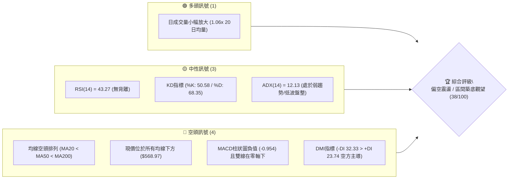
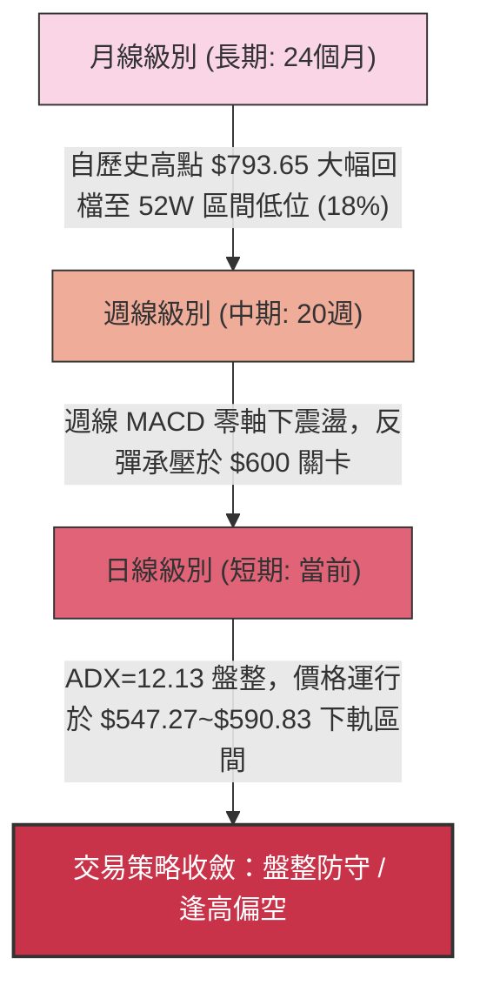
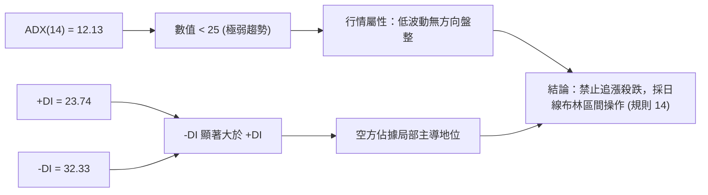
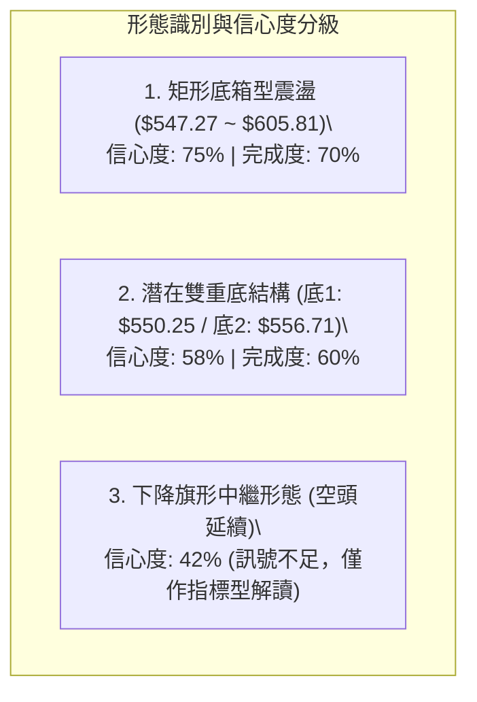
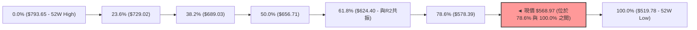
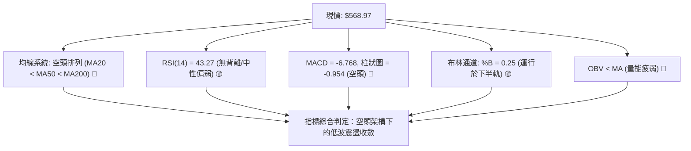
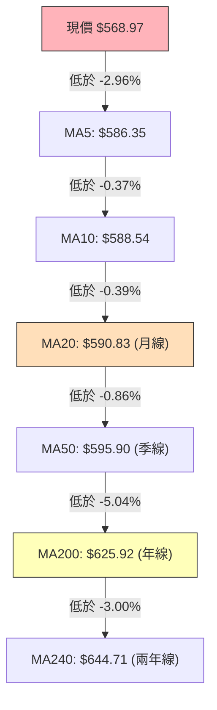
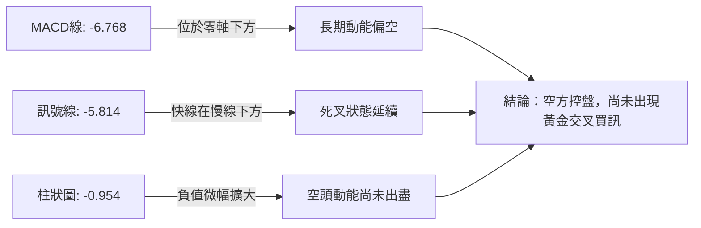
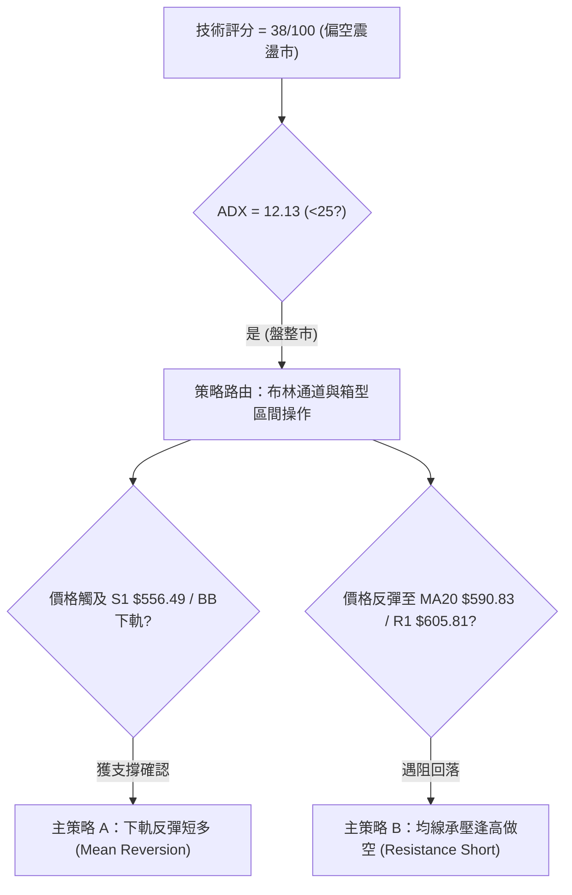
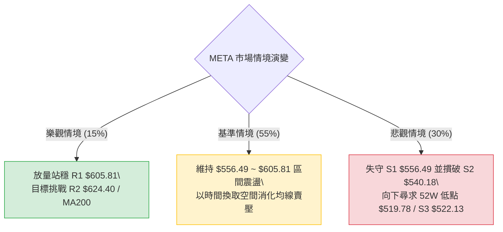

# META 技術分析報告

> **報告日期**：2026-08-18 ｜ **語言**：繁體中文 ｜ **數據來源**：Yahoo Finance ｜ **當前價格**：$568.97

---

## 目錄

| 章節 | 內容 |
|------|------|
| [1. 技術面概覽](#1-技術面概覽) | 訊號儀表板、核心指標、評分卡 |
| [2. 趨勢分析](#2-趨勢分析) | 多時框趨勢、長中短期走勢、ADX解讀 |
| [3. 圖表形態分析](#3-圖表形態分析) | 形態識別、K線組合、目標價推算 |
| [4. 支撐與阻力](#4-支撐與阻力) | 關鍵價位、斐波那契回調結構 |
| [5. 技術指標深度解讀](#5-技術指標深度解讀) | MA均線/RSI/MACD/布林通道/OBV量價 |
| [6. 動能與波動率](#6-動能與波動率) | 動能四象限、ATR止損距離、Beta相關性 |
| [7. 多時框架總結](#7-多時框架總結) | 時框架矩陣、多時框收斂定論 |
| [8. 交易策略建議](#8-交易策略建議) | 策略路由、情境階梯、進出場精確點位 |
| [9. 風險提示與監控](#9-風險提示與監控) | 監控Checklist、極端情境與風控規則 |

---

## 1. 技術面概覽

### 🎯 技術訊號儀表板



### 📊 核心指標速覽表

| 指標類別 | 指標名稱 | 當前數值 | 訊號 | 專業解讀 |
|:---|:---|:---:|:---:|:---|
| **價格** | 當前價格 | $568.97 | 🔴 | 位於52週區間18.0%低位，承壓於短期與中長期均線下方 |
| **均線** | MA20 (月線) | $590.83 | 🔴 | 現價低於MA20達 -3.70%，短期動能由空方掌控 |
| **均線** | MA50 (季線) | $595.90 | 🔴 | 現價低於MA50達 -4.52%，中期承壓 |
| **均線** | MA200 (年線) | $625.92 | 🔴 | 現價低於MA200達 -9.10%，長期牛熊分水嶺已失守 |
| **動能** | RSI(14) | 43.27 | 🟡 | 位於40-50中性偏弱區間，未觸及超賣（<30），無明顯背離 |
| **動能** | MACD (12/26/9) | -6.768 / -5.814 | 🔴 | MACD線位於訊號線下方，柱狀圖 -0.954，維持空頭發散 |
| **趨勢** | ADX(14) / DMI | 12.13 / -DI 32.33 | 🟡 | ADX < 25 處於無趨勢/弱盤整狀態，但 -DI 壓制 +DI (23.74) |
| **通道** | 布林通道 (%B) | 0.25 | 🟡 | 位於中軌 ($590.83) 與下軌 ($547.27) 之間偏下軌位置 |
| **量能** | OBV / 量比 | 疲弱 / 1.06x | 🔴 | OBV低於其均線，量能未能有效放大配合價格回升 |
| **波動** | ATR(14) | $22.38 | 🟡 | 每日平均波動幅度約 3.93%，波動率自高位逐步收斂 |

### 🏆 技術評分卡

```
╔══════════════════════════════════════════════════════════════════╗
║                   技術評分卡 — META (2026-08-18)                 ║
╠══════════════════════════════════════════════════════════════════╣
║ 趨勢強度 (Trend)      ██████░░░░░░░░░░░░░░  30/100  🔴 空頭壓制  ║
║ 動能指標 (Momentum)   ████████░░░░░░░░░░░░  40/100  🟡 中性偏弱  ║
║ 支撐穩定度 (Support)  ███████████░░░░░░░░░  55/100  🟡 接近S1    ║
║ 成交量配合 (Volume)   ████████░░░░░░░░░░░░  40/100  🔴 量能疲弱  ║
║ 形態完整度 (Pattern)  █████████░░░░░░░░░░░  45/100  🟡 弱勢盤整  ║
║ 均線排列 (MA System)  ████░░░░░░░░░░░░░░░░  20/100  🔴 完全空頭  ║
╠══════════════════════════════════════════════════════════════════╣
║ 綜合技術評分          ███████░░░░░░░░░░░░░  38/100  🔴 偏空震盪  ║
╚══════════════════════════════════════════════════════════════════╝
```

---

## 2. 趨勢分析

### 🌐 多時框趨勢分析



### 📈 長期趨勢 — 12個月走勢圖（Unicode）

以下為 META 過去 12 個月（2025-08 至 2026-08）之月線收盤價格軌跡與結構演變：

```
META 月線走勢圖（過去12個月）
價格軸 ($)
$750 ┤ ●(2025-08: $736.29)
$730 ┤   ●(2025-09: $732.47)
$710 ┤                               ●(2026-01: $715.22 - 反彈次高)
$690 ┤
$670 ┤                         ●(2025-12: $658.91)
$650 ┤         ●(2025-10: $646.67)   ●(2026-02: $647.03)
$630 ┤           ●(2025-11: $646.27)         ●(2026-05: $631.92)
$610 ┤                                     ●(2026-04: $611.34)
$590 ┤                                                 ●(2026-08: $568.97 現價)
$570 ┤                               ●(2026-03: $571.60)   ●(2026-06: $563.29)
$550 ┤                                                   ●(2026-07: $556.71 - 波段低點)
     └─┬─────┬─────┬─────┬─────┬─────┬─────┬─────┬─────┬─────┬─────┬─────┬───
      08/25 09/25 10/25 11/25 12/25 01/26 02/26 03/26 04/26 05/26 06/26 07/26 08/26
```

**走勢特徵分析表格**：

| 階段區間 | 起止價格 | 漲跌幅 | 結構與特徵解析 |
|:---|:---:|:---:|:---|
| **2025-08 ~ 2025-11** | $736.29 → $646.27 | -12.23% | 歷史高點 $793.65 回落後的首波高位獲利了結潮，跌破 $700 關卡 |
| **2025-12 ~ 2026-01** | $658.91 → $715.22 | +8.55% | 年底作帳反彈，形成中繼次高點 $715.22，確立高點降低（Lower High） |
| **2026-02 ~ 2026-03** | $647.03 → $571.60 | -11.66% | 主跌段展開，直接摜破 MA200（現 $625.92），趨勢轉入空頭排列 |
| **2026-04 ~ 2026-05** | $611.34 → $631.92 | +3.37% | 弱勢反彈測試 MA200 壓力無功而返 |
| **2026-06 ~ 2026-08** | $563.29 → $568.97 | +1.01% | 於 52W 低點 $519.78 上方的 $550~$570 區間進行低位弱勢震盪築底 |

### 📊 中期趨勢（週線分析）

從近 20 週數據觀察，META 呈現「反彈無力、破底後弱勢收斂」之特徵：
- **近期高點**：2026-07-12 週收盤一度衝高至 $669.21，但隨即伴隨量能退潮快速下挫。
- **近期低點**：2026-08-02 週收盤跌至 $556.71，RSI 驟降至 22.9 極度超賣區，隨後引發短線技術性抽頭至 $592.10（2026-08-09）。
- **當前位置**：最新週收盤回落至 $568.97，週 MACD 柱狀圖在零軸邊緣反覆（最新 -0.954），顯示中期上行動能匱乏，上方在 $590.83（MA20）及 $605.81（R1）遭遇顯著籌碼套牢賣壓。

### ⚡ 趨勢強度評估（ADX 解讀）



**ADX 趨勢強度對照表**：

| 指標 | 數值 | 門檻區間 | 趨勢判定 | 交易指引 |
|:---|:---:|:---:|:---:|:---|
| **ADX(14)** | **12.13** | `< 20` 極弱 / 無趨勢 | 🟡 典型無趨勢震盪市 | 順勢指標失效，不可採用單邊突破追價策略 |
| **+DI (14)** | **23.74** | - | 弱勢買盤 | 多頭推升力道薄弱 |
| **-DI (14)** | **32.33** | `> 30` 強勢賣壓 | 🔴 空方控盤 | 雖無強單邊趨勢，但向下摩擦阻力最小 |

---

## 3. 圖表形態分析

### 🔍 形態識別系統

根據規則 15，所有圖表形態嚴格依據歷史價位聚類與完成度進行信心度評估：



**形態信心度與目標價評估表**：

| 識別形態 | 信心度 | 判斷依據（引用精確數據） | 完成度 | 目標價（附嚴格計算式） |
|:---|:---:|:---|:---:|:---|
| **矩形箱型震盪** | **75%** | 箱底獲 S1 ($556.49) 與布林下軌 ($547.27) 支撐；箱頂受制於 R1 ($605.81) 與 MA20 ($590.83) | 70% | 箱頂突破目標：$605.81 + ($605.81 - $547.27) = **$664.35**<br>箱底跌破目標：$547.27 - ($605.81 - $547.27) = **$488.73** |
| **潛在雙重底** | **58%** | 兩次波段低點分別為 2026-06-28 週之 $550.25 與 2026-08-02 週之 $556.71（接近 S1 $556.49） | 60% | 頸線為 2026-07-12 之 $669.21。<br>形態高度 = $669.21 - $550.25 = $118.96。<br>若有效突破頸線，理論目標 = $669.21 + $118.96 = **$788.17** |
| **下降旗形** | **42%** | *信心度 < 50%，依規則 15 判定為訊號不足，僅作指標型解讀（均線空頭排列之反彈承壓）* | - | 不予推算幾何目標價 |

### 🕯️ 重要 K 線形態分析

| 週期/月份 | 收盤價 | K線組合形態 | 技術解讀 | 訊號強度 |
|:---|:---:|:---|:---|:---:|
| **2026-07-12 (週)** | $669.21 | 帶量長陽衝高受阻 | 成交量衝至 1.17 億股，但隨後一週（$646.01）長黑反噬，形成高檔吞噬烏雲蓋頂 | 🔴 空頭反轉 |
| **2026-08-02 (週)** | $556.71 | 長下影錘頭破底線 | 週成交量 1.12 億股，創近兩月低點後引發強烈空頭回補，於 S1 ($556.49) 獲承接 | 🟢 局部止跌 |
| **2026-08-09 (週)** | $592.10 | 中陽線反彈受阻 | 反彈測試 MA20 ($590.83) 與 R1 ($605.81) 失敗，留上影線 | 🟡 壓力確認 |
| **2026-08-23 (當週)**| $568.97 | 窄幅縮量陰十字星 | 成交量萎縮（日均量 17.08M），多空觀望氣氛極濃，等待方向選擇 | 🟡 中性整固 |

### 📉 ASCII 走勢形態示意圖

```
META 近期箱型區間震盪與雙底測試示意圖
價格 ($)
$669.21 ┼───────────────────────● (2026-07-12 雙底潛在頸線)
         │                      / \
$642.40 ┼ R3 阻力             /   \
$624.40 ┼ R2 / MA200 阻力     /     \
$605.81 ┼ R1 箱頂 ───────────●───────● (2026-08-09 反彈高點 $592.10)
         │                 / \     /   \
$590.83 ┼ BB中軌/MA20 ───/───\───/─────\─────────────
         │               /     \ /       \   ● $568.97 (現價)
$568.97 ┼ 現價 ─────────/───────●─────────●───────────
$556.49 ┼ S1 支撐 ─────● (底1: $550.25)    ● (底2: $556.71)
$547.27 ┼ BB下軌 ─────┴───────────────────────────────
        └────────────────────────────────────────────► 時間
```

---

## 4. 支撐與阻力

### 🗺️ 關鍵價位分布圖（Unicode）

```
╔══════════════════════════════════════════════════════════════════╗
║                   META 價位結構分布與密集度圖                     ║
╠══════════════════════════════════════════════════════════════════╣
║ $642.40 ║████████████████████████║ 強阻力 R3 (波段高點聚類)     ║
║ $625.92 ║████████████████████    ║ 長期年線 MA200 / 61.8% 斐波  ║
║ $624.40 ║██████████████████████  ║ 關鍵阻力 R2 (反彈高點聚類)   ║
║ $605.81 ║████████████████████████║ 核心阻力 R1 (短期箱頂)       ║
║ $590.83 ║██████████████          ║ 布林中軌 / MA20 短期反壓     ║
║ $578.39 ║██████████              ║ 78.6% 斐波那契回調位         ║
║ ────────╫────────────────────────╫────────────────────────────── ║
║ $568.97 ╠════════════════════════╣ ◄ 現價 (Current Price)       ║
║ ────────╫────────────────────────╫────────────────────────────── ║
║ $556.49 ║▓▓▓▓▓▓▓▓▓▓▓▓▓▓▓▓        ║ 第一道支撐 S1 (近期波段低點) ║
║ $547.27 ║▓▓▓▓▓▓▓▓▓▓▓▓            ║ 布林帶下軌動態支撐           ║
║ $540.18 ║████████████████████    ║ 關鍵支撐 S2 (波段密集低點)   ║
║ $522.13 ║████████████████████████║ 強支撐 S3 (52W低點防線聚類)  ║
║ $519.78 ║████████████████████████║ 52週歷史最低點 (100.0% 斐波) ║
╚══════════════════════════════════════════════════════════════════╝
```

### 🚧 阻力位分析表

所有價位嚴格引用 OHLCV 聚類計算之阻力值：

| 阻力級別 | 精確價位 | 距現價空間 | 形成原因與籌碼屬性 | 突破難度 | 技術重要性 |
|:---|:---:|:---:|:---|:---:|:---:|
| **R1** | **$605.81** | +6.47% | 近一年多次波段反彈高點聚類；與 MA20 ($590.83) 及 MA50 ($595.90) 形成密集壓制區 | 🟡 中等 | ★★★★☆ |
| **R2** | **$624.40** | +9.74% | 52週回調 61.8% 斐波位 ($624.40) 與 MA200 ($625.92) 共振區，牛熊轉換關鍵位 | 🔴 極高 | ★★★★★ |
| **R3** | **$642.40** | +12.91% | 前期大型箱體中軸與套牢籌碼重災區（MA240 $644.71 所在處） | 🔴 高 | ★★★☆☆ |

### 🛡️ 支撐位分析表

所有價位嚴格引用 OHLCV 聚類計算之支撐值：

| 支撐級別 | 精確價位 | 距現價空間 | 形成原因與籌碼屬性 | 守住機率 | 技術重要性 |
|:---|:---:|:---:|:---|:---:|:---:|
| **S1** | **$556.49** | -2.19% | 2026-08-02 週低點聚類，接近布林下軌 ($547.27)，短線多頭第一道防線 | 🟡 60% | ★★★★☆ |
| **S2** | **$540.18** | -5.06% | 2025年4月波段低點 ($546.79) 延伸之結構性支撐區 | 🟢 75% | ★★★★☆ |
| **S3** | **$522.13** | -8.23% | 緊鄰 52週最低點 $519.78，為過去兩年終極多頭防禦底線 | 🟢 85% | ★★★★★ |

### 📐 斐波那契回調位分析（區間 $519.78 → $793.65）



**斐波那契層級深度解讀**：
1. **現價落點**：現價 $568.97 運行於 **78.6% ($578.39)** 與 **100.0% ($519.78)** 深度回調區間內。
2. **結構涵義**：跌破 61.8% ($624.40) 黃金分割位意味著自 52W 高點展開的回檔已非單純牛市修正，而是長期週期的深度洗盤或走勢轉空。
3. **上行關鍵分水嶺**：若多頭欲重啟升勢，首要任務為收復 78.6% ($578.39)，進而挑戰 61.8% ($624.40 / R2)；在此之前，所有反彈均屬弱勢修復。

---

## 5. 技術指標深度解讀

### 🎛️ 指標訊號總覽



### 📈 移動平均線排列分析



- **均線排列判定**：當前呈現標準且完全的**「均線空頭排列」**（$MA5 < MA10 < MA20 < MA50 < MA120 < MA200 < MA240$）。
- **斜率與乖離率**：短期均線（MA5、MA10、MA20）走平下彎，MA200 負乖離率達 -9.10%。在空頭排列下，價格向上觸碰 MA20 ($590.83) 或 MA50 ($595.90) 均易引發技術性解套拋壓。

### 📉 RSI(14) 分析

- **當前讀數**：`43.27`
- **強度進度條**：
  ```
  RSI(14): [████████░░░░░░░░░░░░] 43.27 / 100  (中性偏弱區間)
  ```
- **區間評估**：既未進入超賣區（<30），亦無力站上多空平衡點 50，顯示多方買盤力道貧弱。
- **背離判斷**：
  - 前低 2026-08-02 週收盤 $556.71（RSI: 22.9），當前價格 $568.97（RSI: 43.27）。價格高於前低，RSI 亦高於前低，**無底背離**亦**無頂背離**現象，指標忠實反映價格之弱勢震盪。

### 📊 MACD(12/26/9) 訊號解讀

- **MACD 線 (DIF)**：`-6.768`
- **訊號線 (DEA)**：`-5.814`
- **柱狀圖 (Histogram)**：`-0.954`



### 📦 布林通道分析（Bollinger Bands, 20, 2）

```
META 布林通道相對位置示意圖
────────────────────────────────────────────────────
上軌 (Upper Band):  $634.38  ───────────────────────
                    │
中軌 (MA20 Band):   $590.83  ───────────────────────
                    │
現價 (Current):     $568.97  ◄─── %B = 0.25 (下半軌弱勢區)
                    │
下軌 (Lower Band):  $547.27  ───────────────────────
────────────────────────────────────────────────────
帶寬 (Bandwidth):   14.74%   (帶寬收窄，進入低波動整理)
```

- **%B 指標解讀**：當前 `%B = 0.25`，顯示價格深度貼近下軌與中軌之間的下四分位區。
- **通道形態**：布林通道開口出現明顯收斂（Squeeze），上軌 $634.38 與下軌 $547.27 間距縮小，此為典型變盤前兆；結合 ADX=12.13，暗示當前為區間極限壓縮期。

### 💹 成交量分析（量價配合度）

- **最新成交量**：`17,080,805`
- **20日均量**：`16,120,055`（量比：**1.06x**）
- **50日均量**：`18,318,126`（量比：**0.93x**）
- **OBV 趨勢**：`OBV < MA`（能量潮指標低於均線）。
- **量價診斷**：量能雖略高於 20 日均量，但低於 50 日均量，且 OBV 維持空頭發散，顯示目前未見大型機構資金進行激進的主動性建倉，成交量處於「存量博弈與散戶換手」特徵。

---

## 6. 動能與波動率

### ⚡ 動能評估四象限

```
              強動能 (High Momentum)
                     │
       Q3: 高風險高收益│ Q1: 最佳多頭機會
                     │
── 低波動 ───────────┼─────────── 高波動 ──
  (Low Volatility)   │          (High Volatility)
       Q2: 謹慎觀望   │ Q4: 弱勢高危區
       [★ META 當前] │
                     │
              弱動能 (Low Momentum)
```

| 象限 | 動能維度 | 波動維度 | 當前狀態評估 | 操作指引 |
|:---|:---:|:---:|:---:|:---|
| **Q1** | 強 | 低 | - | 穩健突破進場點 |
| **Q2 (當前)** | **弱 (RSI 43.27, MACD負)** | **低 (ADX 12.13, ATR 3.9%)** | **✓ META 歸屬此象限** | **以逸待勞，嚴格執行區間高拋低吸或觀望** |
| **Q3** | 強 | 高 | - | 順勢追價波段操作 |
| **Q4** | 弱 | 高 | - | 恐慌崩跌，嚴禁接刀 |

### 📊 ATR 波動率分析與風控距離

- **ATR(14) 當前值**：`$22.38`（佔現價比率：**3.93%**）
- **日內波動特徵**：每日合理正常噪音波動區間為 $\pm \$22.38$。
- **動態止損建議**：
  - **保守型 (1.5x ATR)**：距離現價 $\$33.57$（向下保護位：$\$535.40$）。
  - **標準型 (2.0x ATR)**：距離現價 $\$44.76$（向下保護位：$\$524.21$，完美契合 S3 $\$522.13$ 防線）。

### 📐 Beta 與市場相關性

- **Beta 係數**：`1.243`
- **市場敏感度**：META 波動幅度較標普 500 指數高出 24.3%，具備較高彈性。在美股大盤未確立向上共振前，高 Beta 特性易放大個股下行與震盪洗盤幅度。

---

## 7. 多時框架總結

### 📋 時框架評分表

| 時框架 | 趨勢方向 | 動能狀態 | 均線排列 | 圖表形態 | 綜合評分 | 戰術建議 |
|:---|:---:|:---:|:---:|:---:|:---:|:---|
| **月線 (長期)** | 🟡 深度回檔 | 弱勢築底 | 跌破MA200 | 自高點下挫後弱整固 | 40/100 | 長期投資者靜待更明確底部信號 |
| **週線 (中期)** | 🔴 空頭承壓 | MACD柱負 | 空頭排列 | 下降通道收斂於低位 | 35/100 | 反彈遇 R1/R2 減碼，不盲目追多 |
| **日線 (短期)** | 🟡 箱型震盪 | RSI 43.27 | 均線全壓制 | 布林下半軌橫盤 | 40/100 | 嚴守 $547.27~$605.81 區間交易 |

### 🔲 綜合訊號矩陣

```
╔══════════════════════════════════════════════════════════════════╗
║                   多維度訊號矩陣一致性檢驗                       ║
╠══════════════════╦═══════════╦═══════════╦═══════════════════════╣
║ 分析維度         ║ 短期 (日) ║ 中期 (週) ║ 長期 (月)             ║
╠══════════════════╬═══════════╬═══════════╬═══════════════════════╣
║ 趨勢 (Trend)     ║ 🟡 橫盤   ║ 🔴 空頭   ║ 🟡 寬幅震盪低位       ║
║ 動能 (Momentum)  ║ 🟡 中性   ║ 🔴 偏空   ║ 🔴 弱勢               ║
║ 均線 (MA System) ║ 🔴 空頭   ║ 🔴 空頭   ║ 🔴 失守年線           ║
║ 支撐壓力結構     ║ 🟢 守住S1 ║ 🟡 測S2   ║ 🟢 遠高於歷史低點     ║
║ 成交量能 (Volume)║ 🟡 平均   ║ 🔴 縮量   ║ 🟡 正常換手           ║
╚══════════════════╩═══════════╩═══════════╩═══════════════════════╝
```

### ⚖️ 多時框收斂結論

依據**「嚴格要求 14」**之多時框收斂優先級規則：
1. **行情屬性判定**：當前 ADX(14) 為 **12.13 (< 25)**，系統絕對定性為**「盤整行情（Consolidation Market）」**。
2. **主導維度收斂**：在無趨勢的盤整市中，中長期單邊指標降權，以**日線布林通道上下軌（$547.27 ~ $634.38）**以及 **S1 ($556.49) 至 R1 ($605.81)** 為核心主導交易區間。
3. **唯一方向性結論**：**【偏空震盪／區間下軌防守】**。操作重心為在箱體下邊緣尋找低吸博弈機會，在箱體上邊緣逢高減碼或建立防禦性空單，嚴禁任何單邊趨勢突破追價行為。

---

## 8. 交易策略建議

### 🗺️ 策略決策流程圖



### 🧭 策略路由（依評分卡分流）

> **當前主策略方向 = 【區間操作 / 偏空防守】（綜合評分 38/100）**
> 
> 因評分低於 40 分且 ADX < 25，市場處於空頭壓制下的箱型震盪。主策略以**「S1 支撐低吸短多」**與**「R1 阻力逢高布空」**之雙向區間交易為主，嚴格設定停損點。

### 🎯 價格情境階梯（Price Scenarios）

價位嚴格引用關鍵價位計算數值：

| 觸發條件 | 第一目標 (T1) | 第二延伸 (T2) | 突破後結構意義 |
|:---|:---:|:---:|:---|
| **強勢突破 R1 ($605.81)** | R2 ($624.40) | R3 ($642.40) | 短線扭轉均線空頭排列，挑戰年線 MA200 |
| **維持於現價 ($568.97) 震盪** | BB中軌 ($590.83) | R1 ($605.81) | 延續低波盤整，消耗上方套牢籌碼 |
| **有效跌破 S1 ($556.49)** | S2 ($540.18) | S3 ($522.13) | 中期破底風險升溫，回測 52W 低點 $519.78 |

### 📊 情境機率分佈

| 情境劇本 | 機率估計 | 主要技術指標依據 |
|:---|:---:|:---|
| **區間震盪築底** | **55%** | ADX(14)=12.13 極弱趨勢、布林帶寬收窄、KD於50附近鈍化 |
| **受阻回落探底** | **30%** | 均線完全空頭排列、MACD負值、-DI(32.33)顯著壓制+DI(23.74) |
| **強勢反轉突破** | **15%** | 缺乏大型放量訊號（量比僅1.06x）、OBV疲弱未見機構搶籌 |

### 🟢 主策略詳情

所有點位嚴格引用第 4 章計算之數據：

| 策略要素 | 策略 A（下軌支撐短多博弈） | 策略 B（均線阻力逢高做空） |
|:---|:---:|:---:|
| **策略邏輯** | S1 支撐與布林下軌共振反彈 | MA20 / R1 均線密集壓制區空頭回補 |
| **進場條件** | 回踩 S1 不破且 15分K 出現長下影線 | 反彈觸及 R1 遇阻且出現滯漲陰K |
| **進場價格** | **$556.49** (S1 支撐位) | **$605.81** (R1 阻力位) |
| **目標價 T1** | **$590.83** (MA20 / 布林中軌) | **$568.97** (當前價位) |
| **目標價 T2** | **$605.81** (R1 阻力位) | **$556.49** (S1 支撐位) |
| **止損價格** | **$540.18** (跌破 S2 止損) | **$624.40** (突破 R2 / 61.8% 斐波止損) |
| **風控空間 (Risk)** | $16.31 (2.93%) | $18.59 (3.07%) |
| **獲利空間 (Reward)**| $49.32 (8.86% 至 T2) | $49.32 (8.14% 至 T2) |
| **風險報酬比 (R/R)** | **1 : 3.02** | **1 : 2.65** |
| **歷史勝率估計** | 55% | 60% |
| **建議配置倉位** | 10% ~ 15% (輕倉) | 10% ~ 15% (輕倉) |

### 🔴 反向風險觸發點（對沖與風控提示）

1. **多頭策略失效觸發**：若日線收盤價跌破 **$540.18 (S2)**，代表箱型支撐徹底潰敗，多單必須無條件離場，甚至需啟動反向避險對沖。
2. **空頭策略失效觸發**：若價格強勢帶量（單日成交量 > 2,500萬股）突破並站穩 **$624.40 (R2 / MA200)**，代表長期趨勢扭轉，所有空頭部位應立即平倉止損。

### ⭐ 整體訊號強度評星

```
╔══════════════════════════════════════════════════════════════════╗
║ 做多訊號強度：  ★★☆☆☆  (2.0/5 星) — 僅限下軌短多博弈          ║
║ 做空訊號強度：  ★★★☆☆  (3.5/5 星) — 順應均線趨勢阻力逢高布空  ║
║ 整體訊號可信度：★★★☆☆  (3.0/5 星) — 低波震盪市，訊號易反覆    ║
╚══════════════════════════════════════════════════════════════════╝
```

---

## 9. 風險提示與監控

### ✅ 關鍵監控指標 Checklist

```
╔══════════════════════════════════════════════════════════════════╗
║                   每日交易監控清單 (Checklist)                   ║
╠══════════════════════════════════════════════════════════════════╣
║ [ ] 1. 價格是否跌破 S1 ($556.49) 或布林下軌 ($547.27)？         ║
║ [ ] 2. 日成交量是否突破 2,000 萬股（量能確認異動）？             ║
║ [ ] 3. ADX(14) 是否由 12.13 向上突破 20（波動率擴張變盤）？      ║
║ [ ] 4. 日線 RSI(14) 是否跌破 30 進入超賣或突破 50 多空分水嶺？  ║
║ [ ] 5. MACD 柱狀圖是否由負轉正形成黃金交叉？                     ║
║ [ ] 6. 價格反彈至 MA20 ($590.83) 時之承接力道與上影線長度？     ║
╚══════════════════════════════════════════════════════════════════╝
```

### ⚠️ 風險場景分析



### 🛡️ 風險管理重要提醒

1. **拒絕單邊盲目追價**：當前 ADX 為 12.13，行情呈現高度無趨勢特徵，追高極易受阻於 MA20 ($590.83)，殺跌極易彈升於布林下軌 ($547.27)。
2. **嚴格執行 ATR 止損機制**：個股每日波動達 $22.38 (3.93%)，部位虧損上限應控制在總資金之 1% 以內，單筆持倉建議不超過總投資組合之 15%。
3. **留意美股大盤連動性**：META Beta 值為 1.243，若大盤（納斯達克/標普500）出現系統性修正，需高度防範個股回測 S3 ($522.13) 及 52W 最低點 ($519.78) 之連鎖下挫風險。

---

## 📋 報告總結

```
╔══════════════════════════════════════════════════════════════════╗
║                   META 技術分析報告總結                          ║
╠══════════════════════════════════════════════════════════════════╣
║ 報告日期：2026-08-18                                             ║
║ 當前價格：$568.97                                                ║
║ 分析評級：⚖️ 偏空震盪 / 區間交易 (綜合評分: 38/100)               ║
║                                                                  ║
║ 關鍵技術結論：                                                   ║
║ ├─ 長期趨勢：🟡 52W 區間低位 (18.0%)，失守 MA200 ($625.92)       ║
║ ├─ 中期趨勢：🔴 均線空頭排列，反彈動能匱乏                      ║
║ ├─ 短期趨勢：🟡 ADX=12.13 低波橫盤，布林通道進入極度壓縮期      ║
║ ├─ 核心支撐：S1 $556.49 ｜ S2 $540.18 ｜ S3 $522.13              ║
║ ├─ 核心阻力：R1 $605.81 ｜ R2 $624.40 ｜ R3 $642.40              ║
║ └─ 華爾街共識：Strong Buy (目標均價 $754.14，與現價技術面分歧)   ║
║                                                                  ║
║ 最優交易執行矩陣：                                               ║
║ 1. 🥇 最佳機會 (區間短多)：S1 $556.49 附近進場，止損 $540.18，    ║
║                           目標 T1 $590.83 / T2 $605.81 (R/R=3.0) ║
║ 2. 🥈 次選機會 (反彈布空)：R1 $605.81 遇阻進場，止損 $624.40，    ║
║                           目標 T1 $568.97 / T2 $556.49 (R/R=2.6) ║
║ 3. 🥉 保守選擇 (空倉觀望)：等待放量突破 $624.40 或跌破 $540.18   ║
║                           確認趨勢方向後再行順勢跟進             ║
╚══════════════════════════════════════════════════════════════════╝
```

---

> ⚠️ **免責聲明**：本報告為技術分析研究成果，所有數據、圖表及價位推算均基於歷史市場交易資訊。本報告**僅供學術研究與投資策略參考**，**不構成任何形式的個人化投資建議或買賣邀約**。金融市場存在高度波動風險，投資人應獨立評估自身風險承受能力並自負盈虧。

---

*報告生成時間：2026-08-18 ｜ 數據來源：Yahoo Finance ｜ 分析框架：多時框技術分析模型*