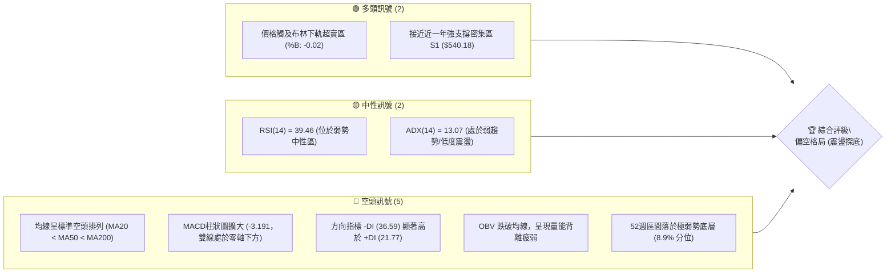
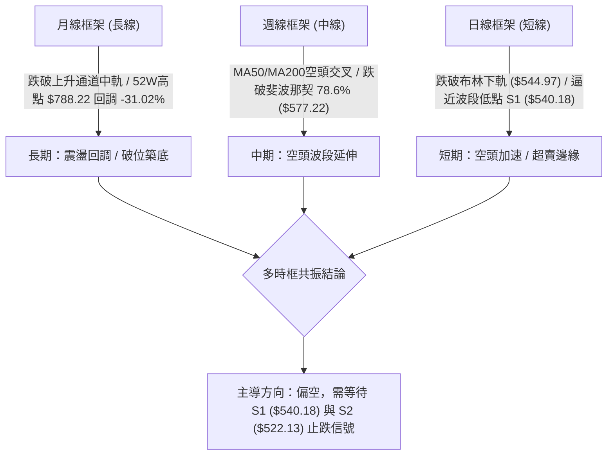
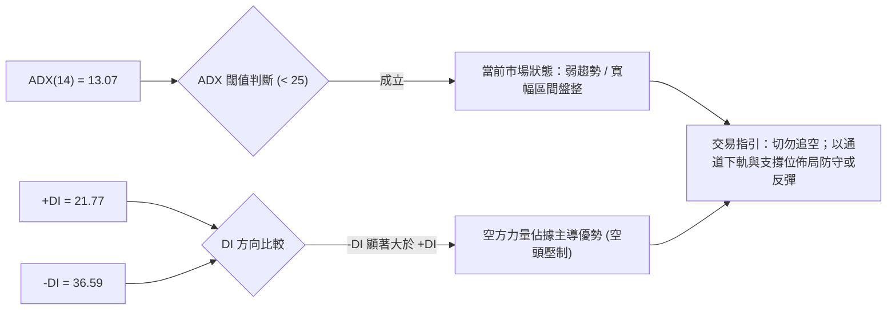
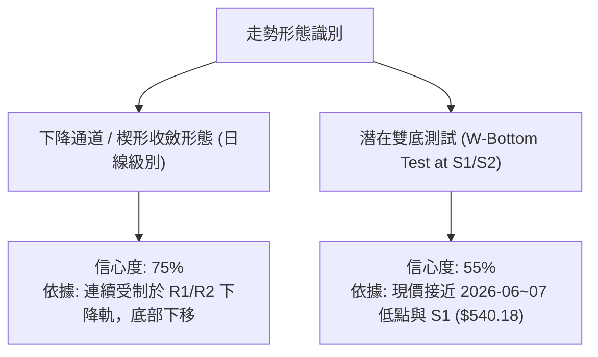
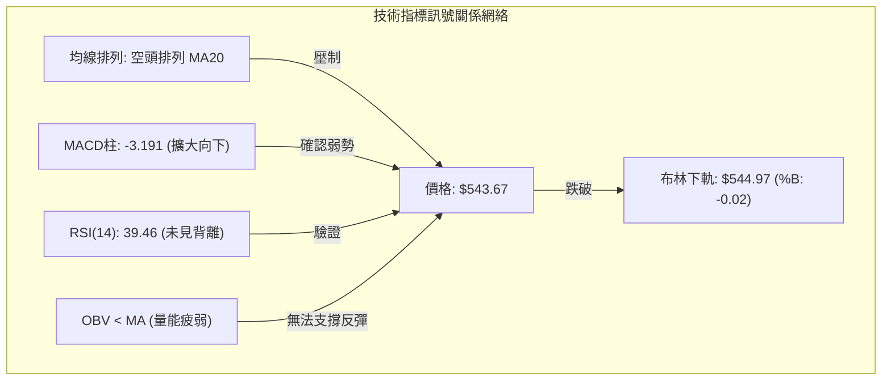
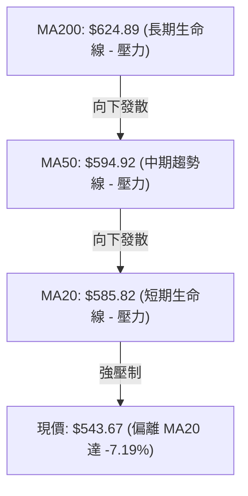
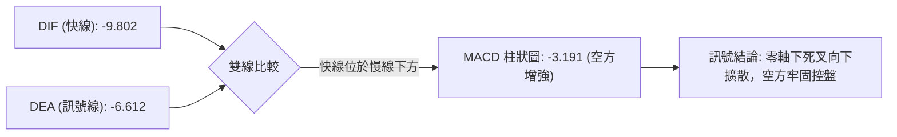
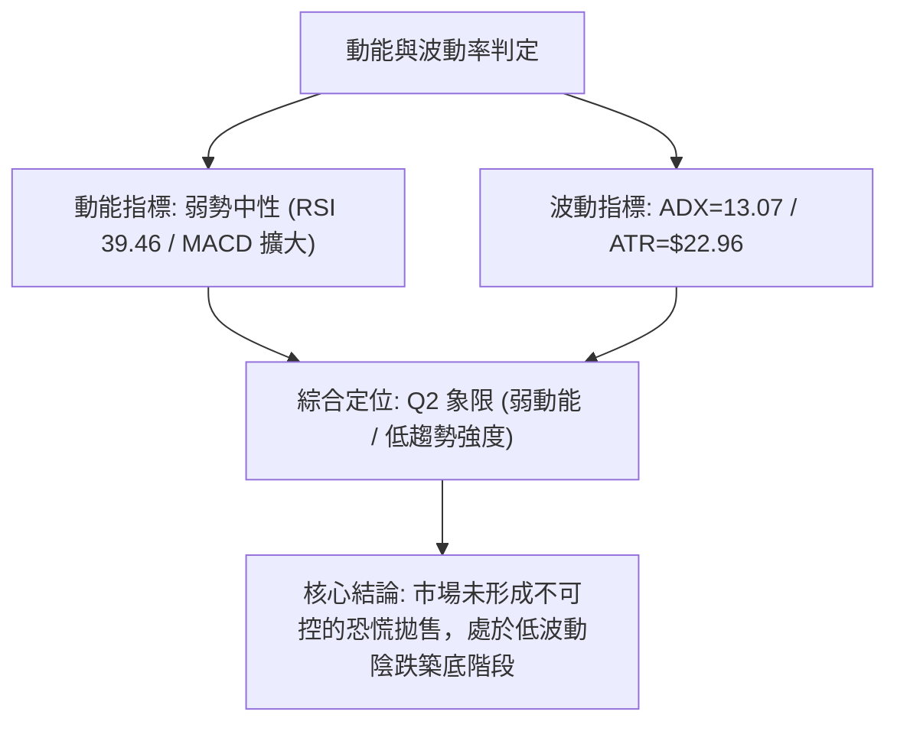
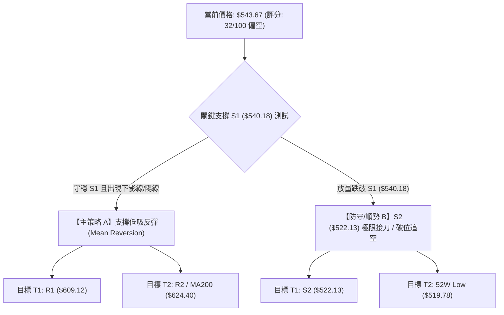
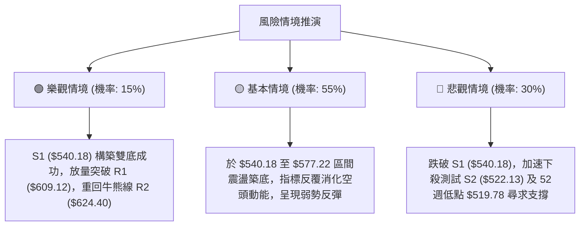

# META 技術分析報告

> **報告日期**：2026-08-19 ｜ **語言**：繁體中文 ｜ **數據來源**：Yahoo Finance ｜ **當前價格**：$543.67

---

## 目錄

| 章節 | 內容 |
|------|------|
| [1. 技術面概覽](#1-技術面概覽) | 訊號儀表板、核心指標、評分卡 |
| [2. 趨勢分析](#2-趨勢分析) | 多時框趨勢、長中短期走勢 |
| [3. 圖表形態分析](#3-圖表形態分析) | 形態識別、K線組合、目標價 |
| [4. 支撐與阻力](#4-支撐與阻力) | 關鍵價位、斐波那契回調 |
| [5. 技術指標深度解讀](#5-技術指標深度解讀) | MA/RSI/MACD/布林/成交量 |
| [6. 動能與波動率](#6-動能與波動率) | 動能評估、ATR、Beta |
| [7. 多時框架總結](#7-多時框架總結) | 時框架評分矩陣 |
| [8. 交易策略建議](#8-交易策略建議) | 多空策略、風險報酬比 |
| [9. 風險提示與監控](#9-風險提示與監控) | 監控指標、風險場景 |

---

## 1. 技術面概覽

### 🎯 技術訊號儀表板



---

### 📊 核心指標速覽表

| 指標類別 | 指標名稱 | 當前數值 | 訊號 | 解讀 |
|:---|:---|:---|:---:|:---|
| **價格** | 當前收盤價 | $543.67 | 🔴 | 位於52週區間極底部（8.9%），距離52W低點僅 +4.59% |
| **均線** | MA20 (短) | $585.82 | 🔴 | 現價低於MA20達 -7.19%，短線處於顯著受壓狀態 |
| **均線** | MA50 (中) | $594.92 | 🔴 | 現價低於MA50達 -8.61%，中期趨勢持續下行向下發散 |
| **均線** | MA200 (長) | $624.89 | 🔴 | 現價低於長期生命線 MA200 達 -12.99%，長期熊市結構 |
| **動能** | RSI(14) | 39.46 | 🟡 | 位於30-40弱勢區間，尚未出現典型超賣極值，無底背離 |
| **動能** | MACD(12,26,9) | -9.802 / -6.612 | 🔴 | MACD低於訊號線，柱狀圖 -3.191 持續走低，空方主導 |
| **通道** | 布林通道 %B | -0.02 | 🟢 | 現價跌破下軌 ($544.97)，具備短線技術性均值回歸條件 |
| **波動** | ATR(14) | $22.96 | 🟡 | 佔股價 4.22%，日內波幅中等，風險定價維持在常態波動 |
| **成交量** | 20日成交量比 | 1.56x | 🔴 | 當日量能 (26.55M) 放大下跌，呈現空頭放量壓迫跡象 |

---

### 🏆 技術評分卡

```
╔══════════════════════════════════════════════════════════════╗
║              技術評分卡 — META (2026-08-19)                  ║
╠══════════════════════════════════════════════════════════════╣
║ 趨勢強度 (Trend)     ████░░░░░░░░░░░░░░░░  20/100  🔴 極弱空頭 ║
║ 動能指標 (Momentum)  ██████░░░░░░░░░░░░░░  30/100  🔴 動能疲軟 ║
║ 支撐穩定度 (Support) ████████████░░░░░░░░  60/100  🟡 臨近S1支撐║
║ 成交量配合 (Volume)  ██████░░░░░░░░░░░░░░  30/100  🔴 放量下行 ║
║ 形態完整度 (Pattern) ████████░░░░░░░░░░░░  40/100  🟡 破位下飄 ║
║ 均線排列 (Moving Avg)██░░░░░░░░░░░░░░░░░░  10/100  🔴 完備空頭 ║
╠══════════════════════════════════════════════════════════════╣
║ 綜合技術評分         ██████░░░░░░░░░░░░░░  32/100  🔴 偏空格局 ║
╚══════════════════════════════════════════════════════════════╝
```

---

## 2. 趨勢分析

### 🌐 多時框趨勢分析



---

### 📈 長期趨勢 — 12個月走勢圖（Unicode）

```
META 月線歷史走勢圖（過去12個月：2025-09 至 2026-08）
價格軸 ($)
$750 ┤ ●(2025-09: 732.47)
$700 ┤                   ●(2026-01: 715.22)
$650 ┤       ●       ●       ●(2026-02: 647.03) ●(2026-05: 631.92)
$600 ┤                                      ●(2026-04: 611.34)
$550 ┤                                                 ●(06: 563.29) ●(07: 556.71)
$540 ┤                                                                ●←現價 $543.67 (2026-08)
     └─────────────────────────────────────────────────────────────────────────────
       09月   10月    11月   12月    01月   02月    03月   04月    05月   06月    07月   08月
```

#### 走勢特徵分析表格

| 階段區間 | 起始/結束月份 | 區間起點 | 區間終點 | 期間漲跌幅 | 結構特徵與成交量型態 |
|:---|:---:|:---:|:---:|:---:|:---|
| **高檔出貨期** | 2025-09 ~ 2025-10 | $732.47 | $646.67 | -11.71% | 自歷史高點區間大幅拉回，長陰摜破均線支撐 |
| **中繼整理期** | 2025-11 ~ 2026-01 | $646.27 | $715.22 | +10.67% | 假性反彈至 $715.22 形成次高點，量能未能續創新高 |
| **空頭下殺期** | 2026-02 ~ 2026-03 | $647.03 | $571.60 | -11.66% | 主跌段展開，跌破波段重要整數關卡，重心持續下移 |
| **弱勢反抽期** | 2026-04 ~ 2026-05 | $611.34 | $631.92 | +3.37% | 受制於 MA200 ($624.89) 與 R3 ($642.40)，反彈無力 |
| **加速探底期** | 2026-06 ~ 2026-08 | $563.29 | $543.67 | -3.48% | 連續三個月收黑，直逼 52 週最低點 $519.78 |

---

### 📊 中期趨勢（週線分析）

```
META 週線阻力與支撐結構示意圖
$650 ┤---------------------------------------- [R3: $642.40 - 強阻力位]
     │        ▲ 反彈極限受阻
$620 ┤--------┼------------------------------- [R2: $624.40 / MA200: $624.89]
     │        │ 
$600 ┤--------┼------------------------------- [R1: $609.12 / 05-31高點]
     │        │ 
$580 ┤--------┼------------------------------- [斐波那契 78.6%: $577.22]
     │        ▼ 空頭破位下行
$543 ┤========●=============================== [當前收盤價: $543.67]
$540 ┤---------------------------------------- [S1: $540.18 - 近期波段低點支撐]
$520 ┤---------------------------------------- [S2: $522.13 / 52W Low: $519.78]
```

---

### ⚡ 趨勢強度評估（ADX 解讀）



#### ADX 趨勢強度對照表

| 指標變數 | 當前數值 | 基準門檻 | 狀態判定 | 意義解讀 |
|:---|:---:|:---:|:---:|:---|
| **ADX (14)** | **13.07** | `< 20` 極弱 / `< 25` 弱 | **無顯著單邊趨勢** | 雖然價格下行，但趨勢動能未形成強烈單向暴跌，隨時易引發震盪回抽 |
| **+DI** | **21.77** | 越小代表多頭越弱 | **多方動能貧弱** | 多方買盤意願低落，無法組織有效連續攻勢 |
| **-DI** | **36.59** | 越大代表空頭越強 | **空方顯著佔優** | 空方目前主導日線定價權，但高數值配合低 ADX 預示拋壓正逐步被吸收 |

---

## 3. 圖表形態分析

### 🔍 形態識別系統



#### 形態識別與信心度評估表

| 形態名稱 | 信心度 | 判斷依據（引用數據） | 完成度 | 目標價（附嚴謹計算式） |
|:---|:---:|:---|:---:|:---|
| **下降通道延續** | **75%** | 價格受制於 MA20 ($585.82) 下壓，高點從 07-12 之 $669.21 逐步降至 08-09 之 $592.10 | 85% | 由通道下軌對照波段支撐 **S2: $522.13**（通道底邊延伸線） |
| **雙底初生嘗試** | **55%** | 第一隻腳為 2026-06/07 底部區間 ($550.25~$556.71)，當前正於 S1 ($540.18) 構築第二隻腳 | 40% | 若守穩 S1，頸線突破點為 R1 ($609.12)。<br>理論反彈目標 = 頸線 $609.12 + ($609.12 - $540.18) = **$678.06**（註：未確認前僅作參考） |
| **頭肩頂破位** | **35%** | 訊號不足，僅做指標型解讀（頸線結構過於離散，不具備標準幾何意義） | 0% | 數據不足以支撐幾何頭肩形態 |

---

### 🕯️ 重要K線形態分析（近 5 個月）

| 月份 | 收盤價 | K線形態 | 解讀 | 訊號 |
|:---:|:---:|:---|:---|:---:|
| **2026-04** | $611.34 | **下影反彈陽線** | 測試底部後強勁抽腳，短線空翻多 | 🟢 |
| **2026-05** | $631.92 | **帶長上影小陽線** | 衝高觸及 R3 ($642.40) 後遭遇重壓回落，多頭受挫 | 🟡 |
| **2026-06** | $563.29 | **破位中長陰線** | 一舉跌破 MA20 與 MA50，均線形成空頭交叉 | 🔴 |
| **2026-07** | $556.71 | **弱勢十字陰線** | 盤中反彈至 $669.21 後暴跌，高位獲利了結賣壓沉重 | 🔴 |
| **2026-08** | $543.67 | **探底中陰線** | 跌破 7 月低點，直接測試波段支撐 S1 ($540.18) | 🔴 |

---

### 📉 ASCII 走勢形態示意圖

```
META 下降通道與支撐測試示意圖
$670 ┤        ● (2026-07-12 高點: $669.21)
$640 ┤         \   
$620 ┤          \    ● (2026-07-19: $646.01)
$600 ┤           \    \   ● (2026-08-09: $592.10)
$580 ┤            \    \   \
$560 ┤             ●----\   \   ● (2026-08-16: $589.85)
$543 ┤(06-28: $550.25)   \   \   \
$540 ┤                    ●   \   ● ← 現價 $543.67 (測試 S1: $540.18)
$522 ┤             (08-02: $556.71) \ 
$519 ┤                               ● 潛在支撐區域 S2 ($522.13) / 52W Low ($519.78)
     └─────────────────────────────────────────────────────────────────────────────
```

---

## 4. 支撐與阻力

### 🗺️ 關鍵價位分布圖（Unicode）

```
META 價位結構分布圖
═══════════════════════════════════════════════════════════════════════
$788.22 ║████████████████████████████████████████║ 52週歷史高點 (0.0% Fib)
$654.00 ║████████████████████████                ║ 斐波那契 50.0% 回調位
$642.40 ║████████████████████████                ║ 強阻力 R3 (近一年波段高點聚類)
$624.40 ║████████████████████                    ║ 阻力 R2 (與 MA200 $624.89 重合)
$609.12 ║████████████████                        ║ 關鍵阻力 R1 (波段頸線反壓)
$577.22 ║████████████                            ║ 斐波那契 78.6% 回調位
$544.97 ║▓▓▓▓▓▓▓▓                                ║ 布林通道下軌
$543.67 ╠════════════════════════════════════════╣ ◄ 現價 ($543.67)
$540.18 ║████████████████                        ║ 近期支撐 S1 (波段低點聚類)
$522.13 ║████████████████████████                ║ 強支撐 S2 (波段強支撐)
$519.78 ║████████████████████████████████        ║ 52週歷史低點 (100.0% Fib)
═══════════════════════════════════════════════════════════════════════
```

---

### 🚧 阻力位分析表

| 阻力級別 | 價位 | 形成原因 | 突破難度 | 重要性 |
|:---|:---:|:---|:---:|:---:|
| **R1** | **$609.12** | 近一年多次波段反彈高點聚類，接近整數關卡 $600 | 🟡 中等 | 判定短線空頭反轉的第一道防線 |
| **R2** | **$624.40** | 與 200 日均線 **MA200 ($624.89)** 及 Fib 61.8% ($622.32) 形成共振強壓區 | 🔴 極高 | 牛熊分界核心區，中長線趨勢壓制線 |
| **R3** | **$642.40** | 2026年5月高點與240日均線 ($643.91) 聚類重疊密集區 | 🔴 極高 | 中期多頭反轉的終極確認點 |

---

### 🛡️ 支撐位分析表

| 支撐級別 | 價位 | 形成原因 | 守住機率 | 重要性 |
|:---|:---:|:---|:---:|:---:|
| **S1** | **$540.18** | 近一年波段低點聚類，距離現價僅 -0.64%，短線多頭最後防線 | 🟡 55% | 跌破則宣告短線探底行情加速 |
| **S2** | **$522.13** | 波段歷史重要密集成交底部，距離現價 -3.96% | 🟢 80% | 極強支撐，跌破將引發全面性流動性停損 |

---

### 📐 斐波那契回調位分析

依據 52 週波動區間（高點 **$788.22** 至 低點 **$519.78**，總振幅 $268.44）計算：

| 斐波那契比例 | 價位 | 當前價位相對位置與技術意義解讀 |
|:---:|:---:|:---|
| **0.0% (52W High)** | **$788.22** | 歷史頂部壓力 |
| **23.6%** | **$724.87** | 高位第一阻力區 |
| **38.2%** | **$685.67** | 2026年1月反彈高點 ($715.22) 回撤樞紐 |
| **50.0%** | **$654.00** | 多空中軸平衡區 |
| **61.8%** | **$622.32** | 黃金分割強壓（與 **R2: $624.40** 緊密咬合） |
| **78.6%** | **$577.22** | 深度回撤警戒線（現價已跌破，轉為反彈壓力） |
| **100.0% (52W Low)**| **$519.78** | 極限防守底線（波段大底） |

> **位置判斷**：當前收盤價 **$543.67** 落於 **78.6% ($577.22)** 與 **100.0% ($519.78)** 之間的極深回撤區間。價格跌破 78.6% 顯示多頭防線已完全退守至 52 週最低點防禦圈（$519.78~$522.13），下行空間已受限，但上方阻力重重。

---

## 5. 技術指標深度解讀

### 🎛️ 指標訊號總覽



---

### 📈 移動平均線排列分析



#### 各週期均線偏離度

*   **MA 5**: $575.26（偏離 -5.49%）
*   **MA 10**: $584.11（偏離 -6.92%）
*   **MA 20**: $585.82（偏離 -7.19%）
*   **MA 60**: $598.46（偏離 -9.16%）
*   **MA 120**: $611.07（偏離 -11.03%）
*   **MA 240**: $643.91（偏離 -15.57%）

> **均線型態結論**：所有短中長期均線呈現標準的**「空頭排列」**，各週期 MA 斜率皆向下發散。然而短期負乖離率（-7.19%）已達極端值，累積了隨時向上抽腳修正均線乖離的技術需求。

---

### 📉 RSI(14) 分析

*   **當前 RSI(14)**：`39.46`
*   **RSI 強度進度條**：`████████░░░░░░░░░░░░ 39.46% (弱勢中性)`
*   **背離分析**：
    *   週線 RSI 在 2026-08-02 曾觸及 22.9 的極度超賣低點，隨後反彈至 48.8，最新收盤回落至 39.5。
    *   價格跌破前低，但 RSI 未同步創下低於 22.9 的新低，目前**無顯著標準底背離，但隱含弱式背離收斂特徵**。

---

### 📊 MACD(12, 26, 9) 訊號解讀



*   **MACD 線**：-9.802
*   **Signal 線**：-6.612
*   **Histogram 柱狀圖**：-3.191（持續負向擴大）
*   **解讀**：MACD 線與 Signal 線均在零軸深處運行，且綠柱持續向下延伸，顯示短線下行慣性尚未衰竭，目前尚未出現金叉或收斂跡象。

---

### 📦 布林通道分析 (Bollinger Bands)

```
META 布林通道位置示意圖 (20, 2)
$630 ┤---------------------------------------- [上軌: $626.67]
$610 ┤
$590 ┤---------------------------------------- [中軌 MA20: $585.82]
$570 ┤
$550 ┤---------------------------------------- [下軌: $544.97]
$543 ┤ ▲現價: $543.67 (%B = -0.02，通道外破位)
     └────────────────────────────────────────
```

*   **通道寬度**：上軌 $626.67 與 下軌 $544.97 寬度達 $81.70。
*   **%B 指標**：**-0.02**。當 %B < 0 代表股價已跌出布林通道下軌之外，屬於統計學上的**「極端超賣」**現象。歷史經驗顯示，當股價運行至下軌外側，往往易觸發均值回歸行情（Mean Reversion），向中軌 $585.82 靠攏。

---

### 💹 成交量分析（量價配合度）

*   **最新日成交量**：26,550,374 股
*   **20日均量**：16,999,109 股（**量比 1.56x**）
*   **50日均量**：18,250,725 股
*   **OBV 趨勢**：`OBV < MA`（能量潮指標低於均線，量能處於流失狀態）
*   **量價解讀**：股價在下跌過程中伴隨 1.56 倍均量放量，顯示市場存在主動性賣壓；然而 OBV 持續走弱，說明買盤並未在下跌中大舉承接，仍以被動觀望為主。

---

## 6. 動能與波動率

### ⚡ 動能評估四象限

| 象限 | 動能維度 (Momentum) | 波動維度 (Volatility) | META 當前狀態 | 策略應對指引 |
|:---:|:---:|:---:|:---:|:---|
| **Q1** | 強 (Strong) | 低 (Low) | — | 穩定多頭趨勢，順勢作多 |
| **Q2** | 弱 (Weak) | 低 (Low) | **✓ META 當前所處位置** | **ADX=13.07 (低趨勢) + ATR=4.22% (中低波)。適合支撐低吸，嚴設停損** |
| **Q3** | 強 (Strong) | 高 (High) | — | 單邊突破行情，高風險追價 |
| **Q4** | 弱 (Weak) | 高 (High) | — | 恐慌崩盤階段，應全面空倉觀望 |



---

### 📊 ATR 波動率分析

*   **ATR(14)**：**$22.96**（佔股價比重 **4.22%**）
*   **波動性解讀**：每日平均波動約 23 美元，屬於大型科技股常態合理波動水準。
*   **止損與風控設置建議**：
    *   **短線日內止損距離（1.0 × ATR）**：$22.96 → 防守位設於進場點下方約 $23。
    *   **波段交易止損距離（1.5 × ATR）**：$34.44 → 防守位設於進場點下方約 $35。
    *   若以現價 $543.67 佈局多頭，跌破 S1 ($540.18) 且突破 0.5×ATR（約 $528.69），應果斷執行戰術停損。

---

### 📐 Beta 與市場相關性

*   **Beta 係數**：**1.243**
*   **大盤相關性解讀**：META 波動幅度較標普500指數高出約 24.3%。在市場整體處於震盪時，META 的下行放大效應明顯；同理，一旦大盤止跌回升，其反彈彈性亦將高於市場平均水準。

---

## 7. 多時框架總結

### 📋 時框架評分表

| 時框架 | 趨勢方向 | 動能狀態 | 均線排列 | 形態結構 | 綜合評分 | 戰略操作建議 |
|:---|:---:|:---:|:---:|:---:|:---:|:---|
| **月線 (長期)** | 🟡 震盪回調 | 弱勢中性 | 跌破短均，守住長均 | 歷史高點大幅回撤 | **45/100** | 長期投資者可於 S2 ($522.13) 附近分批金字塔式建倉 |
| **週線 (中期)** | 🔴 下行空頭 | 空方主導 | 空頭排列 | 下降通道延伸 | **30/100** | 中期波段投資者應保持空倉，靜待週線 MACD 綠柱收斂 |
| **日線 (短期)** | 🔴 超賣探底 | 極度超賣 | 全面空頭排列 | 測試 S1 ($540.18) | **32/100** | 短線僅適合激進交易者博弈布林通道下軌均值回歸反彈 |

---

### 🔲 綜合訊號矩陣

| 維度 | 短期 (日線) | 中期 (週線) | 長期 (月線) | 多時框共振度 |
|:---|:---:|:---:|:---:|:---:|
| **趨勢方向** | 🔴 空頭破位 | 🔴 空頭延伸 | 🟡 深度回撤 | 🔴 空方共振 |
| **均線系統** | 🔴 負乖離大 | 🔴 空頭排列 | 🟡 逼近長線均線 | 🔴 空方壓制 |
| **指標動能** | 🟢 %B下軌超賣 | 🔴 MACD死叉 | 🟡 RSI弱勢 | 🟡 動能分歧 |
| **量價配合** | 🔴 放量下跌 | 🔴 量能疲弱 | 🟡 高位縮量 | 🔴 量能不足 |

---

### ⚖️ 多時框收斂結論

> **依據規則 14 進行多時框收斂**：
> 1. **行情定性**：當前日線 **ADX(14) = 13.07 (< 25)**，明確定義為**「盤整/弱趨勢行情」**，非單邊強烈暴跌趨勢。
> 2. **主導時框優先級**：在盤整低趨勢環境下，交易以**日線布林通道下軌（$544.97）與波段支撐位（S1: $540.18）的邊界效應**為主導，中長期均線（MA20/MA50/MA200）則構成上方反彈的嚴格壓制目標。
> 3. **唯一方向性結論**：**【偏空中性，區間震盪探底】**。空頭趨勢佔據主導，但現價已殺至統計學極端超賣區（%B: -0.02）且緊貼支撐位 S1 ($540.18)，**嚴禁在此位置追空**，策略應轉為「防守性觀察，或在支撐位上方博弈均值回歸反彈」。

---

## 8. 交易策略建議

### 🗺️ 策略決策流程圖



---

### 🧭 策略路由

*   **當前主策略方向** = **【空頭趨勢下的超賣反彈交易 / 區間低吸】**（依綜合評分 **32/100 偏空**，但價格已抵達支撐核心防區）。

---

### 🎯 價格情境階梯（Price Scenarios）

| 觸發條件 | 第一目標 (T1) | 後續延伸 (T2) | 情境含義解讀 |
|:---|:---:|:---:|:---|
| **向上突破 R1 ($609.12)** | **R2 ($624.40)** | **R3 ($642.40)** | **短線強烈轉強**，確認雙底構築成功，挑戰 MA200 牛熊分界線 |
| **站穩現價 ($543.67~$540.18)** | **Fib 78.6% ($577.22)** | **MA20 ($585.82)** | **超賣均值回歸**，布林下軌抽腳修復負乖離 |
| **放量跌破 S1 ($540.18)** | **S2 ($522.13)** | **52W Low ($519.78)** | **空頭加速探底**，多頭全面潰退至年度最低點 |

---

### 📊 情境機率分佈

| 情境類別 | 發生機率 | 主要依據與技術指標支撐 |
|:---|:---:|:---|
| **情境一：於 S1 止跌震盪反彈** | **55%** | 布林 %B (-0.02) 嚴重超賣，ADX (13.07) 顯示下行動能不足，S1 ($540.18) 具強支撐聚類 |
| **情境二：跌破 S1 探底 S2** | **35%** | 均線呈空頭排列，MACD 柱狀圖 (-3.191) 擴大，量比 1.56x 賣壓尚未完全耗盡 |
| **情境三：直接強勢反轉突破 R2** | **10%** | OBV 仍低於均線，缺乏大級別增量資金進場，難以直接深 V 反轉 |

---

### 🟢 主策略詳情

#### 策略方案比較表

| 策略要素 | 策略 A：S1 支撐低吸反彈（左側偏多博弈） | 策略 B：跌破 S1 順勢破位放空（右側偏空跟進） |
|:---|:---:|:---:|
| **進場條件** | 價格回測 S1 ($540.18) 未破，日K出現抽腳 | 日線收盤價實體跌破 **$540.18** |
| **進場價格** | **$543.67** (現價或等拉回 $541.00) | **$539.50** (破位確認後進場) |
| **目標價 T1** | **$577.22** (Fib 78.6% 回調位) | **$522.13** (波段強支撐 S2) |
| **目標價 T2** | **$609.12** (關鍵阻力 R1) | **$519.78** (52週歷史最低點) |
| **止損價格** | **$535.00** (跌破 S1 下方約 1% 處) | **$548.00** (假跌破抽回布林下軌內) |
| **風險報酬比** | **1 : 4.41** (以進場 $543.67、T2 $609.12、止損 $535 計算) | **1 : 2.04** (以進場 $539.50、T1 $522.13、止損 $548 計算) |
| **成功機率** | **55%** | **45%** |
| **建議倉位** | **10% - 15%** (輕倉試單) | **10%** (嚴控破位風險) |

---

### 🔴 反向風險觸發點（風控對沖提示）

1.  **多頭止損與轉空訊號**：若日K收盤價**實體跌破 $540.18 (S1)**，代表超賣鈍化，必須無條件平倉多頭試單，不可攤平。
2.  **空頭回補與轉多訊號**：若價格強勢向上突破並**收復 $585.82 (MA20 / 布林中軌)**，空頭格局暫告瓦解，所有波段空單應立即獲利了結。

---

### ⭐ 整體訊號強度評星

```
╔════════════════════════════════════════════════════╗
║ 做多訊號強度：★★☆☆☆  (2.5/5星 - 僅限超賣反彈)        ║
║ 做空訊號強度：★★★☆☆  (3.5/5星 - 順應中長線均線)     ║
║ 整體可信度：  ★★★★☆  (4.0/5星 - 價位密集度極高)     ║
╚════════════════════════════════════════════════════╝
```

---

## 9. 風險提示與監控

### ✅ 關鍵監控指標 Checklist

```
╔══════════════════════════════════════════════════════════════╗
║               每日交易風控監控清單 (Checklist)               ║
╠══════════════════════════════════════════════════════════════╣
║ [ ] 價格是否跌破波段低點支撐 S1: $540.18                      ║
║ [ ] 布林 %B 是否重新回升至 0.00 以上 (返回通道內)             ║
║ [ ] MACD 柱狀圖是否開始由 -3.191 向上收斂縮短                ║
║ [ ] RSI(14) 是否跌破 30 進入極度超賣區                        ║
║ [ ] 成交量是否萎縮至 20 日均量 (16.99M) 以下 (確認拋壓耗盡)   ║
║ [ ] 價格能否有效突破並站穩短線阻力 Fib 78.6%: $577.22        ║
╚══════════════════════════════════════════════════════════════╝
```

---

### ⚠️ 風險場景分析



---

### 🛡️ 風險管理重要提醒

1.  **嚴格執行 ATR 止損機制**：當前 ATR 為 **$22.96**，市場日內波動較大，建倉後應給予合理波動空間，但絕不可將止損放大超過波段支撐 **$535.00**。
2.  **避免左側重倉**：均線系統（MA20/50/200）呈標準空頭排列，左側摸底僅能以不超過 **10%~15%** 的輕量級倉位參與，待站上 MA20（$585.82）確認右側突破後再行加碼。
3.  **大盤聯動風險**：META 之 Beta 值達 **1.243**，若大盤指數（如那斯達克、標普500）同步破位，個股技術支撐 S1 易出現瞬間擊穿，需密切注意宏觀市場流動性變化。

---

## 📋 報告總結

```
╔══════════════════════════════════════════════════════════════════════╗
║                     META 技術分析報告總結                            ║
╠══════════════════════════════════════════════════════════════════════╣
║ 報告日期：2026-08-19                                                 ║
║ 當前價格：$543.67                                                    ║
║ 分析評級：⚖️ 偏空格局 / 超賣震盪 (Bearish / Oversold Consolidation)  ║
╠══════════════════════════════════════════════════════════════════════╣
║ 關鍵結論：                                                           ║
║ ├─ 長期趨勢：🟡 52W高點深度回調 (-31.02%)，測試大週期支撐帶          ║
║ ├─ 中期趨勢：🔴 均線空頭排列，週線受制於 MA200 ($624.89)            ║
║ ├─ 短期趨勢：🟢 跌破布林下軌 (%B: -0.02)，臨近 S1 ($540.18) 超賣反彈 ║
║ ├─ 關鍵支撐：S1: $540.18  ｜  S2: $522.13  ｜ 52W Low: $519.78       ║
║ ├─ 關鍵阻力：R1: $609.12  ｜  R2: $624.40  ｜ R3: $642.40            ║
║ └─ 分析師共識目標：均價 $754.14 (最低 $580.00 / 最高 $1000.00)       ║
╠══════════════════════════════════════════════════════════════════════╣
║ 最優策略組合：                                                       ║
║ 1. 🥇 最佳機會：於 S1 ($540.18) 上方輕倉佈局超賣均值回歸反彈，       ║
║                 目標 Fib 78.6% ($577.22) ~ R1 ($609.12)              ║
║ 2. 🥈 次選機會：若實體跌破 $540.18，順勢追空至 S2 ($522.13)          ║
║ 3. 🥉 保守選擇：完全空倉觀望，靜待價格放量收復 MA20 ($585.82) 右側  ║
╚══════════════════════════════════════════════════════════════════════╝
```

---

> ⚠️ **免責聲明**：本報告為 AI 自動生成之技術分析，所有數據及估算均基於提供的歷史價格資訊。本報告**僅供研究與學術參考**，**不構成任何投資建議**。投資有風險，入市需謹慎。

---

*報告生成時間：2026-08-19 ｜ 數據來源：Yahoo Finance ｜ 分析框架：多時框技術分析*