# META 技術分析報告

> **報告日期**：2026-08-20 ｜ **語言**：繁體中文 ｜ **數據來源**：Yahoo Finance ｜ **當前價格**：$546.03

---

## 目錄

| 章節 | 內容 |
|------|------|
| [1. 技術面概覽](#1-技術面概覽) | 訊號儀表板、核心指標、評分卡 |
| [2. 趨勢分析](#2-趨勢分析) | 多時框趨勢、長中短期走勢 |
| [3. 圖表形態分析](#3-圖表形態分析) | 形態識別、K線組合、目標價 |
| [4. 支撐與阻力](#4-支撐與阻力) | 關鍵價位、斐波那契回調 |
| [5. 技術指標深度解讀](#5-技術指標深度解讀) | MA/RSI/MACD/布林/成交量 |
| [6. 動能與波動率](#6-動能與波動率) | 動能評估、ATR、Beta |
| [7. 多時框架總結](#7-多時框架總結) | 時框架評分矩陣 |
| [8. 交易策略建議](#8-交易策略建議) | 多空策略、風險報酬比 |
| [9. 風險提示與監控](#9-風險提示與監控) | 監控指標、風險場景 |
| [報告總結](#-報告總結) | 核心結論與策略彙整 |

---

## 1. 技術面概覽

### 🎯 技術訊號儀表板

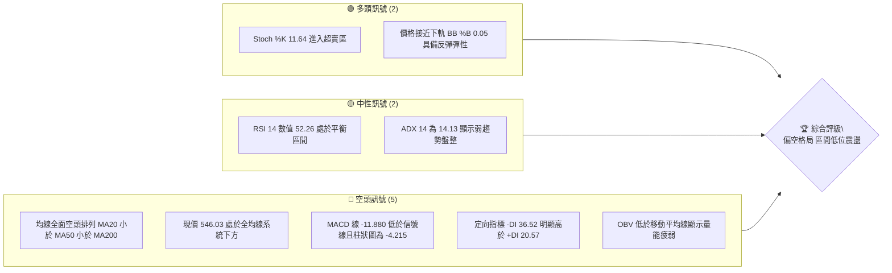

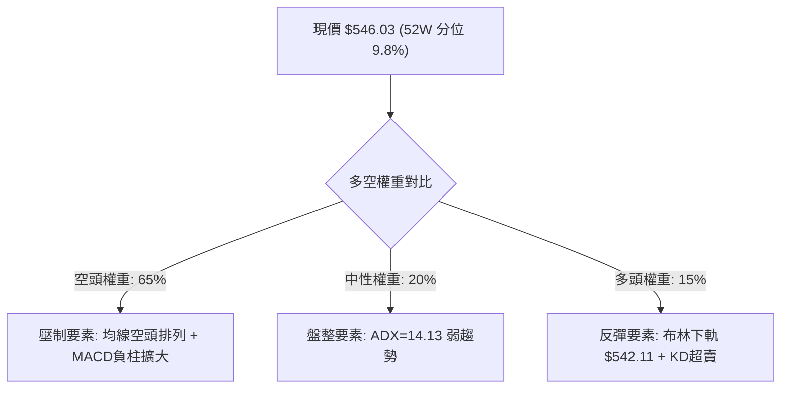

### 📊 核心指標速覽表

| 指標類別 | 指標名稱 | 當前數值 | 訊號 | 解讀 |
|----------|----------|----------|------|------|
| **價格** | 當前價格 | $546.03 | 🔴 | 位於 52 週低點區間（分位點 9.8%），空頭壓制明顯 |
| **均線** | MA20 | $581.76 | 🔴 | 價格低於 MA20 達 -6.14%，短線呈下行趨勢 |
| **均線** | MA50 | $594.15 | 🔴 | 中期生命線下彎，股價落後 -8.10% |
| **均線** | MA200 | $624.30 | 🔴 | 長期牛熊分界線失守，長期走勢進入空頭修正 |
| **動能** | RSI(14) | 52.26 | 🟡 | 處於 30-70 中性區間，多空動能暫時平衡 |
| **動能** | MACD(12,26,9) | -11.880 / -7.665 | 🔴 | 快慢線均在零軸下方，柱狀圖 -4.215 持續擴張 |
| **動能** | Stoch %K / %D | 11.64 / 28.01 | 🟢 | %K 跌破 20 深度超賣，短線醞釀技術性反彈 |
| **趨勢** | ADX / ±DI | ADX: 14.13 (-DI: 36.52) | 🔴 | 趨勢強度極弱（<25），空方主導市場節奏 |
| **通道** | 布林通道 %B | 0.05 (下軌 $542.11) | 🟡 | 觸及通道下軌極限，存在均值回歸拉力 |
| **量能** | 20日均量 / OBV | 16.35M / 17.29M | 🔴 | 量比 0.95x，OBV < MA，資金進場意願低迷 |
| **波動** | ATR(14) | $19.79 (3.62%) | 🟡 | 每日平均震幅近 $20，屬於中高波動水平 |

### 🏆 技術評分卡

```
╔══════════════════════════════════════════════════════════════╗
║              技術評分卡 — META (2026-08-20)                  ║
╠══════════════════════════════════════════════════════════════╣
║ 趨勢強度 (Trend)     ██████░░░░░░░░░░░░░░  30/100  🔴 空頭主導 ║
║ 動能指標 (Momentum)  ████████░░░░░░░░░░░░  40/100  🔴 動能疲弱 ║
║ 支撐穩定度 (Support) ████████████░░░░░░░░  60/100  🟡 臨近S1   ║
║ 成交量配合 (Volume)  ████████░░░░░░░░░░░░  40/100  🔴 量能退潮 ║
║ 形態完整度 (Pattern) ██████████░░░░░░░░░░  50/100  🟡 箱體測試 ║
║ 均線排列 (MA System) ████░░░░░░░░░░░░░░░░  20/100  🔴 空頭排列 ║
╠══════════════════════════════════════════════════════════════╣
║ 綜合評分             ███████░░░░░░░░░░░░░  36/100  🔴 明確偏空 ║
╚══════════════════════════════════════════════════════════════╝
```

---

## 2. 趨勢分析

### 🌐 多時框趨勢分析

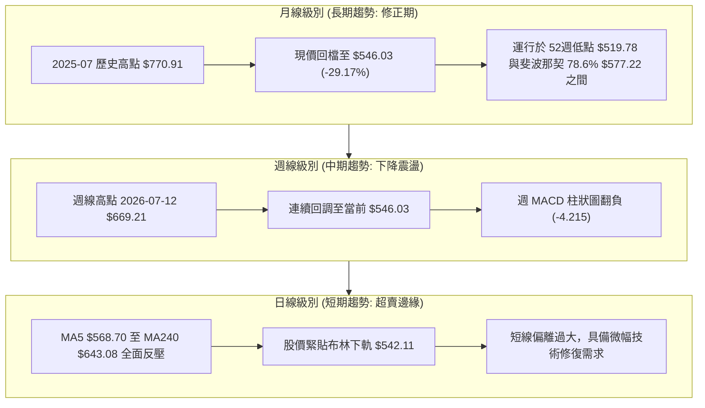

### 📈 長期趨勢 — 12個月走勢圖（Unicode）

```
META 月線走勢圖（過去12個月：2025-09 至 2026-08）
價格軸 ($)
$750 ┤    ●(09月:732.47)
$700 ┤                                ●(01月:715.22)
$650 ┤          ●(10月:646.67) ── ●(12月:658.91)       ●(05月:631.92)
$600 ┤                                              ●(04月:611.34)
$550 ┤                                                          ●(07月:556.71)
$500 ┤                                                                ●(08月:546.03)←現價
     └──────────────────────────────────────────────────────────────────────────
       09   10   11   12   01   02   03   04   05   06   07   08 (月份)
```

#### 走勢特徵分析表格

| 階段區間 | 起始價 → 結束價 | 區間漲跌幅 | 主要走勢特徵 |
|----------|-----------------|------------|--------------|
| **2025-09 ~ 2025-11** | $732.47 → $646.27 | -11.77% | 自高檔迅速回落，形成第一波中期獲利了結賣壓 |
| **2025-12 ~ 2026-01** | $658.91 → $715.22 | +8.55% | 展開強勁反彈，測試 $715.00 以上次高阻力區間 |
| **2026-02 ~ 2026-03** | $647.03 → $571.60 | -11.66% | 反彈結束後加速破位，直接摜破 $600 整數心理關卡 |
| **2026-04 ~ 2026-05** | $611.34 → $631.92 | +3.37% | 弱勢築底反彈，遭遇 MA60/MA120 均線密集區反壓 |
| **2026-06 ~ 2026-08** | $563.29 → $546.03 | -3.06% | 陰跌走低，持續向 52 週低點 $519.78 尋求實質支撐 |

### 📊 中期趨勢（週線分析）

```
近期週線關鍵價格結構與支撐壓力示意：
$669.21 ───┐ (2026-07-12 波段反彈高點 - 阻力密集)
           │
$609.12 ───┼── R1 阻力 (近一年波段高點聚類)
$589.85 ───┼── 2026-08-16 反彈次高點 (週線回測頸線)
$546.03 ───┼── [現價] 弱勢運行中
$540.18 ───┼── S1 支撐 (近一年波段低點聚類)
$522.13 ───┼── S2 強支撐 (52週極端支撐區)
$519.78 ───┘ (52週低點 / 斐波那契 100.0%)
```

### ⚡ 趨勢強度評估（ADX 解讀）

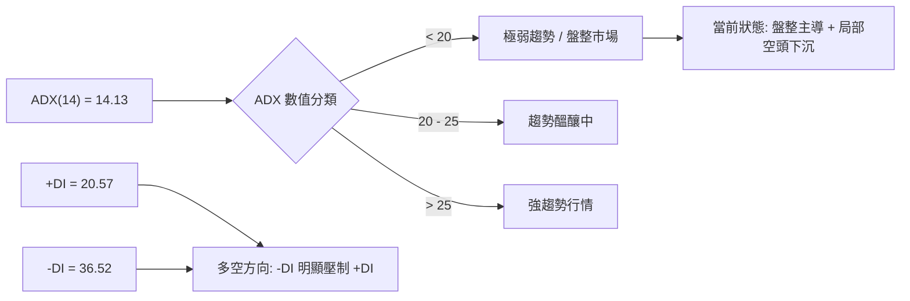

#### ADX 指標強度對照分析

- **ADX 數值**：`14.13`（遠低於 25 臨界線，顯示目前市場缺乏明確單邊趨勢，多空處於拉鋸弱震盪）。
- **+DI / -DI 態勢**：`-DI (36.52)` 大幅領先 `+DI (20.57)`，空方動能佔據上風，但因 ADX 偏低，尚未形成單邊崩跌，表現為震盪向下陰跌。
- **結論**：依多時框收斂原則，在 ADX < 25 的盤整格局下，日線布林通道上下軌（$542.11 ~ $621.42）為核心運行區間。

---

## 3. 圖表形態分析

### 🔍 形態識別系統

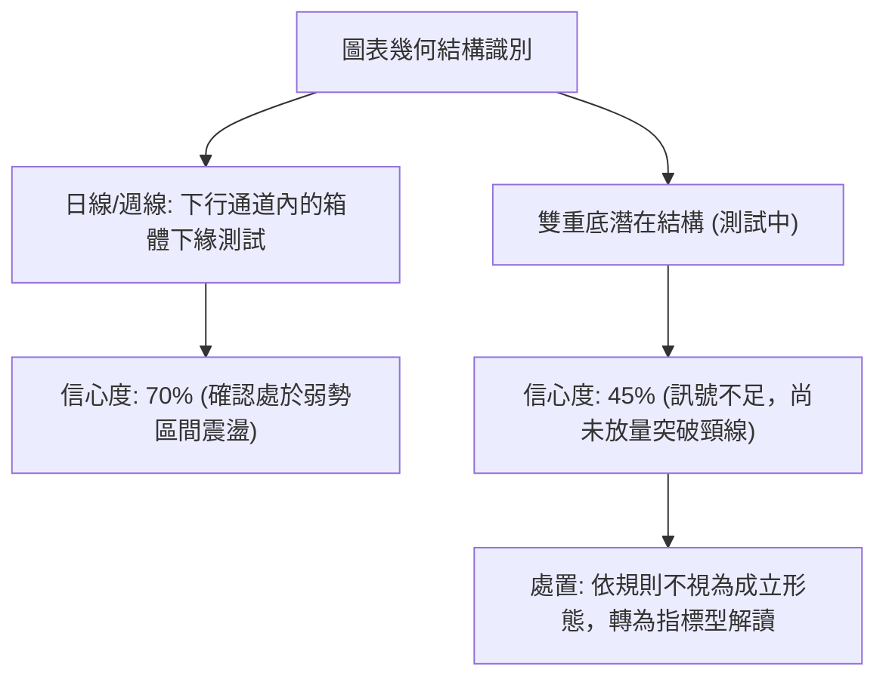

#### 形態識別與信心度評估表

| 形態名稱 | 信心度 | 判斷依據（引用數據） | 完成度 | 目標價（附計算式） |
|----------|--------|----------------------|--------|--------------------|
| **下行通道下軌測試** | 70% | 價格貼近布林下軌 $542.11，且緊鄰支撐 S1 $540.18 | 85% | 通道中軌反彈目標 = BB中軌 $581.76 |
| **潛在雙重底結構** | 45% | 訊號不足。前低為 2026-06-28 收盤 $550.25，現價 $546.03，未放量破頸線 | 30% | 頸線 R1 $609.12 + 形態高度($609.12 - $540.18 = $68.94) = $678.06（僅供推算） |
| **均線空頭發散** | 85% | MA5($568.70) < MA20($581.76) < MA60($597.40) < MA240($643.08) | 100% | 下行測試 S2 $522.13 |

### 🕯️ 重要K線形態分析

| 日期 / 週別 | 收盤價 | K線與量能形態 | 技術解讀 | 訊號 |
|-------------|--------|---------------|----------|------|
| **2026-07-12** | $669.21 | 大陽線放量攻高 (117.03M) | 突破反彈波段頂部，但遭遇 MA200 壓制，量能耗盡 | 🟡 |
| **2026-07-26** | $595.19 | 中陰線跌破均線 (57.38M) | 跌破 $600 關卡，多頭防線瓦解，MACD柱轉負 | 🔴 |
| **2026-08-02** | $556.71 | 放量長陰殺跌 (112.11M) | 空方加速宣洩，週線 RSI 降至 22.9 極端超賣 | 🔴 |
| **2026-08-16** | $589.85 | 縮量十字反彈 (64.22M) | 弱勢反抽確認 R1/MA20 阻力有效，量能無法放大 | 🟡 |
| **2026-08-23** | $546.03 | 回落陰線 (60.67M) | 再次考驗 S1 $540.18 支撐區，量能處於偏低水平 | 🔴 |

### 📉 ASCII 走勢形態示意圖

```
META 近期波動形態示意圖（反抽受阻與二次探底）
價格 ($)
$670 ┤      ▲ (07-12 高點: $669.21)
$640 ┤     / \
$610 ┤    /   \        ▲ (08-16 次高點: $589.85 - 受制於R1 $609.12)
$580 ┤   /     \      / \
$550 ┤  /       ▼----/   ▼ ─── ● 現價 $546.03 (測試 S1 $540.18)
$520 ┤ ▼ (前低支撐 S2: $522.13)
     └──────────────────────────────────────────────────────────
```

### 🎯 形態目標價計算

若以當前運行的「波段高點 $609.12」至「波段低點 $540.18」所形成的箱體震盪形態計算：
- **震盪區間高度 (H)** = 阻力位 R1 ($609.12) - 支撐位 S1 ($540.18) = **$68.94**
- **向上突破理論目標價** = R1 ($609.12) + H ($68.94) = **$678.06**
- **向下破位理論目標價** = S1 ($540.18) - H ($68.94) = **$471.24**
- **目前實際路徑**：由於目前受制於均線反壓，短線以箱體內部震盪為主，第一目標為回測 BB 中軌 $581.76，下檔第一防禦點為 S1 $540.18。

---

## 4. 支撐與阻力

### 🗺️ 關鍵價位分布圖（Unicode）

```
META 價位結構分布圖
══════════════════════════════════════════════════════════════════
$642.40 ║████████████████████████║ 強阻力 R3 (年線/波段反壓)
$624.40 ║████████████████████    ║ 阻力 R2 (MA200 / 斐波那契 61.8%)
$609.12 ║████████████████████████║ 關鍵阻力 R1 (近一年波段高點聚類)
$581.76 ║░░░░░░░░░░░░░░░░░░░░    ║ 布林中軌 / MA20 短線分水嶺
$546.03 ╠════════════════════════╣ ◄ 當前現價 ($546.03)
$542.11 ║▓▓▓▓▓▓▓▓▓▓▓▓▓▓▓▓▓▓▓▓    ║ 布林下軌支撐
$540.18 ║████████████████████    ║ 近期支撐 S1 (波段低點聚類)
$522.13 ║████████████████████████║ 強支撐 S2 (波段極端支撐)
$519.78 ║████████████████████████║ 52週低點 / 斐波那契 100.0%
══════════════════════════════════════════════════════════════════
```

### 🚧 阻力位分析表

| 阻力級別 | 價位 | 形成原因 | 突破難度 | 重要性 |
|----------|------|----------|----------|--------|
| **R1** | **$609.12** | 近一年波段高點聚類、MA60 ($597.40) 上方反壓區 | ███████░░░ 高 | ★★★★☆ |
| **R2** | **$624.40** | 波段高點聚類、MA200 ($624.30) 牛熊分界、斐波那契 61.8% ($622.32) | █████████░ 極高 | ★★★★★ |
| **R3** | **$642.40** | 近一年重要波段頂部、MA240 ($643.08) 長期均線重合處 | ██████████ 極難 | ★★★★☆ |

### 🛡️ 支撐位分析表

| 支撐級別 | 價位 | 形成原因 | 守住機率 | 重要性 |
|----------|------|----------|----------|--------|
| **S1** | **$540.18** | 近一年波段低點聚類、貼近布林下軌 $542.11 | 65% (中等) | ★★★★☆ |
| **S2** | **$522.13** | 近一年波段低點聚類、52週低點前最後一道實質支撐 | 80% (偏高) | ★★★★★ |
| **52W Low** | **$519.78** | 52 週最低價、斐波那契 100.0% 終極基準點 | 90% (極高) | ★★★★★ |

### 📐 斐波那契回調位分析（基準：$519.78 → $788.22）

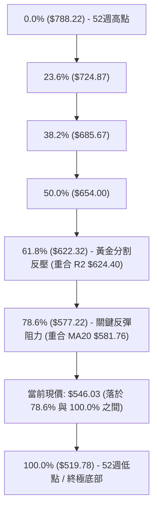

#### 斐波那契位置深度解讀：
- **當前落點**：現價 `$546.03` 處於 **78.6% ($577.22)** 與 **100.0% ($519.78)** 深度回調區間。
- **技術意義**：股價跌破 61.8% ($622.32) 與 78.6% ($577.22) 後，代表前波牛市漲幅已被大幅侵蝕。78.6% 位階（$577.22）目前與 MA20 ($581.76) 形成共振阻力，在未有效收復 $577.22 之前，技術結構維持深度修正型態。

---

## 5. 技術指標深度解讀

### 🎛️ 指標訊號總覽

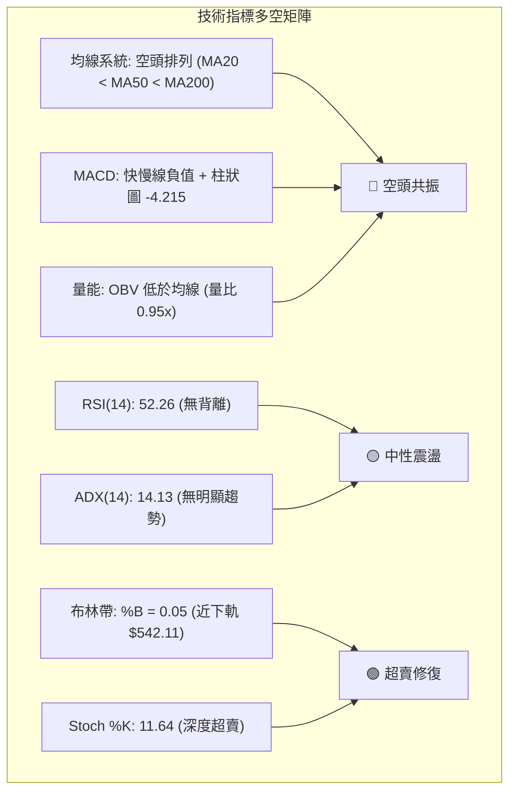

### 📈 移動平均線排列分析

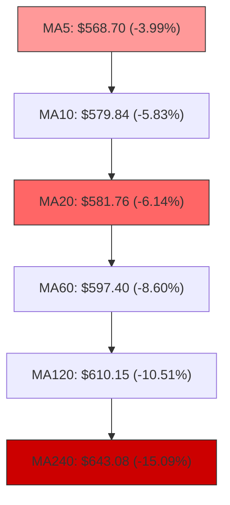

- **均線排列狀態**：短、中、長期均線呈現標準的**空頭排列**（MA5 < MA10 < MA20 < MA60 < MA120 < MA240）。
- **價格偏離度**：現價 $546.03 距離 MA20 負乖離達 -6.14%，距離 MA200 負乖離達 -12.54%，顯示空頭壓迫力道強，但短期負乖離過大亦限制了連續下殺空間。

### 📉 RSI(14) 分析

```
RSI(14) 數值進度條：
0 ─────── 30 (超賣) ──────────── 52.26 (當前) ────────── 70 (超買) ─────── 100
[████████████████████████████████░░░░░░░░░░░░░░░░░░░░░░░░░░░░░░] 52.26%
```

- **背離判斷**：
  - **頂背離**：無（近期未創出新高）。
  - **底背離**：無明顯背離。價格自 $589.85 回落至 $546.03，RSI 自 48.8 回升至 52.26，呈現微幅鈍化，但因日線週期較短，尚未構成高信度底背離結構。
- **結論**：動能處於中性平衡區，未提供方向性突破指引。

### 📊 MACD(12/26/9) 訊號解讀

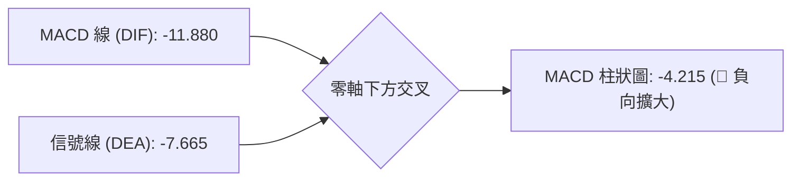

- **狀態解讀**：DIF 與 DEA 均在零軸下方運行，且 DIF 向下遠離 DEA，柱狀圖為 `-4.215`。這表明中期空頭動能仍在釋放，尚未出現金叉翻紅跡象，空方仍掌握波段主控權。

### 📦 布林通道分析

```
META 布林通道 (20, 2) 結構圖
$621.42 ┬────────────────────────────────────────── 上軌 (BB Upper)
        │
$581.76 ┼────────────────────────────────────────── 中軌 (MA20)
        │
$546.03 ┼─► [現價: $546.03 | %B: 0.05]
$542.11 ┴────────────────────────────────────────── 下軌 (BB Lower)
```

- **帶寬與位置**：上軌 $621.42、中軌 $581.76、下軌 $542.11，布林帶寬度為 $79.31。
- **%B 指標 (0.05)**：現價緊貼布林下軌（0.05 代表已位於通道底部 5% 邊界），通道未出現極端開口擴張，表明價格已進入統計學上的超賣極值區，向下空間受軌道支撐壓制。

### 💹 成交量分析（量價配合度）

- **量價關係**：最新單日成交量為 `16,348,636`，低於 20 日均量 `17,292,787`（量比 0.95x），更低於 50 日均量 `18,198,341`。
- **OBV 能量潮**：OBV 趨勢持續低於其移動平均線，表明在近期的下跌過程中，缺乏機構資金積極進場承接，量能呈現「跌時無巨量恐慌、漲時無增量跟進」的疲弱盤整特徵。

---

## 6. 動能與波動率

### ⚡ 動能評估四象限

| 象限 | 動能強度 (Momentum) | 波動率狀態 (Volatility) | 當前狀態 | 戰略解讀 |
|------|---------------------|-------------------------|:--------:|----------|
| **Q1** | 強 (ADX > 25, +DI 主導) | 低 (ATR < 2.5%) | ─ | 穩定單邊趨勢，最佳加碼機會 |
| **Q2** | 弱 (ADX < 25) | 低 (ATR < 2.5%) | ─ | 低波震盪，蓄勢盤整 |
| **Q3** | 強 (ADX > 25, -DI 主導) | 高 (ATR > 3.5%) | ─ | 恐慌主跌浪，高風險高收益 |
| **Q4** | **弱 (ADX = 14.13, -DI 主導)** | **中高 (ATR = 3.62%)** | **✓ 當前所處象限** | **空方佔優的區間震盪，謹慎觀望** |

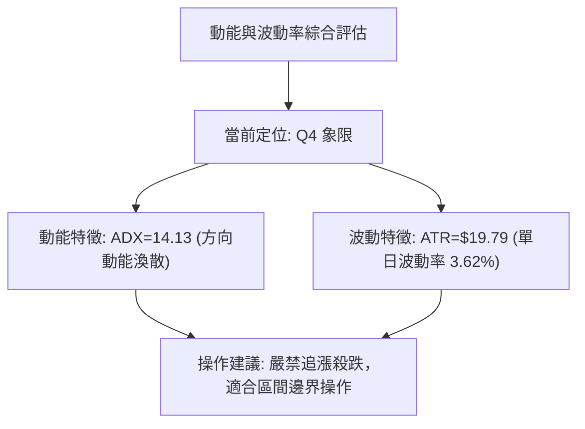

### 📊 ATR 波動率分析

- **ATR(14) 數值**：`$19.79`（佔股價比例 **3.62%**）。
- **止損與波動應用**：
  - **1.0 倍 ATR** = `$19.79`（短線日內雜訊過濾區間）。
  - **1.5 倍 ATR** = `$29.69`（波段交易推薦止損緩衝距離）。
  - **2.0 倍 ATR** = `$39.58`（突破交易結構防守距離）。

### 📐 Beta 與市場相關性

- **Beta 係數**：`1.243`。
- **市場特徵解讀**：META 的波動幅度高於標普 500 指數約 24.3%。在大盤反彈時具備較高彈性，但若大盤走弱，其回調幅度通常大於基準指數。在當前空頭排列下，高 Beta 意味著向下回撤的敏感度偏高。

---

## 7. 多時框架總結

### 📋 時框架評分表

| 時框架 | 趨勢方向 | 動能指標 | 均線排列 | 形態結構 | 綜合評分 | 戰術建議 |
|--------|----------|----------|----------|----------|:--------:|----------|
| **長期 (月線)** | 🔴 下行修正 | 🟡 中性 (跌深放緩) | 🔴 MA200 下方 | 斐波那契 78.6% 測試 | **35/100** | 長期投資者保持觀望 |
| **中期 (週線)** | 🔴 空頭壓制 | 🔴 MACD柱翻負 | 🔴 空頭排列 | 下降通道運行 | **30/100** | 逢反彈減碼或建立對沖 |
| **短期 (日線)** | 🟡 超賣震盪 | 🟢 KD/布林超賣 | 🔴 空頭排列 | 測試 S1 $540.18 | **45/100** | 短線僅限下軌極端博反彈 |

### 🔲 綜合訊號矩陣

```
┌─────────────────┬─────────────────┬─────────────────┐
│   短期訊號 (日線)  │   中期訊號 (週線)  │   長期訊號 (月線)  │
├─────────────────┼─────────────────┼─────────────────┤
│  布林 %B: 0.05   │  MACD柱: -4.215 │  52W分位: 9.8%  │
│  Stoch: 11.64   │  週量能: 退潮    │  斐波那契: 78.6%│
│  訊號: 🟡 超賣反彈│  訊號: 🔴 空方控盤│  訊號: 🔴 深度修正│
└────────┬────────┴────────┬────────┴────────┬────────┘
         │                 │                 │
         └─────────────────┼─────────────────┘
                           ▼
          多時框結論: 【中期偏空，短線尋求下軌支撐】
```

### ⚖️ 多時框收斂結論（依規則 14）

1. **行情性質判定**：當前 ADX(14) 數值為 `14.13`（< 25），嚴格定義為**盤整行情**。
2. **時框主導與衝突收斂**：在盤整格局下，市場以**日線布林通道上下軌（$542.11 ~ $621.42）**為主要震盪交易區間；中長期均線（MA50 $594.15、MA200 $624.30）則構成上方強壓天花板。
3. **唯一方向性結論**：**明確偏空，維持區間弱勢震盪**。短線雖有下軌超賣反彈機會，但受限於週線與均線空頭排列，反彈空間受限，主策略以高空防禦及逢反彈減碼為主。

---

## 8. 交易策略建議

### 🗺️ 策略決策流程圖

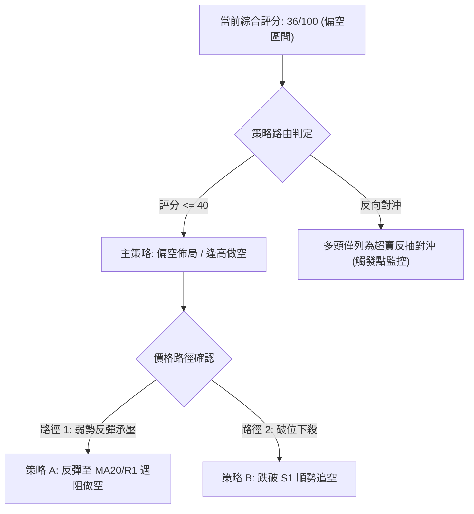

### 🧭 策略路由

> **當前主策略方向 = 偏空操作 / 逢反彈放空（依評分 36/100，處於 ≤40 偏空區間）**

### 🎯 價格情境階梯（Price Scenarios）

| 觸發條件 | 第一目標 (T1) | 後續延伸 (T2) | 情境含義 |
|----------|---------------|---------------|----------|
| **向上突破 R1 $609.12** | R2 $624.40 | R3 $642.40 | 中期空頭結構遭破壞，轉為寬幅震盪 |
| **反彈受阻於 BB中軌 $581.76** | S1 $540.18 | S2 $522.13 | 弱勢反抽確認，延續下行波段 |
| **有效跌破 S1 $540.18** | S2 $522.13 | 52W Low $519.78 | 破位下行，測試年內極端支撐 |

### 📊 情境機率分佈

| 情境 | 機率 | 主要依據 |
|------|:----:|----------|
| **弱勢反彈後承壓回落 (主情境)** | **55%** | 均線空頭排列、MACD負柱擴大、反彈量能不足 |
| **區間下緣窄幅震盪 (次情境)** | **30%** | ADX=14.13 顯示缺乏單邊殺跌動能，布林下軌 $542.11 提供緩衝 |
| **強勁 V 型反轉突破 R1 (低機率)** | **15%** | 目前 OBV 量能疲弱，缺少大級別買盤進場確認 |

### 🔴 主策略詳情（偏空佈局）

| 策略要素 | 策略 A（反彈受阻做空 - 推薦） | 策略 B（跌破 S1 順勢做空） |
|----------|-------------------------------|---------------------------|
| **進場條件** | 股價反彈至 MA20 / R1 遇阻並出現上影線 | 日線收盤實體跌破支撐 S1 |
| **進場價格** | **$581.76** (BB中軌/MA20) | **$540.18** (跌破確認) |
| **目標價 T1** | **$540.18** (支撐 S1) | **$522.13** (支撐 S2) |
| **目標價 T2** | **$522.13** (強支撐 S2) | **$519.78** (52W 低點) |
| **止損價格** | **$609.12** (阻力 R1 上方) | **$556.71** (前波小區間上緣) |
| **風險報酬比** | **1.52 : 1** (目標至T1) / **2.18 : 1** (至T2) | **1.09 : 1** (至T1) / **1.23 : 1** (至T2) |
| **成功機率** | **60%** | **50%** |
| **建議倉位** | **10% - 15%** | **5% - 10%** |

*註：策略 A 風險報酬比計算式：(進場 $581.76 - 目標T2 $522.13) / (止損 $609.12 - 進場 $581.76) = $59.63 / $27.36 = 2.18:1。*

### 🟢 反向風險觸發點（多頭反轉對沖提示）

若出現以下訊號，主偏空策略即刻失效，空頭部位應無條件平倉並轉向觀望：
1. **價位突破**：日線收盤價強勢站穩 **R1 $609.12** 上方。
2. **指標轉強**：日線 MACD 快慢線於零軸下方形成**黃金交叉**，且成交量放大至 20 日均量 1.5 倍以上（> 25.9M）。
3. **通道擴張**：布林帶向上開口，%B 指標突破 0.80。

### ⭐ 整體訊號強度評星

```
做多訊號強度：★★☆☆☆  (2.0/5星) ── 僅存短線超賣技術彈性
做空訊號強度：★★★★☆  (4.0/5星) ── 均線空頭排列與量能退潮共振
整體可信度：  ★★★★☆  (4.0/5星) ── 關鍵價位結構明確，趨勢一致性高
```

---

## 9. 風險提示與監控

### ✅ 關鍵監控指標 Checklist

```
╔══════════════════════════════════════════════════════════════╗
║              META 交易日常監控清單 (Checklist)               ║
╠══════════════════════════════════════════════════════════════╣
║ [ ] 價格是否跌破支撐 S1 $540.18 (若跌破將打開至 $522.13 空間)║
║ [ ] 價格反彈是否在 MA20 $581.76 遭遇明確阻力                 ║
║ [ ] MACD 柱狀圖是否由負轉正 (當前 -4.215，翻正代表短空減弱) ║
║ [ ] 日成交量是否超越 20日均量 17.29M (放量突破為真訊號)       ║
║ [ ] Stoch %K 是否自超賣區向上金叉 %D (短線反抽訊號)          ║
║ [ ] ADX 是否回升至 25 以上 (確認新一輪單邊趨勢啟動)          ║
╚══════════════════════════════════════════════════════════════╝
```

### ⚠️ 風險場景分析

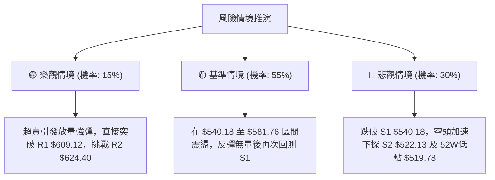

### 🛡️ 風險管理重要提醒

1. **波動率緩衝**：META 當前 ATR 為 `$19.79`，日內波動達 3.62%，任何交易策略均需預留至少 1.5 倍 ATR（約 `$29.69`）的止損緩衝，避免被短線雜訊掃出場。
2. **倉位控制準則**：因整體技術面處於空頭排列（評分 36/100），單一方向操作部位不宜超過總資金之 **15%**，嚴禁在跌破 S1 時盲目左側抄底。
3. **大盤聯動風險**：個股 Beta 值達 `1.243`，需高度關注納斯達克指數與大盤科技股整體流動性變化，若大盤同步回調，將放大個股下探 S2 $522.13 之機率。

---

## 📋 報告總結

```
╔══════════════════════════════════════════════════════════════════╗
║                    META 技術分析報告總結                         ║
╠══════════════════════════════════════════════════════════════════╣
║ 報告日期：2026-08-20                                             ║
║ 當前價格：$546.03                                                ║
║ 分析評級：🔴 偏空格局 / 弱勢震盪 (評分: 36/100)                  ║
║                                                                  ║
║ 關鍵結論：                                                       ║
║ ├─ 長期趨勢：🔴 深度回調中，運行於斐波那契 78.6% 下方            ║
║ ├─ 中期趨勢：🔴 均線空頭排列，MACD 柱負值擴大                   ║
║ ├─ 短期趨勢：🟡 緊貼布林下軌 $542.11，短線超賣醞釀微幅震盪      ║
║ ├─ 關鍵支撐：S1: $540.18  │  S2: $522.13  │  52W低: $519.78      ║
║ ├─ 關鍵阻力：R1: $609.12  │  R2: $624.40  │  R3: $642.40         ║
║ └─ 分析師目標均價：$754.14 (基本面看多，但技術面嚴重滯後)        ║
║                                                                  ║
║ 最優策略組合：                                                   ║
║ 1. 🥇 最佳機會：等待反彈至 MA20 $581.76 遇阻做空 (風報酬比 2.18) ║
║ 2. 🥈 次選機會：跌破 S1 $540.18 輕倉順勢追空至 S2 $522.13        ║
║ 3. 🥉 保守選擇：空倉觀望，等待價格放量突破 R1 $609.12 後再行佈局 ║
╚══════════════════════════════════════════════════════════════════╝
```

---

> ⚠️ **免責聲明**：本報告為 AI 自動生成之技術分析，所有數據及估算均基於提供的歷史價格資訊。本報告**僅供研究與學術參考**，**不構成任何投資建議**。投資有風險，入市需謹慎。

---

*報告生成時間：2026-08-20 ｜ 數據來源：Yahoo Finance ｜ 分析框架：多時框技術分析*