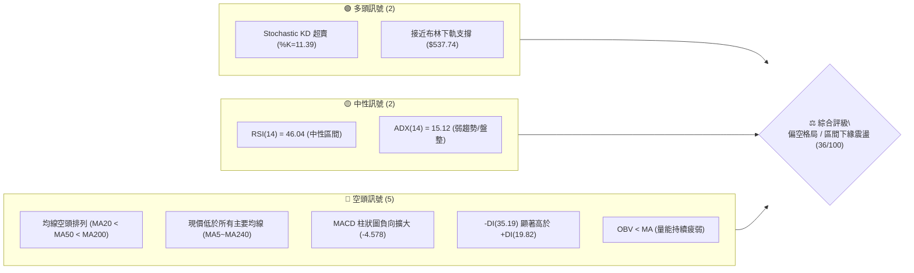
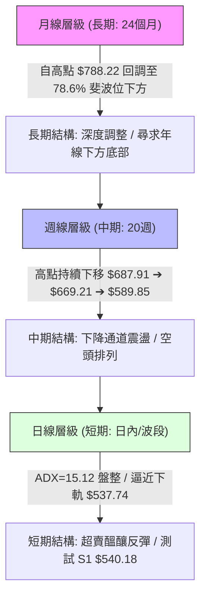
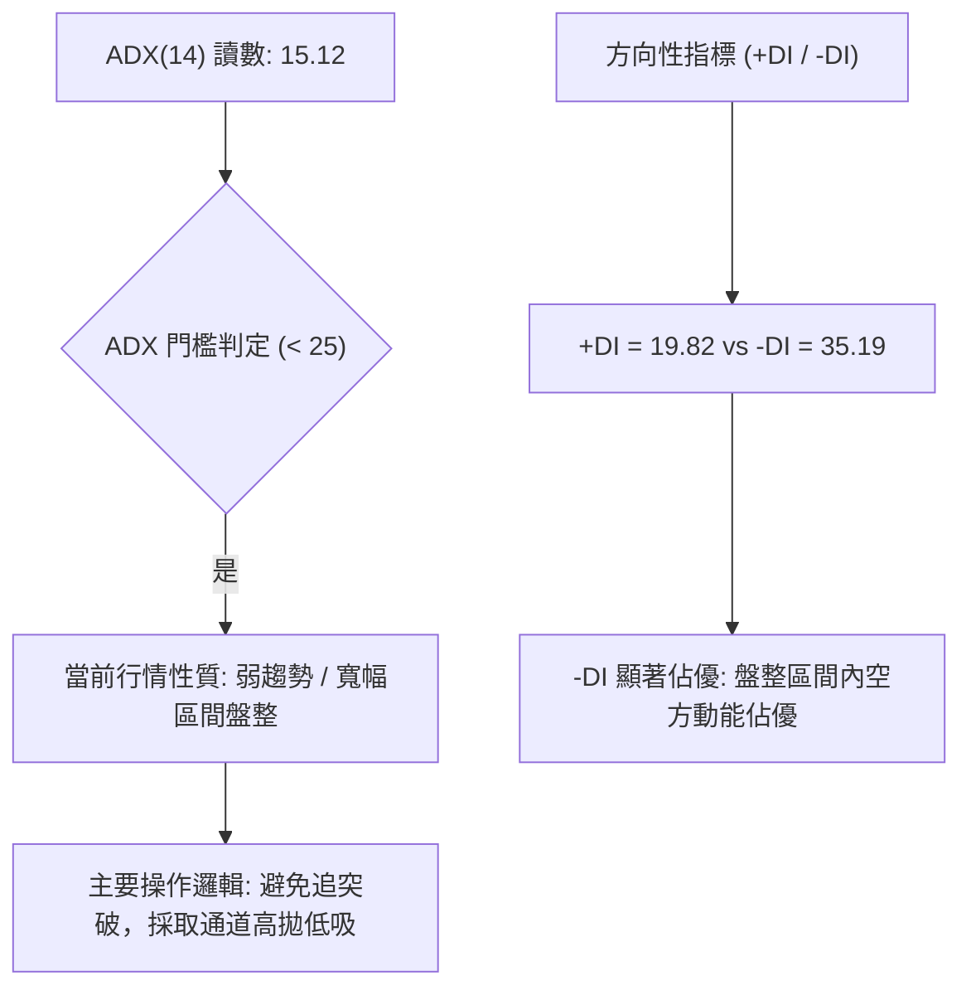
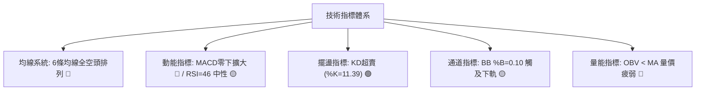
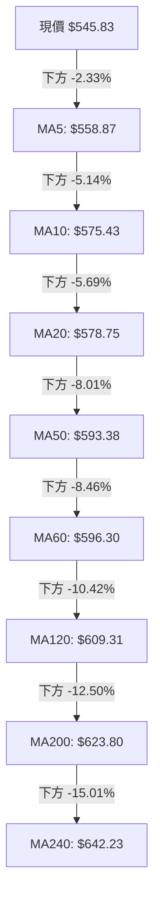
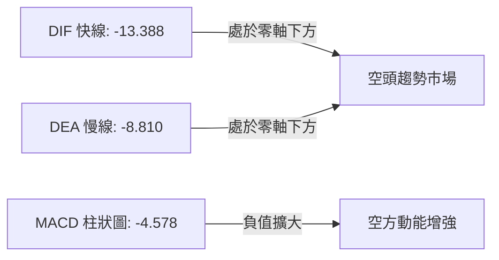
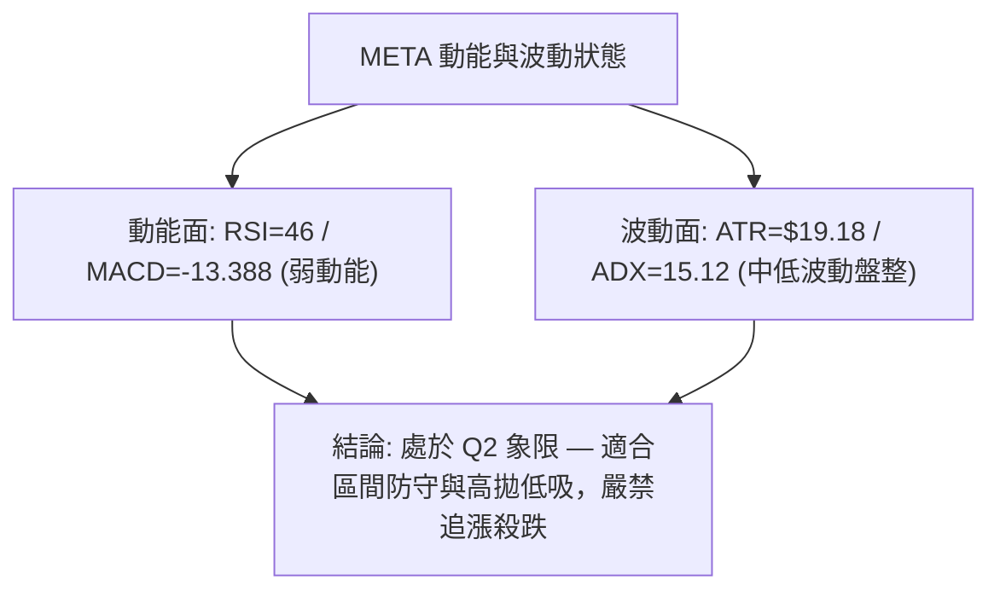
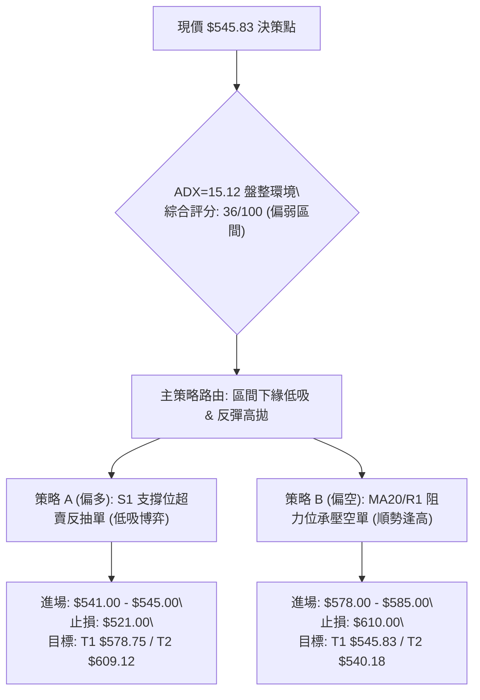
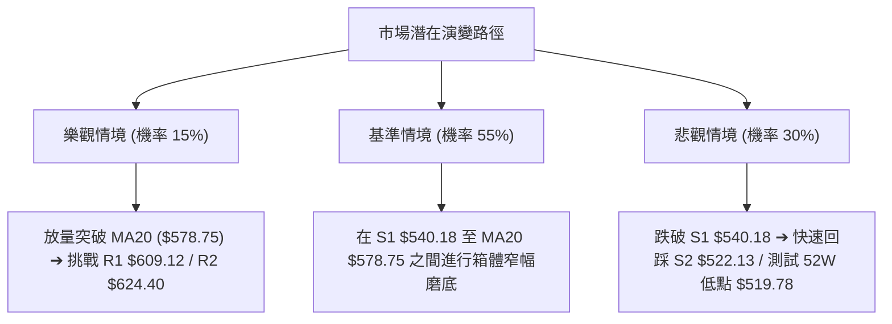

# META 技術分析報告

> **報告日期**：2026-08-21 ｜ **語言**：繁體中文 ｜ **數據來源**：Yahoo Finance ｜ **當前價格**：$545.83

---

## 目錄

| 章節 | 內容 |
|------|------|
| [1. 技術面概覽](#1-技術面概覽) | 訊號儀表板、核心指標、評分卡 |
| [2. 趨勢分析](#2-趨勢分析) | 多時框趨勢、長中短期走勢、ADX解讀 |
| [3. 圖表形態分析](#3-圖表形態分析) | 形態識別、信心度評估、K線組合、目標價 |
| [4. 支撐與阻力](#4-支撐與阻力) | 關鍵價位分布圖、阻力/支撐表、斐波那契回調 |
| [5. 技術指標深度解讀](#5-技術指標深度解讀) | 均線系統、RSI、MACD、布林通道、量價OBV |
| [6. 動能與波動率](#6-動能與波動率) | 動能四象限、ATR波動分析、Beta風險 |
| [7. 多時框架總結](#7-多時框架總結) | 時框矩陣、多時框收斂與唯一方向結論 |
| [8. 交易策略建議](#8-交易策略建議) | 策略路由、情境階梯、主策略詳解與風險回測 |
| [9. 風險提示與監控](#9-風險提示與監控) | 監控清單、情境模擬圖、風控指引 |
| [📋 報告總結](#-報告總結) | 核心總結儀表板與免責聲明 |

---

## 1. 技術面概覽

### 🎯 技術訊號儀表板



### 📊 核心指標速覽表

| 指標類別 | 指標名稱 | 當前數值 | 訊號 | 專業技術解讀 |
|:---|:---|:---|:---:|:---|
| **價格** | 當前價格 | $545.83 | 🔴 | 位於52週區間底層 9.7%（52W Low $519.78 ~ High $788.22） |
| **均線** | MA20 (月線) | $578.75 | 🔴 | 價格低於MA20達 -5.69%，短線反彈第一道動態壓制 |
| **均線** | MA50 (季線) | $593.38 | 🔴 | 價格低於MA50達 -8.01%，中期多空分水嶺承壓 |
| **均線** | MA200 (年線)| $623.80 | 🔴 | 價格低於MA200達 -12.50%，長期牛熊分界線失守 |
| **動能** | RSI(14) | 46.04 | 🟡 | 處於40–50中性格局，未見超賣，亦無明顯頂底背離 |
| **動能** | MACD (12,26,9)| -13.388 / -8.810 | 🔴 | 雙線位於零軸下方，柱狀圖 -4.578 持續擴大，空方主導 |
| **超買超賣**| Stochastic KD | 11.39 / 14.95 | 🟢 | KD指標嚴重超賣 (<20)，短線隨時具備技術性抽頭反彈動能 |
| **趨勢** | ADX (14) | 15.12 | 🟡 | ADX < 25 表明處於非單邊趨勢之盤整/震盪築底階段 |
| **趨勢方向**| DMI (+DI / -DI)| 19.82 / 35.19 | 🔴 | -DI 大幅領先 +DI，空方力量在盤整中佔據主控權 |
| **通道** | 布林通道 %B | 0.10 | 🟡 | 逼近下軌 $537.74，下軌提供短期動態物理支撐 |
| **波動** | ATR(14) | $19.18 (3.51%) | 🟡 | 每日平均波動幅度約 $19.18，波動率處於中等水平 |
| **量能** | 成交量 / 20日均量 | 13.84M / 17.24M | 🔴 | 量比 0.80x，跌勢中縮量，OBV跌破均線，買盤追價意願低 |

### 🏆 技術評分卡

```
╔══════════════════════════════════════════════════════════════╗
║              技術評分卡 — META (2026-08-21)                  ║
╠══════════════════════════════════════════════════════════════╣
║ 均線系統 (MA)     ████░░░░░░░░░░░░░░░░  20/100  🔴 極弱空頭排列 ║
║ 動能指標 (MACD/RSI)██████░░░░░░░░░░░░░░  30/100  🔴 動能偏空承壓 ║
║ 趨勢強度 (ADX/DMI) ████████░░░░░░░░░░░░  40/100  🟡 盤整空方主導 ║
║ 支撐穩定度 (S1/S2) ████████████░░░░░░░░  60/100  🟢 逼近低點支撐 ║
║ 超買超賣 (KD/BB%B) ██████████████░░░░░░  70/100  🟢 短期嚴重超賣 ║
║ 成交量能 (OBV/VOL) ██████░░░░░░░░░░░░░░  30/100  🔴 價跌量縮乏力 ║
║ 形態完整度        ████████░░░░░░░░░░░░  40/100  🟡 弱勢區間整理 ║
╠══════════════════════════════════════════════════════════════╣
║ 綜合技術評分      ███████░░░░░░░░░░░░░  36/100  🔴 偏弱盤整格局 ║
╚══════════════════════════════════════════════════════════════╝
```

---

## 2. 趨勢分析

### 🌐 多時框趨勢分析



### 📈 長期趨勢 — 12個月走勢圖（Unicode）

```
META 過去 12 個月收盤價走勢示意圖 ($)
$788.22 ┤                                                 (52W High $788.22)
$770.91 ┤                                         
$736.29 ┤ ● (2025-08)
$732.47 ┤   ●
$715.22 ┤                   ● (2026-01)
$658.91 ┤               ●
$646.67 ┤       ●   ●
$631.92 ┤                               ● (2026-05)
$611.34 ┤                           ●
$571.60 ┤                       ●
$563.29 ┤                                   ●
$556.71 ┤                                       ●
$545.83 ┤───────────────────────────────────────────● (2026-08 現價 $545.83)
$519.78 ┤                                                 (52W Low $519.78)
        └─┬───┬───┬───┬───┬───┬───┬───┬───┬───┬───┬───┬──
         08  09  10  11  12  01  02  03  04  05  06  07  08 (月份: 2025-08 至 2026-08)
```

#### 走勢特徵分析表格

| 階段區間 | 月份起訖 | 起始與結束收盤價 | 區間漲跌幅 | 核心結構與量價特徵 |
|:---|:---|:---|:---:|:---|
| **歷史峰值回落** | 2025-08 ~ 2025-11 | $736.29 ➔ $646.27 | -12.23% | 自歷史頂部 $788.22 回調，跌破高位整理平台，獲利盤出逃 |
| **年末防禦反彈** | 2025-11 ~ 2026-01 | $646.27 ➔ $715.22 | +10.67% | 次高點反抽，未能刷新前高，確立頂部雙峰阻力結構 |
| **春季加速下殺** | 2026-01 ~ 2026-03 | $715.22 ➔ $571.60 | -20.08% | 連續三個月長黑，跌破MA200長週期均線，破壞長期上升趨勢 |
| **二浪弱勢反抽** | 2026-03 ~ 2026-05 | $571.60 ➔ $631.92 | +10.55% | 均線反壓受阻於 $631.92（接近MA200/MA240），形成反彈高點 |
| **破位再尋底** | 2026-05 ~ 2026-08 | $631.92 ➔ $545.83 | -13.62% | 跌破所有短中期均線，當前下探 52 週低點附近 S1 $540.18 |

### 📊 中期趨勢（週線分析）

從近 20 週數據觀察，META 呈現標準的**高點遞減（Lower Highs）與低點遞減（Lower Lows）**之階梯式下行形態：
- **波段高點壓制**：2026-04-19 高點 $687.91 ➔ 2026-07-12 高點 $669.21 ➔ 2026-08-09 高點 $592.10。
- **波段低點下探**：2026-06-28 低點 $550.25 ➔ 2026-08-23 收盤 $545.83。

```
週線近期主要壓力/支撐結構：
  [強阻力區]  $624.40 - $642.40 (R2~R3 / MA200 均線聚集區)
       ▲
       │      $609.12 (R1 阻力位 / MA120)
  [動態均線]  $578.75 (MA20 / 布林中軌)
       ▲
       │      $545.83 (現價) ◄── 處於弱勢抵抗區間
  [關鍵支撐]  $540.18 (S1 支撐位)
       ▼
  [波段底線]  $522.13 (S2 強支撐 / 接近 52W Low $519.78)
```

### ⚡ 趨勢強度評估（ADX 解讀）



#### ADX 趨勢強度對照表

| 指標變數 | 當前數值 | 參考閾值 | 市場狀態評估 | 操作指導意義 |
|:---|:---:|:---:|:---|:---|
| **ADX(14)** | **15.12** | < 25 (弱趨勢/盤整) | 單邊趨勢耗盡，市場進入區間收斂或弱勢磨底 | 順勢突破策略失效機率高，適用震盪逆向策略 |
| **+DI (多頭動能)** | **19.82** | > 25 為強多 | 多頭買盤力道貧乏，反彈缺乏持續性買盤支持 | 多頭僅能視為超跌反彈，不可盲目追高 |
| **-DI (空頭動能)** | **35.19** | > 25 為強空 | 空頭仍牢牢掌控局部壓制權，賣壓未完全消化 | 價格反彈易在重要均線（如MA20）遭遇拋壓 |

---

## 3. 圖表形態分析

### 🔍 形態識別系統


#### 形態識別與信心度評估表

| 形態名稱 | 信心度 (%) | 判斷依據（嚴格引用數據） | 完成度 (%) | 目標價（附嚴謹幾何計算式） |
|:---|:---:|:---|:---:|:---|
| **雙頂破位下跌測幅** | **85%** | 2026-04 高點 $687.91 與 2026-07 高點 $669.21 構築雙頂，頸線跌破點約在 $608.19 | 100% (已達標) | 頸線 $608.19 - (頂部 $687.91 - 頸線 $608.19 = $79.72) = **$528.47** (現價 $545.83 已接近滿足) |
| **下降通道邊界收斂** | **75%** | 上軌連線 ($687.91 ➔ $669.21 ➔ $592.10)，下軌連線 ($571.60 ➔ $550.25 ➔ $545.83) | 80% | 通道下軌支撐位於 S1: **$540.18**；通道上軌反彈目標指向 R1: **$609.12** |
| **潛在雙重底 (W底)** | **45%** | 尋求以 2026-06 低點 $550.25 與現行 S1 $540.18 構築雙底，但尚未突破頸線 | 30% (未成形) | 訊號不足，僅作指標型觀察；若確認突破頸線 $592.10，目標價為 $592.10 + ($592.10 - $540.18) = **$644.02** (接近 R3 $642.40) |

### 🕯️ 重要K線形態分析

| 最近月份/週 | 收盤價 | 典型K線形態 | 形態量價解讀 | 技術訊號 |
|:---|:---:|:---|:---|:---:|
| **2026-07-12 (週)** | $669.21 | 假突破長上影陽線 | 週量放至 117.03M，觸及高點後引發主力出貨，反彈夭折 | 🔴 頂部確立 |
| **2026-08-02 (週)** | $556.71 | 長黑破位K線 | 週量放大至 112.10M，MACD柱狀圖暴跌至 -11.160，空頭宣洩 | 🔴 恐慌拋售 |
| **2026-08-09 (週)** | $592.10 | 超跌長下影十字星 | 探底回升測試低點買盤，成交量縮至 81.85M，空頭動能初竭 | 🟡 止跌信號 |
| **2026-08-23 (最新)**| $545.83 | 縮量陰線下探 | 收盤逼近波段低點，週量 75.12M 持續萎縮，呈現陰跌測試支撐 | 🟡 尋底整理 |

### 📉 ASCII 走勢形態示意圖

```
META 中期下降通道與雙頂破位示意圖 ($)
$687.91 ┼───● (頂1: 04-19)
        │    ╲
$669.21 ┼     ╲            ● (頂2: 07-12)
        │      ╲          ╱ ╲
$609.12 ┼───────●────────●───╲─────────── [頸線/通道上軌阻力 R1: $609.12]
        │        ╲      ╱     ╲
$578.75 ┼─────────╲────╱───────╲──────── [MA20 / 布林中軌 $578.75]
        │          ╲  ╱         ╲   ● (反彈高點 $592.10)
$550.25 ┼───────────●────────────╲─╱──── [前波低點 $550.25]
$545.83 ┼─────────────────────────●───── [現價 $545.83]
$540.18 ┼─────────────────────────────── [通道下軌支撐 S1: $540.18]
$522.13 ┼─────────────────────────────── [強支撐防線 S2: $522.13]
        └────────────────────────────────
```

### 🎯 形態目標價計算

1. **下降通道下軌支撐測幅**：
   - 形態特徵：以高點下移斜率推算，下軌支撐與數據中計算之支撐低點聚類 **S1: $540.18** 完全重合。
   - 極端下探測幅：若跌破 S1，將測試 52 週低點聚類 **S2: $522.13**（距離現價 -4.34%）。
2. **超跌反彈通道上軌測幅**：
   - 第一反彈目標（布林中軌/MA20）：**$578.75**（潛在空間 +6.03%）。
   - 形態突破目標（下降通道上軌聚類 R1）：**$609.12**（潛在空間 +11.60%）。

---

## 4. 支撐與阻力

### 🗺️ 關鍵價位分布圖（Unicode）

```
╔══════════════════════════════════════════════════════════════╗
║                     META 關鍵價位結構分布圖                  ║
╠══════════════════════════════════════════════════════════════╣
║ $788.22 ║██████████████████████████████║ 52週歷史高點 (0.0% Fib) ║
║ $642.40 ║████████████████████████      ║ 強阻力 R3 (MA240 均線密集區)║
║ $624.40 ║████████████████████          ║ 阻力 R2 (MA200 / 61.8% Fib)║
║ $609.12 ║████████████████████████      ║ 關鍵阻力 R1 (MA120 / 波段平台)║
║ $578.75 ║▒▒▒▒▒▒▒▒▒▒▒▒▒▒▒▒▒▒▒▒          ║ 動態阻力 (MA20 / 78.6% Fib)║
║ $545.83 ╠══════════════════════════════╣ ◄ 現價 ($545.83)         ║
║ $540.18 ║▓▓▓▓▓▓▓▓▓▓▓▓▓▓▓▓▓▓▓▓          ║ 近期核心支撐 S1 (-1.04%)   ║
║ $522.13 ║████████████████████████████  ║ 強支撐防線 S2 (-4.34%)     ║
║ $519.78 ║██████████████████████████████║ 52週最低點 (100.0% Fib)  ║
╚══════════════════════════════════════════════════════════════╝
```

### 🚧 阻力位分析表

所有阻力位嚴格引用系統計算之波段高點聚類與均線重合點：

| 阻力級別 | 具體價位 | 形成技術依據 | 突破難度評估 | 策略重要性 |
|:---|:---:|:---|:---:|:---:|
| **R1 (關鍵阻力)** | **$609.12** | 近一年多次波段反彈頂部聚類、MA120 ($609.31) 黏合處 | ★★★☆☆ (高) | 空頭防守第一線，站穩方能扭轉中期空頭格局 |
| **R2 (重大阻力)** | **$624.40** | MA200 牛熊分界線 ($623.80)、斐波那契 61.8% ($622.32) | ★★★★☆ (極高) | 中長期多空轉換關鍵樞紐，拋壓極為沉重 |
| **R3 (強阻力)** | **$642.40** | MA240 超長週期均線 ($642.23)、2026-05 反彈波段頂部 | ★★★★★ (極難) | 中期多頭反轉的終極目標與波段解套阻力位 |

### 🛡️ 支撐位分析表

所有支撐位嚴格引用系統計算之波段低點聚類：

| 支撐級別 | 具體價位 | 形成技術依據 | 守住機率評估 | 策略重要性 |
|:---|:---:|:---|:---:|:---:|
| **S1 (核心支撐)** | **$540.18** | 近一年波段低點密集聚類、布林下軌 ($537.74) 緩衝區 | 65% | 短線多頭防守底線，守住則維持區間震盪築底 |
| **S2 (強支撐)** | **$522.13** | 52 週最低點聚類 ($519.78) 上方最後防線 | 85% | 跌破將引發停損賣壓並創 52 週新低，不容有失 |

### 📐 斐波那契回調位分析

依據 52 週完整波動區間（高點 **$788.22** ➔ 低點 **$519.78**，垂直落差 $268.44）計算：

| 斐波那契回調位 | 對應精確價位 | 技術位置與解讀 | 現價相對關係 |
|:---|:---:|:---|:---:|
| **0.0% (高點)** | **$788.22** | 52 週歷史高點，長期極限壓力 | 距現價 +44.41% |
| **23.6%** | **$724.87** | 高位第一道弱支撐（已徹底跌破） | 距現價 +32.80% |
| **38.2%** | **$685.67** | 2026-04 高點反抽極限阻力 | 距現價 +25.62% |
| **50.0%** | **$654.00** | 多空平衡中軸位置 | 距現價 +19.82% |
| **61.8% (黃金分割)**| **$622.32** | 關鍵黃金分割位，與 R2 ($624.40) 及 MA200 重合 | 距現價 +14.01% |
| **78.6%** | **$577.22** | 深度回調防守位，與 MA20 ($578.75) 形成重疊壓制 | 距現價 +5.75% |
| **100.0% (低點)** | **$519.78** | 52 週最低點，終極底部支撐 | 距現價 -4.77% |

> **當前價位斐波那契結構定位**：
> 現價 **$545.83** 目前處於 **78.6% 回調位 ($577.22)** 與 **100.0% 低點 ($519.78)** 之間的極深回調區（位於區間下緣 9.7%）。這代表股價已回吐過去一年絕大部分漲幅，下檔空間受 $519.78 限制，上檔則受制於 $577.22 第一道黃金阻力。

---

## 5. 技術指標深度解讀

### 🎛️ 指標訊號總覽



### 📈 移動平均線排列分析



- **均線排列狀態**：當前呈現標準且嚴格的**空頭排列**（$MA5 < MA10 < MA20 < MA50 < MA60 < MA120 < MA200 < MA240$）。
- **乖離率分析**：現價距離 MA20 乖離率為 **-5.69%**，距離 MA200 乖離率達 **-12.50%**。短線負乖離已顯著拉大，具備向 MA20 ($578.75) 靠攏修復之技術需求。

### 📉 RSI(14) 分析

```
RSI(14) 數值展示：
0 ──────────── 30 ────────────────── 50 ────── 70 ─────────── 100
[  超賣區間   ] |        [46.04]      |  [    超買區間    ]
░░░░░░░░░░░░░░░░▓▓▓▓▓▓▓▓▓▓▓▓▓▓▓░░░░░░░░░░░░░░░░░░░░░░░░░░░░░░░
```

- **區間判定**：RSI(14) 當前讀數為 **46.04**，位於 30–70 之間的中性震盪偏弱區。
- **背離判斷**：
  - **日線層級**：價格下探 $545.83 接近前低，RSI 維持在 46.04，**無明顯頂背離或底背離**。
  - **週線層級**：週線 RSI 自 2026-08-02 的 22.9 回升至 46.0，伴隨價格低位震盪，呈現微弱的隱性底背離雛形，但尚未獲突破確認。

### 📊 MACD(12,26,9) 訊號解讀



- **數值狀態**：DIF (-13.388) < DEA (-8.810)，雙線均處於零軸以下深水區。
- **動能演變**：MACD 柱狀圖為 **-4.578**，負向柱體連續兩週擴大（前週為 +0.204），顯示短期反彈動能衰竭，空頭重新佔據發球權。

### 📦 布林通道分析

```
META 布林通道寬度與現價定位示意圖 ($)
$619.75 ┼────────────────────────────── BB 上軌 (阻力)
        │
$578.75 ┼────────────────────────────── BB 中軌 (MA20 基準線)
        │
$545.83 ┼──────────●─────────────────── 現價 ($545.83, %B = 0.10)
$537.74 ┼────────────────────────────── BB 下軌 (支撐)
        └──────────────────────────────
```

- **通道帶寬**：上軌 $619.75 與下軌 $537.74 之間帶寬為 $82.01 (15.0%)。
- **%B 位置**：當前 **%B = 0.10**，價格緊貼下軌運行，尚未發生開口向下發散之極端崩跌，而是處於通道下邊界之擠壓狀態，易觸發下軌技術反彈。

### 💹 成交量分析（量價配合度）

- **量能萎縮**：最新單日成交量為 **13.84M**，相較 20 日均量 **17.24M**（量比 **0.80x**）呈現明顯縮量；50 日均量為 **18.15M**。
- **量價配合**：呈現典型「**價跌量縮**」特徵，說明在 $545.00 附近市場主動性殺跌盤已開始減少，但同時多頭買盤亦顯得格外謹慎。
- **OBV 趨勢**：OBV 處於 MA 之下且持續走低，量能指標驗證了價格的疲弱，確認當前反彈難以形成趨勢性牛市，僅能以波段或區間看待。

---

## 6. 動能與波動率

### ⚡ 動能評估四象限

| 象限 | 動能強度 (MACD/RSI) | 波動率水平 (ATR/BB) | 當前判定 | 市場特徵與應對策略 |
|:---:|:---:|:---:|:---:|:---|
| **Q1 (最佳擴張)** | 強 (多頭) | 低波動 | — | 趨勢初升段，適合加碼突破單 |
| **Q2 (震盪沉悶)** | 弱 (中性偏空) | 低/中波動 | **✓ (META 所在)** | **ADX=15.12, ATR=3.51%，市場處於縮量探底與區間拉鋸** |
| **Q3 (劇烈洗盤)** | 強 (單邊) | 高波動 | — | 主升段或崩跌段，順勢追單 |
| **Q4 (恐慌出逃)** | 弱 (極空) | 高波動 | — | 恐慌拋售段，應完全空倉觀望 |



### 📊 ATR 波動率分析

- **ATR(14) 絕對值**：**$19.18**。
- **波動百分比**：佔現價之 **3.51%**。
- **風控與止損建議**：
  - 日內波動安全緩衝區：$1.0 \times \text{ATR} = \mathbf{\$19.18}$。
  - 波段交易止損寬度：建議設定為 $1.5 \times \text{ATR} = \mathbf{\$28.77}$，可有效過濾盤中毛刺與假突破。

### 📐 Beta 與市場相關性

- **Beta 係數**：**1.243**。
- **解讀**：META 屬於高彈性成長股，波動度高於標普500指數約 24.3%。在大盤弱勢時具有超跌特徵，但在市場情緒回暖時反彈彈性亦顯著優於大盤。

---

## 7. 多時框架總結

### 📋 時框架評分表

| 時框架 | 趨勢方向 | 動能狀態 | 均線系統排列 | 形態結構 | 時框綜合評分 | 交易指導建議 |
|:---|:---:|:---:|:---:|:---:|:---:|:---|
| **月線 (長期)** | 🟡 深度回調 | 弱勢 | 跌破 MA20，測試年線 | 78.6% 斐波那契回撤 | **45/100** | 長期價值區浮現，分批建底倉 |
| **週線 (中期)** | 🔴 下行趨勢 | 偏空 | 空頭排列 (MA20 < MA50) | 下降通道運行 | **32/100** | 中期受壓於 R1，反彈逢高減磅 |
| **日線 (短期)** | 🟡 區間震盪 | KD超賣 | 均線全空，負乖離大 | 逼近下軌 S1 支撐 | **38/100** | 區間下緣博反彈，快進快出 |

### 🔲 綜合訊號矩陣

```
┌─────────────────────────────────────────────────────────────┐
│ META 多時框架訊號一致性矩陣                                │
├──────────────┬──────────────┬──────────────┬────────────────┤
│ 指標類別     │ 短期 (日線)  │ 中期 (週線)  │ 長期 (月線)    │
├──────────────┼──────────────┼──────────────┼────────────────┤
│ 趨勢方向     │ 🟡 區間盤整  │ 🔴 空頭下行  │ 🟡 深度修正    │
│ 均線系統     │ 🔴 空頭排列  │ 🔴 空頭排列  │ 🔴 跌破MA20    │
│ 動能 (MACD)  │ 🔴 柱狀擴大  │ 🔴 零下運行  │ 🟡 走平弱化    │
│ 擺盪 (RSI/KD)│ 🟢 KD極超賣  │ 🟡 RSI中性   │ 🟡 RSI中性     │
│ 通道邊界     │ 🟢 觸及下軌  │ 🔴 處於中軌下│ 🟡 中軌下方    │
└──────────────┴──────────────┴──────────────┴────────────────┘
```

### ⚖️ 多時框收斂結論

> **依多時框收斂規則（嚴格要求 14）判定**：
> 1. **行情性質判定**：當前 ADX(14) = **15.12 (< 25)**，明確定義為**非趨勢之「盤整/震盪行情」**。
> 2. **主導時框收斂**：在盤整行情中，日線布林通道 ($537.74 \sim \$619.75$) 與關鍵支撐阻力 ($S1: \$540.18 \sim R1: \$609.12$) 為主要交易區間。中長期空頭趨勢限制了向上反彈空間，但短期超賣指標與 S1 支撐限制了向下空間。
> 3. **唯一方向性結論**：**【中性偏弱 — 區間下緣超跌反彈交易】**。操作重心應放在以 S1 為防守的短線反彈，或在反彈遇阻 R1/MA20 時順應中期趨勢進行防禦。

---

## 8. 交易策略建議

### 🗺️ 策略決策流程圖



### 🧭 策略路由（依評分卡分流）

**當前主策略方向 = 【偏空震盪中的區間波段交易】（依評分 36/100 判定）**

由於評分處於偏空格局且 ADX < 25（盤整市），策略不宜追空，亦不宜盲目長多，而應以**「下檔 S1 支撐防守反彈」**與**「上檔 MA20/R1 阻力逢高布空」**之區間思維為主。

### 🎯 價格情境階梯（Price Scenarios）

所有觸發價位嚴格引用數據中之聚類價位：

| 觸發條件 | 下一目標價 | 後續延伸目標 | 情境含義與技術解讀 |
|:---|:---:|:---:|:---|
| **強勢突破 R1 ($609.12)** | **R2 ($624.40)** | **R3 ($642.40)** | 突破 MA120/MA200 重大壓力，中期空頭結構徹底反轉 |
| **突破 MA20 ($578.75)** | **R1 ($609.12)** | **R2 ($624.40)** | 修復短期負乖離，由弱勢陰跌轉為寬幅震盪 |
| **守穩 S1 ($540.18)** | **MA20 ($578.75)**| **R1 ($609.12)** | 於 52 週低點上方構築雙底，維持區間築底格局 |
| **有效跌破 S1 ($540.18)** | **S2 ($522.13)** | **$519.78 (52W Low)**| 區間破位，下探 52 週最低點進行終極防禦測試 |

### 📊 情境機率分佈

| 運行情境 | 發生機率 | 主要技術與量價依據 |
|:---|:---:|:---|
| **區間震盪築底 (主情境)** | **55%** | ADX=15.12 支持震盪；KD 嚴重超賣 (%K=11.39) 限制殺跌；S1 $540.18 買盤支撐 |
| **反彈受阻再探底 (空頭情境)**| **30%** | 均線全空頭排列；MACD 柱狀負向擴大 (-4.578)；OBV 持續疲弱買盤不足 |
| **向上反轉突破 (多頭情境)** | **15%** | 需放量站穩 MA20 ($578.75) 並突破 R1 ($609.12)，目前成交量能未見配合 |

### 🟢 主策略詳情

#### 策略 A：S1 支撐超賣反彈多單（區間操作）
- **適用場景**：KD 極度超賣下，依託 S1 $540.18 支撐進行均值回歸交易。

#### 策略 B：MA20/反彈阻力位承壓空單（順勢逢高操作）
- **適用場景**：股價反彈至布林中軌 MA20 或 78.6% Fib 阻力受阻回落。

| 策略要素 | 策略 A (超跌反彈多單) | 策略 B (逢高沽空單) |
|:---|:---:|:---:|
| **進場條件** | 價格回踩 S1 $540.18 不破且 KD 出現低檔金叉 | 價格反彈至 MA20 附近出現上影線滯漲 |
| **精確進場點** | **$542.00** (在 S1 $540.18 上方 0.3%) | **$578.75** (精確對齊 MA20 均線價位) |
| **目標價 T1** | **$578.75** (MA20 / 潛在 +6.78%) | **$545.83** (當前波段低點 / 潛在 +5.69%) |
| **目標價 T2** | **$609.12** (R1 阻力位 / 潛在 +12.38%) | **$540.18** (S1 核心支撐 / 潛在 +6.66%) |
| **嚴格止損點** | **$521.00** (跌破 S2 $522.13 止損, -3.87%) | **$594.00** (突破 MA50 $593.38 止損, -2.63%) |
| **風險報酬比** | **1 : 1.75** (至 T1) / **1 : 3.20** (至 T2) | **1 : 2.16** (至 T1) / **1 : 2.53** (至 T2) |
| **預估勝率** | **55%** | **60%** |
| **建議倉位** | **10% - 15% (輕倉試單)** | **15% - 20% (標準波段倉)** |

### 🔴 反向風險觸發點（對沖與風控提示）

1. **多頭策略失效點**：若日線收盤價跌破 **S1: $540.18** 並進一步擊穿 **S2: $522.13**，所有抄底反彈多單必須無條件止損出局，標誌著空頭展開新一輪主跌段。
2. **空頭防守警報點**：若價格放量突破 **MA20 ($578.75)** 且站上 **R1: $609.12**，代表下降通道被向上粉碎，空頭部位必須立即停損或平倉避險。

### ⭐ 整體訊號強度評星

```
做多訊號強度：★★☆☆☆  (2.5/5星 - 僅限超賣反彈)
做空訊號強度：★★★☆☆  (3.5/5星 - 中期趨勢偏空)
整體可信度：  ★★★★☆  (4.0/5星 - 價位聚類清晰)
```

---

## 9. 風險提示與監控

### ✅ 關鍵監控指標 Checklist

```
╔══════════════════════════════════════════════════════════════╗
║                   META 交易監控指標 Checklist                ║
╠══════════════════════════════════════════════════════════════╣
║ [ ] 價位監控：現價是否守穩 S1 $540.18 (跌破則警報啟動)       ║
║ [ ] 動能監控：Stochastic KD %K 是否向上突破 %D 形成黃金交叉  ║
║ [ ] 均線監控：反彈時能否觸及並挑戰 MA20 ($578.75) 壓制       ║
║ [ ] 量能監控：日成交量是否放大至 20日均量 (17.24M) 以上      ║
║ [ ] 波動監控：ATR 是否異常放大至 $25 以上 (代表單邊行情爆發) ║
║ [ ] 外部市場：Beta 1.243，密切監控大盤科技股整體風險偏好     ║
╚══════════════════════════════════════════════════════════════╝
```

### ⚠️ 風險場景分析



### 🛡️ 風險管理重要提醒

1. **波動管理**：META 當前 ATR 為 **$19.18**，日內震幅接近 3.5%。單筆交易最大虧損額度應嚴格控制在總投資組合淨值的 **1.0% - 1.5%** 以內。
2. **避免盲目追單**：在 ADX = 15.12 的盤整環境下，追漲或追跌極易被雙向打臉。嚴格遵守「在 S1 支撐附近低吸，在 MA20/R1 阻力附近高拋」之紀律。
3. **分析師共識參考**：華爾街 57 位分析師目標價均值為 **$754.14**（最低 $580.00，最高 $1000.00）。基本面長期評級為 *Strong Buy*，說明當前價格下跌主要是技術性與市場情緒壓制，跌破 $540.18 進入 $520.00 區間將提供長線價值投資者極佳的安全邊際。

---

## 📋 報告總結

```
╔══════════════════════════════════════════════════════════════╗
║                 META 技術分析報告總結儀表板                  ║
╠══════════════════════════════════════════════════════════════╣
║ 報告日期：2026-08-21               當前價格：$545.83         ║
║ 分析評級：⚖️ 偏弱盤整 / 區間下緣超賣 (技術評分: 36/100)      ║
╠══════════════════════════════════════════════════════════════╣
║ 關鍵維度結論：                                               ║
║ ├─ 長期趨勢 (月線)：🔴 深度調整，回吐至 78.6% Fib 下方       ║
║ ├─ 中期趨勢 (週線)：🔴 空頭排列，處於下降通道運行           ║
║ ├─ 短期趨勢 (日線)：🟡 弱勢盤整 (ADX=15.12)，KD嚴重超賣     ║
║ ├─ 核心支撐位    ：S1: $540.18  ｜ 強支撐 S2: $522.13        ║
║ ├─ 核心阻力位    ：MA20: $578.75 ｜ 關鍵阻力 R1: $609.12     ║
║ └─ 華爾街目標均價：$754.14 (隱含極大基本面折價修復空間)      ║
╠══════════════════════════════════════════════════════════════╣
║ 最優策略配置組合：                                           ║
║ 1. 🥇 最佳波段機會：依託 S1 $540.18 支撐，輕倉博弈反抽       ║
║    進場 $542.00 ➔ 目標 $578.75 / $609.12 ➔ 止損 $521.00     ║
║ 2. 🥈 最佳順勢機會：反彈至 MA20 $578.75 阻力承壓時建立空單   ║
║    進場 $578.75 ➔ 目標 $545.83 / $540.18 ➔ 止損 $594.00     ║
║ 3. 🥉 保守觀望選擇：等待價格有效突破 $609.12 或確認 $522 雙底║
╚══════════════════════════════════════════════════════════════╝
```

---

> ⚠️ **免責聲明**：本報告為技術分析研究成果，所有數據、指標計算、圖表及價位分析均基於市場歷史行情數據。本報告**僅供學術研究與投資參考**，**不構成任何要約、招攬或具體投資建議**。金融市場瞬息萬變，交易具有高度風險，投資人應獨立評估風險並自行承擔盈虧。

---

*報告生成時間：2026-08-21 ｜ 數據來源：Yahoo Finance ｜ 分析框架：多時框架量化技術分析系統*