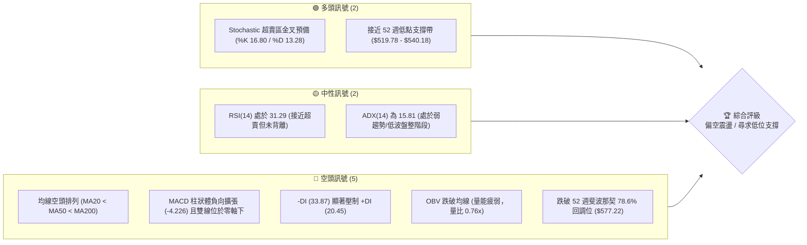
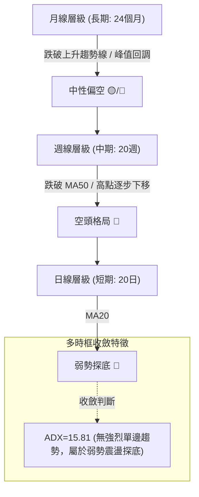
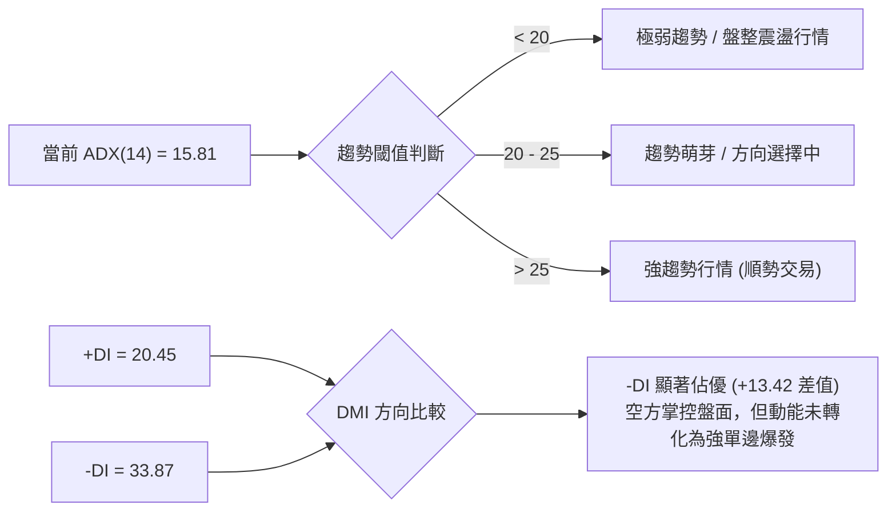
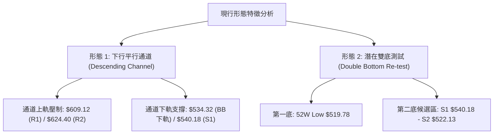
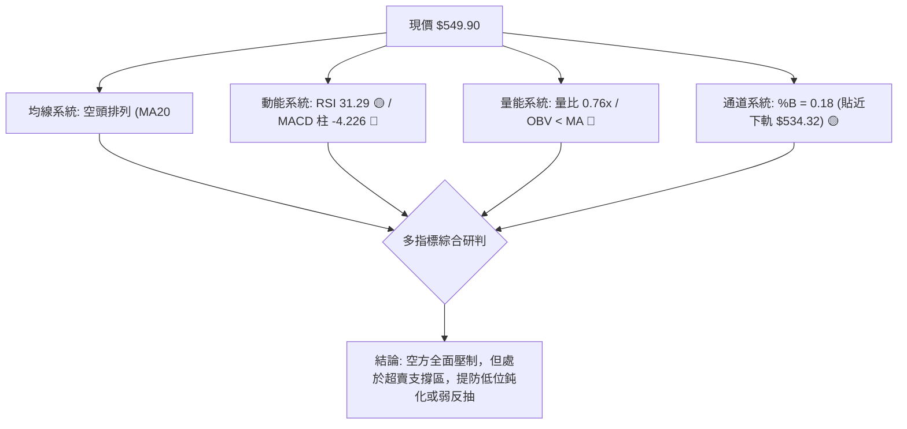
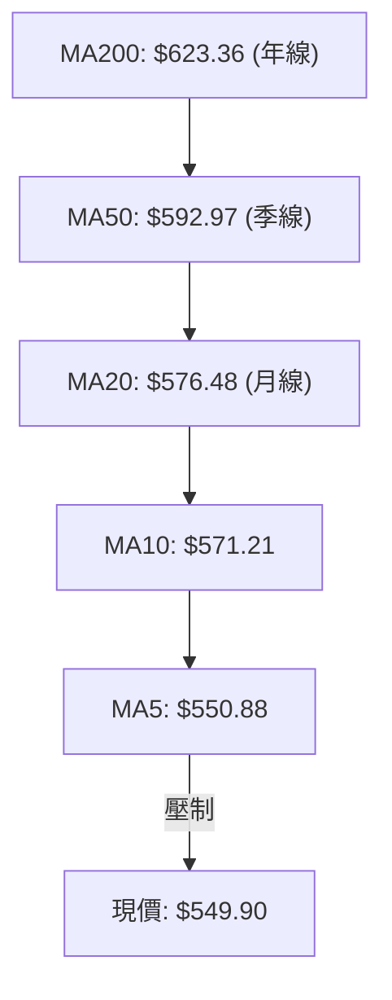
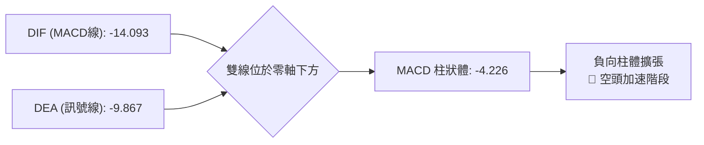
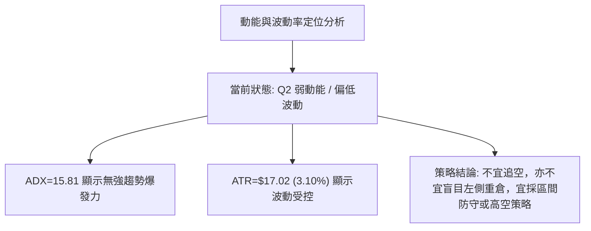
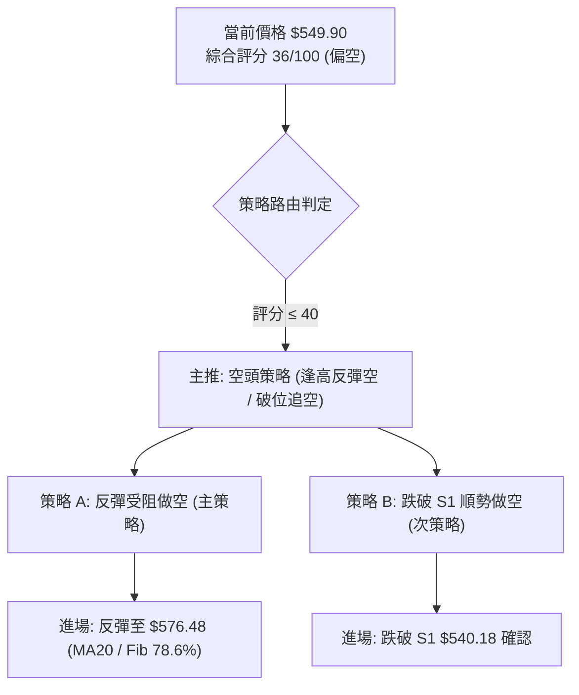
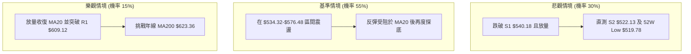

# META 技術分析報告

> **報告日期**：2026-08-22 ｜ **語言**：繁體中文 ｜ **數據來源**：Yahoo Finance ｜ **當前價格**：$549.90

---

## 目錄

| 章節 | 內容 |
|------|------|
| [1. 技術面概覽](#1-技術面概覽) | 訊號儀表板、核心指標、評分卡 |
| [2. 趨勢分析](#2-趨勢分析) | 多時框趨勢、長中短期走勢、ADX 解讀 |
| [3. 圖表形態分析](#3-圖表形態分析) | 形態識別、K線組合、形態目標價 |
| [4. 支撐與阻力](#4-支撐與阻力) | 關鍵價位分佈、斐波那契回調 |
| [5. 技術指標深度解讀](#5-技術指標深度解讀) | MA/RSI/MACD/布林/成交量 |
| [6. 動能與波動率](#6-動能與波動率) | 動能評估四象限、ATR、Beta |
| [7. 多時框架總結](#7-多時框架總結) | 時框架評分矩陣、收斂結論 |
| [8. 交易策略建議](#8-交易策略建議) | 策略路由、多空情境、風險報酬比 |
| [9. 風險提示與監控](#9-風險提示與監控) | 監控清單、情境推演、風控規則 |
| [📋 報告總結](#-報告總結) | 核心結論與策略彙整 |

---

## 1. 技術面概覽

### 🎯 技術訊號儀表板



---

### 📊 核心指標速覽表

| 指標類別 | 指標名稱 | 當前數值 | 訊號 | 解讀 |
|----------|----------|----------|:---:|------|
| **價格** | 現價 (Current Price) | $549.90 | 🔴 | 位於 52 週區間 11.2% 低檔，距高點回撤 30.2% |
| **均線** | MA20 (月線) | $576.48 | 🔴 | 現價在 MA20 下方 -4.61%，短期下行壓力沉重 |
| **均線** | MA50 (季線) | $592.97 | 🔴 | 現價在 MA50 下方 -7.26%，中期趨勢轉弱 |
| **均線** | MA200 (年線) | $623.36 | 🔴 | 現價在 MA200 下方 -11.78%，跌破長期生命線 |
| **動能** | RSI(14) | 31.29 | 🟡 | 逼近 30 超賣門檻，尚未出現明確底背離訊號 |
| **動能** | MACD (12,26,9) | -14.093 / -9.867 | 🔴 | DIF < DEA 且 Hist 為 -4.226，空方動能主導 |
| **動能** | Stochastic (14,3,3) | %K 16.80 / %D 13.28 | 🟢 | 進入深度超賣區 (<20)，存在技術性反抽動能 |
| **趨勢** | ADX(14) / DMI | ADX 15.81 (-DI 33.87) | 🔴 | ADX < 25 屬盤整格局，但 -DI 佔據絕對主導 |
| **通道** | Bollinger Bands | 上 $618.65 / 下 $534.32 | 🟡 | %B = 0.18，價格緊貼下軌運行，通道趨於收斂 |
| **量能** | 成交量 / OBV | 13.18M (20日均量 17.33M) | 🔴 | 量比 0.76x，OBV < MA，反彈動能缺乏資金確認 |
| **波動** | ATR(14) | $17.02 (3.10%) | 🟡 | 每日平均波動約 17 美元，短線波動度溫和 |

---

### 🏆 技術評分卡

```
╔══════════════════════════════════════════════════════════════════╗
║              META 技術面綜合評分卡 (2026-08-22)                  ║
╠══════════════════════════════════════════════════════════════════╣
║ 趨勢強度 (Trend)      ██████░░░░░░░░░░░░░░  30/100  🔴 空頭主導  ║
║ 動能指標 (Momentum)   ████████░░░░░░░░░░░░  40/100  🟡 超賣醞釀  ║
║ 支撐穩定度 (Support)  ██████████░░░░░░░░░░  50/100  🟡 臨近支撐  ║
║ 成交量配合 (Volume)   ██████░░░░░░░░░░░░░░  30/100  🔴 量能萎縮  ║
║ 形態完整度 (Pattern)  ████████░░░░░░░░░░░░  40/100  🟡 下行通道  ║
║ 均線排列 (MAs)        ████░░░░░░░░░░░░░░░░  20/100  🔴 空頭排列  ║
╠══════════════════════════════════════════════════════════════════╣
║ 綜合技術評分          ███████░░░░░░░░░░░░░  36/100  🔴 偏空震盪  ║
╚══════════════════════════════════════════════════════════════════╝
```

---

## 2. 趨勢分析

### 🌐 多時框趨勢分析



---

### 📈 長期趨勢 — 12個月走勢圖（Unicode）

以下展示過去 12 個月（2025-08 至 2026-08）之月線收盤走勢與關鍵轉折點：

```
META 月線價格走勢圖（2025-08 至 2026-08）
價格軸 ($)
$788.22 ┤ (52W High: $788.22)
$736.29 ┤ ●(25-08: $736.29)
$732.47 ┤   ●(25-09: $732.47)
$715.22 ┤                     ●(26-01: $715.22 次高點)
$658.91 ┤             ●(25-12)
$646.67 ┤       ●(25-10)●(25-11)    ●(26-02: $647.03)
$631.92 ┤                                   ●(26-05: $631.92 反彈高點)
$611.34 ┤                             ●(26-04)
$571.60 ┤                           ●(26-03)
$563.29 ┤                                         ●(26-06: $563.29)
$556.71 ┤                                           ●(26-07: $556.71)
$549.90 ┤━━━━━━━━━━━━━━━━━━━━━━━━━━━━━━━━━━━━━━━━━━━━━●← 現價 ($549.90)
$519.78 ┤ (52W Low: $519.78)
         └─────────────────────────────────────────────────────────────
          08  09  10  11  12  01  02  03  04  05  06  07  08 (月份)
```

#### 走勢階段特徵分析

| 階段區間 | 時間段 | 價格起迄 | 漲跌幅 | 結構特徵與量價解讀 |
|----------|--------|----------|:------:|-------------------|
| **階段 I：高位築頂** | 2025-08 ～ 2025-09 | $736.29 → $732.47 | -0.52% | 於 52W 高點 $788.22 下方高檔盤整，量能開始背離 |
| **階段 II：首次快速去槓桿** | 2025-10 ～ 2025-11 | $732.47 → $646.27 | -11.77% | 跌破短期支撐，於 $646 附近尋求均線支撐 |
| **階段 III：次級反彈頂部** | 2025-12 ～ 2026-01 | $646.27 → $715.22 | +10.67% | 形成次高點 $715.22，確立週線級別 Lower High |
| **階段 IV：波段下行破位** | 2026-02 ～ 2026-03 | $715.22 → $571.60 | -20.08% | 快速下殺跌破 $600 整數關卡，回測前波低檔 |
| **階段 V：弱勢反抽受阻** | 2026-04 ～ 2026-05 | $571.60 → $631.92 | +10.55% | 反彈於斐波那契 61.8% ($622.32) 附近遇阻回落 |
| **階段 VI：陰跌尋底** | 2026-06 ～ 2026-08 | $631.92 → $549.90 | -12.98% | 連續 3 個月收黑，現價逼近 52 週低點區間 |

---

### 📊 中期趨勢（週線分析）

從近 20 週數據觀察，價格在 2026-07-12 觸及波段反彈高點 $669.21（RSI 達 68.7，MACD 柱 +11.167）後，隨即遭遇大量拋壓（當週成交量高達 1.17 億股）。隨後展開連續 6 週的震盪下行：

```
中期週線價格波段結構：
$669.21 (07-12) ──┐
                  ▼
          $646.01 (07-19) ──┐
                            ▼
                    $595.19 (07-26) ──┐
                                      ▼
                              $556.71 (08-02) ──┐ (短暫反抽 $592.10)
                                                ▼
                                        $549.90 (08-23 收盤現價)
```

- **週線 MACD 狀態**：MACD 柱狀體由 2026-08-16 的 `+0.204` 再次轉負至 `-4.226`，顯示反彈動能衰竭。
- **週線 RSI 狀態**：由 48.8 降至 31.3，重回弱勢空方區。

---

### ⚡ 趨勢強度評估（ADX 解讀）



#### ADX 趨勢強度量化對照表

| 指標名稱 | 當前讀數 | 標準門檻 | 狀態評估 | 交易意涵 |
|----------|:--------:|:--------:|:--------:|----------|
| **ADX(14)** | **15.81** | < 25.0 | 弱趨勢 / 盤整 | 避免使用單邊突破追單策略，優先採用區間邊界操作 |
| **+DI (14)** | **20.45** | > 25.0 偏多 | 多方動能弱 | 買盤缺乏連續性，反彈多為空頭回補而非主動買盤 |
| **-DI (14)** | **33.87** | > 25.0 偏空 | 空方掌控 | 賣方主導價格走勢，上方均線壓制有效 |

---

## 3. 圖表形態分析

### 🔍 形態識別系統



#### 形態信心度與目標價評估表

| 形態名稱 | 信心度 | 判斷依據（嚴格引用數據） | 完成度 | 目標價（附嚴格計算式） |
|----------|:------:|--------------------------|:------:|------------------------|
| **下行通道震盪** | **75%** | 價格沿 MA20（$576.48）與布林下軌（$534.32）下移，高點聚類於 R1（$609.12）至 R3（$642.40） | 85% | **通道下軌目標**：$534.32（BB下軌）<br/>**反彈上軌目標**：$576.48（MA20） |
| **潛在雙重底 (W底)** | **45%** | 現價 $549.90 正回測 52W 低點 $519.78 及 S1 $540.18，但尚未出現底背離與頸線突破 | 30% | *計算式*：頸線 R1 ($609.12) + 高度 ($609.12 - $519.78 = $89.34) = **$698.46**（信心度<50%，僅供指標參考） |
| **均線死叉壓制** | **85%** | MA20 ($576.48) < MA50 ($592.97) < MA200 ($623.36)，形成標準空頭排列 | 90% | **下行空間測算**：若跌破 S1 ($540.18)，直測 S2 **$522.13** |

---

### 🕯️ 重要K線形態分析（近 4 個月）

| 月份 | 收盤價 | 實體/影線特徵 | K線形態名稱 | 解讀與後續驗證 | 訊號強度 |
|------|:------:|---------------|-------------|----------------|:--------:|
| **2026-05** | $631.92 | 上影線較長之小陽線 | 上檔遇阻流星線 | 反彈觸及 MA60 ($594.89) 與 Fib 61.8% ($622.32) 遭遇拋壓 | 🔴 |
| **2026-06** | $563.29 | 長黑實體 K 線 (-10.86%) | 大陰破位線 | 跌破 MA20 與多道短期均線，趨勢轉由空方主導 | 🔴 |
| **2026-07** | $556.71 | 下影線小陰線 | 弱勢探底十字星 | 多方在 $550 附近嘗試抵抗，但未能收復 MA20 | 🟡 |
| **2026-08** | $549.90 | 連續陰跌實體 | 沿下軌滑移黑K | 逼近 S1 支撐 $540.18，量能未放大，呈現無量陰跌 | 🔴 |

---

### 📉 ASCII 走勢形態示意圖

```
META 價格結構與形態軌跡示意圖
═════════════════════════════════════════════════════════════════════════
$669.21 ┤        ▲ (07-12 波段反彈高點)
$642.40 ┤───────│───────────────────────── [R3 強阻力: $642.40 / MA240]
$624.40 ┤───────│──────▲ (07-19: $646.01)─ [R2 阻力: $624.40 / MA200]
$609.12 ┤───────│──────│────────────────── [R1 關鍵阻力: $609.12]
$576.48 ┤───────│──────│──────▲ (08-09: $592.10) [布林中軌 MA20: $576.48]
$549.90 ┤───────│──────│──────│──────● (現價: $549.90)
$540.18 ┤───────│──────│──────│──────│─── [S1 近期支撐: $540.18]
$534.32 ┤·······│······│······│······│··· [布林下軌支撐: $534.32]
$522.13 ┤───────│──────│──────│──────│─── [S2 強支撐: $522.13]
$519.78 ┤───────▼──────▼──────▼──────▼─── [52W 低點: $519.78]
═════════════════════════════════════════════════════════════════════════
```

---

## 4. 支撐與阻力

### 🗺️ 關鍵價位分布圖（Unicode）

```
META 價位結構分布圖
══════════════════════════════════════════════════════════════════════
$642.40 ║████████████████████████████████████████║ 強阻力 R3 (MA240 聚類)
$624.40 ║████████████████████████████████        ║ 阻力 R2 (MA200 生命線)
$609.12 ║████████████████████████                ║ 關鍵阻力 R1 (MA120 附近)
$577.22 ║▓▓▓▓▓▓▓▓▓▓▓▓▓▓▓▓▓▓                      ║ 斐波那契 78.6% 回調位
$576.48 ║▒▒▒▒▒▒▒▒▒▒▒▒▒▒▒▒▒▒                      ║ 布林中軌 (MA20)
$549.90 ╠════════════════════════════════════════╣ ◄ 當前價格 ($549.90)
$540.18 ║▓▓▓▓▓▓▓▓▓▓▓▓▓▓▓▓                        ║ 近期支撐 S1 (波段低點)
$534.32 ║▒▒▒▒▒▒▒▒▒▒▒▒                            ║ 布林下軌支撐
$522.13 ║████████████████████████                ║ 強支撐 S2 (年度低點聚類)
$519.78 ║████████████████████████████████████████║ 52週最低價 (52W Low)
══════════════════════════════════════════════════════════════════════
```

---

### 🚧 阻力位分析表

| 阻力級別 | 價位 | 形成原因（嚴格引用數據） | 突破難度 | 重要性 |
|----------|:----:|--------------------------|:--------:|:------:|
| **R1** | **$609.12** | 近一年波段高點聚類位，重合 MA120 ($608.46) | 🔴 極高 | ★★★★☆ |
| **R2** | **$624.40** | 近一年波段密集套牢區，重合 MA200 ($623.36) 與 Fib 61.8% ($622.32) | 🔴 極高 | ★★★★★ |
| **R3** | **$642.40** | 長期均線 MA240 ($641.40) 所在位置，多空牛熊分水嶺 | 🔴 極高 | ★★★★☆ |

---

### 🛡️ 支撐位分析表

| 支撐級別 | 價位 | 形成原因（嚴格引用數據） | 守住機率 | 重要性 |
|----------|:----:|--------------------------|:--------:|:------:|
| **S1** | **$540.18** | 近一年波段低點聚類位，距現價僅 -1.77%，接近布林下軌 ($534.32) | 🟡 55% | ★★★★☆ |
| **S2** | **$522.13** | 近一年波段強低點聚類位，距現價 -5.05%，多頭最後防線 | 🟢 70% | ★★★★★ |
| **52W Low**| **$519.78** | 52 週最低點，斐波那契 100.0% 極限回調位 | 🟢 80% | ★★★★★ |

---

### 📐 斐波那契回調位分析

基準區間：**52 週高點 $788.22 → 52 週低點 $519.78**（波幅 $268.44）

```
0.0%  (52W High) ──────────────────────────────── $788.22
23.6%            ──────────────────────────────── $724.87
38.2%            ──────────────────────────────── $685.67
50.0% (中軸分界)  ──────────────────────────────── $654.00
61.8% (黃金分割)  ──────────────────────────────── $622.32 (重合 R2 $624.40)
78.6% (深度回撤)  ──────────────────────────────── $577.22 (重合 MA20 $576.48)
[現價位置: $549.90 處於 78.6% 與 100.0% 之間]
100.0% (52W Low) ──────────────────────────────── $519.78 (重合 S2 $522.13)
```

- **位置解讀**：現價 $549.90 已實質跌破 78.6% 回調位（$577.22）。在技術分析中，跌破 78.6% 意味著前波牛市波段幾乎完全被吞噬，價格具備高機率回測 100.0% 原點（$519.78）。
- **關鍵阻力壓制**：$577.22（78.6%）與 MA20（$576.48）形成共振阻力帶，未有效放量突破前，任何反彈均屬弱勢修正。

---

## 5. 技術指標深度解讀

### 🎛️ 指標訊號總覽



---

### 📈 移動平均線排列分析



| 均線名稱 | 當前價格 | 與現價乖離 | 走勢特徵 | 訊號解讀 |
|----------|:--------:|:----------:|----------|:--------:|
| **MA5** | $550.88 | -0.18% | 剛出現走平微跌跡象 | 短線極度貼身壓制 |
| **MA10** | $571.21 | -3.73% | 陡峭向下 | 短線第一道反彈壓力 |
| **MA20** | $576.48 | -4.61% | 持續向下傾斜 | 月線級別反壓，重合 Fib 78.6% |
| **MA60** | $594.89 | -7.56% | 穩定下行 | 中期空頭防線 |
| **MA120** | $608.46 | -9.62% | 長期下行 | 重合 R1 ($609.12) |
| **MA200** | $623.36 | -11.78% | 跌破牛熊線 | 長期走勢轉空，重合 R2 ($624.40) |
| **MA240** | $641.40 | -14.27% | 緩步下移 | 重合 R3 ($642.40) |

---

### 📉 RSI(14) 分析

```
RSI(14) 數值儀表：
0        20       30  31.29            50                 70       100
├────────┼────────┼───●────────────────┼──────────────────┼────────┤
  極度超賣   超賣區   [當前 31.29]              多空平衡             超買區
████████████░░░░░░░░░░░░░░░░░░░░░░░░░░░░ 31.29%
```

- **數值解讀**：RSI(14) 目前為 **31.29**，處於 30–70 中性偏空區間的底緣，極度逼近超賣界限（30.0）。
- **背離分析**：
  - 價格自 2026-08-09 的 $592.10（RSI 33.7）回落至當前 $549.90（RSI 31.3），價格創短期新低，RSI 同步創短期新低。
  - **結論**：**無底背離現象**，指標下行確認了價格下跌的真實性，尚未形成左側反轉訊號。

---

### 📊 MACD(12,26,9) 訊號解讀



- **MACD 線**：`-14.093`
- **Signal 線**：`-9.867`
- **MACD Histogram**：`-4.226`
- **量化評估**：DIF 遠在 DEA 之下，且雙線深處於零軸下方，柱狀體維持負值（-4.226）。此結構顯示中短期空方動能強烈，尚未出現黃金交叉或收斂跡象。

---

### 📦 布林通道分析

```
META 日線布林通道結構 (20, 2)
═══════════════════════════════════════════════════════════════════
$618.65 ┬────────────────────────────────────────── BB 上軌 (通道頂部)
        │
$576.48 ┼───────────────────▲────────────────────── BB 中軌 (MA20 基準線)
        │                   │
$549.90 ┼─────────●─────────┼──────────────────── 現價 ($549.90, %B=0.18)
        │         │ 
$534.32 ┴─────────▼──────────────────────────────── BB 下軌 (動態支撐)
═══════════════════════════════════════════════════════════════════
```

- **帶寬與位置**：上軌 $618.65，中軌 $576.48，下軌 $534.32。通道寬度為 $84.33（帶寬約 14.6%）。
- **%B 指標**：`%B = (549.90 - 534.32) / (618.65 - 534.32) = 0.18`。
- **形態含義**：%B 處於 0.18，顯示價格正緊貼下軌（$534.32）尋求支撐，尚未形成通道外軌破位（%B < 0），亦未見脫離下軌的向中軌反抽。

---

### 💹 成交量分析（量價配合度）

```
成交量對比：
最新日成交量  █████████████░░░░  13.18M
20日平均成交量 █████████████████  17.33M (量比: 0.76x)
50日平均成交量 ██████████████████ 18.07M
```

- **量價特徵**：最新成交量為 13,175,977 股，相較於 20 日均量（17,326,434 股）量比僅為 **0.76x**。
- **OBV 能量潮狀態**：OBV 跌破其移動平均線（`OBV < MA`），呈現量能疲弱與持續性資金流出。
- **量價背離判定**：價格下跌伴隨量能萎縮（無恐慌拋盤），但同時也代表買盤極度匱乏（無主力吸籌承接）。此為典型的**「無量陰跌」**特徵，通常需見到放量下影線或放量長陽方能確立短線底部。

---

## 6. 動能與波動率

### ⚡ 動能評估四象限

| 象限 | 動能維度 | 波動率維度 | 當前特徵與匹配狀態 | 交易應對哲學 |
|:---:|:---:|:---:|:---|:---|
| **Q1** | 強 (Bullish) | 低 (Low Vol) | 穩定上升趨勢（非當前狀態） | 順勢加碼持股 |
| **Q2** | 弱 (Bearish) | 低 (Low Vol) | **✔ META 當前位置**（ADX=15.81, ATR=3.10%, RSI=31.29） | **謹慎觀望 / 區間邊界操作** |
| **Q3** | 強 (Bullish) | 高 (High Vol) | 突破爆發行情（非當前狀態） | 追隨突破，嚴設止損 |
| **Q4** | 弱 (Bearish) | 高 (High Vol) | 恐慌崩跌去槓桿（非當前狀態） | 嚴禁抄底，現金為王 |



---

### 📊 ATR 波動率分析

- **ATR(14) 絕對值**：**$17.02**
- **ATR 相對價格比**：`$17.02 / $549.90 = 3.10%`
- **風控參數推導**：
  - **超短線波動區間（1.0 × ATR）**：$17.02（當日合理正常震盪幅度）
  - **一般波段止損安全距離（1.5 × ATR）**：`1.5 × $17.02 = $25.53`
  - **寬鬆趨勢防守距離（2.0 × ATR）**：`2.0 × $17.02 = $34.04`

---

### 📐 Beta 與市場相關性

- **Beta 係數**：**1.243**
- **市場屬性分析**：Beta 為 1.243，顯示 META 具有高於大盤（S&P 500 / Nasdaq 100）24.3% 的波動彈性。
- **系統性風險提示**：在當前大盤若出現回調環境下，META 的下行放大效應顯著；反之，若科技權值股板塊發動超跌反彈，META 的修復彈性亦將大於指數。

---

## 7. 多時框架總結

### 📋 時框架評分表

| 時框架 | 趨勢方向 | 動能狀態 | 均線系統 | 圖表形態 | 評分 | 建議方向 |
|--------|:--------:|:--------:|:--------:|:--------:|:----:|:--------:|
| **月線 (長期)** | 🟡 中性偏弱 | RSI=48.8, 漲勢停滯 | 跌破 MA5/MA10, 守在 MA20 上 | 峰值回調 ($788 → $549) | 45/100 | 長線分批定投觀察 |
| **週線 (中期)** | 🔴 明確偏空 | MACD柱=-4.226, RSI=31.3 | MA20 < MA50 (空頭排列) | 連續 6 週受阻回落 | 35/100 | 中期反彈逢高減磅 |
| **日線 (短期)** | 🔴 弱勢探底 | Stoch 超賣, ADX=15.81 | 全均線空頭排列 | 貼近布林下軌滑移 | 30/100 | 短線等待回測支撐 |

---

### 🔲 綜合訊號矩陣

```
┌─────────────────┬────────────────────────────────────────────────────────┐
│ 維度            │ 綜合訊號特徵與相互確認分析                              │
├─────────────────┼────────────────────────────────────────────────────────┤
│ 均線 × 形態     │ 🔴 均線空頭排列與下行通道高度吻合，上方壓力沉重         │
│ 動能 × 量能     │ 🔴 MACD 擴張與 OBV 走弱互相確認，買盤動能嚴重不足      │
│ 支撐 × 震盪指標 │ 🟡 價格接近 S1 ($540.18) 與 Stoch 超賣 (%K 16.8) 產生共振│
│ 趨勢強度 (ADX)  │ 🟡 ADX 僅 15.81，表明當前非單邊暴跌，而是階梯式陰跌     │
└─────────────────┴────────────────────────────────────────────────────────┘
```

---

### ⚖️ 多時框收斂結論

依據多時框收斂規則（Rule 14）：
1. **行情性質判定**：當前 **ADX(14) = 15.81 (< 25)**，技術結構嚴格定義為**「弱趨勢 / 盤整震盪行情」**。
2. **主導時框權重**：在此環境下，中長期均線（MA50 $592.97、MA200 $623.36）構成壓倒性的方向防線（偏空），而短期日線布林通道（下軌 $534.32、中軌 $576.48）則構成實際交易空間。
3. **唯一方向性結論**：**【偏空震盪 / 逢反彈順勢做空】**。日線級別超賣雖可能引發技術性弱反抽，但在未收復 MA20（$576.48）之前，整體架構仍受空方完全支配。

---

## 8. 交易策略建議

### 🗺️ 策略決策流程圖



---

### 🧭 策略路由

> **當前主策略方向 = 【逢反彈受阻放空 / 破位順勢空】（依綜合評分 36/100，處於 ≤40 偏空格局）**

---

### 🎯 價格情境階梯（Price Scenarios）

價位嚴格引用關鍵價位聚類與斐波那契計算值：

| 觸發條件 | 第一目標 (T1) | 第二目標 (T2) | 後續延伸 (T3) | 情境技術含義 |
|----------|:-------------:|:-------------:|:-------------:|--------------|
| **強勢突破 R1 ($609.12)** | R2 $624.40 | R3 $642.40 | $654.00 (Fib 50%) | 空頭結構被破壞，短線全面轉強 |
| **弱勢反彈至 MA20 ($576.48)** | S1 $540.18 | S2 $522.13 | 52W Low $519.78 | 正常均線反抽，空頭回補後再跌 |
| **維持在 $540 - $576 震盪** | $576.48 | $540.18 | — | 布林通道內部低波動橫盤沉澱 |
| **跌破 S1 ($540.18)** | S2 $522.13 | 52W Low $519.78 | — | 尋求 52 週大底之破位下行 |

---

### 📊 情境機率分佈

```
情境機率預估：
情境 A: 弱勢反彈受阻再下探 (55%) ███████████░░░░░░░░░
情境 B: 跌破 S1 逼近 52W 低點 (30%) ██████░░░░░░░░░░░░░░
情境 C: 向上突破 R1 展開反轉 (15%)  ███░░░░░░░░░░░░░░░░░
```

| 情境劇本 | 機率 | 主要技術指標依據 |
|----------|:----:|------------------|
| **弱勢反彈受阻回落** | **55%** | MACD 處於零下負柱，均線呈空頭排列，但 RSI(31.29) 與 Stoch 超賣支撐短線反抽 |
| **直接跌破支撐探底** | **30%** | OBV < MA 量能疲弱，-DI(33.87) 壓制 +DI(20.45)，買盤缺乏承接意願 |
| **反轉突破轉強** | **15%** | 需放量站上 MA20 ($576.48) 與 R1 ($609.12)，目前量能僅 0.76x，機率極低 |

---

### 🟢 主策略詳情

依據評分卡 36/100 偏空格局，主推兩套空頭操作策略：

| 策略要素 | 策略 A（反彈受阻高空 — 首選） | 策略 B（破位順勢跟進 — 次選） |
|----------|--------------------------------|--------------------------------|
| **策略類型** | 順大勢、逆小勢之反彈高空 | 關鍵支撐破位之動能順勢空 |
| **進場條件** | 價格反彈至 MA20 / Fib 78.6% 遇阻收上影線 | 日線實體收盤跌破 S1 關鍵支撐位 |
| **進場價格** | **$576.48** (或 $576.00–$577.22 區間) | **$539.00** (確認跌破 S1 $540.18) |
| **目標價 T1** | **$540.18** (S1 支撐位) | **$522.13** (S2 強支撐位) |
| **目標價 T2** | **$522.13** (S2 支撐位) | **$519.78** (52W 最低價) |
| **止損價格** | **$593.50** (站上 MA50 $592.97 止損) | **$551.00** (重回 S1 之上 1.5×ATR 止損) |
| **風險空間** | $17.02 (剛好 1.0 × ATR) | $12.00 (約 0.7 × ATR) |
| **報酬空間 (T2)**| $54.35 | $19.22 |
| **風險報酬比 (R:R)**| **1 : 3.19** (極佳) | **1 : 1.60** (可接受) |
| **預估勝率** | 60% | 55% |
| **建議倉位** | 10% – 15% 總資金 | 5% – 8% 總資金 |

---

### 🔴 反向風險觸發點（多頭防禦與對沖提示）

若出現以下訊號，證明原空頭判斷失效，應立即停止做空並啟動防禦對沖：
1. **價位觸發點**：日 K 線帶量（>25M 股）實體收盤站穩 **R1 ($609.12)** 之上。
2. **指標觸發點**：日線 MACD 出現零軸下黃金交叉，且 RSI 突破 55 中軸。
3. **對沖建議**：若空單觸發 $593.50 止損，應即刻離場觀望；激進者可於回踩 $576.48 守穩時，輕倉建立多頭反彈波段，目標看向 R2 ($624.40)。

---

### ⭐ 整體訊號強度評星

```
╔═══════════════════════════════════════════════╗
║  做多訊號強度：★★☆☆☆  (2.0/5 星) — 僅超賣支撐  ║
║  做空訊號強度：★★★★☆  (4.0/5 星) — 均線與趨勢  ║
║  整體可信度：  ★★★★☆  (4.0/5 星) — 指標共振高  ║
╚═══════════════════════════════════════════════╝
```

---

## 9. 風險提示與監控

### ✅ 關鍵監控指標 Checklist

```
╔══════════════════════════════════════════════════════════════════╗
║                    每日盤面技術監控清單                          ║
╠══════════════════════════════════════════════════════════════════╣
║ [ ] 價格是否跌破 S1 $540.18 支撐（向下加速風險）                ║
║ [ ] 價格是否觸及 S2 $522.13 / 52W Low $519.78（潛在雙底測試）     ║
║ [ ] 價格反彈是否受阻於 MA20 $576.48 / Fib 78.6% $577.22          ║
║ [ ] 日成交量是否放大至 20M 股以上（確認是否有機構主動吸籌）      ║
║ [ ] RSI(14) 是否跌破 30 進入深度超賣，或出現底背離拐點          ║
║ [ ] MACD 柱狀體負值是否開始收斂（由 -4.226 往 0 軸靠攏）         ║
║ [ ] ADX(14) 是否向上突破 20-25 門檻（標誌著新單邊趨勢成型）      ║
╚══════════════════════════════════════════════════════════════════╝
```

---

### ⚠️ 風險場景分析



---

### 🛡️ 風險管理重要提醒

1. **嚴格執行止損紀律**：
   - 當前 ATR 為 $17.02，日內雜訊波動較大。策略止損點嚴格依據結構位設置（如反彈空止損設在 MA50 $593.50，破位空止損設在 $551.00），切忌因盤中波動而隨意挪動止損。
2. **倉位管理原則**：
   - 由於當前 ADX 為 15.81（震盪行情），行情缺乏流暢的單邊動能，總槓桿與持倉比例不宜超過 20%。
   - 採取**「分批進場、分批獲利了結」**原則：空單在到達 T1（$540.18 或 $522.13）時應先行平倉 50% 鎖定利潤，並將剩餘倉位止損下移至進場保本點。
3. **基本面與財報事件防範**：
   - 雖然華爾街分析師平均目標價給予 $754.14（強烈買進評級），但技術面上短期價格仍受籌碼套牢壓制，切勿以「長期價值」為由在短期下行趨勢中過度加碼逆勢扛單。

---

## 📋 報告總結

```
╔══════════════════════════════════════════════════════════════════════════╗
║                      META 技術分析報告總結                               ║
╠══════════════════════════════════════════════════════════════════════════╣
║ 報告日期：2026-08-22                                                     ║
║ 當前價格：$549.90 (52週區間 11.2% 位置)                                  ║
║ 分析評級：🔴 偏空震盪（評分 36/100）                                     ║
╠══════════════════════════════════════════════════════════════════════════╣
║ 關鍵結論：                                                               ║
║ ├─ 長期趨勢：🟡 中性偏弱（月線跌破短期均線，回撤至 52W 低檔區間）       ║
║ ├─ 中期趨勢：🔴 空頭主導（MA20 < MA50 < MA200，反彈受阻回落）           ║
║ ├─ 短期趨勢：🔴 弱勢尋底（沿布林下軌 $534.32 滑移，成交量萎縮）        ║
║ ├─ 關鍵支撐：S1 $540.18 ｜ S2 $522.13 ｜ 52W Low $519.78                ║
║ ├─ 關鍵阻力：MA20 $576.48 ｜ R1 $609.12 ｜ R2 $624.40                    ║
║ └─ 分析師目標：均價 $754.14 (低 $580.00 / 高 $1000.00)                   ║
╠══════════════════════════════════════════════════════════════════════════╣
║ 最優策略組合：                                                           ║
║ 1. 🥇 最佳機會（策略 A）：等待弱反彈至 $576.48 遇阻開空，目標 $522.13，   ║
║    止損 $593.50，風險報酬比 1 : 3.19。                                  ║
║ 2. 🥈 次選機會（策略 B）：實體跌破 S1 $540.18 後順勢輕倉追空至 $519.78， ║
║    止損 $551.00，風險報酬比 1 : 1.60。                                  ║
║ 3. 🥉 保守選擇：空手觀望，靜待價格回測 52W 低點 $519.78 附近出現放量長下 ║
║    影線或日線 RSI 底背離後，再行評估左側試倉機會。                       ║
╚══════════════════════════════════════════════════════════════════════════╝
```

---

> ⚠️ **免責聲明**：本報告為技術分析研究，所有數據、圖表及價位測算均嚴格基於歷史 OHLCV 及量化指標模型推導。本報告**僅供研究與學術參考**，**不構成任何形式的投資要約或下單建議**。金融市場具有高度風險，交易者應獨立評估風險承受能力並自負盈虧。

---

*報告生成時間：2026-08-22 ｜ 數據來源：Yahoo Finance ｜ 分析框架：多時框技術分析模型*