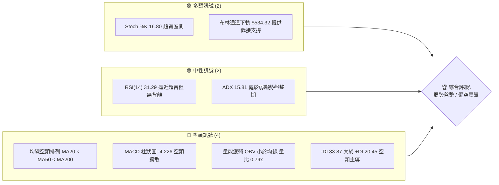
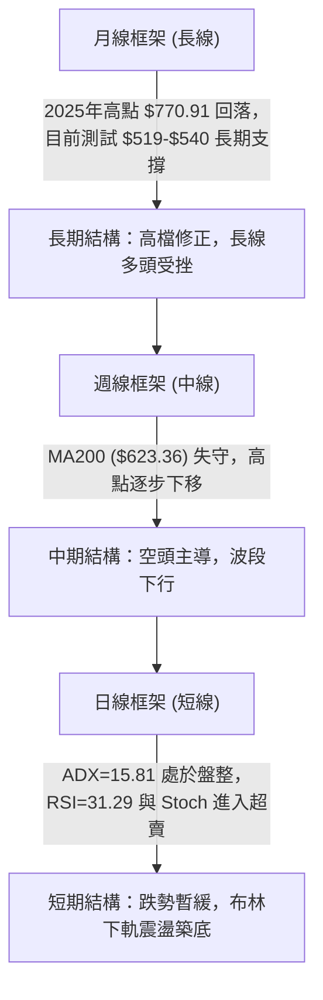
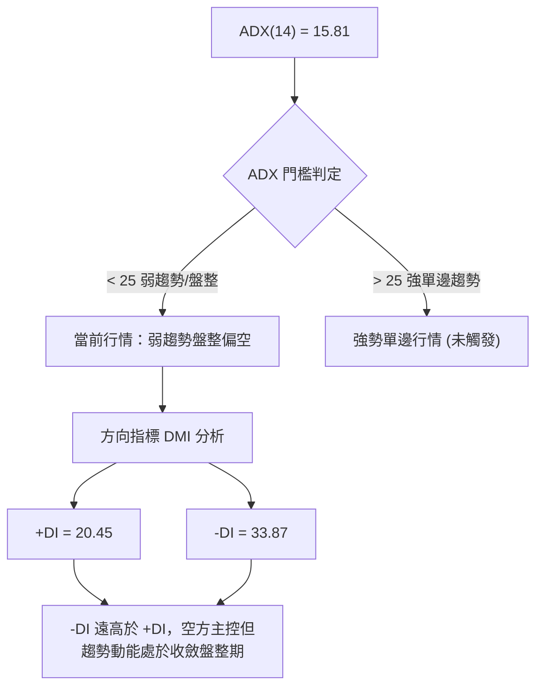
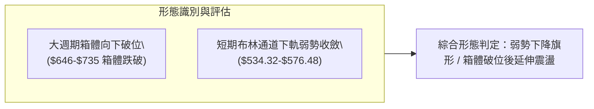
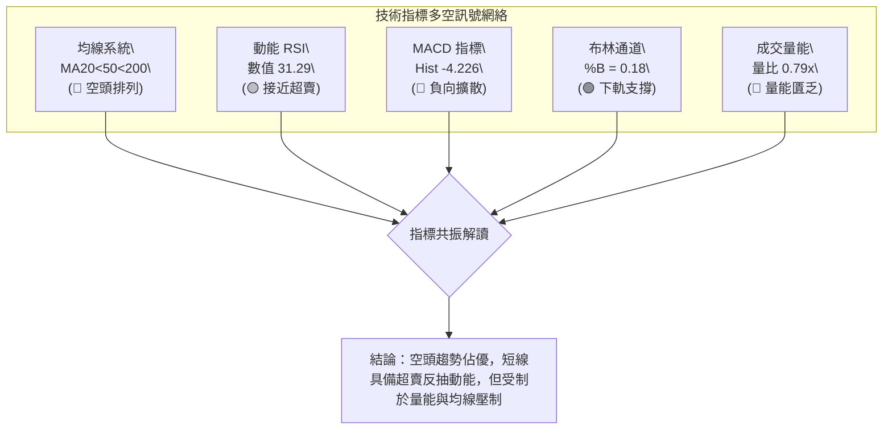
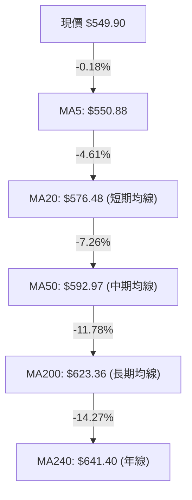
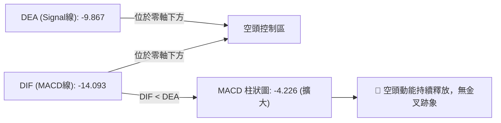
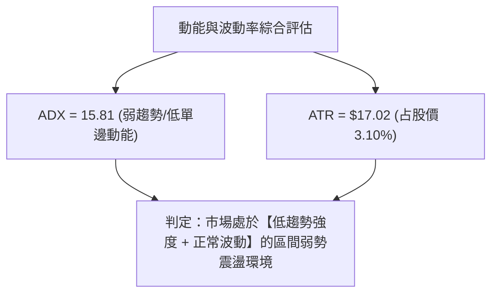
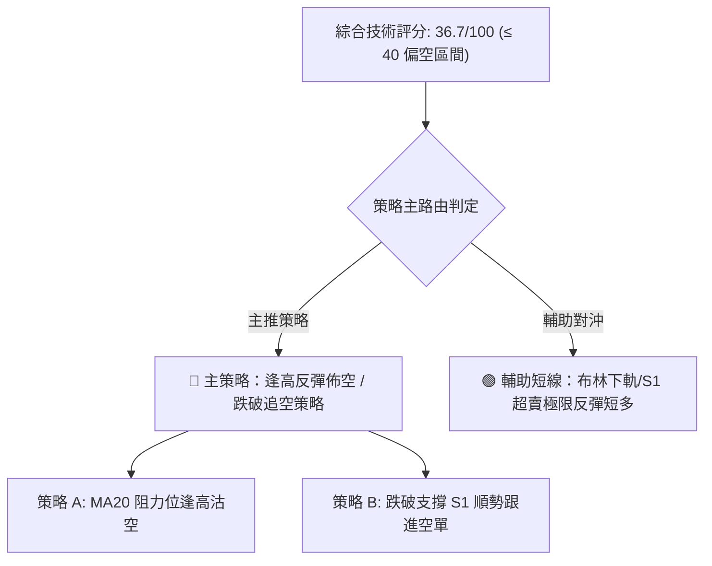
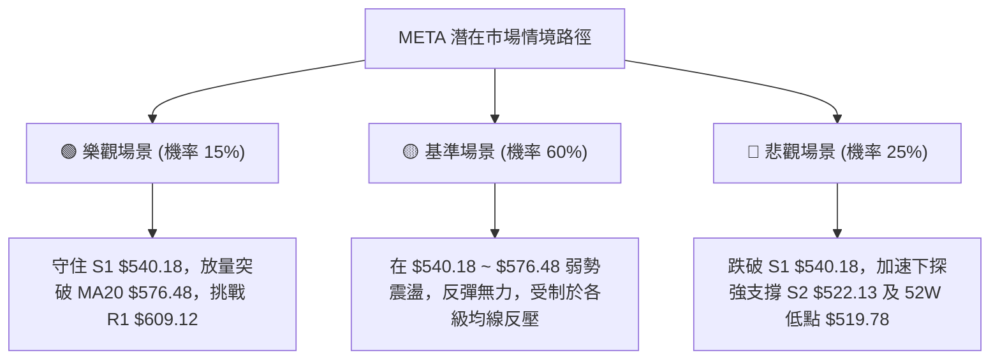

# META 技術分析報告

> **報告日期**：2026-08-23 ｜ **語言**：繁體中文 ｜ **數據來源**：Yahoo Finance ｜ **當前價格**：$549.90

---

## 目錄

| 章節 | 內容 |
|------|------|
| [1. 技術面概覽](#1-技術面概覽) | 訊號儀表板、核心指標、評分卡 |
| [2. 趨勢分析](#2-趨勢分析) | 多時框趨勢、長中短期走勢 |
| [3. 圖表形態分析](#3-圖表形態分析) | 形態識別、K線組合、目標價 |
| [4. 支撐與阻力](#4-支撐與阻力) | 關鍵價位、斐波那契回調 |
| [5. 技術指標深度解讀](#5-技術指標深度解讀) | MA/RSI/MACD/布林/成交量 |
| [6. 動能與波動率](#6-動能與波動率) | 動能評估、ATR、Beta |
| [7. 多時框架總結](#7-多時框架總結) | 時框架評分矩陣 |
| [8. 交易策略建議](#8-交易策略建議) | 多空策略、風險報酬比 |
| [9. 風險提示與監控](#9-風險提示與監控) | 監控指標、風險場景 |

---

## 1. 技術面概覽

### 🎯 技術訊號儀表板



### 📊 核心指標速覽表

| 指標類別 | 指標名稱 | 當前數值 | 訊號 | 解讀 |
|----------|----------|----------|------|------|
| **價格** | 當前價格 | $549.90 | 🔴 | 位於 52 週區間底部 11.2%，整體架構偏弱 |
| **均線** | MA20 | $576.48 | 🔴 | 價格在 MA20 下方 -4.61%，短期下行壓力顯著 |
| **均線** | MA50 | $592.97 | 🔴 | 價格在 MA50 下方 -7.26%，中期趨勢轉弱 |
| **均線** | MA200 | $623.36 | 🔴 | 價格在 MA200 下方 -11.78%，跌破牛熊分界線 |
| **動能** | RSI(14) | 31.29 | 🟡 | 逼近 30 超賣邊界，短線跌勢趨緩但未見底背離 |
| **動能** | MACD | -14.093 / -4.226 | 🔴 | DIF 線與訊號線雙雙位於零軸下方，柱狀圖負向擴散 |
| **動能** | Stoch %K/%D | 16.80 / 13.28 | 🟢 | 處於 <20 嚴重超賣區間，具備技術性反彈動能 |
| **趨勢** | ADX(14) | 15.81 | 🟡 | ADX < 25 表明非單邊單向暴跌，而是盤整偏空架構 |
| **趨勢** | DMI (+/-DI) | 20.45 / 33.87 | 🔴 | -DI 明顯高於 +DI，空方力量占據主導地位 |
| **波動** | ATR(14) | $17.02 | 🟡 | 波動率占股價 3.10%，單日波動幅度適中 |
| **通道** | 布林 %B | 0.18 | 🟡 | 貼近布林下軌 $534.32，進入下軌支撐觀察區 |
| **量能** | OBV & 量比 | 0.79x | 🔴 | 20日均量未放大，OBV 持續低於均線，量能匱乏 |

### 🏆 技術評分卡

```
╔══════════════════════════════════════════════════════════════════╗
║                   技術評分卡 — META (2026-08-23)                 ║
╠══════════════════════════════════════════════════════════════════╣
║ 趨勢強度 (ADX=15.81)    ██████░░░░░░░░░░░░░░  30/100  🔴 偏空弱勢 ║
║ 動能指標 (RSI/MACD)     ████████░░░░░░░░░░░░  38/100  🔴 動能疲弱 ║
║ 支撐穩定度 (S1/S2)      ████████████░░░░░░░░  60/100  🟡 考驗低點 ║
║ 成交量配合 (OBV/Vol)    ██████░░░░░░░░░░░░░░  32/100  🔴 量能萎縮 ║
║ 形態完整度 (區間回落)   ████████░░░░░░░░░░░░  40/100  🟡 弱勢整理 ║
║ 均線排列 (MA20/50/200)  ████░░░░░░░░░░░░░░░░  20/100  🔴 空頭排列 ║
╠══════════════════════════════════════════════════════════════════╣
║ 綜合評分                ███████░░░░░░░░░░░░░  36.7/100 🔴 偏空震盪║
╚══════════════════════════════════════════════════════════════════╝
```

---

## 2. 趨勢分析

### 🌐 多時框趨勢分析



### 📈 長期趨勢 — 12個月走勢圖（Unicode）

```
META 月線收盤走勢圖（2025-09 至 2026-08）
價格軸 ($)
$750 ┤ ●($732.47)
$700 ┤                       ●($715.22)
$650 ┤          ●($646.67) ─── ●($646.27) ─── ●($658.91) ─── ●($647.03) ─── ●($631.92)
$600 ┤                                                               ●($611.34)
$550 ┤                                                    ●($571.60)           ●($563.29) ─── ●($556.71) ─── ●($549.90 現價)
$500 ┼──────────────────────────────────────────────────────────────────────────────────────────────────────────
      09/25     10/25      11/25      12/25      01/26      02/26      03/26      04/26      05/26      06/26      07/26      08/26
```

**走勢特徵分析表格**：

| 階段區間 | 起止價格 | 漲跌幅 | 結構特徵與量價解讀 |
|----------|----------|--------|-------------------|
| **2025-09 ~ 2025-11** | $732.47 → $646.27 | -11.77% | 跌破歷史頂部區間（$770.91 歷史高點），高檔出貨確立 |
| **2025-12 ~ 2026-01** | $658.91 → $715.22 | +8.55%  | 反彈波確認頂部阻力，形成次高點，未能重返 $730 之上 |
| **2026-02 ~ 2026-03** | $647.03 → $571.60 | -11.66% | 主跌浪啟動，跌破整數關卡，均線系統開始由平轉下行 |
| **2026-04 ~ 2026-05** | $611.34 → $631.92 | +3.37%  | 弱勢抵抗反彈，受制於 MA200 壓力區，多頭動能不足 |
| **2026-06 ~ 2026-08** | $563.29 → $549.90 | -2.38%  | 陰跌整理，持續壓制在 MA20 下方，目前逼近 52 週低點 |

### 📊 中期趨勢（週線分析）

從近 20 週收盤走勢觀察，META 自 2026 年 4 月中的波段高點 $687.91 展開連續修正：

```
週線關鍵阻力與支撐示意圖
════════════════════════════════════════════════════════════════════
$687.91 ────────── 近期週線波段頂點 (2026-04-19, RSI=96.5)
   │
$622.32 ~ $624.40 ── 61.8% 斐波那契壓力帶 / 阻力位 R2 / MA200 ($623.36)
   │
$576.48 ~ $577.22 ── 78.6% 斐波那契回調位 / MA20 / 8月中反彈高點
   │
$549.90 ────────── 當前現價 (弱勢震盪於布林下軌附近)
   │
$540.18 ────────── 關鍵支撐 S1 (近期波段低點聚類)
   │
$519.78 ~ $522.13 ── 52週最低點 $519.78 / 強支撐 S2 ($522.13)
════════════════════════════════════════════════════════════════════
```

### ⚡ 趨勢強度評估（ADX 解讀）



| 指標項 | 數值 | 評級 | 解讀與交易指引 |
|--------|------|------|----------------|
| **ADX(14)** | 15.81 | 弱趨勢 (盤整) | 數值顯著低於 25，表明短線並非處於急速崩跌的單邊行情，而是下行通道內的弱勢震盪 |
| **+DI** | 20.45 | 多方弱勢 | 多頭買盤力道偏弱，無法發起有效波段反攻 |
| **-DI** | 33.87 | 空方佔優 | 空方佔據絕對優勢，空方力道明顯壓制多方 |
| **多時框收斂指引** | 盤整行情 | 依規則 14 | **ADX < 25，市場定義為盤整行情**。交易邏輯應以日線布林通道上下軌（$534.32 ~ $618.65）為主要區間邊界，避免盲目追空或過度看多單邊突破 |

---

## 3. 圖表形態分析

### 🔍 形態識別系統



| 形態名稱 | 信心度 | 判斷依據（引用數據） | 完成度 | 目標價（附計算式） |
|----------|--------|----------------------|--------|--------------------|
| **大週期箱體破位** | 75% | 2025年10月至2026年2月形成 $646.27 ~ $715.22 箱體，2026年3月收盤 $571.60 跌破箱體下緣 | 100% | 破位點 $646.27 - (箱頂 $715.22 - 箱底 $646.27) = $577.32（已於2026-03達成） |
| **下降通道/弱勢收斂** | 60% | 8月各週收盤（$556.71、$592.10、$589.85、$549.90）受制於 MA20 ($576.48)，測試支撐 S1 ($540.18) | 70% | 由形態高度推算：若跌破 S1 ($540.18)，量測幅度為 (MA20 $576.48 - S1 $540.18 = $36.30)，向下延伸至 S2 附近 $522.13 ($540.18 - $36.30 = $503.88，保守看 S2 $522.13) |
| **雙底反轉形態** | 30% | 數據中未偵測到有效雙底形態（未突破頸線 MA20 $576.48），信心度不足 50% | 25% | **訊號不足，僅做指標型解讀**（目前僅為測試支撐 S1/S2） |

### 🕯️ 重要K線形態分析

| 週/月份 | 收盤價 | K線形態特徵 | 技術解讀 | 訊號 |
|---------|--------|-------------|----------|------|
| **2026-07-12** | $669.21 | 帶量長陽線 (週量 1.17億) | 中期反彈遇阻 MA200 ($623.36 突破後假突破)，隨後無量回落 | 🟡 誘多假突破 |
| **2026-08-02** | $556.71 | 長黑下挫 (週量 1.12億) | 破位加速，RSI 跌至 22.9 極端超賣區，空頭動能釋放 | 🔴 極度偏空 |
| **2026-08-09~16**| $589.85 | 弱勢十字反彈星線 (量能縮至 6400萬) | 量縮反抽，受阻於 MA20 ($576.48) 與 78.6% 回調位 ($577.22) | 🔴 反彈無力 |
| **2026-08-23** | $549.90 | 陰線下探吞噬 | 重新跌破 MA5 ($550.88)，測試前低與布林下軌 | 🔴 短線偏空 |

### 📉 ASCII 走勢形態示意圖

```
META 近期日/週線下降通道與測試支撐示意圖
價格 ($)
$624.40 ┼─── 波段高點 R2 / 斐波 61.8% ($622.32)
        │    ╲
$592.97 ┼─────╲──── MA50 壓力位
        │      ╲
$576.48 ┼───────●── MA20 頸線壓力 ($576.48) / 8月中反抽高點 ($589.85-$592.10)
        │        ╲
$549.90 ┼─────────●── 現價 ($549.90)，受制於下降趨勢線
        │          ╲
$540.18 ┼───────────▼── 關鍵支撐 S1
        │
$522.13 ┼─────────────── 強支撐 S2 / 52週低點 ($519.78)
        └────────────────────────────────────────────► 時間
```

### 🎯 形態目標價計算

1. **下行破位量測（主路徑）**：
   - 形態壓力頸線：MA20 = $576.48
   - 區間支撐平台：S1 = $540.18
   - 形態區間高度 $H = \$576.48 - \$540.18 = \$36.30$
   - **下行第一空頭目標**：直接引用關鍵支撐 **S1 = $540.18**
   - **下行第二空頭目標**：若實體跌破 S1，引用波段聚類強支撐 **S2 = $522.13**（形態等幅推算為 $\$540.18 - \$36.30 = \$503.88$，但受 S2 $522.13 與 52W Low $519.78 強烈支撐）

2. **超賣反彈量測（次路徑）**：
   - 反彈第一目標：MA20 / 布林中軌 = **$576.48**
   - 反彈第二目標：波段阻力 R1 = **$609.12** / 阻力 R2 = **$624.40**

---

## 4. 支撐與阻力

### 🗺️ 關鍵價位分布圖（Unicode）

```
META 價位結構分布圖
═══════════════════════════════════════════════════════════════════
$642.40 ║██████████████████████████████║ 強阻力 R3 (波段高點聚類)
$624.40 ║████████████████████████      ║ 關鍵阻力 R2 (MA200 $623.36 / 斐波 61.8% $622.32)
$609.12 ║████████████████              ║ 阻力 R1 (近期波段高點聚類)
$576.48 ║▓▓▓▓▓▓▓▓▓▓▓▓▓▓▓▓▓▓▓▓          ║ 動態阻力 MA20 / 布林中軌 / 斐波 78.6% $577.22
$549.90 ╠══════════════════════════════╣ ◄ 現價 ($549.90)
$540.18 ║▓▓▓▓▓▓▓▓▓▓▓▓▓▓▓▓              ║ 近期關鍵支撐 S1 (波段低點聚類, -1.77%)
$534.32 ║▓▓▓▓▓▓▓▓▓▓                    ║ 技術支撐 布林通道下軌 (%B=0.18)
$522.13 ║██████████████████████████████║ 核心強支撐 S2 (波段低點聚類, -5.05%)
$519.78 ║██████████████████████████████║ 52週最低價 (斐波那契 100.0% 回調位)
═══════════════════════════════════════════════════════════════════
```

### 🚧 阻力位分析表

*(註：所有阻力價位嚴格引用技術數據中「關鍵價位」區塊聚類計算所得數值)*

| 阻力級別 | 價位 | 距現價幅幅 | 形成原因與技術重合點 | 突破難度 | 重要性 |
|----------|------|------------|----------------------|----------|--------|
| **R1** | $609.12 | +10.77% | 近一年波段高點聚類、接近 60日均線 MA60 ($594.89) 與布林上軌 ($618.65) | 🟡 中等 | ★★★☆☆ |
| **R2** | $624.40 | +13.55% | 長期牛熊分界 MA200 ($623.36) 與斐波那契 61.8% 黃金回調位 ($622.32) 三重重合 | 🔴 極高 | ★★★★★ |
| **R3** | $642.40 | +16.82% | 240日年線 MA240 ($641.40) 及 2026 年初多次震盪密集成交頂部區間 | 🔴 極高 | ★★★★☆ |

### 🛡️ 支撐位分析表

*(註：所有支撐價位嚴格引用技術數據中「關鍵價位」區塊聚類計算所得數值)*

| 支撐級別 | 價位 | 距現價幅幅 | 形成原因與技術重合點 | 守住機率 | 重要性 |
|----------|------|------------|----------------------|----------|--------|
| **S1** | $540.18 | -1.77% | 近一年波段低點聚類、貼近當前日線布林通道下軌 ($534.32) | 🟡 60% | ★★★★☆ |
| **S2** | $522.13 | -5.05% | 近一年波段核心低點聚類、緊鄰 52週歷史低點 ($519.78) | 🟢 80% | ★★★★★ |

### 📐 斐波那契回調位分析

依據 52週完整波段（低點 **$519.78** 至 高點 **$788.22**，總波幅 $268.44）計算：

```
斐波那契回調階梯分布
0.0%  (52W High)   $788.22  ─── 歷史頂部
23.6%              $724.87  ─── 2025年9月震盪高點
38.2%              $685.67  ─── 2026年4月中波段高點
50.0%              $654.00  ─── 中軸分水嶺
61.8%              $622.32  ─── 重大共振阻力帶 (與 R2 $624.40、MA200 $623.36 重合)
78.6%              $577.22  ─── 短線反彈極限壓力 (與 MA20 $576.48 重合)
── 當前現價 $549.90 位於 78.6% ($577.22) 與 100.0% ($519.78) 之間 ──
100.0% (52W Low)   $519.78  ─── 終極底部防線
```

- **位置解讀**：現價 $549.90 已經跌破 78.6%（$577.22）深度回調位，代表先前的上升趨勢已被徹底破壞，行情進入大週期的築底或測底階段。上方 $577.22 轉化為強大反壓，下方僅剩 100.0% 回調位 $519.78 與 S2 $522.13 提供最後防守。

---

## 5. 技術指標深度解讀

### 🎛️ 指標訊號總覽



### 📈 移動平均線排列分析



- **均線排列狀態**：全週期均線呈現標準的**空頭發散排列**（MA5 < MA10 < MA20 < MA60 < MA120 < MA240）。
- **斜率與乖離**：各週期均線全數向下傾斜（▼）。現價與 MA200 負乖離達 -11.78%，雖未達極端崩跌乖離，但確認中期趨勢處於修正熊市週期。短期反彈的第一道嚴格考驗為 MA20（$576.48）。

### 📉 RSI(14) 分析

- **RSI(14) 當前數值**：**31.29**
- **強度進度條**：
  ```
  RSI(14) [31.29]  ██████░░░░░░░░░░░░░░  31.29% (接近超賣區 30)
  ```
- **超買超賣判定**：數值落在 30~70 區間邊緣，極度貼近 30 超賣線，且 Stoch %K（16.80）已深入超賣區。
- **背離分析結論**：經檢驗近 20 週與日線數據，價格創近期波段低點 $549.90 時，RSI 亦同步由 48.8 下降至 31.3，**目前無明顯底背離現象**。這表示下行動能是由實質賣盤推動，尚未出現賣壓衰竭的反轉訊號。

### 📊 MACD(12/26/9) 訊號解讀



- **MACD 數值解讀**：DIF (-14.093) 顯著低於 Signal (-9.867)，柱狀圖為 -4.226。雙線在零軸下方持續下行，顯示中短期空頭動能仍未完全衰竭，任何反彈若無 MACD 柱狀圖收斂翻紅，均視為弱勢弱反抽。

### 📦 布林通道分析

```
布林通道當前結構示意圖 (帶寬 BB Width = $84.33)
$618.65 ┼────────────────────────────── BB 上軌 (Upper Band)
        │
$576.48 ┼────────────────────────────── BB 中軌 (MA20 Baseline)
        │
$549.90 ┼──────────────●─────────────── 現價 (%B = 0.18)
$534.32 ┼────────────────────────────── BB 下軌 (Lower Band)
```

- **%B 位置解讀**：目前 `%B = 0.18`，股價運行於布林下軌（$534.32）與中軌（$576.48）之間，偏向通道底部。這意味著股價已進入統計學上的低估區間，下軌 $534.32 將與支撐 S1（$540.18）形成短線聯合防護。

### 💹 成交量分析（量價配合度）

- **最新成交量**：13,663,800 股
- **20日均量**：17,350,825 股 ｜ **量比**：**0.79x**（量能萎縮）
- **OBV（能量潮）分析**：OBV 持續低於其移動平均線（OBV < MA），表明在價格陰跌過程中，資金持續呈現淨流出狀態，並無機構資金進行大規模左側建倉或吸籌，量價配合顯示為「量縮陰跌」格局。

---

## 6. 動能與波動率

### ⚡ 動能評估四象限

| 象限 | 動能維度 (Momentum) | 波動維度 (Volatility) | 當前狀態 | 技術評估與操作環境 |
|------|---------------------|-----------------------|----------|-------------------|
| **Q1** | 強動能 (多頭) | 低波動 | — | 穩定多頭主升浪 (不符合) |
| **Q2** | **弱動能 (空頭/疲弱)** | **低/中波動 (ADX=15.81)** | **✓ META 當前定位** | **弱勢震盪陰跌：動能疲弱且處於盤整通道，適合區間高拋低吸或觀望** |
| **Q3** | 強動能 (單邊) | 高波動 | — | 單邊暴跌/暴漲主跌浪 (不符合) |
| **Q4** | 弱動能 (混沌) | 高波動 | — | 劇烈洗盤震盪 (不符合) |



### 📊 ATR 波動率分析

- **ATR(14) 當前數值**：**$17.02**（佔當前股價 3.10%）。
- **日內/波段波動區間**：日期望波動區間為現價 $\pm \$17.02$（即 $532.88 ~ $566.92）。
- **風控止損距離建議**：
  - **超短線交易（1.0x ATR）**：止損寬度設為 **$17.00**。
  - **波段交易（1.5x ~ 2.0x ATR）**：止損寬度建議設為 **$25.50 ~ $34.00**。

### 📐 Beta 與市場相關性

- **Beta 係數**：**1.243**。
- **市場敏感度解讀**：META 屬於高 Beta 成長/大型科技權值股，波動幅度平均高於標普 500 指數 24.3%。在整體市場風險偏好下降時，META 的下行回撤壓力往往會放大，因此在弱勢技術形態下，需嚴密防範大盤波動帶來的系統性衝擊。

---

## 7. 多時框架總結

### 📋 時框架評分表

| 時框架 | 趨勢方向 | 動能指標 | 均線系統排列 | 形態結構 | 綜合評分 | 操作建議 |
|--------|----------|----------|--------------|----------|----------|----------|
| **月線 (長期)** | 🟡 中性回調 | RSI 52 (中性) | 仍守在長期均線之上 | 自 $788 高檔回撤測試低位 | 52/100 | 長期分批低接觀察 |
| **週線 (中期)** | 🔴 明顯偏空 | MACD 負向擴散 | 跌破 MA200 ($623.36) | 高點下移，空頭排列 | 32/100 | 波段反彈逢高減碼 |
| **日線 (短期)** | 🔴 弱勢盤整 | RSI 31.3 / Stoch 超賣 | 空頭排列 (MA20<50<200) | 貼近布林下軌震盪 | 38/100 | 嚴禁追空，等待反抽 |

### 🔲 綜合訊號矩陣

```
╔══════════════════════════════════════════════════════════════════╗
║                   多時框多空訊號共振矩陣                         ║
╠════════════════════╦══════════╦══════════╦══════════╦════════════╣
║ 分析維度           ║ 短期日線 ║ 中期週線 ║ 長期月線 ║ 跨週期共振 ║
╠════════════════════╬══════════╬══════════╬══════════╬════════════╣
║ 趨勢方向 (Trend)   ║ 🔴 偏空  ║ 🔴 偏空  ║ 🟡 中性  ║ 🔴 空方主導║
║ 動能強弱 (Momentum)║ 🟡 超賣  ║ 🔴 轉弱  ║ 🟡 趨緩  ║ 🟡 跌勢趨緩║
║ 均線架構 (MA)      ║ 🔴 空頭  ║ 🔴 空頭  ║ 🟢 多頭  ║ 🔴 均線反壓║
║ 量價關係 (Volume)  ║ 🔴 量縮  ║ 🔴 量縮  ║ 🟡 正常  ║ 🔴 買盤不足║
║ 支撐阻力 (S/R)     ║ 🟢 測S1  ║ 🟢 測S2  ║ 🟢 測低  ║ 🟢 支撐共振║
╚════════════════════╩══════════╩══════════╩══════════╩════════════╝
```

### ⚖️ 多時框收斂結論

> **依嚴格要求 14 規則收斂判定**：
> 1. 當前日線 **ADX(14) = 15.81 < 25**，行情正式定義為 **「盤整行情」**。
> 2. 主導交易邏輯以 **日線布林通道上下軌（$534.32 ~ $618.65）及關鍵支撐阻力（S1 $540.18 / R1 $609.12）為震盪區間**。
> 3. **唯一方向性結論**：**【偏空震盪 / 區間弱勢整理】**。中期空頭排列壓制上行空間，短期超賣則限制即刻下殺空間，整體評分 36.7/100，第 8 章主策略將遵循偏空架構制定「逢高反彈佈空」與「超賣支撐短打」策略。

---

## 8. 交易策略建議

### 🗺️ 策略決策流程圖



### 🧭 策略路由

**當前主策略方向 = 【偏空主導，反彈逢高沽空為主】（依技術評分 36.7 / 100 判定）**

### 🎯 價格情境階梯（Price Scenarios）

*(註：所有價位完全引用第 4 章計算之關鍵價位)*

| 觸發條件 | 下一目標 | 後續延伸 | 情境含義與技術應對 |
|----------|----------|----------|-------------------|
| **向上突破 MA20 ($576.48)** | R1 $609.12 | R2 $624.40 | 短線超賣反彈展開，空單應於 $576 止損，等待 R1/R2 重新佈空 |
| **震盪於 $540.18 ~ $576.48** | — | — | 區間沉底整理，以布林下軌與中軌進行極限網格操作 |
| **向下實體跌破 S1 ($540.18)** | S2 $522.13 | 52W Low $519.78 | 盤整下破，開啟下行測底行情，測試年度低點 |

### 📊 情境機率分佈

| 價格情境 | 機率預估 | 主要技術依據 |
|----------|----------|--------------|
| **弱勢反抽遇阻回落 (主情境)** | **55%** | 均線空頭排列，MACD 柱狀圖處於負值 (-4.226)，反抽無量必然受阻於 MA20 ($576.48) |
| **區間弱勢震盪 ($540 ~ $576)** | **30%** | ADX = 15.81 (<25) 顯示單邊趨勢不足，布林下軌 $534.32 與 S1 $540.18 提供短期緩衝 |
| **向下直接跌破 S1/S2 探底** | **15%** | -DI (33.87) 佔優，若大盤系統性下挫，可能引發破位拋壓測試 $519.78 |

### 🔴 主策略詳情（空頭主導策略）

| 策略要素 | 策略 A（反彈高空 — 最佳勝率） | 策略 B（破位順勢空 — 突破型） |
|----------|--------------------------------|--------------------------------|
| **策略類型** | 逢反彈至均線反壓區沽空 | 跌破關鍵支撐 S1 順勢跟進 |
| **進場條件** | 股價反彈至 MA20 / 斐波 78.6% 遇阻回落 | 日K收盤實體跌破 S1 支撐位 |
| **進場價格** | **$576.48**（MA20 與斐波 78.6% 壓力） | **$539.00**（確認跌破 S1 $540.18） |
| **目標價 T1** | **$540.18**（波段支撐 S1） | **$522.13**（波段強支撐 S2） |
| **目標價 T2** | **$522.13**（強支撐 S2） | **$519.78**（52週最低點） |
| **止損價格** | **$593.00**（MA50 壓力位之上） | **$550.00**（重返 S1 支撐之上） |
| **風險空間** | $\$593.00 - \$576.48 = \$16.52$ | $\$550.00 - \$539.00 = \$11.00$ |
| **報酬空間(T2)** | $\$576.48 - \$522.13 = \$54.35$ | $\$539.00 - \$519.78 = \$19.22$ |
| **風險報酬比** | **1 : 3.29**（極佳） | **1 : 1.75**（良好） |
| **預估勝率** | **65%** | **55%** |
| **建議倉位** | **15% ~ 20%** | **10%** |

### 🟢 反向風險觸發點（多頭對沖提示）

- **多頭反轉觸發條件**：若股價帶量（日成交量 > 2000 萬股）突破並連續兩日站穩 **MA20 ($576.48)**，且 MACD 柱狀圖翻紅，則空頭策略全面失效，空單必須全數止損離場。
- **激進短多參與點**：僅限於現價至 **S1 ($540.18)** 或布林下軌 **$534.32** 附近出現日內長下影線時極輕倉（5%）博弈反彈，止損嚴格設於 **$533.00**，目標看向 **$576.48**。

### ⭐ 整體訊號強度評星

```
做多訊號強度：★★☆☆☆  (2.0/5星 — 僅超賣技術支撐，無形態與量能確認)
做空訊號強度：★★★★☆  (4.0/5星 — 均線、MACD、量能全面偏空)
整體可信度：  ★★★☆☆  (3.5/5星 — ADX 偏低，警惕震盪洗盤)
```

---

## 9. 風險提示與監控

### ✅ 關鍵監控指標 Checklist

```
╔══════════════════════════════════════════════════════════════════╗
║                   每日交易風控監控清單 (Checklist)               ║
╠══════════════════════════════════════════════════════════════════╣
║ [ ] 價格是否跌破 S1 $540.18？ (若跌破，警惕下探 S2 $522.13)      ║
║ [ ] RSI(14) 是否跌破 30 或產生底背離？ (監控超賣反彈訊號)        ║
║ [ ] MACD 柱狀圖是否收斂至 -1.0 以上？ (空頭動能衰竭指標)        ║
║ [ ] 成交量是否放大至 2000萬股 (量比 > 1.2x)？ (異動確認)        ║
║ [ ] 價格是否突破 MA20 $576.48？ (空頭策略止損與反轉預警)         ║
║ [ ] 布林帶寬是否持續收窄？ (醞釀下一波單邊破位行情)             ║
╚══════════════════════════════════════════════════════════════════╝
```

### ⚠️ 風險場景分析



### 🛡️ 風險管理重要提醒

1. **嚴禁在 ADX < 25 的盤整市盲目加槓桿**：低趨勢強度意味著走勢反覆，極易出現假突破或假跌破，應嚴格將單筆交易虧損控制在總資金的 1.5% 以內。
2. **ATR 動態止損設置**：波段交易必須依據 ATR ($17.02) 設定足夠寬度的動態追蹤止損，避免因正常市場隨機波動而被震盪出場。
3. **分析師目標價與技術面背離風險**：雖然華爾街分析師平均目標價高達 $754.14（給予 Strong Buy 評級），但**技術面處於絕對弱勢空頭排列**。切勿僅憑基本面評級盲目左側接飛刀，必須等待技術面出現均線收斂金叉或雙底形態後方可確認反轉。

---

## 📋 報告總結

```
╔══════════════════════════════════════════════════════════════════╗
║                   META 技術分析報告總結                          ║
╠══════════════════════════════════════════════════════════════════╣
║ 報告日期：2026-08-23                                             ║
║ 當前價格：$549.90                                                ║
║ 分析評級：🔴 偏空震盪 / 逢高做空 (綜合評分: 36.7 / 100)          ║
╠══════════════════════════════════════════════════════════════════╣
║ 關鍵結論：                                                       ║
║ ├─ 長期趨勢：🟡 月線高檔大幅回調，測試 52 週低點支撐             ║
║ ├─ 中期趨勢：🔴 週線跌破 MA200 ($623.36)，均線空頭排列           ║
║ ├─ 短期趨勢：🔴 日線受制於 MA20 ($576.48)，超賣區弱勢整理        ║
║ ├─ 關鍵支撐：S1 $540.18 ｜ 強支撐 S2 $522.13 ｜ 52W低點 $519.78 ║
║ ├─ 關鍵阻力：MA20 $576.48 ｜ R1 $609.12 ｜ 核心阻力 R2 $624.40   ║
║ └─ 分析師預期：共識評級 Strong Buy (均價 $754.14，與短線技術背離)║
╠══════════════════════════════════════════════════════════════════╣
║ 最優策略組合：                                                   ║
║ 1. 🥇 最佳機會：反彈至 MA20 ($576.48) 佈空，目標 $540.18 / $522.13║
║ 2. 🥈 次選機會：實體跌破 S1 ($540.18) 順勢跟進空單，看至 $522.13 ║
║ 3. 🥉 保守選擇：空手觀望，等待日線站穩 MA20 或測試 S2 構築底背離 ║
╚══════════════════════════════════════════════════════════════════╝
```

---

> ⚠️ **免責聲明**：本報告為 AI 自動生成之技術分析，所有數據及估算均基於提供的歷史價格資訊。本報告**僅供研究與學術參考**，**不構成任何投資建議**。投資有風險，入市需謹慎。

---

*報告生成時間：2026-08-23 ｜ 數據來源：Yahoo Finance ｜ 分析框架：多時框技術分析*