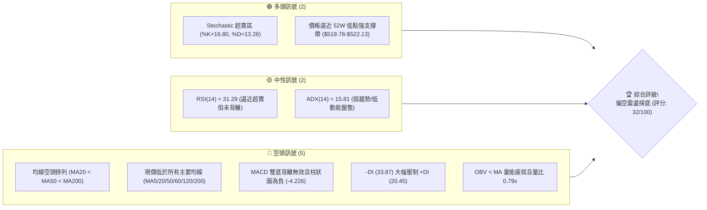
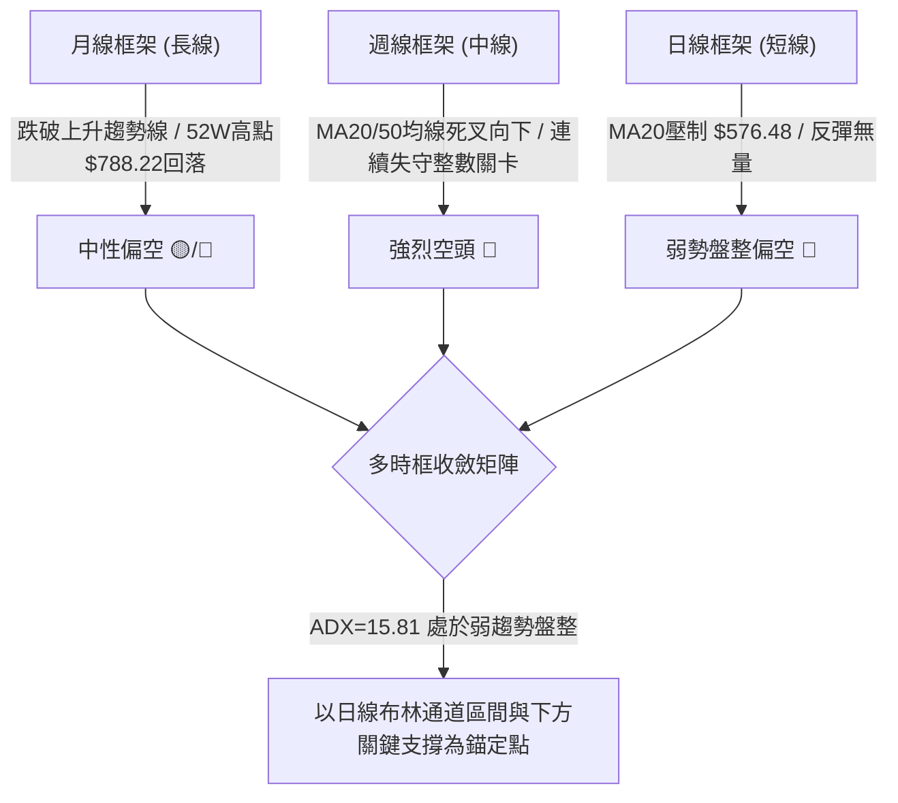
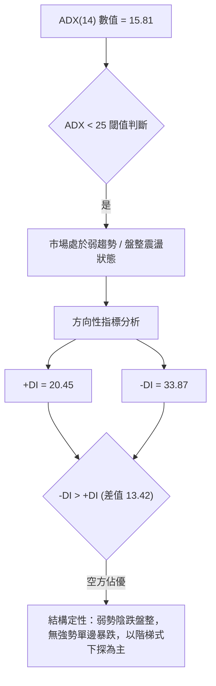
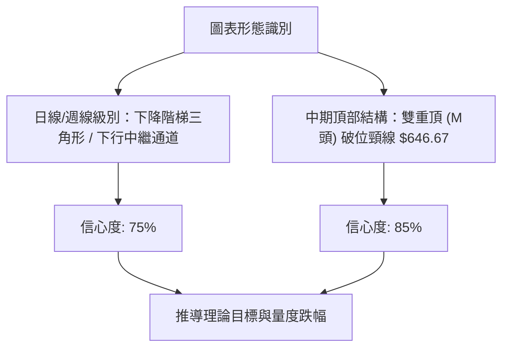
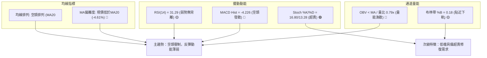
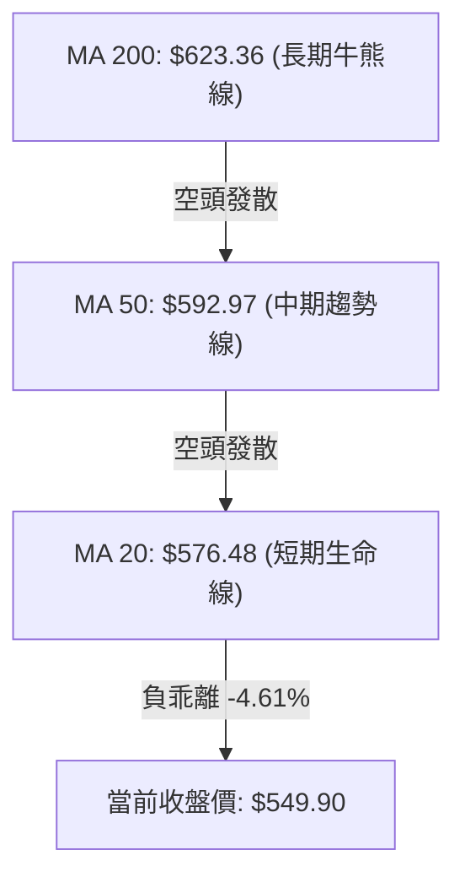
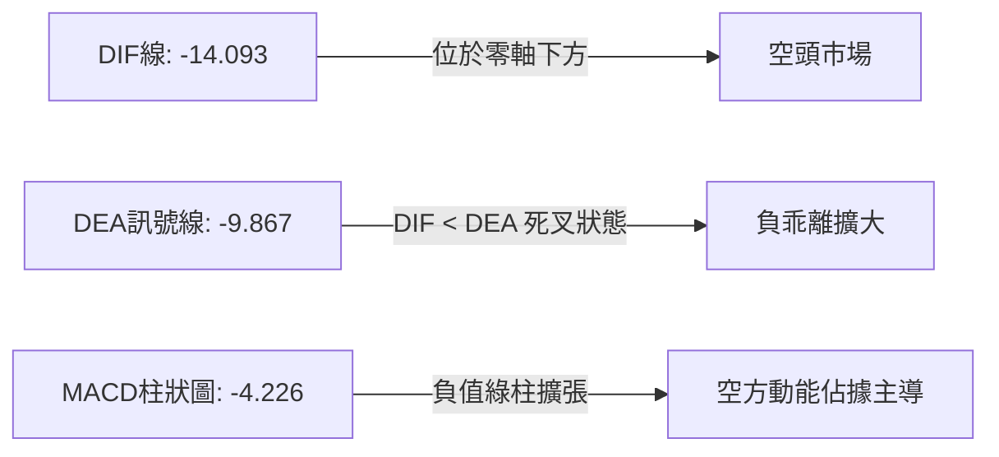
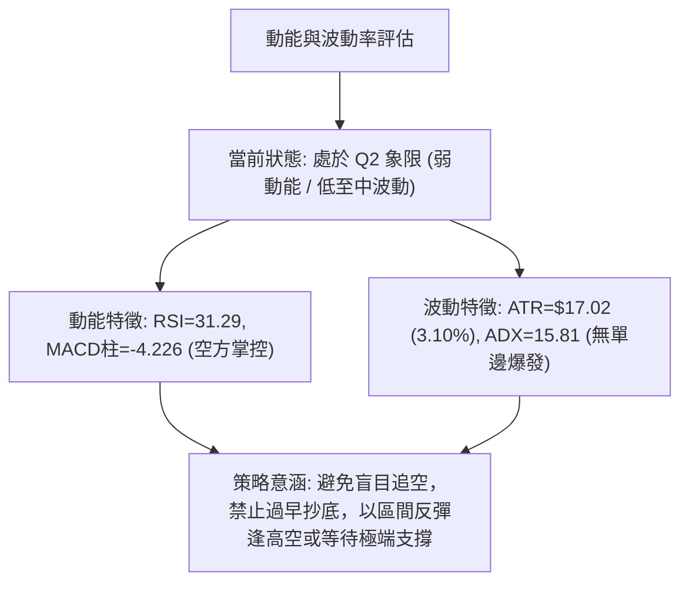
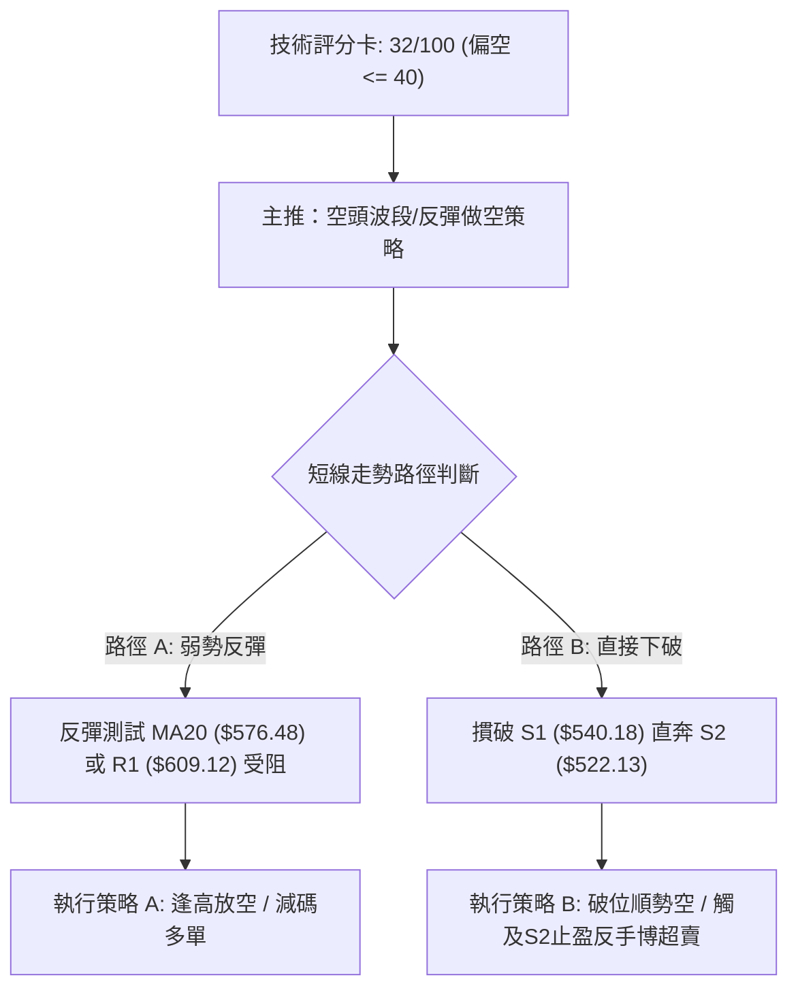
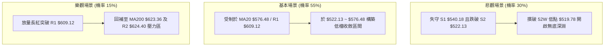

# META 技術分析報告

> **報告日期**：2026-08-24 ｜ **語言**：繁體中文 ｜ **數據來源**：Yahoo Finance ｜ **當前價格**：$549.90

---

## 目錄

| 章節 | 內容 |
|------|------|
| [1. 技術面概覽](#1-技術面概覽) | 訊號儀表板、核心指標、評分卡 |
| [2. 趨勢分析](#2-趨勢分析) | 多時框趨勢、長中短期走勢、ADX解讀 |
| [3. 圖表形態分析](#3-圖表形態分析) | 形態識別、信心度評估、K線組合、目標價 |
| [4. 支撐與阻力](#4-支撐與阻力) | 關鍵價位、斐波那契回調、量能分佈 |
| [5. 技術指標深度解讀](#5-技術指標深度解讀) | MA/RSI/MACD/布林/成交量 |
| [6. 動能與波動率](#6-動能與波動率) | 動能四象限、ATR、Beta與市場連動 |
| [7. 多時框架總結](#7-多時框架總結) | 時框架評分矩陣、收斂結論 |
| [8. 交易策略建議](#8-交易策略建議) | 策略路由、情境階梯、主策略詳情 |
| [9. 風險提示與監控](#9-風險提示與監控) | 監控指標Checklist、風險場景、部位管理 |
| [📋 報告總結](#-報告總結) | 核心結論與執行路徑匯總 |

---

## 1. 技術面概覽

### 🎯 技術訊號儀表板



### 📊 核心指標速覽表

| 指標類別 | 指標名稱 | 當前數值 | 訊號 | 解讀 |
|----------|----------|----------|:---:|------|
| **價格** | 當前價格 | $549.90 | 🔴 | 位於52週區間11.2%分位，處於極弱勢低檔區 |
| **均線** | MA20 | $576.48 | 🔴 | 價格低於MA20達 -4.61%，短線下行承壓 |
| **均線** | MA50 | $592.97 | 🔴 | 價格低於MA50，中期下降通道維持完整 |
| **均線** | MA200 | $623.36 | 🔴 | 價格低於MA200達 -11.78%，跌破長期生命線 |
| **動能** | RSI(14) | 31.29 | 🟡 | 位於臨界弱勢區（30-70中偏下緣），尚未觸發超賣反彈 |
| **動能** | MACD (12,26,9) | -14.093 / -9.867 | 🔴 | DIF線位於訊號線下方，柱狀圖 -4.226 空方動能擴張 |
| **動能** | Stoch %K/%D | 16.80 / 13.28 | 🟢 | 進入超賣區間，短線存在技術性抽頭修復機會 |
| **趨勢** | ADX / DMI | 15.81 (-DI:33.87) | 🔴 | ADX<25顯示趨勢衰竭為弱趨勢，但-DI主導空頭格局 |
| **通道** | 布林通道 (%B) | 0.18 ($534.32-$618.65) | 🟡 | 位於下軌上方弱勢區，帶寬未顯著張開，處於弱勢壓迫 |
| **量能** | OBV / 量比 | 0.79x (OBV < MA) | 🔴 | 成交量萎縮（1,366萬 vs 20日均量1,735萬），量價背離 |
| **波動** | ATR(14) | $17.02 (3.10%) | 🟡 | 每日平均波動幅度約 $17.02，波動率處於中等水平 |

### 🏆 技術評分卡

```
╔══════════════════════════════════════════════════════════════════╗
║              技術評分卡 — META Platforms, Inc. (2026-08-24)      ║
╠══════════════════════════════════════════════════════════════════╣
║ 趨勢強度 (Trend)       ██████░░░░░░░░░░░░░░  30/100  🔴 空頭壓制  ║
║ 動能指標 (Momentum)    ███████░░░░░░░░░░░░░  35/100  🔴 動能疲軟  ║
║ 支撐穩定度 (Support)   ████████░░░░░░░░░░░░  40/100  🟡 考驗低位  ║
║ 成交量配合 (Volume)    █████░░░░░░░░░░░░░░░  25/100  🔴 量能萎縮  ║
║ 形態完整度 (Pattern)   ██████░░░░░░░░░░░░░░  30/100  🔴 下行中繼  ║
║ 均線排列 (Moving Avg)  ████░░░░░░░░░░░░░░░░  20/100  🔴 完美空頭  ║
╠══════════════════════════════════════════════════════════════════╣
║ 綜合評分 (Overall)     ██████░░░░░░░░░░░░░░  32/100  🔴 強烈偏空  ║
╚══════════════════════════════════════════════════════════════════╝
```

---

## 2. 趨勢分析

### 🌐 多時框趨勢分析



### 📈 長期趨勢 — 12個月走勢圖（Unicode）

```
META 月線收盤走勢圖（2025-09 至 2026-08）
價格軸 ($)
$750 ┤ ●(09月 732.47)
$700 ┤                                  ●(01月 715.22)
$650 ┤          ●(10月 646.67) ── ●(12月 658.91)   ●(02月 647.03) ── ●(05月 631.92)
$600 ┤                                                    ●(04月 611.34)
$550 ┤                                                               ●(03月 571.60) ─ ●(06月 563.29) ── ●(08月 549.90 現價)
$500 ┤                                                                                                  ●(52W Low 519.78)
     └─────────────────────────────────────────────────────────────────────────────────────────────────────────────
        25-09    25-10    25-11    25-12    26-01    26-02    26-03    26-04    26-05    26-06    26-07    26-08
```

#### 走勢特徵分析表格

| 階段區間 | 起始/結束價 | 期間漲跌幅 | 走勢特徵描述 | 量價配合狀況 |
|----------|-------------|:----------:|--------------|--------------|
| **2025-09 ~ 2025-10** | $732.47 → $646.67 | -11.71% | 自歷史天價區高檔長黑下殺，跌破短期均線 | 高檔放量下殺，籌碼鬆動 |
| **2025-11 ~ 2026-01** | $646.27 → $715.22 | +10.67% | 構築次級反彈高點，未能越過前期高點 $770.91 | 反彈量能未顯著放大，形成次高頂 |
| **2026-02 ~ 2026-03** | $647.03 → $571.60 | -11.66% | 主跌段展開，跌破半年線與長期支撐 | 下殺爆量，均線全面轉為向下發散 |
| **2026-04 ~ 2026-05** | $611.34 → $631.92 | +3.37% | 短暫弱勢反彈，受阻於 MA60/MA120 均線群 | 量能萎縮，典型的死貓跳反彈 |
| **2026-06 ~ 2026-08** | $563.29 → $549.90 | -2.38% | 低檔鈍化震盪，緩步陰跌逼近 52 週低點 | 成交量持續萎縮至均量以下，動能渙散 |

### 📊 中期趨勢（週線分析）

```
近期週線關鍵走勢與支撐阻力結構：
 700 ┤       ● (04-19: 687.91)
 660 ┤             ● (04-26: 674.40)           ● (07-12: 669.21)
 620 ┤ ● (04-12: 629.28) ── ● (05-31: 631.92)       ● (07-19: 646.01)  ═══════════ R3: 642.40
 580 ┤                            ● (06-21: 577.22)        ● (08-09: 592.10) ═══ R1: 609.12
 540 ┤                                 ● (06-28: 550.25)        ● (08-23: 549.90 現價) ◄─ S1: 540.18
 500 ┤                                                               ══════════════ S2: 522.13
```

週線走勢呈現「一峰低於一峰」的高點下移格局（Lower Highs: $687.91 → $669.21 → $592.10），同時低點亦同步下移（Lower Lows: $571.60 → $550.25 → $549.90）。最近一週（2026-08-23）收於 $549.90，週線 MACD 柱狀圖翻負至 -4.226，RSI 弱勢於 31.3，確立中期空頭掌控盤面。

### ⚡ 趨勢強度評估（ADX 解讀）



#### ADX 趨勢強度對照

```
ADX 讀數 (15.81)       ██████░░░░░░░░░░░░░░ 15.81 / 100
-DI 空方強度 (33.87)   █████████████░░░░░░░ 33.87 / 100
+DI 多方強度 (20.45)   ████████░░░░░░░░░░░░ 20.45 / 100
```
- **趨勢狀態**：ADX < 25，表明過去 14 日內單邊極端趨勢動能正在減退，進入低動能的整理與緩跌格局。
- **方向主導**：-DI (33.87) 明顯高於 +DI (20.45)，說明空方仍握有行情主導權，反彈高度受限。

---

## 3. 圖表形態分析

### 🔍 形態識別系統



#### 形態識別與信心度評估表

| 識別形態 | 週期時框 | 信心度 | 判斷依據（引用精確數據） | 完成度 | 理論目標價（附計算式） |
|----------|:--------:|:------:|--------------------------|:------:|------------------------|
| **大型雙重頂 (M-Top)** | 週線/月線 | 85% | 左頂 $770.91 (25-07)、右頂 $715.22 (26-01)，跌破頸線 $646.67 | 100% (已跌破) | 頸線 $646.67 - 形態高度 ($770.91 - $646.67 = $124.24) = **$522.43**（與 S2 $522.13 高度重合） |
| **下降通道/階梯下行** | 日線 | 75% | 波段高點受制於 MA20 ($576.48) 與 R1 ($609.12)，低點逼近 S1 ($540.18) | 70% | 通道下軌跌破後量度幅度指向 52W 低點 **$519.78** |
| **頭肩底潛在雛形** | 日線 | 20% | 數據中未偵測到右肩構築跡象，RSI未底背離 | 0% | 訊號不足，不予採納 |

### 🕯️ 重要 K 線形態分析

| 月份/週期 | 收盤價 | 核心 K 線形態 | 技術解讀 | 訊號意義 |
|-----------|:------:|---------------|----------|:--------:|
| **2026-05** | $631.92 | 帶長上影線之小陽線 | 向上挑戰 MA60 ($594.89) 與 MA120 未果，遭遇強烈解套賣壓 | 🔴 弱勢反彈受阻 |
| **2026-06** | $563.29 | 中黑實體陰線 | 跳空摜破 $600 整數心理關卡，跌破布林中軌 | 🔴 空方加速下殺 |
| **2026-07** | $556.71 | 低檔十字星/紡錘線 | 下跌動能短暫放緩，多空於 $550-$560 展開爭奪 | 🟡 跌勢暫歇 |
| **2026-08 (現)** | $549.90 | 破位微型陰線 | 跌破 7 月低點，創下近一年收盤新低，直逼 S1 | 🔴 空頭續跌尋底 |

### 📉 ASCII 走勢形態示意圖

```
週線雙重頂 (M-Top) 與下降通道破位示意圖：
$788.22 ┬                ● 左頂 ($770.91)
$720.00 ┤                     \             ● 右頂 ($715.22)
$650.00 ┼──────────────────────\───────────/─── 頸線突破口 ($646.67)
$580.00 ┤                       \         /     \          ● 次級反彈高點 ($592.10)
$549.90 ┤                        \       /       \        /   ▼ 現價 ($549.90)
$522.13 ┴                         \_____/         \______/─── 理論目標價 / S2 支撐 ($522.13)
                                 谷底 ($574.04)
```

### 🎯 形態目標價計算

1. **雙重頂量度目標價**：
   - 頂部峰值：$770.91
   - 頸線位置：$646.67
   - 形態垂直高度 $H = 770.91 - 646.67 = 124.24$
   - 跌破頸線後等幅量度目標 $T = 646.67 - 124.24 = \mathbf{\$522.43}$。該價位與數據系統提供的波段低點支撐 **S2 ($522.13)** 誤差僅 $0.30，展現極高之幾何共振。
2. **當前階梯通道下檔目標**：
   - 短線若跌破 S1 ($540.18)，直接下探 52 週最低點 **$519.78**。

---

## 4. 支撐與阻力

### 🗺️ 關鍵價位分布圖（Unicode）

```
META 價位結構分布圖
═══════════════════════════════════════════════════════════════════
$642.40 ║████████████████████████████████████████║ 強阻力 R3 (形態解套區)
$624.40 ║██████████████████████████████          ║ 阻力 R2 (MA200 重合區)
$609.12 ║████████████████████                    ║ 關鍵阻力 R1 (反彈頸線)
$576.48 ║▓▓▓▓▓▓▓▓▓▓▓▓▓▓▓▓▓▓▓▓                    ║ 動態阻力 (MA20 / 布林中軌)
────────╫────────────────────────────────────────╫──────────────────
$549.90 ╠════════════════════════════════════════╣ ◄ 當前價格 ($549.90)
────────╫────────────────────────────────────────╫──────────────────
$540.18 ║▓▓▓▓▓▓▓▓▓▓▓▓▓▓                          ║ 近期關鍵支撐 S1 (-1.77%)
$522.13 ║████████████████████████████████████    ║ 極強支撐 S2 / 雙頂目標 (-5.05%)
$519.78 ║████████████████████████████████████████║ 52週歷史低點 (多方最後防線)
═══════════════════════════════════════════════════════════════════
```

### 🚧 阻力位分析表

| 阻力級別 | 價位 | 形成原因與技術共振 | 突破難度 | 重要性 |
|:--------:|:----:|--------------------|:--------:|:------:|
| **R1** | **$609.12** | 近一年波段高點聚類；與 2026-05-10 週收盤價 ($609.07) 重疊 | ★★★☆☆ | **短線強弱分水嶺** |
| **R2** | **$624.40** | 波段密集套牢區；與 MA200 ($623.36) 及斐波那契 61.8% ($622.32) 形成共振帶 | ★★★★☆ | **中期空翻多關鍵位** |
| **R3** | **$642.40** | 近一年波段高點聚類；逼近前期頸線 $646.67 及 2026-05 月收盤 $631.92 上方 | ★★★★★ | **長期牛熊分界點** |

### 🛡️ 支撐位分析表

| 支撐級別 | 價位 | 形成原因與技術共振 | 守住機率 | 重要性 |
|:--------:|:----:|--------------------|:--------:|:------:|
| **S1** | **$540.18** | 近一年波段低點聚類；貼近日線布林帶下軌 ($534.32) | 55% | **短期防守前哨站** |
| **S2** | **$522.13** | 近一年波段低點核心聚類；精確契合雙頂量度跌幅目標 ($522.43) | 75% | **波段強支撐帶** |
| **52W Low**| **$519.78** | 52週極端最低價；斐波那契 100.0% 回調位 | 85% | **長線多頭底線** |

### 📐 斐波那契回調位分析

依據 52 週完整波動區間（高點 **$788.22** 至 低點 **$519.78**，垂直落差 $268.44）測算：

```
0.0%  (52W High)   $788.22  ──────────────────────────────────────
23.6%              $724.87  ──────────────────
38.2%              $685.67  ─────────────────────────────
50.0%              $654.00  ────────────────────────────────────
61.8%              $622.32  ───────────────────────────── (共振 R2 $624.40 / MA200 $623.36)
78.6%              $577.22  ────────────────── (共振 MA20 $576.48)
─────────────────────────────────────────────────────────────────
現價               $549.90  ◄ 處於 78.6% ($577.22) 與 100.0% ($519.78) 深度回調區
─────────────────────────────────────────────────────────────────
100.0% (52W Low)   $519.78  ──────────────────────────────────────
```
- **空間位置解讀**：現價 $549.90 已經跌破黃金分割極限回調位 78.6% ($577.22)，落入 $519.78 ~ $577.22 的「極弱勢超跌尋底區」。若無法在 100.0% ($519.78) 止跌，將開啟全新下行空間。

---

## 5. 技術指標深度解讀

### 🎛️ 指標訊號總覽



### 📈 移動平均線排列分析



#### 均線階梯狀態表

| 均線名稱 | 當前價格 | 與現價差距 | 趨勢斜率 | 技術意涵 |
|:--------:|:--------:|:----------:|:--------:|----------|
| **MA 5** | $550.88 | -0.18% | 走平微跌 | 極短線緊貼現價，尚未形成向上勾頭 |
| **MA 10** | $571.21 | -3.73% | 陡峭向下 | 短線下壓第一道動態阻力 |
| **MA 20** | $576.48 | -4.61% | 持續向下 | 月線級別反壓，空頭排列核心軌道 |
| **MA 60** | $594.89 | -7.56% | 穩定向下 | 季線重度反壓，多空分水嶺 |
| **MA 120**| $608.46 | -9.62% | 穩定向下 | 半年線防線失守，形成中期套牢層 |
| **MA 200**| $623.36 | -11.78%| 轉折向下 | 年線下彎，確立中長期空頭格局 |
| **MA 240**| $641.40 | -14.27%| 走平轉跌 | 長期天花板阻力 |

### 📉 RSI(14) 分析

```
RSI(14) 當前讀數: 31.29
0 ──────────── 30 ──────────────────────── 50 ──────────────────────── 70 ──────────── 100
[ 超賣區間 ]  [█████████░░░░░░░░░░░░░░░░░░░░░░░░░░░░░░░░░░░░░░░░░░]  [ 超買區間 ]
              31.29 (處於弱勢臨界區)
```
- **背離判斷**：
  - 比對近期走勢：2026-08-02 週收盤 $556.71（RSI 22.9），當前 2026-08-23 週收盤 $549.90（RSI 31.3）。
  - **解讀結論**：價格創下新低但 RSI 略高於前低，呈現**潛在微弱底背離雛形**，但因 ADX 偏低且未伴隨放量陽線確認，**目前明確判定為「無有效底背離」**，僅屬超跌指標鈍化。

### 📊 MACD(12,26,9) 訊號解讀


- **狀態解讀**：DIF 與 DEA 均深陷零軸下方負值區，DIF (-14.093) 遠低於 DEA (-9.867)，MACD 柱狀圖讀數為 -4.226。空方動能仍在釋放，未見柱狀圖收斂的金叉翻紅訊號。

### 📦 布林通道分析

```
日線布林通道結構示意圖 (Bandwidth = 14.63%)：
$618.65 ┬─────────────────────────────────────────── 上軌 (+2σ)
        │
$576.48 ┼ - - - - - - - - - - - - - - - - - - - - - 中軌 (MA20)
        │
$549.90 ┤ ◄ 現價 (%B = 0.18)
$534.32 ┴─────────────────────────────────────────── 下軌 (-2σ)
```
- **通道位置**：%B 為 0.18，價格運行於中軌與下軌之間，緊貼下軌運行。
- **形態特徵**：布林通道開口未見劇烈放大，顯示目前屬於「貼軌陰跌」而非單邊極速崩盤，下軌 $534.32 對短線具有微弱動態支撐，但中軌 $576.48 構成強大壓制。

### 💹 成交量分析（量價配合度）

```
最新成交量  (13.66M)  █████████████░░░░░░░  13,663,800
20日均量    (17.35M)  █████████████████░░░  17,350,825
50日均量    (18.08M)  ██████████████████░░  18,080,694
量比 (Volume Ratio): 0.79x (低於均量 21%)
```
- **量價特徵**：在價格下探至 $549.90 過程中，成交量縮減至 1,366 萬股（量比 0.79x）。
- **OBV 趨勢**：OBV 持續運行於其移動平均線下方（OBV < MA），證實主力資金未進場承接，買盤意願低迷，形成典型的「價跌量縮、無量陰跌」之量價背離弱勢態勢。

---

## 6. 動能與波動率

### ⚡ 動能評估四象限

| 象限分區 | 動能強度 (RSI/MACD) | 波動率水準 (ATR/BB) | 當前定位 | 市場狀態與操作意涵 |
|:--------:|:-------------------:|:-------------------:|:--------:|--------------------|
| **Q1 (強動能·低波動)** | 強勢多頭 | 低波動壓縮 | — | 趨勢初升段（最佳順勢作多） |
| **Q2 (弱動能·低波動)** | 弱勢空頭/鈍化 | 中低波動 | **✓ 當前狀態** | **弱勢陰跌盤整（觀望或逢高偏空）** |
| **Q3 (強動能·高波動)** | 極端發散 | 高波動擴張 | — | 主升段/主跌段（高風險高回報） |
| **Q4 (弱動能·高波動)** | 震盪無序 | 高波動洗盤 | — | 擴散混亂震盪（嚴禁持倉） |



### 📊 ATR 波動率分析

- **ATR(14) 絕對值**：**$17.02**
- **波動百分比**：$17.02 / 549.90 = \mathbf{3.10\%}$
- **止損與風控距離測算**：
  - **1.0x ATR**（極短線保護）：$17.02（適用於當沖或隔日沖）
  - **1.5x ATR**（波段常規止損）：$25.53（建議波段操作止損緩衝空間）
  - **2.0x ATR**（結構性止損）：$34.04（過濾市場正常隨機噪音）

### 📐 Beta 與市場相關性

- **Beta 係數**：**1.243**（高於美股大盤平均 1.00，屬高彈性成長股屬性）
- **市場連動分析**：
  - META 具備比標普500指數高出約 24.3% 的波動放大效應。
  - 當前大盤若出現系統性回檔，META 跌幅將被顯著放大；反之，若大盤止跌反彈，META 亦具備較高的彈性回補動能。當前在自身技術面弱勢下，Beta > 1 加劇了向下跌破支撐的下行風險。

---

## 7. 多時框架總結

### 📋 時框架評分表

| 時框架 | 趨勢方向 | 動能狀態 | 均線排列 | 關鍵形態 | 綜合評分 | 操作建議 |
|:------:|:--------:|:--------:|:--------:|:--------:|:--------:|:--------:|
| **月線 (長期)** | 🟡 中性偏弱 | 轉弱減速 | 跌破 MA12 | 雙頂頸線破位 | 40/100 | 長線部位減倉觀望 |
| **週線 (中期)** | 🔴 明確空頭 | 下行發散 | MA20/50死叉 | 下降階梯下移 | 25/100 | 順勢偏空，逢反彈減碼 |
| **日線 (短期)** | 🔴 弱勢盤整 | 超賣鈍化 | 完美空頭排列 | 貼布林下軌震盪 | 30/100 | 區間操作，嚴控止損 |

### 🔲 綜合訊號矩陣

```
┌──────────────┬──────────────────┬──────────────────┬──────────────────┐
│   維度指標   │   短期 (日線)    │   中期 (週線)    │   長期 (月線)    │
├──────────────┼──────────────────┼──────────────────┼──────────────────┤
│ 均線系統     │  🔴 空頭排列     │  🔴 均線下彎     │  🟡 跌破均線支撐 │
│ 動能 (RSI)   │  🟡 31.29 弱勢   │  🔴 31.3 偏空    │  🟡 50 下方走弱  │
│ MACD 指標    │  🔴 負柱擴張     │  🔴 負值發散     │  🔴 高檔死叉     │
│ 形態結構     │  🔴 貼軌陰跌     │  🔴 雙頂跌勢中   │  🟡 區間低檔整理 │
│ 量能配合     │  🔴 量能萎縮     │  🔴 跌有量漲無量 │  🔴 籌碼持續發散 │
└──────────────┴──────────────────┴──────────────────┴──────────────────┘
```

### ⚖️ 多時框收斂結論

> **依據規則 14 之多時框收斂判定**：
> 1. **行情屬性判定**：當前 ADX(14) = **15.81 (< 25)**，明確定義為**「弱趨勢／低動能盤整行情」**。
> 2. **主導規則收斂**：在盤整行情下，市場缺乏單邊暴跌或暴漲推力，**以日線布林通道上下軌（$534.32 ~ $618.65）及關鍵聚類支撐阻力為核心交易區間**。
> 3. **唯一方向性結論**：**【弱勢震盪探底，逢高做空為主，逢極端支撐博超賣反彈】**（整體技術評分卡 **32/100**，強烈偏空管制定價）。

---

## 8. 交易策略建議

### 🗺️ 策略決策流程圖



### 🧭 策略路由

**當前主策略方向 = 【主推空頭策略 / 逢高反彈佈空】（依評分 32/100 偏空判定）**

### 🎯 價格情境階梯（Price Scenarios）

| 觸發條件 | 下一目標 | 後續延伸目標 | 情境含義與技術解讀 |
|----------|:--------:|:------------:|--------------------|
| **向上突破 R1 ($609.12)** | R2 ($624.40) | R3 ($642.40) | 短線強勢反轉，修復均線空頭排列，逼近年線 |
| **反彈受阻 MA20 ($576.48)** | S1 ($540.18) | S2 ($522.13) | 典型弱勢中繼，空頭趨勢延續，符合當前主路徑 |
| **向下跌破 S1 ($540.18)** | S2 ($522.13) | 52W Low ($519.78) | 空方加速破位，尋求雙頂等幅量度跌幅之終極支撐 |

### 📊 情境機率分佈

```
情境機率分佈圖：
[情境一] 區間弱勢震盪 / 緩步尋底 (55%) ███████████░░░░░░░░░
[情境二] 破位下探 S2 / 52W低點  (30%) ██████░░░░░░░░░░░░░░
[情境三] 強力突破 R1 反轉上攻   (15%) ███░░░░░░░░░░░░░░░░░
```

| 情境 | 機率 | 主要技術依據 |
|------|:----:|--------------|
| **區間弱勢震盪 / 陰跌** | **55%** | ADX=15.81 低趨勢強度，布林帶寬未張開，Stoch 超賣限制短期下跌速度 |
| **破位再探低點 (S2/52W)**| **30%** | 均線完美空頭排列，-DI (33.87) 壓制 +DI，OBV 持續疲弱無買盤 |
| **向上突破反轉 (突破 R1)**| **15%** | MACD 柱狀圖仍為負 (-4.226)，上方 MA50/60/120 密集重疊，缺乏量能支撐 |

### 🟢 主策略詳情（偏空佈局與超跌交易）

> 依評分路由規則，主推兩套順應空頭結構之交易策略：

| 策略要素 | 策略 A：反彈遇阻做空（主策略） | 策略 B：S2 極端支撐超賣博弈（次選） |
|----------|--------------------------------|-----------------------------------|
| **交易邏輯** | 順應 MA20 與 R1 空頭防線逢高佈空 | 於雙頂量度目標位 S2 博弈超賣反彈 |
| **進場條件** | 反彈至 MA20 附近出現上影線確認受阻 | 價格回踩 S2 且 Stoch 形成低檔金叉 |
| **進場價格** | **$576.48** (MA20 阻力位) | **$522.13** (S2 強支撐位) |
| **目標價 T1** | **$540.18** (S1 支撐位) | **$549.90** (現價阻力位) |
| **目標價 T2** | **$522.13** (S2 支撐位) | **$576.48** (MA20 阻力位) |
| **止損價格** | **$593.50** (突破 MA50 $592.97 止損) | **$514.00** (跌破 52W 低點 $519.78 止損) |
| **風險報酬比** | **1 : 3.20** [風險 $17.02 : 報酬 $54.35] | **1 : 6.68** [風險 $8.13 : 報酬 $54.35] |
| **成功機率** | **65%** | **45%** (逆勢左側交易) |
| **建議倉位** | **15% - 20%** (主倉位) | **5% - 10%** (輕倉博弈) |

### 🔴 反向風險觸發點（風控與對沖提示）

- **空頭全面平倉/停損點**：若日線收盤價**強勢帶量突破 R1 ($609.12)**，代表短線下降趨勢破局，所有空頭部位必須無條件止損離場。
- **多頭反轉追價觸發點**：若突破 R2 ($624.40) 且收復 MA200 ($623.36)，中期空頭形態失效，可順勢反手開多。

### ⭐ 整體訊號強度評星

```
╔══════════════════════════════════════════════════════════════════╗
║ 做多訊號強度：  ★☆☆☆☆  (1/5星) ── 僅存超賣指標，結構極度劣勢   ║
║ 做空訊號強度：  ★★★★☆  (4/5星) ── 均線空頭排列，各期指標共振   ║
║ 整體可信度：    ★★★★☆  (4/5星) ── 多時框訊號收斂度高，數據一致 ║
╚══════════════════════════════════════════════════════════════════╝
```

---

## 9. 風險提示與監控

### ✅ 關鍵監控指標 Checklist

```
╔══════════════════════════════════════════════════════════════════╗
║              META 技術面關鍵監控清單 (Checklist)                 ║
╠══════════════════════════════════════════════════════════════════╣
║ [ ] 價格是否跌破 S1 ($540.18)？ ── 若跌破，加速下探 S2 ($522.13)║
║ [ ] 價格是否站上 MA20 ($576.48)？ ── 若站上，短線陰跌格局暫解   ║
║ [ ] RSI(14) 是否跌破 30 進入深度超賣？ ── 關注是否有底背離產生  ║
║ [ ] 成交量是否放大至 20日均量 (17.35M) 以上？ ── 判斷主力是否進場║
║ [ ] MACD 柱狀圖是否由負轉正 (升破 0 軸)？ ── 確立短線動能反轉   ║
║ [ ] ADX 是否升破 25 且 -DI 持續擴張？ ── 警惕單邊加速主跌浪     ║
╚══════════════════════════════════════════════════════════════════╝
```

### ⚠️ 風險場景分析



### 🛡️ 風險管理重要提醒

1. **嚴禁左側重倉盲目抄底**：在均線呈現空頭排列且現價位於 MA200 下方 -11.78% 的背景下，未見「量價底背離」或「放量站穩 MA20」之前，任何拉回均可能為下跌中繼。
2. **波動率保護部位規模**：以 ATR = $17.02 計算，若單筆交易最大容忍虧損為總資產之 1.0%，以 1.5x ATR ($25.53) 作為停損距離，則**單一持倉規模上限不得超過總資金之 20%**。
3. **Beta 聯動風險預警**：Beta 為 1.243，高度依賴那斯達克及大盤科技股走勢。若大盤指數破位，META 極易被動跌穿 S1 ($540.18) 關鍵防線。

---

## 📋 報告總結

```
╔══════════════════════════════════════════════════════════════════╗
║                  META 技術分析報告總結 (Executive Summary)       ║
╠══════════════════════════════════════════════════════════════════╣
║ 報告日期：2026-08-24                                             ║
║ 當前價格：$549.90 (52W區間 11.2% 分位)                           ║
║ 綜合技術評級：🔴 偏空震盪探底 (綜合評分: 32 / 100)               ║
╠══════════════════════════════════════════════════════════════════╣
║ 關鍵結論：                                                       ║
║ ├─ 長期趨勢 (月線)：🟡 中性偏弱，雙頂破位後處於消化期           ║
║ ├─ 中期趨勢 (週線)：🔴 空頭掌控，高低點持續下移                 ║
║ ├─ 短期趨勢 (日線)：🔴 均線空頭排列，貼布林下軌弱勢陰跌         ║
║ ├─ 關鍵支撐：S1: $540.18 ｜ S2: $522.13 ｜ 52W Low: $519.78      ║
║ ├─ 關鍵阻力：MA20: $576.48 ｜ R1: $609.12 ｜ R2: $624.40         ║
║ └─ 趨勢強度：ADX = 15.81 (弱趨勢盤整)，-DI (33.87) 佔據主導     ║
╠══════════════════════════════════════════════════════════════════╣
║ 最優策略組合：                                                   ║
║ 1. 🥇 最佳機會 (反彈做空)：反彈至 MA20 ($576.48) 佈空，目標 S1/S2║
║ 2. 🥈 次選機會 (超賣博弈)：回踩 S2 ($522.13) 輕倉博反彈，破519止損║
║ 3. 🥉 保守選擇 (場外觀望)：等待放量突破 R1 ($609.12) 後再行順勢進場║
╚══════════════════════════════════════════════════════════════════╝
```

---

> ⚠️ **免責聲明**：本報告為 AI 自動生成之技術分析研究，所有數據指標及價位均基於歷史量價數據之客觀計算。本報告**僅供學術研究與交易架構參考**，**不構成任何形式之個人化投資建議或邀約**。金融市場具有高度風險，投資人應獨立評估風險並自負盈虧。

---
*報告生成時間：2026-08-24 ｜ 數據來源：Yahoo Finance ｜ 分析框架：資深多時框技術分析模型*