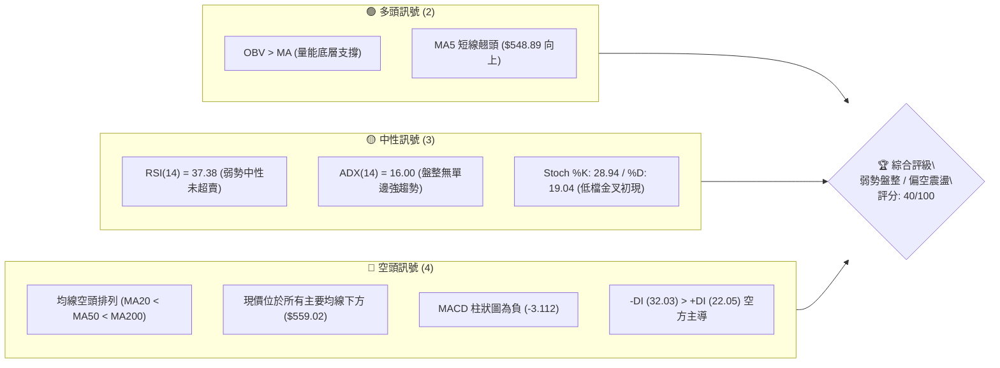
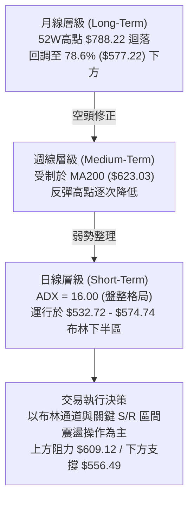
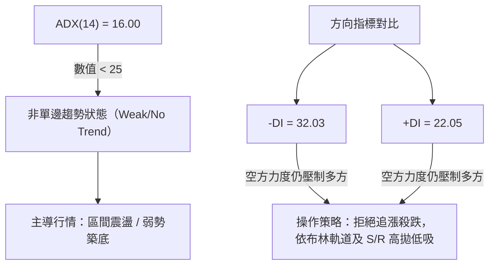
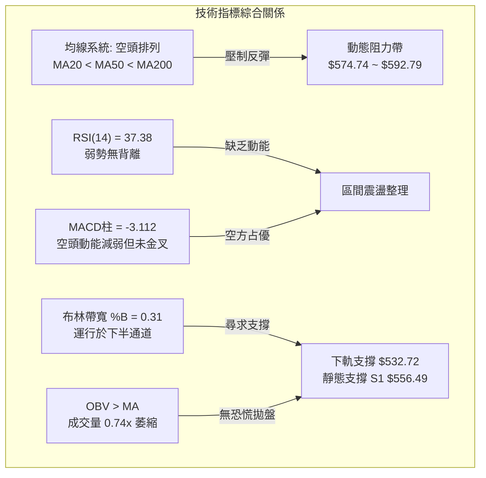
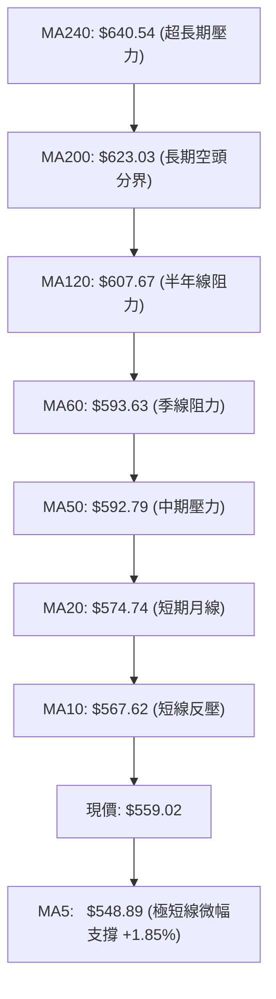
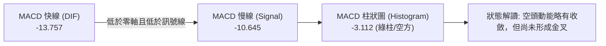
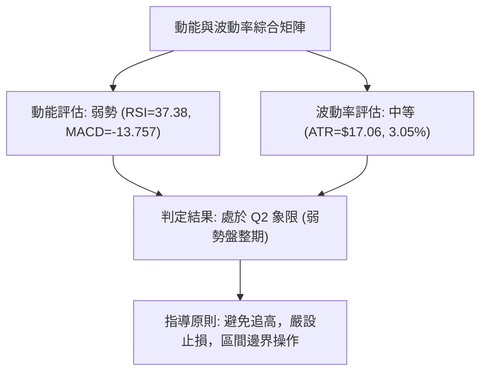
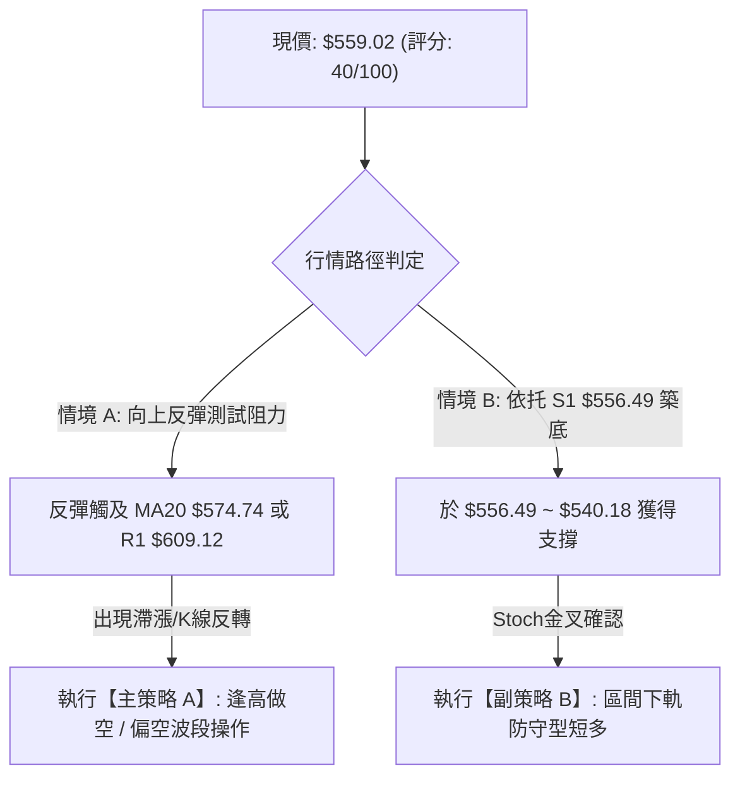
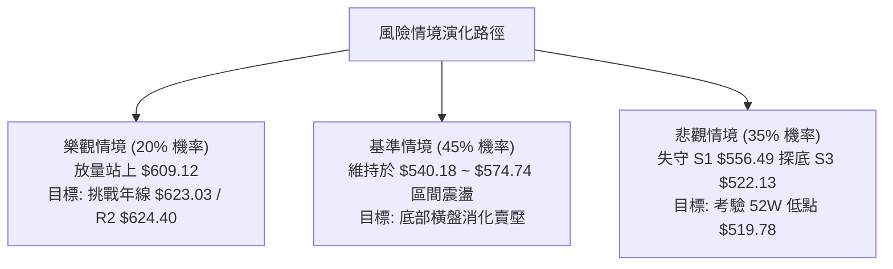

# META 技術分析報告

> **報告日期**：2026-08-25 ｜ **語言**：繁體中文 ｜ **數據來源**：Yahoo Finance ｜ **當前價格**：$559.02

---

## 目錄

| 章節 | 內容 |
|------|------|
| [1. 技術面概覽](#1-技術面概覽) | 訊號儀表板、核心指標速覽、技術評分卡 |
| [2. 趨勢分析](#2-趨勢分析) | 多時框趨勢、12個月走勢圖、週線與 ADX 強度 |
| [3. 圖表形態分析](#3-圖表形態分析) | 形態識別、信心度評估、K線組合、目標價計算 |
| [4. 支撐與阻力](#4-支撐與阻力) | 價位結構分布圖、阻力/支撐分析表、斐波那契回調 |
| [5. 技術指標深度解讀](#5-技術指標深度解讀) | 均線系統、RSI、MACD、布林通道、OBV量價 |
| [6. 動能與波動率](#6-動能與波動率) | 動能四象限、ATR 止損測算、Beta 市場敏感度 |
| [7. 多時框架總結](#7-多時框架總結) | 時框架評分表、訊號矩陣、多時框收斂結論 |
| [8. 交易策略建議](#8-交易策略建議) | 決策路由、情境階梯、主/次策略參數、風控點 |
| [9. 風險提示與監控](#9-風險提示與監控) | 關鍵監控清單、情境推演、資金管理紀律 |

---

## 1. 技術面概覽

### 🎯 技術訊號儀表板



### 📊 核心指標速覽表

| 指標類別 | 指標名稱 | 當前數值 | 訊號 | 解讀 |
|:---|:---|:---|:---:|:---|
| **價格定位** | 當前收盤價 | **$559.02** | 🔴 | 位於 52 週區間 14.6% 低檔，距 52W 低點 $519.78 不遠 |
| **短期均線** | MA20 (月線) | **$574.74** | 🔴 | 現價低於 MA20 (-2.74%)，短線承壓於下行通道中 |
| **中期均線** | MA50 (季線) | **$592.79** | 🔴 | 現價低於 MA50 (-5.83%)，中期反彈首要壓力區 |
| **長期均線** | MA200 (年線)| **$623.03** | 🔴 | 現價遠低於 MA200 (-10.27%)，長期結構偏空 |
| **均線排列** | MA20/50/200 | 空頭排列 | 🔴 | MA20 ($574.74) < MA50 ($592.79) < MA200 ($623.03) |
| **動能指標** | RSI(14) | **37.38** | 🟡 | 位於 30–70 中性偏弱區，未進入極端超賣，無顯著背離 |
| **趨勢動能** | MACD (12/26/9)| **-13.757 / -10.645**| 🔴 | MACD 線位於訊號線下方，柱狀圖 -3.112，空頭動能延續 |
| **隨機指標** | Stoch %K / %D | **28.94 / 19.04** | 🟢 | %K 從超賣區由下向上穿越 %D，短線具備技術性反彈動能 |
| **趨勢強度** | ADX(14) | **16.00** | 🟡 | ADX < 25，單邊趨勢衰竭，當前進入**弱勢箱體盤整**行情 |
| **方向指標** | +DI / -DI | **22.05 / 32.03** | 🔴 | -DI 大於 +DI，空方力量占優勢 |
| **布林通道** | 帶寬 / %B | **$532.72 ~ $616.77 (%B: 0.31)** | 🟡 | 價格運行於中軌 ($574.74) 與下軌 ($532.72) 之間 |
| **波動指標** | ATR(14) | **$17.06 (3.05%)** | 🟡 | 每日平均波動幅度約 17 美元，波動率處於中等水平 |
| **量能指標** | 成交量 / 20日均量 | **12.87M / 17.43M (0.74x)** | 🟡 | 縮量整理，回落過程中拋壓相對減弱 |
| **能量潮** | OBV 趨勢 | OBV > MA | 🟢 | OBV 指標維持在均線之上，長線資金低檔承接意願存在 |

### 🏆 技術評分卡

```
╔════════════════════════════════════════════════════════════════╗
║             META 技術評分卡 (2026-08-25)                       ║
╠════════════════════════════════════════════════════════════════╣
║ 趨勢強度 (ADX=16.00)     ███████░░░░░░░░░░░░░  35/100  🔴 空方盤整 ║
║ 動能指標 (RSI/MACD)      ████████░░░░░░░░░░░░  38/100  🔴 動能疲弱 ║
║ 支撐穩定度 (S1=$556.49)  ███████████░░░░░░░░░  55/100  🟡 臨近支撐 ║
║ 成交量配合 (OBV>MA)      ██████████░░░░░░░░░░  50/100  🟡 縮量蓄勢 ║
║ 形態完整度 (弱勢通道)    ████████░░░░░░░░░░░░  40/100  🔴 尋底階段 ║
║ 均線排列 (空頭排列)      ████░░░░░░░░░░░░░░░░  20/100  🔴 完全空頭 ║
╠════════════════════════════════════════════════════════════════╣
║ 綜合技術評分             ████████░░░░░░░░░░░░  40/100  🔴 偏空觀望 ║
╚════════════════════════════════════════════════════════════════╝
```

---

## 2. 趨勢分析

### 🌐 多時框趨勢分析



### 📈 長期趨勢 — 過去 12 個月走勢圖（2025-09 至 2026-08）

```
META 月線收盤走勢圖（2025-09 至 2026-08）
價格 ($)
$750 ┤ ● (09月: 732.47)
$720 ┤                      ● (01月: 715.22)
$690 ┤
$660 ┤             ●(12月:658.91)
$630 ┤     ●(10月:646.67)       ●(02月:647.03)    ●(05月:631.92)
$600 ┤                                  ●(04月:611.34)
$570 ┤                                        ●(03月:571.60)  ●(06月:563.29)
$540 ┤                                                              ●(07月:556.71) ●(08月:559.02)
     └─┬──────┬──────┬──────┬──────┬──────┬──────┬──────┬──────┬──────┬──────┬──────┬──────
      09月   10月   11月   12月   01月   02月   03月   04月   05月   06月   07月   08月
      '25    '25    '25    '25    '26    '26    '26    '26    '26    '26    '26    '26
```

**12 個月走勢特徵分析表**：

| 階段 | 時間區間 | 起止價格 | 漲跌幅 | 走勢特徵與量價行為 |
|:---|:---|:---:|:---:|:---|
| **頭部構築** | 2025-09 ~ 2025-11 | $732.47 → $646.27 | -11.77% | 自 52 週高點 $788.22 快速回落，跌破 $700 關卡，出現首波大幅拋售 |
| **次頂反彈** | 2025-12 ~ 2026-01 | $658.91 → $715.22 | +8.55%  | 年末迎來反彈測試 $715.22，但未能突破前期高點，形成中期次高點（Lower High）|
| **主跌推動** | 2026-02 ~ 2026-03 | $647.03 → $571.60 | -11.66% | 跌破 MA200，均線系統開始由走平轉為空頭排列，市場信心受挫 |
| **中繼震盪** | 2026-04 ~ 2026-05 | $611.34 → $631.92 | +3.37%  | 在 $600 關卡上方弱勢反彈，受制於下降趨勢線與 MA50 |
| **築底測試** | 2026-06 ~ 2026-08 | $563.29 → $559.02 | -0.76%  | 連續三個月於 $550–$565 狹幅震盪，測試關鍵支撐 S1 ($556.49)，成交量萎縮 |

### 📊 中期趨勢（週線分析）

從近 20 週收盤數據觀察：
1. **高點逐步下移**：2026-04-19 錄得高點 $687.91 後，反彈高點分別落在 2026-05-31 的 $631.92 與 2026-07-12 的 $669.21，隨後迅速跌回 $550 附近。
2. **近期低點測試**：2026-06-28 觸及 $550.25，2026-08-02 觸及 $556.71，2026-08-23 觸及 $549.90，顯示 $550–$556 區間存在密集的買盤防守。
3. **週線 MACD 與 RSI**：MACD 柱狀圖在 2026-08-02 擴大至 -11.160 後，最新一週收斂至 -3.112；週線 RSI 自 22.9 超賣區回升至 37.4，顯示下行動能正在減弱。

### ⚡ 趨勢強度評估（ADX 解讀）



**ADX 趨勢強度對照解讀**：

| 指標 | 數值 | 門檻判定 | 盤面狀態與指導意義 |
|:---|:---:|:---:|:---|
| **ADX(14)** | **16.00** | < 25 (弱趨勢/盤整) | 價格缺乏強烈單邊推進動能，趨勢策略容易反覆被侵蝕，適合區間交易 |
| **+DI(14)** | **22.05** | 多方進攻強度 | 多頭反撲力道不足，未達 25 以上的強勢多頭標準 |
| **-DI(14)** | **32.03** | 空方防守強度 | 空方雖占優勢，但因 ADX 走低，空方主動砸盤動能亦在衰竭中 |

---

## 3. 圖表形態分析

### 🔍 形態識別系統

```mermaid
graph TD
    A["日線與週線形態識別"] --> B["1. 下降通道 (Descending Channel)<br/>狀態: 於下軌邊緣盤整"]
    A --> C["2. 潛在雙重底 (Potential Double Bottom)<br/>第一底: $550.25 (06-28)<br/>第二底: $549.90 (08-23)"]
    B --> D{"形態信心度評估"}
    C --> D
    D -->|"信心度 60%"| E["依據: 兩次低點聚類於 S1 ($556.49) / S2 ($540.18)"]
```



**圖表形態信心度與目標測算表**：

| 形態名稱 | 信心度 | 判斷依據（數據引用） | 形態完成度 | 理論目標價（附計算式） |
|:---|:---:|:---|:---:|:---|
| **雙重底 (潛在)** | **60%** | 低點一 2026-06-28 收 $550.25，低點二 2026-08-23 收 $549.90，兩次於 S1 ($556.49) 與 S2 ($540.18) 區間止跌 | **45%** (尚未突破頸線) | 頸線取 R1 $609.12，底點取 $549.90，形態高度 = $609.12 - $549.90 = $59.22。<br/>突破目標價 = $609.12 + $59.22 = **$668.34**（接近 07-12 高點 $669.21） |
| **下降通道** | **75%** | 2026-04 高點 $687.91、2026-07 高點 $669.21 連線為上軌；2026-06 低點 $550.25、2026-08 低點 $549.90 連線為下軌 | **85%** (通道內震盪) | 若跌破通道下軌，向下測算 S3 **$522.13**；若反彈向上測算通道中軸 MA50 **$592.79** |

*注：因當前 ADX 為 16.00 處於盤整期，雙重底形態尚未獲得頸線突破確認，交易上應以指標型區間操作為主，不宜過早押注突破。*

### 🕯️ 重要 K 線形態分析（近 6 週）

| 週別/日期 | 收盤價 | K線形態特徵 | 技術解讀 | 訊號 |
|:---|:---:|:---|:---|:---:|
| **2026-07-19** | $646.01 | 長上影陰線 | 衝高 $669.21 後遭遇強烈阻力回落，多頭動能耗盡 | 🔴 空頭反轉 |
| **2026-07-26** | $595.19 | 中實體大陰線 | 跌破 $600 整數關卡與 MA20，空方全面接管 | 🔴 空頭延續 |
| **2026-08-02** | $556.71 | 長下影陰十字 | 測試 S1 $556.49，下影線顯示 $550 附近有買盤承接 | 🟡 止跌信號 |
| **2026-08-09** | $592.10 | 實體陽線反彈 | 技術性回抽測試 MA50 ($592.79) 阻力位 | 🟢 短線反彈 |
| **2026-08-16** | $589.85 | 縮量十字星 | 於阻力位附近多空猶豫，量能顯著萎縮 | 🟡 盤整觀望 |
| **2026-08-23** | $549.90 | 探底長下影線 | 二次測試 $550 支撐位，收盤收復部分失地至 $559.02 | 🟢 支撐確認 |

### 📉 ASCII 走勢形態示意圖

```
META 近期雙底測試與下降通道示意圖
價格 ($)
$670 ┤                   ● (07-12: $669.21)
$640 ┤             ●     │  ●
$610 ┤ 頸線 R1 ───┼─────┼──┼─────── $609.12 ─────────── (阻力位)
$580 ┤            │     │  │   ●     ●
$550 ┤ 底點一 ────●─────┼──┼───┼─────●─── 底點二 ─── $549.90 (支撐位)
$520 ┤ (06-28: $550.25) │  │   │  (08-23: $549.90)
     └─────────────────┴──┴───┴─────────────────────────────
```

---

## 4. 支撐與阻力

### 🗺️ 關鍵價位分布圖

```
META 價位結構分布圖 (由 OHLCV 精確計算)
══════════════════════════════════════════════════════════════
$642.40 ║██████████████████████████████║ 強阻力 R3 (波段高點/MA240 $640.54)
$624.40 ║██████████████████████      ║ 中期阻力 R2 (MA200 $623.03 / Fib 61.8%)
$609.12 ║██████████████████████████████║ 關鍵阻力 R1 (頸線壓力 / 布林上軌 $616.77)
────────╫──────────────────────────────╫─────────────────────────────────
$574.74 ║······························║ 動態阻力 (MA20 / 布林中軌)
$559.02 ╠══════════════════════════════╣ ◄ 當前收盤價 ($559.02)
$556.49 ║▓▓▓▓▓▓▓▓▓▓▓▓▓▓▓▓▓▓▓▓▓▓▓▓▓▓▓▓▓▓║ 近期支撐 S1 (波段低點聚類 -0.45%)
$540.18 ║████████████████████          ║ 次級支撐 S2 (波段緩衝區 -3.37%)
$522.13 ║██████████████████████████████║ 強支撐 S3 (52W 低點 $519.78 / Fib 100%)
══════════════════════════════════════════════════════════════
```

### 🚧 阻力位分析表

| 阻力級別 | 精確價位 | 形成依據（數據聚類） | 突破難度 | 技術重要性 |
|:---|:---:|:---|:---:|:---|
| **R1 (關鍵阻力)** | **$609.12** | 近一年波段高點聚類；與日線布林上軌 ($616.77) 及 MA120 ($607.67) 形成重疊壓力區 | ⭐⭐⭐☆ | **高**。短線多頭反轉的「分水嶺」，若無法放量突破，所有反彈均視為解套拋壓點 |
| **R2 (中期阻力)** | **$624.40** | 長期年線 MA200 ($623.03) 所在位置；重合斐波那契 61.8% ($622.32) 回調位 | ⭐⭐⭐⭐ | **極高**。牛熊分界線，突破此處代表中期空頭趨勢終結 |
| **R3 (強阻力)** | **$642.40** | 近一年波段頂部聚類；MA240 均線 ($640.54) 壓制位；前波反彈高點密集套牢區 | ⭐⭐⭐⭐⭐ | **極高**。長期強阻力，需伴隨重大基本面利多方能消化 |

### 🛡️ 支撐位分析表

| 支撐級別 | 精確價位 | 形成依據（數據聚類） | 守住機率 | 技術重要性 |
|:---|:---:|:---|:---:|:---|
| **S1 (近期支撐)** | **$556.49** | 近一年波段低點聚類（距現價僅 -0.45%）；2026-07 收盤 $556.71 之支撐中樞 | 65% | **極高**。當前多頭最後的防守陣地，跌破則宣告下探布林下軌 |
| **S2 (次級支撐)** | **$540.18** | 波段低點下探緩衝區；接近日線布林下軌 ($532.72) 的延伸防守帶 | 75% | **中等**。極端超賣時的技術性買盤承接區 |
| **S3 (強支撐)** | **$522.13** | 52 週最低點 $519.78 聚類區；斐波那契 100.0% 極限回調位 ($519.78) | 85% | **最高**。年度多空生死線，一旦失守將開啟深幅估值修正 |

### 📐 斐波那契回調位分析

依據 52 週波動區間（高點 **$788.22** → 低點 **$519.78**，總振幅 $268.44）：

```
0.0%  (52W High) ────────────────────────────── $788.22
23.6%            ────────────────────────────── $724.87
38.2%            ────────────────────────────── $685.67
50.0%            ────────────────────────────── $654.00
61.8%            ────────────────────────────── $622.32 (重合 R2 $624.40 & MA200)
78.6%            ────────────────────────────── $577.22 (重合 MA20 $574.74)
─── 當前價格: $559.02 (位於 78.6% 與 100.0% 之間) ───
100.0% (52W Low) ────────────────────────────── $519.78 (重合 S3 $522.13)
```

**斐波那契結構深度解讀**：
- 現價 **$559.02** 跌破了關鍵的 78.6% 黃金回調位 **$577.22**，顯示本輪自 $788.22 的回調幅度已吞噬前期大部分漲幅。
- 78.6% 位（$577.22）與當前 MA20（$574.74）高度黏合，構成了現階段最直接的動態反彈壓力。
- 若價格守住 S1 **$556.49** 並回升站穩 **$577.22**，方有機會進一步挑戰 61.8% 位 **$622.32**；反之，若 S1 失守，價格將朝 100% 回調位 **$519.78** 尋求支撐。

---

## 5. 技術指標深度解讀

### 🎛️ 指標訊號總覽



### 📈 移動平均線排列分析



**均線系統詳細參數表**：

| 均線名稱 | 數值 | 現價差距 | 趨勢方向 | 形態解讀 |
|:---|:---:|:---:|:---:|:---|
| **MA 5** | $548.89 | +1.85% | ▲ 向上微翹 | 短線自 $549.90 反彈，極短線提供初步支撐 |
| **MA 10** | $567.62 | -1.52% | ▼ 下行 | 短線第一道動態壓制線 |
| **MA 20** | $574.74 | -2.74% | ▼ 下行 | 月線下行，限制反彈空間 |
| **MA 50** | $592.79 | -5.83% | ▼ 下行 | 季線下行，中期趨勢偏空 |
| **MA 60** | $593.63 | -5.83% | ▼ 下行 | 與 MA50 形成雙重密集壓力帶 |
| **MA 120** | $607.67 | -8.01% | ▼ 下行 | 接近關鍵阻力 R1 $609.12 |
| **MA 200** | $623.03 | -10.27%| ▼ 下行 | 牛熊分界線，長期均線下彎 |
| **MA 240** | $640.54 | -12.73%| ▼ 下行 | 接近強阻力 R3 $642.40 |

*均線排列判定*：標準的**空頭排列**（MA20 < MA50 < MA200），所有中長期均線均向下傾斜，顯示上方層層套牢籌碼沉重。

### 📉 RSI(14) 分析

- **當前數值**：**37.38**
- **強度進度條**：`███████░░░░░░░░░░░░░` 37.38% (弱勢偏空區間)
- **區間判定**：位於 30–70 中性區，尚未觸及 <30 的超賣界線。
- **背離分析**：
  - 價格於 2026-06-28 創下 $550.25（週 RSI 35.3），隨後在 2026-08-02 觸及 $556.71（週 RSI 22.9 觸底），最新在 2026-08-23 探底 $549.90 時週 RSI 回升至 31.3，日線 RSI 來到 37.38。
  - **結論**：日線層級呈現**弱底背離初露端倪**，但強度尚不足以引發大級別趨勢反轉，僅支援短線技術性回抽。

### 📊 MACD(12/26/9) 訊號解讀



- **MACD 線**：-13.757
- **Signal 線**：-10.645
- **Histogram 柱狀圖**：-3.112
- **解讀**：雙線深處零軸下方，屬於典型弱勢市場特徵。柱狀圖自 -11.160 回升至 -3.112，表明空方砸盤力度減弱，但未見黃金交叉買入訊號，目前不具備左側大舉做多條件。

### 📦 布林通道分析（Bollinger Bands, 20, 2）

```
META 日線布林通道結構
價格 ($)
$616.77 ┤ ══════════════════════════════════════ 上軌 (Upper Band)
        │
$595.00 ┤
        │
$574.74 ┤ -------------------------------------- 中軌 (MA20 Middle Band)
        │
$559.02 ┤ ◄ 現價 ($559.02, %B = 0.31)
        │
$532.72 ┤ ══════════════════════════════════════ 下軌 (Lower Band)
```

- **BB 上軌**：$616.77（重合 R1 $609.12 阻力區）
- **BB 中軌**：$574.74（即 MA20 動態反壓）
- **BB 下軌**：$532.72（接近 S2 $540.18 支撐防守區）
- **帶寬 %B**：**0.31**
- **通道解讀**：現價位於中軌下方，處於下半通道運行。%B 為 0.31 顯示價格偏向弱勢但未跌破下軌產生「軌道破位」。通道開口未顯著擴大，符合 ADX=16 所指示的**箱體震盪**特徵。中軌 $574.74 為短線反彈首道天花板。

### 💹 成交量與 OBV 分析（量價配合度）

- **最新成交量**：12,868,199 股
- **20 日均量**：17,434,470 股（**量比 0.74x**）
- **50 日均量**：17,985,498 股
- **OBV（能量潮）狀態**：**OBV > MA**
- **量價行為解讀**：
  1. **縮量探底**：在價格跌至 $559.02 過程中，成交量萎縮至均量之 74%，顯示市場並未出現恐慌性拋售，賣壓已逐步消化。
  2. **OBV 支撐**：OBV 維持在均線上方，表明在 $550–$570 區間有主力資金進行暗中吸籌，為價格提供了潛在的底層流動性支撐。

---

## 6. 動能與波動率

### ⚡ 動能評估四象限

| 象限 | 動能維度 (Momentum) | 波動率維度 (Volatility) | 當前狀態標記 | 策略與市場環境評估 |
|:---:|:---:|:---:|:---:|:---|
| **Q1** | 強動能 (Bullish) | 低波動 (Low Volatility) | — | 穩定單邊牛市，順勢持股加碼 |
| **Q2** | 弱動能 (Bearish) | 低/中波動 (Moderate Vol) | **✓ META 當前定位** | **弱勢築底/箱體盤整，謹慎觀望，以區間 S/R 操作為主** |
| **Q3** | 強動能 (Bullish) | 高波動 (High Volatility) | — | 主升浪/爆發行情，注意動態止盈 |
| **Q4** | 弱動能 (Bearish) | 高波動 (High Volatility) | — | 恐慌主跌浪，全面空倉避險 |



### 📊 ATR 波動率分析

- **ATR(14)**：**$17.06**（佔當前股價之 **3.05%**）
- **日內波動特徵**：每日正常理論波動區間約為 ±$17.00。
- **止損與部位建議**：
  - **保守型止損距離 (2.0 × ATR)**：$17.06 × 2.0 = **$34.12**
  - **激進型/短線止損距離 (1.0 × ATR)**：$17.06 × 1.0 = **$17.06**
  - **進場止損設置參考**：若於現價 $559.02 附近建立短線多頭部位，止損應設於 S1 下方（如 $540.18，距離現價約 $18.84，約合 1.1 × ATR），避免被正常日內噪音掃出場。

### 📐 Beta 與市場相關性

- **Beta 係數**：**1.243**
- **解讀**：META 波動度比標普 500 指數高出約 24.3%。在大盤弱勢時可能承受更大下行 beta 壓力，但在反彈行情中亦具備更強彈性。

---

## 7. 多時框架總結

### 📋 時框架評分表

| 時框架 | 趨勢方向 | 動能狀態 | 均線排列 | 形態結構 | 綜合評分 | 建議操作方向 |
|:---|:---:|:---:|:---:|:---:|:---:|:---|
| **月線 (長期)** | 🔴 偏空 | 弱勢回調 | 空頭排列 (跌破MA200) | 52W高點回落 78.6% | **35/100** | 長線防守，等待右側放量信號 |
| **週線 (中期)** | 🔴 空頭 | MACD柱收斂 | 承壓於 MA50/MA200 | 下降通道內運行 | **40/100** | 反彈逢高減磅，受制於 R1/R2 |
| **日線 (短期)** | 🟡 盤整 | Stoch超賣金叉 | 空頭排列 (MA5微翹) | 雙底測試 S1 ($556.49) | **45/100** | 區間交易，依布林下軌搏反彈 |

### 🔲 綜合訊號矩陣

```
時框一致性分析：
────────────────────────────────────────────────────────────────
時框架         長週期 (月線)      中週期 (週線)      短週期 (日線)
趨勢訊號       🔴 空頭修正        🔴 下降通道        🟡 箱體盤整
動能訊號       🔴 弱勢           🟡 綠柱縮短        🟢 低檔金叉
均線訊號       🔴 空頭排列        🔴 均線反壓        🔴 壓制於MA20
────────────────────────────────────────────────────────────────
一致性結論：中長線空頭壓制明確，短線日線出現超跌盤整特徵，短多與長空衝突。
```

### ⚖️ 多時框收斂結論（依規則 14 判定）

依據多時框收斂規則：
1. 當前 **ADX(14) = 16.00 < 25**，市場被明確定義為**盤整/無單邊趨勢行情**。
2. 在盤整行情中，交易邏輯應以**日線布林通道上下軌（$532.72 ~ $616.77）與關鍵 S/R 區間**為主要決策邊界，而非單純依賴中長期趨勢做單向追單。
3. **唯一方向性結論**：**【弱勢區間震盪 / 逢高偏空，極限支撐短多】**。整體技術評分為 **40/100**，主基調維持偏空防守，交易策略以「反彈受阻於 R1/MA20 做空」為主，輔以「回踩 S1/S2 止跌極小倉位博反彈」。

---

## 8. 交易策略建議

### 🗺️ 策略決策流程圖



### 🧭 策略路由說明

> **當前主策略方向 = 【逢高偏空操作（反彈承壓做空）】（依技術評分 40/100 判定）**

由於整體均線呈現標準空頭排列，MACD 處於負值區間，且現價低於所有主要中長期均線，反彈將面臨密集解套賣壓。因此，首選策略為等待反彈至關鍵阻力位時建立空頭部位，次選策略為在關鍵支撐位進行嚴格止損的超跌短多。

### 🎯 價格情境階梯（Price Scenarios）

| 觸發條件 | 目標價位 1 | 目標價位 2 | 情境技術含義 |
|:---|:---:|:---:|:---|
| **放量突破 R1 $609.12** | **R2 $624.40** | **R3 $642.40** | 短線結構反轉，突破日線布林上軌，挑戰年線 MA200 |
| **突破 MA20 $574.74** | **R1 $609.12** | **Fib 61.8% $622.32** | 突破布林中軌，展開中繼反彈 |
| **維持於現價 $559.02 震盪** | **MA20 $574.74** | **S1 $556.49** | 弱勢箱體整理，消化均線下行壓力 |
| **跌破 S1 $556.49** | **S2 $540.18** | **S3 $522.13** | 跌破近期密集支撐，下探布林下軌與 52 週低點區 |

### 📊 情境機率分佈

| 情境劇本 | 發生機率 | 主要技術依據 |
|:---|:---:|:---|
| **情境一：區間震盪築底** | **45%** | ADX=16.00 顯示無單邊趨勢；OBV>MA 且成交量萎縮至 0.74x，顯示 $550–$575 區間具備承接力 |
| **情境二：反彈受阻回落** | **35%** | 均線系統完全空頭排列，MACD 負值，反彈至 MA20 ($574.74) 或 R1 ($609.12) 易引發二次拋壓 |
| **情境三：直接放量突破** | **20%** | RSI 僅 37.38 缺乏買盤動能，需基本面重大催化劑方能突破 R1 $609.12 |

---

### 🟢 主策略與副策略詳情

#### 策略 A：【主推 — 反彈受阻逢高做空】（趨勢順勢）
適合於價格回抽測試動態阻力或關鍵阻力受阻時介入。

| 策略要素 | 參數設定 | 技術依據與說明 |
|:---|:---:|:---|
| **進場條件** | 價格反彈至 MA20 或 R1 附近出現長上影線/陰線確認 | 阻力位確認有效 |
| **進場價格** | **$574.74**（激進） / **$609.12**（保守） | 分別對應 MA20 中軌與關鍵阻力 R1 |
| **目標價 T1** | **$556.49** | 近期支撐 S1（第一階段止盈） |
| **目標價 T2** | **$540.18** | 次級支撐 S2 / 布林下軌附近 |
| **止損價格** | **$592.79**（對應 $574.74 入場） / **$624.40**（對應 $609.12 入場） | 突破 MA50 或 R2 (MA200) 嚴格止損 |
| **風險報酬比** | **1 : 1.95**（以 $609.12 進場測算） | 風險 $15.28，潛在利潤 $52.63 (至 S1) ~ $68.94 (至 S2) |
| **成功機率** | **65%** | 順應中長期空頭均線排列 |
| **建議倉位** | **10% ~ 15%** | 盤整期不宜過重 |

#### 策略 B：【副選 — 關鍵支撐極限反彈做多】（區間逆勢）
適合於依託 S1/S2 關鍵支撐搏取超跌反彈。

| 策略要素 | 參數設定 | 技術依據與說明 |
|:---|:---:|:---|
| **進場條件** | 現價回踩 S1 $556.49 不破，且 15分/60分 K線收出看漲吞沒 | 低檔支撐有效 |
| **進場價格** | **$556.49**（現價回踩時） | 關鍵支撐 S1 聚類點位 |
| **目標價 T1** | **$574.74** | 短期 MA20 / 布林中軌 |
| **目標價 T2** | **$609.12** | 關鍵阻力 R1 / 頸線位置 |
| **止損價格** | **$540.18** | 跌破次級支撐 S2 立即離場（虧損約 $16.31，約 1.0 × ATR） |
| **風險報酬比** | **1 : 3.23** | 風險 $16.31，潛在利潤 $52.63 (至 T2) |
| **成功機率** | **45%** | 逆中長期趨勢，依賴短線超賣修復 |
| **建議倉位** | **5% ~ 8%** | 嚴格輕倉參與 |

### 🔴 反向風險觸發點（對沖與風控提示）

- **多頭轉強信號（全面平空/轉多觸發）**：日線收盤價**強勢站穩 R1 $609.12**，且伴隨成交量放大至 20 日均量 1.5 倍以上、MACD 出現零下金叉。若出現此訊號，空頭部位必須全數平倉止損。
- **空頭加速信號（破位止損/追空觸發）**：日線收盤價**跌破 S1 $556.49 且進一步擊穿 S2 $540.18**，若此時 ADX 上升突破 25，代表開啟新一輪單邊下跌，多頭部位必須無條件離場。

### ⭐ 整體訊號強度評星

```
╔════════════════════════════════════════════════════════════════╗
║ 做多訊號強度：★★☆☆☆  (2/5 星 - 僅限支撐位短線搏反彈)          ║
║ 做空訊號強度：★★★☆☆  (3/5 星 - 中長均線壓制，反彈逢高布空)    ║
║ 整體可信度：  ★★★☆☆  (3/5 星 - ADX=16 震盪市，需嚴防假突破)   ║
╚════════════════════════════════════════════════════════════════╝
```

---

## 9. 風險提示與監控

### ✅ 關鍵監控指標 Checklist

```
╔════════════════════════════════════════════════════════════════╗
║                    每日盤後關鍵技術監控清單                    ║
╠════════════════════════════════════════════════════════════════╣
║ [ ] 價格是否跌破支撐 S1: $556.49 (跌破則下看 S2 $540.18)       ║
║ [ ] 價格是否突破阻力 MA20: $574.74 (突破則看 R1 $609.12)       ║
║ [ ] MACD 柱狀圖是否由負轉正 (當前 -3.112)                      ║
║ [ ] RSI(14) 是否跌破 30 (進入超賣) 或突破 50 (強弱分界)         ║
║ [ ] ADX(14) 是否上升至 25 以上 (確認趨勢行情啟動)              ║
║ [ ] 日成交量是否放大超越 20日均量 (17.43M 股)                  ║
║ [ ] 布林通道帶寬是否開始擴張破位 (%B 偏離 0~1 區間)            ║
╚════════════════════════════════════════════════════════════════╝
```

### ⚠️ 風險場景推演



### 🛡️ 風險管理與資金管理紀律

1. **單筆最大虧損限制**：單筆交易虧損金額嚴格控制在總投資帳戶資金的 **1.0% ~ 1.5%** 以內。
2. **ATR 動態止損應用**：依據當前 ATR **$17.06**，所有進場部位之止損設定嚴禁小於 1.0 × ATR（約 $17），以防被盤中正常隨機震盪洗出場。
3. **拒絕盤整期過度交易**：ADX 處於 16.00 低位時，假突破與假跌破發生率高達 60% 以上，嚴禁在區間中軸（$565–$570）盲目追單，必須於區間邊界（S1/S2 或 R1/MA20）出現明確信號後方可執行。

---

## 📋 報告總結

```
╔════════════════════════════════════════════════════════════════╗
║                  META 技術分析報告總結                         ║
╠════════════════════════════════════════════════════════════════╣
║ 報告日期：2026-08-25                                           ║
║ 當前價格：$559.02                                              ║
║ 分析評級：🔴 偏空觀望 / 弱勢區間震盪 (綜合評分: 40/100)        ║
╠════════════════════════════════════════════════════════════════╣
║ 關鍵結論：                                                     ║
║ ├─ 長期趨勢：🔴 空頭修正（受制於 MA200 $623.03，自高點回調）   ║
║ ├─ 中期趨勢：🔴 下降通道（反彈高點下移，承壓於 MA50 $592.79）  ║
║ ├─ 短期趨勢：🟡 弱勢盤整（ADX=16.00，測試 S1 $556.49 支撐）   ║
║ ├─ 關鍵支撐：S1: $556.49 ｜ S2: $540.18 ｜ S3: $522.13         ║
║ ├─ 關鍵阻力：R1: $609.12 ｜ R2: $624.40 ｜ R3: $642.40         ║
║ └─ 分析師目標共識：$754.14 (基本面長期目標，與短期技術面承壓分歧)║
╠════════════════════════════════════════════════════════════════╣
║ 最優策略組合：                                                 ║
║ 1. 🥇 最佳機會：反彈至 MA20 ($574.74) 或 R1 ($609.12) 受阻做空 ║
║ 2. 🥈 次選機會：回踩 S1 ($556.49) 出現止跌信號建立輕倉短多     ║
║ 3. 🥉 保守選擇：完全空倉觀望，等待突破 R1 $609.12 或跌破 S3   ║
╚════════════════════════════════════════════════════════════════╝
```

---

> ⚠️ **免責聲明**：本報告為基於量化指標與圖表形態之技術分析研究，所有數據與價位推演均基於歷史市場交易資訊。本報告**僅供學術研究與投資參考**，**不構成任何具體的買賣邀約或投資建議**。金融市場瞬息萬變，投資人應獨立評估風險並自行承擔交易盈虧。

---

*報告生成時間：2026-08-25 ｜ 數據來源：Yahoo Finance ｜ 分析框架：多時框技術分析模型*