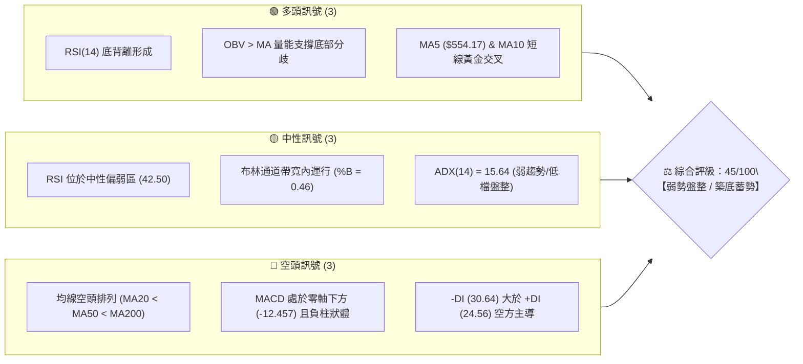
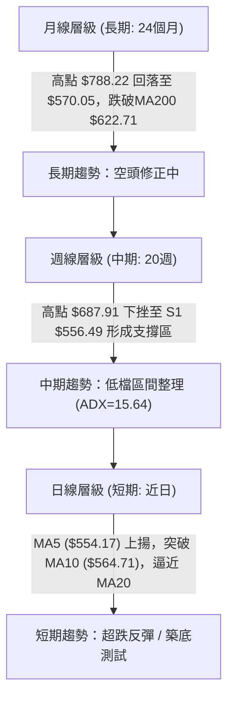
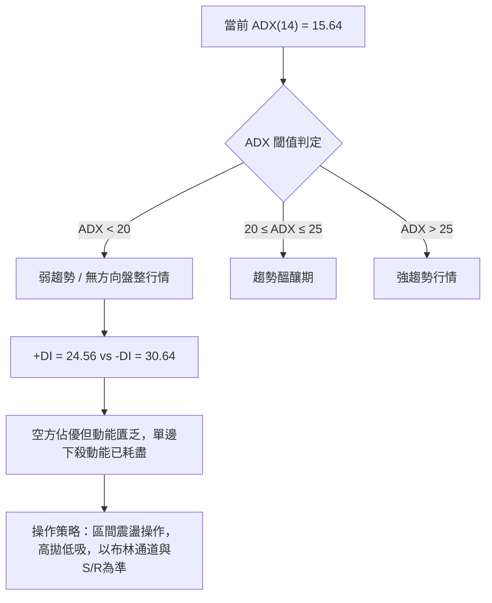
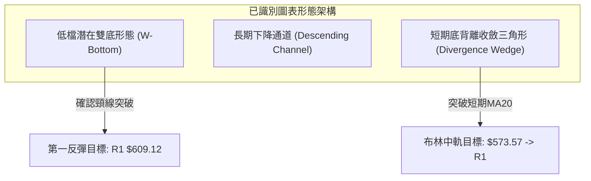
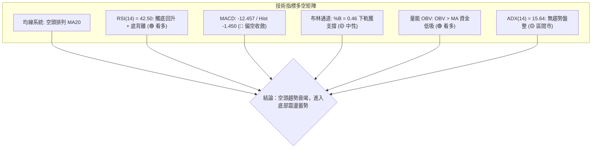
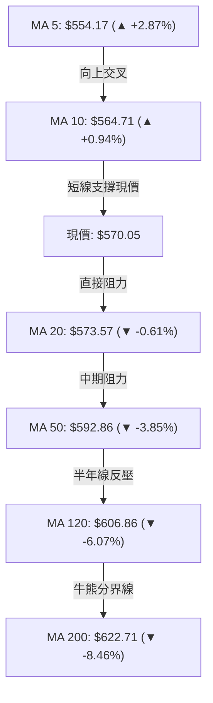
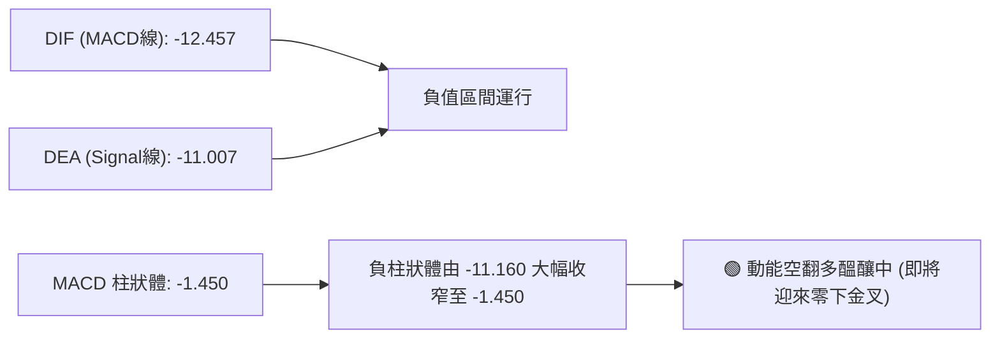
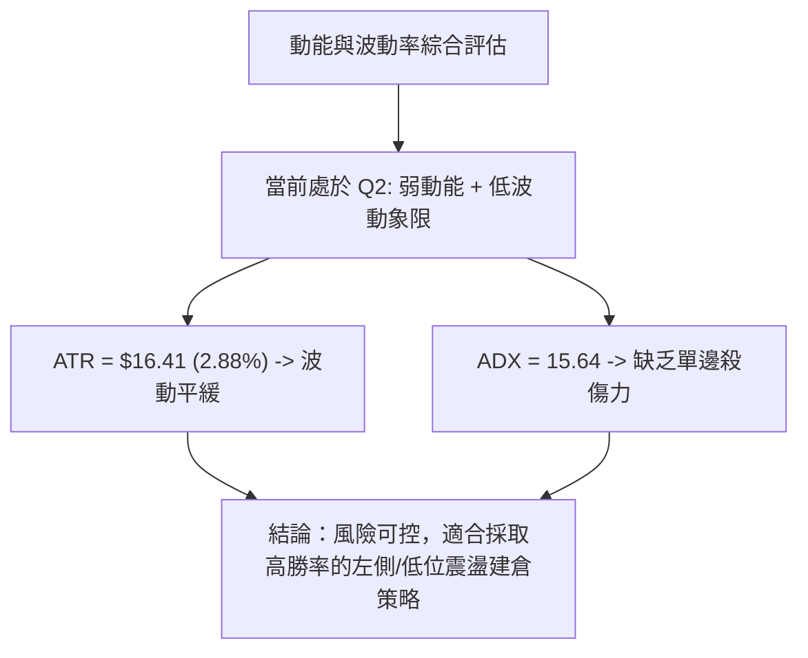
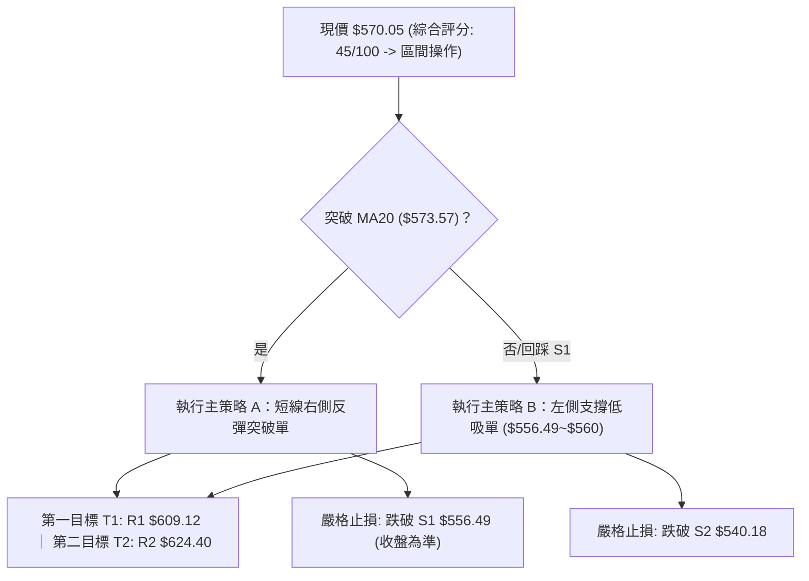
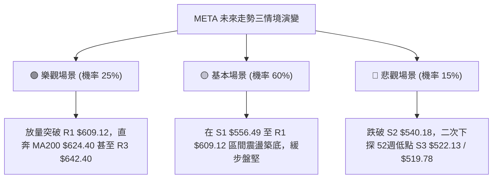

# META 技術分析報告

> **報告日期**：2026-08-26 ｜ **語言**：繁體中文 ｜ **數據來源**：Yahoo Finance ｜ **當前價格**：$570.05

---

## 目錄

| 章節 | 內容 |
|------|------|
| [1. 技術面概覽](#1-技術面概覽) | 訊號儀表板、核心指標、評分卡 |
| [2. 趨勢分析](#2-趨勢分析) | 多時框趨勢、長中短期走勢 |
| [3. 圖表形態分析](#3-圖表形態分析) | 形態識別、K線組合、目標價 |
| [4. 支撐與阻力](#4-支撐與阻力) | 關鍵價位、斐波那契回調 |
| [5. 技術指標深度解讀](#5-技術指標深度解讀) | MA/RSI/MACD/布林/成交量 |
| [6. 動能與波動率](#6-動能與波動率) | 動能評估、ATR、Beta |
| [7. 多時框架總結](#7-多時框架總結) | 時框架評分矩陣 |
| [8. 交易策略建議](#8-交易策略建議) | 多空策略、風險報酬比 |
| [9. 風險提示與監控](#9-風險提示與監控) | 監控指標、風險場景 |

---

## 1. 技術面概覽

### 🎯 技術訊號儀表板



### 📊 核心指標速覽表

| 指標類別 | 指標名稱 | 當前數值 | 訊號 | 解讀 |
|----------|----------|----------|------|------|
| **價格** | 收盤價 | $570.05 | 🟡 | 位於52週區間 18.7%，貼近一年低點區 |
| **均線** | MA20 | $573.57 | 🔴 | 現價位於中軌MA20下方 -0.61%，短線受壓 |
| **均線** | MA50 | $592.86 | 🔴 | 中期生命線下彎，現價落後 -3.85% |
| **均線** | MA200 | $622.71 | 🔴 | 長期牛熊分界線失守，長期走勢偏空 |
| **動能** | RSI(14) | 42.50 | 🟢 | 自超賣區回升，出現明確日線底背離結構 |
| **動能** | MACD | -12.457 / Hist -1.450 | 🔴 | MACD線位於訊號線下方，動能柱狀體呈負值 |
| **趨勢** | ADX(14) | 15.64 | 🟡 | ADX < 25 表明目前無單邊趨勢，處於區間震盪 |
| **通道** | Bollinger %B | 0.46 | 🟡 | 位於布林通道下半部，貼近中軌 $573.57 震盪 |
| **量能** | OBV 趨勢 | OBV > MA | 🟢 | 價格探底但量能未創低，隱含主力資金低吸吸籌 |
| **波動** | ATR(14) | $16.41 (2.88%) | 🟡 | 波動率處於中等水平，每日波幅約 $16.41 |

### 🏆 技術評分卡

```
╔══════════════════════════════════════════════════════════════╗
║              技術評分卡 — META (2026-08-26)                  ║
╠══════════════════════════════════════════════════════════════╣
║ 趨勢強度 (ADX=15.64)  ██████░░░░░░░░░░░░░░  30/100  🔴 空方弱勢 ║
║ 動能指標 (RSI/MACD)   ████████░░░░░░░░░░░░  40/100  🟡 底背離醞釀║
║ 支撐穩定度 (S1/S2)    ██████████████░░░░░░  70/100  🟢 52W低點支撐║
║ 成交量配合 (OBV>MA)   ████████████░░░░░░░░  60/100  🟢 縮量沉澱 ║
║ 形態完整度 (雙底初形) ██████████░░░░░░░░░░  50/100  🟡 區間待突破║
║ 均線排列 (空頭排列)   ████░░░░░░░░░░░░░░░░  20/100  🔴 均線反壓 ║
╠══════════════════════════════════════════════════════════════╣
║ 綜合評分              █████████░░░░░░░░░░░  45/100  ⚖️ 區間震盪 ║
╚══════════════════════════════════════════════════════════════╝
```

---

## 2. 趨勢分析

### 🌐 多時框趨勢分析



### 📈 長期趨勢 — 12個月走勢圖（Unicode）

```
META 月線走勢圖（2025-08 至 2026-08）
價格 ($)
$788.22 ┤
$750.00 ┤ ●(08/25: $736.29)
$700.00 ┤   ●(09/25: $732.47)    ●(01/26: $715.22)
$650.00 ┤     ●──●(10-11/25: $646) ●(12/25: $658)  ●(02/26: $647)  ●(05/26: $631.92)
$600.00 ┤                                           ●(04/26: $611)
$550.00 ┤                                             ●(03/26: $571) ●(06/26: $563) ●(07/26: $556.71)
$500.00 ┤                                                                              ●(現價: $570.05)
        └─────────────────────────────────────────────────────────────────────────────
         25-08  25-09  25-10  25-11  25-12  26-01  26-02  26-03  26-04  26-05  26-06  26-07  26-08
```

#### 走勢特徵分析表格
| 階段 | 時間跨度 | 價格區間 | 漲跌幅 | 走勢特徵與技術解讀 |
|------|----------|----------|--------|-------------------|
| **第一階段：高檔作頂** | 2025-08 ~ 2025-09 | $736.29 → $732.47 | -0.52% | 52週高點 $788.22 見頂後高檔滯漲，量能逐步萎縮 |
| **第二階段：首波下殺** | 2025-09 ~ 2025-11 | $732.47 → $646.27 | -11.77% | 跌破 $700 整數關卡，回測 $646 平台尋求支撐 |
| **第三階段：弱勢反彈** | 2025-11 ~ 2026-01 | $646.27 → $715.22 | +10.67% | 形成右肩高點 $715.22，受阻於 Fibonacci 23.6% ($724.87) |
| **第四階段：主跌破位** | 2026-01 ~ 2026-03 | $715.22 → $571.60 | -20.08% | 連續跌破 MA50 與 MA200，空頭趨勢加速下行 |
| **第五階段：低檔築底** | 2026-03 ~ 2026-08 | $571.60 → $570.05 | -0.27% | 價格在 $540.18~$631.92 寬幅震盪，形成大週期底部整理區間 |

### 📊 中期趨勢（週線分析）

```
META 週線阻力與支撐分布示意
========================================================================
$642.40 ────────────────────────────────────────── 阻力 R3 (中期強阻力)
$624.40 ────────────────────────────────────────── 阻力 R2 (MA200 / Fib 61.8%)
$609.12 ────────────────────────────────────────── 阻力 R1 (Fib 78.6% 上方波段高點)
$573.57 ┄┄┄┄┄┄┄┄┄┄┄┄┄┄┄┄┄┄┄┄┄┄┄┄┄┄┄┄┄┄┄┄┄┄┄┄┄┄┄ MA20 / 布林中軌 ($573.57)
$570.05 ◄═════════════════════════════════════════ 【當前價格 $570.05】
$556.49 ────────────────────────────────────────── 支撐 S1 (近4週雙重低點聚類)
$540.18 ────────────────────────────────────────── 支撐 S2 (波段次低點)
$519.78 ────────────────────────────────────────── 52週最低價 (強支撐 S3: $522.13)
========================================================================
```

### ⚡ 趨勢強度評估（ADX 解讀）



| 指標 | 數值 | 狀態 | 技術含義解讀 |
|------|------|------|-------------|
| **ADX(14)** | 15.64 | 弱勢盤整 (< 25) | 趨勢強度極低，單邊空頭波段已轉入時間換空間的築底箱體。 |
| **+DI** | 24.56 | 多方動能偏弱 | 多方低檔反撲，但尚未跨越 25 強勢分界線。 |
| **-DI** | 30.64 | 空方主導方向 | 空方仍具相對主導權，但已自前期高點回落，空頭壓制力衰竭。 |

---

## 3. 圖表形態分析

### 🔍 形態識別系統



#### 形態信心度評估表
| 形態名稱 | 信心度 | 判斷依據（引用技術數據） | 完成度 | 目標價（附計算式） |
|----------|--------|-------------------------|--------|--------------------|
| **低檔雙底 (Double Bottom)** | 62% | 左底 2026-08-02 的 $556.71 與右底 2026-08-23 的 $549.90 獲得支撐 S1 ($556.49) 確認，RSI 底背離成立。 | 75% | 頸線 $592.10 (08-09高點) + 形態高度 ($592.10 - $549.90 = $42.20) = **$634.30**（落於 R2 $624.40 至 R3 $642.40 區間） |
| **下降通道整理** | 78% | 價格受制於 MA20 ($573.57)、MA50 ($592.86) 與下軌支撐 S2 ($540.18) 的斜向通道內運行。 | 90% | 通道上軌阻力目標為 **R1 $609.12** |
| **布林帶低檔壓縮突破** | 55% | 布林 %B 為 0.46，下軌 $532.45 提供極強緩衝，現價正向中軌 $573.57 靠攏。 | 60% | 中軌突破後測量目標為布林上軌 **$614.70** |

### 🕯️ 重要K線形態分析

| 日期 / 週期 | 收盤價 | K線形態特徵 | 技術解讀 | 訊號 |
|-------------|--------|-------------|----------|------|
| **2026-08-02** | $556.71 | 長下影陰線 (週成交量 1.12億股) | 爆量下探測試 52週低點區間，觸發抄底盤，形成第一低點 | 🟢 |
| **2026-08-09** | $592.10 | 實體大陽線 (週漲幅 +6.36%) | 買盤強勢反彈，確立 S1 $556.49 為有效波段支撐 | 🟢 |
| **2026-08-16** | $589.85 | 高檔十字星 (縮量 6,422萬股) | 測試 MA20 阻力未果，多空雙方在 $590 關卡陷入拉鋸 | 🟡 |
| **2026-08-23** | $549.90 | 縮量長下影洗盤線 | 二次探底未破 S2 ($540.18)，完成右底測試，量能急縮 | 🟢 |
| **2026-08-30 (當前)** | $570.05 | 溫和回升陽線 (日量能 971萬股) | 站穩 MA5 ($554.17) 與 MA10 ($564.71)，短線發出止跌訊號 | 🟢 |

### 📉 ASCII 走勢形態示意圖

```
META 近期雙底形態結構示意
========================================================================
$600.00 ┤                ● 頸線高點: $592.10 (2026-08-09)
$590.00 ┤               / \               ● 當前反彈推進中: $570.05
$580.00 ┤              /   \             /
$570.00 ┤             /     \           /   ◄ MA20 阻力 $573.57
$560.00 ┤            /       \         /
$550.00 ┤ ●─────────/         \───────●  右底: $549.90 (2026-08-23)
$540.00 ┤ 左底: $556.71 (08-02) 
========================================================================
形態頸線突破觸發點：$592.10 ｜ 形態防守支撐：S1 $556.49 / S2 $540.18
```

### 🎯 形態目標價計算

1. **雙底形態理論高度**：
   - 形態頸線點位 = $592.10
   - 形態低點基準 = $549.90
   - 形態垂直高度 $H = \$592.10 - \$549.90 = \$42.20$
2. **第一階段測量目標 (T1)**：
   - 突破阻力 R1 $609.12（與布林上軌 $614.70 重合共振）
3. **第二階段完整目標 (T2)**：
   - 頸線 $592.10 + $42.20 = **$634.30**（精確落於 R2 $624.40 與 R3 $642.40 之間，且與 MA240 $639.80 形成強大阻力共振）

---

## 4. 支撐與阻力

### 🗺️ 關鍵價位分布圖（Unicode）

```
META 價位結構分布圖
═══════════════════════════════════════════════════════════════════
$642.40 ║██████████████████████████████║ 強阻力 R3 (近一年密集套牢區)
$624.40 ║██████████████████████        ║ 中期阻力 R2 (Fib 61.8% / MA200)
$609.12 ║██████████████████            ║ 關鍵阻力 R1 (Fib 78.6% 上方波段高點)
$577.22 ║▓▓▓▓▓▓▓▓▓▓▓▓▓▓                ║ 斐波那契 78.6% 回調位
$573.57 ║══════════════════════════════║ 布林中軌 / MA20 關鍵分水嶺
$570.05 ╠══════════════════════════════╣ ◄ 現價 $570.05
$556.49 ║▓▓▓▓▓▓▓▓▓▓▓▓▓▓▓▓▓▓▓▓          ║ 近期核心支撐 S1 (波段低點聚類)
$540.18 ║██████████████████████        ║ 強支撐 S2 (波段次低點防線)
$522.13 ║██████████████████████████████║ 極限支撐 S3 (52W最低價 $519.78 聚類)
═══════════════════════════════════════════════════════════════════
```

### 🚧 阻力位分析表

| 阻力級別 | 價位 | 形成原因（波段高點聚類） | 突破難度 | 重要性 |
|----------|------|--------------------------|----------|--------|
| **R1** | **$609.12** | 近期波段高點聚類，接近布林上軌 $614.70 與 MA120 ($606.86) | 中等 | ⭐⭐⭐⭐ 突破代表短線轉強，脫離底部箱體 |
| **R2** | **$624.40** | 斐波那契 61.8% ($622.32) 與 MA200 ($622.71) 長期牛熊分界線聚類 | 極高 | ⭐⭐⭐⭐⭐ 多頭中期反轉的決定性考驗 |
| **R3** | **$642.40** | 2025年Q4至2026年Q1密集平台整理高點，籌碼套牢沉重 | 極高 | ⭐⭐⭐⭐ 中期波段反彈極限目標 |

### 🛡️ 支撐位分析表

| 支撐級別 | 價位 | 形成原因（波段低點聚類） | 守住機率 | 重要性 |
|----------|------|--------------------------|----------|--------|
| **S1** | **$556.49** | 2026-08-02 收盤價 $556.71 與 MA10 ($564.71) 形成的短線防守共振帶 | 75% | ⭐⭐⭐⭐ 短線防守第一道防線，跌破則轉弱 |
| **S2** | **$540.18** | 波段次低點聚類，布林通道下軌 $532.45 上方動態緩衝區 | 85% | ⭐⭐⭐⭐⭐ 多頭雙底形態的最後生命線 |
| **S3** | **$522.13** | 52週最低價 $519.78 聚類區間，極限估值防禦底 | 95% | ⭐⭐⭐⭐⭐ 長期價值投資底線，不容有失 |

### 📐 斐波那契回調位分析

依據 52 週完整波動區間（高點 **$788.22** 至 低點 **$519.78**，垂直落差 $268.44）：

```
Fibonacci Retracement Grid ($519.78 -> $788.22)
┌────────┬──────────┬─────────────────────────────────────────────────┐
│ 比率   │ 價位     │ 技術意涵與當前價格空間關係                      │
├────────┼──────────┼─────────────────────────────────────────────────┤
│ 0.0%   │ $788.22  │ 52週歷史高點 (距現價 +38.27%)                   │
│ 23.6%  │ $724.87  │ 2026年1月反彈高點聚類區間                       │
│ 38.2%  │ $685.67  │ 中期強阻力區 (2026年4月高點 $687.91)            │
│ 50.0%  │ $654.00  │ 關鍵多空平衡中樞                                │
│ 61.8%  │ $622.32  │ 黃金分割阻力位，精確共振 MA200 ($622.71) 與 R2 │
│ 78.6%  │ $577.22  │ 當前直接上方阻力 (現價 $570.05 距離僅 +1.26%)   │
│ 100.0% │ $519.78  │ 52週波段最低價，極限強支撐 S3 ($522.13)         │
└────────┴──────────┴─────────────────────────────────────────────────┘
```

**解讀**：現價 **$570.05** 目前運行於 **78.6% ($577.22)** 與 **100.0% ($519.78)** 深度回調區間內。這表明自高點回落的跌幅已達極致水平（回吐超過 78.6% 的漲幅）。一旦現價有效突破 78.6% 回調位 $577.22，向上將直接打開通往 61.8% ($622.32) 的黃金反彈通道。

---

## 5. 技術指標深度解讀

### 🎛️ 指標訊號總覽



### 📈 移動平均線排列分析



- **均線狀態**：長期均線呈典型空頭排列（MA20 < MA50 < MA200 < MA240）。
- **短線轉機**：超短期均線 MA5 ($554.17) 與 MA10 ($564.71) 拐頭向上並已形成低檔黃金交叉，現價 $570.05 站上 5日及 10日均線，為近一個月來首度出現短線多頭修復訊號。

### 📉 RSI(14) 分析

- **RSI 當前數值**：`42.50`
- **動能進度條**：`████████░░░░░░░░░░░░ 42.5% [弱勢中性區間]`
- **背離分析（關鍵技術亮點）**：
  - 價格走勢：2026-08-02 收盤 $556.71（RSI = 22.9 深度超賣）→ 2026-08-23 收盤下探 $549.90（收盤價創下波段新低）。
  - RSI 指標：2026-08-23 RSI 為 31.3，顯著高於 8月2日的 22.9。
  - **結論**：形成標準的**日線級別經典底背離（Bullish Divergence）**，表明空方賣壓動能大幅衰竭，為強烈的底部反轉先導訊號。

### 📊 MACD(12/26/9) 訊號解讀



- MACD 雖處於零軸下方，但柱狀體由 2026-08-02 的極端值 **-11.160** 急劇收窄至目前的 **-1.450**。這表明空頭動能已釋放 87%，DIF 與 DEA 黏合，隨時有望在低檔觸發黃金交叉。

### 📦 布林通道分析

```
META 布林通道結構示意（日線級別）
========================================================================
$614.70 ┬────────────────────────────────────────── 布林上軌 (阻力帶)
        │
$590.00 ┼
        │
$573.57 ┼────────────────────────────────────────── 布林中軌 (MA20 分界)
$570.05 ┼  ◄ 【現價: $570.05 ｜ %B = 0.46】
        │
$550.00 ┼
        │
$532.45 ┴────────────────────────────────────────── 布林下軌 (強支撐帶)
========================================================================
```

- **帶寬特徵**：布林通道上下軌間距為 $82.25 ($614.70 - $532.45)，處於收口後的低波動平衡狀態。
- **%B 位置**：目前 %B 為 0.46，價格從下軌 $532.45 向上軌發起回升衝擊，中軌 $573.57 為首要突破目標。

### 💹 成交量分析（量價配合度）

- **量能萎縮**：最新成交量為 9,719,248 股，相較於 20日均量 17,335,297 股（量比僅 0.56x），呈現顯著的「**價穩量縮**」特徵。
- **OBV 能量潮**：數據明確顯示 **OBV > MA**，量能線持續走在均量線上方。這意味著在 $550~$570 低檔區間，籌碼已由恐慌性拋售轉為主力機構的安靜吸籌，量價配合出現正向背離，支撐後續反彈。

---

## 6. 動能與波動率

### ⚡ 動能評估四象限

| 象限 | 動能強度 (RSI/MACD) | 波動率水平 (ATR/Bandwidth) | 當前 META 狀態 | 戰略應對方針 |
|:---:|:---:|:---:|:---:|---|
| **Q1** | 強 (動能充沛) | 低 (穩定推進) | — | 最佳波段加碼區 |
| **Q2** | **弱 (動能修復)** | **低 (波動收斂)** | **✓ (當前所處象限)** | **區間低吸 / 逢低佈局等待突破** |
| **Q3** | 強 (動能爆發) | 高 (劇烈震盪) | — | 順勢突破追擊 |
| **Q4** | 弱 (恐慌拋售) | 高 (下殺放量) | — | 觀望 / 嚴格止損 |



### 📊 ATR 波動率分析

- **ATR(14) 數值**：**$16.41**（佔現價比率 2.88%）。
- **止損距離建議**：
  - 短線交易止損幅度：$1.0 \times \text{ATR} = \$16.41$（現價下方約 $553.64）。
  - 波段交易止損幅度：$1.5 \times \text{ATR} = \$24.62$（對應支撐 S1 下方約 $545.43）。
  - 寬鬆防守止損幅度：$2.0 \times \text{ATR} = \$32.82$（對應強支撐 S2 附近 $537.23）。

### 📐 Beta 與市場相關性

- **Beta 係數**：**1.243**（高於市場平均 1.0）。
- **解讀**：META 具備成長型科技股的高彈性特質。當大盤（S&P 500 / Nasdaq 100）回暖時，其反彈爆發力理論上為大盤的 1.24 倍；但在市場整體回調時，亦承擔相對較高的系統性波動風險。

---

## 7. 多時框架總結

### 📋 時框架評分表

| 時框架 | 趨勢方向 | 動能指標 | 均線排列 | 圖表形態 | 綜合評分 | 操作建議 |
|--------|----------|----------|----------|----------|:--------:|----------|
| **月線 (長期)** | 🔴 空頭修正 | 🟡 中性回落 | 🔴 MA200失守 | 頂部回落尋底 | 35/100 | 長期分批逢低定投，不盲目追高 |
| **週線 (中期)** | 🟡 區間震盪 | 🟢 底背離初顯 | 🔴 均線反壓 | 潛在雙底形態 | 50/100 | 依據 S/R 區間高拋低吸 |
| **日線 (短期)** | 🟢 築底反彈 | 🟢 RSI回升/金叉 | 🟡 MA5/10走平向上 | 突破中軌測試 | 60/100 | 輕倉介入反彈，目標看至 R1 |

### 🔲 綜合訊號矩陣

| 技術維度 | 短期 (日線) | 中期 (週線) | 長期 (月線) | 訊號收斂一致性分析 |
|----------|:-----------:|:-----------:|:-----------:|-------------------|
| **趨勢方向** | 🟢 反彈偏多 | 🟡 震盪築底 | 🔴 空頭下行 | 短中期走勢與長期趨勢出現背離，屬標準「超跌修復」架構 |
| **動能狀態** | 🟢 轉強上升 | 🟢 底背離共振 | 🟡 偏弱沉澱 | 動能端全面出現空頭衰竭與多頭反撲訊號 |
| **量價結構** | 🟢 縮量企穩 | 🟢 OBV多頭 | 🟡 高檔放量後沉澱 | 量能不支持進一步大幅下殺，資金暗中承接 |

### ⚖️ 多時框收斂結論

依據多時框收斂規則：
1. 當前 **ADX(14) = 15.64 < 25**，市場確認處於**典型的低波動盤整/箱體震盪行情**，而非單邊趨勢市。
2. 震盪行情下，日線級別的布林通道（$532.45 ~ $614.70）與支撐阻力集群（S1 $556.49 / R1 $609.12）成為主導交易邊界。
3. **最終收斂結論**：**【中性偏多，逢低做反彈】**。空方殺跌波段結束，短期由日線底背離主導向上修復，首要目標測試 MA20 ($573.57) 與阻力 R1 ($609.12)。

---

## 8. 交易策略建議

### 🗺️ 策略決策流程圖



### 🧭 策略路由

> **當前主策略方向 = 區間偏多反彈（依綜合評分 45/100 及 ADX=15.64 盤整特徵）**  
> 核心邏輯：在 52週低點支撐區上方，依託 RSI 日線底背離與 OBV 資金流入，以高盈虧比參與向布林中上軌的回升行情。

### 🎯 價格情境階梯（Price Scenarios）

| 觸發條件 | 下一目標 | 後續延伸目標 | 情境技術含義 |
|----------|----------|--------------|--------------|
| **強勢突破 R1 $609.12** | R2 $624.40 (MA200) | R3 $642.40 | 確立中期底部反轉，回補上方跳空缺口 |
| **突破 MA20 $573.57 站穩** | R1 $609.12 | Fib 61.8% $622.32 | 短線反彈確立，脫離超賣低估值區 |
| **現價 $570.05 區間震盪** | S1 $556.49 ~ R1 $609.12 | — | 箱體時間換空間，等待均線糾纏收斂 |
| **跌破 S1 $556.49** | S2 $540.18 | S3 $522.13 | 築底失敗，向下尋求 52週低點二次支撐 |

### 📊 情境機率分佈

| 運行情境 | 機率估計 | 主要技術指標依據 |
|----------|:--------:|------------------|
| **向上反彈測試 R1/R2** | **55%** | RSI 日線底背離、MACD 負柱狀體急劇收窄至 -1.450、OBV > MA 量能支撐。 |
| **箱體區間窄幅震盪** | **30%** | ADX = 15.64 (< 25) 顯示無強趨勢，均線尚未理順，需時間消化籌碼。 |
| **破位下殺考驗 S2/S3** | **15%** | 均線系統呈空頭排列，若大盤系統性風險爆發可能帶動最後一跌。 |

### 🟢 主策略詳情

| 策略要素 | 策略 A（右側順勢突破策略） | 策略 B（左側逢低佈局策略） |
|----------|----------------------------|----------------------------|
| **進場條件** | 日線收盤價實質突破 MA20 ($573.57) | 價格回踩支撐 S1 ($556.49) 企穩不破 |
| **進場價格** | **$575.00**（突破確認點） | **$558.00**（支撐上方掛單） |
| **目標價 T1** | **$609.12** (阻力位 R1) | **$592.86** (MA50 阻力) |
| **目標價 T2** | **$624.40** (阻力位 R2 / MA200) | **$609.12** (阻力位 R1) |
| **止損價格** | **$556.00** (跌破 S1 支撐) | **$539.00** (跌破 S2 強支撐) |
| **風險空間** | $19.00 (-3.30%) | $19.00 (-3.40%) |
| **報酬空間 (T2)** | $49.40 (+8.59%) | $51.12 (+9.16%) |
| **風險報酬比 (R:R)**| **1 : 2.60** | **1 : 2.69** |
| **勝率估計** | **60%** | **65%** |
| **建議倉位** | **15% ~ 20%** | **10% ~ 15%** |

### 🔴 反向風險觸發點（對沖提示）

若發生以下任一事件，主多頭反彈策略即刻失效，應無條件執行風控：
1. **收盤價跌破 $556.49 (S1)**：代表雙底右底不成立，下行空間打開至 S2 $540.18。
2. **MACD 柱狀體再度擴大至 -5.000 以下**：代表空頭重新掌控節奏，底背離修復失敗。
3. **對沖建議**：若跌破 S1，可利用反向 ETF 或買入賣權（Put Option）對沖現貨部位，目標看至 S3 $522.13。

### ⭐ 整體訊號強度評星

```
╔══════════════════════════════════════════════════════════════╗
║ 做多訊號強度：  ★★★☆☆  (3.5/5星 — 底背離與量能支撐)       ║
║ 做空訊號強度：  ★★☆☆☆  (2.0/5星 — 下殺動能衰竭)           ║
║ 整體可信度：    ★★★★☆  (4.0/5星 — 多時框指標共振收斂)     ║
╚══════════════════════════════════════════════════════════════╝
```

---

## 9. 風險提示與監控

### ✅ 關鍵監控指標 Checklist

```
╔══════════════════════════════════════════════════════════════╗
║              每日交易風控監控清單 (Checklist)                 ║
╠══════════════════════════════════════════════════════════════╣
║ [ ] 價格是否守住 S1 $556.49 關鍵防守線                       ║
║ [ ] RSI(14) 是否持續站穩 40 分界線上方向 50 推進             ║
║ [ ] MACD 柱狀體是否由負轉正 (達成零下金叉)                   ║
║ [ ] 日成交量是否放大至 20日均量 (1,733萬股) 以上配合突破     ║
║ [ ] ADX(14) 是否自 15.64 拐頭向上突破 20 (趨勢確立訊號)      ║
║ [ ] 布林中軌 $573.57 是否由阻力轉化為有效支撐                ║
╚══════════════════════════════════════════════════════════════╝
```

### ⚠️ 風險場景分析



### 🛡️ 風險管理重要提醒

1. **嚴格控制單筆風險**：單筆交易的最大允許虧損額不得超過總投資組合淨值的 **1.0% ~ 1.5%**。
2. **分批進場原則**：在 ADX < 25 的盤整市中，切忌一次性滿倉。應採取「底倉 10% + 突破 MA20 加碼 10%」的階梯式建倉模式。
3. **移動停利保護**：當價格達成第一目標價 R1 $609.12 後，應立即將止損價上移至保本價（進場點 $575.00），鎖定勝局。

---

## 📋 報告總結

```
╔══════════════════════════════════════════════════════════════╗
║                 META 技術分析報告總結                        ║
╠══════════════════════════════════════════════════════════════╣
║ 報告日期：2026-08-26                                         ║
║ 當前價格：$570.05                                            ║
║ 分析評級：⚖️ 45/100 (弱勢盤整 / 低檔蓄勢)                     ║
║                                                              ║
║ 關鍵結論：                                                   ║
║ ├─ 長期趨勢：🔴 空頭修正中 (跌破 MA200 $622.71)              ║
║ ├─ 中期趨勢：🟡 區間震盪築底 (ADX=15.64 表明空頭動能衰竭)   ║
║ ├─ 短期趨勢：🟢 迎來超跌反彈 (RSI底背離 + MA5/10黃金交叉)    ║
║ ├─ 關鍵支撐：S1: $556.49 ｜ S2: $540.18 ｜ S3: $522.13       ║
║ ├─ 關鍵阻力：R1: $609.12 ｜ R2: $624.40 ｜ R3: $642.40       ║
║ └─ 分析師共識目標價：$754.14 (當前評級: Strong Buy)          ║
║                                                              ║
║ 最優策略組合：                                               ║
║ 1. 🥇 最佳機會：回踩 S1 $556.49 附近輕倉低吸，博弈底背離反彈 ║
║ 2. 🥈 次選機會：突破 MA20 $573.57 後順勢追多，目標看 R1 $609 ║
║ 3. 🥉 保守選擇：等待價格有效站穩 MA50 ($592.86) 後再行介入   ║
╚══════════════════════════════════════════════════════════════╝
```

---

> ⚠️ **免責聲明**：本報告為技術分析研究成果，所有數據、圖表及價位推算均基於歷史市場交易資訊。本報告**僅供學術研究與投資參考**，**不構成任何形式的買賣邀約或投資建議**。金融市場具有高風險，投資人應獨立評估風險並自負盈虧。

---

*報告生成時間：2026-08-26 ｜ 數據來源：Yahoo Finance ｜ 分析框架：多時框量化技術分析*