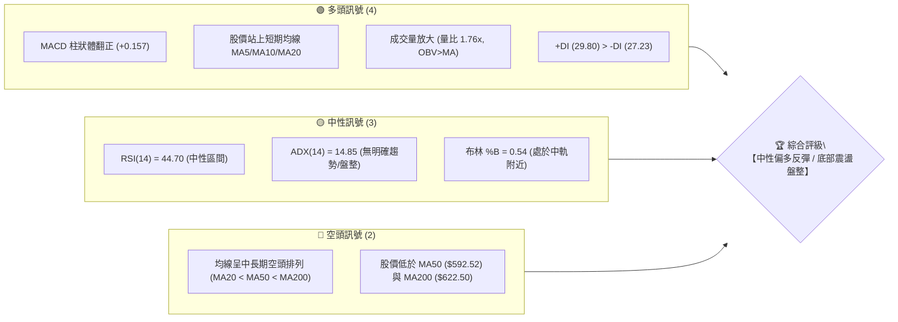
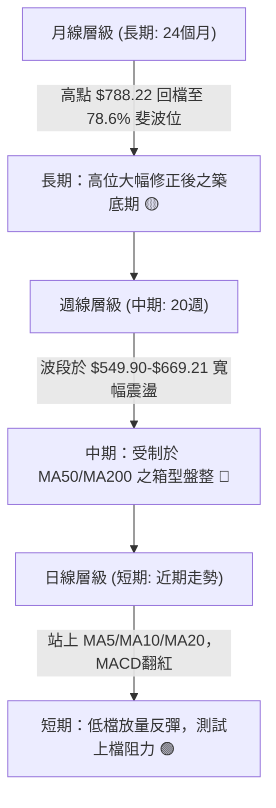
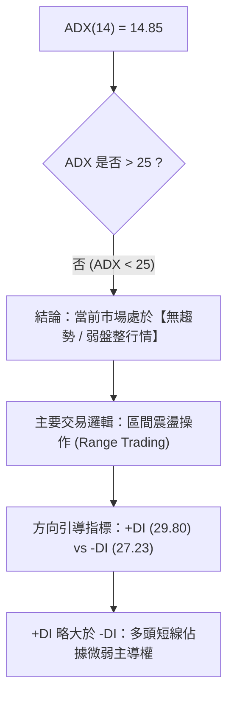
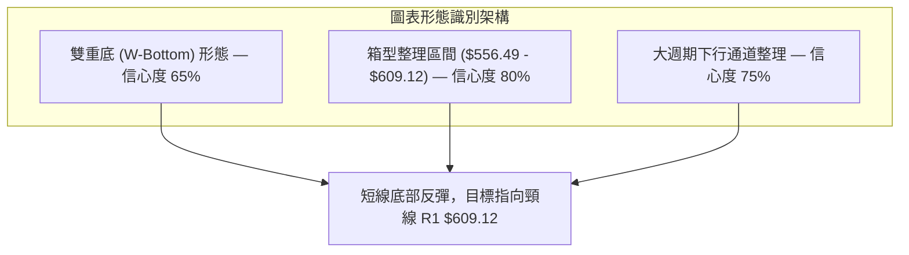
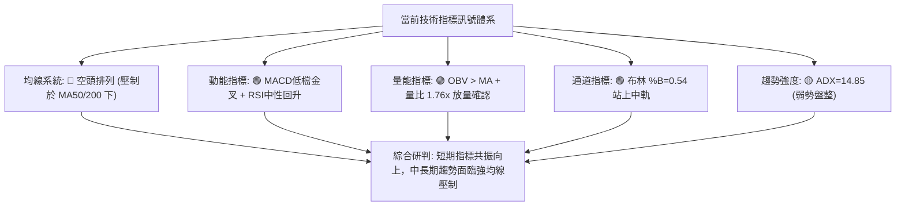
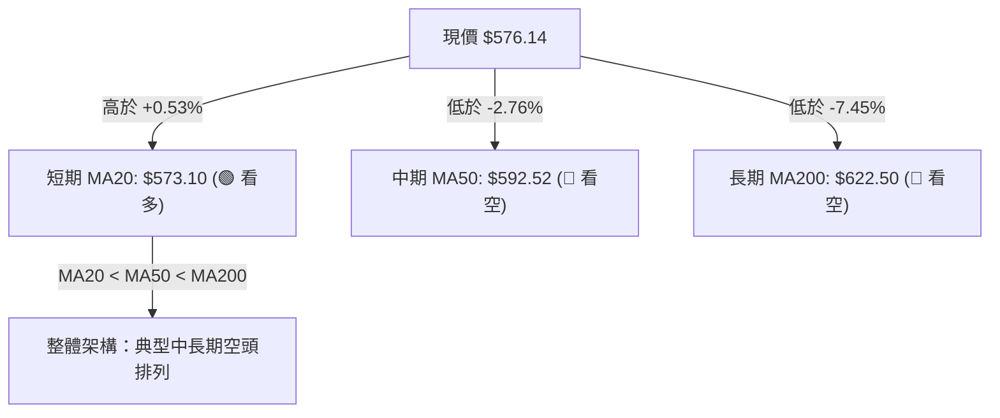
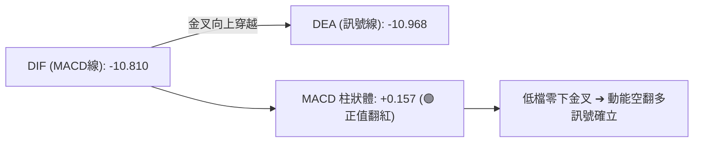
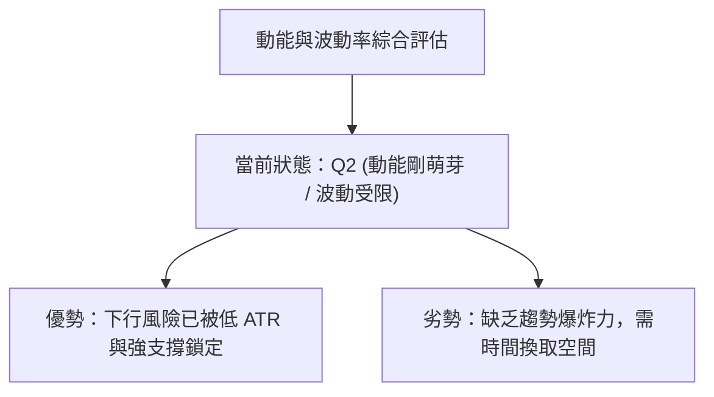
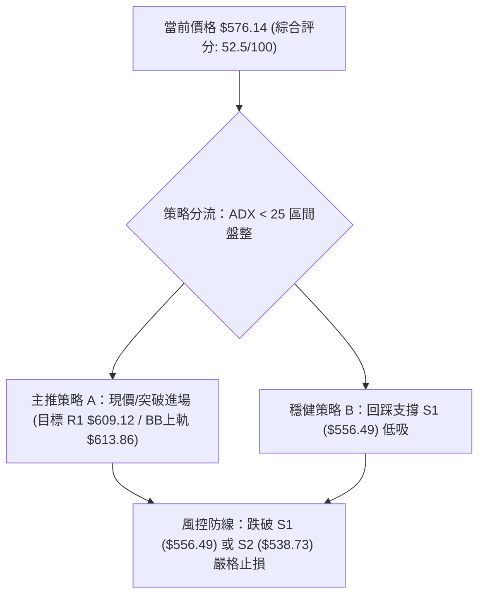
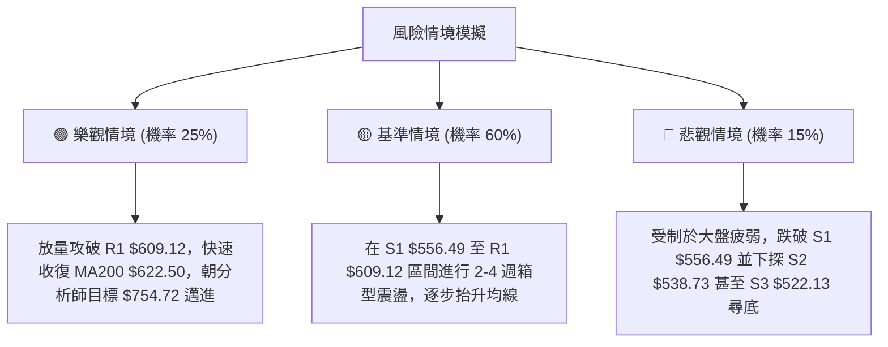

# META 技術分析報告

> **報告日期**：2026-08-27 ｜ **語言**：繁體中文 ｜ **數據來源**：Yahoo Finance ｜ **當前價格**：$576.14

---

## 目錄

| 章節 | 內容 |
|------|------|
| [1. 技術面概覽](#1-技術面概覽) | 訊號儀表板、核心指標、評分卡 |
| [2. 趨勢分析](#2-趨勢分析) | 多時框趨勢、長中短期走勢 |
| [3. 圖表形態分析](#3-圖表形態分析) | 形態識別、K線組合、目標價 |
| [4. 支撐與阻力](#4-支撐與阻力) | 關鍵價位、斐波那契回調 |
| [5. 技術指標深度解讀](#5-技術指標深度解讀) | MA/RSI/MACD/布林/成交量 |
| [6. 動能與波動率](#6-動能與波動率) | 動能評估、ATR、Beta |
| [7. 多時框架總結](#7-多時框架總結) | 時框架評分矩陣 |
| [8. 交易策略建議](#8-交易策略建議) | 多空策略、風險報酬比 |
| [9. 風險提示與監控](#9-風險提示與監控) | 監控指標、風險場景 |

---

## 1. 技術面概覽

### 🎯 技術訊號儀表板



---

### 📊 核心指標速覽表

| 指標類別 | 指標名稱 | 當前數值 | 訊號 | 解讀 |
|:---|:---|:---|:---:|:---|
| **價格** | 當前價格 | $576.14 | 🟡 | 位於52週區間 21.0% 分位，處於低檔築底階段 |
| **均線** | MA20 | $573.10 | 🟢 | 股價位於 MA20 上方 (+0.53%)，短線止跌回升 |
| **均線** | MA50 | $592.52 | 🔴 | 股價位於 MA50 下方 (-2.76%)，中期下行壓力猶存 |
| **均線** | MA200 | $622.50 | 🔴 | 股價位於 MA200 下方 (-7.45%)，長期牛熊分界線受壓 |
| **動能** | RSI(14) | 44.70 | 🟡 | 處於 30-70 中性常態區間，未出現超買超賣 |
| **動能** | MACD | -10.810 (柱: +0.157) | 🟢 | 快線向上穿越慢線形成低檔金叉，動能轉正 |
| **趨勢** | ADX(14) | 14.85 | 🟡 | ADX < 25 表明處於弱趨勢／無方向盤整行情 |
| **波動** | ATR(14) | $17.99 (3.12%) | 🟡 | 日內波動幅度適中，提供明確的止損與區間操作空間 |
| **通道** | 布林通道 | 中軌: $573.10 / %B: 0.54 | 🟢 | 成功突破布林中軌，短線具備向上軌 $613.86 挑戰動能 |
| **量能** | 成交量 | 31,324,800 (量比 1.76x) | 🟢 | 成交量顯著放大，OBV > 均線，多頭量能支撐反彈 |

---

### 🏆 技術評分卡

```
╔══════════════════════════════════════════════════════════════╗
║              技術評分卡 — META (2026-08-27)                  ║
╠══════════════════════════════════════════════════════════════╣
║ 趨勢強度 (ADX=14.85)     ████░░░░░░░░░░░░░░░░  25/100  🟡 弱勢盤整  ║
║ 動能指標 (MACD/RSI)      ████████████░░░░░░░░  60/100  🟢 低檔轉強  ║
║ 支撐穩定度 (S1/S2/Fib)   ██████████████░░░░░░  70/100  🟢 78.6%堅守 ║
║ 成交量配合 (OBV/Volume)  ████████████████░░░░  80/100  🟢 放量回升  ║
║ 形態完整度 (雙底初成)    ████████████░░░░░░░░  60/100  🟡 頸線待破  ║
║ 均線排列 (空頭排列)      ████░░░░░░░░░░░░░░░░  20/100  🔴 長期壓制  ║
╠══════════════════════════════════════════════════════════════╣
║ 綜合技術評分             ██████████░░░░░░░░░░  52.5/100             ║
║ 綜合評級                 【 🟡 區間震盪 / 偏多反彈待突破 】            ║
╚══════════════════════════════════════════════════════════════╝
```

---

## 2. 趨勢分析

### 🌐 多時框趨勢分析



---

### 📈 長期趨勢 — 12個月走勢圖（ASCII）

```
META 月線走勢圖（過去12個月：2025-08 至 2026-08）
價格 ($)
$788.22 ┤
$750.00 ┤ ●(08/25: $736.29)
$720.00 ┤      ●(09/25: $732.47)             ●(01/26: $715.22)
$680.00 ┤
$640.00 ┤            ●(10/25: $646.67) ── ●(12/25: $658.91) ── ●(02/26: $647.03) ── ●(05/26: $631.92)
$600.00 ┤                                                               ●(04/26: $611.34)
$570.00 ┤                                        ●(03/26: $571.60)                           ●(08/26: $576.14) ◄ 現價
$540.00 ┤                                                                           ●(06-07/26: $556.71)
$519.78 ┤───────────────────────────────────────────────────────────────────────────●(52W低點: $519.78)
        └────┬────────┬────────┬────────┬────────┬────────┬────────┬────────┬────────┬────────┬────────┬────────┬───
           2025-08  2025-09  2025-10  2025-11  2025-12  2026-01  2026-02  2026-03  2026-04  2026-05  2026-06  2026-08
```

#### 走勢特徵分析表格

| 階段區間 | 起始/結束價 | 漲跌幅 | 走勢特徵與結構解讀 |
|:---|:---|:---:|:---|
| **2025-08 ~ 2025-09** | $736.29 → $732.47 | -0.52% | 歷史高點 $788.22 附近之高檔滯漲頂部構築階段。 |
| **2025-10 ~ 2025-11** | $646.67 → $646.27 | -0.06% | 跌破高檔區間後的首輪急跌，於 $646 附近短暫獲得平台支撐。 |
| **2025-12 ~ 2026-01** | $658.91 → $715.22 | +8.55% | 假突破多頭誘多波段，受阻於 $724.87 (23.6% 斐波位) 下方。 |
| **2026-02 ~ 2026-03** | $647.03 → $571.60 | -11.66% | 主跌浪展開，連續跌破 MA50 與 MA200，趨勢確立翻空。 |
| **2026-04 ~ 2026-05** | $611.34 → $631.92 | +3.37% | 弱勢反彈測試 MA120/MA200 未果，成交量逐步萎縮。 |
| **2026-06 ~ 2026-08** | $563.29 → $576.14 | +2.28% | 於 $550-$556 區間展開雙底築底測試，現價試圖突破短期均線。 |

---

### 📊 中期趨勢（週線分析）

從近 20 週收盤走勢可見，價格在 2026-07-12 觸及 $669.21 的階段反彈高點後回落，隨後於 2026-08-02 探底 $556.71，並於 2026-08-23 再次於 $549.90 獲得支撐回升，目前收盤價 $576.14 重新站回週線 RSI 44.7 及週 MACD 柱狀體翻正 (+0.157)。

```
週線區間壓力支撐結構：
  [強阻力區間]   $622.32 ~ $624.40 (61.8% 斐波那契回調位 / R2 阻力 / MA200)
       ▲
  [中軌阻力區]   $592.52 ~ $609.12 (MA50 均線 / R1 阻力 / 布林上軌 $613.86)
       ▲
  [當前價格位]   $576.14 (緊鄰 78.6% 斐波位 $577.22 與 MA20 $573.10)
       ▼
  [近期關鍵支撐] $556.49 ~ $549.90 (S1 支撐位 / 8月波段雙底低點)
       ▼
  [波段核心防線] $519.78 ~ $522.13 (52週低點 / S3 支撐位)
```

---

### ⚡ 趨勢強度評估（ADX 解讀）



| 指標名稱 | 數值 | 區間定義 | 趨勢判定 | 交易指引 |
|:---|:---:|:---|:---:|:---|
| **ADX(14)** | **14.85** | 0 ~ 20 (極弱/無趨勢) | 🟡 盤整走勢 | 嚴禁追漲殺跌，趨勢跟隨策略失效，應採區間高拋低吸。 |
| **+DI (14)** | **29.80** | 多頭力量值 | 🟢 短多佔優 | 買方動能自低檔抬升，推動價格自下軌反彈。 |
| **-DI (14)** | **27.23** | 空頭力量值 | 🟡 空頭減弱 | 賣壓逐步消化，但仍高於 25，需防範二次探底。 |

---

## 3. 圖表形態分析

### 🔍 形態識別系統



#### 形態識別與信心度評估表

| 識別形態 | 信心度 | 判斷依據（引用數據） | 完成度 | 目標價（附嚴謹計算式） |
|:---|:---:|:---|:---:|:---|
| **潛在雙重底 (W底)** | **65%** | 第一底於 2026-08-02 的 $556.71 (接近 S1 $556.49)，第二底於 2026-08-23 的 $549.90，兩次低點獲得放量支撐。 | 60% | 頸線 R1 ($609.12) + 形態高度 ($609.12 - $549.90 = $59.22) = **$668.34**（接近前期波段高點 $669.21） |
| **箱型整理區間** | **80%** | 價格受限於支撐 S1 ($556.49) 與阻力 R1 ($609.12) 之間，ADX 處於 14.85 弱趨勢區。 | 85% | 區間上沿目標 = **$609.12**；若跌破區間下沿，目標為 S2 = **$538.73** |
| **布林中軌突破形態** | **70%** | 價格自布林下軌 $532.34 反彈，收盤價 $576.14 向上突破中軌 $573.10 (%B=0.54)。 | 70% | 布林通道上軌目標 = **$613.86** |

---

### 🕯️ 重要K線形態分析

| 統計週期/月份 | 收盤價 | 關鍵 K 線形態 | 解讀 | 訊號方向 |
|:---|:---:|:---|:---|:---:|
| **2026-06** | $563.29 | 大陰線破位放量 | 跌破 $600 關口，市場恐慌拋盤湧現，確立空頭趨勢。 | 🔴 強烈看空 |
| **2026-07** | $556.71 | 帶長下影線之十字星 | 探底 $519.78 附近後獲得低接買盤，跌勢趨緩。 | 🟡 止跌信號 |
| **2026-08 (當前)** | $576.14 | 低檔放量陽線反彈 | 伴隨量比 1.76x，實體陽線吞沒前週陰線，完成初步築底。 | 🟢 轉多訊號 |

---

### 📉 ASCII 走勢形態示意圖

```
META 日線 / 週線層級【雙重底築底反彈形態】示意圖

價格 ($)
$609.12 ┼───────────────────────── 頸線 / 阻力位 R1 ($609.12) ─────────────────────────
        │                         / \
$590.00 ┼                        /   \                         ╭── [突破目標 $609.12 / $613.86]
        │                       /     \                       /
$576.14 ┼                      /       \             ●───────╯ ◄ 現價 ($576.14 突破 MA20)
        │                     /         \           /
$560.00 ┼                    /           \         /
        │        ●          /             \       /
$556.49 ┼───────/─\────────/───────────────\─────/────────────── 支撐線 S1 ($556.49)
        │      /   ●(左底: $556.71)         \   /
$549.90 ┼     /                              ●(右底: $549.90)
        └────┴───────────────────────────────────────────────────────────────────────
             2026-07                    2026-08 (放量 3,132 萬股確認)
```

---

## 4. 支撐與阻力

### 🗺️ 關鍵價位分布圖（ASCII）

```
META 關鍵價位與籌碼結構分布圖
═════════════════════════════════════════════════════════════════════════════════
$642.40 ║████████████████████████████████████████████║ 強阻力 R3 (+11.50%)
$624.40 ║██████████████████████████████        ║ 阻力 R2 (+8.38%) / MA200 ($622.50)
$609.12 ║████████████████████████████████████  ║ 關鍵頸線阻力 R1 (+5.72%) / BB上軌 ($613.86)
$577.22 ║──────────────────────────────────────║ 斐波那契 78.6% 關鍵回調位
$576.14 ╠══════════════════════════════════════╣ ◄ 當前市價 ($576.14) / MA20 ($573.10)
$556.49 ║▓▓▓▓▓▓▓▓▓▓▓▓▓▓▓▓▓▓▓▓▓▓▓▓▓▓▓▓▓▓        ║ 近期波段核心支撐 S1 (-3.41%)
$538.73 ║████████████████████████              ║ 延伸支撐 S2 (-6.49%) / BB下軌 ($532.34)
$522.13 ║██████████████████████████████████████║ 年度底部極限支撐 S3 (-9.37%) / 52W低點
═════════════════════════════════════════════════════════════════════════════════
```

---

### 🚧 阻力位分析表

| 阻力級別 | 準確價位 | 距離現價 | 形成原因與籌碼技術面背景 | 突破難度 | 重要性 |
|:---|:---:|:---:|:---|:---:|:---:|
| **阻力 R1** | **$609.12** | +5.72% | 近一年波段高點聚類區，疊加布林通道上軌 ($613.86) 與 MA60 ($592.20) 上方套牢籌碼。 | 🟡 中等 | ★★★★☆ |
| **阻力 R2** | **$624.40** | +8.38% | 密集高點聚類區，與長期牛熊分界線 MA200 ($622.50) 及斐波那契 61.8% ($622.32) 高度重合。 | 🔴 極高 | ★★★★★ |
| **阻力 R3** | **$642.40** | +11.50% | 2025 年第四季度整理平台低點與多次反彈受阻高點，亦為 50.0% 斐波那契回調位 ($654.00) 下方強壓。 | 🔴 極高 | ★★★☆☆ |

---

### 🛡️ 支撐位分析表

| 支撐級別 | 準確價位 | 距離現價 | 形成原因與籌碼技術面背景 | 守住機率 | 重要性 |
|:---|:---:|:---:|:---|:---:|:---:|
| **支撐 S1** | **$556.49** | -3.41% | 近一年波段低點聚類，2026年8月兩次探底 ($556.71 / $549.90) 之雙底頸線支撐位。 | 🟢 75% | ★★★★★ |
| **支撐 S2** | **$538.73** | -6.49% | 波段回檔次級低點聚類，與當前日線布林通道下軌 ($532.34) 形成共振支撐帶。 | 🟢 85% | ★★★★☆ |
| **支撐 S3** | **$522.13** | -9.37% | 52 週最低點 ($519.78) 聚類防線，100.0% 斐波那契回調位的終極多頭堡壘。 | 🟢 95% | ★★★★★ |

---

### 📐 斐波那契回調位分析

基準區間：**52週歷史高點 $788.22 → 52週歷史低點 $519.78**（總波幅 $268.44）。

```
斐波那契回調階梯：
  0.0% (52W High)  ────────────────────────────────────────── $788.22
  23.6%            ────────────────────────────────────────── $724.87
  38.2%            ────────────────────────────────────────── $685.67
  50.0%            ────────────────────────────────────────── $654.00
  61.8% (黃金分割) ────────────────────────────────────────── $622.32 (與 MA200 $622.50 共振)
  78.6% (深次回調) ────────────────────────────────────────── $577.22 ◄ 現價 $576.14 緊貼於此
  100.0% (52W Low) ────────────────────────────────────────── $519.78
```

#### 技術解讀
當前現價 **$576.14** 剛好收於 **78.6% 斐波那契回調位 ($577.22)** 正下方僅 $1.08 處。在經典技術分析中，78.6% 回調位是深度回檔的最後防線。若價格能有效收復並站穩 $577.22，技術面將確立自 $519.78 低點以來的二浪調整結束，展開向上挑戰 61.8% ($622.32) 的主升反彈段。

---

## 5. 技術指標深度解讀

### 🎛️ 指標訊號總覽



---

### 📈 移動平均線排列分析



#### 移動平均線數據對比表

| 均線名稱 | 當前價格 | 與現價差距 | 乖離率 | 短期趨勢 | 歷史形態軌跡 |
|:---|:---:|:---:|:---:|:---:|:---|
| **MA 5** | $560.19 | +$15.95 | +2.85% | 🟢 向上突破 | 短線急拉，帶動短期底部成型 |
| **MA 10** | $564.44 | +$11.70 | +2.07% | 🟢 向上突破 | 短線形成支撐平台 |
| **MA 20** | $573.10 | +$3.04 | +0.53% | 🟢 向上突破 | 突破布林中軌，短多確立 |
| **MA 60** | $592.20 | -$16.06 | -2.71% | 🔴 下行壓制 | 下行斜率趨緩，構成第一道反彈壓力 |
| **MA 120** | $606.17 | -$30.03 | -4.95% | 🔴 下行壓制 | 中期套牢密集區 |
| **MA 240** | $639.08 | -$62.94 | -9.85% | 🔴 下行壓制 | 長期牛熊分水嶺 |

---

### 📉 RSI(14) 分析

```
RSI(14) 數值儀表板：
0 ──────────── 30 ────────────────── 44.70 ────────────── 70 ──────────── 100
[   超賣區   ]       [   中性偏弱震盪區間   ]        [   超買區   ]
進度條: █████████░░░░░░░░░░░  44.70 / 100 (🟡 中性)
```

- **超買超賣判定**：當前 RSI 為 **44.70**，已自 8 月初的 22.90 極度超賣區脫離，回到 40–50 常態波動區間，未見超買過熱，向上具備充足的修復空間。
- **背離分析**：
  - 2026-08-02 低點 $556.71 時，週線 RSI 為 22.90。
  - 2026-08-23 價格回測低點 $549.90 時，週線 RSI 逆勢抬升至 31.30。
  - **結論**：RSI 呈現標準的**低檔底背離（Bullish Divergence）**雛形，顯示下跌動能衰竭，買盤正在進場承接。

---

### 📊 MACD(12, 26, 9) 訊號解讀



- **MACD 線值**：-10.810
- **訊號線 (Signal)**：-10.968
- **柱狀圖 (Histogram)**：**+0.157**
- **詳細解讀**：MACD 在零軸下方深處完成黃金交叉，柱狀體自 2026-08-02 的 -11.160 強烈收斂並於本週正式轉正至 +0.157。這代表中線賣壓已釋放殆盡，多方動能正在重新匯聚。

---

### 📦 布林通道分析（Bollinger Bands）

```
META 日線布林通道結構示意圖
══════════════════════════════════════════════════════════════
$613.86 ┬────────────────────────────────────────── 布林上軌 (Upper Band)
        │
$590.00 ┤                   ● 潛在反彈目標區 ($609.12 - $613.86)
        │                  /
$576.14 ┼─────────────────●──────────────────────── 現價 ($576.14, %B = 0.54)
$573.10 ┴────────────────────────────────────────── 布林中軌 (MA20: $573.10)
        │                /
$550.00 ┤         ●─────╯ (自下軌反彈)
        │        /
$532.34 ┴────────────────────────────────────────── 布林下軌 (Lower Band)
══════════════════════════════════════════════════════════════
```

- **帶寬與位置**：通道寬度 $81.52，現價處於 **%B = 0.54**，表示價格已越過中軌，正式進入強勢上半通道運行。
- **後市指引**：在 ADX 顯示為盤整的環境下，布林通道上下軌構成了天然的震盪箱體，上軌 **$613.86** 將成為本次反彈的第一技術目標。

---

### 💹 成交量分析（量價配合度）

- **最新成交量**：31,324,800 股
- **20日均量**：17,785,475 股 ➔ **量比 (Volume Ratio) = 1.76x**（顯著放量）
- **50日均量**：18,173,914 股
- **OBV (能量潮)**：**OBV > OBV_MA**
- **量價配合結論**：在股價自低檔回升突破 MA20 之際，成交量放大至日均量的 1.76 倍，且 OBV 維持在均線之上，呈現明確的**「價漲量增」多頭配合結構**，證明並非無量虛漲，而是有實質資金進場。

---

## 6. 動能與波動率

### ⚡ 動能評估四象限

| 象限 | 動能強度 (Momentum) | 波動率 (Volatility) | META 當前所處狀態 | 戰略評估 |
|:---|:---:|:---:|:---:|:---|
| **第一象限 (Q1)** | 強動能 (MACD>0, RSI>60) | 低波動 (ATR 偏低) | ── | 最佳順勢追價機會 |
| **第二象限 (Q2)** | **弱動能 (MACD剛轉正, RSI 44.7)** | **低/中波動 (ATR 3.12%, ADX 14.85)** | **✓ META 處於此區** | **低檔築底，區間震盪，適合低吸佈局** |
| **第三象限 (Q3)** | 強動能 | 高波動 | ── | 高風險高收益突破行情 |
| **第四象限 (Q4)** | 弱動能 | 高波動 | ── | 恐慌殺跌，嚴格觀望 |



---

### 📊 ATR 波動率分析

- **ATR(14) 數值**：**$17.99**（佔當前股價 **3.12%**）
- **日內波動特徵**：處於正常偏低水平，未出現極端恐慌波動。
- **風控與止損建議**：
  - **保守型止損距離**：$17.99 \times 1.5 = **$26.99**（進場點下方約 4.68%）
  - **進取型止損距離**：$17.99 \times 1.0 = **$17.99**（進場點下方約 3.12%）

---

### 📐 Beta 與市場相關性

- **Beta 係數**：**1.243**
- **解讀**：META 的波動彈性高於標普 500 指數 24.3%。在大盤維持穩定或反彈階段，META 具備產生超額 Alpha 的潛力；但在大盤系統性下行時，回撤幅度亦相對放大。

---

## 7. 多時框架總結

### 📋 時框架評分表

| 時框架 | 趨勢方向 | 動能狀態 | 均線排列 | 形態結構 | 綜合評分 | 操作建議 |
|:---|:---:|:---:|:---:|:---:|:---:|:---|
| **長期 (月線)** | 🟡 深度回檔築底 | 弱勢修復 | 壓制於 MA240 下 | 78.6% 斐波位防守 | **50/100** | 價值投資分批建倉 |
| **中期 (週線)** | 🔴 偏空格局 | MACD 柱剛翻紅 | MA20 < MA50 < MA200 | $550-$669 寬幅箱型 | **45/100** | 逢高減阻，反彈對待 |
| **短期 (日線)** | 🟢 觸底反彈 | RSI 44.7 / 放量 | 站上 MA5/10/20 | 雙底雛形 + 突破中軌 | **65/100** | 順勢短多，區間操作 |

---

### 🔲 綜合訊號矩陣

```
┌─────────────────┬─────────────────┬─────────────────┬─────────────────┐
│   維度 / 週期   │   短期 (日線)   │   中期 (週線)   │   長期 (月線)   │
├─────────────────┼─────────────────┼─────────────────┼─────────────────┤
│  趨勢方向       │    🟢 偏多      │    🔴 偏空      │    🟡 中性      │
│  動能強度       │    🟢 轉強      │    🟡 轉正      │    🔴 偏弱      │
│  均線狀態       │    🟢 站上MA20  │    🔴 均線下行  │    🔴 壓制      │
│  量價結構       │    🟢 放量配合  │    🟡 縮量整理  │    🟡 籌碼沉澱  │
└─────────────────┴─────────────────┴─────────────────┴─────────────────┘
```

---

### ⚖️ 多時框收斂結論

> **依據收斂規則 14 判定**：
> 1. 當前 **ADX(14) = 14.85 (< 25)**，明確定義當前市場為**【盤整行情】**而非單邊趨勢行情。
> 2. 依規則，在盤整行情中，交易邏輯以**日線布林通道上下軌（$532.34 ～ $613.86）及支撐阻力 S1/R1 構成的區間**為主導。
> 3. 雖然中期均線（MA50/MA200）呈空頭排列壓制，但日線放量站上 MA20 且 MACD 翻紅，顯示向下空間被 S1 ($556.49) 封死。
> 
> 🎯 **唯一方向性結論**：**【中性偏多 — 區間反彈操作（以突破 R1 $609.12 為首要目標）】**。

---

## 8. 交易策略建議

### 🗺️ 策略決策流程圖



---

### 🧭 策略路由

**當前主策略方向 = 【中性偏多區間操作 — 逢低做多 / 突破跟進】（依綜合技術評分 52.5/100 判定）**

---

### 🎯 價格情境階梯（Price Scenarios）

| 觸發條件 | 下一目標 | 後續延伸目標 | 情境含義與操作指引 |
|:---|:---:|:---:|:---|
| **向上突破 R1 $609.12** | **R2 $624.40** | **R3 $642.40** | 確立雙底形態完成，中期趨勢反轉，挑戰 MA200 牛熊線。 |
| **維持於現價 $576.14 震盪** | **$592.52 (MA50)** | **$609.12 (R1)** | 於布林中軌上方蓄勢整理，消化短期均線反彈賣壓。 |
| **向下跌破 S1 $556.49** | **S2 $538.73** | **S3 $522.13** | 雙底形態失效，重回下行尋底行情，需立即止損避險。 |

---

### 📊 情境機率分佈

| 情境劇本 | 發生機率 | 主要技術依據 |
|:---|:---:|:---|
| **情境一：向上反彈測試 R1/R2** | **55%** | MACD 低檔金叉翻紅 (+0.157)、量比 1.76x 放量、股價站上 MA20。 |
| **情境二：在 S1 與 R1 區間震盪** | **30%** | ADX = 14.85 趨勢極弱，均線系統呈空頭排列，需時間修復。 |
| **情境三：跌破 S1 二次探底 S2/S3** | **15%** | 中長期均線下行壓力仍在，若遇大盤系統性風險可能引發補跌。 |

---

### 🟢 主策略詳情

| 策略要素 | 策略 A：現價順勢多單（突破型） | 策略 B：回踩低吸多單（保守型） |
|:---|:---:|:---:|
| **適用場景** | 短線動能持續，直接向上挑戰阻力 | 價格短暫回測 MA20 / S1 支撐確認 |
| **進場條件** | 站穩現價 $576.14 或突破 $577.22 (78.6% Fib) | 回踩至支撐位 S1 ($556.49) 附近出現止跌K線 |
| **進場價格** | **$576.14** | **$558.00** (S1 $556.49 上方) |
| **目標價 T1** | **$609.12** (阻力位 R1，潛在 +5.72%) | **$592.52** (MA50 均線，潛在 +6.19%) |
| **目標價 T2** | **$624.40** (阻力位 R2 / MA200，潛在 +8.38%) | **$609.12** (阻力位 R1，潛在 +9.16%) |
| **止損價格** | **$556.49** (嚴格設於支撐位 S1，風險 -3.41%) | **$538.73** (嚴格設於支撐位 S2，風險 -3.45%) |
| **風險報酬比** | **1 : 1.68** (至 T1) / **1 : 2.46** (至 T2) | **1 : 1.79** (至 T1) / **1 : 2.65** (至 T2) |
| **評估勝率** | **58%** | **65%** |
| **建議倉位** | **10% - 15%** (輕倉試單) | **15% - 20%** (標準波段倉位) |

---

### 🔴 反向風險觸發點（對沖提示）

- **多頭失效關鍵位**：若日K線收盤價跌破 **S1 ($556.49)**，多頭反彈結構破壞，應立即平倉多單觀望。
- **空頭加速信號**：若跌破 **S2 ($538.73)**，股價將直奔 52 週低點 **$519.78 (S3: $522.13)**，屆時可考慮買入 Put 或進行衍生品對沖。

---

### ⭐ 整體訊號強度評星

```
做多訊號強度：★★★☆☆  (3.5/5 星 — 短線放量金叉，具備反彈勝率)
做空訊號強度：★★☆☆☆  (2.0/5 星 — 跌勢趨緩，低檔底背離支撐)
整體可信度：  ★★★★☆  (4.0/5 星 — 支撐阻力明確，ADX定義盤整區間)
```

---

## 9. 風險提示與監控

### ✅ 關鍵監控指標 Checklist

```
╔══════════════════════════════════════════════════════════════╗
║               每日/每週技術面監控清單 (Checklist)              ║
╠══════════════════════════════════════════════════════════════╣
║ [ ] 價格是否持續收於 MA20 ($573.10) 之上                     ║
║ [ ] MACD 柱狀圖是否持續擴大正值 (維持在 >0 區域)              ║
║ [ ] 每日成交量是否維持在 20 日均量 (17.78M) 之上              ║
║ [ ] RSI(14) 是否能有效突破 50 中軸分水嶺                      ║
║ [ ] 價格觸及 R1 ($609.12) 時是否出現放量滯漲或長上影線        ║
║ [ ] 跌破 S1 ($556.49) 時是否引發放量恐慌拋盤 (止損警報)       ║
╚══════════════════════════════════════════════════════════════╝
```

---

### ⚠️ 風險場景分析



---

### 🛡️ 風險管理重要提醒

1. **嚴格執行資金管理**：單筆交易風險敞口（止損金額）不得超過總投資組合淨值的 **1.0% - 1.5%**。
2. **切忌重倉猜底**：在中長期均線（MA50/MA200）仍處於空頭排列時，任何多頭交易均屬於**逆中長期趨勢之反彈操作**，倉位上限建議控制在總資金 **20%** 以內。
3. **利潤保護機制**：若股價成功上漲至 **$592.52 (MA50)**，應立即將止損價上移至進場成本價 **$576.14**，鎖定本金零風險。

---

## 📋 報告總結

```
╔══════════════════════════════════════════════════════════════╗
║                 META 技術分析報告總結                         ║
╠══════════════════════════════════════════════════════════════╣
║ 報告日期：2026-08-27                                         ║
║ 當前價格：$576.14                                            ║
║ 分析評級：⚖️ 區間震盪偏多（築底反彈階段）                      ║
║                                                              ║
║ 關鍵結論：                                                   ║
║ ├─ 長期趨勢：🟡 中性築底（自 $788.22 回調至 78.6% Fib 獲支撐）║
║ ├─ 中期趨勢：🔴 弱勢震盪（受制於 MA50 $592.52 與 MA200）     ║
║ ├─ 短期趨勢：🟢 放量反彈（突破 MA20 $573.10，MACD 低檔金叉） ║
║ ├─ 核心支撐：S1: $556.49 ｜ S2: $538.73 ｜ S3: $522.13       ║
║ ├─ 關鍵阻力：R1: $609.12 ｜ R2: $624.40 ｜ R3: $642.40       ║
║ └─ 分析師共識目標價：$754.72（最高 $1,000.00 / 最低 $580.00）║
║                                                              ║
║ 最優策略組合：                                               ║
║ 1. 🥇 最佳機會：現價 $576.14 進場多單，止損 S1，目標 R1/R2     ║
║ 2. 🥈 次選機會：掛單 $558.00 回踩低吸，止損 S2，目標 MA50/R1  ║
║ 3. 🥉 保守選擇：等待放量突破 R1 $609.12 後，順勢跟進追多      ║
╚══════════════════════════════════════════════════════════════╝
```

---

> ⚠️ **免責聲明**：本報告為 AI 自動生成之技術分析，所有數據及估算均基於歷史價格與客觀指標資訊。本報告**僅供研究與學術參考**，**不構成任何形式的投資建議與要約**。金融市場投資具有高風險，投資人應獨立評估風險並自負盈虧。

---

*報告生成時間：2026-08-27 ｜ 數據來源：Yahoo Finance ｜ 分析框架：多時框量化技術分析*