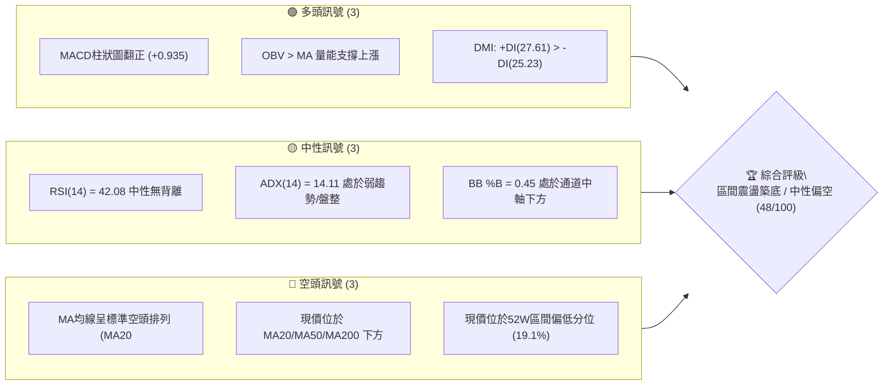
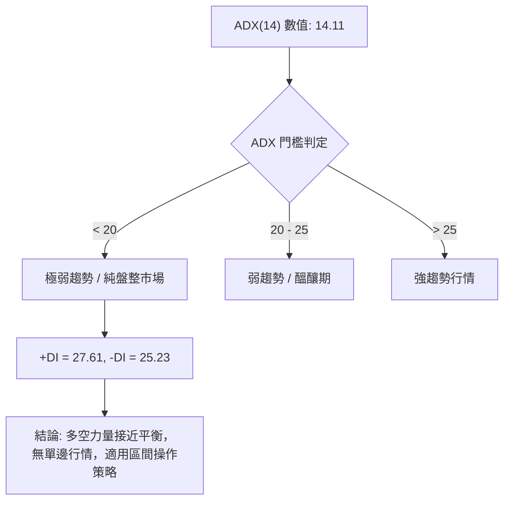
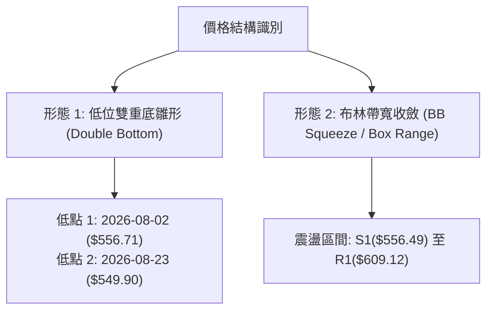
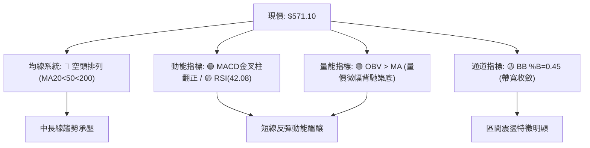
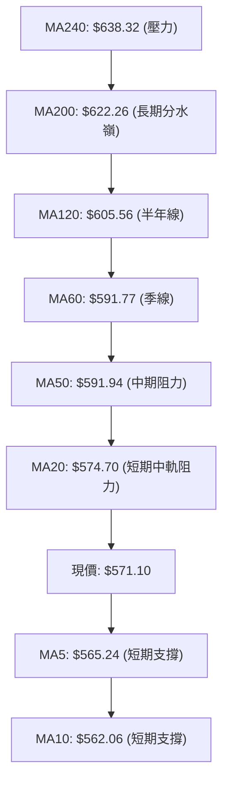
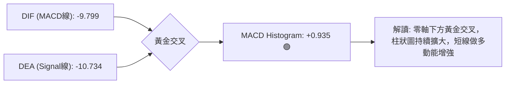
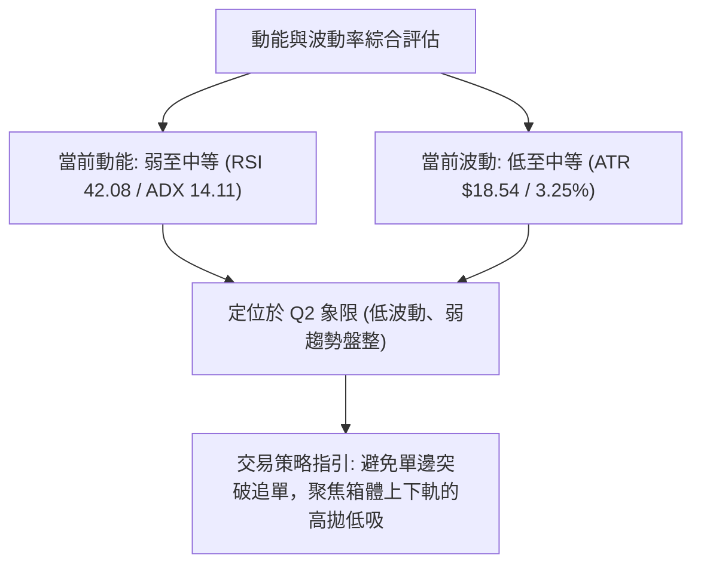
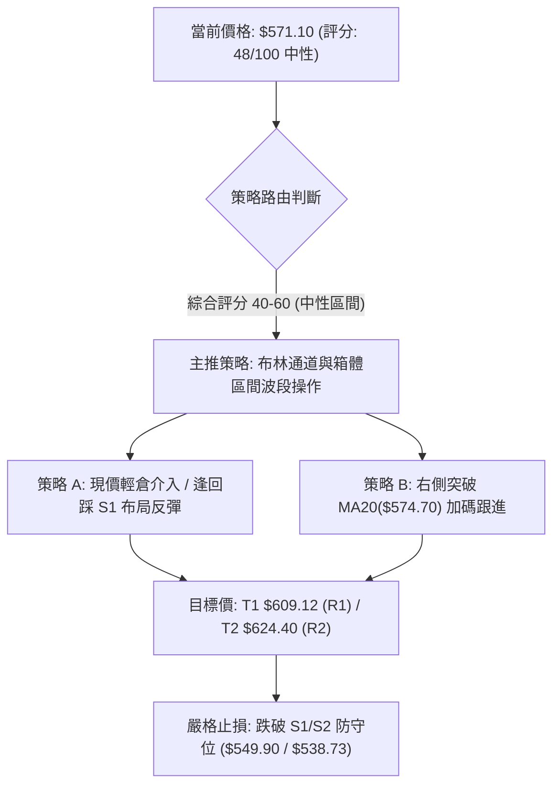
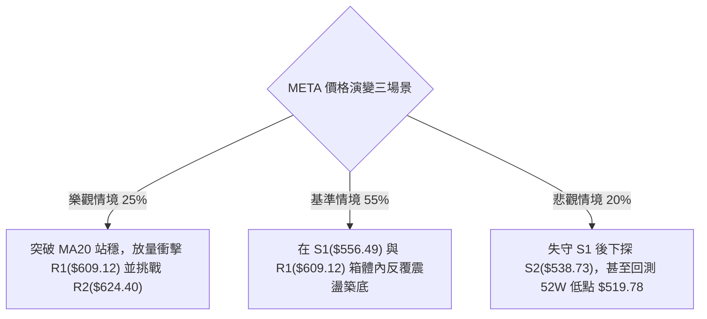

# META 技術分析報告

> **報告日期**：2026-08-28 ｜ **語言**：繁體中文 ｜ **數據來源**：Yahoo Finance ｜ **當前價格**：$571.10

---

## 目錄

| 章節 | 內容 |
|------|------|
| [1. 技術面概覽](#1-技術面概覽) | 訊號儀表板、核心指標、評分卡 |
| [2. 趨勢分析](#2-趨勢分析) | 多時框趨勢、長中短期走勢 |
| [3. 圖表形態分析](#3-圖表形態分析) | 形態識別、K線組合、目標價 |
| [4. 支撐與阻力](#4-支撐與阻力) | 關鍵價位、斐波那契回調 |
| [5. 技術指標深度解讀](#5-技術指標深度解讀) | MA/RSI/MACD/布林/成交量 |
| [6. 動能與波動率](#6-動能與波動率) | 動能評估、ATR、Beta |
| [7. 多時框架總結](#7-多時框架總結) | 時框架評分矩陣 |
| [8. 交易策略建議](#8-交易策略建議) | 多空策略、風險報酬比 |
| [9. 風險提示與監控](#9-風險提示與監控) | 監控指標、風險場景 |

---

## 1. 技術面概覽

### 🎯 技術訊號儀表板



### 📊 核心指標速覽表

| 指標類別 | 指標名稱 | 當前數值 | 訊號 | 解讀 |
|----------|----------|----------|------|------|
| **價格** | 當前價格 | $571.10 | 🟡 | 位於52週區間 19.1%，處於相對低位區間震盪 |
| **均線** | MA20 | $574.70 | 🔴 | 價格低於MA20（-$3.60 / -0.63%），短線承壓 |
| **均線** | MA50 | $591.94 | 🔴 | 價格低於MA50（-$20.84 / -3.52%），中期偏弱 |
| **均線** | MA200 | $622.26 | 🔴 | 價格低於MA200（-$51.16 / -8.22%），長線處於修正 |
| **動能** | RSI(14) | 42.08 | 🟡 | 中性區間（30-70），自超賣區修復，無顯著背離 |
| **動能** | MACD | -9.799 (柱狀: +0.935) | 🟢 | 快線位於信號線(-10.734)之上，柱狀圖翻正，短線動能改善 |
| **動能** | Stoch %K / %D | 45.01 / 46.78 | 🟡 | 中性均衡，無極端超買或超賣 |
| **趨勢** | ADX(14) | 14.11 (+DI: 27.61, -DI: 25.23) | 🟡 | 弱趨勢/盤整（<25），+DI微幅領先，多空處於拉鋸 |
| **通道** | 布林通道 (%B) | 0.45 (帶寬: $537.19 - $612.22) | 🟡 | 位於中軌($574.70)與下軌之間，通道收斂中 |
| **量能** | 成交量 / 20日均量 | 15.19M / 16.44M (0.92x) | 🟢 | OBV > MA，量能呈現穩定支撐，拋壓已有減緩 |
| **波動** | ATR(14) | $18.54 (3.25%) | 🟡 | 日內波動幅度適中，提供明確風控區間 |

### 🏆 技術評分卡

```
╔══════════════════════════════════════════════════════════════╗
║                技術評分卡 — META (2026-08-28)                ║
╠══════════════════════════════════════════════════════════════╣
║ 趨勢強度      ████░░░░░░░░░░░░░░░░  20/100  🔴 (ADX 14.11 盤整)║
║ 動能指標      ███████████░░░░░░░░░  55/100  🟡 (MACD金叉/RSI中性)║
║ 支撐穩定度    ████████████░░░░░░░░  60/100  🟢 (S1 556.49 形成支撐)║
║ 成交量配合    ███████████░░░░░░░░░  55/100  🟢 (OBV>MA 量縮築底)║
║ 形態完整度    ██████████░░░░░░░░░░  50/100  🟡 (箱體震盪待突破)║
║ 均線排列      ████████░░░░░░░░░░░░  40/100  🔴 (MA20<50<200 空頭)║
╠══════════════════════════════════════════════════════════════╣
║ 綜合評分      ██████████░░░░░░░░░░  48/100  🟡 中性區間操作    ║
╚══════════════════════════════════════════════════════════════╝
```

---

## 2. 趨勢分析

### 🌐 多時框趨勢分析

```mermaid
graph TD
    A["月線層級 (長期: 24個月)"] -->|"自 2025-07 高點 $770.91 回調至 $571.10"| B["長期修正階段 / 接近52W底部 $519.78"]
    B --> C["週線層級 (中期: 20週)"]
    C -->|"波段於 $549.90-$669.21 間反覆拉鋸"| D["中期箱體震盪 (中性)"]
    D --> E["日線層級 (短期: 近期)"]
    E -->|"MA5("$565.24") > MA10("$562.06")，但受制於 MA20("$574.70")"| F["短線跌深反彈，面臨中軌阻力"]
```

### 📈 長期趨勢 — 12個月走勢圖（Unicode）

```
META 月線走勢圖（過去12個月：2025-09 至 2026-08）
價格軸 ($)
$750 ┤ ● (2025-09: 732.47)
$700 ┤                               ● (2026-01: 715.22)
$650 ┤       ● (2025-10: 646.67)                 ● (2026-02: 647.03)   ● (2026-05: 631.92)
$600 ┤                                               ● (2026-04: 611.34)
$550 ┤                                                   ● (2026-03: 571.60)   ● (2026-06: 563.29)  ●←現價 $571.10
$500 ┤                                                                             ● (2026-07: 556.71)
     └────────────────────────────────────────────────────────────────────────────────────────────
        09    10    11    12    01    02    03    04    05    06    07    08 (月份)
```

#### 走勢特徵分析表格

| 階段區間 | 起止價格 | 漲跌幅 | 走勢特徵描述 |
|----------|----------|--------|--------------|
| **2025-09 ~ 2025-11** | $732.47 → $646.27 | -11.77% | 歷史高點($770.91)後的第一波大幅回調，量能放大 |
| **2025-12 ~ 2026-01** | $658.91 → $715.22 | +8.55% | 年底至年初的反彈波段，未能創歷史新高，形成次高點 |
| **2026-02 ~ 2026-03** | $647.03 → $571.60 | -11.66% | 連續快速下挫，均線系統開始由多轉空 |
| **2026-04 ~ 2026-05** | $611.34 → $631.92 | +3.37% | 中期反彈受阻於 MA200($622.26) 上方，多頭動能不足 |
| **2026-06 ~ 2026-08** | $563.29 → $571.10 | +1.39% | 低位築底區間，在 $550-$575 間反覆測試支撐，量能萎縮 |

### 📊 中期趨勢（週線分析）

```
週線近期關鍵結構示意：
[阻力 R2] $624.40 ───┬─── 2026-05 反彈高點聚類
                    ├─── 2026-07-12 反彈高點 $669.21
[阻力 R1] $609.12 ───┴─── 布林上軌($612.22) / 2026-05-10 平臺
[現價位] $571.10 ━━━━━━━ 現價（測試 BB中軌 $574.70）
[支撐 S1] $556.49 ───┬─── 2026-08-02 週收盤 $556.71 / S1 支撐聚類
[支撐 S2] $538.73 ───┴─── BB下軌 $537.19 / 近期波段低點聚類
```

中期走勢顯示，META 過去 20 週內呈現顯著的「階梯式下移後低位箱體震盪」。近 5 週（08-02 至 08-30）收盤價依序為：$556.71 → $592.10 → $589.85 → $549.90 → $571.10，呈現標準的收斂震盪格局。

### ⚡ 趨勢強度評估（ADX 解讀）



| 指標項 | 數值 | 狀態等級 | 交易指引 |
|--------|------|----------|----------|
| **ADX(14)** | 14.11 | 極弱趨勢 (極低) | 嚴禁追漲殺跌，順勢突破策略易遭遇假突破，應以區間震盪交易為主 |
| **+DI(14)** | 27.61 | 多方動能佔優 | 短線買盤略微佔優，具備反彈動能 |
| **-DI(14)** | 25.23 | 空方動能減弱 | 空方壓制力道自 2026-08 初高點明顯消退 |
| **多空差值 (+DI - -DI)** | +2.38 | 微幅偏多 | 盤整內部偏多震盪，向上測試中軌概率大 |

---

## 3. 圖表形態分析

### 🔍 形態識別系統



#### 形態識別與信心度評估表

| 形態名稱 | 信心度 | 判斷依據（引用數據） | 完成度 | 目標價（附計算式） |
|----------|--------|----------------------|--------|--------------------|
| **雙重底 (W底) 雛形** | 58% | 兩次週收盤低點分別落於 2026-08-02 的 $556.71 與 2026-08-23 的 $549.90，緊貼波段低點支撐 S1($556.49)。 | 60% | 頸線為 2026-08-09 高點 $592.10。<br>突破目標 = 頸線 + 形態高度 = $592.10 + ($592.10 - $549.90) = **$634.30**（接近阻力聚類 R3 $642.40） |
| **布林帶區間震盪 (箱體)** | 75% | ADX=14.11 顯示無單邊趨勢，價格在 BB下軌($537.19)至 BB上軌($612.22)之間運行，當前 %B=0.45。 | 85% | 上軌目標 = **$612.22**；若跌破則下軌目標 = **$537.19** |
| **頭肩底形態** | 30% | 數據不足以確認左肩與右肩對稱結構，訊號不足。 | 20% | *訊號不足，僅做指標型解讀，不預設目標價* |

### 🕯️ 重要K線形態分析

| 期間/月份 | 收盤價 | K線形態特徵 | 技術解讀 | 訊號 |
|-----------|--------|-------------|----------|------|
| **2026-07 (月線)** | $556.71 | 長下影陰線 | 探底 $519.78 附近後獲買盤承接，確認 52W 低點支撐有效 | 🟢 |
| **2026-08-02 (週線)** | $556.71 | 帶量長陰探底 | 週成交量達 112.11M，恐慌盤湧出，RSI(週)觸及 22.9 超賣 | 🟡 |
| **2026-08-09 (週線)** | $592.10 | 強勁反彈大陽線 | 週線吞噬前週跌幅，確認短期底背離反彈動能 | 🟢 |
| **2026-08-23 (週線)** | $549.90 | 二次探底陰線 | 週成交量 89.01M，量能較前次下挫萎縮，形成次低點 | 🟡 |
| **2026-08-30 (週線/當前)** | $571.10 | 縮量小陽線收斂 | MACD 柱狀圖翻正至 +0.935，週量萎縮至 69.37M，企穩訊號 | 🟢 |

### 📉 ASCII 走勢形態示意圖

```
META 近期雙底震盪示意圖 (2026-07 ~ 2026-08)
價位
$610 ┤                                [頸線阻力 / R1: $609.12]
$595 ┤          ▲ 高點1 ($592.10)
$580 ┤         / \                          ▲ 現價 $571.10 (MA20中軌附近)
$565 ┤        /   \                        /
$550 ┤───●───────●─── [支撐區 S1: $556.49]
      低點1 ($556.71)  低點2 ($549.90)
     └─────────────────────────────────────────────────────► 時間
       2026-08-02       2026-08-23       2026-08-28
```

### 🎯 形態目標價計算

1. **雙底突破向上推算**：
   - 形態底部基準：$549.90（2026-08-23 最低週收盤）
   - 形態頸線位置：$592.10（2026-08-09 波段高點）
   - 形態垂直高度：$592.10 - $549.90 = **$42.20**
   - 理論最小量度目標價 = 頸線 + 垂直高度 = $592.10 + $42.20 = **$634.30**（與 R2 $624.40 至 R3 $642.40 阻力帶高度共振）
2. **箱體震盪上下界推算**：
   - 上界目標（BB上軌 / R1）：**$609.12 ~ $612.22**
   - 下界目標（BB下軌 / S2）：**$537.19 ~ $538.73**

---

## 4. 支撐與阻力

### 🗺️ 關鍵價位分布圖（Unicode）

```
╔══════════════════════════════════════════════════════════════════╗
║                    META 價位結構與密度分布圖                     ║
╠══════════════════════════════════════════════════════════════════╣
║ $642.40 ║██████████████████████████████║ 強阻力 R3 (波段高點聚類)║
║ $624.40 ║████████████████████          ║ 關鍵阻力 R2 / Fib 61.8%║
║ $609.12 ║████████████████████████      ║ 短線阻力 R1 / BB 上軌  ║
║ $574.70 ║──────────────────────────────║ BB 中軌 / MA20 均線    ║
║ $571.10 ╠══════════════════════════════╣ ◄ 現價 ($571.10)       ║
║ $556.49 ║▓▓▓▓▓▓▓▓▓▓▓▓▓▓▓▓▓▓▓▓          ║ 近期支撐 S1 (波段低點)  ║
║ $538.73 ║████████████████████████      ║ 強支撐 S2 / BB 下軌    ║
║ $522.13 ║██████████████████████████████║ 核心底線 S3 / 52W 低點 ║
╚══════════════════════════════════════════════════════════════════╝
```

### 🚧 阻力位分析表

| 阻力級別 | 價位 | 距現價幅幅 | 形成原因（依據數據） | 突破難度 | 重要性 |
|----------|------|------------|----------------------|----------|--------|
| **R1 (短線阻力)** | **$609.12** | +6.66% | 近一年波段高點聚類，與布林上軌($612.22)高度重合 | 🟡 中等 | ★★★☆☆ |
| **R2 (關鍵阻力)** | **$624.40** | +9.33% | 近一年波段高點聚類，共振斐波那契 61.8% 回調位($622.32)及 MA200($622.26) | 🔴 極高 | ★★★★★ |
| **R3 (強阻力)** | **$642.40** | +12.49% | 近一年密集套牢區波段高點，2025-10 及 2026-02 重點平臺 | 🔴 極高 | ★★★★☆ |

### 🛡️ 支撐位分析表

| 支撐級別 | 價位 | 距現價幅幅 | 形成原因（依據數據） | 守住機率 | 重要性 |
|----------|------|------------|----------------------|----------|--------|
| **S1 (近期支撐)** | **$556.49** | -2.56% | 近一年波段低點聚類，2026-08-02 週收盤價($556.71) | 🟢 70% | ★★★★☆ |
| **S2 (強支撐)** | **$538.73** | -5.67% | 近一年波段低點聚類，共振布林通道下軌($537.19) | 🟢 80% | ★★★★★ |
| **S3 (核心底線)** | **$522.13** | -8.57% | 近一年最低波段聚類，貼近 52 週最低點($519.78)與 Fib 100% | 🟢 90% | ★★★★★ |

### 📐 斐波那契回調位分析

依據 52 週極值區間（低點 **$519.78** 至 高點 **$788.22**，總落差 $268.44）：

```
Fib 0.0%  (52W High) ────────────────────── $788.22
Fib 23.6%            ────────────────────── $724.87
Fib 38.2%            ────────────────────── $685.67
Fib 50.0%            ────────────────────── $654.00
Fib 61.8%            ────────────────────── $622.32  (共振 MA200 $622.26 / R2 $624.40)
Fib 78.6%            ────────────────────── $577.22  (共振 MA20 $574.70)
[現價位置]            ══════════════════════ $571.10  (位於 78.6% 與 100.0% 之間)
Fib 100.0% (52W Low) ────────────────────── $519.78  (共振 S3 $522.13)
```

**解讀**：
- 現價 **$571.10** 目前運行於 **Fib 78.6% ($577.22)** 與 **Fib 100.0% ($519.78)** 深度回調區間內。
- Fib 78.6% ($577.22) 與當前 20日均線 MA20 ($574.70) 形成雙重共振阻力，若能有效突破並站穩 $577.22，向上修復空間將展開至 Fib 61.8% ($622.32) 關鍵黃金分割位。

---

## 5. 技術指標深度解讀

### 🎛️ 指標訊號總覽



### 📈 移動平均線排列分析



| 均線名稱 | 當前價格 | 距現價差距 (%) | 趨勢斜率 | 技術意涵 |
|----------|----------|----------------|----------|----------|
| **MA 5** | $565.24 | +1.04% (現價在上方) | ▲ 上行 | 超短期動能轉強，提供下檔第一道支撐 |
| **MA 10** | $562.06 | +1.61% (現價在上方) | ▲ 上行 | 短天期均線金叉向上，反彈確立 |
| **MA 20** | $574.70 | -0.63% (現價在下方) | ▼ 下行 | 短線多空分水嶺，當前首要挑戰關卡 |
| **MA 50** | $591.94 | -3.52% (現價在下方) | ▼ 下行 | 中期下降趨勢壓制線 |
| **MA 200** | $622.26 | -8.22% (現價在下方) | ▼ 下行 | 長期牛熊分界線，未突破前中期難言反轉 |

### 📉 RSI(14) 分析

- **RSI(14) 數值**：`42.08` 🟡
  `[超賣 0] ─────────── [30] ─── 42.08 ─────────── [70] ─────────── [100 超買]`
  進度條：`████████░░░░░░░░░░░░  42.08%`
- **超買超賣區間判斷**：RSI 位於 40-50 的中性偏弱區間，擺脫了先前 2026-08-02 的極端超賣區間（週線 RSI 曾達 22.9），目前處於健康修復期。
- **背離判斷**：
  - 價格在 2026-08-23 週收盤 $549.90 低於 2026-08-02 的 $556.71，但週線 RSI 由 22.9 顯著提升至 31.3。
  - **結論**：週線級別存在**微幅底背離（Bullish Divergence）**雛形，支持短線價格向上修復。

### 📊 MACD(12/26/9) 訊號解讀



- **MACD 線**：-9.799
- **Signal 線**：-10.734
- **柱狀圖 (Histogram)**：+0.935（正值且正在擴張）
- **解讀**：雙線雖在零軸下方運行（代表大級別仍屬空頭反彈），但 DIF 已上穿 DEA 形成標準的「水下金叉」，柱狀圖翻正至 +0.935，顯示空方動能竭盡，多方掌控短線主導權。

### 📦 布林通道分析

```
布林通道結構示意圖 (Bandwidth: $75.03)
$612.22 ┬────────────────────────────────────── BB 上軌 (阻力 R1 $609.12 區)
        │
$574.70 ┼ - - - - - - - - - - - - - - - - - -  BB 中軌 (MA20 阻力)
$571.10 ┼ ◄══════ 現價 ($571.10, %B = 0.45)
        │
$537.19 ┴────────────────────────────────────── BB 下軌 (支撐 S2 $538.73 區)
```

- **通道參數**：上軌 $612.22 / 中軌 $574.70 / 下軌 $537.19
- **%B 指標**：0.45（略低於中軌 0.50，處於通道下半區）
- **帶寬特徵**：通道帶寬呈現收斂壓制態勢，波動率下降，通常預示著即將迎來中等規模的方向性突破。

### 💹 成交量分析（量價配合度）

- **最新成交量**：15,191,500 股
- **20日均量**：16,436,050 股（量比：0.92x）
- **50日均量**：18,252,686 股
- **OBV 趨勢**：`OBV > MA` 🟢（能量潮指標穿越均線向上）
- **量價關係解讀**：
  1. 近 5 週成交量呈現逐步縮減（從 112M 降至 69M），在價格下探 $549.90 時並未出現恐慌放量，呈現「價跌量縮、量先見底」的築底特徵。
  2. OBV > MA 表明主力資金在此區間有暗中吸籌跡象，量能結構支持價格向上測試中軌。

---

## 6. 動能與波動率

### ⚡ 動能評估四象限

| 象限 | 動能維度 | 波動維度 | 歷史狀態代表 | META 當前狀態評估 |
|------|----------|----------|--------------|-------------------|
| **Q1 (主升/主跌浪)** | 強動能 | 高波動 | 趨勢爆發階段 | 否 |
| **Q2 (震盪洗盤區)** | 弱動能 | 低波動 | **META 當前位置** | **✓ (符合：ADX=14.11, ATR=3.25%)** |
| **Q3 (假突破/誘多誘空)** | 強動能 | 低波動 | 突破初生階段 | 否 |
| **Q4 (恐慌出清區)** | 弱動能 | 高波動 | 頂部崩跌階段 | 否 |



### 📊 ATR 波動率分析

- **ATR(14) 絕對值**：**$18.54**
- **ATR 相對價格比**：**3.25%**
- **風控參數與止損距離設定建議**：
  - 短線交易止損距離（1.0 × ATR）：$18.54（建議安全緩衝：現價 - $18.54 = $552.56，緊貼 S1 $556.49）
  - 波段交易止損距離（1.5 × ATR）：$27.81（建議安全緩衝：現價 - $27.81 = $543.29）
  - 核心防守止損距離（2.0 × ATR）：$37.08（建議安全緩衝：現價 - $37.08 = $534.02，略低於 S2 $538.73）

### 📐 Beta 與市場相關性

- **Beta 係數**：**1.243**（相對於 S&P 500 指數）
- **市場特徵解讀**：
  - META 具備較高彈性，當大盤指數波動 1.0% 時，理論上 META 會產生約 1.24% 的同向波動。
  - 當前 Beta > 1.2 結合極低的 ADX(14.11)，顯示個股自身動能正在被大盤整體情緒所牽引，需密切關注大盤權重科技股的聯動效應。

---

## 7. 多時框架總結

### 📋 時框架評分表

| 時框架 | 趨勢方向 | 動能指標 | 均線排列狀態 | 形態特徵 | 綜合評分 | 交易指引 |
|--------|----------|----------|--------------|----------|----------|----------|
| **月線 (長期)** | 🔴 下行修正 | 🟡 中性修復 | 價格低於 MA240($638.32) | 歷史高點後深幅回調 | **38/100** | 長期定投可逢低分批，不可大舉追價 |
| **週線 (中期)** | 🟡 橫盤震盪 | 🟢 底背離初現 | MA20/50 壓制，MA5/10 支撐 | 低位雙重底雛形 ($550-$592) | **52/100** | 區間震盪格局，聚焦箱體下軌買點 |
| **日線 (短期)** | 🟢 跌深反彈 | 🟢 MACD金叉 | 站上 MA5/10，逼近 MA20 | 縮量企穩，挑戰 BB 中軌 | **55/100** | 短線具備向上修復至 R1 潛力 |

### 🔲 綜合訊號矩陣

```
╔══════════════════════════════════════════════════════════════╗
║                  多時框架綜合訊號一致性矩陣                  ║
╠═════════════╦══════════════╦══════════════╦══════════════════╣
║ 維度        ║ 短期 (日線)  ║ 中期 (週線)  ║ 長期 (月線)      ║
╠═════════════╬══════════════╬══════════════╬══════════════════╣
║ 趨勢方向    ║ 🟢 偏多反彈  ║ 🟡 箱體震盪  ║ 🔴 空頭修正      ║
║ 均線系統    ║ 🟢 短均金叉  ║ 🔴 空頭排列  ║ 🔴 空頭排列      ║
║ 動能狀態    ║ 🟢 MACD翻正  ║ 🟡 RSI 42    ║ 🔴 動能走弱      ║
║ 量能配合    ║ 🟢 OBV > MA  ║ 🟢 縮量見底  ║ 🟡 量能均衡      ║
║ 關鍵位置    ║ 測試 MA20    ║ 守住 S1 支撐 ║ 守住 52W 底 Fib  ║
╚═════════════╩══════════════╩══════════════╩══════════════════╣
║ 衝突協調    ║ 短期反彈受中期均線壓制，需嚴格在關鍵阻力位止盈   ║
╚══════════════════════════════════════════════════════════════╝
```

### ⚖️ 多時框收斂結論

依據多時框收斂規則：
1. **趨勢/盤整判定**：當前 **ADX(14) = 14.11 (< 25)**，技術面確認處於**標準的「盤整行情」**，非單邊趨勢行情。
2. **主導規則**：盤整行情下，均線趨勢指標的指示效能下降，交易應以**日線布林通道上下軌（$537.19 ~ $612.22）與關鍵支撐阻力（S1 $556.49 / R1 $609.12）**作為主要交易邊界。
3. **唯一方向性結論**：**【中性偏多區間震盪（Neutral-Bullish Range Bound）】**。短線日線動能改善（MACD水下金叉、OBV支撐），支持價格自下半軌向上軌發起修復測試，但中長期空頭均線仍將在 R1($609.12) 與 R2($624.40) 形成強大壓制。

---

## 8. 交易策略建議

### 🗺️ 策略決策流程圖



### 🧭 策略路由

> **當前主策略方向 = 【中性區間震盪偏多操作（箱體低吸高拋）】（依技術評分 48/100）**
> 因 ADX < 25 處於典型盤整期，策略核心為「在 S1 附近吸籌，於 R1/R2 阻力帶分批獲利了結」，嚴禁在阻力區追高。

### 🎯 價格情境階梯（Price Scenarios）

| 觸發條件 | 第一目標 | 第二目標 | 後續延伸 | 情境含義與操作指引 |
|----------|----------|----------|----------|--------------------|
| **向上突破 MA20 ($574.70)** | **R1 $609.12** | **R2 $624.40** | **R3 $642.40** | 短線轉強，展開布林上軌修復行情，及時在 R1/R2 止盈 |
| **維持在 $556.49 - $574.70** | **MA20 $574.70** | — | — | 區間橫盤蓄勢，耐心中性持股 |
| **有效跌破 S1 ($556.49)** | **S2 $538.73** | **S3 $522.13** | **52W低 $519.78** | 中期結構破位轉弱，觸發多頭止損，轉入防守 |

### 📊 情境機率分佈

| 情境 | 機率 | 主要技術依據 |
|------|------|--------------|
| **情境一：震盪向上反彈 (測試 R1/R2)** | **55%** | MACD 柱狀圖翻正(+0.935)、OBV > MA 量能支撐、週線 RSI 出現底背離 |
| **情境二：窄幅區間橫盤 ($556 - $575)** | **30%** | ADX = 14.11 動能極弱、布林帶寬收斂、量能維持在均量之下 |
| **情境三：向下破位探底 (測試 S2/S3)** | **15%** | 全均線空頭排列未變、總體市場 Beta 波動拖累 |

### 🟢 主策略詳情

| 策略要素 | 策略 A（左側低吸／現價區間波段） | 策略 B（右側確認／突破跟進策略） |
|----------|----------------------------------|----------------------------------|
| **策略類型** | 支撐位低吸波段策略 | 均線突破右側跟進策略 |
| **進場條件** | 現價 $571.10 直接建底倉，回踩 $556.49 加碼 | 實體 K 線明確突破並收於 MA20 ($574.70) 之上 |
| **進場價格** | **$571.10**（回踩加碼點：**$556.49**） | **$575.50** |
| **目標價 T1** | **$609.12**（R1 阻力位 / +6.66%） | **$609.12**（R1 阻力位 / +5.84%） |
| **目標價 T2** | **$624.40**（R2 / Fib 61.8% / +9.33%） | **$624.40**（R2 / Fib 61.8% / +8.50%） |
| **止損價格** | **$549.90**（跌破前低與 S1 緩衝 / -3.71%） | **$556.49**（跌破 S1 支撐位 / -3.30%） |
| **風險報酬比 (R/R)** | **2.52 : 1**（以 T2 計算） | **2.58 : 1**（以 T2 計算） |
| **成功機率** | **55%** | **60%** |
| **建議倉位** | **10% - 15%**（輕倉分批） | **15% - 20%**（標準波段倉位） |

### 🔴 反向風險觸發點（對沖提示）

- **多頭結構失效觸發點**：若日線收盤價跌破 **S1 $556.49**，多頭短線反彈邏輯即告破壞。
- **全面對沖/止損點**：若價格跌破 **S2 $538.73**（布林下軌），將打開通往 52 週最低點 $519.78 的下跌空間，應果斷將所有多頭部位清倉或建立空頭對沖。

### ⭐ 整體訊號強度評星

```
╔══════════════════════════════════════════════════════════════╗
║ 做多訊號強度：  ★★★☆☆  (3.0/5星 - 具備反彈動能，受制於均線)   ║
║ 做空訊號強度：  ★★☆☆☆  (2.0/5星 - 空方動能衰竭，S1支撐強)     ║
║ 整體可信度：    ★★★☆☆  (3.5/5星 - 盤整市指標收斂良好)        ║
╚══════════════════════════════════════════════════════════════╝
```

---

## 9. 風險提示與監控

### ✅ 關鍵監控指標 Checklist

```
╔══════════════════════════════════════════════════════════════════╗
║               META 技術面每日風控監控清單 (Checklist)            ║
╠══════════════════════════════════════════════════════════════════╣
║ [ ] 1. 價格是否收復 MA20 ($574.70)？（收復則短線反彈格局確立）  ║
║ [ ] 2. MACD 柱狀圖是否持續維持在正值之上（當前 +0.935）？       ║
║ [ ] 3. RSI(14) 是否穩健運行於 40-60 之間，避免再次跌入 <30 超賣？║
║ [ ] 4. S1 支撐位 $556.49 是否未被實體陰線跌破？                 ║
║ [ ] 5. 成交量是否在反彈時大於 20日均量 (16.44M 股)？             ║
║ [ ] 6. ADX(14) 是否向上穿越 20 開始醞釀單邊趨勢？               ║
╚══════════════════════════════════════════════════════════════════╝
```

### ⚠️ 風險場景分析



### 🛡️ 風險管理重要提醒

1. **嚴控單筆風險曝險**：單筆交易的最大虧損金額不得超過總投資組合淨值的 **1.0% - 1.5%**。以 ATR($18.54) 為基準，進場前必須嚴格算定持股股數。
2. **切忌阻力位追高**：當前長期均線 MA200($622.26) 仍處於向下壓制狀態，價格每接近阻力位 R1($609.12) 與 R2($624.40)，多頭獲利盤與套牢解套盤將產生強大共振拋壓，應分批止盈而非加碼追高。
3. **密切關注大盤環境**：META 的 Beta 值高達 1.243，若大盤（標普500/納斯達克）出現系統性回調，個股的支撐位 S1($556.49) 易面臨擊穿風險。

---

## 📋 報告總結

```
╔══════════════════════════════════════════════════════════════════╗
║                    META 技術分析報告總結                         ║
╠══════════════════════════════════════════════════════════════════╣
║ 報告日期：2026-08-28                                            ║
║ 當前價格：$571.10                                                ║
║ 分析評級：⚖️ 區間震盪築底 / 中性偏多操作 (評分: 48/100)          ║
╠══════════════════════════════════════════════════════════════════╣
║ 關鍵結論：                                                       ║
║ ├─ 長期趨勢：🔴 空頭修正中，價格受制於 MA200 ($622.26)          ║
║ ├─ 中期趨勢：🟡 箱體低位震盪，週線 RSI 出現底背離修復訊號       ║
║ ├─ 短期趨勢：🟢 跌深反彈，MACD水下金叉柱狀翻正 (+0.935)         ║
║ ├─ 關鍵支撐：S1 $556.49 ｜ S2 $538.73 ｜ S3 $522.13             ║
║ ├─ 關鍵阻力：R1 $609.12 ｜ R2 $624.40 ｜ R3 $642.40             ║
║ └─ 52週極值：$519.78 (Low) ─ $788.22 (High)                     ║
╠══════════════════════════════════════════════════════════════════╣
║ 最優策略組合：                                                   ║
║ 1. 🥇 最佳機會：在現價 $571.10 或回踩 $556.49 輕倉佈局，目標     ║
║                 瞄準 R1 $609.12 / R2 $624.40，止損設 $549.90     ║
║ 2. 🥈 次選機會：等待放量突破 MA20 ($574.70) 右側跟進，目標      ║
║                 $609.12，止損設 $556.49                          ║
║ 3. 🥉 保守選擇：保持空倉觀望，等待價格回踩 S2 ($538.73) 或帶量  ║
║                 站穩 MA50 ($591.94) 後再行介入                   ║
╚══════════════════════════════════════════════════════════════════╝
```

---

> ⚠️ **免責聲明**：本報告為技術分析研究，所有數據、圖表及估算均基於歷史價格資訊與量化指標。本報告**僅供研究與學術參考**，**不構成任何形式的投資建議或要約邀請**。金融市場瞬息萬變，投資具有高度風險，交易者應獨立判斷並自負盈虧。

---

*報告生成時間：2026-08-28 ｜ 數據來源：Yahoo Finance ｜ 分析框架：多時框技術分析*